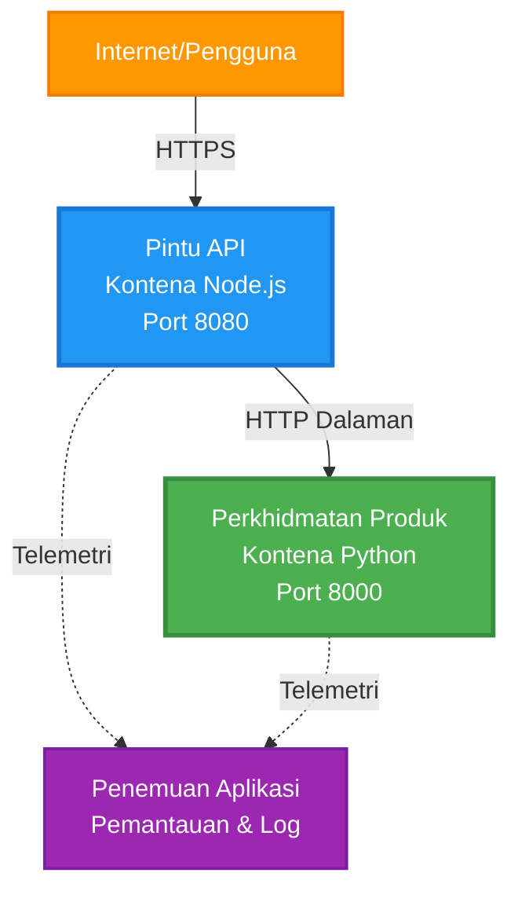
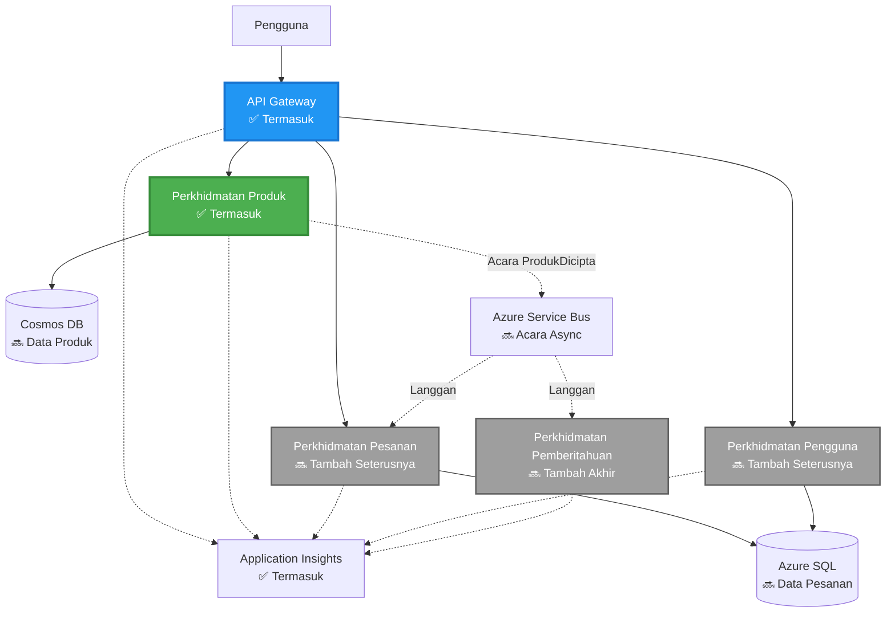
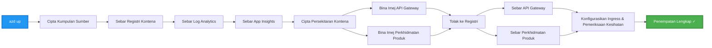
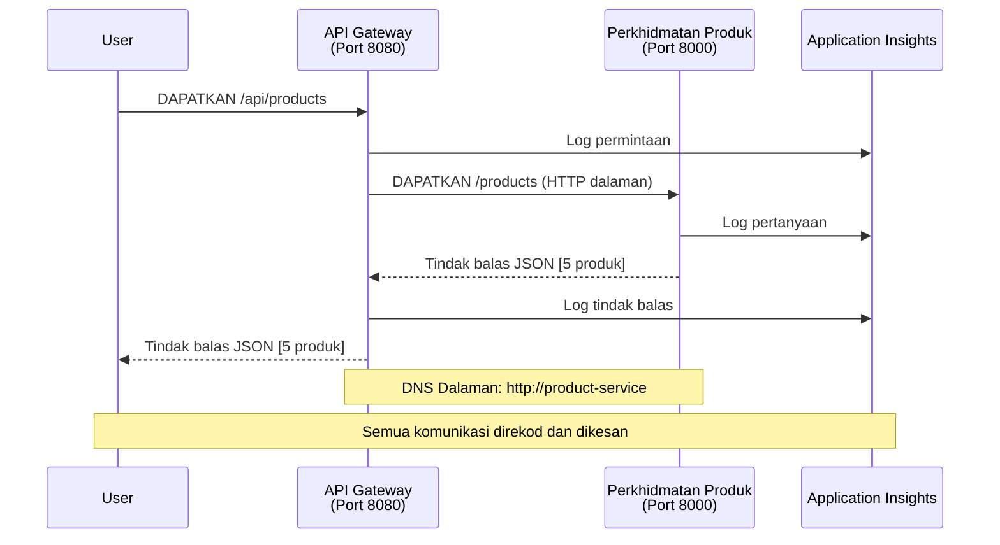

# Seni Bina Microservices - Contoh Aplikasi Bekas

⏱️ **Anggaran Masa**: 25-35 minit | 💰 **Anggaran Kos**: ~RM210-420/bulan | ⭐ **Kerumitan**: Lanjutan

**📚 Laluan Pembelajaran:**
- ← Sebelumnya: [API Flask Mudah](../../../../examples/container-app/simple-flask-api) - Asas bekas tunggal
- 🎯 **Anda Di Sini**: Seni Bina Microservices (asas 2 perkhidmatan)
- → Seterusnya: [Integrasi AI](../../../../docs/ai-foundry) - Tambah kecerdasan kepada perkhidmatan anda
- 🏠 [Kursus Utama](../../README.md)

---

Sebuah seni bina microservices yang **dipermudah tetapi berfungsi** yang dipasang ke Azure Container Apps menggunakan AZD CLI. Contoh ini mempamerkan komunikasi antara perkhidmatan, orkestrasi bekas, dan pemantauan dengan setup praktikal 2 perkhidmatan.

> **📚 Pendekatan Pembelajaran**: Contoh ini bermula dengan seni bina 2 perkhidmatan minimum (API Gateway + Perkhidmatan Backend) yang anda boleh pasang dan pelajari. Setelah menguasai asas ini, kami menyediakan panduan untuk pengembangan ekosistem microservices sepenuhnya.

## Apa Yang Akan Anda Pelajari

Dengan menyelesaikan contoh ini, anda akan:
- Memasang pelbagai bekas ke Azure Container Apps
- Melaksanakan komunikasi antara perkhidmatan dengan rangkaian dalaman
- Mengkonfigurasi skala berdasarkan persekitaran dan pemeriksaan kesihatan
- Memantau aplikasi teragih dengan Application Insights
- Memahami corak dan amalan terbaik penyebaran microservices
- Belajar pengembangan progresif dari seni bina mudah ke kompleks

## Seni Bina

### Fasa 1: Apa Yang Kita Bangunkan (Termasuk Dalam Contoh Ini)


```mermaid
graph TB
    Internet[Internet/Pengguna]
    Gateway[Pintu API<br/>Kontena Node.js<br/>Port 8080]
    Product[Perkhidmatan Produk<br/>Kontena Python<br/>Port 8000]
    AppInsights[Penemuan Aplikasi<br/>Pemantauan & Log]
    
    Internet -->|HTTPS| Gateway
    Gateway -->|HTTP Dalaman| Product
    Gateway -.->|Telemetri| AppInsights
    Product -.->|Telemetri| AppInsights
    
    style Gateway fill:#2196F3,stroke:#1976D2,stroke-width:3px,color:#fff
    style Product fill:#4CAF50,stroke:#388E3C,stroke-width:3px,color:#fff
    style Internet fill:#FF9800,stroke:#F57C00,stroke-width:2px,color:#fff
    style AppInsights fill:#9C27B0,stroke:#7B1FA2,stroke-width:2px,color:#fff
```
**Butiran Komponen:**

| Komponen | Tujuan | Akses | Sumber |
|-----------|---------|--------|-----------|
| **API Gateway** | Merutekan permintaan luaran ke perkhidmatan backend | Awam (HTTPS) | 1 vCPU, 2GB RAM, 2-20 replika |
| **Perkhidmatan Produk** | Mengurus katalog produk dengan data dalam-memori | Dalaman sahaja | 0.5 vCPU, 1GB RAM, 1-10 replika |
| **Application Insights** | Log berpusat dan pengesanan teragih | Azure Portal | 1-2 GB/bulan penyerapan data |

**Kenapa Mulakan Dengan Mudah?**
- ✅ Pasang dan fahami dengan cepat (25-35 minit)
- ✅ Belajar corak asas microservices tanpa kerumitan
- ✅ Kod berfungsi yang boleh anda ubah dan cuba eksperimen
- ✅ Kos lebih rendah untuk pembelajaran (~RM210-420/bulan berbanding RM1260-5880/bulan)
- ✅ Bina keyakinan sebelum menambah pangkalan data dan barisan mesej

**Analogi**: Anggap ini seperti belajar memandu. Anda mulakan dengan tempat letak kereta kosong (2 perkhidmatan), kuasai asas, kemudian maju ke trafik bandar (5+ perkhidmatan dengan pangkalan data).

### Fasa 2: Pengembangan Masa Depan (Seni Bina Rujukan)

Setelah menguasai seni bina 2 perkhidmatan, anda boleh mengembangkan kepada:


```mermaid
graph TB
    User[Pengguna]
    Gateway[API Gateway<br/>✅ Termasuk]
    Product[Perkhidmatan Produk<br/>✅ Termasuk]
    Order[Perkhidmatan Pesanan<br/>🔜 Tambah Seterusnya]
    UserSvc[Perkhidmatan Pengguna<br/>🔜 Tambah Seterusnya]
    Notify[Perkhidmatan Pemberitahuan<br/>🔜 Tambah Akhir]
    
    CosmosDB[(Cosmos DB<br/>🔜 Data Produk)]
    AzureSQL[(Azure SQL<br/>🔜 Data Pesanan)]
    ServiceBus[Azure Service Bus<br/>🔜 Acara Async]
    AppInsights[Application Insights<br/>✅ Termasuk]
    
    User --> Gateway
    Gateway --> Product
    Gateway --> Order
    Gateway --> UserSvc
    
    Product --> CosmosDB
    Order --> AzureSQL
    UserSvc --> AzureSQL
    
    Product -.->|Acara ProdukDicipta| ServiceBus
    ServiceBus -.->|Langgan| Notify
    ServiceBus -.->|Langgan| Order
    
    Gateway -.-> AppInsights
    Product -.-> AppInsights
    Order -.-> AppInsights
    UserSvc -.-> AppInsights
    Notify -.-> AppInsights
    
    style Product fill:#4CAF50,stroke:#388E3C,stroke-width:3px,color:#fff
    style Gateway fill:#2196F3,stroke:#1976D2,stroke-width:3px,color:#fff
    style Order fill:#9E9E9E,stroke:#616161,stroke-width:2px,color:#fff
    style UserSvc fill:#9E9E9E,stroke:#616161,stroke-width:2px,color:#fff
    style Notify fill:#9E9E9E,stroke:#616161,stroke-width:2px,color:#fff
```
Lihat bahagian "Panduan Pengembangan" di akhir untuk arahan langkah demi langkah.

## Ciri Termasuk

✅ **Penemuan Perkhidmatan**: Penemuan automatik berasaskan DNS antara bekas  
✅ **Beban Seimbang**: Beban seimbang terpasang merentasi replika  
✅ **Auto-scaling**: Skala bebas perkhidmatan berdasarkan permintaan HTTP  
✅ **Pemantauan Kesihatan**: Pemeriksaan liveness dan readiness untuk kedua perkhidmatan  
✅ **Log Teragih**: Log berpusat dengan Application Insights  
✅ **Rangkaian Dalaman**: Komunikasi perkhidmatan antara perkhidmatan yang selamat  
✅ **Orkestrasi Bekas**: Penyebaran dan penskalaan automatik  
✅ **Kemas Kini Tanpa Henti**: Kemas kini bergulung dengan pengurusan revisi  

## Prasyarat

### Alat Diperlukan

Sebelum bermula, pastikan alat-alat berikut dipasang:

1. **[Azure Developer CLI (azd)](https://learn.microsoft.com/azure/developer/azure-developer-cli/install-azd)** (versi 1.0.0 atau lebih tinggi)
   ```bash
   azd version
   # Output yang dijangkakan: versi azd 1.0.0 atau lebih tinggi
   ```

2. **[Azure CLI](https://learn.microsoft.com/cli/azure/install-azure-cli)** (versi 2.50.0 atau lebih tinggi)
   ```bash
   az --version
   # Jangkaan keluaran: azure-cli 2.50.0 atau lebih tinggi
   ```

3. **[Docker](https://www.docker.com/get-started)** (untuk pembangunan/ujian tempatan - pilihan)
   ```bash
   docker --version
   # Output yang dijangka: Versi Docker 20.10 atau lebih tinggi
   ```

### Sahkan Persediaan Anda

Jalankan arahan berikut untuk mengesahkan anda sedia:

```bash
# Semak Azure Developer CLI
azd version
# ✅ Dijangkakan: azd versi 1.0.0 atau lebih tinggi

# Semak Azure CLI
az --version
# ✅ Dijangkakan: azure-cli 2.50.0 atau lebih tinggi

# Semak Docker (pilihan)
docker --version
# ✅ Dijangkakan: versi Docker 20.10 atau lebih tinggi
```

**Kriteria Kejayaan**: Semua arahan memaparkan nombor versi yang memenuhi atau melebihi minimum.

### Keperluan Azure

- Langganan **Azure aktif** ([cipta akaun percuma](https://azure.microsoft.com/free/))
- Kebenaran untuk mencipta sumber dalam langganan anda
- Peranan **Contributor** pada langganan atau kumpulan sumber

### Prasyarat Pengetahuan

Ini adalah contoh **peringkat lanjutan**. Anda perlu:
- Menyelesaikan [contoh Simple Flask API](../../../../examples/container-app/simple-flask-api) 
- Memahami asas seni bina microservices
- Familiar dengan REST API dan HTTP
- Faham konsep bekas

**Baru dengan Container Apps?** Mulakan dengan [contoh Simple Flask API](../../../../examples/container-app/simple-flask-api) dahulu untuk belajar asas.

## Mula Cepat (Langkah demi Langkah)

### Langkah 1: Clone dan Navigasi

```bash
git clone https://github.com/microsoft/AZD-for-beginners.git
cd AZD-for-beginners/examples/microservices
```

**✓ Semak Kejayaan**: Sahkan anda nampak `azure.yaml`:
```bash
ls
# Dijangka: README.md, azure.yaml, infra/, src/
```

### Langkah 2: Log Masuk ke Azure

```bash
azd auth login
```

Ini akan membuka pelayar anda untuk pengesahan Azure. Masuk dengan kelayakan Azure anda.

**✓ Semak Kejayaan**: Anda harus lihat:
```
Logged in to Azure.
```

### Langkah 3: Inisialisasi Persekitaran

```bash
azd init
```

**Arahan yang anda akan lihat**:
- **Nama persekitaran**: Masukkan nama ringkas (contoh: `microservices-dev`)
- **Langganan Azure**: Pilih langganan anda
- **Lokasi Azure**: Pilih rantau (contoh: `eastus`, `westeurope`)

**✓ Semak Kejayaan**: Anda harus lihat:
```
SUCCESS: New project initialized!
```

### Langkah 4: Pasang Infrastruktur dan Perkhidmatan

```bash
azd up
```

**Apa yang berlaku** (ambil masa 8-12 minit):


```mermaid
graph LR
    A[azd up] --> B[Cipta Kumpulan Sumber]
    B --> C[Sebar Registri Kontena]
    C --> D[Sebar Log Analytics]
    D --> E[Sebar App Insights]
    E --> F[Cipta Persekitaran Kontena]
    F --> G[Bina Imej API Gateway]
    F --> H[Bina Imej Perkhidmatan Produk]
    G --> I[Tolak ke Registri]
    H --> I
    I --> J[Sebar API Gateway]
    I --> K[Sebar Perkhidmatan Produk]
    J --> L[Konfigurasikan Ingress & Pemeriksaan Kesihatan]
    K --> L
    L --> M[Penempatan Lengkap ✓]
    
    style A fill:#2196F3,stroke:#1976D2,stroke-width:3px,color:#fff
    style M fill:#4CAF50,stroke:#388E3C,stroke-width:3px,color:#fff
```
**✓ Semak Kejayaan**: Anda harus lihat:
```
SUCCESS: Your application was deployed to Azure in X minutes Y seconds.
Endpoint: https://api-gateway-<unique-id>.azurecontainerapps.io
```

**⏱️ Masa**: 8-12 minit

### Langkah 5: Uji Penyebaran

```bash
# Dapatkan titik akhir gateway
GATEWAY_URL=$(azd env get-values | grep API_GATEWAY_URL | cut -d '=' -f2 | tr -d '"')

# Uji kesihatan API Gateway
curl $GATEWAY_URL/health
```

**✅ Output Dijangka:**
```json
{
  "status": "healthy",
  "service": "api-gateway",
  "timestamp": "2025-11-19T10:30:00Z"
}
```

**Uji perkhidmatan produk melalui gateway**:
```bash
# Senarai produk
curl $GATEWAY_URL/api/products
```

**✅ Output Dijangka:**
```json
[
  {"id":1,"name":"Laptop","price":999.99,"stock":50},
  {"id":2,"name":"Mouse","price":29.99,"stock":200},
  {"id":3,"name":"Keyboard","price":79.99,"stock":150}
]
```

**✓ Semak Kejayaan**: Kedua-dua endpoint mengembalikan data JSON tanpa ralat.

---

**🎉 Tahniah!** Anda telah memasang seni bina microservices ke Azure!

## Struktur Projek

Semua fail pelaksanaan disertakan—ini contoh lengkap dan berfungsi:

```
microservices/
│
├── README.md                         # This file
├── azure.yaml                        # AZD configuration
├── .gitignore                        # Git ignore patterns
│
├── infra/                           # Infrastructure as Code (Bicep)
│   ├── main.bicep                   # Main orchestration
│   ├── abbreviations.json           # Naming conventions
│   ├── core/                        # Shared infrastructure
│   │   ├── container-apps-environment.bicep  # Container environment + registry
│   │   └── monitor.bicep            # Application Insights + Log Analytics
│   └── app/                         # Service definitions
│       ├── api-gateway.bicep        # API Gateway container app
│       └── product-service.bicep    # Product Service container app
│
└── src/                             # Application source code
    ├── api-gateway/                 # Node.js API Gateway
    │   ├── app.js                   # Express server with routing
    │   ├── package.json             # Node dependencies
    │   └── Dockerfile               # Container definition
    └── product-service/             # Python Product Service
        ├── main.py                  # Flask API with product data
        ├── requirements.txt         # Python dependencies
        └── Dockerfile               # Container definition
```

**Apa Fungsi Setiap Komponen:**

**Infrastruktur (infra/)**:
- `main.bicep`: Mengorkestrasi semua sumber Azure dan kebergantungan mereka
- `core/container-apps-environment.bicep`: Mencipta persekitaran Container Apps dan Azure Container Registry
- `core/monitor.bicep`: Menyediakan Application Insights untuk logging teragih
- `app/*.bicep`: Definisi aplikasi bekas individu dengan penskalaan dan pemeriksaan kesihatan

**API Gateway (src/api-gateway/)**:
- Perkhidmatan berhadapan awam yang merutekan permintaan ke perkhidmatan backend
- Melaksanakan logging, pengendalian ralat, dan pemajuan permintaan
- Mempamerkan komunikasi HTTP antara perkhidmatan

**Perkhidmatan Produk (src/product-service/)**:
- Perkhidmatan dalaman dengan katalog produk (dalam-memori untuk mudah)
- REST API dengan pemeriksaan kesihatan
- Contoh corak microservice backend

## Gambaran Keseluruhan Perkhidmatan

### API Gateway (Node.js/Express)

**Port**: 8080  
**Akses**: Awam (ingress luar)  
**Tujuan**: Merutekan permintaan masuk ke perkhidmatan backend yang sesuai  

**Endpoint**:
- `GET /` - Maklumat perkhidmatan
- `GET /health` - Endpoint pemeriksaan kesihatan
- `GET /api/products` - Terus ke perkhidmatan produk (senaraikan semua)
- `GET /api/products/:id` - Terus ke perkhidmatan produk (dapatkan mengikut ID)

**Ciri Utama**:
- Perutean permintaan dengan axios
- Logging berpusat
- Pengendalian ralat dan pengurusan timeout
- Penemuan perkhidmatan melalui pembolehubah persekitaran
- Integrasi Application Insights

**Sorotan Kod** (`src/api-gateway/app.js`):
```javascript
// Komunikasi perkhidmatan dalaman
app.get('/api/products', async (req, res) => {
  const response = await axios.get(`${PRODUCT_SERVICE_URL}/products`, {
    timeout: 5000
  });
  res.json(response.data);
});
```

### Perkhidmatan Produk (Python/Flask)

**Port**: 8000  
**Akses**: Dalaman sahaja (tiada ingress luar)  
**Tujuan**: Mengurus katalog produk dengan data dalam-memori  

**Endpoint**:
- `GET /` - Maklumat perkhidmatan
- `GET /health` - Endpoint pemeriksaan kesihatan
- `GET /products` - Senaraikan semua produk
- `GET /products/<id>` - Dapatkan produk mengikut ID

**Ciri Utama**:
- API RESTful dengan Flask
- Penyimpanan produk dalam memori (mudah, tiada pangkalan data)
- Pemantauan kesihatan dengan probes
- Logging berstruktur
- Integrasi Application Insights

**Model Data**:
```python
{
  "id": 1,
  "name": "Laptop",
  "description": "High-performance laptop",
  "price": 999.99,
  "stock": 50
}
```

**Kenapa Dalaman Sahaja?**
Perkhidmatan produk tidak didedahkan secara umum. Semua permintaan mesti melalui API Gateway, yang menyediakan:
- Keselamatan: Titik akses terkawal
- Fleksibiliti: Boleh ubah backend tanpa menjejaskan klien
- Pemantauan: Logging permintaan berpusat

## Memahami Komunikasi Antara Perkhidmatan

### Bagaimana Perkhidmatan Berkomunikasi


```mermaid
sequenceDiagram
    participant User
    participant Gateway as API Gateway<br/>(Port 8080)
    participant Product as Perkhidmatan Produk<br/>(Port 8000)
    participant AI as Application Insights
    
    User->>Gateway: DAPATKAN /api/products
    Gateway->>AI: Log permintaan
    Gateway->>Product: DAPATKAN /products (HTTP dalaman)
    Product->>AI: Log pertanyaan
    Product-->>Gateway: Tindak balas JSON [5 produk]
    Gateway->>AI: Log tindak balas
    Gateway-->>User: Tindak balas JSON [5 produk]
    
    Note over Gateway,Product: DNS Dalaman: http://product-service
    Note over User,AI: Semua komunikasi direkod dan dikesan
```
Dalam contoh ini, API Gateway berkomunikasi dengan Perkhidmatan Produk menggunakan **panggilan HTTP dalaman**:

```javascript
// Pintu Gerbang API (src/api-gateway/app.js)
const PRODUCT_SERVICE_URL = process.env.PRODUCT_SERVICE_URL;

// Buat permintaan HTTP dalaman
const response = await axios.get(`${PRODUCT_SERVICE_URL}/products`);
```

**Perkara Penting**:

1. **Penemuan Berasaskan DNS**: Container Apps secara automatik menyediakan DNS untuk perkhidmatan dalaman
   - FQDN Perkhidmatan Produk: `product-service.internal.<environment>.azurecontainerapps.io`
   - Dipermudahkan sebagai: `http://product-service` (Container Apps menyelesaikannya)

2. **Tiada Pendedahan Awam**: Perkhidmatan Produk mempunyai `external: false` dalam Bicep
   - Hanya boleh diakses dalam persekitaran Container Apps
   - Tidak boleh dicapai dari internet

3. **Pembolehubah Persekitaran**: URL perkhidmatan disuntik pada masa penyebaran
   - Bicep menghantar FQDN dalaman ke gateway
   - Tiada URL keras dalam kod aplikasi

**Analogi**: Anggap ini seperti bilik pejabat. API Gateway adalah kaunter penerimaan (berhadapan awam), dan Perkhidmatan Produk adalah bilik pejabat (hanya dalaman). Pelawat mesti melalui kaunter untuk sampai ke mana-mana bilik pejabat.

## Pilihan Penyebaran

### Penyebaran Penuh (Disyorkan)

```bash
# Menyebarkan infrastruktur dan kedua-dua perkhidmatan
azd up
```

Ini memasang:
1. Persekitaran Container Apps
2. Application Insights
3. Container Registry
4. Bekas API Gateway
5. Bekas Perkhidmatan Produk

**Masa**: 8-12 minit

### Pasang Perkhidmatan Individu

```bash
# Hanya terapkan satu perkhidmatan (selepas azd up awal)
azd deploy api-gateway

# Atau terapkan perkhidmatan produk
azd deploy product-service
```

**Kes Penggunaan**: Apabila anda mengemaskini kod dalam satu perkhidmatan dan mahu pasang semula hanya perkhidmatan itu.

### Kemas Kini Konfigurasi

```bash
# Tukar parameter penyesuaian
azd env set GATEWAY_MAX_REPLICAS 30

# Kedar semula dengan konfigurasi baru
azd up
```

## Konfigurasi

### Konfigurasi Penskalaan

Kedua-dua perkhidmatan dikonfigurasikan dengan auto-scaling berasaskan HTTP dalam fail Bicep mereka:

**API Gateway**:
- Minimum replika: 2 (sentiasa minimum 2 untuk ketersediaan)
- Maksimum replika: 20
- Pencetus skala: 50 permintaan serentak setiap replika

**Perkhidmatan Produk**:
- Minimum replika: 1 (boleh skala ke sifar jika perlu)
- Maksimum replika: 10
- Pencetus skala: 100 permintaan serentak setiap replika

**Sesuaikan Penskalaan** (dalam `infra/app/*.bicep`):
```bicep
scale: {
  minReplicas: 1
  maxReplicas: 10
  rules: [
    {
      name: 'http-scale-rule'
      http: {
        metadata: {
          concurrentRequests: '100'  // Adjust this
        }
      }
    }
  ]
}
```

### Peruntukan Sumber

**API Gateway**:
- CPU: 1.0 vCPU
- Memori: 2 GiB
- Sebab: Mengendalikan semua trafik luaran

**Perkhidmatan Produk**:
- CPU: 0.5 vCPU
- Memori: 1 GiB
- Sebab: Operasi dalam-memori ringan

### Pemeriksaan Kesihatan

Kedua-dua perkhidmatan termasuk probes liveness dan readiness:

```bicep
probes: [
  {
    type: 'Liveness'
    httpGet: {
      path: '/health'
      port: 8080
    }
    initialDelaySeconds: 10
    periodSeconds: 30
  }
  {
    type: 'Readiness'
    httpGet: {
      path: '/health'
      port: 8080
    }
    initialDelaySeconds: 5
    periodSeconds: 10
  }
]
```

**Apa Maksud Ini**:
- **Liveness**: Jika pemeriksaan kesihatan gagal, Container Apps memulakan semula bekas
- **Readiness**: Jika tidak sedia, Container Apps menghentikan perutean trafik ke replika itu

## Pemantauan & Kebolehlihatan

### Lihat Log Perkhidmatan

```bash
# Lihat log menggunakan azd monitor
azd monitor --logs

# Atau guna Azure CLI untuk Aplikasi Kontena tertentu:
# Alirkan log dari API Gateway
az containerapp logs show --name api-gateway --resource-group $RG_NAME --follow

# Lihat log perkhidmatan produk terkini
az containerapp logs show --name product-service --resource-group $RG_NAME --tail 100
```

**Output Dijangka**:
```
[api-gateway] API Gateway listening on port 8080
[api-gateway] Product Service URL: http://product-service
[api-gateway] GET /api/products 200 - 45ms
[product-service] Retrieved 5 products
```

### Pertanyaan Application Insights

Akses Application Insights dalam Azure Portal, kemudian jalankan pertanyaan berikut:

**Cari Permintaan Perlahan**:
```kusto
requests
| where timestamp > ago(1h)
| where duration > 1000  // Requests taking >1 second
| summarize count() by name, cloud_RoleName
| order by count_ desc
```

**Jejak Panggilan Antara Perkhidmatan**:
```kusto
dependencies
| where timestamp > ago(1h)
| where type == "Http"
| project timestamp, name, target, duration, success
| order by timestamp desc
```

**Kadar Ralat Mengikut Perkhidmatan**:
```kusto
exceptions
| where timestamp > ago(24h)
| summarize errorCount = count() by cloud_RoleName, type
| order by errorCount desc
```

**Isipadu Permintaan Mengikut Masa**:
```kusto
requests
| where timestamp > ago(1h)
| summarize requestCount = count() by bin(timestamp, 5m), cloud_RoleName
| render timechart
```

### Akses Papan Pemuka Pemantauan

```bash
# Dapatkan butiran Application Insights
azd env get-values | grep APPLICATIONINSIGHTS

# Buka pemantauan Azure Portal
az monitor app-insights component show \
  --app $(azd env get-values | grep APPLICATIONINSIGHTS_CONNECTION_STRING | cut -d '=' -f2) \
  --resource-group $(azd env get-values | grep AZURE_RESOURCE_GROUP | cut -d '=' -f2) \
  --query "appId" -o tsv
```

### Metrik Masa Nyata

1. Pergi ke Application Insights di Azure Portal
2. Klik "Live Metrics"
3. Lihat permintaan, kegagalan, dan prestasi masa nyata
4. Uji dengan menjalankan: `curl $(azd env get-values | grep API_GATEWAY_URL | cut -d '=' -f2 | tr -d '"')/api/products`

## Latihan Praktikal

### Latihan 1: Tambah Endpoint Produk Baru ⭐ (Mudah)

**Matlamat**: Tambah endpoint POST untuk mencipta produk baru

**Titik Mula**: `src/product-service/main.py`

**Langkah**:

1. Tambah endpoint ini selepas fungsi `get_product` dalam `main.py`:

```python
@app.route('/products', methods=['POST'])
def create_product():
    """Create a new product"""
    data = request.get_json()
    
    # Sahkan medan yang diperlukan
    if not data or 'name' not in data or 'price' not in data:
        return jsonify({'error': 'Missing required fields: name, price'}), 400
    
    new_id = max(p['id'] for p in products) + 1
    new_product = {
        'id': new_id,
        'name': data['name'],
        'description': data.get('description', ''),
        'price': float(data['price']),
        'stock': int(data.get('stock', 0))
    }
    products.append(new_product)
    logger.info(f"Created product {new_id}")
    return jsonify(new_product), 201
```

2. Tambah laluan POST ke API Gateway (`src/api-gateway/app.js`):

```javascript
// Tambahkan ini selepas laluan GET /api/products
app.post('/api/products', async (req, res) => {
  try {
    console.log(`Forwarding POST request to ${PRODUCT_SERVICE_URL}/products`);
    const response = await axios.post(`${PRODUCT_SERVICE_URL}/products`, req.body, {
      timeout: 5000
    });
    res.status(201).json(response.data);
  } catch (error) {
    console.error('Error calling product service:', error.message);
    res.status(503).json({
      error: 'Product service unavailable',
      message: error.message
    });
  }
});
```

3. Susun semula kedua-dua perkhidmatan:

```bash
azd deploy product-service
azd deploy api-gateway
```

4. Uji titik akhir baru:

```bash
GATEWAY_URL=$(azd env get-values | grep API_GATEWAY_URL | cut -d '=' -f2 | tr -d '"')

# Cipta produk baru
curl -X POST $GATEWAY_URL/api/products \
  -H "Content-Type: application/json" \
  -d '{"name":"USB Cable","price":9.99,"stock":500}'
```

**✅ Output dijangka:**
```json
{"id":6,"name":"USB Cable","description":"","price":9.99,"stock":500}
```

5. Sahkan ia muncul dalam senarai:

```bash
curl $GATEWAY_URL/api/products
# Sekarang harus menunjukkan 6 produk termasuk Kabel USB baru
```

**Kriteria Kejayaan**:
- ✅ Permintaan POST mengembalikan HTTP 201
- ✅ Produk baru muncul dalam senarai GET /api/products
- ✅ Produk mempunyai ID yang auto-berkembang

**Masa**: 10-15 minit

---

### Latihan 2: Ubah Peraturan Autoskala ⭐⭐ (Sederhana)

**Matlamat**: Tukar Perkhidmatan Produk supaya skala lebih agresif

**Titik Mula**: `infra/app/product-service.bicep`

**Langkah**:

1. Buka `infra/app/product-service.bicep` dan cari blok `scale` (sekitar baris 95)

2. Tukar daripada:
```bicep
scale: {
  minReplicas: 1
  maxReplicas: 10
  rules: [
    {
      name: 'http-scale-rule'
      http: {
        metadata: {
          concurrentRequests: '100'  // OLD
        }
      }
    }
  ]
}
```

Kepada:
```bicep
scale: {
  minReplicas: 2  // Always have 2 running
  maxReplicas: 20  // Allow more scaling
  rules: [
    {
      name: 'http-scale-rule'
      http: {
        metadata: {
          concurrentRequests: '20'  // Scale at lower threshold
        }
      }
    }
  ]
}
```

3. Susun semula infrastruktur:

```bash
azd up
```

4. Sahkan konfigurasi skala baru:

```bash
az containerapp show \
  --name $(azd env get-values | grep PRODUCT_SERVICE | head -1 | cut -d '/' -f5) \
  --resource-group $(azd env get-values | grep AZURE_RESOURCE_GROUP | cut -d '=' -f2 | tr -d '"') \
  --query "properties.template.scale" -o json
```

**✅ Output dijangka:**
```json
{
  "minReplicas": 2,
  "maxReplicas": 20,
  "rules": [...]
}
```

5. Uji autoskala dengan beban:

```bash
# Jana permintaan serentak
for i in {1..500}; do curl $GATEWAY_URL/api/products & done

# Saksikan penskalaan berlaku menggunakan Azure CLI
az containerapp logs show --name product-service --resource-group $RG_NAME --follow
# Cari untuk: acara penskalaan Container Apps
```

**Kriteria Kejayaan**:
- ✅ Perkhidmatan Produk sentiasa menjalankan sekurang-kurangnya 2 replika
- ✅ Di bawah beban, skala kepada lebih daripada 2 replika
- ✅ Azure Portal menunjukkan peraturan skala baru

**Masa**: 15-20 minit

---

### Latihan 3: Tambah Pertanyaan Pemantauan Tersuai ⭐⭐ (Sederhana)

**Matlamat**: Cipta pertanyaan tersuai Application Insights untuk mengesan prestasi API produk

**Langkah**:

1. Pergi ke Application Insights di Azure Portal:
   - Pergi ke Azure Portal
   - Cari kumpulan sumber anda (rg-microservices-*)
   - Klik pada sumber Application Insights

2. Klik "Logs" di menu kiri

3. Cipta pertanyaan ini:

```kusto
requests
| where timestamp > ago(1h)
| where name contains "products"
| summarize 
    RequestCount = count(),
    AvgDuration = avg(duration),
    P95Duration = percentile(duration, 95),
    SuccessRate = 100.0 * countif(success == true) / count()
  by bin(timestamp, 5m)
| render timechart
```

4. Klik "Run" untuk jalankan pertanyaan

5. Simpan pertanyaan:
   - Klik "Save"
   - Nama: "Prestasi API Produk"
   - Kategori: "Prestasi"

6. Jana trafik ujian:

```bash
for i in {1..100}; do curl $GATEWAY_URL/api/products; sleep 1; done
```

7. Segarkan pertanyaan untuk melihat data

**✅ Output dijangka:**
- Carta yang menunjukkan bilangan permintaan sepanjang masa
- Purata tempoh < 500ms
- Kadar kejayaan = 100%
- Kumpulan masa 5 minit

**Kriteria Kejayaan**:
- ✅ Pertanyaan menunjukkan 100+ permintaan
- ✅ Kadar kejayaan ialah 100%
- ✅ Purata tempoh < 500ms
- ✅ Carta memaparkan kumpulan masa 5 minit

**Hasil Pembelajaran**: Fahami cara memantau prestasi perkhidmatan dengan pertanyaan tersuai

**Masa**: 10-15 minit

---

### Latihan 4: Laksanakan Logik Cuba Semula ⭐⭐⭐ (Lanjutan)

**Matlamat**: Tambah logik cuba semula pada API Gateway apabila Perkhidmatan Produk tidak tersedia sementara

**Titik Mula**: `src/api-gateway/app.js`

**Langkah**:

1. Pasang perpustakaan cuba semula:

```bash
cd src/api-gateway
npm install axios-retry --save
cd ../..
```

2. Kemas kini `src/api-gateway/app.js` (tambah selepas import axios):

```javascript
const axiosRetry = require('axios-retry');

// Konfigurasikan logik cuba semula
axiosRetry(axios, {
  retries: 3,
  retryDelay: (retryCount) => {
    return retryCount * 1000; // 1s, 2s, 3s
  },
  retryCondition: (error) => {
    // Cuba semula jika berlaku ralat rangkaian atau respons 5xx
    return axiosRetry.isNetworkOrIdempotentRequestError(error) ||
           (error.response && error.response.status >= 500);
  }
});

console.log('Retry logic configured: 3 retries with exponential backoff');
```

3. Susun semula API Gateway:

```bash
azd deploy api-gateway
```

4. Uji tingkah laku cuba semula dengan mensimulasikan kegagalan perkhidmatan:

```bash
# Skala perkhidmatan produk ke 0 (sintesis kegagalan)
az containerapp update \
  --name $(azd env get-values | grep PRODUCT_SERVICE | head -1 | cut -d '/' -f5) \
  --resource-group $(azd env get-values | grep AZURE_RESOURCE_GROUP | cut -d '=' -f2 | tr -d '"') \
  --min-replicas 0 \
  --max-replicas 0

# Cuba akses produk (akan cuba semula 3 kali)
time curl -v $GATEWAY_URL/api/products
# Perhatikan: Respons mengambil masa ~6 saat (1s + 2s + 3s cuba semula)

# Pulihkan perkhidmatan produk
az containerapp update \
  --name $(azd env get-values | grep PRODUCT_SERVICE | head -1 | cut -d '/' -f5) \
  --resource-group $(azd env get-values | grep AZURE_RESOURCE_GROUP | cut -d '=' -f2 | tr -d '"') \
  --min-replicas 1 \
  --max-replicas 10
```

5. Lihat log cuba semula:

```bash
az containerapp logs show --name api-gateway --resource-group $RG_NAME --tail 50
# Cari: Mesej cubaan semula gagal
```

**✅ Tingkah laku dijangka:**
- Permintaan cuba semula 3 kali sebelum gagal
- Setiap cuba semula menunggu lebih lama (1s, 2s, 3s)
- Permintaan berjaya selepas perkhidmatan dimulakan semula
- Log menunjukkan percubaan cuba semula

**Kriteria Kejayaan**:
- ✅ Permintaan cuba semula 3 kali sebelum gagal
- ✅ Setiap cuba semula menunggu lebih lama (penangguhan eksponen)
- ✅ Permintaan berjaya selepas perkhidmatan dimulakan semula
- ✅ Log menunjukkan percubaan cuba semula

**Hasil Pembelajaran**: Fahami corak ketahanan dalam mikroservis (pemutus litar, cuba semula, tamat masa)

**Masa**: 20-25 minit

---

## Titik Semak Pengetahuan

Selepas melengkapkan contoh ini, sahkan pemahaman anda:

### 1. Komunikasi Perkhidmatan ✓

Uji pengetahuan anda:
- [ ] Bolehkah anda terangkan bagaimana API Gateway menemui Perkhidmatan Produk? (penemuan perkhidmatan berasaskan DNS)
- [ ] Apa yang berlaku jika Perkhidmatan Produk tidak berfungsi? (Gateway mengembalikan ralat 503)
- [ ] Bagaimana anda menambah perkhidmatan ketiga? (Cipta fail Bicep baru, tambah ke main.bicep, cipta folder src)

**Pengesahan Praktikal:**
```bash
# Menyimulasikan kegagalan perkhidmatan
az containerapp update --name <product-service-name> --min-replicas 0 --max-replicas 0
curl $GATEWAY_URL/api/products
# ✅ Dijangka: 503 Perkhidmatan Tidak Tersedia

# Mengembalikan perkhidmatan
az containerapp update --name <product-service-name> --min-replicas 1 --max-replicas 10
```

### 2. Pemantauan & Kebolehlihatan ✓

Uji pengetahuan anda:
- [ ] Di mana anda melihat log diedarkan? (Application Insights di Azure Portal)
- [ ] Bagaimana anda mengesan permintaan perlahan? (Pertanyaan Kusto: `requests | where duration > 1000`)
- [ ] Bolehkah anda kenal pasti perkhidmatan yang menyebabkan ralat? (Semak medan `cloud_RoleName` dalam log)

**Pengesahan Praktikal:**
```bash
# Hasilkan simulasi permintaan perlahan
curl "$GATEWAY_URL/api/products?delay=2000"

# Kuiri Application Insights untuk permintaan perlahan
# Navigasi ke Azure Portal → Application Insights → Logs
# Jalankan: requests | where duration > 1000 | project timestamp, name, duration, cloud_RoleName
```

### 3. Skala & Prestasi ✓

Uji pengetahuan anda:
- [ ] Apakah yang mencetuskan autoskala? (Peraturan permintaan serentak HTTP: 50 untuk gateway, 100 untuk produk)
- [ ] Berapa banyak replika sedang berjalan sekarang? (Semak dengan `az containerapp revision list`)
- [ ] Bagaimana anda skala Perkhidmatan Produk ke 5 replika? (Kemas kini minReplicas dalam Bicep)

**Pengesahan Praktikal:**
```bash
# Hasilkan beban untuk menguji pengskalaan automatik
for i in {1..1000}; do curl $GATEWAY_URL/api/products & done

# Pantau peningkatan replika menggunakan Azure CLI
az containerapp logs show --name api-gateway --resource-group $RG_NAME --follow
# ✅ Dijangka: Lihat peristiwa penskalaan dalam log
```

**Kriteria Kejayaan**: Anda boleh menjawab semua soalan dan mengesahkan dengan arahan praktikal.

---

## Analisis Kos

### Anggaran Kos Bulanan (Untuk Contoh 2-Perkhidmatan Ini)

| Sumber | Konfigurasi | Anggaran Kos |
|----------|--------------|--------------|
| API Gateway | 2-20 replika, 1 vCPU, 2GB RAM | $30-150 |
| Perkhidmatan Produk | 1-10 replika, 0.5 vCPU, 1GB RAM | $15-75 |
| Container Registry | Tahap asas | $5 |
| Application Insights | 1-2 GB/bulan | $5-10 |
| Log Analytics | 1 GB/bulan | $3 |
| **Jumlah** | | **$58-243/bulan** |

### Pecahan Kos Mengikut Penggunaan

**Trafik ringan** (ujian/pembelajaran): ~ $60/bulan
- API Gateway: 2 replika × 24/7 = $30
- Perkhidmatan Produk: 1 replika × 24/7 = $15
- Pemantauan + Registry = $13

**Trafik sederhana** (pengeluaran kecil): ~ $120/bulan
- API Gateway: 5 replika purata = $75
- Perkhidmatan Produk: 3 replika purata = $45
- Pemantauan + Registry = $13

**Trafik tinggi** (tempoh sibuk): ~ $240/bulan
- API Gateway: 15 replika purata = $225
- Perkhidmatan Produk: 8 replika purata = $120
- Pemantauan + Registry = $13

### Petua Pengoptimuman Kos

1. **Skala ke Kosong untuk Pembangunan**:
   ```bicep
   scale: {
     minReplicas: 0  // Save $30-40/month when not in use
     maxReplicas: 10
   }
   ```

2. **Gunakan Pelan Penggunaan untuk Cosmos DB** (apabila anda menambahkannya):
   - Bayar hanya untuk apa yang anda gunakan
   - Tiada caj minimum

3. **Tetapkan Sampling Application Insights**:
   ```javascript
   appInsights.defaultClient.config.samplingPercentage = 50; // Contoh 50% daripada permintaan
   ```

4. **Bersihkan Apabila Tidak Diperlukan**:
   ```bash
   azd down --force --purge
   ```

### Pilihan Tahap Percuma

Untuk pembelajaran/ujian, pertimbangkan:
- ✅ Gunakan kredit percuma Azure ($200 untuk 30 hari pertama dengan akaun baru)
- ✅ Kekalkan kepada replika minimum (menjimatkan ~50% kos)
- ✅ Padam selepas ujian (tiada caj berterusan)
- ✅ Skala ke kosong antara sesi pembelajaran

**Contoh**: Menjalankan contoh ini 2 jam/hari × 30 hari = ~ $5/bulan berbanding $60/bulan

---

## Rujukan Pantas Penyelesaian Masalah

### Masalah: `azd up` gagal dengan "Subscription not found"

**Penyelesaian**:
```bash
# Log masuk semula dengan langganan secara eksplisit
az account set --subscription <your-subscription-id>
azd env set AZURE_SUBSCRIPTION_ID <your-subscription-id>
azd up
```

### Masalah: API Gateway mengembalikan 503 "Perkhidmatan produk tidak tersedia"

**Diagnosa**:
```bash
# Semak log perkhidmatan produk menggunakan Azure CLI
az containerapp logs show --name product-service --resource-group $RG_NAME --tail 50

# Semak kesihatan perkhidmatan produk
az containerapp show \
  --name $(azd env get-values | grep PRODUCT_SERVICE | head -1 | cut -d '/' -f5) \
  --resource-group $(azd env get-values | grep AZURE_RESOURCE_GROUP | cut -d '=' -f2 | tr -d '"') \
  --query "properties.runningStatus"
```

**Punca Biasa**:
1. Perkhidmatan produk tidak bermula (semak log untuk ralat Python)
2. Pemeriksaan kesihatan gagal (sah `/health` berfungsi)
3. Pembinaan imej container gagal (semak registry untuk imej)

### Masalah: Autoskala tidak berfungsi

**Diagnosa**:
```bash
# Semak kiraan replika semasa
az containerapp revision list \
  --name $(azd env get-values | grep API_GATEWAY | head -1 | cut -d '/' -f5) \
  --resource-group $(azd env get-values | grep AZURE_RESOURCE_GROUP | cut -d '=' -f2 | tr -d '"') \
  --query "[].properties.replicas"

# Jana beban untuk ujian
for i in {1..1000}; do curl $GATEWAY_URL/api/products & done

# Pantau acara penalaan menggunakan Azure CLI
az containerapp logs show --name api-gateway --resource-group $RG_NAME --follow | grep -i scale
```

**Punca Biasa**:
1. Beban tidak cukup tinggi untuk mencetuskan peraturan skala (perlu >50 permintaan serentak)
2. Replika maksimum sudah dicapai (semak konfigurasi Bicep)
3. Peraturan skala salah konfigurasi dalam Bicep (sahkan nilai concurrentRequests)

### Masalah: Application Insights tidak memaparkan log

**Diagnosa**:
```bash
# Sahkan rentetan sambungan ditetapkan
azd env get-values | grep APPLICATIONINSIGHTS

# Periksa jika perkhidmatan menghantar telemetri
az monitor app-insights component show \
  --app $(azd env get-values | grep APPLICATIONINSIGHTS_NAME | cut -d '=' -f2 | tr -d '"') \
  --resource-group $(azd env get-values | grep AZURE_RESOURCE_GROUP | cut -d '=' -f2 | tr -d '"') \
  --query "properties.InstrumentationKey"
```

**Punca Biasa**:
1. Rentetan sambungan tidak diserahkan kepada container (semak pembolehubah persekitaran)
2. SDK Application Insights tidak dikonfigurasikan (sahkan import dalam kod)
3. Firewall menghalang telemetri (jarang, semak peraturan rangkaian)

### Masalah: Docker build gagal secara tempatan

**Diagnosa**:
```bash
# Ujian binaan API Gateway
cd src/api-gateway
docker build -t test-gateway .

# Ujian binaan Perkhidmatan Produk
cd ../product-service
docker build -t test-product .
```

**Punca Biasa**:
1. Kekurangan kebergantungan dalam package.json/requirements.txt
2. Ralat sintaks Dockerfile
3. Masalah rangkaian memuat turun kebergantungan

**Masih Tersangkut?** Lihat [Panduan Isu Biasa](../../docs/chapter-07-troubleshooting/common-issues.md) atau [Penyelesaian Masalah Azure Container Apps](https://learn.microsoft.com/azure/container-apps/troubleshooting)

---

## Pembersihan

Untuk mengelakkan caj berterusan, padam semua sumber:

```bash
azd down --force --purge
```

**Prompt Pengesahan**:
```
? Total resources to delete: 6, are you sure you want to continue? (y/N)
```

Taip `y` untuk sahkan.

**Apa Yang Dipadam**:
- Persekitaran Container Apps
- Kedua-dua Container Apps (gateway & perkhidmatan produk)
- Container Registry
- Application Insights
- Log Analytics Workspace
- Kumpulan Sumber

**✓ Sahkan Pembersihan**:
```bash
az group list --query "[?starts_with(name,'rg-microservices')]" --output table
```

Patut mengembalikan kosong.

---

## Panduan Perluasan: Dari 2 ke 5+ Perkhidmatan

Setelah anda menguasai seni bina 2-perkhidmatan ini, berikut cara mengembangkannya:

### Fasa 1: Tambah Penyimpanan Pangkalan Data (Langkah Seterusnya)

**Tambah Cosmos DB untuk Perkhidmatan Produk**:

1. Cipta `infra/core/cosmos.bicep`:
   ```bicep
   resource cosmosAccount 'Microsoft.DocumentDB/databaseAccounts@2023-04-15' = {
     name: name
     location: location
     kind: 'GlobalDocumentDB'
     properties: {
       databaseAccountOfferType: 'Standard'
       consistencyPolicy: { defaultConsistencyLevel: 'Session' }
       locations: [{ locationName: location, failoverPriority: 0 }]
     }
   }
   ```

2. Kemas kini perkhidmatan produk untuk menggunakan Azure Cosmos DB Python SDK dan bukannya data dalam memori

3. Anggaran kos tambahan: ~ $25/bulan (serverless)

### Fasa 2: Tambah Perkhidmatan Ketiga (Pengurusan Pesanan)

**Cipta Perkhidmatan Pesanan**:

1. Folder baru: `src/order-service/` (Python/Node.js/C#)
2. Bicep baru: `infra/app/order-service.bicep`
3. Kemas kini API Gateway untuk laluan `/api/orders`
4. Tambah Azure SQL Database untuk penyimpanan pesanan

**Seni bina menjadi**:
```
API Gateway → Product Service (Cosmos DB)
           → Order Service (Azure SQL)
```

### Fasa 3: Tambah Komunikasi Async (Service Bus)

**Laksanakan Seni Bina Berasaskan Acara**:

1. Tambah Azure Service Bus: `infra/core/servicebus.bicep`
2. Perkhidmatan Produk menerbitkan acara "ProductCreated"
3. Perkhidmatan Pesanan melanggan acara produk
4. Tambah Perkhidmatan Pemberitahuan untuk memproses acara

**Corak**: Permintaan/Respons (HTTP) + Berasaskan Acara (Service Bus)

### Fasa 4: Tambah Pengesahan Pengguna

**Laksanakan Perkhidmatan Pengguna**:

1. Cipta `src/user-service/` (Go/Node.js)
2. Tambah Azure AD B2C atau pengesahan JWT tersuai
3. API Gateway mengesahkan token sebelum laluan
4. Perkhidmatan menyemak kebenaran pengguna

### Fasa 5: Kesediaan Pengeluaran

**Tambah Komponen Ini**:
- ✅ Azure Front Door (imbangan beban global)
- ✅ Azure Key Vault (pengurusan rahsia)
- ✅ Azure Monitor Workbooks (papan pemuka tersuai)
- ✅ Paip CI/CD (GitHub Actions)
- ✅ Pengeluaran Biru-Hijau
- ✅ Identiti Terkawal untuk semua perkhidmatan

**Kos Seni Bina Penuh Pengeluaran**: ~ $300-1,400/bulan

---

## Ketahui Lebih Lanjut

### Dokumentasi Berkaitan
- [Dokumentasi Azure Container Apps](https://learn.microsoft.com/azure/container-apps/)
- [Panduan Seni Bina Mikroservis](https://learn.microsoft.com/azure/architecture/guide/architecture-styles/microservices)
- [Application Insights untuk Jejakan Teragih](https://learn.microsoft.com/azure/azure-monitor/app/distributed-tracing)
- [Dokumentasi Azure Developer CLI](https://learn.microsoft.com/azure/developer/azure-developer-cli/)

### Langkah Seterusnya Dalam Kursus Ini
- ← Sebelumnya: [API Flask Mudah](../../../../examples/container-app/simple-flask-api) - Contoh mudah dengan satu container
- → Seterusnya: [Panduan Integrasi AI](../../../../docs/ai-foundry) - Tambah keupayaan AI
- 🏠 [Laman Utama Kursus](../../README.md)

### Perbandingan: Bila Menggunakan Apa

| Ciri | Single Container | Mikroservis (Ini) | Kubernetes (AKS) |
|---------|-----------------|---------------------|------------------|
| **Kes Penggunaan** | Aplikasi mudah | Aplikasi kompleks | Aplikasi perusahaan |
| **Skalabiliti** | Perkhidmatan tunggal | Skala per perkhidmatan | Fleksibiliti maksimum |
| **Kerumitan** | Rendah | Sederhana | Tinggi |
| **Saiz Pasukan** | 1-3 pembangun | 3-10 pembangun | 10+ pembangun |
| **Kos** | ~ $15-50/bulan | ~ $60-250/bulan | ~ $150-500/bulan |
| **Masa Penyebaran** | 5-10 minit | 8-12 minit | 15-30 minit |
| **Terbaik Untuk** | MVP, prototaip | Aplikasi pengeluaran | Multi-cloud, rangkaian lanjutan |

**Cadangan**: Mula dengan Container Apps (contoh ini), beralih ke AKS hanya jika anda memerlukan ciri khusus Kubernetes.

---

## Soalan Lazim

**S: Mengapa hanya 2 perkhidmatan dan bukan 5+?**  
J: Progres pendidikan. Kuasai asas (komunikasi perkhidmatan, pemantauan, penskalaan) dengan contoh mudah sebelum menambah kerumitan. Corak yang anda pelajari di sini digunakan untuk seni bina 100 perkhidmatan.

**S: Bolehkah saya tambah lebih banyak perkhidmatan sendiri?**  
J: Sudah tentu! Ikuti panduan pengembangan di atas. Setiap perkhidmatan baru mengikuti corak yang sama: buat folder src, buat fail Bicep, kemas kini azure.yaml, lancarkan.

**S: Adakah ini sedia untuk pengeluaran?**  
J: Ia asas yang kukuh. Untuk pengeluaran, tambah: identiti terurus, Key Vault, pangkalan data persistens, saluran CI/CD, amaran pemantauan, dan strategi sandaran.

**S: Mengapa tidak gunakan Dapr atau mesh perkhidmatan lain?**  
J: Kekalkan mudah untuk pembelajaran. Setelah anda faham rangkaian Container Apps asli, anda boleh tambah Dapr untuk senario lanjutan (pengurusan keadaan, pub/sub, bindings).

**S: Bagaimana saya debug secara lokal?**  
J: Jalankan perkhidmatan secara lokal dengan Docker:  
```bash
cd src/api-gateway
docker build -t local-gateway .
docker run -p 8080:8080 -e PRODUCT_SERVICE_URL=http://localhost:8000 local-gateway
```
  
**S: Bolehkah saya menggunakan bahasa pengaturcaraan berbeza?**  
J: Ya! Contoh ini menunjukkan Node.js (pintu masuk) + Python (perkhidmatan produk). Anda boleh gabungkan mana-mana bahasa yang berjalan dalam kontena: C#, Go, Java, Ruby, PHP, dan lain-lain.

**S: Bagaimana jika saya tidak ada kredit Azure?**  
J: Gunakan lapisan percuma Azure (30 hari pertama dengan akaun baru dapat kredit $200) atau lancarkan untuk tempoh ujian pendek dan padam segera. Contoh ini kos ~$2/hari.

**S: Apa bezanya dengan Azure Kubernetes Service (AKS)?**  
J: Container Apps lebih mudah (tidak perlu tahu Kubernetes) tetapi kurang fleksibel. AKS beri kawalan penuh Kubernetes tapi perlukan kepakaran lebih. Mula dengan Container Apps, beralih ke AKS jika perlu.

**S: Bolehkah saya guna ini dengan perkhidmatan Azure sedia ada?**  
J: Ya! Anda boleh sambung ke pangkalan data sedia ada, akaun storan, Service Bus, dan lain-lain. Kemas kini fail Bicep untuk rujuk sumber sedia ada, tidak buat baru.

---

> **🎓 Ringkasan Laluan Pembelajaran**: Anda telah belajar melancarkan seni bina multi-perkhidmatan dengan penskalaan automatik, rangkaian dalaman, pemantauan pusat, dan corak sedia pengeluaran. Asas ini sediakan anda untuk sistem teragih kompleks dan seni bina mikroservis perusahaan.

**📚 Navigasi Kursus:**
- ← Sebelum: [Simple Flask API](../../../../examples/container-app/simple-flask-api)
- → Seterusnya: [Contoh Integrasi Pangkalan Data](../../../../database-app)
- 🏠 [Laman Utama Kursus](../../README.md)
- 📖 [Amalan Terbaik Container Apps](../../docs/chapter-04-infrastructure/deployment-guide.md)

---

**✨ Tahniah!** Anda telah lengkap contoh mikroservis. Kini anda faham cara bina, lancar, dan pantau aplikasi teragih di Azure Container Apps. Sedia untuk tambah keupayaan AI? Lihat [Panduan Integrasi AI](../../../../docs/ai-foundry)!

---

<!-- CO-OP TRANSLATOR DISCLAIMER START -->
**Penafian**:  
Dokumen ini telah diterjemahkan menggunakan perkhidmatan terjemahan AI [Co-op Translator](https://github.com/Azure/co-op-translator). Walaupun kami berusaha untuk ketepatan, sila ambil maklum bahawa terjemahan automatik mungkin mengandungi kesilapan atau ketidaktepatan. Dokumen asal dalam bahasa asalnya harus dianggap sebagai sumber yang sahih. Untuk maklumat penting, terjemahan profesional oleh manusia adalah disyorkan. Kami tidak bertanggungjawab atas sebarang salah faham atau salah tafsir yang timbul daripada penggunaan terjemahan ini.
<!-- CO-OP TRANSLATOR DISCLAIMER END -->