# Seni Bina Mikroservis - Contoh Aplikasi Kontena

⏱️ **Anggaran Masa**: 25-35 minit | 💰 **Anggaran Kos**: ~$50-100/bulan | ⭐ **Kerumitan**: Lanjutan

**📚 Laluan Pembelajaran:**
- ← Sebelumnya: [API Flask Ringkas](../../../../examples/container-app/simple-flask-api) - Asas kontena tunggal
- 🎯 **Anda Di Sini**: Seni Bina Mikroservis (asas 2 perkhidmatan)
- → Seterusnya: [Integrasi AI](../../../../docs/ai-foundry) - Tambah kecerdasan pada perkhidmatan anda
- 🏠 [Halaman Utama Kursus](../../README.md)

---

Seni bina mikroservis yang **ringkas tetapi berfungsi** yang dikerahkan ke Azure Container Apps menggunakan AZD CLI. Contoh ini menunjukkan komunikasi antara perkhidmatan, orkestrasi kontena, dan pemantauan dengan tetapan 2 perkhidmatan yang praktikal.

> **📚 Pendekatan Pembelajaran**: Contoh ini bermula dengan seni bina 2 perkhidmatan yang minimum (API Gateway + Perkhidmatan Backend) yang boleh anda kerahkan dan pelajari. Selepas menguasai asas ini, kami menyediakan panduan untuk berkembang ke ekosistem mikroservis penuh.

## Apa Yang Anda Akan Pelajari

Dengan melengkapkan contoh ini, anda akan:
- Mengerahkan pelbagai kontena ke Azure Container Apps
- Melaksanakan komunikasi antara perkhidmatan dengan rangkaian dalaman
- Mengkonfigurasi penskalaan berdasarkan persekitaran dan pemeriksaan kesihatan
- Memantau aplikasi teragih dengan Application Insights
- Memahami corak dan amalan terbaik pengkerahan mikroservis
- Belajar pengembangan progresif daripada seni bina ringkas ke kompleks

## Seni Bina

### Fasa 1: Apa Yang Kita Bina (Termasuk Dalam Contoh Ini)


**Butiran Komponen:**

| Komponen | Tujuan | Akses | Sumber |
|-----------|---------|--------|-----------|
| **API Gateway** | Mengarahkan permintaan luaran ke perkhidmatan backend | Awam (HTTPS) | 1 vCPU, 2GB RAM, 2-20 replika |
| **Perkhidmatan Produk** | Mengurus katalog produk dengan data dalam memori | Dalaman sahaja | 0.5 vCPU, 1GB RAM, 1-10 replika |
| **Application Insights** | Log berpusat dan penjejakan teragih | Portal Azure | 1-2 GB/bulan pengambilan data |

**Kenapa Bermula Dengan Ringkas?**
- ✅ Kerahkan dan fahami dengan cepat (25-35 minit)
- ✅ Pelajari corak mikroservis teras tanpa kerumitan
- ✅ Kod yang berfungsi untuk anda ubah dan eksperimen
- ✅ Kos pembelajaran lebih rendah (~$50-100/bulan berbanding $300-1400/bulan)
- ✅ Tingkatkan keyakinan sebelum menambah pangkalan data dan antrian mesej

**Analogi**: Anggap ini seperti belajar memandu. Anda bermula di tempat letak kereta kosong (2 perkhidmatan), kuasai asas, kemudian maju ke lalu lintas bandar (5+ perkhidmatan dengan pangkalan data).

### Fasa 2: Pengembangan Masa Depan (Rujukan Seni Bina)

Setelah anda menguasai seni bina 2 perkhidmatan, anda boleh mengembangkannya kepada:

```mermaid
graph TB
    User[Pengguna]
    Gateway[API Gateway<br/>✅ Termasuk]
    Product[Perkhidmatan Produk<br/>✅ Termasuk]
    Order[Perkhidmatan Pesanan<br/>🔜 Tambah Seterusnya]
    UserSvc[Perkhidmatan Pengguna<br/>🔜 Tambah Seterusnya]
    Notify[Perkhidmatan Pemberitahuan<br/>🔜 Tambah Terakhir]
    
    CosmosDB[(Cosmos DB<br/>🔜 Data Produk)]
    AzureSQL[(Azure SQL<br/>🔜 Data Pesanan)]
    ServiceBus[Azure Service Bus<br/>🔜 Acara Asinkron]
    AppInsights[Application Insights<br/>✅ Termasuk]
    
    User --> Gateway
    Gateway --> Product
    Gateway --> Order
    Gateway --> UserSvc
    
    Product --> CosmosDB
    Order --> AzureSQL
    UserSvc --> AzureSQL
    
    Product -.->|Acara ProductCreated| ServiceBus
    ServiceBus -.->|Langgan| Notify
    ServiceBus -.->|Langgan| Order
    
    Gateway -.-> AppInsights
    Product -.-> AppInsights
    Order -.-> AppInsights
    UserSvc -.-> AppInsights
    Notify -.-> AppInsights
    
    style Product fill:#4CAF50,stroke:#388E3C,stroke-width:3px,color:#fff
    style Gateway fill:#2196F3,stroke:#1976D2,stroke-width:3px,color:#fff
    style Order fill:#9E9E9E,stroke:#616161,stroke-width:2px,color:#fff
    style UserSvc fill:#9E9E9E,stroke:#616161,stroke-width:2px,color:#fff
    style Notify fill:#9E9E9E,stroke:#616161,stroke-width:2px,color:#fff
```


Lihat bahagian "Panduan Pengembangan" di akhir untuk arahan langkah demi langkah.

## Ciri-Ciri Yang Termasuk

✅ **Penemuan Perkhidmatan**: Penemuan automatik berdasarkan DNS antara kontena  
✅ **Pengimbangan Beban**: Pengimbangan beban terbina dalam di antara replika  
✅ **Auto-scaling**: Penskalaan bebas bagi setiap perkhidmatan berdasarkan permintaan HTTP  
✅ **Pemantauan Kesihatan**: Probe liveness dan readiness untuk kedua-dua perkhidmatan  
✅ **Log Teragih**: Log berpusat dengan Application Insights  
✅ **Rangkaian Dalaman**: Komunikasi perkhidmatan-ke-perkhidmatan yang selamat  
✅ **Orkestrasi Kontena**: Pengkerahan dan penskalaan automatik  
✅ **Kemas Kini Tanpa Henti**: Kemas kini bergulir dengan pengurusan semakan  

## Prasyarat

### Alat Yang Diperlukan

Sebelum memulakan, pastikan anda telah memasang alat-alat ini:

1. **[Azure Developer CLI (azd)](https://learn.microsoft.com/azure/developer/azure-developer-cli/install-azd)** (versi 1.0.0 atau lebih tinggi)
   ```bash
   azd version
   # Jangkaan output: versi azd 1.0.0 atau lebih tinggi
   ```

2. **[Azure CLI](https://learn.microsoft.com/cli/azure/install-azure-cli)** (versi 2.50.0 atau lebih tinggi)
   ```bash
   az --version
   # Output yang dijangka: azure-cli 2.50.0 atau lebih tinggi
   ```

3. **[Docker](https://www.docker.com/get-started)** (untuk pembangunan/pengujian tempatan - pilihan)
   ```bash
   docker --version
   # Output yang dijangka: Versi Docker 20.10 atau lebih tinggi
   ```

### Sahkan Persediaan Anda

Jalankan arahan ini untuk mengesahkan anda sudah bersedia:

```bash
# Semak Azure Developer CLI
azd version
# ✅ Dijangka: azd versi 1.0.0 atau lebih tinggi

# Semak Azure CLI
az --version
# ✅ Dijangka: azure-cli 2.50.0 atau lebih tinggi

# Semak Docker (pilihan)
docker --version
# ✅ Dijangka: Docker versi 20.10 atau lebih tinggi
```

**Kriteria Kejayaan**: Semua arahan mengembalikan nombor versi yang sepadan atau lebih tinggi.

### Keperluan Azure

- Langganan **Azure** yang aktif ([buat akaun percuma](https://azure.microsoft.com/free/))
- Kebenaran untuk mencipta sumber dalam langganan anda
- Peranan **Contributor** pada langganan atau kumpulan sumber

### Pengetahuan Prasyarat

Ini adalah contoh **tahap lanjutan**. Anda seharusnya:
- Telah melengkapkan [contoh API Flask Ringkas](../../../../examples/container-app/simple-flask-api) 
- Memahami asas seni bina mikroservis
- Biasa dengan REST API dan HTTP
- Memahami konsep kontena

**Baru dengan Aplikasi Kontena?** Mulakan dengan [contoh API Flask Ringkas](../../../../examples/container-app/simple-flask-api) terlebih dahulu untuk mempelajari asas.

## Permulaan Pantas (Langkah-demi-Langkah)

### Langkah 1: Klon dan Navigasi

```bash
git clone https://github.com/microsoft/AZD-for-beginners.git
cd AZD-for-beginners/examples/microservices
```

**✓ Semak Kejayaan**: Sahkan anda melihat `azure.yaml`:
```bash
ls
# Dijangka: README.md, azure.yaml, infra/, src/
```

### Langkah 2: Sahkan Dengan Azure

```bash
azd auth login
```

Ini akan membuka pelayar anda untuk pengesahan Azure. Log masuk dengan kelayakan Azure anda.

**✓ Semak Kejayaan**: Anda seharusnya melihat:
```
Logged in to Azure.
```

### Langkah 3: Inisialisasi Persekitaran

```bash
azd init
```

**Prompt yang akan anda lihat**:
- **Nama persekitaran**: Masukkan nama pendek (contoh, `microservices-dev`)
- **Langganan Azure**: Pilih langganan anda
- **Lokasi Azure**: Pilih kawasan (contoh, `eastus`, `westeurope`)

**✓ Semak Kejayaan**: Anda seharusnya melihat:
```
SUCCESS: New project initialized!
```

### Langkah 4: Kerahkan Infrastruktur dan Perkhidmatan

```bash
azd up
```

**Apa yang berlaku** (mengambil masa 8-12 minit):


**✓ Semak Kejayaan**: Anda seharusnya melihat:
```
SUCCESS: Your application was deployed to Azure in X minutes Y seconds.
Endpoint: https://api-gateway-<unique-id>.azurecontainerapps.io
```

**⏱️ Masa**: 8-12 minit

### Langkah 5: Uji Pengkerahan

```bash
# Dapatkan titik akhir gerbang
GATEWAY_URL=$(azd env get-values | grep API_GATEWAY_URL | cut -d '=' -f2 | tr -d '"')

# Uji kesihatan API Gateway
curl $GATEWAY_URL/health
```

**✅ Output yang dijangka:**
```json
{
  "status": "healthy",
  "service": "api-gateway",
  "timestamp": "2025-11-19T10:30:00Z"
}
```

**Uji perkhidmatan produk melalui gateway**:
```bash
# Senaraikan produk
curl $GATEWAY_URL/api/products
```

**✅ Output yang dijangka:**
```json
[
  {"id":1,"name":"Laptop","price":999.99,"stock":50},
  {"id":2,"name":"Mouse","price":29.99,"stock":200},
  {"id":3,"name":"Keyboard","price":79.99,"stock":150}
]
```

**✓ Semak Kejayaan**: Kedua-dua titik akhir mengembalikan data JSON tanpa ralat.

---

**🎉 Tahniah!** Anda telah mengerahkan seni bina mikroservis ke Azure!

## Struktur Projek

Semua fail pelaksanaan disertakan—ini adalah contoh lengkap dan berfungsi:

```
microservices/
│
├── README.md                         # This file
├── azure.yaml                        # AZD configuration
├── .gitignore                        # Git ignore patterns
│
├── infra/                           # Infrastructure as Code (Bicep)
│   ├── main.bicep                   # Main orchestration
│   ├── abbreviations.json           # Naming conventions
│   ├── core/                        # Shared infrastructure
│   │   ├── container-apps-environment.bicep  # Container environment + registry
│   │   └── monitor.bicep            # Application Insights + Log Analytics
│   └── app/                         # Service definitions
│       ├── api-gateway.bicep        # API Gateway container app
│       └── product-service.bicep    # Product Service container app
│
└── src/                             # Application source code
    ├── api-gateway/                 # Node.js API Gateway
    │   ├── app.js                   # Express server with routing
    │   ├── package.json             # Node dependencies
    │   └── Dockerfile               # Container definition
    └── product-service/             # Python Product Service
        ├── main.py                  # Flask API with product data
        ├── requirements.txt         # Python dependencies
        └── Dockerfile               # Container definition
```

**Apa Yang Setiap Komponen Lakukan:**

**Infrastruktur (infra/)**:
- `main.bicep`: Mengatur semua sumber Azure dan kebergantungan mereka
- `core/container-apps-environment.bicep`: Mencipta persekitaran Container Apps dan Azure Container Registry
- `core/monitor.bicep`: Menyediakan Application Insights untuk log teragih
- `app/*.bicep`: Definisi aplikasi kontena individu dengan penskalaan dan pemeriksaan kesihatan

**API Gateway (src/api-gateway/)**:
- Perkhidmatan yang menghadap awam yang mengarahkan permintaan ke perkhidmatan backend
- Melaksanakan log, pengendalian ralat, dan pemajuan permintaan
- Menunjukkan komunikasi HTTP perkhidmatan-ke-perkhidmatan

**Perkhidmatan Produk (src/product-service/)**:
- Perkhidmatan dalaman dengan katalog produk (dalam memori untuk kesederhanaan)
- REST API dengan pemeriksaan kesihatan
- Contoh corak mikroservis backend

## Gambaran Keseluruhan Perkhidmatan

### API Gateway (Node.js/Express)

**Port**: 8080  
**Akses**: Awam (ingress luaran)  
**Tujuan**: Mengarahkan permintaan masuk ke perkhidmatan backend yang sesuai  

**Titik Akhir**:
- `GET /` - Maklumat perkhidmatan
- `GET /health` - Titik akhir pemeriksaan kesihatan
- `GET /api/products` - Maju ke perkhidmatan produk (senarai semua)
- `GET /api/products/:id` - Maju ke perkhidmatan produk (dapatkan mengikut ID)

**Ciri Utama**:
- Pengarahan permintaan dengan axios
- Log berpusat
- Pengendalian ralat dan pengurusan timeout
- Penemuan perkhidmatan melalui pembolehubah persekitaran
- Integrasi Application Insights

**Sorotan Kod** (`src/api-gateway/app.js`):
```javascript
// Komunikasi perkhidmatan dalaman
app.get('/api/products', async (req, res) => {
  const response = await axios.get(`${PRODUCT_SERVICE_URL}/products`, {
    timeout: 5000
  });
  res.json(response.data);
});
```

### Perkhidmatan Produk (Python/Flask)

**Port**: 8000  
**Akses**: Dalaman sahaja (tiada ingress luaran)  
**Tujuan**: Mengurus katalog produk dengan data dalam memori  

**Titik Akhir**:
- `GET /` - Maklumat perkhidmatan
- `GET /health` - Titik akhir pemeriksaan kesihatan
- `GET /products` - Senarai semua produk
- `GET /products/<id>` - Dapatkan produk mengikut ID

**Ciri Utama**:
- API RESTful dengan Flask
- Kedai produk dalam memori (ringkas, tiada pangkalan data diperlukan)
- Pemantauan kesihatan dengan probe
- Log berstruktur
- Integrasi Application Insights

**Model Data**:
```python
{
  "id": 1,
  "name": "Laptop",
  "description": "High-performance laptop",
  "price": 999.99,
  "stock": 50
}
```

**Kenapa Dalaman Sahaja?**
Perkhidmatan produk tidak didedahkan secara awam. Semua permintaan mesti melalui API Gateway, yang menyediakan:
- Keselamatan: Titik akses terkawal
- Fleksibiliti: Boleh menukar backend tanpa menjejaskan klien
- Pemantauan: Log permintaan berpusat

## Memahami Komunikasi Perkhidmatan

### Bagaimana Perkhidmatan Berkomunikasi Antara Satu Sama Lain


Dalam contoh ini, API Gateway berkomunikasi dengan Perkhidmatan Produk menggunakan **panggilan HTTP dalaman**:

```javascript
// Gerbang API (src/api-gateway/app.js)
const PRODUCT_SERVICE_URL = process.env.PRODUCT_SERVICE_URL;

// Buat permintaan HTTP dalaman
const response = await axios.get(`${PRODUCT_SERVICE_URL}/products`);
```

**Perkara Penting**:

1. **Penemuan Berdasarkan DNS**: Container Apps secara automatik menyediakan DNS untuk perkhidmatan dalaman
   - FQDN Perkhidmatan Produk: `product-service.internal.<environment>.azurecontainerapps.io`
   - Dipermudahkan sebagai: `http://product-service` (Container Apps menyelesaikannya)

2. **Tiada Pendedahan Awam**: Perkhidmatan Produk mempunyai `external: false` dalam Bicep
   - Hanya boleh diakses dalam persekitaran Container Apps
   - Tidak boleh dicapai dari internet

3. **Pembolehubah Persekitaran**: URL perkhidmatan disuntik semasa pengkerahan
   - Bicep menghantar FQDN dalaman ke gateway
   - Tiada URL yang dikodkan keras dalam kod aplikasi

**Analogi**: Anggap ini seperti bilik pejabat. API Gateway adalah meja resepsi (menghadap awam), dan Perkhidmatan Produk adalah bilik pejabat (dalaman sahaja). Pelawat mesti melalui resepsi untuk mencapai mana-mana bilik.

## Pilihan Pengkerahan

### Pengkerahan Penuh (Disyorkan)

```bash
# Sebarkan infrastruktur dan kedua-dua perkhidmatan
azd up
```

Ini mengerahkan:
1. Persekitaran Container Apps
2. Application Insights
3. Container Registry
4. Kontena API Gateway
5. Kontena Perkhidmatan Produk

**Masa**: 8-12 minit

### Kerahkan Perkhidmatan Individu

```bash
# Sebarkan hanya satu perkhidmatan (selepas azd up awal)
azd deploy api-gateway

# Atau sebarkan perkhidmatan produk
azd deploy product-service
```

**Kes Penggunaan**: Apabila anda telah mengemas kini kod dalam satu perkhidmatan dan ingin mengerahkan semula hanya perkhidmatan itu.

### Kemas Kini Konfigurasi

```bash
# Tukar parameter penskalaan
azd env set GATEWAY_MAX_REPLICAS 30

# Lakukan penyebaran semula dengan konfigurasi baru
azd up
```

## Konfigurasi

### Konfigurasi Penskalaan

Kedua-dua perkhidmatan dikonfigurasi dengan penskalaan automatik berdasarkan HTTP dalam fail Bicep mereka:

**API Gateway**:
- Replika minimum: 2 (sentiasa sekurang-kurangnya 2 untuk ketersediaan)
- Replika maksimum: 20
- Pencetus penskalaan: 50 permintaan serentak setiap replika

**Perkhidmatan Produk**:
- Replika minimum: 1 (boleh berskala ke sifar jika diperlukan)
- Replika maksimum: 10
- Pencetus penskalaan: 100 permintaan serentak setiap replika

**Sesuaikan Penskalaan** (dalam `infra/app/*.bicep`):
```bicep
scale: {
  minReplicas: 1
  maxReplicas: 10
  rules: [
    {
      name: 'http-scale-rule'
      http: {
        metadata: {
          concurrentRequests: '100'  // Adjust this
        }
      }
    }
  ]
}
```

### Peruntukan Sumber

**API Gateway**:
- CPU: 1.0 vCPU
- Memori: 2 GiB
- Sebab: Mengendalikan semua trafik luaran

**Perkhidmatan Produk**:
- CPU: 0.5 vCPU
- Memori: 1 GiB
- Sebab: Operasi dalam memori yang ringan

### Pemeriksaan Kesihatan

Kedua-dua perkhidmatan termasuk probe liveness dan readiness:

```bicep
probes: [
  {
    type: 'Liveness'
    httpGet: {
      path: '/health'
      port: 8080
    }
    initialDelaySeconds: 10
    periodSeconds: 30
  }
  {
    type: 'Readiness'
    httpGet: {
      path: '/health'
      port: 8080
    }
    initialDelaySeconds: 5
    periodSeconds: 10
  }
]
```

**Apa Maksudnya**:
- **Liveness**: Jika pemeriksaan kesihatan gagal, Container Apps akan memulakan semula kontena
- **Readiness**: Jika tidak bersedia, Container Apps akan berhenti mengarahkan trafik ke replika itu

## Pemantauan & Pemerhatian

### Lihat Log Perkhidmatan

```bash
# Alirkan log dari API Gateway
azd logs api-gateway --follow

# Lihat log perkhidmatan produk terkini
azd logs product-service --tail 100

# Lihat semua log dari kedua-dua perkhidmatan
azd logs --follow
```

**Output Dijangka**:
```
[api-gateway] API Gateway listening on port 8080
[api-gateway] Product Service URL: http://product-service
[api-gateway] GET /api/products 200 - 45ms
[product-service] Retrieved 5 products
```

### Pertanyaan Application Insights

Akses Application Insights di Portal Azure, kemudian jalankan pertanyaan ini:

**Cari Permintaan Lambat**:
```kusto
requests
| where timestamp > ago(1h)
| where duration > 1000  // Requests taking >1 second
| summarize count() by name, cloud_RoleName
| order by count_ desc
```

**Jejak Panggilan Perkhidmatan-ke-Perkhidmatan**:
```kusto
dependencies
| where timestamp > ago(1h)
| where type == "Http"
| project timestamp, name, target, duration, success
| order by timestamp desc
```

**Kadar Ralat Mengikut Perkhidmatan**:
```kusto
exceptions
| where timestamp > ago(24h)
| summarize errorCount = count() by cloud_RoleName, type
| order by errorCount desc
```

**Jumlah Permintaan Mengikut Masa**:
```kusto
requests
| where timestamp > ago(1h)
| summarize requestCount = count() by bin(timestamp, 5m), cloud_RoleName
| render timechart
```

### Akses Papan Pemantauan

```bash
# Dapatkan butiran Application Insights
azd env get-values | grep APPLICATIONINSIGHTS

# Buka pemantauan Portal Azure
az monitor app-insights component show \
  --app $(azd env get-values | grep APPLICATIONINSIGHTS_CONNECTION_STRING | cut -d '=' -f2) \
  --resource-group $(azd env get-values | grep AZURE_RESOURCE_GROUP | cut -d '=' -f2) \
  --query "appId" -o tsv
```

### Metrik Langsung

1. Navigasi ke Application Insights di Portal Azure
2. Klik "Metrik Langsung"
3. Lihat permintaan masa nyata, kegagalan, dan prestasi
4. Uji dengan menjalankan: `curl $(azd env get-values | grep API_GATEWAY_URL | cut -d '=' -f2 | tr -d '"')/api/products`

## Latihan Praktikal

### Latihan 1: Tambah Titik Akhir Produk Baru ⭐ (Mudah)

**Matlamat**: Tambah titik akhir POST untuk mencipta produk baru

**Titik Permulaan**: `src/product-service/main.py`

**Langkah-Langkah**:

1. Tambah titik akhir ini selepas fungsi `get_product` dalam `main.py`:

```python
@app.route('/products', methods=['POST'])
def create_product():
    """Create a new product"""
    data = request.get_json()
    
    # Sahkan medan yang diperlukan
    if not data or 'name' not in data or 'price' not in data:
        return jsonify({'error': 'Missing required fields: name, price'}), 400
    
    new_id = max(p['id'] for p in products) + 1
    new_product = {
        'id': new_id,
        'name': data['name'],
        'description': data.get('description', ''),
        'price': float(data['price']),
        'stock': int(data.get('stock', 0))
    }
    products.append(new_product)
    logger.info(f"Created product {new_id}")
    return jsonify(new_product), 201
```

2. Tambah laluan POST ke API Gateway (`src/api-gateway/app.js`):

```javascript
// Tambahkan ini selepas laluan GET /api/products
app.post('/api/products', async (req, res) => {
  try {
    console.log(`Forwarding POST request to ${PRODUCT_SERVICE_URL}/products`);
    const response = await axios.post(`${PRODUCT_SERVICE_URL}/products`, req.body, {
      timeout: 5000
    });
    res.status(201).json(response.data);
  } catch (error) {
    console.error('Error calling product service:', error.message);
    res.status(503).json({
      error: 'Product service unavailable',
      message: error.message
    });
  }
});
```

3. Lakukan semula penyebaran kedua-dua perkhidmatan:

```bash
azd deploy product-service
azd deploy api-gateway
```

4. Uji endpoint baru:

```bash
GATEWAY_URL=$(azd env get-values | grep API_GATEWAY_URL | cut -d '=' -f2 | tr -d '"')

# Cipta produk baru
curl -X POST $GATEWAY_URL/api/products \
  -H "Content-Type: application/json" \
  -d '{"name":"USB Cable","price":9.99,"stock":500}'
```

**✅ Output yang dijangka:**
```json
{"id":6,"name":"USB Cable","description":"","price":9.99,"stock":500}
```

5. Sahkan ia muncul dalam senarai:

```bash
curl $GATEWAY_URL/api/products
# Sekarang sepatutnya menunjukkan 6 produk termasuk Kabel USB baru
```

**Kriteria Kejayaan**:
- ✅ Permintaan POST mengembalikan HTTP 201
- ✅ Produk baru muncul dalam senarai GET /api/products
- ✅ Produk mempunyai ID yang bertambah secara automatik

**Masa**: 10-15 minit

---

### Latihan 2: Ubah Peraturan Autoscaling ⭐⭐ (Sederhana)

**Matlamat**: Ubah Product Service untuk skala lebih agresif

**Titik Permulaan**: `infra/app/product-service.bicep`

**Langkah-langkah**:

1. Buka `infra/app/product-service.bicep` dan cari blok `scale` (sekitar baris 95)

2. Ubah daripada:
```bicep
scale: {
  minReplicas: 1
  maxReplicas: 10
  rules: [
    {
      name: 'http-scale-rule'
      http: {
        metadata: {
          concurrentRequests: '100'  // OLD
        }
      }
    }
  ]
}
```

Kepada:
```bicep
scale: {
  minReplicas: 2  // Always have 2 running
  maxReplicas: 20  // Allow more scaling
  rules: [
    {
      name: 'http-scale-rule'
      http: {
        metadata: {
          concurrentRequests: '20'  // Scale at lower threshold
        }
      }
    }
  ]
}
```

3. Lakukan semula penyebaran infrastruktur:

```bash
azd up
```

4. Sahkan konfigurasi skala baru:

```bash
az containerapp show \
  --name $(azd env get-values | grep PRODUCT_SERVICE | head -1 | cut -d '/' -f5) \
  --resource-group $(azd env get-values | grep AZURE_RESOURCE_GROUP | cut -d '=' -f2 | tr -d '"') \
  --query "properties.template.scale" -o json
```

**✅ Output yang dijangka:**
```json
{
  "minReplicas": 2,
  "maxReplicas": 20,
  "rules": [...]
}
```

5. Uji autoscaling dengan beban:

```bash
# Hasilkan permintaan serentak
for i in {1..500}; do curl $GATEWAY_URL/api/products & done

# Perhatikan penskalaan berlaku
azd logs product-service --follow
# Cari: Acara penskalaan Aplikasi Kontena
```

**Kriteria Kejayaan**:
- ✅ Product Service sentiasa menjalankan sekurang-kurangnya 2 replika
- ✅ Di bawah beban, skala kepada lebih daripada 2 replika
- ✅ Portal Azure menunjukkan peraturan skala baru

**Masa**: 15-20 minit

---

### Latihan 3: Tambah Pertanyaan Pemantauan Tersuai ⭐⭐ (Sederhana)

**Matlamat**: Cipta pertanyaan Application Insights tersuai untuk menjejaki prestasi API produk

**Langkah-langkah**:

1. Navigasi ke Application Insights di Portal Azure:
   - Pergi ke Portal Azure
   - Cari kumpulan sumber anda (rg-microservices-*)
   - Klik pada sumber Application Insights

2. Klik "Logs" di menu kiri

3. Cipta pertanyaan ini:

```kusto
requests
| where timestamp > ago(1h)
| where name contains "products"
| summarize 
    RequestCount = count(),
    AvgDuration = avg(duration),
    P95Duration = percentile(duration, 95),
    SuccessRate = 100.0 * countif(success == true) / count()
  by bin(timestamp, 5m)
| render timechart
```

4. Klik "Run" untuk melaksanakan pertanyaan

5. Simpan pertanyaan:
   - Klik "Save"
   - Nama: "Prestasi API Produk"
   - Kategori: "Prestasi"

6. Hasilkan trafik ujian:

```bash
for i in {1..100}; do curl $GATEWAY_URL/api/products; sleep 1; done
```

7. Segarkan pertanyaan untuk melihat data

**✅ Output yang dijangka:**
- Carta menunjukkan jumlah permintaan dari masa ke masa
- Purata tempoh < 500ms
- Kadar kejayaan = 100%
- Bins masa 5 minit

**Kriteria Kejayaan**:
- ✅ Pertanyaan menunjukkan 100+ permintaan
- ✅ Kadar kejayaan adalah 100%
- ✅ Purata tempoh < 500ms
- ✅ Carta memaparkan bins masa 5 minit

**Hasil Pembelajaran**: Fahami cara memantau prestasi perkhidmatan dengan pertanyaan tersuai

**Masa**: 10-15 minit

---

### Latihan 4: Laksanakan Logik Ulang Coba ⭐⭐⭐ (Lanjutan)

**Matlamat**: Tambah logik ulang coba pada API Gateway apabila Product Service tidak tersedia buat sementara waktu

**Titik Permulaan**: `src/api-gateway/app.js`

**Langkah-langkah**:

1. Pasang pustaka ulang coba:

```bash
cd src/api-gateway
npm install axios-retry --save
cd ../..
```

2. Kemas kini `src/api-gateway/app.js` (tambah selepas import axios):

```javascript
const axiosRetry = require('axios-retry');

// Konfigurasikan logik percubaan semula
axiosRetry(axios, {
  retries: 3,
  retryDelay: (retryCount) => {
    return retryCount * 1000; // 1s, 2s, 3s
  },
  retryCondition: (error) => {
    // Cuba semula pada ralat rangkaian atau respons 5xx
    return axiosRetry.isNetworkOrIdempotentRequestError(error) ||
           (error.response && error.response.status >= 500);
  }
});

console.log('Retry logic configured: 3 retries with exponential backoff');
```

3. Lakukan semula penyebaran API Gateway:

```bash
azd deploy api-gateway
```

4. Uji tingkah laku ulang coba dengan mensimulasikan kegagalan perkhidmatan:

```bash
# Skala perkhidmatan produk kepada 0 (simulasi kegagalan)
az containerapp update \
  --name $(azd env get-values | grep PRODUCT_SERVICE | head -1 | cut -d '/' -f5) \
  --resource-group $(azd env get-values | grep AZURE_RESOURCE_GROUP | cut -d '=' -f2 | tr -d '"') \
  --min-replicas 0 \
  --max-replicas 0

# Cuba akses produk (akan mencuba semula 3 kali)
time curl -v $GATEWAY_URL/api/products
# Perhatikan: Respons mengambil masa ~6 saat (1s + 2s + 3s percubaan semula)

# Pulihkan perkhidmatan produk
az containerapp update \
  --name $(azd env get-values | grep PRODUCT_SERVICE | head -1 | cut -d '/' -f5) \
  --resource-group $(azd env get-values | grep AZURE_RESOURCE_GROUP | cut -d '=' -f2 | tr -d '"') \
  --min-replicas 1 \
  --max-replicas 10
```

5. Lihat log ulang coba:

```bash
azd logs api-gateway --tail 50
# Cari: Mesej percubaan semula
```

**✅ Tingkah laku yang dijangka:**
- Permintaan ulang coba 3 kali sebelum gagal
- Setiap ulang coba menunggu lebih lama (1s, 2s, 3s)
- Permintaan berjaya selepas perkhidmatan dimulakan semula
- Log menunjukkan percubaan ulang coba

**Kriteria Kejayaan**:
- ✅ Permintaan ulang coba 3 kali sebelum gagal
- ✅ Setiap ulang coba menunggu lebih lama (exponential backoff)
- ✅ Permintaan berjaya selepas perkhidmatan dimulakan semula
- ✅ Log menunjukkan percubaan ulang coba

**Hasil Pembelajaran**: Fahami corak ketahanan dalam microservices (circuit breakers, ulang coba, timeout)

**Masa**: 20-25 minit

---

## Titik Semakan Pengetahuan

Selepas melengkapkan contoh ini, sahkan pemahaman anda:

### 1. Komunikasi Perkhidmatan ✓

Uji pengetahuan anda:
- [ ] Bolehkah anda menerangkan bagaimana API Gateway menemui Product Service? (Penemuan perkhidmatan berasaskan DNS)
- [ ] Apa yang berlaku jika Product Service tidak berfungsi? (Gateway mengembalikan ralat 503)
- [ ] Bagaimana anda akan menambah perkhidmatan ketiga? (Cipta fail Bicep baru, tambah ke main.bicep, cipta folder src)

**Pengesahan Praktikal**:
```bash
# Simulasikan kegagalan perkhidmatan
az containerapp update --name <product-service-name> --min-replicas 0 --max-replicas 0
curl $GATEWAY_URL/api/products
# ✅ Dijangka: 503 Perkhidmatan Tidak Tersedia

# Pulihkan perkhidmatan
az containerapp update --name <product-service-name> --min-replicas 1 --max-replicas 10
```

### 2. Pemantauan & Pemerhatian ✓

Uji pengetahuan anda:
- [ ] Di mana anda melihat log teragih? (Application Insights di Portal Azure)
- [ ] Bagaimana anda menjejaki permintaan yang lambat? (Pertanyaan Kusto: `requests | where duration > 1000`)
- [ ] Bolehkah anda mengenal pasti perkhidmatan mana yang menyebabkan ralat? (Periksa medan `cloud_RoleName` dalam log)

**Pengesahan Praktikal**:
```bash
# Hasilkan simulasi permintaan perlahan
curl "$GATEWAY_URL/api/products?delay=2000"

# Pertanyaan Application Insights untuk permintaan perlahan
# Navigasi ke Portal Azure → Application Insights → Log
# Jalankan: requests | where duration > 1000 | project timestamp, name, duration, cloud_RoleName
```

### 3. Skala & Prestasi ✓

Uji pengetahuan anda:
- [ ] Apa yang mencetuskan autoscaling? (Peraturan permintaan serentak HTTP: 50 untuk gateway, 100 untuk produk)
- [ ] Berapa banyak replika yang sedang berjalan sekarang? (Periksa dengan `az containerapp revision list`)
- [ ] Bagaimana anda akan menskala Product Service kepada 5 replika? (Kemas kini minReplicas dalam Bicep)

**Pengesahan Praktikal**:
```bash
# Hasilkan beban untuk menguji penskalaan automatik
for i in {1..1000}; do curl $GATEWAY_URL/api/products & done

# Perhatikan peningkatan replika
azd logs api-gateway --follow
# ✅ Dijangka: Lihat acara penskalaan dalam log
```

**Kriteria Kejayaan**: Anda boleh menjawab semua soalan dan mengesahkan dengan arahan praktikal.

---

## Analisis Kos

### Anggaran Kos Bulanan (Untuk Contoh 2-Perkhidmatan Ini)

| Sumber | Konfigurasi | Anggaran Kos |
|--------|-------------|--------------|
| API Gateway | 2-20 replika, 1 vCPU, 2GB RAM | $30-150 |
| Product Service | 1-10 replika, 0.5 vCPU, 1GB RAM | $15-75 |
| Container Registry | Tier asas | $5 |
| Application Insights | 1-2 GB/bulan | $5-10 |
| Log Analytics | 1 GB/bulan | $3 |
| **Jumlah** | | **$58-243/bulan** |

### Pecahan Kos Mengikut Penggunaan

**Trafik ringan** (ujian/pembelajaran): ~$60/bulan
- API Gateway: 2 replika × 24/7 = $30
- Product Service: 1 replika × 24/7 = $15
- Pemantauan + Registry = $13

**Trafik sederhana** (pengeluaran kecil): ~$120/bulan
- API Gateway: 5 replika purata = $75
- Product Service: 3 replika purata = $45
- Pemantauan + Registry = $13

**Trafik tinggi** (tempoh sibuk): ~$240/bulan
- API Gateway: 15 replika purata = $225
- Product Service: 8 replika purata = $120
- Pemantauan + Registry = $13

### Petua Pengoptimuman Kos

1. **Skala ke Kosong untuk Pembangunan**:
   ```bicep
   scale: {
     minReplicas: 0  // Save $30-40/month when not in use
     maxReplicas: 10
   }
   ```

2. **Gunakan Pelan Penggunaan untuk Cosmos DB** (apabila anda menambahkannya):
   - Bayar hanya untuk apa yang anda gunakan
   - Tiada caj minimum

3. **Tetapkan Sampling Application Insights**:
   ```javascript
   appInsights.defaultClient.config.samplingPercentage = 50; // Sampel 50% daripada permintaan
   ```

4. **Bersihkan Apabila Tidak Diperlukan**:
   ```bash
   azd down --force --purge
   ```

### Pilihan Tier Percuma

Untuk pembelajaran/ujian, pertimbangkan:
- ✅ Gunakan kredit percuma Azure ($200 untuk 30 hari pertama dengan akaun baru)
- ✅ Kekalkan kepada replika minimum (menjimatkan ~50% kos)
- ✅ Padam selepas ujian (tiada caj berterusan)
- ✅ Skala ke kosong antara sesi pembelajaran

**Contoh**: Menjalankan contoh ini selama 2 jam/hari × 30 hari = ~$5/bulan berbanding $60/bulan

---

## Rujukan Penyelesaian Masalah

### Masalah: `azd up` gagal dengan "Subscription not found"

**Penyelesaian**:
```bash
# Log masuk semula dengan langganan eksplisit
az account set --subscription <your-subscription-id>
azd env set AZURE_SUBSCRIPTION_ID <your-subscription-id>
azd up
```

### Masalah: API Gateway mengembalikan 503 "Product service unavailable"

**Diagnosis**:
```bash
# Periksa log perkhidmatan produk
azd logs product-service --tail 50

# Periksa kesihatan perkhidmatan produk
az containerapp show \
  --name $(azd env get-values | grep PRODUCT_SERVICE | head -1 | cut -d '/' -f5) \
  --resource-group $(azd env get-values | grep AZURE_RESOURCE_GROUP | cut -d '=' -f2 | tr -d '"') \
  --query "properties.runningStatus"
```

**Punca Biasa**:
1. Perkhidmatan produk tidak bermula (periksa log untuk ralat Python)
2. Pemeriksaan kesihatan gagal (sahkan endpoint `/health` berfungsi)
3. Pembinaan imej kontena gagal (periksa registry untuk imej)

### Masalah: Autoscaling tidak berfungsi

**Diagnosis**:
```bash
# Periksa bilangan replika semasa
az containerapp revision list \
  --name $(azd env get-values | grep API_GATEWAY | head -1 | cut -d '/' -f5) \
  --resource-group $(azd env get-values | grep AZURE_RESOURCE_GROUP | cut -d '=' -f2 | tr -d '"') \
  --query "[].properties.replicas"

# Hasilkan beban untuk ujian
for i in {1..1000}; do curl $GATEWAY_URL/api/products & done

# Pantau acara penskalaan
azd logs api-gateway --follow | grep -i scale
```

**Punca Biasa**:
1. Beban tidak cukup tinggi untuk mencetuskan peraturan skala (perlu >50 permintaan serentak)
2. Replika maksimum telah dicapai (periksa konfigurasi Bicep)
3. Peraturan skala salah dikonfigurasi dalam Bicep (sahkan nilai concurrentRequests)

### Masalah: Application Insights tidak menunjukkan log

**Diagnosis**:
```bash
# Sahkan rentetan sambungan telah ditetapkan
azd env get-values | grep APPLICATIONINSIGHTS

# Periksa jika perkhidmatan menghantar telemetri
az monitor app-insights component show \
  --app $(azd env get-values | grep APPLICATIONINSIGHTS_NAME | cut -d '=' -f2 | tr -d '"') \
  --resource-group $(azd env get-values | grep AZURE_RESOURCE_GROUP | cut -d '=' -f2 | tr -d '"') \
  --query "properties.InstrumentationKey"
```

**Punca Biasa**:
1. String sambungan tidak dihantar ke kontena (periksa pembolehubah persekitaran)
2. SDK Application Insights tidak dikonfigurasi (sahkan import dalam kod)
3. Firewall menyekat telemetri (jarang berlaku, periksa peraturan rangkaian)

### Masalah: Pembinaan Docker gagal secara tempatan

**Diagnosis**:
```bash
# Uji binaan API Gateway
cd src/api-gateway
docker build -t test-gateway .

# Uji binaan Perkhidmatan Produk
cd ../product-service
docker build -t test-product .
```

**Punca Biasa**:
1. Kebergantungan hilang dalam package.json/requirements.txt
2. Kesalahan sintaks Dockerfile
3. Masalah rangkaian memuat turun kebergantungan

**Masih Buntu?** Lihat [Panduan Isu Biasa](../../docs/troubleshooting/common-issues.md) atau [Penyelesaian Masalah Azure Container Apps](https://learn.microsoft.com/azure/container-apps/troubleshooting)

---

## Pembersihan

Untuk mengelakkan caj berterusan, padamkan semua sumber:

```bash
azd down --force --purge
```

**Prompt Pengesahan**:
```
? Total resources to delete: 6, are you sure you want to continue? (y/N)
```

Taip `y` untuk mengesahkan.

**Apa Yang Dipadamkan**:
- Persekitaran Container Apps
- Kedua-dua Container Apps (gateway & product service)
- Container Registry
- Application Insights
- Log Analytics Workspace
- Kumpulan Sumber

**✓ Sahkan Pembersihan**:
```bash
az group list --query "[?starts_with(name,'rg-microservices')]" --output table
```

Harus mengembalikan kosong.

---

## Panduan Pengembangan: Dari 2 ke 5+ Perkhidmatan

Setelah anda menguasai seni bina 2-perkhidmatan ini, berikut adalah cara untuk berkembang:

### Fasa 1: Tambah Ketekalan Pangkalan Data (Langkah Seterusnya)

**Tambah Cosmos DB untuk Product Service**:

1. Cipta `infra/core/cosmos.bicep`:
   ```bicep
   resource cosmosAccount 'Microsoft.DocumentDB/databaseAccounts@2023-04-15' = {
     name: name
     location: location
     kind: 'GlobalDocumentDB'
     properties: {
       databaseAccountOfferType: 'Standard'
       consistencyPolicy: { defaultConsistencyLevel: 'Session' }
       locations: [{ locationName: location, failoverPriority: 0 }]
     }
   }
   ```

2. Kemas kini perkhidmatan produk untuk menggunakan Azure Cosmos DB Python SDK dan bukannya data dalam memori

3. Anggaran kos tambahan: ~$25/bulan (serverless)

### Fasa 2: Tambah Perkhidmatan Ketiga (Pengurusan Pesanan)

**Cipta Order Service**:

1. Folder baru: `src/order-service/` (Python/Node.js/C#)
2. Bicep baru: `infra/app/order-service.bicep`
3. Kemas kini API Gateway untuk mengarahkan `/api/orders`
4. Tambah Azure SQL Database untuk ketekalan pesanan

**Seni bina menjadi**:
```
API Gateway → Product Service (Cosmos DB)
           → Order Service (Azure SQL)
```

### Fasa 3: Tambah Komunikasi Asinkron (Service Bus)

**Laksanakan Seni Bina Berasaskan Acara**:

1. Tambah Azure Service Bus: `infra/core/servicebus.bicep`
2. Product Service menerbitkan acara "ProductCreated"
3. Order Service melanggan acara produk
4. Tambah Notification Service untuk memproses acara

**Corak**: Permintaan/Balasan (HTTP) + Berasaskan Acara (Service Bus)

### Fasa 4: Tambah Pengesahan Pengguna

**Laksanakan User Service**:

1. Cipta `src/user-service/` (Go/Node.js)
2. Tambah Azure AD B2C atau pengesahan JWT tersuai
3. API Gateway mengesahkan token sebelum mengarahkan
4. Perkhidmatan memeriksa kebenaran pengguna

### Fasa 5: Kesediaan Pengeluaran

**Tambah Komponen Ini**:
- ✅ Azure Front Door (pengimbangan beban global)
- ✅ Azure Key Vault (pengurusan rahsia)
- ✅ Azure Monitor Workbooks (papan pemuka tersuai)
- ✅ CI/CD Pipeline (GitHub Actions)
- ✅ Penyebaran Blue-Green
- ✅ Managed Identity untuk semua perkhidmatan

**Kos Seni Bina Pengeluaran Penuh**: ~$300-1,400/bulan

---

## Ketahui Lebih Lanjut

### Dokumentasi Berkaitan
- [Dokumentasi Azure Container Apps](https://learn.microsoft.com/azure/container-apps/)
- [Panduan Seni Bina Microservices](https://learn.microsoft.com/azure/architecture/guide/architecture-styles/microservices)
- [Application Insights untuk Penjejakan Teragih](https://learn.microsoft.com/azure/azure-monitor/app/distributed-tracing)
- [Dokumentasi Azure Developer CLI](https://learn.microsoft.com/azure/developer/azure-developer-cli/)

### Langkah Seterusnya dalam Kursus Ini
- ← Sebelumnya: [API Flask Mudah](../../../../examples/container-app/simple-flask-api) - Contoh pemula satu kontena
- → Seterusnya: [Panduan Integrasi AI](../../../../docs/ai-foundry) - Tambah keupayaan AI
- 🏠 [Halaman Utama Kursus](../../README.md)

### Perbandingan: Bila Nak Guna Apa

| Ciri | Kontena Tunggal | Microservices (Ini) | Kubernetes (AKS) |
|------|-----------------|---------------------|------------------|
| **Kes Penggunaan** | Aplikasi mudah | Aplikasi kompleks | Aplikasi perusahaan |
| **Kebolehskalaan** | Perkhidmatan tunggal | Skala per perkhidmatan | Fleksibiliti maksimum |
| **Kerumitan** | Rendah | Sederhana | Tinggi |
| **Saiz Pasukan** | 1-3 pembangun | 3-10 pembangun | 10+ pembangun |
| **Kos** | ~$15-50/bulan | ~$60-250/bulan | ~$150-500/bulan |
| **Masa Penyebaran** | 5-10 minit | 8-12 minit | 15-30 minit |
| **Terbaik Untuk** | MVP, prototaip | Aplikasi pengeluaran | Multi-cloud, rangkaian lanjutan |

**Cadangan**: Mulakan dengan Container Apps (contoh ini), beralih ke AKS hanya jika anda memerlukan ciri khusus Kubernetes.

---

## Soalan Lazim

**S: Kenapa hanya 2 perkhidmatan dan bukan 5+?**  
J: Perkembangan pembelajaran. Kuasai asas (komunikasi perkhidmatan, pemantauan, penskalaan) dengan contoh yang mudah sebelum menambah kerumitan. Corak yang anda pelajari di sini boleh digunakan untuk seni bina 100 perkhidmatan.

**S: Bolehkah saya tambah lebih banyak perkhidmatan sendiri?**  
J: Sudah tentu! Ikuti panduan pengembangan di atas. Setiap perkhidmatan baru mengikuti corak yang sama: buat folder src, buat fail Bicep, kemas kini azure.yaml, laksanakan.

**S: Adakah ini sedia untuk pengeluaran?**  
J: Ia adalah asas yang kukuh. Untuk pengeluaran, tambahkan: identiti terurus, Key Vault, pangkalan data berterusan, saluran CI/CD, amaran pemantauan, dan strategi sandaran.

**S: Kenapa tidak gunakan Dapr atau mesh perkhidmatan lain?**  
J: Kekalkan kesederhanaan untuk pembelajaran. Setelah anda memahami rangkaian Container Apps asli, anda boleh menambah Dapr untuk senario lanjutan (pengurusan keadaan, pub/sub, pengikatan).

**S: Bagaimana saya debug secara tempatan?**  
J: Jalankan perkhidmatan secara tempatan dengan Docker:  
```bash
cd src/api-gateway
docker build -t local-gateway .
docker run -p 8080:8080 -e PRODUCT_SERVICE_URL=http://localhost:8000 local-gateway
```
  
**S: Bolehkah saya gunakan bahasa pengaturcaraan yang berbeza?**  
J: Ya! Contoh ini menunjukkan Node.js (gateway) + Python (perkhidmatan produk). Anda boleh mencampur mana-mana bahasa yang berjalan dalam kontena: C#, Go, Java, Ruby, PHP, dll.

**S: Bagaimana jika saya tidak mempunyai kredit Azure?**  
J: Gunakan tier percuma Azure (30 hari pertama dengan akaun baru mendapat kredit $200) atau laksanakan untuk tempoh ujian pendek dan hapuskan segera. Contoh ini berharga ~$2/hari.

**S: Bagaimana ini berbeza daripada Azure Kubernetes Service (AKS)?**  
J: Container Apps lebih mudah (tidak memerlukan pengetahuan Kubernetes) tetapi kurang fleksibel. AKS memberikan kawalan penuh Kubernetes tetapi memerlukan lebih banyak kepakaran. Mulakan dengan Container Apps, tingkatkan ke AKS jika diperlukan.

**S: Bolehkah saya gunakan ini dengan perkhidmatan Azure sedia ada?**  
J: Ya! Anda boleh menyambung ke pangkalan data sedia ada, akaun storan, Service Bus, dll. Kemas kini fail Bicep untuk merujuk kepada sumber sedia ada dan bukannya mencipta yang baru.

---

> **🎓 Ringkasan Laluan Pembelajaran**: Anda telah belajar untuk melaksanakan seni bina pelbagai perkhidmatan dengan penskalaan automatik, rangkaian dalaman, pemantauan berpusat, dan corak sedia pengeluaran. Asas ini menyediakan anda untuk sistem teragih yang kompleks dan seni bina mikroservis perusahaan.

**📚 Navigasi Kursus:**
- ← Sebelumnya: [API Flask Mudah](../../../../examples/container-app/simple-flask-api)
- → Seterusnya: [Contoh Integrasi Pangkalan Data](../../../../database-app)
- 🏠 [Halaman Utama Kursus](../../README.md)
- 📖 [Amalan Terbaik Container Apps](../../docs/deployment/deployment-guide.md)

---

**✨ Tahniah!** Anda telah melengkapkan contoh mikroservis. Anda kini memahami cara membina, melaksanakan, dan memantau aplikasi teragih di Azure Container Apps. Sedia untuk menambah keupayaan AI? Lihat [Panduan Integrasi AI](../../../../docs/ai-foundry)!

---

<!-- CO-OP TRANSLATOR DISCLAIMER START -->
**Penafian**:  
Dokumen ini telah diterjemahkan menggunakan perkhidmatan terjemahan AI [Co-op Translator](https://github.com/Azure/co-op-translator). Walaupun kami berusaha untuk ketepatan, sila ambil perhatian bahawa terjemahan automatik mungkin mengandungi kesilapan atau ketidaktepatan. Dokumen asal dalam bahasa asalnya harus dianggap sebagai sumber yang berwibawa. Untuk maklumat penting, terjemahan manusia profesional adalah disyorkan. Kami tidak bertanggungjawab atas sebarang salah faham atau salah tafsir yang timbul daripada penggunaan terjemahan ini.
<!-- CO-OP TRANSLATOR DISCLAIMER END -->