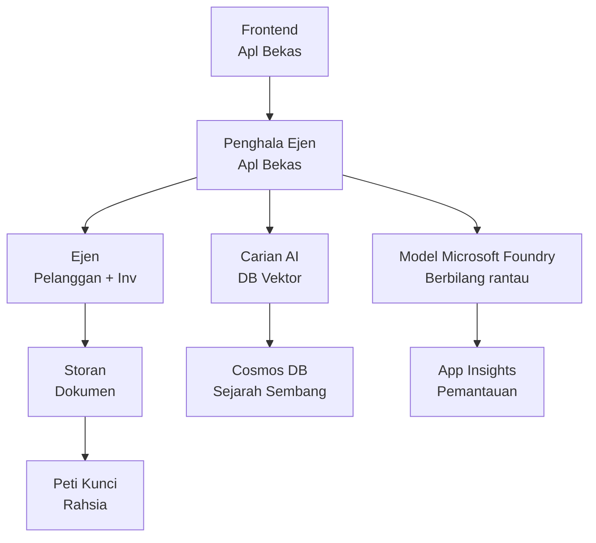

# Penyelesaian Agen Pelbagai Runcit - Templat Infrastruktur

**Bab 5: Pek Penempatan Pengeluaran**  
- **📚 Laman Utama Kursus**: [AZD Untuk Pemula](../../README.md)  
- **📖 Bab Berkaitan**: [Bab 5: Penyelesaian AI Agen Pelbagai](../../README.md#-chapter-5-multi-agent-ai-solutions-advanced)  
- **📝 Panduan Senario**: [Seni Bina Lengkap](../retail-scenario.md)  
- **🎯 Penempatan Pantas**: [Penempatan Satu-Klik](#-quick-deployment)  

> **⚠️ TEMPLAT INFRASTRUKTUR SAHAJA**  
> Templat ARM ini menggandakan **sumber Azure** untuk sistem agen pelbagai.  
>  
> **Apa yang digandakan (15-25 minit):**  
> - ✅ Perkhidmatan Model Microsoft Foundry (gpt-4.1, gpt-4.1-mini, embeddings di 3 rantau)  
> - ✅ Perkhidmatan Carian AI (kosong, sedia untuk penciptaan indeks)  
> - ✅ Aplikasi Kontena (imej penanda tempat, sedia untuk kod anda)  
> - ✅ Storan, Cosmos DB, Key Vault, Application Insights  
>  
> **Apa yang TIDAK termasuk (memerlukan pembangunan):**  
> - ❌ Kod pelaksanaan agen (Agen Pelanggan, Agen Inventori)  
> - ❌ Logik perutean dan titik akhir API  
> - ❌ Antara muka sembang hadapan  
> - ❌ Skema indeks carian dan saluran data  
> - ❌ **Anggaran usaha pembangunan: 80-120 jam**  
>  
> **Gunakan templat ini jika:**  
> - ✅ Anda mahu menyediakan infrastruktur Azure untuk projek agen pelbagai  
> - ✅ Anda merancang membangunkan pelaksanaan agen secara berasingan  
> - ✅ Anda memerlukan asas infrastruktur sedia pengeluaran  
>  
> **Jangan guna jika:**  
> - ❌ Anda mengharapkan demo agen pelbagai berfungsi serta-merta  
> - ❌ Anda mencari contoh kod aplikasi lengkap  

## Gambaran Keseluruhan

Direktori ini mengandungi templat Pengurus Sumber Azure (ARM) yang lengkap untuk menggandakan **asas infrastruktur** sistem sokongan pelanggan agen pelbagai. Templat ini menyediakan semua perkhidmatan Azure yang diperlukan, dikonfigurasikan dan dihubungkan dengan betul, sedia untuk pembangunan aplikasi anda.

**Selepas penempatan, anda akan ada:** Infrastruktur Azure bersedia pengeluaran  
**Untuk melengkapkan sistem, anda perlu:** Kod agen, UI hadapan, dan konfigurasi data (rujuk [Panduan Seni Bina](../retail-scenario.md))  

## 🎯 Apa Yang Digandakan

### Infrastruktur Teras (Status Selepas Penempatan)

✅ **Perkhidmatan Model Microsoft Foundry** (Sedia untuk panggilan API)  
  - Rantau utama: penempatan gpt-4.1 (kapasiti 20K TPM)  
  - Rantau sekunder: penempatan gpt-4.1-mini (kapasiti 10K TPM)  
  - Rantau tertiari: model embeddings teks (kapasiti 30K TPM)  
  - Rantau penilaian: model penilai gpt-4.1 (kapasiti 15K TPM)  
  - **Status:** Berfungsi sepenuhnya - boleh buat panggilan API segera  

✅ **Azure AI Search** (Kosong - sedia untuk konfigurasi)  
  - Keupayaan carian vektor diaktifkan  
  - Tahap standard dengan 1 partition, 1 replika  
  - **Status:** Perkhidmatan berjalan, tetapi memerlukan penciptaan indeks  
  - **Tindakan diperlukan:** Cipta indeks carian dengan skema anda  

✅ **Akaun Storan Azure** (Kosong - sedia untuk muat naik)  
  - Kontena blob: `documents`, `uploads`  
  - Konfigurasi selamat (HTTPS sahaja, tiada akses awam)  
  - **Status:** Sedia terima fail  
  - **Tindakan diperlukan:** Muat naik data produk dan dokumen anda  

⚠️ **Persekitaran Aplikasi Kontena** (Imej penanda tempat digandakan)  
  - Aplikasi perute agen (imej lalai nginx)  
  - Aplikasi hadapan (imej lalai nginx)  
  - Skala automatik dikonfigurasikan (0-10 instans)  
  - **Status:** Menjalankan kontena penanda tempat  
  - **Tindakan diperlukan:** Bina dan gandakan aplikasi agen anda  

✅ **Azure Cosmos DB** (Kosong - sedia untuk data)  
  - Pangkalan data dan kontena pra-konfigurasikan  
  - Dioptimumkan untuk operasi rendah keterlambatan  
  - TTL diaktifkan untuk pembersihan automatik  
  - **Status:** Sedia simpan sejarah sembang  

✅ **Azure Key Vault** (Pilihan - sedia untuk rahsia)  
  - Penghapusan lembut diaktifkan  
  - RBAC dikonfigurasikan untuk identiti terurus  
  - **Status:** Sedia simpan kunci API dan string sambungan  

✅ **Application Insights** (Pilihan - pemantauan aktif)  
  - Disambungkan ke ruang kerja Log Analytics  
  - Metrik tersuai dan amaran dikonfigurasikan  
  - **Status:** Sedia terima telemetri dari aplikasi anda  

✅ **Inteligens Dokumen** (Sedia untuk panggilan API)  
  - Tahap S0 untuk beban kerja pengeluaran  
  - **Status:** Sedia proses dokumen dimuat naik  

✅ **Bing Search API** (Sedia untuk panggilan API)  
  - Tahap S1 untuk carian masa nyata  
  - **Status:** Sedia untuk pertanyaan carian web  

### Mod Penempatan

| Mod | Kapasiti OpenAI | Instans Kontena | Tahap Carian | Redundansi Storan | Sesuai Untuk |
|------|-----------------|-----------------|--------------|------------------|--------------|
| **Minimal** | 10K-20K TPM | 0-2 replika | Asas | LRS (Lokal) | Pembangunan/ujian, pembelajaran, bukti konsep |
| **Standard** | 30K-60K TPM | 2-5 replika | Standard | ZRS (Zon) | Pengeluaran, trafik sederhana (<10K pengguna) |
| **Premium** | 80K-150K TPM | 5-10 replika, zon redunan | Premium | GRS (Geo) | Perusahaan, trafik tinggi (>10K pengguna), SLA 99.99% |

**Kesan Kos:**  
- **Minimal → Standard:** ~4x peningkatan kos ($100-370/bulan → $420-1,450/bulan)  
- **Standard → Premium:** ~3x peningkatan kos ($420-1,450/bulan → $1,150-3,500/bulan)  
- **Pilih berdasarkan:** Beban dijangka, keperluan SLA, kekangan bajet  

**Perancangan Kapasiti:**  
- **TPM (Token Per Minit):** Jumlah merentas semua penempatan model  
- **Instans Kontena:** Julat skala automatik (min-maks replika)  
- **Tahap Carian:** Mempengaruhi prestasi pertanyaan dan had saiz indeks  

## 📋 Prasyarat

### Alat Diperlukan  
1. **Azure CLI** (versi 2.50.0 atau lebih tinggi)  
   ```bash
   az --version  # Semak versi
   az login      # Sahkan
   ```
  
2. **Langganan Azure aktif** dengan akses Pemilik atau Penyumbang  
   ```bash
   az account show  # Sahkan langganan
   ```
  
### Kuota Azure Diperlukan  

Sebelum penempatan, sahkan kuota mencukupi di rantau sasaran anda:  

```bash
# Periksa ketersediaan Model Microsoft Foundry di wilayah anda
az cognitiveservices account list-skus \
  --kind OpenAI \
  --location eastus2

# Sahkan kuota OpenAI (contoh untuk gpt-4.1)
az cognitiveservices usage list \
  --location eastus2 \
  --query "[?name.value=='OpenAI.Standard.gpt-4.1']"

# Periksa kuota Aplikasi Kontena
az provider show \
  --namespace Microsoft.App \
  --query "resourceTypes[?resourceType=='managedEnvironments'].locations"
```
  
**Kuota Minimum Diperlukan:**  
- **Model Microsoft Foundry:** 3-4 penempatan model merentas rantau  
  - gpt-4.1: 20K TPM (Token Per Minit)  
  - gpt-4.1-mini: 10K TPM  
  - text-embedding-ada-002: 30K TPM  
  - **Nota:** gpt-4.1 mungkin ada senarai menunggu di beberapa rantau - semak [ketersediaan model](https://learn.microsoft.com/azure/ai-services/openai/concepts/models)  
- **Aplikasi Kontena:** Persekitaran terurus + 2-10 instans kontena  
- **AI Search:** Tahap standard (Asas tidak mencukupi untuk carian vektor)  
- **Cosmos DB:** Throughput disediakan standard  

**Jika kuota tidak mencukupi:**  
1. Pergi ke Portal Azure → Kuota → Mohon peningkatan  
2. Atau gunakan Azure CLI:  
   ```bash
   az support tickets create \
     --ticket-name "OpenAI-Quota-Increase" \
     --severity "minimal" \
     --description "Request quota increase for Microsoft Foundry Models gpt-4.1 in eastus2"
   ```
3. Pertimbangkan rantau alternatif dengan ketersediaan  

## 🚀 Penempatan Pantas

### Pilihan 1: Menggunakan Azure CLI  

```bash
# Klon atau muat turun fail templat
git clone <repository-url>
cd examples/retail-multiagent-arm-template

# Jadikan skrip penyebaran boleh dilaksanakan
chmod +x deploy.sh

# Sebarkan dengan tetapan lalai
./deploy.sh -g myResourceGroup

# Sebarkan untuk pengeluaran dengan ciri premium
./deploy.sh -g myProdRG -e prod -m premium -l eastus2
```
  
### Pilihan 2: Menggunakan Portal Azure  

[](https://portal.azure.com/#create/Microsoft.Template/uri/https%3A%2F%2Fraw.githubusercontent.com%2Fmicrosoft%2Fazd-for-beginners%2Fmain%2Fexamples%2Fretail-multiagent-arm-template%2Fazuredeploy.json)  

### Pilihan 3: Menggunakan Azure CLI secara langsung  

```bash
# Cipta kumpulan sumber
az group create --name myResourceGroup --location eastus2

# Terapkan templat
az deployment group create \
  --resource-group myResourceGroup \
  --template-file azuredeploy.json \
  --parameters azuredeploy.parameters.json
```
  
## ⏱️ Garis Masa Penempatan  

### Apa Yang Dijangka  

| Fasa | Tempoh | Apa Yang Berlaku |
|-------|---------|-----------------|
| **Pengesahan Templat** | 30-60 saat | Azure mengesahkan sintaks dan parameter templat ARM |
| **Penyediaan Kumpulan Sumber** | 10-20 saat | Membuat kumpulan sumber (jika perlu) |
| **Penyediaan OpenAI** | 5-8 minit | Membuat 3-4 akaun OpenAI dan menggandakan model |
| **Aplikasi Kontena** | 3-5 minit | Membuat persekitaran dan menggandakan kontena penanda tempat |
| **Carian & Stor** | 2-4 minit | Menyediakan perkhidmatan AI Search dan akaun storan |
| **Cosmos DB** | 2-3 minit | Membuat pangkalan data dan mengkonfigurasikan kontena |
| **Penyediaan Pemantauan** | 2-3 minit | Menyediakan Application Insights dan Log Analytics |
| **Konfigurasi RBAC** | 1-2 minit | Mengkonfigurasikan identiti terurus dan kebenaran |
| **Jumlah Penempatan** | **15-25 minit** | Infrastruktur lengkap sedia |

**Selepas Penempatan:**  
- ✅ **Infrastruktur Sedia:** Semua perkhidmatan Azure disediakan dan berjalan  
- ⏱️ **Pembangunan Aplikasi:** 80-120 jam (tanggungjawab anda)  
- ⏱️ **Konfigurasi Indeks:** 15-30 minit (memerlukan skema anda)  
- ⏱️ **Muat Naik Data:** Bergantung saiz set data  
- ⏱️ **Ujian & Pengesahan:** 2-4 jam  

---

## ✅ Sahkan Kejayaan Penempatan  

### Langkah 1: Semak Penyediaan Sumber (2 minit)  

```bash
# Sahkan semua sumber telah disebarkan dengan berjaya
az resource list \
  --resource-group myResourceGroup \
  --query "[?provisioningState!='Succeeded'].{Name:name, Status:provisioningState, Type:type}" \
  --output table
```
  
**Dijangka:** Jadual kosong (semua sumber menunjukkan status "Berjaya")  

### Langkah 2: Sahkan Penempatan Model Microsoft Foundry (3 minit)  

```bash
# Senaraikan semua akaun OpenAI
az cognitiveservices account list \
  --resource-group myResourceGroup \
  --query "[?kind=='OpenAI'].{Name:name, Location:location, Status:properties.provisioningState}" \
  --output table

# Semak penempatan model untuk wilayah utama
OPENAI_NAME=$(az cognitiveservices account list \
  --resource-group myResourceGroup \
  --query "[?kind=='OpenAI'] | [0].name" -o tsv)

az cognitiveservices account deployment list \
  --name $OPENAI_NAME \
  --resource-group myResourceGroup \
  --output table
```
  
**Dijangka:**  
- 3-4 akaun OpenAI (rantau utama, sekunder, tertiari, penilaian)  
- 1-2 penempatan model setiap akaun (gpt-4.1, gpt-4.1-mini, text-embedding-ada-002)  

### Langkah 3: Uji Titik Akhir Infrastruktur (5 minit)  

```bash
# Dapatkan URL Apl Kontena
az containerapp list \
  --resource-group myResourceGroup \
  --query "[].{Name:name, URL:properties.configuration.ingress.fqdn, Status:properties.runningStatus}" \
  --output table

# Uji titik akhir penghala (imej pengganti akan memberi maklum balas)
ROUTER_URL=$(az containerapp show \
  --name retail-router \
  --resource-group myResourceGroup \
  --query "properties.configuration.ingress.fqdn" -o tsv)

echo "Testing: https://$ROUTER_URL"
curl -I https://$ROUTER_URL || echo "Container running (placeholder image - expected)"
```
  
**Dijangka:**  
- Aplikasi Kontena menunjukkan status "Berjalan"  
- Nginx penanda tempat memberi respons HTTP 200 atau 404 (belum ada kod aplikasi)  

### Langkah 4: Sahkan Akses API Model Microsoft Foundry (3 minit)  

```bash
# Dapatkan titik akhir dan kunci OpenAI
OPENAI_ENDPOINT=$(az cognitiveservices account show \
  --name $OPENAI_NAME \
  --resource-group myResourceGroup \
  --query "properties.endpoint" -o tsv)

OPENAI_KEY=$(az cognitiveservices account keys list \
  --name $OPENAI_NAME \
  --resource-group myResourceGroup \
  --query "key1" -o tsv)

# Uji penyebaran gpt-4.1
curl "${OPENAI_ENDPOINT}openai/deployments/gpt-4.1/chat/completions?api-version=2024-08-01-preview" \
  -H "Content-Type: application/json" \
  -H "api-key: $OPENAI_KEY" \
  -d '{
    "messages": [{"role": "user", "content": "Say hello"}],
    "max_tokens": 10
  }'
```
  
**Dijangka:** Respons JSON dengan lengkap sembang (mengesahkan OpenAI berfungsi)  

### Apa Yang Berfungsi vs Apa Yang Tidak  

**✅ Berfungsi Selepas Penempatan:**  
- Model Microsoft Foundry digandakan dan menerima panggilan API  
- Perkhidmatan AI Search berjalan (kosong, tiada indeks lagi)  
- Aplikasi Kontena berjalan (imej nginx penanda tempat)  
- Akaun storan boleh diakses dan sedia untuk muat naik  
- Cosmos DB sedia untuk operasi data  
- Application Insights mengumpul telemetri infrastruktur  
- Key Vault sedia untuk storan rahsia  

**❌ Belum Berfungsi (Memerlukan Pembangunan):**  
- Titik akhir agen (tiada kod aplikasi digandakan)  
- Fungsi sembang (memerlukan pelaksanaan hadapan + belakang)  
- Pertanyaan carian (belum cipta indeks carian)  
- Saluran pemprosesan dokumen (tiada data dimuat naik)  
- Telemetri tersuai (memerlukan instrumentasi aplikasi)  

**Langkah Seterusnya:** Lihat [Konfigurasi Selepas Penempatan](#-post-deployment-next-steps) untuk membangunkan dan menggandakan aplikasi anda  

---

## ⚙️ Pilihan Konfigurasi  

### Parameter Templat  

| Parameter | Jenis | Lalai | Penerangan |
|-----------|-------|-------|------------|
| `projectName` | string | "retail" | Awalan untuk semua nama sumber |
| `location` | string | Lokasi kumpulan sumber | Rantau utama penempatan |
| `secondaryLocation` | string | "westus2" | Rantau sekunder untuk penempatan berbilang rantau |
| `tertiaryLocation` | string | "francecentral" | Rantau untuk model embeddings |
| `environmentName` | string | "dev" | Penamaan persekitaran (dev/staging/prod) |
| `deploymentMode` | string | "standard" | Konfigurasi penempatan (minimal/standard/premium) |
| `enableMultiRegion` | bool | true | Aktifkan penempatan berbilang rantau |
| `enableMonitoring` | bool | true | Aktifkan Application Insights dan log |
| `enableSecurity` | bool | true | Aktifkan Key Vault dan keselamatan lanjutan |

### Menyesuaikan Parameter  

Sunting `azuredeploy.parameters.json`:  

```json
{
  "$schema": "https://schema.management.azure.com/schemas/2019-04-01/deploymentParameters.json#",
  "contentVersion": "1.0.0.0",
  "parameters": {
    "projectName": {
      "value": "mycompany"
    },
    "environmentName": {
      "value": "prod"
    },
    "deploymentMode": {
      "value": "premium"
    },
    "location": {
      "value": "eastus2"
    }
  }
}
```
  
## 🏗️ Gambaran Seni Bina  


## 📖 Cara Menggunakan Skrip Penempatan  

Skrip `deploy.sh` menyediakan pengalaman penempatan interaktif:  

```bash
# Tunjukkan bantuan
./deploy.sh --help

# Penempatan asas
./deploy.sh -g myResourceGroup

# Penempatan lanjutan dengan tetapan tersuai
./deploy.sh \
  -g myProductionRG \
  -p companyname \
  -e prod \
  -m premium \
  -l eastus2

# Penempatan pembangunan tanpa pelbagai rantau
./deploy.sh \
  -g myDevRG \
  -e dev \
  -m minimal \
  --no-multi-region \
  --no-security
```
  
### Ciri-ciri Skrip  

- ✅ **Pengesahan prasyarat** (Azure CLI, status log masuk, fail templat)  
- ✅ **Pengurusan kumpulan sumber** (membuat jika tiada)  
- ✅ **Pengesahan templat** sebelum penempatan  
- ✅ **Pemantauan kemajuan** dengan output berwarna  
- ✅ **Paparan output penempatan**  
- ✅ **Panduan selepas penempatan**  

## 📊 Memantau Penempatan  

### Semak Status Penempatan  

```bash
# Senaraikan penempatan
az deployment group list --resource-group myResourceGroup --output table

# Dapatkan butiran penempatan
az deployment group show \
  --resource-group myResourceGroup \
  --name retail-deployment-YYYYMMDD-HHMMSS

# Tonton kemajuan penempatan
az deployment group create \
  --resource-group myResourceGroup \
  --template-file azuredeploy.json \
  --parameters azuredeploy.parameters.json \
  --verbose
```
  
### Output Penempatan  

Selepas penempatan berjaya, output berikut tersedia:  

- **URL Hadapan**: Titik akhir awam untuk antara muka web  
- **URL Perute**: Titik akhir API untuk perute agen  
- **Titik Akhir OpenAI**: Titik akhir perkhidmatan OpenAI utama dan sekunder  
- **Perkhidmatan Carian**: Titik akhir perkhidmatan Azure AI Search  
- **Akaun Stor**: Nama akaun storan untuk dokumen  
- **Key Vault**: Nama Key Vault (jika diaktifkan)  
- **Application Insights**: Nama perkhidmatan pemantauan (jika diaktifkan)  

## 🔧 Selepas Penempatan: Langkah Seterusnya
> **📝 Penting:** Infrastruktur telah disediakan, tetapi anda perlu membangunkan dan menyebarkan kod aplikasi.

### Fasa 1: Bangunkan Aplikasi Ejen (Tanggungjawab Anda)

Template ARM mencipta **Container Apps kosong** dengan imej nginx tempat letak. Anda mesti:

**Pembangunan Diperlukan:**
1. **Pelaksanaan Ejen** (30-40 jam)
   - Ejen perkhidmatan pelanggan dengan integrasi gpt-4.1
   - Ejen inventori dengan integrasi gpt-4.1-mini
   - Logik penghalaan ejen

2. **Pembangunan Frontend** (20-30 jam)
   - Antara muka chat UI (React/Vue/Angular)
   - Fungsi muat naik fail
   - Pemaparan dan pemformatan respons

3. **Perkhidmatan Backend** (12-16 jam)
   - FastAPI atau penghala Express
   - Middleware pengesahan
   - Integrasi telemetri

**Lihat:** [Panduan Seni Bina](../retail-scenario.md) untuk corak pelaksanaan terperinci dan contoh kod

### Fasa 2: Konfigurasi Indeks Carian AI (15-30 minit)

Cipta indeks carian yang sepadan dengan model data anda:

```bash
# Dapatkan butiran perkhidmatan carian
SEARCH_NAME=$(az search service list \
  --resource-group myResourceGroup \
  --query "[0].name" -o tsv)

SEARCH_KEY=$(az search admin-key show \
  --service-name $SEARCH_NAME \
  --resource-group myResourceGroup \
  --query "primaryKey" -o tsv)

# Buat indeks dengan skema anda (contoh)
curl -X POST "https://${SEARCH_NAME}.search.windows.net/indexes?api-version=2023-11-01" \
  -H "Content-Type: application/json" \
  -H "api-key: ${SEARCH_KEY}" \
  -d '{
    "name": "products",
    "fields": [
      {"name": "id", "type": "Edm.String", "key": true},
      {"name": "title", "type": "Edm.String", "searchable": true},
      {"name": "content", "type": "Edm.String", "searchable": true},
      {"name": "category", "type": "Edm.String", "filterable": true},
      {"name": "content_vector", "type": "Collection(Edm.Single)", 
       "searchable": true, "dimensions": 1536, "vectorSearchProfile": "default"}
    ],
    "vectorSearch": {
      "algorithms": [{"name": "default", "kind": "hnsw"}],
      "profiles": [{"name": "default", "algorithm": "default"}]
    }
  }'
```

**Sumber:**
- [Reka Bentuk Skema Indeks Carian AI](https://learn.microsoft.com/azure/search/search-what-is-an-index)
- [Konfigurasi Carian Vektor](https://learn.microsoft.com/azure/search/vector-search-how-to-create-index)

### Fasa 3: Muat Naik Data Anda (Masa bergantung)

Setelah anda mempunyai data produk dan dokumen:

```bash
# Dapatkan butiran akaun storan
STORAGE_NAME=$(az storage account list \
  --resource-group myResourceGroup \
  --query "[0].name" -o tsv)

STORAGE_KEY=$(az storage account keys list \
  --account-name $STORAGE_NAME \
  --resource-group myResourceGroup \
  --query "[0].value" -o tsv)

# Muat naik dokumen anda
az storage blob upload-batch \
  --destination documents \
  --source /path/to/your/product/docs \
  --account-name $STORAGE_NAME \
  --account-key $STORAGE_KEY

# Contoh: Muat naik satu fail
az storage blob upload \
  --container-name documents \
  --name "product-manual.pdf" \
  --file /path/to/product-manual.pdf \
  --account-name $STORAGE_NAME \
  --account-key $STORAGE_KEY
```

### Fasa 4: Bangun dan Sebarkan Aplikasi Anda (8-12 jam)

Setelah anda membangunkan kod ejen anda:

```bash
# 1. Cipta Azure Container Registry (jika perlu)
az acr create \
  --name myregistry \
  --resource-group myResourceGroup \
  --sku Basic

# 2. Bina dan tolak imej penghala ejen
docker build -t myregistry.azurecr.io/agent-router:v1 /path/to/your/router/code
az acr login --name myregistry
docker push myregistry.azurecr.io/agent-router:v1

# 3. Bina dan tolak imej frontend
docker build -t myregistry.azurecr.io/frontend:v1 /path/to/your/frontend/code
docker push myregistry.azurecr.io/frontend:v1

# 4. Kemas kini Container Apps dengan imej anda
az containerapp update \
  --name retail-router \
  --resource-group myResourceGroup \
  --image myregistry.azurecr.io/agent-router:v1

az containerapp update \
  --name retail-frontend \
  --resource-group myResourceGroup \
  --image myregistry.azurecr.io/frontend:v1

# 5. Konfigurasikan pembolehubah persekitaran
az containerapp update \
  --name retail-router \
  --resource-group myResourceGroup \
  --set-env-vars \
    OPENAI_ENDPOINT=secretref:openai-endpoint \
    OPENAI_KEY=secretref:openai-key \
    SEARCH_ENDPOINT=secretref:search-endpoint \
    SEARCH_KEY=secretref:search-key
```

### Fasa 5: Uji Aplikasi Anda (2-4 jam)

```bash
# Dapatkan URL aplikasi anda
ROUTER_URL=$(az containerapp show \
  --name retail-router \
  --resource-group myResourceGroup \
  --query "properties.configuration.ingress.fqdn" -o tsv)

# Uji titik hujung ejen (apabila kod anda telah dideploy)
curl -X POST "https://${ROUTER_URL}/chat" \
  -H "Content-Type: application/json" \
  -d '{
    "message": "Hello, I need help with my order",
    "agent": "customer"
  }'

# Semak log aplikasi
az containerapp logs show \
  --name retail-router \
  --resource-group myResourceGroup \
  --follow
```

### Sumber Pelaksanaan

**Seni Bina & Reka Bentuk:**
- 📖 [Panduan Seni Bina Lengkap](../retail-scenario.md) - Corak pelaksanaan terperinci
- 📖 [Corak Reka Bentuk Multi-Ejen](https://learn.microsoft.com/azure/architecture/ai-ml/guide/multi-agent-systems)

**Contoh Kod:**
- 🔗 [Microsoft Foundry Models Chat Sample](https://github.com/Azure-Samples/azure-search-openai-demo) - Corak RAG
- 🔗 [Semantic Kernel](https://github.com/microsoft/semantic-kernel) - Rangka kerja ejen (C#)
- 🔗 [LangChain Azure](https://github.com/langchain-ai/langchain) - Orkestrasi ejen (Python)
- 🔗 [AutoGen](https://github.com/microsoft/autogen) - Perbualan pelbagai ejen

**Anggaran Jumlah Usaha:**
- Penyediaan infrastruktur: 15-25 minit (✅ Selesai)
- Pembangunan aplikasi: 80-120 jam (🔨 Kerja anda)
- Ujian dan pengoptimuman: 15-25 jam (🔨 Kerja anda)

## 🛠️ Penyelesaian Masalah

### Isu Lazim

#### 1. Kuota Microsoft Foundry Models Melebihi Had

```bash
# Semak penggunaan kuota semasa
az cognitiveservices usage list --location eastus2

# Memohon kenaikan kuota
az support tickets create \
  --ticket-name "OpenAI-Quota-Increase" \
  --severity "minimal" \
  --description "Request quota increase for Microsoft Foundry Models in region X"
```

#### 2. Penyebaran Container Apps Gagal

```bash
# Semak log aplikasi kontena
az containerapp logs show \
  --name retail-router \
  --resource-group myResourceGroup \
  --follow

# Mulakan semula aplikasi kontena
az containerapp revision restart \
  --name retail-router \
  --resource-group myResourceGroup
```

#### 3. Inisialisasi Perkhidmatan Carian

```bash
# Sahkan status perkhidmatan carian
az search service show \
  --name <search-service-name> \
  --resource-group myResourceGroup

# Uji kesambungan perkhidmatan carian
curl -X GET "https://<search-service-name>.search.windows.net/indexes?api-version=2023-11-01" \
  -H "api-key: <search-admin-key>"
```

### Pengesahan Penyebaran

```bash
# Sahkan semua sumber telah dibuat
az resource list \
  --resource-group myResourceGroup \
  --output table

# Periksa kesihatan sumber
az resource list \
  --resource-group myResourceGroup \
  --query "[?provisioningState!='Succeeded'].{Name:name, Status:provisioningState, Type:type}" \
  --output table
```

## 🔐 Pertimbangan Keselamatan

### Pengurusan Kunci
- Semua rahsia disimpan dalam Azure Key Vault (apabila diaktifkan)
- Aplikasi container menggunakan identiti terurus untuk pengesahan
- Akaun storan mempunyai tetapan selamat lalai (HTTPS sahaja, tiada akses blob awam)

### Keselamatan Rangkaian
- Aplikasi container menggunakan rangkaian dalaman jika boleh
- Perkhidmatan carian dikonfigurasi dengan pilihan titik akhir peribadi
- Cosmos DB dikonfigurasi dengan kebenaran minimum yang diperlukan

### Konfigurasi RBAC
```bash
# Tetapkan peranan yang diperlukan untuk identiti terurus
az role assignment create \
  --assignee <container-app-managed-identity> \
  --role "Cognitive Services OpenAI User" \
  --scope <openai-resource-id>
```

## 💰 Pengoptimuman Kos

### Anggaran Kos (Bulanan, USD)

| Mod | OpenAI | Container Apps | Carian | Storan | Jumlah Anggaran |
|------|--------|----------------|--------|---------|-----------------|
| Minimum | $50-200 | $20-50 | $25-100 | $5-20 | $100-370 |
| Standard | $200-800 | $100-300 | $100-300 | $20-50 | $420-1450 |
| Premium | $500-2000 | $300-800 | $300-600 | $50-100 | $1150-3500 |

### Pemantauan Kos

```bash
# Tetapkan amaran bajet
az consumption budget create \
  --account-name <subscription-id> \
  --budget-name "retail-budget" \
  --amount 500 \
  --time-grain Monthly \
  --start-date 2024-01-01 \
  --end-date 2024-12-31
```

## 🔄 Kemas Kini dan Penyelenggaraan

### Kemas Kini Template
- Kawalan versi untuk fail template ARM
- Uji perubahan dalam persekitaran pembangunan dahulu
- Gunakan mod penyebaran inkremental untuk kemas kini

### Kemas Kini Sumber
```bash
# Kemas kini dengan parameter baru
az deployment group create \
  --resource-group myResourceGroup \
  --template-file azuredeploy.json \
  --parameters azuredeploy.parameters.json \
  --mode Incremental
```

### Sandaran dan Pemulihan
- Sandaran automatik Cosmos DB diaktifkan
- Padam lembut Key Vault diaktifkan
- Revisi aplikasi container disimpan untuk pembalikan

## 📞 Sokongan

- **Isu Template**: [GitHub Issues](https://github.com/microsoft/azd-for-beginners/issues)
- **Sokongan Azure**: [Portal Sokongan Azure](https://portal.azure.com/#blade/Microsoft_Azure_Support/HelpAndSupportBlade)
- **Komuniti**: [Azure AI Discord](https://discord.gg/microsoft-azure)

---

**⚡ Bersedia untuk menyebarkan penyelesaian multi-ejen anda?**

Mulakan dengan: `./deploy.sh -g myResourceGroup`

---

<!-- CO-OP TRANSLATOR DISCLAIMER START -->
**Penafian**:  
Dokumen ini telah diterjemahkan menggunakan perkhidmatan terjemahan AI [Co-op Translator](https://github.com/Azure/co-op-translator). Walaupun kami berusaha untuk ketepatan, sila ambil maklum bahawa terjemahan automatik mungkin mengandungi kesilapan atau ketidaktepatan. Dokumen asal dalam bahasa asalnya harus dianggap sebagai sumber yang sahih. Untuk maklumat penting, terjemahan profesional oleh manusia adalah disyorkan. Kami tidak bertanggungjawab terhadap sebarang salah faham atau salah tafsir yang timbul daripada penggunaan terjemahan ini.
<!-- CO-OP TRANSLATOR DISCLAIMER END -->