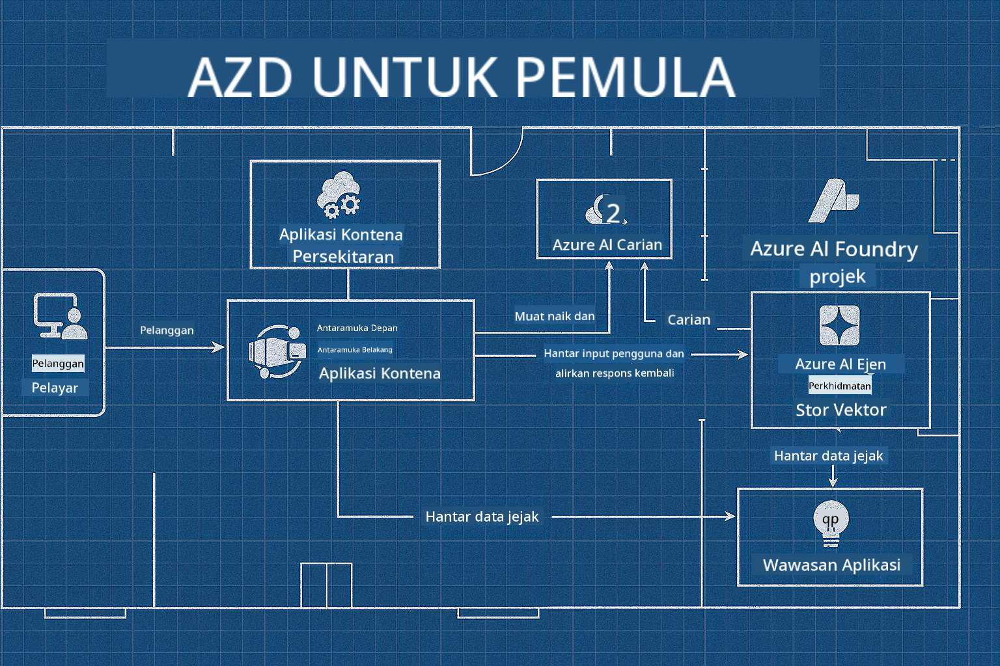

<!--
CO_OP_TRANSLATOR_METADATA:
{
  "original_hash": "245d24997bbcf2bae93bb2a503845d37",
  "translation_date": "2025-09-23T12:01:12+00:00",
  "source_file": "workshop/README.md",
  "language_code": "ms"
}
-->
# Bengkel AZD untuk Pembangun AI

## Templat AZD

Membina penyelesaian aplikasi AI bertaraf perusahaan untuk senario spesifik anda adalah seperti membina rumah sendiri. Anda boleh mereka bentuknya sendiri, membinanya bata demi bata, dan bertanggungjawab memastikan ia memenuhi semua garis panduan tadbir urus dan pembangunan.

**ATAU ....**

Anda boleh bekerjasama dengan seorang arkitek yang boleh memberikan anda _pelan_ untuk rumah permulaan, dan kemudian bekerjasama dengan anda untuk _menyesuaikannya_ mengikut keperluan anda. Ini membolehkan anda memberi tumpuan kepada apa yang menjadikan **rumah anda** istimewa, sementara pendawaian, paip, dan kebergantungan lain diuruskan oleh pakar.

**Inilah pendekatan di sebalik [Templat Aplikasi AI](https://ai.azure.com/templates)** - satu siri pelan untuk membina pelbagai jenis "rumah" aplikasi AI bergantung kepada keperluan dan kebergantungan utama anda.

## Penyesuaian Templat

Templat ini direka untuk berfungsi dengan [Azure AI Foundry](https://ai.azure.com). Anggap platform ini sebagai "kontraktor pembinaan" anda dengan akses kepada semua sumber, alat, dan kepakaran yang anda perlukan untuk menyelesaikan kerja!

Apa yang perlu anda lakukan ialah memilih [templat permulaan anda](https://learn.microsoft.com/en-us/azure/ai-foundry/how-to/develop/ai-template-get-started). Sebagai contoh, kami akan memberi tumpuan kepada templat _Get Started with AI Agents_ untuk membina "Rumah AI Agen" yang dilengkapi dengan ciri seperti AI Search, Red Teaming, Evaluations, Tracing, Monitoring, dan banyak lagi!



Apa yang anda perlukan hanyalah menempah masa dengan arkitek untuk membimbing anda melalui proses penyesuaian. [GitHub Copilot for Azure](https://learn.microsoft.com/en-us/azure/developer/github-copilot-azure/get-started) boleh menjadi panduan tersebut. Hanya "berbual dengannya" untuk:

- Mempelajari tentang ciri Azure dalam templat anda
- Melaksanakan sumber Azure
- Mendapatkan maklumat tentang pelaksanaan anda
- Mendiagnosis dan menyelesaikan masalah!

Dalam bengkel ini, kita akan belajar bagaimana untuk _membongkar_ templat sedia ada (untuk memahami apa yang ia sediakan), kemudian _menyesuaikannya_ (untuk memenuhi keperluan kita) - langkah demi langkah.

Templat AI **menjadikannya berfungsi** - dengan melengkapkan bengkel ini, anda akan belajar untuk **menjadikannya milik anda**

----

**Navigasi Bengkel**
- **📚 Halaman Kursus**: [AZD Untuk Pemula](../README.md)
- **📖 Bab Berkaitan**: Meliputi [Bab 1](../README.md#-chapter-1-foundation--quick-start), [Bab 2](../README.md#-chapter-2-ai-first-development-recommended-for-ai-developers), dan [Bab 5](../README.md#-chapter-5-multi-agent-ai-solutions-advanced)
- **🛠️ Makmal Praktikal**: [Makmal Bengkel AI](../docs/ai-foundry/ai-workshop-lab.md)
- **🚀 Langkah Seterusnya**: [Modul Makmal Bengkel](../../../workshop)

Selamat datang ke bengkel praktikal untuk mempelajari Azure Developer CLI (AZD) dengan fokus pada pelaksanaan aplikasi AI. Bengkel ini direka untuk membawa anda dari asas AZD kepada pelaksanaan penyelesaian AI yang sedia untuk pengeluaran.

## Gambaran Keseluruhan Bengkel

**Tempoh:** 2-3 jam  
**Tahap:** Pemula hingga Pertengahan  
**Prasyarat:** Pengetahuan asas tentang Azure, alat baris perintah, dan konsep AI

### Apa yang Akan Anda Pelajari

- **Asas AZD**: Memahami Infrastruktur sebagai Kod dengan AZD
- 🤖 **Integrasi Perkhidmatan AI**: Melaksanakan Azure OpenAI, AI Search, dan perkhidmatan AI lain
- **Pelaksanaan Kontena**: Menggunakan Azure Container Apps untuk aplikasi AI
- **Amalan Keselamatan Terbaik**: Melaksanakan Identiti Terurus dan konfigurasi yang selamat
- **Pemantauan & Pemerhatian**: Menyediakan Application Insights untuk beban kerja AI
- **Corak Pengeluaran**: Strategi pelaksanaan yang sedia untuk perusahaan

## Struktur Bengkel

### Modul 1: Asas AZD (30 minit)
- Memasang dan mengkonfigurasi AZD
- Memahami struktur projek AZD
- Pelaksanaan AZD pertama anda
- **Makmal**: Melaksanakan aplikasi web ringkas

### Modul 2: Integrasi Azure OpenAI (45 minit)
- Menyediakan sumber Azure OpenAI
- Strategi pelaksanaan model
- Mengkonfigurasi akses API dan pengesahan
- **Makmal**: Melaksanakan aplikasi sembang dengan GPT-4

### Modul 3: Aplikasi RAG (45 minit)
- Integrasi Azure AI Search
- Pemprosesan dokumen dengan Azure Document Intelligence
- Embedding vektor dan carian semantik
- **Makmal**: Membina sistem soal jawab dokumen

### Modul 4: Pelaksanaan Pengeluaran (30 minit)
- Konfigurasi Container Apps
- Pengoptimuman skala dan prestasi
- Pemantauan dan log
- **Makmal**: Melaksanakan ke pengeluaran dengan pemerhatian

### Modul 5: Corak Lanjutan (15 minit)
- Pelaksanaan berbilang persekitaran
- Integrasi CI/CD
- Strategi pengoptimuman kos
- **Penutup**: Senarai semak kesediaan pengeluaran

## Prasyarat

### Alat Diperlukan

Sila pasang alat berikut sebelum bengkel:

```bash
# Azure Developer CLI
curl -fsSL https://aka.ms/install-azd.sh | bash

# Azure CLI
curl -sL https://aka.ms/InstallAzureCLIDeb | sudo bash

# Git
sudo apt-get install git

# Docker
curl -fsSL https://get.docker.com -o get-docker.sh
sudo sh get-docker.sh

# Python 3.10+
sudo apt-get install python3.10 python3.10-venv python3-pip
```

### Persediaan Akaun Azure

1. **Langganan Azure**: [Daftar secara percuma](https://azure.microsoft.com/free/)
2. **Akses Azure OpenAI**: [Mohon akses](https://aka.ms/oai/access)
3. **Kebenaran Diperlukan**:
   - Peranan Contributor pada langganan atau kumpulan sumber
   - User Access Administrator (untuk tugasan RBAC)

### Sahkan Prasyarat

Jalankan skrip ini untuk mengesahkan persediaan anda:

```bash
#!/bin/bash
echo "Verifying workshop prerequisites..."

# Check AZD installation
if command -v azd &> /dev/null; then
    echo "✅ Azure Developer CLI: $(azd --version)"
else
    echo "❌ Azure Developer CLI not found"
fi

# Check Azure CLI
if command -v az &> /dev/null; then
    echo "✅ Azure CLI: $(az --version | head -n1)"
else
    echo "❌ Azure CLI not found"
fi

# Check Docker
if command -v docker &> /dev/null; then
    echo "✅ Docker: $(docker --version)"
else
    echo "❌ Docker not found"
fi

# Check Python
if command -v python3 &> /dev/null; then
    echo "✅ Python: $(python3 --version)"
else
    echo "❌ Python 3 not found"
fi

# Check Azure login
if az account show &> /dev/null; then
    echo "✅ Azure: Logged in as $(az account show --query user.name -o tsv)"
else
    echo "❌ Azure: Not logged in (run 'az login')"
fi

echo "Setup verification complete!"
```

## Bahan Bengkel

### Latihan Makmal

Setiap modul termasuk makmal praktikal dengan kod permulaan dan arahan langkah demi langkah:

- **[lab-1-azd-basics/](../../../workshop/lab-1-azd-basics)** - Pelaksanaan AZD pertama anda
- **[lab-2-openai-chat/](../../../workshop/lab-2-openai-chat)** - Aplikasi sembang dengan Azure OpenAI
- **[lab-3-rag-search/](../../../workshop/lab-3-rag-search)** - Aplikasi RAG dengan AI Search
- **[lab-4-production/](../../../workshop/lab-4-production)** - Corak pelaksanaan pengeluaran
- **[lab-5-advanced/](../../../workshop/lab-5-advanced)** - Senario pelaksanaan lanjutan

### Bahan Rujukan

- **[Panduan Integrasi AI Foundry](../docs/ai-foundry/azure-ai-foundry-integration.md)** - Corak integrasi yang komprehensif
- **[Panduan Pelaksanaan Model AI](../docs/ai-foundry/ai-model-deployment.md)** - Amalan terbaik pelaksanaan model
- **[Amalan AI Pengeluaran](../docs/ai-foundry/production-ai-practices.md)** - Corak pelaksanaan perusahaan
- **[Panduan Penyelesaian Masalah AI](../docs/troubleshooting/ai-troubleshooting.md)** - Isu biasa dan penyelesaian

### Templat Contoh

Templat permulaan untuk senario AI biasa:

```
workshop/templates/
├── minimal-chat/          # Basic OpenAI chat app
├── rag-application/       # RAG with AI Search
├── multi-model/          # Multiple AI services
└── production-ready/     # Enterprise template
```

## Memulakan

### Pilihan 1: GitHub Codespaces (Disyorkan)

Cara terpantas untuk memulakan bengkel:

[](https://github.com/codespaces/new?hide_repo_select=true&ref=main&repo=YOUR_REPO_ID)

### Pilihan 2: Pembangunan Tempatan

1. **Klon repositori bengkel:**
```bash
git clone https://github.com/YOUR_ORG/AZD-for-beginners.git
cd AZD-for-beginners/workshop
```

2. **Log masuk ke Azure:**
```bash
az login
azd auth login
```

3. **Mulakan dengan Makmal 1:**
```bash
cd lab-1-azd-basics
cat README.md  # Follow the instructions
```

### Pilihan 3: Bengkel Dipandu Pengajar

Jika anda menghadiri sesi yang dipandu pengajar:

- 🎥 **Rakaman Bengkel**: [Tersedia atas permintaan](https://aka.ms/azd-ai-workshop)
- 💬 **Komuniti Discord**: [Sertai untuk sokongan langsung](https://aka.ms/foundry/discord)
- **Maklum Balas Bengkel**: [Kongsi pengalaman anda](https://aka.ms/azd-workshop-feedback)

## Garis Masa Bengkel

### Pembelajaran Sendiri (3 jam)

```
⏰ 00:00 - 00:30  Module 1: AZD Foundations
⏰ 00:30 - 01:15  Module 2: Azure OpenAI Integration
⏰ 01:15 - 02:00  Module 3: RAG Applications
⏰ 02:00 - 02:30  Module 4: Production Deployment
⏰ 02:30 - 02:45  Module 5: Advanced Patterns
⏰ 02:45 - 03:00  Q&A and Next Steps
```

### Sesi Dipandu Pengajar (2.5 jam)

```
⏰ 00:00 - 00:15  Welcome & Prerequisites Check
⏰ 00:15 - 00:40  Module 1: Live Demo + Lab
⏰ 00:40 - 01:20  Module 2: OpenAI Integration
⏰ 01:20 - 01:30  Break
⏰ 01:30 - 02:10  Module 3: RAG Applications
⏰ 02:10 - 02:30  Module 4: Production Patterns
⏰ 02:30 - 02:45  Module 5: Advanced Topics
⏰ 02:45 - 03:00  Q&A and Resources
```

## Kriteria Kejayaan

Pada akhir bengkel ini, anda akan dapat:

✅ **Melaksanakan aplikasi AI** menggunakan templat AZD  
✅ **Mengkonfigurasi Azure OpenAI** dengan keselamatan yang betul  
✅ **Membina aplikasi RAG** dengan integrasi Azure AI Search  
✅ **Melaksanakan corak pengeluaran** untuk beban kerja AI perusahaan  
✅ **Memantau dan menyelesaikan masalah** pelaksanaan aplikasi AI  
✅ **Mengaplikasikan strategi pengoptimuman kos** untuk beban kerja AI  

## Komuniti & Sokongan

### Semasa Bengkel

- 🙋 **Soalan**: Gunakan sembang bengkel atau angkat tangan
- 🐛 **Isu**: Semak [panduan penyelesaian masalah](../docs/troubleshooting/ai-troubleshooting.md)
- **Petua**: Kongsi penemuan dengan peserta lain

### Selepas Bengkel

- 💬 **Discord**: [Komuniti Azure AI Foundry](https://aka.ms/foundry/discord)
- **GitHub Issues**: [Laporkan isu templat](https://github.com/YOUR_ORG/AZD-for-beginners/issues)
- 📧 **Maklum Balas**: [Borang penilaian bengkel](https://aka.ms/azd-workshop-feedback)

## Langkah Seterusnya

### Teruskan Pembelajaran

1. **Senario Lanjutan**: Terokai [pelaksanaan berbilang wilayah](../docs/ai-foundry/production-ai-practices.md#multi-region-deployment)
2. **Integrasi CI/CD**: Sediakan [aliran kerja GitHub Actions](../docs/deployment/github-actions.md)
3. **Templat Tersuai**: Cipta [templat AZD anda sendiri](../docs/getting-started/custom-templates.md)

### Terapkan dalam Projek Anda

1. **Penilaian**: Gunakan [senarai semak kesediaan](./production-readiness-checklist.md)
2. **Templat**: Mulakan dengan [templat khusus AI kami](../../../workshop/templates)
3. **Sokongan**: Sertai [Discord Azure AI Foundry](https://aka.ms/foundry/discord)

### Kongsi Kejayaan Anda

- ⭐ **Bintang repositori** jika bengkel ini membantu anda
- 🐦 **Kongsi di media sosial** dengan #AzureDeveloperCLI #AzureAI
- 📝 **Tulis catatan blog** tentang perjalanan pelaksanaan AI anda

---

## Maklum Balas Bengkel

Maklum balas anda membantu kami meningkatkan pengalaman bengkel:

| Aspek | Penilaian (1-5) | Komen |
|-------|-----------------|-------|
| Kualiti Kandungan | ⭐⭐⭐⭐⭐ | |
| Makmal Praktikal | ⭐⭐⭐⭐⭐ | |
| Dokumentasi | ⭐⭐⭐⭐⭐ | |
| Tahap Kesukaran | ⭐⭐⭐⭐⭐ | |
| Pengalaman Keseluruhan | ⭐⭐⭐⭐⭐ | |

**Hantar maklum balas**: [Borang Penilaian Bengkel](https://aka.ms/azd-workshop-feedback)

---

**Sebelumnya:** [Panduan Penyelesaian Masalah AI](../docs/troubleshooting/ai-troubleshooting.md) | **Seterusnya:** Mulakan dengan [Makmal 1: Asas AZD](../../../workshop/lab-1-azd-basics)

**Bersedia untuk mula membina aplikasi AI dengan AZD?**

[Mulakan Makmal 1: Asas AZD →](./lab-1-azd-basics/README.md)

---

