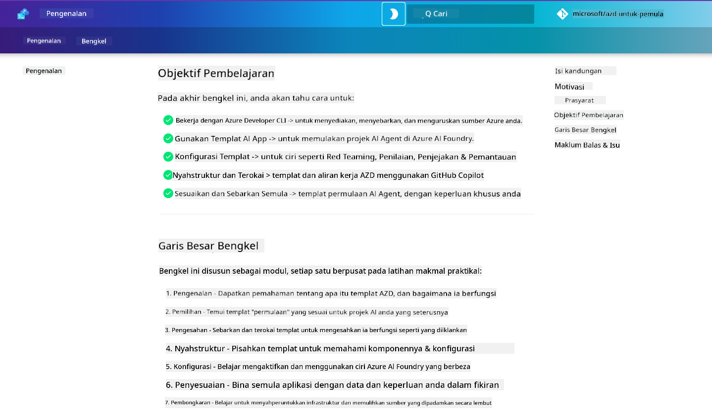

<!--
CO_OP_TRANSLATOR_METADATA:
{
  "original_hash": "9cc966416ab431c38b2ab863884b196c",
  "translation_date": "2025-09-24T23:26:11+00:00",
  "source_file": "workshop/README.md",
  "language_code": "ms"
}
-->
# Bengkel AZD untuk Pembangun AI

Selamat datang ke bengkel praktikal untuk mempelajari Azure Developer CLI (AZD) dengan fokus pada penyebaran aplikasi AI. Bengkel ini membantu anda memahami penggunaan templat AZD dalam 3 langkah:

1. **Penemuan** - cari templat yang sesuai untuk anda.
1. **Penyebaran** - sebarkan dan sahkan bahawa ia berfungsi.
1. **Penyesuaian** - ubah dan iterasi untuk menjadikannya milik anda!

Sepanjang bengkel ini, anda juga akan diperkenalkan kepada alat pembangun teras dan aliran kerja, untuk membantu anda mempercepatkan perjalanan pembangunan hujung ke hujung.

<br/>

## Panduan Berasaskan Pelayar

Pelajaran bengkel ini ditulis dalam Markdown. Anda boleh menavigasinya secara langsung di GitHub - atau melancarkan pratonton berasaskan pelayar seperti yang ditunjukkan dalam tangkapan skrin di bawah.



Untuk menggunakan pilihan ini - fork repositori ke profil anda, dan lancarkan GitHub Codespaces. Setelah terminal VS Code aktif, taipkan arahan ini:

```bash title="" linenums="0"
mkdocs serve > /dev/null 2>&1 &
```

Dalam beberapa saat, anda akan melihat dialog pop-up. Pilih pilihan `Open in browser`. Panduan berasaskan web kini akan dibuka dalam tab pelayar baharu. Beberapa manfaat pratonton ini:

1. **Carian terbina dalam** - cari kata kunci atau pelajaran dengan cepat.
1. **Ikon salin** - gerakkan tetikus ke atas blok kod untuk melihat pilihan ini.
1. **Togol tema** - tukar antara tema gelap dan terang.
1. **Dapatkan bantuan** - klik ikon Discord di bahagian bawah untuk menyertai!

<br/>

## Gambaran Keseluruhan Bengkel

**Tempoh:** 3-4 jam  
**Tahap:** Pemula hingga Pertengahan  
**Prasyarat:** Kefahaman tentang Azure, konsep AI, VS Code & alat baris perintah.

Ini adalah bengkel praktikal di mana anda belajar dengan melakukan. Setelah anda menyelesaikan latihan, kami mengesyorkan mengkaji kurikulum AZD Untuk Pemula untuk meneruskan perjalanan pembelajaran anda ke amalan terbaik dalam Keselamatan dan Produktiviti.

| Masa | Modul  | Objektif |
|:---|:---|:---|
| 15 minit | [Pengenalan](docs/instructions/0-Introduction.md) | Tetapkan matlamat, fahami objektif |
| 30 minit | [Pilih Templat AI](docs/instructions/1-Select-AI-Template.md) | Terokai pilihan dan pilih permulaan | 
| 30 minit | [Sahkan Templat AI](docs/instructions/2-Validate-AI-Template.md) | Sebarkan penyelesaian lalai ke Azure |
| 30 minit | [Dekonstruksi Templat AI](docs/instructions/3-Deconstruct-AI-Template.md) | Terokai struktur dan konfigurasi |
| 30 minit | [Konfigurasi Templat AI](docs/instructions/4-Configure-AI-Template.md) | Aktifkan dan cuba ciri yang tersedia |
| 30 minit | [Sesuaikan Templat AI](docs/instructions/5-Customize-AI-Template.md) | Sesuaikan templat mengikut keperluan anda |
| 30 minit | [Hapus Infrastruktur](docs/instructions/6-Teardown-Infrastructure.md) | Bersihkan dan lepaskan sumber |
| 15 minit | [Penutup & Langkah Seterusnya](docs/instructions/7-Wrap-up.md) | Sumber pembelajaran, cabaran bengkel |

<br/>

## Apa yang Akan Anda Pelajari

Anggaplah Templat AZD sebagai kotak pasir pembelajaran untuk meneroka pelbagai keupayaan dan alat untuk pembangunan hujung ke hujung di Azure AI Foundry. Menjelang akhir bengkel ini, anda seharusnya mempunyai pemahaman intuitif tentang pelbagai alat dan konsep dalam konteks ini.

| Konsep  | Objektif |
|:---|:---|
| **Azure Developer CLI** | Fahami arahan alat dan aliran kerja |
| **Templat AZD**| Fahami struktur projek dan konfigurasi |
| **Ejen AI Azure**| Sediakan & sebarkan projek Azure AI Foundry |
| **Carian AI Azure**| Aktifkan kejuruteraan konteks dengan ejen |
| **Pemerhatian**| Terokai penjejakan, pemantauan dan penilaian |
| **Ujian Adversarial**| Terokai ujian dan mitigasi ancaman |

<br/>

## Struktur Bengkel

Bengkel ini disusun untuk membawa anda melalui perjalanan dari penemuan templat, ke penyebaran, dekonstruksi, dan penyesuaian - menggunakan templat permulaan rasmi [Getting Started with AI Agents](https://github.com/Azure-Samples/get-started-with-ai-agents) sebagai asas.

### [Modul 1: Pilih Templat AI](docs/instructions/1-Select-AI-Template.md) (30 minit)

- Apa itu Templat AI?
- Di mana saya boleh mencari Templat AI?
- Bagaimana saya boleh mula membina Ejen AI?
- **Makmal**: Permulaan pantas dengan GitHub Codespaces

### [Modul 2: Sahkan Templat AI](docs/instructions/2-Validate-AI-Template.md) (30 minit)

- Apa itu Seni Bina Templat AI?
- Apa itu Aliran Kerja Pembangunan AZD?
- Bagaimana saya boleh mendapatkan bantuan dengan Pembangunan AZD?
- **Makmal**: Sebarkan & Sahkan templat Ejen AI

### [Modul 3: Dekonstruksi Templat AI](docs/instructions/3-Deconstruct-AI-Template.md) (30 minit)

- Terokai persekitaran anda dalam `.azure/` 
- Terokai tetapan sumber anda dalam `infra/` 
- Terokai konfigurasi AZD anda dalam `azure.yaml`
- **Makmal**: Ubah Pembolehubah Persekitaran & Sebarkan Semula

### [Modul 4: Konfigurasi Templat AI](docs/instructions/4-Configure-AI-Template.md) (30 minit)
- Terokai: Retrieval Augmented Generation
- Terokai: Penilaian Ejen & Ujian Adversarial
- Terokai: Penjejakan & Pemantauan
- **Makmal**: Terokai Ejen AI + Pemerhatian 

### [Modul 5: Sesuaikan Templat AI](docs/instructions/5-Customize-AI-Template.md) (30 minit)
- Tentukan: PRD dengan Keperluan Senario
- Konfigurasi: Pembolehubah Persekitaran untuk AZD
- Laksanakan: Lifecycle Hooks untuk tugas tambahan
- **Makmal**: Sesuaikan templat untuk senario saya

### [Modul 6: Hapus Infrastruktur](docs/instructions/6-Teardown-Infrastructure.md) (30 minit)
- Ulang Kaji: Apa itu Templat AZD?
- Ulang Kaji: Mengapa menggunakan Azure Developer CLI?
- Langkah Seterusnya: Cuba templat lain!
- **Makmal**: Nyah provision infrastruktur & bersihkan

<br/>

## Cabaran Bengkel

Ingin mencabar diri anda untuk melakukan lebih banyak? Berikut adalah beberapa cadangan projek - atau kongsikan idea anda dengan kami!!

| Projek | Penerangan |
|:---|:---|
|1. **Dekonstruksi Templat AI yang Kompleks** | Gunakan aliran kerja dan alat yang telah kami gariskan dan lihat jika anda boleh menyebarkan, mengesahkan, dan menyesuaikan templat penyelesaian AI yang berbeza. _Apa yang anda pelajari?_|
|2. **Sesuaikan Dengan Senario Anda**  | Cuba tulis PRD (Dokumen Keperluan Produk) untuk senario yang berbeza. Kemudian gunakan GitHub Copilot dalam repositori templat anda dalam Mod Ejen - dan minta ia menjana aliran kerja penyesuaian untuk anda. _Apa yang anda pelajari? Bagaimana anda boleh memperbaiki cadangan ini?_|
| | |

## Ada maklum balas?

1. Hantar isu pada repositori ini - tagkan `Workshop` untuk kemudahan.
1. Sertai Discord Azure AI Foundry - berhubung dengan rakan sebaya anda!


| | | 
|:---|:---|
| **📚 Halaman Kursus**| [AZD Untuk Pemula](../README.md)|
| **📖 Dokumentasi** | [Mulakan dengan templat AI](https://learn.microsoft.com/en-us/azure/ai-foundry/how-to/develop/ai-template-get-started)|
| **🛠️Templat AI** | [Templat Azure AI Foundry](https://ai.azure.com/templates) |
|**🚀 Langkah Seterusnya** | [Ambil Cabaran](../../../workshop) |
| | |

<br/>

---

**Sebelumnya:** [Panduan Penyelesaian Masalah AI](../docs/troubleshooting/ai-troubleshooting.md) | **Seterusnya:** Mulakan dengan [Makmal 1: Asas AZD](../../../workshop/lab-1-azd-basics)

**Sedia untuk mula membina aplikasi AI dengan AZD?**

[Mulakan Makmal 1: Asas AZD →](./lab-1-azd-basics/README.md)

---

