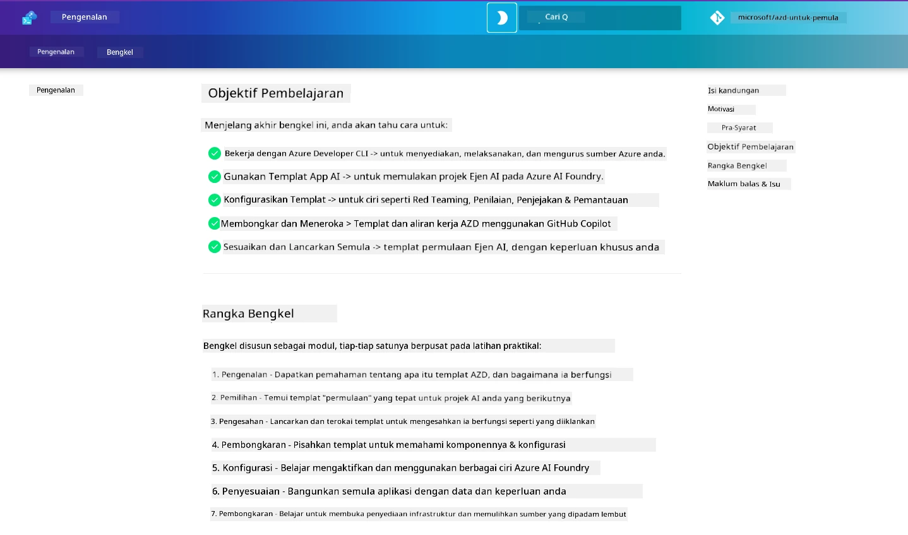

<div align="center">
  <div style="background: linear-gradient(135deg, #0078d4, #106ebe); border-radius: 10px; padding: 20px; margin: 20px 0; box-shadow: 0 4px 15px rgba(0, 120, 212, 0.3); border: 2px solid #005a9e;">
    <h2 style="color: white; margin: 0; font-size: 24px; text-shadow: 1px 1px 2px rgba(0,0,0,0.3);">
      🎯 Bengkel AZD untuk Pembangun AI
    </h2>
    <p style="color: white; margin: 10px 0 0 0; font-size: 16px; text-shadow: 1px 1px 2px rgba(0,0,0,0.3);">
      <strong>Sebuah bengkel praktikal untuk membina aplikasi AI dengan Azure Developer CLI.</strong><br>
      Selesaikan 7 modul untuk menguasai templat AZD dan aliran kerja penyebaran AI.
    </p>
    <div style="margin-top: 15px;">
      <span style="background: rgba(255,255,255,0.2); padding: 5px 10px; border-radius: 15px; color: white; font-size: 14px;">
        📅 Dikemas Kini Terakhir: Mac 2026
      </span>
    </div>
  </div>
</div>

# Bengkel AZD untuk Pembangun AI

Selamat datang ke bengkel praktikal untuk mempelajari Azure Developer CLI (AZD) dengan fokus pada penyebaran aplikasi AI. Bengkel ini membantu anda memperoleh pemahaman terapan tentang templat AZD dalam 3 langkah:

1. **Penemuan** - cari templat yang sesuai untuk anda.
1. **Penyebaran** - sebarkan dan sahkan ia berfungsi
1. **Penyesuaian** - ubah suai dan iterasi untuk menjadikannya milik anda!

Sepanjang bengkel ini, anda juga akan diperkenalkan dengan alat pembangun teras dan aliran kerja, untuk membantu anda memperkemas perjalanan pembangunan anda dari awal hingga akhir.

<br/>

## Panduan Berasaskan Penyemak Imbas

Pelajaran bengkel dalam bentuk Markdown. Anda boleh melayari secara langsung di GitHub - atau lancarkan pratonton berasaskan penyemak imbas seperti yang ditunjukkan dalam tangkapan skrin di bawah.



Untuk menggunakan pilihan ini - buat forking repositori ke profil anda, dan lancarkan GitHub Codespaces. Setelah terminal VS Code aktif, taip arahan ini:

Pratonton penyemak imbas ini berfungsi dalam GitHub Codespaces, kontena pembangunan, atau klon tempatan dengan Python dan MkDocs dipasang.

```bash title="" linenums="0"
mkdocs serve > /dev/null 2>&1 &
```

Dalam beberapa saat, anda akan melihat dialog pop-up. Pilih pilihan untuk `Open in browser`. Panduan berasaskan web kini akan dibuka dalam tab penyemak imbas baru. Beberapa manfaat pratonton ini:

1. **Carian terbina dalam** - cari kata kunci atau pelajaran dengan cepat.
1. **Ikon salin** - gerakkan kursor ke atas blok kod untuk melihat pilihan ini
1. **Togol tema** - tukar antara tema gelap dan terang
1. **Dapatkan bantuan** - klik ikon Discord di footer untuk sertai!

<br/>

## Gambaran Keseluruhan Bengkel

**Tempoh:** 3-4 jam  
**Tahap:** Pemula hingga Pertengahan  
**Pra-syarat:** Kefahaman tentang Azure, konsep AI, VS Code & alat baris perintah.

Ini adalah bengkel praktikal di mana anda belajar dengan melakukan. Setelah anda menyelesaikan latihan, kami mengesyorkan menyemak kurikulum AZD Untuk Pemula untuk meneruskan perjalanan pembelajaran anda ke dalam amalan terbaik Keselamatan dan Produktiviti.

| Masa| Modul  | Objektif |
|:---|:---|:---|
| 15 minit | [Pengenalan](docs/instructions/0-Introduction.md) | Mewujudkan asas, fahami matlamat |
| 30 minit | [Pilih Templat AI](docs/instructions/1-Select-AI-Template.md) | Terokai pilihan dan pilih permulaan | 
| 30 minit | [Sahkan Templat AI](docs/instructions/2-Validate-AI-Template.md) | Sebarkan penyelesaian lalai ke Azure |
| 30 minit | [Huraikan Templat AI](docs/instructions/3-Deconstruct-AI-Template.md) | Terokai struktur dan konfigurasi |
| 30 minit | [Konfigurasikan Templat AI](docs/instructions/4-Configure-AI-Template.md) | Aktifkan dan cuba ciri yang tersedia |
| 30 minit | [Sesuaikan Templat AI](docs/instructions/5-Customize-AI-Template.md) | Sesuaikan templat mengikut keperluan anda |
| 30 minit | [Leraikan Infrastruktur](docs/instructions/6-Teardown-Infrastructure.md) | Bersihkan dan lepaskan sumber |
| 15 minit | [Penutup & Langkah Seterusnya](docs/instructions/7-Wrap-up.md) | Sumber pembelajaran, cabaran Bengkel |

<br/>

## Apa Yang Anda Akan Pelajari

Fikirkan Templat AZD sebagai ruang pembelajaran untuk meneroka pelbagai kebolehan dan alat untuk pembangunan menyeluruh pada Microsoft Foundry. Pada akhir bengkel ini, anda sepatutnya mempunyai rasa intuitif untuk pelbagai alat dan konsep dalam konteks ini.

| Konsep  | Objektif |
|:---|:---|
| **Azure Developer CLI** | Fahami arahan dan aliran kerja alat |
| **Templat AZD**| Fahami struktur projek dan konfigurasi |
| **Ejen AI Azure**| Sediakan & sebarkan projek Microsoft Foundry  |
| **Carian AI Azure**| Aktifkan kejuruteraan konteks dengan ejen |
| **Observability**| Terokai pengesanan, pemantauan dan penilaian |
| **Pasukan Merah**| Terokai ujian adversari dan mitigasi |

<br/>

## Struktur Bengkel

Bengkel ini disusun untuk membawa anda dalam perjalanan dari penemuan templat, ke penyebaran, pendedahan, dan penyesuaian - menggunakan templat permulaan rasmi [Getting Started with AI Agents](https://github.com/Azure-Samples/get-started-with-ai-agents) sebagai asas.

### [Modul 1: Pilih Templat AI](docs/instructions/1-Select-AI-Template.md) (30 minit)

- Apakah Templat AI?
- Di mana saya boleh menemui Templat AI?
- Bagaimana saya boleh mula membina Ejen AI?
- **Makmal**: Permulaan pantas dalam Codespaces atau kontena pembangunan

### [Modul 2: Sahkan Templat AI](docs/instructions/2-Validate-AI-Template.md) (30 minit)

- Apakah Seni Bina Templat AI?
- Apakah Aliran Kerja Pembangunan AZD?
- Bagaimana saya boleh mendapatkan bantuan dengan Pembangunan AZD?
- **Makmal**: Sebarkan & Sahkan templat Ejen AI

### [Modul 3: Huraikan Templat AI](docs/instructions/3-Deconstruct-AI-Template.md) (30 minit)

- Terokai persekitaran anda dalam `.azure/` 
- Terokai tetapan sumber anda dalam `infra/` 
- Terokai konfigurasi AZD anda dalam `azure.yaml`s
- **Makmal**: Ubah Pembolehubah Persekitaran & Sebarkan semula

### [Modul 4: Konfigurasikan Templat AI](docs/instructions/4-Configure-AI-Template.md) (30 minit)
- Terokai: Retrieval Augmented Generation
- Terokai: Penilaian Ejen & Pasukan Merah
- Terokai: Pengesanan & Pemantauan
- **Makmal**: Terokai Ejen AI + Observability 

### [Modul 5: Sesuaikan Templat AI](docs/instructions/5-Customize-AI-Template.md) (30 minit)
- Definisikan: PRD dengan Keperluan Senario
- Konfigurasikan: Pembolehubah Persekitaran untuk AZD
- Laksanakan: Hooks Kitaran Hayat untuk tugas tambahan
- **Makmal**: Sesuaikan templat untuk senario saya

### [Modul 6: Leraikan Infrastruktur](docs/instructions/6-Teardown-Infrastructure.md) (30 minit)
- Ulas: Apakah Templat AZD?
- Ulas: Kenapa gunakan Azure Developer CLI?
- Langkah Seterusnya: Cuba templat lain!
- **Makmal**: Nyahperuntukan infrastruktur & pembersihan

<br/>

## Cabaran Bengkel

Mahukan cabaran untuk lakukan lebih banyak? Berikut adalah beberapa cadangan projek - atau kongsikan idea anda dengan kami!!

| Projek | Penerangan |
|:---|:---|
|1. **Huraikan Templat AI Kompleks** | Gunakan aliran kerja dan alat yang kami gariskan dan lihat jika anda boleh sebarkan, sahkan, dan sesuaikan templat penyelesaian AI yang berbeza. _Apa yang anda pelajari?_|
|2. **Sesuaikan Dengan Senario Anda**  | Cuba tulis PRD (Dokumen Keperluan Produk) untuk senario berbeza. Kemudian gunakan GitHub Copilot dalam repo templat anda dalam Agen Model - dan minta ia jana aliran kerja penyesuaian untuk anda. _Apa yang anda pelajari? Bagaimana anda boleh memperbaiki cadangan ini?_|
| | |

## Ada maklum balas?

1. Poskan isu di repositori ini - tandakan dengan `Workshop` untuk kemudahan.
1. Sertai Microsoft Foundry Discord - berhubung dengan rakan sebaya anda!


| | | 
|:---|:---|
| **📚 Laman Utama Kursus**| [AZD Untuk Pemula](../README.md)|
| **📖 Dokumentasi** | [Mula dengan templat AI](https://learn.microsoft.com/en-us/azure/ai-foundry/how-to/develop/ai-template-get-started)|
| **🛠️Templat AI** | [Microsoft Foundry Templates](https://ai.azure.com/templates) |
|**🚀 Langkah Seterusnya** | [Mula Bengkel](#gambaran-keseluruhan-bengkel) |
| | |

<br/>

---

**Navigasi:** [Kursus Utama](../README.md) | [Pengenalan](docs/instructions/0-Introduction.md) | [Modul 1: Pilih Templat](docs/instructions/1-Select-AI-Template.md)

**Sedia untuk mula membina aplikasi AI dengan AZD?**

[Mula Bengkel: Pengenalan →](docs/instructions/0-Introduction.md)

---

<!-- CO-OP TRANSLATOR DISCLAIMER START -->
**Penafian**:  
Dokumen ini telah diterjemahkan menggunakan perkhidmatan terjemahan AI [Co-op Translator](https://github.com/Azure/co-op-translator). Walaupun kami berusaha untuk ketepatan, sila ambil maklum bahawa terjemahan automatik mungkin mengandungi ralat atau ketidaktepatan. Dokumen asal dalam bahasa asalnya hendaklah dianggap sebagai sumber yang sahih. Untuk maklumat penting, terjemahan profesional oleh manusia adalah disyorkan. Kami tidak bertanggungjawab atas sebarang salah faham atau salah tafsir yang timbul daripada penggunaan terjemahan ini.
<!-- CO-OP TRANSLATOR DISCLAIMER END -->