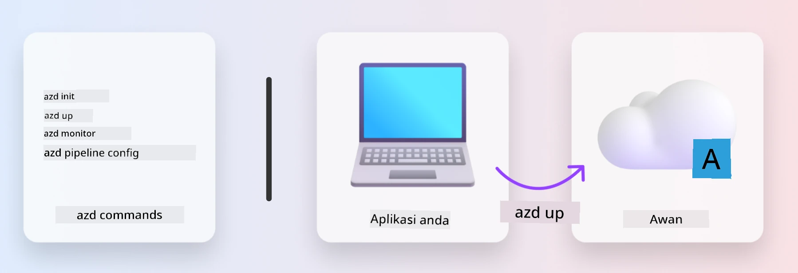
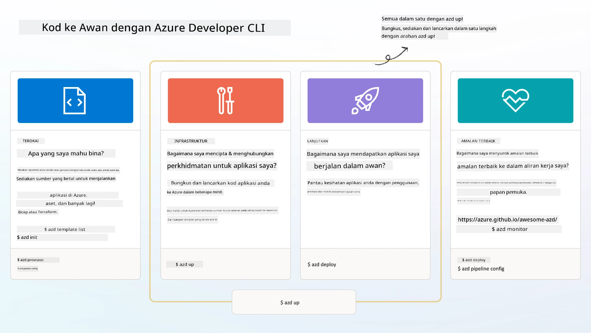

# 1. Pilih Templat

!!! tip "PADA AKHIR MODUL INI ANDA AKAN DAPAT"

    - [ ] Huraikan apa itu templat AZD
    - [ ] Temui dan gunakan templat AZD untuk AI
    - [ ] Mulakan dengan templat AI Agents
    - [ ] **Makmal 1:** AZD Quickstart dengan GitHub Codespaces

---

## 1. Analogi Pembina

Membina aplikasi AI yang sedia perusahaan moden _dari awal_ boleh menjadi satu cabaran. Ia sedikit seperti membina rumah baru anda sendiri, bata demi bata. Ya, ia boleh dilakukan! Tetapi ini bukanlah cara yang paling berkesan untuk mendapatkan hasil yang diingini!

Sebaliknya, kita sering bermula dengan _rangka reka bentuk_ yang sedia ada, dan bekerjasama dengan seorang arkitek untuk menyesuaikannya mengikut keperluan peribadi kita. Itulah pendekatan yang betul apabila membina aplikasi pintar. Mula-mula, cari seni bina reka bentuk yang sesuai dengan ruang masalah anda. Kemudian bekerjasama dengan arkitek penyelesaian untuk menyesuaikan dan membangunkan penyelesaian untuk senario spesifik anda.

Tetapi di manakah kita boleh mendapatkan rangka reka bentuk ini? Dan bagaimana kita mencari arkitek yang sanggup mengajar kita bagaimana menyesuaikan dan menyebarkan rangka reka bentuk ini sendiri? Dalam bengkel ini, kami menjawab soalan-soalan tersebut dengan memperkenalkan anda kepada tiga teknologi:

1. [Azure Developer CLI](https://aka.ms/azd) - satu alat sumber terbuka yang mempercepatkan laluan pembangun dari pembangunan tempatan (bina) ke penyebaran awan (hantar).
1. [Microsoft Foundry Templates](https://ai.azure.com/templates) - repositori sumber terbuka berstandard yang mengandungi contoh kod, infrastruktur, dan fail konfigurasi untuk menyebarkan seni bina penyelesaian AI.
1. [GitHub Copilot Agent Mode](https://code.visualstudio.com/docs/copilot/chat/chat-agent-mode) - ejen pengkodan yang berasaskan pengetahuan Azure, yang boleh membimbing kita menavigasi pangkalan kod dan membuat perubahan - menggunakan bahasa semula jadi.

Dengan alat-alat ini di tangan, kita kini boleh _meneroka_ templat yang betul, _menyebarkannya_ untuk mengesahkan ia berfungsi, dan _menyesuaikannya_ mengikut senario khusus kita. Mari kita selami dan pelajari cara ia berfungsi.

---

## 2. Azure Developer CLI

[Azure Developer CLI](https://learn.microsoft.com/en-us/azure/developer/azure-developer-cli/) (atau `azd`) adalah alat baris perintah sumber terbuka yang dapat mempercepatkan perjalanan kod-ke-awan anda dengan set arahan mesra pembangun yang berfungsi dengan konsisten di seluruh IDE (pembangunan) dan persekitaran CI/CD (devops) anda.

Dengan `azd`, perjalanan penyebaran anda boleh semudah:

- `azd init` - Memulakan projek AI baru dari templat AZD sedia ada.
- `azd up` - Menyediakan infrastruktur dan menyebarkan aplikasi anda dalam satu langkah.
- `azd monitor` - Mendapatkan pemantauan masa nyata dan diagnostik untuk aplikasi yang disebarkan.
- `azd pipeline config` - Menyediakan saluran CI/CD untuk mengautomasi penyebaran ke Azure.

**🎯 | LATIHAN**: <br/> Terokai alat baris perintah `azd` dalam persekitaran GitHub Codespaces anda sekarang. Mula dengan menaip arahan ini untuk melihat apa yang boleh dilakukan oleh alat ini:

```bash title="" linenums="0"
azd help
```



---

## 3. Templat AZD

Untuk `azd` mencapai ini, ia perlu mengetahui infrastruktur yang hendak disediakan, tetapan konfigurasi yang perlu dikuatkuasakan, dan aplikasi yang hendak disebarkan. Di sinilah [templat AZD](https://learn.microsoft.com/en-us/azure/developer/azure-developer-cli/azd-templates?tabs=csharp) berperanan.

Templat AZD adalah repositori sumber terbuka yang menggabungkan contoh kod dengan fail infrastruktur dan konfigurasi yang diperlukan untuk menyebarkan seni bina penyelesaian.
Dengan menggunakan pendekatan _Infrastructure-as-Code_ (IaC), ia membolehkan definisi sumber templat dan tetapan konfigurasi dikawal versi (seperti kod sumber aplikasi) - mewujudkan aliran kerja yang boleh digunakan semula dan konsisten di kalangan pengguna projek tersebut.

Apabila membuat atau menggunakan semula templat AZD untuk senario _anda_, pertimbangkan soalan-soalan ini:

1. Apa yang anda bina? → Adakah terdapat templat yang mempunyai kod permulaan untuk senario tersebut?
1. Bagaimana seni bina penyelesaian anda? → Adakah terdapat templat yang mempunyai sumber yang diperlukan?
1. Bagaimana penyelesaian anda disebarkan? → Fikirkan `azd deploy` dengan hooks pra/pasca pemprosesan!
1. Bagaimana anda boleh mengoptimumkannya lagi? → Fikirkan pemantauan terbina dalam dan saluran automasi!

**🎯 | LATIHAN**: <br/> 
Lawati galeri [Awesome AZD](https://azure.github.io/awesome-azd/) dan gunakan penapis untuk meneroka lebih 250 templat yang kini tersedia. Lihat sama ada anda boleh mencari satu yang selaras dengan keperluan senario _anda_.



---

## 4. Templat Aplikasi AI

Untuk aplikasi berkuasa AI, Microsoft menyediakan templat khusus yang menampilkan **Microsoft Foundry** dan **Foundry Agents**. Templat ini mempercepatkan laluan anda untuk membina aplikasi pintar yang sedia untuk produksi.

### Templat Microsoft Foundry & Foundry Agents

Pilih templat di bawah untuk disebarkan. Setiap templat tersedia di [Awesome AZD](https://azure.github.io/awesome-azd/) dan boleh dimulakan dengan satu arahan sahaja.

| Templat | Penerangan | Arahan Penyebaran |
|----------|-------------|----------------|
| **[AI Chat dengan RAG](https://azure.github.io/awesome-azd/?tags=ai&tags=rag)** | Aplikasi chat dengan Retrieval Augmented Generation menggunakan Microsoft Foundry | `azd init -t azure-samples/azure-search-openai-demo` |
| **[Foundry Agent Service Starter](https://azure.github.io/awesome-azd/?tags=ai&tags=agents)** | Bina agen AI dengan Foundry Agents untuk pelaksanaan tugasan autonomi | `azd init -t azure-samples/foundry-agent-service-starter` |
| **[Pengurusan Multi-Agen](https://azure.github.io/awesome-azd/?tags=ai&tags=agents)** | Menyelaras pelbagai Foundry Agents untuk aliran kerja yang kompleks | `azd init -t azure-samples/multi-agent-orchestration` |
| **[AI Dokumen Intelligent](https://azure.github.io/awesome-azd/?tags=ai&tags=document)** | Ekstrak dan analisis dokumen menggunakan model Microsoft Foundry | `azd init -t azure-samples/ai-document-processing` |
| **[Bot AI Perbualan](https://azure.github.io/awesome-azd/?tags=ai&tags=bot)** | Bina chatbot pintar dengan integrasi Microsoft Foundry | `azd init -t azure-samples/ai-chat-protocol` |
| **[Penjanaan Imej AI](https://azure.github.io/awesome-azd/?tags=ai&tags=dalle)** | Jana imej menggunakan DALL-E melalui Microsoft Foundry | `azd init -t azure-samples/ai-image-generation` |
| **[Agen Semantic Kernel](https://azure.github.io/awesome-azd/?tags=ai&tags=semantic-kernel)** | Agen AI menggunakan Semantic Kernel dengan Foundry Agents | `azd init -t azure-samples/semantic-kernel-agent` |
| **[AutoGen Multi-Agen](https://azure.github.io/awesome-azd/?tags=ai&tags=autogen)** | Sistem multi-agen menggunakan rangka kerja AutoGen | `azd init -t azure-samples/autogen-multi-agent` |

### Bermula dengan Cepat

1. **Semak templat**: Lawati [https://azure.github.io/awesome-azd/](https://azure.github.io/awesome-azd/) dan tapis mengikut `AI`, `Agents`, atau `Microsoft Foundry`
2. **Pilih templat anda**: Pilih satu yang sesuai dengan kes penggunaan anda
3. **Mulakan**: Jalankan arahan `azd init` untuk templat pilihan anda
4. **Sebar**: Jalankan `azd up` untuk menyediakan dan menyebarkan

**🎯 | LATIHAN**: <br/>
Pilih salah satu templat di atas berdasarkan senario anda:

- **Membina chatbot?** → Mulakan dengan **AI Chat dengan RAG** atau **Bot AI Perbualan**
- **Perlukan agen autonomi?** → Cuba **Foundry Agent Service Starter** atau **Pengurusan Multi-Agen**
- **Memproses dokumen?** → Gunakan **AI Dokumen Intelligent**
- **Mahukan bantuan pengkodan AI?** → Terokai **Agen Semantic Kernel** atau **AutoGen Multi-Agen**

```bash title="Example: Deploy the AI Chat with RAG template" linenums="0"
azd init -t azure-samples/azure-search-openai-demo
azd up
```

!!! info "Terokai Lebih Banyak Templat"
    Galeri [Awesome AZD](https://azure.github.io/awesome-azd/) mengandungi lebih 250 templat. Gunakan penapis untuk mencari templat yang memenuhi keperluan khusus anda untuk bahasa, rangka kerja, dan perkhidmatan Azure.

---

<!-- CO-OP TRANSLATOR DISCLAIMER START -->
**Penafian**:  
Dokumen ini telah diterjemahkan menggunakan perkhidmatan terjemahan AI [Co-op Translator](https://github.com/Azure/co-op-translator). Walaupun kami berusaha untuk memastikan ketepatan, sila ambil maklum bahawa terjemahan automatik mungkin mengandungi kesilapan atau ketidaktepatan. Dokumen asal dalam bahasa asalnya harus dianggap sebagai sumber yang sahih. Untuk maklumat penting, terjemahan profesional oleh manusia adalah disyorkan. Kami tidak bertanggungjawab atas sebarang salah faham atau salah tafsir yang timbul daripada penggunaan terjemahan ini.
<!-- CO-OP TRANSLATOR DISCLAIMER END -->