# 2. Sahkan Template

!!! tip "MENJELANG AKHIR MODUL INI ANDA AKAN DAPAT"

    - [ ] Menganalisis Seni Bina Penyelesaian AI
    - [ ] Memahami Aliran Kerja Penerapan AZD
    - [ ] Menggunakan GitHub Copilot untuk mendapatkan bantuan tentang penggunaan AZD
    - [ ] **Lab 2:** Terapkan & Sahkan template AI Agents

---

## 1. Pengenalan

[Azure Developer CLI](https://learn.microsoft.com/en-us/azure/developer/azure-developer-cli/) atau `azd` adalah alat baris perintah sumber terbuka yang mempermudah aliran kerja pembangun semasa membina dan menerapkan aplikasi ke Azure.

[AZD Templates](https://learn.microsoft.com/azure/developer/azure-developer-cli/azd-templates) adalah repositori standard yang merangkumi kod aplikasi contoh, aset _infrastructure as code_, dan fail konfigurasi `azd` untuk seni bina penyelesaian yang menyeluruh. Penyediaan infrastruktur menjadi semudah perintah `azd provision` - sementara menggunakan `azd up` membolehkan anda menyediakan infrastruktur **dan** menerapkan aplikasi anda dalam satu langkah!

Hasilnya, memulakan proses pembangunan aplikasi anda boleh menjadi semudah mencari _AZD Starter template_ yang paling sesuai dengan keperluan aplikasi dan infrastruktur anda - kemudian menyesuaikan repositori untuk memenuhi keperluan senario anda.

Sebelum kita bermula, pastikan anda telah memasang Azure Developer CLI.

1. Buka terminal VS Code dan taip perintah ini:

      ```bash title="" linenums="0"
      azd version
      ```

1. Anda sepatutnya melihat sesuatu seperti ini!

      ```bash title="" linenums="0"
      azd version 1.19.0 (commit b3d68cea969b2bfbaa7b7fa289424428edb93e97)
      ```

**Anda kini bersedia untuk memilih dan menerapkan template dengan azd**

---

## 2. Pemilihan Template

Platform Azure AI Foundry dilengkapi dengan [set template AZD yang disyorkan](https://learn.microsoft.com/en-us/azure/ai-foundry/how-to/develop/ai-template-get-started) yang merangkumi senario penyelesaian popular seperti _automasi aliran kerja multi-agen_ dan _pemprosesan kandungan multi-modal_. Anda juga boleh menemui template ini dengan melawat portal Azure AI Foundry.

1. Lawati [https://ai.azure.com/templates](https://ai.azure.com/templates)
1. Log masuk ke portal Azure AI Foundry apabila diminta - anda akan melihat sesuatu seperti ini.

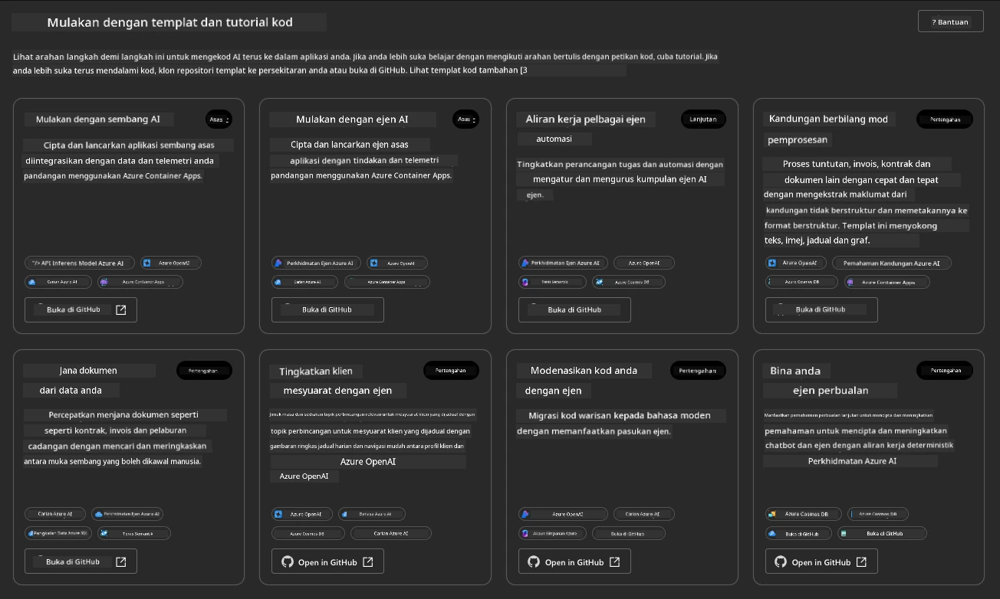

Pilihan **Basic** adalah template permulaan anda:

1. [ ] [Get Started with AI Chat](https://github.com/Azure-Samples/get-started-with-ai-chat) yang menerapkan aplikasi sembang asas _dengan data anda_ ke Azure Container Apps. Gunakan ini untuk meneroka senario chatbot AI asas.
1. [X] [Get Started with AI Agents](https://github.com/Azure-Samples/get-started-with-ai-agents) yang juga menerapkan AI Agent standard (dengan Azure AI Agent Service). Gunakan ini untuk membiasakan diri dengan penyelesaian AI yang melibatkan alat dan model.

Lawati pautan kedua dalam tab penyemak imbas baru (atau klik `Open in GitHub` untuk kad berkaitan). Anda sepatutnya melihat repositori untuk Template AZD ini. Luangkan masa untuk meneroka README. Seni bina aplikasi kelihatan seperti ini:

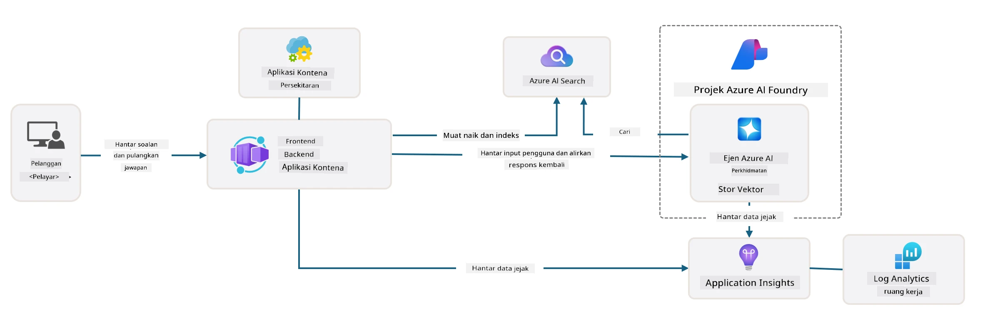

---

## 3. Pengaktifan Template

Mari kita cuba menerapkan template ini dan pastikan ia sah. Kita akan mengikuti panduan dalam bahagian [Getting Started](https://github.com/Azure-Samples/get-started-with-ai-agents?tab=readme-ov-file#getting-started).

1. Klik [pautan ini](https://github.com/codespaces/new/Azure-Samples/get-started-with-ai-agents) - sahkan tindakan lalai untuk `Create codespace`
1. Ini membuka tab penyemak imbas baru - tunggu sesi GitHub Codespaces selesai dimuatkan
1. Buka terminal VS Code dalam Codespaces - taip perintah berikut:

   ```bash title="" linenums="0"
   azd up
   ```

Lengkapkan langkah aliran kerja yang akan dicetuskan:

1. Anda akan diminta untuk log masuk ke Azure - ikuti arahan untuk mengesahkan
1. Masukkan nama persekitaran unik untuk anda - contohnya, saya menggunakan `nitya-mshack-azd`
1. Ini akan mencipta folder `.azure/` - anda akan melihat subfolder dengan nama persekitaran
1. Anda akan diminta untuk memilih nama langganan - pilih lalai
1. Anda akan diminta untuk lokasi - gunakan `East US 2`

Sekarang, tunggu penyediaan selesai. **Ini mengambil masa 10-15 minit**

1. Apabila selesai, konsol anda akan menunjukkan mesej SUCCESS seperti ini:
      ```bash title="" linenums="0"
      SUCCESS: Your up workflow to provision and deploy to Azure completed in 10 minutes 17 seconds.
      ```

1. Portal Azure anda kini akan mempunyai kumpulan sumber yang disediakan dengan nama persekitaran itu:

      

1. **Anda kini bersedia untuk mengesahkan infrastruktur dan aplikasi yang diterapkan**.

---

## 4. Pengesahan Template

1. Lawati halaman [Resource Groups](https://portal.azure.com/#browse/resourcegroups) di Portal Azure - log masuk apabila diminta
1. Klik pada RG untuk nama persekitaran anda - anda akan melihat halaman di atas

      - klik pada sumber Azure Container Apps
      - klik pada Application Url di bahagian _Essentials_ (kanan atas)

1. Anda sepatutnya melihat UI aplikasi yang dihoskan seperti ini:

   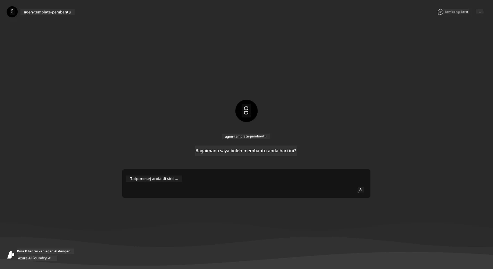

1. Cuba tanya beberapa [soalan contoh](https://github.com/Azure-Samples/get-started-with-ai-agents/blob/main/docs/sample_questions.md)

      1. Tanya: ```What is the capital of France?``` 
      1. Tanya: ```What's the best tent under $200 for two people, and what features does it include?```

1. Anda sepatutnya mendapat jawapan yang serupa dengan apa yang ditunjukkan di bawah. _Tetapi bagaimana ini berfungsi?_ 

      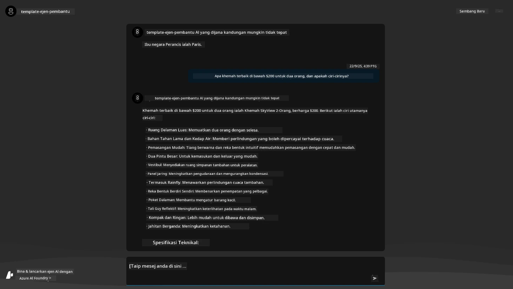

---

## 5. Pengesahan Agen

Azure Container App menerapkan titik akhir yang menghubungkan ke AI Agent yang disediakan dalam projek Azure AI Foundry untuk template ini. Mari kita lihat apa maksudnya.

1. Kembali ke halaman _Overview_ Portal Azure untuk kumpulan sumber anda

1. Klik pada sumber `Azure AI Foundry` dalam senarai itu

1. Anda sepatutnya melihat ini. Klik butang `Go to Azure AI Foundry Portal`. 
   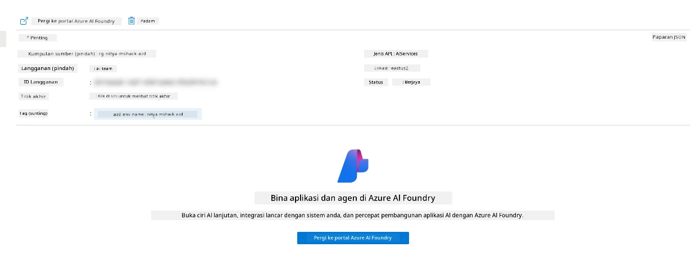

1. Anda sepatutnya melihat halaman Projek Foundry untuk aplikasi AI anda
   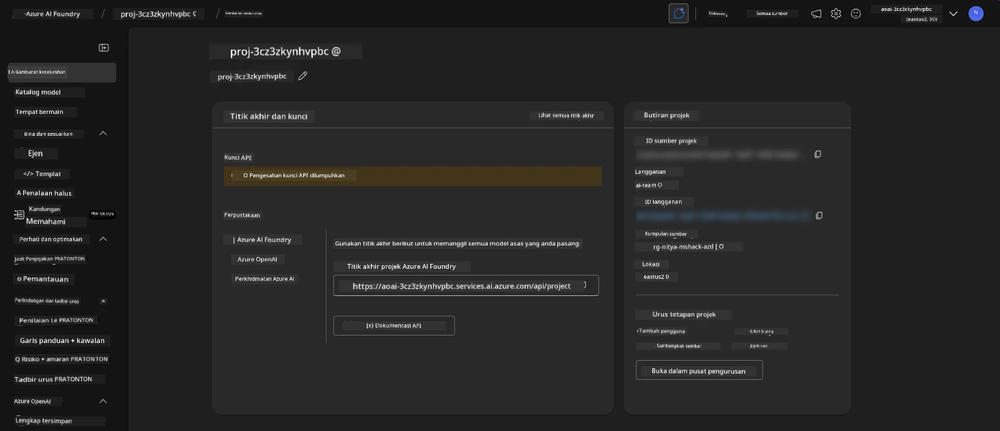

1. Klik pada `Agents` - anda akan melihat Agen lalai yang disediakan dalam projek anda
   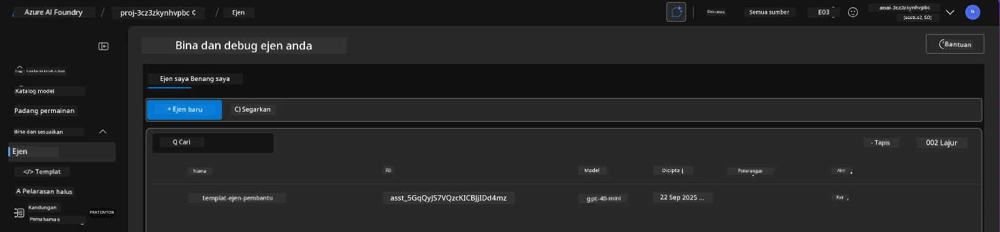

1. Pilihnya - dan anda akan melihat butiran Agen. Perhatikan perkara berikut:

      - Agen menggunakan File Search secara lalai (sentiasa)
      - `Knowledge` agen menunjukkan ia mempunyai 32 fail yang dimuat naik (untuk carian fail)
      

1. Cari pilihan `Data+indexes` dalam menu kiri dan klik untuk butiran. 

      - Anda sepatutnya melihat 32 fail data yang dimuat naik untuk pengetahuan.
      - Ini akan sepadan dengan 12 fail pelanggan dan 20 fail produk di bawah `src/files` 
      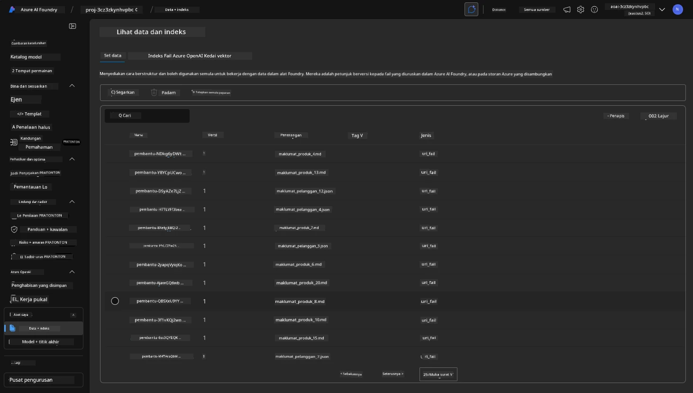

**Anda telah mengesahkan operasi Agen!** 

1. Respons agen berasaskan pengetahuan dalam fail-fail tersebut. 
1. Anda kini boleh bertanya soalan berkaitan data itu, dan mendapat respons yang berasaskan fakta.
1. Contoh: `customer_info_10.json` menerangkan 3 pembelian yang dibuat oleh "Amanda Perez"

Kembali ke tab penyemak imbas dengan titik akhir Container App dan tanya: `What products does Amanda Perez own?`. Anda sepatutnya melihat sesuatu seperti ini:

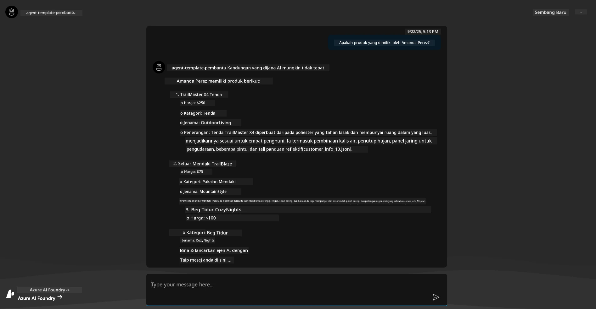

---

## 6. Agent Playground

Mari bina sedikit intuisi tentang keupayaan Azure AI Foundry, dengan mencuba Agen di Agent Playground. 

1. Kembali ke halaman `Agents` dalam Azure AI Foundry - pilih agen lalai
1. Klik pilihan `Try in Playground` - anda sepatutnya mendapat UI Playground seperti ini
1. Tanya soalan yang sama: `What products does Amanda Perez own?`

    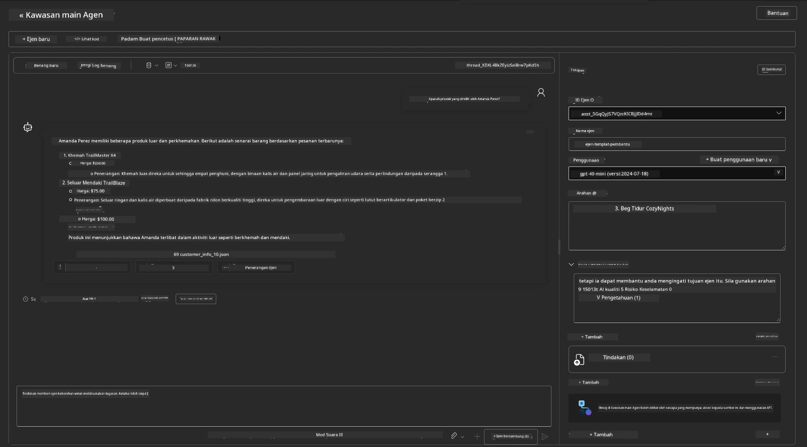

Anda mendapat respons yang sama (atau serupa) - tetapi anda juga mendapat maklumat tambahan yang boleh digunakan untuk memahami kualiti, kos, dan prestasi aplikasi agen anda. Contohnya:

1. Perhatikan bahawa respons memetik fail data yang digunakan untuk "mengasaskan" respons
1. Arahkan tetikus ke mana-mana label fail ini - adakah data sepadan dengan pertanyaan anda dan respons yang dipaparkan?

Anda juga melihat baris _stats_ di bawah respons. 

1. Arahkan tetikus ke mana-mana metrik - contohnya, Safety. Anda melihat sesuatu seperti ini
1. Adakah penilaian yang dinilai sepadan dengan intuisi anda untuk tahap keselamatan respons?

      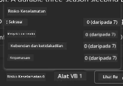

---x

## 7. Pemerhatian Terbina Dalam

Pemerhatian adalah tentang menginstrumentasikan aplikasi anda untuk menghasilkan data yang boleh digunakan untuk memahami, menyahpepijat, dan mengoptimumkan operasinya. Untuk mendapatkan gambaran tentang ini:

1. Klik butang `View Run Info` - anda sepatutnya melihat paparan ini. Ini adalah contoh [Agent tracing](https://learn.microsoft.com/en-us/azure/ai-foundry/how-to/develop/trace-agents-sdk#view-trace-results-in-the-azure-ai-foundry-agents-playground) dalam tindakan. _Anda juga boleh mendapatkan paparan ini dengan mengklik Thread Logs dalam menu utama_.

   - Dapatkan gambaran tentang langkah-langkah larian dan alat yang digunakan oleh agen
   - Fahami jumlah Token yang digunakan (berbanding penggunaan token output) untuk respons
   - Fahami latensi dan di mana masa dihabiskan dalam pelaksanaan

      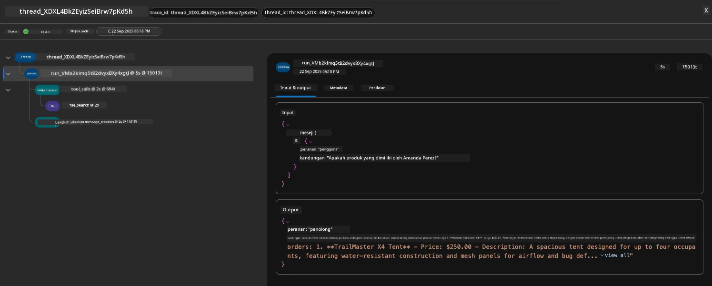

1. Klik tab `Metadata` untuk melihat atribut tambahan untuk larian, yang mungkin memberikan konteks berguna untuk menyahpepijat isu kemudian.   

      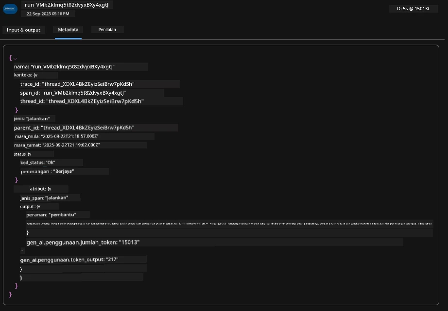

1. Klik tab `Evaluations` untuk melihat penilaian automatik yang dibuat pada respons agen. Ini termasuk penilaian keselamatan (contohnya, Self-harm) dan penilaian khusus agen (contohnya, Intent resolution, Task adherence).

      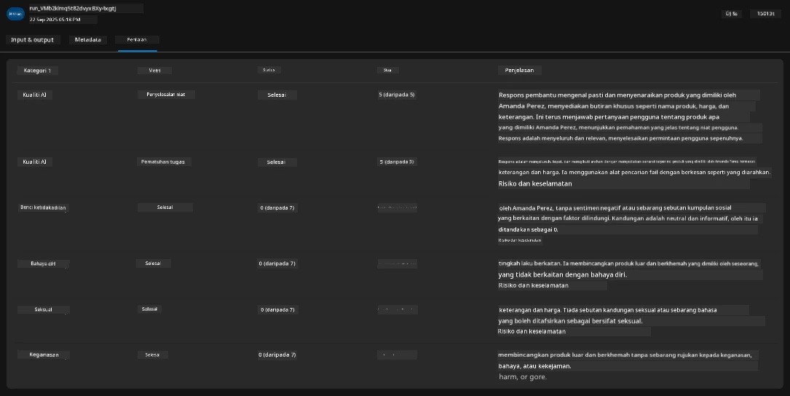

1. Akhir sekali, klik tab `Monitoring` dalam menu bar sisi.

      - Pilih tab `Resource usage` di halaman yang dipaparkan - dan lihat metrik.
      - Jejak penggunaan aplikasi dari segi kos (token) dan beban (permintaan).
      - Jejak latensi aplikasi hingga byte pertama (pemprosesan input) dan byte terakhir (output).

      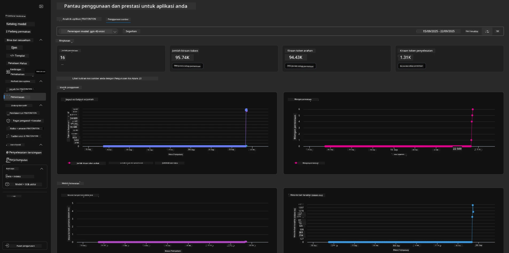

---

## 8. Pembolehubah Persekitaran

Setakat ini, kita telah melalui penerapan dalam penyemak imbas - dan mengesahkan bahawa infrastruktur kita disediakan dan aplikasi beroperasi. Tetapi untuk bekerja dengan aplikasi _berdasarkan kod_, kita perlu mengkonfigurasi persekitaran pembangunan tempatan kita dengan pembolehubah yang relevan yang diperlukan untuk bekerja dengan sumber-sumber ini. Menggunakan `azd` mempermudah proses ini.

1. Azure Developer CLI [menggunakan pembolehubah persekitaran](https://learn.microsoft.com/en-us/azure/developer/azure-developer-cli/manage-environment-variables?tabs=bash) untuk menyimpan dan mengurus tetapan konfigurasi untuk penerapan aplikasi.

1. Pembolehubah persekitaran disimpan dalam `.azure/<env-name>/.env` - ini membatasinya kepada persekitaran `env-name` yang digunakan semasa penerapan dan membantu anda mengasingkan persekitaran antara sasaran penerapan yang berbeza dalam repositori yang sama.

1. Pembolehubah persekitaran dimuat secara automatik oleh perintah `azd` setiap kali ia melaksanakan perintah tertentu (contohnya, `azd up`). Perhatikan bahawa `azd` tidak secara automatik membaca pembolehubah persekitaran _peringkat OS_ (contohnya, ditetapkan dalam shell) - sebaliknya gunakan `azd set env` dan `azd get env` untuk memindahkan maklumat dalam skrip.

Mari cuba beberapa perintah:

1. Dapatkan semua pembolehubah persekitaran yang ditetapkan untuk `azd` dalam persekitaran ini:

      ```bash title="" linenums="0"
      azd env get-values
      ```
      
      Anda melihat sesuatu seperti:

      ```bash title="" linenums="0"
      AZURE_AI_AGENT_DEPLOYMENT_NAME="gpt-4o-mini"
      AZURE_AI_AGENT_NAME="agent-template-assistant"
      AZURE_AI_EMBED_DEPLOYMENT_NAME="text-embedding-3-small"
      AZURE_AI_EMBED_DIMENSIONS=100
      ...
      ```

1. Dapatkan nilai tertentu - contohnya, saya ingin tahu jika kita menetapkan nilai `AZURE_AI_AGENT_MODEL_NAME`

      ```bash title="" linenums="0"
      azd env get-value AZURE_AI_AGENT_MODEL_NAME 
      ```
      
      Anda melihat sesuatu seperti ini - ia tidak ditetapkan secara lalai!

      ```bash title="" linenums="0"
      ERROR: key 'AZURE_AI_AGENT_MODEL_NAME' not found in the environment values
      ```

1. Tetapkan pembolehubah persekitaran baru untuk `azd`. Di sini, kita mengemas kini nama model agen. _Nota: sebarang perubahan yang dibuat akan segera tercermin dalam fail `.azure/<env-name>/.env`.

      ```bash title="" linenums="0"
      azd env set AZURE_AI_AGENT_MODEL_NAME gpt-4.1
      azd env set AZURE_AI_AGENT_MODEL_VERSION 2025-04-14
      azd env set AZURE_AI_AGENT_DEPLOYMENT_CAPACITY 150
      ```

      Sekarang, kita sepatutnya mendapati nilai telah ditetapkan:

      ```bash title="" linenums="0"
      azd env get-value AZURE_AI_AGENT_MODEL_NAME 
      ```

1. Perhatikan bahawa beberapa sumber adalah berterusan (contohnya, penerapan model) dan akan memerlukan lebih daripada sekadar `azd up` untuk memaksa penerapan semula. Mari cuba membongkar penerapan asal dan menerapkan semula dengan pembolehubah persekitaran yang diubah.

1. **Refresh** Jika anda sebelum ini telah menerapkan infrastruktur menggunakan template azd - anda boleh _refresh_ keadaan pembolehubah persekitaran tempatan anda berdasarkan keadaan semasa penerapan Azure anda menggunakan perintah ini:
      ```bash title="" linenums="0"
      azd env refresh
      ```

      Ini adalah cara yang berkuasa untuk _menyelaraskan_ pembolehubah persekitaran di antara dua atau lebih persekitaran pembangunan tempatan (contohnya, pasukan dengan beberapa pembangun) - membolehkan infrastruktur yang digunakan berfungsi sebagai sumber kebenaran untuk keadaan pembolehubah persekitaran. Ahli pasukan hanya perlu _menyegarkan_ pembolehubah untuk kembali selaras.

---

## 9. Tahniah 🏆

Anda baru sahaja melengkapkan aliran kerja hujung ke hujung di mana anda:

- [X] Memilih Templat AZD Yang Anda Mahu Gunakan
- [X] Melancarkan Templat Dengan GitHub Codespaces 
- [X] Menggunakan Templat dan mengesahkan ia berfungsi

---

