# 2. Sahkan Template

> Disahkan menggunakan `azd 1.23.12` pada Mac 2026.

!!! tip "PADA AKHIR MODUL INI ANDA AKAN BOLEH"

    - [ ] Menganalisis Seni Bina Penyelesaian AI
    - [ ] Memahami Aliran Kerja Penyebaran AZD
    - [ ] Menggunakan GitHub Copilot untuk mendapatkan bantuan mengenai penggunaan AZD
    - [ ] **Makmal 2:** Sebarkan & Sahkan templat AI Agents

---


## 1. Pengenalan

[Azure Developer CLI](https://learn.microsoft.com/en-us/azure/developer/azure-developer-cli/) atau `azd` adalah alat baris perintah sumber terbuka yang memudahkan aliran kerja pembangun semasa membina dan menyebarkan aplikasi ke Azure.

[AZD Templates](https://learn.microsoft.com/azure/developer/azure-developer-cli/azd-templates) adalah repositori standard yang merangkumi kod aplikasi contoh, aset _infrastruktur-sebagai-kod_, dan fail konfigurasi `azd` untuk seni bina penyelesaian yang padu. Penyediaan infrastruktur menjadi semudah perintah `azd provision` - sementara menggunakan `azd up` membolehkan anda menyediakan infrastruktur **dan** menyebarkan aplikasi anda dalam satu langkah!

Sebagai hasilnya, memulakan proses pembangunan aplikasi anda boleh menjadi semudah mencari _templat Pemula AZD_ yang paling hampir dengan keperluan aplikasi dan infrastruktur anda - kemudian menyesuaikan repositori mengikut keperluan senario anda.

Sebelum kita mula, pastikan anda telah memasang Azure Developer CLI.

1. Buka terminal VS Code dan taip arahan ini:

      ```bash title="" linenums="0"
      azd version
      ```

1. Anda akan melihat sesuatu seperti ini!

      ```bash title="" linenums="0"
      azd version 1.23.12 (commit <current-build>)
      ```

**Anda kini bersedia untuk memilih dan menyebarkan templat dengan azd**

---

## 2. Pemilihan Templat

Platform Microsoft Foundry hadir dengan [set templat AZD yang disyorkan](https://learn.microsoft.com/en-us/azure/ai-foundry/how-to/develop/ai-template-get-started) yang meliputi senario penyelesaian popular seperti _automasi aliran kerja pelbagai ejen_ dan _pemprosesan kandungan multimodal_. Anda juga boleh menemui templat-templat ini dengan melayari portal Microsoft Foundry.

1. Lawati [https://ai.azure.com/templates](https://ai.azure.com/templates)
1. Log masuk ke portal Microsoft Foundry apabila diminta - anda akan melihat sesuatu seperti ini.

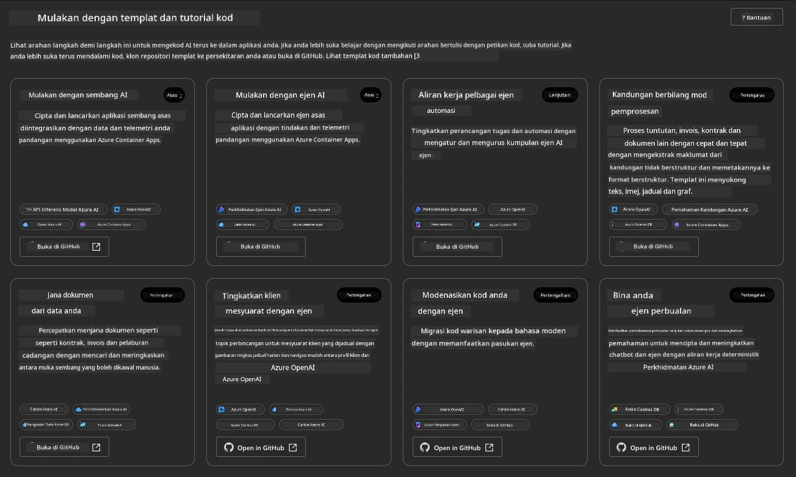


Pilihan **Basic** adalah templat permulaan anda:

1. [ ] [Mulakan dengan AI Chat](https://github.com/Azure-Samples/get-started-with-ai-chat) yang menyebarkan aplikasi chat asas _dengan data anda_ ke Azure Container Apps. Gunakan ini untuk meneroka senario chatbot AI asas.
1. [X] [Mulakan dengan AI Agents](https://github.com/Azure-Samples/get-started-with-ai-agents) yang juga menyebarkan Ejen AI standard (dengan Foundry Agents). Gunakan ini untuk membiasakan diri dengan penyelesaian AI ejen yang melibatkan alat dan model.

Lawati pautan kedua dalam tab pelayar baru (atau klik `Open in GitHub` untuk kad berkaitan). Anda akan melihat repositori untuk Templat AZD ini. Luangkan masa untuk meneroka README. Seni bina aplikasi kelihatan seperti ini:

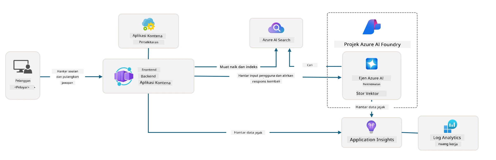

---

## 3. Pengaktifan Templat

Mari cuba menyebarkan templat ini dan pastikan ia sah. Kita akan mengikuti garis panduan dalam bahagian [Getting Started](https://github.com/Azure-Samples/get-started-with-ai-agents?tab=readme-ov-file#getting-started).

1. Pilih persekitaran kerja untuk repositori templat:

      - **GitHub Codespaces**: Klik [pautan ini](https://github.com/codespaces/new/Azure-Samples/get-started-with-ai-agents) dan sahkan `Create codespace`
      - **Klon tempatan atau bekas pembangunan**: Klon `Azure-Samples/get-started-with-ai-agents` dan buka dalam VS Code

1. Tunggu sehingga terminal VS Code sedia, kemudian taip arahan berikut:

   ```bash title="" linenums="0"
   azd up
   ```

Lengkapkan langkah aliran kerja yang akan dicetuskan ini:

1. Anda akan diminta log masuk ke Azure - ikut arahan untuk pengesahan
1. Masukkan nama persekitaran unik untuk anda - contoh, saya menggunakan `nitya-mshack-azd`
1. Ini akan mencipta folder `.azure/` - anda akan nampak subfolder dengan nama persekitaran
1. Anda akan diminta memilih nama langganan - pilih yang lalai
1. Anda akan diminta memilih lokasi - gunakan `East US 2`

Sekarang, tunggu sehingga penyediaan selesai. **Ini mengambil masa 10-15 minit**

1. Apabila selesai, konsol anda akan menunjukkan mesej BERJAYA seperti ini:
      ```bash title="" linenums="0"
      SUCCESS: Your up workflow to provision and deploy to Azure completed in 10 minutes 17 seconds.
      ```
1. Portal Azure anda kini mempunyai kumpulan sumber yang disediakan dengan nama persekitaran tersebut:

      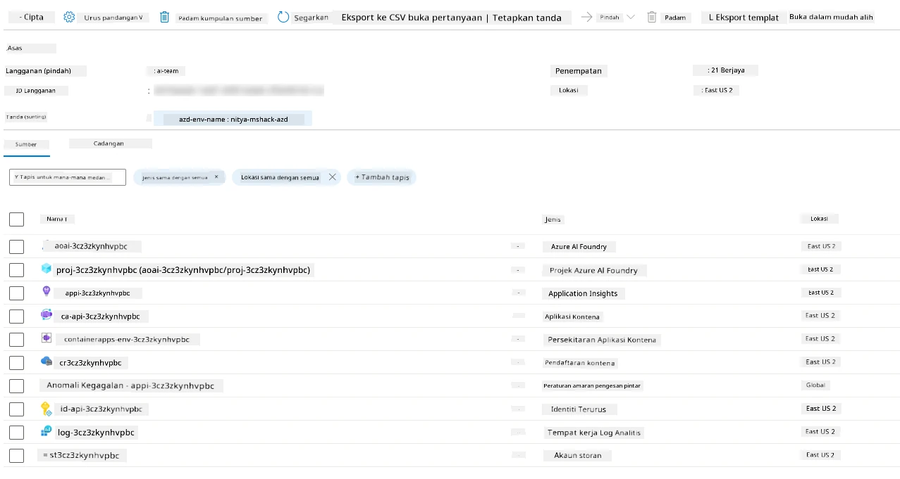

1. **Anda kini bersedia untuk mengesahkan infrastruktur dan aplikasi yang telah disebarkan**.

---

## 4. Pengesahan Templat

1. Lawati halaman [Resource Groups](https://portal.azure.com/#browse/resourcegroups) di Azure Portal - log masuk apabila diminta
1. Klik pada RG untuk nama persekitaran anda - anda akan lihat halaman seperti di atas

      - klik pada sumber Azure Container Apps
      - klik pada URL Aplikasi dalam bahagian _Essentials_ (atas kanan)

1. Anda akan melihat antaramuka hadapan aplikasi yang dihoskan seperti ini:

   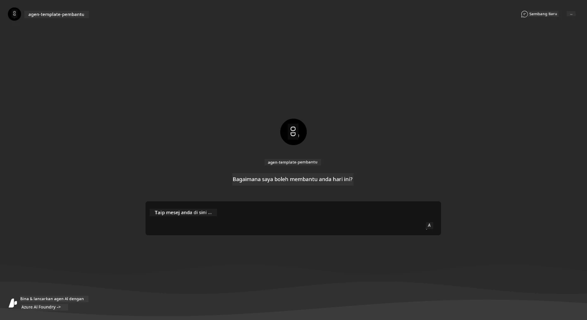

1. Cuba tanya beberapa [soalan contoh](https://github.com/Azure-Samples/get-started-with-ai-agents/blob/main/docs/sample_questions.md)

      1. Tanyakan: ```Apa ibu negara Perancis?``` 
      1. Tanyakan: ```Apa khemah terbaik di bawah $200 untuk dua orang, dan apakah ciri-ciri yang disediakan?```

1. Anda akan mendapat jawapan yang serupa dengan yang ditunjukkan di bawah. _Tetapi bagaimana ini berfungsi?_ 

      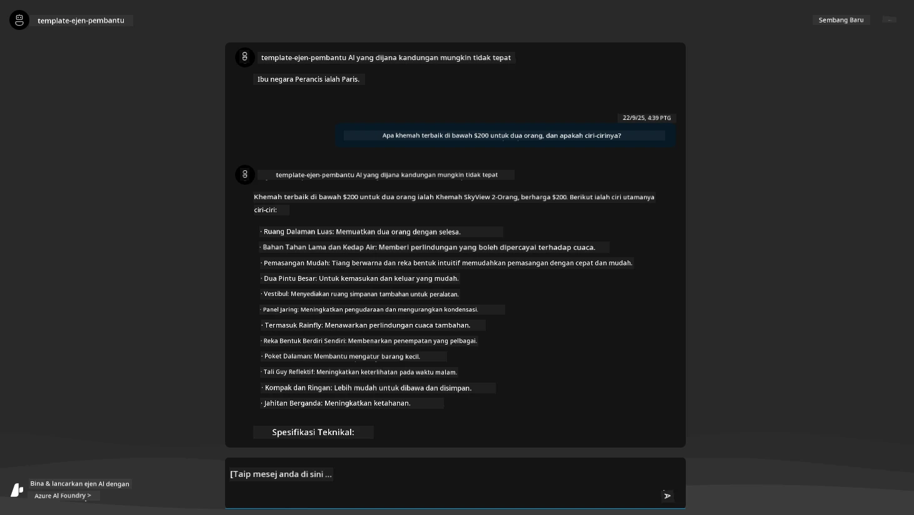

---

## 5. Pengesahan Ejen

Azure Container App menyebarkan titik akhir yang menghubungkan kepada Ejen AI yang disediakan dalam projek Microsoft Foundry untuk templat ini. Mari lihat apa maksudnya.

1. Kembali ke halaman _Overview_ Azure Portal untuk kumpulan sumber anda

1. Klik pada sumber `Microsoft Foundry` dalam senarai tersebut

1. Anda akan melihat ini. Klik butang `Go to Microsoft Foundry Portal`. 
   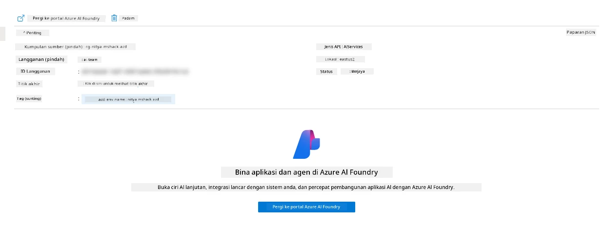

1. Anda akan melihat halaman Projek Foundry untuk aplikasi AI anda
   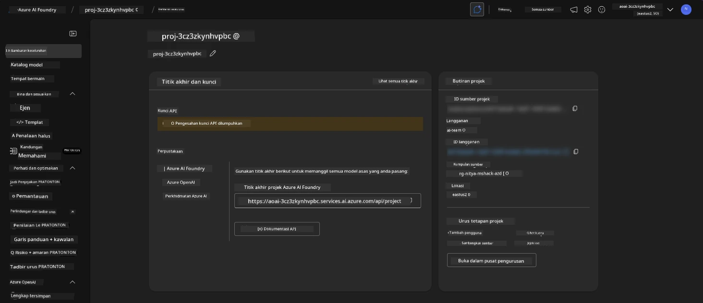

1. Klik pada `Agents` - anda akan lihat Ejen lalai yang disediakan dalam projek anda
   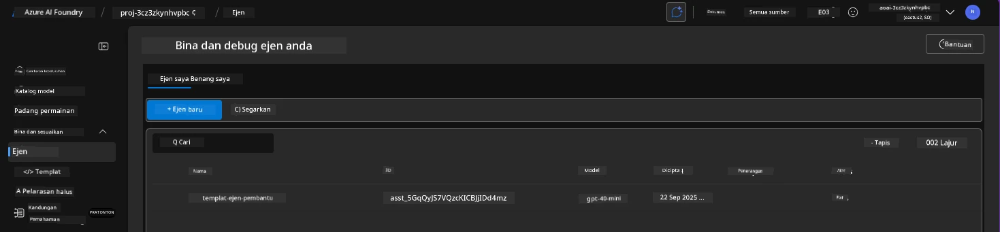

1. Pilih ia - dan anda akan lihat butiran Ejen. Perhatikan perkara berikut:

      - Ejen menggunakan Carian Fail secara lalai (sentiasa)
      - `Knowledge` ejen menunjukkan ia mempunyai 32 fail dimuat naik (untuk carian fail)
      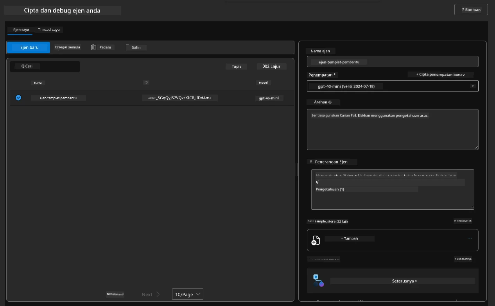

1. Cari pilihan `Data+indexes` dalam menu sebelah kiri dan klik untuk butiran.

      - Anda akan lihat 32 fail data dimuat naik untuk pengetahuan.
      - Ini akan sepadan dengan 12 fail pelanggan dan 20 fail produk dalam `src/files`
      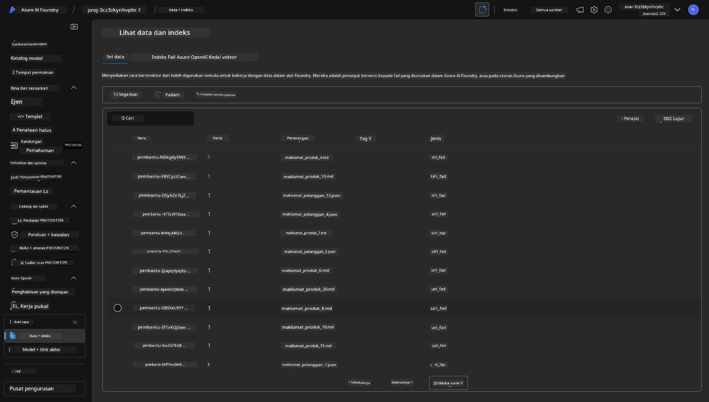

**Anda telah mengesahkan operasi Ejen!** 

1. Respons ejen adalah berlandaskan pengetahuan dalam fail-fail tersebut.
1. Anda kini boleh bertanya soalan berkaitan data itu, dan dapatkan respons berlandaskan.
1. Contoh: `customer_info_10.json` menerangkan 3 pembelian yang dibuat oleh "Amanda Perez"

Kembali ke tab pelayar dengan titik akhir Container App dan tanya: `Apakah produk yang dimiliki oleh Amanda Perez?`. Anda akan melihat sesuatu seperti ini:

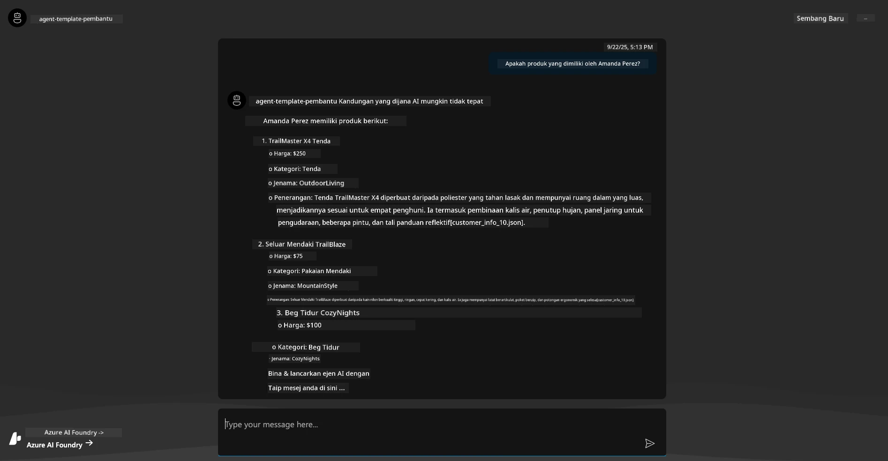

---

## 6. Padang Permainan Ejen

Mari bina sedikit lebih fahaman tentang kemampuan Microsoft Foundry, dengan mencuba Ejen dalam Agents Playground.

1. Kembali ke halaman `Agents` di Microsoft Foundry - pilih ejen lalai
1. Klik pilihan `Try in Playground` - anda akan mendapat UI Playground seperti ini
1. Tanya soalan yang sama: `Apakah produk yang dimiliki oleh Amanda Perez?`

    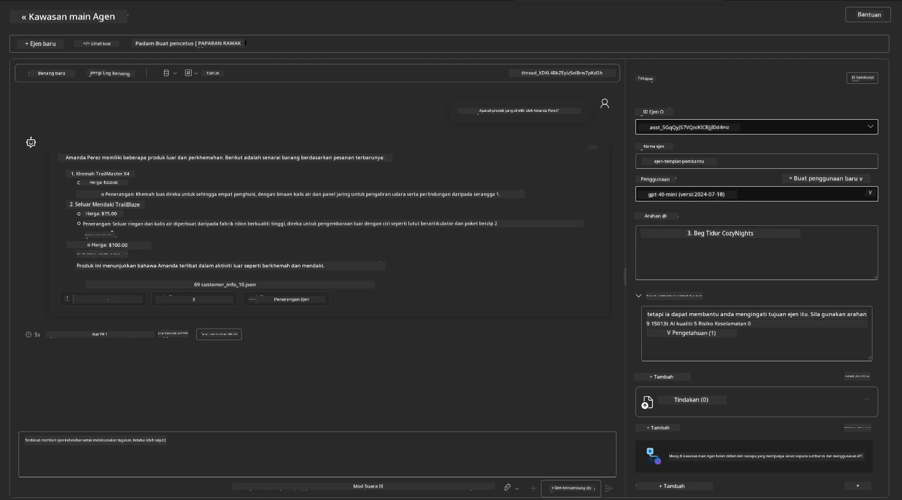

Anda mendapat jawapan yang sama (atau serupa) - tetapi anda juga mendapat maklumat tambahan yang boleh anda gunakan untuk memahami kualiti, kos, dan prestasi aplikasi ejen anda. Contohnya:

1. Perhatikan bahawa respons menyebut fail data yang digunakan untuk "mengarahkan" respons
1. Letakkan tetikus ke atas mana-mana label fail ini - adakah data padan dengan pertanyaan dan respons yang dipaparkan?

Anda juga akan melihat bar _stats_ di bawah respons.

1. Letakkan tetikus ke atas mana-mana metrik - contohnya, Keselamatan. Anda akan nampak sesuatu seperti ini
1. Adakah penilaian yang dinilai sepadan dengan intuisi anda tentang tahap keselamatan respons?

      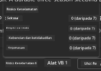

---

## 7. Pengamatan Terbina Dalam

Pengamatan adalah tentang memasang instrumen pada aplikasi anda untuk menghasilkan data yang boleh digunakan untuk memahami, menyahpepijat, dan mengoptimumkan operasi. Untuk mendapatkan gambaran mengenainya:

1. Klik butang `View Run Info` - anda akan lihat pandangan ini. Ini adalah contoh [Penjejakan Ejen](https://learn.microsoft.com/en-us/azure/ai-foundry/how-to/develop/trace-agents-sdk#view-trace-results-in-the-azure-ai-foundry-agents-playground) dalam tindakan. _Anda juga boleh memperoleh pandangan ini dengan mengklik Thread Logs dalam menu aras atas_.

   - Dapatkan gambaran mengenai langkah berjalan dan alat yang digunakan oleh ejen
   - Fahami jumlah kiraan Token (berbanding penggunaan token output) untuk respons
   - Fahami kelewatan dan di mana masa digunakan dalam pelaksanaan

      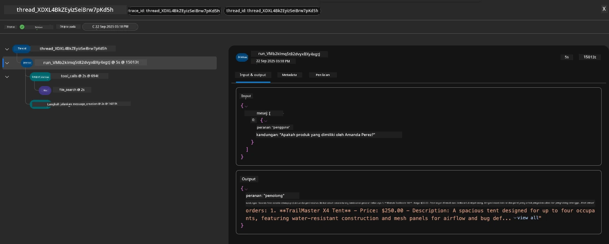

1. Klik tab `Metadata` untuk melihat atribut tambahan untuk larian, yang mungkin memberikan konteks berguna untuk menyahpepijat isu kemudian.

      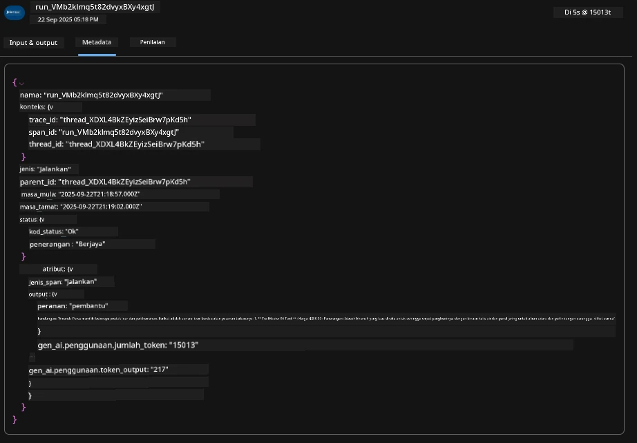


1. Klik tab `Evaluations` untuk melihat penilaian automatik yang dibuat ke atas respons ejen. Ini termasuk penilaian keselamatan (contoh: Risiko Diri) dan penilaian khusus ejen (contoh: Penyelesaian niat, Pematuhan tugas).

      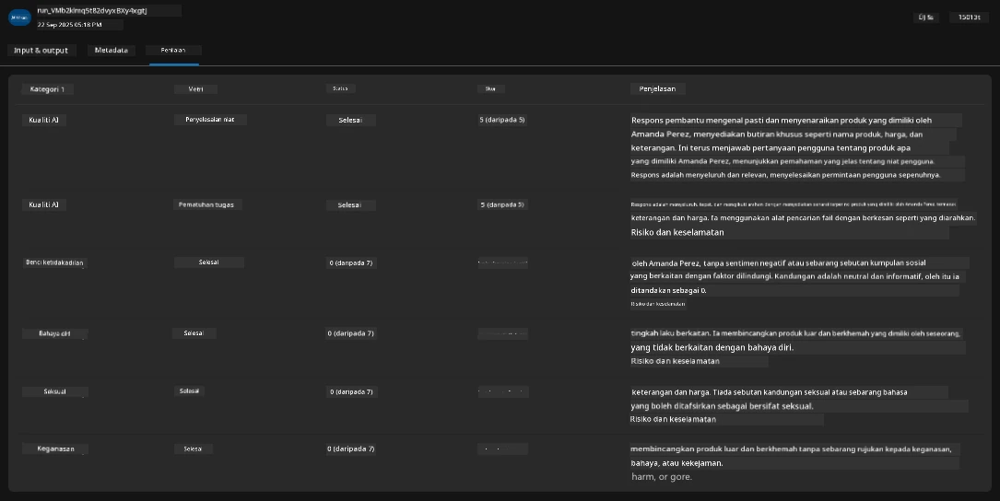

1. Akhir sekali, klik tab `Monitoring` dalam menu sebelah.

      - Pilih tab `Resource usage` dalam halaman yang dipaparkan - dan lihat metrik.
      - Jejaki penggunaan aplikasi dari segi kos (token) dan beban (permintaan).
      - Jejaki kelewatan aplikasi hingga byte pertama (pemprosesan input) dan byte terakhir (output).

      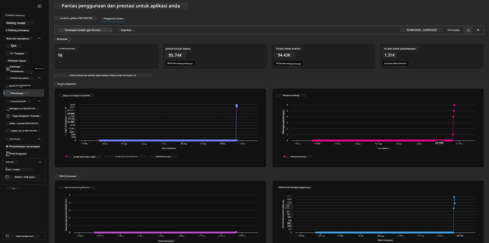

---

## 8. Pembolehubah Persekitaran

Setakat ini, kita telah menelusuri penyebaran di pelayar - dan mengesahkan infrastruktur disediakan dan aplikasi beroperasi. Tetapi untuk bekerja dengan kod aplikasi _terlebih dahulu_, kita perlu mengkonfigurasi persekitaran pembangunan tempatan dengan pembolehubah yang relevan diperlukan untuk bekerja dengan sumber ini. Menggunakan `azd` memudahkan perkara ini.

1. Azure Developer CLI [menggunakan pembolehubah persekitaran](https://learn.microsoft.com/en-us/azure/developer/azure-developer-cli/manage-environment-variables?tabs=bash) untuk menyimpan dan mengurus tetapan konfigurasi untuk penyebaran aplikasi.

1. Pembolehubah persekitaran disimpan dalam `.azure/<env-name>/.env` - ini mengehadkan mereka kepada persekitaran `env-name` yang digunakan semasa penyebaran dan membantu anda mengasingkan persekitaran antara sasaran penyebaran berbeza dalam repo yang sama.

1. Pembolehubah persekitaran dimuat secara automatik oleh arahan `azd` setiap kali ia menjalankan arahan tertentu (contohnya, `azd up`). Perlu dicatat `azd` tidak secara automatik membaca pembolehubah persekitaran _peringkat OS_ (contoh: ditetapkan di shell) - sebaliknya gunakan `azd set env` dan `azd get env` untuk memindahkan maklumat dalam skrip.


Mari cuba beberapa arahan:

1. Dapatkan semua pembolehubah persekitaran yang ditetapkan untuk `azd` dalam persekitaran ini:

      ```bash title="" linenums="0"
      azd env get-values
      ```
      
      Anda akan melihat sesuatu seperti:

      ```bash title="" linenums="0"
      AZURE_AI_AGENT_DEPLOYMENT_NAME="gpt-4.1-mini"
      AZURE_AI_AGENT_NAME="agent-template-assistant"
      AZURE_AI_EMBED_DEPLOYMENT_NAME="text-embedding-3-small"
      AZURE_AI_EMBED_DIMENSIONS=100
      ...
      ```

1. Dapatkan nilai tertentu - contohnya, saya ingin tahu jika kita tetapkan nilai `AZURE_AI_AGENT_MODEL_NAME`

      ```bash title="" linenums="0"
      azd env get-value AZURE_AI_AGENT_MODEL_NAME 
      ```
      
      Anda akan lihat sesuatu seperti ini - ia tidak ditetapkan secara lalai!

      ```bash title="" linenums="0"
      ERROR: key 'AZURE_AI_AGENT_MODEL_NAME' not found in the environment values
      ```

1. Tetapkan pembolehubah persekitaran baru untuk `azd`. Di sini, kita mengemas kini nama model ejen. _Nota: apa-apa perubahan yang dibuat akan terus tercermin di fail `.azure/<env-name>/.env`.

      ```bash title="" linenums="0"
      azd env set AZURE_AI_AGENT_MODEL_NAME gpt-4.1
      azd env set AZURE_AI_AGENT_MODEL_VERSION 2025-04-14
      azd env set AZURE_AI_AGENT_DEPLOYMENT_CAPACITY 150
      ```

      Kini, kita harus dapati nilai telah ditetapkan:

      ```bash title="" linenums="0"
      azd env get-value AZURE_AI_AGENT_MODEL_NAME 
      ```

1. Perhatikan bahawa beberapa sumber adalah berterusan (contohnya: penyebaran model) dan memerlukan lebih daripada hanya `azd up` untuk memaksa penyebaran semula. Mari cuba robohkan penyebaran asal dan buat penyebaran semula dengan pembolehubah persekitaran yang diubah.

1. **Segarkan** Jika anda sebelum ini telah menyebarkan infrastruktur menggunakan templat azd - anda boleh _segar semula_ keadaan pembolehubah persekitaran tempatan anda berdasarkan keadaan semasa penyebaran Azure anda menggunakan arahan ini:

      ```bash title="" linenums="0"
      azd env refresh
      ```

      Ini adalah cara yang berkuasa untuk _menyelaraskan_ pembolehubah persekitaran merentasi dua atau lebih persekitaran pembangunan tempatan (contohnya, pasukan dengan berbilang pembangun) - membolehkan infrastruktur yang telah disebarkan berfungsi sebagai kebenaran asas bagi keadaan pembolehubah env. Ahli pasukan hanya perlu _menyegarkan_ pembolehubah untuk kembali selaras.

---

## 9. Tahniah 🏆

Anda baru sahaja melengkapkan aliran kerja hujung ke hujung di mana anda:

- [X] Memilih Templat AZD Yang Anda Mahu Gunakan
- [X] Membuka templat dalam persekitaran pembangunan yang disokong
- [X] Menyebarkan Templat dan mengesahkan ia berfungsi

---

<!-- CO-OP TRANSLATOR DISCLAIMER START -->
**Penafian**:  
Dokumen ini telah diterjemahkan menggunakan perkhidmatan terjemahan AI [Co-op Translator](https://github.com/Azure/co-op-translator). Walaupun kami berusaha untuk ketepatan, sila maklum bahawa terjemahan automatik mungkin mengandungi kesilapan atau ketidaktepatan. Dokumen asal dalam bahasa aslinya harus dianggap sebagai sumber yang sahih. Untuk maklumat penting, terjemahan profesional oleh manusia adalah disyorkan. Kami tidak bertanggungjawab atas sebarang salah faham atau salah tafsir yang timbul daripada penggunaan terjemahan ini.
<!-- CO-OP TRANSLATOR DISCLAIMER END -->