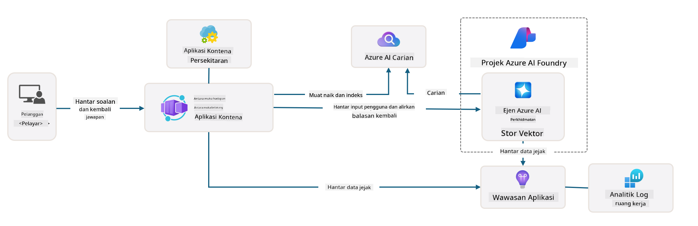

<!--
CO_OP_TRANSLATOR_METADATA:
{
  "original_hash": "4e403f041411361140d6beb88ab2a181",
  "translation_date": "2025-09-24T23:36:05+00:00",
  "source_file": "workshop/docs/instructions/3-Deconstruct-AI-Template.md",
  "language_code": "ms"
}
-->
# 3. Menguraikan Template

!!! tip "PADA AKHIR MODUL INI ANDA AKAN DAPAT"

    - [ ] Item
    - [ ] Item
    - [ ] Item
    - [ ] **Lab 3:** 

---

Dengan template AZD dan Azure Developer CLI (`azd`), kita dapat memulakan perjalanan pembangunan AI dengan pantas menggunakan repositori standard yang menyediakan kod contoh, infrastruktur, dan fail konfigurasi - dalam bentuk projek _permulaan_ yang sedia untuk digunakan.

**Tetapi sekarang, kita perlu memahami struktur projek dan kod asas - serta dapat menyesuaikan template AZD - tanpa pengalaman atau pemahaman awal tentang AZD!**

---

## 1. Aktifkan GitHub Copilot

### 1.1 Pasang GitHub Copilot Chat

Sudah tiba masanya untuk meneroka [GitHub Copilot dengan Mod Ejen](https://code.visualstudio.com/docs/copilot/chat/chat-agent-mode). Kini, kita boleh menggunakan bahasa semula jadi untuk menerangkan tugas kita pada tahap tinggi, dan mendapatkan bantuan dalam pelaksanaannya. Untuk makmal ini, kita akan menggunakan [pelan Copilot Percuma](https://github.com/github-copilot/signup) yang mempunyai had bulanan untuk penyelesaian dan interaksi sembang.

Ekstensi ini boleh dipasang dari marketplace, tetapi sepatutnya sudah tersedia dalam persekitaran Codespaces anda. _Klik `Open Chat` dari menu dropdown ikon Copilot - dan taipkan arahan seperti `What can you do?`_ - anda mungkin diminta untuk log masuk. **GitHub Copilot Chat sudah sedia digunakan**.

### 1.2. Pasang Pelayan MCP

Untuk Mod Ejen berfungsi dengan efektif, ia memerlukan akses kepada alat yang sesuai untuk membantu mendapatkan pengetahuan atau melaksanakan tindakan. Di sinilah pelayan MCP dapat membantu. Kita akan mengkonfigurasi pelayan berikut:

1. [Azure MCP Server](../../../../../workshop/docs/instructions)
1. [Microsoft Docs MCP Server](../../../../../workshop/docs/instructions)

Untuk mengaktifkannya:

1. Buat fail bernama `.vscode/mcp.json` jika ia belum wujud
1. Salin kandungan berikut ke dalam fail tersebut - dan mulakan pelayan!
   ```json title=".vscode/mcp.json"
   {
      "servers": {
         "Azure MCP Server": {
            "command": "npx",
            "args": [
            "-y",
            "@azure/mcp@latest",
            "server",
            "start"
            ]
         },
         "microsoft.docs.mcp": {
            "type": "http",
            "url": "https://learn.microsoft.com/api/mcp"
         }
      }
   }
   ```

??? warning "Anda mungkin mendapat ralat bahawa `npx` tidak dipasang (klik untuk melihat penyelesaian)"

      Untuk membetulkannya, buka fail `.devcontainer/devcontainer.json` dan tambahkan baris ini ke bahagian ciri. Kemudian bina semula kontena. Anda sepatutnya kini mempunyai `npx` dipasang.

      ```title="" linenums="0"
         "features": {
            "ghcr.io/devcontainers/features/node:1": {},
            ...
         },
      ```

---

### 1.3. Uji GitHub Copilot Chat

**Mula-mula gunakan `az login` untuk mengesahkan dengan Azure dari baris perintah VS Code.**

Anda kini sepatutnya dapat menanyakan status langganan Azure anda, dan bertanya soalan tentang sumber atau konfigurasi yang telah digunakan. Cuba arahan berikut:

1. `List my Azure resource groups`
1. `#foundry list my current deployments`

Anda juga boleh bertanya soalan tentang dokumentasi Azure dan mendapatkan jawapan berdasarkan pelayan Microsoft Docs MCP. Cuba arahan berikut:

1. `#microsoft_docs_search What is Azure Developer CLI?`
1. `#microsoft_docs_search Show me a Python tutorial to chat with deployed model`

Atau anda boleh meminta potongan kod untuk melengkapkan tugas. Cuba arahan ini.

1. `Give me a Python code example that uses AAD for an interactive chat client`

Dalam mod `Ask`, ini akan memberikan kod yang boleh anda salin dan cuba. Dalam mod `Agent`, ini mungkin melangkah lebih jauh dan mencipta sumber yang relevan untuk anda - termasuk skrip persediaan dan dokumentasi - untuk membantu anda melaksanakan tugas tersebut.

**Anda kini bersedia untuk mula meneroka repositori template**

---

## 2. Menguraikan Seni Bina

??? prompt "ASK: Terangkan seni bina aplikasi dalam docs/images/architecture.png dalam 1 perenggan"

      Aplikasi ini adalah aplikasi sembang berkuasa AI yang dibina di Azure yang menunjukkan seni bina moden berasaskan ejen. Penyelesaian ini berpusat pada Azure Container App yang menjadi hos kod aplikasi utama, yang memproses input pengguna dan menghasilkan respons pintar melalui ejen AI. 
      
      Seni bina ini memanfaatkan Projek Azure AI Foundry sebagai asas untuk keupayaan AI, menyambung ke Perkhidmatan AI Azure yang menyediakan model bahasa asas (seperti GPT-4o-mini) dan fungsi ejen. Interaksi pengguna mengalir melalui frontend berasaskan React ke backend FastAPI yang berkomunikasi dengan perkhidmatan ejen AI untuk menghasilkan respons kontekstual. 
      
      Sistem ini menggabungkan keupayaan pengambilan pengetahuan melalui carian fail atau perkhidmatan Carian AI Azure, membolehkan ejen mengakses dan memetik maklumat daripada dokumen yang dimuat naik. Untuk kecemerlangan operasi, seni bina ini termasuk pemantauan komprehensif melalui Application Insights dan Log Analytics Workspace untuk penjejakan, log, dan pengoptimuman prestasi. 
      
      Azure Storage menyediakan storan blob untuk data aplikasi dan muat naik fail, manakala Managed Identity memastikan akses selamat antara sumber Azure tanpa menyimpan kelayakan. Keseluruhan penyelesaian direka untuk skalabiliti dan penyelenggaraan, dengan aplikasi yang dikontena secara automatik berskala berdasarkan permintaan sambil menyediakan keselamatan, pemantauan, dan keupayaan CI/CD terbina melalui ekosistem perkhidmatan terurus Azure.



---

## 3. Struktur Repositori

!!! prompt "ASK: Terangkan struktur folder template. Mulakan dengan diagram hierarki visual."

??? info "ANSWER: Diagram Hierarki Visual"

      ```bash title="" 
      get-started-with-ai-agents/
      ├── 📋 Konfigurasi & Persediaan
      │   ├── azure.yaml                    # Konfigurasi Azure Developer CLI
      │   ├── docker-compose.yaml           # Kontena pembangunan tempatan
      │   ├── pyproject.toml                # Konfigurasi projek Python
      │   ├── requirements-dev.txt          # Kebergantungan pembangunan
      │   └── .devcontainer/                # Persediaan kontena dev VS Code
      │
      ├── 🏗️ Infrastruktur (infra/)
      │   ├── main.bicep                    # Template infrastruktur utama
      │   ├── api.bicep                     # Sumber khusus API
      │   ├── main.parameters.json          # Parameter infrastruktur
      │   └── core/                         # Komponen infrastruktur modular
      │       ├── ai/                       # Konfigurasi perkhidmatan AI
      │       ├── host/                     # Infrastruktur hosting
      │       ├── monitor/                  # Pemantauan dan log
      │       ├── search/                   # Persediaan Carian AI Azure
      │       ├── security/                 # Keselamatan dan identiti
      │       └── storage/                  # Konfigurasi akaun storan
      │
      ├── 💻 Sumber Aplikasi (src/)
      │   ├── api/                          # API backend
      │   │   ├── main.py                   # Titik masuk aplikasi FastAPI
      │   │   ├── routes.py                 # Definisi laluan API
      │   │   ├── search_index_manager.py   # Fungsi carian
      │   │   ├── data/                     # Pengendalian data API
      │   │   ├── static/                   # Aset web statik
      │   │   └── templates/                # Template HTML
      │   ├── frontend/                     # Frontend React/TypeScript
      │   │   ├── package.json              # Kebergantungan Node.js
      │   │   ├── vite.config.ts            # Konfigurasi binaan Vite
      │   │   └── src/                      # Kod sumber frontend
      │   ├── data/                         # Fail data contoh
      │   │   └── embeddings.csv            # Embedding yang telah dikira
      │   ├── files/                        # Fail pangkalan pengetahuan
      │   │   ├── customer_info_*.json      # Contoh data pelanggan
      │   │   └── product_info_*.md         # Dokumentasi produk
      │   ├── Dockerfile                    # Konfigurasi kontena
      │   └── requirements.txt              # Kebergantungan Python
      │
      ├── 🔧 Automasi & Skrip (scripts/)
      │   ├── postdeploy.sh/.ps1           # Persediaan selepas penggunaan
      │   ├── setup_credential.sh/.ps1     # Konfigurasi kelayakan
      │   ├── validate_env_vars.sh/.ps1    # Pengesahan persekitaran
      │   └── resolve_model_quota.sh/.ps1  # Pengurusan kuota model
      │
      ├── 🧪 Ujian & Penilaian
      │   ├── tests/                        # Ujian unit dan integrasi
      │   │   └── test_search_index_manager.py
      │   ├── evals/                        # Kerangka penilaian ejen
      │   │   ├── evaluate.py               # Pelari penilaian
      │   │   ├── eval-queries.json         # Pertanyaan ujian
      │   │   └── eval-action-data-path.json
      │   ├── sandbox/                      # Taman permainan pembangunan
      │   │   ├── 1-quickstart.py           # Contoh permulaan
      │   │   └── aad-interactive-chat.py   # Contoh pengesahan
      │   └── airedteaming/                 # Penilaian keselamatan AI
      │       └── ai_redteaming.py          # Ujian pasukan merah
      │
      ├── 📚 Dokumentasi (docs/)
      │   ├── deployment.md                 # Panduan penggunaan
      │   ├── local_development.md          # Arahan persediaan tempatan
      │   ├── troubleshooting.md            # Isu & penyelesaian biasa
      │   ├── azure_account_setup.md        # Prasyarat Azure
      │   └── images/                       # Aset dokumentasi
      │
      └── 📄 Metadata Projek
         ├── README.md                     # Gambaran keseluruhan projek
         ├── CODE_OF_CONDUCT.md           # Garis panduan komuniti
         ├── CONTRIBUTING.md              # Panduan sumbangan
         ├── LICENSE                      # Terma lesen
         └── next-steps.md                # Panduan selepas penggunaan
      ```

### 3.1. Seni Bina Aplikasi Teras

Template ini mengikuti corak **aplikasi web full-stack** dengan:

- **Backend**: Python FastAPI dengan integrasi Azure AI
- **Frontend**: TypeScript/React dengan sistem binaan Vite
- **Infrastruktur**: Template Azure Bicep untuk sumber awan
- **Kontena**: Docker untuk penggunaan yang konsisten

### 3.2 Infrastruktur Sebagai Kod (bicep)

Lapisan infrastruktur menggunakan template **Azure Bicep** yang diatur secara modular:

   - **`main.bicep`**: Mengatur semua sumber Azure
   - **Modul `core/`**: Komponen boleh guna semula untuk perkhidmatan yang berbeza
      - Perkhidmatan AI (Azure OpenAI, AI Search)
      - Hosting kontena (Azure Container Apps)
      - Pemantauan (Application Insights, Log Analytics)
      - Keselamatan (Key Vault, Managed Identity)

### 3.3 Sumber Aplikasi (`src/`)

**API Backend (`src/api/`)**:

- REST API berasaskan FastAPI
- Integrasi perkhidmatan Ejen AI Azure
- Pengurusan indeks carian untuk pengambilan pengetahuan
- Keupayaan muat naik dan pemprosesan fail

**Frontend (`src/frontend/`)**:

- SPA React/TypeScript moden
- Vite untuk pembangunan pantas dan binaan yang dioptimumkan
- Antara muka sembang untuk interaksi ejen

**Pangkalan Pengetahuan (`src/files/`)**:

- Contoh data pelanggan dan produk
- Menunjukkan pengambilan pengetahuan berasaskan fail
- Contoh format JSON dan Markdown

### 3.4 DevOps & Automasi

**Skrip (`scripts/`)**:

- Skrip PowerShell dan Bash merentas platform
- Pengesahan dan persediaan persekitaran
- Konfigurasi selepas penggunaan
- Pengurusan kuota model

**Integrasi Azure Developer CLI**:

- Konfigurasi `azure.yaml` untuk aliran kerja `azd`
- Penyediaan dan penggunaan automatik
- Pengurusan pembolehubah persekitaran

### 3.5 Ujian & Jaminan Kualiti

**Kerangka Penilaian (`evals/`)**:

- Penilaian prestasi ejen
- Ujian kualiti pertanyaan-respons
- Saluran penilaian automatik

**Keselamatan AI (`airedteaming/`)**:

- Ujian pasukan merah untuk keselamatan AI
- Pengimbasan kerentanan keselamatan
- Amalan AI yang bertanggungjawab

---

## 4. Tahniah 🏆

Anda berjaya menggunakan GitHub Copilot Chat dengan pelayan MCP, untuk meneroka repositori.

- [X] Mengaktifkan GitHub Copilot untuk Azure
- [X] Memahami Seni Bina Aplikasi
- [X] Meneroka struktur template AZD

Ini memberikan anda gambaran tentang aset _infrastruktur sebagai kod_ untuk template ini. Seterusnya, kita akan melihat fail konfigurasi untuk AZD.

---

