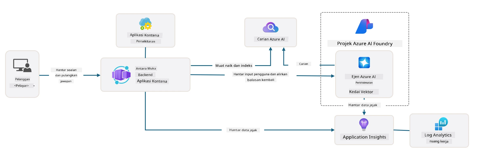

# 3. Menguraikan Templat

!!! tip "PADA AKHIR MODUL INI ANDA AKAN DAPAT"

    - [ ] Mengaktifkan GitHub Copilot dengan pelayan MCP untuk bantuan Azure
    - [ ] Memahami struktur folder dan komponen templat AZD
    - [ ] Meneroka pola organisasi infrastruktur-sebagai-kod (Bicep)
    - [ ] **Makmal 3:** Menggunakan GitHub Copilot untuk meneroka dan memahami seni bina repositori 

---


Dengan templat AZD dan Azure Developer CLI (`azd`) kita boleh memulakan perjalanan pembangunan AI dengan pantas menggunakan repositori piawai yang menyediakan contoh kod, fail infrastruktur dan konfigurasi - dalam bentuk projek _starter_ yang siap untuk diterapkan.

**Tetapi kini, kita perlu memahami struktur projek dan kod asas - dan mampu mengubah suai templat AZD - tanpa sebarang pengalaman atau pemahaman terdahulu tentang AZD!**

---

## 1. Aktifkan GitHub Copilot

### 1.1 Pasang GitHub Copilot Chat

Sudah tiba masanya untuk meneroka [GitHub Copilot dengan Mod Agen](https://code.visualstudio.com/docs/copilot/chat/chat-agent-mode). Kini, kita boleh menggunakan bahasa semula jadi untuk menerangkan tugasan pada tahap tinggi, dan mendapatkan bantuan dalam pelaksanaannya. Untuk makmal ini, kita akan menggunakan [pelan Percuma Copilot](https://github.com/github-copilot/signup) yang mempunyai had bulanan untuk penyelesaian dan interaksi sembang.

Sambungan ini boleh dipasang dari marketplace, dan ia sering sudah tersedia dalam persekitaran Codespaces atau kontena dev. _Klik `Open Chat` dari menu ikon Copilot - dan taip prompt seperti `What can you do?`_ - anda mungkin akan diminta log masuk. **GitHub Copilot Chat sudah sedia**.

### 1.2. Pasang Pelayan MCP

Untuk mod Agen berfungsi dengan berkesan, ia memerlukan akses kepada alat yang betul untuk membantu mendapatkan pengetahuan atau mengambil tindakan. Di sinilah pelayan MCP boleh membantu. Kita akan konfigurasi pelayan berikut:

1. [Azure MCP Server](../../../../../workshop/docs/instructions)
1. [Microsoft Docs MCP Server](../../../../../workshop/docs/instructions)

Untuk mengaktifkannya:

1. Buat fail bernama `.vscode/mcp.json` jika belum wujud
1. Salin berikut ke dalam fail itu - dan mulakan pelayan!
   ```json title=".vscode/mcp.json"
   {
      "servers": {
         "Azure MCP Server": {
            "command": "npx",
            "args": [
            "-y",
            "@azure/mcp@latest",
            "server",
            "start"
            ]
         },
         "microsoft.docs.mcp": {
            "type": "http",
            "url": "https://learn.microsoft.com/api/mcp"
         }
      }
   }
   ```

??? warning "Anda mungkin mendapat ralat bahawa `npx` tidak dipasang (klik untuk buka penyelesaian)"

      Untuk membaiki, buka fail `.devcontainer/devcontainer.json` dan tambah baris ini dalam bahagian features. Kemudian bina semula kontena. Anda kini sepatutnya mempunyai `npx` dipasang.

      ```title="" linenums="0"
         "features": {
            "ghcr.io/devcontainers/features/node:1": {},
            ...
         },
      ```

---

### 1.3. Uji GitHub Copilot Chat

**Gunakan `azd auth login` dahulu untuk pengesahan dengan Azure dari baris arahan VS Code. Gunakan `az login` juga hanya jika anda berhasrat menjalankan arahan Azure CLI secara langsung.**

Anda kini sepatutnya boleh menyoal status langganan Azure anda, dan bertanya soalan tentang sumber yang diterapkan atau konfigurasi. Cuba prompt ini:

1. `List my Azure resource groups`
1. `#foundry list my current deployments`

Anda juga boleh bertanya tentang dokumentasi Azure dan mendapat jawapan berdasarkan pelayan Microsoft Docs MCP. Cuba prompt ini:

1. `#microsoft_docs_search What is Azure Developer CLI?`
1. `#microsoft_docs_search Show me a Python tutorial to chat with deployed model`

Atau anda boleh minta serpihan kod untuk menyelesaikan tugasan. Cuba prompt ini.

1. `Give me a Python code example that uses AAD for an interactive chat client`

Dalam mod `Ask`, ini akan memberikan kod yang anda boleh salin tampal dan cuba. Dalam mod `Agent`, ini mungkin mengambil langkah lebih jauh dengan mencipta sumber yang berkaitan untuk anda - termasuk skrip persediaan dan dokumentasi - untuk membantu anda melaksanakan tugasan itu.

**Anda kini bersedia untuk mula meneroka repositori templat**

---

## 2. Menguraikan Seni Bina

??? prompt "TANYA: Terangkan seni bina aplikasi dalam docs/images/architecture.png dalam 1 perenggan"

      Aplikasi ini adalah aplikasi sembang bertenaga AI yang dibina di Azure yang menunjukkan seni bina moden berasaskan agen. Penyelesaian ini berpusat di sekitar Azure Container App yang menjadi hos kod aplikasi utama, yang memproses input pengguna dan menghasilkan respons pintar melalui agen AI.
      
      Seni bina ini menggunakan Microsoft Foundry Project sebagai asas untuk keupayaan AI, berhubung dengan Perkhidmatan Azure AI yang menyediakan model bahasa asas (seperti gpt-4.1-mini) dan fungsi agen.
      
      Interaksi pengguna mengalir melalui frontend berasaskan React ke backend FastAPI yang berkomunikasi dengan perkhidmatan agen AI untuk menghasilkan respons kontekstual.
      
      Sistem ini memasukkan keupayaan pengambilan pengetahuan melalui carian fail atau perkhidmatan Azure AI Search, membolehkan agen mengakses dan memetik maklumat dari dokumen yang dimuat naik.
      
      Untuk kecemerlangan operasi, seni bina ini termasuk pemantauan menyeluruh melalui Application Insights dan Log Analytics Workspace untuk penjejakan, pencatatan, dan pengoptimuman prestasi.
      
      Azure Storage menyediakan storan blob untuk data aplikasi dan muat naik fail, manakala Managed Identity memastikan akses selamat antara sumber Azure tanpa menyimpan kelayakan.
      
      Keseluruhan penyelesaian direka untuk skala dan penyelenggaraan, dengan aplikasi diperbekalkan kontena yang secara automatik menskalakan berdasarkan permintaan sambil menyediakan ciri keselamatan, pemantauan, dan CI/CD bina dalam melalui ekosistem perkhidmatan pengurusan Azure.



---

## 3. Struktur Repositori

!!! prompt "TANYA: Terangkan struktur folder templat. Mulakan dengan diagram hierarki visual."

??? info "JAWAPAN: Diagram Hierarki Visual"

      ```bash title="" 
      get-started-with-ai-agents/
      ├── 📋 Konfigurasi & Persediaan
      │   ├── azure.yaml                    # Konfigurasi Azure Developer CLI
      │   ├── docker-compose.yaml           # Kontena pembangunan tempatan
      │   ├── pyproject.toml                # Konfigurasi projek Python
      │   ├── requirements-dev.txt          # Kebergantungan pembangunan
      │   └── .devcontainer/                # Persediaan kontena dev VS Code
      │
      ├── 🏗️ Infrastruktur (infra/)
      │   ├── main.bicep                    # Templat utama infrastruktur
      │   ├── api.bicep                     # Sumber khusus API
      │   ├── main.parameters.json          # Parameter infrastruktur
      │   └── core/                         # Komponen modul infrastruktur
      │       ├── ai/                       # Konfigurasi perkhidmatan AI
      │       ├── host/                     # Infrastruktur hos
      │       ├── monitor/                  # Pemantauan dan pencatatan
      │       ├── search/                   # Persediaan Azure AI Search
      │       ├── security/                 # Keselamatan dan identiti
      │       └── storage/                  # Konfigurasi akaun storan
      │
      ├── 💻 Sumber Aplikasi (src/)
      │   ├── api/                          # API backend
      │   │   ├── main.py                   # Entri aplikasi FastAPI
      │   │   ├── routes.py                 # Definisi laluan API
      │   │   ├── search_index_manager.py   # Fungsi carian
      │   │   ├── data/                     # Pengurusan data API
      │   │   ├── static/                   # Aset web statik
      │   │   └── templates/                # Templat HTML
      │   ├── frontend/                     # Frontend React/TypeScript
      │   │   ├── package.json              # Kebergantungan Node.js
      │   │   ├── vite.config.ts            # Konfigurasi binaan Vite
      │   │   └── src/                      # Kod sumber frontend
      │   ├── data/                         # Fail data contoh
      │   │   └── embeddings.csv            # Embedding yang telah dikira
      │   ├── files/                        # Fail pangkalan pengetahuan
      │   │   ├── customer_info_*.json      # Contoh data pelanggan
      │   │   └── product_info_*.md         # Dokumentasi produk
      │   ├── Dockerfile                    # Konfigurasi kontena
      │   └── requirements.txt              # Kebergantungan Python
      │
      ├── 🔧 Automasi & Skrip (scripts/)
      │   ├── postdeploy.sh/.ps1           # Persediaan pasca-penerapan
      │   ├── setup_credential.sh/.ps1     # Konfigurasi kelayakan
      │   ├── validate_env_vars.sh/.ps1    # Pengesahan persekitaran
      │   └── resolve_model_quota.sh/.ps1  # Pengurusan kuota model
      │
      ├── 🧪 Ujian & Penilaian
      │   ├── tests/                        # Ujian unit dan integrasi
      │   │   └── test_search_index_manager.py
      │   ├── evals/                        # Rangka kerja penilaian agen
      │   │   ├── evaluate.py               # Pelari penilaian
      │   │   ├── eval-queries.json         # Soalan ujian
      │   │   └── eval-action-data-path.json
      │   ├── sandbox/                      # Kawasan eksperimen pembangunan
      │   │   ├── 1-quickstart.py           # Contoh memulakan
      │   │   └── aad-interactive-chat.py   # Contoh pengesahan
      │   └── airedteaming/                 # Penilaian keselamatan AI
      │       └── ai_redteaming.py          # Ujian pasukan merah
      │
      ├── 📚 Dokumentasi (docs/)
      │   ├── deployment.md                 # Panduan penerapan
      │   ├── local_development.md          # Arahan persediaan tempatan
      │   ├── troubleshooting.md            # Isu biasa & pembaikan
      │   ├── azure_account_setup.md        # Prasyarat Azure
      │   └── images/                       # Aset dokumentasi
      │
      └── 📄 Metadata Projek
         ├── README.md                     # Gambaran projek
         ├── CODE_OF_CONDUCT.md           # Garis panduan komuniti
         ├── CONTRIBUTING.md              # Panduan sumbangan
         ├── LICENSE                      # Terma lesen
         └── next-steps.md                # Panduan pasca-penerapan
      ```

### 3.1. Seni Bina Aplikasi Teras

Templat ini mengikuti corak **aplikasi web full-stack** dengan:

- **Backend**: Python FastAPI dengan integrasi Azure AI
- **Frontend**: TypeScript/React dengan sistem binaan Vite
- **Infrastruktur**: templat Azure Bicep untuk sumber awan
- **Kontenaisasi**: Docker untuk pelaksanaan konsisten

### 3.2 Infra Sebagai Kod (bicep)

Lapisan infrastruktur menggunakan templat **Azure Bicep** yang disusun secara modular:

   - **`main.bicep`**: Mengatur semua sumber Azure
   - **modul `core/`**: Komponen boleh guna semula untuk pelbagai perkhidmatan
      - Perkhidmatan AI (Model Microsoft Foundry, AI Search)
      - Hos kontena (Azure Container Apps)
      - Pemantauan (Application Insights, Log Analytics)
      - Keselamatan (Key Vault, Managed Identity)

### 3.3 Sumber Aplikasi (`src/`)

**API Backend (`src/api/`)**:

- REST API berasaskan FastAPI
- Integrasi Foundry Agents
- Pengurusan indeks carian untuk pengambilan pengetahuan
- Keupayaan muat naik dan pemprosesan fail

**Frontend (`src/frontend/`)**:

- SPA React/TypeScript moden
- Vite untuk pembangunan pantas dan binaan teroptimum
- Antara muka sembang untuk interaksi agen

**Pangkalan Pengetahuan (`src/files/`)**:

- Contoh data pelanggan dan produk
- Mendemonstrasikan pengambilan pengetahuan berasaskan fail
- Contoh format JSON dan Markdown


### 3.4 DevOps & Automasi

**Skrip (`scripts/`)**:

- Skrip PowerShell dan Bash merentas platform
- Pengesahan persekitaran dan persediaan
- Konfigurasi pasca-penerapan
- Pengurusan kuota model

**Integrasi Azure Developer CLI**:

- Konfigurasi `azure.yaml` untuk aliran kerja `azd`
- Penyediaan dan penerapan automatik
- Pengurusan pemboleh ubah persekitaran

### 3.5 Ujian & Jaminan Kualiti

**Rangka Kerja Penilaian (`evals/`)**:

- Penilaian prestasi agen
- Ujian kualiti tanya balas
- Saluran penilaian automatik

**Keselamatan AI (`airedteaming/`)**:

- Ujian pasukan merah untuk keselamatan AI
- Imbasan kelemahan keselamatan
- Amalan AI bertanggungjawab

---

## 4. Tahniah 🏆

Anda berjaya menggunakan GitHub Copilot Chat dengan pelayan MCP, untuk meneroka repositori.

- [X] Mengaktifkan GitHub Copilot untuk Azure
- [X] Memahami Seni Bina Aplikasi
- [X] Meneroka struktur templat AZD

Ini memberi anda gambaran aset _infrastruktur sebagai kod_ untuk templat ini. Seterusnya, kita akan melihat fail konfigurasi untuk AZD.

---

<!-- CO-OP TRANSLATOR DISCLAIMER START -->
**Penafian**:  
Dokumen ini telah diterjemahkan menggunakan perkhidmatan terjemahan AI [Co-op Translator](https://github.com/Azure/co-op-translator). Walaupun kami berusaha untuk ketepatan, sila maklum bahawa terjemahan automatik mungkin mengandungi kesilapan atau ketidaktepatan. Dokumen asal dalam bahasa asalnya harus dianggap sebagai sumber yang sahih. Bagi maklumat penting, terjemahan profesional oleh manusia adalah disyorkan. Kami tidak bertanggungjawab atas sebarang salah faham atau salah tafsir yang timbul daripada penggunaan terjemahan ini.
<!-- CO-OP TRANSLATOR DISCLAIMER END -->