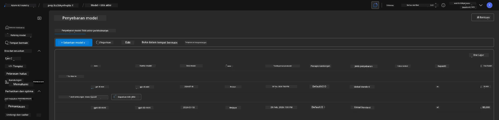

<!--
CO_OP_TRANSLATOR_METADATA:
{
  "original_hash": "6539a34c770f3ceff282370d72ee74dc",
  "translation_date": "2025-09-24T23:34:50+00:00",
  "source_file": "workshop/docs/instructions/6-Teardown-Infrastructure.md",
  "language_code": "ms"
}
-->
# 6. Menutup Infrastruktur

!!! tip "PADA AKHIR MODUL INI ANDA AKAN DAPAT"

    - [ ] Item
    - [ ] Item
    - [ ] Item

---

## Latihan Bonus

Sebelum kita menutup projek, luangkan beberapa minit untuk melakukan penerokaan terbuka.

!!! danger "NITYA-TODO: Gariskan beberapa cadangan untuk dicuba"

---

## Menutup Infrastruktur

1. Menutup infrastruktur semudah:
      
      ```bash title="" linenums="0"
      azd down --purge
      ```
1. Flag `--purge` memastikan bahawa ia juga membersihkan sumber Cognitive Service yang telah dihapuskan secara lembut, dengan itu melepaskan kuota yang dipegang oleh sumber-sumber ini. Setelah selesai, anda akan melihat sesuatu seperti ini:
      
      ```bash title="" linenums="0"
      ? Total resources to delete: 11, are you sure you want to continue? Yes
      Deleting your resources can take some time.
      (✓) Done: Deleted resource group rg-nitya-mshack-azd
      (✓) Done: Purging Cognitive Account: aoai-3cz3zkynhvpbc

      SUCCESS: Your application was removed from Azure in 11 minutes 4 seconds.
      ```

1. (Pilihan) Jika anda kini menjalankan `azd up` sekali lagi, anda akan perasan model gpt-4.1 akan dikerahkan kerana pembolehubah persekitaran telah diubah (dan disimpan) dalam folder `.azure` tempatan. 

      Berikut adalah pengedaran model **sebelum**:

      

      Dan ini adalah **selepas**:
      

---

