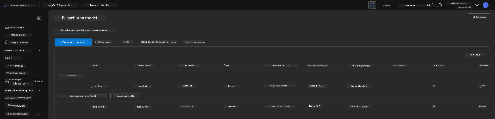
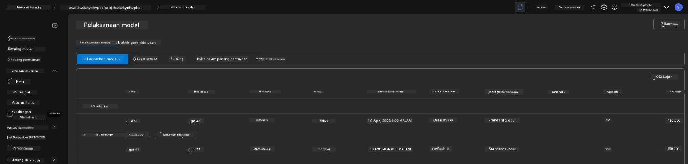

# 6. Menghentikan Infrastruktur

!!! tip "PADA AKHIR MODUL INI ANDA AKAN DAPAT"

    - [ ] Memahami kepentingan pembersihan sumber dan pengurusan kos
    - [ ] Menggunakan `azd down` untuk memansuhkan infrastruktur dengan selamat
    - [ ] Memulihkan perkhidmatan kognitif yang dipadamkan secara lembut jika perlu
    - [ ] **Makmal 6:** Membersihkan sumber Azure dan mengesahkan pemadaman

---

## Latihan Bonus

Sebelum kita menghentikan projek, luangkan beberapa minit untuk melakukan penerokaan terbuka.

!!! info "Cuba Arahan Penerokaan Ini"

    **Bersenam dengan GitHub Copilot:**
    
    1. Tanya: `Apakah templat AZD lain yang boleh saya cuba untuk senario berbilang ejen?`
    2. Tanya: `Bagaimana saya boleh mengubah suai arahan ejen untuk kes penggunaan penjagaan kesihatan?`
    3. Tanya: `Apakah pemboleh ubah persekitaran yang mengawal pengoptimuman kos?`
    
    **Terokai Portal Azure:**
    
    1. Semak metrik Application Insights untuk penugasan anda
    2. Semak analisis kos untuk sumber yang disediakan
    3. Terokai kawasan main ejen portal Microsoft Foundry sekali lagi

---

## Memansuhkan Infra

1. Menghentikan infrastruktur semudah:
      
      ```bash title="" linenums="0"
      azd down --purge
      ```
1. Bendera `--purge` memastikan ia juga membuang sumber Perkhidmatan Kognitif yang dipadamkan secara lembut, dengan itu melepaskan kuota yang dipegang oleh sumber ini. Setelah selesai anda akan melihat sesuatu seperti ini:
      
      ```bash title="" linenums="0"
      ? Total resources to delete: 11, are you sure you want to continue? Yes
      Deleting your resources can take some time.
      (✓) Done: Deleted resource group rg-nitya-mshack-azd
      (✓) Done: Purging Cognitive Account: aoai-3cz3zkynhvpbc

      SUCCESS: Your application was removed from Azure in 11 minutes 4 seconds.
      ```

1. (Pilihan) Jika anda kini menjalankan `azd up` semula, anda akan perasan model gpt-4.1 akan digunakan kerana pemboleh ubah persekitaran telah diubah (dan disimpan) dalam folder `.azure` tempatan. 

      Ini adalah penugasan model **sebelum**:

      

      Dan ini adalah **selepas**:
      

---

<!-- CO-OP TRANSLATOR DISCLAIMER START -->
**Penafian**:  
Dokumen ini telah diterjemahkan menggunakan perkhidmatan terjemahan AI [Co-op Translator](https://github.com/Azure/co-op-translator). Walaupun kami berusaha untuk ketepatan, sila maklum bahawa terjemahan automatik mungkin mengandungi kesilapan atau ketidaktepatan. Dokumen asal dalam bahasa asalnya harus dianggap sebagai sumber yang sahih. Untuk maklumat penting, terjemahan profesional oleh manusia adalah disyorkan. Kami tidak bertanggungjawab atas sebarang salah faham atau salah tafsir yang timbul daripada penggunaan terjemahan ini.
<!-- CO-OP TRANSLATOR DISCLAIMER END -->