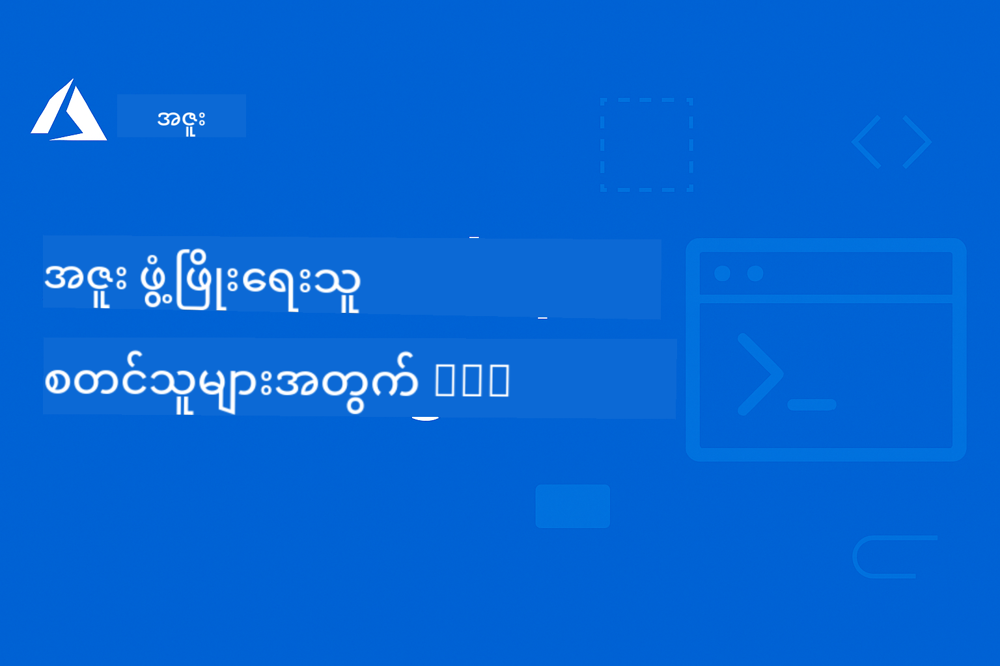

<!--
CO_OP_TRANSLATOR_METADATA:
{
  "original_hash": "7c5d2bb409800e22e74f34ee0ed12bed",
  "translation_date": "2025-12-17T16:13:49+00:00",
  "source_file": "README.md",
  "language_code": "my"
}
-->
# AZD အတွက် စတင်လေ့လာသူများ: တိကျစွာ ဖွဲ့စည်းထားသော သင်ယူမှု ခရီးစဉ်

 

[](https://GitHub.com/microsoft/azd-for-beginners/watchers/)
[](https://GitHub.com/microsoft/azd-for-beginners/network/)
[](https://GitHub.com/microsoft/azd-for-beginners/stargazers/)

[](https://discord.gg/microsoft-azure)
[](https://discord.gg/nTYy5BXMWG)

## ဒီသင်တန်းနဲ့ စတင်ခြင်း

သင့် AZD သင်ယူမှု ခရီးစဉ်ကို စတင်ရန် အောက်ပါအဆင့်များကို လိုက်နာပါ-

1. **Repository ကို Fork လုပ်ပါ**: Click [](https://GitHub.com/microsoft/azd-for-beginners/fork)
2. **Repository ကို Clone လုပ်ပါ**: `git clone https://github.com/microsoft/azd-for-beginners.git`
3. **အသိုင်းအဝိုင်းတွင် ပါဝင်ပါ**: [Azure Discord Communities](https://discord.com/invite/ByRwuEEgH4) မှ ကျွမ်းကျင်သူများထံ အထောက်အပံ့ရယူရန်
4. **သင်ယူမည့် လမ်းကြောင်းကို ရွေးချယ်ပါ**: အောက်ပါ အခန်းများထဲမှ သင့်အတွေ့အကြုံနှင့် ကိုက်ညီသည့် အခန်းကို ရွေးချယ်ပါ

### ဘာသာစကား မျိုးစုံ ထောက်ပံ့မှု

#### အလိုအလျောက် ဘာသာပြန်ချက်များ (အမြဲတမ်း နောက်ဆုံးပေါ်)

<!-- CO-OP TRANSLATOR LANGUAGES TABLE START -->
[Arabic](../ar/README.md) | [Bengali](../bn/README.md) | [Bulgarian](../bg/README.md) | [Burmese (Myanmar)](./README.md) | [Chinese (Simplified)](../zh/README.md) | [Chinese (Traditional, Hong Kong)](../hk/README.md) | [Chinese (Traditional, Macau)](../mo/README.md) | [Chinese (Traditional, Taiwan)](../tw/README.md) | [Croatian](../hr/README.md) | [Czech](../cs/README.md) | [Danish](../da/README.md) | [Dutch](../nl/README.md) | [Estonian](../et/README.md) | [Finnish](../fi/README.md) | [French](../fr/README.md) | [German](../de/README.md) | [Greek](../el/README.md) | [Hebrew](../he/README.md) | [Hindi](../hi/README.md) | [Hungarian](../hu/README.md) | [Indonesian](../id/README.md) | [Italian](../it/README.md) | [Japanese](../ja/README.md) | [Kannada](../kn/README.md) | [Korean](../ko/README.md) | [Lithuanian](../lt/README.md) | [Malay](../ms/README.md) | [Malayalam](../ml/README.md) | [Marathi](../mr/README.md) | [Nepali](../ne/README.md) | [Nigerian Pidgin](../pcm/README.md) | [Norwegian](../no/README.md) | [Persian (Farsi)](../fa/README.md) | [Polish](../pl/README.md) | [Portuguese (Brazil)](../br/README.md) | [Portuguese (Portugal)](../pt/README.md) | [Punjabi (Gurmukhi)](../pa/README.md) | [Romanian](../ro/README.md) | [Russian](../ru/README.md) | [Serbian (Cyrillic)](../sr/README.md) | [Slovak](../sk/README.md) | [Slovenian](../sl/README.md) | [Spanish](../es/README.md) | [Swahili](../sw/README.md) | [Swedish](../sv/README.md) | [Tagalog (Filipino)](../tl/README.md) | [Tamil](../ta/README.md) | [Telugu](../te/README.md) | [Thai](../th/README.md) | [Turkish](../tr/README.md) | [Ukrainian](../uk/README.md) | [Urdu](../ur/README.md) | [Vietnamese](../vi/README.md)
<!-- CO-OP TRANSLATOR LANGUAGES TABLE END -->

## သင်တန်းအနှစ်ချုပ်

Azure Developer CLI (azd) ကို တိုးတက်စွာ သင်ယူနိုင်ရန် ဖွဲ့စည်းထားသော အခန်းများမှတဆင့် ကျွမ်းကျင်ပါ။ **Microsoft Foundry ပေါင်းစည်းမှုဖြင့် AI အပလီကေးရှင်းများ တပ်ဆင်ခြင်းကို အထူးအာရုံစိုက်ထားသည်။**

### ဒီသင်တန်းသည် ခေတ်မီ Developer များအတွက် အရေးကြီးသော အကြောင်းရင်း

Microsoft Foundry Discord အသိုင်းအဝိုင်းမှ အချက်အလက်များအရ၊ **Developer ၄၅% သည် AI အလုပ်များအတွက် AZD ကို အသုံးပြုလိုကြသည်** သို့သော် အောက်ပါ အခက်အခဲများနှင့် ရင်ဆိုင်ကြသည်-
- ရှုပ်ထွေးသော multi-service AI ဖွဲ့စည်းမှုများ
- ထုတ်လုပ်မှု AI တပ်ဆင်ခြင်းအတွက် အကောင်းဆုံး လုပ်ထုံးလုပ်နည်းများ  
- Azure AI ဝန်ဆောင်မှု ပေါင်းစည်းခြင်းနှင့် ဖွဲ့စည်းခြင်း
- AI အလုပ်များအတွက် ကုန်ကျစရိတ် ထိရောက်စွာ စီမံခန့်ခွဲခြင်း
- AI အထူး deployment ပြဿနာများ ဖြေရှင်းခြင်း

### သင်ယူရမည့် ရည်မှန်းချက်များ

ဒီဖွဲ့စည်းထားသော သင်တန်းကို ပြီးမြောက်ခြင်းဖြင့်-
- **AZD အခြေခံများ ကျွမ်းကျင်မှု**: အဓိကအယူအဆများ၊ တပ်ဆင်ခြင်းနှင့် ဖွဲ့စည်းခြင်း
- **AI အပလီကေးရှင်းများ တပ်ဆင်ခြင်း**: Microsoft Foundry ဝန်ဆောင်မှုများနှင့် AZD ကို အသုံးပြုခြင်း
- **Infrastructure as Code ကို အကောင်အထည်ဖော်ခြင်း**: Bicep templates ဖြင့် Azure အရင်းအမြစ်များ စီမံခန့်ခွဲခြင်း
- **Deployment ပြဿနာများ ဖြေရှင်းခြင်း**: ပုံမှန်ပြဿနာများ ဖြေရှင်းခြင်းနှင့် debug လုပ်ခြင်း
- **ထုတ်လုပ်မှုအတွက် ထိရောက်စွာ စီမံခန့်ခွဲခြင်း**: လုံခြုံရေး၊ အရွယ်အစားချိန်ညှိခြင်း၊ စောင့်ကြည့်ခြင်းနှင့် ကုန်ကျစရိတ် စီမံခန့်ခွဲခြင်း
- **Multi-Agent ဖြေရှင်းချက်များ တည်ဆောက်ခြင်း**: ရှုပ်ထွေးသော AI ဖွဲ့စည်းမှုများ တပ်ဆင်ခြင်း

## 📚 သင်ယူမှု အခန်းများ

*သင့်အတွေ့အကြုံနှင့် ရည်မှန်းချက်အရ သင်ယူမည့် လမ်းကြောင်းကို ရွေးချယ်ပါ*

### 🚀 အခန်း ၁: အခြေခံနှင့် အမြန်စတင်ခြင်း
**လိုအပ်ချက်များ**: Azure subscription, အခြေခံ command line အသိပညာ  
**ကြာချိန်**: ၃၀-၄၅ မိနစ်  
**ရှုပ်ထွေးမှု**: ⭐

#### သင်ယူမည့်အရာများ
- Azure Developer CLI အခြေခံများ နားလည်ခြင်း
- သင့်ပလက်ဖောင်းပေါ်တွင် AZD တပ်ဆင်ခြင်း
- ပထမဆုံး အောင်မြင်သော deployment

#### သင်ယူမှု အရင်းအမြစ်များ
- **🎯 ဒီနေရာက စတင်ပါ**: [What is Azure Developer CLI?](../..)
- **📖 သီအိုရီ**: [AZD Basics](docs/getting-started/azd-basics.md) - အဓိကအယူအဆများနှင့် စကားလုံးများ
- **⚙️ တပ်ဆင်ခြင်း**: [Installation & Setup](docs/getting-started/installation.md) - ပလက်ဖောင်းအလိုက် လမ်းညွှန်ချက်များ
- **🛠️ လက်တွေ့ လေ့ကျင့်ခန်း**: [Your First Project](docs/getting-started/first-project.md) - အဆင့်ဆင့် လမ်းညွှန်ချက်
- **📋 အမြန်ရည်ညွှန်းစာမျက်နှာ**: [Command Cheat Sheet](resources/cheat-sheet.md)

#### လက်တွေ့ လေ့ကျင့်ခန်းများ
```bash
# အမြန်တပ်ဆင်မှု စစ်ဆေးခြင်း
azd version

# သင့်ပထမဆုံး အက်ပလီကေးရှင်းကို တပ်ဆင်ပါ
azd init --template todo-nodejs-mongo
azd up
```

**💡 အခန်းရလဒ်**: AZD ကို အသုံးပြု၍ ရိုးရှင်းသော web application တစ်ခုကို Azure တွင် အောင်မြင်စွာ တပ်ဆင်နိုင်ခြင်း

**✅ အောင်မြင်မှု အတည်ပြုချက်:**
```bash
# အခန်း ၁ ကိုပြီးမြောက်ပြီးနောက် သင်သည် အောက်ပါအရာများကို ပြုလုပ်နိုင်ရမည်။
azd version              # ထည့်သွင်းထားသော ဗားရှင်းကို ပြသသည်
azd init --template todo-nodejs-mongo  # ပရောဂျက်ကို စတင်တည်ဆောက်သည်
azd up                  # Azure သို့ တင်ပို့သည်
azd show                # လည်ပတ်နေသော အက်ပ် URL ကို ပြသသည်
# အက်ပ်သည် ဘရောက်ဇာတွင် ဖွင့်ပြီး အလုပ်လုပ်သည်
azd down --force --purge  # အရင်းအမြစ်များကို သန့်ရှင်းသည်
```

**📊 ကြာချိန်**: ၃၀-၄၅ မိနစ်  
**📈 လေ့ကျင့်ပြီးနောက် ကျွမ်းကျင်မှု**: ရိုးရှင်းသော အပလီကေးရှင်းများကို ကိုယ်တိုင် တပ်ဆင်နိုင်ခြင်း

**✅ အောင်မြင်မှု အတည်ပြုချက်:**
```bash
# အခန်း ၁ ကိုပြီးမြောက်ပြီးနောက် သင်သည် အောက်ပါအရာများကို ပြုလုပ်နိုင်ရမည်။
azd version              # ထည့်သွင်းထားသော ဗားရှင်းကို ပြသသည်
azd init --template todo-nodejs-mongo  # ပရောဂျက်ကို စတင်တည်ဆောက်သည်
azd up                  # Azure သို့ တင်ပို့သည်
azd show                # လည်ပတ်နေသော အက်ပ် URL ကို ပြသသည်
# အက်ပ်သည် ဘရောက်ဇာတွင် ဖွင့်ပြီး လုပ်ဆောင်သည်
azd down --force --purge  # အရင်းအမြစ်များကို သန့်ရှင်းသည်
```

**📊 ကြာချိန်**: ၃၀-၄၅ မိနစ်  
**📈 လေ့ကျင့်ပြီးနောက် ကျွမ်းကျင်မှု**: ရိုးရှင်းသော အပလီကေးရှင်းများကို ကိုယ်တိုင် တပ်ဆင်နိုင်ခြင်း

---

### 🤖 အခန်း ၂: AI-ပထမ ဦးဆုံး ဖွံ့ဖြိုးတိုးတက်မှု (AI Developer များအတွက် အကြံပြု)
**လိုအပ်ချက်များ**: အခန်း ၁ ပြီးမြောက်ထားခြင်း  
**ကြာချိန်**: ၁-၂ နာရီ  
**ရှုပ်ထွေးမှု**: ⭐⭐

#### သင်ယူမည့်အရာများ
- Microsoft Foundry နှင့် AZD ပေါင်းစည်းခြင်း
- AI အင်အားပြည့် အပလီကေးရှင်းများ တပ်ဆင်ခြင်း
- AI ဝန်ဆောင်မှု ဖွဲ့စည်းမှုများ နားလည်ခြင်း

#### သင်ယူမှု အရင်းအမြစ်များ
- **🎯 ဒီနေရာက စတင်ပါ**: [Microsoft Foundry Integration](docs/microsoft-foundry/microsoft-foundry-integration.md)
- **📖 ပုံစံများ**: [AI Model Deployment](docs/microsoft-foundry/ai-model-deployment.md) - AI မော်ဒယ်များ တပ်ဆင်ခြင်းနှင့် စီမံခန့်ခွဲခြင်း
- **🛠️ အလုပ်ရုံ**: [AI Workshop Lab](docs/microsoft-foundry/ai-workshop-lab.md) - သင့် AI ဖြေရှင်းချက်များကို AZD အတွက် အသင့်ပြင်ဆင်ခြင်း
- **🎥 အပြန်အလှန် လမ်းညွှန်ချက်**: [Workshop Materials](workshop/README.md) - MkDocs * DevContainer ပတ်ဝန်းကျင်ဖြင့် Browser-based သင်ယူမှု
- **📋 Template များ**: [Microsoft Foundry Templates](../..)
- **📝 ဥပမာများ**: [AZD Deployment Examples](examples/README.md)

#### လက်တွေ့ လေ့ကျင့်ခန်းများ
```bash
# သင့်ပထမဆုံး AI အပလီကေးရှင်းကို တပ်ဆင်ပါ
azd init --template azure-search-openai-demo
azd up

# အပို AI ပုံစံများကို စမ်းသပ်ပါ
azd init --template openai-chat-app-quickstart
azd init --template agent-openai-python-prompty
```

**💡 အခန်းရလဒ်**: RAG စွမ်းရည်ပါရှိသော AI အင်အားပြည့် chat application တစ်ခု တပ်ဆင်ပြီး ဖွဲ့စည်းနိုင်ခြင်း

**✅ အောင်မြင်မှု အတည်ပြုချက်:**
```bash
# အခန်း ၂ ပြီးနောက်၊ သင်သည် အောက်ပါအရာများကို ပြုလုပ်နိုင်သင့်သည်။
azd init --template azure-search-openai-demo
azd up
# AI စကားပြော အင်တာဖေ့စ်ကို စမ်းသပ်ပါ
# မေးခွန်းများမေးပြီး အရင်းအမြစ်များပါသော AI အားဖြင့် တုံ့ပြန်ချက်များရယူပါ
# ရှာဖွေရေး ပေါင်းစည်းမှု အလုပ်လုပ်မှုကို အတည်ပြုပါ
azd monitor  # Application Insights တွင် telemetry ပြသမှုကို စစ်ဆေးပါ
azd down --force --purge
```

**📊 ကြာချိန်**: ၁-၂ နာရီ  
**📈 လေ့ကျင့်ပြီးနောက် ကျွမ်းကျင်မှု**: ထုတ်လုပ်မှုအဆင့် AI အပလီကေးရှင်းများ တပ်ဆင်ပြီး ဖွဲ့စည်းနိုင်ခြင်း  
**💰 ကုန်ကျစရိတ် အသိပညာ**: တိုးတက်ရေးအတွက် $80-150/လ၊ ထုတ်လုပ်မှုအတွက် $300-3500/လ ကုန်ကျစရိတ်ကို နားလည်ခြင်း

#### 💰 AI Deployment များအတွက် ကုန်ကျစရိတ် စဉ်းစားချက်များ

**ဖွံ့ဖြိုးရေး ပတ်ဝန်းကျင် (ခန့်မှန်း $80-150/လ):**
- Azure OpenAI (Pay-as-you-go): $0-50/လ (token အသုံးပြုမှုအပေါ် မူတည်၍)
- AI Search (Basic tier): $75/လ
- Container Apps (Consumption): $0-20/လ
- Storage (Standard): $1-5/လ

**ထုတ်လုပ်မှု ပတ်ဝန်းကျင် (ခန့်မှန်း $300-3,500+/လ):**
- Azure OpenAI (PTU ဖြင့် တည်ငြိမ်သော စွမ်းဆောင်ရည်): $3,000+/လ သို့မဟုတ် Pay-as-go အမြင့်အသုံးပြုမှု
- AI Search (Standard tier): $250/လ
- Container Apps (Dedicated): $50-100/လ
- Application Insights: $5-50/လ
- Storage (Premium): $10-50/လ

**💡 ကုန်ကျစရိတ် ထိရောက်စွာ စီမံခန့်ခွဲရန် အကြံပြုချက်များ:**
- သင်ယူရန်အတွက် **Free Tier** Azure OpenAI ကို အသုံးပြုပါ (လစဉ် 50,000 tokens ပါဝင်သည်)
- ဖွံ့ဖြိုးမှုမလုပ်သည့်အချိန်တွင် `azd down` ဖြင့် အရင်းအမြစ်များကို ပိတ်ထားပါ
- စားသုံးမှုအခြေပြု ဘီလ်လ်ကို စတင်အသုံးပြု၍ ထုတ်လုပ်မှုအတွက်သာ PTU သို့ မြှင့်တင်ပါ
- တပ်ဆင်မှုမပြုမီ `azd provision --preview` ဖြင့် ကုန်ကျစရိတ် ခန့်မှန်းပါ
- auto-scaling ကို ဖွင့်ထား၍ အသုံးပြုမှုအတိုင်းသာ ငွေပေးချေပါ

**ကုန်ကျစရိတ် စောင့်ကြည့်မှု:**
```bash
# ခန့်မှန်းထားသော လစဉ်ကုန်ကျစရိတ်များကို စစ်ဆေးပါ
azd provision --preview

# Azure Portal တွင် အမှန်တကယ်ကုန်ကျစရိတ်များကို စောင့်ကြည့်ပါ
az consumption budget list --resource-group <your-rg>
```

---

### ⚙️ အခန်း ၃: ဖွဲ့စည်းမှုနှင့် အတည်ပြုခြင်း
**လိုအပ်ချက်များ**: အခန်း ၁ ပြီးမြောက်ထားခြင်း  
**ကြာချိန်**: ၄၅-၆၀ မိနစ်  
**ရှုပ်ထွေးမှု**: ⭐⭐

#### သင်ယူမည့်အရာများ
- ပတ်ဝန်းကျင် ဖွဲ့စည်းမှုနှင့် စီမံခန့်ခွဲမှု
- အတည်ပြုခြင်းနှင့် လုံခြုံရေး အကောင်းဆုံး လုပ်ထုံးလုပ်နည်းများ
- အရင်းအမြစ် အမည်ပေးခြင်းနှင့် စီမံခန့်ခွဲမှု

#### သင်ယူမှု အရင်းအမြစ်များ
- **📖 ဖွဲ့စည်းမှု**: [Configuration Guide](docs/getting-started/configuration.md) - ပတ်ဝန်းကျင် တပ်ဆင်ခြင်း
- **🔐 လုံခြုံရေး**: [Authentication patterns and managed identity](docs/getting-started/authsecurity.md) - အတည်ပြုမှု ပုံစံများ
- **📝 ဥပမာများ**: [Database App Example](examples/database-app/README.md) - AZD Database ဥပမာများ

#### လက်တွေ့ လေ့ကျင့်ခန်းများ
- ပတ်ဝန်းကျင် များစွာ (dev, staging, prod) ကို ဖွဲ့စည်းပါ
- managed identity အတည်ပြုမှု တပ်ဆင်ပါ
- ပတ်ဝန်းကျင်အလိုက် ဖွဲ့စည်းမှုများကို အကောင်အထည်ဖော်ပါ

**💡 အခန်းရလဒ်**: လုံခြုံမှုနှင့် အတည်ပြုမှုမှန်ကန်စွာဖြင့် ပတ်ဝန်းကျင် များစွာကို စီမံခန့်ခွဲနိုင်ခြင်း

---

### 🏗️ အခန်း ၄: Infrastructure as Code နှင့် Deployment
**လိုအပ်ချက်များ**: အခန်း ၁-၃ ပြီးမြောက်ထားခြင်း  
**ကြာချိန်**: ၁-၁.၅ နာရီ  
**ရှုပ်ထွေးမှု**: ⭐⭐⭐

#### သင်ယူမည့်အရာများ
- တိုးတက်သော deployment ပုံစံများ
- Bicep ဖြင့် Infrastructure as Code
- အရင်းအမြစ် provisioning များ စီမံခန့်ခွဲမှု

#### သင်ယူမှု အရင်းအမြစ်များ
- **📖 Deployment**: [Deployment Guide](docs/deployment/deployment-guide.md) - ပြည့်စုံသော workflow များ
- **🏗️ Provisioning**: [Provisioning Resources](docs/deployment/provisioning.md) - Azure အရင်းအမြစ် စီမံခန့်ခွဲမှု
- **📝 ဥပမာများ**: [Container App Example](../../examples/container-app) - Containerized deployment များ

#### လက်တွေ့ လေ့ကျင့်ခန်းများ
- ကိုယ်ပိုင် Bicep templates ဖန်တီးပါ
- multi-service အပလီကေးရှင်းများ တပ်ဆင်ပါ
- blue-green deployment များ အကောင်အထည်ဖော်ပါ

**💡 အခန်းရလဒ်**: ကိုယ်ပိုင် infrastructure templates အသုံးပြု၍ ရှုပ်ထွေးသော multi-service အပလီကေးရှင်းများ တပ်ဆင်နိုင်ခြင်း

---

### 🎯 အခန်း ၅: Multi-Agent AI ဖြေရှင်းချက်များ (အဆင့်မြင့်)
**လိုအပ်ချက်များ**: အခန်း ၁-၂ ပြီးမြောက်ထားခြင်း  
**ကြာချိန်**: ၂-၃ နာရီ  
**ရှုပ်ထွေးမှု**: ⭐⭐⭐⭐

#### သင်ယူမည့်အရာများ
- Multi-agent ဖွဲ့စည်းမှု ပုံစံများ
- Agent များ စီမံခန့်ခွဲခြင်းနှင့် ပူးပေါင်းဆောင်ရွက်ခြင်း
- ထုတ်လုပ်မှုအဆင့် AI deployment များ

#### သင်ယူမှု အရင်းအမြစ်များ
- **🤖 အထူးပြု စီမံကိန်း**: [Retail Multi-Agent Solution](examples/retail-scenario.md) - ပြည့်စုံသော အကောင်အထည်ဖော်မှု
- **🛠️ ARM Templates**: [ARM Template Package](../../examples/retail-multiagent-arm-template) - တစ်ချက်နှိပ်ပြီး တပ်ဆင်ခြင်း  
- **📖 Architecture**: [Multi-agent coordination patterns](/docs/pre-deployment/coordination-patterns.md) - ပုံစံများ

#### Practical Exercises  
```bash
# အပြည့်အစုံ လက်လီစျေးကွက် မျိုးစုံအေးဂျင့် ဖြေရှင်းချက်ကို တပ်ဆင်ပါ
cd examples/retail-multiagent-arm-template
./deploy.sh

# အေးဂျင့် ဖွဲ့စည်းမှုများကို စူးစမ်းလေ့လာပါ
az deployment group show --resource-group <rg-name> --name <deployment-name>
```
  
**💡 Chapter Outcome**: Customer နှင့် Inventory အေးဂျင့်များပါဝင်သည့် ထုတ်လုပ်မှုအဆင်သင့် multi-agent AI ဖြေရှင်းချက် တပ်ဆင်ပြီး စီမံခန့်ခွဲခြင်း

---

### 🔍 Chapter 6: Pre-Deployment Validation & Planning  
**Prerequisites**: Chapter 4 ပြီးစီးထားရန်  
**Duration**: 1 နာရီ  
**Complexity**: ⭐⭐

#### What You'll Learn  
- စွမ်းဆောင်ရည်စီမံခန့်ခွဲမှုနှင့် အရင်းအမြစ်အတည်ပြုခြင်း  
- SKU ရွေးချယ်မှု မဟာဗျူဟာများ  
- Pre-flight စစ်ဆေးမှုများနှင့် အလိုအလျောက်လုပ်ဆောင်မှုများ

#### Learning Resources  
- **📊 Planning**: [Capacity Planning](docs/pre-deployment/capacity-planning.md) - အရင်းအမြစ်အတည်ပြုခြင်း  
- **💰 Selection**: [SKU Selection](docs/pre-deployment/sku-selection.md) - ကုန်ကျစရိတ်ထိရောက်စွာ ရွေးချယ်ခြင်း  
- **✅ Validation**: [Pre-flight Checks](docs/pre-deployment/preflight-checks.md) - အလိုအလျောက် စာရင်းများ

#### Practical Exercises  
- စွမ်းဆောင်ရည်အတည်ပြု စာရင်းများကို လည်ပတ်ပါ  
- ကုန်ကျစရိတ်အတွက် SKU ရွေးချယ်မှုများကို အကောင်းဆုံးပြုလုပ်ပါ  
- အလိုအလျောက် Pre-deployment စစ်ဆေးမှုများကို အကောင်အထည်ဖော်ပါ

**💡 Chapter Outcome**: တပ်ဆင်မှုများကို အကောင်အထည်ဖော်မတိုင်မီ အတည်ပြု၍ အကောင်းဆုံးပြုလုပ်နိုင်ခြင်း

---

### 🚨 Chapter 7: Troubleshooting & Debugging  
**Prerequisites**: မည်သည့် တပ်ဆင်မှုအခန်းကဏ္ဍမဆို ပြီးစီးထားရန်  
**Duration**: 1-1.5 နာရီ  
**Complexity**: ⭐⭐

#### What You'll Learn  
- စနစ်တကျ ပြဿနာရှာဖွေခြင်းနည်းလမ်းများ  
- ပုံမှန်ပြဿနာများနှင့် ဖြေရှင်းနည်းများ  
- AI အထူးပြဿနာရှာဖွေခြင်း

#### Learning Resources  
- **🔧 Common Issues**: [Common Issues](docs/troubleshooting/common-issues.md) - မေးခွန်းများနှင့် ဖြေရှင်းနည်းများ  
- **🕵️ Debugging**: [Debugging Guide](docs/troubleshooting/debugging.md) - အဆင့်ဆင့်နည်းလမ်းများ  
- **🤖 AI Issues**: [AI-Specific Troubleshooting](docs/troubleshooting/ai-troubleshooting.md) - AI ဝန်ဆောင်မှု ပြဿနာများ

#### Practical Exercises  
- တပ်ဆင်မှု မအောင်မြင်မှုများကို ရှာဖွေပါ  
- အတည်ပြုခြင်း ပြဿနာများကို ဖြေရှင်းပါ  
- AI ဝန်ဆောင်မှု ချိတ်ဆက်မှုကို ပြန်လည်စစ်ဆေးပါ

**💡 Chapter Outcome**: ပုံမှန်တပ်ဆင်မှု ပြဿနာများကို ကိုယ်တိုင် ရှာဖွေ ဖြေရှင်းနိုင်ခြင်း

---

### 🏢 Chapter 8: Production & Enterprise Patterns  
**Prerequisites**: Chapters 1-4 ပြီးစီးထားရန်  
**Duration**: 2-3 နာရီ  
**Complexity**: ⭐⭐⭐⭐

#### What You'll Learn  
- ထုတ်လုပ်မှု တပ်ဆင်မှု မဟာဗျူဟာများ  
- စီးပွားရေး လုံခြုံရေး ပုံစံများ  
- စောင့်ကြည့်မှုနှင့် ကုန်ကျစရိတ် ထိရောက်စွာ စီမံခန့်ခွဲခြင်း

#### Learning Resources  
- **🏭 Production**: [Production AI Best Practices](docs/microsoft-foundry/production-ai-practices.md) - စီးပွားရေး ပုံစံများ  
- **📝 Examples**: [Microservices Example](../../examples/microservices) - ရှုပ်ထွေးသော အင်ဂျင်နီယာပုံစံများ  
- **📊 Monitoring**: [Application Insights integration](docs/pre-deployment/application-insights.md) - စောင့်ကြည့်မှု

#### Practical Exercises  
- စီးပွားရေး လုံခြုံရေး ပုံစံများကို အကောင်အထည်ဖော်ပါ  
- စုံလင်သော စောင့်ကြည့်မှု စနစ်တစ်ခု တည်ဆောက်ပါ  
- ထုတ်လုပ်မှုအဆင့်သို့ တပ်ဆင်ပြီး အုပ်ချုပ်မှုမှန်ကန်စွာ ပြုလုပ်ပါ

**💡 Chapter Outcome**: ထုတ်လုပ်မှုအဆင့် အပြည့်အဝ အသုံးပြုနိုင်သော စီးပွားရေးအဆင့် အက်ပလီကေးရှင်းများ တပ်ဆင်နိုင်ခြင်း

---

## 🎓 Workshop Overview: Hands-On Learning Experience

> **⚠️ WORKSHOP STATUS: Active Development**  
> Workshop ပစ္စည်းများကို လက်ရှိ ဖန်တီးနေဆဲဖြစ်ပြီး တိုးတက်မှုများ ပြုလုပ်နေပါသည်။ အခြေခံ module များ လုပ်ဆောင်နိုင်ပြီး၊ အဆင့်မြင့် အပိုင်းများ အချို့ မပြီးစီးသေးပါ။ အကြောင်းအရာအားလုံး ပြီးစီးအောင် ကြိုးစားနေပါသည်။ [Track progress →](workshop/README.md)

### Interactive Workshop Materials  
**Browser-based tools နှင့် လမ်းညွှန် လေ့ကျင့်ခန်းများဖြင့် လက်တွေ့ လေ့လာမှု**

Workshop ပစ္စည်းများသည် အထက်ပါ အခန်းများအခြေခံ သင်ခန်းစာများနှင့် တွဲဖက်၍ ဖွဲ့စည်းထားသော လက်တွေ့ လေ့လာမှု အတွေ့အကြုံကို ပေးစွမ်းပါသည်။ Workshop သည် ကိုယ်တိုင် လေ့လာသူများနှင့် သင်ကြားသူများအတွက် တို့အတွက် ရည်ရွယ်ထားပါသည်။

#### 🛠️ Workshop Features  
- **Browser-Based Interface**: MkDocs ဖြင့် ပြုလုပ်ထားသော workshop၊ ရှာဖွေရေး၊ ကူးယူခြင်းနှင့် theme များပါဝင်သည်  
- **GitHub Codespaces Integration**: တစ်ချက်နှိပ်ပြီး ဖွင့်လှစ်နိုင်သော ဖွံ့ဖြိုးရေး ပတ်ဝန်းကျင်  
- **Structured Learning Path**: ၇ အဆင့် လမ်းညွှန် လေ့ကျင့်ခန်းများ (စုစုပေါင်း ၃.၅ နာရီ)  
- **Discovery → Deployment → Customization**: တိုးတက်မှုဆက်လက်ဖြစ်စဉ်  
- **Interactive DevContainer Environment**: ကြိုတင်ပြင်ဆင်ထားသော ကိရိယာများနှင့် အခြေခံပစ္စည်းများ

#### 📚 Workshop Structure  
Workshop သည် **Discovery → Deployment → Customization** နည်းလမ်းဖြင့် ဆောင်ရွက်သည်။

1. **Discovery Phase** (၄၅ မိနစ်)  
   - Microsoft Foundry templates နှင့် ဝန်ဆောင်မှုများကို ရှာဖွေပါ  
   - Multi-agent architecture ပုံစံများကို နားလည်ပါ  
   - တပ်ဆင်မှု လိုအပ်ချက်များနှင့် အခြေခံအချက်များကို ပြန်လည်သုံးသပ်ပါ

2. **Deployment Phase** (၂ နာရီ)  
   - AZD ဖြင့် AI အက်ပလီကေးရှင်းများ လက်တွေ့ တပ်ဆင်ပါ  
   - Azure AI ဝန်ဆောင်မှုများနှင့် endpoint များကို ပြင်ဆင်ပါ  
   - လုံခြုံရေးနှင့် အတည်ပြုမှု ပုံစံများကို အကောင်အထည်ဖော်ပါ

3. **Customization Phase** (၄၅ မိနစ်)  
   - အထူးသီးသန့် အသုံးပြုမှုများအတွက် အက်ပလီကေးရှင်းများ ပြင်ဆင်ပါ  
   - ထုတ်လုပ်မှု တပ်ဆင်မှုအတွက် အကောင်းဆုံး ပြုလုပ်ပါ  
   - စောင့်ကြည့်မှုနှင့် ကုန်ကျစရိတ် စီမံခန့်ခွဲမှုများကို အကောင်အထည်ဖော်ပါ

#### 🚀 Getting Started with the Workshop  
```bash
# ရွေးချယ်မှု ၁: GitHub Codespaces (အကြံပြုသည်)
# "Code" → "Create codespace on main" ကို repository တွင် နှိပ်ပါ

# ရွေးချယ်မှု ၂: ဒေသတွင်း ဖွံ့ဖြိုးတိုးတက်မှု
git clone https://github.com/microsoft/azd-for-beginners.git
cd azd-for-beginners/workshop
# workshop/README.md တွင် setup လမ်းညွှန်ချက်များကို လိုက်နာပါ
```
  
#### 🎯 Workshop Learning Outcomes  
Workshop ပြီးစီးပြီးနောက် ပါဝင်သူများသည် -  
- **ထုတ်လုပ်မှု AI အက်ပလီကေးရှင်းများ တပ်ဆင်နိုင်ခြင်း**: Microsoft Foundry ဝန်ဆောင်မှုများနှင့် AZD အသုံးပြုခြင်း  
- **Multi-Agent Architecture များ ကျွမ်းကျင်စွာ အသုံးပြုနိုင်ခြင်း**: AI အေးဂျင့်များ ပူးပေါင်းဆောင်ရွက်မှု  
- **လုံခြုံရေး အကောင်းဆုံး လုပ်ထုံးလုပ်နည်းများ အကောင်အထည်ဖော်နိုင်ခြင်း**: အတည်ပြုခြင်းနှင့် ဝင်ရောက်ခွင့် ထိန်းချုပ်မှု  
- **အရွယ်အစားအတွက် အကောင်းဆုံး ပြုလုပ်နိုင်ခြင်း**: ကုန်ကျစရိတ်ထိရောက်ပြီး စွမ်းဆောင်ရည်မြင့် တပ်ဆင်မှုများ  
- **တပ်ဆင်မှု ပြဿနာများကို ကိုယ်တိုင် ဖြေရှင်းနိုင်ခြင်း**

#### 📖 Workshop Resources  
- **🎥 Interactive Guide**: [Workshop Materials](workshop/README.md) - Browser-based လေ့လာမှု ပတ်ဝန်းကျင်  
- **📋 Step-by-Step Instructions**: [Guided Exercises](../../workshop/docs/instructions) - အသေးစိတ် လမ်းညွှန်ချက်များ  
- **🛠️ AI Workshop Lab**: [AI Workshop Lab](docs/microsoft-foundry/ai-workshop-lab.md) - AI အထူး လေ့ကျင့်ခန်းများ  
- **💡 Quick Start**: [Workshop Setup Guide](workshop/README.md#quick-start) - ပတ်ဝန်းကျင် ပြင်ဆင်ခြင်း

**သင့်တော်သည်**: ကော်ပိုရေးရှင်း သင်တန်းများ၊ တက္ကသိုလ် သင်တန်းများ၊ ကိုယ်တိုင် လေ့လာသူများနှင့် developer bootcamp များအတွက်။

---

## 📖 What is Azure Developer CLI?

Azure Developer CLI (azd) သည် Azure သို့ အက်ပလီကေးရှင်းများ တည်ဆောက်ခြင်းနှင့် တပ်ဆင်ခြင်း လုပ်ငန်းစဉ်ကို မြန်ဆန်စေသော developer အလယ်အလတ် command-line interface ဖြစ်သည်။ ၎င်းသည် -

- **Template-based deployments** - ပုံမှန် အက်ပလီကေးရှင်း ပုံစံများအတွက် ကြိုတင်ပြင်ဆင်ထားသော template များ အသုံးပြုခြင်း  
- **Infrastructure as Code** - Bicep သို့မဟုတ် Terraform အသုံးပြု၍ Azure အရင်းအမြစ်များ စီမံခန့်ခွဲခြင်း  
- **Integrated workflows** - အက်ပလီကေးရှင်းများကို တပ်ဆင်ခြင်း၊ စောင့်ကြည့်ခြင်းတို့ကို ချိတ်ဆက်စွာ ဆောင်ရွက်ခြင်း  
- **Developer-friendly** - developer ထုတ်လုပ်မှုနှင့် အတွေ့အကြုံအတွက် အထူးပြုလုပ်ထားခြင်း

### **AZD + Microsoft Foundry: AI တပ်ဆင်မှုများအတွက် အကောင်းဆုံး**

**AI ဖြေရှင်းချက်များအတွက် AZD ရွေးချယ်ရခြင်း အကြောင်း** AZD သည် AI developer များ ကြုံတွေ့ရသော အဓိက စိန်ခေါ်မှုများကို ဖြေရှင်းပေးသည် -

- **AI-Ready Templates** - Azure OpenAI, Cognitive Services နှင့် ML အလုပ်များအတွက် ကြိုတင်ပြင်ဆင်ထားသော template များ  
- **Secure AI Deployments** - AI ဝန်ဆောင်မှုများ၊ API key များနှင့် မော်ဒယ် endpoint များအတွက် လုံခြုံရေး ပုံစံများ ပါဝင်သည်  
- **Production AI Patterns** - တိုးချဲ့နိုင်ပြီး ကုန်ကျစရိတ်ထိရောက်သော AI အက်ပလီကေးရှင်း တပ်ဆင်မှု အကောင်းဆုံး လုပ်ထုံးလုပ်နည်းများ  
- **End-to-End AI Workflows** - မော်ဒယ် ဖွံ့ဖြိုးမှုမှ ထုတ်လုပ်မှု တပ်ဆင်မှုအထိ စောင့်ကြည့်မှုနှင့်အတူ  
- **Cost Optimization** - AI အလုပ်များအတွက် အရင်းအမြစ် ချမှတ်ခြင်းနှင့် တိုးချဲ့မှု မဟာဗျူဟာများ  
- **Microsoft Foundry Integration** - Microsoft Foundry မော်ဒယ် ကတ်တလော့နှင့် endpoint များနှင့် ချိတ်ဆက်မှု

---

## 🎯 Templates & Examples Library

### Featured: Microsoft Foundry Templates  
**AI အက်ပလီကေးရှင်းများ တပ်ဆင်မည့်သူများအတွက် စတင်ရန်**

> **မှတ်ချက်:** ဤ template များသည် AI ပုံစံအမျိုးမျိုးကို ပြသသည်။ အချို့သည် Azure Samples အပြင်၊ အချို့ကို ဒေသခံ အကောင်အထည်ဖော်မှုများဖြစ်သည်။

| Template | Chapter | Complexity | Services | Type |  
|----------|---------|------------|----------|------|  
| [**Get started with AI chat**](https://github.com/Azure-Samples/get-started-with-ai-chat) | Chapter 2 | ⭐⭐ | AzureOpenAI + Azure AI Model Inference API + Azure AI Search + Azure Container Apps + Application Insights | External |  
| [**Get started with AI agents**](https://github.com/Azure-Samples/get-started-with-ai-agents) | Chapter 2 | ⭐⭐ | Azure AI Agent Service + AzureOpenAI + Azure AI Search + Azure Container Apps + Application Insights| External |  
| [**Azure Search + OpenAI Demo**](https://github.com/Azure-Samples/azure-search-openai-demo) | Chapter 2 | ⭐⭐ | AzureOpenAI + Azure AI Search + App Service + Storage | External |  
| [**OpenAI Chat App Quickstart**](https://github.com/Azure-Samples/openai-chat-app-quickstart) | Chapter 2 | ⭐ | AzureOpenAI + Container Apps + Application Insights | External |  
| [**Agent OpenAI Python Prompty**](https://github.com/Azure-Samples/agent-openai-python-prompty) | Chapter 5 | ⭐⭐⭐ | AzureOpenAI + Azure Functions + Prompty | External |  
| [**Contoso Chat RAG**](https://github.com/Azure-Samples/contoso-chat) | Chapter 8 | ⭐⭐⭐⭐ | AzureOpenAI + AI Search + Cosmos DB + Container Apps | External |  
| [**Retail Multi-Agent Solution**](examples/retail-scenario.md) | Chapter 5 | ⭐⭐⭐⭐ | AzureOpenAI + AI Search + Storage + Container Apps + Cosmos DB | **Local** |

### Featured: Complete Learning Scenarios  
**ထုတ်လုပ်မှုအဆင့် အက်ပလီကေးရှင်း template များကို သင်ခန်းစာအခန်းများနှင့် တွဲဖက်ထားသည်**

| Template | Learning Chapter | Complexity | Key Learning |  
|----------|------------------|------------|--------------|  
| [**openai-chat-app-quickstart**](https://github.com/Azure-Samples/openai-chat-app-quickstart) | Chapter 2 | ⭐ | အခြေခံ AI တပ်ဆင်မှု ပုံစံများ |  
| [**azure-search-openai-demo**](https://github.com/Azure-Samples/azure-search-openai-demo) | Chapter 2 | ⭐⭐ | Azure AI Search ဖြင့် RAG အကောင်အထည်ဖော်ခြင်း |  
| [**ai-document-processing**](https://github.com/Azure-Samples/ai-document-processing) | Chapter 4 | ⭐⭐ | စာရွက်စာတမ်း အချက်အလက် ထည့်သွင်းခြင်း |  
| [**agent-openai-python-prompty**](https://github.com/Azure-Samples/agent-openai-python-prompty) | Chapter 5 | ⭐⭐⭐ | အေးဂျင့် ဖရိမ်ဝတ်နှင့် function ခေါ်ဆိုခြင်း |  
| [**contoso-chat**](https://github.com/Azure-Samples/contoso-chat) | Chapter 8 | ⭐⭐⭐ | စီးပွားရေး AI စီမံခန့်ခွဲမှု |  
| [**retail-multi-agent-solution**](examples/retail-scenario.md) | Chapter 5 | ⭐⭐⭐⭐ | Customer နှင့် Inventory အေးဂျင့်များပါဝင်သည့် multi-agent architecture |

### Learning by Example Type

> **📌 ဒေသခံ နှင့် ပြင်ပ ဥပမာများ**  
> **ဒေသခံ ဥပမာများ** (ဤ repo တွင်) = ချက်ချင်း အသုံးပြုနိုင်သည်  
> **ပြင်ပ ဥပမာများ** (Azure Samples) = ချိတ်ဆက်ထားသော repository များမှ clone ရယူရန်

#### Local Examples (Ready to Use)  
- [**Retail Multi-Agent Solution**](examples/retail-scenario.md) - ARM template များဖြင့် ပြည့်စုံသော ထုတ်လုပ်မှုအဆင့် အကောင်အထည်ဖော်မှု  
  - Multi-agent architecture (Customer + Inventory အေးဂျင့်များ)  
  - စုံလင်သော စောင့်ကြည့်မှုနှင့် အကဲဖြတ်မှု  
  - ARM template ဖြင့် တစ်ချက်နှိပ်ပြီး တပ်ဆင်နိုင်ခြင်း

#### Local Examples - Container Applications (Chapters 2-5)  
**ဤ repository တွင် ပြည့်စုံသော container တပ်ဆင်မှု ဥပမာများ**  
- [**Container App Examples**](examples/container-app/README.md) - containerized deployment များအတွက် လမ်းညွှန်ချက်  
  - [Simple Flask API](../../examples/container-app/simple-flask-api) - scale-to-zero ပါသော အခြေခံ REST API  
  - [Microservices Architecture](../../examples/container-app/microservices) - ထုတ်လုပ်မှုအဆင့် multi-service တပ်ဆင်မှု  
  - Quick Start, Production, နှင့် Advanced deployment ပုံစံများ  
  - စောင့်ကြည့်မှု၊ လုံခြုံရေးနှင့် ကုန်ကျစရိတ် ထိရောက်စွာ စီမံခန့်ခွဲခြင်း လမ်းညွှန်ချက်များ

#### External Examples - Simple Applications (Chapters 1-2)  
**ဤ Azure Samples repository များကို clone ပြုလုပ်၍ စတင်ပါ**  
- [Simple Web App - Node.js + MongoDB](https://github.com/Azure-Samples/todo-nodejs-mongo) - အခြေခံ တပ်ဆင်မှု ပုံစံများ  
- [Static Website - React SPA](https://github.com/Azure-Samples/todo-csharp-sql-swa-func) - Static content တပ်ဆင်မှု  
- [Container App - Python Flask](https://github.com/Azure-Samples/container-apps-store-api-microservice) - REST API တပ်ဆင်မှု

#### External Examples - Database Integration (Chapter 3-4)  
- [Database App - C# + SQL](https://github.com/Azure-Samples/todo-csharp-sql) - ဒေတာဘေ့စ် ချိတ်ဆက်မှု ပုံစံများ  
- [Functions + Cosmos DB](https://github.com/Azure-Samples/todo-python-mongo-swa-func) - Serverless ဒေတာ လုပ်ငန်းစဉ်များ

#### External Examples - Advanced Patterns (Chapters 4-8)  
- [Java Microservices](https://github.com/Azure-Samples/java-microservices-aca-lab) - Multi-service architecture များ  
- [Container Apps Jobs](https://github.com/Azure-Samples/container-apps-jobs) - နောက်ခံ လုပ်ငန်းစဉ်များ  
- [Enterprise ML Pipeline](https://github.com/Azure-Samples/mlops-v2) - ထုတ်လုပ်မှုအဆင့် ML ပုံစံများ

### External Template Collections  
- [**Official AZD Template Gallery**](https://azure.github.io/awesome-azd/) - တရားဝင်နှင့် အသိုင်းအဝိုင်း template များ စုစည်းထားသော စာကြည့်တိုက်  
- [**Azure Developer CLI Templates**](https://learn.microsoft.com/en-us/azure/developer/azure-developer-cli/azd-templates) - Microsoft Learn template စာတမ်းများ  
- [**Examples Directory**](examples/README.md) - ဒေသခံ သင်ယူမှု ဥပမာများနှင့် အသေးစိတ် ရှင်းလင်းချက်များ

---

## 📚 Learning Resources & References

### Quick References
- [**Command Cheat Sheet**](resources/cheat-sheet.md) - အခန်းလိုက် စီစဉ်ထားသော အရေးကြီး azd command များ  
- [**Glossary**](resources/glossary.md) - Azure နှင့် azd အသုံးအနှုန်းများ  
- [**FAQ**](resources/faq.md) - သင်ယူမှုအခန်းအလိုက် စီစဉ်ထားသော မေးခွန်းများ  
- [**Study Guide**](resources/study-guide.md) - ကျယ်ပြန့်သော လေ့ကျင့်ခန်းများ  

### လက်တွေ့ အလုပ်ရုံဆွေးနွေးပွဲများ  
- [**AI Workshop Lab**](docs/microsoft-foundry/ai-workshop-lab.md) - သင့် AI ဖြေရှင်းချက်များကို AZD ဖြင့် deploy လုပ်နိုင်ရန် (၂-၃ နာရီ)  
- [**Interactive Workshop Guide**](workshop/README.md) - MkDocs နှင့် DevContainer ပတ်ဝန်းကျင်ဖြင့် Browser အခြေပြု အလုပ်ရုံဆွေးနွေးပွဲ  
- [**Structured Learning Path**](../../workshop/docs/instructions) - ၇ အဆင့် လမ်းညွှန် လေ့ကျင့်ခန်းများ (ရှာဖွေခြင်း → တပ်ဆင်ခြင်း → ကိုယ်ပိုင်ပြင်ဆင်ခြင်း)  
- [**AZD For Beginners Workshop**](workshop/README.md) - GitHub Codespaces ပေါင်းစပ်ထားသော လက်တွေ့ အလုပ်ရုံဆွေးနွေးပွဲ ပစ္စည်းများ  

### ပြင်ပ သင်ယူမှု အရင်းအမြစ်များ  
- [Azure Developer CLI Documentation](https://learn.microsoft.com/en-us/azure/developer/azure-developer-cli/)  
- [Azure Architecture Center](https://learn.microsoft.com/en-us/azure/architecture/)  
- [Azure Pricing Calculator](https://azure.microsoft.com/pricing/calculator/)  
- [Azure Status](https://status.azure.com/)  

---

## 🔧 အမြန် ပြဿနာဖြေရှင်းလမ်းညွှန်

**အစပြုသူများ ကြုံတွေ့ရသော ပုံမှန်ပြဿနာများနှင့် ချက်ချင်း ဖြေရှင်းနည်းများ။**

### ❌ "azd: command not found"

```bash
# AZD ကို ပထမဦးစွာ ထည့်သွင်းပါ
# Windows (PowerShell):
winget install microsoft.azd

# macOS:
brew tap azure/azd && brew install azd

# Linux:
curl -fsSL https://aka.ms/install-azd.sh | bash

# ထည့်သွင်းမှုကို စစ်ဆေးပါ
azd version
```
  
### ❌ "No subscription found" or "Subscription not set"

```bash
# ရရှိနိုင်သော စာရင်းသွင်းမှုများကို စာရင်းပြုစုပါ
az account list --output table

# ပုံမှန်စာရင်းသွင်းမှုကို သတ်မှတ်ပါ
az account set --subscription "<subscription-id-or-name>"

# AZD ပတ်ဝန်းကျင်အတွက် သတ်မှတ်ပါ
azd env set AZURE_SUBSCRIPTION_ID "<subscription-id>"

# အတည်ပြုပါ
az account show
```
  
### ❌ "InsufficientQuota" or "Quota exceeded"

```bash
# အမျိုးမျိုးသော Azure ဒေသများကို စမ်းသပ်ကြည့်ပါ
azd env set AZURE_LOCATION "westus2"
azd up

# ဒါမှမဟုတ် ဖွံ့ဖြိုးရေးတွင် ပိုသေးငယ်သော SKU များကို အသုံးပြုပါ
# infra/main.parameters.json ကို တည်းဖြတ်ပါ:
{
  "sku": "B1"  // Instead of "P1V2"
}
```
  
### ❌ "azd up" fails halfway through

```bash
# ရွေးချယ်မှု ၁: သန့်ရှင်းပြီး ထပ်မံကြိုးစားပါ
azd down --force --purge
azd up

# ရွေးချယ်မှု ၂: အဆောက်အအုံကိုသာ ပြင်ဆင်ပါ
azd provision

# ရွေးချယ်မှု ၃: အသေးစိတ်မှတ်တမ်းများကို စစ်ဆေးပါ
azd show
azd logs
```
  
### ❌ "Authentication failed" or "Token expired"

```bash
# ပြန်လည်အတည်ပြုပါ
az logout
az login

azd auth logout
azd auth login

# အတည်ပြုမှုကို စစ်ဆေးပါ
az account show
```
  
### ❌ "Resource already exists" or naming conflicts

```bash
# AZD သည် ထူးခြားသောနာမည်များကို ဖန်တီးပေးသည်၊ သို့သော် ပဋိပက္ခရှိပါက:
azd down --force --purge

# ထို့နောက် အသစ်သောပတ်ဝန်းကျင်ဖြင့် ထပ်မံကြိုးစားပါ။
azd env new dev-v2
azd up
```
  
### ❌ Template deployment taking too long

**ပုံမှန် စောင့်ဆိုင်းချိန်များ**  
- ရိုးရှင်းသော web app: ၅-၁၀ မိနစ်  
- ဒေတာဘေ့စ်ပါသော app: ၁၀-၁၅ မိနစ်  
- AI application များ: ၁၅-၂၅ မိနစ် (OpenAI provisioning နှေးကွေးသည်)  

```bash
# တိုးတက်မှုကို စစ်ဆေးပါ
azd show

# ၃၀ မိနစ်ထက်ပိုကြာပြီး ရပ်တန့်နေပါက Azure Portal ကို စစ်ဆေးပါ
azd monitor
# မအောင်မြင်သော တပ်ဆင်မှုများကို ရှာဖွေပါ
```
  
### ❌ "Permission denied" or "Forbidden"

```bash
# သင့် Azure အခန်းကဏ္ဍကို စစ်ဆေးပါ
az role assignment list --assignee $(az account show --query user.name -o tsv)

# အနည်းဆုံး "Contributor" အခန်းကဏ္ဍ လိုအပ်သည်
# သင့် Azure အုပ်ချုပ်သူထံမှ ခွင့်ပြုရန် တောင်းဆိုပါ
# - Contributor (အရင်းအမြစ်များအတွက်)
# - User Access Administrator (အခန်းကဏ္ဍ ခန့်အပ်မှုများအတွက်)
```
  
### ❌ Can't find deployed application URL

```bash
# ဝန်ဆောင်မှုအဆုံးအချက်များအားလုံးကို ပြပါ
azd show

# ဒါမှမဟုတ် Azure Portal ကို ဖွင့်ပါ
azd monitor

# သတ်မှတ်ထားသော ဝန်ဆောင်မှုကို စစ်ဆေးပါ
azd env get-values
# *_URL အမျိုးအစား များကို ရှာဖွေပါ
```
  
### 📚 ပြည့်စုံသော ပြဿနာဖြေရှင်း အရင်းအမြစ်များ

- **ပုံမှန်ပြဿနာလမ်းညွှန်:** [အသေးစိတ် ဖြေရှင်းချက်များ](docs/troubleshooting/common-issues.md)  
- **AI သက်ဆိုင်ရာ ပြဿနာများ:** [AI ပြဿနာဖြေရှင်း](docs/troubleshooting/ai-troubleshooting.md)  
- **Debugging လမ်းညွှန်:** [အဆင့်ဆင့် Debugging](docs/troubleshooting/debugging.md)  
- **အကူအညီရယူရန်:** [Azure Discord](https://discord.gg/microsoft-azure) #azure-developer-cli  

---

## 🔧 အမြန် ပြဿနာဖြေရှင်းလမ်းညွှန်

**အစပြုသူများ ကြုံတွေ့ရသော ပုံမှန်ပြဿနာများနှင့် ချက်ချင်း ဖြေရှင်းနည်းများ။**

<details>
<summary><strong>❌ "azd: command not found"</strong></summary>

```bash
# AZD ကို ပထမဦးစွာ ထည့်သွင်းပါ
# Windows (PowerShell):
winget install microsoft.azd

# macOS:
brew tap azure/azd && brew install azd

# Linux:
curl -fsSL https://aka.ms/install-azd.sh | bash

# ထည့်သွင်းမှုကို စစ်ဆေးပါ
azd version
```
</details>

<details>
<summary><strong>❌ "No subscription found" or "Subscription not set"</strong></summary>

```bash
# ရရှိနိုင်သော စာရင်းသွင်းမှုများကို စာရင်းပြုစုပါ
az account list --output table

# ပုံမှန်စာရင်းသွင်းမှုကို သတ်မှတ်ပါ
az account set --subscription "<subscription-id-or-name>"

# AZD ပတ်ဝန်းကျင်အတွက် သတ်မှတ်ပါ
azd env set AZURE_SUBSCRIPTION_ID "<subscription-id>"

# အတည်ပြုပါ
az account show
```
</details>

<details>
<summary><strong>❌ "InsufficientQuota" or "Quota exceeded"</strong></summary>

```bash
# အမျိုးမျိုးသော Azure ဒေသများကို စမ်းသပ်ကြည့်ပါ
azd env set AZURE_LOCATION "westus2"
azd up

# ဒါမှမဟုတ် ဖွံ့ဖြိုးရေးတွင် ပိုသေးငယ်သော SKU များကို အသုံးပြုပါ
# infra/main.parameters.json ကို တည်းဖြတ်ပါ:
{
  "sku": "B1"  // Instead of "P1V2"
}
```
</details>

<details>
<summary><strong>❌ "azd up" fails halfway through</strong></summary>

```bash
# ရွေးချယ်မှု ၁: သန့်ရှင်းပြီး ထပ်မံကြိုးစားပါ
azd down --force --purge
azd up

# ရွေးချယ်မှု ၂: အဆောက်အအုံကိုသာ ပြင်ဆင်ပါ
azd provision

# ရွေးချယ်မှု ၃: အသေးစိတ်မှတ်တမ်းများကို စစ်ဆေးပါ
azd show
azd logs
```
</details>

<details>
<summary><strong>❌ "Authentication failed" or "Token expired"</strong></summary>

```bash
# ပြန်လည်အတည်ပြုပါ
az logout
az login

azd auth logout
azd auth login

# အတည်ပြုမှုကို စစ်ဆေးပါ
az account show
```
</details>

<details>
<summary><strong>❌ "Resource already exists" or naming conflicts</strong></summary>

```bash
# AZD သည် ထူးခြားသောနာမည်များကို ဖန်တီးပေးသည်၊ သို့သော် ပဋိပက္ခရှိပါက:
azd down --force --purge

# ထို့နောက် အသစ်သောပတ်ဝန်းကျင်ဖြင့် ထပ်မံကြိုးစားပါ။
azd env new dev-v2
azd up
```
</details>

<details>
<summary><strong>❌ Template deployment taking too long</strong></summary>

**ပုံမှန် စောင့်ဆိုင်းချိန်များ**  
- ရိုးရှင်းသော web app: ၅-၁၀ မိနစ်  
- ဒေတာဘေ့စ်ပါသော app: ၁၀-၁၅ မိနစ်  
- AI application များ: ၁၅-၂၅ မိနစ် (OpenAI provisioning နှေးကွေးသည်)  

```bash
# တိုးတက်မှုကို စစ်ဆေးပါ
azd show

# ၃၀ မိနစ်ထက်ပိုကြာပြီး ရပ်တန့်နေပါက Azure Portal ကို စစ်ဆေးပါ
azd monitor
# မအောင်မြင်သော တပ်ဆင်မှုများကို ရှာဖွေပါ
```
</details>

<details>
<summary><strong>❌ "Permission denied" or "Forbidden"</strong></summary>

```bash
# သင့် Azure အခန်းကဏ္ဍကို စစ်ဆေးပါ
az role assignment list --assignee $(az account show --query user.name -o tsv)

# အနည်းဆုံး "Contributor" အခန်းကဏ္ဍ လိုအပ်သည်
# သင့် Azure အုပ်ချုပ်သူထံမှ ခွင့်ပြုရန် တောင်းဆိုပါ
# - Contributor (အရင်းအမြစ်များအတွက်)
# - User Access Administrator (အခန်းကဏ္ဍ ခန့်အပ်မှုများအတွက်)
```
</details>

<details>
<summary><strong>❌ Can't find deployed application URL</strong></summary>

```bash
# ဝန်ဆောင်မှုအဆုံးအချက်များအားလုံးကို ပြပါ
azd show

# ဒါမှမဟုတ် Azure Portal ကို ဖွင့်ပါ
azd monitor

# သတ်မှတ်ထားသော ဝန်ဆောင်မှုကို စစ်ဆေးပါ
azd env get-values
# *_URL များကို ရှာဖွေပါ
```
</details>

### 📚 ပြည့်စုံသော ပြဿနာဖြေရှင်း အရင်းအမြစ်များ

- **ပုံမှန်ပြဿနာလမ်းညွှန်:** [အသေးစိတ် ဖြေရှင်းချက်များ](docs/troubleshooting/common-issues.md)  
- **AI သက်ဆိုင်ရာ ပြဿနာများ:** [AI ပြဿနာဖြေရှင်း](docs/troubleshooting/ai-troubleshooting.md)  
- **Debugging လမ်းညွှန်:** [အဆင့်ဆင့် Debugging](docs/troubleshooting/debugging.md)  
- **အကူအညီရယူရန်:** [Azure Discord](https://discord.gg/microsoft-azure) #azure-developer-cli  

---

## 🎓 သင်တန်းပြီးမြောက်ခြင်းနှင့် လက်မှတ်ရရှိခြင်း

### တိုးတက်မှု ခြေရာခံခြင်း  
သင်ယူမှု အခန်းတိုင်းအလိုက် တိုးတက်မှုကို ခြေရာခံပါ -  

- [ ] **အခန်း ၁**: အခြေခံနှင့် အမြန်စတင်ခြင်း ✅  
- [ ] **အခန်း ၂**: AI-ပထမ ဦးဆုံး ဖွံ့ဖြိုးတိုးတက်မှု ✅  
- [ ] **အခန်း ၃**: ဖွဲ့စည်းမှုနှင့် အတည်ပြုခြင်း ✅  
- [ ] **အခန်း ၄**: Infrastructure as Code နှင့် တပ်ဆင်ခြင်း ✅  
- [ ] **အခန်း ၅**: Multi-Agent AI ဖြေရှင်းချက်များ ✅  
- [ ] **အခန်း ၆**: တပ်ဆင်မှုမတိုင်မီ စစ်ဆေးခြင်းနှင့် စီမံကိန်းရေးဆွဲခြင်း ✅  
- [ ] **အခန်း ၇**: ပြဿနာဖြေရှင်းခြင်းနှင့် Debugging ✅  
- [ ] **အခန်း ၈**: ထုတ်လုပ်မှုနှင့် စီးပွားရေးပုံစံများ ✅  

### သင်ယူမှု အတည်ပြုခြင်း  
အခန်းတိုင်းပြီးဆုံးပြီးနောက် သင်၏ အသိပညာကို အတည်ပြုပါ -  
1. **လက်တွေ့ လေ့ကျင့်ခန်း**: အခန်း၏ လက်တွေ့ တပ်ဆင်မှု ပြီးမြောက်စေပါ  
2. **အသိစစ်ဆေးမှု**: အခန်း၏ FAQ အပိုင်းကို ပြန်လည်သုံးသပ်ပါ  
3. **အသိုင်းအဝိုင်း ဆွေးနွေးမှု**: Azure Discord တွင် သင်၏ အတွေ့အကြုံ မျှဝေပါ  
4. **နောက်တစ်ခန်း**: နောက်တစ်ဆင့် အဆင့်မြှင့်သို့ ရွှေ့ပါ  

### သင်တန်းပြီးမြောက်ခြင်း အကျိုးကျေးဇူးများ  
အခန်းအားလုံးပြီးမြောက်ပါက -  
- **ထုတ်လုပ်မှု အတွေ့အကြုံ**: Azure တွင် အမှန်တကယ် AI application များ တပ်ဆင်ထားခြင်း  
- **ပရော်ဖက်ရှင်နယ် ကျွမ်းကျင်မှုများ**: စီးပွားရေးအဆင့် တပ်ဆင်မှု စွမ်းရည်များ  
- **အသိုင်းအဝိုင်း အသိအမှတ်ပြုခြင်း**: Azure developer အသိုင်းအဝိုင်း၏ တက်ကြွသော အဖွဲ့ဝင်  
- **အလုပ်အကိုင် တိုးတက်မှု**: လိုအပ်သော AZD နှင့် AI တပ်ဆင်မှု ကျွမ်းကျင်မှုများ  

---

## 🤝 အသိုင်းအဝိုင်းနှင့် အထောက်အပံ့

### အကူအညီနှင့် ထောက်ခံမှု ရယူရန်  
- **နည်းပညာဆိုင်ရာ ပြဿနာများ**: [အမှားများ တင်ပြခြင်းနှင့် လိုအပ်ချက်များ တောင်းဆိုခြင်း](https://github.com/microsoft/azd-for-beginners/issues)  
- **သင်ယူမှု မေးခွန်းများ**: [Microsoft Azure Discord အသိုင်းအဝိုင်း](https://discord.gg/microsoft-azure) နှင့် [](https://discord.gg/nTYy5BXMWG)  
- **AI သက်ဆိုင်ရာ အကူအညီ**: [](https://discord.gg/nTYy5BXMWG) တွင် ပါဝင်ဆွေးနွေးပါ  
- **စာတမ်းများ**: [တရားဝင် Azure Developer CLI စာတမ်းများ](https://learn.microsoft.com/en-us/azure/developer/azure-developer-cli/)  

### Microsoft Foundry Discord မှ အသိုင်းအဝိုင်း အမြင်များ

**#Azure ချန်နယ်မှ မကြာသေးမီ စစ်တမ်းရလဒ်များ**  
- **၄၅%** အထက်ရှိသော developer များသည် AI အလုပ်များအတွက် AZD ကို အသုံးပြုလိုကြသည်  
- **အကြီးဆုံး စိန်ခေါ်မှုများ**: Multi-service တပ်ဆင်မှုများ၊ အတည်ပြုချက် စီမံခန့်ခွဲမှု၊ ထုတ်လုပ်မှုအဆင့် ပြင်ဆင်မှု  
- **အများဆုံး တောင်းဆိုထားသောအရာများ**: AI သက်ဆိုင်ရာ template များ၊ ပြဿနာဖြေရှင်း လမ်းညွှန်များ၊ အကောင်းဆုံး လေ့လာမှုနည်းလမ်းများ  

**ကျွန်ုပ်တို့၏ အသိုင်းအဝိုင်းတွင် ပါဝင်ရန် -**  
- သင့် AZD + AI အတွေ့အကြုံများ မျှဝေပြီး အကူအညီ ရယူပါ  
- AI template အသစ်များ၏ မျှော်မှန်းချက်များကို ကြိုတင်ကြည့်ရှုပါ  
- AI တပ်ဆင်မှု အကောင်းဆုံး လေ့လာမှုနည်းလမ်းများတွင် ပါဝင်ဆောင်ရွက်ပါ  
- အနာဂတ် AI + AZD လုပ်ဆောင်ချက် ဖွံ့ဖြိုးတိုးတက်မှုကို သက်ရောက်မှု ရှိစေပါ  

### သင်တန်းတွင် ပါဝင်ဆောင်ရွက်ခြင်း  
ကျွန်ုပ်တို့သည် ပါဝင်ဆောင်ရွက်မှုများကို ကြိုဆိုပါသည်! အသေးစိတ်အတွက် ကျေးဇူးပြု၍ [Contributing Guide](CONTRIBUTING.md) ကို ဖတ်ပါ -  
- **အကြောင်းအရာ တိုးတက်မှုများ**: ရှိပြီးသား အခန်းများနှင့် ဥပမာများ တိုးတက်အောင် ပြုလုပ်ခြင်း  
- **ဥပမာအသစ်များ**: အမှန်တကယ် ဖြစ်ပေါ်နေသော အခြေအနေများနှင့် template များ ထည့်သွင်းခြင်း  
- **ဘာသာပြန်ခြင်း**: ဘာသာစကားစုံ ထောက်ပံ့မှု ထိန်းသိမ်းရန် အကူအညီပေးခြင်း  
- **အမှားအစီရင်ခံခြင်း**: တိကျမှုနှင့် ရှင်းလင်းမှု တိုးတက်အောင် ပြုလုပ်ခြင်း  
- **အသိုင်းအဝိုင်း စံနှုန်းများ**: ကျွန်ုပ်တို့၏ ပေါင်းစည်းမှုရှိသော အသိုင်းအဝိုင်း လမ်းညွှန်ချက်များကို လိုက်နာခြင်း  

---

## 📄 သင်တန်း အချက်အလက်

### လိုင်စင်  
ဤပရောဂျက်သည် MIT License အောက်တွင် လိုင်စင်ပြုထားသည် - အသေးစိတ်အတွက် [LICENSE](../../LICENSE) ဖိုင်ကို ကြည့်ပါ။  

### Microsoft သင်ယူမှု အရင်းအမြစ်များနှင့် ဆက်စပ်မှု

ကျွန်ုပ်တို့၏ အဖွဲ့သည် အခြား ကျယ်ပြန့်သော သင်ယူမှု သင်တန်းများကို ထုတ်လုပ်သည် -  

<!-- CO-OP TRANSLATOR OTHER COURSES START -->
### LangChain  
[](https://aka.ms/langchain4j-for-beginners)  
[](https://aka.ms/langchainjs-for-beginners?WT.mc_id=m365-94501-dwahlin)  

---

### Azure / Edge / MCP / Agents  
[](https://github.com/microsoft/AZD-for-beginners?WT.mc_id=academic-105485-koreyst)  
[](https://github.com/microsoft/edgeai-for-beginners?WT.mc_id=academic-105485-koreyst)  
[](https://github.com/microsoft/mcp-for-beginners?WT.mc_id=academic-105485-koreyst)  
[](https://github.com/microsoft/ai-agents-for-beginners?WT.mc_id=academic-105485-koreyst)  

---
 
### Generative AI Series  
[](https://github.com/microsoft/generative-ai-for-beginners?WT.mc_id=academic-105485-koreyst)  
[-9333EA?style=for-the-badge&labelColor=E5E7EB&color=9333EA)](https://github.com/microsoft/Generative-AI-for-beginners-dotnet?WT.mc_id=academic-105485-koreyst)  
[-C084FC?style=for-the-badge&labelColor=E5E7EB&color=C084FC)](https://github.com/microsoft/generative-ai-for-beginners-java?WT.mc_id=academic-105485-koreyst)  
[-E879F9?style=for-the-badge&labelColor=E5E7EB&color=E879F9)](https://github.com/microsoft/generative-ai-with-javascript?WT.mc_id=academic-105485-koreyst)  

---
 
### Core Learning  
[](https://aka.ms/ml-beginners?WT.mc_id=academic-105485-koreyst)  
[](https://aka.ms/datascience-beginners?WT.mc_id=academic-105485-koreyst)
[](https://aka.ms/ai-beginners?WT.mc_id=academic-105485-koreyst)
[](https://github.com/microsoft/Security-101?WT.mc_id=academic-96948-sayoung)
[](https://aka.ms/webdev-beginners?WT.mc_id=academic-105485-koreyst)
[](https://aka.ms/iot-beginners?WT.mc_id=academic-105485-koreyst)
[](https://github.com/microsoft/xr-development-for-beginners?WT.mc_id=academic-105485-koreyst)

---
 
### Copilot Series
[](https://aka.ms/GitHubCopilotAI?WT.mc_id=academic-105485-koreyst)
[](https://github.com/microsoft/mastering-github-copilot-for-dotnet-csharp-developers?WT.mc_id=academic-105485-koreyst)
[](https://github.com/microsoft/CopilotAdventures?WT.mc_id=academic-105485-koreyst)
<!-- CO-OP TRANSLATOR OTHER COURSES END -->

---

## 🗺️ သင်တန်းလမ်းညွှန်

**🚀 သင်ယူရန် ပြင်ဆင်ပြီးပြီလား?**

**စတင်သူများ**: [အခန်း ၁: အခြေခံနှင့် အမြန်စတင်ခြင်း](../..) မှ စတင်ပါ  
**AI ဖန်တီးသူများ**: [အခန်း ၂: AI-ပထမဆုံး ဖန်တီးမှု](../..) သို့ ခုန်ပါ  
**အတွေ့အကြုံရှိ ဖန်တီးသူများ**: [အခန်း ၃: ဖွဲ့စည်းမှုနှင့် အတည်ပြုခြင်း](../..) မှ စတင်ပါ

**နောက်တစ်ဆင့်များ**: [အခန်း ၁ - AZD အခြေခံများ စတင်ပါ](docs/getting-started/azd-basics.md) →

---

<!-- CO-OP TRANSLATOR DISCLAIMER START -->
**အကြောင်းကြားချက်**  
ဤစာတမ်းကို AI ဘာသာပြန်ဝန်ဆောင်မှု [Co-op Translator](https://github.com/Azure/co-op-translator) ဖြင့် ဘာသာပြန်ထားပါသည်။ ကျွန်ုပ်တို့သည် တိကျမှန်ကန်မှုအတွက် ကြိုးစားသော်လည်း အလိုအလျောက် ဘာသာပြန်ခြင်းတွင် အမှားများ သို့မဟုတ် မှားယွင်းချက်များ ပါဝင်နိုင်ကြောင်း သတိပြုပါရန် မေတ္တာရပ်ခံအပ်ပါသည်။ မူရင်းစာတမ်းကို မိမိဘာသာစကားဖြင့်သာ တရားဝင်အရင်းအမြစ်အဖြစ် ယူဆသင့်ပါသည်။ အရေးကြီးသော အချက်အလက်များအတွက် လူ့ပညာရှင်များ၏ ဘာသာပြန်ခြင်းကို အကြံပြုပါသည်။ ဤဘာသာပြန်ချက်ကို အသုံးပြုမှုကြောင့် ဖြစ်ပေါ်လာနိုင်သည့် နားလည်မှုမှားယွင်းမှုများအတွက် ကျွန်ုပ်တို့ တာဝန်မယူပါ။
<!-- CO-OP TRANSLATOR DISCLAIMER END -->