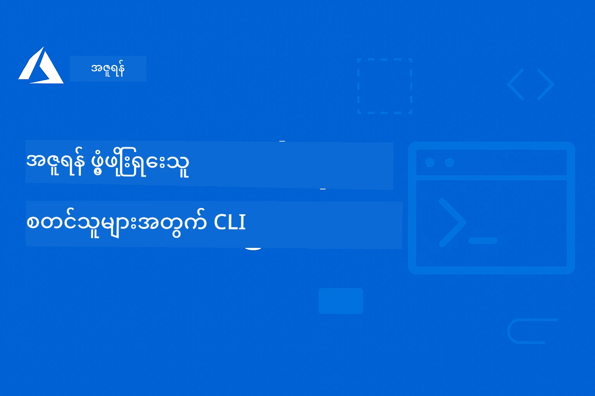

# AZD အတွက် စတင်သူများ: တိကျစွာ ဖွဲ့စည်းထားသော ဘာသာရပ်တစ်ခုမှတ်တမ်းခရီး

 

[](https://GitHub.com/microsoft/azd-for-beginners/watchers/)
[](https://GitHub.com/microsoft/azd-for-beginners/network/)
[](https://GitHub.com/microsoft/azd-for-beginners/stargazers/)

[](https://discord.gg/microsoft-azure)
[](https://discord.gg/nTYy5BXMWG)

## ဒီသင်တန်းနှင့်အတူ စတင်ခြင်း

သင်၏ AZD သင်ယူခရီးကို စတင်ရန် အောက်ပါအဆင့်များကို လိုက်နာပါ-

1. **Repository ကို Fork လုပ်ရန်**: Click [](https://GitHub.com/microsoft/azd-for-beginners/fork)
2. **Repository ကို Clone လုပ်ရန်**: `git clone https://github.com/microsoft/azd-for-beginners.git`
3. **အသိုင်းအဝိုင်းထဲ ဝင်ပါ**: ကျွမ်းကျင်မှုအတွက် [Azure Discord Communities](https://discord.com/invite/ByRwuEEgH4)
4. **သင်ယူလိုသော ဘားသာရွေးချယ်ပါ**: သင်၏ အတွေ့အကြုံအရေအတွက်နှင့်ကိုက်ညီသောအခန်းကို အောက်တွင်ရွေးချယ်ပါ

### ဘာသာစကားအမျိုးမျိုး ထောက်ပံ့မှု

#### အလိုအလျောက် ဘာသာပြန်ခြင်း (အမြဲဆုံးမီ)

<!-- CO-OP TRANSLATOR LANGUAGES TABLE START -->
[Arabic](../ar/README.md) | [Bengali](../bn/README.md) | [Bulgarian](../bg/README.md) | [Burmese (Myanmar)](./README.md) | [Chinese (Simplified)](../zh-CN/README.md) | [Chinese (Traditional, Hong Kong)](../zh-HK/README.md) | [Chinese (Traditional, Macau)](../zh-MO/README.md) | [Chinese (Traditional, Taiwan)](../zh-TW/README.md) | [Croatian](../hr/README.md) | [Czech](../cs/README.md) | [Danish](../da/README.md) | [Dutch](../nl/README.md) | [Estonian](../et/README.md) | [Finnish](../fi/README.md) | [French](../fr/README.md) | [German](../de/README.md) | [Greek](../el/README.md) | [Hebrew](../he/README.md) | [Hindi](../hi/README.md) | [Hungarian](../hu/README.md) | [Indonesian](../id/README.md) | [Italian](../it/README.md) | [Japanese](../ja/README.md) | [Kannada](../kn/README.md) | [Korean](../ko/README.md) | [Lithuanian](../lt/README.md) | [Malay](../ms/README.md) | [Malayalam](../ml/README.md) | [Marathi](../mr/README.md) | [Nepali](../ne/README.md) | [Nigerian Pidgin](../pcm/README.md) | [Norwegian](../no/README.md) | [Persian (Farsi)](../fa/README.md) | [Polish](../pl/README.md) | [Portuguese (Brazil)](../pt-BR/README.md) | [Portuguese (Portugal)](../pt-PT/README.md) | [Punjabi (Gurmukhi)](../pa/README.md) | [Romanian](../ro/README.md) | [Russian](../ru/README.md) | [Serbian (Cyrillic)](../sr/README.md) | [Slovak](../sk/README.md) | [Slovenian](../sl/README.md) | [Spanish](../es/README.md) | [Swahili](../sw/README.md) | [Swedish](../sv/README.md) | [Tagalog (Filipino)](../tl/README.md) | [Tamil](../ta/README.md) | [Telugu](../te/README.md) | [Thai](../th/README.md) | [Turkish](../tr/README.md) | [Ukrainian](../uk/README.md) | [Urdu](../ur/README.md) | [Vietnamese](../vi/README.md)

> **ဒေတာကို ဒေသခံကလွန်ဖ်လုပ်ချင်ပါသလား?**

> ဒီ repository တွင် ဘာသာပြန်ချက် ၅၀ ကျော်ပါရှိပြီး ဒါကြောင့် ဒေါင်းလုပ်အရွယ်အစား တraထွေးစေသည်။ ဘာသာပြန်ချက်မပါဘဲ clone လုပ်ရန် sparse checkout ကို အသုံးပြုပါ-
> ```bash
> git clone --filter=blob:none --sparse https://github.com/microsoft/AZD-for-beginners.git
> cd AZD-for-beginners
> git sparse-checkout set --no-cone '/*' '!translations' '!translated_images'
> ```
> ဒါက သင်တန်းကို ပြီးမြောက်ရန်လိုအပ်သမျှကို ပိုမိုလျင်မြန်စေရန်ဖြစ်သည်။
<!-- CO-OP TRANSLATOR LANGUAGES TABLE END -->

## သင်တန်း အနှစ်ချုပ်

Azure Developer CLI (azd) ကို တိုးတက်စွာ သင်ယူနိုင်ရန် အပိုင်းအားလုံးကို ရှင်းရှင်းလင်းလင်း ဖွဲ့စည်းထားသည်။ **Microsoft Foundry ပေါင်းစပ်မှုနှင့် AI လျှောက်လွှာ တပ်ဆင်ခြင်းအပေါ် အထူးအာရုံစိုက်ထားသည်။**

### ဒီသင်တန်းသည် ယနေ့ခေတ် ဖွံ့ဖြိုးသူများအတွက် ဘာကြောင့် လိုအပ်သနည်း

Microsoft Foundry Discord အသိုင်းအဝိုင်းမှ အတွေ့အကြုံများအရ၊ **ဖွံ့ဖြိုးသူ ၄၅% အနည်းငယ်က AI အလုပ်များအတွက် AZD ကို အသုံးပြုလိုသည်** သို့ရာတွင် အောက်ပါ စိန်ခေါ်မှုများ ရင်ဆိုင်နေရသည်-
- စပ်စုစေသော multi-service AI ပုံစံများ
- ထုတ်လုပ်မှု AI တပ်ဆင်ခြင်း အကောင်းဆုံးနည်းလမ်းများ
- Azure AI ဆက်သွယ်မှုနှင့် ကိရိယာဆက်တင်များ
- AI အလုပ်များ ကြေးနူန်း စီမံခြင်း
- AI ဆိုင်ရာ ပြဿနာများ ဖြေရှင်းခြင်း

### သင်ယူရန် ရည်ရွယ်ချက်များ

ဒီဖွဲ့စည်းပြီး သင်တန်းကို ပြီးမြောက်ပြီးနောက်၊ သင်မှာ-
- **AZD အခြေခံသဘောအနှစ်ချုပ် သိရှိမှု**: အခြေခံတွေ၊ တပ်ဆင်ခြင်းနှင့် ဆက်တင်ခြင်း
- **AI လျှောက်လွှာများ တပ်ဆင်ခြင်း**: Microsoft Foundry ၀န်ဆောင်မှုများနှင့်အတူ AZD အသုံးပြုခြင်း
- **Infrastructure as Code ကို အသုံးပြုခြင်း**: Bicep templates ဖြင့် Azure အရင်းအမြစ်များ စီမံခန့်ခွဲခြင်း
- **တပ်ဆင်မှုတွင် ဖြစ်ပေါ်နိုင်သည့် ပြဿနာများ ဖြေရှင်းခြင်း**: အကူအညီ ပြုလုပ်ခြင်းနှင့် debugging
- **ထုတ်လုပ်မှုအတွက် ပိုမိုကောင်းမွန်အောင် ဆောင်ရွက်ရန်**: လုံခြုံရေး၊ စွမ်းဆောင်ရည်မြှင့်တင်ခြင်း၊ ကြည့်ရှုမှုနှင့် စရိတ်စီမံခန့်ခွဲမှု
- **အဆင့်မြင့် AI ပုံစံများ တည်ဆောက်ခြင်း**: နည်းပညာစုံလင်သော AI စနစ်များ တပ်ဆင်ခြင်း

## 📚 သင်ကြားမှု အခန်းများ

*သင်၏ အတွေ့အကြုံနှင့် ရည်မှန်းချက်ပေါ်မူတည်ပြီး သင်ယူလိုသည့်လမ်းကြောင်းကို ရွေးချယ်ပါ*

### 🚀 အခန်း ၁: အခြေခံနှင့် အမြန်စတင်ခြင်း  
**လိုအပ်ချက်များ**: Azure subscription, command line အခြေခံ နားလည်မှု  
**ကြာချိန်**: ၃၀-၄၅ မိနစ်  
**ခက်ခဲမှုအဆင့်**: ⭐

#### သင်ယူမည့်အကြောင်းအရာများ
- Azure Developer CLI အခြေခံနားလည်မှု
- AZD ကို သင့်ပလက်ဖောင်းတွင်တပ်ဆင်ခြင်း
- ပထမဆုံးအောင်မြင်သော တပ်ဆင်မှု

#### သင်ယူမှု အရင်းအမြစ်များ
- **🎯 ဒီမှာ စတင်ပါ**: [What is Azure Developer CLI?](../..)
- **📖 သီအိုရီ**: [AZD Basics](docs/getting-started/azd-basics.md) - အခြေခံသဘောတရားများနှင့် အသုံးအနှုန်းများ
- **⚙️ တပ်ဆင်ခြင်း**: [Installation & Setup](docs/getting-started/installation.md) - ပလက်ဖောင်းအလိုက် လမ်းညွှန်ချက်များ
- **🛠️ လက်တွေ့လုပ်ငန်းများ**: [Your First Project](docs/getting-started/first-project.md) - အဆင့်ဆင့် လေ့ကျင့်ခန်း
- **📋 ရိုးရှင်းသော ရည်ညွှန်းစာမျက်နှာ**: [Command Cheat Sheet](resources/cheat-sheet.md)

#### လက်တွေ့ လေ့ကျင့်မှုများ
```bash
# အမြန်ထည့်သွင်းမှုစစ်ဆေးခြင်း
azd version

# သင့်ရဲ့ ပထမဆုံးအက်ပ်လီကေးရှင်းကို တပ်ဆင်ပါ
azd init --template todo-nodejs-mongo
azd up
```

**💡 အခန်းရလဒ်**: AZD အသုံးပြု၍ ရိုးရှင်းသော ဝက်ဘ်လျှောက်လွှာတစ်ခုကို အောင်မြင်စွာ တပ်ဆင်နိုင်ခြင်း။

**✅ အောင်မြင်မှုအတည်ပြုချက်:**
```bash
# အခန်း ၁ ကိုပြီးမြောက်စေပြီးနောက်၊ သင်သည် အောက်ပါအရာများကိုပြုလုပ်နိုင်သင့်သည်။
azd version              # တပ်ဆင်ပြီးသားဗားရှင်းကိုပြသသည်
azd init --template todo-nodejs-mongo  # ပရောဂျက်ကိုစတင်တည်ဆောက်သည်
azd up                  # Azure သို့တင်သွင်းသည်
azd show                # ဆော့ဖ်ဝဲလ်အက်ပ် URL ကိုပြသသည်
# အက်ပ်သည် browser တွင်ဖွင့်ပြီး လုပ်ဆောင်သည်
azd down --force --purge  # အရင်းအမြစ်များကိုရှင်းလင်းသည်
```

**📊 ကုန်သက်သာချိန်ကြာမြင့်မှု:** ၃၀-၄၅ မိနစ်  
**📈 လေ့ကျင့်သည့်အခြေအနေ**: မူလတန်း အက်ပ်လီကေးရှင်းများကို ကိုယ်တိုင် တပ်ဆင်နိုင်သည်။

**✅ အောင်မြင်မှုအတည်ပြုချက်:**
```bash
# ကိုးကား ၁ ကိုပြီးဆုံးသည့်နောက် သင်သည် အောက်ပါအရာများကိုလုပ်ဆောင်နိုင်ပါမည်။
azd version              # ထည့်သွင်းထားသောဗားရှင်းကိုပြသည်
azd init --template todo-nodejs-mongo  # ပရောဂျက်ကိုစတင်သည်
azd up                  # Azure တွင် တင်သွင်းသည်
azd show                # ပြေးနေသောအက်ပ်၏ URL ကိုပြသည်
# အက်ပ်ကို ဘရေါဇာတွင်ဖွင့်ပြီး လုပ်ဆောင်သည်
azd down --force --purge  # အရင်းအနှီးများကို သန့်ရှင်းသည်
```

**📊 ကုန်သက်သာချိန်ကြာမြင့်မှု:** ၃၀-၄၅ မိနစ်  
**📈 လေ့ကျင့်သည့်အခြေအနေ**: မူလတန်း အက်ပ်လီကေးရှင်းများကို ကိုယ်တိုင် တပ်ဆင်နိုင်သည်။

---

### 🤖 အခန်း ၂: AI- ပထမဦးဆုံး ဖွံ့ဖြိုးတိုးတက်မှု (AI ဖွံ့ဖြိုးသူများအတွက် အကြံပြုသည်)  
**လိုအပ်ချက်များ**: အခန်း ၁ ပြီးမြောက်ထားခြင်း  
**ကြာချိန်**: ၁-၂ နာရီ  
**ခက်ခဲမှုအဆင့်**: ⭐⭐

#### သင်ယူမည့်အကြောင်းအရာများ
- Microsoft Foundry နှင့် AZD ပေါင်းစပ်မှု
- AI ပါဝင်သော လျှောက်လွှာများ တပ်ဆင်ခြင်း
- AI ၀န်ဆောင်မှု ထိန်းချုပ်မှုပုံစံများ နားလည်မှု

#### သင်ယူမှု အရင်းအမြစ်များ
- **🎯 ဒီမှာ စတင်ပါ**: [Microsoft Foundry Integration](docs/microsoft-foundry/microsoft-foundry-integration.md)
- **📖 ပုံစံများ**: [AI Model Deployment](docs/microsoft-foundry/ai-model-deployment.md) - AI မော်ဒယ်များ တပ်ဆင် စီမံခြင်း
- **🛠️ အလုပ်ရုံပေါ် လေ့ကျင့်ခန်း**: [AI Workshop Lab](docs/microsoft-foundry/ai-workshop-lab.md) - AZD အသုံးပြုပြီး AI ဖြေရှင်းနည်းများ ပြုလုပ်ခြင်း
- **🎥 အပြန်အလှန် လမ်းညွှန်မှု**: [Workshop Materials](workshop/README.md) - MkDocs နှင့် DevContainer ပတ်ဝန်းကျင်ဖြင့် ရှာဖွေရေး
- **📋 နမူနာ Templates**: [Microsoft Foundry Templates](../..)
- **📝 နမူနာများ**: [AZD Deployment Examples](examples/README.md)

#### လက်တွေ့ လေ့ကျင့်မှုများ
```bash
# သင်၏ ပထမဆုံး AI နေရာချထားမှုကို စတင်ပါ
azd init --template azure-search-openai-demo
azd up

# အပို AI အတုများကို စမ်းသပ်ပါ
azd init --template openai-chat-app-quickstart
azd init --template agent-openai-python-prompty
```

**💡 အခန်းရလဒ်**: RAG လုပ်ဆောင်ချက်များပါဝင်သည့် AI အခြေပြု စကားပြောပလက်ဖောင်းတစ်ခု တပ်ဆင်ခြင်းနှင့် ကိရိယာများ တပ်ဆင်နိုင်ခြင်း။

**✅ အောင်မြင်မှုအတည်ပြုချက်:**
```bash
# ခြေလှမ်း ၂ အပြီးတွင်၊ သင်သည် အောက်ပါအရာများကို လုပ်နိုင်သင့်ပါသည်။
azd init --template azure-search-openai-demo
azd up
# AI စကားပြောဖလှယ်မှု မျက်နှာပြင်ကို စမ်းသပ်ပါ။
# မေးခွန်းများမေးပြီး အကြောင်းအရာများပါရှိသော AI- ထောက်ပံ့သည့်ဖြေချက်များကို ရယူပါ။
# ရှာဖွေရေးဆက်စပ်မှု အလုပ်လုပ်မှုကို အတည်ပြုပါ။
azd monitor  # Application Insights တွင် telemetry ပြသနေမှုကို စစ်ဆေးပါ။
azd down --force --purge
```

**📊 ကုန်သက်သာချိန်ကြာမြင့်မှု:** ၁-၂ နာရီ  
**📈 လေ့ကျင့်သည့်အခြေအနေ:** ထုတ်လုပ်မှုအဆင့် AI လျှောက်လွှာများ တပ်ဆင် နှင့် ကိရိယာများ တပ်ဆင်နိုင်သည်  
**💰 ကုန်ကျစရိတ် သတိပြုမှု:** တိုးတက်ရေးပတ်ဝန်းကျင် $၈၀-၁၅၀/လ၊ ထုတ်လုပ်မှုပတ်ဝန်းကျင် $၃၀၀-၃၅၀၀/လ တို့ရှိသည်ကို နားလည်ထားသည်။

#### 💰 AI တပ်ဆင်မှုအတွက် ကုန်ကျစရိတ်အကြောင်း

**တိုးတက်ရေးပတ်ဝန်းကျင် (ခန့်မှန်း $၈၀-၁၅၀/လ):**
- Azure OpenAI (သုံးသည့်အတိုင်းပေးချေနည်း): $၀-၅၀/လ (token အသုံးပြုမှုအပေါ် မူတည်သည်)
- AI Search (Basic အဆင့်): $၇၅/လ
- Container Apps (စားသုံးမှုအပေါ်မူတည်): $၀-၂၀/လ
- Storage (Standard): $၁-၅/လ

**ထုတ်လုပ်မှုပတ်ဝန်းကျင် (ခန့်မှန်း $၃၀၀-၃၅၀၀+ /လ):**
- Azure OpenAI (ကျော်ကြားမှုအတိုင်း PTU): $၃၀၀၀+ /လ ဒါမှမဟုတ် စားသုံးမှုအများများဖြင့် ပေးချေခြင်း
- AI Search (Standard အဆင့်): $၂၅၀/လ
- Container Apps (Dedicated): $၅၀-၁၀၀/လ
- Application Insights: $၅-၅၀/လ
- Storage (Premium): $၁၀-၅၀/လ

**💡 ကုန်ကျစရိတ် ထိန်းသိမ်းမှု အကြံပြုချက်များ:**
- သင်ယူရန် **Free Tier** Azure OpenAI ကို အသုံးပြုပါ (လစဉ် ၅၀,၀၀၀ token ပါ)
- ဖွံ့ဖြိုးမှုမရှိချိန်တွင် `azd down` ကို အသုံးပြု၍ အရင်းအမြစ်များ ပိတ်ထားပါ
- စားသုံးမှုအပေါ်မူတည့်တဲ့ billing စနစ်ဖြင့် စတင်ပြီး ထုတ်လုပ်မှုအတွက်သာ PTU သို့ တိုးမြှင့်ပါ
- တပ်ဆင်မှုမတိုင်မီ `azd provision --preview` ဖြင့် စရိတ် ခန့်မှန်းပါ
- auto-scaling ကို ဖွင့်ပေးခြင်းဖြင့် သုံးစွဲမှုအားလုံးအတွက်သာ ပေးဆောင်သည်

**ကုန်ကျစရိတ် စောင့်ကြည့်မှု:**
```bash
# ခန့်မှန်းထားသော လစဉ်ကုန်ကျစရိတ်များကို စစ်ဆေးပါ
azd provision --preview

# Azure Portal တွင် လက်တွေ့ကုန်ကျစရိတ်များကို ကြည့်ရှုစောင့်ကြည့်ပါ
az consumption budget list --resource-group <your-rg>
```

---

### ⚙️ အခန်း ၃: ဆက်တင်ခြင်းနှင့် အတည်ပြုခြင်း  
**လိုအပ်ချက်များ**: အခန်း ၁ ပြီးမြောက်ထားခြင်း  
**ကြာချိန်**: ၄၅-၆ဝ မိနစ်  
**ခက်ခဲမှုအဆင့်**: ⭐⭐

#### သင်ယူမည့်အကြောင်းအရာများ
- ပတ်ဝန်းကျင်ဆက်တင်ခြင်းနှင့် စီမံခန့်ခွဲခြင်း
- အတည်ပြုခြင်းနှင့် လုံခြုံရေး အကောင်းဆုံးနည်းလမ်းများ
- အရင်းအမြစ်အမည်နှင့် စနစ်တကျ စီမံခြင်း

#### သင်ယူမှု အရင်းအမြစ်များ
- **📖 ဆက်တင်ခြင်း**: [Configuration Guide](docs/getting-started/configuration.md) - ပတ်ဝန်းကျင် ဆက်တင်ခြင်း
- **🔐 လုံခြုံရေး**: [Authentication patterns and managed identity](docs/getting-started/authsecurity.md) - အတည်ပြုစနစ်များ
- **📝 နမူနာများ**: [Database App Example](examples/database-app/README.md) - AZD Database နမူနာများ

#### လက်တွေ့ လေ့ကျင့်မှုများ
- ပတ်ဝန်းကျင်အမျိုးမျိုး (dev, staging, prod) ဆက်တင်ဆောင်ရွက်ခြင်း  
- Managed identity authentication ဖန်တီးခြင်း  
- ပတ်ဝန်းကျင်အလိုက် ဆက်တင်ချက်များ ချမှတ်ခြင်း

**💡 အခန်းရလဒ်**: ပတ်ဝန်းကျင် အမျိုးမျိုးကို မှန်ကန်စွာ အတည်ပြုပြီး လုံခြုံရေး ထိန်းသိမ်းနိုင်ခြင်း

---

### 🏗️ အခန်း ၄: Infrastructure as Code နှင့် တပ်ဆင်ခြင်း  
**လိုအပ်ချက်များ**: အခန်း ၁-၃ ပြီးမြောက်ထားခြင်း  
**ကြာချိန်**: ၁-၁.၅ နာရီ  
**ခက်ခဲမှုအဆင့်**: ⭐⭐⭐

#### သင်ယူမည့်အကြောင်းအရာများ
- တိုးတက်ကောင်းမွန်သော တပ်ဆင်မှု ပုံစံများ
- Bicep ဖြင့် Infrastructure as Code အသုံးပြုခြင်း
- အရင်းအမြစ် စီမံခန့်ခွဲမှု မဟာဗျူဟာများ

#### သင်ယူမှု အရင်းအမြစ်များ
- **📖 တပ်ဆင်ခြင်း**: [Deployment Guide](docs/deployment/deployment-guide.md) - လိုက်နာရမည့် လမ်းညွှန်ချက်များ
- **🏗️ Provisioning**: [Provisioning Resources](docs/deployment/provisioning.md) - Azure အရင်းအမြစ် မန်နေဂျ်မင့်
- **📝 နမူနာများ**: [Container App Example](../../examples/container-app) - Container များအတွက် တပ်ဆင်ခြင်း

#### လက်တွေ့ လေ့ကျင့်မှုများ
- Bicep templates ကို ကိုယ်ပိုင် ဖန်တီးခြင်း  
- multi-service အက်ပ်လီကေးရှင်းများ တပ်ဆင်ခြင်း  
- blue-green deployment မဟာဗျူဟာများ ကို စနစ်တကျ ကျင့်သုံးခြင်း

**💡 အခန်းရလဒ်**: ကိုယ်တိုင် infrastructure templates ဖန်တီးပြီး တိုးတက်ပြီး ဖြစ်တည်သော multi-service အက်ပ်များ တင်သွင်းနိုင်ခြင်း

---

### 🎯 အခန်း ၅: Multi-Agent AI ဖြေရှင်းနည်းများ (အဆင့်မြင့်)  
**လိုအပ်ချက်များ**: အခန်း ၁-၂ ပြီးမြောက်ထားခြင်း  
**ကြာချိန်**: ၂-၃ နာရီ  
**ခက်ခဲမှုအဆင့်**: ⭐⭐⭐⭐
#### သင်ယူမည့်အကြောင်းအရာများ
- မျိုးစုံအေးဂျင့် ဖွဲ့စည်းမှု ပုံစံများ  
- အေးဂျင့် များ စုပေါင်းညှိနှိုင်းမှု  
- ထုတ်လုပ်မှုအဆင့် မျှော်မှန်းထားသော AI တပ်ဆင်မှုများ  

#### သင်ယူရန် အရင်းအမြစ်များ  
- **🤖 ထူးခြားသော ပရောဂျက်**: [Retail Multi-Agent Solution](examples/retail-scenario.md) - ပြည့်စုံသော အကောင်အထည်ဖော်မှု  
- **🛠️ ARM စံတမ်းများ**: [ARM Template Package](../../examples/retail-multiagent-arm-template) - တစ်ချက်နှိပ်ပြီး တပ်ဆင်ရန်  
- **📖 ဖွဲ့စည်းပုံ**: [Multi-agent coordination patterns](/docs/pre-deployment/coordination-patterns.md) - ပုံစံများ  

#### လက်တွေ့ လေ့ကျင့်ခန်းများ  
```bash
# ပြည့်စုံသည့် လက်လီစျေးကွက် မျိုးစုံအေးဂျင့်ဖြေရှင်းချက်ကို တပ်ဆင်ပါ
cd examples/retail-multiagent-arm-template
./deploy.sh

# အေးဂျင့် ဖွဲ့စည်းမှုများကို ရှာဖွေပါ
az deployment group show --resource-group <rg-name> --name <deployment-name>
```
  
**💡 အခန်းရလဒ်**: Customer နှင့် Inventory အေးဂျင့်များပါရှိသော ထုတ်လုပ်နိုင်သော မျိုးစုံအေးဂျင့် AI ဖြေရှင်းနည်း တပ်ဆင်၊ စီမံခန့်ခွဲနိုင်ခြင်း  

---

### 🔍 အခန်း ၆: မတပ်ဆင်မီ စစ်ဆေးခြင်းနှင့် စီစဉ်ခြင်း  
**လိုအပ်ချက်များ**: အခန်း ၄ ပြီးစီးပြီးဖြစ်ရမည်  
**ကြာချိန်**: ၁ နာရီ  
**ရှုပ်ထွေးမှု**: ⭐⭐  

#### သင်ယူမည့်အကြောင်းအရာများ  
- စွမ်းဆောင်ရည်စီမံကိန်းနှင့် အရင်းအမြစ်အတည်ပြုခြင်း  
- SKU ရွေးချယ်မှု မျှခွဲနည်းများ  
- မတပ်ဆင်မီ စစ်ဆေးမှုများနှင့် အလိုအလျောက်လုပ်ဆောင်ခြင်း  

#### သင်ယူရန် အရင်းအမြစ်များ  
- **📊 စီမံကိန်း**: [Capacity Planning](docs/pre-deployment/capacity-planning.md) - အရင်းအမြစ်အတည်ပြုခြင်း  
- **💰 ရွေးချယ်မှု**: [SKU Selection](docs/pre-deployment/sku-selection.md) - စျေးနှုန်း ထိရောက်သော ရွေးချယ်မှုများ  
- **✅ အတည်ပြုခြင်း**: [Pre-flight Checks](docs/pre-deployment/preflight-checks.md) - အလိုအလျောက် စာရွက်များ  

#### လက်တွေ့ လေ့ကျင့်ခန်းများ  
- စွမ်းဆောင်ရည် အတည်ပြု စာရွက်များ ချပြရန်  
- စျေးနှုန်းဆိုင်ရာ အကျိုးပြု စီမံချက်များအတွက် SKU များ ကို ရွေးချယ်ရန်  
- မတပ်ဆင်မီ စစ်ဆေးမှုများ ကို အလိုအလျောက် လုပ်ဆောင်ရန် အကောင်အထည်ဖော်ရန်  

**💡 အခန်းရလဒ်**: တပ်ဆင်ရန် ပြုလုပ်ခြင်းမတိုင်မီ စစ်ဆေး၍ ညှိနှိုင်း ပြုလုပ်နိုင်ခြင်း  

---

### 🚨 အခန်း ၇: ပြဿနာရှာဖွေရေးနှင့် ပြုပြင်ခြင်း  
**လိုအပ်ချက်များ**: မည်သည့် တပ်ဆင်မှု အခန်းမဆို ပြီးစီးပြီးဖြစ်ရမည်  
**ကြာချိန်**: ၁-၁.၅ နာရီ  
**ရှုပ်ထွေးမှု**: ⭐⭐  

#### သင်ယူမည့်အကြောင်းအရာများ  
- စနစ်တကျ ပြဿနာရှာဖွေရေး နည်းလမ်းများ  
- ပုံမှန် ဖြစ်ပေါ်မှုများနှင့် ဖြေရှင်းနည်းများ  
- AI အထူး ပြဿနာရှာဖွေခြင်း  

#### သင်ယူရန် အရင်းအမြစ်များ  
- **🔧 ပုံမှန် ပြဿနာများ**: [Common Issues](docs/troubleshooting/common-issues.md) - မေးခွန်းများနှင့် ဖြေရှင်းနည်းများ  
- **🕵️ ပြဿနာရှာဖွေရေး**: [Debugging Guide](docs/troubleshooting/debugging.md) - အဆင့်လိုက် နည်းလမ်းများ  
- **🤖 AI ပြဿနာများ**: [AI-Specific Troubleshooting](docs/troubleshooting/ai-troubleshooting.md) - AI ဝန်ဆောင်မှု ပြဿနာများ  

#### လက်တွေ့ လေ့ကျင့်ခန်းများ  
- တပ်ဆင်မှု မအောင်မြင်မှုများ ရှာဖွေ စမ်းသပ်ရန်  
- မှတ်ပုံတင် ဆိုင်ရာ ပြဿနာများ ဖြေရှင်းရန်  
- AI ဝန်ဆောင်မှု ဆက်သွယ်မှု ပြဿနာများ အုပ်ချုပ်ရန်  

**💡 အခန်းရလဒ်**: ပုံမှန် ဖြစ်ပေါ်မှုများကို ကိုယ်တိုင် မျှတစွာ ရှာဖွေ ပြုပြင်နိုင်ခြင်း  

---

### 🏢 အခန်း ၈: ထုတ်လုပ်မှုနှင့် စီးပွားရေးပုံစံများ  
**လိုအပ်ချက်များ**: အခန်း ၁ မှ ၄ ပြီးစီးထားသည်  
**ကြာချိန်**: ၂-၃ နာရီ  
**ရှုပ်ထွေးမှု**: ⭐⭐⭐⭐  

#### သင်ယူမည့်အကြောင်းအရာများ  
- ထုတ်လုပ်မှု တပ်ဆင်မှု နည်းလမ်းများ  
- စီးပွားရေးလုံခြုံရေး ပုံစံများ  
- စောင့်ကြည့်မှုနှင့် ကုန်ကျစရိတ် ထိရောက်စွာ စီမံခြင်း  

#### သင်ယူရန် အရင်းအမြစ်များ  
- **🏭 ထုတ်လုပ်မှု**: [Production AI Best Practices](docs/microsoft-foundry/production-ai-practices.md) - စီးပွားရေးပုံစံများ  
- **📝 ဥပမာများ**: [Microservices Example](../../examples/microservices) - ရှုပ်ထွေးသော ဖွဲ့စည်းမှုများ  
- **📊 စောင့်ကြည့်မှု**: [Application Insights integration](docs/pre-deployment/application-insights.md) - စောင့်ကြည့်မှု  

#### လက်တွေ့ လေ့ကျင့်ခန်းများ  
- စီးပွားရေးလုံခြုံရေး ပုံစံများ ကို အကောင်အထည်ဖော်ရန်  
- စုံလင်သော စောင့်ကြည့်မှု ကိရိယာများ တပ်ဆင်ရန်  
- မှတ်ပုံတင်မှုများ အုပ်ချုပ်မှုနဲ့အတူ ထုတ်လုပ်မှု သို့ တပ်ဆင်ရန်  

**💡 အခန်းရလဒ်**: စီးပွားရေးအသင့် လျှောက်လွှာများကို ထုတ်လုပ်မှုအဆင့်၌ တပ်ဆင်နိုင်ခြင်း  

---

## 🎓 အလုပ်ရုံသင်တန်း အကြောင်းအကျဉ်း: လက်တွေ့ သင်ယူရေးအတွေ့အကြုံ  

> **⚠️ အလုပ်ရုံသင်တန်းအခြေအနေ: ဖန်တီးဆောက်လုပ်ဆဲ**  
> အလုပ်ရုံသင်တမ်း အတွက် အသုံးပြုမည့် ပစ္စည်းများ ကို ဖန်တီးဆောက်လုပ်နေဆဲ ဖြစ်ပြီး အဓိက မော်ဒিউလ်များ အလုပ်လုပ်နေပါသည်။ အဆင့်မြင့်ပိုင်း အချို့မှာ မပြီးစီးသေးပါ။ ကျွမ်းကျင်စွာ ပြီးစီးလျက်ရှိပါသည်။ [တိုးတက်မှု ကြည့်ရန် →](workshop/README.md)  

### အပြန်အလှန် ဆက်သွယ်နိုင်သည့် အလုပ်ရုံသင်တန်း ပစ္စည်းများ  
**Browser အခြေပြု ကိရိယာများနှင့် လမ်းညွှန်လေ့ကျင့်ခန်းများဖြင့် သေချာစွာ လက်တွေ့လေ့လာနိုင်ခြင်း**  

ကျွန်ုပ်တို့၏ အလုပ်ရုံသင်တန်း ပစ္စည်းများသည် အထက်ဖော်ပြပါ အခန်းများနှင့် တွဲဖက်၍ လေ့လာနိုင်ပြီး ကိုယ်တိုင် လေ့လာလိုသူများနှင့် ဆရာ/မများ ဦးဆောင်အတန်းများအတွက်သင့်တော်ပါသည်။  

#### 🛠️ အလုပ်ရုံသင်တန်း အင်္ဂါရပ်များ  
- **Browser အခြေပြု မျက်နှာပြင်**: MkDocs ဖြင့် ပြည့်စုံ သင်ကြားရေးပလက်ဖောင်း စွဲရေး၊ ကူးယူနိုင်ခြင်းနှင့် အပြင်အဆင်များ  
- **GitHub Codespaces စမ်းသပ်မှု**: တစ်ချက်နှိပ်ပြီး စနစ်တကျ ဖန်တီးနိုင်မှု  
- **စနစ်တကျ မျှဝေမှု လမ်းညွှန်ချက်များ**: အဆင့် ၇ ခုပြီးဆံ့သော လေ့ကျင့်ခန်းများ (စုစုပေါင်း ၃.၅ နာရီ)  
- **ရှာဖွေရေး → တပ်ဆင်မှု → အသွင်ပြင်မှု**: တိုးတက်မှုဆန်းစစ် နည်းပညာ  
- **DevContainer စနစ်ပတ်ဝန်းကျင်**: ကြိုတင် ပြင်ဆင်ထားသော ကိရိယာများ နှင့် မှီခိုမှုများ  

#### 📚 အလုပ်ရုံသင်တန်း ဖွဲ့စည်းမှု  
အလုပ်ရုံသင်တန်းနှင့်တွဲဖက်၍ **ရှာဖွေရေး → တပ်ဆင်မှု → အသွင်ပြင်မှု** နည်းစနစ်ဖြင့် လုပ်ဆောင်သည်။  

1. **ရှာဖွေရေး အဆင့်** (၄၅ မိနစ်)  
   - Microsoft Foundry စမ်းသပ်မှုများ နွေးထွေးရေး  
   - မျိုးစုံအေးဂျင့် ဖွဲ့စည်းမှု ပုံစံများ နားလည်မှု  
   - တပ်ဆင်ရန် လိုအပ်ချက်များ နှင့် လိုအပ်ချက်များ ပြန်လည်သုံးသပ်ခြင်း  

2. **တပ်ဆင်မှု အဆင့်** (၂ နာရီ)  
   - AZD ကို အသုံးပြု၍ AI လျှောက်လွှာများ လက်တွေ့ တပ်ဆင်ခြင်း  
   - Azure AI ဝန်ဆောင်မှုများ နှင့် နယ်နိမိတ်များ ပြင်ဆင်ခြင်း  
   - လုံခြုံမှုနှင့် မှတ်ပုံတင် နည်းပညာများ ထည့်သွင်းခြင်း  

3. **အသွင်ပြင်မှု အဆင့်** (၄၅ မိနစ်)  
   - သတ်မှတ်ထားသည့် အသုံးပြုမှုများအတွက် လျှောက်လွှာများ ပြင်ဆင်ခြင်း  
   - ထုတ်လုပ်မှု ရည်ရွယ်ချက်ဖြင့် အချိန်ပြည့် တပ်ဆင်မှုအတွက် အကောင်းဆုံး ဖြစ်စေရန် တိုးတက်အောင်ပြုလုပ်ခြင်း  
   - စောင့်ကြည့်မှုနှင့် ကုန်ကျစရိတ် စီမံခန့်ခွဲမှု အကောင်အထည်ဖော်ခြင်း  

#### 🚀 အလုပ်ရုံသင်တန်းအစပြုခြင်း  
```bash
# ရွေးချယ်မှု ၁: GitHub Codespaces (အကြံပြုသည်)
# Repository ထဲတွင် "Code" → "Create codespace on main" ကိုနှိပ်ပါ

# ရွေးချယ်မှု ၂: ဒေသတွင်း ဖွံ့ဖြိုးတိုးတက်မှု
git clone https://github.com/microsoft/azd-for-beginners.git
cd azd-for-beginners/workshop
# workshop/README.md တွင်ရှိသည့် စတင်လုပ်ဆောင်ရန်ညွှန်ကြားချက်များကိုလိုက်နာပါ
```
  
#### 🎯 အလုပ်ရုံသင်တန်း သင်ယူရမည့် ရလဒ်များ  
အလုပ်ရုံသင်တန်း ပြီးစီးခြင်းဖြင့် ပါဝင်သူများမှာ -  
- **ထုတ်လုပ်မှု AI လျှောက်လွှာများ တပ်ဆင်နိုင်မည်**: Microsoft Foundry ဝန်ဆောင်မှုများနှင့် AZD ကို အသုံးပြုခြင်း  
- **မျိုးစုံအေးဂျင့် ပုံစံများကို ကျွမ်းကျင် လုပ်ဆောင်နိုင်မည်**: အေးဂျင့်များ ပူးပေါင်းညှိနှိုင်းခြင်းကို အကောင်အထည်ဖော်နိုင်ခြင်း  
- **လုံခြုံရေး အကောင်းဆုံး လုပ်ထုံးလုပ်နည်းများကို လိုက်နာနိုင်မည်**: မှတ်ပုံတင်နှင့် ဝင်ရောက်ခွင့် ထိန်းချုပ်နိုင်ခြင်း  
- **အတိုင်းအတာအတွက် အထောက်အကူဖြစ်စေရန် စီမံကိန်းများ ဆွဲနိုင်မည်**: စျေးသက်သာမှုနှင့် ထိရောက်မှုမြင့်မားသော ထုတ်လုပ်မှုများ ဒီဇိုင်းဆွဲနိုင်ခြင်း  
- **တပ်ဆင်မှု ပြဿနာများကို ကိုယ်တိုင် ဖြေရှင်းနိုင်မည်**: ပုံမှန် ဖြစ်ပေါ်မှုများကို ပြုပြင်နိုင်ခြင်း  

#### 📖 အလုပ်ရုံသင်တန်း အရင်းအမြစ်များ  
- **🎥 အပြန်အလှန် လမ်းညွှန်ချက်**: [Workshop Materials](workshop/README.md) - Browser အခြေပြု သင်ကြားရေး ပတ်ဝန်းကျင်  
- **📋 အဆင့်လိုက် လမ်းညွှန်ချက်များ**: [Guided Exercises](../../workshop/docs/instructions) - အသေးစိတ် လမ်းညွှန်ချက်များ  
- **🛠️ AI Workshop Lab**: [AI Workshop Lab](docs/microsoft-foundry/ai-workshop-lab.md) - AI အခြေပြု လေ့ကျင့်မှုများ  
- **💡 အစပြုရလွယ်ကူခြင်း**: [Workshop Setup Guide](workshop/README.md#quick-start) - ပတ်ဝန်းကျင် ပြင်ဆင်ခြင်း  

**သင့်တော်သည်**: ကော်ပိုရေးရှင်း လေ့ကျင့်မှု၊ တက္ကသိုလ်သင်တန်းများ၊ ကိုယ်တိုင်တက်လေ့လာမှုနှင့် ဖန်တီးသူ သင်တန်းများအတွက် ဖြစ်ပါသည်။  

---

## 📖 Azure Developer CLI ဆိုသည်မှာ အဘယ်သနည်း?  

Azure Developer CLI (azd) သည် Azure သို့ လျှောက်လွှာများ တည်ဆောက်မှုနှင့် တပ်ဆင်မှုလုပ်ငန်းစဥ်ကို အဆောင်အဖျောက် မြန်ဆန်စေသော developer-အလျောက် အသုံးပြုသည့် command-line interface ဖြစ်သည်။ ၎င်းသည် ဖော်ပြသည် -  

- **စံတမ်းအခြေပြု တပ်ဆင်မှုများ** - စံပုံများကို အသုံးပြုပြီး အခြားနှစ်သက်ရာ နယ်ပယ်များတွင် မျှော်မှန်းထားသော ပုံစံများ တပ်ဆင်နိုင်ခြင်း  
- **Infrastructure as Code** - Bicep သို့မဟုတ် Terraform အသုံးပြုပြီး Azure အရင်းအမြစ်များ စီမံခန့်ခွဲနိုင်ခြင်း  
- **လျင်မြန်၍ ကောင်းမွန်သော လည်ပတ်မှုများ** - ပရိုဂရမ်များ တပ်ဆင်ခြင်း၊ မျှော်မှန်းခြင်းနှင့် စောင့်ကြည့်ခြင်းကို အဆင်ပြေပြည့်စုံ ပြုလုပ်ခြင်း  
- **Developer အဖွဲ့အစည်းများအတွက် သင့်လျော်သော နည်းလမ်းများ** - ဖန်တီးသူများ အတွက် ထိရောက်မှုနှင့် အတွေ့အကြုံများ တိုးတက်စေခြင်း  

### **AZD + Microsoft Foundry: AI တပ်ဆင်မှုများအတွက် အလွယ်တကူ**  

**AI ဖြေရှင်းနည်းများအတွက် AZD ကို ရွေးချယ်ရသည့် အကြောင်းကြောင်း** AZD သည် AI ဖွံ့ဖြိုးသူများရှေ့မှောက် အခက်အခဲများကို ဖြေရှင်းပေးသည် -  

- **AI-အဆင်သင့် စံပုံများ** - Azure OpenAI, Cognitive Services, ML စွမ်းဆောင်မှုများအတွက် ကြိုတင်ပြင်ဆင်ထားသော စံပုံများ  
- **လုံခြုံသော AI တပ်ဆင်မှုများ** - AI ဝန်ဆောင်မှုများ၊ API key များနှင့် မော်ဒယ် နယ်နိမိတ်များအတွက် လုံခြုံရေးပုံစံများ ထည့်သွင်းထားခြင်း  
- **ထုတ်လုပ်ရန် အထူးဆန်းသစ် AI ပုံစံများ** - ပြည့်စုံ အရွယ်အစားတည်ဆောက်မှု နှင့် စျေးနှုန်းထိရောက်မှု  
- **AI လုပ်ငန်းစဉ် အစဉ်လိုက် အစီအစဉ်များ** - မော်ဒယ် ဖွံ့ဖြိုးမှုမှ ထုတ်လုပ်မှုအဆင့်သို့ စောင့်ကြည့်မှုအထိ  
- **ကုန်ကျစရိတ် ထိရောက်စွာ စီမံခြင်း** - AI လုပ်ငန်းစွမ်းအင်များအတွက် အရင်းအမြစ် သုံးစွဲမှု လွယ်ကူလာခြင်း  
- **Microsoft Foundry ပေါင်းစည်းမှု** - Microsoft Foundry မော်ဒယ်စာရင်းနှင့် နယ်နိမိတ်များနှင့် ချိတ်ဆက်ဖို့ အဆင်ပြေသည်  

---

## 🎯 စံပုံများနှင့် ဥပမာများ စုစည်းမှု  

### ထူးခြားသောအရာ: Microsoft Foundry စံပုံများ  
**AI လျှောက်လွှာများ တပ်ဆင်ချင်သူများ အတွက် စတင်ရန်နေရာ**  

> **မှတ်ချက်**: ဒီစံပုံတွေဟာ AI ပုံစံ တွေကို ပြသထားပြီး အချို့ဟာ Azure Samples အပြင်ဖြစ်ကာ အချို့က ဒေသခံ ပြုလုပ်ထားတာဖြစ်ပါတယ်။  

| စံပုံ | အခန်း | ရှုပ်ထွေးမှု | ဝန်ဆောင်မှုများ | အမျိုးအစား |  
|----------|---------|------------|----------|------|  
| [**Get started with AI chat**](https://github.com/Azure-Samples/get-started-with-ai-chat) | အခန်း ၂ | ⭐⭐ | AzureOpenAI + Azure AI Model Inference API + Azure AI Search + Azure Container Apps + Application Insights | ပြင်ပ |  
| [**Get started with AI agents**](https://github.com/Azure-Samples/get-started-with-ai-agents) | အခန်း ၂ | ⭐⭐ | Azure AI Agent Service + AzureOpenAI + Azure AI Search + Azure Container Apps + Application Insights | ပြင်ပ |  
| [**Azure Search + OpenAI Demo**](https://github.com/Azure-Samples/azure-search-openai-demo) | အခန်း ၂ | ⭐⭐ | AzureOpenAI + Azure AI Search + App Service + Storage | ပြင်ပ |  
| [**OpenAI Chat App Quickstart**](https://github.com/Azure-Samples/openai-chat-app-quickstart) | အခန်း ၂ | ⭐ | AzureOpenAI + Container Apps + Application Insights | ပြင်ပ |  
| [**Agent OpenAI Python Prompty**](https://github.com/Azure-Samples/agent-openai-python-prompty) | အခန်း ၅ | ⭐⭐⭐ | AzureOpenAI + Azure Functions + Prompty | ပြင်ပ |  
| [**Contoso Chat RAG**](https://github.com/Azure-Samples/contoso-chat) | အခန်း ၈ | ⭐⭐⭐⭐ | AzureOpenAI + AI Search + Cosmos DB + Container Apps | ပြင်ပ |  
| [**Retail Multi-Agent Solution**](examples/retail-scenario.md) | အခန်း ၅ | ⭐⭐⭐⭐ | AzureOpenAI + AI Search + Storage + Container Apps + Cosmos DB | **ဒေသခံ** |  

### ထူးခြားသောအရာ: ပြည့်စုံသင်ယူမှု နမူနာများ  
**ထုတ်လုပ်ရန် စံတော်ချိန်ထားပြီး လေ့လာမှု အခန်းများနှင့် ဆက်စပ်မှုရှိသည်**  

| စံပုံ | သင်ယူမည့် အခန်း | ရှုပ်ထွေးမှု | အရေးပါသော သင်ယူမှု |  
|----------|------------------|------------|--------------|  
| [**openai-chat-app-quickstart**](https://github.com/Azure-Samples/openai-chat-app-quickstart) | အခန်း ၂ | ⭐ | အခြေခံ AI တပ်ဆင်မှု ပုံစံများ |  
| [**azure-search-openai-demo**](https://github.com/Azure-Samples/azure-search-openai-demo) | အခန်း ၂ | ⭐⭐ | Azure AI Search ဖြင့် RAG တပ်ဆင်မှု |  
| [**ai-document-processing**](https://github.com/Azure-Samples/ai-document-processing) | အခန်း ၄ | ⭐⭐ | စာတမ်း ထောက်လှမ်းရေး ပေါင်းစပ်မှု |  
| [**agent-openai-python-prompty**](https://github.com/Azure-Samples/agent-openai-python-prompty) | အခန်း ၅ | ⭐⭐⭐ | အေးဂျင့် ဖွဲ့စည်းမှု နှင့် Function ဆက်သွယ်မှု |  
| [**contoso-chat**](https://github.com/Azure-Samples/contoso-chat) | အခန်း ၈ | ⭐⭐⭐ | စီးပွားရေး AI စုပေါင်းစီမံခန့်ခွဲမှု |  
| [**retail-multi-agent-solution**](examples/retail-scenario.md) | အခန်း ၅ | ⭐⭐⭐⭐ | Customer နှင့် Inventory အေးဂျင့်များ ပါရှိသော မျိုးစုံအေးဂျင့် ဖွဲ့စည်းမှု |  

### ဥပမာအလေ့အထများအလိုက် သင်ယူခြင်း  

> **📌 ဒေသခံ နှင့် ပြင်ပ ဥပမာများ**  
> **ဒေသခံ ဥပမာများ** (repo အတွင်း) = ချက်ချင်း အသုံးပြုနိုင်  
> **ပြင်ပ ဥပမာများ** (Azure Samples) = ဆက်လက် Clone ဆွဲပြီး အသုံးပြုရန်  

#### ဒေသခံ ဥပမာများ (အသုံးပြုရန် အသင့်)  
- [**Retail Multi-Agent Solution**](examples/retail-scenario.md) - ARM စံမှတ်ပုံများပါသော လုပ်ငန်းအဆောက်အအုံပြည့်စုံ  
  - မျိုးစုံအေးဂျင့် ဖွဲ့စည်းမှု (Customer + Inventory အေးဂျင့်)  
  - စုံလင်သော စောင့်ကြည့်မှု နှင့် သုံးသပ်ခြင်း  
  - ARM စံတမ်းမှ တစ်ချက်နှိပ်ပြီး တပ်ဆင်နိုင်မှု  

#### ဒေသခံ ဥပမာများ - ကွန်တိနာ လျှောက်လွှာများ (အခန်း ၂-၅)  
**ဒီ repo မှာ ကွန်တိနာ တပ်ဆင်မှု အပြည့်အစုံ ဥပမာများ**  
- [**Container App Examples**](examples/container-app/README.md) - ကွန်တိနာအခြေပြု တပ်ဆင်ခြင်း လမ်းညွှန်ချက် ပြည့်စုံ  
  - [Simple Flask API](../../examples/container-app/simple-flask-api) - အခြေခံ REST API နှင့် scale-to-zero  
  - [Microservices Architecture](../../examples/container-app/microservices) - ထုတ်လုပ်မှု အဆင့် မျိုးစုံ ဝန်ဆောင်မှုတပ်ဆင်မှု  
  - အစပြုခြင်း၊ ထုတ်လုပ်မှုနှင့် တိုးတက်ခြင်း ပုံစံများ  
  - စောင့်ကြည့်မှု၊ လုံခြုံရေးနှင့် ကုန်ကျစရိတ် ထိရောက်စွာ စီမံခန့်ခွဲခြင်း အကြံပြုချက်များ  

#### ပြင်ပ ဥပမာများ - လွယ်ကူသော လျှောက်လွှာများ (အခန်း ၁-၂)  
**ဒီ Azure Samples repos များ ဒေါင်းလုပ်ဆွဲပြီး စတင်အသုံးပြုရန်**  
- [Simple Web App - Node.js + MongoDB](https://github.com/Azure-Samples/todo-nodejs-mongo) - အခြေခံ တပ်ဆင်မှု ပုံစံများ  
- [Static Website - React SPA](https://github.com/Azure-Samples/todo-csharp-sql-swa-func) - အမြဲတမ်းစာမျက်နှာ တပ်ဆင်ခြင်း  
- [Container App - Python Flask](https://github.com/Azure-Samples/container-apps-store-api-microservice) - REST API တပ်ဆင်ခြင်း  

#### ပြင်ပ ဥပမာများ - ဒေတာဘေ့စ် ပေါင်းစပ်မှု (အခန်း ၃-၄)  
- [Database App - C# + SQL](https://github.com/Azure-Samples/todo-csharp-sql) - ဒေတာဘေ့စ် ဆက်သွယ်မှု ပုံစံများ  
- [Functions + Cosmos DB](https://github.com/Azure-Samples/todo-python-mongo-swa-func) - Serverless ဒေတာ ကြောင့်လုပ်ငန်းစဥ်  

#### ပြင်ပ ဥပမာများ - အဆင့်မြင့် ပုံစံများ (အခန်း ၄-၈)  
- [Java Microservices](https://github.com/Azure-Samples/java-microservices-aca-lab) - မျိုးစုံ ဝန်ဆောင်မှု ဖွဲ့စည်းမှု  
- [Container Apps Jobs](https://github.com/Azure-Samples/container-apps-jobs) - နောက်ခံ ပြုပြင်ဆောင်ရွက်မှု  
- [Enterprise ML Pipeline](https://github.com/Azure-Samples/mlops-v2) - ထုတ်လုပ်ရန် အဆင်သင့် ML ပုံစံများ  

### ပြင်ပ စံပုံ စုစည်းမှုများ  
- [**အတည်ပြု AZD စံပုံများ ဖန်တီးမှု ကောက်နှုတ်များ**](https://azure.github.io/awesome-azd/) - အတည်ပြုနှင့် အသိုင်းအဝိုင်း စံပုံများ၏ ရွေးချယ်မှုများ
- [**Azure Developer CLI Templates**](https://learn.microsoft.com/en-us/azure/developer/azure-developer-cli/azd-templates) - Microsoft Learn ပုံစံစာတမ်း
- [**Examples Directory**](examples/README.md) - အသေးစိတ်ရှင်းလင်းချက်များနှင့်ကိုယ်ပိုင်လေ့လာနိုင်သော နမူနာများ

---

## 📚 လေ့လာရန်အရင်းအမြစ်များ နှင့် ကိုးကားချက်များ

### အမြန်ရောက် References
- [**Command Cheat Sheet**](resources/cheat-sheet.md) - အခြေခံ azd command များ မျိုးခွဲလိုက် စီထားသည်
- [**Glossary**](resources/glossary.md) - Azure နှင့် azd စကားလုံးများ
- [**FAQ**](resources/faq.md) - လူကြိုက်များသောမေးခွန်းများကို သင်ယူခန်းကြီးအလိုက် စီပြီး
- [**Study Guide**](resources/study-guide.md) - လေ့ကျင့်ခန်းများ ပြည့်စုံသော မျိုး

### လက်တွေ့လုပ်ငန်းရုံများ
- [**AI Workshop Lab**](docs/microsoft-foundry/ai-workshop-lab.md) - သင်၏ AI ဖြေရှင်းမှုများကို AZD ဖြင့် deployment လုပ်လိုက်ပါ (၂-၃ နာရီ)
- [**Interactive Workshop Guide**](workshop/README.md) - MkDocs နှင့် DevContainer ပတ်ဝန်းကျင်ဖြင့် Browser-based workshop
- [**Structured Learning Path**](../../workshop/docs/instructions) - ၇ ခြေလှမ်း ညွှန်ကြားထားသော လေ့ကျင့်ခန်းများ (စမ်းသပ်ခြင်း → Deployment → ကိုယ်ပိုင်ပြင်ဆင်ခြင်း)
- [**AZD For Beginners Workshop**](workshop/README.md) - GitHub Codespaces ပါဝင်သော လက်တွေ့လုပ်ငန်းရုံစာတမ်းများ

### အပြင်အဆင်လေ့လာနိုင်သောအရင်းအမြစ်များ
- [Azure Developer CLI Documentation](https://learn.microsoft.com/en-us/azure/developer/azure-developer-cli/)
- [Azure Architecture Center](https://learn.microsoft.com/en-us/azure/architecture/)
- [Azure Pricing Calculator](https://azure.microsoft.com/pricing/calculator/)
- [Azure Status](https://status.azure.com/)

---

## 🔧 အမြန်ပြဿနာဖြေရှင်းလမ်းညွှန်

**စတင်သူများကြုံတွေ့ရသော ပေါင်းစုံ ပြဿနာများနှင့် ချက်ချင်းဖြေရှင်းနည်းများ:**

### ❌ "azd: command not found"

```bash
# ပထမဦးဆုံး AZD တပ်ဆင်ပါ
# Windows (PowerShell):
winget install microsoft.azd

# macOS:
brew tap azure/azd && brew install azd

# Linux:
curl -fsSL https://aka.ms/install-azd.sh | bash

# တပ်ဆင်မှုကို စစ်ဆေးပါ
azd version
```

### ❌ "No subscription found" or "Subscription not set"

```bash
# ရနိုင်သော စာရင်းပေးသွင်းမှုများကို စာရင်းပြုစုပါ
az account list --output table

# ပုံသေစာရင်းပေးသွင်းမှု များကို သတ်မှတ်ပါ
az account set --subscription "<subscription-id-or-name>"

# AZD ပတ်ဝန်းကျင်အတွက် သတ်မှတ်ပါ
azd env set AZURE_SUBSCRIPTION_ID "<subscription-id>"

# အတည်ပြုပါ
az account show
```

### ❌ "InsufficientQuota" or "Quota exceeded"

```bash
# အခြား Azure ဒေသများကို စမ်းသုံးကြည့်ပါ
azd env set AZURE_LOCATION "westus2"
azd up

# ဒါမှမဟုတ် ဖွံ့ဖြိုးရေးတွင် ပိုသေးငယ်သော SKU များကို အသုံးပြုပါ
# infra/main.parameters.json ကို တည်းဖြတ်ပါ:
{
  "sku": "B1"  // Instead of "P1V2"
}
```

### ❌ "azd up" fails halfway through

```bash
# ရွေးချယ်မှု ၁: ရှင်းလင်းပြီး ထပ်မံကြိုးစားပါ
azd down --force --purge
azd up

# ရွေးချယ်မှု ၂: အခြေခံအဆောက်အအုံသာ ပြင်ဆင်ပါ
azd provision

# ရွေးချယ်မှု ၃: အသေးစိတ်မှတ်တမ်းများကို စစ်ဆေးပါ
azd show
azd logs
```

### ❌ "Authentication failed" or "Token expired"

```bash
# ပြန်လည်အတည်ပြုပါ
az logout
az login

azd auth logout
azd auth login

# အထောက်အထား ဖော်ပြချက်ကို စစ်ဆေးပါ
az account show
```

### ❌ "Resource already exists" or naming conflicts

```bash
# AZD သည် ထူးခြားသောနာမည်များ ထုတ်ပေးသော်လည်း၊ ပဋိပက္ခရှိပါက:
azd down --force --purge

# ထိုနောက် သန့်ရှင်းသော ပတ်ဝန်းကျင်နှင့် ပြန်လည်ကြိုးစားပါ။
azd env new dev-v2
azd up
```

### ❌ Template deployment taking too long

**ပုံမှန်စောင့်ဆိုင်းချိန်များ -**
- ရိုးရှင်းသောဝဘ်လ်ပ်: ၅-၁၀ မိနစ်
- ဒေတာဘေ့စ်ပါရှိသောအက်ပ်: ၁၀-၁၅ မိနစ်
- AI အက်ပ်များ: ၁၅-၂၅ မိနစ် (OpenAI ပေးပို့ခြင်း နည်းပါတယ်)

```bash
# တိုးတက်မှုကို စစ်ဆေးပါ
azd show

# ၃၀ မိနစ်ထက်ပိုကြာပြီး အတိတ်ကျနေပါက Azure Portal ကို စစ်ဆေးပါ
azd monitor
# မအောင်မြင်သော တပ်ဆင်မှုများကို ရှာဖွေပါ
```

### ❌ "Permission denied" or "Forbidden"

```bash
# သင်၏ Azure အခန်းကဏ္ဍကို စစ်ဆေးပါ
az role assignment list --assignee $(az account show --query user.name -o tsv)

# အနည်းဆုံး "Contributor" အခန်းကဏ္ဍ လိုအပ်သည်
# သင့် Azure အုပ်ချုပ်သူထံ မှတောင်းဆိုပါ -
# - Contributor (အရင်းအမြစ်များအတွက်)
# - User Access Administrator (အခန်းကဏ္ဍတာဝန်ပေးခြင်းများအတွက်)
```

### ❌ Can't find deployed application URL

```bash
# အစervice အားလုံး၏အဆုံးဆုံးချက်များကိုပြပါ
azd show

# ဒါမှမဟုတ် Azure Portal ကိုဖွင့်ပါ
azd monitor

# သတ်မှတ်ထားသော service ကိုစစ်ဆေးပါ
azd env get-values
# *_URL များကိုရှာပါ
```

### 📚 ပြဿနာဖြေရှင်းရင်းမြစ်များ အပြည့်အစုံ

- **လူကြိုက်များသောပြဿနာများ လမ်းညွှန်:** [အသေးစိတ်ဖြေရှင်းချက်များ](docs/troubleshooting/common-issues.md)
- **AI အထူးပြဿနာများ:** [AI ပြဿနာဖြေရှင်းခြင်း](docs/troubleshooting/ai-troubleshooting.md)
- **Debugging လမ်းညွှန်:** [အဆင့်စဥ် Debugging](docs/troubleshooting/debugging.md)
- **အကူအညီရယူရန်:** [Azure Discord](https://discord.gg/microsoft-azure) #azure-developer-cli

---

## 🔧 အမြန်ပြဿနာဖြေရှင်းလမ်းညွှန်

**စတင်သူများကြုံတွေ့ရသော ပေါင်းစုံ ပြဿနာများနှင့် ချက်ချင်းဖြေရှင်းနည်းများ:**

<details>
<summary><strong>❌ "azd: command not found"</strong></summary>

```bash
# အရင်ဆုံး AZD ကို 설치ပါ
# Windows (PowerShell):
winget install microsoft.azd

# macOS:
brew tap azure/azd && brew install azd

# Linux:
curl -fsSL https://aka.ms/install-azd.sh | bash

# 설치ပြီးကြောင်း အတည်ပြုပါ
azd version
```
</details>

<details>
<summary><strong>❌ "No subscription found" or "Subscription not set"</strong></summary>

```bash
# အသုံးပြုနိုင်သော စာရင်းသွင်းမှုများကို စာရင်းပြုစုပါ
az account list --output table

# မူရင်းစာရင်းသွင်းမှုကို သတ်မှတ်ပါ
az account set --subscription "<subscription-id-or-name>"

# AZD ပတ်ဝန်းကျင်အတွက် သတ်မှတ်ပါ
azd env set AZURE_SUBSCRIPTION_ID "<subscription-id>"

# အတည်ပြုပါ
az account show
```
</details>

<details>
<summary><strong>❌ "InsufficientQuota" or "Quota exceeded"</strong></summary>

```bash
# ကွဲပြားသော Azure ဒေသကို စမ်းသပ်ကြည့်ပါ
azd env set AZURE_LOCATION "westus2"
azd up

# ဒါမှမဟုတ် ဖွံ့ဖြိုးရေးတွင် အသေးစား SKU များကို အသုံးပြုပါ
# infra/main.parameters.json ကို တည်းဖြတ်ပါ:
{
  "sku": "B1"  // Instead of "P1V2"
}
```
</details>

<details>
<summary><strong>❌ "azd up" fails halfway through</strong></summary>

```bash
# ရွေးချယ်စရာ ၁: သန့်ရှင်းပြီး ထပ်မံကြိုးစားပါ
azd down --force --purge
azd up

# ရွေးချယ်စရာ ၂: အခြေခံအဆောက်အအုံကိုသာ ပြင်ဆင်ပါ
azd provision

# ရွေးချယ်စရာ ၃: အသေးစိတ် မှတ်တမ်းများကို စစ်ဆေးပါ
azd show
azd logs
```
</details>

<details>
<summary><strong>❌ "Authentication failed" or "Token expired"</strong></summary>

```bash
# ပြန်လည်အတည်ပြုပါ
az logout
az login

azd auth logout
azd auth login

# အတည်ပြုမှုကိုစစ်ဆေးပါ
az account show
```
</details>

<details>
<summary><strong>❌ "Resource already exists" or naming conflicts</strong></summary>

```bash
# AZD စတိုင်နည်းနာမည်များထုတ်ပေးသည်၊ သို့သော် ပဋိပက္ခရှိပါက
azd down --force --purge

# ထို့နောက် ပတ်ဝန်းကျင်အသစ်ဖြင့် ထပ်မံကြိုးစားပါ။
azd env new dev-v2
azd up
```
</details>

<details>
<summary><strong>❌ Template deployment taking too long</strong></summary>

**ပုံမှန်စောင့်ဆိုင်းချိန်များ -**
- ရိုးရှင်းသောဝဘ်လ်ပ်: ၅-၁၀ မိနစ်
- ဒေတာဘေ့စ်ပါရှိသောအက်ပ်: ၁၀-၁၅ မိနစ်
- AI အက်ပ်များ: ၁၅-၂၅ မိနစ် (OpenAI ပေးပို့ခြင်း နည်းပါတယ်)

```bash
# တိုးတက်မှုကို စစ်ဆေးပါ
azd show

# ၃၀ မိနစ်ထက် ကျော်နေပါက Azure Portal ကို စစ်ဆေးပါ
azd monitor
# ပျက်ကွက်သော တပ်ဆင်မှုများကို ရှာဖွေပါ
```
</details>

<details>
<summary><strong>❌ "Permission denied" or "Forbidden"</strong></summary>

```bash
# သင့် Azure အခန်းကဏ္ဍကို စစ်ဆေးပါ
az role assignment list --assignee $(az account show --query user.name -o tsv)

# အနည်းဆုံး "Contributor" အခန်းကဏ္ဍ လိုအပ်ပါသည်
# သင့် Azure စီမံခန့်ခွဲသူကို မေးမြန်းပါ:
# - Contributor (အရင်းအမြစ်များအတွက်)
# - User Access Administrator (အခန်းကဏ္ဍ ခန့်အပ်မှုများအတွက်)
```
</details>

<details>
<summary><strong>❌ Can't find deployed application URL</strong></summary>

```bash
# ဝန်ဆောင်မှုအချက်ပတွဲအားလုံးကို ပြပါ
azd show

# ဒါမှမဟုတ် Azure Portal ကို ဖွင့်ပါ
azd monitor

# သတ်မှတ်ထားသော ဝန်ဆောင်မှုကို စစ်ဆေးပါ
azd env get-values
# *_URL ကွဲပြားချက်များကို ရှာဖွေပါ
```
</details>

### 📚 ပြည့်စုံသော ပြဿနာဖြေရှင်းရင်းမြစ်များ

- **လူကြိုက်များသောပြဿနာများ လမ်းညွှန်:** [အသေးစိတ်ဖြေရှင်းချက်များ](docs/troubleshooting/common-issues.md)
- **AI အထူးပြဿနာများ:** [AI ပြဿနာဖြေရှင်းခြင်း](docs/troubleshooting/ai-troubleshooting.md)
- **Debugging လမ်းညွှန်:** [အဆင့်စဥ် Debugging](docs/troubleshooting/debugging.md)
- **အကူအညီရယူရန်:** [Azure Discord](https://discord.gg/microsoft-azure) #azure-developer-cli

---

## 🎓 သင်တန်းပြီးမြောက်ခြင်း နှင့် လက်မှတ်ရယူခြင်း

### တိုးတက်မှု ဆက်လက်ကြည့်ရှုခြင်း
သင်၏လေ့လာမှု တစ်ခန်းစီအလိုက် တိုးတက်မှုကိုအောက်ပါအတိုင်း လိုက်ပါနိုင်ပါသည်။

- [ ] **ခန်း ၁**: အခြေခံခြင်းနှင့် အမြန်စတင်ခြင်း ✅
- [ ] **ခန်း ၂**: AI-ပထမ ဦးဆောင် ဖွံ့ဖြိုးရေး ✅  
- [ ] **ခန်း ၃**: ဖွဲ့စည်းခြင်းနှင့် အတည်ပြုခြင်း ✅
- [ ] **ခန်း ၄**: Infrastructure as Code နှင့် Deployment ✅
- [ ] **ခန်း ၅**: Multi-Agent AI ဖြေရှင်းချက်များ ✅
- [ ] **ခန်း ၆**: Deployment မလုပ်ခင် စစ်ဆေးခြင်းနှင့် အစီအစဉ်ဆွဲခြင်း ✅
- [ ] **ခန်း ၇**: ပြဿနာဖြေရှင်းခြင်း နှင့် Debugging ✅
- [ ] **ခန်း ၈**: ထုတ်လုပ်မှုပုံစံများနှင့် စက်မှုလုပ်ငန်းစတိုင် ✅

### သင်ယူမှုပြန်စစ်ခြင်း
ခန်းအလိုက်ပြီးဆုံးပြီးပါက သင်၏တတ်ပညာထက်မြက်မှုကို အောက်ပါအတိုင်း စစ်ဆေးပါ-
1. **လက်တွေ့ လေ့ကျင့်ခန်း**: ခန်းကို လက်တွေ့ deployment ဖြင့်ပြီးစီးပါ
2. **တတ်မြောက်မှုပြန်လည်စစ်ဆေးခြင်း**: ကိုယ်တိုင်ဖတ်ရှုသည့် FAQ အပိုင်းကို ပြန်လည်အားပေးပါ
3. **အသိုင်းအဝိုင်း ဆွေးနွေးမှု**: Azure Discord တွင် ကိုယ့်အတွေ့အကြုံ မျှဝေပါ
4. **နောက်တစ်ခန်းသို့**: နောက်တစ်ဆင့်အခန်းသို့ ရွှေ့ပါ

### သင်တန်းပြီးမြောက်ခြင်း၏ အကျိုးကျေးဇူးများ
အခန်းအားလုံးပြီးစီးသည့်အခါ သင်မှာ-
- **ထုတ်လုပ်မှု အတွေ့အကြုံ**: AI applications များကို Azure တွင် deployed ပြီးနောက်
- **ပရော်ဖက်ရှင်နယ်ကျွမ်းကျင်မှု**: စက်မှုလုပ်ငန်းအသုံးပြုနိုင်သော deployment နည်းလမ်းများ
- **အသိုင်းအဝိုင်း မှတ်သားခြင်း**: Azure developer အသိုင်းအဝိုင်းအတွင်း အဖွဲ့ဝင်တစ်ဦး
- **အလုပ်အကိုင် မြှင့်တင်မှု**: AZD နှင့် AI deployment ကျွမ်းကျင်မှုများ အလောင်းအစားရှိသည်

---

## 🤝 အသိုင်းအဝိုင်း နှင့် အထောက်အပံ့

### အကူအညီနှင့် ထောက်ခံမှုရယူခြင်း
- **နည်းပညာဆိုင်ရာ ပြဿနာများ**: [အမှားများကို တိုင်ကြားခြင်းနှင့် လိုအပ်ချက်များတောင်းဆိုခြင်း](https://github.com/microsoft/azd-for-beginners/issues)
- **သင်ယူမေးခွန်းများ**: [Microsoft Azure Discord Community](https://discord.gg/microsoft-azure) နှင့် [](https://discord.gg/nTYy5BXMWG)
- **AI အထူးအကူအညီ**: [](https://discord.gg/nTYy5BXMWG) တွင်ဆက်သွယ်ပါ
- **စာတမ်းများ**: [တရားဝင် Azure Developer CLI စာတမ်း](https://learn.microsoft.com/en-us/azure/developer/azure-developer-cli/)

### Microsoft Foundry Discord မှ အသိုင်းအဝိုင်း အမြင်များ

**#Azure Channel တွင် လတ်တလော မဲပေးမှုရလဒ်များ -**
- **၄၅%** 的 developer များသည် AI workload များအတွက် AZD ကို အသုံးပြုလိုသည်
- **အကြိမ်ရေအများဆုံး စိန်ခေါ်မှုများ**: Multi-service deployment များ၊ credential စီမံခန့်ခွဲမှု၊ ထုတ်လုပ်မှုအဆင့်ရောက်ရန်
- **အများဆုံးတောင်းဆိုသည့်အရာများ**: AI အတွက် template များ၊ ပြဿနာဖြေရှင်းလမ်းညွှန် များ၊ ကောင်းမွန်သောလေ့လာမှုနည်းလမ်း

**သင်၏ community အတွက် ပါဝင်ရန် -**
- သင်၏ AZD + AI အတွေ့အကြုံ မျှဝေပြီး အကူအညီရယူပါ
- AI templates များအတွက် ဦးဆောင် ကြိုစမ်းသပ်မှုများ ရယူပါ
- AI deployment များအတွက် ကောင်းမွန်သောလေ့လာမှုဆိုင်ရာ စံနှုန်းများ ထည့်သွင်းပါ
- အနာဂတ် AI + AZD features ဖွံ့ဖြိုးတိုးတက်မှုကို ထိန်းသိမ်းပါ

### သင်တန်းအတွက် အဖြစ်ကောင်းမြင့် ပေးဖို့

ကျွန်ုပ်တို့သည် လက်ခံလက်စား အသင်းဝင်များကို ဖိတ်ခေါ်ပါသည်။ ဤအကြောင်းအရာများကို ဖတ်ရှုရန် [Contributing Guide](CONTRIBUTING.md) ကို ကြည့်ပါ။
- **အကြောင်းအရာတိုးတက်မှုများ**: ရှိပြီးသားခန်းများ နှင့် နမူနာများ တိုးတက်အောင် ပြုလုပ်ပါ
- **နမူနာသစ်များ**: လက်တွေ့ကဘယ်နှင့် Templates များ ထည့်သွင်းပါ  
- **ဘာသာပြန်မှု**: ဘာသာစကားစုံ ထောက်ပံ့မှု စောင့်ရှောက်မှု
- **အမှားပြန်သိရှိမှုများ**: တိကျမှန်ကန်မှုနှင့် ရှင်းလင်းမှု တိုးတက်ရန်
- **အသိုင်းအဝိုင်း စံနှုန်းများ**: ကျွန်ုပ်တို့၏ ပေါင်းသင်းခံယူမှုအဖွဲ့လိုက် အကွာအဝေး စည်းကမ်းများ လိုက်နာပါ

---

## 📄 သင်တန်းသတင်းအချက်အလက်

### လိုင်စင်
ဤပရောဂျက်သည် MIT License ဖြင့် လိုင်စင်ဖြစ်ပြီး [LICENSE](../../LICENSE) ဖိုင်တွင် အသေးစိတ်ပါသည်။

### Microsoft သင်ခန်းစာများနှင့် အခြား သင်ကြားမှုအရင်းအမြစ်များ

ကျွန်ုပ်တို့အဖွဲ့သည် အခြားပြည့်စုံသော သင်ကြားမှုများကို ထုတ်လုပ်ပါသည် -

<!-- CO-OP TRANSLATOR OTHER COURSES START -->
### LangChain
[](https://aka.ms/langchain4j-for-beginners)
[](https://aka.ms/langchainjs-for-beginners?WT.mc_id=m365-94501-dwahlin)
[](https://github.com/microsoft/langchain-for-beginners?WT.mc_id=m365-94501-dwahlin)
---

### Azure / Edge / MCP / Agents
[](https://github.com/microsoft/AZD-for-beginners?WT.mc_id=academic-105485-koreyst)
[](https://github.com/microsoft/edgeai-for-beginners?WT.mc_id=academic-105485-koreyst)
[](https://github.com/microsoft/mcp-for-beginners?WT.mc_id=academic-105485-koreyst)
[](https://github.com/microsoft/ai-agents-for-beginners?WT.mc_id=academic-105485-koreyst)

---
 
### Generative AI Series
[](https://github.com/microsoft/generative-ai-for-beginners?WT.mc_id=academic-105485-koreyst)
[-9333EA?style=for-the-badge&labelColor=E5E7EB&color=9333EA)](https://github.com/microsoft/Generative-AI-for-beginners-dotnet?WT.mc_id=academic-105485-koreyst)
[-C084FC?style=for-the-badge&labelColor=E5E7EB&color=C084FC)](https://github.com/microsoft/generative-ai-for-beginners-java?WT.mc_id=academic-105485-koreyst)
[-E879F9?style=for-the-badge&labelColor=E5E7EB&color=E879F9)](https://github.com/microsoft/generative-ai-with-javascript?WT.mc_id=academic-105485-koreyst)

---
 
### Core Learning
[](https://aka.ms/ml-beginners?WT.mc_id=academic-105485-koreyst)
[](https://aka.ms/datascience-beginners?WT.mc_id=academic-105485-koreyst)
[](https://aka.ms/ai-beginners?WT.mc_id=academic-105485-koreyst)
[](https://github.com/microsoft/Security-101?WT.mc_id=academic-96948-sayoung)
[](https://aka.ms/webdev-beginners?WT.mc_id=academic-105485-koreyst)
[](https://aka.ms/iot-beginners?WT.mc_id=academic-105485-koreyst)
[](https://github.com/microsoft/xr-development-for-beginners?WT.mc_id=academic-105485-koreyst)

---
 
### Copilot Series
[](https://aka.ms/GitHubCopilotAI?WT.mc_id=academic-105485-koreyst)
[](https://github.com/microsoft/mastering-github-copilot-for-dotnet-csharp-developers?WT.mc_id=academic-105485-koreyst)
[](https://github.com/microsoft/CopilotAdventures?WT.mc_id=academic-105485-koreyst)
<!-- CO-OP TRANSLATOR OTHER COURSES END -->

---

## 🗺️ သင်တန်းလမ်းညွှန်

**🚀 သင်ယူရန် အသင့်ပြင်ဆင်ပြီးပြီလား?**

**စတိုင်ဖြစ်သူများ**: [အခန်း ၁: အခြေခံနှင့် အမြန်စတင်ခြင်း](../..) ကနေ စတင်ပါ  
**AI ဖွံ့ဖြိုးသူများ**: [အခန်း ၂: AI-ပထမဖွံ့ဖြိုးမှု](../..) ကနေ တက်ကြွစွာ လှမ်းပါ  
**အတွေ့အကြုံရှိသော ဖွံ့ဖြိုးသူများ**: [အခန်း ၃: ဖွဲ့စည်းမှုနှင့် အတည်ပြုမှု](../..) မှ စတင်ပါ

**နောက်ဆုံးအဆင့်များ**: [အခန်း ၁ - AZD အခြေခံများ စတင်ပါ](docs/getting-started/azd-basics.md) →

---

<!-- CO-OP TRANSLATOR DISCLAIMER START -->
**မှတ်ချက်**  
ဤစာတမ်းကို AI ဘာသာပြန်မှု ဝန်ဆောင်မှု [Co-op Translator](https://github.com/Azure/co-op-translator) ဖြင့် ဘာသာပြန်ထားပါသည်။ တိကျမှုအတွက် ကြိုးစားမိသော်လည်း အလိုအလျောက် ဘာသာပြန်မှုများတွင် မွားယွင်းမှုများ သို့မဟုတ် အမှားအယွင်းများ ပါဝင်နိုင်ကြောင်း သတိပြုပါရန်။ မူလစာတမ်းကို မူရင်းဘာသာဖြင့်သာ ယုံကြည်စိတ်ချရသောအရင်းအမြစ်အဖြစ် ဆက်သွယ်လေ့လာသင့်ပါသည်။ အရေးကြီးသော အချက်အလက်များအတွက် အကြံပေး ဖြစ်ကြောင်း လူ့ဘာသာပြန်မှုကို အကြံပြုပါသည်။ ဤဘာသာပြန်မှုကို အသုံးပြုမှုပေါ်တွင် ဖြစ်ပေါ်နိုင်သည့် မှားဖော်ခြင်း သို့မဟုတ် ထောက်ခူအဆင်မပြေမှုများကြောင့် ကျွန်ုပ်တို့သည် တာဝန်မရှိကြောင်း အသိပေးအပ်ပါသည်။
<!-- CO-OP TRANSLATOR DISCLAIMER END -->