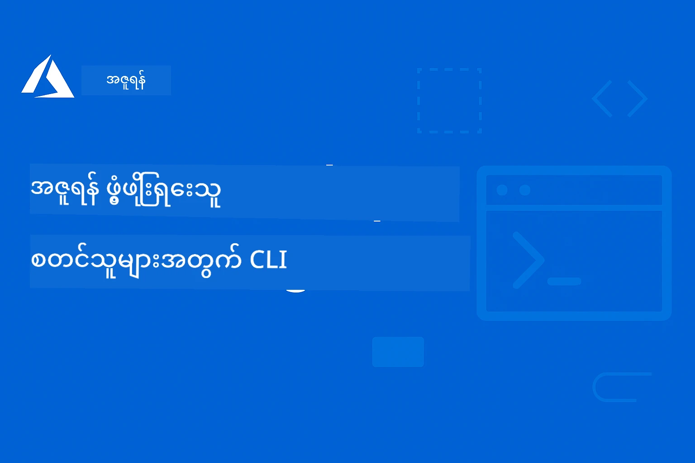

# AZD စတင်သူများအတွက်: ဖွဲ့စည်းထားသော သင်ယူခရီး

 

[](https://GitHub.com/microsoft/azd-for-beginners/watchers/)
[](https://GitHub.com/microsoft/azd-for-beginners/network/)
[](https://GitHub.com/microsoft/azd-for-beginners/stargazers/)

[](https://discord.gg/microsoft-azure)
[](https://discord.gg/nTYy5BXMWG)

---

### အလိုအလျောက် ဘာသာပြန်ချက်များ (အမြဲတမ်း ပြည့်စုံစွာ အပ်ဒိတ်)

<!-- CO-OP TRANSLATOR LANGUAGES TABLE START -->
[အာရဗစ်](../ar/README.md) | [ဘင်္ဂါလီ](../bn/README.md) | [ဘူလ်ဂေးရီးယန်](../bg/README.md) | [မြန်မာ (Myanmar)](./README.md) | [တရုတ် (ရိုးရှင်း)](../zh-CN/README.md) | [တရုတ် (ထရဒီရှင်းနယ်၊ ဟောင်ကောင်)](../zh-HK/README.md) | [တရုတ် (ထရဒီရှင်းနယ်၊ မာကာအို)](../zh-MO/README.md) | [တရုတ် (ထရဒီရှင်းနယ်၊ တိုင်ဝမ်)](../zh-TW/README.md) | [ကိုရွေးရှီးယား](../hr/README.md) | [ကျက်ခ်](../cs/README.md) | [ဒိန်းမတ်](../da/README.md) | [ဒတ်ခ်](../nl/README.md) | [အက်စတိုနီးယား](../et/README.md) | [ဖင်လန်](../fi/README.md) | [ပြင်သစ်](../fr/README.md) | [ဂျာမနီ](../de/README.md) | [ဂရိ](../el/README.md) | [ဟီဘရူး](../he/README.md) | [ဟိန္ဒီ](../hi/README.md) | [ဟန်ဂေရီ](../hu/README.md) | [အင်ဒိုနီးရှား](../id/README.md) | [အီတလီ](../it/README.md) | [ဂျပန်](../ja/README.md) | [ကန်နာဒါ](../kn/README.md) | [ကိုရိယာ](../ko/README.md) | [လစ်သူးအေးနီးယား](../lt/README.md) | [မလေးရှား](../ms/README.md) | [မာလာയာလမ်](../ml/README.md) | [မာရသီ](../mr/README.md) | [ေနပေါလီ](../ne/README.md) | [နိုင်ဂျေးရီယာ ပစ်ဂင်း](../pcm/README.md) | [နော်ဝေ](../no/README.md) | [ဖာစီ (ပားရှန်)](../fa/README.md) | [ပိုလန်](../pl/README.md) | [ပေါ်တူဂီ (ဘရာဇီးလ)](../pt-BR/README.md) | [ပေါ်တူဂီ (ပေါ်တူဂီ)](../pt-PT/README.md) | [ပန်ဂျာဘီ (ဂူရူမူချီ)](../pa/README.md) | [ရိုမေးနီးယား](../ro/README.md) | [ရုရှား](../ru/README.md) | [ဆားဘီယာ (ဆိုမြလစ်)](../sr/README.md) | [ဆလိုဗေးကျာ](../sk/README.md) | [ဆလိုဗေးနီးယား](../sl/README.md) | [စပိန်](../es/README.md) | [ဆွာဟီလီ](../sw/README.md) | [စွီဒင်](../sv/README.md) | [တာဂလိုဂ် (ဖိလစ်ပိုင်)](../tl/README.md) | [တမီးလ်](../ta/README.md) | [တယ်လူဂူ](../te/README.md) | [ထိုင်း](../th/README.md) | [တူရကီ](../tr/README.md) | [ယူကရိန်း](../uk/README.md) | [ဥာဒူး](../ur/README.md) | [ဗီယက်နမ်](../vi/README.md)

> **ဒေသীয়ဂစ္တည်း ဖြင့် မှူးပြီး ကလုန်ခွင့်ယူချင်ပါသလား?**
>
> ဒီ repository မှာ ဘာသာပြန်ချက်ဘာသာစကား ၅၀+ ပါဝင်တဲ့အတွက် ဒေါင်းလုတ် အရွယ်အစား ကြီးမားနိုင်ပါတယ်။ ဘာသာပြန်ချက်များမပါဘဲ clone လုပ်ရန် sparse checkout ကို အသုံးပြုပါ။
>
> **Bash / macOS / Linux:**
> ```bash
> git clone --filter=blob:none --sparse https://github.com/microsoft/AZD-for-beginners.git
> cd AZD-for-beginners
> git sparse-checkout set --no-cone '/*' '!translations' '!translated_images'
> ```
>
> **CMD (Windows):**
> ```cmd
> git clone --filter=blob:none --sparse https://github.com/microsoft/AZD-for-beginners.git
> cd AZD-for-beginners
> git sparse-checkout set --no-cone "/*" "!translations" "!translated_images"
> ```
>
> ဒါက သင့်ကို အတန်းလုံးကို ပြီးမြောက်အောင် လိုအပ်တဲ့ အရာအားလုံးကို အလွန်အမြန်ဒေါင်းလုတ်ဖြင့် ပေးပါလိမ့်မယ်။
<!-- CO-OP TRANSLATOR LANGUAGES TABLE END -->

## 🆕 azd တွင် ယနေ့ အသစ်ထည့်သွင်းချက်များ

Azure Developer CLI သည် ရိုးရာ web app များနှင့် API များမှ ကျော်လွန်ကာ တိုးတက်မြှင့်တင်လာပါသည်။ ယနေ့တွင် azd သည် Azure သို့ မည်သည့် application မဆို ထည့်သွင်းဖို့ အသုံးပြုနိုင်သော တစ်ခုတည်းသော အ工具 ဖြစ်ပါသည်—AI အခြေပြု application များနှင့် သတိပေးစနစ် agent များကိုပါ အပါအဝင်။

ဒါက သင့်အတွက် အဓိပ္ပါယ်ရတဲ့ အချက်တွေကတော့ -

- **AI agent များသည် ယခု azd ၏ ထူးခြားသော workload များ အဖြစ် လက်ခံခံထားသွားပါပြီ။** `azd init` → `azd up` ဆိုတဲ့ အလွယ်ကူသိပြီးသား workflow ကိုအသုံးပြုပြီး AI agent project များကို initialize, deploy, နှင့် စီမံခန့်ခွဲနိုင်ပါတယ်။
- **Microsoft Foundry ပေါင်းစည်းမှု** က model deployment, agent hosting, နှင့် AI service configuration များကို azd template ecosystem ထဲသို့ တိုက်ရိုက် ယူဆောင်လာပါတယ်။
- **အခြေခံ workflow သည် မပြောင်းလဲသေးပါ။** todo app, microservice, သို့မဟုတ် multi-agent AI ဖြေရှင်းချက် တက်ကြွစွာ တာဝန်ကျေသဖြင့် deploy လုပ်နေသော်လည်း, command များသည် ယေဘူယျ တူညီနေဆဲဖြစ်သည်။

သင့်မှာ azd ကို အရင်ကအသုံးပြုခဲ့ဖူးပါက AI စနစ်များအတွက် ထောက်ခံမှုသည် သဘာဝတရားအဆက်တစ်ခုဖြစ်သည်—တခြားသံစဉ်ကတစ်ခု သို့မဟုတ် တိုးတက်မြှင့်တင်သော ကိရိယာမဟုတ်ပါ။ သင် အသစ်စတင်ပါကလည်း၊ တစ်ခုတည်းသော workflow ကို သင်ယူမည်ဖြစ်ပြီး အရာအားလုံးအတွက် အသုံးဝင်ပါသည်။

---

## 🚀 Azure Developer CLI (azd) ဆိုတာ ဘာလဲ?

**Azure Developer CLI (azd)** သည် developer များအတွက် ရည်ရွယ်ထားသော command-line ကိရိယာဖြစ်ပြီး Azure သို့ application များ တင်သွင်းရန် လွယ်ကူစွာ ပြုလုပ်ပေးသည်။ Azure resource အများအပြားကို လက်ဖြင့် တစ်ခုချင်းစီ ဖန်တီးချိတ်ဆက်စရာမလိုဘဲ၊ တစ်ချက် command ဖြင့် အပလီကေးရှင်းတစ်ခုလုံးကို deploy လုပ်နိုင်စေသည်။

### `azd up` ၏ မာဂျစ်

```bash
# ဒီတစ်ခုတည်းသောcommandသည် အားလုံးကိုလုပ်ဆောင်သည်။
# ✅ Azure ရင်းမြစ်အားလုံးကို ဖန်တီးသည်
# ✅ ကွန်ရက်နှင့်လုံခြုံရေးကို ပြင်ဆင်သည်
# ✅ သင့် application ကုဒ်ကို ဆောက်လုပ်သည်
# ✅ Azure သို့ deploy လုပ်သည်
# ✅ လုပ်ကိုင်နိုင်သော URL ကိုပေးသည်
azd up
```

**ရလဒ်က ရပါတယ်!** Azure Portal တွင် မထိထိချုပ်ချင်း မနှိပ်ရန်၊ ရိုးရှင်းမလှသော ARM templates များကို အရင်လေ့လာရန် မလိုအပ်တော့ပါ၊ လက်ဖြင့် configure ပြုလုပ်ရန် မလိုတော့ပါ—Azure ပေါ်တွင် လက်ရှိ အလုပ်လုပ်သော application များသာ ရှိပါသည်။

---

## ❓ Azure Developer CLI နှင့် Azure CLI: ဘာတွေကွာသလဲ?

ဒီဟာက စတင်သူများ အလွန် မေးခွန်းများ မေးလေ့ရှိတဲ့ အကြောင်းအရာဖြစ်ပါတယ်။ ရိုးရှင်းတဲ့ ပြตอบကတော့ -

| Feature | **Azure CLI (`az`)** | **Azure Developer CLI (`azd`)** |
|---------|---------------------|--------------------------------|
| **ရည်ရွယ်ချက်** | တစ်ခုချင်း Azure resource များကို စီမံခန့်ခွဲရန် | အပလီကေးရှင်း ပြည့်ဝစွာ ကို deploy လုပ်ရန် |
| **စိတ်ထား** | အုတ်မြစ်အခြေခံ (Infrastructure-focused) | အပလီကေးရှင်း အခြေခံ (Application-focused) |
| **ဥပမာ** | `az webapp create --name myapp...` | `azd up` |
| **လေ့လာရန် လှမ်းလျှောက်မှု** | Azure services များကို သိထားဖို့ လိုအပ်သည် | သင့် app ကို သိထားခြင်းသာ လုံလောက်သည် |
| **အကောင်းဆုံး အသုံးပြုရန်** | DevOps, Infrastructure | Developers, Prototyping |

### ရိုးရှင်းသော ဆင်တူခြင်း

- **Azure CLI** က အိမ်တစ်လုံး တည်ဆောက်ဖို့ လက်စွဲကိရိယာများ (ဖျားမာ, saw, nails) စုစည်းထားသလို ဖြစ်ပါတယ် - အသုံးပြုသူသည် ဘာမှမဆိုတည်ဆောက်နိုင်သော်လည်း ဆောက်လုပ်ရေးဗဟုသုတ လိုအပ်သည်။
- **Azure Developer CLI** က ဆောက်လုပ်ပေးမည့် စီမံခန့်ခွဲသူကို ငှားထားခြင်းကဲ့သို့ ဖြစ်သည် - သင်လိုချင်သည်ကို ဖော်ပြလိုက်ပါ၊ မျက်နှာချင်းဆိုင် အလုပ်ကို သူတို့လုပ်ပေးပါလိမ့်မယ်။

### ဘယ်အချိန်မှာ မည်ကို အသုံးပြုမလဲ

| အခြေအနေ | သုံးရန် |
|----------|----------|
| "ကျွန်တော့် web app ကို လျင်မြန်စွာ deploy လုပ်ချင်တယ်" | `azd up` |
| "storage account အတစ်ခု ဖန်တီးဖို့ လိုပါတယ်" | `az storage account create` |
| "AI application တစ်ခု တည်ဆောက်နေပါတယ်" | `azd init --template azure-search-openai-demo` |
| "တစ်ခုချင်း Azure resource ကို debug လုပ်ဖို့ လိုပါတယ်" | `az resource show` |
| "မိနစ်ပိုင်းအတွင်း production အသင့် deployment လုပ်ချင်ပါတယ်" | `azd up --environment production` |

### သူတို့ သုံးပြိုင်နိုင်ကြသည်!

AZD သည် အောက်ခံတွင် Azure CLI ကို အသုံးပြုထားသည်။ သင်နှစ်ခုလုံးကို အသုံးပြုနိုင်ပါသည်:
```bash
# AZD ဖြင့် သင့်အက်ပ်ကို ထည့်သွင်းပါ
azd up

# ထို့နောက် Azure CLI ဖြင့် သတ်မှတ်ထားသော အရင်းအမြစ်များကို စိစစ်ပြင်ဆင်ပါ
az webapp config set --name myapp --always-on true
```

---

## 🌟 Awesome AZD မှာ Template များ ရှာပါ

တစ်ခြားနေရာကနေစတင်စရာ မလိုဘူး! **Awesome AZD** သည် အသိပညာစုဆောင်းထားသော template များ အစုလိုက်:

| Resource | ဖော်ပြချက် |
|----------|-------------|
| 🔗 [**Awesome AZD Gallery**](https://azure.github.io/awesome-azd/) | တစ်ချက်နှိပ်ပြီး deploy လုပ်နိုင်သော 200+ templates ကို ရှာဖွေပါ |
| 🔗 [**Submit a Template**](https://github.com/Azure/awesome-azd/issues) | သင့် template ကို အဖွဲ့အစည်းသို့ အလှူအပ်ပါ |
| 🔗 [**GitHub Repository**](https://github.com/Azure/awesome-azd) | source ကို star ထား၍ လေ့လာပါ |

### Awesome AZD မှ ရေပန်းစား AI Templates များ

```bash
# Microsoft Foundry မော်ဒယ်များနှင့် AI ရှာဖွေရေးအတူ RAG စကားပြော
azd init --template azure-search-openai-demo

# အမြန် AI စကားပြော အပလီကေးရှင်း
azd init --template openai-chat-app-quickstart

# Foundry အသင်းဝင်များနှင့် AI ကိုယ်စားလှယ်များ
azd init --template get-started-with-ai-agents
```

---

## 🎯 3 ခြေလှမ်းဖြင့် စတင်ခြင်း

### အဆင့် 1: AZD ထည့်သွင်းခြင်း (၂ မိနစ်)

**Windows:**
```powershell
winget install microsoft.azd
```

**macOS:**
```bash
brew tap azure/azd && brew install azd
```

**Linux:**
```bash
curl -fsSL https://aka.ms/install-azd.sh | bash
```

### အဆင့် 2: Azure သို့ login ဝင်ခြင်း

```bash
azd auth login
```

### အဆင့် 3: သင့် ပထမဆုံး App ကို Deploy လုပ်ပါ

```bash
# အမြစ်စံနမူနာမှ စတင်တည်ဆောက်မည်
azd init --template todo-nodejs-mongo

# Azure သို့ တပ်ဆင်မည် (အားလုံးကို ဖန်တီးသည်!)
azd up
```

**🎉 အဆုံးထိ ရောက်ပါပြီ!** သင့် app ကို ယခု Azure ပေါ်တွင် အသက်ဝင်နေပါပြီ။

### သန့်ရှင်းရေး (မမေ့ပါနှင့်!)

```bash
# Remove all resources when done experimenting
azd down --force --purge
```

---

## 📚 ဒီ သင်တန်းကို မည်သို့ အသုံးပြုမလည်း

ဒီသင်တန်းသည် **တိုးတက်လာသော သင်ယူခြင်း** အတွက် ဒီဇိုင်းရေးဆွဲထားသည် - သင် သက်ဆိုင်ရာနေရာမှ စတင်၍ အဆင့်မြှင့်သို့ ခရီးဆက်ပါ:

| သင်၏ အတွေ့အကြုံ | ဒီနေရာမှ စပါ |
|-----------------|------------|
| **Azure ကို အသစ်စ entirely** | [အခန်း 1: အခြေခံ](#-chapter-1-foundation--quick-start) |
| **Azure သိပြီး AZD ကို အသစ်စ entirely** | [အခန်း 1: အခြေခံ](#-chapter-1-foundation--quick-start) |
| **AI apps များ deploy လုပ်ချင်သည်** | [အခန်း 2: AI-ပထမဆုံး ဖွံ့ဖြိုးတိုးတက်မှု](#-chapter-2-ai-first-development-recommended-for-ai-developers) |
| **လက်တွေ့ လေ့ကျင့်ရန်လိုသည်** | [🎓 အပြင်းအထန် လက်တွေ့ စက်ရုံ](workshop/README.md) - 3-4 နာရီ ဉာဏ်ကြီး လက်က်ဆောင် lab |
| **Production ပုံစံများ လိုအပ်သည်** | [အခန်း 8: ထုတ်လုပ်မှု & လုပ်ငန်းမော်ဒယ်များ](#-chapter-8-production--enterprise-patterns) |

### လျင်မြန်သော စတင်ဆင်တန်း

1. **ဒီ Repository ကို Fork လုပ်ပါ**: [](https://GitHub.com/microsoft/azd-for-beginners/fork)
2. **Clone လုပ်ပါ**: `git clone https://github.com/YOUR-USERNAME/azd-for-beginners.git`
3. **ကူညီမှုပေါင်းစုံ ရယူပါ**: [Azure Discord Community](https://discord.com/invite/ByRwuEEgH4)

> **ဒေသတွင်းကလွန်စိတ် ထင်ရှားစွာ Clone လုပ်ရန် သဘောတူပါသလား?**

> ဒီ repository တွင် ဘာသာပြန်ချက် ၅၀+ ပါဝင်သည့်အတွက် ဒေါင်းလုတ် အရွယ်အစား ကြီးပြင်းနိုင်သည်။ ဘာသာပြန်ချက် မပါဘဲ clone လုပ်ရန် sparse checkout ကို အသုံးပြုပါ:
> ```bash
> git clone --filter=blob:none --sparse https://github.com/microsoft/AZD-for-beginners.git
> cd AZD-for-beginners
> git sparse-checkout set --no-cone '/*' '!translations' '!translated_images'
> ```
> ဒါက သင့်ကို အတန်းလုံးကို ပြီးမြောက်အောင် လိုအပ်တဲ့ အရာအားလုံးကို အလွန်အမြန်ဒေါင်းလုတ်ဖြင့် ပေးပါလိမ့်မယ်။


## သင်တန်း အကျဥ်းချုပ်

Azure Developer CLI (azd) ကို အဆင့်လိုက်အခန်းများမှတဆင့် ကျွမ်းကျင်ပါစေ။ **Microsoft Foundry ပေါင်းစည်းမှုနှင့် အတူ AI application deployment အပေါ် အထူးအာရုံစိုက်ထားပါသည်။**

### ဒီ သင်တန်းသည် ခေတ်သစ် developer များအတွက် မည်ကြောင့် အရေးကြီးသလဲ

Microsoft Foundry Discord community ၏ အတွေ့အကြုံများအရ၊ **developer 45% က AZD ကို AI workloads များအတွက် အသုံးချချင်ကြောင်း** ဖော်ပြခဲ့ကြပြီး အောက်ပါအခက်အခဲများနှင့် တွေ့ကြုံနေကြသည် -
- ဆင်းကျဉ်းသော multi-service AI architecture များ
- Production AI deployment အတွက် အကောင်းဆုံး လက်ထောက်အတွေ့အကြုံများ  
- Azure AI service ပေါင်းစည်းမှု နှင့် configuration
- AI workloads များအတွက် ကုန်ကျစရိတ် တိုးချဲ့မှုကို လျော့နည်းစေရန် ဗျူဟာများ
- AI-ဆိုင်ရာ deployment ပြဿနာများ ကို ကောက်နုတ်ရှာဖွေခြင်း

### သင်ယူ ရမည့် ရလဒ်များ

ဒီ ဖွဲ့စည်းထားသော သင်တန်းကို အပြီးသတ်လျှင်၊ သင်သည် -
- **AZD အခြေခံကျွမ်းကျင်မှု**: အဓိက သဘောတရားများ၊ installation နှင့် configuration များကို ကျွမ်းကျင်ပါမည်
- **AI Applications များ Deploy လုပ်နည်း**: AZD ကို Microsoft Foundry services များနှင့် အသုံးပြုပါ
- **Infrastructure as Code ကို အကောင်အထည်ဖော်ခြင်း**: Bicep templates ဖြင့် Azure resources များကို စီမံပါ
- **Deployment များ Troubleshoot လုပ်နည်း**: ပုံမှန်ပြဿနာများကို ဖြေရှင်း၍ debug ပြုလုပ်နိုင်ပါမည်
- **Production အတွက် အဖိုးတန် စနစ်များ Optimize လုပ်ခြင်း**: လုံခြုံရေး၊ scaling, monitoring, နှင့် ကုန်ကျစရိတ် စီမံခန့်ခွဲမှု
- **Multi-Agent ဖြေရှင်းချက်များ တည်ဆောက်ခြင်း**: ပိုမိုရှုပ်ထွေးသော AI architecture များကို deploy လုပ်နိုင်ခြင်း

## 🗺️ သင်တန်း မြေပုံ: အခန်းအလိုက် လျင်မြန် ရှာဖွေရန်

အခန်းတစ်ခုချင်းစီတွင် သင်ယူရမည့် ရည်ရွယ်ချက်များ၊ လျင်မြန်စက် (quick starts) နှင့် လေ့ကျင့်မှုများပါဝင်သည့် README တစ်ခုမှ တိကျစွာ ဖော်ပြထားသည်။

| အခန်း | အကြောင်းအရာ | သင်ခန်းစာများ | ကြာမြင့်ချိန် | ခက်ခဲမှု |
|---------|-------|---------|----------|------------|
| **[အခန်း 1: အခြေခံ](docs/chapter-01-foundation/README.md)** | စတင်ခြင်း | [AZD အခြေခံ](docs/chapter-01-foundation/azd-basics.md) &#124; [ထည့်သွင်းခြင်း](docs/chapter-01-foundation/installation.md) &#124; [ပထမ ဖ_project](docs/chapter-01-foundation/first-project.md) | 30-45 မိနစ် | ⭐ |
| **[Ch 2: AI ဖွံ့ဖြိုးရေး](docs/chapter-02-ai-development/README.md)** | AI-First Apps | [Foundry Integration](docs/chapter-02-ai-development/microsoft-foundry-integration.md) &#124; [AI Agents](docs/chapter-02-ai-development/agents.md) &#124; [Model Deployment](docs/chapter-02-ai-development/ai-model-deployment.md) &#124; [Workshop](docs/chapter-02-ai-development/ai-workshop-lab.md) | 1-2 နာရီ | ⭐⭐ |
| **[Ch 3: ဖွင့်တည်ဆောက်ခြင်း](docs/chapter-03-configuration/README.md)** | အတည်ပြုခြင်း & လုံခြုံရေး | [Configuration](docs/chapter-03-configuration/configuration.md) &#124; [Auth & Security](docs/chapter-03-configuration/authsecurity.md) | 45-60 မိနစ် | ⭐⭐ |
| **[Ch 4: အင်ဖပ်စထျိုက်ချာ](docs/chapter-04-infrastructure/README.md)** | IaC & Deployment | [Deployment Guide](docs/chapter-04-infrastructure/deployment-guide.md) &#124; [Provisioning](docs/chapter-04-infrastructure/provisioning.md) | 1-1.5 နာရီ | ⭐⭐⭐ |
| **[Ch 5: မල්တီ-အေးဂျင့်](docs/chapter-05-multi-agent/README.md)** | AI Agent Solutions | [Retail Scenario](examples/retail-scenario.md) &#124; [Coordination Patterns](docs/chapter-06-pre-deployment/coordination-patterns.md) | 2-3 နာရီ | ⭐⭐⭐⭐ |
| **[Ch 6: ကြိုတင်ပြင်ဆင်မှု](docs/chapter-06-pre-deployment/README.md)** | ပြင်ဆင်မှု & အတည်ပြုခြင်း | [Preflight Checks](docs/chapter-06-pre-deployment/preflight-checks.md) &#124; [Capacity Planning](docs/chapter-06-pre-deployment/capacity-planning.md) &#124; [SKU Selection](docs/chapter-06-pre-deployment/sku-selection.md) &#124; [App Insights](docs/chapter-06-pre-deployment/application-insights.md) | 1 နာရီ | ⭐⭐ |
| **[Ch 7: ပြဿနာဖြေရှင်းခြင်း](docs/chapter-07-troubleshooting/README.md)** | ဖျက်ဖြေ & ပြုပြင်ခြင်း | [Common Issues](docs/chapter-07-troubleshooting/common-issues.md) &#124; [Debugging](docs/chapter-07-troubleshooting/debugging.md) &#124; [AI Issues](docs/chapter-07-troubleshooting/ai-troubleshooting.md) | 1-1.5 နာရီ | ⭐⭐ |
| **[Ch 8: ထုတ်လုပ်မှုပတ်ဝန်းကျင်](docs/chapter-08-production/README.md)** | စီးပွားရေးအဆင့် ပုံစံများ | [Production Practices](docs/chapter-08-production/production-ai-practices.md) | 2-3 နာရီ | ⭐⭐⭐⭐ |
| **[🎓 Workshop](workshop/README.md)** | လက်တွေ့လေ့ကျင့်ခန်း | [Introduction](workshop/docs/instructions/0-Introduction.md) &#124; [Selection](workshop/docs/instructions/1-Select-AI-Template.md) &#124; [Validation](workshop/docs/instructions/2-Validate-AI-Template.md) &#124; [Deconstruction](workshop/docs/instructions/3-Deconstruct-AI-Template.md) &#124; [Configuration](workshop/docs/instructions/4-Configure-AI-Template.md) &#124; [Customization](workshop/docs/instructions/5-Customize-AI-Template.md) &#124; [Teardown](workshop/docs/instructions/6-Teardown-Infrastructure.md) &#124; [Wrap-up](workshop/docs/instructions/7-Wrap-up.md) | 3-4 နာရီ | ⭐⭐ |

**Total Course Duration:** ~10-14 နာရီ | **Skill Progression:** Beginner → Production-Ready

---

## 📚 သင်ယူမည့် အခန်းများ

*အတွေ့အကြုံ အဆင့်နှင့် ရည်ရွယ်ချက်အပေါ် မူတည်ပြီး သင်ယူမည့် လမ်းကြောင်းကို ရွေးပါ*

### 🚀 အခန်း 1: အခြေခံများနှင့် စတင်လျင်မြန် စတင်ခြင်း
**လိုအပ်ချက်များ**: Azure subscription, မူလ command line အခြေခံနားလည်မှု  
**ကြာချိန်**: 30-45 မိနစ်  
**ရှုပ်ထွေးမှု**: ⭐

#### သင်ယူရမည့် အရာများ
- Azure Developer CLI အခြေခံများကို နားလည်ခြင်း
- သင်၏ ပလက်ဖောင်းပေါ်တွင် AZD ကို 설치ခြင်း
- ပထမဆုံး အောင်မြင်သော deployment

#### သင်ယူရန် အရင်းအမြစ်များ
- **🎯 စဖြစ်ရန်**: [What is Azure Developer CLI?](#what-is-azure-developer-cli)
- **📖 သီအိုရီ**: [AZD Basics](docs/chapter-01-foundation/azd-basics.md) - အဓိက အယူအဆများနှင့် အမည်စနစ်
- **⚙️ အင်စတောလေးရှင်း**: [Installation & Setup](docs/chapter-01-foundation/installation.md) - ပလက်ဖောင်း သီးသန့် ဗီဒီယိုများ
- **🛠️ လက်တွေ့**: [Your First Project](docs/chapter-01-foundation/first-project.md) - အဆင့်လိုက် လမ်းညွှန်ချက်
- **📋 အမြန်လမ်းညွှန်**: [Command Cheat Sheet](resources/cheat-sheet.md)

#### လက်တွေ့ လေ့ကျင့်ခန်းများ
```bash
# တပ်ဆင်မှု အမြန်စစ်ဆေးချက်
azd version

# သင့်ပထမဆုံး အက်ပလီကေးရှင်းကို ဖြန့်ချိပါ
azd init --template todo-nodejs-mongo
azd up
```

**💡 အခန်းရလဒ်**: AZD ကို အသုံးပြု၍ Azure သို့ ရိုးရှင်းသော ဝဘ်အက်ပလီကေးရှင်း တစ်ခုကို အောင်မြင်စွာ တင်ပို့နိုင်ပါသည်

**✅ အောင်မြင်မှု အတည်ပြုချက်:**
```bash
# အခန်း ၁ ကိုပြီးမြောက်ပါက သင်သည် အောက်ပါအရာများကို လုပ်နိုင်သင့်သည်:
azd version              # တပ်ဆင်ထားသော ဗားရှင်းကို ပြသည်
azd init --template todo-nodejs-mongo  # ပရောဂျက်ကို စတင်တည်ထောင်သည်
azd up                  # Azure သို့ တင်ပို့သည်
azd show                # လည်ပတ်နေသော အက်ပ်၏ URL ကို ပြသည်
# အက်ပလီကေးရှင်းသည် ဘရောက်ဇာတွင် ဖွင့်ပြီး မှန်ကန်စွာ လည်ပတ်သည်
azd down --force --purge  # အရင်းအမြစ်များကို ရှင်းလင်းသည်
```

**📊 လိုအပ်သည့် အချိန်:** 30-45 မိနစ်  
**📈 ပို့ချပြီးနောက် ကျွမ်းကျင်မှုအဆင့်:** မူလ အက်ပလီကေးရှင်းများကို ကိုယ်တိုင် တင်ပို့နိုင်သည်  
**📈 ပို့ချပြီးနောက် ကျွမ်းကျင်မှုအဆင့်:** မူလ အက်ပလီကေးရှင်းများကို ကိုယ်တိုင် တင်ပို့နိုင်သည်

---

### 🤖 အခန်း 2: AI-First ဖွံ့ဖြိုးရေး (AI Developer များအတွက် အကြံပြု)
**လိုအပ်ချက်များ**: အခန်း 1 ဖြည့်စွက်ပြီးသား  
**ကြာချိန်**: 1-2 နာရီ  
**ရှုပ်ထွေးမှု**: ⭐⭐

#### သင်ယူရမည့် အရာများ
- Microsoft Foundry ကို AZD နှင့် တပ်ဆင်ခြင်း
- AI လက်နက်ပါ အက်ပလီကေးရှင်းများကို တင်ပို့ခြင်း
- AI ဝန်ဆောင်မှု ဖော်ပြချက်များကို နားလည်ခြင်း

#### သင်ယူရန် အရင်းအမြစ်များ
- **🎯 စဖြစ်ရန်**: [Microsoft Foundry Integration](docs/chapter-02-ai-development/microsoft-foundry-integration.md)
- **🤖 AI Agents**: [AI Agents Guide](docs/chapter-02-ai-development/agents.md) - AZD ဖြင့် အကြံပေး အေးဂျင့်များ တင်ပို့ခြင်း
- **📖 ပုံစံများ**: [AI Model Deployment](docs/chapter-02-ai-development/ai-model-deployment.md) - AI မော်ဒယ်များ တင်ပို့နှင့် စီမံခန့်ခွဲခြင်း
- **🛠️ လက်တွေ့လုပ်ငန်းရုံ**: [AI Workshop Lab](docs/chapter-02-ai-development/ai-workshop-lab.md) - သင်၏ AI ဖြေရှင်းချက်များကို AZD အတွက် ပြင်ဆင်ခြင်း
- **🎥 အပြန်အလှန် လမ်းညွှန်**: [Workshop Materials](workshop/README.md) - MkDocs * DevContainer ပတ်ဝန်းကျင်ဖြင့် browser-based သင်ယူမှု
- **📋 ပုံစံများ**: [Microsoft Foundry Templates](#အလုပ်ရုံ-အရင်းအမြစ်များ)
- **📝 ဥပမာများ**: [AZD Deployment Examples](examples/README.md)

#### လက်တွေ့ လေ့ကျင့်ခန်းများ
```bash
# သင့်၏ ပထမဆုံး AI အက်ပလီကေးရှင်းကို ဖြန့်ချိပါ
azd init --template azure-search-openai-demo
azd up

# နောက်ထပ် AI အပုံစံများကို စမ်းကြည့်ပါ
azd init --template openai-chat-app-quickstart
azd init --template agent-openai-python-prompty
```

**💡 အခန်းရလဒ်**: RAG မှုရည်စွမ်းရည်များပါရှိသည့် AI မေးခွန်းဖြေ စကားဝိုင်း အက်ပလီကေးရှင်း တစ်ခုကို တင်ပို့၍ ဖော်ပြချက်များ ဆောင်ရွက်နိုင်သည်

**✅ အောင်မြင်မှု အတည်ပြုချက်:**
```bash
# အခန်း ၂ ပြီးနောက် သင်အောက်ပါအရာများကို ဆောင်ရွက်နိုင်ရမည်။
azd init --template azure-search-openai-demo
azd up
# AI စကားပြော အင်တာဖေ့စ်ကို စမ်းသပ်ပါ။
# မေးခွန်းများ မေးပြီး ရင်းမြစ်များပါရှိသည့် AI ဖြေကြားချက်များကို ရယူပါ။
# ရှာဖွေမှု ပေါင်းစည်းမှု ကောင်းစွာ လုပ်ဆောင်နေကြောင်း အတည်ပြုပါ။
azd monitor  # Application Insights တွင် တယ်လီမက်ထရီ အချက်အလက်များ ပြသနေသည်ကို စစ်ဆေးပါ။
azd down --force --purge
```

**📊 လိုအပ်သည့် အချိန်:** 1-2 နာရီ  
**📈 ပို့ချပြီးနောက် ကျွမ်းကျင်မှုအဆင့်:** ထုတ်လုပ်မှုအဆင့်သတ်မှတ်ထားသော AI အက်ပလီကေးရှင်းများကို တင်ပို့၍ ဖော်ပြချက်များ ပြင်ဆင်နိုင်သည်  
**💰 စရိတ်သတိထားရန်:** ဖွံ့ဖြိုးရေးအတွက် $80-150/လ အနည်းငယ်, ထုတ်လုပ်ရေးအတွက် $300-3500/လ ကြားဖြစ်နိုင်သည်

#### 💰 AI တင်ပို့မှုများအတွက် စရိတ်အောက်ခံ စဉ်းစားချက်များ

**ဖွံ့ဖြိုးရေး ပတ်ဝန်းကျင် (ခန့်မှန်း $80-150/လ):**
- Microsoft Foundry Models (Pay-as-you-go): $0-50/လ (token အသုံးအပေါ် မှီ)
- AI Search (Basic tier): $75/လ
- Container Apps (Consumption): $0-20/လ
- Storage (Standard): $1-5/လ

**ထုတ်လုပ်ရေး ပတ်ဝန်းကျင် (ခန့်မှန်း $300-3,500+/လ):**
- Microsoft Foundry Models (PTU for consistent performance): $3,000+/လ သို့မဟုတ် ကြီးမားသော အသုံးပြုမှုများအတွက် Pay-as-you-go
- AI Search (Standard tier): $250/လ
- Container Apps (Dedicated): $50-100/လ
- Application Insights: $5-50/လ
- Storage (Premium): $10-50/လ

**💡 စရိတ် လျော့ချနည်းများ:**
- သင်ယူမှုအတွက် **Free Tier** Microsoft Foundry Models ကို အသုံးပြုပါ (Azure OpenAI 50,000 tokens/လ ပါဝင်သည်)
- အလုပ်မလုပ်သော် resources မဟုတ်သည့်အခါ `azd down` ကို chạy၍ resources များကို deallocate ပြုလုပ်ပါ
- စရိတ်မရှိသည့်billing မြေပုံဖြင့် စတင်၍ ထုတ်လုပ်ရေးအတွက်သာ PTU သို့ မြှင့်တင်ပါ
- တင်ပို့ခြင်းမပြုမီ စရိတ်ခန့်မှန်းရန် `azd provision --preview` ကို အသုံးပြုပါ
- auto-scaling ကို ဖွင့်ပါ: တကယ်အသုံးပြုသည့်အချိန်အတိုင်းပဲ ပေးချေရမည်

**Cost Monitoring:**
```bash
# လစဉ် ခန့်မှန်းထားသော ကုန်ကျစရိတ်ကို စစ်ဆေးပါ
azd provision --preview

# Azure Portal တွင် အမှန်တကယ် ကုန်ကျစရိတ်ကို စောင့်ကြည့်ပါ
az consumption budget list --resource-group <your-rg>
```

---

### ⚙️ အခန်း 3: ဖွင့်တည်ဆောက်ခြင်း & အတည်ပြုခြင်း
**လိုအပ်ချက်များ**: အခန်း 1 ဖြည့်စွက်ပြီးသား  
**ကြာချိန်**: 45-60 မိနစ်  
**ရှုပ်ထွေးမှု**: ⭐⭐

#### သင်ယူရမည့် အရာများ
- ပတ်ဝန်းကျင် ဖော်ပြချက်များနှင့် စီမံခန့်ခွဲမှု
- အတည်ပြုခြင်းနှင့် လုံခြုံရေး အကောင်းဆုံး လုပ်နည်းများ
- resource များ အမည်ပေးခြင်းနှင့် စုပေါင်း စီမံခြင်း

#### သင်ယူရန် အရင်းအမြစ်များ
- **📖 ဖော်ပြချက်**: [Configuration Guide](docs/chapter-03-configuration/configuration.md) - ပတ်ဝန်းကျင် စတင်ရာ
- **🔐 လုံခြုံရေး**: [Authentication patterns and managed identity](docs/chapter-03-configuration/authsecurity.md) - အတည်ပြုခြင်း နမူနာများ
- **📝 ဥပမာများ**: [Database App Example](examples/database-app/README.md) - AZD Database ဥပမာများ

#### လက်တွေ့ လေ့ကျင့်ခန်းများ
- မျိုးစုံသော ပတ်ဝန်းကျင်များ (dev, staging, prod) ကို ဖော်ပြချက်ချိတ်ဆက်ပါ
- managed identity အတည်ပြုခြင်း ထားရှိပါ
- ပတ်ဝန်းကျင်အလိုက် သီးခြား ဖော်ပြချက်များကို အက်သုံးစွဲပါ

**💡 အခန်းရလဒ်**: မှန်ကန်သည့် အတည်ပြုခြင်းနှင့် လုံခြုံရေးဖြင့် မျိုးစုံ ပတ်ဝန်းကျင်များကို စီမံနိုင်မှု

---

### 🏗️ အခန်း 4: Infrastructure as Code & Deployment
**လိုအပ်ချက်များ**: အခန်း 1-3 ဖြည့်စွက်ပြီးသား  
**ကြာချိန်**: 1-1.5 နာရီ  
**ရှုပ်ထွေးမှု**: ⭐⭐⭐

#### သင်ယူရမည့် အရာများ
- အဆင့်မြင့် တင်ပို့ မော်ဒယ်များ
- Bicep ဖြင့် Infrastructure as Code
- resource provisioning နည်းဗျူဟာများ

#### သင်ယူရန် အရင်းအမြစ်များ
- **📖 Deployment**: [Deployment Guide](docs/chapter-04-infrastructure/deployment-guide.md) - ပြင်းထန်သော workflow များ
- **🏗️ Provisioning**: [Provisioning Resources](docs/chapter-04-infrastructure/provisioning.md) - Azure resource စီမံခန့်ခွဲမှု
- **📝 ဥပမာများ**: [Container App Example](../../examples/container-app) - container အခြေခံ တင်ပို့မှုများ

#### လက်တွေ့ လေ့ကျင့်ခန်းများ
- custom Bicep templates များ ဖန်တီးပါ
- multi-service အက်ပလီကေးရှင်းများ တင်ပို့ပါ
- blue-green deployment နည်းဗျူဟာများ ကို အကောင်အထည်ဖော်ပါ

**💡 အခန်းရလဒ်**: custom infrastructure template များဖြင့် စိတ်တိုင်းမကျသော multi-service အက်ပလီကေးရှင်းများကို တင်ပို့နိုင်ပါသည်

---

### 🎯 အခန်း 5: မ်လ်တီ-အေးဂျင့် AI ဖြေရှင်းချက်များ (အဆင့်မြင့်)
**လိုအပ်ချက်များ**: အခန်း 1-2 ဖြည့်စွက်ပြီးသား  
**ကြာချိန်**: 2-3 နာရီ  
**ရှုပ်ထွေးမှု**: ⭐⭐⭐⭐

#### သင်ယူရမည့် အရာများ
- မ်လ်တီ-အေးဂျင့် အင်ဂျင်နီယာ ပုံစံများ
- အေးဂျင့် ပေါင်းစည်းမှုနှင့် ကိုအော်ဒင်းနိတ်ခြင်း
- ထုတ်လုပ်ရေးအဆင့်သတ်မှတ်ထားသည့် AI တင်ပို့မှုများ

#### သင်ယူရန် အရင်းအမြစ်များ
- **🤖 ဖော်ပြထားသော စီမံကိန်း**: [Retail Multi-Agent Solution](examples/retail-scenario.md) - အပြည့်အစုံ အကောင်အထည်ဖော်မှု
- **🛠️ ARM Templates**: [ARM Template Package](../../examples/retail-multiagent-arm-template) - တစ်ချက် နှိပ်လျှင် တင်ပို့နိုင်မှု
- **📖 အင်ဂျင်နီယာ**: [Multi-agent coordination patterns](docs/chapter-06-pre-deployment/coordination-patterns.md) - ပုံစံများ

#### လက်တွေ့ လေ့ကျင့်ခန်းများ
```bash
# စုံလင်သော လက်လီ အေးဂျင့်များ ပါဝင်သော ဖြေရှင်းချက်ကို တပ်ဆင်ပါ
cd examples/retail-multiagent-arm-template
./deploy.sh

# အေးဂျင့် ဖွဲ့စည်းပုံများကို လေ့လာပါ
az deployment group show --resource-group <rg-name> --name <deployment-name>
```

**💡 အခန်းရလဒ်**: Customer နှင့် Inventory အေးဂျင့်များပါဝင်သည့် ထုတ်လုပ်ရေး အဆင့်သတ်မှတ်ထားသော မျိုးစုံ အေးဂျင့် AI ဖြေရှင်းချက်တစ်ခုကို တင်ပို့၍ စီမံနိုင်ပါသည်

---

### 🔍 အခန်း 6: ကြိုတင်တင်ပို့ရန် အတည်ပြုခြင်း & စီမံချက်ရေးဆွဲခြင်း
**လိုအပ်ချက်များ**: အခန်း 4 ဖြည့်စွက်ပြီးသား  
**ကြာချိန်**: 1 နာရီ  
**ရှုပ်ထွေးမှု**: ⭐⭐

#### သင်ယူရမည့် အရာများ
- တာဝန်ခန့်ပမာဏ စီမံချက်ရေးဆွဲခြင်းနှင့် resource အတည်ပြုခြင်း
- SKU ရွေးချယ်မှု နည်းဗျူဟာများ
- Pre-flight စစ်ဆေးမှုများနှင့် အလိုအလျောက်လုပ်ငန်းစဉ်များ

#### သင်ယူရန် အရင်းအမြစ်များ
- **📊 စီမံချက်ရေးဆွဲမှု**: [Capacity Planning](docs/chapter-06-pre-deployment/capacity-planning.md) - resource အတည်ပြုခြင်း
- **💰 ရွေးချယ်မှု**: [SKU Selection](docs/chapter-06-pre-deployment/sku-selection.md) - စရိတ်ထိရောက်စေရေး ရွေးချယ်မှုများ
- **✅ အတည်ပြုမှု**: [Pre-flight Checks](docs/chapter-06-pre-deployment/preflight-checks.md) - အလိုအလျောက် စာရင်းများ

#### လက်တွေ့ လေ့ကျင့်ခန်းများ
- capacity အတည်ပြု စကရစ်များ run လုပ်ပါ
- စရိတ်အတွက် SKU ရွေးချယ်မှုကို အကောင်းဆုံး ပြင်ဆင်ပါ
- ကြိုတင်တင်ပို့ရန် အလိုအလျောက် စစ်ဆေးမှုများကို အကောင်အထည်ဖော်ပါ

**💡 အခန်းရလဒ်**: တင်ပို့မှုများကို ဆောင်ရွက်မီ အတည်ပြု၍ အကောင်းဆုံး ပြင်ဆင်နိုင်သည်

---

### 🚨 အခန်း 7: ပြဿနာဖြေရှင်းခြင်း & Debugging
**လိုအပ်ချက်များ**: မည်သည့် တင်ပို့မှု အခန်းမျိုးမဆို ဖြည့်စွက်ပြီးဖြစ်ရပါမည်  
**ကြာချိန်**: 1-1.5 နာရီ  
**ရှုပ်ထွေးမှု**: ⭐⭐

#### သင်ယူရမည့် အရာများ
- စနစ်တကျ Debugging နည်းလမ်းများ
- ဖြစ်လေ့ရှိသော ပြဿနာများနှင့် ဖြေရှင်းနည်းများ
- AI သက်ဆိုင်ရာ ပြဿနာရှာဖွေရေး

#### သင်ယူရန် အရင်းအမြစ်များ
- **🔧 ဖြစ်လေ့ရှိသော ပြဿနာများ**: [Common Issues](docs/chapter-07-troubleshooting/common-issues.md) - အမေးအဖြေများနှင့် ဖြေရှင်းနည်းများ
- **🕵️ Debugging**: [Debugging Guide](docs/chapter-07-troubleshooting/debugging.md) - အဆင့်လိုက် မျက်နှာစာများ
- **🤖 AI ပြဿနာများ**: [AI-Specific Troubleshooting](docs/chapter-07-troubleshooting/ai-troubleshooting.md) - AI ဝန်ဆောင်မှု ပြဿနာများ

#### လက်တွေ့ လေ့ကျင့်ခန်းများ
- တင်ပို့မှု မအဆင်မပြေတာများကို ရှာဖွေခြင်း
- အတည်ပြု ချွေတာမှု ပြဿနာများ ဖြေရှင်းခြင်း
- AI ဝန်ဆောင်မှု ချိတ်ဆက်မှုကို Debug ပြုလုပ်ခြင်း

**💡 အခန်းရလဒ်**: ဖြစ်လေ့ရှိသော တင်ပို့မှု ပြဿနာများကို ကိုယ်တိုင် သိရှိ၍ ဖြေရှင်းနိုင်သည်

---

### 🏢 အခန်း 8: ထုတ်လုပ်မှု & စီးပွားရေးအဆင့် ပုံစံများ
**လိုအပ်ချက်များ**: အခန်း 1-4 ဖြည့်စွက်ပြီးသား  
**ကြာချိန်**: 2-3 နာရီ  
**ရှုပ်ထွေးမှု**: ⭐⭐⭐⭐

#### သင်ယူရမည့် အရာများ
- ထုတ်လုပ်မှု တင်ပို့နည်းဗျူဟာများ
- စီးပွားရေး လုံခြုံရေး ပုံစံများ
- မော်နာ့ထောင်းနှင့် စရိတ် လျော့ချနည်းများ

#### သင်ယူရန် အရင်းအမြစ်များ
- **🏭 ထုတ်လုပ်မှု**: [Production AI Best Practices](docs/chapter-08-production/production-ai-practices.md) - ကုမ္ပဏီ အသုံးပြု ပုံစံများ
- **📝 ဥပမာများ**: [Microservices Example](../../examples/microservices) - ရှုပ်ထွေးသော ဖွဲ့စည်းပုံများ
- **📊 စောင့်ကြည့်ခြင်း**: [Application Insights integration](docs/chapter-06-pre-deployment/application-insights.md) - စောင့်ကြည့်ခြင်း

#### လက်တွေ့လေ့ကျင့်ခန်းများ
- စီးပွားရေးလုံခြုံမှု ပုံစံများ တည်ဆောက်ပါ
- တိကျပြည့်စုံသော စောင့်ကြည့်မှု ပတ်သက်မှုများ စီစဥ်ပါ
- သင့်အဖွဲ့ကို သတ်မှတ်ချက်နှင့်အညီ ထုတ်လုပ်မှုသို့ ထပ်မံတင်ပို့ပါ

**💡 အခန်းရလဒ်**: ထုတ်လုပ်နိုင်စွမ်း ပြည့်စုံသည့် ကုမ္ပဏီအသင့် အက်ပလိကေးရှင်းများကို တင်ပို့နိုင်ပါလိမ့်မည်

---

## 🎓 အလုပ်ရုံ အနှစ်ချုပ်: လက်တွေ့လေ့လာမှု အတွေ့အကြုံ

> **⚠️ အလုပ်ရုံ အသ trạng: ဖွံ့ဖြိုးရေး အဆင့်**  
> အလုပ်ရုံပစ္စည်းများကို လက်ရှိတွင် ဖွံ့ဖြိုးစိစစ်နေဆဲ ဖြစ်သည်။ အခြေခံမော်ဂျူးများသည် လည်ပတ်နိုင်သော်လည်း အဆင့်မြင့် အပိုင်းများတချို့ မပြီးစီးသေးပါ။ ကျွန်ုပ်တို့သည် အကြောင်းအရာအားလုံးကို ပြီးမြောက်အောင် အလုပ်လုပ်ဆောင်နေပါသည်။ [တိုးတက်မှုကို တွေ့ရန် →](workshop/README.md)

### အပြန်အလှန် လက်တွေ့ အလုပ်ရုံ ပစ္စည်းများ
**ဘရောက်ဇာအခြေပြု ကိရိယာများနှင့် လမ်းညွှန် လေ့ကျင့်ခန်းများပါဝင်သည့် အပြည့်အစုံ လက်တွေ့ လေ့လာမှု**

ကျွန်တော်တို့၏ အလုပ်ရုံပစ္စည်းများသည် အခန်းအလိုက် သင်ကြားမှုကို ပြည့်စုံစေပြီး ကိုယ်တိုင်တက်ကြွလေ့လာနိုင်စေရန်နှင့် သင်တန်းပေးသူဦးဆောင်သော အစီအစဉ်များနှစ်မျိုးစလုံးအတွက် သင့်တော်စေရန် ဒီဇိုင်းရေးဆွဲထားပါသည်။

#### 🛠️ အလုပ်ရုံ အင်္ဂါရပ်များ
- **Browser-Based Interface**: MkDocs အား အခြေခံထားသော browser အပြင်အဆင်ဖြင့် ရှာဖွေမည့်၊ ကူးယူမည့်နှင့် သာမန်အရောင်အပြောင်းများပါ
- **GitHub Codespaces Integration**: တစ်ချက်နှိပ်၍ ဖွင့်နိုင်သော ဖွံ့ဖြိုးရေး ပတ်ဝန်းကျင်
- **Structured Learning Path**: ၈ မော်ဂျူး ဦးတည် လမ်းညွှန် လေ့ကျင့်ခန်းများ (စုစုပေါင်း ၃-၄ နာရီ)
- **Progressive Methodology**: နိဒါန်း → ရွေးချယ်ခြင်း → အတည်ပြုခြင်း → ချိုးဖျက်၍ နားလည်ခြင်း → ဖော်ပြချက် → စိတ်ကြိုက်ပြင်ဆင်ခြင်း → ဖျက်ပစ်ခြင်း → နိဂုံးချုပ်
- **Interactive DevContainer Environment**: ကြိုတင် တပ်ဆင်ထားသော ကိရိယာများနှင့် အားကိုးနိုင်သော မိုဒူးများ

#### 📚 အလုပ်ရုံ မော်ဂျူး အဖွဲ့စည်းပုံ
အလုပ်ရုံသည် ရှာဖွေမှ စတင်၍ တင်ပို့မှုပိုင်းကျွမ်းကျင်မှုထိ အောက်ပါ ၈ မော်ဂျူး ဦးတည် များစဉ်ဖြင့် လမ်းကြောင်းပေးထားပါသည်။

| Module | Topic | What You'll Do | Duration |
|--------|-------|----------------|----------|
| **0. Introduction** | အလုပ်ရုံ အနှစ်ချုပ် | သင်ကြားမှု ရည်မှန်းချက်များ၊ မရှိမဖြစ်လိုအပ်ချက်များနှင့် အလုပ်ရုံ ဖွဲ့စည်းပုံကို နားလည်ပါ | 15 မိနစ် |
| **1. Selection** | ပုံစံ ရှာဖွေမှု | AZD ပုံစံများကို စူးစမ်း၍ သင့်အခြေအနေအတွက် သင့်တော်သော AI ပုံစံကို ရွေးချယ်ပါ | 20 မိနစ် |
| **2. Validation** | တပ်ဆင်ပြီး အတည်ပြုခြင်း | ပုံစံကို `azd up` ဖြင့် တပ်ဆင်ပြီး အမြင့်မြင့် အင်ဖရာစထ်ာခ်ချာ အလုပ်ဖြစ်မှုကို အတည်ပြုပါ | 30 မိနစ် |
| **3. Deconstruction** | ဖွဲ့စည်းပုံ ကို နားလည်ခြင်း | GitHub Copilot ကို အသုံးပြု၍ ပုံစံ အင်္ဂါရပ်များ၊ Bicep ဖိုင်များနှင့် ကုဒ် စီမံခန့်ခွဲမှုကို စူးစမ်းပါ | 30 မိနစ် |
| **4. Configuration** | azure.yaml အတွင်း အနက်ရှိုင်း သေချာ လေ့လာမှု | `azure.yaml` ဖော်ပြချက်များ၊ lifecycle hooks နှင့် ပတ်ဝန်းကျင် မော်ကွန်းများကို ကျွမ်းကျင်စေပါ | 30 မိနစ် |
| **5. Customization** | ကိုယ့်အတွက် ပြောင်းလဲခြင်း | AI Search, tracing, evaluation ကို ဖွင့်စေပြီး သင့်အစီအစဉ်အတွက် စိတ်တိုင်းမိအောင် ပြုပြင်ပါ | 45 မိနစ် |
| **6. Teardown** | ရှင်းလင်းပစ်ခြင်း | `azd down --purge` ဖြင့် အရင်းအမြစ်များကို လုံခြုံစွာ ဖျက်ပစ်ပါ | 15 မိနစ် |
| **7. Wrap-up** | နောက်တိုးလမ်းညွှန် | အောင်မြင်ချက်များ၊ အဓိက အတွေးအခေါ်များကို ပြန်လည်ဆန်းစစ်၍ ဆက်လက် လေ့လာနိုင်ရန် လမ်းကြောင်းပေးပါ | 15 မိနစ် |

**Workshop Flow:**
```
Introduction → Selection → Validation → Deconstruction → Configuration → Customization → Teardown → Wrap-up
     ↓            ↓           ↓              ↓               ↓              ↓            ↓           ↓
  Overview    Find the     Deploy &      Explore        Master         Customize     Clean up    Review &
             right        verify        code &        azure.yaml      for your      resources   next steps
             template                   structure                     scenario
```

#### 🚀 အလုပ်ရုံ စတင်ခြင်း
```bash
# ရွေးချယ်စရာ ၁: GitHub Codespaces (အကြံပြု)
# repository တွင် "Code" ကိုနှိပ်ပြီး → "Create codespace on main" ကို ရွေးပါ

# ရွေးချယ်စရာ ၂: ဒေသတွင်း ဖွံ့ဖြိုးရေး
git clone https://github.com/microsoft/azd-for-beginners.git
cd azd-for-beginners/workshop
# workshop/README.md ဖိုင်ထဲရှိ တပ်ဆင်မှု လမ်းညွှန်ချက်များကို လိုက်နာပါ
```

#### 🎯 အလုပ်ရုံ သင်ယူရလဒ์များ
အလုပ်ရုံကို ပြီးမြောက်စွာ လုပ်ဆောင်လျှင် အသင်းပါဝင်သူများသည်-
- **ထုတ်လုပ်မှုအဆင့် AI အက်ပလိကေးရှင်းများ တင်ပို့နိုင်မည်**: AZD ကို Microsoft Foundry ဝန်ဆောင်မှုများနှင့် အသုံးပြုနိုင်ပါသည်
- **Multi-Agent ဖွဲ့စည်းပုံများ ကျွမ်းကျင်မည်**: ဗဟိုမရှိ ထပ်တူညီ အြခား အေးဂျင့်များကို အစီအစဉ်တကျ အကောင်အထည်ဖော်နိုင်မည်
- **လုံခြုံရေး အကောင်းဆုံး လုပ်ထုံးလုပ်နည်းများ အကောင်အထည်ဖော်မည်**: အတည်ပြုခြင်းနှင့် အချက်ပြ ထိန်းချုပ်မှုများကို ဖေါ်ပြပါ
- **အရွယ်အစားအတွက် ထိရောက်စေရန် ညွှန်ကြားချက်များ**: စျေးနှုန်းထိရောက်မှုရှိစေရန်၊ လုပ်ဆောင်ရည်မြှင့်တင်ရန်ဒီဇိုင်းရေးဆွဲပါ
- **တင်ပို့မှု ပြဿနာများ ဖြေရှင်းနိုင်မည်**: ပေါ်ပေါက်တတ်သော ပြဿနာများကို ကိုယ်တိုင် ဖြေရှင်းနိုင်မည်

#### 📖 အလုပ်ရုံ အရင်းအမြစ်များ
- **🎥 အပြန်အလှန် လမ်းညွှန်**: [Workshop Materials](workshop/README.md) - Browser အခြေခံ သင်ယူပတ်ဝန်းကျင်
- **📋 မော်ဂျူးအလိုက် အညွှန်းများ**:
  - [0. နိဒါန်း](workshop/docs/instructions/0-Introduction.md) - အလုပ်ရုံ အနှစ်ချုပ်နှင့် ရည်မှန်းချက်များ
  - [1. ရွေးချယ်မှု](workshop/docs/instructions/1-Select-AI-Template.md) - AI ပုံစံများ ရှာဖွေပြီး ရွေးချယ်ခြင်း
  - [2. အတည်ပြုခြင်း](workshop/docs/instructions/2-Validate-AI-Template.md) - ပုံစံများ တပ်ဆင်၍ အတည်ပြုခြင်း
  - [3. ချိုးဖျက်၍ နားလည်ခြင်း](workshop/docs/instructions/3-Deconstruct-AI-Template.md) - ပုံစံ ဖွဲ့စည်းပုံ စူးစမ်းခြင်း
  - [4. ဖော်ပြချက်](workshop/docs/instructions/4-Configure-AI-Template.md) - `azure.yaml` ကို ကျွမ်းကျင်စေခြင်း
  - [5. စိတ်ကြိုက်ပြင်ဆင်ခြင်း](workshop/docs/instructions/5-Customize-AI-Template.md) - ကိုယ့်အခြေအနေ အတွက် လိုက်ဖက်စေခြင်း
  - [6. ဖျက်ပစ်ခြင်း](workshop/docs/instructions/6-Teardown-Infrastructure.md) - အရင်းအမြစ်များကို ရှင်းလင်းခြင်း
  - [7. နိဂုံးချုပ်](workshop/docs/instructions/7-Wrap-up.md) - ပြန်လည်ဆန်းစစ်ခြင်းနှင့် နောက်တိုးလမ်းညွှန်
- **🛠️ AI အလုပ်ရုံ စမ်းဆင်ကlaboratory**: [AI Workshop Lab](docs/chapter-02-ai-development/ai-workshop-lab.md) - AI အလားအလာ အတွက် လေ့ကျင့်ခန်းများ
- **💡 အမြန်စတင်ချက်**: [Workshop Setup Guide](workshop/README.md#quick-start) - ပတ်ဝန်းကျင် ဖော်ပြချက်

**သင့်တော်ပါသည်။**: ကုမ္ပဏီ သင်တန်းများ၊ တက္ကသိုလ် မော်ဒယ်များ၊ ကိုယ်ပိုင်လေ့လာသူများနှင့် ဖွံ့ဖြိုးရေးသင်တန်းများအတွက်။

---

## 📖 အနက်ရှိုင်း လေ့လာမှု: AZD အင်္ဂါရပ်များ

အခြေခံအရာများကို ကျော်လွန်၍ AZD သည် ထုတ်လုပ်ရေးအတွက် အားကောင်းသော လုပ်ဆောင်ချက်များကို ပေးစွမ်းပါသည်။

- **Template-based deployments** - ယေဘူယျ အက်ပလိကေးရှင်း ပုံစံများအတွက် ကြိုတင်ပြင်ဆင်ထားသော ပုံစံများကို အသုံးပြုပါ
- **Infrastructure as Code** - Bicep သို့မဟုတ် Terraform အသုံးပြု၍ Azure အရင်းအမြစ်များကို စီမံခန့်ခွဲပါ  
- **Integrated workflows** - အက်ပလိကေးရှင်းများကို ချက်ချင်း ပြင်ဆင်တပ်ဆင်၊ တင်ပို့နှင့် စောင့်ကြည့်နိုင်ရန် ဆက်လက်ပေါင်းစည်းထားသည်
- **Developer-friendly** - ဖွံ့ဖြိုးရေးသူ ထုတ်လုပ်ရေးစေသော အတွေ့အကြုံနှင့် ထိရောက်မှုအတွက် အထူးပြုပြင်ထားသည်

### **AZD + Microsoft Foundry: AI တင်ပို့မှုအတွက် သင့်တော်သည်**

**AZD သည် AI ဖြေရှင်းချက်များအတွက် မည်သို့အကျိုးရှိသနည်း?** AZD သည် AI ဖွံ့ဖြိုးရေးသူများ ကြုံတွေ့ရသော အဓိက စိန်ခေါ်ချက်များကို ဖြေရှင်းပေးပါသည်။

- **AI-Ready Templates** - Microsoft Foundry Models, Cognitive Services နှင့် ML လုပ်ငန်းများအတွက် ကြိုတင်ပြင်ဆင်ထားသော ပုံစံများ
- **Secure AI Deployments** - AI ဝန်ဆောင်မှုများ၊ API key များနှင့် မော်ဒယ် endpoints များအတွက် အတွင်းပိုင်း လုံခြုံရေး ပုံစံများ ပါဝင်သည်  
- **Production AI Patterns** - တိုးမြင့်နိုင်ပြီး စျေးနှုန်းထိရောက်သော AI အက်ပလိကေးရှင်း တပ်ဆင်မှုများအတွက် အကောင်းဆုံး လမ်းစဉ်များ
- **End-to-End AI Workflows** - မော်ဒယ် ဖွံ့ဖြိုးမှုမှ စ၍ ထုတ်လုပ်မှုသို့ တင်ပို့ခြင်းအထိ၊ သေချာစမ်းသပ်မှုနှင့် စောင့်ကြည့်မှုပါရှိသည်
- **Cost Optimization** - AI လုပ်ငန်းများအတွက် အရင်းအမြစ် ခွဲဝေပေးမှုနှင့် အရွယ်ချိန်ညှိနှိုင်းမှုနည်းဗျူဟာများ
- **Microsoft Foundry Integration** - Microsoft Foundry မော်ဒယ် ကတ်တလော့နှင့် endpoint များနှင့် တိုက်ရိုက် ချိတ်ဆက်နိုင်စေသည်

---

## 🎯 Templates နှင့် ဥပမာ စာကြည့်တိုက်

### ဖော်ပြထားသည်: Microsoft Foundry Templates
**AI အက်ပလိကေးရှင်းများ တင်ပို့ရန် စတင်ရန် ဤနေရာမှ စပါရန်!**

> **မှတ်ချက်:** ဤပုံစံများသည် မတူညီသော AI ပုံစံများကို ဖေါ်ပြထားသည်။ အချို့သည် Azure Samples ၏ ပြင်ပ သီးသန့် နမူနာများဖြစ်ပြီး အချို့သည် ဒေသခံ အကောင်အထည်ဖော်ချက်များ ဖြစ်သည်။

| Template | Chapter | Complexity | Services | Type |
|----------|---------|------------|----------|------|
| [**Get started with AI chat**](https://github.com/Azure-Samples/get-started-with-ai-chat) | အခန်း 2 | ⭐⭐ | AzureOpenAI + Azure AI Model Inference API + Azure AI Search + Azure Container Apps + Application Insights | ပြင်ပ |
| [**Get started with AI agents**](https://github.com/Azure-Samples/get-started-with-ai-agents) | အခန်း 2 | ⭐⭐ | Foundry Agents + AzureOpenAI + Azure AI Search + Azure Container Apps + Application Insights| ပြင်ပ |
| [**Azure Search + OpenAI Demo**](https://github.com/Azure-Samples/azure-search-openai-demo) | အခန်း 2 | ⭐⭐ | AzureOpenAI + Azure AI Search + App Service + Storage | ပြင်ပ |
| [**OpenAI Chat App Quickstart**](https://github.com/Azure-Samples/openai-chat-app-quickstart) | အခန်း 2 | ⭐ | AzureOpenAI + Container Apps + Application Insights | ပြင်ပ |
| [**Agent OpenAI Python Prompty**](https://github.com/Azure-Samples/agent-openai-python-prompty) | အခန်း 5 | ⭐⭐⭐ | AzureOpenAI + Azure Functions + Prompty | ပြင်ပ |
| [**Contoso Chat RAG**](https://github.com/Azure-Samples/contoso-chat) | အခန်း 8 | ⭐⭐⭐⭐ | AzureOpenAI + AI Search + Cosmos DB + Container Apps | ပြင်ပ |
| [**Retail Multi-Agent Solution**](examples/retail-scenario.md) | အခန်း 5 | ⭐⭐⭐⭐ | AzureOpenAI + AI Search + Storage + Container Apps + Cosmos DB | ဒေသခံ |

### ဖော်ပြထားသည်: အပြည့်အစုံ သင်ယူမှု ဆိုင်ရာ အခြေအနေများ
**ထုတ်လုပ်မှုအသင့် အက်ပလိကေးရှင်း ပုံစံများကို သင်ယူခန်းများနှင့် ထပ်တူ မျှဝေထားသည်**

| Template | Learning Chapter | Complexity | Key Learning |
|----------|------------------|------------|--------------|
| [**openai-chat-app-quickstart**](https://github.com/Azure-Samples/openai-chat-app-quickstart) | အခန်း 2 | ⭐ | အခြေခံ AI တင်ပို့မှု ပုံစံများ |
| [**azure-search-openai-demo**](https://github.com/Azure-Samples/azure-search-openai-demo) | အခန်း 2 | ⭐⭐ | Azure AI Search ဖြင့် RAG အကောင်အထည်ဖော်ခြင်း |
| [**ai-document-processing**](https://github.com/Azure-Samples/ai-document-processing) | အခန်း 4 | ⭐⭐ | Document Intelligence ချိတ်ဆက်ခြင်း |
| [**agent-openai-python-prompty**](https://github.com/Azure-Samples/agent-openai-python-prompty) | အခန်း 5 | ⭐⭐⭐ | Agent ဖွဲ့စည်းပုံနှင့် function calling |
| [**contoso-chat**](https://github.com/Azure-Samples/contoso-chat) | အခန်း 8 | ⭐⭐⭐ | ကုမ္ပဏီအဆင့် AI လုပ်ငန်းစဉ် စီမံခန့်ခွဲမှု |
| [**retail-multi-agent-solution**](examples/retail-scenario.md) | အခန်း 5 | ⭐⭐⭐⭐ | Customer နှင့် Inventory အေးဂျင့်များပါသော Multi-agent ဖွဲ့စည်းပုံ |

### အမျိုးအစားအလိုက် ဥပမာဖြင့် သင်ယူခြင်း

> **📌 ဒေသခံ vs ပြင်ပ ဥပမာများ:**  
> **ဒေသခံ ဥပမာများ** (ဤ repo တွင်) = ကြทันခရီး အသုံးပြုနိုင်ပြီ  
> **ပြင်ပ ဥပမာများ** (Azure Samples) = ဖိုင်များကို linked repository များမှ clone လုပ်ရန်

#### ဒေသခံ ဥပမာများ (အသုံးပြုရန် အဆင်သင့်)
- [**Retail Multi-Agent Solution**](examples/retail-scenario.md) - ARM ပုံစံများနှင့် အတူ ပြည့်စုံသည့် ထုတ်လုပ်မှု အသင့် အကောင်အထည်ဖော်ချက်
  - Multi-agent ဖွဲ့စည်းပုံ (Customer + Inventory အေးဂျင့်များ)
  - စုံလင်သော စောင့်ကြည့်မှုနှင့် အကဲဖြတ်မှု
  - ARM template တစ်ချက်နှိပ်၍ တင်ပို့နိုင်မှု

#### ဒေသခံ ဥပမာများ - Container Applications (အခန်း 2-5)
**ဒီ repository အတွင်းရှိ ကွန်တိနာ တင်ပို့မှု ဥပမာများ အပြည့်အစုံ:**
- [**Container App Examples**](examples/container-app/README.md) - ကွန်တိနာ အခြေပြု တင်ပို့မှုများ အတွက် လမ်းညွှန်လက်စွဲ
  - [Simple Flask API](../../examples/container-app/simple-flask-api) - scale-to-zero ပါရှိသည့် ရိုးရှင်းသော REST API
  - [Microservices Architecture](../../examples/container-app/microservices) - ထုတ်လုပ်မှု အသင့် မျိုးစုံ ဝန်ဆောင်မှု တင်ပို့မှု
  - Quick Start, Production, နှင့် Advanced တင်ပို့ ပုံစံများ
  - စောင့်ကြည့်မှု၊ လုံခြုံရေးနှင့် ကုန်ကျစရိတ် အောင်မြင်စေရန် ညွှန်ကြားချက်များ

#### ပြင်ပ ဥပမာများ - ရိုးရှင်းသော အက်ပလိကေးရှင်းများ (အခန်း 1-2)
**စတင်ရန် အတွက် Azure Samples repository များကို clone လုပ်ပါ:**
- [Simple Web App - Node.js + MongoDB](https://github.com/Azure-Samples/todo-nodejs-mongo) - အခြေခံ တင်ပို့မှု ပုံစံများ
- [Static Website - React SPA](https://github.com/Azure-Samples/todo-csharp-sql-swa-func) - Static အကြောင်းအရာ တင်ပို့ခြင်း
- [Container App - Python Flask](https://github.com/Azure-Samples/container-apps-store-api-microservice) - REST API တင်ပို့ခြင်း

#### ပြင်ပ ဥပမာများ - ဒေတာဘေ့စ် ချိတ်ဆက်ခြင်း (အခန်း 3-4)  
- [Database App - C# + SQL](https://github.com/Azure-Samples/todo-csharp-sql) - ဒေတာဘေ့စ် ချိတ်ဆက်မှု ပုံစံများ
- [Functions + Cosmos DB](https://github.com/Azure-Samples/todo-python-mongo-swa-func) - Serverless ဒေတာ လုပ်ငန်းစဉ်

#### ပြင်ပ ဥပမာများ - အဆင့်မြင့် ပုံစံများ (အခန်း 4-8)
- [Java Microservices](https://github.com/Azure-Samples/java-microservices-aca-lab) - မျိုးစုံ ဝန်ဆောင်မှု ဖွဲ့စည်းပုံများ
- [Container Apps Jobs](https://github.com/Azure-Samples/container-apps-jobs) - နောက်ခံ အလုပ်လုပ်ဆောင်မှု  
- [Enterprise ML Pipeline](https://github.com/Azure-Samples/mlops-v2) - ထုတ်လုပ်မှု အသင့် ML ပုံစံများ

### ပြင်ပ ပုံစံစုစည်းမှုများ
- [**Official AZD Template Gallery**](https://azure.github.io/awesome-azd/) - တရားဝင်နှင့် ထူထောင်သူများ အစုလိုက်စုသုံးထားသော ပုံစံ စုစည်းမှု
- [**Azure Developer CLI Templates**](https://learn.microsoft.com/en-us/azure/developer/azure-developer-cli/azd-templates) - Microsoft Learn တြင် ဖော်ပြထားသော template စာရွက်
- [**Examples Directory**](examples/README.md) - ဒေသခံ သင်ယူရေး ဥပမာများနှင့် အသေးစိတ် ရှင်းလင်းချက်များ

---

## 📚 သင်ယူရန် အရင်းအမြစ်များနှင့် ကိုးကားစာရင်း

### လျင်မြန် ရည်ညွှန်းစာရင်း
- [**Command Cheat Sheet**](resources/cheat-sheet.md) - အရေးကြီး azd ကိရိယာများကို အခန်းအလိုက် စုပြီး ဖော်ပြထားသည်
- [**Glossary**](resources/glossary.md) - Azure နှင့် azd အဓိပ္ပာယ်သတ်မှတ်ချက်များ  
- [**FAQ**](resources/faq.md) - သင်ယူမှု အခန်းများအလိုက် ဆန်းစစ်ထားသော မေးခွန်းများ
- [**Study Guide**](resources/study-guide.md) - လေ့ကျင့်ခန်းများ အပြည့်အစုံ

### လက်တွေ့ အလုပ်ရုံများ
- [**AI Workshop Lab**](docs/chapter-02-ai-development/ai-workshop-lab.md) - သင့် AI ဖြေရှင်းချက်များကို AZD ဖြင့် တင်ပို့နိုင်အောင် ပြုလုပ်ပါ (၂-၃ နာရီ)
- [**Interactive Workshop**](workshop/README.md) - MkDocs နှင့် GitHub Codespaces ဖြင့် ၈ မော်ဂျူး ဦးတည် လမ်းညွှန် လေ့ကျင့်ခန်းများ
  - နိဒါန်း → ရွေးချယ်မှု → အတည်ပြုခြင်း → ချိုးဖျက်ခြင်း → ဖော်ပြချက် → စိတ်ကြိုက်ပြင်ဆင်ခြင်း → ဖျက်ပစ်ခြင်း → နိဂုံးချုပ်

### ပြင်ပ သင်ယူရေး ရင်းမြစ်များ
- [Azure Developer CLI စာတမ်းများ](https://learn.microsoft.com/en-us/azure/developer/azure-developer-cli/)
- [Azure ဖွဲ့စည်းပုံ စင်တာ](https://learn.microsoft.com/en-us/azure/architecture/)
- [Azure စျေးနှုန်း တွက်ချက်ကိရိယာ](https://azure.microsoft.com/pricing/calculator/)
- [Azure အခြေအနေ](https://status.azure.com/)

### သင့် တည်းဖြတ်သူအတွက် AI Agent ကျွမ်းကျင်မှုများ
- [**Microsoft Azure Skills on skills.sh**](https://skills.sh/microsoft/github-copilot-for-azure) - Azure AI, Foundry, တပ်ဆင်ခြင်း, မျက်မှောက် ဗေဒင်များ၊ ကုန်ကျစရိတ် အကောင်းမွန်အောင် ပြုစုပ်ခြင်းနှင့် အခြား များအတွက် ဖွင့်လှစ်ထားသော agent ကျွမ်းကျင်မှုများ 37 ခု။ GitHub Copilot၊ Cursor၊ Claude Code သို့မဟုတ် ထောက်ခံထားသော agent များတွင် ထည့်သွင်းပါ:
  ```bash
  npx skills add microsoft/github-copilot-for-azure
  ```

---

## 🔧 မြန်ဆန်သော ပြဿနာရှာဖွေခြင်း လမ်းညွှန်

**စတင်သင်ယူသူများ ရင်ဆိုင်ရသော ပုံမှန် ပြဿနာများနှင့် အခါပေါ် ဖြေရှင်းနည်းများ။**

<details>
<summary><strong>❌ "azd: command not found"</strong></summary>

```bash
# AZD ကို ပထမဦးစွာ တပ်ဆင်ပါ
# Windows (PowerShell) အတွက်:
winget install microsoft.azd

# macOS အတွက်:
brew tap azure/azd && brew install azd

# Linux အတွက်:
curl -fsSL https://aka.ms/install-azd.sh | bash

# တပ်ဆင်မှုကို စစ်ဆေးပါ
azd version
```
</details>

<details>
<summary><strong>❌ "No subscription found" or "Subscription not set"</strong></summary>

```bash
# ရရှိနိုင်သော စာရင်းသွင်းမှုများကို စာရင်းပြပါ
az account list --output table

# ပုံမှန် စာရင်းသွင်းမှုကို သတ်မှတ်ပါ
az account set --subscription "<subscription-id-or-name>"

# AZD ပတ်ဝန်းကျင်အတွက် သတ်မှတ်ပါ
azd env set AZURE_SUBSCRIPTION_ID "<subscription-id>"

# အတည်ပြုပါ
az account show
```
</details>

<details>
<summary><strong>❌ "InsufficientQuota" or "Quota exceeded"</strong></summary>

```bash
# အခြား Azure ဒေသကို စမ်းကြည့်ပါ
azd env set AZURE_LOCATION "westus2"
azd up

# သို့မဟုတ် ဖွံ့ဖြိုးရေးတွင် ပိုသေးငယ်သော SKU များကို အသုံးပြုပါ
# infra/main.parameters.json ကို တည်းဖြတ်ပါ:
{
  "sku": "B1"  // Instead of "P1V2"
}
```
</details>

<details>
<summary><strong>❌ "azd up" fails halfway through</strong></summary>

```bash
# ရွေးချယ်စရာ ၁: ရှင်းလင်းပြီး ထပ်မံကြိုးစားပါ
azd down --force --purge
azd up

# ရွေးချယ်စရာ ၂: အောက်ခံအဆောက်အအုံကိုသာ ပြင်ဆင်ပါ
azd provision

# ရွေးချယ်စရာ ၃: အသေးစိတ် အခြေအနေကို စစ်ဆေးပါ
azd show

# ရွေးချယ်စရာ ၄: Azure Monitor တွင် လော့ဂ်များကို စစ်ဆေးပါ
azd monitor --logs
```
</details>

<details>
<summary><strong>❌ "Authentication failed" or "Token expired"</strong></summary>

```bash
# ပြန်လည်အတည်ပြုပါ
az logout
az login

azd auth logout
azd auth login

# အတည်ပြုမှုကို စစ်ဆေးပါ
az account show
```
</details>

<details>
<summary><strong>❌ "Resource already exists" or naming conflicts</strong></summary>

```bash
# AZD သည် တစ်ကိုယ်ပိုင် အမည်များ ဖန်တီးပေးသော်လည်း အမည်တူမှု ဖြစ်ပါက:
azd down --force --purge

# ထို့နောက် ပတ်ဝန်းကျင်အသစ်ဖြင့် ထပ်မံကြိုးစားပါ
azd env new dev-v2
azd up
```
</details>

<details>
<summary><strong>❌ Template deployment taking too long</strong></summary>

**ပုံမှန် ခံစားချိန်များ:**
- ရိုးရှင်းသော ဝက်ဘ် အက်ပ်: 5-10 မိနစ်
- ဒေတာဘေ့စ် ပါဝင်သော အက်ပ်: 10-15 မိနစ်
- AI အက်ပလီကေးရှင်းများ: 15-25 မိနစ် (OpenAI ဝန်ဆောင်မှု စီစဉ်မှု နှေးသည်)

```bash
# တိုးတက်မှုကို စစ်ဆေးပါ
azd show

# 30 မိနစ်ထက်ပို၍ ရပ်ဆိုင်းနေပါက၊ Azure Portal ကို စစ်ဆေးပါ:
azd monitor
# မအောင်မြင်သော တပ်ဆင်မှုများကို ရှာဖွေပါ
```
</details>

<details>
<summary><strong>❌ "Permission denied" or "Forbidden"</strong></summary>

```bash
# သင့် Azure အခန်းကဏ္ဍကို စစ်ဆေးပါ
az role assignment list --assignee $(az account show --query user.name -o tsv)

# အနည်းဆုံး "Contributor" အခန်းကဏ္ဍလိုအပ်ပါသည်
# သင့် Azure စီမံခန့်ခွဲသူထံ အောက်ပါအရာများပေးရန် တောင်းဆိုပါ:
# - Contributor (ရင်းမြစ်များအတွက်)
# - User Access Administrator (အခန်းကဏ္ဍပေးအပ်မှုများအတွက်)
```
</details>

<details>
<summary><strong>❌ တပ်ဆင်ပြီးသော အက်ပလီကေးရှင်း၏ URL မတွေ့ပါ</strong></summary>

```bash
# ဝန်ဆောင်မှု endpoint များအားလုံးကို ပြပါ
azd show

# သို့မဟုတ် Azure Portal ကို ဖွင့်ပါ
azd monitor

# တိကျသော ဝန်ဆောင်မှုကို စစ်ဆေးပါ
azd env get-values
# *_URL ဆိုသော variable များကို ရှာပါ
```
</details>

### 📚 ပြည့်ဝသော ပြဿနာဖြေရှင်း အရင်းအမြစ်များ

- **ပုံမှန် ပြဿနာ လမ်းညွှန်:** [အသေးစိတ် ဖြေရှင်းချက်များ](docs/chapter-07-troubleshooting/common-issues.md)
- **AI အထူး ပြဿနာများ:** [AI ပြဿနာဖြေရှင်းခြင်း](docs/chapter-07-troubleshooting/ai-troubleshooting.md)
- **အမှားရှာဖွေရေး လမ်းညွှန်:** [အဆင့်ဆင့် အမှားရှာဖွေရေး](docs/chapter-07-troubleshooting/debugging.md)
- **ကူညီမှု ရယူရန်:** [Azure Discord](https://discord.gg/microsoft-azure) #azure-developer-cli

---

## 🎓 သင်တန်း ပြီးမြောက်ခြင်း နှင့် လက်မှတ်

### တိုးတက်မှု ထောက်လှမ်းခြင်း
အပိုင်းတိုင်းအလိုက် သင်ယူမှု တိုးတက်မှုကို မှတ်တမ်းတင်ပါ:

- [ ] **Chapter 1**: အခြေခံ နှင့် အမြန် စတင်ခြင်း ✅
- [ ] **Chapter 2**: AI ဦးစားပေး ဖြံ့ဖြိုးရေး ✅  
- [ ] **Chapter 3**: စနစ်ဖွဲ့စည်းခြင်း နှင့် အတည်ပြုခြင်း ✅
- [ ] **Chapter 4**: Infrastructure as Code နှင့် တပ်ဆင်ခြင်း ✅
- [ ] **Chapter 5**: အေးဂျင့် မျိုးစုံ AI ဖြေရှင်းချက်များ ✅
- [ ] **Chapter 6**: တပ်ဆင်မှု မတိုင်မီ အတည်ပြုခြင်း နှင့် စီမံရေးဆွဲခြင်း ✅
- [ ] **Chapter 7**: ပြဿနာဖြေရှင်းခြင်း နှင့် အမှားရှာဖွေရေး ✅
- [ ] **Chapter 8**: ထုတ်လုပ်မှု နှင့် စီးပွားရေး ပုံစံများ ✅

### သင်ယူမှု အတည်ပြုခြင်း
အပိုင်းတိုင်းကို ပြီးမြောက်သည်နှင့် သင်၏ သင်ယူမှုကို အောက်ပါအတိုင်း စစ်ဆေးပါ:
1. **လက်တွေ့ လေ့ကျင့်မှု**: အပိုင်းတွင် ပါရှိသော လက်တွေ့ တပ်ဆင်မှုကို ပြီးမြောက်ပါ။
2. **အသိပညာ စစ်ဆေးခြင်း**: သင့်အပိုင်း၏ FAQ အပိုင်းကို ပြန်လည်စစ်ပါ။
3. **အသိုင်းအဝိုက် ဆွေးနွေးချက်**: Azure Discord တွင် သင်၏ အတွေ့အကြုံကို မျှဝေပါ။
4. **နောက်အပိုင်း**: နောက်တန်း အခက်အခဲ အဆင့်သို့ ရွှေ့ပါ။

### သင်တန်း ပြီးမြောက်ခြင်း အကျိုးကျေးဇူးများ
သင်အပိုင်းများအားလုံးကို ပြီးမြောက်ပါက သင်မှာရှိမယ့် အရာများ:
- **ထုတ်လုပ်ရေး အတွေ့အကြုံ**: Azure ပေါ်တွင် အမှန်တကယ် AI အက်ပလီကေးရှင်းများ တပ်ဆင်ခဲ့ခြင်း
- **ပရော်ဖက်ရှင်နယ် ကျွမ်းကျင်မှုများ**: လုပ်ငန်းအဆင့် အသင့်ဖြစ်သော တပ်ဆင်နိုင်မှုများ  
- **အသိုင်းအဝိုက် မှတ်ယူမှု**: Azure developer အသိုင်းအဝိုက်၏ တက်ကြွသော အဖွဲ့ဝင်ဖြစ်ခြင်း
- **အသက်မွေးဝမ်းကြောင်း တိုးတက်ရေး**: လိုအပ်နေသော AZD နှင့် AI တပ်ဆင်ခြင်း ကျွမ်းကျင်မှုများ

---

## 🤝 အသိုင်းအဝိုက် & ထောက်ခံမှု

### ကူညီမှု နှင့် ထောက်ခံမှု ရယူရန်
- **နည်းပညာဆိုင်ရာ ပြဿနာများ:** [အမှားများကို တင်ပြ၍ အင်္ဂါရပ်များ တောင်းဆိုရန်](https://github.com/microsoft/azd-for-beginners/issues)
- **သင်ယူမှုဆိုင်ရာ မေးခွန်းများ:** [Microsoft Azure Discord အသိုင်းအဝိုက်](https://discord.gg/microsoft-azure) နှင့် [](https://discord.gg/nTYy5BXMWG)
- **AI-အထူး ကူညီမှု:** ဆက်သွယ်ရန် [](https://discord.gg/nTYy5BXMWG)
- **စာတမ်းများ:** [တရားဝင် Azure Developer CLI စာတမ်းများ](https://learn.microsoft.com/en-us/azure/developer/azure-developer-cli/)

### Microsoft Foundry Discord မှ အသိုင်းအဝိုက် အမြင်များ

**လတ်တလော #Azure ချန်နယ်မှ မဲရလဒ်များ:**
- **45%** ဖွံ့ဖြိုးရေးသူများသည် AZD ကို AI အလုပ်အမှုများအတွက် အသုံးပြုလိုကြသည်
- **အဓိက စိန်ခေါ်မှုများ:** ဝန်ဆောင်မှုများ များစွာ တပ်ဆင်ခြင်း၊ ခရက်ဒင်ရှယ် စီမံခန့်ခွဲမှု၊ ထုတ်လုပ်ရေး အသင့်ရှိရေး  
- **အများဆုံး တောင်းဆိုသောအရာများ:** AI အထူး တမ်းပလိတ်များ၊ ပြဿနာဖြေရှင်း လမ်းညွှန်များ၊ အကောင်းဆုံး လေ့လာမှုများ

ကျွန်တော်တို့၏ အသိုင်းအဝိုက်တွင် ပူးပေါင်းပါက:
- သင့် AZD + AI အတွေ့အကြုံများကို မျှဝေပြီး ကူညီပါ
- AI template အသစ်များ၏ ကြိုရန် ကြိုကြည့်ခွင့်များကို အသုံးပြုပါ
- AI တပ်ဆင်ခြင်းအတွက် အကောင်းဆုံး လေ့လာမှုများတွင် အထောက်အပံ့ ပေးပါ
- အနာဂတ် AI + AZD လက္ခဏာ ဖွံ့ဖြိုးတိုးတက်မှုကို သက်ရောက်စေပါ

### သင်တန်းတွင် ပါဝင်ဆောင်ရွက်ခြင်း
ကျွန်တော်တို့သည် အလှမ်းကြီး ပံ့ပိုးမှုကို လက်ခံပါသည်! အသေးစိတ်အချက်အလက်များအတွက် ကျေးဇူးပြု၍ [Contributing Guide](CONTRIBUTING.md) ကို ဖတ်ပါ:
- **အကြောင်းအရာ တိုးတက်စေရန်:** ရှိပြီးသား အပိုင်းများ နှင့် နမူနာများ ပြုပြင်တိုးတက်စေခြင်း
- **နမူနာ အသစ်များ:** လက်တွေ့ အခြေအနေများနှင့် template အသစ်များ ထည့်သွင်းခြင်း  
- **ဘာသာပြန်:** ဘာသာစကား မျိုးစုံ ထောက်ပံ့မှု ထိန်းသိမ်းရာတွင် ကူညီခြင်း
- **အမှား တင်ပြချက်များ:** တိကျမှုနှင့် ပေါ်လွင်မှု တိုးတက်စေရန်
- **အသိုင်းအဝိုက် စည်းကမ်းများ:** ကျွန်တော်တို့၏ ကာယဗေဒ ယဉ်ကျေးမှု လမ်းညွှန်ချက်များကို လိုက်နာပါ

---

## 📄 သင်တန်း အချက်အလက်

### လိုင်စင်
ဤ အစီအစဉ်သည် MIT License အောက်၌ လိုင်စင်ပေးထားပါသည် - အသေးစိတ် အချက်အလက်များအတွက် [LICENSE](../../LICENSE) ဖိုင်ကို ကြည့်ပါ။

### ဆက်စပ် Microsoft သင်ယူရေး အရင်းအမြစ်များ

ကျွန်တော်တို့အဖွဲ့သည် အခြား ပြည့်စုံသော သင်ယူရေး သင်ခန်းစာများကို ထုတ်လုပ်ပါသည်။

<!-- CO-OP TRANSLATOR OTHER COURSES START -->
### LangChain
[](https://aka.ms/langchain4j-for-beginners)
[](https://aka.ms/langchainjs-for-beginners?WT.mc_id=m365-94501-dwahlin)
[](https://github.com/microsoft/langchain-for-beginners?WT.mc_id=m365-94501-dwahlin)
---

### Azure / Edge / MCP / Agents
[](https://github.com/microsoft/AZD-for-beginners?WT.mc_id=academic-105485-koreyst)
[](https://github.com/microsoft/edgeai-for-beginners?WT.mc_id=academic-105485-koreyst)
[](https://github.com/microsoft/mcp-for-beginners?WT.mc_id=academic-105485-koreyst)
[](https://github.com/microsoft/ai-agents-for-beginners?WT.mc_id=academic-105485-koreyst)

---
 
### Generative AI Series
[](https://github.com/microsoft/generative-ai-for-beginners?WT.mc_id=academic-105485-koreyst)
[-9333EA?style=for-the-badge&labelColor=E5E7EB&color=9333EA)](https://github.com/microsoft/Generative-AI-for-beginners-dotnet?WT.mc_id=academic-105485-koreyst)
[-C084FC?style=for-the-badge&labelColor=E5E7EB&color=C084FC)](https://github.com/microsoft/generative-ai-for-beginners-java?WT.mc_id=academic-105485-koreyst)
[-E879F9?style=for-the-badge&labelColor=E5E7EB&color=E879F9)](https://github.com/microsoft/generative-ai-with-javascript?WT.mc_id=academic-105485-koreyst)

---
 
### Core Learning
[](https://aka.ms/ml-beginners?WT.mc_id=academic-105485-koreyst)
[](https://aka.ms/datascience-beginners?WT.mc_id=academic-105485-koreyst)
[](https://aka.ms/ai-beginners?WT.mc_id=academic-105485-koreyst)
[](https://github.com/microsoft/Security-101?WT.mc_id=academic-96948-sayoung)
[](https://aka.ms/webdev-beginners?WT.mc_id=academic-105485-koreyst)
[](https://aka.ms/iot-beginners?WT.mc_id=academic-105485-koreyst)
[](https://github.com/microsoft/xr-development-for-beginners?WT.mc_id=academic-105485-koreyst)

---
 
### Copilot Series
[](https://aka.ms/GitHubCopilotAI?WT.mc_id=academic-105485-koreyst)
[](https://github.com/microsoft/mastering-github-copilot-for-dotnet-csharp-developers?WT.mc_id=academic-105485-koreyst)
[](https://github.com/microsoft/CopilotAdventures?WT.mc_id=academic-105485-koreyst)
<!-- CO-OP TRANSLATOR OTHER COURSES END -->

---

## 🗺️ သင်တန်း လမ်းညွှန်

**🚀 သင်ယူဖို့ စတင်ရန် အသင့်ပါသလား?**

**စတင်လေ့လာသူများ**: [အခန်း ၁: အခြေခံနှင့် လျင်မြန် စတင်မိတ်ဆက်](#-chapter-1-foundation--quick-start)  
**AI ဖွံ့ဖြိုးရေးသူများ**: [အခန်း ၂: AI ဦးစားပေး ဖွံ့ဖြိုးရေး](#-chapter-2-ai-first-development-recommended-for-ai-developers)  
**အတွေ့အကြုံရှိ ဖွံ့ဖြိုးရေးသူများ**: [အခန်း ၃: ဖွဲ့စည်းမှုနှင့် အတည်ပြုခြင်း](#️-chapter-3-configuration--authentication)

**နောက်ထပ်အဆင့်များ**: [အခန်း ၁ စတင်ပါ - AZD အခြေခံများ](docs/chapter-01-foundation/azd-basics.md) →

---

<!-- CO-OP TRANSLATOR DISCLAIMER START -->
**Disclaimer**:
ဒီ စာတမ်းကို AI ဘာသာပြန်ဝန်ဆောင်မှု [Co-op Translator](https://github.com/Azure/co-op-translator) ဖြင့် ဘာသာပြန်ထားပါသည်။ ကျွန်ုပ်တို့သည် တိကျမှုအတွက် ကြိုးပမ်းပေမယ့် အလိုအလျောက်ဘာသာပြန်ချက်များတွင် အမှားများ သို့မဟုတ် တိကျမှုမရှိမှုများ ပါဝင်နိုင်ကြောင်း သတိပြုပါ။ မူလစာတမ်းကို ၎င်း၏ မိဘဘာသာဖြင့်သာ ယုံကြည်စိတ်ချရသော အရင်းအမြစ်အဖြစ် ထည့်သွင်းစဉ်းစားသင့်ပါသည်။ အရေးကြီးသော အချက်အလက်များအတွက် ပရော်ဖက်ရှင်နယ် လူဘာသာပြန်မှ ဘာသာပြန်ပေးသင့်ကြောင်း အကြံပြုပါသည်။ ဤဘာသာပြန်ချက်ကို အသုံးပြုရာမှ ဖြစ်ပေါ်နိုင်သည့် နားမလည်မှုများ သို့မဟုတ် မမှန်ကန်သော ဖော်ပြချက်များအတွက် ကျွန်ုပ်တို့သည် တာဝန်မယူပါ။
<!-- CO-OP TRANSLATOR DISCLAIMER END -->