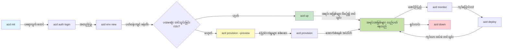
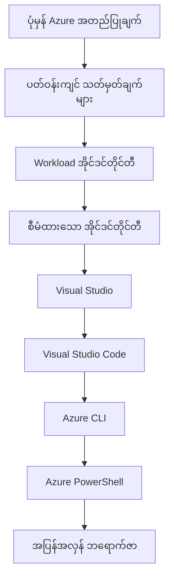

# AZD Basics - Azure Developer CLI ကို နားလည်ခြင်း

# AZD Basics - အဓိက အယူအဆများနှင့် အခြေခံအချက်များ

**Chapter Navigation:**
- **📚 Course Home**: [AZD For Beginners](../../README.md)
- **📖 Current Chapter**: Chapter 1 - Foundation & Quick Start
- **⬅️ Previous**: [Course Overview](../../README.md#-chapter-1-foundation--quick-start)
- **➡️ Next**: [Installation & Setup](installation.md)
- **🚀 Next Chapter**: [Chapter 2: AI-First Development](../chapter-02-ai-development/microsoft-foundry-integration.md)

## မိတ်ဆက်

ဤသင်ခန်းစာတွင် Azure Developer CLI (azd) ကိုမိတ်ဆက်ပေးမှာဖြစ်ပြီး၊ ဒါကြောင့် သင်၏ မိမိ၏ ဒေသဆိုင်ရာ ဖွံ့ဖြိုးမှုမှ Azure သို့ ထုတ်ပေးမှု အထိ ချင့်ချိန်းစွာ အလျင်မြန်စေမယ့် အတက်မြောက် CLI ကိရိယာတစ်ခုနဲ့ တွေ့ရပါမယ်။ သင်သည် အခြေခံအယူအဆများ၊ အဓိက ဖွဲ့စည်းပုံများနှင့် azd က တိုက်ရိုက် cloud-native application များကို ဘယ်လို ရိုးရှင်းစွာ ထုတ်ပေးစေသည်ကို နားလည်သွားမှာ ဖြစ်သည်။

## သင်ယူရမည့် ရည်ရွယ်ချက်များ

ဤသင်ခန်းစာ အဆုံးသတ်လျှင် သင်သည်:
- Azure Developer CLI အဘယ့်နည်းဖြင့် ရည်ရွယ်ချက်ရှိသည်ကို နားလည်မယ်
- templates, environments, services တို့၏ အဓိက အယူအဆများကို သင်ယူမယ်
- template-driven ဖွံ့ဖြိုးရေးနှင့် Infrastructure as Code အပါအဝင် အဓိက လက္ခဏာများကို စူးစမ်းမယ်
- azd project ဖွဲ့စည်းပုံ နှင့် workflow ကို နားလည်မယ်
- သင်၏ ဖွံ့ဖြိုးရေးပတ်ဝန်းကျင်အတွက် azd ကို 설치 နှင့် တက်တက်ကြွကြွ ပြင်ဆင်ရန် အသင့်ဖြစ်မယ်

## သင်ယူပြီးရမည့် အကျိုးရလဒ်များ

ဤသင်ခန်းစာ ပြီးမြောက်ချိန်တွင် သင်သည်:
- အချိန်နောက်ပိုင်း cloud ဖွံ့ဖြိုးရေး workflow များတွင် azd ၏ အခန်းကဏ္ဍကို ရှင်းပြနိုင်မည်
- azd project ဖွဲ့စည်းပုံ၏ 구성ပစ္စည်းများကို ဖော်ထုတ်နိုင်မည်
- templates, environments, services များ ဘယ်လို ပူးပေါင်းလုပ်ဆောင်ကြောင်း ဖော်ပြနိုင်မည်
- azd ဖြင့် Infrastructure as Code ၏ အကျိုးကျေးဇူးများကို နားလည်နိုင်မည်
- azd အမိန့်မျိုးစုံနှင့် ၎င်းတို့၏ ရည်ရွယ်ချက်များကို အသိအမြင် ရရှိမည်

## Azure Developer CLI (azd) သည် ဘာလဲ?

Azure Developer CLI (azd) သည် မိမိ၏ ဒေသဆိုင်ရာ ဖွံ့ဖြိုးမှုမှ Azure သို့ ထုတ်ပေးမှု အခြေအနေကို အလျင်အမြန် အရယူစေဖို့ အတွက် ဖန်တီးထားသော command-line ကိရိယာတစ်ခုဖြစ်သည်။ ၎င်းသည် Azure ပေါ်ရှိ cloud-native application များကို တည်ဆောက်ခြင်း၊ ထုတ်ပေးခြင်းနှင့် မန်နေဂျ်လုပ်ခြင်း၏ လုပ်ငန်းစဥ်များကို ရိုးရှင်းစေပါသည်။

### azd နဲ့ ဘာတွေ ထုတ်ပေးနိုင်မလဲ?

azd သည် workload အမျိုးမျိုးကို ထောက်ခံပေးပြီး စာရင်းပေါက်ဆုံးဖြစ်နေဆဲဖြစ်သည်။ ယနေ့တွင် azd ဖြင့် ထုတ်ပေးနိုင်သည်များမှာ -

| Workload Type | Examples | Same Workflow? |
|---------------|----------|----------------|
| **Traditional applications** | Web apps, REST APIs, static sites | ✅ `azd up` |
| **Services and microservices** | Container Apps, Function Apps, multi-service backends | ✅ `azd up` |
| **AI-powered applications** | Chat apps with Microsoft Foundry Models, RAG solutions with AI Search | ✅ `azd up` |
| **Intelligent agents** | Foundry-hosted agents, multi-agent orchestrations | ✅ `azd up` |

အဓိက အချက်မှာ **သင်ဘာကို ထုတ်ပေးဖြတ်အောင်မဆို azd lifecycle က အမြဲတမ်း တူညီနေသည်** ဆိုတာဖြစ်သည်။ သင်သည် project ကို initialize လုပ်ပြီး၊ အင်ဖရာကို provision လုပ်၊ ကိုးဒ်ကို deploy လုပ်၊ application ကို မော်နီတာ လုပ်၊ ပြီးနောက် ရှင်းလင်းခြင်းလုပ်ငန်းများပြုလုပ်သည် — အဆိုပါလုပ်ငန်းစဉ်များသည် ရိုးရှင်းသော ဝဘ်ဆိုက်မှစ၍ ထူးခွားသော AI agent အထိ အကောင်အထည်ဖော်ရာတွင် တစ်ခုတည်းဆောင်ရွက်နိုင်သည်။

ဤစနစ်တကျမှုသည် ရည်ရွယ်ချက်အရ ဖန်တီးထားသည်။ azd သည် AI စွမ်းဆောင်ရည်များကို သင့် application အတွက် အသုံးပြုနိုင်သည့် တခြား service အမျိုးအစားတစ်ခုအဖြစ် ဆက်လက်မြင်သည်၊ အခြားတစ်ခုအဖြစ်မဟုတ်ပါ။ Microsoft Foundry Models ဖြင့် ထောက်ပံ့ထားသော chat endpoint သည် azd ၏ မျက်မြင်မှ ပုံမှန် service တစ်ခုသာ ဖြစ်ပြီး ဖန်တီး၊ တပ်ဆင်ရန်နှင့် ဖော်ပြရန် တစ်ခုတည်းသော service ဖြစ်ပါတယ်။

### 🎯 ဘာကြောင့် AZD ကို အသုံးပြုသင့်သလဲ? အမှန်တကယ် လက်တွေ့ နှိုင်းယှဉ်ခြင်း

ပုံမှန် ဝဘ်အက်ပ် တစ်ခုနှင့် database တစ်ခုကို ထုတ်ပေးရာတွင် နှိုင်းယှဉ်ကြည့်ပါစို့။

#### ❌ AZD မရှိပါက: လက်ဖြင့် Azure သို့ ထုတ်ပေးခြင်း (30+ မိနစ်)

```bash
# အဆင့် 1: အရင်းအမြစ်အုပ်စု တစ်ခု ဖန်တီးပါ
az group create --name myapp-rg --location eastus

# အဆင့် 2: App Service Plan တစ်ခု ဖန်တီးပါ
az appservice plan create --name myapp-plan \
  --resource-group myapp-rg \
  --sku B1 --is-linux

# အဆင့် 3: Web App တစ်ခု ဖန်တီးပါ
az webapp create --name myapp-web-unique123 \
  --resource-group myapp-rg \
  --plan myapp-plan \
  --runtime "NODE:18-lts"

# အဆင့် 4: Cosmos DB အကောင့် တစ်ခု ဖန်တီးပါ (10-15 မိနစ်)
az cosmosdb create --name myapp-cosmos-unique123 \
  --resource-group myapp-rg \
  --kind MongoDB

# အဆင့် 5: ဒေတာဘေ့စ် တစ်ခု ဖန်တီးပါ
az cosmosdb mongodb database create \
  --account-name myapp-cosmos-unique123 \
  --resource-group myapp-rg \
  --name tododb

# အဆင့် 6: collection တစ်ခု ဖန်တီးပါ
az cosmosdb mongodb collection create \
  --account-name myapp-cosmos-unique123 \
  --resource-group myapp-rg \
  --database-name tododb \
  --name todos

# အဆင့် 7: ချိတ်ဆက်ရန် စာကြောင်း (connection string) ကို ရယူပါ
CONN_STR=$(az cosmosdb keys list \
  --name myapp-cosmos-unique123 \
  --resource-group myapp-rg \
  --type connection-strings \
  --query "connectionStrings[0].connectionString" -o tsv)

# အဆင့် 8: အက်ပ် ဆက်တင်များကို ပြင်ဆင်ပါ
az webapp config appsettings set \
  --name myapp-web-unique123 \
  --resource-group myapp-rg \
  --settings MONGODB_URI="$CONN_STR"

# အဆင့် 9: မှတ်တမ်းတင်ခြင်း (logging) ကို ဖွင့်ပါ
az webapp log config --name myapp-web-unique123 \
  --resource-group myapp-rg \
  --application-logging filesystem \
  --detailed-error-messages true

# အဆင့် 10: Application Insights ကို စီစဉ်တပ်ဆင်ပါ
az monitor app-insights component create \
  --app myapp-insights \
  --location eastus \
  --resource-group myapp-rg

# အဆင့် 11: App Insights ကို Web App နှင့် ချိတ်ဆက်ပါ
INSTRUMENTATION_KEY=$(az monitor app-insights component show \
  --app myapp-insights \
  --resource-group myapp-rg \
  --query "instrumentationKey" -o tsv)

az webapp config appsettings set \
  --name myapp-web-unique123 \
  --resource-group myapp-rg \
  --settings APPINSIGHTS_INSTRUMENTATIONKEY="$INSTRUMENTATION_KEY"

# အဆင့် 12: အက်ပ်ကို ဒေသတွင်း (local) ပေါ်တွင် တည်ဆောက်ပါ
npm install
npm run build

# အဆင့် 13: ထုတ်ပို့ရန် package တစ်ခု ဖန်တီးပါ
zip -r app.zip . -x "*.git*" "node_modules/*"

# အဆင့် 14: အက်ပ်ကို ထုတ်ပို့ပါ
az webapp deployment source config-zip \
  --resource-group myapp-rg \
  --name myapp-web-unique123 \
  --src app.zip

# အဆင့် 15: စောင့်ပြီး အလုပ်လုပ်ပါစေဟု ဆုတောင်းပါ 🙏
# (အလိုအလျောက် စစ်ဆေးမှု မရှိပါ၊ လက်ဖြင့် စမ်းသပ်ရမည်)
```

**ပြသနာများ:**
- ❌ အမိန့် 15+ ခုကို မှတ်မိပြီး အမှန်အတိုင်း ဆောင်ရွက်ရသည်
- ❌ လက်ဖြင့် အလုပ်လုပ်ရန် 30-45 မိနစ် ကြာမြင့်နိုင်သည်
- ❌ မှားယွင်းမှုများ ဖြစ်တတ်သည် (စာလုံးပေါင်းမှားခြင်း၊ မှားသော ပါရာမီတာများ)
- ❌ terminal history တွင် connection strings ဖွံ့ဖြိုးထားနိုင်သည်
- ❌ တစ်ခုမွားပါက automated rollback မရှိပါ
- ❌ အဖွဲ့ဝင်များအတွက် ထပ်မံထပ်မံ ပြန်ပြုလုပ်ရန် ခက်ခဲသည်
- ❌ မည်သည့်အခါမဆို ကွဲပြားနိုင်သည် (reproducible မဟုတ်)

#### ✅ AZD ဖြင့်: အလိုအလျောက် ထုတ်ပေးမှု (အမိန့် 5 ခု, 10-15 မိနစ်)

```bash
# အဆင့် 1: နမူနာ (template) မှ စတင်တည်ဆောက်ပါ
azd init --template todo-nodejs-mongo

# အဆင့် 2: အတည်ပြုခြင်းပြုလုပ်ပါ
azd auth login

# အဆင့် 3: ပတ်ဝန်းကျင် (environment) ဖန်တီးပါ
azd env new dev

# အဆင့် 4: အပြောင်းအလဲများကို ကြိုကြည့်ပါ (ရွေးချယ်စရာဖြစ်ပေမယ့် အကြံပြုသည်)
azd provision --preview

# အဆင့် 5: အားလုံးကို ဖြန့်ချိပါ
azd up

# ✨ ပြီးပါပြီ! အားလုံးကို ဖြန့်ထားပြီး ဖွဲ့စည်းပြင်ဆင်ပြီး စောင့်ကြည့်ထားပါပြီ
```

**အကျိုးကျေးဇူးများ:**
- ✅ **အမိန့် 5 ခု** နှင့် လက်ဖြင့် 15+ ချက်ကိုနှိုင်းလျှော့ခြင်း
- ✅ **စုစုပေါင်း 10-15 မိနစ်** (အများစုသည် Azure ကို စောင့်နေချိန်)
- ✅ **လက်ဖြင့်ဖြစ်နိုင်သော မှားယွင်းမှုများ လျော့နည်း** - တူညီသော template-driven workflow
- ✅ **လုံခြုံသော secret ကိုင်တွယ်မှု** - များသော template များတွင် Azure-managed secret storage အသုံးပြုသည်
- ✅ **ထပ်မံထုတ်ပေးနိုင်ခြင်း** - အချိန်တိုင်း တူညီသော workflow
- ✅ **ပြည့်စုံစွာ ပြန်ထုတ်နိုင်မှု** - အချိန်တိုင်း ရလဒ်တူညီသည်
- ✅ **အဖွဲ့အတွက် အသင့်ဖြစ်မှု** - မည်သူမဆို တူညီသော အမိန့်များဖြင့် ထုတ်ပေးနိုင်သည်
- ✅ **Infrastructure as Code** - version controlled Bicep templates
- ✅ **Built-in monitoring** - Application Insights ကို အလိုအလျောက် ပေါင်းထည့်ထားသည်

### 📊 အချိန်နှင့် အမှားလျော့ချမှု

| Metric | Manual Deployment | AZD Deployment | Improvement |
|:-------|:------------------|:---------------|:------------|
| **Commands** | 15+ | 5 | 67% လျော့နည်း |
| **Time** | 30-45 min | 10-15 min | 60% လျင်မြန် |
| **Error Rate** | ~40% | <5% | 88% လျော့ချမှု |
| **Consistency** | Low (manual) | 100% (automated) | ပြီးစုံ |
| **Team Onboarding** | 2-4 hours | 30 minutes | 75% မြန်ကျယ် |
| **Rollback Time** | 30+ min (manual) | 2 min (automated) | 93% မြန်ကျိုးစား |

## အဓိက အယူအဆများ

### Templates
Templates များသည် azd ၏ အခြေခံဖြစ်ပြီး ၎င်းတွင် အောက်ပါများ ပါဝင်သည်။
- **Application code** - သင်၏ source code နှင့် အားကိုးချက်များ
- **Infrastructure definitions** - Bicep သို့မဟုတ် Terraform ဖြင့် သတ်မှတ်ထားသော Azure အရင်းအမြစ်များ
- **Configuration files** - ဆက်တင်များနှင့် environment ကုဒ်များ
- **Deployment scripts** - အလိုအလျောက် ထုတ်ပေးမှု workflow များ

### Environments
Environments သည် ထုတ်ပေးရန် ဂိုဏ်းဆိုင်ရာ မတူညီသော ပန်းတိုင်များကို ကိုယ်စားပြုသည်။
- **Development** - စမ်းသပ်ရန်နှင့် ဖွံ့ဖြိုးရေးအတွက်
- **Staging** - Pre-production ပတ်ဝန်းကျင်
- **Production** - တိုက်ရိုက် ထုတ်လုပ်သော ပတ်ဝန်းကျင်

လူ့ပတ်ဝန်းကျင်တိုင်းသည် သူ၏ ကိုယ်ပိုင်အရာများကို ထိန်းသိမ်းထားသည်။
- Azure resource group
- Configuration settings
- Deployment state

### Services
Services များသည် သင့် application ၏ အခြေခံဘလော့များဖြစ်သည်။
- **Frontend** - Web applications, SPAs
- **Backend** - APIs, microservices
- **Database** - ဒေတာသိမ်းဆည်းခြင်းဖြေရှင်းချက်များ
- **Storage** - ဖိုင်နှင့် blob သိမ်းဆည်းမှု

## အဓိက လက္ခဏာများ

### 1. Template-Driven Development
```bash
# ရရှိနိုင်သော တမ်းပလိတ်များကို ကြည့်ရှုပါ
azd template list

# တမ်းပလိတ်မှ စတင်ရန်
azd init --template <template-name>
```

### 2. Infrastructure as Code
- **Bicep** - Azure ၏ domain-specific language
- **Terraform** - Multi-cloud infrastructure ကိရိယာ
- **ARM Templates** - Azure Resource Manager templates

### 3. Integrated Workflows
```bash
# ပြည့်စုံသော ဖြန့်ချိမှု လုပ်ငန်းစဉ်
azd up            # Provision + Deploy — ပထမဆုံး စတင်တပ်ဆင်ရေးအတွက် လက်မထိုးရသော အလိုအလျောက် ပေါင်းစပ်လုပ်ငန်း

# 🧪 အသစ်: ဖြန့်ချိမတိုင်မီ အဆောက်အအုံ ပြောင်းလဲမှုများကို ကြိုကြည့်ရှုရန် (လုံခြုံ)
azd provision --preview    # ပြောင်းလဲမှု မလုပ်ဘဲ အဆောက်အအုံ ဖြန့်ချိမှုကို အတုအယောင် စမ်းသပ်ရန်

azd provision     # အဆောက်အအုံကို အပ်ဒိတ်လုပ်မည်ဆိုလျှင် ဒီကို အသုံးပြုပြီး Azure အရင်းအမြစ်များကို ဖန်တီးပါ
azd deploy        # အပလီကေးရှင်း ကုဒ်ကို တင်ပို့ရန် သို့မဟုတ် အပ်ဒိတ်ပြီးနောက် ထပ်မံ တင်ပို့ရန်
azd down          # အရင်းအမြစ်များကို ရှင်းလင်းပါ
```

#### 🛡️ Preview ဖြင့် လုံခြုံသည့် Infrastructure စီမံချက်
`azd provision --preview` အမိန့်သည် လုံခြုံစွာ ထုတ်ပေးရန် အလွန်ကောင်းမွန်သောအရာဖြစ်သည်။
- **Dry-run analysis** - ဘာများကို create, modify, သို့မဟုတ် delete မည်ကို ပြသပေးသည်
- **Zero risk** - သင့် Azure ပတ်ဝန်းကျင်တွင် အမှန်တကယ် ပြောင်းလဲမှု မလုပ်ဆောင်ပါ
- **Team collaboration** - ထုတ်ပေးခδικစလုပ်မီ preview ရလဒ်များကို မျှဝေနိုင်သည်
- **Cost estimation** - ရင်းနှီးမြှုပ်နှံမှု မလုပ်မီ အရင်းအမြစ်ကုန်ကျစရိတ်ကို နားလည်ရသည်

```bash
# ဥပမာ ကြိုကြည့်ရန် လုပ်ငန်းစဉ်
azd provision --preview           # ဘာတွေပြောင်းလဲမယ်ဆိုတာ ကြည့်ပါ
# အထွက်ကို ပြန်လည်သုံးသပ်ပြီး အဖွဲ့နှင့် ဆွေးနွေးပါ
azd provision                     # ပြောင်းလဲမှုများကို ယုံကြည်စိတ်ချစွာ အကောင်အထည်ဖော်ပါ
```

### 📊 Visual: AZD Development Workflow



**Workflow ရှင်းလင်းချက်:**
1. **Init** - template သို့မဟုတ် project အသစ်ဖြင့် စတင်ပါ
2. **Auth** - Azure နှင့် authentication လုပ်ပါ
3. **Environment** - အသီးသီးပတ်ဝန်းကျင်များ ဖန်တီးပါ
4. **Preview** - 🆕 အမြဲပထမဦးဆုံး infrastructure ပြောင်းလဲမှုကို preview လုပ်ပါ (လုံခြုံရေး သတ်မှတ်ချက်)
5. **Provision** - Azure အရင်းအမြစ်များ ဖန်တီး/အပ်ဒိတ်လုပ်ပါ
6. **Deploy** - သင့် application ကို အတင်ပေးပါ
7. **Monitor** - application ၏ အလုပ်ဆောင်ရည်ကို ကြည့်ရှုပါ
8. **Iterate** - ပြင်ဆင်မှုများ ပြုလုပ်ပြီး ပြန်ထုတ်ပေးပါ
9. **Cleanup** - အပြီးသတ်ပြုလျှင် အရင်းအမြစ်များကို ဖယ်ရှားပါ

### 4. Environment Management
```bash
# ပတ်ဝန်းကျင်များ ဖန်တီးခြင်းနှင့် စီမံခန့်ခွဲခြင်း
azd env new <environment-name>
azd env select <environment-name>
azd env list
```

### 5. Extensions and AI Commands

azd သည် core CLI အပြင် အတိုးပေးနိုင်စွမ်းများ ထည့်သွင်းရန် extension စနစ်ကို အသုံးပြုသည်။ ၎င်းသည် အထူးသဖြင့် AI workload များအတွက် အထောက်အကူဖြစ်သည်။

```bash
# ရရှိနိုင်သော တိုးချဲ့ချက်များကို စာရင်းပြပါ
azd extension list

# Foundry agents တိုးချဲ့ချက်ကို တပ်ဆင်ပါ
azd extension install azure.ai.agents

# manifest မှ AI agent ပရောဂျက်ကို စတင်တည်ဆောက်ပါ
azd ai agent init -m agent-manifest.yaml

# တပ်ဆင်ထားသော agent ကို စမ်းသပ်ပါ (latency နှင့် time-to-first-byte ကို ဖော်ပြသည်)
azd ai agent invoke

# AI အကူအညီဖြင့် ဖွံ့ဖြိုးရေးအတွက် MCP ဆာဗာကို စတင်ပါ (Alpha)
azd mcp start
```

**Agent lifecycle, အစမှ အဆုံးအထိ။** `azure.ai.agents` ကို 설치 လုပ်ပြီးနောက်၊ single workflow တစ်ခုဖြင့် သင်၏ ထင်ထင်မြင်မြင် အကြံအတွေးမှ လက်တွေ့ အလုပ်လုပ်သော agent အထိ ရောက်ရှိစေမှာ ဖြစ်သည်။ ဒီအရာတိုင်းကို တနေ့တည်းမှာ မလိုအပ်ပေ။ ရှိတယ်ဆိုတာကို သိထားလျှင် ကောင်းပါသည်။

| Stage | Command | What it does |
|-------|---------|--------------|
| **Scaffold** | `azd ai agent init -m <manifest>` | manifest တစ်ခုမှ agent project ကို ဖန်တီးပေးသည် |
| **Test** | `azd ai agent invoke` | agent ကို ခေါ်ပြီး response timing ကို ကြည့်ရှုသည် |
| **Measure** | `azd ai agent eval generate` | agent အတွက် evaluation dataset တစ်ခု ဖန်တီးသည် |
| **Improve** | `azd ai agent optimize` | သင်၏ ဒေတာဆင့် agent အချက်အလက်များကို အကောင်းပြုလုပ်သည် |
| **Inspect** | `azd ai agent endpoint show` | တည်ဆောက်ထားသော live endpoint ၏ configuration ကို ကြည့်ရှုသည် |
| **Clean up** | `azd ai agent delete` | hosted agent နှင့် ၎င်း၏ version အားလုံးကို ဖျက်ပါ |

> Extensions များကို [Chapter 2: AI-First Development](../chapter-02-ai-development/agents.md) နှင့် [AZD AI CLI Commands](../chapter-08-production/production-ai-practices.md#azd-ai-cli-commands-and-extensions) reference တွင် အသေးစိတ် ဖော်ပြထားသည်။

## 📁 Project ဖွဲ့စည်းပုံ

ပုံမှန် azd project ဖွဲ့စည်းပုံ:
```
my-app/
├── .azd/                    # azd configuration
│   └── config.json
├── .azure/                  # Azure deployment artifacts
├── .devcontainer/          # Development container config
├── .github/workflows/      # GitHub Actions
├── .vscode/               # VS Code settings
├── infra/                 # Infrastructure code
│   ├── main.bicep        # Main infrastructure template
│   ├── main.parameters.json
│   └── modules/          # Reusable modules
├── src/                  # Application source code
│   ├── api/             # Backend services
│   └── web/             # Frontend application
├── azure.yaml           # azd project configuration
└── README.md
```

## 🔧 Configuration ဖိုင်များ

### azure.yaml
ပရိုဂျက်၏ မူလ configuration ဖိုင်:
```yaml
name: my-awesome-app
metadata:
  template: my-template@1.0.0

services:
  web:
    project: ./src/web
    language: js
    host: appservice
  api:
    project: ./src/api
    language: js
    host: appservice

hooks:
  preprovision:
    shell: pwsh
    run: echo "Preparing to provision..."
```

### .azure/config.json
Environment အလိုက် သတ်မှတ်ထားသော configuration:
```json
{
  "version": 1,
  "defaultEnvironment": "dev",
  "environments": {
    "dev": {
      "subscriptionId": "your-subscription-id",
      "location": "eastus"
    }
  }
}
```

## 🎪 လက်တွေ့ Workflow များနှင့် လက်တွေ့ လေ့ကျင့်ခန်းများ

> **💡 သင်ယူရေး အတိုင်ပင်ခံ:** သင်၏ AZD ကို ကျွမ်းကျင်မှုအလိုက် တိုးတက်အောင် ဤလေ့ကျင့်ခန်းများကို အစဉ်လိုက် လိုက်နာပါ။

### 🎯 လေ့ကျင့်ခန်း 1: သင်၏ ပထမဆုံး Project ကို Initialize လုပ်ခြင်း

**ရည်ရွယ်ချက်:** AZD project တစ်ခု ဖန်တီးပြီး ၎င်း၏ ဖွဲ့စည်းပုံကို စူးစမ်းပါ

**အဆင့်များ:**
```bash
# အတည်ပြုထားသော နမူနာကို အသုံးပြုပါ
azd init --template todo-nodejs-mongo

# ဖန်တီးထားသော ဖိုင်များကို စူးစမ်းကြည့်ပါ
ls -la  # ဖျောက်ထားသော ဖိုင်များအပါအဝင် ဖိုင်အားလုံးကို ကြည့်ရှုပါ

# ဖန်တီးထားသော အဓိက ဖိုင်များ:
# - azure.yaml (အဓိက ဆက်တင်)
# - infra/ (အခြေခံအဆောက်အအုံ ကုဒ်)
# - src/ (အပလီကေးရှင်း ကုဒ်)
```

**✅ အောင်မြင်မှု:** သင့်ထဲတွင် azure.yaml, infra/, နှင့် src/ directory များ ရှိပါသည်

---

### 🎯 လေ့ကျင့်ခန်း 2: Azure သို့ ထုတ်ပေးခြင်း

**ရည်ရွယ်ချက်:** အအစမှ အဆုံး ထုတ်ပေးမှုကို ပြီးမြောက်စေပါ

**အဆင့်များ:**
```bash
# 1. အတည်ပြုပါ
az login && azd auth login

# 2. ပတ်ဝန်းကျင် ဖန်တီးပါ
azd env new dev
azd env set AZURE_LOCATION eastus

# 3. ပြောင်းလဲမှုများကို ကြိုတင်ကြည့်ရှုပါ (အကြံပြု)
azd provision --preview

# 4. အားလုံးကို ဖြန့်ချိပါ
azd up

# 5. ဖြန့်ချိမှုကို အတည်ပြုပါ
azd show    # သင့်အက်ပ်၏ URL ကို ကြည့်ရှုပါ
```

**မျှော်လင့်ချိန်:** 10-15 မိနစ်  
**✅ အောင်မြင်မှု:** Application URL ကို browser တွင် ဖွင့်နိုင်သည်

---

### 🎯 လေ့ကျင့်ခန်း 3: အမျိုးမျိုးသော Environments

**ရည်ရွယ်ချက်:** dev နှင့် staging သို့ ထုတ်ပေးပါ

**အဆင့်များ:**
```bash
# dev ရှိပြီးသားဖြစ်သည်၊ staging ကို ဖန်တီးပါ
azd env new staging
azd env set AZURE_LOCATION westus2
azd up

# ၎င်းတို့အကြား ပြောင်းပါ
azd env list
azd env select dev
```

**✅ အောင်မြင်မှု:** Azure Portal တွင် သီးခြား resource group နှစ်ခု ရှိသည်

---

### 🛡️ အမှတ်မေ့ စတင်ခြင်း: `azd down --force --purge`

ပြန်လည် စတင်ရန် လိုအပ်သောအခါ -

```bash
azd down --force --purge
```

**၎င်း၏ လုပ်ဆောင်ချက်:**
- `--force`: အတည်ပြုမေးခွန်းများ မတောင်းမီ
- `--purge`: ဒေသခံ state နှင့် Azure အရင်းအမြစ်များအားလုံးကို ဖျက်ပစ်သည်

**အသုံးပြုသင့်သော အခါများ:**
- ထုတ်ပေးမှု မအောင်မြင်ဘဲ အလယ်မှာ ရပ် နေခဲ့သောအခါ
- project များကို ပြောင်းလဲချင်သောအခါ
- အသစ်စတင်လိုသောအခါ

---

## 🎪 မူလ Workflow ကို သရုပ်ပြခြင်း

### Project အသစ်တစ်ခု စတင်ခြင်း
```bash
# နည်းလမ်း 1: ရှိပြီးသား ပုံစံကို အသုံးပြုပါ
azd init --template todo-nodejs-mongo

# နည်းလမ်း 2: အစကနေ စတင်ပါ
azd init

# နည်းလမ်း 3: လက်ရှိ ဖိုလ်ဒါကို အသုံးပြုပါ
azd init .
```

### ဖွံ့ဖြိုးရေး လည်ပတ်မှု စီးရီး
```bash
# ဖွံ့ဖြိုးရေး ပတ်ဝန်းကျင်ကို တပ်ဆင်ပါ
azd auth login
azd env new dev
azd env select dev

# အားလုံးကို တင်ပို့ပါ
azd up

# ပြင်ဆင်ပြီး ထပ်မံတင်ပို့ပါ
azd deploy

# ပြီးဆုံးလျှင် ရှင်းလင်းပါ
azd down --force --purge # Azure Developer CLI မှာရှိတဲ့ command တစ်ခုဟာ သင့်ပတ်ဝန်းကျင်အတွက် ပြင်းထန်သော ပြန်စတင်ခြင်း (hard reset) အမျိုးအစားဖြစ်ပြီး အထူးသဖြင့် deployment မအောင်မြင်မှုများကို ဖြေရှင်းနေချိန်၊ အလွတ်တိမ်သက်သော အရင်းအမြစ်များကို ရှင်းလင်းနေချိန် သို့မဟုတ် အသစ်တင်ရန် ပြင်ဆင်နေချိန်များတွင် အသုံးဝင်သည်။
```

## `azd down --force --purge` ကို နားလည်ခြင်း
`azd down --force --purge` အမိန့်သည် သင်၏ azd ပတ်ဝန်းကျင်နှင့် ဆက်စပ်ထားသော အရင်းအမြစ်အားလုံးကို လုံးဝ ဖျက်ပစ်ရန် အလွန် အာဏာကြီးသော နည်းလမ်းတစ်ခုဖြစ်သည်။ အောက်တွင် အလုပ်လုပ်ပုံကို ဖော်ပြထားသည်။
```
--force
```
- အတည်ပြုမေးခွန်းများကို ကျော်လွှတ်ပေးသည်။
- အလိုအလျောက်လုပ်ဆောင်ခြင်း သို့မဟုတ် scripting အတွက် အသုံးဝင်သည်၊ လက်ဖြင့် ထည့်သွင်းရန် မဖြစ်နိုင်သည့်ပတ်ဝန်းကျင်များတွင် အထူးအဆင်ပြေသည်။
- CLI သည် အမှားအမျိုးမျိုးကို တွေ့ကာ မရပ်တန့်ဘဲ teardown ကို ဆက်လက်လုပ်ဆောင်ပါသည်။

```
--purge
```
ဖျက်ပစ်သည် **ဆက်စပ် metadata အားလုံး**၊ အပါအဝင်:
- ပတ်ဝန်းကျင် အခြေအနေ
- ဒေသခံ `.azure` ဖိုလ်ဒါ
- Cached deployment အချက်အလက်
- azd က ယခင်ထုတ်ပေးမှုများကို "မှတ်မိ" နေပဲ ဖြစ်စေသော အချက်များကို ကာကွယ်ပေးသည်၊ ဥပမာ mismatched resource groups သို့မဟုတ် stale registry references ကဲ့သို့သော ပြဿနာများ ဖြစ်ပေါ်စေနိုင်သည်။

### ခုနှစ်ခုကို ဘာကြောင့် တစ်ပြိုင်နက် အသုံးပြုသနည်း?
`azd up` အတွက် မကျန်ရံသေးသည့် state သို့ partial deployments ကြောင့် ပြဿနာရှိလာသောအခါ၊ ဤနှစ်ခု mtch combo သည် **သန့်ရှင်းသော အခြေစိုက်ပုံ** တစ်ခုကို အာမခံပေးသည်။

ဤသည်မှာ အထူးသဖြင့် Azure portal တွင် လက်ဖြင့် အရင်းအမြစ်များကို ဖျက်ပစ်လိုက်သည့်အခါ သို့မဟုတ် template, environment, resource group အမည်ပုံစံများကို အစားထိုးချင်သည့်အခါ အထူးအသုံးဝင်သည်။

### မျိုးစုံသော Environments များကို စီမံခြင်း
```bash
# staging ပတ်ဝန်းကျင်ကို ဖန်တီးပါ
azd env new staging
azd env select staging
azd up

# dev သို့ ပြန်ပြောင်းပါ
azd env select dev

# ပတ်ဝန်းကျင်များကို နှိုင်းယှဉ်ပါ
azd env list
```

## 🔐 Authentication နှင့် Credentials

Authentication ကို နားလည်ခြင်းမှာ azd ဖြင့် ထုတ်ပေးမှု အောင်မြင်ရေးအတွက် အလွန်အရေးကြီးသည်။ Azure သည် အမျိုးမျိုးသော authentication နည်းလမ်းများကို အသုံးပြုသည်၊ azd သည် အခြား Azure ကိရိယာများနှင့် လူသုံး credentials chain ကို အသုံးပြုပါသည်။

### Azure CLI Authentication (`az login`)

azd ကို အသုံးမပြုမီ Azure နှင့် authenticate လုပ်ထားရန် လိုအပ်သည်။ အများအားဖြင့် Azure CLI အသုံးပြုပြီး authenticate ပြုလုပ်သည်။

```bash
# အပြန်အလှန် ဝင်ခြင်း (ဘရောက်ဇာကို ဖွင့်သည်)
az login

# သတ်မှတ်ထားသော tenant ဖြင့် ဝင်ခြင်း
az login --tenant <tenant-id>

# service principal ဖြင့် ဝင်ခြင်း
az login --service-principal -u <app-id> -p <password> --tenant <tenant-id>

# လက်ရှိ ဝင်ထားမှု အခြေအနေကို စစ်ဆေးခြင်း
az account show

# ရရှိနိုင်သော subscription များကို စာရင်းပြခြင်း
az account list --output table

# ပုံမှန် subscription ကို သတ်မှတ်ခြင်း
az account set --subscription <subscription-id>
```

### Authentication စီးရီးလမ်းကြောင်း
1. **Interactive Login**: သင်၏ default browser ကို ဖွင့်၍ authentication ပြုလုပ်စေသည်
2. **Device Code Flow**: browser မရှိသည့် ပတ်ဝန်းကျင်များအတွက်
3. **Service Principal**: automation နှင့် CI/CD အတွက်
4. **Managed Identity**: Azure ပေါ်တွင် ဟိုစ်တင်ထားသော applications များအတွက်

### DefaultAzureCredential Chain

`DefaultAzureCredential` သည် credential အမျိုးအစားတစ်ခုဖြစ်ပြီး အရိပ်အယောင် ကပ်လျက် မျိုးစုံသော credential များကို အချက်အလက်စနစ်တကျ စမ်းသပ်ပေး၍ authentication ကို ရိုးရှင်းစေသည်။

#### Credential Chain အစဉ်


#### 1. Environment Variables
```bash
# service principal အတွက် environment variables များကို သတ်မှတ်ပါ
export AZURE_CLIENT_ID="<app-id>"
export AZURE_CLIENT_SECRET="<password>"
export AZURE_TENANT_ID="<tenant-id>"
```

#### 2. Workload Identity (Kubernetes/GitHub Actions)
အောက်ပါနေရာများတွင် အလိုအလျောက် အသုံးပြုသည်။
- Azure Kubernetes Service (AKS) တွင် Workload Identity နှင့်
- GitHub Actions တွင် OIDC federation ဖြင့်
- အခြား federated identity ဖြစ်စေသော ရိုးရာများ

#### 3. Managed Identity
Azure resource များအတွက် ဥပမာများမှာ -
- Virtual Machines
- App Service
- Azure Functions
- Container Instances

```bash
# စီမံခန့်ခွဲထားသော identity ဖြင့် Azure အရင်းအမြစ်ပေါ်တွင် လည်ပတ်နေသည်မှန်း စစ်ဆေးပါ
az account show --query "user.type" --output tsv
# စီမံခန့်ခွဲထားသော identity ကို အသုံးပြုထားပါက "servicePrincipal" ကို ပြန်လည်ပေးသည်
```

#### 4. Developer Tools Integration
- **Visual Studio**: လက်မှတ်ထိုးထားသော အကောင့်ကို အလိုအလျောက် အသုံးပြုသည်
- **VS Code**: Azure Account extension ၏ credential များကို အသုံးပြုသည်
- **Azure CLI**: `az login` credential များကို အသုံးပြုသည် (ဒေသခံ ဖွံ့ဖြိုးရေးအတွက် အများဆုံး အသုံးပြုသည်)

### AZD Authentication စတင် သတ်မှတ်ခြင်း

```bash
# နည်းလမ်း ၁: Azure CLI ကို အသုံးပြုပါ (ဖွံ့ဖြိုးရေးအတွက် အကြံပြုသည်)
az login
azd auth login  # ရှိပြီးသား Azure CLI အတည်ပြုချက်များကို အသုံးပြုသည်

# နည်းလမ်း ၂: azd ဖြင့် တိုက်ရိုက် အတည်ပြုခြင်း
azd auth login --use-device-code  # UI မရှိသော ပတ်ဝန်းကျင်များအတွက်

# နည်းလမ်း ၃: အတည်ပြုခြင်း အခြေအနေကို စစ်ဆေးပါ
azd auth login --check-status

# နည်းလမ်း ၄: ထွက်ပြီး ပြန်လည် အတည်ပြုပါ
azd auth logout
azd auth login
```

### Authentication အတွက် အကောင်းဆုံး လေ့လာမှုများ

#### ဒေသခံ ဖွံ့ဖြိုးရေး အတွက်
```bash
# 1. Azure CLI ဖြင့် လော့ဂ်အင် ဝင်ပါ
az login

# 2. မှန်ကန်သော subscription ကို အတည်ပြုပါ
az account show
az account set --subscription "Your Subscription Name"

# 3. ရှိပြီးသား credentials များဖြင့် azd ကို အသုံးပြုပါ
azd auth login
```

#### CI/CD ပိုင်းလိုင်းများအတွက်
```yaml
# GitHub Actions example
- name: Azure Login
  uses: azure/login@v1
  with:
    creds: ${{ secrets.AZURE_CREDENTIALS }}

- name: Deploy with azd
  run: |
    azd auth login --client-id ${{ secrets.AZURE_CLIENT_ID }} \
                    --client-secret ${{ secrets.AZURE_CLIENT_SECRET }} \
                    --tenant-id ${{ secrets.AZURE_TENANT_ID }}
    azd up --no-prompt
```

#### ထုတ်လုပ်ရေး ပတ်ဝန်းကျင်များအတွက်
- Azure အရင်းအမြစ်များပေါ်တွင် ပြေးစဉ် **Managed Identity** ကို အသုံးပြုပါ
- အလိုအလျောက်လုပ်ဆောင်မှု ဇနီးတွင် **Service Principal** ကို အသုံးပြုပါ
- သုံးစိတ်အချက်အလက်များကို ကုဒ် သို့မဟုတ် ဖိုင်များထဲသို့ သိမ်းဆည်းရန် အရှောင်ရှားပါ
- ကြိုးရာသော ဖွဲ့စည်းမှုများအတွက် **Azure Key Vault** ကို အသုံးပြုပါ

### ပုံမှန် အတည်ပြုခြင်း ပြဿနာများနှင့် ဖြေရှင်းနည်းများ

#### ပြဿနာ: "No subscription found"
```bash
# ဖြေရှင်းချက်: ပုံမှန် စာရင်းဝင်မှုကို သတ်မှတ်ပါ
az account list --output table
az account set --subscription "<subscription-id>"
azd env set AZURE_SUBSCRIPTION_ID "<subscription-id>"
```

#### ပြဿနာ: "Insufficient permissions"
```bash
# ဖြေရှင်းချက်: လိုအပ်သော ရာထူးများကို စစ်ဆေး၍ ခန့်အပ်ပါ
az role assignment list --assignee $(az account show --query user.name --output tsv)

# အများအားဖြင့် လိုအပ်သော ရာထူးများ:
# - Contributor (အရင်းအမြစ် စီမံခန့်ခွဲမှုအတွက်)
# - User Access Administrator (ရာထူး ခန့်အပ်မှုများအတွက်)
```

#### ပြဿနာ: "Token expired"
```bash
# ဖြေရှင်းချက်: ထပ်မံအတည်ပြုပါ
az logout
az login
azd auth logout
azd auth login
```

### အမျိုးမျိုးသော အခြေအနေများတွင် အတည်ပြုခြင်း

#### ဒေသတွင်း ဖွံ့ဖြိုးရေး
```bash
# ပုဂ္ဂိုလ်ရေး ဖွံ့ဖြိုးတိုးတက်ရေး အကောင့်
az login
azd auth login
```

#### အဖွဲ့ ဖွံ့ဖြိုးရေး
```bash
# အဖွဲ့အစည်းအတွက် သတ်မှတ်ထားသော tenant ကို အသုံးပြုပါ
az login --tenant contoso.onmicrosoft.com
azd auth login
```

#### မျိုးစုံ ဧည့်ခံ အခြေအနေများ
```bash
# တီနန့်များအကြား ပြောင်းလဲပါ
az login --tenant tenant1.onmicrosoft.com
# တီနန့် 1 သို့ ဖြန့်ချိပါ
azd up

az login --tenant tenant2.onmicrosoft.com  
# တီနန့် 2 သို့ ဖြန့်ချိပါ
azd up
```

### လုံခြုံရေး သတိပြုရန် အချက်များ

1. **လက်မှတ် သိမ်းဆည်းခြင်း**: အတည်ပြု အချက်အလက်များကို မူလကုဒ်ထဲတွင် မသိမ်းဆည်းပါ
2. **ခွင့်ပြုချက် ကန့်သတ်မှု**: Service Principal များအတွက် အနည်းဆုံး ခွင့်ပြုချက် သဘောတရားကို အသုံးပြုပါ
3. **Token ပြောင်းလဲမှု**: Service Principal ရဲ့ secret များကို ပုံမှန် ပြောင်းလဲပါ
4. **စာရင်းစစ် လမ်းကြောင်း**: အတည်ပြုခြင်းနှင့် တပ်ဆင်မှု လှုပ်ရှားမှုများကို စောင့်ကြည့်စစ်ဆေးပါ
5. **ကွန်ယက် လုံခြုံရေး**: ခွင့်ပြုပါက private endpoints များကို အသုံးပြုပါ

### အတည်ပြုခြင်း ပြဿနာဖြေရှင်းခြင်း

```bash
# အတည်ပြုမှုဆိုင်ရာ ပြဿနာများကို အမှားရှာဖွေခြင်း
azd auth login --check-status
az account show
az account get-access-token

# ပုံမှန် စစ်ဆေးရန် အသုံးများသော အမိန့်များ
whoami                          # လက်ရှိ အသုံးပြုသူ ပတ်ဝန်းကျင်
az ad signed-in-user show      # Microsoft Entra ID အသုံးပြုသူ အသေးစိတ်
az group list                  # အရင်းအမြစ် ဝင်ရောက်ခွင့် စမ်းသပ်ခြင်း
```

## `azd down --force --purge` ကို နားလည်ခြင်း

### ရှာဖွေမှု
```bash
azd template list              # ပုံစံများကို ကြည့်ရှုရန်
azd template show <template>   # ပုံစံအသေးစိတ်
azd init --help               # စတင်မှု ရွေးချယ်မှုများ
```

### ပရောဂျက် စီမံခန့်ခွဲမှု
```bash
azd show                     # ပရောဂျက် အနှစ်ချုပ်
azd env list                # အသုံးပြုနိုင်သော ပတ်ဝန်းကျင်များနှင့် ရွေးချယ်ထားသော ပုံမှန်
azd config show            # ဖွဲ့စည်းမှုဆက်တင်များ
```

### စောင့်ကြည့်ခြင်း
```bash
azd monitor                  # Azure portal တွင် Monitoring ကို ဖွင့်ပါ
azd monitor --logs           # အပလီကေးရှင်းလော့ဂ်များကို ကြည့်ပါ
azd monitor --live           # တိုက်ရိုက် မက်ထရစ်များကို ကြည့်ပါ
azd pipeline config          # CI/CD ကို တပ်ဆင်ပါ
```

## အကောင်းဆုံး လေ့ကျင့်ချက်များ

### 1. အဓိပ္ပာယ်ရှိသော အမည်များ အသုံးပြုပါ
```bash
# ကောင်း
azd env new production-east
azd init --template web-app-secure

# ရှောင်ရန်
azd env new env1
azd init --template template1
```

### 2. စံနမူနာများကို အသုံးပြုပါ
- ရှိပြီးသား စံနမူနာများဖြင့် စတင်ပါ
- သင့်လိုအပ်ချက်များအတွက် ကိုယ်ပိုင် ပြင်ဆင်ပါ
- သင့် အဖွဲ့အစည်းအတွက် ပြန်လည်အသုံးပြုနိုင်သော စံနမူနာများ ဖန်တီးပါ

### 3. ပတ်ဝန်းကျင် သီးသန့်ထားခြင်း
- dev/staging/prod အတွက် သီးခြား ပတ်ဝန်းကျင်များကို အသုံးပြုပါ
- ကိုယ်ပိုင်စက်မှ တိုက်ရိုက် production သို့ မဖြန့်ချိပါ
- production တွင် ဖြန့်ချိရန် CI/CD pipeline များကို အသုံးပြုပါ

### 4. ဖွဲ့စည်းမှု စီမံခန့်ခွဲမှု
- စိတ်ကို ထိခိုက်ရလိမ့်မည့် ဒေတာအတွက် environment variables ကို အသုံးပြုပါ
- ဖွဲ့စည်းမှုကို version control ထဲတွင် ထိန်းသိမ်းပါ
- ပတ်ဝန်းကျင် သက်ဆိုင်ရာ ပြင်ဆင်ချက်များကို စာတမ်းတင်ပါ

## သင်ယူမှု ရှေ့ဆက်ရေးရာ

### စတတ်သူ (1-2 အပတ်)
1. azd ကို ထည့်သွင်းပြီး အတည်ပြုပါ
2. ရိုးရှင်းသော စံနမူနာ တစ်ခုကို ထည့်သွင်းပါ
3. ပရောဂျက် ဖွဲ့စည်းမှုကို နားလည်ပါ
4. အခြေခံ အမိန့်များ (up, down, deploy) ကို လေ့လာပါ

### အလယ်အလတ် (3-4 အပတ်)
1. စံနမူနာများကို ပြင်ဆင်ပါ
2. အများပြား ပတ်ဝန်းကျင်များကို စီမံပါ
3. အောက်ခံ အဆောက်အအုံ ကုဒ်ကို နားလည်ပါ
4. CI/CD pipeline များကို တပ်ဆင်ပါ

### တိုးတက်သူ (5+ အပတ်)
1. ကိုယ်ပိုင် စံနမူနာများ ဖန်တီးပါ
2. တိုးတက်သော အင်ဖရားစထက် ပုံစံများ
3. မျိုးနယ် အများသို့ ဖြန့်ချိခြင်း
4. စီးပွားရေးအဆင့် ဖွဲ့စည်းမှုများ

## နောက်တစ်ဆင့်များ

**📖 အခန်း 1 သင်ယူမှု ဆက်လက်လုပ်ဆောင်ရန်:**
- [တပ်ဆင်ခြင်းနှင့် စတင်ပြင်ဆင်ခြင်း](installation.md) - azd ကို ထည့်သွင်းပြီး ပြင်ဆင်ပါ
- [သင့်၏ ပထမ ပရောဂျက်](first-project.md) - လက်တွေ့ လေ့လာရေး သင်တန်းကို ပြီးမြောက်ပါ
- [ဖွဲ့စည်းမှု လမ်းညွှန်](configuration.md) - တိုးတက်သော ဖွဲ့စည်းမှု ရွေးချယ်မှုများ

**🎯 နောက်အခန်းအတွက် ပြင်ဆင်ပြီးပါသလား?**
- [အခန်း 2: AI-အခြေခံ ဖွံ့ဖြိုးရေး](../chapter-02-ai-development/microsoft-foundry-integration.md) - AI အက်ပ်များ တည်ဆောက်ရန် စတင်ပါ

## အပို ဆက်စပ် အရင်းအမြစ်များ

- [Azure Developer CLI အကျဉ်းချုံး](https://learn.microsoft.com/en-us/azure/developer/azure-developer-cli/)
- [စံနမူနာ ပြခန်း](https://azure.github.io/awesome-azd/)
- [အသိုင်းအဝိုင်း နမူနာများ](https://github.com/Azure-Samples)

---

## 🙋 မကြာခဏ ပေးမေးကြသော မေးခွန်းများ

### ယေဘုယျ မေးခွန်းများ

**Q: AZD နဲ့ Azure CLI ကြား ဘာကွာခြားချက်ရှိသလဲ?**

A: Azure CLI (`az`) သည် တစ်ခုချင်း Azure အရင်းအမြစ်များကို စီမံရန် အသုံးပြုသည်။ AZD (`azd`) သည် စုစုပေါင်း အက်ပ်လီကေးရှင်းများကို စီမံရန် အသုံးပြုသည်။

```bash
# Azure CLI - အနိမ့်အဆင့် အရင်းအမြစ် စီမံခန့်ခွဲမှု
az webapp create --name myapp --resource-group rg
az sql server create --name myserver --resource-group rg
# ...ပိုမိုအမိန့်များ လိုအပ်သည်

# AZD - အပလီကေးရှင်းအဆင့် စီမံခန့်ခွဲမှု
azd up  # အက်ပ်အကုန်လုံးကို အရင်းအမြစ်အားလုံးနှင့်အတူ တပ်ဆင်ပေးသည်
```

**ဤပုံစံဖြင့် ထင်မြင်ပါ:**
- `az` = လိုဂို အစိတ်အပိုင်း တစ်ခုချင်းကို လုပ်ဆောင်ခြင်း
- `azd` = လိုဂို စုံလင်သော စက်စုံများနှင့် အလုပ်လုပ်ခြင်း

---

**Q: AZD သုံးရန် Bicep သို့မဟုတ် Terraform ကို သိထားရန် လိုအပ်သလား?**

A: မလိုပါ! စံနမူနာများနှင့် စတင်ပါ:
```bash
# ရှိပြီးသား template ကို အသုံးပြုပါ - IaC သိမှု မလိုအပ်ပါ
azd init --template todo-nodejs-mongo
azd up
```

နောက်ပိုင်းတွင် Bicep ကို လေ့လာကာ အင်ဖရားစထက်ကို ကိုယ်ပိုင် ပြင်ဆင်နိုင်သည်။ စံနမူနာများမှာ လေ့လာရန် အသုံးဝင်သော လက်တွေ့ ဥပမာများကို ပံ့ပိုးပေးသည်။

---

**Q: AZD စံနမူနာများကို တင်၍ အကြေးဘယ်လောက်လဲ?**

A: ကုန်ကျစရိတ်သည် စံနမူနာအလိုက် ကွဲပြားသည်။ အများစု ဖွံ့ဖြိုးရေး စံနမူနာများသည် တစ်လလျှင် $50-150 ခန့်ရှိသည်။

```bash
# တပ်ဆင်မီ ကုန်ကျစရိတ်ကို ကြိုကြည့်ပါ
azd provision --preview

# မအသုံးပြုလျှင် အမြဲ ရှင်းလင်းပစ်ပါ
azd down --force --purge  # အားလုံး အရင်းအမြစ်များကို ဖျက်ပစ်ပါ
```

**အထူးအကြံပြုချက်:** ရနိုင်ပါက အခမဲ့ သတ်မှတ်ချက်များကို အသုံးပြုပါ။
- App Service: F1 (အခမဲ့) ဆင့်
- Microsoft Foundry Models: Azure OpenAI 50,000 tokens/လ အခမဲ့
- Cosmos DB: 1000 RU/s အခမဲ့ ဆင့်

---

**Q: ရှိပြီးသား Azure အရင်းအမြစ်များနှင့် AZD ကို အသုံးပြုနိုင်ပါသလား?**

A: ဟုတ်သည်၊ သို့သော် ပြန်လည် စတင်ခြင်းပို ပိုလွယ်သည်။ AZD သည် အပြည့်အစုံ အသက်တာဇဝင်ကို စီမံသည့်အခါ အကောင်းဆုံး ဖြစ်သည်။ ရှိပြီးသား အရင်းအမြစ်များအတွက်:
```bash
# ရွေးချယ်ချက် ၁: ရှိပြီးသား အရင်းအမြစ်များကို သွင်းယူပါ (အဆင့်မြင့်)
azd init
# ထို့နောက် infra/ ကို ပြင်ဆင်၍ ရှိပြီးသား အရင်းအမြစ်များကို ရည်ညွှန်းပါ

# ရွေးချယ်ချက် ၂: အသစ်စတင်ပါ (အကြံပြု)
azd init --template matching-your-stack
azd up  # ပတ်ဝန်းကျင်အသစ်ကို ဖန်တီးသည်
```

---

**Q: မိမိပရောဂျက်ကို အသင်းသားများနှင့် မျှဝေမည်နည်း?**

A: AZD ပရောဂျက်ကို Git သို့ commit ပါ (သို့သော် .azure ဖိုလ်ဒါကို မထည့်ပါ):
```bash
# မူလအားဖြင့် .gitignore ထဲတွင် ရှိပြီးသား
.azure/        # လျှို့ဝှက်ချက်များနှင့် ပတ်ဝန်းကျင်ဆိုင်ရာ အချက်အလက်များ ပါရှိသည်
*.env          # ပတ်ဝန်းကျင် အပြောင်းအလဲများ

# အဖွဲ့ဝင်များ (ထိုအချိန်):
git clone <your-repo>
azd auth login
azd env new <their-name>-dev
azd up
```

အားလုံးသည် တူညီသော စံနမူနာများမှ တူညီသော အင်ဖရားစထက်ကို ခံယူမည်။

---

### ပြဿနာဖြေရှင်း မေးခွန်းများ

**Q: "azd up" အလယ်တွင် မအောင်မြင်ခဲ့ပါ။ ဘာလုပ်ရမလဲ?**

A: အမှားကို စစ်ဆေး၍ ပြုပြင် ပြီးနောက် ပြန်ကြိုးစားပါ：
```bash
# အသေးစိတ် မှတ်တမ်းများ ကြည့်ပါ
azd show

# ပုံမှန် ဖြေရှင်းနည်းများ:

# 1. ခွင့်ပမာဏ (quota) ကျော်လွန်သွားပါက:
azd env set AZURE_LOCATION "westus2"  # မတူသော ဒေသတစ်ခု စမ်းကြည့်ပါ

# 2. အရင်းအမြစ်နာမည် တူနေပါက:
azd down --force --purge  # အသစ်စတင်ပါ
azd up  # ပြန်ကြိုးစားပါ

# 3. အတည်ပြုချက် (auth) သက်တမ်းကုန်သွားပါက:
az login
azd auth login
azd up
```

**အများဆုံး တွေ့ရသော ပြဿနာ:** မမှန်ကန်သော Azure subscription ကို ရွေးချယ်ထားခြင်း
```bash
az account list --output table
az account set --subscription "<correct-subscription>"
```

---

**Q: Infrastructure ကို မပြန်တည်ဆောက်ဘဲ ကုဒ်ပြောင်းလဲချက်များကို ဘယ်လို တင်မလဲ?**

A: `azd up` အစား `azd deploy` ကို အသုံးပြုပါ:
```bash
azd up          # ပထမဆုံး: အရင်းအမြစ်ပြင်ဆင်ခြင်းနှင့် ဖြန့်ချိခြင်း (နှေး)

# ကုဒ်ကို ပြင်ဆင်ပါ...

azd deploy      # နောက်ပိုင်းအကြိမ်များ: ဖြန့်ချိခြင်းပဲ (လျင်မြန်)
```

နှုန်းနှိုင်းယှဉ်ချက်:
- `azd up`: 10-15 မိနစ် (အင်ဖရားစထက်ကို provision လုပ်သည်)
- `azd deploy`: 2-5 မိနစ် (ကုဒ် သာ)

---

**Q: အင်ဖရားစထက် စံနမူနာများကို ကိုယ်ပိုင်ပြင်ဆင်နိုင်မလား?**

A: ဟုတ်ပါသည်! `infra/` အောက်ရှိ Bicep ဖိုင်များကို ပြင်ဆင်ပါ:
```bash
# azd init ပြီးနောက်
cd infra/
code main.bicep  # VS Code တွင် တည်းဖြတ်ပါ

# ပြင်ဆင်ချက်များကို ကြိုတင်ကြည့်ရှုပါ
azd provision --preview

# ပြင်ဆင်ချက်များကို အကောင်အထည်ဖော်ပါ
azd provision
```

**အကြံပြုချက်:** သေးငယ်စွာ စတင်ပါ - ပထမဦးဆုံး SKU များကို ပြောင်းပါ:
```bicep
// infra/main.bicep
sku: {
  name: 'B1'  // Change to 'P1V2' for production
}
```

---

**Q: AZD က ဖန်တီးထားသော အရာအားလုံးကို ဘယ်လို ဖျက်မလဲ?**

A: အမိန့် တစ်ခုဖြင့် အရင်းအမြစ်အားလုံးကို ဖျက်မည်:
```bash
azd down --force --purge

# ဤသည် အောက်ပါအရာများကို ဖျက်ပစ်မည်:
# - Azure အရင်းအမြစ်အားလုံး
# - အရင်းအမြစ်အုပ်စု
# - ဒေသခံ ပတ်ဝန်းကျင် အခြေအနေ
# - ကက်ရှ်ထားသော တပ်ဆင်မှု ဒေတာ
```

**ဤအတိုင်း အခါများတွင် အမြဲ ပြုလုပ်ပါ:**
- စံနမူနာ စမ်းသပ်မှု ပြီးဆုံးသည့်အခါ
- အခြား ပရောဂျက်သို့ ပြောင်းရွှေ့လျှင်
- အသစ်စတင်လိုသော အခါ

**ကုန်ကျစရိတ် လျော့နည်းမှု:** မသုံးသော အရင်းအမြစ်များကို ဖျက်ခြင်း = $0 ကျသင့်မည်

---

**Q: Azure Portal မှာ မဖြစ်မနေ အမှားအားဖြင့် အရင်းအမြစ်များကို ဖျက်လိုက်ရင် ဘာဖြစ်မလဲ?**

A: AZD အခြေအနေ သာမန်သဘော မတူညီနိုင်သည်။ သန့်ရှင်းသော စတင်မှု နည်းလမ်း:
```bash
# 1. ဒေသခံ အခြေအနေ ဖယ်ရှားပါ
azd down --force --purge

# 2. အသစ်စတင်ပါ
azd up

# အခြားရွေးချယ်စရာ: AZD ကို တွေ့ရှိပြီး ပြင်ဆင်စေပါ
azd provision  # မရှိသေးသော အရင်းအမြစ်များကို ဖန်တီးမည်
```

---

### အဆင့်မြင့် မေးခွန်းများ

**Q: CI/CD pipeline များတွင် AZD ကို အသုံးပြုနိုင်ပါသလား?**

A: ဟုတ်တယ်! GitHub Actions ဥပမာ:
```yaml
# .github/workflows/deploy.yml
name: Deploy with AZD

on:
  push:
    branches: [main]

jobs:
  deploy:
    runs-on: ubuntu-latest
    steps:
      - uses: actions/checkout@v2
      
      - name: Install azd
        run: curl -fsSL https://aka.ms/install-azd.sh | bash
      
      - name: Azure Login
        run: |
          azd auth login \
            --client-id ${{ secrets.AZURE_CLIENT_ID }} \
            --client-secret ${{ secrets.AZURE_CLIENT_SECRET }} \
            --tenant-id ${{ secrets.AZURE_TENANT_ID }}
      
      - name: Deploy
        run: azd up --no-prompt
```

---

**Q: လျှို့ဝှက် အချက်အလက်နှင့် အရေးကြီး ဒေတာများကို ဘယ်လို ကိုင်တွယ်ရမလဲ?**

A: AZD သည် Azure Key Vault နှင့် အလိုအလွှာ ပေါင်းစည်းထားသည်:
```bash
# လျှို့ဝှက်ချက်များကို ကုဒ်ထဲမဟုတ်ဘဲ Key Vault ထဲတွင် သိမ်းဆည်းထားသည်
azd env set DATABASE_PASSWORD "$(openssl rand -base64 32)"

# AZD သည် အလိုအလျောက်:
# 1. Key Vault ကို ဖန်တီးသည်
# 2. လျှို့ဝှက်ချက်ကို သိမ်းဆည်းသည်
# 3. Managed Identity မှတဆင့် အက်ပ်အား ဝင်ရောက်ခွင့်ပေးသည်
# 4. အလုပ်ဆောင်ရာအချိန်တွင် ထည့်သွင်းပေးသည်
```

**မထည့်သွင်းရသောအရာများ:**
- `.azure/` ဖိုလ်ဒါ (ပတ်ဝန်းကျင် ဒေတာများ ပါဝင်သည်)
- `.env` ဖိုင်များ (ဒေသတွင်း လျှို့ဝှက်အချက်အလက်များ)
- ချိတ်ဆက်မှု စာကြောင်းများ

---

**Q: နေရာအများသို့ တင်ချင်ရင် ပြုလုပ်နိုင်မလား?**

A: ဟုတ်ပါသည်၊ တစ်ဧရိယာတစ်ခုချင်းစီအတွက် ပတ်ဝန်းကျင်ကို ဖန်တီးပါ:
```bash
# အမေရိကန် အရှေ့ ပတ်ဝန်းကျင်
azd env new prod-eastus
azd env set AZURE_LOCATION eastus
azd up

# ဥရောပ အနောက် ပတ်ဝန်းကျင်
azd env new prod-westeurope
azd env set AZURE_LOCATION westeurope
azd up

# ပတ်ဝန်းကျင်တိုင်း သီးခြား လွတ်လပ်သည်
azd env list
```

တကယ့် multi-region အက်ပ်များအတွက် Bicep စံနမူနာများကို တပြိုင်နက် မျိုးနယ်အများသို့ တင်ရန် အတွက် ကိုယ်ပိုင် ပြင်ဆင်ပါ

---

**Q: ရပ်တန့်နေပါက အကူအညီကို ဘယ်မှာ ရနိုင်မလဲ?**

1. **AZD အချက်အလက်စာတမ်း:** https://learn.microsoft.com/azure/developer/azure-developer-cli/
2. **GitHub Issues:** https://github.com/Azure/azure-dev/issues
3. **Discord:** [Azure Discord](https://discord.gg/microsoft-azure) - #azure-developer-cli ချန်နယ်
4. **Stack Overflow:** Tag `azure-developer-cli`
5. **ဤ သင်တန်း:** [ပြဿနာဖြေရှင်း လမ်းညွှန်](../chapter-07-troubleshooting/common-issues.md)

**အကြံပြုချက်:** မေးခွန်းမမေးမီ အောက်ပါကို 실행ပါ:
```bash
azd show       # လက်ရှိ အခြေအနေကို ပြသည်
azd version    # သင့်ဗားရှင်းကို ပြသည်
```
ဤ အချက်အလက်များကို မေးခွန်းထဲသို့ ထည့်သွင်းပါ၊ အကူအညီ မြန်ဆန်စေရန်။

---

## 🎓 နောက်တစ်ဆင့်

ယခု သင်သည် AZD အခြေခံများကို နားလည်ပါပြီ။ သင့်လမ်းကို ရွေးချယ်ပါ:

### 🎯 စတင်သူများအတွက်:
1. **နောက်တစ်ခု:** [တပ်ဆင်ခြင်းနှင့် စတင်ပြင်ဆင်ခြင်း](installation.md) - သင့်စက်တွင် AZD ကို တပ်ဆင်ပါ
2. **ထို့နောက်:** [သင့်၏ ပထမ ပရောဂျက်](first-project.md) - သင့် ပထမအက်ပ်ကို ထည့်သွင်းပါ
3. **လေ့ကျင့်မှု:** ဤ သင်ခန်းစာရှိ လေ့ကျင့်ခန်း 3 ခုအားလုံးကို ပြီးမြောက်ပါ

### 🚀 AI ဖွံ့ဖြိုးရေးသူများအတွက်:
1. **ဖြတ်သန်းသွားရန်:** [အခန်း 2: AI-အခြေခံ ဖွံ့ဖြိုးရေး](../chapter-02-ai-development/microsoft-foundry-integration.md)
2. **ဖြန့်ချိရန်:** `azd init --template get-started-with-ai-chat` ဖြင့် စတင်ပါ
3. **လေ့လာရန်:** တင်ချိသည့်အတွင်း ဆောက်လုပ်ပြီး လေ့လာပါ

### 🏗️ အတွေ့အကြုံရှိ ဖွံ့ဖြိုးရေးသူများအတွက်:
1. **ပြန်လည်ဆန်းစစ်ရန်:** [ဖွဲ့စည်းမှု လမ်းညွှန်](configuration.md) - တိုးတက်သော ဆက်တင်များ
2. **ရှာဖွေရန်:** [အင်ဖရားစထက်ကို ကုဒ်အဖြစ်](../chapter-04-infrastructure/provisioning.md) - Bicep အတွင်း အနက်ရှိုင်းစွာ
3. **တည်ဆောက်ရန်:** သင့် stack အတွက် ကိုယ်ပိုင် စံနမူနာများ ဖန်တီးပါ

---

**အခန်း လမ်းညွှန်မှု:**
- **📚 သင်တန်း မူလစာမျက်နှာ**: [AZD စတင်သူများ](../../README.md)
- **📖 လက်ရှိ အခန်း**: အခန်း 1 - အခြေခံနှင့် အလျင်မြန် စတင်ခြင်း  
- **⬅️ အရင်အခန်း**: [သင်တန်း အကျဉ်းချုံး](../../README.md#-chapter-1-foundation--quick-start)
- **➡️ နောက်တစ်ခု**: [တပ်ဆင်ခြင်းနှင့် စတင်ပြင်ဆင်ခြင်း](installation.md)
- **🚀 နောက်အခန်း**: [အခန်း 2: AI-အခြေခံ ဖွံ့ဖြိုးရေး](../chapter-02-ai-development/microsoft-foundry-integration.md)

---

<!-- CO-OP TRANSLATOR DISCLAIMER START -->
**ပြောကြားချက်**
ဤစာတမ်းကို AI ဘာသာပြန်ဝန်ဆောင်မှု [Co-op Translator](https://github.com/Azure/co-op-translator) အသုံးပြု၍ ဘာသာပြန်ထားပါသည်။ ကျွန်ုပ်တို့သည် တိကျမှန်ကန်မှုအတွက် ကြိုးပမ်းနေသော်လည်း၊ စက်ကိရိယာဘာသာပြန်ခြင်းများတွင် အမှားများ သို့မဟုတ် မှားယွင်းချက်များ ပါဝင်နိုင်ကြောင်း သတိပြုပါရန် လိုအပ်ပါသည်။ မူလစာတမ်းကို မူရင်းဘာသာဖြင့်သာ ယုံကြည်စိတ်ချရသော အချက်အလက်အဖြစ် သတ်မှတ်သင့်သည်။ အရေးကြီးသည့် သတင်းအချက်အလက်များအတွက် ပရော်ဖက်ရှင်နယ် လူသားဘာသာပြန်သူဝန်ဆောင်မှုကို အကြံပြုပါသည်။ ဤဘာသာပြန်ချက်ကို အသုံးပြုခြင်းမှ ဖြစ်ပေါ်လာသော နားလည်မှုကွာခြားမှုများ သို့မဟုတ် မမှန်ကန်သော အသုံးပြုမှုများအတွက် ကျွန်ုပ်တို့ တာဝန်မခံပါ။
<!-- CO-OP TRANSLATOR DISCLAIMER END -->