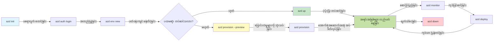
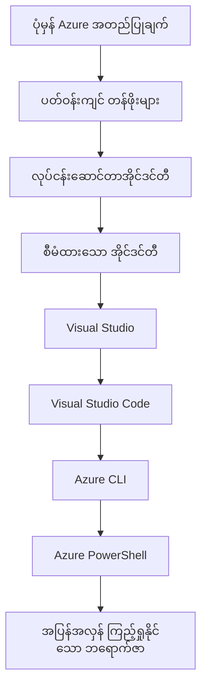

# AZD Basics - Azure Developer CLI ကိုနားလည်ခြင်း

# AZD Basics - အခြေခံ အယူအဆများနှင့် အခြေခံအချက်များ

**အခန်း လမ်းညွှန်မှု:**
- **📚 သင်တန်း မူလစာမျက်နှာ**: [AZD For Beginners](../../README.md)
- **📖 လက်ရှိ အခန်း**: Chapter 1 - အခြေခံနှင့် အမြန်စတင်ခြင်း
- **⬅️ ယခင်**: [Course Overview](../../README.md#-chapter-1-foundation--quick-start)
- **➡️ နောက်တစ်ခု**: [Installation & Setup](installation.md)
- **🚀 နောက်တစ်ခန်း**: [Chapter 2: AI-First Development](../chapter-02-ai-development/microsoft-foundry-integration.md)

## နိဒါန်း

ဤသင်ခန်းသည် Azure Developer CLI (azd) နဲ့ မိတ်ဆက်ပေး သည်။ azd သည် သင်၏ ဒေသခံ ဖွံ့ဖြိုးရေးမှ Azure သို့ တင်သွင်းရန် လမ်းစဉ်ကို မြန်ဆန်စေသော တပ်မက်ကိရိယာကြောင်းဖြစ်သည်။ သင်သည် အခြေခံ အယူအဆများ၊ အဓိက လုပ်ဆောင်ချက်များကို လေ့လာမည်ဖြစ်ပြီး azd သည် cloud-native အက်ပလီကေးရှင်းများကို ဘယ်လို ရိုးရှင်းစွာ တင်သွင်းပေးသည်ကိုနားလည်သွားမည်။

## သင်ယူရန် ရည်ရွယ်ချက်များ

ဤသင်ခန်းဆုံးသည်အထိ သင်သည်:
- Azure Developer CLI ရည်ရွယ်ချက်နှင့် အဓိက ရည်ရွယ်ချက်ကို နားလည်မည်
- template များ၊ environment များနှင့် service များ၏ အခြေခံ အယူအဆများကို သင်ယူမည်
- template-driven ဖွံ့ဖြိုးရေးနှင့် Infrastructure as Code အပါအဝင် အဓိက အင်္ဂါရပ်များကို စူးစမ်းစိစစ်မည်
- azd ပရောဂျက် ဖွဲ့စည်းပုံနှင့် workflow ကို နားလည်မည်
- သင်၏ ဖွံ့ဖြိုးရေး ပတ်ဝန်းကျင်အတွက် azd ကို 설치 및 ဖွင့်ဆောင်ရန် ပြင်ဆင်နိုင်မည်

## သင်ယူပြီးရလဒ်များ

ဤသင်ခန်းကို ပြီးမြောက်စဉ် သင်သည် အောက်ပါများကို ပြောကြားနိုင်မည်ဖြစ်သည်-
- ခေတ်မီ cloud ဖွံ့ဖြိုးရေး workflow များတွင် azd ၏ အခန်းကဏ္ဍကို ရှင်းပြနိုင်မည်
- azd ပရောဂျက် ဖွဲ့စည်းပုံ အစိတ်အပိုင်းများကို ဖော်ထုတ်နိုင်မည်
- template, environment, service များ ဘယ်လို ပေါင်းစပ်လုပ်ဆောင်ကြောင်း ဖော်ပြနိုင်မည်
- azd နှင့် Infrastructure as Code ရဲ့ အကျိုးကျေးဇူးများကို နားလည်မည်
- azd ကို အသုံးပြုရန် ကိစ္စများနှင့် ၎င်းတို့ရဲ့ ရည်ရွယ်ချက်များကို မှတ်သားသိရှိမည်

## Azure Developer CLI (azd) ဆိုတာဘာလဲ?

Azure Developer CLI (azd) သည် ဒေသခံ ဖွံ့ဖြိုးရေးမှ Azure သို့ တင်သွင်းခြင်းကို မြန်ဆန်စေသည့် command-line ကိရိယာတစ်ခုဖြစ်သည်။ Azure ပေါ်ရှိ cloud-native အက်ပလီကေးရှင်းများကို တည်ဆောက်၊ တင်သွင်းနှင့် စီမံခန့်ခွဲရန် လုပ်ငန်းစဉ်များကို ရိုးရှင်းစေသည်။

### azd ဖြင့် ဘာများ တင်သွင်းနိုင်ပါသလဲ?

azd သည် မျိုးစုံသော workload များကို ထောက်ပံ့သည်—နှင့် စာရင်းသည် အဆက်မပြတ် တိုးလာနေသည်။ ယနေ့တွင် azd ကို အသုံးပြုပြီး တင်သွင်းနိုင်သည့် အချို့မှာ-

| Workload Type | Examples | Same Workflow? |
|---------------|----------|----------------|
| **ရိုးရာ အက်ပ်လီကေးရှင်းများ** | Web apps, REST APIs, static sites | ✅ `azd up` |
| **ဝန်ဆောင်မှုများနှင့် မိုက်ခရိုဝန်ဆောင်မှုများ** | Container Apps, Function Apps, multi-service backends | ✅ `azd up` |
| **AI ဖြင့် ပံ့ပိုးထားသော အက်ပ်များ** | Chat apps with Microsoft Foundry Models, RAG solutions with AI Search | ✅ `azd up` |
| **အသိဉာဏ်ရှိ တာဝန်ယူလက်အိတ်များ (agents)** | Foundry-hosted agents, multi-agent orchestrations | ✅ `azd up` |

အဓိက စိတ်ကူးကတော့ **သင်တင်သွင်းသည်မှာ အဘယ်အရာဖြစ်ဖြစ် azd ၏ lifecycle သည် တူညီနေသည်** ဖြစ်သည်။ သင်သည် ပရောဂျက်ကို initialize လုပ်၊ အင်ֆရားကို မှတ်ပုံတင်၊ ကုဒ်ကို ထည့်သွင်း၊ အက်ပ်ကို ကြည့်ရှု၍ သန့်ရှင်းရေးလုပ်သည်—ဆိုသည်မှာ အဆိုပါ ဝဘ်ဆိုက် လျှင် သို့မဟုတ် စမတ် AI agent အသစ် ဖြစ်စေ အတူတူပင်ဖြစ်သည်။

ဤ ဆက်လက်မှုသည် ဒီဇိုင်းဖြင့် ရည်ရွယ်ထားသည်။ azd သည် AI အင်္ဂါရပ်များကို သင်၏ အက်ပလီကေးရှင်းအသုံးပြုလိုသည့် တစ်မျိုးသော service တစ်ခုအဖြစ်သာ ကျိန်ဆိုသည်၊ အခြေအနေတစ်ခု ထူးခြားစွာ မဟုတ်ဘူး။ Microsoft Foundry Models ဖြင့် အားပေးထားသော chat endpoint တစ်ခု သည် azd အတွက် တင်သွင်းရမည့် အခြား service တစ်ခုသာ ဖြစ်သည်။

### 🎯 အဘိုးကြီး AZD ကို ဘာကြောင့် အသုံးပြုသလဲ? အမှန်တကယ် ကိစ္စကို နှိုင်းယှဉ်ကြည့်ခြင်း

ရိုးရိုး ဝဘ် အက်ပ်တစ်ခုကို database နှင့် တင်သွင်းခြင်းကို နှိုင်းယှဉ်ကြည့်ကြစို့။

#### ❌ AZD မရှိဘဲ: လက်ဖြင့် Azure တင်သွင်းခြင်း (၃၀+ မိနစ်)

```bash
# အဆင့် ၁: ရင်းမြစ်အုပ်စုကို ဖန်တီးပါ
az group create --name myapp-rg --location eastus

# အဆင့် ၂: App Service Plan ကို ဖန်တီးပါ
az appservice plan create --name myapp-plan \
  --resource-group myapp-rg \
  --sku B1 --is-linux

# အဆင့် ၃: Web App ကို ဖန်တီးပါ
az webapp create --name myapp-web-unique123 \
  --resource-group myapp-rg \
  --plan myapp-plan \
  --runtime "NODE:18-lts"

# အဆင့် ၄: Cosmos DB အကောင့် ဖန်တီးပါ (၁၀-၁၅ မိနစ်)
az cosmosdb create --name myapp-cosmos-unique123 \
  --resource-group myapp-rg \
  --kind MongoDB

# အဆင့် ၅: ဒေတာဘေ့စ်ကို ဖန်တီးပါ
az cosmosdb mongodb database create \
  --account-name myapp-cosmos-unique123 \
  --resource-group myapp-rg \
  --name tododb

# အဆင့် ၆: collection ကို ဖန်တီးပါ
az cosmosdb mongodb collection create \
  --account-name myapp-cosmos-unique123 \
  --resource-group myapp-rg \
  --database-name tododb \
  --name todos

# အဆင့် ၇: connection string ကို ရယူပါ
CONN_STR=$(az cosmosdb keys list \
  --name myapp-cosmos-unique123 \
  --resource-group myapp-rg \
  --type connection-strings \
  --query "connectionStrings[0].connectionString" -o tsv)

# အဆင့် ၈: app settings များကို ပြင်ဆင်ပါ
az webapp config appsettings set \
  --name myapp-web-unique123 \
  --resource-group myapp-rg \
  --settings MONGODB_URI="$CONN_STR"

# အဆင့် ၉: logging ကို ဖွင့်ပါ
az webapp log config --name myapp-web-unique123 \
  --resource-group myapp-rg \
  --application-logging filesystem \
  --detailed-error-messages true

# အဆင့် ၁၀: Application Insights ကို တပ်ဆင်ပါ
az monitor app-insights component create \
  --app myapp-insights \
  --location eastus \
  --resource-group myapp-rg

# အဆင့် ၁၁: App Insights ကို Web App နှင့် ချိတ်ဆက်ပါ
INSTRUMENTATION_KEY=$(az monitor app-insights component show \
  --app myapp-insights \
  --resource-group myapp-rg \
  --query "instrumentationKey" -o tsv)

az webapp config appsettings set \
  --name myapp-web-unique123 \
  --resource-group myapp-rg \
  --settings APPINSIGHTS_INSTRUMENTATIONKEY="$INSTRUMENTATION_KEY"

# အဆင့် ၁၂: အက်ပလီကေးရှင်းကို မိမိစက်တွင် တည်ဆောက်ပါ
npm install
npm run build

# အဆင့် ၁၃: deployment package ကို ဖန်တီးပါ
zip -r app.zip . -x "*.git*" "node_modules/*"

# အဆင့် ၁၄: အက်ပလီကေးရှင်းကို တင်ပို့ပါ
az webapp deployment source config-zip \
  --resource-group myapp-rg \
  --name myapp-web-unique123 \
  --src app.zip

# အဆင့် ၁၅: စောင့်ပြီး အလုပ်ဖြစ်ပါစေ လို့ ဆုတောင်းပါ 🙏
# (အလိုအလျော့ စစ်ဆေးမှု မရှိပါ၊ လက်ဖြင့် စမ်းသပ်ရမည်)
```

**ပြဿနာများ:**
- ❌ မှတ်မိထားရမည့် အမိန့် ၁၅+ ခုကို အချက်အလက်အလိုက် ထည့်ရန်လိုသည်
- ❌ လက်ဖြင့် အလုပ်လုပ်ရမှု ၃၀-၄၅ မိနစ် ကြာနိုင်သည်
- ❌ အမှားလုပ်လွယ် (spelling error, မမှန်သော parameter များ)
- ❌ connection strings များ terminal history တွင် ထင်ရှားကျန်ရစ်နိုင်သည်
- ❌ မအောင်မြင်ပါက အလိုအလျောက် rollback မရှိဘူး
- ❌ အသင်းဝင်များအတွက် ပြန်တည်ဆောက်ရခက်ခဲ
- ❌ မည်သည့်အခါမဆို ကွဲပြားနိုင်သည် (ပြန်ထုတ်လုပ်၍ မရ)

#### ✅ AZD ဖြင့်: အလိုအလျောက် တင်သွင်းခြင်း (အမိန့် ၅ ချက်၊ ၁၀-၁၅ မိနစ်)

```bash
# အဆင့် 1: နမူနာမှ စတင်တည်ဆောက်ခြင်း
azd init --template todo-nodejs-mongo

# အဆင့် 2: အတည်ပြုခြင်း
azd auth login

# အဆင့် 3: ပတ်ဝန်းကျင် ဖန်တီးခြင်း
azd env new dev

# အဆင့် 4: ပြောင်းလဲမှုများကို ကြိုကြည့်ပါ (ရွေးချယ်နိုင်သော်လည်း အကြံပြုသည်)
azd provision --preview

# အဆင့် 5: အားလုံးကို ဖြန့်ချိခြင်း
azd up

# ✨ ပြီးဆုံးပါပြီ! အားလုံးကို ဖြန့်ချိပြီး၊ ဖွဲ့စည်းပြီး၊ ကြပ်မတ်စောင့်ကြည့်ထားပါပြီ။
```

**အကျိုးကျေးဇူးများ:**
- ✅ **အမိန့် ၅ ချက်** vs. လက်ဖြင့် ၁၅+ ချက်
- ✅ **၁၀-၁၅ မိနစ်** စုပေါင်း (အများစုမှာ Azure ကို စောင့်နေချိန်)
- ✅ **လက်ဖြင့် အမှားများ လျော့နည်း** - သေချာပြီး template-driven workflow
- ✅ **လုံခြုံစိတ်ချရသော secret ကိုင်တွယ်မှု** - များသော templates များသည် Azure-managed secret storage ကို အသုံးပြုသည်
- ✅ **တိုးတက်စနစ်ကျသော တင်သွင်းမှုများ** - မည်သည့်အချိန်မဆို တူညီသော workflow
- ✅ **ပြန်ထုတ်လို့ရစွမ်းအင်** - အချိန်တိုင်း ရလဒ်တူညီသည်
- ✅ **အသင်းအတွက် သင့်တော်သည်** - မည်သူမဆို အတူတူ အမိန့်များဖြင့် တင်သွင်းနိုင်သည်
- ✅ **Infrastructure as Code** - Bicep templates များ ကို version control တွင် ထိန်းသိမ်းထားသည်
- ✅ **Built-in monitoring** - Application Insights ကို အလိုအလျောက် တပ်ဆင်ပေးသည်

### 📊 အချိန် & အမှား လျော့ချမှု

| Metric | Manual Deployment | AZD Deployment | Improvement |
|:-------|:------------------|:---------------|:------------|
| **အမိန့်များ (Commands)** | 15+ | 5 | 67% လျော့နည်း |
| **အချိန် (Time)** | 30-45 min | 10-15 min | 60% အမြန်ဆုံး |
| **အမှားနှုန်း (Error Rate)** | ~40% | <5% | 88% သက်သာလာ |
| **အမြဲတမ်းတက်ကြွမှု (Consistency)** | နည်း (manual) | 100% (automated) | ပြည့်စုံ |
| **အသင်း Onboarding** | 2-4 hours | 30 minutes | 75% တိုကျပ် |
| **Rollback Time** | 30+ min (manual) | 2 min (automated) | 93% အမြန်ဆုံး |

## အခြေခံ အယူအဆများ

### Templates
Templates များသည် azd ၏ အခြေခံဖြစ်သည်။ ၎င်းတို့တွင် ပါဝင်သည်-
- **Application code** - သင်၏ ရင်းမြစ်ကုဒ်နှင့် အပုံစံများ
- **Infrastructure definitions** - Bicep သို့မဟုတ် Terraform ဖြင့် ဖေါ်ပြထားသော Azure resource များ
- **Configuration files** - ဆက်တင်များနှင့် environment ပြောင်းလည်တန်ဖိုးများ
- **Deployment scripts** - အလိုအလျောက် တင်သွင်းမှု workflows

### Environments
Environment များသည် မတူညီသော တင်သွင်းရမည့် ပစ်မှတ်များကို ကိုယ်စားပြုသည်-
- **ဖွံ့ဖြိုးရေး (Development)** - စမ်းသပ်ခြင်းနှင့် ဖွံ့ဖြိုးရေးအတွက်
- **စတေ့ဂ် (Staging)** - ထုတ်လုပ်မှုပိုင်း ပတ်ဝန်းကျင်မတိုင်မီ
- **ထုတ်လုပ်မှု (Production)** - တိုက်ရိုက် အသုံးပြုနေသော ပတ်ဝန်းကျင်

အခြေနေ တစ်ခုချင်းစီသည် မိမိအတွက် ကိုယ်ပိုင် သိမ်းဆည်းမှုများကို ထိန်းသိမ်းထားသည်-
- Azure resource group
- Configuration settings
- Deployment state

### Services
Service များသည် သင်၏ အက်ပလီကေးရှင်း၏ တည်ဆောက်ပစ္စည်းများဖြစ်သည်-
- **Frontend** - Web applications, SPAs
- **Backend** - APIs, microservices
- **Database** - ဒေတာသိုလှောင်မှု ဖြေရှင်းချက်များ
- **Storage** - ဖိုင်နှင့် blob သိုလှောင်မှု

## အဓိက အင်္ဂါရပ်များ

### 1. Template-Driven Development
```bash
# အသုံးပြုနိုင်သော နမူနာများကို ကြည့်ရှုပါ
azd template list

# နမူနာမှ စတင်တည်ဆောက်ပါ
azd init --template <template-name>
```

### 2. Infrastructure as Code
- **Bicep** - Azure ၏ domain-specific ဘာသာစကား
- **Terraform** - မျိုးစုံ cloud infrastructure ကိရိယာ
- **ARM Templates** - Azure Resource Manager templates

### 3. Integrated Workflows
```bash
# တပ်ဆင်ခြင်း အလုပ်စဉ် အပြီးအစုံ
azd up            # ပရိုဗစ်ရှင်း + တပ်ဆင်ခြင်း — ပထမဆုံး စတင်တပ်ဆင်ခြင်းအတွက် လက်ထောက်မလိုသော

# 🧪 အသစ်: တပ်ဆင်ခြင်းမလုပ်မီ အခြေခံအဆောက်အအုံ ပြောင်းလဲမှုများကို ကြိုကြည့်ရှုပါ (လုံခြုံ)
azd provision --preview    # ပြောင်းလဲမှု မပြုဘဲ အခြေခံအဆောက်အအုံ တပ်ဆင်မှုကို အတုလို စမ်းသပ်ပါ

azd provision     # အခြေခံအဆောက်အအုံကို အပ်ဒိတ်လုပ်မည်ဆိုလျှင် Azure အရင်းအမြစ်များကို ဖန်တီးရန် ဤကို အသုံးပြုပါ
azd deploy        # အပလီကေးရှင်း ကုဒ်ကို တပ်ဆင်ရန် သို့မဟုတ် အပ်ဒိတ်ပြီးနောက် ပြန်တပ်ဆင်ရန်
azd down          # အရင်းအမြစ်များကို ရှင်းလင်းဖျက်သိမ်းပါ
```

#### 🛡️ Preview ဖြင့် လုံခြုံစိတ်ချရသော အင်ဖရန်စတက်ခ်ချလျှောက်ရွေးချယ်ခြင်း
`azd provision --preview` command သည် လုံခြုံစိတ်ချရသော တင်သွင်းမှုများအတွက် အလွန် အရေးကြီးသော အရာဖြစ်သည်-
- **Dry-run analysis** - ဘာများ ဖန်တီးမည်၊ ပြင်ဆင်မည်၊ ဖျက်မည် ဆိုတာ ပြသသည်
- **Zero risk** - သင့် Azure ပတ်ဝန်းကျင်တွင် အမှန်တကယ် ပြောင်းလဲမှု မဖြစ်စေပါ
- **အသင်းပူးပေါင်းဆောင်ရွက်မှု** - တင်သွင်းမီ preview ရလဒ်များကို မျှဝေ၍ ဆွေးနွေးနိုင်သည်
- **ကုန်ကျစရိတ် ခန့်မှန်းချက်** - အရင်းအနှီး ထည့်ဝင်မီ သက်သာစရာ အမြင်ရရှိစေသည်

```bash
# ဥပမာ ကြိုတင်ကြည့်ရှု လုပ်ငန်းစဉ်
azd provision --preview           # ဘာတွေ ပြောင်းလဲမယ်ဆိုတာ ကြည့်ပါ
# ထွက်လာသော ရလဒ်ကို ပြန်လည်ဆန်းစစ်ပြီး အသင်းနှင့် ဆွေးနွေးပါ
azd provision                     # ယုံကြည်စိတ်ဖြင့် ပြောင်းလဲမှုများကို ပြုလုပ်ပါ
```

### 📊 ရုပ်ပုံ: AZD ဖွံ့ဖြိုးရေး Workflow


**Workflow ရှင်းလင်းချက်:**
1. **Init** - template သို့မဟုတ် ပရောဂျက် အသစ်ဖြင့် စတင်ပါ
2. **Auth** - Azure နှင့် အသိအမှတ်ပြုပါ
3. **Environment** - လွတ်လပ်ထားသော တင်သွင်းပတ်ဝန်းကျင် တည်ဆောက်ပါ
4. **Preview** - 🆕 အမြဲတမ်း အင်ဖရန်စထက်ခ် ပြောင်းလဲမှုများကို preview ပြုပါ (လုံခြုံသော ကွက်တိ)
5. **Provision** - Azure resources များကို ဖန်တီး/အပ်ဒိတ်လုပ်ပါ
6. **Deploy** - သင်၏ အက်ပလီကေးရှင်း ကုဒ်ကို ထည့်သွင်းပါ
7. **Monitor** - အက်ပလီကေးရှင်း ကွာတိန်စွမ်းဆောင်ရည်ကို ကြည့်ရှုပါ
8. **Iterate** - ပြင်ဆင်မှုများပြုလုပ်ပြီး ကုဒ်ကို ပြန်လည်တင်သွင်းပါ
9. **Cleanup** - အလုပ်ပြီးပါက resources များကို ဖျက်ပါ

### 4. Environment Management
```bash
# ပတ်ဝန်းကျင်များ ဖန်တီးခြင်းနှင့် စီမံခန့်ခွဲခြင်း
azd env new <environment-name>
azd env select <environment-name>
azd env list
```

### 5. Extensions and AI Commands

azd သည် core CLI များအပေါ် ပိုမိုအင်အားမြှင့်ရန် extension စနစ်ကို အသုံးပြုသည်။ ၎င်းသည် AI workload များအတွက် အထူးအသုံးဝင်သည်။

```bash
# အသုံးပြုနိုင်သည့် တိုးချဲ့မှုများကို စာရင်းပြပါ
azd extension list

# Foundry agents တိုးချဲ့မှုကို ထည့်သွင်းပါ
azd extension install azure.ai.agents

# manifest မှ AI agent ပရောဂျက်ကို စတင်ဖန်တီးပါ
azd ai agent init -m agent-manifest.yaml

# AI အကူအညီဖြင့် ဖွံ့ဖြိုးရေးအတွက် MCP ဆာဗာကို စတင်ပါ (Alpha)
azd mcp start
```

> Extensions များကို အသေးစိတ် ဖော်ပြထားသည် [အခန်း ၂: AI-နောက်တန်း ဖွံ့ဖြိုးရေး](../chapter-02-ai-development/agents.md) နှင့် [AZD AI CLI Commands](../chapter-08-production/production-ai-practices.md#azd-ai-cli-commands-and-extensions) ကိုးကားချက်တွင်။

## 📁 ပရောဂျက် ဖွဲ့စည်းပုံ

ပုံမှန် azd ပရောဂျက် ဖွဲ့စည်းပုံတစ်ခု:
```
my-app/
├── .azd/                    # azd configuration
│   └── config.json
├── .azure/                  # Azure deployment artifacts
├── .devcontainer/          # Development container config
├── .github/workflows/      # GitHub Actions
├── .vscode/               # VS Code settings
├── infra/                 # Infrastructure code
│   ├── main.bicep        # Main infrastructure template
│   ├── main.parameters.json
│   └── modules/          # Reusable modules
├── src/                  # Application source code
│   ├── api/             # Backend services
│   └── web/             # Frontend application
├── azure.yaml           # azd project configuration
└── README.md
```

## 🔧 ဆက်တင် ဖိုင်များ

### azure.yaml
ပရောဂျက်၏ အဓိက configuration ဖိုင်:
```yaml
name: my-awesome-app
metadata:
  template: my-template@1.0.0

services:
  web:
    project: ./src/web
    language: js
    host: appservice
  api:
    project: ./src/api
    language: js
    host: appservice

hooks:
  preprovision:
    shell: pwsh
    run: echo "Preparing to provision..."
```

### .azure/config.json
Environment အလိုက် သီးခြား configuration:
```json
{
  "version": 1,
  "defaultEnvironment": "dev",
  "environments": {
    "dev": {
      "subscriptionId": "your-subscription-id",
      "location": "eastus"
    }
  }
}
```

## 🎪 အထွေထွေ Workflow များနှင့် လက်တွေ့ လေ့ကျင့်ခန်းများ

> **💡 သင်ယူရန် အကြံပြုချက်:** သင်၏ AZD ကျွမ်းကျင်မှုများကို တိုးတက်စေရန် ဤလေ့ကျင့်ခန်းများကို အဆင့်လိုက် လိုက်နာပါ။

### 🎯 လေ့ကျင့်ခန်း ၁: သင့် ပထမဆုံး ပရောဂျက်ကို Initialize ပြုလုပ်ပါ

**ရည်ရွယ်ချက်:** AZD ပရောဂျက် တည်ဆောက်၍ ၎င်း၏ ဖွဲ့စည်းပုံကို ရှာဖွေပါ

**အဆင့်လိုက် လုပ်ဆောင်ချက်များ:**
```bash
# အောင်မြင်မှု သက်သေပြထားသော စံနမူနာကို အသုံးပြုပါ
azd init --template todo-nodejs-mongo

# ထုတ်လုပ်ထားသော ဖိုင်များကို စူးစမ်းကြည့်ပါ
ls -la  # ဖျောက်ထားသော ဖိုင်များအပါအဝင် ဖိုင်အားလုံးကို ကြည့်ပါ

# ဖန်တီးထားသော အဓိက ဖိုင်များ:
# - azure.yaml (အဓိက သတ်မှတ်ချက်)
# - infra/ (အခြေခံ အဆောက်အအုံ ကုဒ်)
# - src/ (လျှောက်လွှာ ကုဒ်)
```

**✅ အောင်မြင်မှု:** သင်မှာ azure.yaml, infra/ နှင့် src/ ဖိုလ်ဒါများ ရှိသဖြင့်ဖြစ်သည်

---

### 🎯 လေ့ကျင့်ခန်း ၂: Azure သို့ Deploy ပြုလုပ်ခြင်း

**ရည်ရွယ်ချက်:** အဆုံးမှအဆုံး ထည့်သွင်းခြင်းကို ပြီးမြောက်စေပါ

**အဆင့်လိုက် လုပ်ဆောင်ချက်များ:**
```bash
# 1. အတည်ပြုပါ
az login && azd auth login

# 2. ပတ်ဝန်းကျင်ကို ဖန်တီးပါ
azd env new dev
azd env set AZURE_LOCATION eastus

# 3. ပြောင်းလဲမှုများကို ကြိုတင်ကြည့်ရှုပါ (အကြံပြု)
azd provision --preview

# 4. အားလုံးကို ဖြန့်ချိပါ
azd up

# 5. တပ်ဆင်မှုကို အတည်ပြုပါ
azd show    # သင့်အက်ပ်၏ URL ကို ကြည့်ပါ
```

**မျှော်လင့်ထားသော အချိန်:** 10-15 minutes  
**✅ အောင်မြင်မှု:** Application URL သည် ဘร braser တွင် ဖွင့်နိုင်ပါသည်

---

### 🎯 လေ့ကျင့်ခန်း ၃: မျိုးစုံ Environment များ

**ရည်ရွယ်ချက်:** dev နှင့် staging တို့သို့ တင်သွင်းပါ

**အဆင့်လိုက် လုပ်ဆောင်ချက်များ:**
```bash
# dev ရှိပြီးသားပါ၊ staging ကို ဖန်တီးပါ
azd env new staging
azd env set AZURE_LOCATION westus2
azd up

# ၎င်းတို့အကြား ပြောင်းပါ
azd env list
azd env select dev
```

**✅ အောင်မြင်မှု:** Azure Portal တွင် သီးခြား resource group နှစ်ခု ရှိပါသည်

---

### 🛡️ ပုံသစ်အခြေအနေဖျက်ခြင်း: `azd down --force --purge`

ပြီးပြည့်စုံသော အသစ်တင်စီရန် လိုအပ်သောအခါ -

```bash
azd down --force --purge
```

**၎င်း၏ လုပ်ဆောင်ချက်များ:**
- `--force`: အတည်ပြုပေးမှု မေးခွန်းများ မရှိပါ
- `--purge`: ဒေသခံ state နှင့် Azure resources အားလုံး ဖျက်ပစ်သည်

**အသုံးပြုရန် အချိန်များ:**
- တင်သွင်းမှု အလယ်တွင် မအောင်မြင်ခဲ့သောအခါ
- ပရောဂျက်များ အမှုဆက်ပြောင်းလဲချိန်တွင်
- သစ်စတင်လိုချင်သောအခါ

---

## 🎪 မူလ Workflow ကိုးကားချက်

### ပရောဂျက် အသစ် စတင်ခြင်း
```bash
# နည်း 1: ရှိပြီးသား စံနမူနာကို အသုံးပြုပါ
azd init --template todo-nodejs-mongo

# နည်း 2: အစမှ စတင်ပါ
azd init

# နည်း 3: လက်ရှိ ဖိုလ်ဒါကို အသုံးပြုပါ
azd init .
```

### ဖွံ့ဖြိုးရေး စက်ဝိုင်း
```bash
# ဖွံ့ဖြိုးရေး ပတ်ဝန်းကျင်ကို စတင် ပြင်ဆင်ပါ
azd auth login
azd env new dev
azd env select dev

# အားလုံးကို တပ်ဆင်ပါ
azd up

# ပြောင်းလဲ ပြုပြင်ပြီး ထပ်မံ တပ်ဆင်ပါ
azd deploy

# အလုပ်ပြီးဆုံးပါက ရှင်းလင်းလိုက်ပါ
azd down --force --purge # Azure Developer CLI ထဲရှိ အမိန့်တစ်ခုသည် သင့်ပတ်ဝန်းကျင်အတွက် "ခိုင်မာသော ပြန်လည်စတင်ခြင်း" ဖြစ်ပြီး— မအောင်မြင်သော deployment များကို စမ်းသပ်ဖြေရှင်းစဉ်၊ မဆက်စပ်တော့သော အရင်းအမြစ်များကို ရှင်းလင်းစဉ် သို့မဟုတ် အသစ် ပြန်တပ်ဆင်ရန် ပြင်ဆင်စဉ်တွင် အထူးအသုံးဝင်သည်။
```

## `azd down --force --purge` ကို နားလည်ခြင်း
`azd down --force --purge` command သည် သင့် azd ပတ်ဝန်းကျင်နှင့် ဆက်စပ် resource များအားလုံးကို အပြီးသတ်ဖျက်ပစ်ရန် အရေးကြီးသော နည်းလမ်းတစ်ခု ဖြစ်သည်။ အောက်တွင် flag တစ်ခုချင်းစီ၏ အလုပ်လုပ်ပုံကို ဖော်ပြထားသည်-
```
--force
```
- အတည်ပြုပေးမှု မေးခွန်းများကို ဖြတ်၍ ချန်ထားသည်။
- automation သို့မဟုတ် scripting အတွက် လက်ထိန်းချက်အလိုအလျောက် လိုအပ်သောအခါ အသုံးဝင်သည်။
- CLI သည် မတူညီမှုကို တွေ့ရှိလျှင်ပါ မဖြတ်တောက်ဘဲ teardown သည် ထိခိုက်မှုမရှိစေဘဲ တိုက်ရိုက် ဆက်လက်လုပ်ဆောင်စေသည်။

```
--purge
```
Deletes **all associated metadata**, including:
ပတ်ဝန်းကျင် အခြေနေ
Local `.azure` folder
Cached deployment info
azd ကို မတိုင်ခင် တင်သွင်းမှုများကို "မှတ်မိ" ဖို့ ကန့်သတ်ပေးခြင်းကို တားဆီးသည်၊ ၎င်းသည် mismatched resource groups သို့မဟုတ် ရှင်းရွေးမမှန်သော registry reference များကဲ့သို့ ပြဿနာများ ဖြစ်စေပါသည်။

### ဘာကြောင့် နှစ်ခုစလုံး အသုံးပြုသနည်း?
`azd up` သည် အချိန်တိုင်း မအောင်မြင်သည့် ရိုက်ချက်များ သို့မဟုတ် ပါးနပ်သော state ကြောင့် ခက်ခဲသဖြင့်၊ ဒီ တွဲဖက်မှုသည် **သန့်ရှင်းသော အခြေအနေ** တစ်ခုကို အာမခံပေးပါသည်။

အထူးသဖြင့် Azure portal တွင် လက်ဖြင့် resource များ ဖျက်ပစ်ထား၍ သို့မဟုတ် template, environment, resource group အမည် ပြောင်းလဲချိန်များတွင် အထောက်အကူဖြစ်သည်။

### မျိုးစုံသော Environment များကို စီမံခြင်း
```bash
# staging ပတ်ဝန်းကျင် ဖန်တီးပါ
azd env new staging
azd env select staging
azd up

# dev သို့ ပြန်ပြောင်းပါ
azd env select dev

# ပတ်ဝန်းကျင်များကို နှိုင်းယှဉ်ပါ
azd env list
```

## 🔐 အတည်ပြုခြင်းနှင့် အသိအမှတ်ပြု အချက်အလက်များ

အတည်ပြုခြင်းကို နားလည်ခြင်းသည် azd တင်သွင်းမှုများ အောင်မြင်ရေးအတွက် အရေးကြီးသည်။ Azure သည် အတည်ပြုမှုနည်းလမ်းများ များစွာကို အသုံးပြုသည်၊ azd သည် အခြား Azure ကိရိယာများ အသုံးပြုသည့် credential chain ကို အသုံးပြုပါသည်။

### Azure CLI Authentication (`az login`)

azd ကို အသုံးမပြုမီ သင်သည် Azure နှင့် အသိအမှတ်ပြုရပါမည်။ အသုံးများသော နည်းလမ်းမှာ Azure CLI ကို အသုံးပြုခြင်း ဖြစ်သည်။

```bash
# အပြန်လှန် ဝင်ရန် (ဘရောက်ဇာ ဖွင့်မည်)
az login

# သတ်မှတ်ထားသော tenant ဖြင့် ဝင်ရန်
az login --tenant <tenant-id>

# service principal ဖြင့် ဝင်ရန်
az login --service-principal -u <app-id> -p <password> --tenant <tenant-id>

# လက်ရှိ ဝင်ထားမှု အခြေနေ စစ်ဆေးရန်
az account show

# အသုံးပြုနိုင်သည့် subscription များကို စာရင်းပြရန်
az account list --output table

# ပုံမှန် (default) subscription ကို သတ်မှတ်ရန်
az account set --subscription <subscription-id>
```

### Authentication Flow
1. **Interactive Login**: သင့် ပုံနှိပ်ထားသော browser ကို ဖွင့်၍ အတည်ပြုခြင်း
2. **Device Code Flow**: browser မရှိသော ပတ်ဝန်းကျင်များအတွက်
3. **Service Principal**: automation နှင့် CI/CD အခြေအနေများအတွက်
4. **Managed Identity**: Azure ပေါ်တွင် သက်ဆိုင်ရာ application များအတွက်

### DefaultAzureCredential Chain

`DefaultAzureCredential` သည် အမျိုးမျိုးသော credential အရင်းအမြစ်များကို သတ်မှတ်ထားသော အဆင့်လိုက် အလိုအလျောက် ကြိုးစားစမ်းသပ်ခြင်းဖြင့် ရိုးရှင်းသော authentication အတွေ့အကြုံ ပေးသည့် credential အမျိုးအစားတစ်ခုဖြစ်သည်။

#### Credential Chain Order

#### 1. Environment Variables
```bash
# service principal အတွက် environment variables များ သတ်မှတ်ပါ
export AZURE_CLIENT_ID="<app-id>"
export AZURE_CLIENT_SECRET="<password>"
export AZURE_TENANT_ID="<tenant-id>"
```

#### 2. Workload Identity (Kubernetes/GitHub Actions)
အလိုအလျောက် အသုံးပြုသည့်နေရာများ -
- Azure Kubernetes Service (AKS) တွင် Workload Identity ဖြင့်
- GitHub Actions တွင် OIDC federation ဖြင့်
- အခြား federation identity အခြေအနေများ

#### 3. Managed Identity
Azure resource များ ပေါ်တွင် အသုံးပြုသည့် နေရာများအတွက် -
- Virtual Machines
- App Service
- Azure Functions
- Container Instances

```bash
# managed identity ပါရှိသော Azure resource ပေါ်တွင် လည်ပတ်နေသည်ကို စစ်ဆေးပါ
az account show --query "user.type" --output tsv
# ရလဒ်: managed identity ကို သုံးနေပါက "servicePrincipal" ကို ပြန်ပေးမည်
```

#### 4. Developer Tools Integration
- **Visual Studio**: အလိုအလျောက် အကောင့်အား အသုံးပြုထားသောအကောင့်ကို အသုံးပြုသည်
- **VS Code**: Azure Account extension ၏ credential များကို အသုံးပြုသည်
- **Azure CLI**: `az login` အတည်ပြုချက်များကို အသုံးပြုသည် (ဒေသခံ ဖွံ့ဖြိုးရေးအတွက် အများဆုံး အသုံးပြုကြသည်)

### AZD Authentication Setup

```bash
# Method 1: Azure CLI ကို အသုံးပြုပါ (ဖွံ့ဖြိုးရေးအတွက် အကြံပြု)
az login
azd auth login  # ရှိပြီးသား Azure CLI အတည်ပြချက်များကို အသုံးပြုသည်

# Method 2: azd ဖြင့် တိုက်ရိုက် အတည်ပြုခြင်း
azd auth login --use-device-code  # GUI မပါသော ပတ်ဝန်းကျင်များအတွက်

# Method 3: အတည်ပြုခြင်း အခြေအနေကို စစ်ဆေးပါ
azd auth login --check-status

# Method 4: အကောင့်မှ ထွက်ပြီး ပြန်လည် အတည်ပြုပါ
azd auth logout
azd auth login
```

### Authentication အတွက် အကောင်းဆုံး လေ့လာမှုများ

#### ဒေသခံ ဖွံ့ဖြိုးရေး အတွက်
```bash
# 1. Azure CLI ဖြင့် လော့ဂ်အင် ဝင်ပါ
az login

# 2. မှန်ကန်သော subscription ကို အတည်ပြုပါ
az account show
az account set --subscription "Your Subscription Name"

# 3. ရှိပြီးသား အချက်အလက်များဖြင့် azd ကို အသုံးပြုပါ
azd auth login
```

#### CI/CD Pipeline များအတွက်
```yaml
# GitHub Actions example
- name: Azure Login
  uses: azure/login@v1
  with:
    creds: ${{ secrets.AZURE_CREDENTIALS }}

- name: Deploy with azd
  run: |
    azd auth login --client-id ${{ secrets.AZURE_CLIENT_ID }} \
                    --client-secret ${{ secrets.AZURE_CLIENT_SECRET }} \
                    --tenant-id ${{ secrets.AZURE_TENANT_ID }}
    azd up --no-prompt
```

#### ထုတ်လုပ်မှု ပတ်ဝန်းကျင်များအတွက်
- Azure ပေါ်တွင် လည်ပတ်သော အခါ **Managed Identity** အသုံးပြုပါ
- automation အခြေအနေများအတွက် **Service Principal** အသုံးပြုပါ
- ကုဒ် အတွင်း သို့မဟုတ် configuration ဖိုင်များတွင် credential မသိမ်းဆည်းပါနဲ့
- တပ်ဆင်ရန် ထိခိုက်နိုင်သော configuration များအတွက် **Azure Key Vault** ကို အသုံးပြုပါ

### အတည်ပြုမှု ပြဿနာများနှင့် ဖြေရှင်းနည်းများ

#### ပြဿနာ: "No subscription found"
```bash
# ဖြေရှင်းချက်: ပုံမှန် စာရင်းသွင်းမှုကို သတ်မှတ်ပါ
az account list --output table
az account set --subscription "<subscription-id>"
azd env set AZURE_SUBSCRIPTION_ID "<subscription-id>"
```

#### ပြဿနာ: "Insufficient permissions"
```bash
# ဖြေရှင်းချက်: လိုအပ်သည့် အခန်းကဏ္ဍများကို စစ်ဆေး၍ ခန့်အပ်ပါ
az role assignment list --assignee $(az account show --query user.name --output tsv)

# ပုံမှန်လိုအပ်သော အခန်းကဏ္ဍများ:
# - Contributor (အရင်းအမြစ် စီမံခန့်ခွဲရန်)
# - User Access Administrator (အခန်းကဏ္ဍများ ခန့်အပ်ရန်)
```

#### ပြဿနာ: "Token expired"
```bash
# ဖြေရှင်းချက်: ပြန်လည်အတည်ပြုပါ
az logout
az login
azd auth logout
azd auth login
```

### မတူညီသော အခြေအနေများတွင် Authentication

#### ဒေသခံ ဖွံ့ဖြိုးရေး
```bash
# ကိုယ်ပိုင်ဖွံ့ဖြိုးတိုးတက်ရေး အကောင့်
az login
azd auth login
```

#### အသင်းဖြင့် ဖွံ့ဖြိုးရေး
```bash
# အဖွဲ့အစည်းအတွက် သီးသန့် tenant ကို အသုံးပြုပါ
az login --tenant contoso.onmicrosoft.com
azd auth login
```

#### မျိုးစုံ tenant အခြေအနေများ
```bash
# ငှားသူများအကြား ပြောင်းပါ
az login --tenant tenant1.onmicrosoft.com
# ငှားသူ 1 သို့ ဖြန့်ချိပါ
azd up

az login --tenant tenant2.onmicrosoft.com  
# ငှားသူ 2 သို့ ဖြန့်ချိပါ
azd up
```

### လုံခြုံရေးဆိုင်ရာ အစဉ်အလာ
1. **လက်မှတ်သိမ်းဆည်းမှု**: လက်မှတ်များကို မူရင်းကုဒ်ထဲတွင် မထည့်သိမ်းရ။
2. **ဧရိယာ ကန့်သတ်ခြင်း**: service principal များအတွက် အနည်းဆုံး အခွင့်အရေး 원칙ကို အသုံးပြုပါ
3. **တိုကင် ပြန်လှိမ့်ခြင်း**: service principal အလျှို့ဝှက်များကို ပုံမှန်အားဖြင့် ပြန်လှိမ့်ပါ။
4. **စာရင်းစစ်လမ်းကြောင်း**: authentication နှင့် deployment လှုပ်ရှားမှုများကို ကြီးကြပ်ပါ။
5. **ကွန်ယက် လုံခြုံရေး**: အလို့ငှာဖြစ်နိုင်လျှင် သီးသန့် endpoints များကို အသုံးပြုပါ။

### Authentication အခက်အခဲဖြေရှင်းခြင်း

```bash
# အတည်ပြုခြင်းဆိုင်ရာ ပြဿနာများကို ရှာဖွေ ဖြေရှင်းရန်
azd auth login --check-status
az account show
az account get-access-token

# ပုံမှန် ခွဲခြမ်းစစ်ဆေးမှု အမိန့်များ
whoami                          # လက်ရှိ အသုံးပြုသူ အနေအထား
az ad signed-in-user show      # Azure AD အသုံးပြုသူ အသေးစိတ် အချက်အလက်များ
az group list                  # အရင်းအမြစ် လက်လှမ်းရနိုင်မှု စမ်းသပ်ရန်
```

## `azd down --force --purge` ကို နားလည်ခြင်း

### ရှာဖွေခြင်း
```bash
azd template list              # နမူနာများကို ကြည့်ရှုရန်
azd template show <template>   # နမူနာအသေးစိတ်
azd init --help               # စတင်ချိန် ရွေးချယ်စရာများ
```

### ပရောဂျက် စီမံခန့်ခွဲမှု
```bash
azd show                     # ပရောဂျက် အကျဉ်းချုပ်
azd env list                # အသုံးပြုနိုင်သော ပတ်ဝန်းကျင်များနှင့် ရွေးချယ်ထားသော ပုံမှန်
azd config show            # ဆက်တင်များ
```

### စောင့်ကြည့်ခြင်း
```bash
azd monitor                  # Azure Portal မှ မော်နီတာကို ဖွင့်ပါ
azd monitor --logs           # အက်ပလီကေးရှင်း လော့ဂ်များကို ကြည့်ရှုပါ
azd monitor --live           # တိုက်ရိုက်အချိန် မက်ထရစ်များကို ကြည့်ရှုပါ
azd pipeline config          # CI/CD ကို တပ်ဆင်ပါ
```

## အကောင်းဆုံးကျင့်သုံးနည်းများ

### 1. အဓိပ္ပာယ်ရှိသော အမည်များ အသုံးပြုပါ
```bash
# ကောင်း
azd env new production-east
azd init --template web-app-secure

# ရှောင်ရန်
azd env new env1
azd init --template template1
```

### 2. နမူနာ(Template) များကို အသုံးချပါ
- ရှိပြီးသား နမူနာများမှ စတင်ပါ
- သင့်လိုအပ်ချက်များအတွက် ကိုယ်တိုင် ပြင်ဆင်ပါ
- သင့်အဖွဲ့အစည်းအတွက် ထပ်မံအသုံးပြုနိုင်သော နမူနာများ ဖန်တီးပါ

### 3. ပတ်ဝန်းကျင်ကို သီးခြားထားခြင်း
- dev/staging/prod အတွက် သီးခြား ပတ်ဝန်းကျင်များကို သုံးပါ
- local machine မှ တိုက်ရိုက် production သို့ မတင်ပါနှင့်
- production deployments များအတွက် CI/CD pipelines ကို အသုံးပြုပါ

### 4. ကွန်ဖက်ဂျူရေးရှင်း စီမံခန့်ခွဲမှု
- လျှို့ဝှက်အချက်အလက်များအတွက် ပတ်ဝန်းကျင် အပြောင်းအလဲ (environment variables) ကို အသုံးပြုပါ
- ဖွဲ့စည်းမှုကို version control ထဲတွင် ထိန်းသိမ်းထားပါ
- ပတ်ဝန်းကျင်အလိုက် သတ်မှတ်ချက်များကို စာရွက်တင်ထားပါ

## သင်ယူမှု တိုးတက်ရေး

### အသစ်စတင်သူများ (အပတ် 1-2)
1. azd ကို ထည့်သွင်းပြီး အထောက်အထားပြုလုပ်ပါ
2. ရိုးရှင်းတဲ့ နမူနာတစ်ခုကို တပ်ဆင်ပါ
3. ပရောဂျက် ဖွဲ့စည်းပုံကို နားလည်ပါ
4. အခြေခံ command များ (up, down, deploy) ကို လေ့လာပါ

### အကြားအဆင့် (အပတ် 3-4)
1. နမူနာများကို ကိုယ်ပိုင် ပြင်ဆင်ပါ
2. ပတ်ဝန်းကျင် များစွာကို စီမံပါ
3. infrastructure code ကို နားလည်ပါ
4. CI/CD pipelines များကို တပ်ဆင်ပါ

### အဆင့်မြင့် (အပတ် 5+)
1. ကိုယ့်လက်ထဲ ပြုလုပ်ထားသော နမူနာများ ဖန်တီးပါ
2. အဆင့်မြင့် အင်ဖရာစထာ့ခ် ပုံစံများ
3. ဧရိယာများစွာသို့ ဖြန့်ချိခြင်း
4. ကုမ္ပဏီအဆင့် ဖွဲ့စည်းမှုများ

## နောက်တွဲလုပ်ဆောင်ရန် အဆင့်များ

**📖 အခန်း 1 သင်ယူမှု ဆက်လက်လုပ်ဆောင်ပါ:**
- [တပ်ဆင်ခြင်းနှင့် စတင်ပြင်ဆင်ခြင်း](installation.md) - azd ကို တပ်ဆင်ပြီး ပြင်ဆင်ရန်
- [သင့် ပထမဆုံး ပရောဂျက်](first-project.md) - လက်တွေ့ လေ့လာရေး သင်ခန်းစာကို ပြီးမြောက်ပါ
- [ဖွဲ့စည်းမှုလမ်းညွှန်](configuration.md) - အဆင့်မြင့် ပြင်ဆင်မှု ရွေးချယ်မှုများ

**🎯 နောက်အခန်းအတွက် အသင့်ပြီလား?**
- [အခန်း 2: AI-First Development](../chapter-02-ai-development/microsoft-foundry-integration.md) - AI အပလီကေးရှင်းများ တည်ဆောက်ရန် စတင်ပါ

## အပိုဆောင်း ရင်းမြစ်များ

- [Azure Developer CLI အကျဉ်းချုပ်](https://learn.microsoft.com/en-us/azure/developer/azure-developer-cli/)
- [နမူနာ ဂယ်လရီ](https://azure.github.io/awesome-azd/)
- [လူမှုအသိုင်းအဝိုင်း နမူနာများ](https://github.com/Azure-Samples)

---

## 🙋 မကြာခဏမေးလေ့ရှိသော မေးခွန်းများ

### ယေဘုယျ မေးခွန်းများ

**Q: AZD နှင့် Azure CLI အကြား ကွာခြားချက် ဘာလဲ?**

A: Azure CLI (`az`) သည် တစ်ခုချင်းစီ Azure အရင်းအမြစ်များကို စီမံရန်ဖြစ်သည်။ AZD (`azd`) သည် တစ်လုံးတည်းသော application များကို စီမံရန် ဖြစ်သည်။
```bash
# Azure CLI - နိမ့်အဆင့် အရင်းအမြစ် စီမံခန့်ခွဲမှု
az webapp create --name myapp --resource-group rg
az sql server create --name myserver --resource-group rg
# ...ပိုမိုသော အမိန့်များ လိုအပ်သည်

# AZD - အက်ပလီကေးရှင်းအဆင့် စီမံခန့်ခွဲမှု
azd up  # အက်ပလီကေးရှင်းတစ်ခုလုံးကို အရင်းအမြစ်အားလုံးနှင့်အတူ တပ်ဆင်ပေးသည်
```

**ဤအတိုင်း ထင်မြင်ပါ။**
- `az` = တစ်ခုချင်း Lego ဘရစ်များကို လုပ်ကိုင်နေခြင်း
- `azd` = လုံးဝအားဖြင့် Lego စုံအစုအစည်းများဖြင့် အလုပ်လုပ်နေခြင်း

---

**Q: AZD အသုံးပြုရန် Bicep သို့မဟုတ် Terraform ကို သိဖို့ လိုပါသလား?**

A: လိုပါစေမယ်ဆိုတော့ မလိုပါ! နမူနာများမှ စတင်ပါ။
```bash
# ရှိပြီးသား နမူနာကို အသုံးပြုပါ - IaC (Infrastructure as Code) ဆိုင်ရာ အသိပညာ မလိုအပ်ပါ။
azd init --template todo-nodejs-mongo
azd up
```

နောက်ပိုင်းတွင် Bicep ကို လေ့လာ၍ infrastructure ကို ကိုယ်တိုင် ပြင်ဆင်နိုင်သည်။ နမူနာများက သင်ယူရန် အလုပ်လုပ်နိုင်သော ဥပမာများကို ပံ့ပိုးပေးသည်။

---

**Q: AZD နမူနာများကို လည်ပတ်ရန် စျေးကြေး ဘယ်လောက်ပါသလဲ?**

A: စျေးနှုန်းများသည် နမူနာအလိုက် ကွာခြားသည်။ အများအားဖြင့် ဖွံ့ဖြိုးရေး နမူနာများသည် တစ်လလျှင် $50-150 အနားရှိသည်။
```bash
# တပ်ဆင်မှုမပြုမီ စရိတ်များကို ကြိုကြည့်ပါ
azd provision --preview

# အသုံးမပြုသောအခါ အမြဲ သန့်ရှင်းပါ
azd down --force --purge  # အားလုံးသော အရင်းအမြစ်များကို ဖယ်ရှားသည်
```

**အကြံပြုချက်:** ရနိုင်လျှင် အခမဲ့ အဆင့်များကို အသုံးချပါ။
- App Service: F1 (အခမဲ့) အဆင့်
- Microsoft Foundry Models: Azure OpenAI 50,000 tokens/လ အခမဲ့
- Cosmos DB: 1000 RU/s အခမဲ့ အဆင့်

---

**Q: ရှိပြီးသား Azure resources များနှင့် AZD ကို အသုံးပြုနိုင်မလား?**

A: ဟုတ်ပါတယ်၊ သို့သော် သန့်စင်စတင်ရန် ပိုမိုလွယ်ကူသည်။ AZD သည် လုံးဝ lifecycle ကို စီမံသောအခါ အကောင်းဆုံးအကျိုးရှိသည်။ ရှိပြီးသား resources များအတွက်:
```bash
# ရွေးချယ်ချက် 1: ရှိပြီးသား အရင်းအမြစ်များကို တင်သွင်းခြင်း (အဆင့်မြင့်)
azd init
# ပြီးနောက် infra/ ကို ပြင်ဆင်၍ ရှိပြီးသား အရင်းအမြစ်များကို ကိုးကားပါ

# ရွေးချယ်ချက် 2: အသစ်စတင်ပါ (အကြံပြု)
azd init --template matching-your-stack
azd up  # ပတ်ဝန်းကျင်အသစ်ကို ဖန်တီးသည်
```

---

**Q: ငါ့ ပရောဂျက်ကို အလုပ်သမားများနှင့် မျှဝေချင်သည်။ ဘယ္လိုလုပ်မလဲ?**

A: AZD ပရောဂျက်ကို Git သို့ commit လုပ်ပါ (သို့သော် `.azure` folder ကို မထည့်ရပါ)။
```bash
# .gitignore တွင် ပုံမှန်အဖြစ် ရှိပြီးသား
.azure/        # လျှို့ဝှက်ချက်များနှင့် ပတ်ဝန်းကျင်ဆိုင်ရာ ဒေတာများ ပါဝင်သည်
*.env          # ပတ်ဝန်းကျင် ချိန်ညှိချက်များ

# ထို့နောက် အဖွဲ့ဝင်များ:
git clone <your-repo>
azd auth login
azd env new <their-name>-dev
azd up
```

အားလုံးသည် တူညီသော နမူနာများမှ တူညီသော infrastructure ကို ရရှိမည်။

---

### ပြဿနာဖြေရှင်းမေးခွန်းများ

**Q: "azd up" သည် အလယ်မှာ မအောင်မြင်ခဲ့ပါလျှင် ငါဘာလုပ်ရမည်နည်း?**

A: အမှားကို စစ်ဆေးပြီး ပြင်ဆင်ပြီးနောက် ပြန်လည်ကြိုးစားပါ။
```bash
# အသေးစိတ်မှတ်တမ်းများကိုကြည့်ရန်
azd show

# ယေဘုယျ ဖြေရှင်းချက်များ:

# 1. ကွိုတာကျော်လွန်နေပါက:
azd env set AZURE_LOCATION "westus2"  # အခြားဒေသတစ်ခုကိုစမ်းကြည့်ပါ

# 2. အရင်းအမြစ်အမည် ပဋိပက္ခဖြစ်ပါက:
azd down --force --purge  # အစသန့်ရှင်းစတင်ပါ
azd up  # ထပ်မံကြိုးစားပါ

# 3. အတည်ပြုခွင့် သက်တမ်းကုန်သွားပါက:
az login
azd auth login
azd up
```

**အများအားဖြင့် တွေ့ရသော ပြဿနာ:** မှားသော Azure subscription ကို ရွေးထားခြင်း
```bash
az account list --output table
az account set --subscription "<correct-subscription>"
```

---

**Q: ပြန်လည် provision မလုပ်ဘဲ ကုဒ်ပြောင်းလဲမှုများကိုသာ ကျော်ထွက်ရန် ဘယ်လို deploy လုပ်မလဲ?**

A: `azd up` အစား `azd deploy` ကို အသုံးပြုပါ။
```bash
azd up          # ပထမဆုံးကြိမ်: အရင်းအမြစ်များသတ်မှတ်ခြင်းနှင့် တပ်ဆင်ခြင်း (နှေး)

# ကုဒ်ကို ပြင်ဆင်ပါ...

azd deploy      # နောက်ထပ်ကြိမ်များ: တပ်ဆင်ခြင်းသာ (လျင်မြန်)
```

အမြန်နှုန်းနှိုင်းယှဉ်ချက်:
- `azd up`: 10-15 minutes (အင်ဖရာစထာတ်ကို provision လုပ်သည်)
- `azd deploy`: 2-5 minutes (ကုဒ်သာ)

---

**Q: အင်ဖရာစထာ့ခ် နမူနာများကို ကိုယ်တိုင် ပြင်ဆင်နိုင်မလား?**

A: ဟုတ်ပါတယ်! `infra/` အတွင်းရှိ Bicep ဖိုင်များကို တည်းဖြတ်ပါ။
```bash
# azd init ပြီးနောက်
cd infra/
code main.bicep  # VS Code တွင် တည်းဖြတ်ရန်

# ပြောင်းလဲမှုများ ကြိုကြည့်ရန်
azd provision --preview

# ပြောင်းလဲမှုများကို အကောင်အထည်ဖော်ရန်
azd provision
```

**အကြံပြုချက်:** နည်းငယ်မှစ၍ စတင်ပါ - အရင်ဆုံး SKUs များကို ပြောင်းလဲပါ။
```bicep
// infra/main.bicep
sku: {
  name: 'B1'  // Change to 'P1V2' for production
}
```

---

**Q: AZD ဖန်တီးထားသမျှ အရာအားလုံးကို ဘယ်လို ဖျက်မလဲ?**

A: တစ်ချက် command တစ်ခုက resource အားလုံးကို ဖျက်ပစ်ပါသည်။
```bash
azd down --force --purge

# ဤအချက်များကို ဖျက်မည်:
# - Azure အရင်းအမြစ်အားလုံး
# - အရင်းအမြစ်အုပ်စု
# - ဒေသဆိုင်ရာ ပတ်ဝန်းကျင် အခြေအနေ
# - ကက်ရှ်ထားသော တင်သွင်းမှု ဒေတာ
```

**ဤ command ကို အမြဲ သုံးပါသည့်အချိန်များ:**
- နမူနာ စမ်းသပ်မှု ပြီးစီးသော်
- မတူသော ပရောဂျက်သို့ ပြောင်းရွှေ့သွားသည့်အခါ
- သန့်စင်စတင်လိုသောအခါ

**ကုန်ကျစရိတ် လျော့ချမှု:** မအသုံးပြုသော resource များ ဖျက်ခြင်း = $0 ငွေပေးချေမှု

---

**Q: အမှားတစ်ခုဖြစ်နေချိန်တွင် Azure Portal မှ resource များကို မမှတ်မိ ဖျက်ခဲ့ရင် ဘာလုပ်ရမလဲ?**

A: AZD အခြေအနေသည် လမ်းမလိုက်ညီနိုင်သည်။ လုံးဝသန့်ရှင်းစတင်ခြင်းနည်းလမ်း:
```bash
# 1. ဒေသခံ အခြေအနေကို ဖယ်ရှားပါ
azd down --force --purge

# 2. အသစ်စတင်ပါ
azd up

# အခြားရွေးချယ်မှု: AZD ကို ရှာတွေ့ပြီး ပြင်ဆင်စေပါ
azd provision  # မရှိသေးသော အရင်းအမြစ်များကို ဖန်တီးပါမည်
```

---

### အဆင့်မြင့် မေးခွန်းများ

**Q: CI/CD pipelines များတွင် AZD ကို အသုံးပြုနိုင်မလား?**

A: ဟုတ်ပါတယ်! GitHub Actions ဥပမာ:
```yaml
# .github/workflows/deploy.yml
name: Deploy with AZD

on:
  push:
    branches: [main]

jobs:
  deploy:
    runs-on: ubuntu-latest
    steps:
      - uses: actions/checkout@v2
      
      - name: Install azd
        run: curl -fsSL https://aka.ms/install-azd.sh | bash
      
      - name: Azure Login
        run: |
          azd auth login \
            --client-id ${{ secrets.AZURE_CLIENT_ID }} \
            --client-secret ${{ secrets.AZURE_CLIENT_SECRET }} \
            --tenant-id ${{ secrets.AZURE_TENANT_ID }}
      
      - name: Deploy
        run: azd up --no-prompt
```

---

**Q: လျှို့ဝှက်ချက်များနှင့် ထိရောက်သော ဒေတာများကို ဘယ်လိုင် များစုဆောင်းမလဲ?**

A: AZD သည် Azure Key Vault နှင့် အလိုအလျောက် ပေါင်းစည်းပေးသည်။
```bash
# လျှို့ဝှက်ချက်များကို Key Vault တွင် သိမ်းဆည်းထားပြီး ကုဒ်ထဲတွင် မထားပါ
azd env set DATABASE_PASSWORD "$(openssl rand -base64 32)"

# AZD သည် အလိုအလျောက်:
# 1. Key Vault တစ်ခု ဖန်တီးသည်
# 2. လျှို့ဝှက်ချက်ကို သိမ်းဆည်းသည်
# 3. Managed Identity မှတဆင့် အက်ပ်အား ဝင်ရောက်ခွင့် ပေးသည်
# 4. runtime အချိန်တွင် ထည့်သွင်းပေးသည်
```

**ဘယ်တော့မှ commit မလုပ်ရသည့်အရာများ:**
- `.azure/` folder (ပတ်ဝန်းကျင် ဒေတာများ ပါရှိသည်)
- `.env` files (ဒေသဆိုင်ရာ လျှို့ဝှက်ချက်များ)
- Connection strings

---

**Q: မျိုးခွဲဒေသများစွာသို့ တင်ပို့နိုင်မလား?**

A: ဟုတ်ပါတယ်၊ တိုင်းဒေသအလိုက် ပတ်ဝန်းကျင် တစ်ခုချင်းစီ ဖန်တီးပါ။
```bash
# အမေရိကန် အရှေ့ပိုင်း ပတ်ဝန်းကျင်
azd env new prod-eastus
azd env set AZURE_LOCATION eastus
azd up

# အနောက် ဥရောပ ပတ်ဝန်းကျင်
azd env new prod-westeurope
azd env set AZURE_LOCATION westeurope
azd up

# ပတ်ဝန်းကျင် တစ်ခုချင်းစီ သီးခြား လွတ်လပ်သည်
azd env list
```

စစ်မှန်သော multi-region apps များအတွက် Bicep နမူနာများကို ကိုယ်တိုင် ပြင်ဆင်၍ တစ်ပြိုင်နက်တည်း အဒေသများစွာသို့ တင်ပို့ပါ။

---

**Q: ကပ်လျှက် ရှာဖွေရသော အခက်အခဲများတွင် ဘယ်သူဆီက အကူအညီ ရနိုင်မလဲ?**

1. **AZD စာတမ်းများ:** https://learn.microsoft.com/azure/developer/azure-developer-cli/
2. **GitHub Issues:** https://github.com/Azure/azure-dev/issues
3. **Discord:** [Azure Discord](https://discord.gg/microsoft-azure) - #azure-developer-cli ချန်နယ်
4. **Stack Overflow:** Tag `azure-developer-cli`
5. **ဤသင်တန်း:** [ပြဿနာဖြေရှင်းလမ်းညွှန်](../chapter-07-troubleshooting/common-issues.md)

**အကြံပြုချက်:** မေးခွန်းမမေးမီ အောက်ပါ command ကို 실행 ပါ။
```bash
azd show       # လက်ရှိ အခြေအနေကို ပြသည်
azd version    # သင့်ဗားရှင်းကို ပြသည်
```
Include this info in your question for faster help.

---

## 🎓 နောက်တစ်ဆင့်ဘာရှိသနည်း?

သင်သည် ယခု AZD အခြေခံများကို နားလည်လိမ့်မည်။ သင့်လမ်းကို ရွေးချယ်ပါ။

### 🎯 အသစ်စတင်သူများအတွက်:
1. **နောက်တစ်ဆင့်:** [တပ်ဆင်ခြင်းနှင့် စတင်ပြင်ဆင်ခြင်း](installation.md) - သင့်ကွန်ပျူတာ၌ AZD ကို တပ်ဆင်ပါ
2. **နောက်ထပ်:** [သင့် ပထမဆုံး ပရောဂျက်](first-project.md) - သင့် ပထမ app ကို တပ်ဆင်ပါ
3. **လေ့ကျင့်မှု:** ဤသင်ခန်းစာရှိ လက်တွေ့ လေ့ကျင့်ခန်း 3 ချက်ကို အားလုံး ပြီးမြောက်ပါ

### 🚀 AI ဖွံ့ဖြိုးရေးသူများအတွက်:
1. **ခုနှစ်ဆင့်သွားပါ:** [အခန်း 2: AI-First Development](../chapter-02-ai-development/microsoft-foundry-integration.md)
2. **Deploy:** `azd init --template get-started-with-ai-chat` ဖြင့် စတင်ပါ
3. **သင်ယူပါ:** တပ်ဆင်စဉ် အတူတကွ တည်ဆောက်ပြီး သင်ယူပါ

### 🏗️ အတွေ့အကြုံရှိ ဖက်ဖော်များအတွက်:
1. **ပြန်လည်သုံးသပ်ပါ:** [ဖွဲ့စည်းမှုလမ်းညွှန်](configuration.md) - အဆင့်မြင့် ဆက်တင်များ
2. **ရှာဖွေပါ:** [Infrastructure as Code](../chapter-04-infrastructure/provisioning.md) - Bicep အနက်ရှိုင်းလေ့လာမှု
3. **တည်ဆောက်ပါ:** သင့် stack အတွက် ကိုယ်ရေး မူနာများ ဖန်တီးပါ

---

**အခန်း လမ်းညွှန်ချက်များ:**
- **📚 သင်တန်း မူလစာမျက်နှာ**: [AZD For Beginners](../../README.md)
- **📖 လက်ရှိ အခန်း**: Chapter 1 - Foundation & Quick Start  
- **⬅️ ယခင်**: [Course Overview](../../README.md#-chapter-1-foundation--quick-start)
- **➡️ နောက်တစ်ခု**: [တပ်ဆင်ခြင်းနှင့် စတင်ပြင်ဆင်ခြင်း](installation.md)
- **🚀 နောက်အခန်း**: [အခန်း 2: AI-First Development](../chapter-02-ai-development/microsoft-foundry-integration.md)

---

<!-- CO-OP TRANSLATOR DISCLAIMER START -->
**Disclaimer**:  
ဤစာတမ်းကို AI ဘာသာပြန်ဝန်ဆောင်မှု [Co-op Translator](https://github.com/Azure/co-op-translator) ဖြင့် ဘာသာပြန်ထားပါသည်။ ကျွန်ုပ်တို့သည် တိကျမှန်ကန်စေရန် ကြိုးပမ်းပါသည်။ သို့သော် အလိုအလျောက် ဘာသာပြန်ချက်များတွင် အမှားများ သို့မဟုတ် မှန်ကန်မှုနည်းပါးသော အချက်များပါဝင်နိုင်ကြောင်း ကျေးဇူးပြု၍ သိထားပါ။ မူလစာတမ်းကို ၎င်း၏ မူလဘာသာဖြင့် အာဏာပိုင် ရင်းမြစ်အဖြစ် သတ်မှတ်ရမည်ဖြစ်သည်။ အရေးကြီးသော အချက်အလက်များအတွက် လူ့ကျွမ်းကျင် ဘာသာပြန်သူ စနစ်တကျ ပြန်လည် ဘာသာပြန်ပေးရန် အကြံပြုပါသည်။ ဤဘာသာပြန်မှုကို အသုံးပြုခြင်းကြောင့် ဖြစ်ပေါ်လာနိုင်သည့် နားလည်မှုမှားများ သို့မဟုတ် အဓိပ္ပာယ်မမှန်ကန်မှုများအတွက် ကျွန်ုပ်တို့ တာဝန်မယူပါ။
<!-- CO-OP TRANSLATOR DISCLAIMER END -->