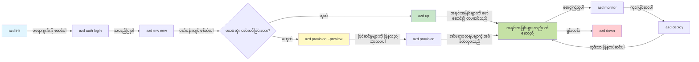
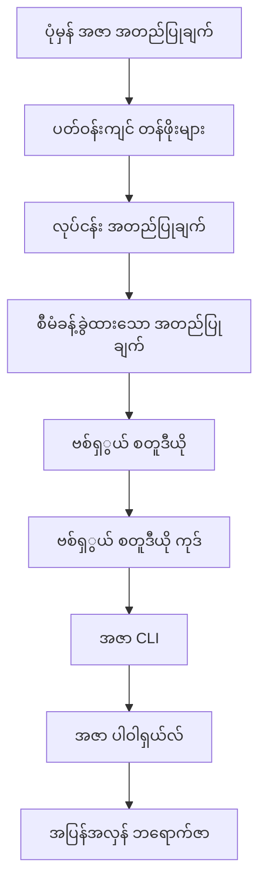

# AZD Basics - Azure Developer CLI ကိုနားလည်ခြင်း

# AZD Basics - အခြေခံ အယူအဆများနှင့် အခြေခံ သိကောင်းစရာများ

**Chapter Navigation:**
- **📚 Course Home**: [AZD စတင်သူများ](../../README.md)
- **📖 Current Chapter**: အခန်း ၁ - အခြေခံနှင့် အမြန် စတင်ချက်
- **⬅️ Previous**: [သင်တန်း အကျဉ်းချုပ်](../../README.md#-chapter-1-foundation--quick-start)
- **➡️ Next**: [တပ်ဆင်ခြင်းနှင့် ချိန်းညှိခြင်း](installation.md)
- **🚀 Next Chapter**: [အခန်း ၂: AI-ဦးစားပေး ဖွံ့ဖြိုးရေး](../chapter-02-ai-development/microsoft-foundry-integration.md)

## မိတ်ဆက်

ဒီသင်ခန်းမှာ သင်ကို Azure Developer CLI (azd) နဲ့ မိတ်ဆက်ပေးမယ်။ azd သည် သင့်ကို local ဖွံ့ဖြိုးရေးမှ Azure သို့ တင်သွင်းခြင်းအထိ ချက်ချင်းမြန်ဆန်စေတဲ့ အထောက်အကူပြု command-line ကိရိယာတစ်ခု ဖြစ်ပါတယ်။ သင်သည် အခြေခံ အယူအဆများ၊ အဓိက အင်အားများကိုလေ့လာပြီး azd က cloud-native အက်ပလီကေးရှင်းများ တင်သွင်းမှုကို ဘယ်လိုလွယ်ကူစေမလဲကို နားလည်သွားမည်ဖြစ်သည်။

## သင်ယူရမည့် ရည်မှန်းချက်များ

ဒီသင်ခန်းအဆုံးတွင် သင်သည်:
- Azure Developer CLI ဆိုတာဘာလဲ၊ ၎င်း၏ အဓိက ရည်ရွယ်ချက်များကို နားလည်နိုင်မည်
- template များ၊ environment များ နှင့် service များ၏ အဓိက အယူအဆများကို လေ့လာနိုင်မည်
- template-driven ဖွံ့ဖြိုးရေးနှင့် Infrastructure as Code အပါအဝင် အဓိက အင်အားများကို ရှာဖွေသိရှိနိုင်မည်
- azd project ဖွဲ့စည်းမှုနှင့် workflow ကို နားလည်နိုင်မည်
- သင့်ဖွံ့ဖြိုးရေး ပတ်ဝန်းကျင်အတွက် azd ကို ထည့်သွင်း၊ တပ်ဆင် ပြင်ဆင်ရန် အသင့်ဖြစ်နေမည်

## သင်ယူပြီးနောက် ရရှိမည့် ကျွမ်းကျင်မှုများ

ဤသင်ခန်းကို အောင်မြင်စွာ ပြီးမြောက်သည်နှင့် သင်သည်:
- မော်ဒန် cloud ဖွံ့ဖြိုးရေး workflow များတွင် azd ၏ လှုံ့ဆော်မှုကို ရှင်းပြနိုင်မည်
- azd project ဖွဲ့စည်းမှု၏ အစိတ်အပိုင်းများကို ဖော်ထုတ်နိုင်မည်
- template များ၊ environment များနှင့် service များသည် ဘယ်လို ပူးပေါင်းလုပ်ဆောင်ကြောင်း ဖော်ပြနိုင်မည်
- azd ဖြင့် Infrastructure as Code ၏ အကျိုးကျေးဇူးများကို နားလည်နိုင်မည်
- azd command များနှင့် ၎င်းတို့၏ ရည်ရွယ်ချက်များကို သိမြင်နိုင်မည်

## Azure Developer CLI (azd) ဆိုတာဘာလဲ?

Azure Developer CLI (azd) သည် local ဖွံ့ဖြိုးရေးမှ Azure သို့ မျက်နှာချင်းဆိုင် တင်သွင်းခြင်းကို မြန်ဆန်စေရန် အတွက် ရေးထားသော command-line ကိရိယာဖြစ်သည်။ Azure ပေါ်တွင် cloud-native အက်ပလီကေးရှင်းများ ကိုတည်ဆောက်၊ တင်သွင်း၊ စီမံခန့်ခွဲခြင်း လုပ်ငန်းစဉ်များကို ရိုးရှင်းတင်းကျပ်စေသည်။

### 🎯 Почему использовать AZD?  (အလုပ်နမူနာ နှိုင်းယှဉ်ခြင်း)

လေးတွေ့သော web app တစ်ခုကို database နှင့် အတူ တင်သွင်းရာကို နှိုင်းယှဉ်ကြစို့။

#### ❌ AZD မရှိသော အခြေအနေ: လက်ဖြင့် Azure တင်သွင်းခြင်း (၃၀ မိနစ်မကျော်)

```bash
# အဆင့် 1: အရင်းအမြစ်အုပ်စုတစ်ခု ဖန်တီးပါ
az group create --name myapp-rg --location eastus

# အဆင့် 2: App Service Plan တစ်ခု ဖန်တီးပါ
az appservice plan create --name myapp-plan \
  --resource-group myapp-rg \
  --sku B1 --is-linux

# အဆင့် 3: Web App တစ်ခု ဖန်တီးပါ
az webapp create --name myapp-web-unique123 \
  --resource-group myapp-rg \
  --plan myapp-plan \
  --runtime "NODE:18-lts"

# အဆင့် 4: Cosmos DB အကောင့်တစ်ခု ဖန်တီးပါ (10-15 မိနစ်)
az cosmosdb create --name myapp-cosmos-unique123 \
  --resource-group myapp-rg \
  --kind MongoDB

# အဆင့် 5: ဒေတာဘေ့စ် တစ်ခု ဖန်တီးပါ
az cosmosdb mongodb database create \
  --account-name myapp-cosmos-unique123 \
  --resource-group myapp-rg \
  --name tododb

# အဆင့် 6: စုစည်းမှုတစ်ခု ဖန်တီးပါ
az cosmosdb mongodb collection create \
  --account-name myapp-cosmos-unique123 \
  --resource-group myapp-rg \
  --database-name tododb \
  --name todos

# အဆင့် 7: ချိတ်ဆက်စာကြောင်း (connection string) ရယူပါ
CONN_STR=$(az cosmosdb keys list \
  --name myapp-cosmos-unique123 \
  --resource-group myapp-rg \
  --type connection-strings \
  --query "connectionStrings[0].connectionString" -o tsv)

# အဆင့် 8: အက်ပ် ဆက်တင်များကို ပြင်ဆင်ပါ
az webapp config appsettings set \
  --name myapp-web-unique123 \
  --resource-group myapp-rg \
  --settings MONGODB_URI="$CONN_STR"

# အဆင့် 9: မှတ်တမ်းရေးခြင်းကို ဖွင့်ပါ
az webapp log config --name myapp-web-unique123 \
  --resource-group myapp-rg \
  --application-logging filesystem \
  --detailed-error-messages true

# အဆင့် 10: Application Insights ကို တပ်ဆင်ပါ
az monitor app-insights component create \
  --app myapp-insights \
  --location eastus \
  --resource-group myapp-rg

# အဆင့် 11: Application Insights ကို Web App နှင့် ချိတ်ဆက်ပါ
INSTRUMENTATION_KEY=$(az monitor app-insights component show \
  --app myapp-insights \
  --resource-group myapp-rg \
  --query "instrumentationKey" -o tsv)

az webapp config appsettings set \
  --name myapp-web-unique123 \
  --resource-group myapp-rg \
  --settings APPINSIGHTS_INSTRUMENTATIONKEY="$INSTRUMENTATION_KEY"

# အဆင့် 12: ဒေသခံတွင် အပလီကေးရှင်းကို ဆောက်လုပ်ပါ
npm install
npm run build

# အဆင့် 13: တပ်ဆင်ရေး ပက်ကေ့ခ််တစ်ခု ဖန်တီးပါ
zip -r app.zip . -x "*.git*" "node_modules/*"

# အဆင့် 14: အပလီကေးရှင်းကို တပ်ဆင်ပါ
az webapp deployment source config-zip \
  --resource-group myapp-rg \
  --name myapp-web-unique123 \
  --src app.zip

# အဆင့် 15: စောင့်ပြီး အလုပ်လုပ်ပါစေဟု ဆုတောင်းပါ 🙏
# (အလိုအလျောက် စိစစ်မှု မရှိပါ၊ လက်ဖြင့် စမ်းသပ်ရန် လိုအပ်သည်)
```

**ပြဿနာများ:**
- ❌ မှတ်မိရန်နှင့် အဆင့်လိုက် အကောင်အထည်ဖော်ရန် command ၁၅ ကျော်
- ❌ လက်ဖြင့် လုပ်ရန် ၃၀–၄၅ မိနစ်
- ❌ လွယ်လင့်တကူ အမှားများဖြစ်တတ် (စာလုံးထပ်မိခြင်း၊ မှားသော parameter များ)
- ❌ connection string များ terminal history တွင် ထင်ဟပ်နေခြင်း
- ❌ တစ်ခုခုထိခိုက်လျှင် အလိုအလျောက် ပြန်လည်မလုပ်နိုင်ခြင်း
- ❌ အသင်းသားများအတွက် ပြန်လည်ထူထောင်ရ ခက်ခဲခြင်း
- ❌ တစ်ခါတစ်ရံ မတူဘဲ ဖြစ်တတ် (ပြန်လည်ထပ်လုပ်၍ ရနိုင်ခြင်း မရှိ)

#### ✅ AZD နှင့်အတူ: အလိုအလျောက် တင်သွင်းခြင်း (command ၅ ခု, ၁၀–၁၅ မိနစ်)

```bash
# အဆင့် ၁: template မှ စတင်ဖန်တီးပါ
azd init --template todo-nodejs-mongo

# အဆင့် ၂: အတည်ပြုပါ
azd auth login

# အဆင့် ၃: ပတ်ဝန်းကျင် (environment) ကို ဖန်တီးပါ
azd env new dev

# အဆင့် ၄: ပြောင်းလဲမှုများကို ကြိုကြည့်ပါ (ရွေးချယ်နိုင်သော်လည်း အကြံပြုပါသည်)
azd provision --preview

# အဆင့် ၅: အားလုံးကို ဖြန့်ချိပါ
azd up

# ✨ ပြီးပြီ! အားလုံးကို ဖြန့်ချိပြီး၊ ဖွဲ့စည်းပြီး၊ စောင့်ကြည့်ထားသည်။
```

**အကျိုးကျေးဇူးများ:**
- ✅ **command ၅ ခု** အား ၁၅+ လက်ဖြင့် လုပ်သောအဆင့်များနဲ့ နှိုင်းကြည့်လို့
- ✅ **စုစုပေါင်း ၁၀–၁၅ မိနစ်** (အများစုသည် Azure ပေးပို့စောင့်ဆိုင်းချိန်)
- ✅ **အမှားမရှိဘဲ** - အလိုအလျောက် စမ်းသပ်ပြီး အတည်ပြုထားသည်
- ✅ **လျှိုဝှက်ချက်များကို ဘေးကင်းစွာ စီမံ** သတ်မှတ်ရန် Key Vault အသုံးပြုသည်
- ✅ **အမှားဖြစ်ပါက အလိုအလျောက် ပြန်လည်ဆက်လုပ်ခြင်း** ရှိသည်
- ✅ **တိတိကျကျ ထပ်မံဖန်တီးနိုင်သည်** - တစ်ခါစီ အမှန်တည်ရာရရှိမည်
- ✅ **အသင်းအသုံးအတွက် သင့်တော်သည်** - မည်သူမဆို အတူတူ command များဖြင့် deploy လုပ်နိုင်သည်
- ✅ **Infrastructure as Code** - version control သုံးထားသော Bicep template များ
- ✅ **တည်ဆောက်ထားသည့် မျက်နှာကြည့်မှု** - Application Insights ကို အလိုအလျောက် တပ်ဆင်ထားသည်

### 📊 အချိန်နှင့် အမှား လျှော့ချမှု

| Metric | လက်ဖြင့် တင်သွင်းခြင်း | AZD ဖြင့် တင်သွင်းခြင်း | တိုးတက်မှု |
|:-------|:------------------|:---------------|:------------|
| **Commands** | 15+ | 5 | 67% လျော့နည်းသည် |
| **Time** | 30-45 min | 10-15 min | 60% ပိုမြန်သည် |
| **Error Rate** | ~40% | <5% | 88% လျှော့ချသည် |
| **Consistency** | နိမ့်သည် (လက်ဖြင့်) | 100% (အလိုအလျော့) | ပြည့်စုံသည် |
| **Team Onboarding** | 2-4 hours | 30 minutes | 75% ပိုလျှင်းသည် |
| **Rollback Time** | 30+ min (လက်ဖြင့်) | 2 min (အလိုအလျော့) | 93% ပိုမြန်သည် |

## အဓိက အယူအဆများ

### Templates
Template များသည် azd ၏ အခြေခံဖြစ်သည်။ ၎င်းများတွင် ပါဝင်သည်။
- **Application code** - သင့် מקורကုဒ်နှင့် ကိုယ်စားလှယ်လိုအပ်ချက်များ
- **Infrastructure definitions** - Bicep သို့မဟုတ် Terraform တွင် သတ်မှတ်ထားသော Azure resource များ
- **Configuration files** - ဆက်တင်များနှင့် environment မားကတ်များ
- **Deployment scripts** - အလိုအလျောက် တင်သွင်းမှု workflow များ

### Environments
Environment များသည် တင်သွင်းရန် ရည်ညွှတ်ထားသော မတူညီသော ပတ်ဝန်းကျင်များကို ကိုယ်စားပြုသည်။
- **Development** - စမ်းသပ်ရေးနှင့် ဖွံ့ဖြိုးရေးအတွက်
- **Staging** - ပြင်ဆင်ပြီး မူလထုတ်လွှင့်မှုမတိုင်ခင် ပတ်ဝန်းကျင်
- **Production** - တိုက်ရိုက် အသက်သွင်း ထုတ်လွှင့်ထားသော ပတ်ဝန်းကျင်

အချို့သော environment များသည် မိမိတို့အတွက် ကိုယ်ပိုင် ထိန်းသိမ်းမှုရှိသည်။
- Azure resource group
- Configuration settings
- Deployment state

### Services
Service များသည် သင့်အက်ပလီကေးရှင်း၏ အဆောက်အအုံ အစိတ်အပိုင်းများဖြစ်သည်။
- **Frontend** - ဝက်ဘ် အက်ပလီကေးရှင်းများ၊ SPA များ
- **Backend** - API များ၊ microservice များ
- **Database** - ဒေတာ သိမ်းဆည်းမှုဖြေရှင်းချက်များ
- **Storage** - ဖိုင်နှင့် blob သိမ်းဆည်းမှု

## အဓိက အင်အားများ

### 1. Template-Driven Development
```bash
# ရရှိနိုင်သည့် ပုံစံများကို ကြည့်ရှုပါ
azd template list

# ပုံစံမှ စတင်ဖန်တီးပါ
azd init --template <template-name>
```

### 2. Infrastructure as Code
- **Bicep** - Azure ၏ domain-specific language
- **Terraform** - Multi-cloud infrastructure ကိရိယာ
- **ARM Templates** - Azure Resource Manager templates

### 3. Integrated Workflows
```bash
# တပ်ဆင်မှု လုပ်ငန်းစဉ် အပြည့်အစုံ
azd up            # Provision + Deploy — ပထမဆုံး စတင်တပ်ဆင်ရာတွင် အလိုအလျောက် ဆောင်ရွက်သည်

# 🧪 အသစ်: တပ်ဆင်မီ အောက်ခံအဆောက်အအုံ ပြောင်းလဲမှုများကို ကြိုကြည့်နိုင်သည် (လုံခြုံ)
azd provision --preview    # ပြောင်းလဲမှု မပြုလုပ်ဘဲ အောက်ခံအဆောက်အအုံ တပ်ဆင်မှုကို အတုစမ်းသပ်သည်

azd provision     # အောက်ခံအဆောက်အအုံကို အပ်ဒိတ်လုပ်ပါက Azure အရင်းအမြစ်များကို ဖန်တီးရန် ဤကို အသုံးပြုပါ
azd deploy        # အပလီကေးရှင်း ကုဒ်ကို တပ်ဆင်ရန် သို့မဟုတ် အပ်ဒိတ်ပြီးနောက် ပြန်တပ်ဆင်ရန်
azd down          # အရင်းအမြစ်များကို ရှင်းလင်းပါ
```

#### 🛡️ Preview ဖြင့် ဘေးကင်းသေချာသော Infrastructure စီစစ်ခြင်း
`azd provision --preview` command သည် ဘေးကင်းသေချာစွာ တင်သွင်းနိုင်ရန် အရေးကြီးသော ကိရိယာတစ်ခုဖြစ်သည်။
- **Dry-run analysis** - ဘာများကို ဖန်တီးမည်၊ ပြင်ဆင်မည်၊ ဖျက်မည်ကို ပြသည်
- **Zero risk** - သင့် Azure ပတ်ဝန်းကျင်တွင် အမှန်တကယ် ပြောင်းလဲမှု မရှိ
- **Team collaboration** - တင်သွင်းမမှီ preview ရလဒ်များကို အတူဝေမျှနိုင်သည်
- **Cost estimation** - လုပ်ငန်းစတင်မီ အရင်းအနှီး ကုန်ကျစရိတ်ကို သိရှိနိုင်သည်

```bash
# ဥပမာ ကြိုတင်ကြည့်ရှုရန် လုပ်ငန်းစဉ်
azd provision --preview           # ဘာတွေ ပြောင်းလဲမယ်ဆိုတာ ကြည့်ပါ
# ထွက်ရလဒ်ကို ပြန်လည်သုံးသပ်ပြီး အဖွဲ့နှင့် ဆွေးနွေးပါ
azd provision                     # ယုံကြည်စိတ်ချစွာ ပြောင်းလဲချက်များကို အကောင်အထည်ဖော်ပါ
```

### 📊 ရှုမြင်မှုပုံ: AZD ဖွံ့ဖြိုးရေး Workflow


**Workflow ချပြချက်:**
1. **Init** - template သို့မဟုတ် project အသစ်ဖြင့်စတင်ပါ
2. **Auth** - Azure နှင့် အတည်ပြုမှု ပြုလုပ်ပါ
3. **Environment** - သီးခြားထားသော တင်သွင်း ပတ်ဝန်းကျင် တည်ဆောက်ပါ
4. **Preview** - 🆕 အမြဲတမ်း infrastructure ပြောင်းလဲမှုများကို ပထမဦးစွာ ကြည့်ရှုပါ (ဘေးကင်းသောအလေ့အထ)
5. **Provision** - Azure resource များ ဖန်တီး/အပ်ဒိတ်လုပ်ပါ
6. **Deploy** - သင့် application code ကို ထိုးဆွဲပါ
7. **Monitor** - အက်ပလီကေးရှင်း၏ လုပ်ေဆောင်မှုကို ကြည့်ရှုပါ
8. **Iterate** - ပြင်ဆင်မှုများလုပ်ပြီး အကောင်အထည်ဖော်ရန် ပြန်လည်တင်သွင်းပါ
9. **Cleanup** - အလုပ်ပြီးသည့်အခါ resource များ ဖျက်ပါ

### 4. Environment Management
```bash
# ပတ်ဝန်းကျင်များကို ဖန်တီးပြီး စီမံခန့်ခွဲပါ
azd env new <environment-name>
azd env select <environment-name>
azd env list
```

## 📁 Project ဖွဲ့စည်းပုံ

ပုံမှန် azd project ဖွဲ့စည်းပုံ:
```
my-app/
├── .azd/                    # azd configuration
│   └── config.json
├── .azure/                  # Azure deployment artifacts
├── .devcontainer/          # Development container config
├── .github/workflows/      # GitHub Actions
├── .vscode/               # VS Code settings
├── infra/                 # Infrastructure code
│   ├── main.bicep        # Main infrastructure template
│   ├── main.parameters.json
│   └── modules/          # Reusable modules
├── src/                  # Application source code
│   ├── api/             # Backend services
│   └── web/             # Frontend application
├── azure.yaml           # azd project configuration
└── README.md
```

## 🔧 ဆက်တင်ဖိုင်များ

### azure.yaml
ပရိုဂျက်၏ အဓိက ဖွဲ့စည်းမှု ဖိုင်:
```yaml
name: my-awesome-app
metadata:
  template: my-template@1.0.0

services:
  web:
    project: ./src/web
    language: js
    host: appservice
  api:
    project: ./src/api
    language: js
    host: appservice

hooks:
  preprovision:
    shell: pwsh
    run: echo "Preparing to provision..."
```

### .azure/config.json
Environment-အထူး ဆက်တင်များ:
```json
{
  "version": 1,
  "defaultEnvironment": "dev",
  "environments": {
    "dev": {
      "subscriptionId": "your-subscription-id",
      "location": "eastus"
    }
  }
}
```

## 🎪 လက်တွေ့ လေ့ကျင့်ခန်းများနှင့် အလုပ်လုပ်ရပ်များ

> **💡 သင်ယူမှု အကြံပြုချက်:** AZD ကျွမ်းကျင်မှုတိုးမြှင့်ရန် ဒီလေ့ကျင့်ခန်းများကို အဆင့်လိုက် လိုက်နာပါ။

### 🎯 လေ့ကျင့်ခန်း ၁: သင့် ပထမဆုံး ပရိုဂျက်ကို စတင်ပါ

**ရည်ရွယ်ချက်:** AZD ပရိုဂျက်တစ်ခု ဖန်တီး၍ ၎င်း၏ ဖွဲ့စည်းပုံကို စူးစမ်းပါ

**အဆင့်များ:**
```bash
# စမ်းသပ်ပြီး ထိရောက်မှုရှိသည့် ပုံစံကို အသုံးပြုပါ
azd init --template todo-nodejs-mongo

# ဖန်တီးထားသော ဖိုင်များကို စူးစမ်းကြည့်ပါ
ls -la  # ဖျောက်ထားသော ဖိုင်များအပါအဝင် ဖိုင်အားလုံးကို ကြည့်ရှုပါ

# ဖန်တီးထားသော အဓိက ဖိုင်များ:
# - azure.yaml (အဓိက ဆက်တင်)
# - infra/ (အခြေခံအဆောက်အအုံ ကုဒ်)
# - src/ (အက်ပလီကေးရှင်း ကုဒ်)
```

**✅ အောင်မြင်မှု:** သင်သည် azure.yaml, infra/ နှင့် src/ ဖိုလ်ဒါများ ရရှိထားသည်

---

### 🎯 လေ့ကျင့်ခန်း ၂: Azure သို့ တင်သွင်းပါ

**ရည်ရွယ်ချက်:** အစွန်းချင်း အပြီးအစီး အောင်မြင်စွာ တင်သွင်းပါ

**အဆင့်များ:**
```bash
# 1. အတည်ပြုပါ
az login && azd auth login

# 2. ပတ်ဝန်းကျင် ဖန်တီးပါ
azd env new dev
azd env set AZURE_LOCATION eastus

# 3. ပြင်ဆင်ချက်များကို ကြိုတင်ကြည့်ရှုပါ (အကြံပြု)
azd provision --preview

# 4. အားလုံးကို ဖြန့်ချိပါ
azd up

# 5. ဖြန့်ချိမှုကို အတည်ပြုပါ
azd show    # သင့်အက်ပ်၏ URL ကို ကြည့်ပါ
```

**မျှော်မှန်းချိန်:** 10-15 မိနစ်  
**✅ အောင်မြင်မှု:** အက်ပလီကေးရှင်း URL ကို browser တွင် ဖွင့်နိုင်သည်

---

### 🎯 လေ့ကျင့်ခန်း ၃: အများကြီးသော Environment များ

**ရည်ရွယ်ချက်:** dev နှင့် staging သို့ တင်သွင်းပါ

**အဆင့်များ:**
```bash
# dev ရှိပြီးသားဖြစ်သည်၊ staging ကို ဖန်တီးပါ
azd env new staging
azd env set AZURE_LOCATION westus2
azd up

# အဲဒီနှစ်ခုအကြား ပြောင်းပါ
azd env list
azd env select dev
```

**✅ အောင်မြင်မှု:** Azure Portal တွင် တွဲထားသော resource group နှစ်ခုရှိသည်

---

### 🛡️ မျက်နှာသစ်: `azd down --force --purge`

အားလုံးကို ပြန်လည်စတင်လိုသည့်အခါ:

```bash
azd down --force --purge
```

**၎င်းလုပ်ဆောင်သည့်အရာများ:**
- `--force`: အတည်ပြုမေးခွန်း မရှိဘဲ ဆက်လုပ်သည်
- `--purge`: မူလပြည်တွင်း state နှင့် Azure resource များအားလုံး ဖျက်ပစ်သည်

**သတ်မှတ်သုံးစွဲရန်:**
- တင်သွင်းမှု အလယ်တွင် မအောင်မြင်ခဲ့သောအခါ
- ပရိုဂျက်များ ပြောင်းလဲသည့်အခါ
- အသစ်စတင်ချင်သောအခါ

---

## 🎪 မူလ Workflow အကိုက်

### ပရိုဂျက် အသစ် စတင်ခြင်း
```bash
# နည်းလမ်း ၁: ရှိပြီးသား နမူနာကို အသုံးပြုပါ
azd init --template todo-nodejs-mongo

# နည်းလမ်း ၂: အစမှ စတင်ပါ
azd init

# နည်းလမ်း ၃: လက်ရှိ ဖိုဒါကို အသုံးပြုပါ
azd init .
```

### ဖွံ့ဖြိုးရေး ဒေါင်းစက်
```bash
# ဖွံ့ဖြိုးရေး ပတ်ဝန်းကျင်ကို စီစဉ်ပါ
azd auth login
azd env new dev
azd env select dev

# အရာအားလုံးကို ဖြန့်ချိပါ
azd up

# ပြင်ဆင်မှုများပြုလုပ်ပြီး ထပ်မံဖြန့်ချိပါ
azd deploy

# လုပ်ဆောင်ပြီးပါက ရှင်းလင်းပါ
azd down --force --purge # Azure Developer CLI ထဲရှိ command က သင့်ပတ်ဝန်းကျင်အတွက် အပြင်းအထန် ပြန်လည်စတင်ခြင်းဖြစ်ပြီး—မအောင်မြင်သော deployment များကို ပြဿနာရှာစစ်နေချိန်၊ ပတ်ကျန် အရင်းအမြစ်များကို ရှင်းလင်းနေချိန် သို့မဟုတ် အသစ်တင်ရန် ပြင်ဆင်နေချိန်များတွင် အထူးအသုံးဝင်သည်။
```

## `azd down --force --purge` ကို နားလည်ခြင်း
`azd down --force --purge` command သည် သင့် azd ပတ်ဝန်းကျင်နှင့် ဆက်စပ်ထားသည့် resource အားလုံးကို အပြည့်အဝ ဖျက်ပစ်ရန် အင်အားသိသွားသော နည်းလမ်းဖြစ်သည်။ အောက်တွင် flags တစ်ခုချင်းစီ၏ အဓိပ္ပာယ်ကို ဖော်ပြထားသည်။
```
--force
```
- အတည်ပြုမေးခွန်းများကို ကျော်လွှားသည်။
- automation သို့မဟုတ် scripting များတွင် လက်အောက်ထိုး ဝင်ရန် ခက်ခဲသော အခါ အသုံးပြုသည်။
- CLI မှ အမျိုးမျိုးသော မတူညီမှုများကို တွေ့ကြုံသောအခါ teardown ကို ချိုးခြင်းမရှိစေရန် အတည်ပြုသည်။

```
--purge
```
Deletes **ဆက်စပ် metadata အားလုံးကို**, အတှ်အတွဲဖြင့်:
Environment state
Local `.azure` folder
Cached deployment info
azd ကို နောက်ထပ် ကြားယဉ်မခံစေဘဲ ပြီးခဲ့သော deployment များကို "မှတ်မိ" နေခြင်းမှ ကာကွယ်ပေးသည်၊ ဥပမာ mismatched resource group များ သို့မဟုတ် stale registry references စသည်ဖြစ်နိုင်ပါသည်။

### ဘာကြောင့် နှစ်ခုလုံးကို အသုံးပြုသနည်း?
`azd up` ကို အများကြီး state ကျန်နေခြင်း သို့မဟုတ် အစိတ်ပိုင်း တင်သွင်းမှုများကြောင့် ပြဿနာဖြစ်နေပါက၊ ဒီ combo သည် **သန့်ရှင်းသိပ်ထုတ်** တစ်ခုကို သေချာစေပါသည်။

မန်ယူအယ်လ်လ် resource များကို Azure portal တွင် ဖျက်ချိန်တွင် သို့မဟုတ် template, environment, resource group အမည် သတ်မှတ်ချက်များ ပြောင်းလဲချိန်တွင် အထူးအသုံးဝင်သည်။

### မျိုးစုံသော Environment များ စီမံခန့်ခွဲခြင်း
```bash
# staging ပတ်ဝန်းကျင်ကို ဖန်တီးပါ
azd env new staging
azd env select staging
azd up

# dev သို့ ပြန်ပြောင်းပါ
azd env select dev

# ပတ်ဝန်းကျင်များကို နှိုင်းယှဉ်ပါ
azd env list
```

## 🔐 အတည်ပြုခြင်းနှင့် လျှို့ဝှက်ချက်များ

အတည်ပြုခြင်းကို နားလည်ခြင်းသည် azd တင်သွင်းမှုများအတွက် အရေးကြီးသည်။ Azure သည် မတူညီသော authentication နည်းလမ်းများကို အသုံးပြုပြီး azd သည် အခြား Azure ကိရိယာများ အသုံးပြုသည့် credential chain ကို လည်း အသုံးချသည်။

### Azure CLI Authentication (`az login`)

azd ကို အသုံးမပြုမီ Azure တွင် အတည်ပြုထားရပါမည်။ အများဆုံး အသုံးများသောနည်းလမ်းမှာ Azure CLI ကို အသုံးပြု၍ ဖြစ်သည်။

```bash
# အပြန်အလှန် လော့ဂ်အင် (ဘရောက်ဇာ ဖွင့်မည်)
az login

# သတ်မှတ်ထားသော tenant ဖြင့် လော့ဂ်အင်
az login --tenant <tenant-id>

# service principal ဖြင့် လော့ဂ်အင်
az login --service-principal -u <app-id> -p <password> --tenant <tenant-id>

# လက်ရှိ လော့ဂ်အင် အခြေအနေကို စစ်ဆေးပါ
az account show

# အသုံးပြုနိုင်သော subscription များကို စာရင်းပြပါ
az account list --output table

# ပုံမှန် (default) subscription ကို သတ်မှတ်ပါ
az account set --subscription <subscription-id>
```

### Authentication အစဉ်အလာ
1. **Interactive Login**: သင့် default browser ကို ဖွင့်၍ အတည်ပြုမည်
2. **Device Code Flow**: browser ဝင်ရောက်မရနိုင်သော ပတ်ဝန်းကျင်များအတွက်
3. **Service Principal**: automation နှင့် CI/CD အခြေအနေများအတွက်
4. **Managed Identity**: Azure အတွင်း 호စ့် ပြုလုပ်သော application များအတွက်

### DefaultAzureCredential ချိတ်ဆက်မှုစဉ်

`DefaultAzureCredential` သည် credential အမျိုးအစားတစ်ခု ဖြစ်ပြီး အချိန်တင်စုံ စမ်းသပ်မှုဖြင့် အလိုအလျောက် မျိုးစုံသော credential များကို သတ်မှတ်ထားသော အဆင့်စဥ်ဖြင့် ကြိုးစားပါသည်။

#### Credential Chain အစီအစဉ်

#### 1. Environment Variables
```bash
# service principal အတွက် ပတ်ဝန်းကျင် အပြောင်းအလဲများ (environment variables) ကို သတ်မှတ်ပါ
export AZURE_CLIENT_ID="<app-id>"
export AZURE_CLIENT_SECRET="<password>"
export AZURE_TENANT_ID="<tenant-id>"
```

#### 2. Workload Identity (Kubernetes/GitHub Actions)
အောက်ပါနေရာများ၌ အလိုအလျောက် အသုံးပြုသည်။
- Azure Kubernetes Service (AKS) တွင် Workload Identity နဲ့
- GitHub Actions တွင် OIDC federation ဖြင့်
- အခြား federated identity အခြေအနေများ

#### 3. Managed Identity
Azure resource များအတွက်:
- Virtual Machines
- App Service
- Azure Functions
- Container Instances

```bash
# managed identity ဖြင့် Azure ရင်းမြစ်ပေါ်တွင် အလုပ်လုပ်နေသည်ကို စစ်ဆေးပါ
az account show --query "user.type" --output tsv
# အဖြေ: managed identity ကို အသုံးပြုနေပါက "servicePrincipal"
```

#### 4. Developer Tools Integration
- **Visual Studio**: အလိုအလျောက် သင်စာရင်း၀င်ထားသော အကောင့်ကို အသုံးပြုသည်
- **VS Code**: Azure Account extension မှ credential များကို အသုံးပြုသည်
- **Azure CLI**: `az login` credential များကို အသုံးပြုသည် (local ဖွံ့ဖြိုးရေးအတွက် အများဆုံးအသုံးပြုသည်)

### AZD Authentication တပ်ဆင်ခြင်း

```bash
# နည်းလမ်း 1: Azure CLI ကိုအသုံးပြုပါ (ဖွံ့ဖြိုးရေးအတွက် အကြံပြုသည်)
az login
azd auth login  # ရှိပြီးသား Azure CLI အတွက် ခွင့်ပြုလက်မှတ်များကိုအသုံးပြုသည်

# နည်းလမ်း 2: azd ဖြင့် တိုက်ရိုက် အတည်ပြုခြင်း
azd auth login --use-device-code  # UI မပါသော ပတ်ဝန်းကျင်များအတွက်

# နည်းလမ်း 3: အတည်ပြုမှု အခြေအနေကို စစ်ဆေးပါ
azd auth login --check-status

# နည်းလမ်း 4: အကောင့်မှ ထွက်ပြီး ပြန်လည် အတည်ပြုပါ
azd auth logout
azd auth login
```

### Authentication အကောင်းဆုံး ကျင့်သုံးနည်းများ

#### Local ဖွံ့ဖြိုးရေးအတွက်
```bash
# 1. Azure CLI ဖြင့် လော့ဂ်အင်လုပ်ပါ
az login

# 2. မှန်ကန်သော subscription ကို စိစစ်ပါ
az account show
az account set --subscription "Your Subscription Name"

# 3. azd ကို ရှိပြီးသား အတည်ပြုချက်များဖြင့် အသုံးပြုပါ
azd auth login
```

#### CI/CD Pipeline များအတွက်
```yaml
# GitHub Actions example
- name: Azure Login
  uses: azure/login@v1
  with:
    creds: ${{ secrets.AZURE_CREDENTIALS }}

- name: Deploy with azd
  run: |
    azd auth login --client-id ${{ secrets.AZURE_CLIENT_ID }} \
                    --client-secret ${{ secrets.AZURE_CLIENT_SECRET }} \
                    --tenant-id ${{ secrets.AZURE_TENANT_ID }}
    azd up --no-prompt
```

#### Production ပတ်ဝန်းကျင်များအတွက်
- Azure resource များပေါ်တွင် တည်ဆောက်ဆောင်ရွက်သောအခါ **Managed Identity** ကို အသုံးပြုပါ
- automation အခြေအနေများအတွက် **Service Principal** ကို အသုံးပြုပါ
- credential များကို code သို့မဟုတ် configuration ဖိုင်များတွင် သိမ်းဆည်းထားရန် မလုပ်ပါနှင့်
- ထိခိုက်လွယ်သော configuration များအတွက် **Azure Key Vault** ကို သုံးပါ

### အထွေထွေ Authentication ပြဿနာများနှင့် ဖြေရှင်းနည်းများ

#### ပြဿနာ: "No subscription found"
```bash
# ဖြေရှင်းချက်: ပုံမှန် subscription ကို သတ်မှတ်ပါ
az account list --output table
az account set --subscription "<subscription-id>"
azd env set AZURE_SUBSCRIPTION_ID "<subscription-id>"
```

#### ပြဿနာ: "Insufficient permissions"
```bash
# ဖြေရှင်းချက်: လိုအပ်သော အခန်းကဏ္ဍများကို စစ်ဆေးပြီး ပေးအပ်ပါ
az role assignment list --assignee $(az account show --query user.name --output tsv)

# ပုံမှန် လိုအပ်သော အခန်းကဏ္ဍများ:
# - ပံ့ပိုးသူ (ရင်းမြစ် စီမံခန့်ခွဲမှုအတွက်)
# - အသုံးပြုသူ ဝင်ရောက်ခွင့် အုပ်ချုပ်သူ (အခန်းကဏ္ဍပေးအပ်ခြင်းများအတွက်)
```

#### ပြဿနာ: "Token expired"
```bash
# ဖြေရှင်းချက်: ပြန်လည်အတည်ပြုခြင်း
az logout
az login
azd auth logout
azd auth login
```

### မတူညီသည့် အခြေအနေများတွင် Authentication

#### Local ဖွံ့ဖြိုးရေး
```bash
# ကိုယ်ပိုင် ဖွံ့ဖြိုးရေး အကောင့်
az login
azd auth login
```

#### အသင်းဖြင့် ဖွံ့ဖြိုးရေး
```bash
# အဖွဲ့အစည်းအတွက် သီးသန့် tenant ကို အသုံးပြုပါ
az login --tenant contoso.onmicrosoft.com
azd auth login
```

#### မျိုးစုံ tenant အခြေအနေများ
```bash
# ငှားသူများအကြား ပြောင်းရွှေ့ပါ
az login --tenant tenant1.onmicrosoft.com
# ငှားသူ 1 သို့ ဖြန့်ချိပါ
azd up

az login --tenant tenant2.onmicrosoft.com  
# ငှားသူ 2 သို့ ဖြန့်ချိပါ
azd up
```

### လုံခြုံရေးဆိုင်ရာ ထည့်သင့်စရာများ

1. **Credential သိမ်းဆည်းမှု**: credential များကို source code တွင် ဖြန့်ဝေရန် မလုပ်ပါနှင့်
2. **Scope ကန့်သတ်ခြင်း**: service principal များအတွက် least-privilege စည်းမျဉ်းကို အသုံးပြုပါ
3. **Token လှှဲပြောင်းခြင်း**: service principal secret များကို 규칙တက်လှဲပြောင်းပါ
4. **Audit Trail**: authentication နှင့် တင်သွင်းမှု လှုပ်ရှားမှုများကို လေ့လာစောင့်ကြည့်ပါ
5. **Network လုံခြုံရေး**: ရနိုင်သမျှ private endpoint များကို အသုံးပြုပါ

### Authentication ပြဿနာရှာဖွေရေး

```bash
# အတည်ပြုမှု ပြဿနာများကို အမှားရှာဖွေ စစ်ဆေးပါ
azd auth login --check-status
az account show
az account get-access-token

# ပုံမှန် ပြဿနာရှာဖွေရေး အမိန့်များ
whoami                          # လက်ရှိ အသုံးပြုသူ အခြေအနေ
az ad signed-in-user show      # Azure AD အသုံးပြုသူ အသေးစိတ်
az group list                  # ရင်းမြစ် ဝင်ရောက်ခွင့် စမ်းသပ်ပါ
```

## `azd down --force --purge` ကို နားလည်ခြင်း

### ရှာဖွေ့မှု
```bash
azd template list              # ပုံစံများကို ကြည့်ရှုရန်
azd template show <template>   # ပုံစံအသေးစိတ်
azd init --help               # စတင်ခြင်းဆိုင်ရာ ရွေးချယ်စရာများ
```

### ပရိုဂျက် စီမံခန့်ခွဲမှု
```bash
azd show                     # ပရောဂျက် အကျဉ်းချုပ်
azd env show                 # လက်ရှိ ပတ်ဝန်းကျင်
azd config list             # ဖွဲ့စည်းပုံ ဆက်တင်များ
```

### စောင့်ကြည့်မှု
```bash
azd monitor                  # Azure ပေါ်ရှိ စောင့်ကြည့်မှုကို ဖွင့်ပါ
azd monitor --logs           # အက်ပလီကေးရှင်းမှတ်တမ်းများကို ကြည့်ပါ
azd monitor --live           # တိုက်ရိုက် အတိုင်းအတာများကို ကြည့်ပါ
azd pipeline config          # CI/CD ကို တပ်ဆင်ပါ
```

## အကောင်းဆုံးလက်တွေ့ကျကျ အသုံးပြုနည်းများ

### 1. သင်၏ အရာများအတွက် အဓိပ္ပါယ်ရှိသော နာမည်များ အသုံးပြုပါ
```bash
# ကောင်း
azd env new production-east
azd init --template web-app-secure

# ရှောင်ပါ
azd env new env1
azd init --template template1
```

### 2. Template များကို အသုံးချပါ
- ရှိပြီးသား template များဖြင့် စတင်ပါ
- သင့်လိုအပ်ချက်အတွက် ကိုက်ညီစေဖို့ အပြင်အဆင်ပြုလုပ်ပါ
- သင့်အဖွဲ့အစည်းအတွက် ပြန်လည်အသုံးပြုနိုင်သော template များ ဖန်တီးပါ

### 3. Environment ခွဲခြားထိန်းသိမ်းမှု
- dev/staging/prod အတွက် သီးခြား environment များ အသုံးပြုပါ
- တိုက်ရိုက် local ကနေ production သို့ တင်သွင်းခြင်း မလုပ်ပါနှင့်
- production တင်သွင်းမှုများအတွက် CI/CD pipeline များ အသုံးပြုပါ

### 4. Configuration စီမံခန့်ခွဲမှု
- ထိခိုက်လွယ်သော ဒေတာအတွက် environment variable များ အသုံးပြုပါ
- configuration ကို version control ထဲတွင် ထိန်းသိမ်းပါ
- environment-အထူး ဆက်တင်များကို မှတ်တမ်းတင်ပါ

## တိုးတက်မှု အစီအစဉ်

### စတင်သူ (အပတ် 1-2)
1. azd ကို တပ်ဆင်၍ အတည်ပြုခြင်း
2. ပုံစံ template တစ်ခု တင်သွင်းခြင်း
3. project ဖွဲ့စည်းပုံကို နားလည်ခြင်း
4. အခြေခံ command များ သင်ယူခြင်း (up, down, deploy)

### အလတ်အလတ် (အပတ် 3-4)
1. Template များကို စိတ်ကြိုက် ပြောင်းလဲခြင်း
2. အများကြီးသော environment များကို စီမံခြင်း
3. infrastructure code ကို နားလည်ခြင်း
4. CI/CD pipeline များ တပ်ဆင်ခြင်း

### အဆင့်မြင့် (အပတ် 5+)
1. ကိုယ်ပိုင် template များ ဖန်တီးခြင်း
2. အဆင့်မြင့် infrastructure မော်ဒယ်များ
3. တိုင်းဒေသ များစွာတွင် တင်သွင်းခြင်း
4. ကုမ္ပဏီအဆင့် configuration များ

## နောက်တစ်ဆင့်များ

**📖 အဆက်လက် အခန်း 1 ကို လေ့လာပါ:**
- [တပ်ဆင်ခြင်းနှင့် ပြင်ဆင်ခြင်း](installation.md) - azd ကို ထည့်သွင်းပြီး ဖော်မတ်ချမှတ်ရန်
- [သင်၏ ပထမဆုံး ပရောဂျက်](first-project.md) - လက်တွေ့ လေ့ကျင့်ခန်း သင်တန်း တစ်ခု ပြီးစီးရန်
- [ဖော်ပြချက်လမ်းညွှန်](configuration.md) - အဆင့်မြင့် ပြင်ဆင်မှု ရွေးချယ်စရာများ

**🎯 နောက်ပိုင်းအခန်းအတွက် ပြင်ဆင်ပြီးပါသလား?**
- [အခန်း 2: AI-ပထမ ဖွံ့ဖြိုးရေး](../chapter-02-ai-development/microsoft-foundry-integration.md) - AI အက်ပလီကေးရှင်းများ ဆောက်ရန် စတင်ပါ

## ထပ်ဆောင်း အရင်းအမြစ်များ

- [Azure Developer CLI အကျဉ်းချုပ်](https://learn.microsoft.com/en-us/azure/developer/azure-developer-cli/)
- [Template ပြတိုက်](https://azure.github.io/awesome-azd/)
- [အသိုင်းအဝိုင်း နမူနာများ](https://github.com/Azure-Samples)

---

## 🙋 မကြာခဏ မေးလေ့ရှိသော မေးခွန်းများ

### ယေဘုယျ မေးခွန်းများ

**Q: AZD နှင့် Azure CLI အကြား ကွာခြားချက် ဘာများရှိပါသလဲ?**

A: Azure CLI (`az`) သည် Azure အရင်းအမြစ်များ တစ်ခုချင်းစီကို စီမံရန် အသုံးပြုသည်။ AZD (`azd`) သည် လုံးဝ အက်ပလီကေးရှင်းများကို စီမံရန် အသုံးပြုသည်။

```bash
# Azure CLI - နိမ့်အဆင့် အရင်းအမြစ်များ စီမံခန့်ခွဲမှု
az webapp create --name myapp --resource-group rg
az sql server create --name myserver --resource-group rg
# ...ထပ်မံ အမိန့်များ လိုအပ်သည်

# AZD - အပလီကေးရှင်း အဆင့် စီမံခန့်ခွဲမှု
azd up  # အက်ပ်တစ်ခုလုံးကို ရှိသမျှ အရင်းအမြစ်များနှင့်အတူ တပ်ဆင်သည်
```

**ဤလိုစဉ်းစားပါ:**
- `az` = တစ်ခုချင်း Lego ပစ္စည်းများကို လည်ပတ်ခြင်း
- `azd` = ပြည့်စုံသော Lego စုံလင်အစုများနှင့် အလုပ်လုပ်ခြင်း

---

**Q: AZD အသုံးပြုရန် Bicep သို့မဟုတ် Terraform ကျွမ်းကျင်ထားရသလား?**

A: မလိုအပ်ပါ! Templates များနဲ့ စတင်ပါ:
```bash
# ရှိပြီးသား template ကို အသုံးပြုပါ — IaC အကြောင်း သိရှိရန် မလိုအပ်ပါ။
azd init --template todo-nodejs-mongo
azd up
```

နောက်ပိုင်းတွင် Bicep ကို လေ့လာပြီး infrastructure ကို ကိုယ့်လိုက်အောင် ပြင်ဆင်နိုင်တယ်။ Templates တွေက လေ့လာရန် အလုပ်လုပ်တဲ့ ဥပမာများ ပံ့ပိုးပေးတယ်။

---

**Q: AZD templates များကို လည်ပတ်ရန် ကုန်ကျမှု ဘယ်လောက်ရှိမလဲ?**

A: ကုန်ကျစရိတ်ဟာ template အလိုက် မတူညီပါ။ ဖွံ့ဖြိုးရေး template များအများစု $50-150/လ ဖြစ်တတ်ပါတယ်။
```bash
# တပ်ဆင်မီ ကုန်ကျစရိတ်ကို ကြိုကြည့်ပါ
azd provision --preview

# မအသုံးပြုသောအခါတိုင်း အမြဲရှင်းလင်းပါ
azd down --force --purge  # အားလုံးသော အရင်းအမြစ်များကို ဖယ်ရှားသည်
```

**အကြံပေးချက်:** အသုံးပြုနိုင်တဲ့အခါ အခမဲ့ အဆင့်များကို အသုံးပြုပါ။
- App Service: F1 (Free) tier
- Azure OpenAI: 50,000 tokens/month free
- Cosmos DB: 1000 RU/s free tier

---

**Q: ရှိပြီးသား Azure အရင်းအမြစ်များနှင့် AZD သုံးနိုင်ပါသလား?**

A: ပါတယ်၊ သို့သော် အသစ်စတင်တာဟာ ပိုလွယ်ပါတယ်။ AZD က lifecycle အားလုံးကို စီမံတဲ့အခါ အကောင်းဆုံးဖြစ်တယ်။ ရှိပြီးသား အရင်းအမြစ်များအတွက်:
```bash
# ရွေးချယ်စရာ 1: ရှိပြီးသား အရင်းအမြစ်များကို တင်သွင်းပါ (အဆင့်မြင့်)
azd init
# ထို့နောက် infra/ ကို ပြင်၍ ရှိပြီးသား အရင်းအမြစ်များကို ကိုးကားရန် ပြုလုပ်ပါ

# ရွေးချယ်စရာ 2: အသစ်စတင်ပါ (အကြံပြု)
azd init --template matching-your-stack
azd up  # ပတ်ဝန်းကျင်အသစ်ကို ဖန်တီးသည်
```

---

**Q: ပရောဂျက်ကို အဖွဲ့သားများနဲ့ မည်သို့မျှဝေမလဲ?**

A: AZD ပရောဂျက်ကို Git သို့ commit လုပ်ပါ (သို့သော် .azure ဖိုလ်ဒါကို မထည့်ပါ):
```bash
# ပုံမှန်အားဖြင့် .gitignore ထဲတွင် ရှိပြီးသား
.azure/        # လျှို့ဝှက်ချက်များနှင့် ပတ်ဝန်းကျင်ဒေတာများပါရှိသည်
*.env          # ပတ်ဝန်းကျင်မှာ သတ်မှတ်ထားသော အပြောင်းအလဲများ

# ထိုအချိန်အတွက် အဖွဲ့ဝင်များ:
git clone <your-repo>
azd auth login
azd env new <their-name>-dev
azd up
```

လူတိုင်းဟာ တူညီတဲ့ templates များကနေ တူညီတဲ့ infrastructure ရရှိပါသည်။

---

### ပြဿနာဖြေရှင်းခြင်း မေးခွန်းများ

**Q: "azd up" တစ်ဝက်အောင် မအောင်မြင်ဘူး။ ဘာလုပ်ရမလဲ?**

A: error ကို စစ်ကြည့်၊ ပြင်ဆင်ပြီး ထပ်မောင်းပါ။
```bash
# အသေးစိတ် မှတ်တမ်းများ ကြည့်ရန်
azd show

# ပုံမှန် ဖြေရှင်းနည်းများ:

# 1. ကွိုတာ ကျော်လွန်နေပါက:
azd env set AZURE_LOCATION "westus2"  # တခြား ဒေသကို စမ်းကြည့်ပါ

# 2. အရင်းအမြစ် အမည် ထပ်နေပါက:
azd down --force --purge  # လုံးဝ ရှင်းလင်းပြီး အသစ်စတင်ပါ
azd up  # ပြန်လည် စမ်းကြည့်ပါ

# 3. အတည်ပြုခွင့် သက်တမ်းကုန်သွားပါက:
az login
azd auth login
azd up
```

**အားလုံးထဲမှာ ဖြစ်ရတဲ့ ပြဿနာ:** မှားနေတဲ့ Azure subscription ကို ရွေးထားခြင်း
```bash
az account list --output table
az account set --subscription "<correct-subscription>"
```

---

**Q: ပြန်တည်ဆောက်ခြင်းမလုပ်ဘဲ ကုဒ်ပြောင်းလဲမှုများကိုသာ မည်သို့ deploy မလဲ?**

A: `azd deploy` ကို `azd up` အစား သုံးပါ။
```bash
azd up          # ပထမဆုံးကြိမ်: အရင်းအမြစ် စီစဉ်ခြင်း + တပ်ဆင်ခြင်း (နှေး)

# ကုဒ်ကို ပြင်ဆင်ပါ...

azd deploy      # နောက်ထပ်ကြိမ်များ: တပ်ဆင်ခြင်းသာ (လျင်မြန်)
```

အမြန်နှုန်း နှိုင်းယှဉ်ချက်:
- `azd up`: 10-15 minutes (infrastructure ကို provision လုပ်သည်)
- `azd deploy`: 2-5 minutes (ကုဒ်သာ)

---

**Q: infrastructure templates များကို ကိုယ့်လိုက် ညှိနိုင်မလား?**

A: 파။ `infra/` အတွင်း Bicep ဖိုင်များကို ပြင်ဆင်ပါ။
```bash
# azd init ပြီးနောက်
cd infra/
code main.bicep  # VS Code တွင် တည်းဖြတ်ပါ

# ပြင်ဆင်မှုများကို ကြိုတင်ကြည့်ရှုပါ
azd provision --preview

# ပြင်ဆင်မှုများကို အကောင်အထည်ဖော်ပါ
azd provision
```

**အကြံပေးချက်:** တစိတ်တဒေ သေးစတင်ပါ - နောက်ဆုံး SKUs များကို ပြောင်းပါ။
```bicep
// infra/main.bicep
sku: {
  name: 'B1'  // Change to 'P1V2' for production
}
```

---

**Q: AZD ဖန်တီးထားသမျှ အရာအားလုံးကို မည်သို့ ဖျက်မလဲ?**

A: တစ်မိနစ် command တစ်ခုနဲ့ အရင်းအမြစ်အားလုံး ဖျက်နိုင်ပါတယ်။
```bash
azd down --force --purge

# ဤအရာများကို ဖျက်မည်:
# - Azure ရင်းမြစ်အားလုံး
# - ရင်းမြစ်အုပ်စု
# - ဒေသခံ ပတ်ဝန်းကျင် အခြေအနေ
# - ကက်ရှ်ထားသော တပ်ဆင်မှု ဒေတာ
```

**အမြဲသုံးပါသဖြင့်:**
- Template တစ်ခု စမ်းသပ်ပြီး ပြီးသတ်ချိန်
- အခြားပရောဂျက်သို့ ပြောင်းချိန်
- အသစ်စတင်လိုချင်ချိန်

**ကုန်ကျစရိတ် သက်သာမှု:** အသုံးမထည့်တဲ့ အရင်းအမြစ်များကို ဖျက်ခြင်း = $0 စရိတ်

---

**Q: အမှားဖြင့် Azure Portal မှာ အရင်းအမြစ်တွေ ဖျက်သွားခဲ့ရင် ဘာဖြစ်မလဲ?**

A: AZD state က မစည်းလုံးနိုင်သေးတတ်ပေမယ့် Clear slate လုပ်နည်း:
```bash
# 1. ဒေသခံ state ကို ဖယ်ရှားပါ
azd down --force --purge

# 2. အသစ်စတင်ပါ
azd up

# အခြားရွေးချယ်မှု: AZD ကို ရှာဖွေ၍ ပြင်ဆင်စေပါ
azd provision  # မရှိသေးသော အရင်းအမြစ်များကို ဖန်တီးမည်
```

---

### အဆင့်မြင့် မေးခွန်းများ

**Q: AZD ကို CI/CD pipeline များတွင် အသုံးပြုနိုင်ပါသလား?**

A: ပါတယ်! GitHub Actions ဥပမာ:
```yaml
# .github/workflows/deploy.yml
name: Deploy with AZD

on:
  push:
    branches: [main]

jobs:
  deploy:
    runs-on: ubuntu-latest
    steps:
      - uses: actions/checkout@v2
      
      - name: Install azd
        run: curl -fsSL https://aka.ms/install-azd.sh | bash
      
      - name: Azure Login
        run: |
          azd auth login \
            --client-id ${{ secrets.AZURE_CLIENT_ID }} \
            --client-secret ${{ secrets.AZURE_CLIENT_SECRET }} \
            --tenant-id ${{ secrets.AZURE_TENANT_ID }}
      
      - name: Deploy
        run: azd up --no-prompt
```

---

**Q: ဆော့ဖ်ဝဲလျှို့ဝှက်နှင့် ထိန့်တားသတင်းအချက်အလက်များကို မည်သို့ ကိုင်တွယ်မလဲ?**

A: AZD သည် Azure Key Vault နှင့် အလိုအလျောက် ပေါင်းစည်းထားသည်။
```bash
# လျှို့ဝှက်ချက်များကို Key Vault တွင် သိမ်းဆည်းထားပြီး ကုဒ်ထဲတွင် မထားပါ။
azd env set DATABASE_PASSWORD "$(openssl rand -base64 32)"

# AZD အလိုအလျောက်:
# 1. Key Vault ကို တည်ဆောက်သည်
# 2. လျှို့ဝှက်ချက်ကို သိမ်းဆည်းသည်
# 3. Managed Identity မှတဆင့် အက်ပ်ကို အသုံးပြုခွင့် ပေးသည်
# 4. runtime အတွင်း ထည့်သွင်းပေးသည်
```

**မ koskaan commit လုပ်ရ။**
- `.azure/` folder (ပတ်ဝန်းကျင် ဒေတာ ပါဝင်သည်)
- `.env` files (ဒေသခံ လျှို့ဝှက်ချက်များ)
- Connection strings

---

**Q: မျိုးစုံ region များသို့ deploy လုပ်နိုင်ပါသလား?**

A: ပါတယ်၊ region အလိုက် environment တစ်ခုချင်း ပေါင်းပြီး ဖန်တီးပါ။
```bash
# အမေရိကန် အရှေ့ပိုင်း ပတ်ဝန်းကျင်
azd env new prod-eastus
azd env set AZURE_LOCATION eastus
azd up

# ဥရောပ အနောက်ပိုင်း ပတ်ဝန်းကျင်
azd env new prod-westeurope
azd env set AZURE_LOCATION westeurope
azd up

# ပတ်ဝန်းကျင်တိုင်း သီးသန့်ဖြစ်သည်
azd env list
```

မှန်ကန်တဲ့ multi-region အက်ပ်များအတွက် Bicep templates ကို ကိုယ်တိုင်ပြင်ဆင်ပြီး တစ်ချိန်တည်းမှာ အတူတကွ deploy လုပ်ပါ။

---

**Q: ကပ်ရင် ဘယ်နားကူညီမလဲ?**

1. **AZD စာတမ်းစောင်:** https://learn.microsoft.com/azure/developer/azure-developer-cli/
2. **GitHub Issues:** https://github.com/Azure/azure-dev/issues
3. **Discord:** [Azure Discord](https://discord.gg/microsoft-azure) - #azure-developer-cli ချန်နယ်
4. **Stack Overflow:** Tag `azure-developer-cli`
5. **ဤ သင်ခန်းစာ:** [ပြဿနာဖြေရှင်းလမ်းညွှန်](../chapter-07-troubleshooting/common-issues.md)

**အကြံပေးချက်:** မေးခွန်းမေးခင်မှာ အောက်ပါ command ကို လည်ပတ်ပါ။
```bash
azd show       # လက်ရှိ အခြေအနေကို ပြသည်
azd version    # သင့် ဗားရှင်းကို ပြသည်
```
ဤအချက်အလက်များကို သင့်မေးခွန်းထဲတွင် ထည့်ပါ၊ အကူအညီ မြန်ဆန်စေရန်။

---

## 🎓 နောက်တစ်ဆင့်အတွက် ဘာရှိလဲ?

သင်ယခု AZD အခြေခံများကို နားလည်ပါပြီ။ သင်ရွေးချယ်ရန် လမ်းကြောင်းများ:

### 🎯 စတင်သင်ယူသူများအတွက်:
1. **နောက်တစ်ခု:** [တပ်ဆင်ခြင်းနှင့် ပြင်ဆင်ခြင်း](installation.md) - သင့်စက်ပေါ်တွင် AZD ထည့်သွင်းပါ
2. **ထို့နောက်:** [သင်၏ ပထမဆုံး ပရောဂျက်](first-project.md) - သင့် ပထမ အက်ပ်ကို deploy ပြုလုပ်ပါ
3. **လေ့ကျင့်ချက်:** ဤသင်ခန်းစာရှိ လေ့ကျင့်ခန်း ၃ ခုလုံး ပြီးစီးပါ

### 🚀 AI ဖွံ့ဖြိုးရေးသူများအတွက်:
1. **တက်သွားရန်:** [အခန်း 2: AI-ပထမ ဖွံ့ဖြိုးရေး](../chapter-02-ai-development/microsoft-foundry-integration.md)
2. **Deploy:** `azd init --template get-started-with-ai-chat` မှ စတင်ပါ
3. **လေ့လာရန်:** Deploy လုပ်ရင်း ဆောက်လုပ်ပါ

### 🏗️ အတွေ့အကြုံရှိ ဒေဝလပက်များအတွက်:
1. **သုံးသပ်ရန်:** [ဖော်ပြချက်လမ်းညွှန်](configuration.md) - အဆင့်မြင့် ဆက်တင်များ
2. **စူးစမ်းရန်:** [Infrastructure as Code](../chapter-04-infrastructure/provisioning.md) - Bicep ကိုကျယ်ကျယ်ပြန့်ပြန့် လေ့လာရန်
3. **တည်ဆောက်ရန်:** ကိုယ့် stack အတွက် custom templates တည်ဆောက်ပါ

---

**အခန်း လမ်းကြောင်း:**  
- **📚 သင်တန်း မူလမြေ:** [AZD For Beginners](../../README.md)  
- **📖 လက်ရှိ အခန်း:** အခန်း 1 - အခြေခံနှင့် လျှောက်လမ်း စတင်ခြင်း  
- **⬅️ ယခင်:** [Course Overview](../../README.md#-chapter-1-foundation--quick-start)  
- **➡️ နောက်တစ်ခု:** [တပ်ဆင်ခြင်းနှင့် ပြင်ဆင်ခြင်း](installation.md)  
- **🚀 နောက်အခန်း:** [အခန်း 2: AI-ပထမ ဖွံ့ဖြိုးရေး](../chapter-02-ai-development/microsoft-foundry-integration.md)

---

<!-- CO-OP TRANSLATOR DISCLAIMER START -->
တာဝန်ကင်းလွတ်ချက်:
ဒီစာတမ်းကို AI ဘာသာပြန်ဝန်ဆောင်မှု [Co-op Translator](https://github.com/Azure/co-op-translator) အသုံးပြု၍ ဘာသာပြန်ထားပါသည်။ ကျွန်ုပ်တို့သည် တိကျမှုရှိစေရန် ကြိုးပမ်းသော်လည်း အလိုအလျောက် ဘာသာပြန်ချက်များတွင် အမှားများ သို့မဟုတ် တိကျမှုမရှိမှုများ ပါဝင်နိုင်ကြောင်း သတိပြုပါ။ မူလဘာသာဖြင့် ရေးသားထားသော မူရင်းစာတမ်းကို တရားဝင် အာဏာပိုင် ရင်းမြစ်အဖြစ် သတ်မှတ်ထားသင့်ပါသည်။ အရေးကြီးသော အချက်အလက်များအတွက် ပရော်ဖက်ရှင်နယ် လူ့ဘာသာပြန် ဝန်ဆောင်မှုကို အသုံးပြုရန် အကြံပြုပါသည်။ ဤဘာသာပြန်ချက်ကို အသုံးပြုရမှ ဖြစ်ပေါ်လာနိုင်သည့် နားမလည်မှုများ သို့မဟုတ် မွားယွင်းဖတ်ရှုခြင်းများအတွက် ကျွန်ုပ်တို့ တာဝန်မယူပါ။
<!-- CO-OP TRANSLATOR DISCLAIMER END -->