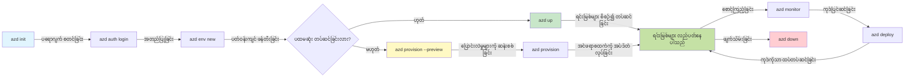
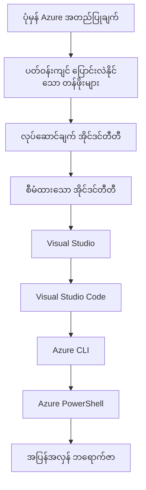

# AZD Basics - Understanding Azure Developer CLI

# AZD Basics - Core Concepts and Fundamentals

**Chapter Navigation:**
- **📚 Course Home**: [AZD For Beginners](../../README.md)
- **📖 Current Chapter**: Chapter 1 - Foundation & Quick Start
- **⬅️ Previous**: [Course Overview](../../README.md#-chapter-1-foundation--quick-start)
- **➡️ Next**: [Installation & Setup](installation.md)
- **🚀 Next Chapter**: [Chapter 2: AI-First Development](../chapter-02-ai-development/microsoft-foundry-integration.md)

## Introduction

ဤသင်ခန်းစာသည် Azure Developer CLI (azd) ကိုမိတ်ဆက်ပေးသည်။ azd သည် သင့်ကို local development ကနေ Azure သို့ deployment အထိ လျင်မြန်စွာ ချီတက်နိုင်စေရန် အလိုက်အထောက် ပြုသည့် command-line အက်တူးလ်ဖြစ်သည်။ သင်သည် အခြေခံအယူအဆများ၊ အဓိက အင်္ဂါရပ်များကို သင်ယူပြီး azd သည် cloud-native application deployment ကို မည်သို့ လွယ်ကူစေသည်ကို နားလည်သွားပါလိမ့်မည်။

## Learning Goals

ဤသင်ခန်းစာအဆုံးသတ်ချိန်တွင် သင်သည်:
- Azure Developer CLI ဆိုတာဘာလဲ၊ ၎င်း၏ အဓိက ရည်ရွယ်ချက်များကို နားလည်ခြင်း
- template များ၊ environment များနှင့် service များ၏ အခြေခံ အယူအဆများကို သင်ယူခြင်း
- template-driven development နှင့် Infrastructure as Code အပါအဝင် အဓိက အင်္ဂါရပ်များကို ရှာဖွေခြင်း
- azd project အဖွဲ့စည်းနှင့် workflow ကို နားလည်ခြင်း
- သင့်ဖွံ့ဖြိုးရေးပတ်ဝန်းကျင်အတွက် azd ကို တပ်ဆင်၊ ပြင်ဆင်ရန် ပြင်ဆင်ထားခြင်း

## Learning Outcomes

ဤသင်ခန်းစာကို ပြီးမြောက်လျှင် သင်သည်စွမ်းရည်ရှိမည်:
- အခေတ်သစ် cloud ဖွံ့ဖြိုးရေး workflows တွင် azd ၏ အခန်းကဏ္ဍကို ရှင်းပြနိုင်သည်
- azd project အဖွဲ့အစည်း၏ အစိတ်အပိုင်းများကို ဖော်ထုတ်နိုင်သည်
- template များ၊ environment များနှင့် service များမှ မည်သို့ တွဲဖက်၍ အလုပ်လုပ်ကြောင်း ဆွေးနွေးနိုင်သည်
- azd နှင့် Infrastructure as Code ရဲ့ အကျိုးကျေးဇူးများကို နားလည်နိုင်သည်
- azd commands များနှင့် ၎င်းတို့၏ ရည်ရွယ်ချက်များကို မှတ်သားနိုင်သည်

## What is Azure Developer CLI (azd)?

Azure Developer CLI (azd) သည် local development ကနေ Azure သို့ deployment အထိ သင့်ခရီးကို မြန်ဆန်စေဖို့ ဖန်တီးထားသော command-line ကိရိယာတစ်ခုဖြစ်သည်။ ၎င်းသည် Azure ပေါ်တွင် cloud-native applications များကို တည်ဆောက်၊ ဖြန့်ချိ၊ စီမံခန့်ခွဲခြင်း လုပ်ငန်းစဉ်များကို လွယ်ကူစေသည်။

### What Can You Deploy with azd?

azd သည် အမျိုးမျိုးသော workloads များကို ထောက်ပံ့သည် — နောက်ထပ်ပေါင်းများစွာ ထည့်သွင်းလာနေဆဲ ဖြစ်သည်။ ယနေ့တွင် azd ဖြင့် deploy လုပ်နိုင်သည်မှာ-

| Workload Type | Examples | Same Workflow? |
|---------------|----------|----------------|
| **Traditional applications** | Web apps, REST APIs, static sites | ✅ `azd up` |
| **Services and microservices** | Container Apps, Function Apps, multi-service backends | ✅ `azd up` |
| **AI-powered applications** | Chat apps with Microsoft Foundry Models, RAG solutions with AI Search | ✅ `azd up` |
| **Intelligent agents** | Foundry-hosted agents, multi-agent orchestrations | ✅ `azd up` |

အဓိက အချက်မှာ **သင်ဘာကို deploy လုပ်နေသည်မဆို azd lifecycle သည် တစ်မျိုးတည်း မပြောင်းလဲပဲ ဆက်လက်ရှိနေသည်** ဆိုသည်မှာ ဖြစ်သည်။ သင် project ကို initialize ပြုလုပ်ပြီး infrastructure ကို provision လုပ်ကာ code ကို deploy ပြီး app ကို မော်နီတာလုပ်၍ သုံးစမ်းပြီး သန့်ရှင်းမှုလုပ်ဆောင်သည့်အထိ ဆိုင်းငံ့ချက်မရှိပဲ လုပ်ဆောင်သည် — ၎င်းသည် website ရိုးရှင်းတစ်ခု ဖြစ်စေ သို့မဟုတ် နက်ရှိုင်းသော AI agent တစ်ခု ဖြစ်စေ အတူတူပဲ ဖြစ်သည်။

ဤဆက်လက်မှုမှာ ဒီဇိုင်းဖြင့် ရှိသည်။ azd သည် AI စွမ်းဆောင်ရည်များကို သင့် application သုံးစွဲနိုင်သော service အမျိုးအစားတစ်ခုအဖြစ် တွေးဆမြင်သည်၊ အခြားအရာတစ်ခုအဖြစ် မဟုတ်ပါ။ Microsoft Foundry Models ဖြင့် ထောက်ပံ့ထားသော chat endpoint တစ်ခုသည် azd ရဲ့မြင်ကွင်းအရ အခြား service တစ်ခုသာ ဖြစ်ပြီး configurable နှင့် deploy လုပ်ရန် ရိုးရိုး service တစ်ခုတည်းဖြစ်သည်။

### 🎯 Why Use AZD? A Real-World Comparison

ရိုးရှင်းသော web app တစ်ခုကို database နှင့် deploy လုပ်ရာတွင် နှိုင်းယှဉ်ကြည့်ကြပါစို့။

#### ❌ WITHOUT AZD: Manual Azure Deployment (30+ minutes)

```bash
# အဆင့် 1: အရင်းအမြစ် အုပ်စုတစ်ခု ဖန်တီးပါ
az group create --name myapp-rg --location eastus

# အဆင့် 2: App Service Plan တစ်ခု ဖန်တီးပါ
az appservice plan create --name myapp-plan \
  --resource-group myapp-rg \
  --sku B1 --is-linux

# အဆင့် 3: Web App တစ်ခု ဖန်တီးပါ
az webapp create --name myapp-web-unique123 \
  --resource-group myapp-rg \
  --plan myapp-plan \
  --runtime "NODE:18-lts"

# အဆင့် 4: Cosmos DB အကောင့် တစ်ခု ဖန်တီးပါ (10-15 မိနစ်)
az cosmosdb create --name myapp-cosmos-unique123 \
  --resource-group myapp-rg \
  --kind MongoDB

# အဆင့် 5: ဒေတာဘေ့စ် တစ်ခု ဖန်တီးပါ
az cosmosdb mongodb database create \
  --account-name myapp-cosmos-unique123 \
  --resource-group myapp-rg \
  --name tododb

# အဆင့် 6: collection တစ်ခု ဖန်တီးပါ
az cosmosdb mongodb collection create \
  --account-name myapp-cosmos-unique123 \
  --resource-group myapp-rg \
  --database-name tododb \
  --name todos

# အဆင့် 7: connection string ကို ရယူပါ
CONN_STR=$(az cosmosdb keys list \
  --name myapp-cosmos-unique123 \
  --resource-group myapp-rg \
  --type connection-strings \
  --query "connectionStrings[0].connectionString" -o tsv)

# အဆင့် 8: app settings ကို ပြင်ဆင်ပါ
az webapp config appsettings set \
  --name myapp-web-unique123 \
  --resource-group myapp-rg \
  --settings MONGODB_URI="$CONN_STR"

# အဆင့် 9: မှတ်တမ်းတင်ခြင်းကို ဖွင့်ပါ
az webapp log config --name myapp-web-unique123 \
  --resource-group myapp-rg \
  --application-logging filesystem \
  --detailed-error-messages true

# အဆင့် 10: Application Insights ကို တပ်ဆင်ပါ
az monitor app-insights component create \
  --app myapp-insights \
  --location eastus \
  --resource-group myapp-rg

# အဆင့် 11: App Insights ကို Web App နှင့် ချိတ်ဆက်ပါ
INSTRUMENTATION_KEY=$(az monitor app-insights component show \
  --app myapp-insights \
  --resource-group myapp-rg \
  --query "instrumentationKey" -o tsv)

az webapp config appsettings set \
  --name myapp-web-unique123 \
  --resource-group myapp-rg \
  --settings APPINSIGHTS_INSTRUMENTATIONKEY="$INSTRUMENTATION_KEY"

# အဆင့် 12: ကိုယ့်စက်ပေါ်တွင် အက်ပ်ကို ဆောက်လုပ်ပါ
npm install
npm run build

# အဆင့် 13: တပ်ဆင်ရေး ပက်ကေ့ခ်် တစ်ခု ဖန်တီးပါ
zip -r app.zip . -x "*.git*" "node_modules/*"

# အဆင့် 14: အက်ပ်ကို တပ်ဆင်ပါ
az webapp deployment source config-zip \
  --resource-group myapp-rg \
  --name myapp-web-unique123 \
  --src app.zip

# အဆင့် 15: စောင့်ပြီး အလုပ်ဖြစ်ပါစေဟု ဆုတောင်းပါ 🙏
# (အလိုအလျောက် စစ်ဆေးမှု မရှိပါ၊ လက်ဖြင့် စမ်းသပ်ရန် လိုအပ်သည်)
```

**Problems:**
- ❌ 15+ commands ကို မှတ်ထားပြီး အစဉ်လိုက် ဆောင်ရန် လိုအပ်သည်
- ❌ 30-45 မိနစ် တောင် လက်ဖြင့် အလုပ်လုပ်ရသည်
- ❌ အမှားလုပ်လွယ် (စာလုံးမှား၊ မှားသော ပါရာမီတာ)
- ❌ Connection strings များ သတ်မှတ်ချက်မှတ်တမ်းတွင် ထိတွေ့လွယ်
- ❌ တစုံတယ့် မအောင်မြင်ပါက 자동 rollback မရှိ
- ❌ အဖွဲ့ဝင်များအတွက် ပြန်လည်ထပ်လုပ်ရခက်
- ❌ တစ်ခါတိုင်းကွဲပြားသည် (ပြန်လည်ထပ်လုပ်၍ မရနိုင်)

#### ✅ WITH AZD: Automated Deployment (5 commands, 10-15 minutes)

```bash
# အဆင့် 1: နမူနာမှ စတင် ပြုလုပ်ပါ
azd init --template todo-nodejs-mongo

# အဆင့် 2: အတည်ပြုပါ
azd auth login

# အဆင့် 3: ပတ်ဝန်းကျင် ဖန်တီးပါ
azd env new dev

# အဆင့် 4: ပြင်ဆင်ချက်များကို ကြိုကြည့်ပါ (ရွေးချယ်နိုင်သော်လည်း အကြံပြုပါသည်)
azd provision --preview

# အဆင့် 5: အားလုံးကို ဖြန့်ချိပါ
azd up

# ✨ ပြီးပါပြီ! အားလုံးကို ဖြန့်ချိပြီး၊ ပြင်ဆင်ပြီး၊ စောင့်ကြည့်ထားပါသည်
```

**Benefits:**
- ✅ **5 commands** နှင့် 15+ လက်ဖြင့်လုပ်ရမည့် အဆင့်များကို နှိုင်းယှဉ်
- ✅ **10-15 minutes** စုစုပေါင်းအချိန် (အများစုသည် Azure ကို စောင့်ရသော အချိန်)
- ✅ **Zero errors** - 자동ပြုလုပ်ပြီး စမ်းသပ်ထားသည်
- ✅ **Secrets managed securely** မှတစ်ဆင့် Key Vault ကနေ အလုံအကြည့်စေ
- ✅ **Automatic rollback** အမှားဖြစ်ပါက ပြန်လည်လုပ်ဆောင်သည်
- ✅ **Fully reproducible** - တစ်ခါတိုင်း ရလဒ်တူညီသည်
- ✅ **Team-ready** - မည်သူမဆို တူညီသော commands ဖြင့် deploy လုပ်နိုင်သည်
- ✅ **Infrastructure as Code** - Bicep templates များကို version control ထားသည်
- ✅ **Built-in monitoring** - Application Insights ကို ကိုယ်တိုင်းပြင်ဆင်ပေးထားသည်

### 📊 Time & Error Reduction

| Metric | Manual Deployment | AZD Deployment | Improvement |
|:-------|:------------------|:---------------|:------------|
| **Commands** | 15+ | 5 | 67% fewer |
| **Time** | 30-45 min | 10-15 min | 60% faster |
| **Error Rate** | ~40% | <5% | 88% reduction |
| **Consistency** | Low (manual) | 100% (automated) | Perfect |
| **Team Onboarding** | 2-4 hours | 30 minutes | 75% faster |
| **Rollback Time** | 30+ min (manual) | 2 min (automated) | 93% faster |

## Core Concepts

### Templates
Templates သည် azd ၏ အခြေခံဖြစ်သည်။ ၎င်းတွင် ပါရှိသည် -
- **Application code** - သင့်ရဲ့ source code နှင့် အလိုအလျောက်လိုအပ်သည့် dependencies များ
- **Infrastructure definitions** - Bicep သို့မဟုတ် Terraform ဖြင့် ဖေါ်ပြထားသော Azure resources
- **Configuration files** - ဆက်တင်များနှင့် environment variables များ
- **Deployment scripts** - 자동화 deployment workflows များ

### Environments
Environments သည် deployment ရည်ရွယ်ချက်ကွဲပြားချက်များကို ကိုယ်စားပြုသည် -
- **Development** - စမ်းသပ်ခြင်းနှင့် ဖွံ့ဖြိုးရေးအတွက်
- **Staging** - Pre-production ပတ်ဝန်းကျင်
- **Production** - အသက်ဝင်သော production ပတ်ဝန်းကျင်

တစ်ခုချင်းစီ environment တစ်ခုစီမှာ မိမိ၏:
- Azure resource group
- Configuration settings
- Deployment state

### Services
Services များသည် သင့် application ၏ အစိတ်အပိုင်းများဖြစ်သည် -
- **Frontend** - Web applications, SPAs
- **Backend** - APIs, microservices
- **Database** - ဒေတာသိုလှောင်ရေးအဖြေများ
- **Storage** - ဖိုင်နှင့် blob ထိန်းသိမ်းမှု

## Key Features

### 1. Template-Driven Development
```bash
# ရရှိနိုင်သော ပုံစံများကို ကြည့်ရှုပါ
azd template list

# ပုံစံမှ အစပြုပါ
azd init --template <template-name>
```

### 2. Infrastructure as Code
- **Bicep** - Azure ၏ domain-specific language
- **Terraform** - Multi-cloud infrastructure ကိရိယာ
- **ARM Templates** - Azure Resource Manager templates

### 3. Integrated Workflows
```bash
# တပ်ဆင်ခြင်း လုပ်ငန်းစဉ် အပြည့်အစုံ
azd up            # Provision + Deploy — ပထမဆုံး စတင်ချိန်အတွက် လက်ဖြင့် မလိုဘဲ အလိုအလျောက် ပြုလုပ်ခြင်း

# 🧪 အသစ်: တပ်ဆင်ခြင်းမပြုမီ အောက်ခံအဆောက်အအုံ ပြောင်းလဲမှုများကို ကြိုတင်ကြည့်ရန် (လုံခြုံ)
azd provision --preview    # ပြောင်းလဲမှု မလုပ်ဘဲ အောက်ခံအဆောက်အအုံ တပ်ဆင်မှုကို သရုပ်ဆောင် စမ်းသပ်ပါ

azd provision     # အောက်ခံအဆောက်အအုံကို အပ်ဒိတ်လုပ်လျင် Azure အရင်းအမြစ်များကို ဖန်တီးရန် ဒီကို အသုံးပြုပါ
azd deploy        # အက်ပလီကေးရှင်း ကုဒ်ကို တပ်ဆင်ရန် သို့မဟုတ် အပ်ဒိတ်ပြီးနောက် ထပ်မံ တပ်ဆင်ရန်
azd down          # ရင်းမြစ်များကို ရှင်းလင်းပါ
```

#### 🛡️ Safe Infrastructure Planning with Preview
`azd provision --preview` command သည် 안전한 deployment များအတွက် အရေးပါတဲ့ ကိရိယာတစ်ခုဖြစ်သည် -
- **Dry-run analysis** - ဘာတွေကို ဖန်တီးမည်၊ ပြင်ဆင်မည် သို့မဟုတ် ဖျက်မည်ဆိုတာ ပြသပေးသည်
- **Zero risk** - သင့် Azure ပတ်ဝန်းကျင်တွင် အမူအရာများမပြောင်းလဲပါ
- **Team collaboration** - Deployment မပြုလုပ်မီ preview ရလဒ်များကို မျှဝေပေးနိုင်သည်
- **Cost estimation** - အရင်းအမြစ်အသုံးစရိတ်ကို မျှဝေမီ နားလည်နိုင်ရန်

```bash
# ဥပမာ ကြိုတင် ကြည့်ရှု လုပ်ငန်းစဉ်
azd provision --preview           # ဘာတွေ ပြောင်းလဲမည်ကို ကြည့်ရှုပါ
# ထွက်ရလဒ်ကို ပြန်လည်သုံးသပ်ပြီး အဖွဲ့နှင့် ဆွေးနွေးပါ
azd provision                     # ယုံကြည်စိတ်ဖြင့် ပြောင်းလဲချက်များကို အကောင်အထည်ဖော်ပါ
```

### 📊 Visual: AZD Development Workflow


**Workflow Explanation:**
1. **Init** - template သုံး၍ သို့မဟုတ် project အသစ် ဖြင့် စတင်ပါ
2. **Auth** - Azure နှင့် authenticate လုပ်ပါ
3. **Environment** - သီးသန့် deployment environment တစ်ခု ဖန်တီးပါ
4. **Preview** - 🆕 အမြဲ preview လုပ်ပါ (infrastructure ပြောင်းလဲမှုများကို အရင်းအမြင်ကာကွယ်ရန်)
5. **Provision** - Azure resources များကို ဖန်တီး/အပ်ဒိတ် လုပ်ပါ
6. **Deploy** - သင့် application code ကို တင်ပို့ပါ
7. **Monitor** - application performance ကို စောင့်ကြည့်ပါ
8. **Iterate** - ပြင်ဆင်မှုများ ပြုလုပ်ပြီး code ကို ပြန်တင်ပါ
9. **Cleanup** - အလုပ်ပြီးသွားပါက resources များကို ဖယ်ရှားပါ

### 4. Environment Management
```bash
# ပတ်ဝန်းကျင်များ ဖန်တီးနှင့် စီမံခန့်ခွဲခြင်း
azd env new <environment-name>
azd env select <environment-name>
azd env list
```

### 5. Extensions and AI Commands

azd သည် core CLI အပြင် အကောင်းမြင်မှုများ ထည့်သွင်းရန် extension system ကို အသုံးပြုသည်။ ၎င်းသည် AI workloads များအတွက် အထူးသင့်တော်သည် -

```bash
# အသုံးပြုနိုင်သော တိုးချဲ့ချက်များကို စာရင်းပြပါ
azd extension list

# Foundry agents တိုးချဲ့ချက်ကို တပ်ဆင်ပါ
azd extension install azure.ai.agents

# manifest ဖိုင်မှ AI agent စီမံကိန်းကို စတင်ဖန်တီးပါ
azd ai agent init -m agent-manifest.yaml

# AI အကူအညီဖြင့် ဖွံ့ဖြိုးရေး (Alpha) အတွက် MCP ဆာဗာကို စတင်လည်ပတ်ပါ
azd mcp start
```

> Extensions များကို [Chapter 2: AI-First Development](../chapter-02-ai-development/agents.md) နှင့် [AZD AI CLI Commands](../chapter-08-production/production-ai-practices.md#azd-ai-cli-commands-and-extensions) ကို မှတ်တမ်းအရ အသေးစိတ် ဖော်ပြထားသည်။

## 📁 Project Structure

ပုံမှန် azd project ဖွဲ့စည်းပုံ -
```
my-app/
├── .azd/                    # azd configuration
│   └── config.json
├── .azure/                  # Azure deployment artifacts
├── .devcontainer/          # Development container config
├── .github/workflows/      # GitHub Actions
├── .vscode/               # VS Code settings
├── infra/                 # Infrastructure code
│   ├── main.bicep        # Main infrastructure template
│   ├── main.parameters.json
│   └── modules/          # Reusable modules
├── src/                  # Application source code
│   ├── api/             # Backend services
│   └── web/             # Frontend application
├── azure.yaml           # azd project configuration
└── README.md
```

## 🔧 Configuration Files

### azure.yaml
Project ၏ အဓိက configuration ဖိုင် -
```yaml
name: my-awesome-app
metadata:
  template: my-template@1.0.0

services:
  web:
    project: ./src/web
    language: js
    host: appservice
  api:
    project: ./src/api
    language: js
    host: appservice

hooks:
  preprovision:
    shell: pwsh
    run: echo "Preparing to provision..."
```

### .azure/config.json
Environment သီးသန့် configuration -
```json
{
  "version": 1,
  "defaultEnvironment": "dev",
  "environments": {
    "dev": {
      "subscriptionId": "your-subscription-id",
      "location": "eastus"
    }
  }
}
```

## 🎪 Common Workflows with Hands-On Exercises

> **💡 Learning Tip:** ဤလေ့ကျင့်ခန်းများကို အဆင့်လိုက်လိုက် လေ့ကျင့်ခြင်းအားဖြင့် AZD ကျွမ်းကျင်မှုများကို တိုးတက်အောင် ဆောက်လုပ်ပါ။

### 🎯 Exercise 1: Initialize Your First Project

**Goal:** AZD project တစ်ခု ဖန်တီးပြီး ၎င်း၏ ဖွဲ့စည်းပုံကို လေ့လာရန်

**Steps:**
```bash
# အတည်ပြုထားသော နမူနာကို အသုံးပြုပါ
azd init --template todo-nodejs-mongo

# ဖန်တီးထားသော ဖိုင်များကို စူးစမ်းကြည့်ပါ
ls -la  # ဖျောက်ထားသော ဖိုင်များပါ အပါအဝင် ဖိုင်အားလုံးကို ကြည့်ပါ

# ဖန်တီးထားသော အဓိက ဖိုင်များ:
# - azure.yaml (အဓိက ပြင်ဆင်ချက်)
# - infra/ (အောက်ခံပံ့ပိုးရေး ကုဒ်)
# - src/ (လျှောက်လွှာ ကုဒ်)
```

**✅ Success:** သင်မှာ azure.yaml, infra/, နှင့် src/ အင်္ကွန်းများ ရှိပြီ

---

### 🎯 Exercise 2: Deploy to Azure

**Goal:** အစမှ အဆုံး deployment ကို ပြီးမြောက်စေခြင်း

**Steps:**
```bash
# 1. အတည်ပြုခြင်း
az login && azd auth login

# 2. ပတ်ဝန်းကျင် ဖန်တီးခြင်း
azd env new dev
azd env set AZURE_LOCATION eastus

# 3. ပြောင်းလဲချက်များ ကြိုကြည့်ခြင်း (အကြံပြု)
azd provision --preview

# 4. အားလုံးကို တပ်ဆင်ခြင်း
azd up

# 5. တပ်ဆင်မှုကို အတည်ပြုခြင်း
azd show    # သင့်အက်ပ်၏ URL ကို ကြည့်ပါ
```

**Expected Time:** 10-15 minutes  
**✅ Success:** Application URL ကို browser တွင် ဖွင့်နိုင်သည်

---

### 🎯 Exercise 3: Multiple Environments

**Goal:** dev နှင့် staging သို့ deploy လုပ်ရန်

**Steps:**
```bash
# dev ရှိပြီးသားဖြစ်သည်၊ staging ကို ဖန်တီးပါ
azd env new staging
azd env set AZURE_LOCATION westus2
azd up

# သူတို့နှစ်ခုအကြား ပြောင်းရွှေ့ပါ
azd env list
azd env select dev
```

**✅ Success:** Azure Portal တွင် သီးသန့် resource group နှစ်ခု ရှိခြင်း

---

### 🛡️ Clean Slate: `azd down --force --purge`

လုံးဝ reset လုပ်လိုသောအခါ -

```bash
azd down --force --purge
```

**What it does:**
- `--force`: အတည်ပြုမေးခွန်းများ မရှိစေ
- `--purge`: သတ်မှတ်ထားသော local state နှင့် Azure resources အားလုံး ဖျက်ပစ်သည်

**Use when:**
- Deployment အလျှောက်တွင် မဟုတ်မဖြစ် ပြတ်တောက်သွားသည်
- Project များ ပြောင်းလဲချင်သည်
- သန့်ရှင်းသော စတင်မှု လိုအပ်သည်

---

## 🎪 Original Workflow Reference

### Starting a New Project
```bash
# နည်းလမ်း ၁: ရှိပြီးသား နမူနာကို အသုံးပြုပါ
azd init --template todo-nodejs-mongo

# နည်းလမ်း ၂: အစကနေ စတင်ပါ
azd init

# နည်းလမ်း ၃: လက်ရှိ ဖိုလ်ဒါကို အသုံးပြုပါ
azd init .
```

### Development Cycle
```bash
# ဖွံ့ဖြိုးရေး ပတ်ဝန်းကျင်ကို တပ်ဆင်ပါ
azd auth login
azd env new dev
azd env select dev

# အားလုံးကို ဖြန့်ချိပါ
azd up

# ပြင်ဆင်ချက်များ ပြုလုပ်ပြီး ထပ်မံ ဖြန့်ချိပါ
azd deploy

# အလုပ်ပြီးသွားလျှင် ရှင်းလင်းပါ
azd down --force --purge # Azure Developer CLI ထဲရှိ ကွန်မန့်တစ်ခုသည် သင့် ပတ်ဝန်းကျင်အတွက် "ပြင်းပြင်းထန်ထန် ပြန်လည်စတင်ခြင်း (hard reset)" ဖြစ်ပြီး — မအောင်မြင်သော deployment များကို ဖြေရှင်းခြင်း၊ အသုံးမပြန်ဘဲ ကျန်နေသော အရင်းအမြစ်များကို ရှင်းလင်းခြင်း သို့မဟုတ် အသစ်တင်ရန် အတွက် အသင့်ပြင်ဆင်ခြင်းတို့တွင် အထူးအသုံးဝင်သည်။
```

## Understanding `azd down --force --purge`
`azd down --force --purge` command သည် သင့် azd environment နှင့် ဆက်စပ်ထားသော resources များအားလုံးကို လုံးဝ ဖျက်သိမ်းရန် စွမ်းအားရှင်သန်သည့် နည်းလမ်းတစ်ခုဖြစ်သည်။ အောက်တွင် flag တစ်ခုချင်းစီ၏ အလုပ်လုပ်ပုံကို ဖော်ပြပါသည်။
```
--force
```
- Skips confirmation prompts.
- Automation သို့မဟုတ် scripting အတွက် manual input မလိုအပ်သောနေရာများတွင် အသုံးဝင်သည်။
- CLI မှ မတည်ငြိမ်မှုများ တွေ့ရှိခဲ့ပါကပါ ထိန်းချုပ်မှုမရှိဘဲ teardown ဆက်လက်လုပ်ဆောင်နိုင်စေသည်။

```
--purge
```
Deletes **all associated metadata**, including:
Environment state
Local `.azure` folder
Cached deployment info
Prevents azd from "remembering" previous deployments, which can cause issues like mismatched resource groups or stale registry references.


### Why use both?
`azd up` အပြင် lingering state သို့မဟုတ် အပိုင်းပိုင်း deployment များကြောင့် ပြဿနာတွေ့ခဲ့ပါက ဤပေါင်းစပ်မှုက သန့်ရှင်းသော စတေ့ နှင့် ရရှိစေပါသည်။

အထူးသဖြင့် Azure portal တွင် manual resource ဖျက်ပစ်ပြီးနောက် သို့မဟုတ် template များ၊ environments များ သို့မဟုတ် resource group name စည်းမျဉ်းများ ပြောင်းလဲချိန်များတွင် အသုံးဝင်ပါသည်။

### Managing Multiple Environments
```bash
# စမ်းသပ်ပတ်ဝန်းကျင် ဖန်တီးပါ
azd env new staging
azd env select staging
azd up

# dev သို့ ပြန်ပြောင်းပါ
azd env select dev

# ပတ်ဝန်းကျင်များကို နှိုင်းယှဉ်ပါ
azd env list
```

## 🔐 Authentication and Credentials

Authentication ကို နားလည်ခြင်းသည် azd deployment များအောင်မြင်အောင် အရေးကြီးသည်။ Azure သည် အမျိုးမျိုးသော authentication နည်းလမ်းများကို အသုံးပြုသည်၊ azd သည် အခြား Azure ကိရိယာများတွင် သုံးသည့် credential chain ကို အသုံးပြုသည်။

### Azure CLI Authentication (`az login`)

azd ကို အသုံးပြုမီ သင်သည် Azure နှင့် authenticate လုပ်ထားရမည်။ အများဆုံး အသုံးများသော နည်းလမ်းမှာ Azure CLI ကို အသုံးပြုနည်းဖြစ်သည် -

```bash
# အပြန်လှန် လက်မှတ်ထိုးဝင်ခြင်း (ဘရောက်ဇာကို ဖွင့်မည်)
az login

# သတ်မှတ်ထားသော tenant ဖြင့် လက်မှတ်ထိုးဝင်ခြင်း
az login --tenant <tenant-id>

# service principal ဖြင့် လက်မှတ်ထိုးဝင်ခြင်း
az login --service-principal -u <app-id> -p <password> --tenant <tenant-id>

# လက်ရှိ လက်မှတ်ထိုးဝင်မှု အခြေအနေကို စစ်ဆေးရန်
az account show

# ရနိုင်သော subscription များကို စာရင်းပြရန်
az account list --output table

# ပုံမှန် subscription ကို သတ်မှတ်ရန်
az account set --subscription <subscription-id>
```

### Authentication Flow
1. **Interactive Login**: သင်၏ default browser ကို ဖွင့်၍ authentication ပြုလုပ်စေခြင်း
2. **Device Code Flow**: browser ဝင်မရသော ပတ်ဝန်းကျင်များအတွက်
3. **Service Principal**: automation နှင့် CI/CD အခြေအနေများအတွက်
4. **Managed Identity**: Azure ပေါ်တွင် host ဖြစ်သော applications များအတွက်

### DefaultAzureCredential Chain

`DefaultAzureCredential` သည် အရင်းအမြစ် credential များကို သတ်မှတ်အဆင့်လိုက် စမ်းသပ်ပေးသော စုစုပေါင်း authentication အတွေ့အကြုံကို လွယ်ကူစေသော credential type တစ်ခုဖြစ်သည်။

#### Credential Chain Order

#### 1. Environment Variables
```bash
# service principal အတွက် ပတ်ဝန်းကျင် တန်ဖိုးများကို သတ်မှတ်ပါ
export AZURE_CLIENT_ID="<app-id>"
export AZURE_CLIENT_SECRET="<password>"
export AZURE_TENANT_ID="<tenant-id>"
```

#### 2. Workload Identity (Kubernetes/GitHub Actions)
အောက်ပါနေရာများတွင် အလိုအလျောက် အသုံးပြုသည် -
- Azure Kubernetes Service (AKS) နှင့် Workload Identity
- GitHub Actions တွင် OIDC federation ဖြင့်
- အခြား federated identity အခြေအနေများ

#### 3. Managed Identity
Azure resources များအတွက် -
- Virtual Machines
- App Service
- Azure Functions
- Container Instances

```bash
# managed identity ဖြင့် Azure အရင်းအမြစ်ပေါ်တွင် လည်ပတ်နေကြောင်း စစ်ပါ
az account show --query "user.type" --output tsv
# managed identity ကို အသုံးပြုနေပါက "servicePrincipal" ကို ပြန်ပေးမည်
```

#### 4. Developer Tools Integration
- **Visual Studio**: sign-in လုပ်ထားသော အကောင့်ကို အလိုအလျောက် အသုံးပြုသည်
- **VS Code**: Azure Account extension ၏ credentials ကို အသုံးပြုသည်
- **Azure CLI**: `az login` credentials ကို အသုံးပြုသည် (local development အတွက် အများဆုံး အသုံးဝင်သည်)

### AZD Authentication Setup

```bash
# နည်း 1: Azure CLI ကို အသုံးပြုပါ (ဖွံ့ဖြိုးရေးအတွက် အကြံပြုသည်)
az login
azd auth login  # ရှိပြီးသား Azure CLI အချက်အလက်များကို အသုံးပြုသည်

# နည်း 2: azd ဖြင့် တိုက်ရိုက် အတည်ပြုခြင်း
azd auth login --use-device-code  # GUI မရှိသော ပတ်ဝန်းကျင်များအတွက်

# နည်း 3: အတည်ပြုမှု အခြေအနေကို စစ်ဆေးပါ
azd auth login --check-status

# နည်း 4: အကောင့်ထွက်ပြီး ပြန်လည်အတည်ပြုပါ
azd auth logout
azd auth login
```

### Authentication Best Practices

#### For Local Development
```bash
# 1. Azure CLI ဖြင့် လော့ဂ်အင် ဝင်ပါ
az login

# 2. မှန်ကန်သော subscription ကို စစ်ဆေးပါ
az account show
az account set --subscription "Your Subscription Name"

# 3. ရှိပြီးသား credentials များဖြင့် azd ကို အသုံးပြုပါ
azd auth login
```

#### For CI/CD Pipelines
```yaml
# GitHub Actions example
- name: Azure Login
  uses: azure/login@v1
  with:
    creds: ${{ secrets.AZURE_CREDENTIALS }}

- name: Deploy with azd
  run: |
    azd auth login --client-id ${{ secrets.AZURE_CLIENT_ID }} \
                    --client-secret ${{ secrets.AZURE_CLIENT_SECRET }} \
                    --tenant-id ${{ secrets.AZURE_TENANT_ID }}
    azd up --no-prompt
```

#### For Production Environments
- Azure resources တွင် ရှိစဉ် **Managed Identity** ကို အသုံးပြုပါ
- Automation အခြေအနေများအတွက် **Service Principal** ကို အသုံးပြုပါ
- credentials များကို code သို့ configuration ဖိုင်များတွင် မသိမ်းထားပါနဲ့
- အလွန်လျှို့ဝှက်သော configuration များအတွက် **Azure Key Vault** ကို အသုံးပြုပါ

### Common Authentication Issues and Solutions

#### Issue: "No subscription found"
```bash
# ဖြေရှင်းချက်: ပုံမှန် စာရင်းသွင်းမှုကို သတ်မှတ်ပါ
az account list --output table
az account set --subscription "<subscription-id>"
azd env set AZURE_SUBSCRIPTION_ID "<subscription-id>"
```

#### Issue: "Insufficient permissions"
```bash
# ဖြေရှင်းချက်: လိုအပ်သော အခန်းကဏ္ဍများကို စစ်ဆေး၍ သတ်မှတ်ပါ
az role assignment list --assignee $(az account show --query user.name --output tsv)

# ပုံမှန်လိုအပ်သော အခန်းကဏ္ဍများ:
# - ထောက်ပံ့သူ (အရင်းအမြစ် စီမံခန့်ခွဲမှုအတွက်)
# - အသုံးပြုခွင့် အုပ်ချုပ်သူ (ခန်းကဏ္ဍ သတ်မှတ်ရာအတွက်)
```

#### Issue: "Token expired"
```bash
# ဖြေရှင်းချက်: ပြန်လည်အတည်ပြုပါ
az logout
az login
azd auth logout
azd auth login
```

### Authentication in Different Scenarios

#### Local Development
```bash
# ကိုယ်ပိုင် ဖွံ့ဖြိုးရေး အကောင့်
az login
azd auth login
```

#### Team Development
```bash
# အဖွဲ့အစည်းအတွက် သီးသန့် တီနန်ကို အသုံးပြုပါ
az login --tenant contoso.onmicrosoft.com
azd auth login
```

#### Multi-tenant Scenarios
```bash
# ငှားရမ်းသူများအကြား ပြောင်းရန်
az login --tenant tenant1.onmicrosoft.com
# ငှားရမ်းသူ 1 သို့ ဖြန့်ချိမည်
azd up

az login --tenant tenant2.onmicrosoft.com  
# ငှားရမ်းသူ 2 သို့ ဖြန့်ချိမည်
azd up
```

### Security Considerations
1. **လက်မှတ် သိမ်းဆည်းခြင်း**: လျှို့ဝှက်အချက်အလက်များကို အရင်းအမြစ်ကုဒ်တွင် မသိမ်းဆည်းရ။
2. **ခွင့်အကန့်အသတ်**: service principals များအတွက် အနည်းဆုံးခွင့်အာဏာ မူဝါဒကို အသုံးပြုပါ
3. **Token ပြန်လှည့်ခြင်း**: service principal secret များကို ပုံမှန် ပြောင်းလဲပါ
4. **စစ်ဆေး မှတ်တမ်း**: authentication နှင့် deployment လှုပ်ရှားမှုများကို စောင့်ကြည့် ထိန်းချုပ်ပါ
5. **ကွန်ယက် လုံခြုံရေး**: အလတ်စားဖြစ်နိုင်သမျှ private endpoints ကို အသုံးပြုပါ

### အတည်ပြုခြင်းဆိုင်ရာ ပြဿနာရှာဖွေခြင်း

```bash
# အတည်ပြုခြင်းဆိုင်ရာ ပြဿနာများကို ရှာဖော်ပြင်ဆင်ခြင်း
azd auth login --check-status
az account show
az account get-access-token

# ပုံမှန် ဆန်းစစ်ရေး အမိန့်များ
whoami                          # လက်ရှိ အသုံးပြုသူ၏ အခြေအနေ
az ad signed-in-user show      # Azure AD အသုံးပြုသူ အသေးစိတ်
az group list                  # အရင်းအမြစ် ဝင်ရောက်ခွင့် စမ်းသပ်ခြင်း
```

## `azd down --force --purge` ကို နားလည်ခြင်း

### ရှာဖွေခြင်း
```bash
azd template list              # နမူနာများကို ကြည့်ရှု
azd template show <template>   # နမူနာ အသေးစိတ်
azd init --help               # စတင်ခြင်း ရွေးချယ်စရာများ
```

### ပရောဂျက် စီမံခန့်ခွဲမှု
```bash
azd show                     # ပရောဂျက် အကျဉ်းချုပ်
azd env show                 # လက်ရှိ ပတ်ဝန်းကျင်
azd config list             # ဖွဲ့စည်းမှုဆိုင်ရာ ဆက်တင်များ
```

### စောင့်ကြည့်ခြင်း
```bash
azd monitor                  # Azure portal တွင် Monitoring ကို ဖွင့်ပါ
azd monitor --logs           # အက်ပလီကေးရှင်းလော့ဂ်များကို ကြည့်ပါ
azd monitor --live           # တိုက်ရိုက် မက်ထရစ်များကို ကြည့်ပါ
azd pipeline config          # CI/CD ကို တပ်ဆင်ပါ
```

## အကောင်းဆုံး လေ့ကျင့်မှုများ

### 1. အဓိပ္ပါယ်ရသော နာမည်များကို အသုံးပြုပါ
```bash
# ကောင်း
azd env new production-east
azd init --template web-app-secure

# ရှောင်ကြဉ်ပါ
azd env new env1
azd init --template template1
```

### 2. Template များကို အကျိုးရှိစွာ အသုံးချပါ
- ရှိပြီးသား ပုံစံများဖြင့် စတင်ပါ
- သင့်လိုအပ်ချက်အတိုင်း ကိုက်ညီအောင် တည်းဖြတ်ပါ
- ကိုယ့်အဖွဲ့အစည်းအတွက် ထပ်မံအသုံးပြုနိုင်သော template များ ဖန်တီးပါ

### 3. ပတ်ဝန်းကျင် သီးခြားခြင်း
- dev/staging/prod အတွက် သီးခြားသော ပတ်ဝန်းကျင်များကို အသုံးပြုပါ
- ကိုယ့်ကွန်ပျူတာမှ တိုက်ရိုက် production သို့ deploy မပြုလုပ်ပါနှင့်
- production deployment များအတွက် CI/CD pipelines ကို အသုံးပြုပါ

### 4. ဖွဲ့စည်းပုံ စီမံခန့်ခွဲမှု
- လျှို့ဝှက်ဒေတာများအတွက် environment variables ကို အသုံးပြုပါ
- configuration များကို version control မှာ သိမ်းဆည်းထားပါ
- ပတ်ဝန်းကျင်အလိုက် သတ်မှတ်ချက်များကို စာရွက်တင်ထားပါ

## သင်ယူမှု တိုးတက်မှု အဆင့်

### စတင်သူများ (အပတ် 1-2)
1. azd ကို တပ်ဆင်ပြီး အတည်ပြုပါ
2. ရိုးရှင်းသည့် template တစ်ခုကို deploy ပြုလုပ်ပါ
3. ပရောဂျက် ဖွဲ့စည်းပုံကို နားလည်ပါ
4. အခြေခံ command များ (up, down, deploy) ကို လေ့လာပါ

### အလယ်အလတ် (အပတ် 3-4)
1. Template များကို ကိုက်ညီအောင် ပြင်ဆင်ပါ
2. ပတ်ဝန်းကျင်များစွာ ကို စီမံခန့်ခွဲပါ
3. အင်ဖရာစထက် ကုဒ်ကို နားလည်ပါ
4. CI/CD pipelines များ တပ်ဆင်ပါ

### အဆင့်မြင့် (အပတ် 5+)
1. custom template များ ဖန်တီးပါ
2. အဆင့်မြင့် အင်ဖရာ စနစ်ပုံစံများ
3. အမျိုးမျိုးဒေသ ဆိုင်ရာ deployments
4. အဖွဲ့အစည်းအဆင့် ဖွဲ့စည်းမှုများ

## နောက်တစ်ဆင့်များ

**📖 ဆက်လက် Chapter 1 သင်ယူရန်:**
- [Installation & Setup](installation.md) - azd ကို တပ်ဆင်ပြီး ဖွဲ့စည်းထားပါ
- [Your First Project](first-project.md) - လက်တွေ့ လေ့ကျင့်ခန်းကို ပြီးမြောက်ပါ
- [Configuration Guide](configuration.md) - အဆင့်မြင့် ဖွဲ့စည်းမှု ရွေးချယ်စရာများ

**🎯 နောက်အခန်းအတွက် အဆင်သင့်သလား?**
- [Chapter 2: AI-First Development](../chapter-02-ai-development/microsoft-foundry-integration.md) - AI အက်ပလီကေးရှင်းများ တည်ဆောက်စတင်ပါ

## ထပ်မံ အရင်းအမြစ်များ

- [Azure Developer CLI Overview](https://learn.microsoft.com/en-us/azure/developer/azure-developer-cli/)
- [Template Gallery](https://azure.github.io/awesome-azd/)
- [Community Samples](https://github.com/Azure-Samples)

---

## 🙋 မေးလေ့ရှိသော မေးခွန်းများ

### ယေဘုယျ မေးခွန်းများ

**Q: AZD နှင့် Azure CLI အကြား ကွာခြားချက် ဘာလဲ?**

A: Azure CLI (`az`) သည် တစ်ခုချင်း Azure resource များကို စီမံရန် အသုံးပြုသည်။ AZD (`azd`) သည် အက်ပလီကေးရှင်းအပြည့်ကို စီမံရန် အသုံးပြုသည်။

```bash
# Azure CLI - အနိမ့်အဆင့် အရင်းအမြစ် စီမံခန့်ခွဲမှု
az webapp create --name myapp --resource-group rg
az sql server create --name myserver --resource-group rg
# ...နောက်ထပ် အမိန့်များ များစွာ လိုအပ်သည်

# AZD - အက်ပလီကေးရှင်းအဆင့် စီမံခန့်ခွဲမှု
azd up  # လုံးဝ အက်ပ်ကို အရင်းအမြစ်များအားလုံးနှင့်အတူ တပ်ဆင်သည်
```

**ဤအတိုင်း စဉ်းစားပါ။**
- `az` = တစ်ခုချင်း Lego အပိုင်းများအပေါ် မျက်နှာစာလုပ်ဆောင်ခြင်း
- `azd` = ပြည့်စုံသော Lego စုံအစုံနှင့် အလုပ်လုပ်ခြင်း

---

**Q: AZD ကို အသုံးပြုရန် Bicep သို့မဟုတ် Terraform ကို သိထားဖို့ လိုအပ်ပါသလား?**

A: မလိုပါ! Template များဖြင့် စတင်ပါ။
```bash
# ရှိပြီးသား template ကို အသုံးပြုပါ - IaC အကြောင်းကျွမ်းကျင်မှု မလိုအပ်ပါ
azd init --template todo-nodejs-mongo
azd up
```

နောက်ပိုင်း Bicep ကို လေ့လာ၍ အင်ဖရာစထက်ကို ကိုက်ညီအောင် ပြင်ဆင်နိုင်သည်။ Template များမှာ လေ့လာရန် အသုံးဝင်သော လက်တွေ့ ဥပမာများကို ပေးသည်။

---

**Q: AZD template များကို အလုပ်လုပ်ရန် ငွေဘယ်လောက်ကုန်လဲ?**

A: ကုန်ကျစရိတ်များသည် template အလိုက် မတူပါ။ အများစု ဖွံ့ဖြိုးရေး template များမှာ $50-150/လ ပတ်လမ်းအတွင်း ကုန်ကျနိုင်သည်။
```bash
# တပ်ဆင်မီ ကုန်ကျစရိတ်များကို ကြိုကြည့်ပါ
azd provision --preview

# အသုံးမပြုသောအခါ အမြဲ ရှင်းလင်းပါ
azd down --force --purge  # အရင်းအမြစ်အားလုံးကို ဖယ်ရှားသည်
```

**အကြံပြုချက်:** ရနိုင်ပါက အခမဲ့ tier များကို အသုံးပြုပါ။
- App Service: F1 (Free) tier
- Microsoft Foundry Models: Azure OpenAI 50,000 tokens/month free
- Cosmos DB: 1000 RU/s free tier

---

**Q: AZD ကို ရှိပြီးသား Azure resource များနှင့် အသုံးပြုနိုင်မလား?**

A: ဟုတ်ကဲ့၊ သို့သော် စတင်အသစ်ဖန်တီးခြင်းက ပိုမိုလွယ်ကူပါသည်။ AZD သည် အကောင်းဆုံး အလုပ်လုပ်မည့်အချိန်မှာ ရင်းမြစ်များ၏ တဝိုက်ဘက် (full lifecycle) ကို စီမံရသည်။ ရှိပြီးသား resources များအတွက်:
```bash
# ရွေးချယ်ချက် ၁: ရှိပြီးသား အရင်းအမြစ်များကို သွင်းယူရန် (ကျွမ်းကျင်သူများအတွက်)
azd init
# ထို့နောက် infra/ ကို ရှိပြီးသား အရင်းအမြစ်များကို ရည်ညွှန်းအောင် ပြင်ဆင်ပါ

# ရွေးချယ်ချက် ၂: စတင်အသစ်လုပ်ရန် (အကြံပြု)
azd init --template matching-your-stack
azd up  # ပတ်ဝန်းကျင်အသစ်ကို ဖန်တီးသည်
```

---

**Q: ကျွန်တော့် project ကို အဖွဲ့၀င်တွေနှင့် မျှဝေချင်သည်။ ဘယ်လိုလုပ်မလဲ?**

A: AZD project ကို Git သို့ commit လုပ်ပါ (သို့သော် .azure folder ကို မထည့်ရပါ)။
```bash
# .gitignore တွင် ကြိုတင်ထည့်ထားပြီးသား
.azure/        # လျှို့ဝှက်ချက်များနှင့် ပတ်ဝန်းကျင်ဆိုင်ရာ ဒေတာများပါရှိသည်
*.env          # ပတ်ဝန်းကျင် အပြောင်းအလဲများ

# အဲဒီအချိန်၌ အဖွဲ့ဝင်များ:
git clone <your-repo>
azd auth login
azd env new <their-name>-dev
azd up
```

အားလုံးသည် တူညီသော templates များမှ တူညီသော infrastructure ကို ရရှိပါမည်။

---

### ပြဿနာရှာဖွေရေး မေးခွန်းများ

**Q: "azd up" အလယ်မှာ မအောင်မြင်ခဲ့ပါက ဘာလုပ်ရမလဲ?**

A: အမှားကို စစ်ဆေး၊ ပြင်ဆင်ပြီး ထပ်မံ ကြိုးစားပါ။
```bash
# အသေးစိတ် မှတ်တမ်းများကို ကြည့်ပါ
azd show

# ပုံမှန် ဖြေရှင်းနည်းများ:

# 1. ခွင့်ရပမာဏ ကျော်လွန်ပါက:
azd env set AZURE_LOCATION "westus2"  # ခြားနားသော ဒေသကို စမ်းကြည့်ပါ

# 2. အရင်းအမြစ်နာမည် ပဋိပက္ခရှိပါက:
azd down --force --purge  # အားလုံး ဖျက်ပြီး ပြန်စတင်ပါ
azd up  # ထပ်မံ ကြိုးစားပါ

# 3. အတည်ပြုခွင့် သက်တမ်းကုန်ဆုံးပါက:
az login
azd auth login
azd up
```

**အများဆုံး ဖြစ်ပွားသော ပြဿနာ:** မှားယွင်းသော Azure subscription ကို ရွေးချယ်ထားခြင်း
```bash
az account list --output table
az account set --subscription "<correct-subscription>"
```

---

**Q: reprovision မလုပ်ပဲ code ပြင်ဆင်မှုများကိုသာ deploy ဘာလုပ်မလဲ?**

A: `azd deploy` ကို `azd up` အစား အသုံးပြုပါ။
```bash
azd up          # ပထမဆုံး ကြိမ်: သတ်မှတ်ခြင်းနှင့် တပ်ဆင်ခြင်း (နှေး)

# ကုဒ်ကို ပြင်ဆင်ပါ...

azd deploy      # နောက်ထပ် ကြိမ်များ: တပ်ဆင်ခြင်းပဲ (မြန်)
```

အမြန်နှုန်း နှိုင်းယှဉ်ချက်:
- `azd up`: 10-15 မိနစ် (infrastructure ကို provision လုပ်သည်)
- `azd deploy`: 2-5 မိနစ် (code ဖိုင်များသာ)

---

**Q: infrastructure templates များကို ကိုယ့်လိုအပ်သလို ပြင်နိုင်မလား?**

A: ဟုတ်ကဲ့! `infra/` ထဲရှိ Bicep ဖိုင်များကို တည်းဖြတ်ပါ။
```bash
# azd init ပြီးနောက်
cd infra/
code main.bicep  # VS Code တွင် တည်းဖြတ်ပါ

# ပြင်ဆင်ချက်များကို ကြိုတင်ကြည့်ရှုပါ
azd provision --preview

# ပြင်ဆင်ချက်များကို အကောင်အထည်ဖော်ပါ
azd provision
```

**အကြံပြုချက်:** သေးငယ်စ၍ စတင်ပါ - အရင်ဆုံး SKU များကို ပြောင်းပါ။
```bicep
// infra/main.bicep
sku: {
  name: 'B1'  // Change to 'P1V2' for production
}
```

---

**Q: AZD ဖန်တီးထားသည့် အရာအားလုံးကို မည်သို့ ဖျက်မလဲ?**

A: တစ်ချက် command ဖြင့် အရင်းအမြစ်အားလုံးကို ဖျက်ပစ်နိုင်သည်။
```bash
azd down --force --purge

# ဤအရာများကို ဖျက်ပစ်မည်:
# - Azure အရင်းအမြစ်အားလုံး
# - အရင်းအမြစ်အုပ်စု
# - ဒေသခံ ပတ်ဝန်းကျင် အခြေအနေ
# - ကက်ရှ်ထားသော တပ်ဆင်မှု ဒေတာ
```

**အမြဲ run လုပ်သင့်သောအချိန်များ:**
- Template တစ်ခုကို စမ်းသပ်ပြီးဆုံးချိန်
- အခြား project သို့ ပြောင်းရွှေ့ချိန်
- အသစ်စတင်လိုချင်သောအခါ

**ကုန်ကျစရိတ် သိသိသာသာလျော့:** အသုံးမရှိသော resources များကို ဖျက်ခြင်း = $0 စရိတ်

---

**Q: Azure Portal တွင် အမှားဖြင့် resources များကို ဖျက်လိုက်ခဲ့ပါက?**

A: AZD အခြေအနေသည် မနှိုင်းယှဉ်သက်ဆိုင်နိုင်ပါသည်။ ပစ်မှတ် နောက်လွှတ်နည်းလမ်း:
```bash
# 1. ဒေသীয় အခြေအနေကို ဖျက်ပါ
azd down --force --purge

# 2. အသစ်မှ စတင်ပါ
azd up

# အခြားရွေးချယ်ချက်: AZD ကို ရှာဖွေပြီး ပြင်ဆင်စေပါ
azd provision  # မရှိသေးသော အရင်းအမြစ်များကို ဖန်တီးမည်
```

---

### အဆင့်မြင့် မေးခွန်းများ

**Q: CI/CD pipelines တွင် AZD ကို အသုံးပြုနိုင်မလား?**

A: ဟုတ်ကဲ့! GitHub Actions ဥပမာ:
```yaml
# .github/workflows/deploy.yml
name: Deploy with AZD

on:
  push:
    branches: [main]

jobs:
  deploy:
    runs-on: ubuntu-latest
    steps:
      - uses: actions/checkout@v2
      
      - name: Install azd
        run: curl -fsSL https://aka.ms/install-azd.sh | bash
      
      - name: Azure Login
        run: |
          azd auth login \
            --client-id ${{ secrets.AZURE_CLIENT_ID }} \
            --client-secret ${{ secrets.AZURE_CLIENT_SECRET }} \
            --tenant-id ${{ secrets.AZURE_TENANT_ID }}
      
      - name: Deploy
        run: azd up --no-prompt
```

---

**Q: လျှို့ဝှက်ချက်များနှင့် ထိခိုက်လွယ်သော ဒေတာများကို မည်သို့ ကိုင်တွယ်မလဲ?**

A: AZD သည် Azure Key Vault နှင့် အလိုအလျောက် ပေါင်းစည်းထားသည်။
```bash
# လျှို့ဝှက်ချက်များကို Key Vault တွင် သိမ်းဆည်းထားပြီး ကုဒ်ထဲတွင် မထားပါ
azd env set DATABASE_PASSWORD "$(openssl rand -base64 32)"

# AZD သည် အလိုအလျောက်:
# 1. Key Vault ကို ဖန်တီးသည်
# 2. လျှို့ဝှက်ချက်ကို သိမ်းဆည်းသည်
# 3. Managed Identity မှတဆင့် အက်ပ်အတွက် ဝင်ရောက်ခွင့် ပေးသည်
# 4. runtime တွင် ထည့်သွင်းပေးသည်
```

**မCommitလုပ်သင့်သောအရာများ:**
- `.azure/` folder (ပတ်ဝန်းကျင် ဒေတာကို ပါရှိသည်)
- `.env` files (ဒေသဆိုင်ရာ လျှို့ဝှက်ချက်များ)
- Connection strings

---

**Q: ဘာသာဒေသအနည်းငယ်သို့ deploy လုပ်နိုင်မလား?**

A: ဟုတ်ကဲ့၊ တစ်ဧဒေသချင်းစီအတွက် ပတ်ဝန်းကျင် ဖန်တီးပါ။
```bash
# အရှေ့ အမေရိကန် ပတ်ဝန်းကျင်
azd env new prod-eastus
azd env set AZURE_LOCATION eastus
azd up

# အနောက် ဥရောပ ပတ်ဝန်းကျင်
azd env new prod-westeurope
azd env set AZURE_LOCATION westeurope
azd up

# ပတ်ဝန်းကျင် တစ်ခုချင်းစီ သီးသန့် လွတ်လပ်သည်
azd env list
```

တကယ့် multi-region apps များအတွက်는 Bicep template များကို တည်းဖြတ်၍ တချိန်တည်းမှာ မျိုးစုံဒေသများသို့ deploy ပြုလုပ်ပါ။

---

**Q: ကူညီမှု လိုချင်ရင် မည်သည့်နေရာများတွင် အကူအညီရနိုင်မလဲ?**

1. **AZD စာရွက်စာတမ်း:** https://learn.microsoft.com/azure/developer/azure-developer-cli/
2. **GitHub Issues:** https://github.com/Azure/azure-dev/issues
3. **Discord:** [Azure Discord](https://discord.gg/microsoft-azure) - #azure-developer-cli channel
4. **Stack Overflow:** Tag `azure-developer-cli`
5. **ဤသင်တန်း:** [Troubleshooting Guide](../chapter-07-troubleshooting/common-issues.md)

**အကြံပြုချက်:** မေးခွန်းမေးရန် မတိုင်ခင် အောက်ပါ command ကို ပြေးပါ၊ ```bash
azd show       # လက်ရှိအခြေအနေကို ပြသည်
azd version    # သင့်ဗားရှင်းကို ပြသည်
```
မေးခွန်းထဲ၌ ဤအချက်အလက်များကို ထည့်သွင်းပါက အကူအညီရရှိရန် မြန်ဆန်ပါလိမ့်မည်။

---

## 🎓 နောက်တစ်ဆင့်များ

အခုသင်သည် AZD အခြေခံများကို နားလည်သွားပါပြီ။ သင့်လမ်းကို ရွေးချယ်ပါ။

### 🎯 စတင်သူများအတွက်:
1. **Next:** [Installation & Setup](installation.md) - သင့်ကွန်ပျူတာပေါ်တွင် AZD ကို တပ်ဆင်ပါ
2. **Then:** [Your First Project](first-project.md) - သင့်ပထမ အက်ပလီကေးရှင်းကို deploy ပြုလုပ်ပါ
3. **Practice:** သင်ခန်းစာရှိ လေ့ကျင့်ခန်း 3 ခုပြီးမြောက်ပါ

### 🚀 AI ဖွံ့ဖြိုးရေးသူများအတွက်:
1. **Skip to:** [Chapter 2: AI-First Development](../chapter-02-ai-development/microsoft-foundry-integration.md)
2. **Deploy:** `azd init --template get-started-with-ai-chat` ဖြင့် စတင်ပါ
3. **Learn:** deploy လုပ်ပြီးတည်ဆောက်ရင်း တတ်ကြွပါ

### 🏗️ အတွေ့အကြုံရှိသူ တီထွင်သူများအတွက်:
1. **Review:** [Configuration Guide](configuration.md) - အဆင့်မြင့် သတ်မှတ်ချက်များကို ပြန်လည်သုံးသပ်ပါ
2. **Explore:** [Infrastructure as Code](../chapter-04-infrastructure/provisioning.md) - Bicep အကြောင်း နက်ရှိုင်းစွာ လေ့လာပါ
3. **Build:** သင့် stack အတွက် custom template များ ဖန်တီးပါ

---

**အခန်း လမ်းညွှန်မှု:**
- **📚 သင်တန်း မူလစာမျက်နှာ**: [AZD For Beginners](../../README.md)
- **📖 လက်ရှိ အခန်း**: အခန်း 1 - အခြေခံနှင့် အမြန်စတင်မှု  
- **⬅️ အရင်အခန်း**: [Course Overview](../../README.md#-chapter-1-foundation--quick-start)
- **➡️ နောက်တစ်ခန်း**: [Installation & Setup](installation.md)
- **🚀 နောက်အခန်း**: [Chapter 2: AI-First Development](../chapter-02-ai-development/microsoft-foundry-integration.md)

---

<!-- CO-OP TRANSLATOR DISCLAIMER START -->
**တာဝန်ပယ်ကြေညာချက်**:
ဤစာရွက်စာတမ်းကို AI ဘာသာပြန်ဝန်ဆောင်မှု [Co-op Translator](https://github.com/Azure/co-op-translator) ဖြင့် ဘာသာပြန်ထားပါသည်။ ကျွန်ုပ်တို့သည် တိကျမှုပေါ်တွင် ကြိုးပမ်းသော်လည်း၊ အလိုအလျောက် ဘာသာပြန်ချက်များတွင် အမှားများ သို့မဟုတ် မမှန်ကန်မှုများ ပါဝင်နိုင်ကြောင်း ကျေးဇူးပြု၍ သတိပြုပါ။ မူလစာတမ်းကို မူလဘာသာဖြင့် အာဏာရှိသော ရင်းမြစ်အဖြစ် သတ်မှတ်စဉ်းစားရမည်။ အရေးကြီးသော အချက်အလက်များအတွက် လူ့ကျွမ်းကျင် ပရော်ဖက်ရှင်နယ် ဘာသာပြန်သူအား မပြောင်းလဲသင့်ပါ။ ဤဘာသာပြန်ချက်ကို အသုံးပြုခြင်းကြောင့် ဖြစ်ပေါ်လာနိုင်သည့် နားလည်မှုလွဲ သို့မဟုတ် မွားယွင်းမှုများအတွက် ကျွန်ုပ်တို့သည် တာဝန်မယူပါ။
<!-- CO-OP TRANSLATOR DISCLAIMER END -->