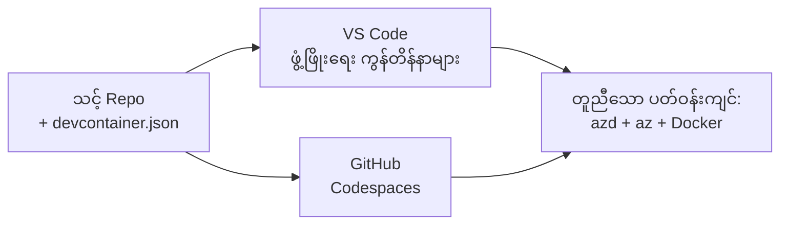

# azd အတွက် Dev Containers & GitHub Codespaces

**အခန်း လမ်းညွှန်:**
- **📚 Course Home**: [AZD စတင်သူများအတွက်](../../README.md)
- **📖 လက်ရှိ အခန်း**: အခန်း 1 - အခြေခံနှင့် အမြန်စတင်ရန်
- **⬅️ ယခင်**: [ကိုယ်ပိုင် အက်ပ် ယူပါ](bring-your-own-app.md)
- **🚀 နောက်တစ်ခန်း**: [အခန်း 2: AI-ပထမ ဦးစွာ ဖွံ့ဖြိုးရေး](../chapter-02-ai-development/README.md)

> 2026 ခုနှစ် ဇွန်တွင် `azd 1.25.6` နှင့် ကိုက်ညီမှု စစ်ဆေးထားသည်။

## မိတ်ဆက်

စက်တိုင်းတွင် azd၊ သင့်တော်သော ဘာသာစကား runtime၊ Docker နှင့် Azure CLI ကို တပ်ဆင်ရခြင်းမှာ အလုပ်ရှုပ်စရာ ဖြစ်ပြီး — "ကျွန်ုပ်၏ စက်ပေါ်မှာ အလုပ်လုပ်တယ်" လို့ ပြောတဲ့ သင်ခန်းစာတစ်ခုကို တခြားသူများ ဆောင်ရွက်ရာမှာ မအောင်မြင်ချိန်အများဆုံး အကြောင်းရင်းဖြစ်သည်။ တစ်ဖိုင်ထဲတွင် မိမိ၏ toolchain အားလုံးကို ဖော်ပြပေးခြင်းဖြင့် **dev container** က ဤပြဿနာကို ဖြေရှင်းပေးနိုင်သည်။ VS Code သို့မဟုတ် GitHub Codespaces တွင် ပရောဂျက်ကို ဖွင့်သည့် မည်သူမဆို အတိအကျ တူညီသည့် ပတ်ဝန်းကျင်ကို ရရှိမည်ဖြစ်ပြီး azd ကို မကြာမှီ ထည့်သွင်းပြီးဖြစ်သည်။ ဤသင်ခန်းစာတွင် သင့်သည် ထို dev container ကို မည်သို့ ထည့်သွင်းရမည်ကို ပြသပါသည်။

## သင်ယူရမည့် ပစ်မှတ်များ

- dev container ဆိုသည်မှာ ဘာလဲ၊ azd အတွက် မည်ကြောင့် အထောက်အကူဖြစ်ကြောင်း နားလည်စေမည်
- ပရောဂျက်တွင် အနည်းဆုံး `.devcontainer/devcontainer.json` ကို ထည့်သွင်းနိုင်မည်
- Dev Container *features* များမှတဆင့် azd၊ Azure CLI နှင့် Docker ကို ထည့်သွင်းနိုင်မည်
- ပရောဂျက်ကို GitHub Codespaces သို့မဟုတ် VS Code တွင် ဖွင့်နိုင်မည်

## သင်ယူပြီး ရရှိမည့် ရလဒ်များ

- azd ပရောဂျက်အတွက် `devcontainer.json` ကို ရေးသားနိုင်မည်
- လက်ဆောင်တပ်ဆင်မှုမလိုဘဲ azd နှင့် Azure ကိရိယာများကို ထည့်သွင်းနိုင်မည်
- container သို့ Codespace အတွင်းမှ `azd up` ကို အသုံးပြုနိုင်မည်

---

## Dev Container ဆိုတာဘာလဲ?

Dev container သည် သင့် repository တွင်ရှိသော `.devcontainer/devcontainer.json` ဖိုင်ဖြင့် သတ်မှတ်ထားသော Docker အခြေခံဖြစ်သော ဖွံ့ဖြိုးရေး ပတ်ဝန်းကျင်တစ်ခု ဖြစ်သည်။ ပရောဂျက်ကို ဖွင့်သောအခါ -

- **VS Code** (Dev Containers extension ဖြင့်) က ကွန်တိနာကို ဆောက်ပြီး ယင်းထဲသို့ တပ်ဆင် (attach) ပြုလုပ်သည်။
- **GitHub Codespaces** သည် တူညီသော ကွန်တိနာကို cloud တွင် ဆောက်ပြီး ဘရောက်ဇာပေါ်တွင် အလုပ်လုပ်သည့် တည်းဖြတ်ကိရိယာကို ပေးသည်။

မည်သည့်နည်းဖြင့်ဖြစ်စေ လှီးလျားအားလုံးသည် တူညီသော ကိရိယာများကို ရရှိကြမည် — "azd ကို ထည့်သွင်းထားပြီလား?" ဆိုပြီး ဖြေရှင်းရန် မလိုတော့ပါ။



---

## ခြေလှမ်း ၁: devcontainer ဖိုင်ကို ဖန်တီးပါ

ပရောဂျက်၏ root တွင် `.devcontainer/devcontainer.json` ဖိုင်ကို ဖန်တီးပါ:

```json
{
  "name": "azd-project",
  "image": "mcr.microsoft.com/devcontainers/base:bookworm",
  "features": {
    "ghcr.io/devcontainers/features/azure-cli:1": {},
    "ghcr.io/azure/azure-dev/azd:latest": {},
    "ghcr.io/devcontainers/features/docker-in-docker:2": {},
    "ghcr.io/devcontainers/features/node:1": {}
  },
  "customizations": {
    "vscode": {
      "extensions": [
        "ms-azuretools.azure-dev",
        "ms-azuretools.vscode-bicep"
      ]
    }
  },
  "forwardPorts": [3000],
  "postCreateCommand": "azd version"
}
```

What each part does:

| သော့ | ရည်ရွယ်ချက် |
|-----|---------|
| `image` | ကွန်တိနာအတွက် အခြေခံ OS |
| `features` | မျှင်ျမင်ရှိပြီးသား installer များ — ဤနေရာတွင်: Azure CLI, **azd**, Docker, နှင့် Node.js |
| `customizations.vscode.extensions` | azd နှင့် Bicep VS Code extensions များကို အလိုအလျောက် တပ်ဆင်ပေးသည် |
| `forwardPorts` | သင်၏ အက်ပ်၏ port ကို ဘရောက်ဇာတွင် ရရှိနိုင်အောင် ပြပေးသည် |
| `postCreateCommand` | ကွန်တိနာကို ဆောက်ပြီးနောက် တစ်ကြိမ်သာ ပြေးစေသည် (ဤနေရာတွင် စစ်ဆေးမှုတစ်ခု) |

> `ghcr.io/azure/azure-dev/azd:latest` feature သည် ကွန်တိနာအတွင်း azd ကို ရရှိစေရန် တရားဝင် နည်းလမ်းဖြစ်သည်။ ပြန်လည်ထပ်လုပ်နိုင်စေရန် သတ်မှတ်ထားသော ဗားရှင်းတစ်ခု (ဥပမာ `azd:1.25.6`) ကို pin လုပ်ပါ။

---

## ခြေလှမ်း ၂: Feature ကို သင့်အက်ပ်၏ ဘာသာစကားနှင့် ကိုက်ညီစေပါ

သင့်အက်ပ်အသုံးပြုသည့် ဘာသာစကားအတွက် `node` feature ကို အစားထိုးပါ:

```jsonc
// Python project
"ghcr.io/devcontainers/features/python:1": {},

// .NET project
"ghcr.io/devcontainers/features/dotnet:2": {},

// Java project
"ghcr.io/devcontainers/features/java:1": {},

// Go project
"ghcr.io/devcontainers/features/go:1": {}
```

သင်၏ `host` သည် `containerapp`, `aks`, သို့မဟုတ် ကွန်တိနာ image တစ်ခုကို ဆောက်ထုတ်သည့် အရာ မျိုးဖြစ်ပါက `docker-in-docker` ကို ထားပါ — azd သည် image များကို ဆောက်ပြီး push လုပ်ရန် Docker လိုအပ်ပါသည်။

---

## ခြေလှမ်း ၃: ဖွင့်ပါ

**In VS Code:**
1. **Dev Containers** extension ကို တပ်ဆင်ပါ။
2. ပရောဂျက် ဖိုလဒါကို ဖွင့်ပါ။
3. ပြသသောအခါ **Reopen in Container** ကို နှိပ်ပါ (သို့မဟုတ် *Dev Containers: Reopen in Container* ကို လက်ရှိထဲမှ ဆောင်ရွက်ပါ)။

**In GitHub Codespaces:**
1. repo ကို GitHub သို့ push လုပ်ပါ။
2. **Code → Codespaces → Create codespace on main** ကို နှိပ်ပါ။
3. ကွန်တိနာ ဆောက်ဆောင်ခြင်းကို စောင့်ပါ — terminal မှာ azd အသင့်ရှိနေပါလိမ့်မည်။

---

## ခြေလှမ်း ၄: ကွန်တိနာ အတွင်းမှ Deploy လုပ်ခြင်း

ကွန်တိနာတွင် azd ကို အကြို ထည့်ထားပြီးဖြစ်သောကြောင့် ပုံမှန် workflow သည် အလုပ်လုပ်ပါလိမ့်မည်။

```bash
azd auth login --use-device-code   # device code သုံးတာက Codespaces အတွင်း အဆင်ပြေပါတယ်
azd up
```

> **`--use-device-code` ကို ဘာကြောင့် အသုံးပြုသနည်း?** အဝေးမှ ကွန်တိနာ သို့ Codespace အတွင်း အလုပ်လုပ်နေသောအချိန်တွင် ပြန်လည် redirect ပြုလုပ်ရန် ဒေသခံ browser မရှိပါ — ထို့ကြောင့် device-code login သည် ယုံကြည်စိတ်ချရသော နည်းလမ်းဖြစ်သည်။ Sign-in ပြီးစီးရန် code ကို browser tab တစ်ခုထဲတွင် ကူးထည့်ရမည် ဖြစ်သည်။

---

## အချို့ ဖြစ်ပေါ်လိမ့်မည့် ပြဿနာများ

| ပြဿနာ | ဖြေရှင်းနည်း |
|---------|-----|
| `azd up` can't build an image | `docker-in-docker` feature ကို ထည့်ပါ |
| Codespaces တွင် browser ဖြင့် login ချို့ယွင်းသည် | `azd auth login --use-device-code` ကို အသုံးပြုပါ |
| အဖွဲ့ဝင်များအကြား ကိရိယာများ မတူညီသည် | feature ဗားရှင်းများကို pin ထားပါ (ဥပမာ `azd:1.25.6`) |
| အက်ပ်ကို browser တွင် မတွေ့နိုင်ပါ | `forwardPorts` ထဲသို့ port ကို ထည့်ပါ |

---

## အကျဉ်းချုံး

- Dev container တစ်ခုက azd toolchain ကို လူတိုင်းအတွက် ထပ်မံပြန်ဖန်တီးနိုင်အောင် လုပ်ပေးသည်။
- Dev Container *features* မှတဆင့် azd, Azure CLI နှင့် Docker ကို ထည့်ပါ။
- ဘာသာစကား feature ကို သင့်အက်ပ်နှင့် ကိုက်ညီစေပြီး container hosts များအတွက် `docker-in-docker` ကို ထားပါ။
- Codespaces အတွင်းတွင် အသုံးပြုနေစဉ် device-code login ကို အသုံးပြုပါ။

---

## 🔗 လမ်းညွှန်

| ဦးတည်ချက် | အရင်းအမြစ် |
|-----------|----------|
| **ယခင်** | [ကိုယ်ပိုင် အက်ပ် ယူပါ](bring-your-own-app.md) |
| **အခန်း မူလစာမျက်နှာ** | [အခန်း ၁ - အခြေခံနှင့် အမြန်စတင်ရန်](README.md) |
| **နောက်တစ်ခန်း** | [အခန်း ၂: AI-ပထမ ဦးစွာ ဖွံ့ဖြိုးရေး](../chapter-02-ai-development/README.md) |

## 📖 ဆက်စပ် အရင်းအမြစ်များ

- [တပ်ဆင်ခြင်းနှင့် ပြင်ဆင်ခြင်း](installation.md)
- [အမိန့် အကျဉ်းချုပ်](../../resources/cheat-sheet.md)
- [တရားဝင် Dev Containers သတ်မှတ်ချက်](https://containers.dev/)
- [azd Dev Container အင်္ဂါရပ်](https://github.com/Azure/azure-dev/tree/main/ext/devcontainer)

---

<!-- CO-OP TRANSLATOR DISCLAIMER START -->
**ပြောကြားချက်**
ဤစာတမ်းကို AI ဘာသာပြန်ဝန်ဆောင်မှု [Co-op Translator](https://github.com/Azure/co-op-translator) အသုံးပြု၍ ဘာသာပြန်ထားပါသည်။ ကျွန်ုပ်တို့သည် တိကျမှန်ကန်မှုအတွက် ကြိုးပမ်းနေသော်လည်း၊ စက်ကိရိယာဘာသာပြန်ခြင်းများတွင် အမှားများ သို့မဟုတ် မှားယွင်းချက်များ ပါဝင်နိုင်ကြောင်း သတိပြုပါရန် လိုအပ်ပါသည်။ မူလစာတမ်းကို မူရင်းဘာသာဖြင့်သာ ယုံကြည်စိတ်ချရသော အချက်အလက်အဖြစ် သတ်မှတ်သင့်သည်။ အရေးကြီးသည့် သတင်းအချက်အလက်များအတွက် ပရော်ဖက်ရှင်နယ် လူသားဘာသာပြန်သူဝန်ဆောင်မှုကို အကြံပြုပါသည်။ ဤဘာသာပြန်ချက်ကို အသုံးပြုခြင်းမှ ဖြစ်ပေါ်လာသော နားလည်မှုကွာခြားမှုများ သို့မဟုတ် မမှန်ကန်သော အသုံးပြုမှုများအတွက် ကျွန်ုပ်တို့ တာဝန်မခံပါ။
<!-- CO-OP TRANSLATOR DISCLAIMER END -->