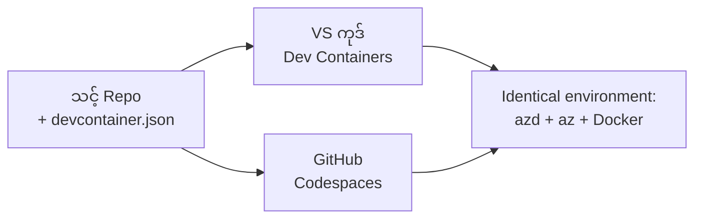

# azd အတွက် Dev Containers နှင့် GitHub Codespaces

**အခန်းကဏ္ဍ သွားကြည့်ရန်:**
- **📚 သင်တန်းမူလ**: [AZD ဦးစွာ သင်ယူသူများအတွက်](../../README.md)
- **📖 လက်ရှိ အခန်း**: အခန်း ၁ - အခြေခံနှင့် အမြန်သွားခြင်း
- **⬅️ ယခင်အခန်း**: [ကိုယ့်အပလီကေးရှင်းကိုယ်တိုင် ယူလာခြင်း](bring-your-own-app.md)
- **🚀 နောက်အခန်း**: [အခန်း ၂: AI- ပထမ ဦးဆောင်ဖွံ့ဖြိုးတိုးတတ်မှု](../chapter-02-ai-development/README.md)

> `azd 1.27.1` ဖြင့် ၂၀၂၆ ခုနှစ် ဇူလိုင်တွင် အတည်ပြုပြီး။

## နိဒါန်း

azd၊ သင့်လိုအပ်သည့် ဘာသာစကား runtime၊ Docker နှင့် Azure CLI တို့ကို တစ်စက်လုံးတွင် ထည့်သွင်းရတာဟာ အလုပ်နည်းလမ်းများမှ တစ်ခုဖြစ်ပြီး၊ "ကျွန်တော့်စက်မှာ အလုပ်လုပ်တယ်" ဆိုတဲ့ မဟာဗျူဟာဟာ တခြားသူများအတွက် မအောင်မြင်တာရဲ့ အဓိက အကြောင်းတစ်ခုဖြစ်ပါတယ်။ **dev container** ဆိုသည်မှာ သင်၏ကိရိယာစစ်မှန်မှု လုံးဝကို ဖိုင်တစ်ခုတည်းဖြင့် ဖော်ပြပေးခြင်းဖြစ်ပြီး၊ VS Code သို့မဟုတ် GitHub Codespaces မှာ ပရောဂျက်ကို ဖွင့်တဲ့ အသုံးပြုသူတိုင်းအတွက် azd ထည့်သွင်းပြီး တူညီသောပတ်ဝန်းကျင်ကို ရရှိစေပါသည်။ ဒီသင်ခန်းစာက တစ်ခုတည်း ထည့်သွင်းပုံကို ပြသပါမည်။

## သင်ယူရန်ရည်ရွယ်ချက်များ

ဒီသင်ခန်းစာကုန်သွားလျှင် သင်မည်သည်ကို ပြုလုပ်နိုင်မည်:
- Dev container ဆိုတာ ဘာလဲ၊ azd နှင့် ဘာကြောင့် အသုံးဝင်သလဲ ကွဲပြားစွာ နားလည်နိုင်မည်။
- ပရောဂျက်အတွက် အနည်းဆုံး `.devcontainer/devcontainer.json` ဖိုင်တစ်ခု ထည့်သွင်းမည်။
- Dev Container *features* များဖြင့် azd၊ Azure CLI နှင့် Docker ကို ပေါင်းထည့်မည်။
- GitHub Codespaces သို့ VS Code မှာ ပရောဂျက်ကို ဖွင့်မည်။

## သင်ယူပြီးရရှိမည့် ပစ္စည်းများ

ဒီသင်ခန်းစာကို ပြီးမြောက်ပြီးနောက် သင်လုပ်နိုင်မည့်အရာများ:
- azd ပရောဂျက်အတွက် `devcontainer.json` ဖိုင်ရေးဆွဲနိုင်မည်။
- သုံးစွဲသူအသုံးပြုသူ မတင်သွင်းဘဲ azd နှင့် Azure ကိရိယာများ ထည့်သွင်းနိုင်မည်။
- container ထဲမှ သို့ Codespace မှ `azd up` ကို ဖျော်ဖြေပြေးနိုင်မည်။

---

## Dev Container ဆိုတာ ဘာလဲ?

Dev container ဆိုသည်မှာ သင့် code repository အတွင်းရှိ `.devcontainer/devcontainer.json` ဖိုင်တစ်ခုဖြင့် သတ်မှတ်ထားသော Docker အခြေပြုဖွံ့ဖြိုးရေးပတ်ဝန်းကျင်ဖြစ်သည်။ ပရောဂျက်ကို ဖွင့်သောအခါ:

- **VS Code** (Dev Containers extension ဖြင့်) container ကို တည်ဆောက်ပြီး ဆက်သွယ်ပေးသည်။
- **GitHub Codespaces** မှ cloud တွင်တူညီသော container ကို တည်ဆောက်ပြီး browser-based အယ်ဒီတာ ပေးသည်။

ပြောလိုသောအတိုင်း သူတို႔လိုတူညီသော ကိရိယာတွေ ရရှိပါသည် - "azd ကို ထည့်သွင်းပြီလား?" ဆိုပြီး မရှာဖွေရေး။



---

## အဆင့် ၁: devcontainer ဖိုင် ဖန်တီးခြင်း

သင့်ပရောဂျက် root folder မှာ `.devcontainer/devcontainer.json` ဖိုင် ဖန်တီးပါ။

```json
{
  "name": "azd-project",
  "image": "mcr.microsoft.com/devcontainers/base:bookworm",
  "features": {
    "ghcr.io/devcontainers/features/azure-cli:1": {},
    "ghcr.io/azure/azure-dev/azd:latest": {},
    "ghcr.io/devcontainers/features/docker-in-docker:2": {},
    "ghcr.io/devcontainers/features/node:1": {}
  },
  "customizations": {
    "vscode": {
      "extensions": [
        "ms-azuretools.azure-dev",
        "ms-azuretools.vscode-bicep"
      ]
    }
  },
  "forwardPorts": [3000],
  "postCreateCommand": "azd version"
}
```

အစိတ်အပိုင်းတိုင်း၏ ရည်ရွယ်ချက်များ:

| Key | ရည်ရွယ်ချက် |
|-----|---------|
| `image` | container အတွက် အခြေခံ OS |
| `features` | အသေးစား installers များ - ဤနေရာတွင် Azure CLI၊ **azd**၊ Docker နှင့် Node.js ပါရှိသည် |
| `customizations.vscode.extensions` | azd နှင့် Bicep VS Code extensions များကို အလိုအလျောက် ထည့်သွင်းပေးသည် |
| `forwardPorts` | သင့်အပလီကေးရှင်း၏ port ကို browser တွင် ဖော်ပြပေးသည် |
| `postCreateCommand` | container တည်ဆောက်ပြီးပြီးနောက်တစ်ကြိမ် အလုပ်လုပ်စေသည် (ဤနေရာတွင် sanity check) |

> `ghcr.io/azure/azure-dev/azd:latest` feature သည် container တွင် azd ရရှိရန် တရားဝင်နည်းလမ်းဖြစ်သည်။ မည်သည့် version ကိုဖြစ်စေ သတ်မှတ်နိုင်သည် (ဥပမာ `azd:1.27.1`) သို့မဟုတ် အတည်ပြုနိုင်ရန်။

---

## အဆင့် ၂: သင့်အပလီကေးရှင်း ဘာသာစကားနှင့် feature ကို ကိုက်ညီစေပါ

သင့် app တွင် အသုံးပြုသည့် ဘာသာစကားအလိုက် `node` feature ကိုဖြူလို့ အစားထိုးပေးပါ:

```jsonc
// Python project
"ghcr.io/devcontainers/features/python:1": {},

// .NET project
"ghcr.io/devcontainers/features/dotnet:2": {},

// Java project
"ghcr.io/devcontainers/features/java:1": {},

// Go project
"ghcr.io/devcontainers/features/go:1": {}
```

`host` မှာ `containerapp`၊ `aks` သို့မဟုတ် container image တည်ဆောက်တဲ့ အရာဖြစ်လျှင် `docker-in-docker` ကို ထားပါ - azd သည် image ကို တည်ဆောက်ရန်နှင့် တင်ပို့ရန် Docker လိုအပ်သည်။

---

## အဆင့် ၃: ဖွင့်ကြည့်ပါ

**VS Code မှ:**
1. **Dev Containers** extension ကို ထည့်သွင်းပါ။
2. ပရောဂျက်ဖိုဒါကို ဖွင့်ပါ။
3. စာမျက်နှာပြန်ပိတ်လာမည်ဆိုပါက **Reopen in Container** ကို နှိပ်ပါ (သို့မဟုတ် *Dev Containers: Reopen in Container* ကို အသုံးပြုပါ)။

**GitHub Codespaces မှ:**
1. repo ကို GitHub သို့ပို့ပါ။
2. **Code → Codespaces → Create codespace on main** ကို နှိပ်ပါ။
3. container တည်ဆောက်သည့်အချိန် စောင့်ဆိုင်းပါ - terminal တွင် azd အသင့်ရှိနေပါပြီ။

---

## အဆင့် ၄: Container အတွင်းမှ တိုက်ရိုက် တင်ပို့ခြင်း

container အတွင်းမှာ azd သည်ပြီးတင်ထားပြီးဖြစ်သောကြောင့် သင်၏ ပုံမှန် လုပ်ဆောင်မှုသည် သဘောတူတယ်။

```bash
azd auth login --use-device-code   # device code က Codespaces အတွင်းမှာ အသုံးဝင်တယ်
azd up
```

> **ဘာကြောင့် `--use-device-code`?** remote container သို့ Codespace ထဲမှာ local browser မရှိသောကြောင့် device-code login ဟာ ယုံကြည်စိတ်ချရတဲ့ နည်းလမ်းဖြစ်ပါတယ်။ သင်သည် browser tab တစ်ခုတွင် code တစ်ခု ထည့်သွင်းပြီး လက်မှတ်ရေးထိုးမှု ပြီးစီးပါမည်။

---

## အနှောင့်အယှက်များ များများ တွေ့ရသည့် ရှိမှုများ

| အနှောင့်အယှက် | ဖြေရှင်းချက် |
|---------|-----|
| `azd up` မှ image တည်ဆောက်၍ မရနိုင်ခြင်း | `docker-in-docker` feature ထည့်ပါ |
| Codespaces မှာ browser login ပျက်ကွက်ခြင်း | `azd auth login --use-device-code` ကို သုံးပါ |
| ကိရိယာများသည် အသင်းသား များအလိုက်ကွဲပြားခြင်း | feature version များ pin လုပ်ပါ (ဥပမာ `azd:1.27.1`) |
| Browser တို့တွင် app မမြင်ရခြင်း | `forwardPorts` တွင် port ထည့်ပါ |

---

## အနှစ်ချုပ်

- dev container တစ်ခုက သင့် azd ကိရိယာ များအား လူတိုင်းအတွက် ပြန်လည်ထုတ်လုပ်နိုင်စေရန် အကူအညီပြုသည်။
- azd၊ Azure CLI နှင့် Docker ကို Dev Container *features* မှတဆင့် ထည့်သွင်းနိုင်သည်။
- ဘာသာစကား feature ကို သင့် app နှင့် ကိုက်ညီစေရန်နှင့် container host များအတွက် `docker-in-docker` ကို ထားပါ။
- Codespaces ထဲတွင် အသုံးပြုသောအခါ device-code login ကို သုံးပါ။

---

## 🔗 လမ်းညွှန်မှု

| မျဉ်းကြောင်း | အရင်းအမြစ် |
|-----------|----------|
| **ယခင်** | [ကိုယ့်အပလီကေးရှင်းကိုယ်တိုင် ယူလာခြင်း](bring-your-own-app.md) |
| **အခန်းမူလ** | [အခန်း ၁: အခြေခံနှင့် အမြန်သွားခြင်း](README.md) |
| **နောက်အခန်း** | [အခန်း ၂: AI- ပထမ ဦးဆောင်ဖွံ့ဖြိုးတိုးတတ်မှု](../chapter-02-ai-development/README.md) |

## 📖 ဆက်စပ် အရင်းအမြစ်များ

- [ထည့်သွင်းခြင်းနှင့် စတင်ရန်](installation.md)
- [Command Cheat Sheet](../../resources/cheat-sheet.md)
- [အတည်ပြု Dev Containers သတ်မှတ်ချက်](https://containers.dev/)
- [azd Dev Container feature](https://github.com/Azure/azure-dev/tree/main/ext/devcontainer)

---

<!-- CO-OP TRANSLATOR DISCLAIMER START -->
**ပြောကြားချက်**
ဤစာတမ်းကို AI ဘာသာပြန်ဝန်ဆောင်မှု [Co-op Translator](https://github.com/Azure/co-op-translator) အသုံးပြု၍ ဘာသာပြန်ထားပါသည်။ ကျွန်ုပ်တို့သည် တိကျမှန်ကန်မှုအတွက် ကြိုးပမ်းနေသော်လည်း၊ စက်ကိရိယာဘာသာပြန်ခြင်းများတွင် အမှားများ သို့မဟုတ် မှားယွင်းချက်များ ပါဝင်နိုင်ကြောင်း သတိပြုပါရန် လိုအပ်ပါသည်။ မူလစာတမ်းကို မူရင်းဘာသာဖြင့်သာ ယုံကြည်စိတ်ချရသော အချက်အလက်အဖြစ် သတ်မှတ်သင့်သည်။ အရေးကြီးသည့် သတင်းအချက်အလက်များအတွက် ပရော်ဖက်ရှင်နယ် လူသားဘာသာပြန်သူဝန်ဆောင်မှုကို အကြံပြုပါသည်။ ဤဘာသာပြန်ချက်ကို အသုံးပြုခြင်းမှ ဖြစ်ပေါ်လာသော နားလည်မှုကွာခြားမှုများ သို့မဟုတ် မမှန်ကန်သော အသုံးပြုမှုများအတွက် ကျွန်ုပ်တို့ တာဝန်မခံပါ။
<!-- CO-OP TRANSLATOR DISCLAIMER END -->