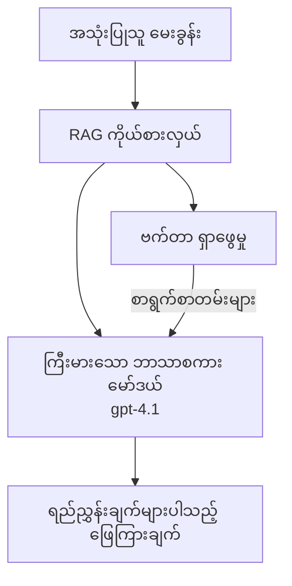
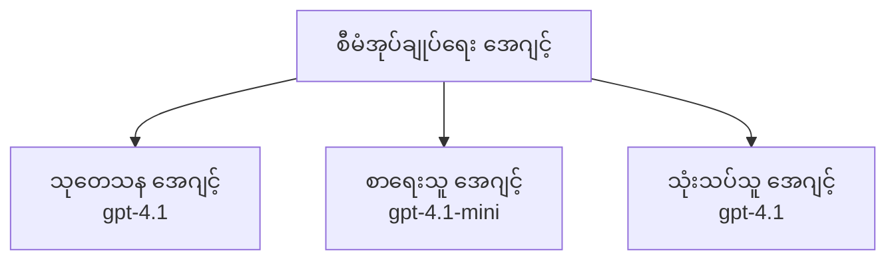

# Azure Developer CLI ဖြင့် AI အေဂျင့်များ

**အခန်း သွားလာမှု:**
- **📚 သင်တန်း မူလစာမျက်နှာ**: [AZD For Beginners](../../README.md)
- **📖 လက်ရှိ အခန်း**: အခန်း 2 - AI-ဦးစားပေး ဖွံ့ဖြိုးရေး
- **⬅️ ယခင်**: [Microsoft Foundry Integration](microsoft-foundry-integration.md)
- **➡️ နောက်တစ်ခု**: [AI Model Deployment](ai-model-deployment.md)
- **🚀 အဆင့်မြင့်**: [Multi-Agent Solutions](../../examples/retail-scenario.md)

---

## နိဒါန်း

AI အေဂျင့်များသည် ပတ်ဝန်းကျင်ကို သိမြင်နိုင်ကာ ဆုံးဖြတ်ချက်ချ၍ သတ်မှတ်ထားသည့် ရည်မှန်းချက်များကို ပြည့်မှီစေရန် လုပ်ဆောင်နိုင်သည့် ကိုယ်ပိုင် အလိုအလျောက် လုပ်ဆောင်နိုင်သော ပရိုဂရမ်များဖြစ်သည်။ Prompt များကို တုံ့ပြန်ပေးသည့် ရိုးရှင်းသော ချတ်ဘော့များနှင့် မတူဘဲ၊ အေဂျင့်များသည် အောက်ပါများကို ပြုလုပ်နိုင်သည်။

- **ကိရိယာအသုံးပြုခြင်း** - API များကို ခေါ်ယူ၊ ဒေတာဘေ့စ်များကို ရှာဖွေ၊ ကုဒ်ကို အကောင်အထည်ဖော်နိုင်သည်
- **အစီအစဉ်ချခြင်းနှင့် ဆင်ခြင်ခြင်း** - ရှုပ်ထွေးသော တာဝန်များကို ခြေလှမ်းများအဖြစ် ခွဲခြမ်းစီမံနိုင်သည်
- **အခြေအနေမှ သင်ယူခြင်း** - မှတ်ဉာဏ်ကို ထိန်းသိမ်းကာ အပြုအမူကို ကိုက်ညီအောင် ပြောင်းလဲနိုင်သည်
- **ပူးပေါင်းဆောင်ရွက်ခြင်း** - အခြား အေဂျင့်များနှင့် ပူးပေါင်း ဆောင်ရွက်နိုင်သည် (multi-agent systems)

ဤလမ်းညွှန်သည် Azure Developer CLI (azd) ကို အသုံးပြု၍ Azure သို့ AI အေဂျင့်များကို deploy ပြုလုပ်ပုံကို ပြပါသည်။

## သင်ယူရန်ရည်ရွယ်ချက်များ

ဤလမ်းညွှန်ကို ပြီးစီးစေခြင်းဖြင့် သင်သည်:
- အေဂျင့်များဆိုသည်မှာ အဘယ်နည်း၊ ချတ်ဘော့များနှင့် မည်သို့ကွာခြားသည်ကို နားလည်နိုင်ပါသည်
- AZD သုံး၍ ပြင်ဆင်ပြီးသား AI အေဂျင့် နမူနာ template များကို deploy လုပ်နိုင်ပါသည်
- custom အေဂျင့်များအတွက် Foundry Agents ဖြင့် အသင့်ပြင်ဆင်နိုင်ပါသည်
- အခြေခံ အေဂျင့် ပုံစံများ (ကိရိယာ အသုံးပြုမှု၊ RAG, multi-agent) ကို အကောင်အထည်ဖော်နိုင်ပါသည်
- deployed အေဂျင့်များကို မော်နီတာနှင့် ဒီဘဒါင်း ပြုလုပ်နိုင်ပါသည်

## သင်ယူပြီးရလဒ်များ

ပြီးစီးချိန်တွင် သင်သည်:
- azd က single command ဖြင့် Azure သို့ AI အေဂျင့် အက်ပလီကေးရှင်းများ deploy လုပ်နိုင်မည်
- အေဂျင့် ကိရိယာများနှင့် အင်အားများကို remaining configure ပြုလုပ်နိုင်မည်
- Retrieval-Augmented Generation (RAG) ကို အေဂျင့်များနှင့် အကောင်အထည်ဖော်နိုင်မည်
- ရှုပ်ထွေးသော workflow များအတွက် multi-agent architecture များကို ဒီဇိုင်းရေးဆွဲနိုင်မည်
- အေဂျင့် deploy ပြဿနာများကို ဖြေရှင်းနိုင်မည်

---

## 🤖 အေဂျင့်သည် ချတ်ဘော့နှင့် မည့်လို့ကွာခြားသနည်း?

| လက္ခဏာ | ချတ်ဘော့ | AI အေဂျင့် |
|---------|---------|----------|
| **အပြုအမူ** | Prompt များကို တုံ့ပြန်သည် | ကိုယ်ပိုင် အလိုအလျောက် လုပ်ဆောင်မှုများ ဆောင်ရွက်သည် |
| **ကိရိယာများ** | မရှိ | API များ ခေါ်ယူ၊ ရှာဖွေ၊ ကုဒ် အကောင်အထည်ဖော်နိုင်သည် |
| **မှတ်ဉာဏ်** | session အခြေပြုသာ | session များကျော်လွန်၍ များပြားသော မှတ်ဉာဏ် ထားရှိနိုင်သည် |
| **အစီအစဉ်ချခြင်း** | တစ်ခေါက်တုံ့ပြန်မှု | မျိုးစုံ အဆင့် နှင့် တွေးခေါ်မှု |
| **ပူးပေါင်းဆောင်ရွက်မှု** | တစ်ခုတည်း အဖွဲ့အစည်း | အခြား အေဂျင့်များနှင့် ပူးပေါင်း ဆောင်ရွက်နိုင်သည် |

### ရိုးရှင်းသော နှိုင်းယှဉ်ချက်

- **ချတ်ဘော့** = အချက်အလက် မေးမြန်းရေးကွက်တွင် မေးခွန်းများကို ဖြေကြားပေးသည့် အကူအညီရှိသူ
- **AI အေဂျင့်** = ကိုယ်စားလှယ်တစ်ဦးကဲ့သို့ တယ်လီဖုန်းခေါ်ဆို၊ ချိန်းထားမှုများချရေး၊ သတ်မှတ်တာဝန်များကို ပြီးမြောက်စေသည့် ပုဂ္ဂိုလ်

---

## 🚀 မျက္နှာဖွင့်စတင်: သင်၏ ပထမ အေဂျင့်ကို Deploy လုပ်ခြင်း

### ရွေးချယ်မှု ၁: Foundry Agents Template (အကြံပြု)

```bash
# AI ကိုယ်စားလှယ်များအတွက် ပုံစံကို စတင်တည်ဆောက်ပါ
azd init --template get-started-with-ai-agents

# Azure သို့ ဖြန့်ချိပါ
azd up
```

**ဘာများကို deploy လုပ်မလဲ:**
- ✅ Foundry Agents
- ✅ Microsoft Foundry Models (gpt-4.1)
- ✅ Azure AI Search (for RAG)
- ✅ Azure Container Apps (web interface)
- ✅ Application Insights (monitoring)

**အချိန်:** ~15-20 မိနစ်
**ကုန်ကျစရိတ်:** ~$100-150/month (development)

### ရွေးချယ်မှု ၂: OpenAI Agent with Prompty

```bash
# Prompty အခြေခံ အေးဂျင့် ပုံစံကို စတင်သတ်မှတ်ပါ
azd init --template agent-openai-python-prompty

# Azure သို့ ဖြန့်ချိပါ
azd up
```

**ဘာများကို deploy လုပ်မလဲ:**
- ✅ Azure Functions (serverless agent execution)
- ✅ Microsoft Foundry Models
- ✅ Prompty configuration files
- ✅ Sample agent implementation

**အချိန်:** ~10-15 မိနစ်
**ကုန်ကျစရိတ်:** ~$50-100/month (development)

### ရွေးချယ်မှု ၃: RAG Chat Agent

```bash
# RAG စကားဝိုင်း တမ်းပလိတ်ကို စတင်ပြင်ဆင်ပါ
azd init --template azure-search-openai-demo

# Azure သို့ တင်ပို့ပါ
azd up
```

**ဘာများကို deploy လုပ်မလဲ:**
- ✅ Microsoft Foundry Models
- ✅ Azure AI Search with sample data
- ✅ Document processing pipeline
- ✅ Chat interface with citations

**အချိန်:** ~15-25 မိနစ်
**ကုန်ကျစရိတ်:** ~$80-150/month (development)

### ရွေးချယ်မှု ၄: AZD AI Agent Init (Manifest-Based)

သင်တွင် agent manifest ဖိုင်ရှိပါက `azd ai` command ကို အသုံးပြု၍ Foundry Agent Service project ကို တိုက်ရိုက် scaffold လုပ်နိုင်သည်။

```bash
# AI agents extension ကို ထည့်သွင်းပါ
azd extension install azure.ai.agents

# agent manifest မှ အစပြု၍ စတင်တည်ဆောက်ပါ
azd ai agent init -m agent-manifest.yaml

# Azure သို့ ဖြန့်ချိပါ
azd up
```

**`azd ai agent init` ကို သုံးသင့်သည့်အချိန်နှင့် `azd init --template` ကို သုံးသင့်သည့်အချိန်:**

| နည်းလမ်း | အကောင်းဆုံး အသုံးချရန် | အလုပ်လုပ်ပုံ |
|----------|----------|------|
| `azd init --template` | လုပ်ဆောင်နိုင်သော နမူနာ app မှ စတင်ချင်သောအခါ | code + infra ပါသော အပြည့်အစုံ template repo ကို clone လုပ်သွားသည် |
| `azd ai agent init -m` | သင်၏ ကိုယ်ပိုင် agent manifest မှ တည်ဆောက်ချင်သောအခါ | သင်၏ agent အဆိုအရ project structure ကို scaffold လုပ်ပေးသည် |

> **Hint:** သင်ယူနေစဉ်တွင် `azd init --template` ကို သုံးပါ (အထက်ပါ ရွေးချယ်မှု 1-3 များ)။ သင့်ထုတ်လုပ်မှုအတွက် ကိုယ်ပိုင် manifests ဖြင့် agent များကို တည်ဆောက်မည်ဆိုလျှင် `azd ai agent init` ကို အသုံးပြုပါ။ အပြည့်အစုံအကြောင်းအရာအတွက် [AZD AI CLI Commands](../chapter-08-production/production-ai-practices.md#azd-ai-cli-commands-and-extensions) ကို ကြည့်ပါ။

---

## 🏗️ အေဂျင့် အင်ဖရာ ပုံစံများ

### ပုံစံ ၁: တစ်ဦးတည်း အေဂျင့်နှင့် ကိရိယာများ

အလွန်ရိုးရှင်းသော အေဂျင့် ပုံစံ - ကိရိယာများ အမျိုးမျိုးကို အသုံးပြုနိုင်သည့် တစ်ဦးတည်း အေဂျင့်တစ်ခု။


**သင့်လျော်သည်:**
- ဖောက်သည်ပံ့ပိုးမှု ဘော့များ
- သုတေသန အကူအညီအဖွဲ့
- ဒေတာ သုံးသပ်ရေး အေဂျင့်များ

**AZD Template:** `azure-search-openai-demo`

### ပုံစံ ၂: RAG အေဂျင့် (Retrieval-Augmented Generation)

အဖြေများ ထုတ်ရန်မတိုင်မီ သက်ဆိုင်ရာ စာရွက်စာတမ်းများကို ရှာဖွေယူသည့် အေဂျင့်။


**သင့်လျော်သည်:**
- စီးပွားရေး သိမြင်မှုပုံစုများ
- စာရွက် Q&A စနစ်များ
- လိုက်နာရေးနှင့် ဥပဒေ သုတေသန

**AZD Template:** `azure-search-openai-demo`

### ပုံစံ ၃: Multi-Agent စနစ်

အချို့ အထူးပြုထားသည့် အေဂျင့်များ တစ်စုမှ စုပေါင်း၍ ရှုပ်ထွေးသော တာဝန်များကို လုပ်ဆောင်ခြင်း။


**သင့်လျော်သည်:**
- ရှုပ်ထွေးသော အကြောင်းအရာ ဖန်တီးမှု
- မျက်နှာပြင်အဆင့်များကြီးသော workflow များ
- ကွဲပြားသော ကျွမ်းကျင်မှု လိုအပ်သည့် တာဝန်များ

**Learn More:** [Multi-Agent Coordination Patterns](../chapter-06-pre-deployment/coordination-patterns.md)

---

## ⚙️ အေဂျင့် ကိရိယာများ ဆက်တင် ပြုလုပ်ခြင်း

ကိရိယာများ အသုံးပြုနိုင်စေရန် အေဂျင့်များအား စွမ်းအားရှိစေပါသည်။ အောက်တွင် အများဆုံး အသုံးများသော ကိရိယာများကို ဘယ်လို ဆက်တင်ရမည်ကို ဖော်ပြထားသည်။

### Foundry Agents တွင် Tool Configuration

```python
# agent_config.py
from azure.ai.projects import AIProjectClient
from azure.ai.projects.models import FunctionTool, CodeInterpreterTool

# စိတ်ကြိုက် ကိရိယာများကို သတ်မှတ်ပါ
search_tool = FunctionTool(
    name="search_knowledge_base",
    description="Search the company knowledge base for relevant documents",
    parameters={
        "type": "object",
        "properties": {
            "query": {
                "type": "string",
                "description": "The search query"
            }
        },
        "required": ["query"]
    }
)

# ကိရိယာများနှင့်အတူ အေးဂျင့် တစ်ခု ဖန်တီးပါ
agent = project_client.agents.create_agent(
    model="gpt-4.1",
    name="Support Agent",
    instructions="You are a helpful support agent. Use the search tool to find relevant information.",
    tools=[search_tool, CodeInterpreterTool()]
)
```

### Environment Configuration

```bash
# အေးဂျင့်သီးသန့်အတွက် ပတ်ဝန်းကျင်ပြောင်းလဲချက်များကို သတ်မှတ်ပါ
azd env set AZURE_OPENAI_MODEL "gpt-4.1"
azd env set AGENT_INSTRUCTIONS "You are a helpful assistant..."
azd env set ENABLE_CODE_INTERPRETER "true"
azd env set ENABLE_FILE_SEARCH "true"

# ပြင်ဆင်ပြီးသော ဖွဲ့စည်းပုံဖြင့် တပ်ဆင်ပါ
azd deploy
```

---

## 📊 အေဂျင့်များကို မော်နီတာလုပ်ခြင်း

### Application Insights ထည့်သွင်းခြင်း

AZD အေဂျင့် template များအားလုံးတွင် monitoring အတွက် Application Insights ပါဝင်သည်။

```bash
# မော်နီတာ ဒက်ရှ်ဘုတ်ကို ဖွင့်ပါ
azd monitor --overview

# တိုက်ရိုက် လော့ဂ်များကို ကြည့်ပါ
azd monitor --logs

# တိုက်ရိုက် မီထရစ်များကို ကြည့်ပါ
azd monitor --live
```

### အချက်ပြ မီထရစ်များ (Key Metrics)

| မီထရစ် | ဖော်ပြချက် | ရည်မှန်းချက် |
|--------|-------------|--------|
| တုံ့ပြန်ချိန် (Response Latency) | တုံ့ပြန်မှု ဖန်တီးရန် ကြာချိန် | < 5 seconds |
| Token အသုံးပြုမှု | တောင်းဆိုမှု တစ်ခုလျှင် token အရေအတွက် | ကုန်ကျစရိတ်အတွက် စောင့်ကြည့်ပါ |
| ကိရိယာ ခေါ်ဆိုမှု အောင်မြင်နှုန်း | ကိရိယာ အကောင်အထည်ဖော်မှုများအတွက် အောင်မြင်နှုန်း (%) | > 95% |
| အမှားနှုန်း | မအောင်မြင်သော အေဂျင့် တောင်းဆိုမှုများ | < 1% |
| အသုံးပြုသူ စိတ်ကျေနပ်မှု | တုံ့ပြန်ချက် အဆင့်များ | > 4.0/5.0 |

### အေဂျင့်များအတွက် အရည်ချင်း logging

```python
import os
from azure.monitor.opentelemetry import configure_azure_monitor
from opentelemetry import trace

# OpenTelemetry ဖြင့် Azure Monitor ကို ဖွဲ့စည်းပါ
configure_azure_monitor(
    connection_string=os.environ["APPLICATIONINSIGHTS_CONNECTION_STRING"]
)

tracer = trace.get_tracer(__name__)

def log_agent_interaction(user_query, agent_response, tools_used, latency_ms):
    with tracer.start_as_current_span("agent_interaction") as span:
        span.set_attributes({
            "user_query": user_query,
            "response_length": len(agent_response),
            "tools_used": tools_used,
            "latency_ms": latency_ms
        })
```

> **မှတ်ချက်:** လိုအပ်သော package များကို 설치 လုပ်ပါ: `pip install azure-monitor-opentelemetry opentelemetry`

---

## 💰 ကုန်ကျစရိတ် ဆောင်းပါးများ

### ပုံစံအလိုက် လစဉ် ခန့်မှန်း ကုန်ကျစရိတ်

| ပုံစံ | ဖွံ့ဖြိုးရေး ပတ်ဝန်းကျင် | ထုတ်လုပ်ရေး |
|---------|-----------------|------------|
| တစ်ဦးတည်း အေဂျင့် | $50-100 | $200-500 |
| RAG အေဂျင့် | $80-150 | $300-800 |
| Multi-Agent (2-3 agents) | $150-300 | $500-1,500 |
| Enterprise Multi-Agent | $300-500 | $1,500-5,000+ |

### ကုန်ကျစရိတ် Optimize ဖို့ အကြံပြုချက်များ

1. **ရိုးရှင်းသော တာဝန်များအတွက် gpt-4.1-mini ကို အသုံးပြုပါ**
   ```bash
   azd env set AZURE_OPENAI_MODEL "gpt-4.1-mini"
   ```

2. **ထပ်မံမေးခွန်းများအတွက် caching ကို အကောင်အထည်ဖော်ပါ**
   ```python
   from functools import lru_cache
   
   @lru_cache(maxsize=1000)
   def get_cached_response(query_hash):
       return agent.run(query_hash)
   ```

3. **ပြေးတဲ့ တစ်ခုချင်း run အလိုက် token ကန့်သတ်ချက်များ သတ်မှတ်ပါ**
   ```python
   # Agent ကို လည်ပတ်စဉ်၌ max_completion_tokens ကို သတ်မှတ်ပါ၊ ဖန်တီးစဉ်တွင် မသတ်မှတ်ရ။
   run = project_client.agents.create_run(
       thread_id=thread.id,
       agent_id=agent.id,
       max_completion_tokens=1000  # တုံ့ပြန်မှု၏ အရှည်ကို ကန့်သတ်ပါ။
   )
   ```

4. **အသုံးမပြုချိန်တွင် scale to zero ပြုလုပ်ပါ**
   ```bash
   # Container Apps များသည် အလိုအလျောက် သုည (0) အထိ အရွယ်အစား လျှော့နည်းနိုင်သည်။
   azd env set MIN_REPLICAS "0"
   ```

---

## 🔧 အေဂျင့် ပြဿနာ ရှာဖွေ ဖြေရှင်းခြင်း

### ပုံမှန် ဖြစ်ပေါ်နိုင်သော ပြဿနာများနှင့် ဖြေရှင်းနည်းများ

<details>
<summary><strong>❌ အေဂျင့်ကိရိယာ ခေါ်ဆိုမှုများကို မတုံ့ပြန်ခြင်း</strong></summary>

```bash
# ကိရိယာများကို မှန်ကန်စွာ မှတ်ပုံတင်ထားကြောင်း စစ်ဆေးပါ
azd show

# OpenAI ဖြန့်ချိမှုကို စစ်ဆေးပါ
az cognitiveservices account deployment list \
  --name $AZURE_OPENAI_NAME \
  --resource-group $RG_NAME

# အေးဂျင့်မှတ်တမ်းများကို စစ်ဆေးပါ
azd monitor --logs
```

**အထွေထွေ အကြောင်းရင်းများ:**
- ကိရိယာ function signature မကိုက်ညီခြင်း
- လိုအပ်သော ခွင့်ပြုချက်များ မရှိခြင်း
- API endpoint ကို ချိတ်ဆက်၍ မရခြင်း
</details>

<details>
<summary><strong>❌ အေဂျင့် တုံ့ပြန်ချိန် များနေခြင်း</strong></summary>

```bash
# Application Insights တွင် ပိတ်ဆို့မှုများကို စစ်ဆေးပါ
azd monitor --live

# ပိုမြန်သော မော်ဒယ်ကို အသုံးပြုရန် စဉ်းစားပါ
azd env set AZURE_OPENAI_MODEL "gpt-4.1-mini"
azd deploy
```

**အကောင်းပြုလုပ်နိုင်ရေး အကြံပြုချက်များ:**
- streaming responses ကို အသုံးပြုပါ
- တုံ့ပြန်မှု caching ကို အကောင်အထည်ဖော်ပါ
- context window အရွယ်အစားကို လျော့ချပါ
</details>

<details>
<summary><strong>❌ အေဂျင့်မှ မှားယွင်း သို့မဟုတ် hallucination ဖြစ်သော အချက်အလက် ပြန်လာခြင်း</strong></summary>

```python
# ပိုကောင်းသည့် စနစ် ညွှန်ကြားချက်များဖြင့် တိုးတက်စေပါ
instructions = """
You are a helpful assistant. IMPORTANT:
- Only answer based on provided context
- If you don't know, say "I don't know"
- Always cite your sources
- Never make up information
"""

# အခြေခံရန် ရှာဖွေရယူခြင်းကို ထည့်ပါ
agent = project_client.agents.create_agent(
    model="gpt-4.1",
    instructions=instructions,
    tools=[FileSearchTool()]  # ဖြေကြားချက်များကို စာရွက်စာတမ်းများပေါ်တွင် အခြေခံပါ
)
```
</details>

<details>
<summary><strong>❌ Token ကန့်သတ်ချက် ကျော်လွန်သွားခြင်း အမှားများ</strong></summary>

```python
# context window စီမံခန့်ခွဲမှုကို အကောင်အထည်ဖော်ပါ
def truncate_context(messages, max_tokens=8000, model="gpt-4.1"):
    """Keep only recent messages within token limit."""
    import tiktoken
    encoding = tiktoken.encoding_for_model(model)
    total_tokens = 0
    truncated = []
    
    for msg in reversed(messages):
        msg_tokens = len(encoding.encode(msg.content))
        if total_tokens + msg_tokens > max_tokens:
            break
        truncated.insert(0, msg)
        total_tokens += msg_tokens
    
    return truncated
```
</details>

---

## 🎓 လက်တွေ့ လေ့ကျင့်ခန်းများ

### လေ့ကျင့်ခန်း ၁: မူလ အေဂျင့် Deploy (20 မိနစ်)

**ရည်ရွယ်ချက်:** AZD အသုံးပြုပြီး သင်၏ ပထမ အေဂျင့်ကို deploy လုပ်ရန်

```bash
# အဆင့် ၁: ပုံစံကို စတင်တည်ဆောက်ရန်
azd init --template get-started-with-ai-agents

# အဆင့် ၂: Azure သို့ လော့ဂ်အင်လုပ်ပါ
azd auth login

# အဆင့် ၃: တပ်ဆင်ရန်
azd up

# အဆင့် ၄: အေးဂျင့်ကို စမ်းသပ်ရန်
# တပ်ဆင်ပြီးနောက် မျှော်လင့်ရသော အထွက်:
#   တပ်ဆင်မှု ပြီးစီးပါပြီ!
#   အဆုံးအချက်: https://<app-name>.<region>.azurecontainerapps.io
# အထွက်တွင် ပြထားသော URL ကို ဖွင့်၍ မေးခွန်းတစ်ခု မေးကြည့်ပါ။

# အဆင့် ၅: စောင့်ကြည့်မှုကို ကြည့်ရန်
azd monitor --overview

# အဆင့် ၆: ရှင်းလင်းရန်
azd down --force --purge
```

**အောင်မြင်မှု ဆိုင်ရာ အချက်ခွဲများ:**
- [ ] အေဂျင့်သည် မေးခွန်းများကို တုံ့ပြန်နိုင်သည်
- [ ] `azd monitor` ဖြင့် မော်နီတာ ဒက်ရှ်ဘုတ်ကို လက်လှမ်းရရှိနိုင်သည်
- [ ] အရင်းအမြစ်များကို သန့်ရှင်း အောင် လက်ဆောင် ပြန်လည် ဖျက်ဆီးနိုင်သည်

### လေ့ကျင့်ခန်း ၂: ကိုယ်ပိုင် ကိရိယာ ထည့်သွင်းခြင်း (30 မိနစ်)

**ရည်ရွယ်ချက်:** အေဂျင့်အား ကိုယ်ပိုင် ကိရိယာဖြင့် တိုးချဲ့ရန်

1. Deploy the agent template:
   ```bash
   azd init --template get-started-with-ai-agents
   azd up
   ```
2. ကိုယ့်အေဂျင့်ကုဒ်ထဲတွင် ကိရိယာ function အသစ်တစ်ခု ဖန်တီးပါ:
   ```python
   def get_weather(location: str) -> str:
       """Get current weather for a location."""
       # မိုးလေဝသ ဝန်ဆောင်မှုသို့ API ခေါ်ယူခြင်း
       return f"Weather in {location}: Sunny, 72°F"
   ```
3. အဲဒီ ကိရိယာကို အေဂျင့်နှင့် အတူ register လုပ်ပါ:
   ```python
   from azure.ai.projects.models import FunctionTool

   weather_tool = FunctionTool(
       name="get_weather",
       description="Get current weather for a location",
       parameters={
           "type": "object",
           "properties": {
               "location": {"type": "string", "description": "City name"}
           },
           "required": ["location"]
       }
   )

   agent = project_client.agents.create_agent(
       model="gpt-4.1",
       name="Weather Agent",
       tools=[weather_tool]
   )
   ```
4. ပြန်လည် deploy လုပ်၍ စမ်းသပ်ပါ:
   ```bash
   azd deploy
   # မေးပါ: "စီအက်တယ်မှာ မိုးလေဝသ ဘယ်လိုရှိသလဲ?"
   # မျှော်မှန်းချက်: အေဂျင့်သည် get_weather("Seattle") ကို ခေါ်၍ မိုးလေဝသ အချက်အလက်ကို ပြန်ပေးမည်။
   ```

**အောင်မြင်မှု ဆိုင်ရာ အချက်ခွဲများ:**
- [ ] အေဂျင့်သည် ရာသီဥတုဆိုင်ရာ မေးခွန်းများကို မှတ်သားနိုင်သည်
- [ ] ကိရိယာကို မှန်ကန်စွာ ခေါ်ယူနိုင်သည်
- [ ] တုံ့ပြန်မှုတွင် ရာသီဥတု သတင်းအချက်အလက် ပါဝင်သည်

### လေ့ကျင့်ခန်း ၃: RAG အေဂျင့် တည်ဆောက်ခြင်း (45 မိနစ်)

**ရည်ရွယ်ချက်:** သင်၏ စာရွက်စာတမ်းများမှ မေးခွန်းများကို ဖြေရှင်းနိုင်သည့် အေဂျင့် တည်ဆောက်ခြင်း

```bash
# အဆင့် ၁: RAG နမူနာကို တပ်ဆင်ပါ
azd init --template azure-search-openai-demo
azd up

# အဆင့် ၂: သင်၏ စာရွက်စာတမ်းများကို တင်ပါ
# PDF/TXT ဖိုင်များကို data/ ဖိုလ်ဒါအတွင်းထည့်ပြီး၊ ထို့နောက် အောက်ပါ ညွှန်ကြားချက်ကို လိုက်ပါ:
python scripts/prepdocs.py

# အဆင့် ၃: ဒိုမိန်းဆိုင်ရာ မေးခွန်းများဖြင့် စမ်းသပ်ပါ
# azd up အထွက်မှ ဝဘ်အက်ပ် URL ကို ဖွင့်ပါ
# သင်အပ်လုဒ်တင်ထားသော စာရွက်စာတမ်းများအကြောင်း မေးမြန်းပါ
# တုံ့ပြန်ချက်များတွင် [doc.pdf] ကဲ့သို့ ရည်ညွှန်းချက်များ ပါဝင်သင့်သည်
```

**အောင်မြင်မှု ဆိုင်ရာ အချက်ခွဲများ:**
- [ ] အပ်လုဒ်ထားသော စာရွက်စာတမ်းများမှ အေဂျင့်သည် ဖြေရှင်းနိုင်သည်
- [ ] တုံ့ပြန်မှုများတွင် ကိုးကားချက်များ ပါဝင်သည်
- [ ] အသုံးမထူးမန်သော မေးခွန်းများတွင် hallucination မဖြစ်စေခြင်း

---

## 📚 နောက်လှမ်းလုပ်ရန်

ယခုသင်သည် AI အေဂျင့်များကို နားလည်သွားပါပြီ၊ အခုအောက်ပါ အဆင့်မြင့် အချက်များကို ရှာဖွေရန် ကြိုးပမ်းပါ။

| ခေါင်းစဉ် | ဖော်ပြချက် | Link |
|-------|-------------|------|
| **Multi-Agent Systems** | များစွာ ပူးပေါင်းလုပ်ဆောင်သည့် စနစ်များ တည်ဆောက်ခြင်း | [Retail Multi-Agent Example](../../examples/retail-scenario.md) |
| **Coordination Patterns** | အော်ကက်စထရေးရှင်းနှင့် ဆက်ဆံရေး ပုံစံများကို သင်ယူပါ | [Coordination Patterns](../chapter-06-pre-deployment/coordination-patterns.md) |
| **Production Deployment** | ကုမ္ပဏီအသစ်များအတွက် အသင့်ပြင် agent deployment | [Production AI Practices](../chapter-08-production/production-ai-practices.md) |
| **Agent Evaluation** | အေဂျင့်စွမ်းဆောင်ရည်ကို စမ်းသပ်၊ အကဲဖြတ်ခြင်း | [AI Troubleshooting](../chapter-07-troubleshooting/ai-troubleshooting.md) |
| **AI Workshop Lab** | လက်တွေ့ လေ့ကျင့်ခြင်း: သင့် AI ဖြေရှင်းနည်းကို AZD-အဆင်သင့် ပြုလုပ်ပါ | [AI Workshop Lab](ai-workshop-lab.md) |

---

## 📖 အပိုအရင်းအမြစ်များ

### တရားဝင် စာရွက်စာတမ်းများ
- [Azure AI Agent Service](https://learn.microsoft.com/azure/ai-services/agents/)
- [Azure AI Foundry Agent Service Quickstart](https://learn.microsoft.com/azure/ai-services/agents/quickstart)
- [Semantic Kernel Agent Framework](https://learn.microsoft.com/semantic-kernel/)

### AZD အတွက် Agent Templates
- [Get Started with AI Agents](https://github.com/Azure-Samples/get-started-with-ai-agents)
- [Agent OpenAI Python Prompty](https://github.com/Azure-Samples/agent-openai-python-prompty)
- [Azure Search OpenAI Demo](https://github.com/Azure-Samples/azure-search-openai-demo)

### အသိုင်းအဝိုင်း အရင်းအမြစ်များ
- [Awesome AZD - Agent Templates](https://azure.github.io/awesome-azd/?tags=ai-agents)
- [Azure AI Discord](https://discord.gg/microsoft-azure)
- [Microsoft Foundry Discord](https://discord.gg/nTYy5BXMWG)

### သင့် Editor အတွက် Agent Skills
- [**Microsoft Azure Agent Skills**](https://skills.sh/microsoft/github-copilot-for-azure) - GitHub Copilot, Cursor သို့မဟုတ် ထောက်ပံ့ထားသော agent မည်သို့မဆို တွင် Azure ဖွံ့ဖြိုးရေးအတွက် ပြန်လည်အသုံးပြုနိုင်သော AI agent skills များကို 설치 လုပ်နိုင်သည်။ [Azure AI](https://skills.sh/microsoft/github-copilot-for-azure/azure-ai), [Microsoft Foundry](https://skills.sh/microsoft/github-copilot-for-azure/microsoft-foundry), [deployment](https://skills.sh/microsoft/github-copilot-for-azure/azure-deploy), နှင့် [diagnostics](https://skills.sh/microsoft/github-copilot-for-azure/azure-diagnostics) အတွက် skills များ ပါဝင်သည်။
  ```bash
  npx skills add microsoft/github-copilot-for-azure
  ```

---

**သွားကြည့်ရန်**
- **ယခင် သင်ခန်းစာ**: [Microsoft Foundry Integration](microsoft-foundry-integration.md)
- **နောက်တစ်ခန်း**: [AI Model Deployment](ai-model-deployment.md)

---

<!-- CO-OP TRANSLATOR DISCLAIMER START -->
**Disclaimer**:
ဤစာတမ်းကို AI ဘာသာပြန်ဝန်ဆောင်မှုဖြစ်သည့် [Co-op Translator](https://github.com/Azure/co-op-translator) သုံး၍ ဘာသာပြန်ထားပါသည်။ ကျွန်ုပ်တို့သည် တိကျမှုအတွက် ကြိုးပမ်းပါသော်လည်း အလိုအလျောက် ဘာသာပြန်ချက်များတွင် အမှားများ သို့မဟုတ် မမှန်ကန်မှုများ ပါနိုင်ကြောင်း သတိပြုပါ။ မူလစာတမ်းကို မူလဘာသာဖြင့်ရှိသော အာဏာပိုင်ရင်းမြစ်အဖြစ် ယူဆသင့်ပါသည်။ အရေးကြီးသော သတင်းအချက်အလက်များအတွက် လူမှ ပြုလုပ်သော ပရော်ဖက်ရှင်နယ် ဘာသာပြန်ကို အကြံပြုပါသည်။ ဤဘာသာပြန်ချက်ကို အသုံးပြုခြင်းကြောင့် ဖြစ်ပေါ် စေနိုင်သည့် နားမလည်မှုများ သို့မဟုတ် မှားထင်မှားယူမှုများအတွက် ကျွန်ုပ်တို့ တာဝန်မယူပါ။
<!-- CO-OP TRANSLATOR DISCLAIMER END -->