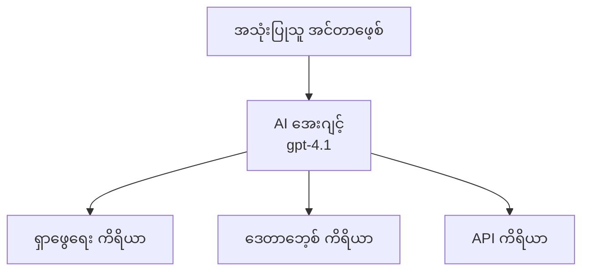
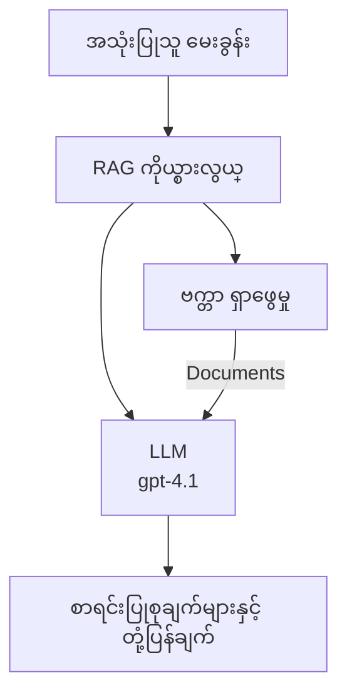
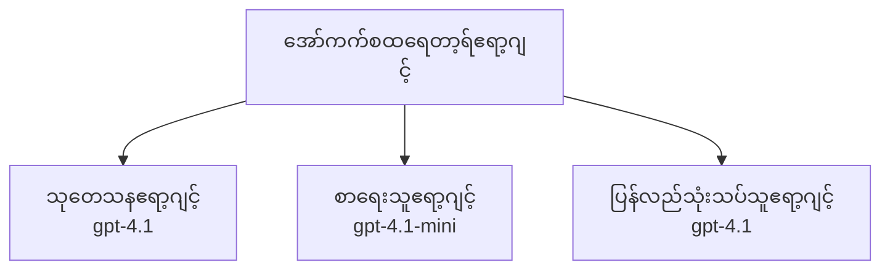

# Azure Developer CLI နှင့် AI Agent များ

**အပိုင်းလမ်းညွှန်ခြင်း:**
- **📚 သင်တန်းအိမ်ပေါ်**: [AZD For Beginners](../../README.md)
- **📖 လက်ရှိအပိုင်း**: အပိုင်း 2 - AI-First ဖွံ့ဖြိုးရေး
- **⬅️ ယခင်**: [Microsoft Foundry Integration](microsoft-foundry-integration.md)
- **➡️ နောက်တစ်ခု**: [AI Model Deployment](ai-model-deployment.md)
- **🚀 အဆင့်မြင့်**: [Multi-Agent Solutions](../../examples/retail-scenario.md)

---

## မိတ်ဆက်

AI agent များသည် သူတို့၏ပတ်ဝန်းကျင်ကို သတိပေးနိုင်ပြီး ဆုံးဖြတ်ချက်မှီခို၍ သတ်မှတ်ထားသောရည်မှန်းချက်များအောင်မြင်ရန် လုပ်ဆောင်ချက်များယူနိုင်သည့် ကိုယ်ပိုင် အစီအစဉ်များဖြစ်သည်။ ရိုးရှင်းသော chatbot များ၏ ဖြေကြားချက်များအဖြစ် မဟုတ်ပါက၊ agent များသည် -

- **ကိရိယာအသုံးပြုခြင်း** - API များခေါ်ဆိုရန်၊ ဒေတာဘေ့စ်များ ရှာဖွေရန်၊ ကုဒ်များ အကောင်အထည်ဖော်ရန်
- **အစီအစဉ်တင်ခြင်းနှင့် အကြောင်းပြချက်ပြုခြင်း** - စံနမူနာများကို အဆင့်လိုက် ခွဲခြားရန်
- **အခြေခံ သတင်းအချက်အလက်များမှ သင်ယူခြင်း** - မှတ်ဉာဏ်စောင့်ရှောက်ပြီးအပြုအမူ ပြောင်းလဲနိုင်ခြင်း
- **ပူးပေါင်း လုပ်ကိုင်ခြင်း** - အခြား agent များနှင့် အတူ ဆောင်ရွက်ခြင်း (multi-agent system များ)

ဒီလမ်းညွှန်တွင် Azure Developer CLI (azd) အသုံးပြု၍ AI agent များကို Azure တွင် ရွှေ့ပေးနည်းကို ပြသထားသည်။

> **အတည်ပြုမှတ်ချက် (၂၀၂၆-၀၇-၁၃):** ဒီလမ်းညွှန်ကို `azd` `1.27.1` နဲ့ `azure.ai.agents` `1.0.0-beta.5` တို့နှင့် သုံးသပ်စစ်ဆေးပြီးဖြစ်သည်။ `azd ai` အတွေ့အကြုံမှာ ယနေ့အခါ ဟာ preview အခြေခံဖြစ်နေသေးသည်၊ သင့်တပ်ဆင်ထားသော flag များကွဲပြားပါက extension အကူအညီကို စစ်ဆေးပါ။

## လေ့လာလိုသောပန်းတိုင်များ

ဒီလမ်းညွှန်ကို ပြီးစီးစေလျှင် -
- AI agent များဆိုတာဘာလဲ၊ Chatbot များနှင့် ဘာကွဲပြားသနည်း သဘောပေါက်မယ်။
- AZD ကိုအသုံးပြု၍ pre-built AI agent နမူနာများ ရွှေ့ပေးနိုင်မယ်။
- Custom agent များအတွက် Foundry Agents အတိုင်းအတာပြုလုပ်နိုင်မယ်။
- အခြေခံ agent ပုံစံများ (ကိရိယာအသုံးပြုခြင်း၊ RAG, multi-agent) တပ်ဆင်နိုင်မယ်။
- ရွှေ့ထားသော agent များကို စောင့်ကြည့်ပါ၊ ပြေလည်အောင် ပြုပြင်နိုင်မယ်။

## သင်ယူရမည့်အကျိုးရလဒ်များ

ပြီးစီးသည်ဖြင့် အောက်ပါ အသိပညာရမည် -
- တစ်ချက် command မှတဆင့် Azure သို့ AI agent application များ ရွှေ့ပို့နိုင်မည်။
- Agent ကိရိယာများနှင့် စွမ်းဆောင်ရည်များ ကိုပြင်ဆင်နိုင်မည်။
- Agent များနှင့် retrieval-augmented generation (RAG) ကိရိယာ ကိုသုံးနိုင်မည်။
- စပ်ဆိုင်ရာ workflow များအတွက် multi-agent architecture များ ရေးဆွဲနိုင်မည်။
- Agent ရွှေ့ပို့မှု ပြဿနာများကို ဖြေရှင်းနိုင်မည်။

---

## 🤖 Agent နှင့် Chatbot ကွဲပြားချက်

| လက္ခဏာ | Chatbot | AI Agent |
|---------|---------|----------|
| **အပြုအမူ** | စကားလုံးတုံ့ပြန်မှု | ကိုယ်ပိုင် လုပ်ဆောင်ချက်ယူမှု |
| **ကိရိယာများ** | မရှိပါ | API ခေါ်ဆိုရေး၊ ရှာဖွေရေး၊ ကုဒ် အကောင်အထည်ဖော်ခြင်း ရနိုင်သည် |
| **မှတ်ဉာဏ်** | ဆက်သွယ်မှုအလိုက်သာ ရှိ | ဆက်လက်ခံရရှိသော မှတ်ဉာဏ် ရှိသည် |
| **အစီအစဉ်ရေးဆွဲခြင်း** | တုံ့ပြန်မှု တစ်ခုတည်း | အဆင့်များစွာ ဖြင့် စဉ်းစားခြင်း |
| **ပူးပေါင်းဆောင်ရွက်မှု** | တစ်ဦးတည်း | အခြား Agent များနှင့် ပူးပေါင်းကိရိယာပါဝင်နိုင်သည် |

### ရိုးရှင်းသော နှိုင်းယှဥ်ချက်

- **Chatbot** = သတင်းအချက်အလက်ပြုစုမည့် လူတစ်ဦး
- **AI Agent** = ဖုန်းခေါ်ဆိုခြင်း၊ ချိန်းဆိုရေးစီစဉ်ခြင်းနှင့် လုပ်ငန်းများ ပြီးမြောက်နိုင်သည့် ကိုယ်ပိုင်အကူအညီ

---

## 🚀 အလျင်အမြန် စတင်ခြင်း: သင့် ပထမဆုံး Agent ဖြန့်ချိခြင်း

### ရွေးချယ်မှု ၁: Foundry Agents နမူနာ (အကြံပြု)

```bash
# AI အေးဂျင့်များအတွက် ပုံစံအစ ပြုလုပ်ပါ
azd init --template get-started-with-ai-agents

# Azure သို့ ပြန်လည်တပ်ဆင်ပါ
azd up
```

**အောက်ပါအရာများ ဖြန့်ချိပါမည်:**
- ✅ Foundry Agents
- ✅ Microsoft Foundry Models (gpt-4.1)
- ✅ Azure AI Search (RAG အတွက်)
- ✅ Azure Container Apps (ဝက်ဘ်မှတ်ပုံတင်)
- ✅ Application Insights (စောင့်ကြည့်မှု)

**အချိန်:** ~15-20 မိနစ်
**ကုန်ကျစရိတ်:** ~$100-150/လ (ဖွံ့ဖြိုးရေး)

### ရွေးချယ်မှု ၂: Prompty ဖြင့် OpenAI Agent

```bash
# Prompty အခြေဖြင့် agent ပုံစံအား စတင်ဖန်တီးခြင်း
azd init --template agent-openai-python-prompty

# Azure သို့ တပ်ဆင်ခြင်း
azd up
```

**အောက်ပါအရာများ ဖြန့်ချိပါမည်:**
- ✅ Azure Functions (serverless agent အကောင်အထည်ဖော်ခြင်း)
- ✅ Microsoft Foundry Models
- ✅ Prompty ပြင်ဆင်မှုဖိုင်များ
- ✅ Agent နမူနာအသုံးပြုမှု

**အချိန်:** ~10-15 မိနစ်
**ကုန်ကျစရိတ်:** ~$50-100/လ (ဖွံ့ဖြိုးရေး)

### ရွေးချယ်မှု ၃: RAG Chat Agent

```bash
# RAG chat template ကို စတင်ပြင်ဆင်ပါ
azd init --template azure-search-openai-demo

# Azure သို့ တပ်ဆင်ပါ
azd up
```

**အောက်ပါအရာများ ဖြန့်ချိပါမည်:**
- ✅ Microsoft Foundry Models
- ✅ Azure AI Search နှင့် နမူနာဒေတာ
- ✅ စာရွက်စာတမ်း ကိုင်တွယ်မှု စနစ်
- ✅ စကားပြောအင်တာဖေ့စာနှင့် ရည်ညွှန်းချက်များပါဝင်သည်

**အချိန်:** ~15-25 မိနစ်
**ကုန်ကျစရိတ်:** ~$80-150/လ (ဖွံ့ဖြိုးရေး)

### ရွေးချယ်မှု ၄: AZD AI Agent Init (Manifest သို့မဟုတ် Template အေခြပြု ရှုမြင်နမူနာ)

သင့်တွင် agent manifest ဖိုင်ရှိပါက `azd ai` command ဖြင့် Foundry Agent Service project တိုက်ရိုက် စတင်နိုင်သည်။ လတ်တလော preview ထုတ်ဝေရေးများတွင် template အေခြပြု initialization ကိုပါ ထည့်သွင်းထားသောကြောင့် သင့် extension ဗားရှင်းအလိုက် prompt flow သေးသန့်ကွဲပြားနိုင်ပါသည်။

```bash
# AI အေးဂျင့်များ extension ကို 설치 လုပ်ပါ
azd extension install azure.ai.agents

# ရွေးချယ်စရာ: 설치 ပြီးသော ကြိုမြင် ပြသမှု ဗားရှင်းကို စစ်ဆေးပါ
azd extension show azure.ai.agents

# agent manifest မှ စတင်အလုပ်လုပ်ပါ
azd ai agent init -m agent-manifest.yaml

# Azure သို့ တပ်ဆင်ပါ
azd up

# တပ်ဆင်ပြီးသော agent ကို စမ်းသပ်ပါ (လက်ရှိကြာချိန် + ပထမဆုံး Byte ကိုရောက်ချိန်) ပြသသည်
azd ai agent invoke
```

**`azd ai agent init` နှင့် `azd init --template` အသုံးပြုရာကွာခြားချက်:**

| နည်းလမ်း | သင့်တော်ချက် | လုပ်ဆောင်ပုံ |
|----------|----------|------|
| `azd init --template` | လုပ်ဆောင်ရမည့် နမူနာ app မှ စတင်ခြင်း | code + infra ပါသော template repo ခြားယူခြင်း |
| `azd ai agent init -m` | ကိုယ်ပိုင် agent manifest မှ တည်ဆောက်ခြင်း | သင့် agent သတ်မှတ်ချက်ဖြင့် project ဖွဲ့စည်းခြင်း |

> **အကြံပြုချက်:** သင်ယူရာတွင် (ရွေးချယ်မှု ၁-၃) `azd init --template` ကို အသုံးပြုပါ။ ကိုယ်ပိုင် manifest များဖြင့် ထုတ်လုပ်မှုဟာ `azd ai agent init` ဖော်မြူလာကို သုံးပါ။

`azd up` ပြီးသည့်နောက် တူညီသော extension သည် agent lifecycle အခြားအဆင့်များကို ရှေ့ဆက်ကျင်းပပေးသည် - `azd ai agent invoke` ဖြင့် စမ်းသပ်ခြင်း၊ `azd ai agent eval generate` နှင့် `azd ai agent optimize` ဖြင့် အရည်အသွေး မှတ်ချက် ချမှတ်ခြင်းနှင့် တိုးတက်အောင် လုပ်ဆောင်ခြင်း၊ `azd ai agent delete` ဖြင့် သန့်ရှင်းခြင်း။ အပြည့်အစုံကို [AZD AI CLI Commands](../chapter-08-production/production-ai-practices.md#azd-ai-cli-commands-and-extensions) တွင် ကြည့်ရှုနိုင်သည်။

---

## 🏗️ Agent ဆောက်လုပ်မှု ပုံစံများ

### ပုံစံ ၁: တစ်ဦးတည်း Agent နှင့် ကိရိယာများ

ရိုးရှင်းဆုံး agent ပုံစံ - ကိရိယာများစွာ အသုံးပြုနိုင်သည့် agent တစ်ဦး။



**သင့်တော်သောအတွက်:**
- ဖောက်သည်ဝန်ဆောင်မှု bot များ
- သုတေသန အကူအညီသမားများ
- ဒေတာစိစစ် ရှာဖွေရေး agent များ

**AZD Template:** `azure-search-openai-demo`

### ပုံစံ ၂: RAG Agent (Retrieval-Augmented Generation)

ပြန်လည် ရရှိလိုသည့် စာရွက်စာတမ်းများ ရှာဖွေပြီး ဖြေကြားချက် ထုတ်ပေးသူ agent။



**သင့်တော်သောအတွက်:**
- အဖွဲ့အစည်း အသိပညာ အခြေခံများ
- စာရွက်စာတမ်း မေးခွန်းတုံ့ပြန်မှု စနစ်များ
- ဥပဒေ နှင့် လိုက်နာမှု သုတေသန

**AZD Template:** `azure-search-openai-demo`

### ပုံစံ ၃: Multi-Agent စနစ်

အတော်လေး နှင့် စွမ်းအင် ကွဲပြားသော agent များ အဆက်အသွယ်ရှိ၍ စုပေါင်း ဆောင်ရွက်ခြင်း။



**သင့်တော်သောအတွက်:**
- စိတ်ရှည် content ဖန်တီးခြင်း
- အဆင့်လိုက် workflow များ
- ကျွမ်းကျင်မှုကွဲပြားသော လုပ်ငန်းများ

**ပိုမိုလေ့လာရန်:** [Multi-Agent Coordination Patterns](../chapter-06-pre-deployment/coordination-patterns.md)

---

## ⚙️ Agent ကိရိယာများ ပြင်ဆင်ခြင်း

Agent များသည် ကိရိယာများ အသုံးပြုရာတွင် အင်အားကြီးသည်။ နေရာညီညီ COMMON tool များ ပြင်ဆင်နည်း -

### Foundry Agents မှာ ကိရိယာ ပြင်ဆင်ခြင်း

```python
# agent_config.py
from azure.ai.projects import AIProjectClient
from azure.ai.projects.models import FunctionTool, CodeInterpreterTool

# ပုံမှန်မဟုတ်သော ကိရိယာများကို သတ်မှတ်ပါ
search_tool = FunctionTool(
    name="search_knowledge_base",
    description="Search the company knowledge base for relevant documents",
    parameters={
        "type": "object",
        "properties": {
            "query": {
                "type": "string",
                "description": "The search query"
            }
        },
        "required": ["query"]
    }
)

# ကိရိယာများဖြင့် agent တစ်ခု ဖန်တီးပါ
agent = project_client.agents.create_agent(
    model="gpt-4.1",
    name="Support Agent",
    instructions="You are a helpful support agent. Use the search tool to find relevant information.",
    tools=[search_tool, CodeInterpreterTool()]
)
```

### ပတ်ဝန်းကျင် ပြင်ဆင်ခြင်း

```bash
# အေဂျင့်အထူးပတ်ဝန်းကျင်အဆက်အသွယ်များကို ထားရန်
azd env set AZURE_OPENAI_MODEL "gpt-4.1"
azd env set AGENT_INSTRUCTIONS "You are a helpful assistant..."
azd env set ENABLE_CODE_INTERPRETER "true"
azd env set ENABLE_FILE_SEARCH "true"

# အသစ်ပြင်ဆင်ထားသောဖွဲ့စည်းမှုနှင့် တပ်ဆင်ခြင်း
azd deploy
```

---

## 📊 Agent များ စောင့်ကြည့်ခြင်း

### Application Insights ပေါင်းစပ်မှုပြုခြင်း

AZD agent template များအားလုံးတွင် စောင့်ကြည့်မှုအတွက် Application Insights ပါဝင်သည်။

```bash
# မီးအိမ်မှု့ထိန်းချုပ်ရေး ပတ်ပတ်လည်ကြည့်ရှုရန်
azd monitor --overview

# တိုက်ရိုက်မှတ်တမ်းများကြည့်ရှုရန်
azd monitor --logs

# တိုက်ရိုက်တိုင်းတာချက်များကြည့်ရှုရန်
azd monitor --live
```

### စောင့်ကြည့်ရမည့် ထိပ်တန်းချိတ်ဆွဲချက်များ

| အချက်အလက် | ဖော်ပြချက် | မျှော်မှန်းချက် |
|----------|-----------|----------|
| တုံ့ပြန်မှု နောက်ကျမှု | တုံ့ပြန်ချက် ထုတ်ရန် ကြာချိန် | < ၅ စက္ကန့် |
| တိုကင် အသုံးပြုမှု | တောင်းဆိုချက် တစ်ကြိမ်လျှင် တိုကင် များ | ကုန်ကျစရိတ် စောင့်ကြည့်ရန် |
| ကိရိယာခေါ်ဆိုခြင်း အောင်မြင်မှုနှုန်း | ကိရိယာ အကောင်အထည်ဖော်မှုအောင်မြင်မှု % | > ၉၅% |
| အမှားနှုန်း | Agent တောင်းဆိုမှု မအောင်မြင်မှု | < ၁% |
| အသုံးပြုသူ စိတ်ကျေနပ်မှု | အကြံပြုချက် အဆင့် | > ၄.၀/၅.၀ |

### Agent များအတွက် စိတ်ကြိုက် မှတ်တမ်းတင်ခြင်း

```python
import os
from azure.monitor.opentelemetry import configure_azure_monitor
from opentelemetry import trace

# Azure Monitor ကို OpenTelemetry ဖြင့် ပြင်ဆင်ပါ
configure_azure_monitor(
    connection_string=os.environ["APPLICATIONINSIGHTS_CONNECTION_STRING"]
)

tracer = trace.get_tracer(__name__)

def log_agent_interaction(user_query, agent_response, tools_used, latency_ms):
    with tracer.start_as_current_span("agent_interaction") as span:
        span.set_attributes({
            "user_query": user_query,
            "response_length": len(agent_response),
            "tools_used": tools_used,
            "latency_ms": latency_ms
        })
```

> **မှတ်ချက်:** လိုအပ်သော ပက်ကေ့ဂျ်များကို ထည့်သွင်းပါ: `pip install azure-monitor-opentelemetry opentelemetry`

---

## 💰 ကုန်ကျစရိတ်စဉ်းစားချက်များ

### ပုံစံအလိုက် လစဉ် ကုန်ကျစရိတ် ခန့်မှန်းချက်များ

| ပုံစံ | ဖွံ့ဖြိုးရေး ပတ်ဝန်းကျင် | ထုတ်လုပ်မှု |
|-------|--------------|----------|
| တစ်ဦးတည်း Agent | $50-100 | $200-500 |
| RAG Agent | $80-150 | $300-800 |
| Multi-Agent (2-3 agent များ) | $150-300 | $500-1,500 |
| Enterprise Multi-Agent | $300-500 | $1,500-5,000+ |

### ကုန်ကျစရိတ် တိုးတက်မှု အကြံပြုချက်များ

1. **ရိုးရှင်းသော လုပ်ငန်းများအတွက် gpt-4.1-mini ကို သုံးပါ**
   ```bash
   azd env set AZURE_OPENAI_MODEL "gpt-4.1-mini"
   ```

2. **အကြိမ်ကြိမ် မေးခွန်းများအတွက် caching တပ်ဆင်ပါ**
   ```python
   from functools import lru_cache
   
   @lru_cache(maxsize=1000)
   def get_cached_response(query_hash):
       return agent.run(query_hash)
   ```

3. **တစ်ကြိမ်လျှင် token ကန့်သတ်ချက်များ တပ်ဆင်ပါ**
   ```python
   # အေးဂျင့်ကို chạyရာတွင် max_completion_tokens ကို သတ်မှတ်ပါ၊ ဖန်တီးနေစဉ်မဟုတ်ပါ
   run = project_client.agents.create_run(
       thread_id=thread.id,
       agent_id=agent.id,
       max_completion_tokens=1000  # ပြန်လည်ဖြေဆိုမှု အရှည်ကို ကန့်သတ်ပါ
   )
   ```

4. **အသုံးမပြုသောအခါ zero တန်ဖိုးသို့ အလိုအလျောက် ကျဆင်းအောင်လုပ်ပါ**
   ```bash
   # ဖန်တီးကပ်(စ်)အက်ပ်များသည် အလိုအလျောက် ဇီလာအဆင့်သို့ချွတ်တန့်သည်
   azd env set MIN_REPLICAS "0"
   ```

---

## 🔧 Agent ပြဿနာ ဖြေရှင်းခြင်း

### အထူးအသုံးပြုပြဿနာများ နှင့် ဖြေရှင်းနည်းများ

<details>
<summary><strong>❌ Agent ကိရိယာခေါ်ဆိုမှုများကို မတုံ့ပြန်ခြင်း</strong></summary>

```bash
# ကိရိယာများမှန်ကန်စွာ မှတ်ပုံတင်ထားကြောင်း စစ်ဆေးပါ
azd show

# OpenAI ဖွဲ့စည်းမှုကို အတည်ပြုပါ
az cognitiveservices account deployment list \
  --name $AZURE_OPENAI_NAME \
  --resource-group $RG_NAME

# ကိုယ်စားလှယ်မှတ်တမ်းများအား စစ်ဆေးပါ
azd monitor --logs
```

**အများအားဖြင့်ဖြစ်ပုံများ:**
- ကိရိယာ function signature မကိုက်ညီခြင်း
- လိုအပ်သော ခွင့်ပြုချက် မရှိခြင်း
- API endpoint မရောက်ရှိနိုင်ခြင်း
</details>

<details>
<summary><strong>❌ Agent ဖြေကြားချက်များတွင် နောက်ကျမှု ကြီးနေခြင်း</strong></summary>

```bash
# ချို့ယွင်းချက်များအတွက် Application Insights ကိုစစ်ဆေးပါ
azd monitor --live

# ပိုမိုမြန်ဆန်တဲ့ မော်ဒယ်ကိုအသုံးပြုရန်စဉ်းစားပါ
azd env set AZURE_OPENAI_MODEL "gpt-4.1-mini"
azd deploy
```

**တိုးတက်မှု အကြံပြုချက်များ:**
- Streaming ဖြင့် တုံ့ပြန်မှုများပေးခြင်း
- တုံ့ပြန်မှု caching ကို မှန်ကန်အောင် ဆောင်ရွက်ခြင်း
- context window အရွယ်အစား လျှော့ချပေးခြင်း
</details>

<details>
<summary><strong>❌ Agent မှ မမှန်ကန် သို့မဟုတ် ပျောက်ဆုံးမှု သတင်းအချက်အလက် ပေးပို့ခြင်း</strong></summary>

```python
# စနစ်မြှင့်တင်ခြင်းများဖြင့် တိုးတက်လာစေပါ
instructions = """
You are a helpful assistant. IMPORTANT:
- Only answer based on provided context
- If you don't know, say "I don't know"
- Always cite your sources
- Never make up information
"""

# အခြေခံရန် ရွေးချယ်မှု ထည့်သွင်းပါ
agent = project_client.agents.create_agent(
    model="gpt-4.1",
    instructions=instructions,
    tools=[FileSearchTool()]  # အဖြေများကို စာရွက်စာတမ်းများတွင် အခြေချပါ
)
```
</details>

<details>
<summary><strong>❌ Token limit ကျော်လွန်မှု အမှားများ</strong></summary>

```python
# အခြေအနေပြတင်းပေါ် စီမံခန့်ခွဲမှု ကိုအကောင်အထည်ဖော်ပါ
def truncate_context(messages, max_tokens=8000, model="gpt-4.1"):
    """Keep only recent messages within token limit."""
    import tiktoken
    encoding = tiktoken.encoding_for_model(model)
    total_tokens = 0
    truncated = []
    
    for msg in reversed(messages):
        msg_tokens = len(encoding.encode(msg.content))
        if total_tokens + msg_tokens > max_tokens:
            break
        truncated.insert(0, msg)
        total_tokens += msg_tokens
    
    return truncated
```
</details>

---

## 🎓 လက်တွေ့ လေ့ကျင့်မှုများ

### လေ့ကျင့်မှု ၁: အခြေခံ Agent တစ်ခု ဖြန့်ချိခြင်း (20 မိနစ်)

**ရည်မှန်းချက်:** AZD ဖြင့် သင့် ပထမဆုံး AI agent ကို ဖြန့်ချိပါ

```bash
# အဆင့် ၁: တမ်းပလိတ် စတင်ဆောက်လုပ်သည်
azd init --template get-started-with-ai-agents

# အဆင့် ၂: Azure မှာအကောင့်ဝင်ရန်
azd auth login
# သင်သည် မတူညီသောကြီးကြပ်သူများအကြား လုပ်ကိုင်လျှင် --tenant-id <tenant-id> ထည့်ပါ

# အဆင့် ၃: အထောက်အပံ့တိုက်ရိုက်သွင်းသွားရန်
azd up

# အဆင့် ၄: အေးဂျင့်ကို စမ်းသပ်ရန်
# ထောက်ပံ့ချက်ပြီးမြောက်ပြီးနောက် မျှော်မှန်းထားသော မျက်နှာပြင်
#   တပ်ဆင်ခြင်းပြီးဆုံးပါပြီ!
#   အဆုံးစွန်လိပ်စာ: https://<app-name>.<region>.azurecontainerapps.io
# ထုတ်လွှင့်ချက်တွင် ပြထားသော URL ကိုဖွင့်ပြီး အမေးတစ်ခု မေးကြည့်ပါ

# အဆင့် ၅: စောင့်ကြည့်မှုကို ကြည့်ရှုရန်
azd monitor --overview

# အဆင့် ၆: သန့်ရှင်းရေးလုပ်ရန်
azd down --force --purge
```

**အောင်မြင်မှုခြေရာခံချက်များ:**
- [ ] Agent က မေးခွန်းများကို တုံ့ပြန်သည်
- [ ] `azd monitor` မှ စောင့်ကြည့်မှု dashboard ကို ဝင်ရောက်ကြည့်ရှုနိုင်သည်
- [ ] အရင်းအမြစ်များကို ရှင်းလင်းစွာ သန့်ရှင်းထားသည်

### လေ့ကျင့်မှု ၂: ကိရိယာထည့်ခြင်း (30 မိနစ်)

**ရည်မှန်းချက်:** custom tool ဖြင့် agent ကို တိုးချဲ့ပါ

၁။ agent template ကို ဖြန့်ချိပါ:
   ```bash
   azd init --template get-started-with-ai-agents
   azd up
   ```
2. Agent code တွင် ကိရိယာ function အသစ် ဖန်တီးပါ:
   ```python
   def get_weather(location: str) -> str:
       """Get current weather for a location."""
       # ရာသီဥတုဝန်ဆောင်မှုသို့ API ခေါ်ဆိုခြင်း
       return f"Weather in {location}: Sunny, 72°F"
   ```
3. ကိုယ်ပိုင် ကိရိယာကို agent တွင် မှတ်ပုံတင်ပါ:
   ```python
   from azure.ai.projects.models import FunctionTool

   weather_tool = FunctionTool(
       name="get_weather",
       description="Get current weather for a location",
       parameters={
           "type": "object",
           "properties": {
               "location": {"type": "string", "description": "City name"}
           },
           "required": ["location"]
       }
   )

   agent = project_client.agents.create_agent(
       model="gpt-4.1",
       name="Weather Agent",
       tools=[weather_tool]
   )
   ```
4. ပြန်လည် ဖြန့်ချိ၍ စမ်းသပ်ပါ:
   ```bash
   azd deploy
   # မေးပါ: "စီးတယ်မြို့မှာ မိုးလေဝသ ဘယ်လိုရှိလဲ?"
   # မျော်မှန်းချက်: Agent က get_weather("Seattle") ကိုခေါ်ပြီး မိုးလေဝသ အချက်အလက် ပြန်လည်ပေးပို့သည်
   ```

**အောင်မြင်မှုခြေရာခံချက်များ:**
- [ ] Agent သည် ရာသီဥတုပျေါင်းဆောင်ချက် မေးခွန်းများကို သိရှိသည်
- [ ] ကိရိယာကို မှန်ကန်စွာ ခေါ်ဆိုနိုင်သည်
- [ ] တုံ့ပြန်ချက်တွင် ရာသီဥတုပြသနိုင်သည်

### လေ့ကျင့်မှု ၃: RAG Agent တည်ဆောက်ခြင်း (45 မိနစ်)

**ရည်မှန်းချက်:** သင့် စာရွက်စာတမ်းများမှ မေးခွန်းများကို ဖြေဆိုပေးသည့် agent တစ်ဦး ဖန်တီးပါ

```bash
# အဆင့် ၁: RAG ပုံစံကို တပ်ဆင်ပါ
azd init --template azure-search-openai-demo
azd up

# အဆင့် ၂: သင်၏စာရွက်စာတမ်းများကို တင်ပါ
# PDF/TXT ဖိုင်များကို data/ ဒါရိုက်တာထဲထည့်ပြီး၊ ထို့နောက် ရှေ့တွင်ရေးပါ-
python scripts/prepdocs.py

# အဆင့် ၃: အထူးနယ်ပယ်ဆိုင်ရာ မေးခွန်းများဖြင့် စမ်းသပ်ပါ
# azd up အထွက်မှ ဝဘ်အက်ပ် URL ကို ဖွင့်ပါ
# သင့်တင်ထားသော စာရွက်စာတမ်းများနှင့် ပတ်သက်သော မေးခွန်းများ ကို မေးပါ
# တုံ့ပြန်ချက်များတွင် [doc.pdf] ကဲ့သို့ အညွှန်း လူကြည့်ချက်များပါဝင်သင့်သည်
```

**အောင်မြင်မှုခြေရာခံချက်များ:**
- [ ] Agent သည် တင်သွင်းထားသော စာရွက်စာတမ်းများမှ ဖြေကြားသည်
- [ ] တုံ့ပြန်ချက်များတွင် ရည်ညွှန်းချက်များ ပါဝင်သည်
- [ ] ကိုယ့်ဧကရာဇ် မပြည့်ရန် မေးခွန်းများတွင် မဟုတ်သော အချက်အလက် မပေးသော ရှင်းလင်းချက်

---

## 📚 နောက်တစ်ဆင့် ခြေလှမ်းများ

AI agent အကြောင်း နားလည်ပြီးနောက် များသောဆန်းသစ်သောခေါင်းစဉ်များကို အသုံးချပါ -

| ခေါင်းစဉ် | ဖော်ပြချက် | ချိတ်ဆက်ရန် |
|-------|-------------|------|
| **Multi-Agent Systems** | အချက်အလက် ပူးပေါင်းမှု agent များ ဖြင့် စနစ်များ ဖန်တီးခြင်း | [Retail Multi-Agent Example](../../examples/retail-scenario.md) |
| **Coordination Patterns** | ညှိနှိုင်းဆွဲရာနှင့် ဆက်သွယ်အသုံးချပုံများ လေ့လာရန် | [Coordination Patterns](../chapter-06-pre-deployment/coordination-patterns.md) |
| **Production Deployment** | စက်မှုလုပ်ငန်းသုံး API agent များ ဖြန့်ချိခြင်း | [Production AI Practices](../chapter-08-production/production-ai-practices.md) |
| **Agent Evaluation** | Agent စွမ်းဆောင်ရည် စမ်းသပ်နှင့် အကဲဖြတ်ခြင်း | [AI Troubleshooting](../chapter-07-troubleshooting/ai-troubleshooting.md) |
| **AI Workshop Lab** | လက်တွေ့ လေ့လာမှု - သင့် AI ဖြေရှင်းချက်ကို AZD အဆင်သင့် ပြုလုပ်ပါ | [AI Workshop Lab](ai-workshop-lab.md) |

---

## 📖 အပိုဆောင်း အရင်းအမြစ်များ

### တရားဝင် စာတမ်းများ
- [Microsoft Foundry Agent Service](https://learn.microsoft.com/azure/ai-services/agents/)
- [Microsoft Foundry Agent Service Quickstart](https://learn.microsoft.com/azure/ai-services/agents/quickstart)
- [Semantic Kernel Agent Framework](https://learn.microsoft.com/semantic-kernel/)

### Agent များအတွက် AZD Templates
- [Get Started with AI Agents](https://github.com/Azure-Samples/get-started-with-ai-agents)
- [Agent OpenAI Python Prompty](https://github.com/Azure-Samples/agent-openai-python-prompty)
- [Azure Search OpenAI Demo](https://github.com/Azure-Samples/azure-search-openai-demo)

### လူ့အသိုင်းအဝိုင်း အရင်းအမြစ်များ
- [Awesome AZD - Agent Templates](https://azure.github.io/awesome-azd/?tags=ai-agents)
- [Azure AI Discord](https://discord.gg/microsoft-azure)
- [Microsoft Foundry Discord](https://discord.gg/nTYy5BXMWG)

### သင့် Editor အတွက် Agent စွမ်းရည်များ
- [**Microsoft Azure Agent Skills**](https://skills.sh/microsoft/github-copilot-for-azure) - GitHub Copilot, Cursor သို့မဟုတ် မည်သည့် support လုပ်သော agent ကိုမဆိုတွင် အသုံးပြုနိုင်သော AI agent စွမ်းရည် reuse လုပ်ရန် တပ်ဆင်ပါ။ [Azure AI](https://skills.sh/microsoft/github-copilot-for-azure/azure-ai), [Microsoft Foundry](https://skills.sh/microsoft/github-copilot-for-azure/microsoft-foundry), [deployment](https://skills.sh/microsoft/github-copilot-for-azure/azure-deploy) နှင့် [diagnostics](https://skills.sh/microsoft/github-copilot-for-azure/azure-diagnostics) များပါဝင်သည်။
  ```bash
  npx skills add microsoft/github-copilot-for-azure
  ```

---

**လမ်းညွှန်ခြင်း**
- **ယခင်သင်ခန်းစာ**: [Microsoft Foundry Integration](microsoft-foundry-integration.md)
- **နောက်သင်ခန်းစာ**: [AI Model Deployment](ai-model-deployment.md)

---

<!-- CO-OP TRANSLATOR DISCLAIMER START -->
**ပြောကြားချက်**
ဤစာတမ်းကို AI ဘာသာပြန်ဝန်ဆောင်မှု [Co-op Translator](https://github.com/Azure/co-op-translator) အသုံးပြု၍ ဘာသာပြန်ထားပါသည်။ ကျွန်ုပ်တို့သည် တိကျမှန်ကန်မှုအတွက် ကြိုးပမ်းနေသော်လည်း၊ စက်ကိရိယာဘာသာပြန်ခြင်းများတွင် အမှားများ သို့မဟုတ် မှားယွင်းချက်များ ပါဝင်နိုင်ကြောင်း သတိပြုပါရန် လိုအပ်ပါသည်။ မူလစာတမ်းကို မူရင်းဘာသာဖြင့်သာ ယုံကြည်စိတ်ချရသော အချက်အလက်အဖြစ် သတ်မှတ်သင့်သည်။ အရေးကြီးသည့် သတင်းအချက်အလက်များအတွက် ပရော်ဖက်ရှင်နယ် လူသားဘာသာပြန်သူဝန်ဆောင်မှုကို အကြံပြုပါသည်။ ဤဘာသာပြန်ချက်ကို အသုံးပြုခြင်းမှ ဖြစ်ပေါ်လာသော နားလည်မှုကွာခြားမှုများ သို့မဟုတ် မမှန်ကန်သော အသုံးပြုမှုများအတွက် ကျွန်ုပ်တို့ တာဝန်မခံပါ။
<!-- CO-OP TRANSLATOR DISCLAIMER END -->