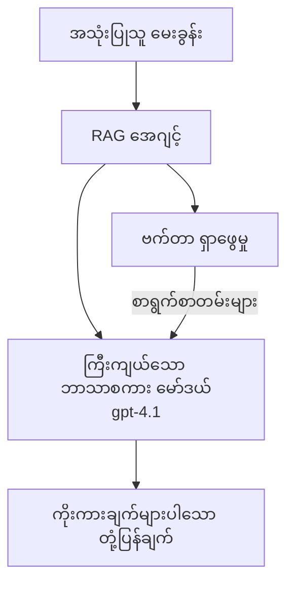
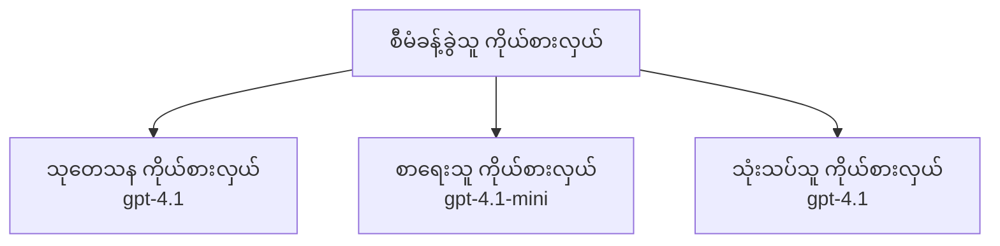

# Azure Developer CLI ဖြင့် AI အေဂျင့်များ

**အကြောင်းအရာ(nav) သွားရန်:**
- **📚 သင်တန်း မူလစာမျက်နှာ**: [AZD For Beginners](../../README.md)
- **📖 လက်ရှိ အခန်း**: အခန်း 2 - AI-ပထမဦးစီး ဖွံ့ဖြိုးတိုးတက်ရေး
- **⬅️ မျက်နှာပြင်**: [Microsoft Foundry Integration](microsoft-foundry-integration.md)
- **➡️ နောက်တစ်ခု**: [AI Model Deployment](ai-model-deployment.md)
- **🚀 တိုးတက်မြှင့်တင်ရန်**: [Multi-Agent Solutions](../../examples/retail-scenario.md)

---

## နိဒါန်း

AI အေဂျင့်များသည် မိမိenviornment ကို ခံစားနိုင်ပြီး ဆုံးဖြတ်ချက်ချနိုင်ကာ သတ်မှတ်ထားသော ရည်မှန်းချက်များကို အောင်မြင်စေရန် လှုပ်ရှားချက်များ ပြုလုပ်နိုင်သော ကိုယ်ပိုင်အလိုအလျောက် အစီအစဉ်များ ဖြစ်သည်။ ပုံမှန် prompt တွေကိုသာ ပြန်ဖြေတဲ့ စာရင်းပြန် စက်များနှင့် မတူဘဲ, အေဂျင့်များမှာ -

- **ကိရိယာများကို သုံးနိုင်ခြင်း** - API များ ခေါ်ရန်၊ ဒေတာဘေ့စ် ရှာဖွေရန်၊ ကုဒ်실행 ပြုလုပ်ရန်
- **အစီအစဉ်ဆွဲခြင်းနှင့် အတွေးအခေါ်ဆောင်ရွက်ခြင်း** - ခက်ခဲသော တာဝန်များကို အဆင့်လိုက် ခွဲခြားဆောင်ရွက်နိုင်ခြင်း
- **အနေအထားအရ သင်ယူနိုင်ခြင်း** - မှတ်ဉာဏ်ကို ထိန်းသိမ်းပြီး အပြုအမူကို ကိုက်ညီစေနိုင်ခြင်း
- **ပူးပေါင်းဆောင်ရွက်နိုင်ခြင်း** - အခြား အေဂျင့်များနှင့် ပေါင်းစည်း ဆောင်ရွက်နိုင်ခြင်း (multi-agent systems)

ဤလမ်းညွှန်သည် Azure တွင် Azure Developer CLI (azd) ကို အသုံးပြု၍ AI အေဂျင့်များ ကို မည်သို့ deploy ပေးရမည်ကို ပြသပေးသည်။

> **အတည်ပြုမှတ်ချက် (2026-03-25):** ဤလမ်းညွှန်ကို `azd` `1.23.12` နှင့် `azure.ai.agents` `0.1.18-preview` ကို အခြေခံ၍ စစ်ဆေးထားပါသည်။ `azd ai` အတွေ့အကြုံသည် preview အခြေအနေတွင် ဆောင်ရွက်နေဆဲဖြစ်၍ သင့် ထည့်သွင်းထားသော flags များကွဲပြားလျှင် extension help ကို ကြည့်ပါ။

## လေ့လာရန် ရည်မှန်းချက်များ

ဤလမ်းညွှန်ကို ပြီးစီးမှခြင်းဖြင့် သင်သည်:
- AI အေဂျင့်များ ဆိုသည်မှာ ဘာလဲ၊ စာရင်းပြန်(sñabot) များနှင့် မည်သို့ကွဲပြားသည်ကို နားလည်ရမည်
- AZD ကိုအသုံးပြု၍ ကြိုတင်ပြင်ဆင်ထားသည့် AI အေဂျင့် template များကို deploy ပေးနိုင်မည်
- စိတ်ကြိုက် အေဂျင့်များအတွက် Foundry Agents ကို ဖွန်ခွဲပေးနိုင်မည်
- အခြေခံ အေဂျင့် အချိုးအစားများ (ကိရိယာအသုံးပြုခြင်း၊ RAG, multi-agent) ကို အကောင်အထည်ဖော်နိုင်မည်
- Deploy လုပ်ထားသည့် အေဂျင့်များကို စောင့်ကြည့်နှင့် debug ရနိုင်မည်

## သင်ယူပြီးရလဒ်များ

ပြီးစီးချိန်တွင် သင်သည်:
- single command သာဖြင့် Azure သို့ AI agent application များကို deploy ပေးနိုင်မည်
- အေဂျင့် ကိရိယာများနှင့် အင်အားများကို ဖွန်ခွဲနိုင်မည်
- agents ဖြင့် retrieval-augmented generation (RAG) ကို အကောင်အထည်ဖော်နိုင်မည်
- ခက်ခဲသော workflow များအတွက် multi-agent အင်ဂျင်နီယာပုံစံများ ဒီဇိုင်းဆွဲနိုင်မည်
- အေဂျင့် deployment ပျက်ကွက်များကို ပြုပြင်ဖြ.Factory

---

## 🤖 အေဂျင့်နှင့် စာရင်းပြန်(sñabot) ကွာခြားချက်များ

| Feature | Chatbot | AI Agent |
|---------|---------|----------|
| **ပြုမူအကျိုးအំပေါ်** | prompts သို့တုံ့ပြန်သည် | ကိုယ်ပိုင် လှုပ်ရှားချက်များ ယူသည် |
| **ကိရိယာများ** | မရှိ | API ခေါ်ဆိုနိုင်၊ ရှာဖွေရန်၊ ကုဒ်실행 ပြုလုပ်နိုင်သည် |
| **မှတ်ဉာဏ်** | session အပေါ်သာ မူတည် | session များဖြတ်ကျော် အတည်အကျန် မှတ်ဉာဏ်ရှိသည် |
| **အစီအစဉ်ဆွဲခြင်း** | တစ်ကြိမ်တည်း ပြန်ဖြေသည် | အဆင့်များစွာ reasoning ပြုလုပ်သည် |
| **ပူးပေါင်းဆောင်ရွက်မှု** | တစ်ခုတည်း အဖွဲ့အစည်း | အခြား အေဂျင့်များနှင့် ပူးပေါင်း လုပ်ဆောင်နိုင်သည် |

### ရိုးရှင်းသဘောတရား တစ်ခု

- **Chatbot** = အချက်အလက် တိုင်ပင်ပေးသည့် စာရေးဆောင် ရှိသူကဲ့သို့ ကူညီပေးနေသူ
- **AI Agent** = ဖုန်းခေါ်၊ အပေါ်ချိန်းပွဲ စီစဉ်၊ တာဝန်များကို ပြီးစီးပေးနိုင်သည့် ကိုယ်ပိုင် အကူအညီပေးသူ

---

## 🚀 စတင်လျင်မြန်နည်း: သင့်ပထမဆုံး အေဂျင့်ကို Deploy လုပ်ပါ

### ရွေးချယ်မှု 1: Foundry Agents Template (အကြံပြု)

```bash
# AI အေးဂျင့်များအတွက် နမူနာကို စတင်ပြုလုပ်ပါ
azd init --template get-started-with-ai-agents

# Azure သို့ ဖြန့်ချိပါ
azd up
```

**ဘာတွေ deploy လုပ်ပေးမလဲ:**
- ✅ Foundry Agents
- ✅ Microsoft Foundry Models (gpt-4.1)
- ✅ Azure AI Search (RAG အတွက်)
- ✅ Azure Container Apps (web interface)
- ✅ Application Insights (စောင့်ကြည့်ရေး)

**အချိန်:** ~15-20 မိနစ်
**ကုန်ကျစရိတ်:** ~$100-150/လ (ဖွံ့ဖြိုးရေး)

### ရွေးချယ်မှု 2: OpenAI Agent with Prompty

```bash
# Prompty အခြေပြု agent ပုံစံကို စတင်တည်ဆောက်ပါ
azd init --template agent-openai-python-prompty

# Azure သို့ တပ်ဆင်ပါ
azd up
```

**ဘာတွေ deploy လုပ်ပေးမလဲ:**
- ✅ Azure Functions (serverless agent 실행)
- ✅ Microsoft Foundry Models
- ✅ Prompty configuration ဖိုင်များ
- ✅ နမူနာ agent အကောင်အထည်ဖော်ခြင်း

**အချိန်:** ~10-15 မိနစ်
**ကုန်ကျစရိတ်:** ~$50-100/လ (ဖွံ့ဖြိုးရေး)

### ရွေးချယ်မှု 3: RAG Chat Agent

```bash
# RAG chat template ကို စတင်သတ်မှတ်ပါ
azd init --template azure-search-openai-demo

# Azure သို့ ဖြန့်ချိပါ
azd up
```

**ဘာတွေ deploy လုပ်ပေးမလဲ:**
- ✅ Microsoft Foundry Models
- ✅ Azure AI Search နှင့် နမူနာဒေတာ
- ✅ စာတမ်းလက်ခံနှင့် အလုပ်လုပ်စနစ်(pipeline)
- ✅ မွမ်းမံချက်များပါရှိသော chat interface

**အချိန်:** ~15-25 မိနစ်
**ကုန်ကျစရိတ်:** ~$80-150/လ (ဖွံ့ဖြိုးရေး)

### ရွေးချယ်မှု 4: AZD AI Agent Init (Manifest- သို့မဟုတ် Template- အပေါ် မူတည်သည့် Preview)

အကယ်၍ သင့်မှာ agent manifest ဖိုင်ရှိပါက `azd ai` command ကို အသုံးပြု၍ Foundry Agent Service project ကို တိုက်ရိုက် scaffold လုပ်နိုင်သည်။ နောက်ဆက်တွဲ preview releases များသည် template-based initialization ကိုလည်း ထပ်ထည့်ပေးထားသဖြင့် သင့်ထည့်သွင်းထားသော extension version အပေါ်မူတည်၍ prompt flow သည် သေးငယ်စွာကွာခြားနိုင်သည်။

```bash
# AI agents extension ကို တပ်ဆင်ပါ
azd extension install azure.ai.agents

# ရွေးချယ်စရာ: ထည့်သွင်းထားသော ကြိုတင်စမ်းသပ် ဗားရှင်းကို အတည်ပြုပါ
azd extension show azure.ai.agents

# အေးဂျင့် ဖော်ပြချက်မှ စတင်ပါ
azd ai agent init -m agent-manifest.yaml

# Azure သို့ ဖြန့်ချိပါ
azd up
```

**`azd ai agent init` ကို ဘယ်အချိန်သုံးမလဲ၊ `azd init --template` ကို ဘယ်လိုသုံးမလဲ:**

| Approach | Best For | How It Works |
|----------|----------|------|
| `azd init --template` | အလုပ်လုပ်နိုင်သော နမူနာ app ထဲကနေ စတင်လိုသူများ | code + infra ပါရှိသော full template repo ကို clone လုပ်ပေးသည် |
| `azd ai agent init -m` | မိမိ၏ agent manifest မှ စတင်ဆောက်လိုသူများ | agent definition မှ project structure ကို scaffold လုပ်ပေးသည် |

> **အကြံပြုချက်:** သင်ယူနေစဉ် (အထက်ပါ ရွေးချယ်မှု 1-3) တွင် `azd init --template` ကို အသုံးပြုပါ။ သင့်ကိုယ်ပိုင် manifests များနှင့် production အေဂျင့်များ တည်ဆောက်လိုပါက `azd ai agent init` ကို အသုံးပြုပါ။ အပြည့်အစုံ ရည်ညွှန်းချက်အတွက် [AZD AI CLI Commands](../chapter-08-production/production-ai-practices.md#azd-ai-cli-commands-and-extensions) ကို ကြည့်ပါ။

---

## 🏗️ အေဂျင့် အထောက်အထား ပုံစံများ

### ပုံစံ 1: ကိရိယာများပါရှိသည့် တစ်ဦးတည်း အေဂျင့်

အရိုးရှင်းဆုံး အေဂျင့် ပုံစံ - ကိရိယာအသည်းအသန် များစွာသုံးနိုင်သော မည်သည့် အေဂျင့်တစ်ခုကိုဆိုသည်။


**အကောင်းဆုံး သုံးနိုင်မည့် အရာများ:**
- ဖောက်သည်အထောက်အပံ့ ဘော့များ
- သုတေသနအကူအညီပေးသူများ
- ဒေတာ phânသန်း အကူအညီပေးသူများ

**AZD Template:** `azure-search-openai-demo`

### ပုံစံ 2: RAG Agent (Retrieval-Augmented Generation)

တုံ့ပြန်မှု ထုတ်ပေးမှုမပြုမီ သက်ဆိုင်ရာစာရွက်များကို ရှာဖွေယူပြီး ဖြေကြားပေးသည့် အေဂျင့်။


**အကောင်းဆုံး သုံးနိုင်မည့် အရာများ:**
- စီးပွားရေး အချက်အလက်အသစ်များ
- စာရွက် Q&A စနစ်များ
- ကိုက်ညီမှုနှင့် ဥပဒေရေးရာ သုတေသန

**AZD Template:** `azure-search-openai-demo`

### ပုံစံ 3: Multi-Agent System

နယ်ပယ်စိတ်ပိုင်းအလိုက် အထူးပြုထားသည့် အေဂျင့် အများအပြားက ခက်ခဲသော တာဝန်များကို ပူးပေါင်းဆောင်ရွက်သည်။


**အကောင်းဆုံး သုံးနိုင်မည့် အရာများ:**
- ခက်ခဲသော အကြောင်းအရာ ကို စုစည်းဖန်တီးခြင်း
- အဆင့်စဉ်လုပ်ငန်းစဉ်များ
- အတတ်ပညာနှင့် ကျွမ်းကျင်မှု မတူညီသည့် လုပ်ငန်းများ

**ပိုမိုလေ့လာရန်:** [Multi-Agent Coordination Patterns](../chapter-06-pre-deployment/coordination-patterns.md)

---

## ⚙️ အေဂျင့် ကိရိယာများ ဖွန်ခွဲခြင်း

ကိရိယာများကို အသုံးပြုနိုင်သည်ဆိုပါက အေဂျင့်များသည် အင်အားပြင်းになります။ အောက်တွင် ပုံမှန် ကိရိယာများကို မည်သို့ ဖွန်ခွဲရမည်ကို ဖော်ပြထားသည်။

### Foundry Agents တွင် Tool ဖွန်ခွဲခြင်း

```python
# agent_config.py
from azure.ai.projects import AIProjectClient
from azure.ai.projects.models import FunctionTool, CodeInterpreterTool

# စိတ်ကြိုက် ကိရိယာများကို သတ်မှတ်ပါ
search_tool = FunctionTool(
    name="search_knowledge_base",
    description="Search the company knowledge base for relevant documents",
    parameters={
        "type": "object",
        "properties": {
            "query": {
                "type": "string",
                "description": "The search query"
            }
        },
        "required": ["query"]
    }
)

# ကိရိယာများနှင့် အေဂျင့်တစ်ခု ဖန်တီးပါ
agent = project_client.agents.create_agent(
    model="gpt-4.1",
    name="Support Agent",
    instructions="You are a helpful support agent. Use the search tool to find relevant information.",
    tools=[search_tool, CodeInterpreterTool()]
)
```

### ပတ်ဝန်းကျင် ဖွန်ခွဲခြင်း (Environment Configuration)

```bash
# Agent အတွက် သီးသန့် ပတ်ဝန်းကျင် တန်ဖိုးများကို ပြင်ဆင် သတ်မှတ်ပါ
azd env set AZURE_OPENAI_MODEL "gpt-4.1"
azd env set AGENT_INSTRUCTIONS "You are a helpful assistant..."
azd env set ENABLE_CODE_INTERPRETER "true"
azd env set ENABLE_FILE_SEARCH "true"

# ပြင်ဆင်ထားသည့် ဖွဲ့စည်းမှုဖြင့် တပ်ဆင်ပါ
azd deploy
```

---

## 📊 အေဂျင့်များ စောင့်ကြည့်ခြင်း

### Application Insights များ ဆက်သွယ်ခြင်း

AZD agent template များအားလုံးတွင် monitoring အတွက် Application Insights ပါဝင်သည်။

```bash
# စောင့်ကြည့်မှု ဒက်ရှ်ဘုတ်ကို ဖွင့်ရန်
azd monitor --overview

# တိုက်ရိုက် မှတ်တမ်းများကို ကြည့်ရန်
azd monitor --logs

# တိုက်ရိုက် မက်ထရစ်များကို ကြည့်ရန်
azd monitor --live
```

### ကြည့်ရှုရန် အဓိက မီထရစ်များ

| Metric | Description | Target |
|--------|-------------|--------|
| Response Latency | တုံ့ပြန်မှု ထုတ်ပေးရန် ကြာချိန် | < 5 seconds |
| Token Usage | တောင်းဆိုမှု တစ်ခုလျှင် token များ | ကုန်ကျစရိတ်အတွက် မှီကြည့်ရန် |
| Tool Call Success Rate | ကိရိယာ ခေါ်ဆိုမှုများအောင်မြင် သော ရာခိုင်နှုန်း | > 95% |
| Error Rate | အေဂျင့် တောင်းဆိုမှု မအောင်မြင်မှု | < 1% |
| User Satisfaction | အသုံးပြုသူ ရီယူမွန် ရမှတ်များ | > 4.0/5.0 |

### အေဂျင့်များ အတွက် စိတ်ကြိုက် လော့ဂ်ရေးခြင်း

```python
import os
from azure.monitor.opentelemetry import configure_azure_monitor
from opentelemetry import trace

# OpenTelemetry ဖြင့် Azure Monitor ကို ဖွဲ့စည်းပါ
configure_azure_monitor(
    connection_string=os.environ["APPLICATIONINSIGHTS_CONNECTION_STRING"]
)

tracer = trace.get_tracer(__name__)

def log_agent_interaction(user_query, agent_response, tools_used, latency_ms):
    with tracer.start_as_current_span("agent_interaction") as span:
        span.set_attributes({
            "user_query": user_query,
            "response_length": len(agent_response),
            "tools_used": tools_used,
            "latency_ms": latency_ms
        })
```

> **မှတ်ချက်:** လိုအပ်သော package များကို install လုပ်ပါ: `pip install azure-monitor-opentelemetry opentelemetry`

---

## 💰 ကုန်ကျစရိတ်ဆိုင်ရာ အကြံပြုချက်များ

### ပုံစံအလိုက် လစဉ် ခန့်မှန်း ကုန်ကျစရိတ်များ

| Pattern | Dev Environment | Production |
|---------|-----------------|------------|
| Single Agent | $50-100 | $200-500 |
| RAG Agent | $80-150 | $300-800 |
| Multi-Agent (2-3 agents) | $150-300 | $500-1,500 |
| Enterprise Multi-Agent | $300-500 | $1,500-5,000+ |

### ကုန်ကျစရိတ် Optimize ပြုလုပ်ရန် အကြံပြုချက်များ

1. **ရိုးရှင်းသော တာဝန်များအတွက် gpt-4.1-mini ကို အသုံးပြုပါ**
   ```bash
   azd env set AZURE_OPENAI_MODEL "gpt-4.1-mini"
   ```

2. **ပြန်မေးမြန်းမှုများအတွက် caching ကို အကောင်အထည်ဖော်ပါ**
   ```python
   from functools import lru_cache
   
   @lru_cache(maxsize=1000)
   def get_cached_response(query_hash):
       return agent.run(query_hash)
   ```

3. **run တစ်ခုလျှင် token ကန့်သတ်ချက်ထားပါ**
   ```python
   # ဖန်တီးစဉ်တွင်မဟုတ်ဘဲ အေးဂျင့်ကို လည်ပတ်စဉ် max_completion_tokens ကို သတ်မှတ်ပါ
   run = project_client.agents.create_run(
       thread_id=thread.id,
       agent_id=agent.id,
       max_completion_tokens=1000  # တုံ့ပြန်ချက်၏ အရှည်ကို ကန့်သတ်ပါ
   )
   ```

4. **မအသုံးပြုနေချိန်တွင် scale to zero ပြုလုပ်ပါ**
   ```bash
   # Container Apps များသည် အလိုအလျောက် အင်စတန်စ်အရေအတွက်ကို သုညအထိ လျော့ချနိုင်သည်
   azd env set MIN_REPLICAS "0"
   ```

---

## 🔧 အေဂျင့်များ ပြဿနာရှာဖွေရန်

### ပုံမှန် ပြဿနာများနှင့် ဖြေရှင်းချက်များ

<details>
<summary><strong>❌ အေဂျင့်က ကိရိယာ ခေါ်ဆိုချက်များကို မတုံ့ပြန်ခြင်း</strong></summary>

```bash
# ကိရိယာများကို မှန်ကန်စွာ မှတ်ပုံတင်ထားသည်ကို စစ်ဆေးပါ
azd show

# OpenAI ဖြန့်ချိမှုကို စစ်ဆေးပါ
az cognitiveservices account deployment list \
  --name $AZURE_OPENAI_NAME \
  --resource-group $RG_NAME

# အေးဂျင့်မှတ်တမ်းများကို စစ်ဆေးပါ
azd monitor --logs
```

**ပုံမှန် အကြောင်းရင်းများ:**
- ကိရိယာ function signature မကိုက်ညီခြင်း
- လိုအပ်သော ခွင့်ပြုချက်များ မရှိခြင်း
- API endpoint မရောက်နိုင်ခြင်း
</details>

<details>
<summary><strong>❌ အေဂျင့် တုံ့ပြန်မှုတွင် latency မြင့်မားခြင်း</strong></summary>

```bash
# Application Insights တွင် ကြုံတွေ့ရသည့် တင်းကျပ်နေမှုများကို စစ်ဆေးပါ
azd monitor --live

# ပိုမိုမြန်ဆန်သော မော်ဒယ်ကို အသုံးပြုရန် စဉ်းစားပါ
azd env set AZURE_OPENAI_MODEL "gpt-4.1-mini"
azd deploy
```

**အကောင်းဆုံး တိုးတက်ရေး အကြံပြုချက်များ:**
- streaming responses ကို သုံးပါ
- တုံ့ပြန်မှု caching ကို အကောင်အထည်ဖော်ပါ
- context window အရွယ်အစားကို လျော့ပါးစေပါ
</details>

<details>
<summary><strong>❌ အေဂျင့်မှ မှားဆန်သော သို့မဟုတ် hallucination ဖြစ်သော အချက်အလက် ပြန်လည်ပေးခြင်း</strong></summary>

```python
# ပိုမိုကောင်းမွန်သော စနစ် ပြောကြားချက်များဖြင့် တိုးတက်စေပါ
instructions = """
You are a helpful assistant. IMPORTANT:
- Only answer based on provided context
- If you don't know, say "I don't know"
- Always cite your sources
- Never make up information
"""

# အချက်အလက် အခြေခံမှုအတွက် ရှာဖွေရေးကို ထည့်ပါ
agent = project_client.agents.create_agent(
    model="gpt-4.1",
    instructions=instructions,
    tools=[FileSearchTool()]  # တုံ့ပြန်ချက်များကို စာရွက်စာတမ်းများအပေါ် အခြေခံပါ
)
```
</details>

<details>
<summary><strong>❌ Token limit မကျေနပ်မှု အမှားများ (exceeded errors)</strong></summary>

```python
# အကြောင်းအရာ ဝင်းဒိုးကို စီမံခန့်ခွဲရန် အကောင်အထည်ဖော်ပါ
def truncate_context(messages, max_tokens=8000, model="gpt-4.1"):
    """Keep only recent messages within token limit."""
    import tiktoken
    encoding = tiktoken.encoding_for_model(model)
    total_tokens = 0
    truncated = []
    
    for msg in reversed(messages):
        msg_tokens = len(encoding.encode(msg.content))
        if total_tokens + msg_tokens > max_tokens:
            break
        truncated.insert(0, msg)
        total_tokens += msg_tokens
    
    return truncated
```
</details>

---

## 🎓 လက်တွေ့ လေ့ကျင့်ခန်းများ

### လေ့ကျင့်ခန်း 1: အခြေခံ အေဂျင့် တစ်ခု Deploy လုပ်ခြင်း (20 မိနစ်)

**ရည်ရွယ်ချက်:** AZD ကို အသုံးပြု၍ သင့် ပထမဆုံး AI အေဂျင့်ကို Deploy လုပ်ပါ

```bash
# အဆင့် 1: ပုံစံကို စတင်တည်ဆောက်ပါ
azd init --template get-started-with-ai-agents

# အဆင့် 2: Azure သို့ လော့ဂ်အင် ဝင်ပါ
azd auth login
# အကယ်၍ သင်သည် tenant များအကြား အလုပ်လုပ်နေပါက --tenant-id <tenant-id> ကို ထည့်ပါ

# အဆင့် 3: ဖြန့်ချိပါ
azd up

# အဆင့် 4: အေးဂျင့်ကို စမ်းသပ်ပါ
# ဖြန့်ချိပြီးနောက် မျှော်မှန်းထားသော ထွက်:
#   ဖြန့်ချိမှု ပြီးစီးပါပြီ!
#   အင်ဒ်ပိုင်း (Endpoint): https://<app-name>.<region>.azurecontainerapps.io
# ထွက်ပြချက်တွင် ပြထားသော URL ကို ဖွင့်ပြီး မေးခွန်း မေးကြည့်ပါ

# အဆင့် 5: မော်နီတာကို ကြည့်ရှုပါ
azd monitor --overview

# အဆင့် 6: ရှင်းလင်းပါ
azd down --force --purge
```

**အောင်မြင်မှု အခြေအနေများ:**
- [ ] အေဂျင့်သည် မေးခွန်းများကို တုံ့ပြန်သည်
- [ ] `azd monitor` ဖြင့် monitoring dashboard ကို ဝင်ရောက်ကြည့်ရှုနိုင်သည်
- [ ] ရင်းနှီးမြှုပ်နှံထားသော အရင်းအမြစ်များကို ရှင်းလင်း ထုတ်ပစ်နိုင်သည့်အခြေအနေ ဖြစ်သည်

### လေ့ကျင့်ခန်း 2: စိတ်ကြိုက် ကိရိယာ တစ်ခု ထည့်သွင်းခြင်း (30 မိနစ်)

**ရည်ရွယ်ချက်:** အေဂျင့်ကို စိတ်ကြိုက် ကိရိယာဖြင့် အချိုးချိတ်ပေးပါ

1. agent template ကို deploy လုပ်ပါ:
   ```bash
   azd init --template get-started-with-ai-agents
   azd up
   ```
2. သင့် agent code တွင် ကိရိယာ function အသစ် တစ်ခု ဘယ်လို ဖန်တီးမလဲ:
   ```python
   def get_weather(location: str) -> str:
       """Get current weather for a location."""
       # မိုးလေဝသ ဝန်ဆောင်မှုသို့ API ခေါ်ယူခြင်း
       return f"Weather in {location}: Sunny, 72°F"
   ```
3. ကိရိယာကို agent နှင့် မှတ်ပုံတင်ပါ:
   ```python
   from azure.ai.projects.models import FunctionTool

   weather_tool = FunctionTool(
       name="get_weather",
       description="Get current weather for a location",
       parameters={
           "type": "object",
           "properties": {
               "location": {"type": "string", "description": "City name"}
           },
           "required": ["location"]
       }
   )

   agent = project_client.agents.create_agent(
       model="gpt-4.1",
       name="Weather Agent",
       tools=[weather_tool]
   )
   ```
4. ပြန်လည် deploy ပြီး စမ်းသပ်ပါ:
   ```bash
   azd deploy
   # မေးရန်: "Seattle ရဲ့ မိုးလေဝသ ဘယ်လိုရှိသလဲ?"
   # မျှော်မှန်းချက်: အေဂျင့်သည် get_weather("Seattle") ကို ခေါ်၍ မိုးလေဝသ အချက်အလက်ကို ပြန်ပေးမည်
   ```

**အောင်မြင်မှု အခြေအနေများ:**
- [ ] အေဂျင့်သည် ရာသီဥတု ဆိုင်ရာ မေးခွန်းများကို အသိအမှတ်ပြုသည်
- [ ] ကိရိယာကို မှန်ကန်စွာ ခေါ်ဆိုသည်
- [ ] တုံ့ပြန်မှုတွင် ရာသီဥတု အချက်အလက် ပါဝင်သည်

### လေ့ကျင့်ခန်း 3: RAG အေဂျင့် တည်ဆောက်ခြင်း (45 မိနစ်)

**ရည်ရွယ်ချက်:** သင့်စာရွက်များမှ မေးခွန်းများကို ဖြေကြားနိုင်သည့် အေဂျင့်တစ်ခု ဖန်တီးပါ

```bash
# အဆင့် 1: RAG template ကို တပ်ဆင်ပါ
azd init --template azure-search-openai-demo
azd up

# အဆင့် 2: မိမိ၏ စာရွက်စာတမ်းများကို တင်ပါ
# PDF/TXT ဖိုင်များကို data/ ဖိုလ်ဒါထဲသို့ ထားပြီး၊ ထို့နောက် အောက်ပါအတိုင်း အမိန့်ကို လုပ်ဆောင်ပါ:
python scripts/prepdocs.py

# အဆင့် 3: အထူးကဏ္ဍဆိုင်ရာ မေးခွန်းများဖြင့် စမ်းသပ်ပါ
# azd up output ထဲမှ web app URL ကို ဖွင့်ပါ
# သင့်တင်ထားသော စာရွက်စာတမ်းများအကြောင်း မေးမြန်းပါ
# တုံ့ပြန်ချက်များတွင် [doc.pdf] ကဲ့သို့ ထောက်အထားများ ပါဝင်သင့်သည်
```

**အောင်မြင်မှု အခြေအနေများ:**
- [ ] အေဂျင့်သည် တင်သွင်းထားသော စာရွက်များမှ ဖြေကြားသည်
- [ ] တုံ့ပြန်မှုများတွင် citation များ ပါဝင်သည်
- [ ] အကွာအဝေးတွင်မကျသော မေးခွန်းများအပေါ် hallucination မဖြစ်ပေါ်စေပါ

---

## 📚 နောက်တစ်ဆင့်များ

AI အေဂျင့်များကို နားလည်ပြီးပါက အောက်ပါ တိုးတက်ဆက်လက်ဘာများကို လေ့လာပါ:

| Topic | Description | Link |
|-------|-------------|------|
| **Multi-Agent Systems** | အခြား အေဂျင့်များနှင့် ပူးပေါင်းထားသည့် စနစ်များတည်ဆောက်ခြင်း | [Retail Multi-Agent Example](../../examples/retail-scenario.md) |
| **Coordination Patterns** | orchestration နှင့် ဆက်သွယ်ရေး ပုံစံများကို လေ့လာရန် | [Coordination Patterns](../chapter-06-pre-deployment/coordination-patterns.md) |
| **Production Deployment** | အဖွဲ့အစည်းအဆင့် အသင့်တော်ဆုံး agent deployment | [Production AI Practices](../chapter-08-production/production-ai-practices.md) |
| **Agent Evaluation** | အေဂျင့်အလုပ်လုပ်ပုံကို စမ်းသပ်နှင့် အကဲဖြတ်ရန် | [AI Troubleshooting](../chapter-07-troubleshooting/ai-troubleshooting.md) |
| **AI Workshop Lab** | လက်တွေ့လုပ်ငန်း: သင့် AI ဖြေရှင်းချက်ကို AZD-အဆင်ပြေအောင် ပြင်ဆင်ပါ | [AI Workshop Lab](ai-workshop-lab.md) |

---

## 📖 ထပ်မံ အရင်းအမြစ်များ

### တရားဝင် မှတ်တမ်းစာမျက်နှာများ
- [Azure AI Agent Service](https://learn.microsoft.com/azure/ai-services/agents/)
- [Azure AI Foundry Agent Service Quickstart](https://learn.microsoft.com/azure/ai-services/agents/quickstart)
- [Semantic Kernel Agent Framework](https://learn.microsoft.com/semantic-kernel/)

### အေဂျင့်များအတွက် AZD Templates
- [Get Started with AI Agents](https://github.com/Azure-Samples/get-started-with-ai-agents)
- [Agent OpenAI Python Prompty](https://github.com/Azure-Samples/agent-openai-python-prompty)
- [Azure Search OpenAI Demo](https://github.com/Azure-Samples/azure-search-openai-demo)

### အသိုက်အဖွဲ့ အရင်းအမြစ်များ
- [Awesome AZD - Agent Templates](https://azure.github.io/awesome-azd/?tags=ai-agents)
- [Azure AI Discord](https://discord.gg/microsoft-azure)
- [Microsoft Foundry Discord](https://discord.gg/nTYy5BXMWG)

### သင့် Editor အတွက် Agent Skills
- [**Microsoft Azure Agent Skills**](https://skills.sh/microsoft/github-copilot-for-azure) - GitHub Copilot, Cursor သို့မဟုတ် ထောက်ခံသော agent မည်သူမဆိုတွင် Azure ဖွံ့ဖြိုးရေးအတွက် ပြန်လည်အသုံးပြုနိုင်သော AI agent skills များ ထည့်သွင်းနိုင်သည်။ ၎င်းတွင် [Azure AI](https://skills.sh/microsoft/github-copilot-for-azure/azure-ai), [Microsoft Foundry](https://skills.sh/microsoft/github-copilot-for-azure/microsoft-foundry), [deployment](https://skills.sh/microsoft/github-copilot-for-azure/azure-deploy), နှင့် [diagnostics](https://skills.sh/microsoft/github-copilot-for-azure/azure-diagnostics) အတွက် skills များ ပါဝင်သည်:
  ```bash
  npx skills add microsoft/github-copilot-for-azure
  ```

---

**သွားရာလမ်းညွှန်**
- **ယခင် သင်ခန်းစာ**: [Microsoft Foundry Integration](microsoft-foundry-integration.md)
- **နောက်တစ်ခန်း**: [AI Model Deployment](ai-model-deployment.md)

---

<!-- CO-OP TRANSLATOR DISCLAIMER START -->
**Disclaimer**:
ဤစာရွက်ကို AI ဘာသာပြန်ဆိုင်ရာ ဝန်ဆောင်မှု [Co-op Translator](https://github.com/Azure/co-op-translator) ဖြင့် ဘာသာပြန်ထားပါသည်။ ကျွန်ုပ်တို့သည် တိကျမှန်ကန်မှုအတွက် ကြိုးပမ်းသော်လည်း အလိုအလျောက်ဘာသာပြန်ချက်များတွင် အမှားများ သို့မဟုတ် မှားယွင်းချက်များ ပါဝင်နိုင်ကြောင်း ကျေးဇူးပြု၍ သတိပြုပါ။ မူရင်းဘာသာဖြင့် ရေးသားထားသော မူလစာရွက်ကို တရားဝင် အရင်းအမြစ်အဖြစ် သတ်မှတ်စဉ်းစားသင့်သည်။ အရေးကြီးသော အချက်အလက်များအတွက် လူ့ပညာရှင် ပရော်ဖက်ရှင်နල් ဘာသာပြန်သူမှ ဘာသာပြန်ပေးစေရန် အကြံပြုပါသည်။ ဤဘာသာပြန်ချက်ကို အသုံးပြုခြင်းမှ ဖြစ်ပေါ်လာနိုင်သည့် နားမလည်မှုများ သို့မဟုတ် မှားယွင်းဖတ်ရှုမှုများအတွက် ကျွန်ုပ်တို့ တာဝန်မယူပါ။
<!-- CO-OP TRANSLATOR DISCLAIMER END -->