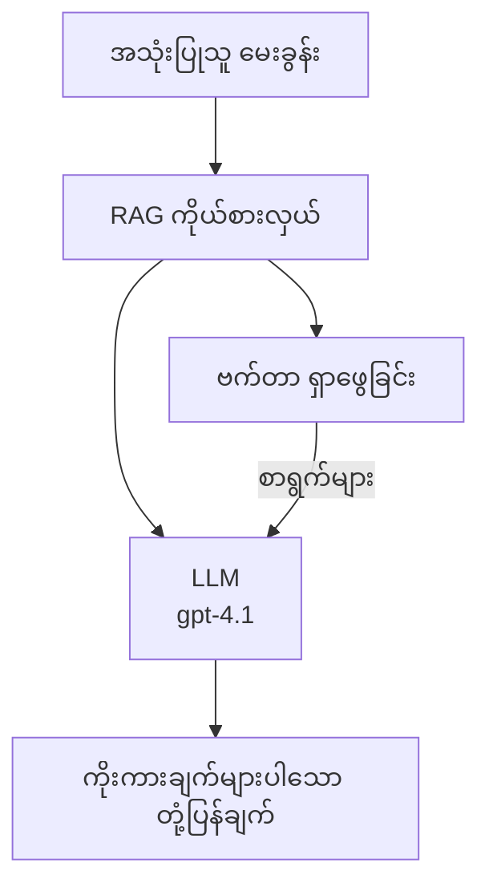
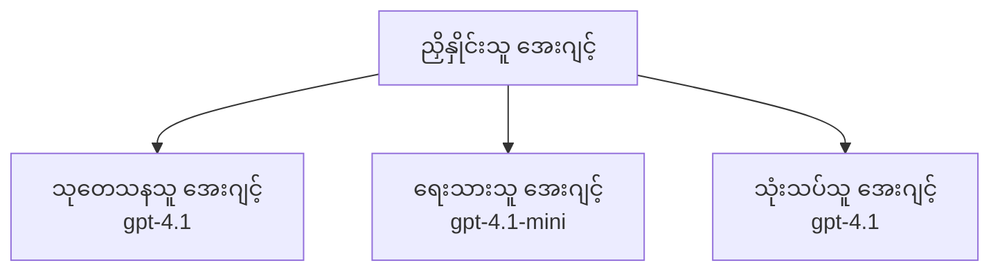

# Azure Developer CLI ဖြင့် AI အေဂျင့်များ

**အခန်း လမ်းညွှန်:**
- **📚 သင်တန်း မူလစာမျက်နှာ**: [AZD အစပြုသူများအတွက်](../../README.md)
- **📖 လက်ရှိ အခန်း**: အခန်း 2 - AI-ဦးစားပေး ဖွံ့ဖြိုးရေး
- **⬅️ ယခင်**: [Microsoft Foundry ပေါင်းစည်းမှု](microsoft-foundry-integration.md)
- **➡️ နောက်တစ်ခု**: [AI မော်ဒယ် တင်သွင်းခြင်း](ai-model-deployment.md)
- **🚀 အဆင့်မြင့်**: [အမြောက်အများ အေဂျင့် ဖြေရှင်းချက်များ](../../examples/retail-scenario.md)

---

## နိဒါန်း

AI အေဂျင့်များသည် သူတို့၏ ပတ်ဝန်းကျင်ကို သတိပြု၍ ဆုံးဖြတ်ချက်များ ချနိုင်ကာ သတ်မှတ်ထားသော ရည်ရွယ်ချက်များကို ရောက်ရှိအောင် လုပ်ဆောင်နိုင်သည့် ကိုယ်ပိုင် လုပ်ဆောင်နိုင်သော ပရိုဂရမ်းများဖြစ်သည်။ အမိန့်များကို တုံ့ပြန်သော ရိုးရှင်းသော chatbot များနှင့် မတူဘဲ၊ အေဂျင့်များသည် အောက်ပါများကို လုပ်ဆောင်နိုင်သည်။

- **ကိရိယာများ အသုံးပြုနိုင်ခြင်း** - API များကို ခေါ်ဆိုခြင်း၊ ဒေတာဘေ့(စ်)များကို ရှာဖွေခြင်း၊ ကုဒ်ကို ဆောင်ရွက်ခြင်း
- **အစီအစဉ်ရေးဆွဲခြင်း နှင့် အတွေးပေါင်းစည်းခြင်း** - ရှုပ်ထွေးသော လုပ်ငန်းများကို အဆင့်များအဖြစ် ခွဲခြမ်းစဉ်းစားခြင်း
- **Context မှ သင်ယူခြင်း** - မှတ်ဉာဏ် ထိန်းသိမ်းကာ အပြုအမူကို ကိုက်ညီအောင် ပြုပြင်နိုင်ခြင်း
- **ပူးပေါင်းဆောင်ရွက်ခြင်း** - အခြား အေဂျင့်များနှင့် ပူးပေါင်း အလုပ်လုပ်နိုင်ခြင်း (multi-agent systems)

ဒီလမ်းညွှန်စာသည် Azure Developer CLI (azd) ကို အသုံးပြု၍ Azure သို့ AI အေဂျင့်များကို မည်သို့ တင်သွင်းရမည်ကို ပြသသည်။

> **စစ်ဆေး မှတ်ချက် (2026-03-25):** ဒီလမ်းညွှန်ကို `azd` `1.23.12` နှင့် `azure.ai.agents` `0.1.18-preview` အပေါ် သုံးသပ်ပြီး စစ်ဆေးခဲ့ပါသည်။ `azd ai` အတွေ့အကြုံသည် အခုလက်ရှိတွင် preview အခြေခံဖြစ်နေဆဲဖြစ်သောကြောင့် သင်ထည့်သွင်းထားသော flags မတူပါက extension အကူအညီကို စစ်ဆေးပါ။

## သင်ယူရမည့် ရည်မှန်းချက်များ

ဒီလမ်းညွှန်ကို အပြီးသတ်လျှင် သင်သည်:
- AI အေဂျင့်များ၏ အဓိပ္ပါယ်နှင့် chatbot များနှင့် မည်သို့ ကွာခြားကြောင်း နားလည်နိုင်မည်
- AZD ကို အသုံးပြု၍ ကြိုတင်ဆောက်ထားသော AI အေဂျင့် နမူနာများကို တင်သွင်းနိုင်မည်
- စိတ်ကြိုက် အေဂျင့်များအတွက် Foundry Agents ကို ပြင်ဆင်နိုင်မည်
- အခြေခံ အေဂျင့် ပုံစံများ (ကိရိယာ အသုံးချခြင်း၊ RAG၊ multi-agent) ကို အကောင်အထည်ဖော်နိုင်မည်
- တင်သွင်းထားသော အေဂျင့်များကို မော်နီတာပြု၍ ဒက်ဘတ်လုပ်နိုင်မည်

## သင်ယူပြီးရလဒ်များ

ပြီးစီးသည်နှင့်အမျှ သင်သည် အောက်ပါအရာများကို လုပ်နိုင်မည်။
- တစ်ချက်အမိန့်ဖြင့် Azure သို့ AI အေဂျင့် အက်ပလီကေးရှင်းများ တင်သွင်းနိုင်မည်
- အေဂျင့် ကိရိယာများနှင့် စွမ်းရည်များကို ပြင်ဆင်နိုင်မည်
- အေဂျင့်များဖြင့် retrieval-augmented generation (RAG) ကို အကောင်အထည်ဖော်နိုင်မည်
- ရှုပ်ထွေးသော လုပ်ငန်းစဉ်များအတွက် multi-agent ဆောက်တည်မှုပုံစံများဒီဇိုင်းရေးဆွဲနိုင်မည်
- အေဂျင့် တင်သွင်းစဉ် တွေ့ကြုံရနိုင်သော ပြဿနာများကို ဖြေရှင်းနိုင်မည်

---

## 🤖 AI အေဂျင့် သည် Chatbot နှင့် မည်ကြောင့် ကွာခြားသနည်း?

| အင်္ဂါရပ် | Chatbot | AI အေဂျင့် |
|---------|---------|----------|
| **အပြုအမူ** | အမိန့်များကို တုံ့ပြန်သည် | ကိုယ်ပိုင် လုပ်ဆောင်ချက်များ ဆောင်ရွက်သည် |
| **ကိရိယာများ** | မရှိ | API များကို ခေါ်ဆိုနိုင်၊ ရှာဖွေနိုင်၊ ကုဒ်ကို ဆောင်ရွက်နိုင်သည် |
| **မှတ်ဉာဏ်** | session အခြေခံသာ | session များ ကျော်လွန်၍ တည်တံ့သော မှတ်ဉာဏ် ရှိသည် |
| **အစီအစဉ်ရေးဆွဲခြင်း** | တစ်ကြိမ်တုံ့ပြန်ချက် | အဆင့်များစွာ အသုံးပြု၍ အတွေးပညာဆောင်ရွက်ခြင်း |
| **ပူးပေါင်းဆောင်ရွက်ခြင်း** | တစ်ဦးတည်း | အခြား အေဂျင့်များနှင့် တို့ ပူးပေါင်း လုပ်ကိုင်နိုင်သည် |

### ရိုးရှင်းသော နှိုင်းယှဉ်ချက်

- **Chatbot** = သတင်းအချက်အလက် စင်တာတွင် မေးခွန်းများကို ကူညီ ဖြေဆိုပေးသည့် လူတစ်ဦး
- **AI အေဂျင့်** = ဖုန်းခေါ်ဆိုနိုင်ပြီး၊ အစည်းအဝေး ချိတ်ဆက်ပေးနိုင်ပြီး၊ သင့်အတွက် အလုပ်များ ပြီးစီးပေးနိုင်သည့် ကိုယ်ပိုင် အကူ

---

## 🚀 အမြန် စတင်ခြင်း: သင်၏ ပထမ အေဂျင့် တင်သွင်းခြင်း

### ရွေးချယ်စရာ 1: Foundry Agents နမူနာ (အကြံပြု)

```bash
# AI အေးဂျင့်များအတွက် ပုံစံကို စတင်သတ်မှတ်ပါ
azd init --template get-started-with-ai-agents

# Azure သို့ တပ်ဆင်ပါ
azd up
```

**ဘာတွေ တင်သွင်းမလဲ:**
- ✅ Foundry Agents
- ✅ Microsoft Foundry Models (gpt-4.1)
- ✅ Azure AI Search (for RAG)
- ✅ Azure Container Apps (web interface)
- ✅ Application Insights (monitoring)

**အချိန်:** ~15-20 မိနစ်
**ကုန်ကျစရိတ်:** ~$100-150/လ (ဖွံ့ဖြိုးရေး)

### ရွေးချယ်စရာ 2: Prompty ဖြင့် OpenAI Agent

```bash
# Prompty အပေါ် အခြေခံထားသည့် agent ပုံစံကို စတင်ဖန်တီးပါ
azd init --template agent-openai-python-prompty

# Azure သို့ တပ်ဆင်ပါ
azd up
```

**ဘာတွေ တင်သွင်းမလဲ:**
- ✅ Azure Functions (serverless agent execution)
- ✅ Microsoft Foundry Models
- ✅ Prompty configuration files
- ✅ Sample agent implementation

**အချိန်:** ~10-15 မိနစ်
**ကုန်ကျစရိတ်:** ~$50-100/လ (ဖွံ့ဖြိုးရေး)

### ရွေးချယ်စရာ 3: RAG Chat Agent

```bash
# RAG chat ပုံစံကို စတင်ဖန်တီးခြင်း
azd init --template azure-search-openai-demo

# Azure သို့ တပ်ဆင်ခြင်း
azd up
```

**ဘာတွေ တင်သွင်းမလဲ:**
- ✅ Microsoft Foundry Models
- ✅ Azure AI Search နှင့် နမူနာဒေတာများ
- ✅ စာရွက်စာတမ်းများ ကို လုပ်ဆောင်ပေးသော pipeline
- ✅ ရည်ညွှန်းချက်များပါသော chat interface

**အချိန်:** ~15-25 မိနစ်
**ကုန်ကျစရိတ်:** ~$80-150/လ (ဖွံ့ဖြိုးရေး)

### ရွေးချယ်စရာ 4: AZD AI Agent Init (Manifest- သို့မဟုတ် Template- အခြေပြုပြီ Preview)

Agent manifest ဖိုင်ရှိပါက `azd ai` command ကို အသုံးပြုပြီး Foundry Agent Service ပရောဂျက်ကို တိုက်ရိုက် scaffolding ပြုလုပ်နိုင်သည်။ နောက်ဆုံး preview ဖြန့်ချိမှုများတွင် template-based initialization ကိုလည်း ထည့်သွင်းထားသဖြင့် သင်ထည့်သွင်းထားသော extension ဗားရှင်းပေါ် မူတည်၍ prompt flow က ဆန့်ကျင်မှုငယ်ငယ် ရှိနိုင်သည်။

```bash
# AI agent များအတွက် extension ကို တပ်ဆင်ပါ
azd extension install azure.ai.agents

# ရွေးချယ်စရာ: တပ်ဆင်ထားသော preview ဗားရှင်းကို စစ်ဆေးပါ
azd extension show azure.ai.agents

# agent manifest မှ အစပြုပါ
azd ai agent init -m agent-manifest.yaml

# Azure သို့ ဖြန့်ချိပါ
azd up

# ဖြန့်ချိထားသော agent ကို စမ်းသပ်ပါ (latency နှင့် time-to-first-byte ကို ပြသမည်)
azd ai agent invoke
```

**When to use `azd ai agent init` vs `azd init --template`:**

| နည်းလမ်း | သင့်တော်သော အတွက် | အလုပ်လုပ်ပုံ |
|----------|----------|------|
| `azd init --template` | အလုပ်လုပ်နေသော နမူနာ အက်ပလီကေးရှင်းမှ စတင်ချင်သူများ | ကုဒ် + အင်ဖရာပါ အပြည့်အစုံ template repo ကို ကလုန်းလုပ်ကူးယူသည် |
| `azd ai agent init -m` | သင်၏ ကိုယ်ပိုင် agent manifest မှ ဆောက်လုပ်ချင်သူများ | သင်၏ agent သတ်မှတ်ချက်မှ project ဖွဲ့စည်းပုံကို scaffolding ပြုလုပ်ပေးသည် |

> **တစ်ချက်အကြံ:** လေ့လာနေစဉ်တွင် (အထက်ပါ ရွေးချယ်စရာ 1-3) `azd init --template` ကို အသုံးပြုပါ။ ကိုယ်ပိုင် manifests များဖြင့် production agent များ တည်ဆောက်သည့်အခါ `azd ai agent init` ကို အသုံးပြုပါ။

`azd up` ပြီးချိန်တွင် သက်ဆိုင်ရာ extension သည် agent lifecycle အခြားပိုင်းများကို လမ်းညွှန်ပေးပါသည်။ စမ်းသပ်ရန် `azd ai agent invoke` ၊ အရည်အသွေး တိုင်းတာရန် `azd ai agent eval generate` နှင့် `azd ai agent optimize` ၊ ဖယ်ရှားရန် `azd ai agent delete` စတဲ့ command များကို အသုံးပြုနိုင်သည်။ စုံလင်သော ကိုးကားချက်များအတွက် [AZD AI CLI Commands](../chapter-08-production/production-ai-practices.md#azd-ai-cli-commands-and-extensions) ကို ကြည့်ပါ။

---

## 🏗️ အေဂျင့် ဆောက်တည်မှုပုံစံများ

### ပုံစံ 1: ကိရိယာများနှင့် တစ်ဦးတည်း အေဂျင့်

ရှင်းလင်းဆုံးပုံစံ - ကိရိယာစုံအသုံးပြုနိုင်သည့် တစ်ဦးတည်း အေဂျင့်တစ်ခု။


**အကောင်းဆုံး သင့်လျော်သော အရာများ:**
- ဖောက်သည် ထောက်ပံ့ရေး ဘော့များ
- သုတေသန အကူများ
- ဒေတာ သုတေသန/ခွဲခြမ်းစိတ်ဖြာ အကူအညီ ပေးသူ အေဂျင့်များ

**AZD Template:** `azure-search-openai-demo`

### ပုံစံ 2: RAG Agent (Retrieval-Augmented Generation)

တုံ့ပြန်ခင် သင့်မေးခွန်းနဲ့ သက်ဆိုင်သော စာရွက်စာတမ်းများကို ရှာယူပြီး ပြန်တုံ့ပြန်မှု ထုတ်ပေးသည့် အေဂျင့်တစ်ခု။



**အကောင်းဆုံး သင့်လျော်သော အရာများ:**
- မောင်းနှင်ရေး အဖွဲ့အစည်းများ၏ ဗဟုသုတ အချက်အလက်စုစည်းမှုများ
- စာရွက်စာတမ်း Q&A စနစ်များ
- ဥပဒေ နှင့် ကိုက်တြယ်စစ်ဆေးမှု အလုပ်များ

**AZD Template:** `azure-search-openai-demo`

### ပုံစံ 3: Multi-Agent System

အမျိုးအမိန့် အထူးပြု အေဂျင့်များစွာက တွဲဖက်စွာ လုပ်ဆောင်ရန်။



**အကောင်းဆုံး သင့်လျော်သော အရာများ:**
- ရှုပ်ထွေးသော အကြောင်းအရာ ဖန်တီးခြင်း
- အဆင့်များစွာ ပါဝင်သော လုပ်ငန်းစဉ်များ
- အမျိုးမျိုးသော ကျွမ်းကျင်မှုလိုအပ်သော တာဝန်များ

**ထပ်မံ သင်ယူရန်:** [Multi-Agent ပူးပေါင်းဆောင်ရွက်ပုံစံများ](../chapter-06-pre-deployment/coordination-patterns.md)

---

## ⚙️ အေဂျင့် ကိရိယာများ ပြင်ဆင်ခြင်း

ကိရိယာများကို အသုံးပြုနိုင်သောအခါ တကယ်အားကောင်းလာသည်။ အောက်တွင် ပုံမှန် အသုံးဝင်သော ကိရိယာများကို မည်သို့ ပြင်ဆင်ရမည်ကို ဖော်ပြပါသည်။

### Foundry Agents တွင် ကိရိယာ ပြင်ဆင်ခြင်း

```python
# agent_config.py
from azure.ai.projects import AIProjectClient
from azure.ai.projects.models import FunctionTool, CodeInterpreterTool

# စိတ်ကြိုက်ကိရိယာများကို သတ်မှတ်ပါ
search_tool = FunctionTool(
    name="search_knowledge_base",
    description="Search the company knowledge base for relevant documents",
    parameters={
        "type": "object",
        "properties": {
            "query": {
                "type": "string",
                "description": "The search query"
            }
        },
        "required": ["query"]
    }
)

# ကိရိယာများနှင့်အတူ agent တစ်ခု ဖန်တီးပါ
agent = project_client.agents.create_agent(
    model="gpt-4.1",
    name="Support Agent",
    instructions="You are a helpful support agent. Use the search tool to find relevant information.",
    tools=[search_tool, CodeInterpreterTool()]
)
```

### ပတ်ဝန်းကျင် ပြင်ဆင်ခြင်း

```bash
# အေဂျင့်အလိုက် သီးသန့် ပတ်ဝန်းကျင် မူလတန်ဖိုးများကို စတင်သတ်မှတ်ပါ
azd env set AZURE_OPENAI_MODEL "gpt-4.1"
azd env set AGENT_INSTRUCTIONS "You are a helpful assistant..."
azd env set ENABLE_CODE_INTERPRETER "true"
azd env set ENABLE_FILE_SEARCH "true"

# ပြင်ဆင်ထားသည့် စနစ်သတ်မှတ်ချက်များဖြင့် တပ်ဆင်ပါ
azd deploy
```

---

## 📊 အေဂျင့် မော်နီတာလုပ်ခြင်း

### Application Insights ပေါင်းစည်းခြင်း

AZD အေဂျင့် နမူနာများအားလုံးတွင် မော်နီတာလုပ်ရန် Application Insights ပါဝင်သည်။

```bash
# စောင့်ကြည့်ရေး ဒက်ရှ်ဘုတ်ကို ဖွင့်ပါ
azd monitor --overview

# တိုက်ရိုက် မှတ်တမ်းများကို ကြည့်ပါ
azd monitor --logs

# တိုက်ရိုက် တိုင်းတာချက်များကို ကြည့်ပါ
azd monitor --live
```

### သင့်ကြည့်ရှုရန် အဓိက မီထရစ်များ

| မီထရစ် | ဖော်ပြချက် | ရည်မှန်းချက် |
|--------|-------------|--------|
| တုံ့ပြန်ချိန် (Response Latency) | တုံ့ပြန်ချက် ထုတ်ပေးရန် ကာလ | < 5 seconds |
| token အသုံးပြုမှု (Token Usage) | တစ်တောင်းလျှင် အသုံးပြု token အရေအတွက် | ကုန်ကျစရိတ် အတွက် စောင့်ကြည့်ပါ |
| ကိရိယာ ခေါ်ဆိုခြင်း အောင်မြင်မှုနှုန်း | ကိရိယာ လုပ်ဆောင်ချက် အောင်မြင်မှု ရာခိုင်နှုန်း | > 95% |
| အမှားနှုန်း | အကျဉ်းချုံး agent တောင်းဆိုချက် မအောင်မြင်ခြင်း | < 1% |
| အသုံးပြုသူ စိတ်ကျေနပ်မှု | တုံ့ပြန်ချက်မှ အဆင့်သတ်မှတ်ချက်များ | > 4.0/5.0 |

### အေဂျင့်များအတွက် စိတ်ကြိုက် လော့ဂ်ရေးခြင်း

```python
import os
from azure.monitor.opentelemetry import configure_azure_monitor
from opentelemetry import trace

# OpenTelemetry ဖြင့် Azure Monitor ကို ဆက်တင်ပါ
configure_azure_monitor(
    connection_string=os.environ["APPLICATIONINSIGHTS_CONNECTION_STRING"]
)

tracer = trace.get_tracer(__name__)

def log_agent_interaction(user_query, agent_response, tools_used, latency_ms):
    with tracer.start_as_current_span("agent_interaction") as span:
        span.set_attributes({
            "user_query": user_query,
            "response_length": len(agent_response),
            "tools_used": tools_used,
            "latency_ms": latency_ms
        })
```

> **မှတ်ချက်:** လိုအပ်သော package များကို ထည့်သွင်းပါ: `pip install azure-monitor-opentelemetry opentelemetry`

---

## 💰 ကုန်ကျစရိတ် အချက်များ

### ပုံစံအလိုက် ခန့်မှန်း လစဉ်ကုန်ကျစရိတ်

| ပုံစံ | ဖွံ့ဖြိုးရေး ပတ်ဝန်းကျင် | ထုတ်လုပ်မှု |
|---------|-----------------|------------|
| Single Agent | $50-100 | $200-500 |
| RAG Agent | $80-150 | $300-800 |
| Multi-Agent (2-3 agents) | $150-300 | $500-1,500 |
| Enterprise Multi-Agent | $300-500 | $1,500-5,000+ |

### ကုန်ကျစရိတ် ထိရောက်စွာ လျော့ချနည်းများ

1. **ရိုးရှင်းသော အလုပ်များအတွက် gpt-4.1-mini ကို အသုံးပြုပါ**
   ```bash
   azd env set AZURE_OPENAI_MODEL "gpt-4.1-mini"
   ```

2. **ပြန်လည်မေးမြန်းမှုများအတွက် caching ကို အကောင်အထည်ဖော်ပါ**
   ```python
   from functools import lru_cache
   
   @lru_cache(maxsize=1000)
   def get_cached_response(query_hash):
       return agent.run(query_hash)
   ```

3. **တစ်ကြိမ် အပြေးချိန်ကို token အကန့်အသတ် သတ်မှတ်ပါ**
   ```python
   # ဖန်တီးချိန်မှာ မဟုတ်ဘဲ အေဂျင့်ကို လည်ပတ်စေတဲ့အချိန်မှာ max_completion_tokens ကို သတ်မှတ်ပါ
   run = project_client.agents.create_run(
       thread_id=thread.id,
       agent_id=agent.id,
       max_completion_tokens=1000  # တုံ့ပြန်ချက်၏ အရှည်ကို ကန့်သတ်ပါ
   )
   ```

4. **အသုံးမပြုသည့်အချိန်တွင် scale to zero ပြုလုပ်ပါ**
   ```bash
   # Container Apps များကို အလိုအလျောက် instance အရေအတွက် 0 အထိ လျော့ချနိုင်သည်
   azd env set MIN_REPLICAS "0"
   ```

---

## 🔧 အေဂျင့် ပြဿနာ ဖြေရှင်းခြင်း

### ပုံမှန် ကြုံတွေ့ရသော ပြဿနာများနှင့် ဖြေရှင်းနည်းများ

<details>
<summary><strong>❌ အေဂျင့်သည် ကိရိယာ ခေါ်ဆိုမှုများကို တုံ့ပြန်မနေခြင်း</strong></summary>

```bash
# ကိရိယာများကို မှန်ကန်စွာ မှတ်ပုံတင်ထားကြောင်း စစ်ဆေးပါ
azd show

# OpenAI တပ်ဆင်မှုကို စစ်ဆေးပါ
az cognitiveservices account deployment list \
  --name $AZURE_OPENAI_NAME \
  --resource-group $RG_NAME

# အေဂျင့် မှတ်တမ်းများကို စစ်ဆေးပါ
azd monitor --logs
```

**ပုံမှန် အကြောင်းရင်းများ:**
- ကိရိယာ function signature မကိုက်ညီခြင်း
- လိုအပ်သော ခွင့်ပြုချက်များ လက်လွတ်ထားခြင်း
- API endpoint သို့ ချိတ်ဆက် မရနိုင်ခြင်း
</details>

<details>
<summary><strong>❌ အေဂျင့် တုံ့ပြန်မှု အချိန် ကြာရှည်ခြင်း</strong></summary>

```bash
# Application Insights တွင် ပိတ်ဆို့နေသော အချက်များကို စစ်ဆေးပါ
azd monitor --live

# ပိုလျင်မြန်သော မော်ဒယ်တစ်ခုကို အသုံးပြုရန် စဉ်းစားပါ
azd env set AZURE_OPENAI_MODEL "gpt-4.1-mini"
azd deploy
```

**တိုးတက်စေသော အကြံပြုချက်များ:**
- Streaming responses ကို အသုံးပြုပါ
- တုံ့ပြန်ချက်များကို cache ပြုလုပ်ပါ
- context window အရွယ်အစားကို လျှော့ချပါ
</details>

<details>
<summary><strong>❌ အေဂျင့်မှ မှားယွင်း သို့မဟုတ် hallucinated အချက်အလက် ပြန်ထုတ်ခြင်း</strong></summary>

```python
# စနစ် အမိန့်များကို ပိုမိုကောင်းမွန်အောင် တိုးတက်စေပါ
instructions = """
You are a helpful assistant. IMPORTANT:
- Only answer based on provided context
- If you don't know, say "I don't know"
- Always cite your sources
- Never make up information
"""

# အခြေခံရန် ရှာဖွေမှုကို ထည့်ပါ
agent = project_client.agents.create_agent(
    model="gpt-4.1",
    instructions=instructions,
    tools=[FileSearchTool()]  # ဖြေကြားချက်များကို စာရွက်စာတမ်းများပေါ်တွင် အခြေခံပါ
)
```
</details>

<details>
<summary><strong>❌ Token အကန့်အသတ် ကျော်လွန်မှု အမှားများ</strong></summary>

```python
# အကြောင်းအရာ ပြတင်းပေါက် စီမံခန့်ခွဲမှုကို အကောင်အထည်ဖော်ပါ
def truncate_context(messages, max_tokens=8000, model="gpt-4.1"):
    """Keep only recent messages within token limit."""
    import tiktoken
    encoding = tiktoken.encoding_for_model(model)
    total_tokens = 0
    truncated = []
    
    for msg in reversed(messages):
        msg_tokens = len(encoding.encode(msg.content))
        if total_tokens + msg_tokens > max_tokens:
            break
        truncated.insert(0, msg)
        total_tokens += msg_tokens
    
    return truncated
```
</details>

---

## 🎓 လက်တွေ့ လေ့ကျင့်ခန်းများ

### လေ့ကျင့်ခန်း 1: အခြေခံ အေဂျင့် တင်သွင်းခြင်း (20 မိနစ်)

**ရည်မှန်းချက်:** AZD ကို အသုံးပြု၍ သင်၏ ပထမ AI အေဂျင့်ကို တင်သွင်းပါ

```bash
# အဆင့် ၁: တမ်းပလိတ်ကို စတင်ပြင်ဆင်ပါ
azd init --template get-started-with-ai-agents

# အဆင့် ၂: Azure သို့ လော့ဂ်အင် ဝင်ပါ
azd auth login
# tenant များအကြား အလုပ်လုပ်ပါက --tenant-id <tenant-id> ကို ထည့်ပါ

# အဆင့် ၃: ဖြန့်ချိပါ
azd up

# အဆင့် ၄: အေဂျင့်ကို စမ်းသပ်ပါ
# ဖြန့်ချိပြီးနောက် မျှော်မှန်းထားသော ထွက်ရလဒ်:
#   ဖြန့်ချိမှု ပြီးဆုံးပါပြီ!
#   အဆုံးချိတ် URL: https://<app-name>.<region>.azurecontainerapps.io
# ထွက်ရှိမှုတွင် ပြသထားသော URL ကို ဖွင့်ပြီး မေးခွန်း တစ်ခုမေးကြည့်ပါ

# အဆင့် ၅: စောင့်ကြည့်မှုကို ကြည့်ရှုပါ
azd monitor --overview

# အဆင့် ၆: အရင်းအမြစ်များကို ရှင်းလင်းပါ
azd down --force --purge
```

**အောင်မြင်မှု ရည်မှန်းချက်များ:**
- [ ] အေဂျင့်သည် မေးခွန်းများကို တုံ့ပြန်သည်
- [ ] `azd monitor` ဖြင့် မော်နီတာဘုတ်ဒက်ရှ်ဘုတ်ကို ဝင်ရောက်ကြည့်ရှုနိုင်သည်
- [ ] အရင်းအမြစ်များကို အောင်မြင်စွာ ရှင်းလင်းနိုင်သည်

### လေ့ကျင့်ခန်း 2: စိတ်ကြိုက် ကိရိယာ တိုးထည့်ခြင်း (30 မိနစ်)

**ရည်မှန်းချက်:** Agent ကို စိတ်ကြိုက် ကိရိယာတစ်ခု ဖြင့် တိုးချဲ့ပါ

1. Deploy the agent template:
   ```bash
   azd init --template get-started-with-ai-agents
   azd up
   ```
2. ကိုယ့် အေဂျင့် ကုဒ် ထဲတွင် ကိရိယာ အသစ် ဖန်တီးပါ:
   ```python
   def get_weather(location: str) -> str:
       """Get current weather for a location."""
       # ရာသီဥတု ဝန်ဆောင်မှုသို့ API ခေါ်ဆိုခြင်း
       return f"Weather in {location}: Sunny, 72°F"
   ```
3. ကိရိယာကို အေဂျင့်နှင့် မှတ်ပုံတင်ပါ:
   ```python
   from azure.ai.projects.models import FunctionTool

   weather_tool = FunctionTool(
       name="get_weather",
       description="Get current weather for a location",
       parameters={
           "type": "object",
           "properties": {
               "location": {"type": "string", "description": "City name"}
           },
           "required": ["location"]
       }
   )

   agent = project_client.agents.create_agent(
       model="gpt-4.1",
       name="Weather Agent",
       tools=[weather_tool]
   )
   ```
4. ပြန်လည်တင်သွင်း၍ စမ်းသပ်ပါ:
   ```bash
   azd deploy
   # မေးပါ: "စီယက်တယ်မှာ မိုးလေဝသ ဘယ်လိုရှိသလဲ?"
   # မျှော်မှန်းချက်: Agent သည် get_weather("Seattle") ကို ခေါ်ပြီး မိုးလေဝသ အချက်အလက်ကို ပြန်ပေးမည်။
   ```

**အောင်မြင်မှု ရည်မှန်းချက်များ:**
- [ ] အေဂျင့်သည် မိုးလေဝသနှင့် သက်ဆိုင်သော မေးခွန်းများကို ရှာဖွေသိရှိသည်
- [ ] ကိရိယာကို မှန်ကန်စွာ ခေါ်ဆိုသည်
- [ ] တုံ့ပြန်ချက်တွင် မိုးလေဝသ အချက်အလက် ပါရှိသည်

### လေ့ကျင့်ခန်း 3: RAG အေဂျင့် တည်ဆောက်ခြင်း (45 မိနစ်)

**ရည်မှန်းချက်:** သင့်စာရွက်စာတမ်းများမှ မေးခွန်းများကို ဖြေဆိုနိုင်သည့် အေဂျင့် တစ်ခု ဖန်တီးပါ

```bash
# အဆင့် 1: RAG နမူနာကို ဖြန့်ချိပါ
azd init --template azure-search-openai-demo
azd up

# အဆင့် 2: သင့်စာရွက်စာတမ်းများကို တင်ပါ
# PDF/TXT ဖိုင်များကို data/ ဖိုဒါထဲထားပြီး၊ ထို့နောက် အောက်ပါအတိုင်း ပြေးဆောင်ပါ:
python scripts/prepdocs.py

# အဆင့် 3: ဒိုမိန်း-သီးသန့် မေးခွန်းများဖြင့် စမ်းသပ်ပါ
# azd up output မှ ရရှိသော ဝက်ဘ်အက်ပ် URL ကို ဖွင့်ပါ
# တင်ထားသော စာရွက်စာတမ်းများအကြောင်း မေးမြန်းပါ
# တုံ့ပြန်ချက်များတွင် [doc.pdf] ကဲ့သို့ ကိုးကားချက်များ ပါဝင်သင့်သည်
```

**အောင်မြင်မှု ရည်မှန်းချက်များ:**
- [ ] အေဂျင့်သည် တင်သွင်းထားသော စာရွက်စာတမ်းများမှ ဖြေဆိုနိုင်သည်
- [ ] တုံ့ပြန်ချက်များတွင် ရည်ညွှန်းချက်များ ပါရှိသည်
- [ ] အရပ်မပါသော မေးခွန်းများတွင် hallucination မဖြစ်စေရ

---

## 📚 ဆက်လက် လုပ်ဆောင်ရန်

အခု AI အေဂျင့်များကို နားလည်သွားပါပြီဆိုလျှင် အောက်ပါ အဆင့်မြှင့် အရာများကို စူးစမ်းပါ။

| ခေါင်းစဉ် | ဖော်ပြချက် | Link |
|-------|-------------|------|
| **Multi-Agent စနစ်များ** | အမြောက်အများ အေဂျင့်များနှင့် ပူးပေါင်းရန် စနစ်များ တည်ဆောက်ခြင်း | [လက်လီရောင်းချရေး Multi-Agent ဥပမာ](../../examples/retail-scenario.md) |
| **ညှိနှိုင်းမှု ပုံစံများ** | ညှိနှိုင်းခြင်းနှင့် ဆက်သွယ်ရေး ပုံစံများကို သင်ယူပါ | [Coordination Patterns](../chapter-06-pre-deployment/coordination-patterns.md) |
| **ထုတ်လုပ်မှု တင်သွင်းမှု** | စီးပွားရေးအသင့် အေဂျင့် တင်သွင်းခြင်း | [Production AI Practices](../chapter-08-production/production-ai-practices.md) |
| **အေဂျင့် အကဲဖြတ်ခြင်း** | အေဂျင့် စွမ်းဆောင်ရည် စမ်းသပ်ခြင်းနှင့် အကဲဖြတ်ခြင်း | [AI Troubleshooting](../chapter-07-troubleshooting/ai-troubleshooting.md) |
| **AI Workshop Lab** | လက်တွေ့လုပ်ငန်း: သင့် AI ဖြေရှင်းချက်ကို AZD အတွက် ပြင်ဆင်ပါ | [AI Workshop Lab](ai-workshop-lab.md) |

---

## 📖 ပိုမို အသုံးဝင်သော အရင်းအမြစ်များ

### တရားဝင် စာရွက်စာတမ်းများ
- [Microsoft Foundry Agent Service](https://learn.microsoft.com/azure/ai-services/agents/)
- [Microsoft Foundry Agent Service Quickstart](https://learn.microsoft.com/azure/ai-services/agents/quickstart)
- [Semantic Kernel Agent Framework](https://learn.microsoft.com/semantic-kernel/)

### AZD အေဂျင့် မော်ဒယ် Templates
- [Get Started with AI Agents](https://github.com/Azure-Samples/get-started-with-ai-agents)
- [Agent OpenAI Python Prompty](https://github.com/Azure-Samples/agent-openai-python-prompty)
- [Azure Search OpenAI Demo](https://github.com/Azure-Samples/azure-search-openai-demo)

### ကွန်မယူနီတီ အရင်းအမြစ်များ
- [Awesome AZD - Agent Templates](https://azure.github.io/awesome-azd/?tags=ai-agents)
- [Azure AI Discord](https://discord.gg/microsoft-azure)
- [Microsoft Foundry Discord](https://discord.gg/nTYy5BXMWG)

### သင့် Editor အတွက် အေဂျင့် ကျွမ်းကျင်မှုများ
- [**Microsoft Azure Agent Skills**](https://skills.sh/microsoft/github-copilot-for-azure) - GitHub Copilot, Cursor သို့မဟုတ် မည်သည့် ထောက်ပံ့ထားသော agent မဆို အသုံးပြုရန် ပြန်လည်အသုံးချနိုင်သော AI အေဂျင့် ကျွမ်းကျင်မှုများကို ထည့်သွင်းပါ။ အပါအဝင် [Azure AI](https://skills.sh/microsoft/github-copilot-for-azure/azure-ai), [Microsoft Foundry](https://skills.sh/microsoft/github-copilot-for-azure/microsoft-foundry), [deployment](https://skills.sh/microsoft/github-copilot-for-azure/azure-deploy), နှင့် [diagnostics](https://skills.sh/microsoft/github-copilot-for-azure/azure-diagnostics) အတွက် ကျွမ်းကျင်မှုများပါဝင်သည်:
  ```bash
  npx skills add microsoft/github-copilot-for-azure
  ```

---

**Navigation**
- **ယခင် သင်ခန်းစာ**: [Microsoft Foundry ပေါင်းစည်းမှု](microsoft-foundry-integration.md)
- **နောက်တစ်ခု သင်ခန်းစာ**: [AI မော်ဒယ် တင်သွင်းခြင်း](ai-model-deployment.md)

---

<!-- CO-OP TRANSLATOR DISCLAIMER START -->
**ပြောကြားချက်**
ဤစာတမ်းကို AI ဘာသာပြန်ဝန်ဆောင်မှု [Co-op Translator](https://github.com/Azure/co-op-translator) အသုံးပြု၍ ဘာသာပြန်ထားပါသည်။ ကျွန်ုပ်တို့သည် တိကျမှန်ကန်မှုအတွက် ကြိုးပမ်းနေသော်လည်း၊ စက်ကိရိယာဘာသာပြန်ခြင်းများတွင် အမှားများ သို့မဟုတ် မှားယွင်းချက်များ ပါဝင်နိုင်ကြောင်း သတိပြုပါရန် လိုအပ်ပါသည်။ မူလစာတမ်းကို မူရင်းဘာသာဖြင့်သာ ယုံကြည်စိတ်ချရသော အချက်အလက်အဖြစ် သတ်မှတ်သင့်သည်။ အရေးကြီးသည့် သတင်းအချက်အလက်များအတွက် ပရော်ဖက်ရှင်နယ် လူသားဘာသာပြန်သူဝန်ဆောင်မှုကို အကြံပြုပါသည်။ ဤဘာသာပြန်ချက်ကို အသုံးပြုခြင်းမှ ဖြစ်ပေါ်လာသော နားလည်မှုကွာခြားမှုများ သို့မဟုတ် မမှန်ကန်သော အသုံးပြုမှုများအတွက် ကျွန်ုပ်တို့ တာဝန်မခံပါ။
<!-- CO-OP TRANSLATOR DISCLAIMER END -->