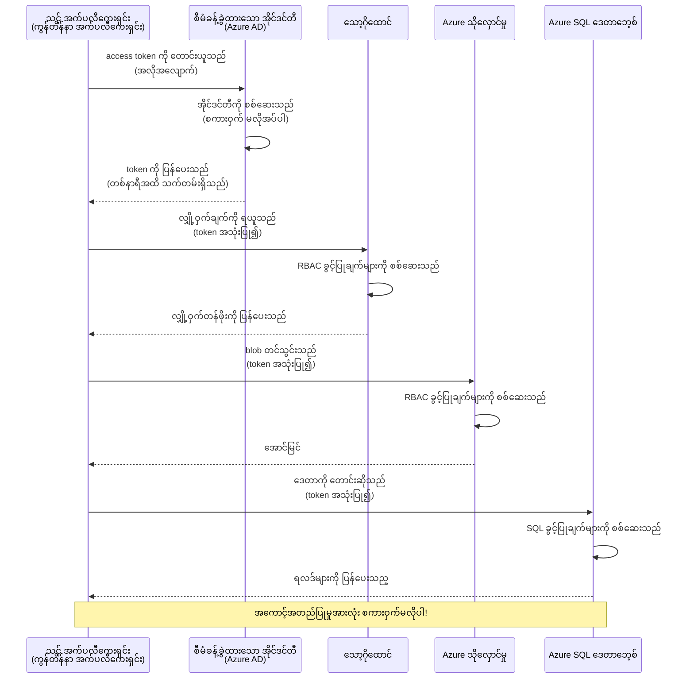
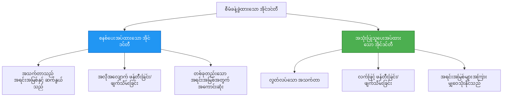

# အတည်ပြုမှု ပုံစံများနှင့် Managed Identity

⏱️ **ခန့်မှန်းချိန်**: 45-60 မိနစ် | 💰 **ကုန်ကျစရိတ် ထိခိုက်မှု**: အခမဲ့ (အပိုစရိတ်မရှိ) | ⭐ **ရှုပ်ထွေးမှု**: အလတ်အလတ်

**📚 သင်ယူရေး လမ်းကြောင်း:**
- ← Previous: [Configuration Management](configuration.md) - ပတ်ဝန်းကျင် ဗလာများနှင့် လျှို့ဝှက်ချက်များကို စီမံခြင်း
- 🎯 **You Are Here**: အတည်ပြုခြင်း & လုံခြုံရေး (Managed Identity, Key Vault, လုံခြုံသော ပုံစံများ)
- → Next: [First Project](first-project.md) - သင်၏ ပထမဆုံး AZD အပလီကေးရှင်းကို ဆောက်ရန်
- 🏠 [Course Home](../../README.md)

---

## သင်လေ့လာမည့်အရာများ

ဤသင်ခန်းစာကို ပြီးမြောက်သည်နှင့် သင်သည်:
- Azure အတည်ပြုမှု ပုံစံများကို နားလည်တတ်မည် (key များ၊ connection string များ၊ managed identity)
- စကားဝှက်မလိုအပ်သော အတည်ပြုမှုအတွက် **Managed Identity** ကို အကောင်အထည်ဖော်မည်
- **Azure Key Vault** ဖွဲ့စည်းမှုဖြင့် လျှို့ဝှက်ချက်များကို လုံခြုံစွာ ထိန်းသိမ်းမည်
- AZD များအတွက် **role-based access control (RBAC)** ကို ဖွဲ့စည်းစီမံမည်
- Container Apps နှင့် Azure ဝန်ဆောင်မှုများတွင် လုံခြုံရေး အကောင်းဆုံးနည်းလမ်းများကို အသုံးပြုမည်
- key-based authentication ကနေ identity-based authentication သို့ ပြောင်းရွှေ့မည်

## Managed Identity သည် အဓိပ္ပာယ် ရှိသည့် အကြောင်းရင်း

### ပြဿနာ: ရိုးရာ အတည်ပြုမှု

**Managed Identity မတိုင်မီ:**
```javascript
// ❌ လုံခြုံရေး အန္တရာယ်: ကုဒ်ထဲတွင် တိုက်ရိုက်သတ်မှတ်ထားသည့် လျှို့ဝှက်ချက်များ
const connectionString = "Server=mydb.database.windows.net;User=admin;Password=P@ssw0rd123";
const storageKey = "xK7mN9pQ2wR5tY8uI0oP3aS6dF1gH4jK...";
const cosmosKey = "C2x7B9n4M1p8Q5w3E6r0T2y5U8i1O4p7...";
```

**ပြဿနာများ:**
- 🔴 ကုဒ်၊ အပြင်ဆိုင်ဖိုင်များ၊ ပတ်ဝန်းကျင် ကိန်းအတွင်း လျှို့ဝှက်ချက်များ ထွက်လင်းနေခြင်း
- 🔴 လက်မှတ်ပြန်လှည့်မှုများသည် ကုဒ်ပြင်ဆင်ခြင်းနှင့် ထပ်မံပြန်ထုတ်ပေးရခြင်းလိုအပ်ခြင်း
- 🔴 စာရင်းစစ်ရေးတွင် အခက်အခဲ — ဘယ်သူ ဘာကို ဘယ်အချိန် အသုံးပြုခဲ့သလဲဆိုတာ ရှာဖွေရန်ခက်ခဲခြင်း
- 🔴 ဖြန့်ချိနေမှု — လျှို့ဝှက်ချက်များသည် စနစ်အရပ်ရပ်၌ ဖြန့်ထားသည့်အခြေအနေ
- 🔴 လိုက်နာမှု ဆိုးကျိုးများ — လုံခြုံရေး စစ်ဆေးမှုများကို မဖြတ်ကျော်နိုင်ခြင်း

### ဖြေရှင်းချက်: Managed Identity

**Managed Identity အသုံးပြုပြီးနောက်:**
```javascript
// ✅ လုံခြုံမှု: ကုဒ်ထဲတွင် လျှို့ဝှက်အချက်အလက်များ မပါရှိပါ
const credential = new DefaultAzureCredential();
const client = new BlobServiceClient(
  "https://mystorageaccount.blob.core.windows.net",
  credential  // Azure သည် အတည်ပြုခြင်းကို အလိုအလျောက် ကိုင်တွယ်ပေးသည်
);
```

**အကျိုးကျေးဇူးများ:**
- ✅ ကုဒ် သို့မဟုတ် ဖွဲ့စည်းတည်ဆောက်မှုတွင် လျှို့ဝှက်ချက်များ မရှိခြင်း
- ✅ အလိုအလျောက် လက်မှတ်ပြန်လှည့်မှု — Azure မှ စီမံပေးခြင်း
- ✅ Azure AD မှာ စာရင်းစစ် လမ်းကြောင်း ပြည့်စုံခြင်း
- ✅ လုံခြုံရေးကို ဗဟိုချထားစီမံနိုင်ခြင်း — Azure Portal မှ စီမံနိုင်ခြင်း
- ✅ လိုက်နာမှု အဆင်သင့် — လုံခြုံရေး စံနှုန်းများနှင့် ကိုက်ညီခြင်း

**နမူနာ**: ရိုးရာ အတည်ပြုမှုသည် သံမဏိတံခါးများစွာကို သယ်ဆောင်ထားသလိုဖြစ်သည်။ Managed Identity သည် သင့်အကြောင်းအရာအရ အက်ဆက်ကို အလိုအလျောက်ပေးသည့် လုံခြုံရေးဘက်ဂျ်တစ်ခုကဲ့သို့ ဖြစ်သည် — ပျောက်ဆုံးနိုင်ခြင်း၊ ပုံနှိပ်နိုင်ခြင်း သို့မဟုတ် ပြန်လှည့်ရန် မလိုအပ်ပေ။

---

## ဖွဲ့စည်းပုံ အနှစ်ချုပ်

### Managed Identity ဖြင့် အတည်ပြုမှု လှုပ်ရှားမှု


### Managed Identity အမျိုးအစားများ


| အင်္ဂါရပ် | System-Assigned | User-Assigned |
|---------|----------------|---------------|
| **အသက်တာ** | အရင်းအမြစ်နှင့် ချိတ်ဆက်ထားသည် | လွတ်လပ်သည် |
| **ဖန်တီးမှု** | အရင်းအမြစ်နှင့် အလိုအလျောက် | လက်ဖြင့် ဖန်တီးရမည် |
| **ဖျက်သိမ်းမှု** | အရင်းအမြစ် ဖျက်သိမ်းသည့်အခါ ဖျက်သိမ်းသည် | အရင်းအမြစ် ဖျက်သိမ်းပြီးနောက်လည်း တည်ရှိနေသည် |
| **မျှဝေမှု** | တစ်ခုတည်းသော အရင်းအမြစ်သာ | အရင်းအမြစ်များ များစွာ |
| **အသုံးချမှု** | ရိုးရှင်းသော အခြေအနေများ | စုံလင်သော မျိုးစုံအရင်းအမြစ် အသုံးချမှုများ |
| **AZD အကြံပြုချက်** | ✅ အကြံပြု | ရွေးချယ်လို့ရ |

---

## မလိုအပ်မဖြစ် ရှိရမည့် အချက်များ

### လိုအပ်သော ကိရိယာများ

အရင်က သင်ယူထားသော သင်ခန်းစာများမှ အောက်ပါအရာများကို ရှိပြီးသားဖြစ်ရမည်။

```bash
# Azure Developer CLI ကို စစ်ဆေးပါ
azd version
# ✅ မျှော်မှန်းချက်: azd ဗားရှင်း 1.0.0 သို့မဟုတ် အထက်

# Azure CLI ကို စစ်ဆေးပါ
az --version
# ✅ မျှော်မှန်းချက်: azure-cli 2.50.0 သို့မဟုတ် အထက်
```

### Azure လိုအပ်ချက်များ

- သက်ဝင်သော Azure subscription
- အောက်ပါများကို ခွင့်ပြုချက်များရှိထားရန်:
  - managed identities ဖန်တီးနိုင်ခြင်း
  - RBAC role များ သတ်မှတ်နိုင်ခြင်း
  - Key Vault အရင်းအမြစ်များ ဖန်တီးနိုင်ခြင်း
  - Container Apps များ တင်သွင်းနိုင်ခြင်း

### သိရှိရန် အခြေခံ ထင်မြင်ချက်များ

သင်သည် အောက်ပါ သင်ခန်းစာများကို ပြီးမြောက်ထားရပါမည်:
- [Installation Guide](installation.md) - AZD ချိန်ဆက်ခြင်း
- [AZD Basics](azd-basics.md) - အခြေခံ အယူအဆများ
- [Configuration Management](configuration.md) - ပတ်ဝန်းကျင် ဗလာများ

---

## သင်ခန်းစာ ၁: အတည်ပြုမှု ပုံစံများ ကို နားလည်ခြင်း

### ပုံစံ ၁: Connection Strings (ဆက်စပ်သမိုင်း - ရှောင်ကြဉ်ရန်)

**ကိစ္စလုပ်ဆောင်ပုံ:**
```bash
# ချိတ်ဆက် စာကြောင်းတွင် အသုံးပြုသူ အချက်အလက်များ ပါဝင်သည်
STORAGE_CONNECTION_STRING="DefaultEndpointsProtocol=https;AccountName=myaccount;AccountKey=xK7mN9pQ2wR5..."
COSMOS_CONNECTION_STRING="AccountEndpoint=https://myaccount.documents.azure.com:443/;AccountKey=C2x7..."
SQL_CONNECTION_STRING="Server=myserver.database.windows.net;User=admin;Password=P@ssw0rd..."
```

**ပြဿနာများ:**
- ❌ ပတ်ဝန်းကျင် ဗလာများတွင် လျှို့ဝှက်ချက်များ မြင်သာနေခြင်း
- ❌ တင်သွင်းစနစ်များတွင် မှတ်တမ်းတင်ထားခြင်း
- ❌ ပြန်လှည့်ရန် အခက်ခဲ
- ❌ စာရင်းစစ်လမ်းကြောင်း မရှိခြင်း

**ဘယ်အချိန် သုံးရန်:** ဖြေရှင်းရေးအတွက်သာ၊ အစမ်းလုပ်ရန်သာဖြစ်ပြီး production တွင် မသုံးသင့်။

---

### ပုံစံ ၂: Key Vault References (ပိုကောင်းသည်)

**လုပ်ပုံ:**
```bicep
// Store secret in Key Vault
resource keyVault 'Microsoft.KeyVault/vaults@2023-02-01' = {
  name: 'mykv'
  properties: {
    enableRbacAuthorization: true
  }
}

// Reference in Container App
env: [
  {
    name: 'STORAGE_KEY'
    secretRef: 'storage-key'  // References Key Vault
  }
]
```

**အကျိုးကျေးဇူးများ:**
- ✅ လျှို့ဝှက်ချက်များကို Key Vault တွင် လုံခြုံစွာ သိမ်းဆည်းထားသည်
- ✅ လျှို့ဝှက်ချက် စီမံခန့်ခွဲမှု ဗဟိုစီမံထားခြင်း
- ✅ ကုဒ်ပြင်ဆင်ခြင်းမရှိဘဲ ပြန်လှည့်နိုင်ခြင်း

**ကန့်သတ်ချက်များ:**
- ⚠️ မူလကီး/စကားဝှက်များကို အသုံးပြုနေဆဲဖြစ်သည်
- ⚠️ Key Vault သို့ အသုံးပြုခွင့် ထိန်းသိမ်းရန် လိုအပ်သည်

**ဘယ်အချိန် သုံးရန်:** connection strings မှ managed identity သို့ လွှဲပြောင်းရာအတွင်း အလွှဲအပြောင်းအဆင့်အဖြစ်။

---

### ပုံစံ ၃: Managed Identity (အကောင်းဆုံး လက်တွေ့ အကြံပြုချက်)

**လုပ်ပုံ:**
```bicep
// Enable managed identity
resource containerApp 'Microsoft.App/containerApps@2023-05-01' = {
  name: 'myapp'
  identity: {
    type: 'SystemAssigned'  // Automatically creates identity
  }
}

// Grant permissions
resource roleAssignment 'Microsoft.Authorization/roleAssignments@2022-04-01' = {
  scope: storageAccount
  properties: {
    roleDefinitionId: storageBlobDataContributorRole
    principalId: containerApp.identity.principalId
  }
}
```

**အပလီကေးရှင်း ကုဒ်:**
```javascript
// လျှို့ဝှက်ချက် မလိုပါ!
const { DefaultAzureCredential } = require('@azure/identity');
const { BlobServiceClient } = require('@azure/storage-blob');

const credential = new DefaultAzureCredential();
const blobServiceClient = new BlobServiceClient(
  'https://mystorageaccount.blob.core.windows.net',
  credential
);
```

**အကျိုးကျေးဇူးများ:**
- ✅ ကုဒ်/ဖွဲ့စည်းတည်ဆောက်မှုတွင် လျှို့ဝှက်ချက် မရှိခြင်း
- ✅ အလိုအလျောက် လက်မှတ် ပြန်လှည့်ခြင်း
- ✅ စာရင်းစစ် လမ်းကြောင်း ပြည့်စုံခြင်း
- ✅ RBAC အပေါ်တွင် အခြေခံသည့် ခွင့်ပြုချက်များ
- ✅ လိုက်နာမှု အဆင်သင့်

**ဘယ်အချိန် သုံးရန်:** production အတွက် အမြဲသုံးရန်။

---

## သင်ခန်းစာ ၂: AZD ဖြင့် Managed Identity ကို အကောင်အထည်ဖော်ခြင်း

### အဆင့်ချင်း လမ်းစဉ်

Managed identity ကို အသုံးပြု၍ Azure Storage နှင့် Key Vault ကို ဝင်ရောက်ခွင့်ရသော လုံခြုံသော Container App တစ်ခုကို ဆောက်ကြပါစို့။

### Project ဖွဲ့စည်းပုံ

```
secure-app/
├── azure.yaml                 # AZD configuration
├── infra/
│   ├── main.bicep            # Main infrastructure
│   ├── core/
│   │   ├── identity.bicep    # Managed identity setup
│   │   ├── keyvault.bicep    # Key Vault configuration
│   │   └── storage.bicep     # Storage with RBAC
│   └── app/
│       └── container-app.bicep
└── src/
    ├── app.js                # Application code
    ├── package.json
    └── Dockerfile
```

### 1. AZD ကို ဖွဲ့စည်းခြင်း (azure.yaml)

```yaml
name: secure-app
metadata:
  template: secure-app@1.0.0

services:
  api:
    project: ./src
    language: js
    host: containerapp

# Enable managed identity (AZD handles this automatically)
```

### 2. အင်ဖရာစထက်ချျ: Managed Identity ကို ဖွင့်ထားရန်

**ဖိုင်: `infra/main.bicep`**

```bicep
targetScope = 'subscription'

param environmentName string
param location string = 'eastus'

var tags = { 'azd-env-name': environmentName }

// Resource group
resource rg 'Microsoft.Resources/resourceGroups@2021-04-01' = {
  name: 'rg-${environmentName}'
  location: location
  tags: tags
}

// Storage Account
module storage './core/storage.bicep' = {
  name: 'storage'
  scope: rg
  params: {
    name: 'st${uniqueString(rg.id)}'
    location: location
    tags: tags
  }
}

// Key Vault
module keyVault './core/keyvault.bicep' = {
  name: 'keyvault'
  scope: rg
  params: {
    name: 'kv-${uniqueString(rg.id)}'
    location: location
    tags: tags
  }
}

// Container App with Managed Identity
module containerApp './app/container-app.bicep' = {
  name: 'container-app'
  scope: rg
  params: {
    name: 'ca-${environmentName}'
    location: location
    tags: tags
    storageAccountName: storage.outputs.name
    keyVaultName: keyVault.outputs.name
  }
}

// Grant Container App access to Storage
module storageRoleAssignment './core/role-assignment.bicep' = {
  name: 'storage-role'
  scope: rg
  params: {
    principalId: containerApp.outputs.identityPrincipalId
    roleDefinitionId: 'ba92f5b4-2d11-453d-a403-e96b0029c9fe'  // Storage Blob Data Contributor
    targetResourceId: storage.outputs.id
  }
}

// Grant Container App access to Key Vault
module kvRoleAssignment './core/role-assignment.bicep' = {
  name: 'kv-role'
  scope: rg
  params: {
    principalId: containerApp.outputs.identityPrincipalId
    roleDefinitionId: '4633458b-17de-408a-b874-0445c86b69e6'  // Key Vault Secrets User
    targetResourceId: keyVault.outputs.id
  }
}

// Outputs
output AZURE_STORAGE_ACCOUNT_NAME string = storage.outputs.name
output AZURE_KEY_VAULT_NAME string = keyVault.outputs.name
output APP_URL string = containerApp.outputs.url
```

### 3. System-Assigned Identity ပါသော Container App

**ဖိုင်: `infra/app/container-app.bicep`**

```bicep
param name string
param location string
param tags object = {}
param storageAccountName string
param keyVaultName string

resource containerApp 'Microsoft.App/containerApps@2023-05-01' = {
  name: name
  location: location
  tags: tags
  identity: {
    type: 'SystemAssigned'  // 🔑 Enable managed identity
  }
  properties: {
    configuration: {
      ingress: {
        external: true
        targetPort: 3000
      }
    }
    template: {
      containers: [
        {
          name: 'api'
          image: 'myregistry.azurecr.io/api:latest'
          resources: {
            cpu: json('0.5')
            memory: '1Gi'
          }
          env: [
            {
              name: 'AZURE_STORAGE_ACCOUNT_NAME'
              value: storageAccountName
            }
            {
              name: 'AZURE_KEY_VAULT_NAME'
              value: keyVaultName
            }
            // 🔑 No secrets - managed identity handles authentication!
          ]
        }
      ]
    }
  }
}

// Output the identity for RBAC assignments
output identityPrincipalId string = containerApp.identity.principalId
output id string = containerApp.id
output url string = 'https://${containerApp.properties.configuration.ingress.fqdn}'
```

### 4. RBAC Role သတ်မှတ်ခြင်း Module

**ဖိုင်: `infra/core/role-assignment.bicep`**

```bicep
param principalId string
param roleDefinitionId string  // Azure built-in role ID
param targetResourceId string

resource roleAssignment 'Microsoft.Authorization/roleAssignments@2022-04-01' = {
  name: guid(principalId, roleDefinitionId, targetResourceId)
  scope: resourceId('Microsoft.Resources/resourceGroups', resourceGroup().name)
  properties: {
    roleDefinitionId: subscriptionResourceId('Microsoft.Authorization/roleDefinitions', roleDefinitionId)
    principalId: principalId
    principalType: 'ServicePrincipal'
  }
}

output id string = roleAssignment.id
```

### 5. Managed Identity သုံးသည့် အပလီကေးရှင်း ကုဒ်

**ဖိုင်: `src/app.js`**

```javascript
const express = require('express');
const { DefaultAzureCredential } = require('@azure/identity');
const { BlobServiceClient } = require('@azure/storage-blob');
const { SecretClient } = require('@azure/keyvault-secrets');

const app = express();
const PORT = process.env.PORT || 3000;

// 🔑 အတည်ပြုချက်(credential) ကို စတင်တပ်ဆင်ပါ (managed identity ဖြင့် အလိုအလျောက် အလုပ်လုပ်သည်)
const credential = new DefaultAzureCredential();

// Azure Storage ကို ပြင်ဆင်ခြင်း
const storageAccountName = process.env.AZURE_STORAGE_ACCOUNT_NAME;
const blobServiceClient = new BlobServiceClient(
  `https://${storageAccountName}.blob.core.windows.net`,
  credential  // သော့များ မလိုပါ!
);

// Key Vault ကို ပြင်ဆင်ခြင်း
const keyVaultName = process.env.AZURE_KEY_VAULT_NAME;
const secretClient = new SecretClient(
  `https://${keyVaultName}.vault.azure.net`,
  credential  // သော့များ မလိုပါ!
);

// အခြေအနေ စစ်ဆေးခြင်း
app.get('/health', (req, res) => {
  res.json({ status: 'healthy', authentication: 'managed-identity' });
});

// ဖိုင်ကို Blob Storage သို့ တင်ပါ
app.post('/upload', async (req, res) => {
  try {
    const containerClient = blobServiceClient.getContainerClient('uploads');
    await containerClient.createIfNotExists();
    
    const blobName = `file-${Date.now()}.txt`;
    const blockBlobClient = containerClient.getBlockBlobClient(blobName);
    
    await blockBlobClient.upload('Hello from managed identity!', 30);
    
    res.json({
      success: true,
      blobName: blobName,
      message: 'File uploaded using managed identity!'
    });
  } catch (error) {
    console.error('Upload error:', error);
    res.status(500).json({ error: error.message });
  }
});

// Key Vault မှ လျှို့ဝှက်ချက်ကို ရယူပါ
app.get('/secret/:name', async (req, res) => {
  try {
    const secretName = req.params.name;
    const secret = await secretClient.getSecret(secretName);
    
    res.json({
      name: secretName,
      value: secret.value,
      message: 'Secret retrieved using managed identity!'
    });
  } catch (error) {
    console.error('Secret error:', error);
    res.status(500).json({ error: error.message });
  }
});

// Blob containers များကို စာရင်းပြပါ (ဖတ်ခွင့်ကို ဖော်ပြသည်)
app.get('/containers', async (req, res) => {
  try {
    const containers = [];
    for await (const container of blobServiceClient.listContainers()) {
      containers.push(container.name);
    }
    
    res.json({
      containers: containers,
      count: containers.length,
      message: 'Containers listed using managed identity!'
    });
  } catch (error) {
    console.error('List error:', error);
    res.status(500).json({ error: error.message });
  }
});

app.listen(PORT, () => {
  console.log(`Secure API listening on port ${PORT}`);
  console.log('Authentication: Managed Identity (passwordless)');
});
```

**ဖိုင်: `src/package.json`**

```json
{
  "name": "secure-app",
  "version": "1.0.0",
  "dependencies": {
    "express": "^4.18.2",
    "@azure/identity": "^4.0.0",
    "@azure/storage-blob": "^12.17.0",
    "@azure/keyvault-secrets": "^4.7.0"
  },
  "scripts": {
    "start": "node app.js"
  }
}
```

### 6. Deploy နှင့် စမ်းသပ်ခြင်း

```bash
# AZD ပတ်ဝန်းကျင်ကို စတင်ပြင်ဆင်ပါ
azd init

# အောက်ခံဖွဲ့စည်းပုံနှင့် အက်ပလီကေးရှင်းကို တပ်ဆင်ပါ
azd up

# အက်ပလီကေးရှင်း၏ URL ကို ရယူပါ
APP_URL=$(azd env get-values | grep APP_URL | cut -d '=' -f2 | tr -d '"')

# Health check ကို စမ်းသပ်ပါ
curl $APP_URL/health
```

**✅ မျှော်မှန်း အထွက်:**
```json
{
  "status": "healthy",
  "authentication": "managed-identity"
}
```

**Blob တင်သွင်း စမ်းသပ်ချက်:**
```bash
curl -X POST $APP_URL/upload
```

**✅ မျှော်မှန်း အထွက်:**
```json
{
  "success": true,
  "blobName": "file-1700404800000.txt",
  "message": "File uploaded using managed identity!"
}
```

**Container များစာရင်း ဆိုင်ရာ စမ်းသပ်ချက်:**
```bash
curl $APP_URL/containers
```

**✅ မျှော်မှန်း အထွက်:**
```json
{
  "containers": ["uploads"],
  "count": 1,
  "message": "Containers listed using managed identity!"
}
```

---

## လူသုံးများသော Azure RBAC Role များ

### Managed Identity အတွက် Built-in Role IDs

| ဝန်ဆောင်မှု | Role အမည် | Role ID | ခွင့်များ |
|---------|-----------|---------|-------------|
| **Storage** | Storage Blob Data Reader | `2a2b9908-6b94-4a3d-8e5a-a7d8f8cc8a12` | Blob နှင့် container များကို ဖတ်ရှုနိုင်ခြင်း |
| **Storage** | Storage Blob Data Contributor | `ba92f5b4-2d11-453d-a403-e96b0029c9fe` | Blob များ ဖတ်၊ ရေး၊ ဖျက်နိုင်ခြင်း |
| **Storage** | Storage Queue Data Contributor | `974c5e8b-45b9-4653-ba55-5f855dd0fb88` | Queue မက်ဆေ့ချ်များ ဖတ်၊ ရေး၊ ဖျက်နိုင်ခြင်း |
| **Key Vault** | Key Vault Secrets User | `4633458b-17de-408a-b874-0445c86b69e6` | လျှို့ဝှက်ချက်များ ဖတ်ရန်သာ ခွင့်ပြုချက် |
| **Key Vault** | Key Vault Secrets Officer | `b86a8fe4-44ce-4948-aee5-eccb2c155cd7` | လျှို့ဝှက်ချက်များ ဖတ်၊ ရေး၊ ဖျက်နိုင်ခြင်း |
| **Cosmos DB** | Cosmos DB Built-in Data Reader | `00000000-0000-0000-0000-000000000001` | Cosmos DB အချက်အလက်များ ဖတ်ရှုနိုင်ခြင်း |
| **Cosmos DB** | Cosmos DB Built-in Data Contributor | `00000000-0000-0000-0000-000000000002` | Cosmos DB အချက်အလက်များ ဖတ်၊ ရေးနိုင်ခြင်း |
| **SQL Database** | SQL DB Contributor | `9b7fa17d-e63e-47b0-bb0a-15c516ac86ec` | SQL databases များကို စီမံခန့်ခွဲနိုင်ခြင်း |
| **Service Bus** | Azure Service Bus Data Owner | `090c5cfd-751d-490a-894a-3ce6f1109419` | မက်ဆေ့ချ်များ ပို့၊ လက်ခံ၊ စီမံနိုင်ခြင်း |

### Role IDs များကို မည်သို့ ရှာမလဲ

```bash
# စနစ်တွင်တပ်ဆင်ထားပြီးရှိသော အခန်းကဏ္ဍများအားလုံးကို စာရင်းပြပါ
az role definition list --query "[].{Name:roleName, ID:name}" --output table

# တိကျသော အခန်းကဏ္ဍကို ရှာဖွေပါ
az role definition list --query "[?contains(roleName, 'Storage Blob')].{Name:roleName, ID:name}" --output table

# အခန်းကဏ္ဍအသေးစိတ်ကို ရယူပါ
az role definition list --name "Storage Blob Data Contributor"
```

---

## လက်တွေ့ လေ့ကျင့်ခန်းများ

### လေ့ကျင့်ခန်း ၁: ရှိပြီးသား App အတွက် Managed Identity ဖွင့်ခြင်း ⭐⭐ (အလတ်အလတ်)

**ရည်မှန်းချက်**: ရှိပြီးသား Container App deployment တွင် managed identity ကို ထည့်သွင်းပါ

**နမူနာ**: သင့်တွင် connection string များကို အသုံးပြုနေသော Container App ရှိသည်။ ၎င်းကို managed identity သို့ ပြောင်းပါ။

**စတင်ရန် အခြေအနေ**: Container App သည် အောက်ပါ ဖွဲ့စည်းပုံရှိသည်။

```bicep
// ❌ Current: Using connection string
env: [
  {
    name: 'STORAGE_CONNECTION_STRING'
    secretRef: 'storage-connection'
  }
]
```

**အဆင့်များ**:

1. **Bicep တွင် managed identity ကို ဖွင့်ပါ:**

```bicep
resource containerApp 'Microsoft.App/containerApps@2023-05-01' = {
  name: 'myapp'
  identity: {
    type: 'SystemAssigned'  // Add this
  }
  // ... rest of configuration
}
```

2. **Storage ကို ဝင်ခွင့် ပေးပါ:**

```bicep
// Get storage account reference
resource storageAccount 'Microsoft.Storage/storageAccounts@2023-01-01' existing = {
  name: storageAccountName
}

// Assign role
resource roleAssignment 'Microsoft.Authorization/roleAssignments@2022-04-01' = {
  name: guid(containerApp.id, 'ba92f5b4-2d11-453d-a403-e96b0029c9fe', storageAccount.id)
  scope: storageAccount
  properties: {
    roleDefinitionId: subscriptionResourceId('Microsoft.Authorization/roleDefinitions', 'ba92f5b4-2d11-453d-a403-e96b0029c9fe')
    principalId: containerApp.identity.principalId
    principalType: 'ServicePrincipal'
  }
}
```

3. **အပလီကေးရှင်း ကုဒ်ကို အပ်ဒိတ်လုပ်ပါ:**

**မတိုင်မီ (connection string):**
```javascript
const { BlobServiceClient } = require('@azure/storage-blob');

const blobServiceClient = BlobServiceClient.fromConnectionString(
  process.env.STORAGE_CONNECTION_STRING
);
```

**ပြီးနောက် (managed identity):**
```javascript
const { DefaultAzureCredential } = require('@azure/identity');
const { BlobServiceClient } = require('@azure/storage-blob');

const credential = new DefaultAzureCredential();
const blobServiceClient = new BlobServiceClient(
  `https://${process.env.STORAGE_ACCOUNT_NAME}.blob.core.windows.net`,
  credential
);
```

4. **ပတ်ဝန်းကျင် ဗလာများကို အပ်ဒိတ်လုပ်ပါ:**

```bicep
env: [
  {
    name: 'STORAGE_ACCOUNT_NAME'
    value: storageAccountName  // Just the name, no secrets!
  }
  // Remove STORAGE_CONNECTION_STRING
]
```

5. **Deploy နှင့် စမ်းသပ်ပါ:**

```bash
# ပြန်တင်ပို့ပါ
azd up

# အလုပ်လုပ်ဆဲဖြစ်ကြောင်း စမ်းသပ်ပါ
curl https://myapp.azurecontainerapps.io/upload
```

**✅ အောင်မြင်မှု ဆိုင်ရာ မျှော်မှန်းချက်များ:**
- ✅ အပလီကေးရှင်း အမှားမရှိ ထပ်တိုး တင်သွင်းနိုင်သည်
- ✅ Storage လုပ်ဆောင်ချက်များ (upload, list, download) လည်ပတ်နိုင်သည်
- ✅ ပတ်ဝန်းကျင် ဗလာများတွင် connection string မရှိသောကြောင့် အမှားမရှိခြင်း
- ✅ Azure Portal တွင် "Identity" တစ်ခုအနေနှင့် identity ကို မြင်ရသည်

**အတည်ပြုချက်:**

```bash
# Managed Identity အလုပ်လုပ်နေသည်ကို စစ်ပါ
az containerapp show \
  --name myapp \
  --resource-group rg-myapp \
  --query "identity.type"
# ✅ မျှော်မှန်းထားသည်: "SystemAssigned"

# အခန်းကဏ္ဍ ခန့်အပ်မှုကို စစ်ပါ
az role assignment list \
  --assignee $(az containerapp show --name myapp --resource-group rg-myapp --query "identity.principalId" -o tsv) \
  --scope /subscriptions/{sub-id}/resourceGroups/rg-myapp/providers/Microsoft.Storage/storageAccounts/mystorageaccount
# ✅ မျှော်မှန်းထားသည်: "Storage Blob Data Contributor" အခန်းကဏ္ဍကို ပြသည်
```

**ကြာချိန်**: 20-30 မိနစ်

---

### လေ့ကျင့်ခန်း ၂: Multi-Service Access with User-Assigned Identity ⭐⭐⭐ (တက်ကြွ)

**ရည်မှန်းချက်**: မျိုးစုံသော Container Apps များတွင် မျှဝေသုံးရန် user-assigned identity တစ်ခုကို ဖန်တီးပါ

**နမူနာ**: Storage account နှင့် Key Vault တူညီသော ဝင်ခွင့်လိုအပ်သည့် microservices 3 ခု ရှိသည်။

**အဆင့်များ**:

1. **user-assigned identity ဖန်တီးပါ:**

**ဖိုင်: `infra/core/identity.bicep`**

```bicep
param name string
param location string
param tags object = {}

resource userAssignedIdentity 'Microsoft.ManagedIdentity/userAssignedIdentities@2023-01-31' = {
  name: name
  location: location
  tags: tags
}

output id string = userAssignedIdentity.id
output principalId string = userAssignedIdentity.properties.principalId
output clientId string = userAssignedIdentity.properties.clientId
```

2. **user-assigned identity ကို role များ သတ်မှတ်ပါ:**

```bicep
// In main.bicep
module userIdentity './core/identity.bicep' = {
  name: 'user-identity'
  scope: rg
  params: {
    name: 'id-${environmentName}'
    location: location
    tags: tags
  }
}

// Grant Storage access
resource storageRoleAssignment 'Microsoft.Authorization/roleAssignments@2022-04-01' = {
  name: guid(userIdentity.outputs.principalId, 'storage-contributor')
  scope: storageAccount
  properties: {
    roleDefinitionId: subscriptionResourceId('Microsoft.Authorization/roleDefinitions', 'ba92f5b4-2d11-453d-a403-e96b0029c9fe')
    principalId: userIdentity.outputs.principalId
    principalType: 'ServicePrincipal'
  }
}

// Grant Key Vault access
resource kvRoleAssignment 'Microsoft.Authorization/roleAssignments@2022-04-01' = {
  name: guid(userIdentity.outputs.principalId, 'kv-secrets-user')
  scope: keyVault
  properties: {
    roleDefinitionId: subscriptionResourceId('Microsoft.Authorization/roleDefinitions', '4633458b-17de-408a-b874-0445c86b69e6')
    principalId: userIdentity.outputs.principalId
    principalType: 'ServicePrincipal'
  }
}
```

3. **identity ကို Container Apps များ အနက် အများသို့ ပေးပါ:**

```bicep
resource apiGateway 'Microsoft.App/containerApps@2023-05-01' = {
  name: 'api-gateway'
  identity: {
    type: 'UserAssigned'
    userAssignedIdentities: {
      '${userIdentity.outputs.id}': {}
    }
  }
  // ... rest of config
}

resource productService 'Microsoft.App/containerApps@2023-05-01' = {
  name: 'product-service'
  identity: {
    type: 'UserAssigned'
    userAssignedIdentities: {
      '${userIdentity.outputs.id}': {}
    }
  }
  // ... rest of config
}

resource orderService 'Microsoft.App/containerApps@2023-05-01' = {
  name: 'order-service'
  identity: {
    type: 'UserAssigned'
    userAssignedIdentities: {
      '${userIdentity.outputs.id}': {}
    }
  }
  // ... rest of config
}
```

4. **အပလီကေးရှင်း ကုဒ် (ဝန်ဆောင်မှုအားလုံး ညီမျှစွာ အသုံးပြုသည်):**

```javascript
const { DefaultAzureCredential, ManagedIdentityCredential } = require('@azure/identity');

// အသုံးပြုသူခန့်အပ်ထားသော identity အတွက် client ID ကို သတ်မှတ်ပါ
const credential = new ManagedIdentityCredential(
  process.env.AZURE_CLIENT_ID  // အသုံးပြုသူခန့်အပ်ထားသော identity ၏ client ID
);

// သို့မဟုတ် DefaultAzureCredential ကို အသုံးပြုပါ (အလိုအလျှောက်ရှာဖွေသည်)
const credential = new DefaultAzureCredential();

const blobServiceClient = new BlobServiceClient(
  `https://${process.env.STORAGE_ACCOUNT_NAME}.blob.core.windows.net`,
  credential
);
```

5. **Deploy နှင့် အတည်ပြုပါ:**

```bash
azd up

# ဝန်ဆောင်မှုအားလုံးသည် သိုလှောင်မှုကို ဝင်ရောက်အသုံးပြုနိုင်ကြောင်း စမ်းသပ်ပါ
curl https://api-gateway.azurecontainerapps.io/upload
curl https://product-service.azurecontainerapps.io/upload
curl https://order-service.azurecontainerapps.io/upload
```

**✅ အောင်မြင်မှု ခြေရာခံချက်များ:**
- ✅ ဝန်ဆောင်မှု 3 ခုတွင် တစ်ခုတည်းသော identity အသုံးပြုထားသည်
- ✅ ဝန်ဆောင်မှုအားလုံးသည် Storage နှင့် Key Vault ကို ဝင်ရောက်အသုံးပြုနိုင်သည်
- ✅ ဝန်ဆောင်မှု တစ်ခု ဖျက်သိမ်းလျှင် identity ကို မဖျက်သိမ်းပဲ ရှိနေသည်
- ✅ ခွင့်ပြုချက်များကို ဗဟိုချထား စီမံနိုင်ခြင်း

User-Assigned Identity ၏ အကျိုးကျေးဇူးများ:
- စီမံရန် တစ်ခုတည်းသော identity
- ဝန်ဆောင်မှုများအတွင်း စံနမူနာ ခွင့်များ
- ဝန်ဆောင်မှု ဖျက်ချိန်တွင် ရှင်သန်သည်
- ရှုပ်ထွေးသော ဖွဲ့စည်းပုံများအတွက် ပို၍ သင့်တော်သည်

**ကြာချိန်**: 30-40 မိနစ်

---

### လေ့ကျင့်ခန်း ၃: Key Vault Secret Rotation အကောင်အထည်ဖော်ခြင်း ⭐⭐⭐ (တက်ကြွ)

**ရည်မှန်းချက်**: Third-party API keys များကို Key Vault တွင် သိမ်းဆည်းပြီး managed identity ဖြင့် ထုတ်ယူစေပါ

**နမူနာ**: သင့် app သည် OpenAI, Stripe, SendGrid စသည့် third-party API များကို ခေါ်ယူရန် API keys လိုအပ်သည်။

**အဆင့်များ**:

1. **RBAC ဖြင့် Key Vault တည်ဆောက်ပါ:**

**ဖိုင်: `infra/core/keyvault.bicep`**

```bicep
param name string
param location string
param tags object = {}

resource keyVault 'Microsoft.KeyVault/vaults@2023-02-01' = {
  name: name
  location: location
  tags: tags
  properties: {
    enableRbacAuthorization: true  // Use RBAC instead of access policies
    sku: {
      family: 'A'
      name: 'standard'
    }
    tenantId: subscription().tenantId
    enableSoftDelete: true
    softDeleteRetentionInDays: 90
  }
}

// Allow Container App to read secrets
output id string = keyVault.id
output name string = keyVault.name
output uri string = keyVault.properties.vaultUri
```

2. **Key Vault သို့ လျှို့ဝှက်ချက်များ သိမ်းဆည်းပါ:**

```bash
# Key Vault အမည် ရယူရန်
KV_NAME=$(azd env get-values | grep AZURE_KEY_VAULT_NAME | cut -d '=' -f2 | tr -d '"')

# တတိယ ပါတီ API key များ သိမ်းဆည်းရန်
az keyvault secret set \
  --vault-name $KV_NAME \
  --name "OpenAI-ApiKey" \
  --value "sk-proj-xxxxxxxxxxxxx"

az keyvault secret set \
  --vault-name $KV_NAME \
  --name "Stripe-ApiKey" \
  --value "sk_live_xxxxxxxxxxxxx"

az keyvault secret set \
  --vault-name $KV_NAME \
  --name "SendGrid-ApiKey" \
  --value "SG.xxxxxxxxxxxxx"
```

3. **လျှို့ဝှက်ချက်များ ရယူရန် အပလီကေးရှင်း ကုဒ်:**

**ဖိုင်: `src/config.js`**

```javascript
const { DefaultAzureCredential } = require('@azure/identity');
const { SecretClient } = require('@azure/keyvault-secrets');

class Config {
  constructor() {
    this.credential = new DefaultAzureCredential();
    this.secretClient = new SecretClient(
      `https://${process.env.AZURE_KEY_VAULT_NAME}.vault.azure.net`,
      this.credential
    );
    this.cache = {};
  }

  async getSecret(secretName) {
    // ပထမဦးစွာ ကက်ရှေကို စစ်ဆေးပါ
    if (this.cache[secretName]) {
      return this.cache[secretName];
    }

    try {
      const secret = await this.secretClient.getSecret(secretName);
      this.cache[secretName] = secret.value;
      console.log(`✅ Retrieved secret: ${secretName}`);
      return secret.value;
    } catch (error) {
      console.error(`❌ Failed to get secret ${secretName}:`, error.message);
      throw error;
    }
  }

  async getOpenAIKey() {
    return this.getSecret('OpenAI-ApiKey');
  }

  async getStripeKey() {
    return this.getSecret('Stripe-ApiKey');
  }

  async getSendGridKey() {
    return this.getSecret('SendGrid-ApiKey');
  }
}

module.exports = new Config();
```

4. **အပလီကေးရှင်းတွင် လျှို့ဝှက္ချက်များ အသုံးပြုပါ:**

**ဖိုင်: `src/app.js`**

```javascript
const express = require('express');
const config = require('./config');
const { OpenAI } = require('openai');

const app = express();

// Key Vault မှ key ကို အသုံးပြု၍ OpenAI ကို စတင်တပ်ဆင်ပါ
let openaiClient;

async function initializeServices() {
  const openaiKey = await config.getOpenAIKey();
  openaiClient = new OpenAI({ apiKey: openaiKey });
  console.log('✅ Services initialized with secrets from Key Vault');
}

// စတင်ချိန်တွင် ခေါ်ပါ
initializeServices().catch(console.error);

app.post('/chat', async (req, res) => {
  try {
    const completion = await openaiClient.chat.completions.create({
      model: 'gpt-4.1',
      messages: [{ role: 'user', content: 'Hello!' }]
    });
    
    res.json({
      response: completion.choices[0].message.content,
      authentication: 'Key from Key Vault via Managed Identity'
    });
  } catch (error) {
    res.status(500).json({ error: error.message });
  }
});

app.listen(3000, () => {
  console.log('Secure API with Key Vault integration running');
});
```

5. **Deploy နှင့် စမ်းသပ်ပါ:**

```bash
azd up

# API key များ အလုပ်လုပ်ကြောင်း စမ်းသပ်ပါ
curl -X POST https://myapp.azurecontainerapps.io/chat \
  -H "Content-Type: application/json" \
  -d '{"message":"Hello AI"}'
```

**✅ အောင်မြင်မှု ခြေရာခံချက်များ:**
- ✅ ကုဒ် သို့မဟုတ် ပတ်ဝန်းကျင် ဗလာများတွင် API keys မရှိပါ
- ✅ အပလီကေးရှင်းသည် Key Vault မှ keys များကို ရယူနိုင်သည်
- ✅ Third-party API များ မှန်ကန်အောင် လည်ပတ်သည်
- ✅ ကုဒ် ပြင်ဆင်ခြင်း မလိုပဲ keys များ ပြန်လှည့်နိုင်သည်

**လျှို့ဝှက်ချက် ပြန်လှည့်ခြင်း:**

```bash
# Key Vault ထဲရှိ secret ကို အပ်ဒိတ်လုပ်ပါ
az keyvault secret set \
  --vault-name $KV_NAME \
  --name "OpenAI-ApiKey" \
  --value "sk-proj-NEW_KEY_HERE"

# အသစ်သော key ကို အသုံးပြုရန် အက်ပ်ကို ပြန်စပါ
az containerapp revision restart \
  --name myapp \
  --resource-group rg-myapp
```

**ကြာချိန်**: 25-35 မိနစ်

---

## နည်းပညာ အတည်ပြုချက်

### 1. အတည်ပြုမှု ပုံစံများ ✓

သင်၏ နားလည်မှုကို စမ်းသပ်ပါ:

- [ ] **Q1**: အဓိက အတည်ပြုမှု ပုံစံ သုံးမျိုး ဘာလဲ?
  - **A**: Connection strings (သမိုင်းစဉ်), Key Vault references (ကူးပြောင်းရေးဆင့်), Managed Identity (အကောင်းဆုံး)

- [ ] **Q2**: managed identity သည် connection string ထက် ဘာကြောင့် ပိုကောင်းသလဲ?
  - **A**: ကုဒ်တွင် လျှို့ဝှက်ချက် မရှိခြင်း၊ အလိုအလျောက် လက်မှတ် ပြန်လှည့်ခြင်း၊ စာရင်းစစ် လမ်းကြောင်း ပြည့်စုံခြင်း၊ RBAC ခွင့်ပြုချက်များ

- [ ] **Q3**: resource များစွာနှင့် မျှဝေချင်လျှင် system-assigned များထက် user-assigned ကို ဘာကြောင့် သုံးမလဲ?
  - **A**: မျှဝေဖို့လိုသည့် resource များ အများစုရှိသော်လည်း identity ၏ အသက်တာသည် resource ၏ အသက်တာနှင့် မပတ်သက်စေရန်လိုသော အခါ

**လက်တွေ့ အတည်ပြုချက်:**
```bash
# သင်၏ အက်ပ်သည် မည်သည့်အမျိုးအစား အထောက်အမှတ်ကို အသုံးပြုနေသည်ကို စစ်ဆေးပါ
az containerapp show \
  --name myapp \
  --resource-group rg-myapp \
  --query "identity.type"

# အဆိုပါ အထောက်အမှတ်အတွက် role အပ်နှံမှုများအားလုံးကို စာရင်းပြပါ
az role assignment list \
  --assignee $(az containerapp show --name myapp --resource-group rg-myapp --query "identity.principalId" -o tsv)
```

---

### 2. RBAC နှင့် ခွင့်ပြုချက်များ ✓

သင်၏ နားလည်မှုကို စမ်းသပ်ပါ:

- [ ] **Q1**: "Storage Blob Data Contributor" ၏ role ID ဘယ်ဟာလဲ?
  - **A**: `ba92f5b4-2d11-453d-a403-e96b0029c9fe`

- [ ] **Q2**: "Key Vault Secrets User" သည် ဘာတွေ ခွင့်ပြုသလဲ?
  - **A**: လျှို့ဝှက်ချက်များ ဖတ်ရှုနိုင်ခြင်းသာ (ဖန်တီးခြင်း၊ ပြင်ဆင်ခြင်း သို့မဟုတ် ဖျက်ခြင်း မလုပ်နိုင်)

- [ ] **Q3**: Container App ကို Azure SQL သို့ ဝင်ခွင့်ပေးရန် မည်သို့ လုပ်မလဲ?
  - **A**: "SQL DB Contributor" role ကို သတ်မှတ်ပေးပါ သို့မဟုတ် SQL အတွက် Azure AD authentication ကို ဖွဲ့စည်းပါ

**လက်တွေ့ အတည်ပြုချက်:**
```bash
# တိကျသော အခန်းကဏ္ဍကို ရှာပါ
az role definition list --name "Storage Blob Data Contributor"

# သင့်အကောင့်ထံ သတ်မှတ်ထားသော အခန်းကဏ္ဍများကို စစ်ဆေးပါ
PRINCIPAL_ID=$(az containerapp show --name myapp --resource-group rg-myapp --query "identity.principalId" -o tsv)
az role assignment list --assignee $PRINCIPAL_ID --output table
```

---

### 3. Key Vault ပေါင်းစည်းမှု ✓
- [ ] **Q1**: Key Vault အတွက် access policies အစား RBAC ကို ဘယ်လိုဖွင့်မလဲ?
  - **A**: Bicep တွင် `enableRbacAuthorization: true` ကို သတ်မှတ်ပါ

- [ ] **Q2**: managed identity authentication ကို ကိုင်တွယ်ပေးသော Azure SDK ไลဘ্রယ်ရီ ဘာလဲ?
  - **A**: `@azure/identity` နှင့် `DefaultAzureCredential` class

- [ ] **Q3**: Key Vault secrets များကို cache ထဲမှာ ဘယ်လောက်ကြာထားလဲ?
  - **A**: အက်ပလီကေးရှင်းပေါ် မူတည်သည်; သင့်ဖက်မှ ကိုယ်ပိုင် caching မဟာဗျူဟာတစ်ခု ဆောင်ရွက်ပါ

**Hands-On Verification:**
```bash
# Key Vault သို့ ဝင်ရောက်ခွင့်ကို စမ်းသပ်ပါ
az keyvault secret show \
  --vault-name $KV_NAME \
  --name "OpenAI-ApiKey" \
  --query "value"

# RBAC ဖွင့်ထားကြောင်း စစ်ဆေးပါ
az keyvault show \
  --name $KV_NAME \
  --query "properties.enableRbacAuthorization"
# ✅ မျှော်မှန်းထားသည်: true
```

---

## လုံခြုံရေး အကောင်းဆုံး လုပ်ထုံးလုပ်နည်းများ

### ✅ လုပ်ရန်:

1. **ထုတ်လုပ်ရေး (production) တွင် အမြဲ managed identity ကို အသုံးပြုပါ**
   ```bicep
   identity: {
     type: 'SystemAssigned'
   }
   ```

2. **အနည်းဆုံး ခွင့်ပြုချက်ရှိသော RBAC role များကို အသုံးပြုပါ**
   - ရနိုင်သမျှ `Reader` role များကို အသုံးပြုပါ
   - လိုအပ်မှသာ `Owner` သို့မဟုတ် `Contributor` များပေးပါ

3. **တတိယပါတီ key များကို Key Vault တွင် သိမ်းဆည်းပါ**
   ```javascript
   const apiKey = await secretClient.getSecret('ThirdPartyApiKey');
   ```

4. **audit logging ကို ဖွင့်ပါ**
   ```bicep
   diagnosticSettings: {
     logs: [{ category: 'AuditEvent', enabled: true }]
   }
   ```

5. **dev/staging/prod အတွက် သီးခြား အသင်းအမည်များကို အသုံးပြုပါ**
   ```bash
   azd env new dev
   azd env new staging
   azd env new prod
   ```

6. **လျှို့ဝှက်များကို ပုံမှန် လှည့်ပြောင်းပါ**
   - Key Vault secrets များအပေါ် သက်တမ်းကုန်ဆုံးရက် သတ်မှတ်ပါ
   - Azure Functions ဖြင့် လှည့်ပြောင်းမှုကို အလိုအလျောက်ပြုလုပ်ပါ

### ❌ မလုပ်ရ:

1. **လျှို့ဝှက်များကို code ထဲတွင် တိုက်ရိုက် ထည့်မထားပါ**
   ```javascript
   // ❌ မကောင်း
   const apiKey = "sk-proj-xxxxxxxxxxxxx";
   ```

2. **ထုတ်လုပ်ရေးတွင် connection strings မသုံးပါ**
   ```javascript
   // ❌ မကောင်း
   BlobServiceClient.fromConnectionString(process.env.STORAGE_CONNECTION_STRING)
   ```

3. **အလွန်များသော ခွင့်ပြုချက် မပေးပါ**
   ```bicep
   // ❌ BAD - too much access
   roleDefinitionId: 'Owner'
   
   // ✅ GOOD - least privilege
   roleDefinitionId: 'Storage Blob Data Reader'
   ```

4. **လျှို့ဝှက်များကို log မထည့်ပါ**
   ```javascript
   // ❌ မကောင်း
   console.log('API Key:', apiKey);
   
   // ✅ ကောင်း
   console.log('API Key retrieved successfully');
   ```

5. **ထုတ်လုပ်ရေး identities များကို အခြား environment များနှင့် မမျှဝေပေးပါ**
   ```bicep
   // ❌ BAD - same identity for dev and prod
   // ✅ GOOD - separate identities per environment
   ```

---

## ပြဿနာ ဖြေရှင်းလမ်းညွှန်

### ပြဿနာ: Azure Storage ကို ဝင်ရောက်ရာတွင် "Unauthorized" ဖြစ်သည်

**လက္ခဏာများ:**
```
Error: Unauthorized (403)
AuthorizationPermissionMismatch: This request is not authorized to perform this operation
```

**ရှာဖွေမှု (Diagnosis):**

```bash
# managed identity ကို ဖွင့်ထားပြီး ရှိ/မရှိ စစ်ဆေးပါ
az containerapp show \
  --name myapp \
  --resource-group rg-myapp \
  --query "identity.type"
# ✅ မျှော်မှန်းချက်: "SystemAssigned" သို့မဟုတ် "UserAssigned"

# role assignments ကို စစ်ဆေးပါ
PRINCIPAL_ID=$(az containerapp show --name myapp --resource-group rg-myapp --query "identity.principalId" -o tsv)
az role assignment list --assignee $PRINCIPAL_ID

# မျှော်မှန်းချက်: "Storage Blob Data Contributor" သို့မဟုတ် အလားတူ role ကို တွေ့ရမည်
```

**ဖြေရှင်းချက်များ:**

1. **မှန်ကန်သော RBAC role ကို ပေးပါ:**
```bash
STORAGE_ID=$(az storage account show --name mystorageaccount --resource-group rg-myapp --query "id" -o tsv)
az role assignment create \
  --assignee $PRINCIPAL_ID \
  --role "Storage Blob Data Contributor" \
  --scope $STORAGE_ID
```

2. **Propagation ကို စောင့်ပါ (၅-၁၀ မိနစ် ကြာနိုင်သည်):**
```bash
# ရာထူးပေးသတ်မှတ်မှု၏ အခြေအနေကို စစ်ဆေးပါ
az role assignment list --assignee $PRINCIPAL_ID --scope $STORAGE_ID
```

3. **အက်ပလီကေးရှင်းကုဒ်တွင် မှန်ကန်သော credential ကို သုံးနေကြောင်း စစ်ဆေးပါ:**
```javascript
// DefaultAzureCredential ကို သုံးနေကြောင်း သေချာစေပါ
const credential = new DefaultAzureCredential();
```

---

### ပြဿနာ: Key Vault သို့ ဝင်ခွင့် ပယ်ခံရခြင်း

**လက္ခဏာများ:**
```
Error: Forbidden (403)
The user, group or application does not have secrets get permission
```

**ရှာဖွေမှု (Diagnosis):**

```bash
# Key Vault RBAC ဖွင့်ထားကြောင်း စစ်ဆေးပါ
az keyvault show \
  --name $KV_NAME \
  --query "properties.enableRbacAuthorization"
# ✅ မျှော်မှန်းချက်: true

# တာဝန်ပေးအပ်မှုများကို စစ်ဆေးပါ
az role assignment list \
  --assignee $PRINCIPAL_ID \
  --scope /subscriptions/{sub-id}/resourceGroups/rg-myapp/providers/Microsoft.KeyVault/vaults/$KV_NAME
```

**ဖြေရှင်းချက်များ:**

1. **Key Vault တွင် RBAC ကို ဖွင့်ပါ:**
```bash
az keyvault update \
  --name $KV_NAME \
  --enable-rbac-authorization true
```

2. **Key Vault Secrets User role ကို ခန့်အပ်ပေးပါ:**
```bash
KV_ID=$(az keyvault show --name $KV_NAME --query "id" -o tsv)
az role assignment create \
  --assignee $PRINCIPAL_ID \
  --role "Key Vault Secrets User" \
  --scope $KV_ID
```

---

### ပြဿနာ: DefaultAzureCredential သည် ဒေသীয় (local) တွင် မအောင်မြင်ခြင်း

**လက္ခဏာများ:**
```
Error: DefaultAzureCredential failed to retrieve a token
CredentialUnavailableError: No credential available
```

**ရှာဖွေမှု (Diagnosis):**

```bash
# သင်လော့ဂ်အင်ထားသလား စစ်ဆေးပါ
az account show

# Azure CLI အတွက် အတည်ပြုမှုကို စစ်ဆေးပါ
az ad signed-in-user show
```

**ဖြေရှင်းချက်များ:**

1. **Azure CLI တွင် login ဝင်ပါ:**
```bash
az login
```

2. **Azure subscription ကို သတ်မှတ်ပါ:**
```bash
az account set --subscription "Your Subscription Name"
```

3. **ဒေသိယ ဖွံ့ဖြိုးရေးအတွက် environment variables များကို သုံးပါ:**
```bash
export AZURE_TENANT_ID="your-tenant-id"
export AZURE_CLIENT_ID="your-client-id"
export AZURE_CLIENT_SECRET="your-client-secret"
```

4. **သို့မဟုတ် ဒေသတွင်း အတွက် မတူညီသော credential ကို အသုံးပြုပါ:**
```javascript
const { DefaultAzureCredential, AzureCliCredential } = require('@azure/identity');

// ဒေသဆိုင်ရာ ဖွံ့ဖြိုးရေးအတွက် AzureCliCredential ကို အသုံးပြုပါ
const credential = process.env.NODE_ENV === 'production' 
  ? new DefaultAzureCredential()
  : new AzureCliCredential();
```

---

### ပြဿနာ: Role ခန့်အပ်ခြင်းသည် ပျံ့နှံ့မှုအတွက် အချိန်ပို ဆန္ဒရှိသည်

**လက္ခဏာများ:**
- Role ကို အောင်မြင်စွာ ခန့်အပ်ပြီးဖြစ်သည်
- ထိုကြောင့် 403 အမှားများ ရှိနေဆဲ
- လက်လှမ်းမီမှု မတည်ငြိမ် (တခါတရံ အလုပ်ဖြစ်၊ တခါတရံ မဖြစ်)

**ရှင်းလင်းချက်:**
Azure RBAC ပြောင်းလဲမှုများသည် ကမ္ဘာလုံးဆိုင်ရာ ပျံ့နှံ့မှုအတွက် ၅-၁၀ မိနစ် ကြာနိုင်သည်။

**ဖြေရှင်းချက်:**

```bash
# စောင့်ပြီး ထပ်မံကြိုးစားပါ
echo "Waiting for RBAC propagation..."
sleep 300  # ၅ မိနစ် စောင့်ပါ

# ဝင်ရောက်နိုင်ခြင်းကို စမ်းသပ်ပါ
curl https://myapp.azurecontainerapps.io/upload

# ထပ်မံ မအောင်မြင်သေးပါက အက်ပ်ကို ပြန်စပါ
az containerapp revision restart \
  --name myapp \
  --resource-group rg-myapp
```

---

## ကုန်ကျစရိတ် ဆိုင်ရာ သတိပြုရန်

### Managed Identity ကျသင့်ငွေ

| အရင်းအမြစ် | စျေးနှုန်း |
|----------|------|
| **Managed Identity** | 🆓 **အခမဲ့** - စျေးနှုန်း မရှိပါ |
| **RBAC Role Assignments** | 🆓 **အခမဲ့** - စျေးနှုန်း မရှိပါ |
| **Azure AD Token Requests** | 🆓 **အခမဲ့** - ပါဝင်သည် |
| **Key Vault Operations** | $0.03 per 10,000 operations |
| **Key Vault Storage** | $0.024 per secret per month |

**Managed Identity သည် ငွေသက်သာစေသည် -**
- ✅ Service-to-service အတွက် authentication အတွက် Key Vault operations မလိုအပ်စေခြင်း
- ✅ လုံခြုံရေး ဖြစ်ပေါ်မှုများ လျော့နည်းစေခြင်း (credentials ပြန်လည် ထွက်ပေါက်ခြင်း မဖြစ်စေ)
- ✅ လက်တွေ့ လည်ပတ်မှုများ လျော့နည်းစေခြင်း (လက်မောင်းလှည့်ခြင်း လုပ်ရန် မလို)

**ဥပမာ စရိတ် နှိုင်းယှဉ်မှု (လစဉ်):**

| စာမူ | Connection Strings | Managed Identity | သက်သာချက် |
|----------|-------------------|-----------------|---------|
| သေးငယ်သော အက်ပ် (1M requests) | ~\$50 (Key Vault + ops) | ~\$0 | \$50/လ |
| အလတ်စား အက်ပ် (10M requests) | ~\$200 | ~\$0 | \$200/လ |
| ကြီးမားသော အက်ပ် (100M requests) | ~\$1,500 | ~\$0 | \$1,500/လ |

---

## ထပ်မံ လေ့လာရန်

### တရားဝင် စာရွက်စာတမ်းများ
- [Azure Managed Identity](https://learn.microsoft.com/entra/identity/managed-identities-azure-resources/overview)
- [Azure RBAC](https://learn.microsoft.com/azure/role-based-access-control/overview)
- [Azure Key Vault](https://learn.microsoft.com/azure/key-vault/general/overview)
- [DefaultAzureCredential](https://learn.microsoft.com/dotnet/api/azure.identity.defaultazurecredential)

### SDK စာတမ်းများ
- [@azure/identity (Node.js)](https://www.npmjs.com/package/@azure/identity)
- [Azure.Identity (C#)](https://www.nuget.org/packages/Azure.Identity/)
- [azure-identity (Python)](https://pypi.org/project/azure-identity/)

### ဒီသင်တန်းတွင် နောက်လုပ်ရန်များ
- ← ယခင်: [Configuration Management](configuration.md)
- → နောက်တစ်ခု: [First Project](first-project.md)
- 🏠 [Course Home](../../README.md)

### ဆက်စပ် ဥပမာများ
- [Microsoft Foundry Models Chat Example](../../../../examples/azure-openai-chat) - Microsoft Foundry Models အတွက် managed identity ကို အသုံးပြုထားသည်
- [Microservices Example](../../../../examples/microservices) - များစွာသော service များအတွက် authentication စနစ်များ

---

## အကျဉ်းချုပ်

**သင် သင်ယူခဲ့သည်:**
- ✅ သုံးမျိုး authentication ပုံစံများ (connection strings, Key Vault, managed identity)
- ✅ AZD တွင် managed identity ကို မည်သို့ ဖွင့်နှင့် တပ်ဆင်မည်နည်း
- ✅ Azure services များအတွက် RBAC role ခန့်အပ်ခြင်းများ
- ✅ တတိယပါတီ secrets များအတွက် Key Vault ပေါင်းစည်းခြင်း
- ✅ User-assigned နှင့် system-assigned identities အကြား ကွာခြားချက်များ
- ✅ လုံခြုံရေး အကောင်းဆုံး လုပ်ထုံးလုပ်နည်းများနှင့် ပြဿနာ ဖြေရှင်းနည်းများ

**အဓိက အယူခံများ:**
1. **ထုတ်လုပ်ရေးတွင် အမြဲ managed identity ကို အသုံးပြုပါ** - secrets မရှိခြင်း, အလိုအလျောက် လှည့်ပြောင်းခြင်း
2. **အနည်းဆုံး ခွင့်ပြုချက်ရှိသော RBAC role များကို အသုံးပြုပါ** - လိုအပ်သမျှသာ ခွင့်ပြုပါ
3. **တတိယပါတီ keys များကို Key Vault တွင် သိမ်းဆည်းပါ** - စိတ်ချရသော ဗဟိုထားရန်
4. **Environment အလိုက် identity များ ခွဲထားပါ** - dev, staging, prod သီးခြားထားရန်
5. **audit logging ကို ဖွင့်ထားပါ** - ဘယ်သူ ဘာကို အသုံးပြုခဲ့သည်ကို မွမ်းမံထားရန်

**နောက်လုပ်ရန်များ:**
1. အထက်ပါ လက်တွေ့ စမ်းသပ်မှုများ ပြီးမြောက်ပါ
2. ရှိပြီးသား အက်ပ်တစ်ခုကို connection strings မှ managed identity သို့ ပြောင်းရွှေ့ပါ
3. နေ့စဥ် စတင်ကတည်းက လုံခြုံရေးပါရှိသော AZD ပရောဂျက် ပထမဆုံး တည်ဆောက်ပါ: [First Project](first-project.md)

---

<!-- CO-OP TRANSLATOR DISCLAIMER START -->
**တာဝန်ပယ်ချက်**:
ဤစာတမ်းကို AI ဘာသာပြန်ဝန်ဆောင်မှု [Co-op Translator](https://github.com/Azure/co-op-translator) ဖြင့် ဘာသာပြန်ထားပါသည်။ ကျွန်ုပ်တို့သည် တိကျမှုအတွက် ကြိုးပမ်းသော်လည်း အလိုအလျောက် ဘာသာပြန်မှုများတွင် အမှားများ သို့မဟုတ် မတိကျမှုများ ရှိနိုင်ကြောင်း သတိပေးပါသည်။ မူရင်းစာတမ်းကို ၎င်း၏ ဇာတိဘာသာဖြင့် ရေးသားထားသော မူရင်းကို အာဏာပိုင် အရင်းအမြစ်အဖြစ် စဉ်းစားသင့်ပါသည်။ အရေးကြီးသော သတင်းအချက်အလက်များအတွက် များသောအားဖြင့် လူ့ပညာရှင်များက ဘာသာပြန်ပေးသင့်ပါသည်။ ဤဘာသာပြန်ချက်ကို အသုံးပြုခြင်းနှင့် ပတ်သက်၍ ဖြစ်ပေါ်နိုင်သည့် နားမလည်မှုများ သို့မဟုတ် မှားယွင်းဖော်ပြချက်များအတွက် ကျွန်ုပ်တို့ တာဝန်မယူပါ။
<!-- CO-OP TRANSLATOR DISCLAIMER END -->