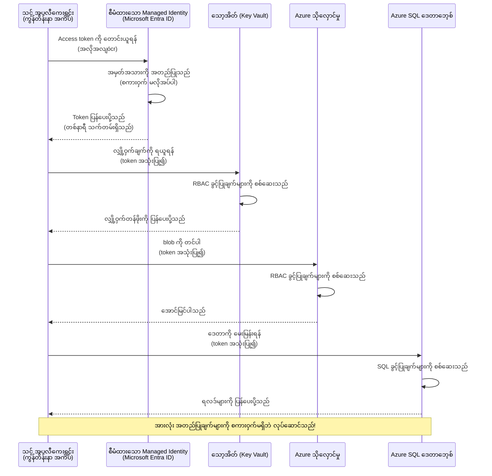
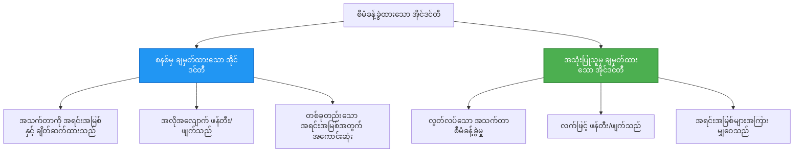

# Authentication Patterns and Managed Identity

⏱️ **ခန့်မှန်းချိန်**: 45-60 မိနစ် | 💰 **ကုန်ကျစရိတ်သက်ရောက်မှု**: အခမဲ့ (အပိုကြေးမရှိ) | ⭐ **ခက်ခဲမှု**: အလယ်အလတ်

**📚 သင်ယူမှု လမ်းကြောင်း:**
- ← Previous: [Configuration Management](configuration.md) - environment variables နှင့် secrets မျာျကို စီမံခန့်ခွဲခြင်း
- 🎯 **ယခု သင်ရှိရာနေရာ**: Authentication & Security (Managed Identity, Key Vault, secure patterns)
- → Next: [First Project](first-project.md) - သင့်၏ ပထမဆုံး AZD အက်ပလီကေးရှင်းကို တည်ဆောက်ရန်
- 🏠 [Course Home](../../README.md)

---

## သင်ဘာများကို သင်ယူမလဲ

ဤသင်ခန်းစာကို ပြီးစီးလျှင် သင်သည်:
- Azure authentication ပုံစံများ (keys, connection strings, managed identity) ကို နားလည်မည်
- **Managed Identity** ကို passwordless authentication အတွက် အကောင်အထည်ဖော်နိုင်မည်
- **Azure Key Vault** နှင့် ပေါင်းစည်းကာ secrets များကို လုံခြုံစွာ သိမ်းဆည်းနိုင်မည်
- AZD deployments များအတွက် **role-based access control (RBAC)** ကို ဖွဲ့စည်းနိုင်မည်
- Container Apps နှင့် Azure services များတွင် လုံခြုံရေး အကောင်းဆုံး လေ့လာမှုကို အသုံးချနိုင်မည်
- key-based authentication မှ identity-based authentication သို့ ပြောင်းရွှေ့နိုင်မည်

## Managed Identity အရေးကြီးခဲ့ရသောအကြောင်း

### ပြဿနာ: ရိုးရာ Authentication

**Managed Identity မကြိုတင်ရှိခင်:**
```javascript
// ❌ လုံခြုံရေးဆိုင်ရာ အန္တရာယ်: ကုဒ်တွင် တိုက်ရိုက် သတ်မှတ်ထားသော လျှို့ဝှက်ချက်များ
const connectionString = "Server=mydb.database.windows.net;User=admin;Password=P@ssw0rd123";
const storageKey = "xK7mN9pQ2wR5tY8uI0oP3aS6dF1gH4jK...";
const cosmosKey = "C2x7B9n4M1p8Q5w3E6r0T2y5U8i1O4p7...";
```

**ပြဿနာများ:**
- 🔴 **Secrets များကုိ ဖိုင်/ကုဒ်/ပတ်ဝန်းကျင် အမျိုးအစားများတွင် ထွက်ပြန့်နေခြင်း**
- 🔴 **Credential rotation** များသည် ကုဒ်ပြောင်းခြင်းနှင့် ပြန်တင်သွင်းခြင်းများလိုအပ်ခြင်း
- 🔴 **စာရင်းစစ် အခက်အခဲများ** - ဘယ်သူ ဘယ်အချိန် ဘာကို ဝင်ရောက်ကြည့်ရှုခဲ့သလဲ?
- 🔴 **ဖျံ့နှံ့မှု** - secrets များ မတူညီသောစနစ်များတွင် ဖြန့်ချိထားခြင်း
- 🔴 **လိုက်နာမှုဆိုင်ရာ အန္တရာယ်များ** - security audits များတွင် ဆိုင်ရာ မဖြေရှင်းနိုင်မှု

### ဖြေရှင်းချက်: Managed Identity

**Managed Identity ရှိပြီးနောက်:**
```javascript
// ✅ လုံခြုံ: ကုဒ်အတွင်း လျှို့ဝှက်ချက် မရှိ
const credential = new DefaultAzureCredential();
const client = new BlobServiceClient(
  "https://mystorageaccount.blob.core.windows.net",
  credential  // Azure သည် အတည်ပြုမှုကို အလိုအလျောက် ကိုင်တွယ်ပေးသည်
);
```

**အကျိုးကျေးဇူးများ:**
- ✅ **ကုဒ် သို့မဟုတ် configuration တွင် secret မရှိတော့ခြင်း**
- ✅ **Automatic rotation** - Azure မှ ကိုင်တွယ်ပေးသည်
- ✅ **Microsoft Entra ID မှ တိက်သော audit trail** ရရှိခြင်း
- ✅ **စင်တာလိုက်လုံခြုံရေး** - Azure Portal မှ စီမံနိုင်ခြင်း
- ✅ **ကိုက်ညီမှု အသင့်** - security စံနှုန်းများကို ဖြည့်ဆည်းထားခြင်း

**နမူနာအဓိပ္ပာယ်**: ရိုးရာ authentication သည် သီးနှံ များစွာကို ကိုင်ဆောင်ထားရသလိုဖြစ်သည်။ Managed Identity သည် သင်၏ ကိုယ်ပိုင် security badge တစ်ခုကဲ့သို့ ဖြစ်ပြီး သင့်သူအဖြစ် အခြားသူများဆီ အသွင်ကူးပြောင်းမှုအရ အလိုအလျောက် လက်ခံခွင့်ပေးသည်— မည်သည့် key မမျှ မရှိတော့၊ ပျောက်ဆုံးခြင်း၊ မိတ္တူအသစ်ဖန်တီးခြင်း သို့မဟုတ် လှည့်ပြောင်းရန် မလိုတော့။

---

## နောက်ခံဖော်ပြချက် (Architecture Overview)

### Managed Identity ဖြင့် အတည်ပြုခြင်း အစီးလိုက် စီးဆင်းမှု



### Managed Identity အမျိုးအစားများ



| Feature | System-Assigned | User-Assigned |
|---------|----------------|---------------|
| **Lifecycle** | Tied to resource | Independent |
| **Creation** | Automatic with resource | Manual creation |
| **Deletion** | Deleted with resource | Persists after resource deletion |
| **Sharing** | One resource only | Multiple resources |
| **Use Case** | Simple scenarios | Complex multi-resource scenarios |
| **AZD Default** | ✅ Recommended | Optional |

---

## လိုအပ်ချက်များ (Prerequisites)

### လိုအပ်သော ကိရိယာများ

မနေ့က သင်ယူထားခဲ့သည့် သင်ခန်းစာများမှ ဤကိရိယာများ သင်မှာရှိပြီးသားဖြစ်ရမည်။

```bash
# Azure Developer CLI ကို စစ်ဆေးပါ
azd version
# ✅ မျှော်မှန်းချက်: azd ဗားရှင်း 1.0.0 သို့မဟုတ် အထက်

# Azure CLI ကို စစ်ဆေးပါ
az --version
# ✅ မျှော်မှန်းချက်: azure-cli ဗားရှင်း 2.50.0 သို့မဟုတ် အထက်
```

### Azure လိုအပ်ချက်များ

- အလုပ်လုပ်နိုင်သည့် Azure subscription
- အောက်ပါ ခွင့်ပြုချက်များရှိရန်:
  - managed identities များ ဖန်တီးခွင့်
  - RBAC အခန်းကဏ္ဍများကို သတ်မှတ်ခွင့်
  - Key Vault resources ဖန်တီးခွင့်
  - Container Apps ကို deploy လုပ်ခွင့်

### သိရှိထားရမည့် အခြေခံများ

သင်သည် အောက်ပါကို ပြီးစီးထားသင့်သည်:
- [Installation Guide](installation.md) - AZD setup
- [AZD Basics](azd-basics.md) - အခြေခံ အယူခံများ
- [Configuration Management](configuration.md) - Environment variables စီမံခန့်ခွဲခြင်း

---

## သင်ခန်းစာ 1: Authentication Patterns ကို နားလည်ခြင်း

### ပုံစံ 1: Connection Strings (အဟောင်း - ရှောင်ရှားရန်)

**လက်ရှိ အလုပ်လုပ်ပုံ:**
```bash
# ချိတ်ဆက် စာကြောင်းတွင် အတည်ပြုအချက်အလက်များ ပါရှိသည်
STORAGE_CONNECTION_STRING="DefaultEndpointsProtocol=https;AccountName=myaccount;AccountKey=xK7mN9pQ2wR5..."
COSMOS_CONNECTION_STRING="AccountEndpoint=https://myaccount.documents.azure.com:443/;AccountKey=C2x7..."
SQL_CONNECTION_STRING="Server=myserver.database.windows.net;User=admin;Password=P@ssw0rd..."
```

**ပြဿနာများ:**
- ❌ Secrets များ ပတ်ဝန်းကျင် ဗေရီးဘယ်များတွင် မြင်သာနေသည်
- ❌ deployment စနစ်များတွင် မှတ်တမ်းတင်ထားမည်
- ❌ လှည့်ပြောင်းရန် မလွယ်ကူ
- ❌ ဝင်ရောက်ခွင့် မှတ်တမ်းမရှိ

**အသုံးပြုသင့်သည့်အချိန်:** local development အတွက်သာ၊ production အတွက် မသုံးရ။

---

### ပုံစံ 2: Key Vault References (ပိုကောင်းသည်)

**လုပ်ဆောင်ပုံ:**
```bicep
// Store secret in Key Vault
resource keyVault 'Microsoft.KeyVault/vaults@2023-02-01' = {
  name: 'mykv'
  properties: {
    enableRbacAuthorization: true
  }
}

// Reference in Container App
env: [
  {
    name: 'STORAGE_KEY'
    secretRef: 'storage-key'  // References Key Vault
  }
]
```

**အကျိုးကျေးဇူးများ:**
- ✅ Secrets များကို Key Vault တွင် လုံခြုံစွာ သိမ်းဆည်းသည်
- ✅ စင်တာလိုက် secret စီမံခန့်ခွဲမှု
- ✅ ကုဒ် ပြင်ဆင်ရန် မလိုဘဲ rotation ပြုလုပ်နိုင်သည်

**ကန့်သတ်ချက်များ:**
- ⚠️ အားမနည်းလည်း keys/passwords ကို အသုံးပြုနေရသည်
- ⚠️ Key Vault ခွင့်များကို စီမံရပါမည်

**အသုံးပြုသင့်သည့်အချိန်:** connection strings မှ managed identity သို့ ပြောင်းရွှေ့ရာတွင် အလှမ်းအနည်းငယ်အနေဖြင့် သုံးပါ။

---

### ပုံစံ 3: Managed Identity (အကောင်းဆုံး အကြံပြုသောနည်း)

**လုပ်ဆောင်ပုံ:**
```bicep
// Enable managed identity
resource containerApp 'Microsoft.App/containerApps@2023-05-01' = {
  name: 'myapp'
  identity: {
    type: 'SystemAssigned'  // Automatically creates identity
  }
}

// Grant permissions
resource roleAssignment 'Microsoft.Authorization/roleAssignments@2022-04-01' = {
  scope: storageAccount
  properties: {
    roleDefinitionId: storageBlobDataContributorRole
    principalId: containerApp.identity.principalId
  }
}
```

**Application code:**
```javascript
// လျှို့ဝှက်ချက် မလိုပါ။
const { DefaultAzureCredential } = require('@azure/identity');
const { BlobServiceClient } = require('@azure/storage-blob');

const credential = new DefaultAzureCredential();
const blobServiceClient = new BlobServiceClient(
  'https://mystorageaccount.blob.core.windows.net',
  credential
);
```

**အကျိုးကျေးဇူးများ:**
- ✅ ကုဒ်/ကွန်ဖိဂျာတွင် secret မရှိခြင်း
- ✅ အလိုအလျောက် credential rotation
- ✅ အပြည့်အစုံ audit trail ရရှိခြင်း
- ✅ RBAC အပေါ် အခြေခံခွင့်များ
- ✅ ကိုက်ညီမှု အဆင်သင့်

**အသုံးပြုသင့်သည့်အချိန်:** production အက်ပလิเคရှင်းများအတွက် အမြဲအသုံးပြုပါ။

---

### ပုံစံ 4: Service Principals (CI/CD နှင့် Automation အတွက်)

Managed identity သည် Azure အတွင်းတွင် လည်ပတ်နေသည့် resources များအတွက် အကောင်းဆုံးပုံစံဖြစ်သည်။ သို့သော် Azure အပြင်တွင် လည်ပတ်နေသည့် အရာများ—CI/CD pipeline ရှိ build agent များ၊ သို့မဟုတ် interactive login ကို မသုံးနိုင်သည့် laptop ပေါ်ရှိ script များ—အတွက် ဘာလဲဆိုရင် service principal တစ်ခုလိုအပ်သည်။ service principal သည် non-human identity ဖြစ်ပြီး automated process တစ်ခုက အဲဒီ identity ဖြင့် sign in ပြုလုပ်နိုင်သော credential များကို သုံးသည်။

**လုပ်ဆောင်ပုံ:**

resource group အတွင်း scope လျော့ရှင်းစေရန် service principal တစ်ခု ဖန်တီးပါ (least privilege):

```bash
az ad sp create-for-rbac \
  --name "myapp-cicd" \
  --role contributor \
  --scopes /subscriptions/<sub-id>/resourceGroups/<rg-name>
```

ဤသည်သည် client ID, client secret, နှင့် tenant ID ကို အထွက်ထုတ်ပေးမည်။ azd သည် အဆိုပါ credential များဖြင့် non-interactive အနေဖြင့် စိုက်ထုတ်နိုင်သည်။

```bash
azd auth login \
  --client-id "<appId>" \
  --client-secret "<password>" \
  --tenant-id "<tenant>"
```

**secret များထက် federated credentials (OIDC) ကို 선호ပါ။** တာရှည်တည်သော client secret အစား၊ federated credential တစ်ခု configure လုပ်ပါက pipeline သည် short-lived token တစ်ခုနှင့် အစားလဲပြောင်းရမည်—လျှို့ဝှက်ချက် မဖောက်ထွင်းနိုင်သလို လှည့်ပြောင်းရန်မလိုပါ။

```bash
azd auth login \
  --client-id "<appId>" \
  --federated-credential-provider "github" \
  --tenant-id "<tenant>"
```

> `azd pipeline config` သည် ဤကို အလိုအလျောက် သင့်အတွက် ပြင်ဆင်ပေးသည်။ CI/CD လမ်းမြှောက်လမ်းညွှန် များကို [Chapter 8](../chapter-08-production/production-ai-practices.md) တွင် ကြည့်ပါ။

**အကျိုးကျေးဇူးများ:**
- ✅ Azure အပြင်တွင်လည်း အလုပ်လုပ်နိုင်သည် (build agents, on-prem, အခြား cloud များ)
- ✅ တစ်ခုတည်းသော resource group အတွင်း scope ပေးထားပြီး တစ်ခုသော role သာပေးနိုင်သည်
- ✅ Federated (OIDC) မျိုးသည် စာရင်းသွင်းထားသည့် secret မရှိပါ

**ကုန်ကျစရိတ်များ:**
- ⚠️ Secret-based မျိုးသည် သေချာစွာ သိမ်းဆည်းမှုနှင့် rotation လုပ်ရန် လိုအပ်သည်
- ⚠️ Secret လွှတ်ပစ်ခံရလျင် SP သည် လုပ်နိုင်သမျှအားလုံးကို လုပ်ဆောင်နိုင်သည်—scope များကို မြှုပ်နှံထားပါ

**အသုံးပြုသင့်သည့်အချိန်:** managed identity ကို အသုံးမပြုနိုင်သည့် CI/CD pipelines နှင့် automation များအတွက်။ client secret ထက် **federated/OIDC** မျိုးကို အမြဲ preferr လုပ်ပါ၊ workload သည် Azure အတွင်း လည်ပတ်လျှင် managed identity ကို ပို၍ preferr လုပ်ပါ။

**credentials များကို လုံခြုံစွာ သိမ်းဆည်းခြင်း:**
- Secrets များကို jamais commit မပြုပါ—pipeline ၏ secret store ကို အသုံးပြုပါ (GitHub Actions secrets, Azure DevOps variable groups / Key Vault).
- SP ကို လိုအပ်သည့် အနည်းဆုံး role နှင့် resource group သို့ အကန့်အသတ်ပေးပါ။
- သက်တမ်းတစ်ခု သတ်မှတ်ပြီး rotate လုပ်ပါ၊ သို့မဟုတ် OIDC ဖြင့် secret ကို လုံးဝ ဖယ်ရှားပါ။

---

## သင်ခန်းစာ 2: AZD ဖြင့် Managed Identity တပ်ဆင်ခြင်း

### အဆင့်ဆင့် အကောင်အထည်ဖော်ခြင်း

Managed identity ကိုအသုံးပြု၍ Azure Storage နှင့် Key Vault ထိန်းကာ့ရန် secure Container App တစ်ခုတည်ဆောက်ကြမယ်။

### Project ဖွဲ့စည်းမှု

```
secure-app/
├── azure.yaml                 # AZD configuration
├── infra/
│   ├── main.bicep            # Main infrastructure
│   ├── core/
│   │   ├── identity.bicep    # Managed identity setup
│   │   ├── keyvault.bicep    # Key Vault configuration
│   │   └── storage.bicep     # Storage with RBAC
│   └── app/
│       └── container-app.bicep
└── src/
    ├── app.js                # Application code
    ├── package.json
    └── Dockerfile
```

### 1. AZD ကို ဖွဲ့စည်းခြင်း (azure.yaml)

```yaml
name: secure-app
metadata:
  template: secure-app@1.0.0

services:
  api:
    project: ./src
    language: js
    host: containerapp

# Enable managed identity (AZD handles this automatically)
```

### 2. အင်ဖရာစတျတ်ချာ: Managed Identity ကို ဖွင့်ခြင်း

**File: `infra/main.bicep`**

```bicep
targetScope = 'subscription'

param environmentName string
param location string = 'eastus'

var tags = { 'azd-env-name': environmentName }

// Resource group
resource rg 'Microsoft.Resources/resourceGroups@2021-04-01' = {
  name: 'rg-${environmentName}'
  location: location
  tags: tags
}

// Storage Account
module storage './core/storage.bicep' = {
  name: 'storage'
  scope: rg
  params: {
    name: 'st${uniqueString(rg.id)}'
    location: location
    tags: tags
  }
}

// Key Vault
module keyVault './core/keyvault.bicep' = {
  name: 'keyvault'
  scope: rg
  params: {
    name: 'kv-${uniqueString(rg.id)}'
    location: location
    tags: tags
  }
}

// Container App with Managed Identity
module containerApp './app/container-app.bicep' = {
  name: 'container-app'
  scope: rg
  params: {
    name: 'ca-${environmentName}'
    location: location
    tags: tags
    storageAccountName: storage.outputs.name
    keyVaultName: keyVault.outputs.name
  }
}

// Grant Container App access to Storage
module storageRoleAssignment './core/role-assignment.bicep' = {
  name: 'storage-role'
  scope: rg
  params: {
    principalId: containerApp.outputs.identityPrincipalId
    roleDefinitionId: 'ba92f5b4-2d11-453d-a403-e96b0029c9fe'  // Storage Blob Data Contributor
    targetResourceId: storage.outputs.id
  }
}

// Grant Container App access to Key Vault
module kvRoleAssignment './core/role-assignment.bicep' = {
  name: 'kv-role'
  scope: rg
  params: {
    principalId: containerApp.outputs.identityPrincipalId
    roleDefinitionId: '4633458b-17de-408a-b874-0445c86b69e6'  // Key Vault Secrets User
    targetResourceId: keyVault.outputs.id
  }
}

// Outputs
output AZURE_STORAGE_ACCOUNT_NAME string = storage.outputs.name
output AZURE_KEY_VAULT_NAME string = keyVault.outputs.name
output APP_URL string = containerApp.outputs.url
```

### 3. System-Assigned Identity နဲ့ Container App

**File: `infra/app/container-app.bicep`**

```bicep
param name string
param location string
param tags object = {}
param storageAccountName string
param keyVaultName string

resource containerApp 'Microsoft.App/containerApps@2023-05-01' = {
  name: name
  location: location
  tags: tags
  identity: {
    type: 'SystemAssigned'  // 🔑 Enable managed identity
  }
  properties: {
    configuration: {
      ingress: {
        external: true
        targetPort: 3000
      }
    }
    template: {
      containers: [
        {
          name: 'api'
          image: 'myregistry.azurecr.io/api:latest'
          resources: {
            cpu: json('0.5')
            memory: '1Gi'
          }
          env: [
            {
              name: 'AZURE_STORAGE_ACCOUNT_NAME'
              value: storageAccountName
            }
            {
              name: 'AZURE_KEY_VAULT_NAME'
              value: keyVaultName
            }
            // 🔑 No secrets - managed identity handles authentication!
          ]
        }
      ]
    }
  }
}

// Output the identity for RBAC assignments
output identityPrincipalId string = containerApp.identity.principalId
output id string = containerApp.id
output url string = 'https://${containerApp.properties.configuration.ingress.fqdn}'
```

### 4. RBAC Role Assignment Module

**File: `infra/core/role-assignment.bicep`**

```bicep
param principalId string
param roleDefinitionId string  // Azure built-in role ID
param targetResourceId string

resource roleAssignment 'Microsoft.Authorization/roleAssignments@2022-04-01' = {
  name: guid(principalId, roleDefinitionId, targetResourceId)
  scope: resourceId('Microsoft.Resources/resourceGroups', resourceGroup().name)
  properties: {
    roleDefinitionId: subscriptionResourceId('Microsoft.Authorization/roleDefinitions', roleDefinitionId)
    principalId: principalId
    principalType: 'ServicePrincipal'
  }
}

output id string = roleAssignment.id
```

### 5. Managed Identity ပါသော Application Code

**File: `src/app.js`**

```javascript
const express = require('express');
const { DefaultAzureCredential } = require('@azure/identity');
const { BlobServiceClient } = require('@azure/storage-blob');
const { SecretClient } = require('@azure/keyvault-secrets');

const app = express();
const PORT = process.env.PORT || 3000;

// 🔑 အသုံးပြုခွင့် အချက်အလက်ကို အစပြုပါ (managed identity ဖြင့် အလိုအလျောက် လုပ်ဆောင်ပါသည်)
const credential = new DefaultAzureCredential();

// Azure Storage ကို ပြင်ဆင်ခြင်း
const storageAccountName = process.env.AZURE_STORAGE_ACCOUNT_NAME;
const blobServiceClient = new BlobServiceClient(
  `https://${storageAccountName}.blob.core.windows.net`,
  credential  // သော့များ မလိုအပ်ပါ!
);

// Key Vault ကို ပြင်ဆင်ခြင်း
const keyVaultName = process.env.AZURE_KEY_VAULT_NAME;
const secretClient = new SecretClient(
  `https://${keyVaultName}.vault.azure.net`,
  credential  // သော့များ မလိုအပ်ပါ!
);

// အခြေအနေ စစ်ဆေးခြင်း
app.get('/health', (req, res) => {
  res.json({ status: 'healthy', authentication: 'managed-identity' });
});

// ဖိုင်ကို blob storage သို့ တင်ပါ
app.post('/upload', async (req, res) => {
  try {
    const containerClient = blobServiceClient.getContainerClient('uploads');
    await containerClient.createIfNotExists();
    
    const blobName = `file-${Date.now()}.txt`;
    const blockBlobClient = containerClient.getBlockBlobClient(blobName);
    
    await blockBlobClient.upload('Hello from managed identity!', 30);
    
    res.json({
      success: true,
      blobName: blobName,
      message: 'File uploaded using managed identity!'
    });
  } catch (error) {
    console.error('Upload error:', error);
    res.status(500).json({ error: error.message });
  }
});

// Key Vault မှ လျှို့ဝှက်ချက် ရယူပါ
app.get('/secret/:name', async (req, res) => {
  try {
    const secretName = req.params.name;
    const secret = await secretClient.getSecret(secretName);
    
    res.json({
      name: secretName,
      value: secret.value,
      message: 'Secret retrieved using managed identity!'
    });
  } catch (error) {
    console.error('Secret error:', error);
    res.status(500).json({ error: error.message });
  }
});

// blob containers များကို စာရင်းထုတ်ပါ (ဖတ်ခွင့်ကို ပြသသည်)
app.get('/containers', async (req, res) => {
  try {
    const containers = [];
    for await (const container of blobServiceClient.listContainers()) {
      containers.push(container.name);
    }
    
    res.json({
      containers: containers,
      count: containers.length,
      message: 'Containers listed using managed identity!'
    });
  } catch (error) {
    console.error('List error:', error);
    res.status(500).json({ error: error.message });
  }
});

app.listen(PORT, () => {
  console.log(`Secure API listening on port ${PORT}`);
  console.log('Authentication: Managed Identity (passwordless)');
});
```

**File: `src/package.json`**

```json
{
  "name": "secure-app",
  "version": "1.0.0",
  "dependencies": {
    "express": "^4.18.2",
    "@azure/identity": "^4.0.0",
    "@azure/storage-blob": "^12.17.0",
    "@azure/keyvault-secrets": "^4.7.0"
  },
  "scripts": {
    "start": "node app.js"
  }
}
```

### 6. Deploy များနှင့် စမ်းသပ်ခြင်း

```bash
# AZD ပတ်ဝန်းကျင်ကို စတင်ပြင်ဆင်ပါ
azd init

# အောက်ခံဖွဲ့စည်းပုံနှင့် အပလီကေးရှင်းကို တပ်ဆင်ပါ
azd up

# အက်ပ်၏ URL ကို ရယူပါ
APP_URL=$(azd env get-values | grep APP_URL | cut -d '=' -f2 | tr -d '"')

# အခြေအနေ စစ်ဆေးမှုကို စမ်းသပ်ပါ
curl $APP_URL/health
```

**✅ မျှော်လင့်ထားသည့် ထွက်ရှိမှု:**
```json
{
  "status": "healthy",
  "authentication": "managed-identity"
}
```

**Blob upload စမ်းသပ်ခြင်း:**
```bash
curl -X POST $APP_URL/upload
```

**✅ မျှော်လင့်ထားသည့် ထွက်ရှိမှု:**
```json
{
  "success": true,
  "blobName": "file-1700404800000.txt",
  "message": "File uploaded using managed identity!"
}
```

**Container စာရင်း ကြည့်ခြင်း စမ်းသပ်ခြင်း:**
```bash
curl $APP_URL/containers
```

**✅ မျှော်လင့်ထားသည့် ထွက်ရှိမှု:**
```json
{
  "containers": ["uploads"],
  "count": 1,
  "message": "Containers listed using managed identity!"
}
```

---

## ပုံမှန် Azure RBAC Roles များ

### Managed Identity အတွက် built-in Role IDs

| Service | Role Name | Role ID | Permissions |
|---------|-----------|---------|-------------|
| **Storage** | Storage Blob Data Reader | `2a2b9908-6b94-4a3d-8e5a-a7d8f8cc8a12` | Read blobs and containers |
| **Storage** | Storage Blob Data Contributor | `ba92f5b4-2d11-453d-a403-e96b0029c9fe` | Read, write, delete blobs |
| **Storage** | Storage Queue Data Contributor | `974c5e8b-45b9-4653-ba55-5f855dd0fb88` | Read, write, delete queue messages |
| **Key Vault** | Key Vault Secrets User | `4633458b-17de-408a-b874-0445c86b69e6` | Read secrets |
| **Key Vault** | Key Vault Secrets Officer | `b86a8fe4-44ce-4948-aee5-eccb2c155cd7` | Read, write, delete secrets |
| **Cosmos DB** | Cosmos DB Built-in Data Reader | `00000000-0000-0000-0000-000000000001` | Read Cosmos DB data |
| **Cosmos DB** | Cosmos DB Built-in Data Contributor | `00000000-0000-0000-0000-000000000002` | Read, write Cosmos DB data |
| **SQL Database** | SQL DB Contributor | `9b7fa17d-e63e-47b0-bb0a-15c516ac86ec` | Manage SQL databases |
| **Service Bus** | Azure Service Bus Data Owner | `090c5cfd-751d-490a-894a-3ce6f1109419` | Send, receive, manage messages |

### Role IDs ကို မည်သို့ ရှာမည်နည်း

```bash
# ဖွဲ့စည်းထည့်သွင်းထားသော ရာထူးများအားလုံးကို စာရင်းပြပါ
az role definition list --query "[].{Name:roleName, ID:name}" --output table

# တိကျသော ရာထူးကို ရှာဖွေပါ
az role definition list --query "[?contains(roleName, 'Storage Blob')].{Name:roleName, ID:name}" --output table

# ရာထူးအသေးစိတ်ကို ရယူပါ
az role definition list --name "Storage Blob Data Contributor"
```

---

## လက်တွေ့ လေ့ကျင့်မှုများ

### လေ့ကျင့်မှု 1: ရှိပြီးသား App အတွက် Managed Identity ကို ဖွင့်ပါ ⭐⭐ (အလယ်အလတ်)

**ရည်ရွယ်ချက်**: ရှိပြီးသား Container App deployment တွင် managed identity ထည့်ပါ

**အခြေအနေ**: Connection strings ကို အသုံးပြုနေသော Container App ရှိသည်။ ဤကို managed identity သို့ ပြောင်းလဲပါ။

**အစပိုင်း**: Container App ၏ ဤ configuration:

```bicep
// ❌ Current: Using connection string
env: [
  {
    name: 'STORAGE_CONNECTION_STRING'
    secretRef: 'storage-connection'
  }
]
```

**ခြေလှမ်းများ**:

1. **Bicep တွင် managed identity ကို ဖွင့်ပါ:**

```bicep
resource containerApp 'Microsoft.App/containerApps@2023-05-01' = {
  name: 'myapp'
  identity: {
    type: 'SystemAssigned'  // Add this
  }
  // ... rest of configuration
}
```

2. **Storage သို့ ဝင်ရောက်ခွင့်ပေးပါ:**

```bicep
// Get storage account reference
resource storageAccount 'Microsoft.Storage/storageAccounts@2023-01-01' existing = {
  name: storageAccountName
}

// Assign role
resource roleAssignment 'Microsoft.Authorization/roleAssignments@2022-04-01' = {
  name: guid(containerApp.id, 'ba92f5b4-2d11-453d-a403-e96b0029c9fe', storageAccount.id)
  scope: storageAccount
  properties: {
    roleDefinitionId: subscriptionResourceId('Microsoft.Authorization/roleDefinitions', 'ba92f5b4-2d11-453d-a403-e96b0029c9fe')
    principalId: containerApp.identity.principalId
    principalType: 'ServicePrincipal'
  }
}
```

3. **Application code ကို ပြင်ဆင်ပါ:**

**မတိုင်မီ (connection string):**
```javascript
const { BlobServiceClient } = require('@azure/storage-blob');

const blobServiceClient = BlobServiceClient.fromConnectionString(
  process.env.STORAGE_CONNECTION_STRING
);
```

**ပြင်ပြီးနောက် (managed identity):**
```javascript
const { DefaultAzureCredential } = require('@azure/identity');
const { BlobServiceClient } = require('@azure/storage-blob');

const credential = new DefaultAzureCredential();
const blobServiceClient = new BlobServiceClient(
  `https://${process.env.STORAGE_ACCOUNT_NAME}.blob.core.windows.net`,
  credential
);
```

4. **Environment variables များကို အပ်ဒိတ်လုပ်ပါ:**

```bicep
env: [
  {
    name: 'STORAGE_ACCOUNT_NAME'
    value: storageAccountName  // Just the name, no secrets!
  }
  // Remove STORAGE_CONNECTION_STRING
]
```

5. **Deploy နှင့် စမ်းသပ်ပါ:**

```bash
# ပြန်တပ်ဆင်ခြင်း
azd up

# အလုပ်လုပ်ဆဲဖြစ်ကြောင်း စမ်းသပ်ပါ
curl https://myapp.azurecontainerapps.io/upload
```

**✅ အောင်မြင်မှု အခြေအထားများ:**
- ✅ Application ကို error မရှိဘဲ deploy လုပ်နိုင်သည်
- ✅ Storage operation များ အလုပ်လုပ်သည် (upload, list, download)
- ✅ Environment variables တွင် connection strings မရှိ
- ✅ Azure Portal အတွင်း "Identity" blade အောက်တွင် identity တွေကို မြင်နိုင်သည်

**ဆင်ခြင်စစ်ဆေးရန်:**

```bash
# managed identity ဖွင့်ထားသည်ကို စစ်ဆေးပါ
az containerapp show \
  --name myapp \
  --resource-group rg-myapp \
  --query "identity.type"
# ✅ မျှော်မှန်း: "SystemAssigned"

# role assignment ကို စစ်ဆေးပါ
az role assignment list \
  --assignee $(az containerapp show --name myapp --resource-group rg-myapp --query "identity.principalId" -o tsv) \
  --scope /subscriptions/{sub-id}/resourceGroups/rg-myapp/providers/Microsoft.Storage/storageAccounts/mystorageaccount
# ✅ မျှော်မှန်း: "Storage Blob Data Contributor" ရာထူးကို ပြထားသည်
```

**အချိန်**: 20-30 မိနစ်

---

### လေ့ကျင့်မှု 2: Multi-Service Access အတွက် User-Assigned Identity ⭐⭐⭐ (အဆင့်မြင့်)

**ရည်ရွယ်ချက်**: အများစုံ Container Apps များ အကြား မျှဝေသုံးနိုင်သော user-assigned identity တစ်ခု ဖန်တီးပါ

**အခြေအနေ**: Storage account နှင့် Key Vault တူငယ်ကို ဝင်ရောက်ရန် လိုအပ်သည့် microservices 3 ခု ရှိသည်။

**ခြေလှမ်းများ**:

1. **user-assigned identity ဖန်တီးပါ:**

**File: `infra/core/identity.bicep`**

```bicep
param name string
param location string
param tags object = {}

resource userAssignedIdentity 'Microsoft.ManagedIdentity/userAssignedIdentities@2023-01-31' = {
  name: name
  location: location
  tags: tags
}

output id string = userAssignedIdentity.id
output principalId string = userAssignedIdentity.properties.principalId
output clientId string = userAssignedIdentity.properties.clientId
```

2. **user-assigned identity သို့ roles များ သတ်မှတ်ပါ:**

```bicep
// In main.bicep
module userIdentity './core/identity.bicep' = {
  name: 'user-identity'
  scope: rg
  params: {
    name: 'id-${environmentName}'
    location: location
    tags: tags
  }
}

// Grant Storage access
resource storageRoleAssignment 'Microsoft.Authorization/roleAssignments@2022-04-01' = {
  name: guid(userIdentity.outputs.principalId, 'storage-contributor')
  scope: storageAccount
  properties: {
    roleDefinitionId: subscriptionResourceId('Microsoft.Authorization/roleDefinitions', 'ba92f5b4-2d11-453d-a403-e96b0029c9fe')
    principalId: userIdentity.outputs.principalId
    principalType: 'ServicePrincipal'
  }
}

// Grant Key Vault access
resource kvRoleAssignment 'Microsoft.Authorization/roleAssignments@2022-04-01' = {
  name: guid(userIdentity.outputs.principalId, 'kv-secrets-user')
  scope: keyVault
  properties: {
    roleDefinitionId: subscriptionResourceId('Microsoft.Authorization/roleDefinitions', '4633458b-17de-408a-b874-0445c86b69e6')
    principalId: userIdentity.outputs.principalId
    principalType: 'ServicePrincipal'
  }
}
```

3. **အဆိုပါ identity ကို Container Apps အများသို့ သတ်မှတ်ပါ:**

```bicep
resource apiGateway 'Microsoft.App/containerApps@2023-05-01' = {
  name: 'api-gateway'
  identity: {
    type: 'UserAssigned'
    userAssignedIdentities: {
      '${userIdentity.outputs.id}': {}
    }
  }
  // ... rest of config
}

resource productService 'Microsoft.App/containerApps@2023-05-01' = {
  name: 'product-service'
  identity: {
    type: 'UserAssigned'
    userAssignedIdentities: {
      '${userIdentity.outputs.id}': {}
    }
  }
  // ... rest of config
}

resource orderService 'Microsoft.App/containerApps@2023-05-01' = {
  name: 'order-service'
  identity: {
    type: 'UserAssigned'
    userAssignedIdentities: {
      '${userIdentity.outputs.id}': {}
    }
  }
  // ... rest of config
}
```

4. **Application code (service များ အားလုံး ဆက်သွယ်အသုံးပြုသည့် အမူအရာ):**

```javascript
const { DefaultAzureCredential, ManagedIdentityCredential } = require('@azure/identity');

// အသုံးပြုသူ-ပေးအပ်ထားသော identity အတွက် client ID ကို သတ်မှတ်ပါ
const credential = new ManagedIdentityCredential(
  process.env.AZURE_CLIENT_ID  // အသုံးပြုသူ-ပေးအပ်ထားသော identity ရဲ့ client ID
);

// သို့မဟုတ် DefaultAzureCredential ကို အသုံးပြုပါ (အလိုအလျောက် တွေ့ရှိသည်)
const credential = new DefaultAzureCredential();

const blobServiceClient = new BlobServiceClient(
  `https://${process.env.STORAGE_ACCOUNT_NAME}.blob.core.windows.net`,
  credential
);
```

5. **Deploy နှင့် အတည်ပြုပါ:**

```bash
azd up

# ၀န်ဆောင်မှုအားလုံးသည် သိုလှောင်ခွင့်ကို အသုံးပြုနိုင်သည်ကို စမ်းသပ်ပါ။
curl https://api-gateway.azurecontainerapps.io/upload
curl https://product-service.azurecontainerapps.io/upload
curl https://order-service.azurecontainerapps.io/upload
```

**✅ အောင်မြင်မှု အခြေအထားများ:**
- ✅ ၃ ဆာဗစ်များအားလုံး အတွက် တစ်ခုတည်း identity ကို မျှဝေပြီး သုံးနိုင်သည်
- ✅ အားလုံး Storage နှင့် Key Vault ကို ဝင်ရောက်နိုင်သည်
- ✅ တစ်စေ့စစ်ဆင်မှုဖျက်ပြီးနောက် တစ်စက်ကိုဖျက်ပစ်လျှင် identity သည် နေရပ်စွာ ကြာရှည်တည်တံ့မည်
- ✅ စင်တာလိုက် ခွင့်စီမံခန့်ခွဲမှု

**User-Assigned Identity ၏ အကျိုးကျေးဇူးများ:**
- တစ်ခုတည်း identity ကို စီမံရန်
- စာရင်းဇယားများအတွက် တည်ငြိမ်သော ခွင့်များ
- Service ဖျက်ခြင်းဖြင့် identity မဖျက်ပစ်
- ကာတွန်းများစွာ ပါဝင်သည့် architecture များအတွက် ပို၍ သင့်တော်သည်

**အချိန်**: 30-40 မိနစ်

---

### လေ့ကျင့်မှု 3: Key Vault Secret Rotation ကို အကောင်အထည်ဖော်ပါ ⭐⭐⭐ (အဆင့်မြင့်)

**ရည်ရွယ်ချက်**: Third-party API keys များကို Key Vault တွင် သိမ်းဆည်းပြီး managed identity ဖြင့် ရယူပါ

**အခြေအနေ**: သင့် app သည် OpenAI, Stripe, SendGrid ကဲ့သို့ ပြင်ပ API ကို ခေါ်ဆိုရန် API keys လိုအပ်သည်။

**ခြေလှမ်းများ**:

1. **RBAC အပါအဝင် Key Vault ဖန်တီးပါ:**

**File: `infra/core/keyvault.bicep`**

```bicep
param name string
param location string
param tags object = {}

resource keyVault 'Microsoft.KeyVault/vaults@2023-02-01' = {
  name: name
  location: location
  tags: tags
  properties: {
    enableRbacAuthorization: true  // Use RBAC instead of access policies
    sku: {
      family: 'A'
      name: 'standard'
    }
    tenantId: subscription().tenantId
    enableSoftDelete: true
    softDeleteRetentionInDays: 90
  }
}

// Allow Container App to read secrets
output id string = keyVault.id
output name string = keyVault.name
output uri string = keyVault.properties.vaultUri
```

2. **Key Vault တွင် secrets များ သိမ်းဆည်းပါ:**

```bash
# Key Vault အမည် ရယူရန်
KV_NAME=$(azd env get-values | grep AZURE_KEY_VAULT_NAME | cut -d '=' -f2 | tr -d '"')

# တတိယဖက် API သော့များကို သိမ်းဆည်းရန်
az keyvault secret set \
  --vault-name $KV_NAME \
  --name "OpenAI-ApiKey" \
  --value "sk-proj-xxxxxxxxxxxxx"

az keyvault secret set \
  --vault-name $KV_NAME \
  --name "Stripe-ApiKey" \
  --value "sk_live_xxxxxxxxxxxxx"

az keyvault secret set \
  --vault-name $KV_NAME \
  --name "SendGrid-ApiKey" \
  --value "SG.xxxxxxxxxxxxx"
```

3. **Secrets ရယူရန် application code:**

**File: `src/config.js`**

```javascript
const { DefaultAzureCredential } = require('@azure/identity');
const { SecretClient } = require('@azure/keyvault-secrets');

class Config {
  constructor() {
    this.credential = new DefaultAzureCredential();
    this.secretClient = new SecretClient(
      `https://${process.env.AZURE_KEY_VAULT_NAME}.vault.azure.net`,
      this.credential
    );
    this.cache = {};
  }

  async getSecret(secretName) {
    // ပထမဦးစွာ cache ကို စစ်ဆေးပါ
    if (this.cache[secretName]) {
      return this.cache[secretName];
    }

    try {
      const secret = await this.secretClient.getSecret(secretName);
      this.cache[secretName] = secret.value;
      console.log(`✅ Retrieved secret: ${secretName}`);
      return secret.value;
    } catch (error) {
      console.error(`❌ Failed to get secret ${secretName}:`, error.message);
      throw error;
    }
  }

  async getOpenAIKey() {
    return this.getSecret('OpenAI-ApiKey');
  }

  async getStripeKey() {
    return this.getSecret('Stripe-ApiKey');
  }

  async getSendGridKey() {
    return this.getSecret('SendGrid-ApiKey');
  }
}

module.exports = new Config();
```

4. **Application တွင် secrets များကို အသုံးပြုပါ:**

**File: `src/app.js`**

```javascript
const express = require('express');
const config = require('./config');
const { OpenAI } = require('openai');

const app = express();

// Key Vault မှ ကီးကို အသုံးပြု၍ OpenAI ကို စတင်သတ်မှတ်ပါ
let openaiClient;

async function initializeServices() {
  const openaiKey = await config.getOpenAIKey();
  openaiClient = new OpenAI({ apiKey: openaiKey });
  console.log('✅ Services initialized with secrets from Key Vault');
}

// စတင်သည့်အချိန်တွင် ခေါ်ပါ
initializeServices().catch(console.error);

app.post('/chat', async (req, res) => {
  try {
    const completion = await openaiClient.chat.completions.create({
      model: 'gpt-4.1',
      messages: [{ role: 'user', content: 'Hello!' }]
    });
    
    res.json({
      response: completion.choices[0].message.content,
      authentication: 'Key from Key Vault via Managed Identity'
    });
  } catch (error) {
    res.status(500).json({ error: error.message });
  }
});

app.listen(3000, () => {
  console.log('Secure API with Key Vault integration running');
});
```

5. **Deploy နှင့် စမ်းသပ်ပါ:**

```bash
azd up

# API ကီးများ အလုပ်လုပ်ကြောင်း စမ်းသပ်ပါ
curl -X POST https://myapp.azurecontainerapps.io/chat \
  -H "Content-Type: application/json" \
  -d '{"message":"Hello AI"}'
```

**✅ အောင်မြင်မှု အခြေအထားများ:**
- ✅ ကုဒ် သို့မဟုတ် environment variables တွင် API key မပါဝင်ခြင်း
- ✅ အက်ပလီကေးရှင်းသည် Key Vault မှ key များကို ရယူသည်
- ✅ Third-party APIs များမှန်ကန်စွာ အလုပ်လုပ်သည်
- ✅ ကုဒ်မပြောင်းဘဲ keys များကို လွှဲပြောင်းနိုင်သည်

**စ секрет ရှီ:**

```bash
# Key Vault တွင် လျှို့ဝှက်တန်ဖိုးကို မွမ်းမံပါ
az keyvault secret set \
  --vault-name $KV_NAME \
  --name "OpenAI-ApiKey" \
  --value "sk-proj-NEW_KEY_HERE"

# အသစ်သော သော့ကို အသုံးချနိုင်ရန် အက်ပ်ကို ပြန်စတင်ပါ
az containerapp revision restart \
  --name myapp \
  --resource-group rg-myapp
```

**အချိန်**: 25-35 မိနစ်

---

## အသိစစ်ဆေးချက်

### 1. Authentication Patterns ✓

သင်၏နားလည်မှုကို စမ်းသပ်ပါ:

- [ ] **Q1**: အဓိက authentication နည်းလမ်း ၃ မျိုး ဘယ်တွေဖြစ်သနည်း?
  - **A**: Connection strings (legacy), Key Vault references (transition), Managed Identity (best)

- [ ] **Q2**: managed identity သည် connection strings ထက် ဘာကြောင့် ကောင်းသနည်း?
  - **A**: ကုဒ်အတွင်းတွင် secret မရှိ၊ ကိုယ်တိုင်အလိုအလျောက် rotation ဖြစ်စေသည်၊ အပြည့်အစုံ audit trail ရရှိသည်၊ RBAC ခွင့်ပြုချက်များ

- [ ] **Q3**: resource များအကြား identity ကိုမျှဝေချင်သောအခါ သို့မဟုတ် identity lifecycle သည် resource lifecycle ထက် သက်တမ်းအလွတ်ရှိသည်ဆိုပါက user-assigned identity ကို သုံးမည့်အခါ ကဘယ်လိုလဲ?
  - **A**: resource များအကြား identity ကို မျှဝေပေးချင်သောအခါ သို့မဟုတ် identity lifecycle ကို resource lifecycle ထက် သက်တမ်းအလွတ်ထားလိုသောအခါ

**လက်တွေ့ စစ်ဆေးရန်:**
```bash
# သင့်အက်ပ်က ဘယ်အမျိုးအစား identity ကို အသုံးပြုနေသည်ကို စစ်ဆေးပါ
az containerapp show \
  --name myapp \
  --resource-group rg-myapp \
  --query "identity.type"

# အဆိုပါ identity အတွက် role ခန့်အပ်ထားမှုများအားလုံးကို စာရင်းပြပါ
az role assignment list \
  --assignee $(az containerapp show --name myapp --resource-group rg-myapp --query "identity.principalId" -o tsv)
```

---

### 2. RBAC and Permissions ✓

သင်၏နားလည်မှုကို စစ်ဆေးပါ:

- [ ] **Q1**: "Storage Blob Data Contributor" အတွက် role ID ဘာလဲ?
  - **A**: `ba92f5b4-2d11-453d-a403-e96b0029c9fe`

- [ ] **Q2**: "Key Vault Secrets User" သည် ဘယ်လိုခွင့်ပြုချက်များ ပေးသလဲ?
  - **A**: secret များကို လက်လှမ်းမီသာ ဖတ်ရှုခွင့်ပေးသည် (ဖန်တီး၊ အပ်ဒိတ် သို့မဟုတ် ဖျက်ရန် မရ)

- [ ] **Q3**: Container App ကို Azure SQL သို့ access ပေးရန် ဘယ်လိုလုပ်ရမလဲ?
  - **A**: "SQL DB Contributor" role ကို သတ်မှတ်ပေးရန် သို့မဟုတ် SQL အတွက် Microsoft Entra ID authentication ကို ဖွဲ့စည်းရန်

**လက်တွေ့ စစ်ဆေးရန်:**
```bash
# တိကျသော လုပ်ဆောင်ခွင့်ကို ရှာပါ
az role definition list --name "Storage Blob Data Contributor"

# သင့် အမှတ်တံဆိပ်ထံ သတ်မှတ်ထားသော လုပ်ဆောင်ခွင့်များကို စစ်ဆေးပါ
PRINCIPAL_ID=$(az containerapp show --name myapp --resource-group rg-myapp --query "identity.principalId" -o tsv)
az role assignment list --assignee $PRINCIPAL_ID --output table
```

---

### 3. Key Vault Integration ✓

သင်၏နားလည်မှုကို စစ်ဆေးပါ:

- [ ] **Q1**: access policies များအစား Key Vault အတွက် RBAC ကို ဘယ်လို ဖွင့်မလဲ?
  - **A**: Bicep တွင် `enableRbacAuthorization: true` ကို သတ်မှတ်ပါ

- [ ] **Q2**: managed identity authentication ကို ဘယ် Azure SDK လိုင်ဘရေးရီက ကိုင်တွယ်သနည်း?
  - **A**: `@azure/identity` တွင် `DefaultAzureCredential` class

- [ ] **Q3**: Key Vault secrets များကို cache ထဲတွင် ဘယ်လောက်ကြာ ရှိနေသနည်း?
  - **A**: အက်ပလီကေးရှင်းပေါ်မူတည်သည်; သင်၏ကိုယ်ပိုင် caching strategy ကို အကောင်အထည်ဖော်ပါ

**လက်တွေ့ စစ်ဆေးရန်:**
```bash
# Key Vault ဝင်ရောက်ခွင့်ကို စမ်းသပ်ပါ
az keyvault secret show \
  --vault-name $KV_NAME \
  --name "OpenAI-ApiKey" \
  --query "value"

# RBAC ကို ဖွင့်ထားပြီးကြောင်း စစ်ဆေးပါ
az keyvault show \
  --name $KV_NAME \
  --query "properties.enableRbacAuthorization"
# ✅ မျှော်မှန်းချက်: မှန်
```

---

## လုံခြုံရေး အကောင်းဆုံး လေ့ကျင့်ချက်များ

### ✅ လုပ်ရန်:

1. **ထုတ်လုပ်မှုတွင် အမြဲ managed identity ကို သုံးပါ**
   ```bicep
   identity: {
     type: 'SystemAssigned'
   }
   ```

2. **least-privilege RBAC role များကို သုံးပါ**
   - ဖြစ်နိုင်သမျှ "Reader" role များကို သုံးပါ
   - လိုအပ်မမှုမရှိသည့်အခါ "Owner" သို့မဟုတ် "Contributor" မပေးပါနဲ့

3. **Third-party keys များကို Key Vault ထဲသိမ်းဆည်းပါ**
   ```javascript
   const apiKey = await secretClient.getSecret('ThirdPartyApiKey');
   ```

4. **audit logging ကို ဖွင့်ပါ**
   ```bicep
   diagnosticSettings: {
     logs: [{ category: 'AuditEvent', enabled: true }]
   }
   ```

5. **dev/staging/prod အတွက် သီးခြား identities များကို သုံးပါ**
   ```bash
   azd env new dev
   azd env new staging
   azd env new prod
   ```

6. **secrets များကို ပုံမှန် လွှဲပြောင်းပါ**
   - Key Vault secrets များတွင် သက်တမ်းကုန်နေ့များ သတ်မှတ်ပါ
   - Azure Functions ဖြင့် rotation ကို အလိုအလျောက်လုပ်ပါ

### ❌ မလုပ်ရပါ:

1. **Secrets များကို တိုက်ရိုက် ကုဒ်ထဲတွင် hardcode မလုပ်ပါ**
   ```javascript
   // ❌ မကောင်း
   const apiKey = "sk-proj-xxxxxxxxxxxxx";
   ```

2. **ထုတ်လုပ်မှုတွင် connection strings မသုံးပါ**
   ```javascript
   // ❌ မကောင်း
   BlobServiceClient.fromConnectionString(process.env.STORAGE_CONNECTION_STRING)
   ```

3. **နေရောင်လွန်သော ခွင့်ပြုချက်များ မပေးပါ**
   ```bicep
   // ❌ BAD - too much access
   roleDefinitionId: 'Owner'
   
   // ✅ GOOD - least privilege
   roleDefinitionId: 'Storage Blob Data Reader'
   ```

4. **Secrets များကို log မထုတ်ပါ**
   ```javascript
   // ❌ မကောင်း
   console.log('API Key:', apiKey);
   
   // ✅ ကောင်း
   console.log('API Key retrieved successfully');
   ```

5. **ထုတ်လုပ်မှု identities များကို ပတ်ဝန်းကျင်များကြား မမျှဝေပါ**
   ```bicep
   // ❌ BAD - same identity for dev and prod
   // ✅ GOOD - separate identities per environment
   ```

---

## ပြဿနာရှာဖွေခြင်း လမ်းညွှန်

### ပြဿနာ: Azure Storage ကို access လုပ်ရာတွင် "Unauthorized" ကြုံတွေ့နေသည်

**လက္ခဏာများ:**
```
Error: Unauthorized (403)
AuthorizationPermissionMismatch: This request is not authorized to perform this operation
```

**ရှာဖွေမှု အကဲဖြတ်ချက်:**

```bash
# Managed identity ဖွင့်ထားခြင်းကို စစ်ဆေးပါ
az containerapp show \
  --name myapp \
  --resource-group rg-myapp \
  --query "identity.type"
# ✅ မျှော်မှန်းချက်: "SystemAssigned" သို့မဟုတ် "UserAssigned"

# Role assignments များကို စစ်ဆေးပါ
PRINCIPAL_ID=$(az containerapp show --name myapp --resource-group rg-myapp --query "identity.principalId" -o tsv)
az role assignment list --assignee $PRINCIPAL_ID

# မျှော်မှန်းချက်: "Storage Blob Data Contributor" သို့မဟုတ် အလားတူ တာဝန်ကို မြင်ရမည်
```

**ဖြေရှင်းချက်များ:**

1. **မှန်ကန်သော RBAC role ကို ပေးပါ:**
```bash
STORAGE_ID=$(az storage account show --name mystorageaccount --resource-group rg-myapp --query "id" -o tsv)
az role assignment create \
  --assignee $PRINCIPAL_ID \
  --role "Storage Blob Data Contributor" \
  --scope $STORAGE_ID
```

2. **ပြန်လည် ပြန့်ကျဲမှုကို စောင့်ပါ (5-10 မိနစ်ယူနိုင်သည်):**
```bash
# အခန်းကဏ္ဍခန့်အပ်မှု အခြေအနေကို စစ်ဆေးပါ
az role assignment list --assignee $PRINCIPAL_ID --scope $STORAGE_ID
```

3. **အက်ပလီကေးရှင်းကုဒ်၌ မှန်ကန်သော credential ကို သုံးနေသည်ကို အတည်ပြုပါ:**
```javascript
// DefaultAzureCredential ကို အသုံးပြုနေသည်ကို သေချာစေပါ။
const credential = new DefaultAzureCredential();
```

---

### ပြဿနာ: Key Vault access ပိတ်သိမ်းခြင်း

**လက္ခဏာများ:**
```
Error: Forbidden (403)
The user, group or application does not have secrets get permission
```

**ရှာဖွေမှု အကဲဖြတ်ချက်:**

```bash
# Key Vault RBAC ဖွင့်ထားပြီးဖြစ်ကြောင်း စစ်ဆေးပါ
az keyvault show \
  --name $KV_NAME \
  --query "properties.enableRbacAuthorization"
# ✅ မျှော်မှန်းချက်: true

# တာဝန်သတ်မှတ်ချက်များကို စစ်ဆေးပါ
az role assignment list \
  --assignee $PRINCIPAL_ID \
  --scope /subscriptions/{sub-id}/resourceGroups/rg-myapp/providers/Microsoft.KeyVault/vaults/$KV_NAME
```

**ဖြေရှင်းချက်များ:**

1. **Key Vault တွင် RBAC ကို ဖွင့်ပါ:**
```bash
az keyvault update \
  --name $KV_NAME \
  --enable-rbac-authorization true
```

2. **Key Vault Secrets User role ကို ပေးပါ:**
```bash
KV_ID=$(az keyvault show --name $KV_NAME --query "id" -o tsv)
az role assignment create \
  --assignee $PRINCIPAL_ID \
  --role "Key Vault Secrets User" \
  --scope $KV_ID
```

---

### ပြဿနာ: DefaultAzureCredential သည် local တွင် အလုပ်မလုပ်ပါ

**လက္ခဏာများ:**
```
Error: DefaultAzureCredential failed to retrieve a token
CredentialUnavailableError: No credential available
```

**ရှာဖွေမှု အကဲဖြတ်ချက်:**

```bash
# သင်ဝင်ထားပြီးလား စစ်ဆေးပါ
az account show

# Azure CLI အတည်ပြုမှုကို စစ်ဆေးပါ
az ad signed-in-user show
```

**ဖြေရှင်းချက်များ:**

1. **Azure CLI သို့ login ဝင်ပါ:**
```bash
az login
```

2. **Azure subscription ကို သတ်မှတ်ပါ:**
```bash
az account set --subscription "Your Subscription Name"
```

3. **local development အတွက် environment variables များကို သုံးပါ:**
```bash
export AZURE_TENANT_ID="your-tenant-id"
export AZURE_CLIENT_ID="your-client-id"
export AZURE_CLIENT_SECRET="your-client-secret"
```

4. **သို့မဟုတ် local တွင် အခြား credential ကို သုံးပါ:**
```javascript
const { DefaultAzureCredential, AzureCliCredential } = require('@azure/identity');

// ဒေသတွင်း ဖွံ့ဖြိုးရေးအတွက် AzureCliCredential ကို သုံးပါ
const credential = process.env.NODE_ENV === 'production' 
  ? new DefaultAzureCredential()
  : new AzureCliCredential();
```

---

### ပြဿနာ: Role assignment သည် ပြန့်ကျဲရန် ကြာနေသည်

**လက္ခဏာများ:**
- Role ကို အောင်မြင်စွာ သတ်မှတ်ပြီးသည်
- ထိုသော်လည်း 403 errors ရှိနေဆဲ
- ပိတ်ပင်ဖြစ်ခြင်း (တခါတလေ အလုပ်လုပ်တတ်၊ တခါတလေ မလုပ်တတ်)

**ရှင်းလင်းချက်:**
Azure RBAC ပြောင်းလဲမှုများသည် အပြည်ပြည်ဆိုင်ရာ စနစ်အားဖြင့် ပြန့်ကျဲရန် 5-10 မိနစ် လိုတတ်သည်။

**ဖြေရှင်းချက်:**

```bash
# စောင့်ပြီး ပြန်ကြိုးစားပါ
echo "Waiting for RBAC propagation..."
sleep 300  # ၅ မိနစ် စောင့်ဆိုင်းပါ

# ဝင်ရောက်နိုင်မှုကို စမ်းသပ်ပါ
curl https://myapp.azurecontainerapps.io/upload

# မအောင်မြင်သေးလျှင် အက်ပ်ကို ပြန်စတင်ပါ
az containerapp revision restart \
  --name myapp \
  --resource-group rg-myapp
```

---

## ကုန်ကျစရိတ် စဉ်းစားချက်များ

### Managed Identity ကုန်ကျစရိတ်

| Resource | Cost |
|----------|------|
| **Managed Identity** | 🆓 **FREE** - အခမဲ့ |
| **RBAC Role Assignments** | 🆓 **FREE** - အခမဲ့ |
| **Microsoft Entra ID Token Requests** | 🆓 **FREE** - ပါဝင်သည် |
| **Key Vault Operations** | $0.03 per 10,000 operations |
| **Key Vault Storage** | $0.024 per secret per month |

**Managed identity က ငွေချွေတာပေးသည်မှာ:**
- ✅ Service-to-service auth အတွက် Key Vault operations လျော့နည်းစေခြင်း
- ✅ security incidents လျော့နည်းစေခြင်း (credentials လွှတ်ပေးမှု မရှိခြင်း)
- ✅ လက်တွေ့လုပ်ဆောင်မှု အလွယ်တကူ သက်သာစေခြင်း (မန်ယွန်း rotation မလို)

**ဥပမာ ကုန်ကျစရိတ် နှိုင်းယှဉ်မှု (လစဉ်):**

| Scenario | Connection Strings | Managed Identity | Savings |
|----------|-------------------|-----------------|---------|
| Small app (1M requests) | ~$50 (Key Vault + ops) | ~$0 | $50/month |
| Medium app (10M requests) | ~$200 | ~$0 | $200/month |
| Large app (100M requests) | ~$1,500 | ~$0 | $1,500/month |

---

## နောက်ထပ် သင်ယူရန်

### အတည်ပြု မှတ်တမ်းများ
- [Azure Managed Identity](https://learn.microsoft.com/entra/identity/managed-identities-azure-resources/overview)
- [Azure RBAC](https://learn.microsoft.com/azure/role-based-access-control/overview)
- [Azure Key Vault](https://learn.microsoft.com/azure/key-vault/general/overview)
- [DefaultAzureCredential](https://learn.microsoft.com/dotnet/api/azure.identity.defaultazurecredential)

### SDK မှတ်တမ်းများ
- [@azure/identity (Node.js)](https://www.npmjs.com/package/@azure/identity)
- [Azure.Identity (C#)](https://www.nuget.org/packages/Azure.Identity/)
- [azure-identity (Python)](https://pypi.org/project/azure-identity/)

### သင်ဤဘာသာရပ်တွင် နောက်ထပ် အဆင့်များ
- ← မခေါ်မီ: [Configuration Management](configuration.md)
- → နောက်တစ်ခု: [First Project](first-project.md)
- 🏠 [Course Home](../../README.md)

### ဆက်စပ် ဥပမာများ
- [Microsoft Foundry Models Chat Example](../../../../examples/azure-openai-chat) - Microsoft Foundry Models အတွက် managed identity ကို သုံးထားသည်
- [Microservices Example](../../../../examples/microservices) - မျိုးစုံဝန်ဆောင်မှု authentication နည်းလမ်းများ

---

## အနှစ်ချုပ်

**သင်သည် အောက်ပါများကို သင်ယူနိုင်ခဲ့ပါသည်:**
- ✅ authentication နည်းလမ်း ၃ မျိုး (connection strings, Key Vault, managed identity)
- ✅ AZD တွင် managed identity ကို ဖွင့်ခြင်းနှင့် ဖွဲ့စည်းခြင်း
- ✅ Azure ဝန်ဆောင်မှုများအတွက် RBAC role သတ်မှတ်ချက်များ
- ✅ third-party secrets များအတွက် Key Vault ပူးတွဲမှု
- ✅ user-assigned နှင့် system-assigned identities များ၏ ကွာခြားချက်
- ✅ လုံခြုံရေးအကောင်းဆုံး လေ့ကျင့်မှုများ နှင့် ပြဿနာရှာဖွေခြင်း

**အဓိကယူဆချက်များ:**
1. **ထုတ်လုပ်မှုတွင် အမြဲ managed identity ကို သုံးပါ** - Secrets မရှိခြင်း၊ ကိုယ်တိုင် rotation ဖြစ်ခြင်း
2. **least-privilege RBAC roles ကို အသုံးပြုပါ** - လိုအပ်သလောက်သာ ခွင့်ပေးပါ
3. **Third-party keys များကို Key Vault တွင် သိမ်းဆည်းပါ** - လျှို့ဝှက်ချက် စီမံခန့်ခွဲမှု ညီညာစေခြင်း
4. **ပတ်ဝန်းကျင်အလိုက် identity များကို သီးခြားထားပါ** - Dev, staging, prod ခွဲခြားမှု
5. **audit logging ကို ဖွင့်ပါ** - ဘယ်သူ ဘာကို access လုပ်ခဲ့သည်ကို မှတ်တမ်းတင်ပါ

**နောက်တစ်ဆင့်များ:**
1. အထက်ဖော်ပြထားသော လက်တွေ့လေ့ကျင့်ခန်းများကို ဖြည့်စွက်ပြီး ပြီးမြောက်ပါ
2. ရှိပြီးသား app တစ်ခုကို connection strings ကနေ managed identity သို့ ရွှေ့ပါ
3. security ကို တနေ့ကစပြီး ထည့်သွင်းထားသည့် ပထမ AZD project ကို တည်ဆောက်ပါ: [First Project](first-project.md)

---

<!-- CO-OP TRANSLATOR DISCLAIMER START -->
**ပြောကြားချက်**
ဤစာတမ်းကို AI ဘာသာပြန်ဝန်ဆောင်မှု [Co-op Translator](https://github.com/Azure/co-op-translator) အသုံးပြု၍ ဘာသာပြန်ထားပါသည်။ ကျွန်ုပ်တို့သည် တိကျမှန်ကန်မှုအတွက် ကြိုးပမ်းနေသော်လည်း၊ စက်ကိရိယာဘာသာပြန်ခြင်းများတွင် အမှားများ သို့မဟုတ် မှားယွင်းချက်များ ပါဝင်နိုင်ကြောင်း သတိပြုပါရန် လိုအပ်ပါသည်။ မူလစာတမ်းကို မူရင်းဘာသာဖြင့်သာ ယုံကြည်စိတ်ချရသော အချက်အလက်အဖြစ် သတ်မှတ်သင့်သည်။ အရေးကြီးသည့် သတင်းအချက်အလက်များအတွက် ပရော်ဖက်ရှင်နယ် လူသားဘာသာပြန်သူဝန်ဆောင်မှုကို အကြံပြုပါသည်။ ဤဘာသာပြန်ချက်ကို အသုံးပြုခြင်းမှ ဖြစ်ပေါ်လာသော နားလည်မှုကွာခြားမှုများ သို့မဟုတ် မမှန်ကန်သော အသုံးပြုမှုများအတွက် ကျွန်ုပ်တို့ တာဝန်မခံပါ။
<!-- CO-OP TRANSLATOR DISCLAIMER END -->