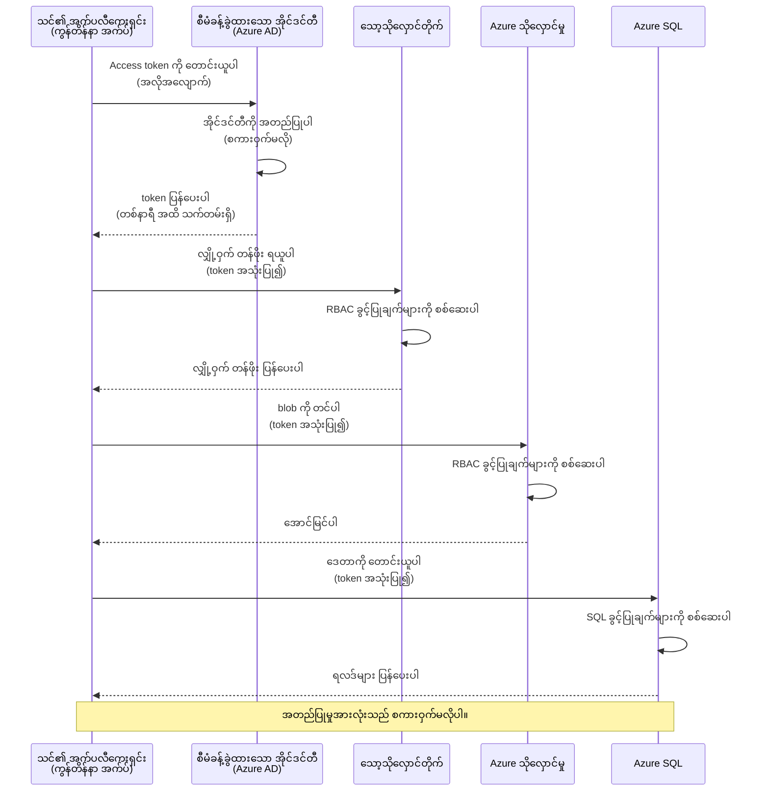
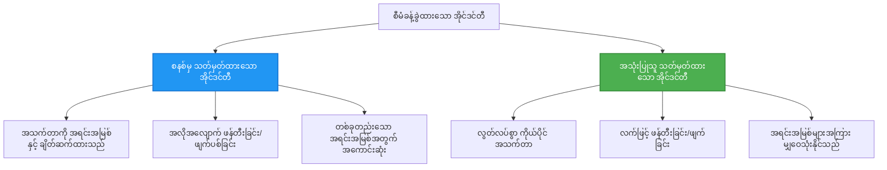

# အတည်ပြုမှု နမူနာများနှင့် Managed Identity

⏱️ **ခန့်မှန်းချိန်**: 45-60 မိနစ် | 💰 **ကုန်ကျစရိတ်**: အခမဲ့ (အပိုကြေးမရှိ) | ⭐ **ရှုပ်ထွေးမှု**: အလယ်အလတ်

**📚 သင်ယူမှု လမ်းကြောင်း:**
- ← ယခင်: [ပတ်ဝန်းကျင် စီမံခန့်ခွဲမှု](configuration.md) - အပြင်ပတ်လေ့လာမှု အချက်များနှင့် လျှို့ဝှက်ချက်များ စီမံခန့်ခွဲခြင်း
- 🎯 **သင်နေရာမှာ**: အတည်ပြုမှုနှင့် လုံခြုံရေး (Managed Identity, Key Vault, လုံခြုံသော နမူနာများ)
- → နောက်တစ်ခု: [ပထမ Project](first-project.md) - သင့်ပထမ AZD အက်ပလီကေးရှင်းကို တည်ဆောက်ပါ
- 🏠 [သင်တန်း הבית](../../README.md)

---

## သင်ဘာတွေ သင်ယူမလဲ

ဤသင်ခန်းစာကို ပြီးမြောက်ရင် သင့်အနေနဲ့:
- Azure အတည်ပြုမှု နမူနာများ (keys, connection strings, managed identity) ကို နားလည်မယ်
- စကားဝှက် မလိုအပ်ပဲ အတည်ပြုရန် **Managed Identity** ကို အကောင်အထည်ဖော်မယ်
- **Azure Key Vault** ပေါင်းစည်းခြင်းဖြင့် လျှို့ဝှက်ချက်များကို လုံခြုံစွာ သိမ်းဆည်းမယ်
- AZD deployments အတွက် **role-based access control (RBAC)** ကို တွန်းလှန်ဆောင်ရွက်မယ်
- Container Apps နှင့် Azure ဝန်ဆောင်မှုများတွင် လုံခြုံရေးအကောင်းဆုံးလေ့ကျင့်မှုများကို အသုံးချမယ်
- key-based authentication ကနေ identity-based authentication သို့ ပြောင်းရွှေ့မယ်

## Managed Identity အရေးကြီးတဲ့ အချက်

### ပြဿနာ: ရိုးရာ အတည်ပြုမှု

**Managed Identity မရောက်မီ:**
```javascript
// ❌ လုံခြုံရေးအန္တရာယ်: ကုဒ်ထဲတွင် တိုက်ရိုက်သတ်မှတ်ထားသော လျှို့ဝှက်ချက်များ
const connectionString = "Server=mydb.database.windows.net;User=admin;Password=P@ssw0rd123";
const storageKey = "xK7mN9pQ2wR5tY8uI0oP3aS6dF1gH4jK...";
const cosmosKey = "C2x7B9n4M1p8Q5w3E6r0T2y5U8i1O4p7...";
```

**ပြဿနာများ:**
- 🔴 **ကုဒ်၊ config ဖိုင်များ၊ ပတ်ဝန်းကျင် အပြောင်းအရွှေ့များအတွင်း လျှို့ဝှက်ချက်များ ဖော်ပြနေခြင်း**
- 🔴 **လိုင်စင်ပြောင်းခြင်း** အတွက် ကုဒ်ပြင်ဆင်ခြင်း နှင့် ပြန်တင်ရန် လိုအပ်ခြင်း
- 🔴 **စာရင်းစစ်အခက်အခဲများ** - ဘယ်သူ ဘယ်အချိန် ဘယ်လို ဝင်ရောက်ထားသလဲ ဆိုတာ ဆန်းစစ်ရခက်
- 🔴 **ဖြန့်ချိမှု** - လျှို့ဝှက်ချက်များ အမျိုးမျိုးစနစ်များပေါ် အချိုးကျမရှိစွာ ဖြန့်ချိထားခြင်း
- 🔴 **လိုက်နာမှု ကျဆင်းခြင်း** - လုံခြုံရေး စစ်ဆေးမှုများမှာ ပျက်ကွက်နိုင်ခြင်း

### ဖြေရှင်းချက်: Managed Identity

**Managed Identity ရောက်ပြီးနောက်:**
```javascript
// ✅ လုံခြုံ: ကုဒ်ထဲတွင် လျှို့ဝှက်ချက်များ မရှိပါ
const credential = new DefaultAzureCredential();
const client = new BlobServiceClient(
  "https://mystorageaccount.blob.core.windows.net",
  credential  // Azure သည် အတည်ပြုခြင်းကို အလိုအလျောက် ကိုင်တွယ်ပေးသည်
);
```

**အကျိုးကျေးဇူးများ:**
- ✅ **ကုဒ်သို့မဟုတ် configuration ထဲတွင် လျှို့ဝှက်ချက် မရှိခြင်း**
- ✅ **အလိုAutomatic အလှည့်ပတ်မှု** - Azure က ထိန်းချုပ်ပေးသည်
- ✅ **Azure AD မှတ်တမ်းများတွင် စုံလင်သော စစ်ဆေးရေး မှတ်တမ်း**
- ✅ **မူလိက လုံခြုံရေး ဗဟိုပြုခြင်း** - Azure Portal မှ စီမံခန့်ခွဲနိုင်သည်
- ✅ **လိုက်နာမှု စံသတ်မှတ်ချက်များ ပြည့်မီသည်**

**နမူနာ**: ရိုးရာ အတည်ပြုမှုသည် တံခါး များအတွက် တစ်ချိန်တည်းမှာ သော့များ များစွာကို ကိုင်ဆောင်ထားနေရခြင်းနှင့် နှိုင်းယှဉ်နိုင်သည်။ Managed Identity သည် သင်၏ ကိုယ်ပိုင် အချက်အလက်အရ အလိုအလျောက် ဝင်ခွင့်ပေးသည့် လုံခြုံရေး နံပါတ်တံဆိပ်လိုဖြစ်သည် — သော့များ မလွဲ၊ မကူး၊ မလှည့်ရန် လိုမည်မဟုတ်။

---

## အင်ဂျင်နီယာပုံစံ အကျဉ်းချုံး

### Managed Identity ဖြင့် အတည်ပြုမှု လှိုင်းစဉ်


### Managed Identities အမျိုးအစားများ


| လက္ခဏာ | စနစ်-ပေးအပ်ထားသော (System-Assigned) | အသုံးပြုသူ-ပေးအပ်ထားသော (User-Assigned) |
|---------|----------------|---------------|
| **ဘဝချိန်ဇယား (Lifecycle)** | အရင်းအမြစ်နှင့် တွဲလျက်ရှိသည် | လွတ်လပ်သည် |
| **ဖန်တီးခြင်း** | အရင်းအမြစ်နှင့်အတူ အလိုမှန်ဖန်တီး | လက်စွဲဖြင့် ဖန်တီးရမည် |
| **ဖျက်ပစ်ခြင်း** | အရင်းအမြစ်ဖျက်ချိန်တွင် ဖျက်သည် | အရင်းအမြစ် ဖျက်သော်လည်း ကျန်ရှိသေးသည် |
| **မျှဝေမှု** | တစ်ခုသော အရင်းအမြစ်တွင်သာ | အမြောက်အများ အရင်းအမြစ်များနှင့် |
| **အသုံးချခြင်းကိစ္စ** | ရိုးရှင်းသည့် အခြေအနေပေါ် | အရင်းအမြစ်များစွာပါသော ရှုပ်ထွေးသည့် အခြေအနေများ |
| **AZD ပုံမှန်** | ✅ အကြံပြုသည် | ရွေးချယ်နိုင်သည် |

---

## မူလလိုအပ်ချက်များ

### လိုအပ်သော စက်ကိရိယာများ

မရေမရာသင်ခန်းစာများမှ ယခင်တွင် ထည့်သွင်းပြီးသားဖြစ်ကြောင်း သင်ကြားထားရမည်။

```bash
# Azure Developer CLI ကို အတည်ပြုပါ
azd version
# ✅ မျှော်မှန်းချက်: azd ဗားရှင်း 1.0.0 သို့မဟုတ် ပိုမြင့်

# Azure CLI ကို အတည်ပြုပါ
az --version
# ✅ မျှော်မှန်းချက်: azure-cli 2.50.0 သို့မဟုတ် ပိုမြင့်
```

### Azure လိုအပ်ချက်များ

- တက်ရောက်နိုင်သည့် Azure subscription ရှိရမည်
- ခွင့်ပြုချက်များ -
  - Managed identities ဖန်တီးနိုင်ခြင်း
  - RBAC role များ ပေးချိန်းနိုင်ခြင်း
  - Key Vault အရင်းအမြစ်များ ဖန်တီးနိုင်ခြင်း
  - Container Apps များ တင်သွင်းနိုင်ခြင်း

### သိရှိရန် လိုအပ်ချက်များ

သင်ပြီးမြောက်ထားရမည့်သင်ခန်းစာများ:
- [Installation Guide](installation.md) - AZD စတင်တပ်ဆင်ခြင်း
- [AZD Basics](azd-basics.md) - အခြေခံ အယူအဆများ
- [Configuration Management](configuration.md) - ပတ်ဝန်းကျင် အချက်များ

---

## သင်ခန်းစာ 1: အတည်ပြုမှု နမူနာများ ကို နားလည်ခြင်း

### နမူနာ 1: Connection Strings (ရိုးရာ - ရှောင်ကြဉ်ရန်)

**အလုပ်လုပ်ပုံ:**
```bash
# ချိတ်ဆက်ရန် စာကြောင်းထဲတွင် ဝင်ခွင့်အချက်အလက်များ ပါဝင်သည်
STORAGE_CONNECTION_STRING="DefaultEndpointsProtocol=https;AccountName=myaccount;AccountKey=xK7mN9pQ2wR5..."
COSMOS_CONNECTION_STRING="AccountEndpoint=https://myaccount.documents.azure.com:443/;AccountKey=C2x7..."
SQL_CONNECTION_STRING="Server=myserver.database.windows.net;User=admin;Password=P@ssw0rd..."
```

**ပြဿနာများ:**
- ❌ ပတ်ဝန်းကျင် အပြောင်းအရွှေ့များတွင် လျှို့ဝှက်ချက်များ မြင်သာနေခြင်း
- ❌ တင်သွင်းစနစ်များတွင် မှတ်တမ်းတင်ထားခြင်း
- ❌ လှည့်ပြောင်းရန် ခက်ခဲခြင်း
- ❌ ဝင်ရောက်ခွင့် စစ်ဆေးချက် မရှိခြင်း

**ဘယ်အချိန် အသုံးပြုမလဲ:** ဒေသတွင်း ဖွံ့ဖြိုးရေး အတွက်သာ၊ ထုတ်လုပ်မှုအတွက် မတော်တဆ အသုံးမပြုပါနှင့်။

---

### နမူနာ 2: Key Vault References (ပိုကောင်းတယ်)

**အလုပ်လုပ်ပုံ:**
```bicep
// Store secret in Key Vault
resource keyVault 'Microsoft.KeyVault/vaults@2023-02-01' = {
  name: 'mykv'
  properties: {
    enableRbacAuthorization: true
  }
}

// Reference in Container App
env: [
  {
    name: 'STORAGE_KEY'
    secretRef: 'storage-key'  // References Key Vault
  }
]
```

**အကျိုးကျေးဇူးများ:**
- ✅ လျှို့ဝှက်ချက်များကို Key Vault တွင် လုံခြုံစွာ သိမ်းဆည်းထားသည်
- ✅ လျှို့ဝှက်ချက်များကို ဗဟိုစီမံခန့်ခွဲနိုင်သည်
- ✅ ကုဒ်မပြင်ဘဲ လှည့်ပြောင်းနိုင်မှု

**အကန့်အသတ်များ:**
- ⚠️ အကယ်၍ keys/passwords ကို အချက်ပြ အသုံးပြုနေဆဲ ဖြစ်သည်
- ⚠️ Key Vault အတွက် လက်လှမ်းမီခွင့်များကို စီမံရမည်

**ဘယ်အချိန် အသုံးပြုမလဲ:** connection strings ကနေ managed identity သို့ ပြောင်းရွှေ့ရန် အလွှာတစ်ခုအနေနဲ့ အသုံးပြုပါ။

---

### နမူနာ 3: Managed Identity (အကောင်းဆုံး လုပ်ထုံးလုပ်နည်း)

**အလုပ်လုပ်ပုံ:**
```bicep
// Enable managed identity
resource containerApp 'Microsoft.App/containerApps@2023-05-01' = {
  name: 'myapp'
  identity: {
    type: 'SystemAssigned'  // Automatically creates identity
  }
}

// Grant permissions
resource roleAssignment 'Microsoft.Authorization/roleAssignments@2022-04-01' = {
  scope: storageAccount
  properties: {
    roleDefinitionId: storageBlobDataContributorRole
    principalId: containerApp.identity.principalId
  }
}
```

**Application code:**
```javascript
// လျှို့ဝှက်ချက်မလိုပါ!
const { DefaultAzureCredential } = require('@azure/identity');
const { BlobServiceClient } = require('@azure/storage-blob');

const credential = new DefaultAzureCredential();
const blobServiceClient = new BlobServiceClient(
  'https://mystorageaccount.blob.core.windows.net',
  credential
);
```

**အကျိုးကျေးဇူးများ:**
- ✅ ကုဒ်/ဖိုင်ထဲတွင် လျှို့ဝှက်ချက် မရှိပါ
- ✅ အလိုအလျောက် credential လှည့်ပြောင်းမှု
- ✅ စုံလင်သော စစ်ဆေးရေး မှတ်တမ်း
- ✅ RBAC အပေါ် အခြေခံ ခွင့်ပြုချက်များ
- ✅ လိုက်နာမှု သတ်မှတ်ချက်များ လက်ခံနိုင်သည်

**ဘယ်အချိန် အသုံးပြုမလဲ:** ထုတ်လုပ်မှု အက်ပလီကေးရှင်းများအတွက် အမြဲတမ်း။

---

## သင်ခန်းစာ 2: AZD နဲ့ Managed Identity ကို အကောင်အထည်ဖော်ခြင်း

### အဆင့်-စဉ် ချမှတ်ချက်

Managed identity ကို အသုံးပြု၍ Azure Storage နှင့် Key Vault သို့ အလုပ်လုပ်နိုင်သည့် လုံခြုံသော Container App တစ်ခု တည်ဆောက်ကြပါစို့။

### Project ဖွဲ့စည်းပုံ

```
secure-app/
├── azure.yaml                 # AZD configuration
├── infra/
│   ├── main.bicep            # Main infrastructure
│   ├── core/
│   │   ├── identity.bicep    # Managed identity setup
│   │   ├── keyvault.bicep    # Key Vault configuration
│   │   └── storage.bicep     # Storage with RBAC
│   └── app/
│       └── container-app.bicep
└── src/
    ├── app.js                # Application code
    ├── package.json
    └── Dockerfile
```

### 1. AZD ကို စောင့်ရှောက်ဆောင်ရွက်ခြင်း (azure.yaml)

```yaml
name: secure-app
metadata:
  template: secure-app@1.0.0

services:
  api:
    project: ./src
    language: js
    host: containerapp

# Enable managed identity (AZD handles this automatically)
```

### 2. အုတ်မြစ်: Managed Identity ကို ဖွင့်ရန်

**ဖိုင်: `infra/main.bicep`**

```bicep
targetScope = 'subscription'

param environmentName string
param location string = 'eastus'

var tags = { 'azd-env-name': environmentName }

// Resource group
resource rg 'Microsoft.Resources/resourceGroups@2021-04-01' = {
  name: 'rg-${environmentName}'
  location: location
  tags: tags
}

// Storage Account
module storage './core/storage.bicep' = {
  name: 'storage'
  scope: rg
  params: {
    name: 'st${uniqueString(rg.id)}'
    location: location
    tags: tags
  }
}

// Key Vault
module keyVault './core/keyvault.bicep' = {
  name: 'keyvault'
  scope: rg
  params: {
    name: 'kv-${uniqueString(rg.id)}'
    location: location
    tags: tags
  }
}

// Container App with Managed Identity
module containerApp './app/container-app.bicep' = {
  name: 'container-app'
  scope: rg
  params: {
    name: 'ca-${environmentName}'
    location: location
    tags: tags
    storageAccountName: storage.outputs.name
    keyVaultName: keyVault.outputs.name
  }
}

// Grant Container App access to Storage
module storageRoleAssignment './core/role-assignment.bicep' = {
  name: 'storage-role'
  scope: rg
  params: {
    principalId: containerApp.outputs.identityPrincipalId
    roleDefinitionId: 'ba92f5b4-2d11-453d-a403-e96b0029c9fe'  // Storage Blob Data Contributor
    targetResourceId: storage.outputs.id
  }
}

// Grant Container App access to Key Vault
module kvRoleAssignment './core/role-assignment.bicep' = {
  name: 'kv-role'
  scope: rg
  params: {
    principalId: containerApp.outputs.identityPrincipalId
    roleDefinitionId: '4633458b-17de-408a-b874-0445c86b69e6'  // Key Vault Secrets User
    targetResourceId: keyVault.outputs.id
  }
}

// Outputs
output AZURE_STORAGE_ACCOUNT_NAME string = storage.outputs.name
output AZURE_KEY_VAULT_NAME string = keyVault.outputs.name
output APP_URL string = containerApp.outputs.url
```

### 3. System-Assigned Identity ဖြင့် Container App

**ဖိုင်: `infra/app/container-app.bicep`**

```bicep
param name string
param location string
param tags object = {}
param storageAccountName string
param keyVaultName string

resource containerApp 'Microsoft.App/containerApps@2023-05-01' = {
  name: name
  location: location
  tags: tags
  identity: {
    type: 'SystemAssigned'  // 🔑 Enable managed identity
  }
  properties: {
    configuration: {
      ingress: {
        external: true
        targetPort: 3000
      }
    }
    template: {
      containers: [
        {
          name: 'api'
          image: 'myregistry.azurecr.io/api:latest'
          resources: {
            cpu: json('0.5')
            memory: '1Gi'
          }
          env: [
            {
              name: 'AZURE_STORAGE_ACCOUNT_NAME'
              value: storageAccountName
            }
            {
              name: 'AZURE_KEY_VAULT_NAME'
              value: keyVaultName
            }
            // 🔑 No secrets - managed identity handles authentication!
          ]
        }
      ]
    }
  }
}

// Output the identity for RBAC assignments
output identityPrincipalId string = containerApp.identity.principalId
output id string = containerApp.id
output url string = 'https://${containerApp.properties.configuration.ingress.fqdn}'
```

### 4. RBAC Role Assignment Module

**ဖိုင်: `infra/core/role-assignment.bicep`**

```bicep
param principalId string
param roleDefinitionId string  // Azure built-in role ID
param targetResourceId string

resource roleAssignment 'Microsoft.Authorization/roleAssignments@2022-04-01' = {
  name: guid(principalId, roleDefinitionId, targetResourceId)
  scope: resourceId('Microsoft.Resources/resourceGroups', resourceGroup().name)
  properties: {
    roleDefinitionId: subscriptionResourceId('Microsoft.Authorization/roleDefinitions', roleDefinitionId)
    principalId: principalId
    principalType: 'ServicePrincipal'
  }
}

output id string = roleAssignment.id
```

### 5. Managed Identity သုံးသည့် Application ကုဒ်

**ဖိုင်: `src/app.js`**

```javascript
const express = require('express');
const { DefaultAzureCredential } = require('@azure/identity');
const { BlobServiceClient } = require('@azure/storage-blob');
const { SecretClient } = require('@azure/keyvault-secrets');

const app = express();
const PORT = process.env.PORT || 3000;

// 🔑 အတည်ပြု အချက်အလက်များကို စတင်သတ်မှတ်ခြင်း (managed identity ဖြင့် အလိုအလျောက် လုပ်ဆောင်သည်)
const credential = new DefaultAzureCredential();

// Azure Storage တပ်ဆင်ခြင်း
const storageAccountName = process.env.AZURE_STORAGE_ACCOUNT_NAME;
const blobServiceClient = new BlobServiceClient(
  `https://${storageAccountName}.blob.core.windows.net`,
  credential  // သော့များ မလိုအပ်ပါ!
);

// Key Vault တပ်ဆင်ခြင်း
const keyVaultName = process.env.AZURE_KEY_VAULT_NAME;
const secretClient = new SecretClient(
  `https://${keyVaultName}.vault.azure.net`,
  credential  // သော့များ မလိုအပ်ပါ!
);

// အခြေအနေ စစ်ဆေးခြင်း
app.get('/health', (req, res) => {
  res.json({ status: 'healthy', authentication: 'managed-identity' });
});

// ဖိုင်ကို blob storage သို့ တင်ပို့ခြင်း
app.post('/upload', async (req, res) => {
  try {
    const containerClient = blobServiceClient.getContainerClient('uploads');
    await containerClient.createIfNotExists();
    
    const blobName = `file-${Date.now()}.txt`;
    const blockBlobClient = containerClient.getBlockBlobClient(blobName);
    
    await blockBlobClient.upload('Hello from managed identity!', 30);
    
    res.json({
      success: true,
      blobName: blobName,
      message: 'File uploaded using managed identity!'
    });
  } catch (error) {
    console.error('Upload error:', error);
    res.status(500).json({ error: error.message });
  }
});

// Key Vault မှ လျှို့ဝှက်ချက် ရယူခြင်း
app.get('/secret/:name', async (req, res) => {
  try {
    const secretName = req.params.name;
    const secret = await secretClient.getSecret(secretName);
    
    res.json({
      name: secretName,
      value: secret.value,
      message: 'Secret retrieved using managed identity!'
    });
  } catch (error) {
    console.error('Secret error:', error);
    res.status(500).json({ error: error.message });
  }
});

// blob container များ စာရင်းပြခြင်း (ဖတ်ခွင့်ကို ပြသသည်)
app.get('/containers', async (req, res) => {
  try {
    const containers = [];
    for await (const container of blobServiceClient.listContainers()) {
      containers.push(container.name);
    }
    
    res.json({
      containers: containers,
      count: containers.length,
      message: 'Containers listed using managed identity!'
    });
  } catch (error) {
    console.error('List error:', error);
    res.status(500).json({ error: error.message });
  }
});

app.listen(PORT, () => {
  console.log(`Secure API listening on port ${PORT}`);
  console.log('Authentication: Managed Identity (passwordless)');
});
```

**ဖိုင်: `src/package.json`**

```json
{
  "name": "secure-app",
  "version": "1.0.0",
  "dependencies": {
    "express": "^4.18.2",
    "@azure/identity": "^4.0.0",
    "@azure/storage-blob": "^12.17.0",
    "@azure/keyvault-secrets": "^4.7.0"
  },
  "scripts": {
    "start": "node app.js"
  }
}
```

### 6. တင်သွင်းပြီး စမ်းသပ်ခြင်း

```bash
# AZD ပတ်ဝန်းကျင်ကို စတင်ပြင်ဆင်ပါ
azd init

# အခြေခံအဆောက်အအုံနှင့် အက်ပလီကေးရှင်းကို တပ်ဆင်ပါ
azd up

# အက်ပ်၏ URL ကို ရယူပါ
APP_URL=$(azd env get-values | grep APP_URL | cut -d '=' -f2 | tr -d '"')

# အခြေအနေ စစ်ဆေးမှုကို စမ်းသပ်ပါ
curl $APP_URL/health
```

**✅ မျှော်လင့်ထားသော ထွက်စီးချက်:**
```json
{
  "status": "healthy",
  "authentication": "managed-identity"
}
```

**Blob တင်သွင်းစမ်းသပ်ခြင်း:**
```bash
curl -X POST $APP_URL/upload
```

**✅ မျှော်လင့်ထားသော ထွက်စီးချက်:**
```json
{
  "success": true,
  "blobName": "file-1700404800000.txt",
  "message": "File uploaded using managed identity!"
}
```

**Container စာရင်းကြည့်ရန် စမ်းသပ်ခြင်း:**
```bash
curl $APP_URL/containers
```

**✅ မျှော်လင့်ထားသော ထွက်စီးချက်:**
```json
{
  "containers": ["uploads"],
  "count": 1,
  "message": "Containers listed using managed identity!"
}
```

---

## အထွေထွေ Azure RBAC အခန်းကဏ္ဍများ

### Managed Identity အတွက် Built-in Role IDs

| ဝန်ဆောင်မှု | Role Name | Role ID | ခွင့်ပြုချက်များ |
|---------|-----------|---------|-------------|
| **Storage** | Storage Blob Data Reader | `2a2b9908-6b94-4a3d-8e5a-a7d8f8cc8a12` | Blob နှင့် container များကို ဖတ်နိုင်ခြင်း |
| **Storage** | Storage Blob Data Contributor | `ba92f5b4-2d11-453d-a403-e96b0029c9fe` | Blob များကို ဖတ်၊ ရေး၊ ဖျက်နိုင်ခြင်း |
| **Storage** | Storage Queue Data Contributor | `974c5e8b-45b9-4653-ba55-5f855dd0fb88` | Queue တစ်ခု၏ မက်ဆေ့ဂျ်များကို ဖတ်၊ ရေး၊ ဖျက်နိုင်ခြင်း |
| **Key Vault** | Key Vault Secrets User | `4633458b-17de-408a-b874-0445c86b69e6` | လျှို့ဝှက်ချက်များ ဖတ်လို့ရခြင်း |
| **Key Vault** | Key Vault Secrets Officer | `b86a8fe4-44ce-4948-aee5-eccb2c155cd7` | လျှို့ဝှက်ချက်များကို ဖတ်၊ ရေး၊ ဖျက်နိုင်ခြင်း |
| **Cosmos DB** | Cosmos DB Built-in Data Reader | `00000000-0000-0000-0000-000000000001` | Cosmos DB ဒေတာကို ဖတ်နိုင်ခြင်း |
| **Cosmos DB** | Cosmos DB Built-in Data Contributor | `00000000-0000-0000-0000-000000000002` | Cosmos DB ဒေတာကို ဖတ်၊ ရေးနိုင်ခြင်း |
| **SQL Database** | SQL DB Contributor | `9b7fa17d-e63e-47b0-bb0a-15c516ac86ec` | SQL ဒေတာဘေ့စ်များကို စီမံခန့်ခွဲနိုင်ခြင်း |
| **Service Bus** | Azure Service Bus Data Owner | `090c5cfd-751d-490a-894a-3ce6f1109419` | မက်ဆေ့ဂျ်များ ပို့၊ လက်ခံ၊ စီမံနိုင်ခြင်း |

### Role ID များကို ဘယ်လို ရှာမလဲ

```bash
# ထည့်သွင်းထားသော အခန်းကဏ္ဍများအားလုံးကို စာရင်းပြပါ
az role definition list --query "[].{Name:roleName, ID:name}" --output table

# သတ်မှတ်ထားသော အခန်းကဏ္ဍကို ရှာဖွေပါ
az role definition list --query "[?contains(roleName, 'Storage Blob')].{Name:roleName, ID:name}" --output table

# အခန်းကဏ္ဍ အသေးစိတ်ကို ရယူပါ
az role definition list --name "Storage Blob Data Contributor"
```

---

## လက်တွေ့ လေ့ကျင့်ခန်းများ

### လေ့ကျင့်ခန်း 1: ရှိပြီးသား App အတွက် Managed Identity ဖွင့်ခြင်း ⭐⭐ (အလယ်အလတ်)

**ရည်ရွယ်ချက်**: ရှိပြီးသား Container App deployment အတွက် managed identity ထည့်ပါ

**အခြေအနေ**: Connection strings ကို အသုံးပြုနေတဲ့ Container App တစ်ရပ်ရှိသည်။ ကိုယ့်လိုအပ်ချက်အတိုင်း managed identity သို့ ပြောင်းပါ။

**စတင်နေရာ**: အောက်ပါ configuration ပါရှိသော Container App:

```bicep
// ❌ Current: Using connection string
env: [
  {
    name: 'STORAGE_CONNECTION_STRING'
    secretRef: 'storage-connection'
  }
]
```

**ခြေလှမ်းများ**:

1. **Bicep တွင် managed identity ဖွင့်ပါ:**

```bicep
resource containerApp 'Microsoft.App/containerApps@2023-05-01' = {
  name: 'myapp'
  identity: {
    type: 'SystemAssigned'  // Add this
  }
  // ... rest of configuration
}
```

2. **Storage ခွင့်ပြုချက် ပေးပါ:**

```bicep
// Get storage account reference
resource storageAccount 'Microsoft.Storage/storageAccounts@2023-01-01' existing = {
  name: storageAccountName
}

// Assign role
resource roleAssignment 'Microsoft.Authorization/roleAssignments@2022-04-01' = {
  name: guid(containerApp.id, 'ba92f5b4-2d11-453d-a403-e96b0029c9fe', storageAccount.id)
  scope: storageAccount
  properties: {
    roleDefinitionId: subscriptionResourceId('Microsoft.Authorization/roleDefinitions', 'ba92f5b4-2d11-453d-a403-e96b0029c9fe')
    principalId: containerApp.identity.principalId
    principalType: 'ServicePrincipal'
  }
}
```

3. **Application ကုဒ်ကို အပ်ဒိတ်လုပ်ပါ:**

**မတိုင်ခင် (connection string):**
```javascript
const { BlobServiceClient } = require('@azure/storage-blob');

const blobServiceClient = BlobServiceClient.fromConnectionString(
  process.env.STORAGE_CONNECTION_STRING
);
```

**ပြီးနောက် (managed identity):**
```javascript
const { DefaultAzureCredential } = require('@azure/identity');
const { BlobServiceClient } = require('@azure/storage-blob');

const credential = new DefaultAzureCredential();
const blobServiceClient = new BlobServiceClient(
  `https://${process.env.STORAGE_ACCOUNT_NAME}.blob.core.windows.net`,
  credential
);
```

4. **ပတ်ဝန်းကျင် အပြောင်းအရွှေ့များကို အပ်ဒိတ်လုပ်ပါ:**

```bicep
env: [
  {
    name: 'STORAGE_ACCOUNT_NAME'
    value: storageAccountName  // Just the name, no secrets!
  }
  // Remove STORAGE_CONNECTION_STRING
]
```

5. **Deploy ပြုလုပ်၍ စမ်းသပ်ပါ:**

```bash
# ပြန်တင်ပါ
azd up

# အလုပ်လုပ်နေဆဲ ဖြစ်ကြောင်း စမ်းသပ်ပါ
curl https://myapp.azurecontainerapps.io/upload
```

**✅ အောင်မြင်မှု အခြေအနေများ:**
- ✅ အက်ပလီကေးရှင်းကို အမှားမရှိတင်သွင်းနိုင်သည်
- ✅ Storage လုပ်ဆောင်ချက်များ လုပ်ဆောင်နိုင်သည် (upload, list, download)
- ✅ ပတ်ဝန်းကျင် အပြောင်းအရွှေ့များတွင် connection strings မရှိရ
- ✅ Azure Portal တွင် "Identity" blade အောက်တွင် identity ပြတင်းပေါက် တွေ့နိုင်ရမည်

**အတည်ပြုချက်:**

```bash
# managed identity ကို ဖွင့်ထားပြီးကြောင်း စစ်ဆေးပါ
az containerapp show \
  --name myapp \
  --resource-group rg-myapp \
  --query "identity.type"
# ✅ မျှော်မှန်းချက်: "SystemAssigned"

# ရာထူး သတ်မှတ်မှုကို စစ်ဆေးပါ
az role assignment list \
  --assignee $(az containerapp show --name myapp --resource-group rg-myapp --query "identity.principalId" -o tsv) \
  --scope /subscriptions/{sub-id}/resourceGroups/rg-myapp/providers/Microsoft.Storage/storageAccounts/mystorageaccount
# ✅ မျှော်မှန်းချက်: "Storage Blob Data Contributor" ရာထူးကို ပြသထားခြင်း
```

**အချိန်**: 20-30 မိနစ်

---

### လေ့ကျင့်ခန်း 2: หลายဝန်ဆောင်မှုပူးပေါင်းစည်းခြင်းနှင့် User-Assigned Identity ⭐⭐⭐ (ခက်ခဲ)

**ရည်ရွယ်ချက်**: အသုံးပြုသူ-ပေးအပ်ထားသော identity တစ်ခု ဖန်တီးပြီး Container Apps များစွာအကြား မျှဝေပေးပါ

**အခြေအနေ**: သင်မှာ microservices 3 ခုရှိပြီး အားလုံးမှာတူညီတဲ့ Storage account နှင့် Key Vault သို့ ဝင်ရောက်ချင်သည်။

**ခြေလှမ်းများ**:

1. **User-assigned identity ဖန်တီးပါ:**

**ဖိုင်: `infra/core/identity.bicep`**

```bicep
param name string
param location string
param tags object = {}

resource userAssignedIdentity 'Microsoft.ManagedIdentity/userAssignedIdentities@2023-01-31' = {
  name: name
  location: location
  tags: tags
}

output id string = userAssignedIdentity.id
output principalId string = userAssignedIdentity.properties.principalId
output clientId string = userAssignedIdentity.properties.clientId
```

2. **User-assigned identity အတွက် role များပေးပါ:**

```bicep
// In main.bicep
module userIdentity './core/identity.bicep' = {
  name: 'user-identity'
  scope: rg
  params: {
    name: 'id-${environmentName}'
    location: location
    tags: tags
  }
}

// Grant Storage access
resource storageRoleAssignment 'Microsoft.Authorization/roleAssignments@2022-04-01' = {
  name: guid(userIdentity.outputs.principalId, 'storage-contributor')
  scope: storageAccount
  properties: {
    roleDefinitionId: subscriptionResourceId('Microsoft.Authorization/roleDefinitions', 'ba92f5b4-2d11-453d-a403-e96b0029c9fe')
    principalId: userIdentity.outputs.principalId
    principalType: 'ServicePrincipal'
  }
}

// Grant Key Vault access
resource kvRoleAssignment 'Microsoft.Authorization/roleAssignments@2022-04-01' = {
  name: guid(userIdentity.outputs.principalId, 'kv-secrets-user')
  scope: keyVault
  properties: {
    roleDefinitionId: subscriptionResourceId('Microsoft.Authorization/roleDefinitions', '4633458b-17de-408a-b874-0445c86b69e6')
    principalId: userIdentity.outputs.principalId
    principalType: 'ServicePrincipal'
  }
}
```

3. **Identity ကို Container Apps အများသို့ ပေးချိန်းပါ:**

```bicep
resource apiGateway 'Microsoft.App/containerApps@2023-05-01' = {
  name: 'api-gateway'
  identity: {
    type: 'UserAssigned'
    userAssignedIdentities: {
      '${userIdentity.outputs.id}': {}
    }
  }
  // ... rest of config
}

resource productService 'Microsoft.App/containerApps@2023-05-01' = {
  name: 'product-service'
  identity: {
    type: 'UserAssigned'
    userAssignedIdentities: {
      '${userIdentity.outputs.id}': {}
    }
  }
  // ... rest of config
}

resource orderService 'Microsoft.App/containerApps@2023-05-01' = {
  name: 'order-service'
  identity: {
    type: 'UserAssigned'
    userAssignedIdentities: {
      '${userIdentity.outputs.id}': {}
    }
  }
  // ... rest of config
}
```

4. **Application ကုဒ် (ဝန်ဆောင်မှုအားလုံး တူညီသော ပုံစံကို အသုံးပြုသည်):**

```javascript
const { DefaultAzureCredential, ManagedIdentityCredential } = require('@azure/identity');

// အသုံးပြုသူပေးအပ်ထားသော identity အတွက် client ID ကို သတ်မှတ်ပါ
const credential = new ManagedIdentityCredential(
  process.env.AZURE_CLIENT_ID  // အသုံးပြုသူပေးအပ်ထားသော identity ၏ client ID
);

// သို့မဟုတ် DefaultAzureCredential ကို အသုံးပြုပါ (အလိုအလျောက် ရှာဖွေသည်)
const credential = new DefaultAzureCredential();

const blobServiceClient = new BlobServiceClient(
  `https://${process.env.STORAGE_ACCOUNT_NAME}.blob.core.windows.net`,
  credential
);
```

5. **Deploy ပြုလုပ်၍ အတည်ပြုပါ:**

```bash
azd up

# ဝန်ဆောင်မှုအားလုံးသည် သိုလှောင်စနစ်ကို အသုံးပြုနိုင်ကြောင်း စမ်းသပ်ပါ
curl https://api-gateway.azurecontainerapps.io/upload
curl https://product-service.azurecontainerapps.io/upload
curl https://order-service.azurecontainerapps.io/upload
```

**✅ အောင်မြင်မှု အခြေအနေများ:**
- ✅ ဝန်ဆောင်မှု 3 ခုလုံး အတွက် တစ်ခုတည်းသော identity ကို မျှဝေထားသည်
- ✅ အားလုံးသော ဝန်ဆောင်မှုများ Storage နှင့် Key Vault ကို ဝင်ရောက်အသုံးပြုနိုင်သည်
- ✅ ဝန်ဆောင်မှုတစ်ခု ဖျက်သိမ်းသော်လည်း identity က ကြာရှည်တည်ရှိသည်
- ✅ ခွင့်ပြုချက်များကို ဗဟိုမှ စီမံနိုင်သည်

User-Assigned Identity ၏ အကျိုးကျေးဇူးများ:
- စီမံရန် တစ်ခုတည်းသော identity
- ဝန်ဆောင်မှုများအတွင်း ခွင့်ပြုချက် များ တူညီစေရန်
- ဝန်ဆောင်မှု ဖျက်သိမ်းခြင်းခံရသော်Identity တည်ရှိစေခြင်း
- ရှုပ်ထွေးသော ဆောက်လုပ်ပုံများအတွက် ပိုသင့်တော်သည်

**အချိန်**: 30-40 မိနစ်

---

### လေ့ကျင့်ခန်း 3: Key Vault Secret Rotation အကောင်အထည်ဖော်ခြင်း ⭐⭐⭐ (ခက်ခဲ)

**ရည်ရွယ်ချက်**: အပေါ်ပေါက် API keys များကို Key Vault တွင် သိမ်းဆည်း၍ managed identity ဖြင့် အသုံးပြုပါ

**အခြေအနေ**: သင့် app သည် သုံးစွဲသူတတိယ API (OpenAI, Stripe, SendGrid) များကို ခေါ်ရန် API keys လိုအပ်သည်။

**ခြေလှမ်းများ**:

1. **RBAC နှင့် အတူ Key Vault ဖန်တီးပါ:**

**ဖိုင်: `infra/core/keyvault.bicep`**

```bicep
param name string
param location string
param tags object = {}

resource keyVault 'Microsoft.KeyVault/vaults@2023-02-01' = {
  name: name
  location: location
  tags: tags
  properties: {
    enableRbacAuthorization: true  // Use RBAC instead of access policies
    sku: {
      family: 'A'
      name: 'standard'
    }
    tenantId: subscription().tenantId
    enableSoftDelete: true
    softDeleteRetentionInDays: 90
  }
}

// Allow Container App to read secrets
output id string = keyVault.id
output name string = keyVault.name
output uri string = keyVault.properties.vaultUri
```

2. **Key Vault တွင် လျှို့ဝှက်ချက်များ သိမ်းဆည်းပါ:**

```bash
# Key Vault အမည်ကို ရယူရန်
KV_NAME=$(azd env get-values | grep AZURE_KEY_VAULT_NAME | cut -d '=' -f2 | tr -d '"')

# တတိယပါတီ API key များကို သိမ်းဆည်းရန်
az keyvault secret set \
  --vault-name $KV_NAME \
  --name "OpenAI-ApiKey" \
  --value "sk-proj-xxxxxxxxxxxxx"

az keyvault secret set \
  --vault-name $KV_NAME \
  --name "Stripe-ApiKey" \
  --value "sk_live_xxxxxxxxxxxxx"

az keyvault secret set \
  --vault-name $KV_NAME \
  --name "SendGrid-ApiKey" \
  --value "SG.xxxxxxxxxxxxx"
```

3. **လျှို့ဝှက်ချက်များ ရယူရန် Application ကုဒ်:**

**ဖိုင်: `src/config.js`**

```javascript
const { DefaultAzureCredential } = require('@azure/identity');
const { SecretClient } = require('@azure/keyvault-secrets');

class Config {
  constructor() {
    this.credential = new DefaultAzureCredential();
    this.secretClient = new SecretClient(
      `https://${process.env.AZURE_KEY_VAULT_NAME}.vault.azure.net`,
      this.credential
    );
    this.cache = {};
  }

  async getSecret(secretName) {
    // ပထမဦးစွာ ကက်ရှ်ကို စစ်ဆေးပါ
    if (this.cache[secretName]) {
      return this.cache[secretName];
    }

    try {
      const secret = await this.secretClient.getSecret(secretName);
      this.cache[secretName] = secret.value;
      console.log(`✅ Retrieved secret: ${secretName}`);
      return secret.value;
    } catch (error) {
      console.error(`❌ Failed to get secret ${secretName}:`, error.message);
      throw error;
    }
  }

  async getOpenAIKey() {
    return this.getSecret('OpenAI-ApiKey');
  }

  async getStripeKey() {
    return this.getSecret('Stripe-ApiKey');
  }

  async getSendGridKey() {
    return this.getSecret('SendGrid-ApiKey');
  }
}

module.exports = new Config();
```

4. **Application တွင် လျှို့ဝှက်ချက်များ အသုံးချပါ:**

**ဖိုင်: `src/app.js`**

```javascript
const express = require('express');
const config = require('./config');
const { OpenAI } = require('openai');

const app = express();

// Key Vault မှ ကီးကို အသုံးပြု၍ OpenAI ကို စတင်တပ်ဆင်ပါ
let openaiClient;

async function initializeServices() {
  const openaiKey = await config.getOpenAIKey();
  openaiClient = new OpenAI({ apiKey: openaiKey });
  console.log('✅ Services initialized with secrets from Key Vault');
}

// စတင်သည့်အချိန်တွင် ခေါ်ပါ
initializeServices().catch(console.error);

app.post('/chat', async (req, res) => {
  try {
    const completion = await openaiClient.chat.completions.create({
      model: 'gpt-4',
      messages: [{ role: 'user', content: 'Hello!' }]
    });
    
    res.json({
      response: completion.choices[0].message.content,
      authentication: 'Key from Key Vault via Managed Identity'
    });
  } catch (error) {
    res.status(500).json({ error: error.message });
  }
});

app.listen(3000, () => {
  console.log('Secure API with Key Vault integration running');
});
```

5. **Deploy ပြုလုပ်၍ စမ်းသပ်ပါ:**

```bash
azd up

# API key များ အလုပ်လုပ်သည်ကို စမ်းသပ်ပါ
curl -X POST https://myapp.azurecontainerapps.io/chat \
  -H "Content-Type: application/json" \
  -d '{"message":"Hello AI"}'
```

**✅ အောင်မြင်မှု အခြေအနေများ:**
- ✅ API keys များကို ကုဒ် သို့မဟုတ် ပတ်ဝန်းကျင် အပြောင်းအရွှေ့များတွင် မထားရှိခြင်း။
- ✅ အက်ပလီကေးရှင်းသည် Key Vault မှ keys များရယူနိုင်သည်။
- ✅ အယူအဆအပေါ် Third-party APIs များမှန်ကန်စွာ လည်ပတ်သည်။
- ✅ ကုဒ် မပြင်ဘဲ keys များကို လှည့်ပြောင်းနိုင်သည်။

လျှို့ဝှက်ချက် တစ်ခု လှည့်ပြောင်းရန်:

```bash
# Key Vault ထဲရှိ လျှို့ဝှက်ချက်ကို အပ်ဒိတ်လုပ်ပါ
az keyvault secret set \
  --vault-name $KV_NAME \
  --name "OpenAI-ApiKey" \
  --value "sk-proj-NEW_KEY_HERE"

# အသစ်သော သော့ကို အသုံးပြုရန် အက်ပ်ကို ပြန်စတင်ပါ
az containerapp revision restart \
  --name myapp \
  --resource-group rg-myapp
```

**အချိန်**: 25-35 မိနစ်

---

## သိကြောင်း စစ်ဆေးရန် စင်္ကြယ်

### 1. အတည်ပြုမှု နမူနာများ ✓

သင်၏ နားလည်မှုကို စမ်းပါ:

- [ ] **Q1**: အတည်ပြုမှု၏ မူလ ပုံစံ သုံးမျိုး ဘာတွေလဲ?
  - **A**: Connection strings (ရိုးရာ), Key Vault references (ပြောင်းရွှေ့အဆင့်), Managed Identity (အကောင်းဆုံး)

- [ ] **Q2**: Managed identity သည် connection strings ထက် ဘာကြောင့် ပိုကောင်းသလဲ?
  - **A**: ကုဒ်ထဲ လျှို့ဝှက်ချက် မရှိခြင်း၊ အလိုအလျောက် လှည့်ပြောင်းခြင်း၊ စုံလင်သော စစ်ဆေးရေး မှတ်တမ်း၊ RBAC ခွင့်ပြုချက်များ

- [ ] **Q3**: System-assigned ထက် user-assigned identity ကို ဘယ်အချိန် အသုံးပြုမလဲ?
  - **A**: အရင်းအမြစ်များ မျှဝေသုံးရန် သို့မဟုတ် identity ၏ ဘဝချိန်ဇယားကို အရင်းအမြစ်နှင့် မတွဲချင်သည့် အခါ

**လက်တွေ့ အတည်ပြုချက်:**
```bash
# သင့်အက်ပ်က အသုံးပြုထားသော ကိုယ်ပိုင်အမှတ်အသား (identity) အမျိုးအစားကို စစ်ဆေးပါ
az containerapp show \
  --name myapp \
  --resource-group rg-myapp \
  --query "identity.type"

# အဆိုပါ ကိုယ်ပိုင်အမှတ်အသားအတွက် သတ်မှတ်ထားသော role ခန့်ထားမှုများအားလုံးကို စာရင်းထုတ်ပါ
az role assignment list \
  --assignee $(az containerapp show --name myapp --resource-group rg-myapp --query "identity.principalId" -o tsv)
```

---

### 2. RBAC နှင့် ခွင့်ပြုချက်များ ✓

သင်၏ နားလည်မှုကို စမ်းပါ:

- [ ] **Q1**: "Storage Blob Data Contributor" အတွက် role ID ဘာလဲ?
  - **A**: `ba92f5b4-2d11-453d-a403-e96b0029c9fe`

- [ ] **Q2**: "Key Vault Secrets User" သည် ဘာခွင့်ပြုချက်ပေးသလဲ?
  - **A**: လျှို့ဝှက်ချက်များကို ဖတ်ခွင့်သာ (ဖန်တီး၊ အသစ်ထည့်၊ ဖျက် မရ)

- [ ] **Q3**: Container App ကို Azure SQL အတွက် မည်သို့ ခွင့်ပြုမယ်?
  - **A**: "SQL DB Contributor" role ချထားရန် သို့မဟုတ် SQL အတွက် Azure AD အတည်ပြုမှုကို ဖွဲ့စည်းပါ

**လက်တွေ့ အတည်ပြုချက်:**
```bash
# တိကျသော အခန်းကဏ္ဍကို ရှာပါ
az role definition list --name "Storage Blob Data Contributor"

# သင်၏ အကောင့်အား သတ်မှတ်ထားသော အခန်းကဏ္ဍများကို စစ်ဆေးပါ
PRINCIPAL_ID=$(az containerapp show --name myapp --resource-group rg-myapp --query "identity.principalId" -o tsv)
az role assignment list --assignee $PRINCIPAL_ID --output table
```

---

### 3. Key Vault ပေါင်းစည်းမှု ✓

Test your understanding:
- [ ] **Q1**: Key Vault အတွက် access policies များကို မသုံးဘဲ RBAC ကို ဘယ်လို ဖွင့်ရမလဲ?
  - **A**: Bicep မှာ `enableRbacAuthorization: true` ကို သတ်မှတ်ပါ

- [ ] **Q2**: Managed identity authentication ကို မည်သည့် Azure SDK लाइဘ्रेရီ က ကိုင်တွယ်ပါသလဲ?
  - **A**: `@azure/identity` သုံးပြီး `DefaultAzureCredential` class ကို အသုံးပြုပါ

- [ ] **Q3**: Key Vault ရဲ့ secrets တွေ cache မှာ ဘယ်လောက် ကြာမြင့်သိမ်းထားနိုင်မလဲ?
  - **A**: အက်ပ်ပလိကေးရှင်း အပေါ်မူတည်သည်; သင့်ကိုယ်ပိုင် caching မဟာဗျူဟာကို ဆောင်ရွက်ပါ

**Hands-On Verification:**
```bash
# Key Vault အသုံးပြုခွင့် စမ်းသပ်ခြင်း
az keyvault secret show \
  --vault-name $KV_NAME \
  --name "OpenAI-ApiKey" \
  --query "value"

# RBAC ကို ဖွင့်ထားသည်ကို စစ်ဆေးပါ
az keyvault show \
  --name $KV_NAME \
  --query "properties.enableRbacAuthorization"
# ✅ မျှော်မှန်းချက်: true
```

---

## လုံခြုံမှု အကောင်းဆုံး လေ့ကျင့်မှုများ

### ✅ လုပ်ရန်:

1. **ထုတ်လုပ်မှုတွင် အမြဲ managed identity ကို သုံးပါ**
   ```bicep
   identity: {
     type: 'SystemAssigned'
   }
   ```

2. **နည်းဆုံး-အခွင့်အရေး RBAC အခန်းကဏ္ဍများကို သုံးပါ**
   - အလားအလာရှိပါက "Reader" အခန်းကဏ္ဍများကိုသုံးပါ
   - မရှိမဖြစ်လိုအပ်မှု မရှိပါက "Owner" သို့မဟုတ် "Contributor" ကို ရှောင်ရှားပါ

3. **တတိယပါတီ key များကို Key Vault တွင် သိမ်းဆည်းပါ**
   ```javascript
   const apiKey = await secretClient.getSecret('ThirdPartyApiKey');
   ```

4. **စာရင်းပြုစုရေးသားမှု မျှော်လင့်ချက်ကို ဖွင့်ပါ**
   ```bicep
   diagnosticSettings: {
     logs: [{ category: 'AuditEvent', enabled: true }]
   }
   ```

5. **dev/staging/prod အတွက် သီးခြား identity များကို သုံးပါ**
   ```bash
   azd env new dev
   azd env new staging
   azd env new prod
   ```

6. **ဆ secrets များကို ပုံမှန် အတိုင်းလှည့်ပါ**
   - Key Vault secrets များတွင် သက်တမ်းကုန်နေ့များ သတ်မှတ်ပါ
   - Azure Functions ဖြင့် အလိုအလျောက် လှည့်ပစ်ရေးကို အလုပ်လုပ်စေပါ

### ❌ မလုပ်ရပါ:

1. **လျှို့ဝှက်ဟာ့က်ကို တိုက်ရိုက် နာမည်ထဲ ထည့် မထားပါနဲ့**
   ```javascript
   // ❌ မကောင်း
   const apiKey = "sk-proj-xxxxxxxxxxxxx";
   ```

2. **ထုတ်လုပ်မှုတွင် connection strings မသုံးပါနဲ့**
   ```javascript
   // ❌ မကောင်း
   BlobServiceClient.fromConnectionString(process.env.STORAGE_CONNECTION_STRING)
   ```

3. **အလွန်အကျွံ ခွင့်ပြုချက် မပေးရပါ**
   ```bicep
   // ❌ BAD - too much access
   roleDefinitionId: 'Owner'
   
   // ✅ GOOD - least privilege
   roleDefinitionId: 'Storage Blob Data Reader'
   ```

4. **လျှို့ဝှက်ကို မှတ်တမ်းတင် မလုပ်ပါနဲ့**
   ```javascript
   // ❌ မကောင်း
   console.log('API Key:', apiKey);
   
   // ✅ ကောင်း
   console.log('API Key retrieved successfully');
   ```

5. **ထုတ်လုပ်မှု identities များကို ပတ်ဝန်းကျင်များ ကြား ဖလှယ် မျှဝေပါနဲ့**
   ```bicep
   // ❌ BAD - same identity for dev and prod
   // ✅ GOOD - separate identities per environment
   ```

---

## ပြဿနာဖြေရှင်း မိုင်လမ်းညွှန်

### ပြဿနာ: Azure Storage ကို ချိတ်ဆက်စဉ် "Unauthorized" ဖြစ်သည်

**လက္ခဏာများ:**
```
Error: Unauthorized (403)
AuthorizationPermissionMismatch: This request is not authorized to perform this operation
```

**ရောဂါသတ်မှတ်ချက်:**

```bash
# managed identity ဖွင့်ထားပါသလား စစ်ဆေးပါ
az containerapp show \
  --name myapp \
  --resource-group rg-myapp \
  --query "identity.type"
# ✅ မျှော်လင့်ချက်: "SystemAssigned" သို့မဟုတ် "UserAssigned"

# Role assignments ကို စစ်ဆေးပါ
PRINCIPAL_ID=$(az containerapp show --name myapp --resource-group rg-myapp --query "identity.principalId" -o tsv)
az role assignment list --assignee $PRINCIPAL_ID

# မျှော်လင့်ချက်: "Storage Blob Data Contributor" သို့မဟုတ် ဆင်တူသော role ကို မြင်ရပါမည်
```

**ဖြေရှင်းနည်းများ:**

1. **မှန်ကန်သော RBAC အခန်းကဏ္ဍ သတ်မှတ်ပေးပါ:**
```bash
STORAGE_ID=$(az storage account show --name mystorageaccount --resource-group rg-myapp --query "id" -o tsv)
az role assignment create \
  --assignee $PRINCIPAL_ID \
  --role "Storage Blob Data Contributor" \
  --scope $STORAGE_ID
```

2. **ပြန်လည်ဖြန့်ဝေမှုအချိန် စောင့်ပါ (၅-၁၀ မိနစ် ဆိုင်နိုင်သည်):**
```bash
# ရာထူးတာဝန်ပေးထားမှု အခြေအနေကို စစ်ဆေးပါ
az role assignment list --assignee $PRINCIPAL_ID --scope $STORAGE_ID
```

3. **အက်ပ်ကုဒ်သည် မှန်ကန်သော credential ကို အသုံးပြုနေကြောင်း စိစစ်ပါ:**
```javascript
// DefaultAzureCredential ကို အသုံးပြုနေကြောင်း သေချာပါ
const credential = new DefaultAzureCredential();
```

---

### ပြဿနာ: Key Vault access ပိတ်ပင်ခံရသည်

**လက္ခဏာများ:**
```
Error: Forbidden (403)
The user, group or application does not have secrets get permission
```

**ရောဂါသတ်မှတ်ချက်:**

```bash
# Key Vault RBAC ဖွင့်ထားမှုကို စစ်ဆေးပါ
az keyvault show \
  --name $KV_NAME \
  --query "properties.enableRbacAuthorization"
# ✅ မျှော်မှန်းချက်: မှန်

# ရာထူးပေးအပ်မှုများကို စစ်ဆေးပါ
az role assignment list \
  --assignee $PRINCIPAL_ID \
  --scope /subscriptions/{sub-id}/resourceGroups/rg-myapp/providers/Microsoft.KeyVault/vaults/$KV_NAME
```

**ဖြေရှင်းနည်းများ:**

1. **Key Vault ပေါ်တွင် RBAC ကို ဖွင့်ပါ:**
```bash
az keyvault update \
  --name $KV_NAME \
  --enable-rbac-authorization true
```

2. **Key Vault Secrets User အခန်းကဏ္ဍကို ချမှတ်ပေးပါ:**
```bash
KV_ID=$(az keyvault show --name $KV_NAME --query "id" -o tsv)
az role assignment create \
  --assignee $PRINCIPAL_ID \
  --role "Key Vault Secrets User" \
  --scope $KV_ID
```

---

### ပြဿနာ: DefaultAzureCredential ကို ဒေသတွင်း သုံးရာတွင် မအောင်မြင်ပါ

**လက္ခဏာများ:**
```
Error: DefaultAzureCredential failed to retrieve a token
CredentialUnavailableError: No credential available
```

**ရောဂါသတ်မှတ်ချက်:**

```bash
# သင်လော့ဂ်အင်ထားပြီးသားလား စစ်ဆေးပါ
az account show

# Azure CLI အတည်ပြုမှုကို စစ်ဆေးပါ
az ad signed-in-user show
```

**ဖြေရှင်းနည်းများ:**

1. **Azure CLI တွင် login ဝင်ပါ:**
```bash
az login
```

2. **Azure subscription ကို သတ်မှတ်ပါ:**
```bash
az account set --subscription "Your Subscription Name"
```

3. **ဒေသတွင်း ဖွံ့ဖြိုးရေးအတွက် environment variables များ သုံးပါ:**
```bash
export AZURE_TENANT_ID="your-tenant-id"
export AZURE_CLIENT_ID="your-client-id"
export AZURE_CLIENT_SECRET="your-client-secret"
```

4. **အခြား credential ကို ဒေသတွင်း အသုံးပြုပါ:**
```javascript
const { DefaultAzureCredential, AzureCliCredential } = require('@azure/identity');

// ဒေသခံ ဖွံ့ဖြိုးရေးအတွက် AzureCliCredential ကို အသုံးပြုပါ
const credential = process.env.NODE_ENV === 'production' 
  ? new DefaultAzureCredential()
  : new AzureCliCredential();
```

---

### ပြဿနာ: Role assignment ကာလ ကြာသွားသည်

**လက္ခဏာများ:**
- အခန်းကဏ္ဍကို အောင်မြင်စွာ ချမှတ်ထားသည်
- ထိုစာရင်းအချက်အလက် မူပိုင်ခွင့် 403 ပြသနေသည်
- အကြိမ်ကြိမ် ဝင်ရောက်မှု မတည်ငြိမ် (တခါတလေ အလုပ်လုပ်တတ်၊ တခါတလေ မလုပ်ဘူး)

**ရှင်းလင်းချက်:**
Azure RBAC ပြောင်းလဲမှုများသည် ကမ္ဘာလုံးဆိုင်ရာ ပျံ့နှံ့မှုအတွက် ၅-၁၀ မိနစ် ကြာနိုင်သည်။

**ဖြေရှင်းနည်း:**

```bash
# စောင့်ပြီး ထပ်မံကြိုးစားပါ
echo "Waiting for RBAC propagation..."
sleep 300  # ၅ မိနစ် စောင့်ပါ

# ဝင်ရောက်ခွင့် စမ်းသပ်ပါ
curl https://myapp.azurecontainerapps.io/upload

# ထပ်၍ မအောင်မြင်သေးပါက အက်ပ်ကို ပြန်စတင်ပါ
az containerapp revision restart \
  --name myapp \
  --resource-group rg-myapp
```

---

## ကုန်ကျစရိတ် ထည့်သွင်းစဉ်းစားမှုများ

### Managed Identity ကုန်ကျစရိတ်များ

| Resource | Cost |
|----------|------|
| **Managed Identity** | 🆓 **အခမဲ့** - ပေးဆောင်ရန်မရှိ |
| **RBAC Role Assignments** | 🆓 **အခမဲ့** - ပေးဆောင်ရန်မရှိ |
| **Azure AD Token Requests** | 🆓 **အခမဲ့** - ထည့်သွင်းပေးထားသည် |
| **Key Vault Operations** | $0.03 per 10,000 operations |
| **Key Vault Storage** | $0.024 per secret per month |

**Managed identity က ပိုစရိတ် သက်သာစေသည့်အချက်များ:**
- ✅ အဆိုပြုသော service-to-service authentication အတွက် Key Vault operations မလိုတော့ခြင်း
- ✅ လုံခြုံရေးဖြစ်ပွားမှုများ လျှော့နည်းစေခြင်း (လျှို့ဝှက် ထွက်ပေါက်မှု မရှိ)
- ✅ လုပ်ငန်းစဉ်ကျစေခြင်း (လက်ဖြတ်လွှဲလှည့် ပြုလုပ်ရန် မလို)

**ဥပမာ ကုန်ကျစရိတ် နှိုင်းယှဉ် (လစဉ်):**

| Scenario | Connection Strings | Managed Identity | Savings |
|----------|-------------------|-----------------|---------|
| Small app (1M requests) | ~$50 (Key Vault + ops) | ~$0 | $50/month |
| Medium app (10M requests) | ~$200 | ~$0 | $200/month |
| Large app (100M requests) | ~$1,500 | ~$0 | $1,500/month |

---

## ပိုစဉ်းစားရန်

### တရားဝင် စာရွက်စာတမ်းများ
- [Azure Managed Identity](https://learn.microsoft.com/entra/identity/managed-identities-azure-resources/overview)
- [Azure RBAC](https://learn.microsoft.com/azure/role-based-access-control/overview)
- [Azure Key Vault](https://learn.microsoft.com/azure/key-vault/general/overview)
- [DefaultAzureCredential](https://learn.microsoft.com/dotnet/api/azure.identity.defaultazurecredential)

### SDK စာရွက်စာတမ်းများ
- [@azure/identity (Node.js)](https://www.npmjs.com/package/@azure/identity)
- [Azure.Identity (C#)](https://www.nuget.org/packages/Azure.Identity/)
- [azure-identity (Python)](https://pypi.org/project/azure-identity/)

### သင်တန်းတွင် နောက်ဆက်တွဲ လုပ်ဆောင်ရန်
- ← ယခင်: [Configuration Management](configuration.md)
- → နောက်တစ်ခု: [First Project](first-project.md)
- 🏠 [Course Home](../../README.md)

### ဆက်စပ် ဥပမာများ
- [Azure OpenAI Chat Example](../../../../examples/azure-openai-chat) - Azure OpenAI အတွက် managed identity ကို အသုံးပြုထားသော နမူနာ
- [Microservices Example](../../../../examples/microservices) - အများဆုံး service authentication ပုံစံများ

---

## အကျဉ်းချုပ်

**သင်သင်ယူခဲ့သည်:**
- ✅ မူရင်း authentication ပုံစံ သုံးမျိုး (connection strings, Key Vault, managed identity)
- ✅ AZD တွင် managed identity ကို ဖွင့်ခြင်းနှင့် ပြင်ဆင်ခြင်းနည်းလမ်းများ
- ✅ Azure ဝန်ဆောင်မှုများအတွက် RBAC အခန်းကဏ္ဍ ချမှတ်ခြင်း
- ✅ တတိယပါတီ secrets များအတွက် Key Vault ဆိုင်ရာ ပေါင်းစည်းမှု
- ✅ User-assigned နှင့် system-assigned identities ကွာခြားချက်
- ✅ လုံခြုံရေး အကောင်းဆုံး လေ့ကျင့်မှုများနှင့် ပြဿနာဖြေရှင်းနည်းများ

**အဓိက ယူဆရမည့် အချက်များ:**
1. **ထုတ်လုပ်မှုတွင် အမြဲ managed identity ကို သုံးပါ** - အဘယ်သူမျှ secrets မရှိ၊ အလိုအလျောက် လှည့်ပတ်မှု
2. **နည်းဆုံး-အခွင့်အရေး RBAC အခန်းကဏ္ဍများကို သုံးပါ** - လိုအပ်သည့် ခွင့်သာပေးပါ
3. **တတိယပါတီ key များကို Key Vault တွင် သိမ်းဆည်းပါ** - လျှို့ဝှက်များကို အလယ်တန်း စီမံခန့်ခွဲမှု
4. **ပတ်ဝန်းကျင်အလိုက် identity များကို ခွဲခြားထားပါ** - Dev, staging, prod မှ ကွဲထွက်ထားခြင်း
5. **စာရင်းပြုစုရေးသားမှု ကို ဖွင့်ထားပါ** - ဘယ်သူ ဘာကို ရယူခဲ့သည်ကို လိုက်ကြည့်နိုင်စေမှု

**နောက်တိုးများ:**
1. အထက်ပါ လက်တွေ့ လေ့ကျင့်မှုများ ပြီးစီးပါ
2. ရှိပြီးသား အက်ပ်ကို connection strings မှ managed identity သို့ မိုက်ဂရိတ် လုပ်ပါ
3. ပထမ AZD ပရိုဂျက်ကို security စတင်ထားပြီး တည်ဆောက်ပါ: [First Project](first-project.md)

---

<!-- CO-OP TRANSLATOR DISCLAIMER START -->
အသိပေးချက်‌:
ဤစာရွက်ကို AI ဘာသာပြန်ဝန်ဆောင်မှု [Co-op Translator](https://github.com/Azure/co-op-translator) အသုံးပြုပြီး ဘာသာပြန်ထားပါသည်။ ကျွန်ုပ်တို့သည် မှန်ကန်မှုကို ကြိုးစားပေမယ့် မော်ရှင်းဖြစ်စေသော ဘာသာပြန်ချက်များတွင် အမှားများ သို့မဟုတ် မှားယွင်းချက်များရှိနိုင်ကြောင်း သတိပေးလိုပါသည်။ မူလစာတမ်းကို မူလဘာသာဖြင့်သာ ယုံကြည်စေရန် အာမခံရပါသည်။ အရေးကြီးသော အချက်အလက်များအတွက် မိမိနိုင်ငံတော် လိုရင်းနှင့် သက်ဆိုင်ရာ ပရော်ဖက်ရှင်နယ် လူ့ဘာသာပြန်ဆီမှ ဘာသာပြန်ချက်ယူရန် အကြံပြုပါသည်။ ဤဘာသာပြန်ချက်မျိုးအသုံးပြုခြင်းကြောင့် ဖြစ်ပေါ်လာနိုင်သည့် နားမလည်မှုများ သို့မဟုတ် မှားယွင်းဖတ်ရှုမှုများအတွက် ကျွန်ုပ်တို့သည် တာဝန်ခံမထားပါ။
<!-- CO-OP TRANSLATOR DISCLAIMER END -->