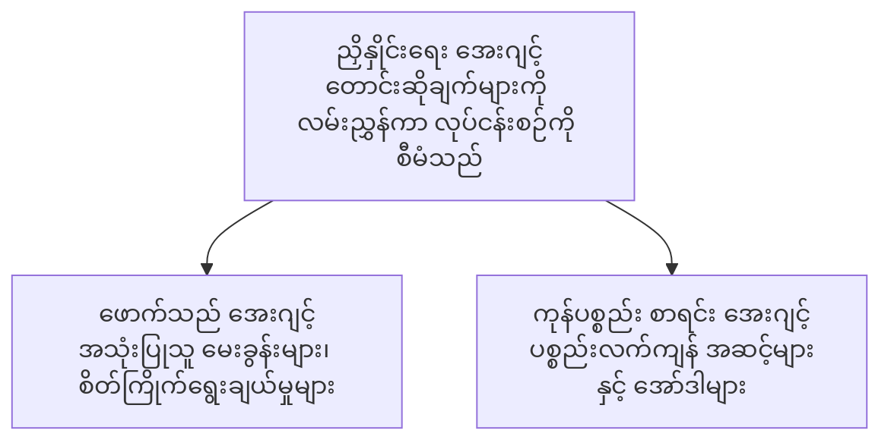

# Chapter 5: Multi-Agent AI Solutions

**📚 သင်တန်း**: [AZD အခြေခံများ](../../README.md) | **⏱️ ကာလ**: 2-3 hours | **⭐ ရှုပ်ထွေးမှု**: အဆင့်မြင့်

---

## အကျဉ်းချုံး

ဤအခန်းတွင် အဆင့်မြင့် မလ်တီ-အေးဂျင့် ဖွဲ့စည်းပုံ ပုံစံများ၊ အေးဂျင့် ညှိနှိုင်းမှု (orchestration) နှင့် ရှုပ်ထွေးသည့် အခြေအနေများအတွက် ထုတ်လုပ်မှုအသင့် AI တင်သွင်းမှုများကို ပြုလုပ်ပုံများကို ဖော်ပြထားပါသည်။

## သင်ယူရမည့် ရည်မှန်းချက်များ

By completing this chapter, you will:
- မလ်တီ-အေးဂျင့် ဖွဲ့စည်းပုံ ပုံစံများကို နားလည်နိုင်ရန်
- ညှိနှိုင်းကိရိယာ ပါဝင်သော AI အေးဂျင့် စနစ်များကို တင်သွင်းနိုင်ရန်
- အေးဂျင့်-မှ-အေးဂျင့် ဆက်သွယ်ရေးကို အကောင်အထည်ဖော်နိုင်ရန်
- ထုတ်လုပ်မှုအသင့် မလ်တီ-အေးဂျင့် ဖြေရှင်းချက်များ တည်ဆောက်နိုင်ရန်

---

## 📚 သင်ခန်းစာများ

| # | သင်ခန်းစာ | ဖော်ပြချက် | အချိန် |
|---|--------|-------------|------|
| 1 | [လက်လီ မလ်တီ-အေးဂျင့် ဖြေရှင်းချက်](../../examples/retail-scenario.md) | ပြည့်စုံသည့် အကောင်အထည်ဖော်ခြင်း လမ်းညွှန် | 90 မိနစ် |
| 2 | [ညှိနှိုင်း ပုံစံများ](../chapter-06-pre-deployment/coordination-patterns.md) | အေးဂျင့် ညှိနှိုင်းရေး မဟာဗျူဟာများ | 30 မိနစ် |
| 3 | [ARM Template ဖြန့်ချိခြင်း](../../examples/retail-multiagent-arm-template/README.md) | တစ်ချက်နှိပ် ဖြင့် တင်သွင်းခြင်း | 30 မိနစ် |

---

## 🚀 လျင်မြန် စတင်ရန်

```bash
# ရွေးချယ်မှု ၁: ပုံစံတစ်ခုမှ တပ်ဆင်ပါ
azd init --template agent-openai-python-prompty
azd up

# ရွေးချယ်မှု ၂: agent manifest ဖိုင်မှ တပ်ဆင်ပါ (azure.ai.agents extension လိုအပ်ပါသည်)
azd extension install azure.ai.agents
azd ai agent init -m agent-manifest.yaml
azd up
```

> **ဘယ်နည်းလမ်းကို အသုံးပြုသင့်သလဲ?** လုပ်ဆောင်နေသော နမူနာမှစတင်ရန် `azd init --template` ကို အသုံးပြုပါ။ သင့်ကိုယ်ပိုင် agent manifest ရှိပါက `azd ai agent init` ကို အသုံးပြုပါ။ အသေးစိတ်အချက်အလက်များအတွက် [AZD AI CLI ရည်ညွှန်းစာမျက်နှာ](../chapter-08-production/production-ai-practices.md#azd-ai-cli-commands-and-extensions) ကို ကြည့်ပါ။

---

## 🤖 မလ်တီ-အေးဂျင့် ဖွဲ့စည်းပုံ


---

## 🎯 ထူးခြားသော ဖြေရှင်းချက်: လက်လီ မလ်တီ-အေးဂျင့်

[လက်လီ မလ်တီ-အေးဂျင့် ဖြေရှင်းချက်](../../examples/retail-scenario.md) သည် အောက်ပါများကို ဖော်ပြသည်။

- **ဖောက်သည် အေးဂျင့်**: အသုံးပြုသူ အပြန်အလှန်နှင့် ကြိုက်နှစ်သက်မှုများကို ကိုင်တွယ်သည်။
- **ကုန်ပစ္စည်း စာရင်း အေးဂျင့်**: ပစ္စည်းလက်ကျန်နှင့် အမိန့်ကိုင်တွယ်မှုများကို စီမံခန့်ခွဲသည်။
- **ညှိနှိုင်းသူ (Orchestrator)**: အေးဂျင့်များအကြား ညှိနှိုင်းမှုများ ပြုလုပ်သည်။
- **မျှဝေသော မှတ်ဉာဏ်**: အေးဂျင့်များအကြား အကြောင်းအရာ စီမံခန့်ခွဲမှု

### အသုံးပြုသော ဝန်ဆောင်မှုများ

| ဝန်ဆောင်မှု | ရည်ရွယ်ချက် |
|---------|---------|
| Microsoft Foundry Models | ဘာသာစကား နားလည်မှု |
| Azure AI Search | ကုန်ပစ္စည်း စာရင်း |
| Cosmos DB | အေးဂျင့် အခြေအနေနှင့် မှတ်ဉာဏ် |
| Container Apps | အေးဂျင့် ဟိုက်စတင်း |
| Application Insights | စောင့်ကြည့်ခြင်း |

---

## 🔗 လမ်းညွှန်

| ဘက် | အခန်း |
|-----------|---------|
| **ယခင်** | [အခန်း ၄: အဆောက်အအုံ (Infrastructure)](../chapter-04-infrastructure/README.md) |
| **နောက်ထပ်** | [အခန်း ၆: တင်သွင်းမီ](../chapter-06-pre-deployment/README.md) |

---

## 📖 ဆက်စပ် အရင်းအမြစ်များ

- [AI Agents Guide](../chapter-02-ai-development/agents.md)
- [Production AI Practices](../chapter-08-production/production-ai-practices.md)
- [AI Troubleshooting](../chapter-07-troubleshooting/ai-troubleshooting.md)

---

<!-- CO-OP TRANSLATOR DISCLAIMER START -->
**အကြောင်းကြားချက်**:
ဤစာတမ်းကို AI ဘာသာပြန်ဝန်ဆောင်မှု [Co-op Translator](https://github.com/Azure/co-op-translator) ဖြင့် ဘာသာပြန်ထားပါသည်။ ကျွန်တော်တို့သည် တိကျမှန်ကန်မှုအတွက် ကြိုးပမ်းသော်လည်း အလိုအလျောက် ဘာသာပြန်ချက်များတွင် အမှားများ သို့မဟုတ် မှန်ကန်မှုလျော့နည္းချက်များ ပါရှိနိုင်ကြောင်း သတိပြုပါ။ မူလဘာသာဖြင့် ရေးသားထားသည့် မူရင်းစာတမ်းကို အာဏာပိုင် အရင်းအမြစ်အဖြစ် ယူဆသင့်ပါသည်။ အရေးပါတဲ့ အချက်အလက်များအတွက်တော့ ပရော်ဖက်ရှင်နယ် လူ့ဘာသာပြန်မှ ဘာသာပြန်ပေးရန် အကြံပြုပါသည်။ ဤဘာသာပြန်ချက်ကို အသုံးပြုမှုကြောင့် ဖြစ်ပေါ်လာသည့် နားလည်မှုမှားခြင်းများ သို့မဟုတ် မှားလွဲဖော်ပြချက်များအတွက် ကျွန်ုပ်တို့ တာဝန်မရှိပါ။
<!-- CO-OP TRANSLATOR DISCLAIMER END -->