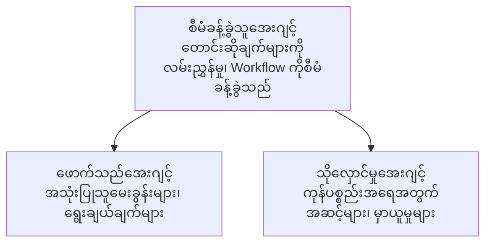

# အခန်း ၅: မူလတန်းအေးဂျင့် AI ဖြေရှင်းနည်းများ

**📚 သင်တန်း**: [AZD အစပြုသူများအတွက်](../../README.md) | **⏱️ ကြာချိန်**: ၂-၃ နာရီ | **⭐ အဆင့်» နှင့်အတူ**: အဆင့်မြင့်

---

## အနှစ်ချုပ်

ဒီအခန်းမှာ မူလတန်းအေးဂျင့် တည်ဆောက်ပုံပုံစံများ၊ အေးဂျင့်စနစ်ညှိနှိုင်းခြင်း၊ နောက်ဆုံးထုတ်လုပ်ရေးအဆင့် AI ဖြန့်ချိမှုများကို ဖော်ပြပေးသည်။

> `azd 1.27.1` ဖြင့် ဇူလိုင် ၂၀၂၆ တွင် အတည်ပြုခဲ့သည်။

## သင်ယူရမည့် ရည်မှန်းချက်များ

ဒီအခန်းကို ပြီးမြောက်စွာသင်ယူပြီးနောက်:
- မူလတန်းအေးဂျင့် တည်ဆောက်ပုံပုံစံများကို နားလည်ပါမည်
- ညှိနှိုင်းထားသော AI အေးဂျင့်စနစ်များကို ပြုလုပ်နိုင်ပါမည်
- အေးဂျင့်မိတ်ဆက်အကြား ဆက်သွယ်မှုကို အကောင်အထည်ဖော်နိုင်ပါမည်
- ထုတ်လုပ်ရေးအသုံးပြုနိုင်သည့် မူလတန်းအေးဂျင့် ဖြေရှင်းနည်းများကို တည်ဆောက်နိုင်ပါမည်

---

## 📚 သင်ခန်းစာများ

| # | သင်ခန်းစာ | ဖော်ပြချက် | ကြာချိန် |
|---|--------|-------------|------|
| 1 | [မူလတန်းအေးဂျင့် အခြေခံများ](multi-agent-basics.md) | အလက်တွေ့: `azd up` ဖြင့် လည်ပတ်ဘို့ရောမည့် မူလတန်းအေးဂျင့် အက်ပ်တစ်ခု ဖြန့်ချိခြင်း | ၄၅ မိနစ် |
| 2 | [ညှိနှိုင်းမှု ပုံစံများ](../chapter-06-pre-deployment/coordination-patterns.md) | အေးဂျင့်ကို ညှိနှိုင်းရေးနည်းစနစ်များ (အခန်း ၆တွင် ဆက်လက်တင်ပြ) | ၃၀ မိနစ် |
| 3 | [ARM နမူနာ စီစဉ်ထုတ်လွှင့်ခြင်း](../../examples/retail-multiagent-arm-template/README.md) | တစ်ချက်နှိပ်ပြီး ထုတ်လွှင့်ပေးမည့် နမူနာ | ၃၀ မိနစ် |

> **သင်ခန်းစာ ၁ ဖြင့် စတင်ပါ။** ဒီအခန်းမှာ တစ်ခုတည်းသော အလက်တွေ့ လုပ်ဆောင်နိုင်သော သင်ခန်းစာဖြစ်သည်။ သင်ခန်းစာ ၂ ကို အခန်း ၆ တွင်တွေ့ရှိနိုင် (အကြိုစီမံကိန်းနှင့်မျှဝေထားသည်)၊ [လက်လီ မူလတန်း အေးဂျင့် ဖြေရှင်းနည်း](../../examples/retail-scenario.md) သည် တည်ဆောက်မှု အခြေခံ အကြံပြုချက်ဖြစ်ပြီး၊ တစ်ချက်နှိပ်ပုံစံ မဟုတ်ပါ။

---

## 🚀 အမြန်စတင်ခြင်း

```bash
# ရွေးချယ်စရာ ၁: ပုံစံတစ်ခုမှ ဖြန့်ချိပါ
azd init --template agent-openai-python-prompty
azd up

# ရွေးချယ်စရာ ၂: အေးဂျင့် manifest မှ ဖြန့်ချိပါ (azure.ai.agents extension လိုအပ်သည်)
azd extension install azure.ai.agents
azd ai agent init -m agent-manifest.yaml
azd up
```

> **ဘယ်နည်းလမ်း?** `azd init --template` ဖြင့် လည်ပတ်နေသော နမူနาจလမ်းကြောင်းမှ စတင်ပါ။ ကိုယ့်အေးဂျင့် manifest ရှိချိန်မှာ `azd ai agent init` ကိုသုံးပါ။ အသေးစိတ်အချက်အလက်များအတွက် [AZD AI CLI ကိုးကားချက်](../chapter-08-production/production-ai-practices.md#azd-ai-cli-commands-and-extensions) ကို ကြည့်ပါ။

---

## 🤖 မူလတန်းအေးဂျင့် တည်ဆောက်ပုံ



---

## 🎯 ထူးခြားသော ဖြေရှင်းနည်း: လက်လီ မူလတန်းအေးဂျင့်

[လက်လီ မူလတန်းအေးဂျင့် ဖြေရှင်းနည်း](../../examples/retail-scenario.md) သည် အောက်ပါအချက်များကို ပြသသည်-

- **ဖောက်သည်အေးဂျင့်**: အသုံးပြုသူနှင့် စိစစ်ဆက်ဆံမှုများကို ကိုင်တွယ်သည်
- **လက်ကျန်စာရင်းအေးဂျင့်**: သိုလှောင်မှုနှင့် အမှာစာကို စီမံသည်
- **ညှိနှိုင်းသူ**: အေးဂျင့်များအကြား ညှိနှိုင်းသည်
- **မျှဝေသိုလှောင်မှု**: အေးဂျင့် များ၏ ပတ်ဝန်းကျင်ကို စီမံခြင်း

### အသုံးပြုသည့် ဝန်ဆောင်မှုများ

| ဝန်ဆောင်မှု | ရည်ရွယ်ချက် |
|---------|---------|
| Microsoft Foundry Models | ဘာသာစကားနားလည်မှု |
| Azure AI Search | ထုတ်ကုန် catalog |
| Cosmos DB | အေးဂျင့် အခြေအနေနှင့် မှတ်ဉာဏ် |
| Container Apps | အေးဂျင့် ဧည့်ခံခြင်း |
| Application Insights | မော်နီတာလုပ်ဆောင်ခြင်း |

---

## 🔗 လမ်းညွှန်

| ဦးတည်ရာ | အခန်း |
|-----------|---------|
| **နောက်တစ်ခါ** | [အခန်း ၄: အခြေခံအင်ဖရန်စထာခ်ချာ](../chapter-04-infrastructure/README.md) |
| **နောက်တစ်ခါ** | [အခန်း ၆: ကြိုတင်-ထုတ်လွှင့်ခြင်း](../chapter-06-pre-deployment/README.md) |

---

## 📖 ဆက်စပ် အရင်းအမြစ်များ

- [AI အေးဂျင့်များ လမ်းညွှန်](../chapter-02-ai-development/agents.md)
- [ထုတ်လုပ်ရေး AI လေ့ကျင့်မှုများ](../chapter-08-production/production-ai-practices.md)
- [AI ပြဿနာဖြေရှင်းခြင်း](../chapter-07-troubleshooting/ai-troubleshooting.md)

---

<!-- CO-OP TRANSLATOR DISCLAIMER START -->
**ပြောကြားချက်**
ဤစာတမ်းကို AI ဘာသာပြန်ဝန်ဆောင်မှု [Co-op Translator](https://github.com/Azure/co-op-translator) အသုံးပြု၍ ဘာသာပြန်ထားပါသည်။ ကျွန်ုပ်တို့သည် တိကျမှန်ကန်မှုအတွက် ကြိုးပမ်းနေသော်လည်း၊ စက်ကိရိယာဘာသာပြန်ခြင်းများတွင် အမှားများ သို့မဟုတ် မှားယွင်းချက်များ ပါဝင်နိုင်ကြောင်း သတိပြုပါရန် လိုအပ်ပါသည်။ မူလစာတမ်းကို မူရင်းဘာသာဖြင့်သာ ယုံကြည်စိတ်ချရသော အချက်အလက်အဖြစ် သတ်မှတ်သင့်သည်။ အရေးကြီးသည့် သတင်းအချက်အလက်များအတွက် ပရော်ဖက်ရှင်နယ် လူသားဘာသာပြန်သူဝန်ဆောင်မှုကို အကြံပြုပါသည်။ ဤဘာသာပြန်ချက်ကို အသုံးပြုခြင်းမှ ဖြစ်ပေါ်လာသော နားလည်မှုကွာခြားမှုများ သို့မဟုတ် မမှန်ကန်သော အသုံးပြုမှုများအတွက် ကျွန်ုပ်တို့ တာဝန်မခံပါ။
<!-- CO-OP TRANSLATOR DISCLAIMER END -->