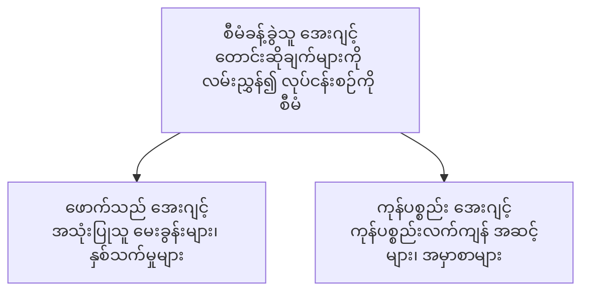

# အခန်း 5: Multi-Agent AI ဖြေရှင်းချက်များ

**📚 သင်တန်း**: [AZD For Beginners](../../README.md) | **⏱️ ကြာချိန်**: 2-3 နာရီ | **⭐ ရှုပ်ထွေးမှု**: အဆင့်မြင့်

---

## အကျဉ်းချုံး

ဤအခန်းတွင် အဆင့်မြင့် multi-agent ဖွဲ့စည်းပုံ မျိုးစနစ်များ၊ အေးဂျင့် ညှိနှိုင်းမှုနှင့် စိန်ခေါ်မှုများအတွက် ထုတ်လုပ်မှုအဆင့် အသင့် AI တပ်ဆင်ရန် နည်းလမ်းများကို ဖော်ပြထားသည်။

> 2026 မတ်လတွင် `azd 1.23.12` နှင့် အတည်ပြုထားသည်။

## သင်ယူရန် ရည်ရွယ်ချက်များ

ဤအခန်းကို ပြီးမြောက်စွာ သင်ယူပြီးပါက သင်သည်-
- Multi-agent ဖွဲ့စည်းပုံ များကို နားလည်နိုင်ပါမည်
- ပေါင်းစည်းညှိနှိုင်းထားသော AI အေးဂျင့် စနစ်များကို တပ်ဆင်နိုင်ပါမည်
- အေးဂျင့်မှ အေးဂျင့်သို့ ဆက်သွယ်မှုကို အကောင်အထည်ဖော်နိုင်ပါမည်
- ထုတ်လုပ်ရေးအဆင့် အသင့် multi-agent ဖြေရှင်းချက်များကို တည်ဆောက်နိုင်ပါမည်

---

## 📚 သင်ခန်းစာများ

| # | သင်ခန်းစာ | ဖော်ပြချက် | အချိန် |
|---|--------|-------------|------|
| 1 | [လက်လီ Multi-Agent ဖြေရှင်းချက်](../../examples/retail-scenario.md) | အပြည့်အစုံ အကောင်အထည်ဖော်လမ်းစဉ် | 90 မိနစ် |
| 2 | [ညှိနှိုင်းမှု မျိုးစံများ](../chapter-06-pre-deployment/coordination-patterns.md) | အေးဂျင့် ညှိနှိုင်းရေး မဟာဗျူဟာများ | 30 မိနစ် |
| 3 | [ARM Template Deployment](../../examples/retail-multiagent-arm-template/README.md) | တစ်နှိပ် ဖြင့် တပ်ဆင်ခြင်း | 30 မိနစ် |

---

## 🚀 အမြန် စတင်နည်း

```bash
# ရွေးချယ်မှု 1: တမ်းပလိတ်မှ တပ်ဆင်ခြင်း
azd init --template agent-openai-python-prompty
azd up

# ရွေးချယ်မှု 2: agent manifest မှ တပ်ဆင်ခြင်း (azure.ai.agents တိုးချဲ့မှု လိုအပ်သည်)
azd extension install azure.ai.agents
azd ai agent init -m agent-manifest.yaml
azd up
```

> **ဘယ်နည်းလမ်းကို ရွေးသင့်သနည်း?** လုပ်ဆောင်နေသော နမူနာမှ စတင်ရန် `azd init --template` ကို အသုံးပြုပါ။ သင်၏ကိုယ်ပိုင် agent manifest ရှိပါက `azd ai agent init` ကို အသုံးပြုပါ။ အသေးစိတ်အချက်အလက်များအတွက် [AZD AI CLI ကိုးကားချက်](../chapter-08-production/production-ai-practices.md#azd-ai-cli-commands-and-extensions) ကို ကြည့်ပါ။

---

## 🤖 Multi-Agent ဖွဲ့စည်းပုံ


---

## 🎯 ဖော်ပြထားသော ဖြေရှင်းချက်: လက်လီ Multi-Agent

The [လက်လီ Multi-Agent ဖြေရှင်းချက်](../../examples/retail-scenario.md) သည် အောက်ပါအရာများကို ပြသသည်။

- **ဖောက်သည် အေးဂျင့်**: အသုံးပြုသူဆက်သွယ်မှုများနှင့် အကြိုက်နှစ်သက်ချက်များကို ကိုင်တွယ်သည်။
- **ကုန်ပစ္စည်း စာရင်း အေးဂျင့်**: စတော့နှင့် အမှာစာ စီမံခန့်ခွဲမှုကို တာဝန်ယူသည်။
- **Orchestrator**: အေးဂျင့်များအကြား ညှိနှိုင်းမှု ပေးဆောင်သည်။
- **Shared Memory**: အေးဂျင့်များအတွင်း အကြောင်းအရာ မျှဝေမှုကို စီမံခန့်ခွဲသည်။

### အသုံးပြုသော ဝန်ဆောင်မှုများ

| ဝန်ဆောင်မှု | ရည်ရွယ်ချက် |
|---------|---------|
| Microsoft Foundry Models | ဘာသာစကား နားလည်မှု |
| Azure AI Search | ထုတ်ကုန် စာရင်း |
| Cosmos DB | အေးဂျင့် အခြေအနေနှင့် မှတ်ဉာဏ် |
| Container Apps | အေးဂျင့် ဟိုစ့်တင်း |
| Application Insights | စောင့်ကြည့်ခြင်း |

---

## 🔗 လမ်းညွှန်

| ဦးတည်ချက် | အခန်း |
|-----------|---------|
| **ယခင်** | [အခန်း 4: အခြေခံအဆောက်အုံ](../chapter-04-infrastructure/README.md) |
| **နောက်တစ်ခု** | [အခန်း 6: ကြိုတင်တပ်ဆင်ခြင်း](../chapter-06-pre-deployment/README.md) |

---

## 📖 ဆက်စပ်အရင်းအမြစ်များ

- [AI အေးဂျင့် လမ်းညွှန်](../chapter-02-ai-development/agents.md)
- [ထုတ်လုပ်ရေး AI လေ့ကျင့်နည်းလမ်းများ](../chapter-08-production/production-ai-practices.md)
- [AI ပြဿနာဖြေရှင်းရေး](../chapter-07-troubleshooting/ai-troubleshooting.md)

---

<!-- CO-OP TRANSLATOR DISCLAIMER START -->
**တာဝန်မရှိကြောင်း အသိပေးချက်**:
ဤစာတမ်းကို AI ဘာသာပြန်ခြင်း ဝန်ဆောင်မှု [Co-op Translator](https://github.com/Azure/co-op-translator) ဖြင့် ဘာသာပြန်ထားပါသည်။ ကျွန်ုပ်တို့သည် တိကျမှန်ကန်မှုကို ကြိုးပမ်းပေမယ့် အလိုအလျောက် ဘာသာပြန်ထားသည့်အချက်များတွင် အမှားများ သို့မဟုတ် မှန်ကန်မှု ချို့ယွင်းချက်များ ရှိနိုင်ကြောင်း ကျေးဇူးပြု၍ သိရှိထားပါ။ မူလစာတမ်းကို မူလဘာသာဖြင့်သာ အာဏာရှိသော ရင်းမြစ်အဖြစ် ယူဆသင့်သည်။ အရေးကြီးသော သတင်းအချက်အလက်များအတွက် လူ့ ပရော်ဖက်ရှင်နယ် ဘာသာပြန်သူတစ်ဦးမှ ဘာသာပြန်ခြင်းကို အကြံပြုပါသည်။ ဤဘာသာပြန်ချက်ကို အသုံးပြုခြင်းကြောင့် ဖြစ်ပေါ်ခဲ့သည့် နားမလည်မှုများ သို့မဟုတ် မှားယွင်းသဘောထားချက်များအတွက် ကျွန်ုပ်တို့သည် တာဝန်မယူပါ။
<!-- CO-OP TRANSLATOR DISCLAIMER END -->