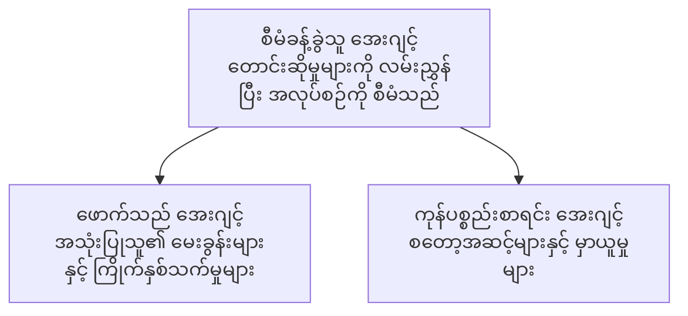

# အခန်း ၅: မူလအေးဂျင့် (Multi-Agent) AI ဖြေရှင်းချက်များ

**📚 Course**: [AZD For Beginners](../../README.md) | **⏱️ Duration**: 2-3 နာရီ | **⭐ Complexity**: အဆင့်မြင့်

---

## အကျဉ်းချုပ်

ဤအခန်းတွင် မူလအေးဂျင့် (multi-agent) အဆောက်အအုံ ပုံစံများ၊ agent များ၏ ညှိနှိုင်းမှုနှင့် ခက်ခဲသော အခြေအနေများအတွက် ထုတ်လုပ်ရေးအသင့် AI တပ်ဆင်မှုများကို ဖော်ပြပါသည်။

> Validated against `azd 1.25.6` in June 2026.

## လေ့လာရန်ရည်ရွယ်ချက်များ

ဤအခန်းကိုပြီးစီးပါက သင်သည်:
- မူလအေးဂျင့် (multi-agent) အဆောက်အအုံ ပုံစံများကို နားလည်ရန်
- ညှိနှိုင်းထားသော AI agent စနစ်များကို တပ်ဆင်ရန်
- agent-to-agent ဆက်သွယ်မှုကို အကောင်အထည်ဖော်ရန်
- ထုတ်လုပ်ရေးအသင့် multi-agent ဖြေရှင်းချက်များကို တည်ဆောက်ရန်

---

## 📚 သင်ခန်းစာများ

| # | သင်ခန်းစာ | ဖော်ပြချက် | အချိန် |
|---|--------|-------------|------|
| 1 | [Multi-Agent Basics](multi-agent-basics.md) | လက်တွေ့ လေ့ကျင့်ခြင်း: `azd up` ဖြင့် လည်ပတ်နိုင်သော multi-agent အက်ပ်ကို တပ်ဆင်ပါ | ၄၅ မိနစ် |
| 2 | [Coordination Patterns](../chapter-06-pre-deployment/coordination-patterns.md) | Agent များကို စီမံညှိနှိုင်းသည့် မဟာဗျူဟာများ (အခန်း ၆ တွင် ဆက်လက်ပါ) | ၃၀ မိနစ် |
| 3 | [ARM Template Deployment](../../examples/retail-multiagent-arm-template/README.md) | တစ်ချက်နှိပ်တင်သည့် တပ်ဆင်မှု နမူနာ | ၃၀ မိနစ် |

> **သင်ခန်းစာ ၁ ဖြင့် စတင်ပါ။** ၎င်းသည် ဤအခန်းအတွင်း အပြည့်အဝ လက်တွေ့လုပ်ဆောင်နိုင်ပြီး တပ်ဆင်နိုင်သော တစ်ခုတည်းသော သင်ခန်းစာဖြစ်သည်။ သင်ခန်းစာ ၂ သည် အခန်း ၆ တွင် ရှိပြီး (pre-deployment စီစဉ်မှုနှင့် ဝေမျှထားသည်)၊ နှင့် [Retail Multi-Agent Solution](../../examples/retail-scenario.md) သည် architecture blueprint—ဒီဇိုင်းအညွှန်း ဖြစ်ပါသည်၊ တစ်ချက်ကွန်မန့္ တန်ပလိတ် မဟုတ်ပါ။

---

## 🚀 အမြန် စတင်ရန်

```bash
# ရွေးချယ်မှု 1: နမူနာမှ ဖြန့်ချိရန်
azd init --template agent-openai-python-prompty
azd up

# ရွေးချယ်မှု 2: agent manifest မှ ဖြန့်ချိရန် (azure.ai.agents extension လိုအပ်သည်)
azd extension install azure.ai.agents
azd ai agent init -m agent-manifest.yaml
azd up
```

> **ဘယ်နည်းလမ်းကို အသုံးပြုမလဲ?** လည်ပတ်နိုင်သော နမူနာမှ စတင်ရန် `azd init --template` ကို အသုံးပြုပါ။ သင့်ကိုယ်ပိုင် agent manifest ရှိပါက `azd ai agent init` ကို အသုံးပြုပါ။ အသေးစိတ်အချက်အလက်များအတွက် [AZD AI CLI ကိုးကားချက်](../chapter-08-production/production-ai-practices.md#azd-ai-cli-commands-and-extensions) ကို ကြည့်ပါ။

---

## 🤖 မူလအေးဂျင့် အဆောက်အအုံ



---

## 🎯 အထူးဖော်ပြထားသည့် ဖြေရှင်းချက်: Retail Multi-Agent

[Retail Multi-Agent Solution](../../examples/retail-scenario.md) သည် အောက်ပါများကို ပြသသည်။

- **Customer Agent**: အသုံးပြုသူ ဆက်ဆံရေးများနှင့် နှစ်သက်ချက်များကို ကိုင်တွယ်သည်
- **Inventory Agent**: ကုန်ပစ္စည်း စတော့နှင့် မှာယူမှုလုပ်ငန်းစဉ်များကို စီမံသည်
- **Orchestrator**: Agent များအကြား ညှိနှိုင်းမှုကို ထိန်းချုပ်သည်
- **Shared Memory**: Agent များအကြား အဆက်အသွယ်နှင့် အချက်အလက် စီမံခန့်ခွဲမှု

### အသုံးပြုသည့် ဝန်ဆောင်မှုများ

| ဝန်ဆောင်မှု | ရည်ရွယ်ချက် |
|---------|---------|
| Microsoft Foundry Models | ဘာသာစကား နားလည်မှု |
| Azure AI Search | ကုန်ပစ္စည်း စာရင်း |
| Cosmos DB | Agent အခြေအနေနှင့် မှတ်ဉာဏ် |
| Container Apps | Agent များကို ဟိုစ့်လုပ်ရန် |
| Application Insights | စောင့်ကြည့်မှု |

---

## 🔗 လမ်းညွှန်

| ဘက် | အခန်း |
|-----------|---------|
| **ယခင်** | [အခန်း ၄: အခြေခံအဆောက်အအုံ](../chapter-04-infrastructure/README.md) |
| **နောက်** | [အခန်း ၆: ကြိုတင် တပ်ဆင်ခြင်း](../chapter-06-pre-deployment/README.md) |

---

## 📖 ဆက်စပ် အရင်းအမြစ်များ

- [AI Agents Guide](../chapter-02-ai-development/agents.md)
- [Production AI Practices](../chapter-08-production/production-ai-practices.md)
- [AI Troubleshooting](../chapter-07-troubleshooting/ai-troubleshooting.md)

---

<!-- CO-OP TRANSLATOR DISCLAIMER START -->
**ပြောကြားချက်**
ဤစာတမ်းကို AI ဘာသာပြန်ဝန်ဆောင်မှု [Co-op Translator](https://github.com/Azure/co-op-translator) အသုံးပြု၍ ဘာသာပြန်ထားပါသည်။ ကျွန်ုပ်တို့သည် တိကျမှန်ကန်မှုအတွက် ကြိုးပမ်းနေသော်လည်း၊ စက်ကိရိယာဘာသာပြန်ခြင်းများတွင် အမှားများ သို့မဟုတ် မှားယွင်းချက်များ ပါဝင်နိုင်ကြောင်း သတိပြုပါရန် လိုအပ်ပါသည်။ မူလစာတမ်းကို မူရင်းဘာသာဖြင့်သာ ယုံကြည်စိတ်ချရသော အချက်အလက်အဖြစ် သတ်မှတ်သင့်သည်။ အရေးကြီးသည့် သတင်းအချက်အလက်များအတွက် ပရော်ဖက်ရှင်နယ် လူသားဘာသာပြန်သူဝန်ဆောင်မှုကို အကြံပြုပါသည်။ ဤဘာသာပြန်ချက်ကို အသုံးပြုခြင်းမှ ဖြစ်ပေါ်လာသော နားလည်မှုကွာခြားမှုများ သို့မဟုတ် မမှန်ကန်သော အသုံးပြုမှုများအတွက် ကျွန်ုပ်တို့ တာဝန်မခံပါ။
<!-- CO-OP TRANSLATOR DISCLAIMER END -->