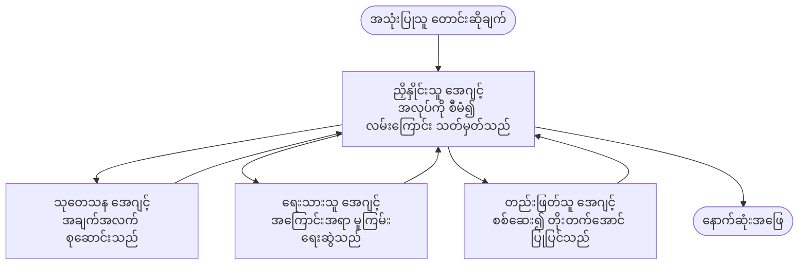

# Multi-Agent အခြေခံ - မိမိ ပထမဆုံး ညှိနှိုင်းထားသော AI စနစ်ကို ဖြန့်ချိခြင်း

**အခန်း လမ်းညွှန်:**
- **📚 သင်တန်း ပင်မစာမျက်နှာ**: [AZD အစပြုသူများ](../../README.md)
- **📖 လက်ရှိ အခန်း**: အခန်း 5 - Multi-Agent AI ဖြေရှင်းနည်းများ
- **⬅️ အရင်တစ်ခု**: [အခန်း 4: အင်ဖရာစတပ်ချာ](../chapter-04-infrastructure/README.md)
- **➡️ နောက်တစ်ခု**: [ညှိနှိုင်းမှု ပုံစံများ](../chapter-06-pre-deployment/coordination-patterns.md)

> `azd 1.25.6` အပေါ်တွင် 2026 ခုနှစ် ဇွန်လ တွင် အတည်ပြုထားသည်။

## နိဒါန်း

ယခင်အခန်းများတွင် သင် single application တစ်ခုကိုဖြန့်ချိပြီး—အခန်း 2 တွင် single AI agent တစ်ခုကို ဖြန့်ချိခဲ့သည်။ ဤသင်ခန်းသည် နောက်တစ်ခုအဆင့်ကိုယူသွားသည်။ သို့မှသာမက **multi-agent system** တစ်ခုဖြန့်ချိခြင်းဖြစ်ပြီး၊ အထူးပြု အေးဂျင်များအများစုက ပြဿနာတစ်ခုကို ပူးပေါင်းဖြေရှင်းရန် အလုပ်လုပ်ကြသည်၊ တစ်ဦးတည်းသော agent တစ်ခုဖြင့် ကောင်းစွာ မဖြေရှင်းနိုင်သည့် အမှုများအတွက်။

အစပျိုးသူများအတွက် သတင်းကောင်းသည်မှာ - **သင်အသစ်အမိန့်များ မလိုပါ။** Multi-agent ဖြေရှင်းချက်တစ်ခုသည် azd project တစ်ခုဖြစ်နေဆဲ ဖြစ်သည်။ သင်သည် `azd init`, `azd up`, စမ်းသပ်ခြင်း၊ နှင့် `azd down` ကို လုပ်မည်—သင်ရင်းနှီးပြီးသား workflow နှင့်တူညီသည်။ ပြောင်းလဲတာက အက်ပ်အတွင်းရှိ *ပုံစံ* ပဲ ဖြစ်သည်။

## သင်ယူရမည့် ရည်မှန်းချက်များ

ဒီသင်ခန်းနောက်ဆုံးတွင် သင်သည်:
- "multi-agent" ဆိုသည်မှာ ဘာကို ဆိုလိုသည်၊ မည်သည့်အခါ၌ အပိုရှုပ်ထွေးမှုကို သတိုးသင့်သည်ကို နားလည်နိုင်မည်
- multi-agent စနစ်တွင် ရိုးရာ အခန်းကဏ္ဍများ (ညှိနှိုင်းသူ + အထူးပြု) ကို အသိပေးနိုင်မည်
- `azd up` ဖြင့် အလုပ်လုပ်နိုင်သော real multi-agent template တစ်ခုကို ဖြန့်ချိနိုင်မည်
- multi-agent app ကို အောက်ခံထားသည့် Azure အရင်းအမြစ်များကို နားလည်နိုင်မည်
- ဖြန့်ချိပြီးနောက် စစ်ဆေး၊ ကိုယ်လက်ချိန်း၊ နှင့် လုံခြုံစွာ ဖျက်သိမ်းနိုင်မည်

## သင်ယူပြီးနောက် ရလဒ်များ

ဤသင်ခန်းကို ပြီးမြောက်နောက် သင်သည်:
- single agent နှင့် multi-agent စနစ်အကြား ကွာခြားချက်ကို ဖေါ်ပြနိုင်မည်
- tools ပါ၍ တစ်ဦးတည်းသော agent တစ်ခုနှင့် အမှန် multi-agent ဒီဇိုင်းအကြား ရွေးချယ်နိုင်မည်
- azd ဖြင့် multi-agent template တစ်ခုအား အစမှ အဆုံးအထိ ဖြန့်ချိပြီး စမ်းသပ်နိုင်မည်
- မည်သည့် agent က မည်သည့်နေရာတွင် ပြေးသည်နှင့် ၎င်းတို့ ပြောဆိုပုံကို ဖော်ထုတ်နိုင်မည်
- ဆက်လက်တည်ရှိသော အခွန်/ပေးငွေကို ရှောင်ရန် အရင်းအမြစ်အားလုံးကို စနစ်တကျ ဖျက်ပစ်နိုင်မည်

---

## Multi-Agent စနစ် ဆိုတာဘာလဲ?

Single AI agent တစ်ခုသည် အနည်းငယ်သော တိုင်းထောက်မှုနှင့် ဆောင်ရွက်ချက်များပါသော မော်ဒယ်တစ်ခုဖြစ်သည်။ ဤဟာသည် အာရုံစိုက်ထားသော တာဝန်များအတွက် ကောင်းမွန်သည်။ သို့သော် စိစစ်ရေး၊ ရေးသားခြင်း၊ တည်းဖြတ်ခြင်း၊ အချက်အလက်စစ်ဆေးခြင်းလို ဖေးဖွာလာသော အလုပ်တွင် တစ်ချက်တည်းသော prompt ထဲသို့ အားလုံးကို ထည့်သွင်းခြင်းသည် agent ကို နှေးကာ၊ ယုံကြည်ရမှုနည်း၊ ထိန်းချုပ်ရန် ခက်ခဲစေသည်။

A **multi-agent system** သည် အလုပ်ကို အထူးပြုသူများအဖြစ် ခွဲထွက်စေပြီး ဗဟိုညှိနှိုင်းသူတစ်ယောက်က ပူးပေါင်းညှိနှိုင်းချက်ပေးသည်။



### သင်အမြဲမြင်ရမည့် အခန်းကဏ္ဍ နှစ်မျိုး

| အခန်း | အလုပ်တာဝန် | ဥပမာ |
|-------|------------|-------|
| **Orchestrator (ညှိနှိုင်းသူ)** | *နောက်မှာဘာဖြစ်မလဲ* ကို ဆုံးဖြတ်ပြီး အေးဂျင်များအကြား လုပ်ငန်းများကို လမ်းညွှန်သည် | "ပထမ ဓာတ်ခွဲချက်၊ အပြီးတွင် ရေးသား၊ အကြောင်းစု၍ တည်းဖြတ်" |
| **Specialist (ကျွမ်းကျင်သူ)** | တစ်ခုတည်းသော အာရုံစိုက် အလုပ်ကို ပြုလုပ်ပြီး ရလဒ်ကို ပြန်ပေးပို့သည် | အချက်အလက်သာ စုဆောင်းသည့် "သုတေသနဆိုင်" |

### အမှန်တကယ် အများအေးဂျင်များ လိုအပ်ပါသလား?

ရိုး ရိုးရှင်းရှင်းစတင်ပါ။ အများအေးဂျင်များကို **သာမန်အားဖြင့်သာ** အသုံးချပါ မည်ဟု ဆိုရမယ့်အချိန်များမှာ အောက်ပါအချက်များထဲတစ်ခုဖြစ်ပါကသာဖြစ်သည်။

- ✅ တာဝန်မှာ **ခွဲခြားထားသော အဆင့်များ** ရှိပြီး မတူညီသော ညွှန်းကြောင်းများဖြင့် အကျိုးရှိသည် (သုတေသန vs. ရေးသား vs. စစ်ဆေး)
- ✅ အချို့သော အရာများကို **တပြိုင်နက်** ပြုလုပ်ချင်လျင် အချိန်ပိုလျော့စေသည်
- ✅ အဆင့်ကွဲများတွင် **ကိရိယာများ သို့မဟုတ် ဒေတာရင်းမြစ်များ မတူကွဲပြား** ဗဟိုကျသည်
- ✅ တစ်ဆင့်ချင်းစီကို **အလိုအလျောက် စမ်းသပ်နိုင်စေပြီး ဒက်ဘတ်ချ်လုပ်ရာတွင် လွယ်ကူ** ပါရန် လိုအပ်သည်

သင်၏ အလုပ်က single question-and-answer သို့မဟုတ် ရိုးရှင်း tool call တစ်ခုသာဖြစ်ပါက၊ **tools ပါသော တစ်ဦးတည်း အေးဂျင်** (အခန်း 2) သည် ပိုမိုရှင်းလင်း၊ စျေးသက်သာ၊ ကြီးမားစွာ ဆောင်ရွက်ရန် လွယ်ကူသည်။

> **အစပျိုးသူအတွက် အကြံပြုချက်:** "အများအေးဂျင်များ" ဆိုသည်မှာ "ပို၍ကောင်း" မဟုတ်ပါ။ အေးဂျင်တစ်ခုစီသည် အချိန်နှောင့်နှေးမှု၊ စရိတ်၊ နှင့် ကြီးကြပ်ရန် အသစ်တစ်ခုစီကို ထည့်သွင်းသည်။ ပြဿနာသည် အပိုင်းပိုင်း ခွဲចွားသက်သာမှသာ အေးဂျင်များ ထည့်သွင်းပါ။

---

## Azure တွင် Multi-Agent တည်ဆောက်မည့် နည်းလမ်း နှစ်မျိုး

| နည်းလမ်း | အဓိပ္ပါယ် | သင့်တော်ရာ |
|----------|-----------|------------|
| **Single agent + tools** | functions/tools ကို ခေါ်သုံးသော One Foundry agent တစ်ခု | ရိုးရှင်းသော workflow များ၊ စတင်လေ့လာသူများ |
| **Multiple coordinated agents** | နောက်ယာယီ အေးဂျင်များနှင့် ညှိနှိုင်းသူတစ်ဦး | ခွဲခြားထားသော အဆင့်များ၊ တပြိုင်နက် လုပ်ငန်းများ၊ အထူးပြုလုပ်ငန်းများ |

ဤသင်ခန်းသည် ဒုတိယနည်းလမ်းကို အခြေခံထားပြီး **ပြင်ဆင်ထားပြီးသား template** တစ်ခုကို အသုံးပြုပါမည်၊ ထို့ကြောင့် သင်သည် မိမိဘာသာ တည်ဆောက်မည့် အရင်က real multi-agent စနစ်ကို ကြည့်ရှုနိုင်မည်။

---

## လက်တွေ့ လက်ဖြင့်: အလုပ်လုပ်နိုင်သော Multi-Agent App တစ်ခု ဖြန့်ချိခြင်း

ကျွန်ုပ်တို့သည် **Contoso Creative Writer** ကိုဖြန့်ချိမည်၊ ၎င်းသည် researcher, writer, editor တို့ကို အသုံးပြုသည့် အရင်းအမြစ်များစွာဖြင့် ပူးပေါင်း၍ ဆောင်းပါးတစ်ပုဒ်ကို ထုတ်ပေးသော တရား၀င် Azure နမူနာတစ်ခုဖြစ်သည်။ အခန်းကဏ္ဍများသည် နားလည်ရလွယ်ကူသောကြောင့် အစပျိုးသူအတွက် ပထမဆုံး multi-agent app အနေဖြင့် သင့်တော်သည်။

### အဆင့် 1: template ကို စတင်တပ်ဆင်ပါ

```bash
# အလုပ်ဖိုလ်ဒါတစ်ခု ဖန်တီးပါ
mkdir creative-writer && cd creative-writer

# တရားဝင် အမြောက်အများ ကိုယ်စားလှယ် ပုံစံမှ စတင်ဖွဲ့စည်းပါ
azd init --template contoso-creative-writer
```

> မည်သည့်အချိန်မဆို [Awesome AZD AI gallery](https://azure.github.io/awesome-azd/?tags=ai) တွင် multi-agent templates များကို ပိုမို ကြည့်ရှုနိုင်သည်။ အခြား အစပျိုးသူ Friendly ရွေးချယ်စရာများမှာ `get-started-with-ai-agents` နှင့် `azure-ai-travel-agents` တို့ ဖြစ်သည်။

### အဆင့် 2: အတည်ပြုခြင်း

```bash
# azd workflows အတွက် လိုအပ်သည်
azd auth login
```

### အဆင့် 3: environment တစ်ခု ဖန်တီးပါ

```bash
azd env new dev
```

### အဆင့် 4: ကြိုတင် ကြည့်ပြီးနောက် ဖြန့်ချိပါ

```bash
# ဘာမှ အသုံးမစခင် ဖန်တီးမည့်အရာများကို ကြည့်ရှုပါ (အကြံပြု)
azd provision --preview

# အင်ဖရာကို စီစဉ်ပေးပြီး အေဂျင့်များအားလုံးကို တစ်ဆင့်တည်း ဖြန့်ချိပါ
azd up
```

`azd up` ကို subscription နှင့် region အတွက် မေးမြန်းပြီး Azure အရင်းအမြစ်များကို provision ပြီး application ကို deploy လုပ်ပါလိမ့်မည်။ AI deployments များသည် ရိုးရှင်းသော web app ထက် ကြာမြင့်နိုင်သည်—သင်သည် မော်ဒယ်များ အကြီးမားသော အမျိုးအစားကို ဖြန့်ချိနေပါက deploy timeout ကို တိုးချဲ့နိုင်သည်။

```bash
azd deploy --timeout 1800
```

> **စရိတ်နှင့် စွမ်းဆောင်ရည် အကြောင်း သတိပေးချက်:** Multi-agent apps များသည် quota သုံးစွဲပြီး စရိတ် ဖြစ်စေသော AI မော်ဒယ်များကို ဖြန့်ချိသည်။ `azd up` သည် မော်ဒယ် quota အတွက် ပြတ်ပျက်ပါက ဒေသနှင့် quota ပြဿနာများအတွက် [AI Troubleshooting](../chapter-07-troubleshooting/ai-troubleshooting.md) ကို ကြည့်ပါ၊ နှင့် အခန်း 6 [Capacity Planning](../chapter-06-pre-deployment/capacity-planning.md) ကို စစ်ဆေးပါ။

---

## သင်ဖြန့်ချိထားသော အရာကို နားလည်ခြင်း

ဤတူသော typical multi-agent app တစ်ခုသည် အောက်ပါဇယားပြထားသည့် တာဝန်များနှင့် တိုက်ရိုက် ကိုက်ညီသော Azure အရင်းအမြစ်များကို provision ပြုလုပ်သည်။

| Resource | ဘာကြောင့်ရှိသနည်း |
|----------|--------------------|
| **Microsoft Foundry / Models** | တစ်ဦးချင်းစီ အေးဂျင်များ အသုံးပြုသည့် language models များကို မှီငြမ်းထားသည် |
| **Azure AI Search** | researcher အေးဂျင်ကို အချက်အလက် ရှာဖွေရန် မူကြမ်း ဒေတာ ပံ့ပိုးပေးသည် |
| **Container Apps** (or App Service) | ညှိနှိုင်းသူနှင့် အေးဂျင်ကုဒ်ကို တည်နေရာထောက်ပံ့သည် |
| **Cosmos DB** (in some samples) | အေးဂျင်များအကြား မျှဝေသော state/memory ကို သိမ်းဆည်းသည် |
| **Application Insights** | အေးဂျင်များအကြား တောင်းဆိုမှုများကို လိုက်လံစစ်ဆေး၍ flow ကို debug လုပ်နိုင်စေသည် |

### အေးဂျင်များသည် နှုတ်ဆက်ပြောဆိုပုံ

အများအားဖြင့် azd multi-agent နမူနာများတွင် **ညှိနှိုင်းသူသည် သင့် application ကုဒ်ထဲတွင်းတွင် ပြေးဆောင်သည်** (ဥပမာ - Semantic Kernel သို့မဟုတ် Microsoft Agent Framework ကဲ့သို့သော framework ကို အသုံးပြု၍)။ ညှိနှိုင်းသူသည် အထူးပြု အေးဂျင်များကို အဆင့်ဆင့် ခေါ်ဆောင်ပြီး ရလဒ်များကို ဖြန့်ကြိတ်ကာ နောက်ဆုံးဖြေရှင်းချက်ကို စုစည်းသည်။ အေးဂျင်များသည် အောက်ဖော်ပြပါနည်းလမ်းများဖြင့် context ကို မျှဝေကြသည် -

- **Function/tool calls** — ညှိနှိုင်းသူသည် အထူးပြုသူကို ခေါ်ပြီး ရလဒ်ကို လက်ခံသည်
- **Shared memory** — တစ်ဖက်နှင့် တစ်ဖက် အေးဂျင်များ ဖတ်ရှုနိုင်သော state ကို database (ငါးမတ်အားဖြင့် Cosmos DB) ထဲသို့ သိမ်းဆည်းသည်
- **Messages/events** — ပိုမိုလွယ်ကူသည့် coupling အတွက်၊ အေးဂျင်များသည် queue သို့မဟုတ် Service Bus မှတဆင့် ဆက်သွယ်ကြသည်

> **ဒီဟာကြောင့် debugging အတွက် အရေးကြီးသည်။** အဆင့်တစ်ဆင့်စီက အသီးသီးရှိသောကြောင့် Application Insights သည် မည်သည့် အေးဂျင်က နှေးသလဲ သို့မဟုတ် မအောင်မြင်သလဲ ကို ပြသပေးနိုင်သည်။ ၎င်းက multi-agent သို့ အလုပ်ခွဲခြင်း၏ အဓိက အကြောင်းတရား တစ်ခုဖြစ်သည်။

---

## ဖြန့်ချိမှုကို အတည်ပြုပါ

စနစ်သည် လက်တွေ့ လည်ပတ်နေသည်ကို သေချာစေရန် အောက်ပါအတိုင်း စစ်ဆေးပါ။

```bash
# တပ်ဆင်ထားသော endpoint များကို ပြပါ
azd show

# အက်ပ်၏ စောင့်ကြည့်ရေး ဒက်ရှ်ဘုတ်ကို ဖွင့်ပါ
azd monitor

# တစ်ခုခု မမှန်သလို တွေ့ရင် log များကို တိုက်ရိုက် ဆက်ကြည့်ပါ
azd monitor --logs
```

ထို့နောက် `azd show` မှ အက်ပ် URL ကိုဖွင့်ပြီး အေးဂျင်များအားလုံးကို လှုပ်ရှားစေသည့် တောင်းဆိုမှုပုံစံတစ်ခု ကို စမ်းသပ်ပါ (Creative Writer အတွက်၊ အကြောင်းအရာတစ်ခု အပေါ် အတိုချုံး ဆောင်းပါး ရေးပေးရန် မေးပါ)။ Application Insights **transaction search** တွင်၊ တောင်းဆိုမှုသည် researcher, writer, editor အဆင့်များသို့ ဖြန့်ချိသွားခြင်းကို ကြည့်ရပါမည်။

**အောင်မြင်မှု မျှော်မှန်းချက်များ:**
- ✅ `azd show` သည် ရောက်ရှိနိုင်သော endpoint ကို ဖော်ပြရမည်
- ✅ တောင်းဆိုမှုတစ်ခုက စတင်မှ အဆုံးအထိ အဆင့်အတန်းပေါင်းများစွာ ကျော်လွန်ပြီး ရလဒ် ထုတ်ပေးရမည်
- ✅ Application Insights တွင် အေးဂျင်အဆင့် အများအပြားအတွက် trace များကို တွေ့ရမည်

---

## ကိုယ်ပိုင်ပြင်ဆင်ခြင်း: အေးဂျင်တစ်ခု ထည့်ရန် သို့မဟုတ် တည်းဖြတ်ရန်

အေးဂျင်တစ်ခုချင်းစီသည် အညွှန်းများနှင့် ကိရိယာများပဲဖြစ်သောကြောင့် ကိုယ်ပိုင်ပြင်ဆင်မှုများ လုပ်ရတာ လွယ်ကူသည်။

1. **Template အတွင်းရှိ agent definitions ကို ရှာပါ** (multွန် `prompts/`, `agents/`, သို့မဟုတ် `*.prompty` ဖိုင်များအစုံ ဖြစ်တတ်သည်)။
2. **Agent ရဲ့ ညွှန်ကြားချက်များကို ချိန်ညှိပါ** — ဥပမာ editor agent ကို တိကျသော အသံချန်ဆာသတ်ချက် သို့မဟုတ် စကားလုံး အရေအတွက်ကို ဖေါ်ပြရန် ပြောနိုင်ပါသည်။
3. **ကုဒ်ပဲ ပြန်တင်ပါ** (အင်ဖရာစထက်ခ်ချာ မပြောင်းလဲပါ):

   ```bash
   azd deploy
   ```

သင်၏ *ကိုယ်ပိုင်* manifest မှ အေးဂျင်များ ဖန်တီးရန်နှင့် ဆက်လက်တည်ဆောက်ရန် agent extension နှင့် ၎င်း၏ lifecycle ကို အသုံးပြုပါ။

```bash
azd extension install azure.ai.agents
azd ai agent init -m agent-manifest.yaml
azd up
azd ai agent invoke      # တုံ့ပြန်ချိန်ပါသော စမ်းသပ်မှု
```

ပြီးနောက် [အခန်း 2: Agents](../chapter-02-ai-development/agents.md) နှင့် [AZD AI CLI reference](../chapter-08-production/production-ai-practices.md#azd-ai-cli-commands-and-extensions) ကိုကြည့်ပါ၊ agent lifecycle (`invoke`, `eval generate`, `optimize`, `delete`) အတွက် လမ်းညွှန်ချက်များ ရှိသည်။

---

## ဖျက်ပစ်ခြင်း

Multi-agent apps များသည် ကျသင့်ငွေ သက်သာစေရန် ဘေလ်စာဝန်ထမ်း ဝန်ဆောင်မှုများ များစွာကို အသုံးပြုသည်။ သင်ပြီးစီးပါက အားလုံးကို ဖျက်ပစ်ပါ။

```bash
azd down --force --purge
```

`--purge` flag သည် soft-deleted AI resources (Foundry/Azure AI Services အကောင့်များကဲ့သို့) ကိုလည်း ဖျက်ပစ်သောကြောင့် ဤအရာများသည် အနာဂတ် redeploy များကို အတားအဆီး ဖြစ်စေခြင်း သို့မဟုတ် ဆက်လက်စရိတ် ရှိခြင်း မဖြစ်စေရပါ။

---

## ထုတ်လုပ်မှု Multi-Agent စနစ်များအကြောင်း မှတ်ချက်

ဤ repo တွင်ပါရှိသော [Retail Multi-Agent Solution](../../examples/retail-scenario.md) သည် **architecture blueprint** ဖြစ်ပြီး တစ်ချက်တည်းအမိန့်ဖြင့် တည်ဆောက်နိုင်သည့် template မဟုတ်ပါ—၎င်းသည် ထုတ်လုပ်မှု retail စနစ်တစ်ခုကို မည်သို့ တည်ဆောက်မည်ကို စာရွက်အဖြစ် ဖော်ပြထားသည် (နှင့် တစ်ခုလုံးကို တည်ဆောက်ရန် အလေးထားသော ကြိုးပမ်းချက် လိုအပ်ကြောင်း ထပ်မံ ဖော်ပြထားသည်)။ ဒီကို သင့်လုပ်ငန်းအတွက် အကြံပြု ဒီဇိုင်းအဖြစ် အသုံးပြုပါ။ ထုတ်လုပ်မှုဆိုင်ရာ စိုးရိမ်ချက်များ (resilience, cost, monitoring, governance) အတွက် [အခန်း 8: Production AI Practices](../chapter-08-production/production-ai-practices.md) ကို ဆက်လက်လေ့လာပါ။

---

## အကျဉ်းချုံး

- Multi-agent စနစ်သည် ညှိနှိုင်းသူက ဦးဆောင်ပြီး အထူးပြုသူများအားဖြင့် အလုပ်ကို ခွဲထုတ်ပေးသည်။
- အလုပ်တွင် ခွဲခြားထားသော အဆင့်များ၊ တပြိုင်နက်လုပ်ဆောင်မှုများ သို့မဟုတ် အဆင့်စီ အကိရိယာများလိုလျှင်သာ အသုံးပြုပါ—မဟုတ်လျှင် တစ်ဦးတည်းသော agent ကို သဘောကျပါ။
- azd workflow သည် မပြောင်းလဲပါ: `azd init` → `azd up` → စမ်းသပ် → `azd down`။
- `contoso-creative-writer` ကဲ့သို့ အမှန်တကယ် template တစ်ခုသည် အလုပ်လုပ်နေသော multi-agent app ကို ယနေ့ ကြည့်ရှု၍ ကိုယ်မိစိတ်ကြိုက် ပြင်ဆင်နိုင်စေသည်။
- Application Insights မှာ အေးဂျင်များအားလုံး အကြား trace ရှိခြင်းသည် multi-agent ဒီဇိုင်း၏ အရေးကြီးသော အကျိုးကျေးဇူးတစ်ခုဖြစ်သည်။

---

## 🔗 လမ်းကြောင်း

| ဦးဆိုင်းချက် | သင်ခန်း |
|--------------|--------|
| **အရင်တစ်ခု** | [အခန်း 4: အင်ဖရာစတပ်ချာ](../chapter-04-infrastructure/README.md) |
| **နောက်တစ်ခု** | [ညှိနှိုင်းမှု ပုံစံများ](../chapter-06-pre-deployment/coordination-patterns.md) |

## 📖 ဆက်စပ် အရင်းအမြစ်များ

- [AI Agents Guide](../chapter-02-ai-development/agents.md)
- [Coordination Patterns](../chapter-06-pre-deployment/coordination-patterns.md)
- [Production AI Practices](../chapter-08-production/production-ai-practices.md)
- [AI Troubleshooting](../chapter-07-troubleshooting/ai-troubleshooting.md)

---

<!-- CO-OP TRANSLATOR DISCLAIMER START -->
**ပြောကြားချက်**
ဤစာတမ်းကို AI ဘာသာပြန်ဝန်ဆောင်မှု [Co-op Translator](https://github.com/Azure/co-op-translator) အသုံးပြု၍ ဘာသာပြန်ထားပါသည်။ ကျွန်ုပ်တို့သည် တိကျမှန်ကန်မှုအတွက် ကြိုးပမ်းနေသော်လည်း၊ စက်ကိရိယာဘာသာပြန်ခြင်းများတွင် အမှားများ သို့မဟုတ် မှားယွင်းချက်များ ပါဝင်နိုင်ကြောင်း သတိပြုပါရန် လိုအပ်ပါသည်။ မူလစာတမ်းကို မူရင်းဘာသာဖြင့်သာ ယုံကြည်စိတ်ချရသော အချက်အလက်အဖြစ် သတ်မှတ်သင့်သည်။ အရေးကြီးသည့် သတင်းအချက်အလက်များအတွက် ပရော်ဖက်ရှင်နယ် လူသားဘာသာပြန်သူဝန်ဆောင်မှုကို အကြံပြုပါသည်။ ဤဘာသာပြန်ချက်ကို အသုံးပြုခြင်းမှ ဖြစ်ပေါ်လာသော နားလည်မှုကွာခြားမှုများ သို့မဟုတ် မမှန်ကန်သော အသုံးပြုမှုများအတွက် ကျွန်ုပ်တို့ တာဝန်မခံပါ။
<!-- CO-OP TRANSLATOR DISCLAIMER END -->