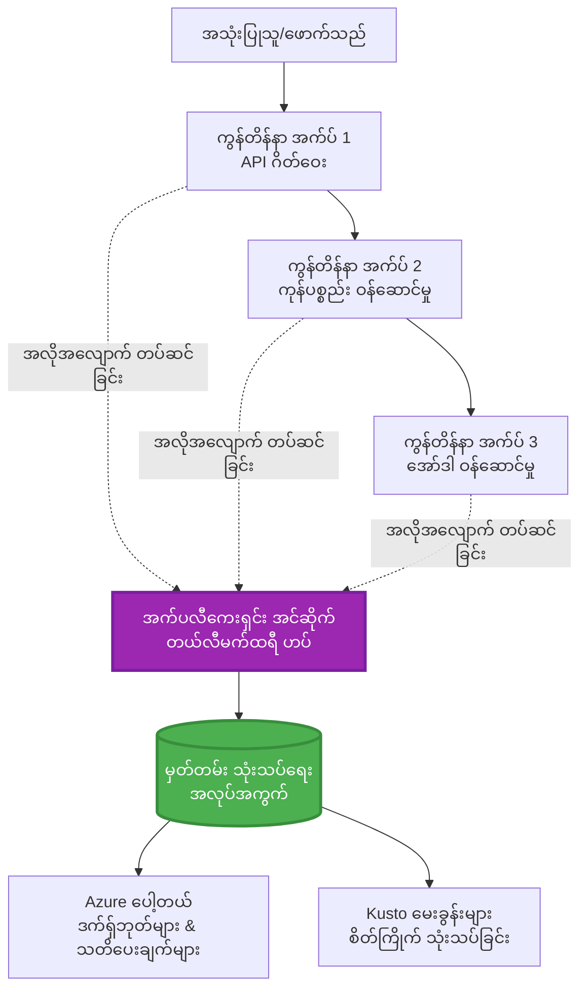
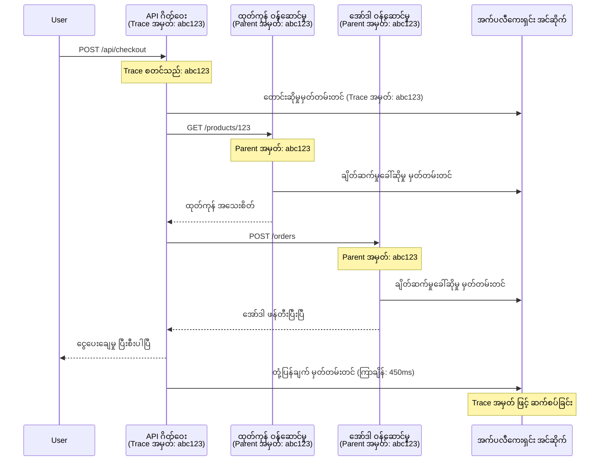

# Application Insights ကို AZD နှင့် ပေါင်းစည်းခြင်း

⏱️ **Estimated Time**: 40-50 minutes | 💰 **Cost Impact**: ~$5-15/month | ⭐ **Complexity**: အလယ်အလတ်

**📚 သင်ယူရေးလမ်းကြောင်း:**
- ← Previous: [ကြိုစစ်ဆေးမှုများ](preflight-checks.md) - Deploy မပြုမီ စစ်ဆေးခြင်း
- 🎯 **You Are Here**: Application Insights ပေါင်းစည်းမှု (စောင့်ကြည့်ခြင်း၊ telemetry၊ အမှားရှာဖွေခြင်း)
- → Next: [တင်သွင်း လမ်းညွှန်](../chapter-04-infrastructure/deployment-guide.md) - Azure သို့ တင်သွင်းခြင်း
- 🏠 [သင်တန်း မူလစာမျက်နှာ](../../README.md)

---

## သင် သင်ယူရမည့် အချက်များ

ဒီသင်ခန်းစာကို ပြီးမြောက်ပါက သင်:
- Application Insights ကို AZD ပရောဂျက်များထဲသို့ အလိုအလျောက် ပေါင်းထည့်နိူင်မည်
- မိုက်ခရိုဆာဗစ်များအတွက် distributed tracing ကို ဖန်တီး ပြင်ဆင်နိုင်မည်
- custom telemetry (metrics, events, dependencies) ကို အကောင်အထည်ဖော်နိုင်မည်
- real-time စောင့်ကြည့်မှုအတွက် live metrics ကို သတ်မှတ်နိုင်မည်
- AZD deployments ကနေ alerts နှင့် dashboards များ ဖန်တီးနိုင်မည်
- telemetry queries ဖြင့် production ပြဿနာများကို debug ပြုလုပ်နိုင်မည်
- ကုန်ကျစရိတ်နှင့် sampling မူဝါဒများကို အိုးပေါ်အဆင်ပြေစွာ optimize ပြုလုပ်နိုင်မည်
- AI/LLM applications များကို (tokens, latency, ကုန်ကျစရိတ်) မော်နီတာနိုင်မည်

## Application Insights ကို AZD နှင့် တွဲ၍ ဘာကြောင့် အရေးကြီးသလဲ

### စိန်ခေါ်မှု: ထုတ်လုပ်ရေးတွင် ကြည့်ရှုနိုင်မှု

**Application Insights မရှိပါက:**
```
❌ No visibility into production behavior
❌ Manual log aggregation across services
❌ Reactive debugging (wait for customer complaints)
❌ No performance metrics
❌ Cannot trace requests across services
❌ Unknown failure rates and bottlenecks
```

**Application Insights + AZD နှင့် အတူ:**
```
✅ Automatic telemetry collection
✅ Centralized logs from all services
✅ Proactive issue detection
✅ End-to-end request tracing
✅ Performance metrics and insights
✅ Real-time dashboards
✅ AZD provisions everything automatically
```

**သွယ်ထားချက်**: Application Insights သည် သင်၏ အက်ပလီကေးရှင်းအတွက် "black box" flight recorder နှင့် ကုတ်ပစ် dashboard တစ်ခုရှိသကဲ့သို့ ဖြစ်သည်။ သင်သည် ဖြစ်ပျက်နေသော အရာအားလုံးကို အချိန်နှင့်တပြေးညီ ကြည့်ရှုနိုင်ပြီး မည်သည့် ဖြစ်ရပ်မျှကိုမဆို ပြန်လည်ကစား ကြည့်နိုင်သည်။

---

## ဆောက်လုပ်ပုံ အကျဉ်းချုံး

### AZD ဆောက်လုပ်ပုံ၌ Application Insights


### အလိုအလျောက် စောင့်ကြည့်ပေးသော အရာများ

| Telemetry Type | အရာအား ဖမ်းယူသည် | အသုံးပြုမှု |
|----------------|------------------|----------|
| **Requests** | HTTP requests, status codes, duration | API လုပ်ဆောင်မှု စောင့်ကြည့်ရေး |
| **Dependencies** | External calls (DB, APIs, storage) | အတားအဆီးများ ဖော်ထုတ်ရန် |
| **Exceptions** | Unhandled errors with stack traces | အမှားများ အတွက် debugging |
| **Custom Events** | Business events (signup, purchase) | ဝယ်ယူမှုများနှင့် funnel အတွက် မှတ်တမ်းစုစည်းရေး |
| **Metrics** | Performance counters, custom metrics | ချွေတာ စီမံခန့်ခွဲမှု |
| **Traces** | Log messages with severity | Debugging နှင့် auditing |
| **Availability** | Uptime and response time tests | SLA စောင့်ကြည့်မှု |

---

## လိုအပ်ချက်များ

### လိုအပ်သော ကိရိယာများ

```bash
# Azure Developer CLI ကို စစ်ဆေးပါ
azd version
# ✅ မျှော်မှန်းချက်: azd ဗားရှင်း 1.0.0 သို့မဟုတ် အထက်

# Azure CLI ကို စစ်ဆေးပါ
az --version
# ✅ မျှော်မှန်းချက်: azure-cli 2.50.0 သို့မဟုတ် အထက်
```

### Azure လိုအပ်ချက်များ

- အသက်ရှိသော Azure subscription
- ဖန်တီးခွင့်များ:
  - Application Insights resources
  - Log Analytics workspaces
  - Container Apps
  - Resource groups

### ဗဟုသုတ လိုအပ်ချက်များ

အောက်ပါအရာများကို ပြီးမြောက်ထားသင့်သည်:
- [AZD အခြေခံ](../chapter-01-foundation/azd-basics.md) - AZD အဓိက အယူအဆများ
- [Configuration](../chapter-03-configuration/configuration.md) - ပတ်ဝန်းကျင် သတ်မှတ်ခြင်း
- [ပထမဆုံး ပရောဂျက်](../chapter-01-foundation/first-project.md) - အခြေခံ တင်သွင်းခြင်း

---

## Lesson 1: AZD နှင့် အလိုအလျောက် Application Insights

### AZD သည် Application Insights ကို မည်သို့ စီမံထည့်သွင်းသနည်း

AZD သည် deployment ပြုလုပ်သည့်အခါ Application Insights ကို အလိုအလျောက် ဖန်တီး၍ ပြင်ဆင်ပေးသည်။ မည်သို့ အလုပ်လုပ်ကြောင်း ကြည့်လိုက်ရအောင်။

### ပရောဂျက် ဖွဲ့စည်းပုံ

```
monitored-app/
├── azure.yaml                     # AZD configuration
├── infra/
│   ├── main.bicep                # Main infrastructure
│   ├── core/
│   │   └── monitoring.bicep      # Application Insights + Log Analytics
│   └── app/
│       └── api.bicep             # Container App with monitoring
└── src/
    ├── app.py                    # Application with telemetry
    ├── requirements.txt
    └── Dockerfile
```

---

### အဆင့် 1: AZD ကို ပြင်ဆင်ပါ (azure.yaml)

**ဖိုင်: `azure.yaml`**

```yaml
name: monitored-app
metadata:
  template: monitored-app@1.0.0

services:
  api:
    project: ./src
    language: python
    host: containerapp

# AZD automatically provisions monitoring!
```

**ဒါပဲ!** AZD သည် ပုံမှန်အနေဖြင့် Application Insights ကို ဖန်တီးပေးမည်။ အခြေခံ စောင့်ကြည့်မှုအတွက် ထပ်မံ ပြင်ဆင်ရန် မလိုအပ်ပါ။

---

### အဆင့် 2: Monitoring Infrastructure (Bicep)

**ဖိုင်: `infra/core/monitoring.bicep`**

```bicep
param logAnalyticsName string
param applicationInsightsName string
param location string = resourceGroup().location
param tags object = {}

// Log Analytics Workspace (required for Application Insights)
resource logAnalytics 'Microsoft.OperationalInsights/workspaces@2022-10-01' = {
  name: logAnalyticsName
  location: location
  tags: tags
  properties: {
    sku: {
      name: 'PerGB2018'  // Pay-as-you-go pricing
    }
    retentionInDays: 30  // Keep logs for 30 days
    features: {
      enableLogAccessUsingOnlyResourcePermissions: true
    }
  }
}

// Application Insights
resource applicationInsights 'Microsoft.Insights/components@2020-02-02' = {
  name: applicationInsightsName
  location: location
  tags: tags
  kind: 'web'
  properties: {
    Application_Type: 'web'
    WorkspaceResourceId: logAnalytics.id
    IngestionMode: 'LogAnalytics'
    publicNetworkAccessForIngestion: 'Enabled'
    publicNetworkAccessForQuery: 'Enabled'
  }
}

// Outputs for Container Apps
output logAnalyticsWorkspaceId string = logAnalytics.id
output logAnalyticsWorkspaceName string = logAnalytics.name
output applicationInsightsConnectionString string = applicationInsights.properties.ConnectionString
output applicationInsightsInstrumentationKey string = applicationInsights.properties.InstrumentationKey
output applicationInsightsName string = applicationInsights.name
```

---

### အဆင့် 3: Container App ကို Application Insights နှင့် ချိတ်ဆက်ခြင်း

**ဖိုင်: `infra/app/api.bicep`**

```bicep
param name string
param location string
param tags object = {}
param containerAppsEnvironmentName string
param applicationInsightsConnectionString string

resource containerApp 'Microsoft.App/containerApps@2023-05-01' = {
  name: name
  location: location
  tags: tags
  properties: {
    configuration: {
      ingress: {
        external: true
        targetPort: 8000
      }
      secrets: [
        {
          name: 'appinsights-connection-string'
          value: applicationInsightsConnectionString
        }
      ]
    }
    template: {
      containers: [
        {
          name: 'api'
          image: 'myregistry.azurecr.io/api:latest'
          resources: {
            cpu: json('0.5')
            memory: '1Gi'
          }
          env: [
            {
              name: 'APPLICATIONINSIGHTS_CONNECTION_STRING'
              secretRef: 'appinsights-connection-string'
            }
            {
              name: 'APPLICATIONINSIGHTS_ENABLED'
              value: 'true'
            }
          ]
        }
      ]
    }
  }
}

output uri string = 'https://${containerApp.properties.configuration.ingress.fqdn}'
```

---

### အဆင့် 4: Telemetry ပါရှိသည့် Application ကုဒ်

**ဖိုင်: `src/app.py`**

```python
from flask import Flask, request, jsonify
from opencensus.ext.azure.log_exporter import AzureLogHandler
from opencensus.ext.azure.trace_exporter import AzureExporter
from opencensus.ext.flask.flask_middleware import FlaskMiddleware
from opencensus.trace.samplers import ProbabilitySampler
import logging
import os

app = Flask(__name__)

# Application Insights အတွက် connection string ကို ရယူပါ
connection_string = os.environ.get('APPLICATIONINSIGHTS_CONNECTION_STRING')

if connection_string:
    # ဖြန့်ချိထားသော ထောက်လှမ်းမှုကို ဖွဲ့စည်းပါ
    middleware = FlaskMiddleware(
        app,
        exporter=AzureExporter(connection_string=connection_string),
        sampler=ProbabilitySampler(rate=1.0)  # ဖွံ့ဖြိုးရေးအတွက် 100% နမူနာယူမှု
    )
    
    # မှတ်တမ်းတင်မှုကို ဖွဲ့စည်းပါ
    logger = logging.getLogger(__name__)
    logger.addHandler(AzureLogHandler(connection_string=connection_string))
    logger.setLevel(logging.INFO)
    
    print("✅ Application Insights enabled")
else:
    logger = logging.getLogger(__name__)
    logger.setLevel(logging.INFO)
    print("⚠️ Application Insights not configured")

@app.route('/health')
def health():
    logger.info('Health check endpoint called')
    return jsonify({'status': 'healthy', 'monitoring': 'enabled'})

@app.route('/api/products')
def get_products():
    logger.info('Fetching products')
    
    # ဒေတာဘေ့စ် ခေါ်ဆိုမှုကို အတုပြုလုပ်ပါ (အလိုအလျော့ မှီခိုမှုအဖြစ် လိုက်လံမှတ်တမ်းတင်သည်)
    products = [
        {'id': 1, 'name': 'Laptop', 'price': 999.99},
        {'id': 2, 'name': 'Mouse', 'price': 29.99},
        {'id': 3, 'name': 'Keyboard', 'price': 79.99}
    ]
    
    logger.info(f'Returned {len(products)} products')
    return jsonify(products)

@app.route('/api/error-test')
def error_test():
    """Test error tracking"""
    logger.error('Testing error tracking')
    try:
        raise ValueError('This is a test exception')
    except Exception as e:
        logger.exception('Exception occurred in error-test endpoint')
        return jsonify({'error': str(e)}), 500

@app.route('/api/slow')
def slow_endpoint():
    """Test performance tracking"""
    import time
    logger.info('Slow endpoint called')
    time.sleep(3)  # နှေးသော လုပ်ဆောင်မှုကို အတုဖန်တီးပါ
    logger.warning('Endpoint took 3 seconds to respond')
    return jsonify({'message': 'Slow operation completed'})

if __name__ == '__main__':
    app.run(host='0.0.0.0', port=8000)
```

**ဖိုင်: `src/requirements.txt`**

```txt
Flask==3.0.0
opencensus-ext-azure==1.1.13
opencensus-ext-flask==0.8.1
gunicorn==21.2.0
```

---

### အဆင့် 5: Deploy နှင့် စိစစ်ခြင်း

```bash
# AZD ကို စတင်ပြင်ဆင်ခြင်း
azd init

# တပ်ဆင်ခြင်း (Application Insights ကို အလိုအလျောက် ပံ့ပိုးပေးသည်)
azd up

# အက်ပ်၏ URL ကို ရယူခြင်း
APP_URL=$(azd env get-values | grep API_URL | cut -d '=' -f2 | tr -d '"')

# တယ်လီမက်ထရီကို ဖန်တီးခြင်း
curl $APP_URL/health
curl $APP_URL/api/products
curl $APP_URL/api/error-test
curl $APP_URL/api/slow
```

**✅ မျှော်မှန်း ထွက်ရလဒ်:**
```json
{
  "status": "healthy",
  "monitoring": "enabled"
}
```

---

### အဆင့် 6: Azure Portal တွင် Telemetry ကြည့်ရှုခြင်း

```bash
# Application Insights အသေးစိတ် အချက်အလက်များ ရယူပါ
azd env get-values | grep APPLICATIONINSIGHTS

# Azure Portal တွင် ဖွင့်ပါ
az monitor app-insights component show \
  --app $(azd env get-values | grep APPLICATIONINSIGHTS_NAME | cut -d '=' -f2 | tr -d '"') \
  --resource-group $(azd env get-values | grep AZURE_RESOURCE_GROUP | cut -d '=' -f2 | tr -d '"') \
  --query "appId" -o tsv
```

**Azure Portal → Application Insights → Transaction Search သို့ သွားပါ**

သင်သည် ရှိရမည့်အရာများမှာ:
- ✅ HTTP တောင်းဆိုမှုများနှင့် status code များ
- ✅ တောင်းဆိုချိန်ကြာချိန် ( `/api/slow` အတွက် 3+ စက္ကန့်)
- ✅ `/api/error-test` မှ Exception အသေးစိတ်များ
- ✅ စိတ်ကြိုက် log သတင်းစကားများ

---

## Lesson 2: စိတ်ကြိုက် Telemetry နှင့် Events

### စီးပွားရေးဆိုင်ရာ အဖြစ်အပျက်များ ထောက်လှမ်းခြင်း

စီးပွားရေး အရေးပါသော ဖြစ်ရပ်များအတွက် စိတ်ကြိုက် telemetry ထည့်ပါ။

**ဖိုင်: `src/telemetry.py`**

```python
from opencensus.ext.azure import metrics_exporter
from opencensus.stats import aggregation as aggregation_module
from opencensus.stats import measure as measure_module
from opencensus.stats import stats as stats_module
from opencensus.stats import view as view_module
from opencensus.tags import tag_map as tag_map_module
from opencensus.ext.azure.log_exporter import AzureLogHandler
from opencensus.ext.azure.trace_exporter import AzureExporter
from opencensus.trace import tracer as tracer_module
import logging
import os

class TelemetryClient:
    """Custom telemetry client for Application Insights"""
    
    def __init__(self, connection_string=None):
        self.connection_string = connection_string or os.environ.get('APPLICATIONINSIGHTS_CONNECTION_STRING')
        
        if not self.connection_string:
            print("⚠️ Application Insights connection string not found")
            return
        
        # logger ကို စတင်တပ်ဆင်ခြင်း
        self.logger = logging.getLogger(__name__)
        self.logger.addHandler(AzureLogHandler(connection_string=self.connection_string))
        self.logger.setLevel(logging.INFO)
        
        # metrics exporter ကို စတင်တပ်ဆင်ခြင်း
        self.stats = stats_module.stats
        self.view_manager = self.stats.view_manager
        self.stats_recorder = self.stats.stats_recorder
        
        exporter = metrics_exporter.new_metrics_exporter(
            connection_string=self.connection_string
        )
        self.view_manager.register_exporter(exporter)
        
        # tracer ကို စတင်တပ်ဆင်ခြင်း
        self.tracer = tracer_module.Tracer(
            exporter=AzureExporter(connection_string=self.connection_string)
        )
        
        print("✅ Custom telemetry client initialized")
    
    def track_event(self, event_name: str, properties: dict = None):
        """Track custom business event"""
        properties = properties or {}
        self.logger.info(
            f"CustomEvent: {event_name}",
            extra={
                'custom_dimensions': {
                    'event_name': event_name,
                    **properties
                }
            }
        )
    
    def track_metric(self, metric_name: str, value: float, properties: dict = None):
        """Track custom metric"""
        properties = properties or {}
        self.logger.info(
            f"CustomMetric: {metric_name} = {value}",
            extra={
                'custom_dimensions': {
                    'metric_name': metric_name,
                    'value': value,
                    **properties
                }
            }
        )
    
    def track_dependency(self, name: str, dependency_type: str, duration: float, success: bool):
        """Track external dependency call"""
        with self.tracer.span(name=name) as span:
            span.add_attribute('dependency.type', dependency_type)
            span.add_attribute('duration', duration)
            span.add_attribute('success', success)

# ကမ္ဘာလုံးဆိုင်ရာ တယ်လီမက်ထရီ ဖောက်သည်
telemetry = TelemetryClient()
```

### စိတ်ကြိုက် အဖြစ်အပျက်များဖြင့် အက်ပလီကေးရှင်းကို အပ်ဒိတ်လုပ်ခြင်း

**ဖိုင်: `src/app.py` (တိုးမြှင့်ထားသော)**

```python
from flask import Flask, request, jsonify
from telemetry import telemetry
import time
import random

app = Flask(__name__)

@app.route('/api/purchase', methods=['POST'])
def purchase():
    """Track purchase event with custom telemetry"""
    data = request.json
    product_id = data.get('product_id')
    quantity = data.get('quantity', 1)
    price = data.get('price', 0)
    
    # လုပ်ငန်းဖြစ်ရပ်ကို မှတ်တမ်းတင်ပါ
    telemetry.track_event('Purchase', {
        'product_id': product_id,
        'quantity': quantity,
        'total_amount': price * quantity,
        'user_id': request.headers.get('X-User-Id', 'anonymous')
    })
    
    # ဝင်ငွေအတိုင်းအတာကို စောင့်ကြည့်ပါ
    telemetry.track_metric('Revenue', price * quantity, {
        'product_id': product_id,
        'currency': 'USD'
    })
    
    return jsonify({
        'order_id': f'ORD-{random.randint(1000, 9999)}',
        'status': 'confirmed',
        'total': price * quantity
    })

@app.route('/api/search')
def search():
    """Track search queries"""
    query = request.args.get('q', '')
    
    start_time = time.time()
    
    # ရှာဖွေမှုကို အတုသရုပ်ပြပါ (အမှန်တကယ် ဒေတာဘေ့စ် မေးခွန်းဖြစ်မည်)
    results = [{'id': 1, 'name': f'Result for {query}'}]
    
    duration = (time.time() - start_time) * 1000  # ms သို့ ပြောင်းပါ
    
    # ရှာဖွေမှု ဖြစ်ရပ်ကို မှတ်တမ်းတင်ပါ
    telemetry.track_event('Search', {
        'query': query,
        'results_count': len(results),
        'duration_ms': duration
    })
    
    # ရှာဖွေရေး စွမ်းဆောင်ရည်အတိုင်းအတာကို စောင့်ကြည့်ပါ
    telemetry.track_metric('SearchDuration', duration, {
        'query_length': len(query)
    })
    
    return jsonify({'results': results, 'count': len(results)})

@app.route('/api/external-call')
def external_call():
    """Track external API dependency"""
    import requests
    
    start_time = time.time()
    success = True
    
    try:
        # ပြင်ပ API ခေါ်ဆိုမှုကို အတုသရုပ်ပြပါ
        response = requests.get('https://api.example.com/data', timeout=5)
        result = response.json()
    except Exception as e:
        success = False
        result = {'error': str(e)}
    
    duration = (time.time() - start_time) * 1000
    
    # အချိတ်အဆက်ကို မှတ်တမ်းတင်ပါ
    telemetry.track_dependency(
        name='ExternalAPI',
        dependency_type='HTTP',
        duration=duration,
        success=success
    )
    
    return jsonify(result)

if __name__ == '__main__':
    app.run(host='0.0.0.0', port=8000)
```

### စိတ်ကြိုက် Telemetry စမ်းသပ်ခြင်း

```bash
# ဝယ်ယူမှု အဖြစ်အပျက်ကို လိုက်လံ မှတ်တမ်းတင်သည်
curl -X POST $APP_URL/api/purchase \
  -H "Content-Type: application/json" \
  -H "X-User-Id: user123" \
  -d '{"product_id": 1, "quantity": 2, "price": 29.99}'

# ရှာဖွေမှု အဖြစ်အပျက်ကို လိုက်လံ မှတ်တမ်းတင်သည်
curl "$APP_URL/api/search?q=laptop"

# ပြင်ပ မူတည်မှုကို လိုက်လံ မှတ်တမ်းတင်သည်
curl $APP_URL/api/external-call
```

**Azure Portal တွင် ကြည့်ရှုရန်:**

Azure Portal → Application Insights → Logs သို့ သွားပြီး အောက်ပါကို 실행 ပါ:

```kusto
// View purchase events
traces
| where customDimensions.event_name == "Purchase"
| project 
    timestamp,
    product_id = tostring(customDimensions.product_id),
    total_amount = todouble(customDimensions.total_amount),
    user_id = tostring(customDimensions.user_id)
| order by timestamp desc

// View revenue metrics
traces
| where customDimensions.metric_name == "Revenue"
| summarize TotalRevenue = sum(todouble(customDimensions.value)) by bin(timestamp, 1h)
| render timechart

// View search performance
traces
| where customDimensions.event_name == "Search"
| summarize 
    AvgDuration = avg(todouble(customDimensions.duration_ms)),
    SearchCount = count()
  by bin(timestamp, 5m)
| render timechart
```

---

## Lesson 3: မိုက်ခရိုဆာဗစ်များအတွက် Distributed Tracing

### ဝန်ဆောင်မှုများ အကြား tracing ကို ဖွင့်ပါ

မိုက်ခရိုဆာဗစ်များအတွက် Application Insights သည် ဝန်ဆောင်မှုများအကြား တောင်းဆိုမှုများကို အလိုအလျောက် ဆက်စည်းပေးသည်။

**ဖိုင်: `infra/main.bicep`**

```bicep
targetScope = 'subscription'

param environmentName string
param location string = 'eastus'

var tags = { 'azd-env-name': environmentName }

resource rg 'Microsoft.Resources/resourceGroups@2021-04-01' = {
  name: 'rg-${environmentName}'
  location: location
  tags: tags
}

// Monitoring (shared by all services)
module monitoring './core/monitoring.bicep' = {
  name: 'monitoring'
  scope: rg
  params: {
    logAnalyticsName: 'log-${environmentName}'
    applicationInsightsName: 'appi-${environmentName}'
    location: location
    tags: tags
  }
}

// API Gateway
module apiGateway './app/api-gateway.bicep' = {
  name: 'api-gateway'
  scope: rg
  params: {
    name: 'ca-gateway-${environmentName}'
    location: location
    tags: union(tags, { 'azd-service-name': 'gateway' })
    applicationInsightsConnectionString: monitoring.outputs.applicationInsightsConnectionString
  }
}

// Product Service
module productService './app/product-service.bicep' = {
  name: 'product-service'
  scope: rg
  params: {
    name: 'ca-products-${environmentName}'
    location: location
    tags: union(tags, { 'azd-service-name': 'products' })
    applicationInsightsConnectionString: monitoring.outputs.applicationInsightsConnectionString
  }
}

// Order Service
module orderService './app/order-service.bicep' = {
  name: 'order-service'
  scope: rg
  params: {
    name: 'ca-orders-${environmentName}'
    location: location
    tags: union(tags, { 'azd-service-name': 'orders' })
    applicationInsightsConnectionString: monitoring.outputs.applicationInsightsConnectionString
  }
}

output APPLICATIONINSIGHTS_CONNECTION_STRING string = monitoring.outputs.applicationInsightsConnectionString
output GATEWAY_URL string = apiGateway.outputs.uri
```

### အဆုံးအတိုင်း Transaction ကို ကြည့်ရှုပါ


**အဆုံးအထိ trace ကို query မည်:**

```kusto
// Find complete request flow
let traceId = "abc123...";  // Get from response header
dependencies
| union requests
| where operation_Id == traceId
| project 
    timestamp,
    type = itemType,
    name,
    duration,
    success,
    cloud_RoleName
| order by timestamp asc
```

---

## Lesson 4: Live Metrics နှင့် Real-Time စောင့်ကြည့်မှု

### Live Metrics Stream ကို ဖွင့်ပါ

Live Metrics သည် <1 second latency ဖြင့် အချိန်နှင့်တပြေးညီ telemetry ပေးသည်။

**Live Metrics ကို ဝင်ရောက်ကြည့်ရှုရန်:**

```bash
# Application Insights အရင်းအမြစ် ရယူရန်
APPI_NAME=$(azd env get-values | grep APPLICATIONINSIGHTS_NAME | cut -d '=' -f2 | tr -d '"')

# အရင်းအမြစ် အုပ်စုကို ရယူရန်
RG_NAME=$(azd env get-values | grep AZURE_RESOURCE_GROUP | cut -d '=' -f2 | tr -d '"')

echo "Navigate to: Azure Portal → Resource Groups → $RG_NAME → $APPI_NAME → Live Metrics"
```

**အချိန်နှင့်တပြေးညီ တွင် သင်မြင်ရမည့်အရာများ:**
- ✅ ရောက်ရှိနေသော တောင်းဆိုမှုနှုန်း (requests/sec)
- ✅ ထွက်သွားသော dependency ခေါ်ဆိုမှုများ
- ✅ Exception ရေတွက်ချက်
- ✅ CPU နှင့် memory အသုံးပြုမှု
- ✅ လက်ရှိ လည်ပတ်နေသော server အရေအတွက်
- ✅ နမူနာ telemetry

### စမ်းသပ်ရန် Load ဖန်တီးခြင်း

```bash
# သက်ရှိ မက်ထရစ်များကို ကြည့်ရန် အလုပ်ပမာဏကို ဖန်တီးပါ
for i in {1..100}; do
  curl $APP_URL/api/products &
  curl $APP_URL/api/search?q=test$i &
done

# Azure Portal တွင် သက်ရှိ မက်ထရစ်များကို ကြည့်ပါ
# တောင်းဆိုမှုနှုန်း တက်မြင့်မှုကို မြင်ရမည်
```

---

## လက်တွေ့ လေ့ကျင့်ခန်းများ

### Exercise 1: Set Up Alerts ⭐⭐ (Medium)

**ရည်မှန်းချက်**: အမှားနှုန်းမြင့်ခြင်းနှင့် တုံ့ပြန်ချိန်မြန်နှောင့်ယှက်မှုများအတွက် အသိပေးချက်များ ဖန်တီးရန်

**ဆောင်ရွက်ရန် အဆင့်များ:**

1. **အမှားနှုန်းအတွက် အသိပေးချက် ဖန်တီးပါ:**

```bash
# Application Insights အရင်းအမြစ် ID ကို ရယူပါ
APPI_ID=$(az monitor app-insights component show \
  --app $APPI_NAME \
  --resource-group $RG_NAME \
  --query "id" -o tsv)

# မအောင်မြင်သော တောင်းဆိုမှုများအတွက် မီထရစ် သတိပေးချက်တစ်ခု ဖန်တီးပါ
az monitor metrics alert create \
  --name "High-Error-Rate" \
  --resource-group $RG_NAME \
  --scopes $APPI_ID \
  --condition "count requests/failed > 10" \
  --window-size 5m \
  --evaluation-frequency 1m \
  --description "Alert when error rate exceeds 10 per 5 minutes"
```

2. **နှေးသော တုံ့ပြန်မှုများအတွက် အသိပေးချက် ဖန်တီးပါ:**

```bash
az monitor metrics alert create \
  --name "Slow-Responses" \
  --resource-group $RG_NAME \
  --scopes $APPI_ID \
  --condition "avg requests/duration > 3000" \
  --window-size 5m \
  --evaluation-frequency 1m \
  --description "Alert when average response time exceeds 3 seconds"
```

3. **Bicep ဖြင့် အသိပေးချက် ဖန်တီးပါ (AZD အတွက် ဦးစားပေး):**

**ဖိုင်: `infra/core/alerts.bicep`**

```bicep
param applicationInsightsId string
param actionGroupId string = ''
param location string = resourceGroup().location

// High error rate alert
resource errorRateAlert 'Microsoft.Insights/metricAlerts@2018-03-01' = {
  name: 'high-error-rate'
  location: 'global'
  properties: {
    description: 'Alert when error rate exceeds threshold'
    severity: 2
    enabled: true
    scopes: [
      applicationInsightsId
    ]
    evaluationFrequency: 'PT1M'
    windowSize: 'PT5M'
    criteria: {
      'odata.type': 'Microsoft.Azure.Monitor.SingleResourceMultipleMetricCriteria'
      allOf: [
        {
          name: 'Error rate'
          metricName: 'requests/failed'
          operator: 'GreaterThan'
          threshold: 10
          timeAggregation: 'Count'
        }
      ]
    }
    actions: actionGroupId != '' ? [
      {
        actionGroupId: actionGroupId
      }
    ] : []
  }
}

// Slow response alert
resource slowResponseAlert 'Microsoft.Insights/metricAlerts@2018-03-01' = {
  name: 'slow-responses'
  location: 'global'
  properties: {
    description: 'Alert when response time is too high'
    severity: 3
    enabled: true
    scopes: [
      applicationInsightsId
    ]
    evaluationFrequency: 'PT1M'
    windowSize: 'PT5M'
    criteria: {
      'odata.type': 'Microsoft.Azure.Monitor.SingleResourceMultipleMetricCriteria'
      allOf: [
        {
          name: 'Response duration'
          metricName: 'requests/duration'
          operator: 'GreaterThan'
          threshold: 3000
          timeAggregation: 'Average'
        }
      ]
    }
  }
}

output errorAlertId string = errorRateAlert.id
output slowResponseAlertId string = slowResponseAlert.id
```

4. **အသိပေးချက်များ စမ်းသပ်ပါ:**

```bash
# အမှားများ ဖန်တီးပါ
for i in {1..20}; do
  curl $APP_URL/api/error-test
done

# နှေးသော တုံ့ပြန်ချက်များ ဖန်တီးပါ
for i in {1..10}; do
  curl $APP_URL/api/slow
done

# အသိပေးအခြေအနေကို စစ်ဆေးပါ (5-10 မိနစ် စောင့်ပါ)
az monitor metrics alert list \
  --resource-group $RG_NAME \
  --query "[].{Name:name, Enabled:enabled, State:properties.enabled}" \
  --output table
```

**✅ အောင်မြင်မှု အခြေအနေများ:**
- ✅ Alerts များကို အောင်မြင်စွာ ဖန်တီးပြီးပါပြီ
- ✅ သတ်မှတ်ထားသော နိမ့်ကန့်လွန်ပါက Alerts များ ဖြစ်ပေါ်စေသည်
- ✅ Azure Portal တွင် alert မှတ်တမ်းများ ကြည့်ရှုနိုင်သည်
- ✅ AZD deployment နှင့် ပေါင်းစည်းထားသည်

**အချိန်**: 20-25 minutes

---

### Exercise 2: Create Custom Dashboard ⭐⭐ (Medium)

**ရည်မှန်းချက်**: အဓိက application မီထရစ်များကို ပြသသော dashboard တစ်ခု တည်ဆောက်ရန်

**ဆောင်ရွက်ရန် အဆင့်များ:**

1. **Azure Portal မှတဆင့် dashboard ဖန်တီးပါ:**

သွားရန်: Azure Portal → Dashboards → New Dashboard

2. **အဓိက မီထရစ်များအတွက် tile များ ထည့်ပါ:**

- Request count (နောက်ဆုံး 24 နာရီ)
- ပျမ်းမျှ တုံ့ပြန်ချိန်
- အမှားနှုန်း
- အမြန်ဆုံး မဟုတ်သော အလုပ်ဆောင်ချက်များ အထိ Top 5
- အသုံးပြုသူများ၏ ဧရိယာ ဖြန့်ချိမှု

3. **Bicep ဖြင့် dashboard ဖန်တီးပါ:**

**ဖိုင်: `infra/core/dashboard.bicep`**

```bicep
param dashboardName string
param applicationInsightsId string
param location string = resourceGroup().location

resource dashboard 'Microsoft.Portal/dashboards@2020-09-01-preview' = {
  name: dashboardName
  location: location
  properties: {
    lenses: [
      {
        order: 0
        parts: [
          // Request count
          {
            position: { x: 0, y: 0, rowSpan: 4, colSpan: 6 }
            metadata: {
              type: 'Extension/Microsoft_OperationsManagementSuite_Workspace/PartType/LogsDashboardPart'
              inputs: [
                {
                  name: 'resourceId'
                  value: applicationInsightsId
                }
                {
                  name: 'query'
                  value: '''
                    requests
                    | summarize RequestCount = count() by bin(timestamp, 1h)
                    | render timechart
                  '''
                }
              ]
            }
          }
          // Error rate
          {
            position: { x: 6, y: 0, rowSpan: 4, colSpan: 6 }
            metadata: {
              type: 'Extension/Microsoft_OperationsManagementSuite_Workspace/PartType/LogsDashboardPart'
              inputs: [
                {
                  name: 'resourceId'
                  value: applicationInsightsId
                }
                {
                  name: 'query'
                  value: '''
                    requests
                    | summarize 
                        Total = count(),
                        Failed = countif(success == false)
                    | extend ErrorRate = (Failed * 100.0) / Total
                    | project ErrorRate
                  '''
                }
              ]
            }
          }
        ]
      }
    ]
  }
}

output dashboardId string = dashboard.id
```

4. **dashboard ကို တင်သွင်းပါ:**

```bash
# main.bicep ဖိုင်ထဲသို့ ထည့်ပါ
module dashboard './core/dashboard.bicep' = {
  name: 'dashboard'
  scope: rg
  params: {
    dashboardName: 'dashboard-${environmentName}'
    applicationInsightsId: monitoring.outputs.applicationInsightsId
    location: location
  }
}

# ဖြန့်ချိပါ
azd up
```

**✅ အောင်မြင်မှု အခြေအနေများ:**
- ✅ Dashboard တွင် အဓိက မီထရစ်များ ပြသနေသည်
- ✅ Azure Portal မူလစာမျက်နှာသို့ pin လုပ်နိုင်သည်
- ✅ အချိန်နှင့်တပြေးညီ အပ်ဒိတ်ဖြစ်ပေါ်သည်
- ✅ AZD ဖြင့် တင်သွင်းနိုင်သည်

**အချိန်**: 25-30 minutes

---

### Exercise 3: Monitor AI/LLM Application ⭐⭐⭐ (Advanced)

**ရည်မှန်းချက်**: Azure OpenAI အသုံးပြုမှု (tokens, ကုန်ကျစရိတ်, latency) ကို လိုက်လံကြည့်ရှုရန်

**ဆောင်ရွက်ရန် အဆင့်များ:**

1. **AI monitoring wrapper တစ်ခု ဖန်တီးပါ:**

**ဖိုင်: `src/ai_telemetry.py`**

```python
from telemetry import telemetry
from openai import AzureOpenAI
import time

class MonitoredAzureOpenAI:
    """Azure OpenAI client with automatic telemetry"""
    
    def __init__(self, api_key, endpoint, api_version="2024-02-01"):
        self.client = AzureOpenAI(
            api_key=api_key,
            api_version=api_version,
            azure_endpoint=endpoint
        )
    
    def chat_completion(self, model: str, messages: list, **kwargs):
        """Track chat completion with telemetry"""
        start_time = time.time()
        
        try:
            # Azure OpenAI ကို ခေါ်ရန်
            response = self.client.chat.completions.create(
                model=model,
                messages=messages,
                **kwargs
            )
            
            duration = (time.time() - start_time) * 1000  # မီလီစက္ကန့်
            
            # အသုံးပြုမှုကို ထုတ်ယူရန်
            usage = response.usage
            prompt_tokens = usage.prompt_tokens
            completion_tokens = usage.completion_tokens
            total_tokens = usage.total_tokens
            
            # ကုန်ကျစရိတ်တွက်ချက်ရန် (GPT-4 စျေးနှုန်း)
            prompt_cost = (prompt_tokens / 1000) * 0.03  # 1K token အတွက် $0.03
            completion_cost = (completion_tokens / 1000) * 0.06  # 1K token အတွက် $0.06
            total_cost = prompt_cost + completion_cost
            
            # စိတ်ကြိုက်ဖြစ်ရပ်ကို စောင့်ကြည့်ရန်
            telemetry.track_event('OpenAI_Request', {
                'model': model,
                'prompt_tokens': prompt_tokens,
                'completion_tokens': completion_tokens,
                'total_tokens': total_tokens,
                'duration_ms': duration,
                'cost_usd': total_cost,
                'success': True
            })
            
            # မက်ထရစ်များကို စောင့်ကြည့်ရန်
            telemetry.track_metric('OpenAI_Tokens', total_tokens, {
                'model': model,
                'type': 'total'
            })
            
            telemetry.track_metric('OpenAI_Cost', total_cost, {
                'model': model,
                'currency': 'USD'
            })
            
            telemetry.track_metric('OpenAI_Duration', duration, {
                'model': model
            })
            
            return response
            
        except Exception as e:
            duration = (time.time() - start_time) * 1000
            
            telemetry.track_event('OpenAI_Request', {
                'model': model,
                'duration_ms': duration,
                'success': False,
                'error': str(e)
            })
            
            raise
```

2. **monitored client ကို အသုံးပြုပါ:**

```python
from flask import Flask, request, jsonify
from ai_telemetry import MonitoredAzureOpenAI
import os

app = Flask(__name__)

# ကြပ်မတ်ထားသော OpenAI client ကို စတင်ဖန်တီးပါ
openai_client = MonitoredAzureOpenAI(
    api_key=os.environ['AZURE_OPENAI_API_KEY'],
    endpoint=os.environ['AZURE_OPENAI_ENDPOINT']
)

@app.route('/api/chat', methods=['POST'])
def chat():
    data = request.json
    user_message = data.get('message')
    
    # အလိုအလျောက် စောင့်ကြည့်မှုဖြင့် ခေါ်ပါ
    response = openai_client.chat_completion(
        model='gpt-4',
        messages=[
            {'role': 'user', 'content': user_message}
        ]
    )
    
    return jsonify({
        'response': response.choices[0].message.content,
        'tokens': response.usage.total_tokens
    })
```

3. **AI မီထရစ်များကို query ပြုလုပ်ပါ:**

```kusto
// Total AI spend over time
traces
| where customDimensions.event_name == "OpenAI_Request"
| where customDimensions.success == "True"
| summarize TotalCost = sum(todouble(customDimensions.cost_usd)) by bin(timestamp, 1h)
| render timechart

// Token usage by model
traces
| where customDimensions.event_name == "OpenAI_Request"
| summarize 
    TotalTokens = sum(toint(customDimensions.total_tokens)),
    RequestCount = count()
  by Model = tostring(customDimensions.model)

// Average latency
traces
| where customDimensions.event_name == "OpenAI_Request"
| summarize AvgDuration = avg(todouble(customDimensions.duration_ms))
| project AvgDurationSeconds = AvgDuration / 1000

// Cost per request
traces
| where customDimensions.event_name == "OpenAI_Request"
| extend Cost = todouble(customDimensions.cost_usd)
| summarize 
    TotalCost = sum(Cost),
    RequestCount = count(),
    AvgCostPerRequest = avg(Cost)
```

**✅ အောင်မြင်မှု အခြေအနေများ:**
- ✅ OpenAI ခေါ်ဆိုမှုတိုင်းကို အလိုအလျောက် လိုက်လံမှတ်တမ်းတင်သည်
- ✅ token အသုံးပြုမှုနှင့် ကုန်ကျစရိတ် မြင်သာစေသည်
- ✅ latency ကို စောင့်ကြည့်ထားသည်
- ✅ ဘတ်ဂျက် အသိပေးချက်များ သတ်မှတ်နိုင်သည်

**အချိန်**: 35-45 minutes

---

## ကုန်ကျစရိတ် ထိရောက်စေရေး

### Sampling မူဝါဒများ

telemetry ကို sampling ပြုလုပ်ခြင်းဖြင့် ကုန်ကျစရိတ် ထိန်းချုပ်ပါ:

```python
from opencensus.trace.samplers import ProbabilitySampler

# ဖွံ့ဖြိုးရေး: ၁၀၀% နမူနာယူခြင်း
sampler = ProbabilitySampler(rate=1.0)

# ထုတ်လုပ်မှု: ၁၀% နမူနာယူခြင်း (ကုန်ကျစရိတ်ကို ၉၀% လျှော့ချ)
sampler = ProbabilitySampler(rate=0.1)

# ကိုက်ညှိသည့် နမူနာယူခြင်း (အလိုအလျောက် ပြင်ဆင်သည်)
from opencensus.trace.samplers import AdaptiveSampler
sampler = AdaptiveSampler()
```

**Bicep တွင်:**

```bicep
resource applicationInsights 'Microsoft.Insights/components@2020-02-02' = {
  name: applicationInsightsName
  properties: {
    SamplingPercentage: 10  // 10% sampling
  }
}
```

### ဒေတာ သိမ်းဆည်းမှု ကြာမြင့်ချိန်

```bicep
resource logAnalytics 'Microsoft.OperationalInsights/workspaces@2022-10-01' = {
  name: logAnalyticsName
  properties: {
    retentionInDays: 30  // Minimum (cheapest)
    // Options: 30, 31, 60, 90, 120, 180, 270, 365, 550, 730
  }
}
```

### လစဉ် ကုန်ကျစရိတ် ခန့်မှန်းချက်များ

| ဒေတာ အရွယ်အစား | သိမ်းဆည်းသည့် အချိန် | လစဉ် ကုန်ကျစရိတ် |
|-------------|-----------|--------------|
| 1 GB/month | 30 days | ~$2-5 |
| 5 GB/month | 30 days | ~$10-15 |
| 10 GB/month | 90 days | ~$25-40 |
| 50 GB/month | 90 days | ~$100-150 |

**အခမဲ့ အဆင့်**: 5 GB/month အပါအဝင်

---

## သိရှိမှု စစ်ဆေးချက်

### 1. အခြေခံ ပေါင်းစည်းမှု ✓

သင်၏ နားလည်မှုကို စမ်းသပ်ပါ:

- [ ] **Q1**: AZD သည် Application Insights ကို မည်သို့ provision လုပ်သနည်း?
  - **A**: Bicep template များဖြင့် အလိုအလျောက် (`infra/core/monitoring.bicep` တွင်)

- [ ] **Q2**: Application Insights ကို ဖွင့်စေသော environment variable ဘာလဲ?
  - **A**: `APPLICATIONINSIGHTS_CONNECTION_STRING`

- [ ] **Q3**: ထိပ်တန်း telemetry အမျိုးအစား သုံးမျိုး ဘာတွေပါသလဲ?
  - **A**: Requests (HTTP calls), Dependencies (external calls), Exceptions (errors)

**လက်တွေ့ စစ်ဆေးရန်:**
```bash
# Application Insights ဖွဲ့စည်းထားလား စစ်ဆေးပါ
azd env get-values | grep APPLICATIONINSIGHTS

# telemetry ဒေတာများ စီးဆင်းနေသည်ကို အတည်ပြုပါ
az monitor app-insights metrics show \
  --app $APPI_NAME \
  --resource-group $RG_NAME \
  --metric "requests/count"
```

---

### 2. စိတ်ကြိုက် Telemetry ✓

သင်၏ နားလည်မှုကို စမ်းသပ်ပါ:

- [ ] **Q1**: စီးပွားရေး ဆိုင်ရာ စိတ်ကြိုက် အဖြစ်အပျက်များကို မည်သို့ လိုက်လံမှတ်တမ်းတင်မလဲ?
  - **A**: `custom_dimensions` ပါသော logger ကို သုံးပါ သို့မဟုတ် `TelemetryClient.track_event()` ကို အသုံးပြုပါ

- [ ] **Q2**: events နှင့် metrics တို့၏ ကွာခြားချက် ဘာလဲ?
  - **A**: Events သည် အဖြစ်အပျက် တစ်ခုချင်းစီဖြစ်ပြီး Metrics သည် ဂဏန်းအတိုင်း အတိုင်းအတာများဖြစ်သည်

- [ ] **Q3**: ဝန်ဆောင်မှုများအကြား telemetry ကို မည်သို့ ဆက်စပ်ပြုလုပ်သနည်း?
  - **A**: Application Insights သည် အလိုအလျောက် `operation_Id` ကို correlation အတွက် အသုံးပြုသည်

**လက်တွေ့ စစ်ဆေးရန်:**
```kusto
// Verify custom events
traces
| where customDimensions.event_name != ""
| summarize count() by tostring(customDimensions.event_name)
```

---

### 3. ထုတ်လုပ်ရေး စောင့်ကြည့်မှု ✓

သင်၏ နားလည်မှုကို စမ်းသပ်ပါ:

- [ ] **Q1**: Sampling ဆိုသည်မှာ ဘာလဲ၊ အဘယ်ကြောင့် သုံးသနည်း?
  - **A**: Sampling သည် telemetry ၏ အချိုးအစား တစ်စိတ်တစ်ပိုင်းကိုသာ ဖမ်းယူခြင်းဖြင့် ဒေတာအရေအတွက် (နှင့် ကုန်ကျစရိတ်) ကို လျှော့ချသည်

- [ ] **Q2**: အသိပေးချက်များ ကို မည်သို့ သတ်မှတ်ရမည်နည်း?
  - **A**: Application Insights မီထရစ်များအပေါ် အခြေခံ၍ Bicep သို့မဟုတ် Azure Portal တွင် metric alerts များကို သတ်မှတ်ပါ

- [ ] **Q3**: Log Analytics နှင့် Application Insights တို့ မည်သို့ ကွာနိုင်သလဲ?
  - **A**: Application Insights သည် ဒေတာကို Log Analytics workspace ထဲသို့ သိမ်းဆည်းသည်; App Insights သည် အက်ပလီကေးရှင်းအထူးပြု ရှုမြင်မှုများ ပံ့ပိုးပေးသည်

**လက်တွေ့ စစ်ဆေးရန်:**
```bash
# နမူနာယူမှု ဖွဲ့စည်းပုံကို စစ်ဆေးပါ
az monitor app-insights component show \
  --app $APPI_NAME \
  --resource-group $RG_NAME \
  --query "properties.SamplingPercentage"
```

---

## အကောင်းဆုံး လေ့လာသင့်သည့် လမ်းညွှန်ချက်များ

### ✅ လုပ်သင့်သည်များ:

1. **Correlation ID များကို သုံးပါ**
   ```python
   logger.info('Processing order', extra={
       'custom_dimensions': {
           'order_id': order_id,
           'user_id': user_id
       }
   })
   ```

2. **အရေးကြီး မီထရစ်များ အတွက် အသိပေးချက် ပြုလုပ်ပါ**
   ```bicep
   // Error rate, slow responses, availability
   ```

3. **ဖွဲ့စည်းထိန်းသိမ်းထားသော logging ကို အသုံးပြုပါ**
   ```python
   # ✅ ကောင်း: ဖွဲ့စည်းထားသည်
   logger.info('User signup', extra={'custom_dimensions': {'user_id': 123}})
   
   # ❌ မကောင်း: မဖွဲ့စည်းထားသော
   logger.info(f'User 123 signed up')
   ```

4. **Dependencies များကို စောင့်ကြည့်ပါ**
   ```python
   # အလိုအလျောက် ဒေတာဘေ့စ် ခေါ်ဆိုမှုများ၊ HTTP တောင်းဆိုမှုများ စသည်များကို ထောက်လှမ်းသည်။
   ```

5. **Deployments အချိန်တွင် Live Metrics ကို အသုံးပြုပါ**

### ❌ မလုပ်သင့်:

1. **Sensitive data များကို log မထည့်ပါ**
   ```python
   # ❌ မကောင်း
   logger.info(f'Login: {username}:{password}')
   
   # ✅ ကောင်း
   logger.info('Login attempt', extra={'custom_dimensions': {'username': username}})
   ```

2. **Production တွင် 100% sampling မသုံးပါ**
   ```python
   # ❌ စျေးကြီး
   sampler = ProbabilitySampler(rate=1.0)
   
   # ✅ ကုန်ကျစရိတ်ထိရောက်သော
   sampler = ProbabilitySampler(rate=0.1)
   ```

3. **dead letter queues များကို မလွတ်ထားပါ**

4. **ဒေတာ သိမ်းဆည်းမှု ကန့်သတ်ချက်များ မမေ့ပါနဲ့**

---

## ပြဿနာဖြေရှင်းခြင်း

### ပြဿနာ: telemetry မပေါ်နေခြင်း

**ခန့်မှန်းချက်:**
```bash
# connection string သတ်မှတ်ထားပါသလား စစ်ဆေးပါ
azd env get-values | grep APPLICATIONINSIGHTS

# Azure Monitor မှတဆင့် အက်ပလီကေးရှင်း လော့ဂ်များကို စစ်ဆေးပါ
azd monitor --logs

# သို့မဟုတ် Container Apps အတွက် Azure CLI ကို အသုံးပြုပါ:
az containerapp logs show --name $APP_NAME --resource-group $RG_NAME --tail 50
```

**ဖြေရှင်းနည်း:**
```bash
# Container App တွင် ချိတ်ဆက်မှု စာကြောင်းကို စစ်ဆေးပါ
az containerapp show \
  --name $APP_NAME \
  --resource-group $RG_NAME \
  --query "properties.template.containers[0].env" \
  | grep -i applicationinsights
```

---

### ပြဿနာ: ကုန်ကျစရိတ် မြင့်နေခြင်း

**ခန့်မှန်းချက်:**
```bash
# ဒေတာ ထည့်သွင်းမှုကို စစ်ဆေးပါ
az monitor app-insights metrics show \
  --app $APPI_NAME \
  --resource-group $RG_NAME \
  --metric "availabilityResults/count"
```

**ဖြေရှင်းနည်း:**
- Sampling rate ကို လျော့ပါ
- Retention period ကို လျော့ပါ
- verbose logging ကို ဖယ်ရှားပါ

---

## အသေးစိတ် သိရှိလိုပါက

### တရားဝင် စာတမ်းများ
- [Application Insights အကျဉ်းချုံး](https://learn.microsoft.com/azure/azure-monitor/app/app-insights-overview)
- [Python အတွက် Application Insights](https://learn.microsoft.com/azure/azure-monitor/app/opencensus-python)
- [Kusto Query Language](https://learn.microsoft.com/azure/data-explorer/kusto/query/)
- [AZD စောင့်ကြည့်ခြင်း](https://learn.microsoft.com/azure/developer/azure-developer-cli/monitor-your-app)

### ဒီသင်ခန်းစာတွင် နောက်တစ်ဆင့်များ
- ← Previous: [ကြိုစစ်ဆေးမှုများ](preflight-checks.md)
- → Next: [တင်သွင်း လမ်းညွှန်](../chapter-04-infrastructure/deployment-guide.md)
- 🏠 [သင်တန်း မူလစာမျက်နှာ](../../README.md)

### ဆက်စပ် ဥပမာများ
- [Azure OpenAI ဥပမာ](../../../../examples/azure-openai-chat) - AI telemetry
- [Microservices ဥပမာ](../../../../examples/microservices) - Distributed tracing

---

## အကျဉ်းချုံး

**သင် သင်ယူပြီးဖြစ်သည်:**
- ✅ AZD ဖြင့် အလိုအလျောက် Application Insights provisioning
- ✅ စိတ်ကြိုက် telemetry (events, metrics, dependencies)
- ✅ မိုက်ခရိုဆာဗစ်များ အတွင်း distributed tracing
- ✅ တိုက်ရိုက် မက်ထရစ်များနှင့် အချိန်နှင့်တပြေးညီ စောင့်ကြည့်ခြင်း
- ✅ သတိပေးချက်များနှင့် ဒက်ရှ်ဘုတ်များ
- ✅ AI/LLM အပလီကေးရှင်းများ စောင့်ကြည့်ခြင်း
- ✅ ကုန်ကျစရိတ် လျှော့ချရေး မဟာဗျူဟာများ

**အဓိက ယူဆရမည့် အချက်များ:**
1. **AZD provisions monitoring automatically** - လက်ဖြင့် တပ်ဆင်ရန် မလို
2. **ဖွဲ့စည်းထားသော မှတ်တမ်းတင်ခြင်းကို အသုံးပြုပါ** - မေးမြန်းခြင်းများကို ပိုမိုလွယ်ကူစေသည်
3. **လုပ်ငန်းဖြစ်ရပ်များကို လိုက်လံမှတ်သားပါ** - နည်းပညာဆိုင်ရာ မက်ထရစ်များသာမက
4. **AI ကုန်ကျစရိတ်များကို စောင့်ကြည့်ပါ** - token များနှင့် သုံးစွဲမှုကို လိုက်နာပါ
5. **သတိပေးချက်များကို သတ်မှတ်ပါ** - တုံ့ပြန်မှုပြုခြင်း မဟုတ်ဘဲ ကြိုတင် လှုပ်ရှားပါ
6. **ကုန်ကျစရိတ်ကို အကောင်းဆုံး ပြုပြင်ပါ** - Sampling နှင့် retention ကန့်သတ်ချက်များကို အသုံးပြုပါ

**နောက်ဆက်တွဲ လုပ်ဆောင်ရန်များ:**
1. လက်တွေ့ လေ့ကျင့်ခန်းများကို ပြီးစီးပါ
2. သင့် AZD ပရောဂျက်များတွင် Application Insights ကို ထည့်ပါ
3. သင့်အဖွဲ့အတွက် စိတ်ကြိုက် ဒက်ရှ်ဘုတ်များ ဖန်တီးပါ
4. [တပ်ဆင်ခြင်း လမ်းညွှန်](../chapter-04-infrastructure/deployment-guide.md) ကို လေ့လာပါ

---

<!-- CO-OP TRANSLATOR DISCLAIMER START -->
အသိပေးချက်:
ဤစာတမ်းကို AI ဘာသာပြန်ဝန်ဆောင်မှုဖြစ်သည့် Co-op Translator (https://github.com/Azure/co-op-translator) ဖြင့် ဘာသာပြန်ထားပါသည်။ ကျွန်တော်တို့သည် တိကျမှုပေါ်တွင် ကြိုးစားပေမယ့် အလိုအလျောက်ဘာသာပြန်ချက်များတွင် အမှားများ သို့မဟုတ် မမှန်ကန်မှုများ ပါရှိနိုင်ကြောင်း ကျေးဇူးပြု၍ သတိပြုပါ။ မူရင်းစာတမ်းကို မူရင်းဘာသာဖြင့်သာ တရားဝင် အစွမ်းထက်သော အရင်းအမြစ်အဖြစ် ယူဆသင့်ပါသည်။ အရေးကြီးသော အချက်အလက်များအတွက် လူ့ကျွမ်းကျင်သူထံမှ ပရော်ဖက်ရှင်နယ် ဘာသာပြန်ချက်ကို အကြံပြုပါသည်။ ဤဘာသာပြန်ချက်ကို အသုံးပြုမှုအားဖြင့် ဖြစ်ပေါ်လာနိုင်သည့် နားမလည်မှုများ သို့မဟုတ် မမှန်ကန်ကျသော အဓိပ္ပာယ်ဖတ်ယူမှုများအတွက် ကျွန်တော်တို့ တာဝန်မရှိပါ။
<!-- CO-OP TRANSLATOR DISCLAIMER END -->