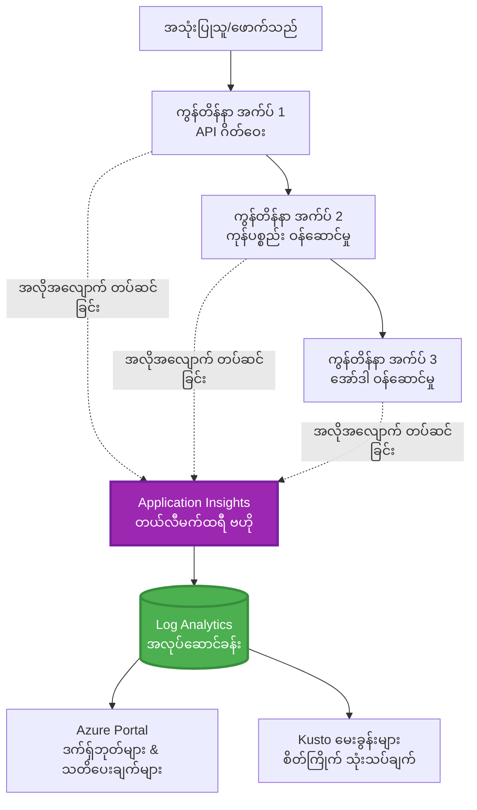
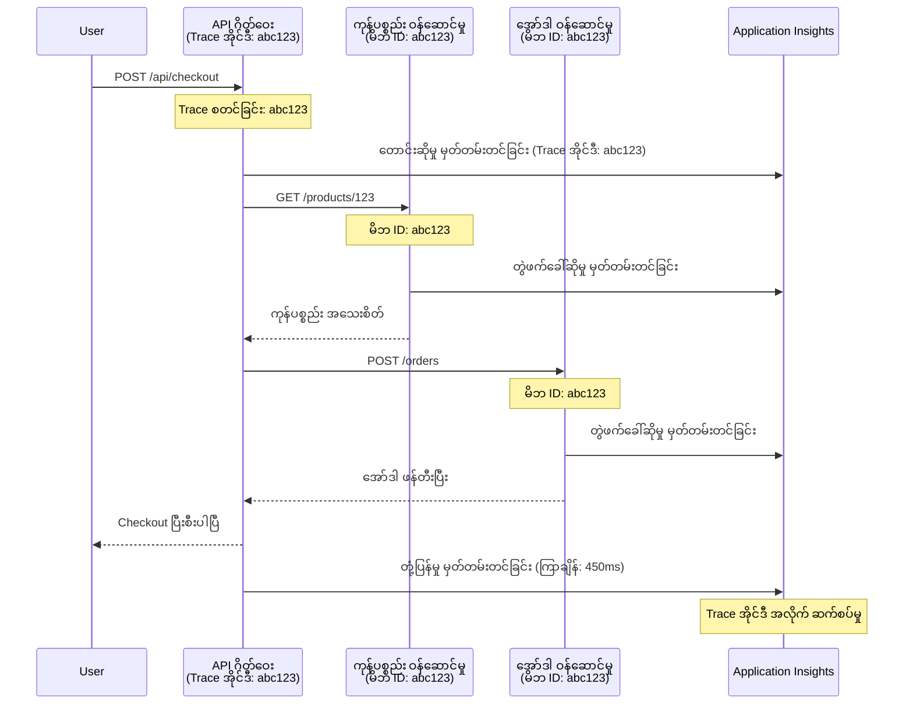

# Application Insights Integration with AZD

⏱️ **ခန့်မှန်းသတ်မှတ်ချိန်**: 40-50 မိနစ် | 💰 **ကုန်ကျစရိတ်သက်ရောက်မှု**: ~$5-15/လ | ⭐ **ရှုပ်ထွေးမှု**: အလယ်အလတ်

**📚 သင်ယူရန် လမ်းကြောင်း:**
- ← Previous: [Preflight Checks](preflight-checks.md) - ထုတ်ပေးခန့်မှန်းမှုမတိုင်မီ စစ်ဆေးခြင်း
- 🎯 **ယခုနေရာ**: Application Insights Integration (စောင့်ကြည့်မှု၊ telemetry၊ ပြဿနာရှာဖွေခြင်း)
- → Next: [Deployment Guide](../chapter-04-infrastructure/deployment-guide.md) - Azure သို့ တင်ပို့ခြင်း
- 🏠 [Course Home](../../README.md)

---

## သင်ဘာတွေ သင်ယူမယ်

ဒီသင်ခန်းစာပြီးမြောက်စေမယ့်အရာများမှာ -
- AZD ပရောဂျက်များထဲသို့ **Application Insights** ကို အလိုအလျောက် ထည့်သွင်းခြင်း
- မိုက်ကရိုဆာဗစ်များအတွက် **ဘက်ကျော် အောက်မှုစုံစမ်းခြင်း (distributed tracing)** ကို စီစဉ်ခြင်း
- **စိတ်ကြိုက် telemetry** (မက်ထရစ်များ၊ အဖြစ်အပျက်များ၊ အချိတ်အဆက်များ) ကို အကောင်အထည်ဖော်ခြင်း
- အချိန်နေရဲ့ စောင့်ကြည့်မှုအတွက် **live metrics** ကို စတင်ထားခြင်း
- AZD တင်ပို့မှုမှ **အချက်ပေးချက်များနှင့် ဒက်ရှ်ဘုတ်များ** ဖန်တီးခြင်း
- **telemetry queries** နဲ့ ထုတ်လုပ်မှုပြဿနာများ ဖော်ထုတ်စစ်ဆေးခြင်း
- **ကုန်ကျစရိတ်နှင့် sampling** များကို အကောင်းဆုံးပြင်ဆင်ခြင်း
- **AI/LLM အပလီကေးရှင်းများ** (token များ၊ အချိန်ကြာမြင့်မှု၊ ကုန်ကျစရိတ်) ကို စောင့်ကြည့်ခြင်း

## AZD နှင့် Application Insights တို့အတွက် အရေးပါချက်

### စိန်ခေါ်မှု: ထုတ်လုပ်မှုမှာ မြင်သာမှုရရှိခြင်း

**Application Insights မရှိပါက:**
```
❌ No visibility into production behavior
❌ Manual log aggregation across services
❌ Reactive debugging (wait for customer complaints)
❌ No performance metrics
❌ Cannot trace requests across services
❌ Unknown failure rates and bottlenecks
```

**Application Insights + AZD နှင့်:**
```
✅ Automatic telemetry collection
✅ Centralized logs from all services
✅ Proactive issue detection
✅ End-to-end request tracing
✅ Performance metrics and insights
✅ Real-time dashboards
✅ AZD provisions everything automatically
```

**တူညီချက်**: Application Insights သည် သင့်အပလီကေးရှင်းအတွက် "black box" ဗီဒီယိုမှတ်တမ်းရရှိသလို cockpit dashboard ကိုပေးသည်။ လက်ရှိသဘောအတိုင်း ဖြစ်ပျက်နေသမျှကို ကြည့်ရှုနိုင်ပြီး ဖြစ်ရပ်တစ်ခုကို ပြန်လည်ကြည့်ရှုနိုင်သည်။

---

## စင်မြင့်ပုံစံ (Architecture Overview)

### AZD Architecture မှာ Application Insights


### အလိုအလျောက် စောင့်ကြည့်ခံရမည့်အရာများ

| Telemetry Type | What It Captures | Use Case |
|----------------|------------------|----------|
| **Requests** | HTTP requests, status codes, duration | API performance monitoring |
| **Dependencies** | External calls (DB, APIs, storage) | Identify bottlenecks |
| **Exceptions** | Unhandled errors with stack traces | Debugging failures |
| **Custom Events** | Business events (signup, purchase) | Analytics and funnels |
| **Metrics** | Performance counters, custom metrics | Capacity planning |
| **Traces** | Log messages with severity | Debugging and auditing |
| **Availability** | Uptime and response time tests | SLA monitoring |

---

## မလိုအပ်ချက်များ (Prerequisites)

### လိုအပ်သောကိရိယာများ

```bash
# Azure Developer CLI ကို စစ်ဆေးပါ
azd version
# ✅ မျှော်လင့်ချက်: azd ဗားရှင်း 1.0.0 သို့မဟုတ် ထက်မြင့် ရှိရမည်

# Azure CLI ကို စစ်ဆေးပါ
az --version
# ✅ မျှော်လင့်ချက်: azure-cli ဗားရှင်း 2.50.0 သို့မဟုတ် ထက်မြင့် ရှိရမည်
```

### Azure လိုအပ်ချက်များ

- လက်ရှိ အသက်ရှိ Azure subscription
- ဖန်တီးခွင့်များရှိရပါမည်:
  - Application Insights resources
  - Log Analytics workspaces
  - Container Apps
  - Resource groups

### အသိပညာ ရှိရမည့် မျိုး

အောက်ပါအရာများကိုပြီးမြောက်ထားသင့်သည်:
- [AZD Basics](../chapter-01-foundation/azd-basics.md) - AZD အခြေခံသဘောတရားများ
- [Configuration](../chapter-03-configuration/configuration.md) - ပတ်ဝန်းကျင် စီစဉ်ခြင်း
- [First Project](../chapter-01-foundation/first-project.md) - အခြေခံ တင်ပို့ခြင်း

---

## သင်ခန်းစာ 1: AZD ဖြင့် အလိုအလျောက် Application Insights

### AZD က Application Insights ကို ဘယ်လို Provision လုပ်သလဲ

AZD သည် တင်ပို့စဉ်အတွင်း Application Insights ကို အလိုအလျောက် ဖန်တီးပြီး ပြင်ဆင်ပေးသည်။ ဘယ်လို လုပ်ဆောင်လဲ ကြည့်ကြစို့။

### ပရောဂျက် ဖွဲ့စည်းပုံ

```
monitored-app/
├── azure.yaml                     # AZD configuration
├── infra/
│   ├── main.bicep                # Main infrastructure
│   ├── core/
│   │   └── monitoring.bicep      # Application Insights + Log Analytics
│   └── app/
│       └── api.bicep             # Container App with monitoring
└── src/
    ├── app.py                    # Application with telemetry
    ├── requirements.txt
    └── Dockerfile
```

---

### အဆင့် 1: AZD ကို စီမံရန် (azure.yaml)

**File: `azure.yaml`**

```yaml
name: monitored-app
metadata:
  template: monitored-app@1.0.0

services:
  api:
    project: ./src
    language: python
    host: containerapp

# AZD automatically provisions monitoring!
```

**အဲဒါပဲ!** AZD သည် အမြဲ Application Insights ကို ပုံမှန်အနေဖြင့် ဖန်တီးပေးပါလိမ့်မည်။ အခြေခံ စောင့်ကြည့်မှုအတွက် အပို ဆက်တင်မလိုပါ။

---

### အဆင့် 2: စောင့်ကြည့်မှု အင်ဖရာစတက်ချာ (Bicep)

**File: `infra/core/monitoring.bicep`**

```bicep
param logAnalyticsName string
param applicationInsightsName string
param location string = resourceGroup().location
param tags object = {}

// Log Analytics Workspace (required for Application Insights)
resource logAnalytics 'Microsoft.OperationalInsights/workspaces@2022-10-01' = {
  name: logAnalyticsName
  location: location
  tags: tags
  properties: {
    sku: {
      name: 'PerGB2018'  // Pay-as-you-go pricing
    }
    retentionInDays: 30  // Keep logs for 30 days
    features: {
      enableLogAccessUsingOnlyResourcePermissions: true
    }
  }
}

// Application Insights
resource applicationInsights 'Microsoft.Insights/components@2020-02-02' = {
  name: applicationInsightsName
  location: location
  tags: tags
  kind: 'web'
  properties: {
    Application_Type: 'web'
    WorkspaceResourceId: logAnalytics.id
    IngestionMode: 'LogAnalytics'
    publicNetworkAccessForIngestion: 'Enabled'
    publicNetworkAccessForQuery: 'Enabled'
  }
}

// Outputs for Container Apps
output logAnalyticsWorkspaceId string = logAnalytics.id
output logAnalyticsWorkspaceName string = logAnalytics.name
output applicationInsightsConnectionString string = applicationInsights.properties.ConnectionString
output applicationInsightsInstrumentationKey string = applicationInsights.properties.InstrumentationKey
output applicationInsightsName string = applicationInsights.name
```

---

### အဆင့် 3: Container App ကို Application Insights နှင့် ချိတ်ဆက်ခြင်း

**File: `infra/app/api.bicep`**

```bicep
param name string
param location string
param tags object = {}
param containerAppsEnvironmentName string
param applicationInsightsConnectionString string

resource containerApp 'Microsoft.App/containerApps@2023-05-01' = {
  name: name
  location: location
  tags: tags
  properties: {
    configuration: {
      ingress: {
        external: true
        targetPort: 8000
      }
      secrets: [
        {
          name: 'appinsights-connection-string'
          value: applicationInsightsConnectionString
        }
      ]
    }
    template: {
      containers: [
        {
          name: 'api'
          image: 'myregistry.azurecr.io/api:latest'
          resources: {
            cpu: json('0.5')
            memory: '1Gi'
          }
          env: [
            {
              name: 'APPLICATIONINSIGHTS_CONNECTION_STRING'
              secretRef: 'appinsights-connection-string'
            }
            {
              name: 'APPLICATIONINSIGHTS_ENABLED'
              value: 'true'
            }
          ]
        }
      ]
    }
  }
}

output uri string = 'https://${containerApp.properties.configuration.ingress.fqdn}'
```

---

### အဆင့် 4: Telemetry ပါရှိသော အပလီကေးရှင်း ကုဒ်

**File: `src/app.py`**

```python
from flask import Flask, request, jsonify
from opencensus.ext.azure.log_exporter import AzureLogHandler
from opencensus.ext.azure.trace_exporter import AzureExporter
from opencensus.ext.flask.flask_middleware import FlaskMiddleware
from opencensus.trace.samplers import ProbabilitySampler
import logging
import os

app = Flask(__name__)

# Application Insights ချိတ်ဆက်ခြင်း စာကြောင်းကို ရယူပါ
connection_string = os.environ.get('APPLICATIONINSIGHTS_CONNECTION_STRING')

if connection_string:
    # ဖြန့်ဝေထားသော ခြေရာခံမှုကို ဆက်တင်ပါ
    middleware = FlaskMiddleware(
        app,
        exporter=AzureExporter(connection_string=connection_string),
        sampler=ProbabilitySampler(rate=1.0)  # ဖွံ့ဖြိုးရေးအတွက် နမူနာယူမှုကို 100% ထားပါ
    )
    
    # မှတ်တမ်းရေးကို ဆက်တင်ပါ
    logger = logging.getLogger(__name__)
    logger.addHandler(AzureLogHandler(connection_string=connection_string))
    logger.setLevel(logging.INFO)
    
    print("✅ Application Insights enabled")
else:
    logger = logging.getLogger(__name__)
    logger.setLevel(logging.INFO)
    print("⚠️ Application Insights not configured")

@app.route('/health')
def health():
    logger.info('Health check endpoint called')
    return jsonify({'status': 'healthy', 'monitoring': 'enabled'})

@app.route('/api/products')
def get_products():
    logger.info('Fetching products')
    
    # ဒေတာဘေ့စ် ခေါ်ဆိုမှုကို သရုပ်ဖော်ပါ (အလိုအလျောက် မူတည်မှုအဖြစ် ခြေရာခံမည်)
    products = [
        {'id': 1, 'name': 'Laptop', 'price': 999.99},
        {'id': 2, 'name': 'Mouse', 'price': 29.99},
        {'id': 3, 'name': 'Keyboard', 'price': 79.99}
    ]
    
    logger.info(f'Returned {len(products)} products')
    return jsonify(products)

@app.route('/api/error-test')
def error_test():
    """Test error tracking"""
    logger.error('Testing error tracking')
    try:
        raise ValueError('This is a test exception')
    except Exception as e:
        logger.exception('Exception occurred in error-test endpoint')
        return jsonify({'error': str(e)}), 500

@app.route('/api/slow')
def slow_endpoint():
    """Test performance tracking"""
    import time
    logger.info('Slow endpoint called')
    time.sleep(3)  # နှေးကွေးသော လုပ်ဆောင်မှုကို သရုပ်ဖော်ပါ
    logger.warning('Endpoint took 3 seconds to respond')
    return jsonify({'message': 'Slow operation completed'})

if __name__ == '__main__':
    app.run(host='0.0.0.0', port=8000)
```

**File: `src/requirements.txt`**

```txt
Flask==3.0.0
opencensus-ext-azure==1.1.13
opencensus-ext-flask==0.8.1
gunicorn==21.2.0
```

---

### အဆင့် 5: တင်ပို့ပြီး အတည်ပြုရန်

```bash
# AZD ကို စတင်ဖွဲ့စည်းပါ
azd init

# တင်သွင်းပါ (Application Insights ကို အလိုအလျောက် ဖန်တီးပေးပါ)
azd up

# အက်ပ်၏ URL ကို ရယူပါ
APP_URL=$(azd env get-values | grep API_URL | cut -d '=' -f2 | tr -d '"')

# တယ်လီမက်ထရီ ထုတ်လုပ်ပါ
curl $APP_URL/health
curl $APP_URL/api/products
curl $APP_URL/api/error-test
curl $APP_URL/api/slow
```

**✅ မျှော်လင့်ထားသော output:**
```json
{
  "status": "healthy",
  "monitoring": "enabled"
}
```

---

### အဆင့် 6: Azure Portal မှ Telemetry ကြည့်ရှုခြင်း

```bash
# Application Insights အသေးစိတ် အချက်အလက်များ ရယူပါ
azd env get-values | grep APPLICATIONINSIGHTS

# Azure Portal တွင် ဖွင့်ပါ
az monitor app-insights component show \
  --app $(azd env get-values | grep APPLICATIONINSIGHTS_NAME | cut -d '=' -f2 | tr -d '"') \
  --resource-group $(azd env get-values | grep AZURE_RESOURCE_GROUP | cut -d '=' -f2 | tr -d '"') \
  --query "appId" -o tsv
```

**Azure Portal → Application Insights → Transaction Search သို့ သွားရောက်ကြည့်ရှုပါ**

သင်မြင်ရမယ့်အရာများမှာ:
- ✅ HTTP requests များနှင့် status codes
- ✅ Request သက်တမ်း (ဥပမာ `/api/slow` အတွက် 3+ စက္ကန့်)
- ✅ `/api/error-test` မှ exception အသေးစိတ်များ
- ✅ စိတ်ကြိုက် log မက်ဆေ့ချ်များ

---

## သင်ခန်းစာ 2: စိတ်ကြိုက် Telemetry နှင့် အဖြစ်အပျက်များ

### စီးပွားရေး အဖြစ်အပျက်များ ချိန်းခြောက်ခြင်း

စီးပွားရေးအတွက် အရေးကြီးသော အဖြစ်အပျက်များ အတွက် စိတ်ကြိုက် telemetry ထည့်မယ်။

**File: `src/telemetry.py`**

```python
from opencensus.ext.azure import metrics_exporter
from opencensus.stats import aggregation as aggregation_module
from opencensus.stats import measure as measure_module
from opencensus.stats import stats as stats_module
from opencensus.stats import view as view_module
from opencensus.tags import tag_map as tag_map_module
from opencensus.ext.azure.log_exporter import AzureLogHandler
from opencensus.ext.azure.trace_exporter import AzureExporter
from opencensus.trace import tracer as tracer_module
import logging
import os

class TelemetryClient:
    """Custom telemetry client for Application Insights"""
    
    def __init__(self, connection_string=None):
        self.connection_string = connection_string or os.environ.get('APPLICATIONINSIGHTS_CONNECTION_STRING')
        
        if not self.connection_string:
            print("⚠️ Application Insights connection string not found")
            return
        
        # logger ကို တပ်ဆင်ခြင်း
        self.logger = logging.getLogger(__name__)
        self.logger.addHandler(AzureLogHandler(connection_string=self.connection_string))
        self.logger.setLevel(logging.INFO)
        
        # metrics exporter ကို တပ်ဆင်ခြင်း
        self.stats = stats_module.stats
        self.view_manager = self.stats.view_manager
        self.stats_recorder = self.stats.stats_recorder
        
        exporter = metrics_exporter.new_metrics_exporter(
            connection_string=self.connection_string
        )
        self.view_manager.register_exporter(exporter)
        
        # tracer ကို တပ်ဆင်ခြင်း
        self.tracer = tracer_module.Tracer(
            exporter=AzureExporter(connection_string=self.connection_string)
        )
        
        print("✅ Custom telemetry client initialized")
    
    def track_event(self, event_name: str, properties: dict = None):
        """Track custom business event"""
        properties = properties or {}
        self.logger.info(
            f"CustomEvent: {event_name}",
            extra={
                'custom_dimensions': {
                    'event_name': event_name,
                    **properties
                }
            }
        )
    
    def track_metric(self, metric_name: str, value: float, properties: dict = None):
        """Track custom metric"""
        properties = properties or {}
        self.logger.info(
            f"CustomMetric: {metric_name} = {value}",
            extra={
                'custom_dimensions': {
                    'metric_name': metric_name,
                    'value': value,
                    **properties
                }
            }
        )
    
    def track_dependency(self, name: str, dependency_type: str, duration: float, success: bool):
        """Track external dependency call"""
        with self.tracer.span(name=name) as span:
            span.add_attribute('dependency.type', dependency_type)
            span.add_attribute('duration', duration)
            span.add_attribute('success', success)

# ကမ္ဘာလုံးဆိုင်ရာ တယ်လီမက်ထရီ ကလိုင်ယန်
telemetry = TelemetryClient()
```

### အပလီကေးရှင်းကို စိတ်ကြိုက် အဖြစ်အပျက်များဖြင့် အဆင့်မြှင့်ခြင်း

**File: `src/app.py` (enhanced)**

```python
from flask import Flask, request, jsonify
from telemetry import telemetry
import time
import random

app = Flask(__name__)

@app.route('/api/purchase', methods=['POST'])
def purchase():
    """Track purchase event with custom telemetry"""
    data = request.json
    product_id = data.get('product_id')
    quantity = data.get('quantity', 1)
    price = data.get('price', 0)
    
    # စီးပွားရေးဖြစ်ရပ်ကို လိုက်လံမှတ်တမ်းတင်
    telemetry.track_event('Purchase', {
        'product_id': product_id,
        'quantity': quantity,
        'total_amount': price * quantity,
        'user_id': request.headers.get('X-User-Id', 'anonymous')
    })
    
    # ဝင်ငွေအတိုင်းအတာကို လိုက်လံမှတ်တမ်းတင်
    telemetry.track_metric('Revenue', price * quantity, {
        'product_id': product_id,
        'currency': 'USD'
    })
    
    return jsonify({
        'order_id': f'ORD-{random.randint(1000, 9999)}',
        'status': 'confirmed',
        'total': price * quantity
    })

@app.route('/api/search')
def search():
    """Track search queries"""
    query = request.args.get('q', '')
    
    start_time = time.time()
    
    # ရှာဖွေမှုကို သရုပ်ပြ (တကယ့်မှာ ဒေတာဘေ့စ် ရှာဖွေရေးမေးခွန်းဖြစ်မည်)
    results = [{'id': 1, 'name': f'Result for {query}'}]
    
    duration = (time.time() - start_time) * 1000  # ms သို့ ပြောင်း
    
    # ရှာဖွေမှုဖြစ်ရပ်ကို လိုက်လံမှတ်တမ်းတင်
    telemetry.track_event('Search', {
        'query': query,
        'results_count': len(results),
        'duration_ms': duration
    })
    
    # ရှာဖွေမှုဆောင်ရွက်မှု တိုင်းတာချက်ကို လိုက်လံမှတ်တမ်းတင်
    telemetry.track_metric('SearchDuration', duration, {
        'query_length': len(query)
    })
    
    return jsonify({'results': results, 'count': len(results)})

@app.route('/api/external-call')
def external_call():
    """Track external API dependency"""
    import requests
    
    start_time = time.time()
    success = True
    
    try:
        # ပြင်ပ API ခေါ်ဆိုမှုကို သရုပ်ပြ
        response = requests.get('https://api.example.com/data', timeout=5)
        result = response.json()
    except Exception as e:
        success = False
        result = {'error': str(e)}
    
    duration = (time.time() - start_time) * 1000
    
    # မူတည်ဆက်နွယ်မှုကို လိုက်လံမှတ်တမ်းတင်
    telemetry.track_dependency(
        name='ExternalAPI',
        dependency_type='HTTP',
        duration=duration,
        success=success
    )
    
    return jsonify(result)

if __name__ == '__main__':
    app.run(host='0.0.0.0', port=8000)
```

### စိတ်ကြိုက် Telemetry စမ်းသပ်ခြင်း

```bash
# ၀ယ်ယူမှုဖြစ်ရပ်ကို မှတ်တမ်းတင်ပါ
curl -X POST $APP_URL/api/purchase \
  -H "Content-Type: application/json" \
  -H "X-User-Id: user123" \
  -d '{"product_id": 1, "quantity": 2, "price": 29.99}'

# ရှာဖွေမှုဖြစ်ရပ်ကို မှတ်တမ်းတင်ပါ
curl "$APP_URL/api/search?q=laptop"

# ပြင်ပ မူတည်မှုကို မှတ်တမ်းတင်ပါ
curl $APP_URL/api/external-call
```

**Azure Portal တွင် ကြည့်ရန်:**

Application Insights → Logs သို့ သွားပြီး ထို့နောက် အောက်ပါကို လည်ပတ်ပါ:

```kusto
// View purchase events
traces
| where customDimensions.event_name == "Purchase"
| project 
    timestamp,
    product_id = tostring(customDimensions.product_id),
    total_amount = todouble(customDimensions.total_amount),
    user_id = tostring(customDimensions.user_id)
| order by timestamp desc

// View revenue metrics
traces
| where customDimensions.metric_name == "Revenue"
| summarize TotalRevenue = sum(todouble(customDimensions.value)) by bin(timestamp, 1h)
| render timechart

// View search performance
traces
| where customDimensions.event_name == "Search"
| summarize 
    AvgDuration = avg(todouble(customDimensions.duration_ms)),
    SearchCount = count()
  by bin(timestamp, 5m)
| render timechart
```

---

## သင်ခန်းစာ 3: မိုက်ကရိုဆာဗစ်များအတွက် ဘက်ကျော် အောက်မှုစုံစမ်းခြင်း (Distributed Tracing)

### ဝန်ဆောင်မှုများ ကြား correlation ကို ဖွင့်ပါ

မိုက်ကရိုဆာဗစ်များအတွက် Application Insights သည် ဝန်ဆောင်မှုများအပေါ် လမ်းကြောင်း correlation ကို အလိုအလျောက် ပေးစွမ်းနိုင်သည်။

**File: `infra/main.bicep`**

```bicep
targetScope = 'subscription'

param environmentName string
param location string = 'eastus'

var tags = { 'azd-env-name': environmentName }

resource rg 'Microsoft.Resources/resourceGroups@2021-04-01' = {
  name: 'rg-${environmentName}'
  location: location
  tags: tags
}

// Monitoring (shared by all services)
module monitoring './core/monitoring.bicep' = {
  name: 'monitoring'
  scope: rg
  params: {
    logAnalyticsName: 'log-${environmentName}'
    applicationInsightsName: 'appi-${environmentName}'
    location: location
    tags: tags
  }
}

// API Gateway
module apiGateway './app/api-gateway.bicep' = {
  name: 'api-gateway'
  scope: rg
  params: {
    name: 'ca-gateway-${environmentName}'
    location: location
    tags: union(tags, { 'azd-service-name': 'gateway' })
    applicationInsightsConnectionString: monitoring.outputs.applicationInsightsConnectionString
  }
}

// Product Service
module productService './app/product-service.bicep' = {
  name: 'product-service'
  scope: rg
  params: {
    name: 'ca-products-${environmentName}'
    location: location
    tags: union(tags, { 'azd-service-name': 'products' })
    applicationInsightsConnectionString: monitoring.outputs.applicationInsightsConnectionString
  }
}

// Order Service
module orderService './app/order-service.bicep' = {
  name: 'order-service'
  scope: rg
  params: {
    name: 'ca-orders-${environmentName}'
    location: location
    tags: union(tags, { 'azd-service-name': 'orders' })
    applicationInsightsConnectionString: monitoring.outputs.applicationInsightsConnectionString
  }
}

output APPLICATIONINSIGHTS_CONNECTION_STRING string = monitoring.outputs.applicationInsightsConnectionString
output GATEWAY_URL string = apiGateway.outputs.uri
```

### အပြီးအစီး လုပ်ငန်းစဉ်ကို ကြည့်ရှုပါ


**end-to-end trace ကို မေးခွန်းမေးရန်:**

```kusto
// Find complete request flow
let traceId = "abc123...";  // Get from response header
dependencies
| union requests
| where operation_Id == traceId
| project 
    timestamp,
    type = itemType,
    name,
    duration,
    success,
    cloud_RoleName
| order by timestamp asc
```

---

## သင်ခန်းစာ 4: Live Metrics နှင့် စက်တင်ချိန်မှ စောင့်ကြည့်မှု (Real-Time Monitoring)

### Live Metrics Stream ကို ဖွင့်ပါ

Live Metrics သည် <1 စက္ကန့် နှောင့်ယှက်မှုနဲ့ အချိန်နေရဲ့ telemetry ကို ပံ့ပိုးပေးသည်။

**Live Metrics သို့ ဝင်ရန်:**

```bash
# Application Insights ရင်းမြစ်ကို ရယူပါ
APPI_NAME=$(azd env get-values | grep APPLICATIONINSIGHTS_NAME | cut -d '=' -f2 | tr -d '"')

# ရင်းမြစ် အုပ်စုကို ရယူပါ
RG_NAME=$(azd env get-values | grep AZURE_RESOURCE_GROUP | cut -d '=' -f2 | tr -d '"')

echo "Navigate to: Azure Portal → Resource Groups → $RG_NAME → $APPI_NAME → Live Metrics"
```

**လက်ရှိအချိန်တွင် မြင်ရမယ့်အရာများ:**
- ✅ ဝင်လာသည့် request အမြန်နှုန်း (requests/sec)
- ✅ ထွက်သွားသည့် dependency call များ
- ✅ Exception ရေတွက်မှု
- ✅ CPU နှင့် memory အသုံးပြုမှု
- ✅ အက်တက်စ်ဘာဝင် server အရေအတွက်
- ✅ နမူနာ telemetry

### စမ်းသပ်ရန် လုပ်ငန်းသွင်းဖောက်လုပ်ခြင်း

```bash
# တိုက်ရိုက် မီထရစ်များကို ကြည့်ရန် လော့ဒ်ကို ဖန်တီးပါ
for i in {1..100}; do
  curl $APP_URL/api/products &
  curl $APP_URL/api/search?q=test$i &
done

# Azure Portal မှာ တိုက်ရိုက် မီထရစ်များကို ကြည့်ပါ
# တောင်းဆိုမှုနှုန်း တက်မြင့်နေကြောင်း တွေ့ရပါမည်
```

---

## လက်တွေ့ အလုပ်လေ့ကျင့်ခန်းများ

### လေ့ကျင့်ခန်း 1: အချက်ပေးချက်များ သတ်မှတ်ပါ ⭐⭐ (အလယ်အလတ်)

**ရည်ရွယ်ချက်**: အမှားနှုန်းမြင့်နှင့် တုံ့ပြန်မှု နောက်ကျမှုများအတွက် အချက်ပေးချက်များ ဖန်တီးပါ။

**ခြေလှမ်းများ:**

1. **အမှားနှုန်းအတွက် အချက်ပေးချက်တစ်ခု ဖန်တီးပါ:**

```bash
# Application Insights ရင်းမြစ် ID ကို ရယူပါ
APPI_ID=$(az monitor app-insights component show \
  --app $APPI_NAME \
  --resource-group $RG_NAME \
  --query "id" -o tsv)

# မအောင်မြင်သော တောင်းဆိုမှုများအတွက် မီထရစ် သတိပေးချက် တစ်ခု ဖန်တီးပါ
az monitor metrics alert create \
  --name "High-Error-Rate" \
  --resource-group $RG_NAME \
  --scopes $APPI_ID \
  --condition "count requests/failed > 10" \
  --window-size 5m \
  --evaluation-frequency 1m \
  --description "Alert when error rate exceeds 10 per 5 minutes"
```

2. **တုံ့ပြန်မှုပျင်းရှည်မှုအတွက် အချက်ပေးချက်တစ်ခု ဖန်တီးပါ:**

```bash
az monitor metrics alert create \
  --name "Slow-Responses" \
  --resource-group $RG_NAME \
  --scopes $APPI_ID \
  --condition "avg requests/duration > 3000" \
  --window-size 5m \
  --evaluation-frequency 1m \
  --description "Alert when average response time exceeds 3 seconds"
```

3. **Bicep ဖြင့် အချက်ပေးချက် ဖန်တီးပါ (AZD အတွက် ကြိုက်နှစ်သက်):**

**File: `infra/core/alerts.bicep`**

```bicep
param applicationInsightsId string
param actionGroupId string = ''
param location string = resourceGroup().location

// High error rate alert
resource errorRateAlert 'Microsoft.Insights/metricAlerts@2018-03-01' = {
  name: 'high-error-rate'
  location: 'global'
  properties: {
    description: 'Alert when error rate exceeds threshold'
    severity: 2
    enabled: true
    scopes: [
      applicationInsightsId
    ]
    evaluationFrequency: 'PT1M'
    windowSize: 'PT5M'
    criteria: {
      'odata.type': 'Microsoft.Azure.Monitor.SingleResourceMultipleMetricCriteria'
      allOf: [
        {
          name: 'Error rate'
          metricName: 'requests/failed'
          operator: 'GreaterThan'
          threshold: 10
          timeAggregation: 'Count'
        }
      ]
    }
    actions: actionGroupId != '' ? [
      {
        actionGroupId: actionGroupId
      }
    ] : []
  }
}

// Slow response alert
resource slowResponseAlert 'Microsoft.Insights/metricAlerts@2018-03-01' = {
  name: 'slow-responses'
  location: 'global'
  properties: {
    description: 'Alert when response time is too high'
    severity: 3
    enabled: true
    scopes: [
      applicationInsightsId
    ]
    evaluationFrequency: 'PT1M'
    windowSize: 'PT5M'
    criteria: {
      'odata.type': 'Microsoft.Azure.Monitor.SingleResourceMultipleMetricCriteria'
      allOf: [
        {
          name: 'Response duration'
          metricName: 'requests/duration'
          operator: 'GreaterThan'
          threshold: 3000
          timeAggregation: 'Average'
        }
      ]
    }
  }
}

output errorAlertId string = errorRateAlert.id
output slowResponseAlertId string = slowResponseAlert.id
```

4. **အချက်ပေးချက်များ စမ်းသပ်ပါ:**

```bash
# အမှားများ ဖန်တီးပါ
for i in {1..20}; do
  curl $APP_URL/api/error-test
done

# တုံ့ပြန်ချက်များကို နှေးစေပါ
for i in {1..10}; do
  curl $APP_URL/api/slow
done

# သတိပေးချက် အခြေအနေကို စစ်ဆေးပါ (၅-၁၀ မိနစ် စောင့်ဆိုင်းပါ)
az monitor metrics alert list \
  --resource-group $RG_NAME \
  --query "[].{Name:name, Enabled:enabled, State:properties.enabled}" \
  --output table
```

**✅ အောင်မြင်မှု အချက်များ:**
- ✅ အချက်ပေးချက်များ ကို အောင်မြင်စွာ ဖန်တီးထားသည်
- ✅ ရွေးထားသည့် အလားအလာကာလ ကျော်လွန်သည့်အခါ အချက်ပေးချက်များ လောင်ဖြစ်မည်
- ✅ Azure Portal တွင် အချက်ပေးချက် သမိုင်းကြောင်းကို ကြည့်ရှုနိုင်သည်
- ✅ AZD တင်ပို့မှုနှင့် ချိတ်ဆက်ထားသည်

**အချိန်**: 20-25 မိနစ်

---

### လေ့ကျင့်ခန်း 2: စိတ်ကြိုက် ဒက်ရှ်ဘုတ် ဖန်တီးပါ ⭐⭐ (အလယ်အလတ်)

**ရည်ရွယ်ချက်**: အပလီကေးရှင်း၏ အဓိက မက်ထရစ်များကို ပြသော ဒက်ရှ်ဘုတ် တစ်ခု တည်ဆောက်ပါ။

**ခြေလှမ်းများ:**

1. **Azure Portal မှာ ဒက်ရှ်ဘုတ် ဖန်တီးပါ:**

Azure Portal → Dashboards → New Dashboard သို့ သွားပါ

2. **အဓိက မက်ထရစ်များအတွက် tile များ ထည့်ပါ:**

- Request count (နောက်ဆုံး 24 နာရီ)
- Average response time
- Error rate
- Top 5 slowest operations
- အသုံးပြုသူများ၏ ဘာသာရပ်ကွာဟမှု

3. **Bicep ဖြင့် ဒက်ရှ်ဘုတ် ဖန်တီးပါ:**

**File: `infra/core/dashboard.bicep`**

```bicep
param dashboardName string
param applicationInsightsId string
param location string = resourceGroup().location

resource dashboard 'Microsoft.Portal/dashboards@2020-09-01-preview' = {
  name: dashboardName
  location: location
  properties: {
    lenses: [
      {
        order: 0
        parts: [
          // Request count
          {
            position: { x: 0, y: 0, rowSpan: 4, colSpan: 6 }
            metadata: {
              type: 'Extension/Microsoft_OperationsManagementSuite_Workspace/PartType/LogsDashboardPart'
              inputs: [
                {
                  name: 'resourceId'
                  value: applicationInsightsId
                }
                {
                  name: 'query'
                  value: '''
                    requests
                    | summarize RequestCount = count() by bin(timestamp, 1h)
                    | render timechart
                  '''
                }
              ]
            }
          }
          // Error rate
          {
            position: { x: 6, y: 0, rowSpan: 4, colSpan: 6 }
            metadata: {
              type: 'Extension/Microsoft_OperationsManagementSuite_Workspace/PartType/LogsDashboardPart'
              inputs: [
                {
                  name: 'resourceId'
                  value: applicationInsightsId
                }
                {
                  name: 'query'
                  value: '''
                    requests
                    | summarize 
                        Total = count(),
                        Failed = countif(success == false)
                    | extend ErrorRate = (Failed * 100.0) / Total
                    | project ErrorRate
                  '''
                }
              ]
            }
          }
        ]
      }
    ]
  }
}

output dashboardId string = dashboard.id
```

4. **ဒက်ရှ်ဘုတ် တင်ပို့ပါ:**

```bash
# main.bicep သို့ ထည့်ပါ
module dashboard './core/dashboard.bicep' = {
  name: 'dashboard'
  scope: rg
  params: {
    dashboardName: 'dashboard-${environmentName}'
    applicationInsightsId: monitoring.outputs.applicationInsightsId
    location: location
  }
}

# တပ်ဆင်ပါ
azd up
```

**✅ အောင်မြင်မှု အချက်များ:**
- ✅ ဒက်ရှ်ဘုတ်တွင် အဓိက မက်ထရစ်များ ပြနေသည်
- ✅ Azure Portal အိမ်စာမျက်နှာသို့ pin လုပ်နိုင်သည်
- ✅ အချိန်နေရဲ့ အချက်အလက်များကို အမြဲမပြတ် update ဖြစ်နေသည်
- ✅ AZD ဖြင့် တင်ပို့နိုင်သည်

**အချိန်**: 25-30 မိနစ်

---

### လေ့ကျင့်ခန်း 3: AI/LLM အပလီကေးရှင်း စောင့်ကြည့်ခြင်း ⭐⭐⭐ (အဆင့်မြင့်)

**ရည်ရွယ်ချက်**: Microsoft Foundry Models အသုံးပြုမှု (token များ၊ ကုန်ကျစရိတ်၊ အချိန်ကြာမြင့်မှု) ကို ထိန်းသိမ်းစစ်ဆေးပါ။

**ခြေလှမ်းများ:**

1. **AI စောင့်ကြည့် wrapper တစ်ခု ဖန်တီးပါ:**

**File: `src/ai_telemetry.py`**

```python
from telemetry import telemetry
from openai import AzureOpenAI
import time

class MonitoredAzureOpenAI:
    """Microsoft Foundry Models client with automatic telemetry"""
    
    def __init__(self, api_key, endpoint, api_version="2024-02-01"):
        self.client = AzureOpenAI(
            api_key=api_key,
            api_version=api_version,
            azure_endpoint=endpoint
        )
    
    def chat_completion(self, model: str, messages: list, **kwargs):
        """Track chat completion with telemetry"""
        start_time = time.time()
        
        try:
            # Microsoft Foundry မော်ဒယ်များကို ခေါ်ပါ
            response = self.client.chat.completions.create(
                model=model,
                messages=messages,
                **kwargs
            )
            
            duration = (time.time() - start_time) * 1000  # မီလီစက္ကန့် (ms)
            
            # အသုံးပြုမှုကို ထုတ်ယူပါ
            usage = response.usage
            prompt_tokens = usage.prompt_tokens
            completion_tokens = usage.completion_tokens
            total_tokens = usage.total_tokens
            
            # ကုန်ကျစရိတ်ကိုတွက်ပါ (gpt-4.1 စျေးနှုန်း)
            prompt_cost = (prompt_tokens / 1000) * 0.03  # $0.03 သည် 1K token လျှင်
            completion_cost = (completion_tokens / 1000) * 0.06  # $0.06 သည် 1K token လျှင်
            total_cost = prompt_cost + completion_cost
            
            # စိတ်ကြိုက်ဖြစ်ရပ်ကို လိုက်လံမှတ်တမ်းတင်ပါ
            telemetry.track_event('OpenAI_Request', {
                'model': model,
                'prompt_tokens': prompt_tokens,
                'completion_tokens': completion_tokens,
                'total_tokens': total_tokens,
                'duration_ms': duration,
                'cost_usd': total_cost,
                'success': True
            })
            
            # မီထရစ်များကို လိုက်လံမှတ်တမ်းတင်ပါ
            telemetry.track_metric('OpenAI_Tokens', total_tokens, {
                'model': model,
                'type': 'total'
            })
            
            telemetry.track_metric('OpenAI_Cost', total_cost, {
                'model': model,
                'currency': 'USD'
            })
            
            telemetry.track_metric('OpenAI_Duration', duration, {
                'model': model
            })
            
            return response
            
        except Exception as e:
            duration = (time.time() - start_time) * 1000
            
            telemetry.track_event('OpenAI_Request', {
                'model': model,
                'duration_ms': duration,
                'success': False,
                'error': str(e)
            })
            
            raise
```

2. **စောင့်ကြည့်ထားသော client ကို အသုံးပြုပါ:**

```python
from flask import Flask, request, jsonify
from ai_telemetry import MonitoredAzureOpenAI
import os

app = Flask(__name__)

# ကြီးကြပ်မှုပါရှိသော OpenAI client ကို စတင်ဖန်တီးပါ
openai_client = MonitoredAzureOpenAI(
    api_key=os.environ['AZURE_OPENAI_API_KEY'],
    endpoint=os.environ['AZURE_OPENAI_ENDPOINT']
)

@app.route('/api/chat', methods=['POST'])
def chat():
    data = request.json
    user_message = data.get('message')
    
    # အလိုအလျောက် ကြီးကြပ်မှုဖြင့် ခေါ်ပါ
    response = openai_client.chat_completion(
        model='gpt-4.1',
        messages=[
            {'role': 'user', 'content': user_message}
        ]
    )
    
    return jsonify({
        'response': response.choices[0].message.content,
        'tokens': response.usage.total_tokens
    })
```

3. **AI မက်ထရစ်များကို မေးထုတ်ပါ:**

```kusto
// Total AI spend over time
traces
| where customDimensions.event_name == "OpenAI_Request"
| where customDimensions.success == "True"
| summarize TotalCost = sum(todouble(customDimensions.cost_usd)) by bin(timestamp, 1h)
| render timechart

// Token usage by model
traces
| where customDimensions.event_name == "OpenAI_Request"
| summarize 
    TotalTokens = sum(toint(customDimensions.total_tokens)),
    RequestCount = count()
  by Model = tostring(customDimensions.model)

// Average latency
traces
| where customDimensions.event_name == "OpenAI_Request"
| summarize AvgDuration = avg(todouble(customDimensions.duration_ms))
| project AvgDurationSeconds = AvgDuration / 1000

// Cost per request
traces
| where customDimensions.event_name == "OpenAI_Request"
| extend Cost = todouble(customDimensions.cost_usd)
| summarize 
    TotalCost = sum(Cost),
    RequestCount = count(),
    AvgCostPerRequest = avg(Cost)
```

**✅ အောင်မြင်မှု အချက်များ:**
- ✅ OpenAI ချက်ချင်းခေါ်ဆိုမှုတိုင်း အလိုအလျောက် မှတ်တမ်းတင်ထားသည်
- ✅ Token အသုံးပြုမှုနှင့် ကုန်ကျစရိတ် မြင်သာသည်
- ✅ အဖြေချိန် (latency) ကို စောင့်ကြည့်ထားသည်
- ✅ ဘတ်ဂျက် အချက်ပေးချက်များ သတ်မှတ်နိုင်သည်

**အချိန်**: 35-45 မိနစ်

---

## ကုန်ကျစရိတ် အကောင်းပြုပြင်ဆင်ခြင်း

### Sampling မဟာဗျူဟာများ

telemetry ကို sampling ဖြင့် ထိန်းချုပ်ကာ ကုန်ကျစရိတ် လျော့ချနိုင်သည်။

```python
from opencensus.trace.samplers import ProbabilitySampler

# ဖွံ့ဖြိုးရေး: 100% နမူနာယူခြင်း
sampler = ProbabilitySampler(rate=1.0)

# ထုတ်လုပ်ရေး: 10% နမူနာယူခြင်း (ကုန်ကျစရိတ်ကို 90% လျှော့ချရန်)
sampler = ProbabilitySampler(rate=0.1)

# သင့်လျော်စွာ ပြောင်းလဲသည့် နမူနာယူခြင်း (အလိုအလျောက် ချိန်ညှိသည်)
from opencensus.trace.samplers import AdaptiveSampler
sampler = AdaptiveSampler()
```

**Bicep တွင်:**

```bicep
resource applicationInsights 'Microsoft.Insights/components@2020-02-02' = {
  name: applicationInsightsName
  properties: {
    SamplingPercentage: 10  // 10% sampling
  }
}
```

### ဒေတာ သိုဆောင်ချိန် (Data Retention)

```bicep
resource logAnalytics 'Microsoft.OperationalInsights/workspaces@2022-10-01' = {
  name: logAnalyticsName
  properties: {
    retentionInDays: 30  // Minimum (cheapest)
    // Options: 30, 31, 60, 90, 120, 180, 270, 365, 550, 730
  }
}
```

### လစဉ် ကုန်ကျစရိတ် ခန့်မှန်းချက်များ

| Data Volume | Retention | Monthly Cost |
|-------------|-----------|--------------|
| 1 GB/month | 30 days | ~$2-5 |
| 5 GB/month | 30 days | ~$10-15 |
| 10 GB/month | 90 days | ~$25-40 |
| 50 GB/month | 90 days | ~$100-150 |

**အခမဲ့ အဆင့်**: 5 GB/month အထိ အပါအဝင်

---

## အသိပညာ စစ်ဆေးရန် (Knowledge Checkpoint)

### 1. အခြေခံ အ ინტနိဂါ ✓

သင်၏ နားလည်မှုကို စမ်းကြည့်ပါ:

- [ ] **Q1**: AZD က Application Insights ကို ဘယ်လို Provision လုပ်သလဲ?
  - **A**: `infra/core/monitoring.bicep` အတွင်းရှိ Bicep templates များမှ အလိုအလျော့ ပုံစံဖြင့်

- [ ] **Q2**: Application Insights ကို အခွင့်ပြုသည့် environment variable ဘာလဲ?
  - **A**: `APPLICATIONINSIGHTS_CONNECTION_STRING`

- [ ] **Q3**: Telemetry အမျိုးအစား သုံးမျိုး အဓိကက ဘာတွေလဲ?
  - **A**: Requests (HTTP calls), Dependencies (external calls), Exceptions (errors)

**Hands-On Verification:**
```bash
# Application Insights ကို ဖွဲ့စည်းထားပြီးဖြစ်မရှိ စစ်ဆေးပါ
azd env get-values | grep APPLICATIONINSIGHTS

# တယ်လီမက်ထရီဒေတာ စီးဆင်းနေသည်ကို အတည်ပြုပါ
az monitor app-insights metrics show \
  --app $APPI_NAME \
  --resource-group $RG_NAME \
  --metric "requests/count"
```

---

### 2. စိတ်ကြိုက် Telemetry ✓

သင်၏ နားလည်မှုကို စမ်းကြည့်ပါ:

- [ ] **Q1**: စီးပွားရေး အဖြစ်အပျက်များကို ဘယ်လို ချိန်းကြည့်မလဲ?
  - **A**: `custom_dimensions` ဖြင့် logger သို့မဟုတ် `TelemetryClient.track_event()` ကို အသုံးပြုပါ

- [ ] **Q2**: အဖြစ်အပျက်များ နှင့် မက်ထရစ်များ ကြားကွာခြားချက် မည်ဟုတ်သနည်း?
  - **A**: အဖြစ်အပျက်များသည် တစ်ခါတစ်ရံ ဖြစ်ပေါ်ချက်များ ဖြစ်ပြီး မက်ထရစ်များသည် နံပတ်ဂဏန်းကိန်းသတ်မှတ်ချက်များ ဖြစ်သည်

- [ ] **Q3**: ဝန်ဆောင်မှုများအတွင်း telemetry ကို ဘယ်လို correlation လုပ်နိုင်သလဲ?
  - **A**: Application Insights သည် `operation_Id` ကို အလိုအလျောက် အသုံးပြု၍ correlation ပေးသည်

**Hands-On Verification:**
```kusto
// Verify custom events
traces
| where customDimensions.event_name != ""
| summarize count() by tostring(customDimensions.event_name)
```

---

### 3. ထုတ်လုပ်မှု စောင့်ကြည့်မှု ✓

သင်၏ နားလည်မှုကို စမ်းကြည့်ပါ:

- [ ] **Q1**: Sampling ဆိုတာဘာလဲ၊ ဘာကြောင့်အသုံးပြုသလဲ?
  - **A**: Sampling သည် telemetry ဒေတာပမာဏကို လျော့ချရန် (နှင့် ကုန်ကျစရိတ်လျော့လာစေရန်) telemetry ရဲ့ရာခိုင်နှုန်းတစ်ချို့သာ ဖမ်းယူခြင်းဖြစ်သည်

- [ ] **Q2**: အချက်ပေးချက်များကို မည်သို့ တပ်ဆင်သလဲ?
  - **A**: Application Insights မက်ထရစ်များအပေါ် အခြေခံ၍ Bicep သို့မဟုတ် Azure Portal မှ metric alerts ကို အသုံးပြုပါ

- [ ] **Q3**: Log Analytics နှင့် Application Insights ကြားကွာခြားချက် ဘာလဲ?
  - **A**: Application Insights သည် ဒေတာကို Log Analytics workspace ထဲသို့ သိမ်းဆည်းသည်; App Insights သည် အပလီကေးရှင်းအထူးမြင်ကွင်းများကို ပေးသည်

**Hands-On Verification:**
```bash
# နမူနာယူမှု ဖွဲ့စည်းပုံကို စစ်ဆေးပါ
az monitor app-insights component show \
  --app $APPI_NAME \
  --resource-group $RG_NAME \
  --query "properties.SamplingPercentage"
```

---

## အကောင်းဆုံး လေ့ကျင့်မှုများ (Best Practices)

### ✅ လုပ်သင့်သည်:

1. **Use correlation IDs**
   ```python
   logger.info('Processing order', extra={
       'custom_dimensions': {
           'order_id': order_id,
           'user_id': user_id
       }
   })
   ```

2. **Set up alerts for critical metrics**
   ```bicep
   // Error rate, slow responses, availability
   ```

3. **Use structured logging**
   ```python
   # ✅ ကောင်း: ဖွဲ့စည်းထားသည်
   logger.info('User signup', extra={'custom_dimensions': {'user_id': 123}})
   
   # ❌ ဆိုး: ဖွဲ့စည်းမှုမရှိသည်
   logger.info(f'User 123 signed up')
   ```

4. **Monitor dependencies**
   ```python
   # ဒေတာဘေ့စ်ခေါ်ဆိုမှုများ၊ HTTP တောင်းဆိုမှုများ စသည်တို့ကို အလိုအလျောက် လိုက်လံ မှတ်တမ်းတင်သည်။
   ```

5. **Use Live Metrics during deployments**

### ❌ မလုပ်သင့်ကြောင်း:

1. **Don't log sensitive data**
   ```python
   # ❌ မကောင်း
   logger.info(f'Login: {username}:{password}')
   
   # ✅ ကောင်း
   logger.info('Login attempt', extra={'custom_dimensions': {'username': username}})
   ```

2. **Don't use 100% sampling in production**
   ```python
   # ❌ ဈေးကြီး
   sampler = ProbabilitySampler(rate=1.0)
   
   # ✅ ကုန်ကျစရိတ်ထိရောက်သော
   sampler = ProbabilitySampler(rate=0.1)
   ```

3. **Don't ignore dead letter queues**

4. **Don't forget to set data retention limits**

---

## ပြဿနာဖြေရှင်းခြင်း (Troubleshooting)

### ပြဿနာ: Telemetry မမြင်ရခြင်း

**ရေရှင်းချက် ခြေရာခံခြင်း:**
```bash
# connection string သတ်မှတ်ပြီးကြောင်း စစ်ဆေးပါ
azd env get-values | grep APPLICATIONINSIGHTS

# Azure Monitor မှတဆင့် အက်ပလီကေးရှင်းလော့ဂ်များကို စစ်ဆေးပါ
azd monitor --logs

# သို့မဟုတ် Container Apps အတွက် Azure CLI ကို အသုံးပြုပါ:
az containerapp logs show --name $APP_NAME --resource-group $RG_NAME --tail 50
```

**ဖြေရှင်းချက်:**
```bash
# Container App တွင် connection string ကို စစ်ဆေးပါ
az containerapp show \
  --name $APP_NAME \
  --resource-group $RG_NAME \
  --query "properties.template.containers[0].env" \
  | grep -i applicationinsights
```

---

### ပြဿနာ: ကုန်ကျစရိတ် များလာခြင်း

**ရေရှင်းချက် ခြေရာခံခြင်း:**
```bash
# ဒေတာ ထည့်သွင်းမှုကို စစ်ဆေးပါ
az monitor app-insights metrics show \
  --app $APPI_NAME \
  --resource-group $RG_NAME \
  --metric "availabilityResults/count"
```

**ဖြေရှင်းချက်:**
- Sampling အညွှန်းကို လျော့ပါ
- Retention ကာလကို လျော့ပါ
- Verbose logging များကို ဖယ်ရှားပါ

---

## ပိုမိုလေ့လာရန် (Learn More)

### အရင်းအမြစ် အများဆုံးစာတမ်း
- [Application Insights Overview](https://learn.microsoft.com/azure/azure-monitor/app/app-insights-overview)
- [Application Insights for Python](https://learn.microsoft.com/azure/azure-monitor/app/opencensus-python)
- [Kusto Query Language](https://learn.microsoft.com/azure/data-explorer/kusto/query/)
- [AZD Monitoring](https://learn.microsoft.com/azure/developer/azure-developer-cli/monitor-your-app)

### ဒီသင်တန်းအတွင်း နောက်ထပ် ခံစားရန်
- ← Previous: [Preflight Checks](preflight-checks.md)
- → Next: [Deployment Guide](../chapter-04-infrastructure/deployment-guide.md)
- 🏠 [Course Home](../../README.md)

### သက်ဆိုင်ရာ ဥပမာများ
- [Microsoft Foundry Models Example](../../../../examples/azure-openai-chat) - AI telemetry
- [Microservices Example](../../../../examples/microservices) - Distributed tracing

---

## အကျဉ်းချုပ်

**သင်ဘာတွေ သင်ယူခဲ့ပါပြီ:**
- ✅ AZD နှင့်အတူ Application Insights ကို အလိုအလျောက် provision လုပ်ခြင်း
- ✅ စိတ်ကြိုက် telemetry (events, metrics, dependencies)
- ✅ မိုက်ကရိုဆာဗစ်များကြား distributed tracing
- ✅ Live metrics နှင့် အချိန်နေရဲ့ စောင့်ကြည့်မှု
- ✅ အချက်ပေးချက်များနှင့် ဒက်ရှ်ဘုတ်များ
- ✅ AI/LLM အပလီကေးရှင်း စောင့်ကြည့်မှု
- ✅ ကုန်ကျစရိတ် ညှိနှိုင်းမှု မဟာဗျူဟာများ

**အဓိကယူဆချက်များ:**
1. **AZD သည် မော်နီတာကို အလိုအလျောက် ပံ့ပိုးပေးသည်** - လက်ဖြင့် ဆက်တင်ရန် မလိုပါ
2. **စနစ်တကျ ဖွဲ့ထားသော logging ကို အသုံးပြုပါ** - ရှာဖွေရန် ပို၍ လွယ်ကူစေသည်
3. **လုပ်ငန်းဆိုင်ရာ ဖြစ်ရပ်များကို လိုက်လံစောင့်ကြည့်ပါ** - နည်းပညာဆိုင်ရာ တိုင်းတာချက်များပဲ မဟုတ်ပါ
4. **AI ကုန်ကျစရိတ်များကို စောင့်ကြည့်ပါ** - tokens နှင့် အသုံးစရိတ်များကို လိုက်လံစောင့်ကြည့်ပါ
5. **သတိပေးချက်များ သတ်မှတ်ပါ** - ကြိုတင်ဆောင်ရွက်ပါ၊ တုံ့ပြန်ခြင်း မဟုတ်ပါ
6. **ကုန်ကျစရိတ်များကို အကျိုးရှိစွာ ထိန်းချုပ်ပါ** - နမူနာယူခြင်းနှင့် သိမ်းဆည်းချိန် ကန့်သတ်ချက်များကို အသုံးပြုပါ

**နောက်ဆက်လုပ်ရမည့် အဆင့်များ:**
1. လက်တွေ့ လေ့ကျင့်ခန်းများကို ပြီးစီးပါ
2. သင့်၏ AZD ပရောဂျက်များတွင် Application Insights ကို ထည့်ပါ
3. သင့်အဖွဲ့အတွက် စိတ်ကြိုက် ဒက်ရှ်ဘုတ်များ ဖန်တီးပါ
4. [တပ်ဆင်ခြင်း လမ်းညွှန်](../chapter-04-infrastructure/deployment-guide.md)

---

<!-- CO-OP TRANSLATOR DISCLAIMER START -->
**သတိပေးချက်**:
ဤစာရွက်စာတမ်းကို AI ဘာသာပြန်ဝန်ဆောင်မှု [Co-op Translator](https://github.com/Azure/co-op-translator) ဖြင့် ဘာသာပြန်ထားပါသည်။ ကျွန်ုပ်တို့သည် တိကျမှန်ကန်မှုအတွက် ကြိုးပမ်းသော်လည်း၊ အလိုအလျောက် ဘာသာပြန်ချက်များတွင် အမှားများ သို့မဟုတ် အနောက်ကျမှုများ ရှိနိုင်ကြောင်း သတိပြုကြပါရန် တိုက်တွန်းပါသည်။ မူလစာရွက်စာတမ်းကို မူလဘာသာစကားဖြင့် ရှိသော အခြေအနေကို အာဏာယူသော အရင်းအမြစ်အဖြစ် သတ်မှတ်သင့်သည်။ အရေးကြီးသော သတင်းအချက်အလက်များအတွက် သက်ဆိုင်ရာ ပရော်ဖက်ရှင်နယ် လူသား ဘာသာပြန်ကို အသုံးပြုရန် အကြံပြုပါသည်။ ဤဘာသာပြန်ချက်ကို အသုံးပြုခြင်းမှ ဖြစ်ပေါ်လာနိုင်သည့် နားလည်မှုချွတ်ယွင်းမှုများ သို့မဟုတ် မမှန်ကန်စွာ အဓိပ္ပာယ်ယူလို့ ဖြစ်လာသော အကျိုးဆက်များအတွက် ကျွန်ုပ်တို့ တာဝန်မယူပါ။
<!-- CO-OP TRANSLATOR DISCLAIMER END -->