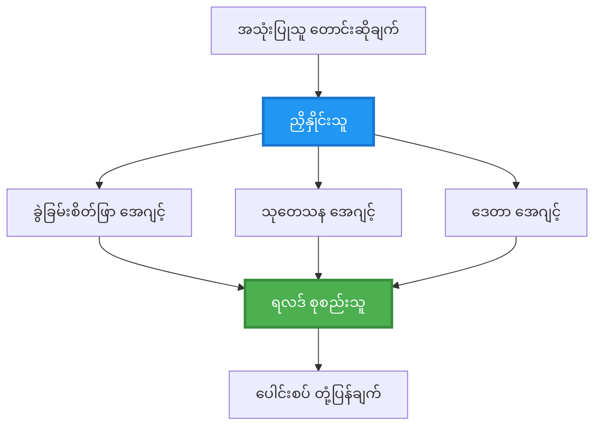
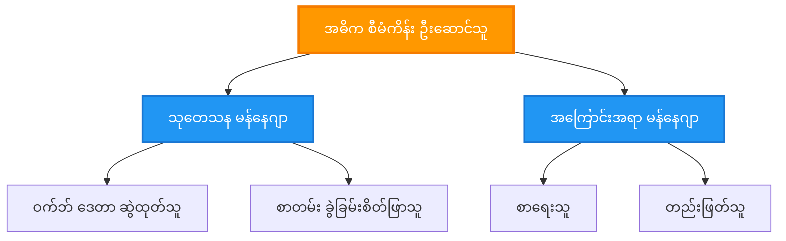
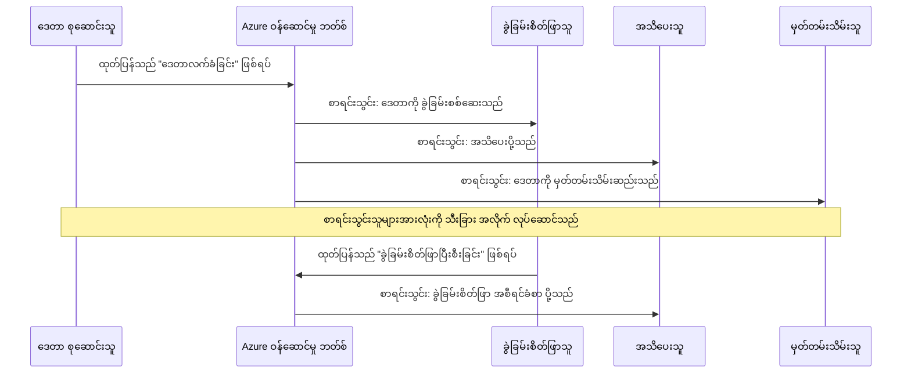
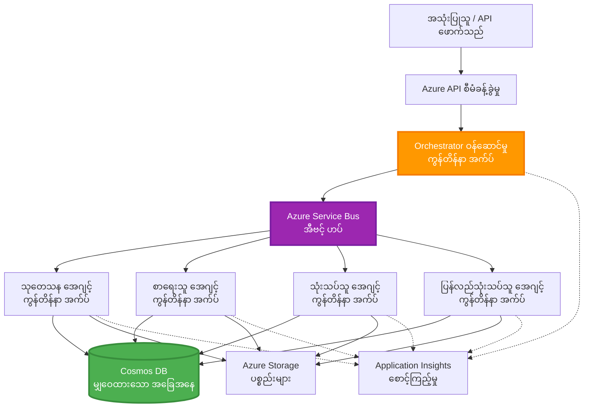

# မူလ-အေဂျင့် ပေါင်းစည်းမှု ပုံစံများ

⏱️ **ခန့်မှန်းချိန်**: 60-75 မိနစ် | 💰 **ခန့်မှန်း ကုန်ကျစရိတ်**: ~$100-300/လ | ⭐ **ခက်ခဲမှု**: အဆင့်မြင့်

**📚 သင်ယူရေး လမ်းကြောင်း:**
- ← ယခင်: [စွမ်းရည် စီမံခန့်ခွဲမှု](capacity-planning.md) - အရင်းအမြစ် အရွယ်အစား သတ်မှတ်ခြင်းနှင့် အတိုင်းအတာ တိုးမြှင့်ရေး မဟာဗျူဟာများ
- 🎯 **သင် ဤနေရာတွင် ရှိသည်**: အများ-အေဂျင့် ပေါင်းစည်းမှု ပုံစံများ (စီမံခန့်ခွဲမှု, ဆက်သွယ်မှု, အခြေအနေ စီမံခန့်ခွဲမှု)
- → နောက်တစ်ခု: [SKU ရွေးချယ်ခြင်း](sku-selection.md) - မှန်ကန်သော Azure ဝန်ဆောင်မှုများ ရွေးချယ်ခြင်း
- 🏠 [သင်တန်း မူလစာမျက်နှာ](../../README.md)

---

## သင် သင်ယူမည့် အရာများ

ဒီသင်ခန်းစာကို ပြီးမြောက်ပါက သင်သည်:
- **multi-agent architecture** ပုံစံများနှင့် ဘယ်အချိန်တွင် အသုံးပြုရမည်ကို နားလည်နိုင်မည်
- **orchestration patterns** (ဗဟိုပြု, မဗဟိုပြု, အဆင့်လိုက်) များကို အကောင်အထည်ဖော်နိုင်မည်
- **agent communication** နည်းဗျူဟာများ (တပြိုင်နက်ဆက်သွယ်မှု, အချိန်မတည်ငြိမ်သောဆက်သွယ်မှု, ပြောင်းလဲမှု အခြေပြု) ကို ဒီဇိုင်းဆွဲနိုင်မည်
- ဖြန့်ချိထားသော agent များအကြား **shared state** ကို စီမံနိုင်မည်
- AZD ဖြင့် Azure ပေါ်တွင် **multi-agent systems** များကို တပ်ဆင်နိုင်မည်
- အစစ်အမှန် AI မျှော်မှန်းချက်များအတွက် **coordination patterns** များကို အသုံးချနိုင်မည်
- ဖြန့်ချိထားသော agent စနစ်များကို စောင့်ကြည့်ခြင်းနှင့် အမှားရှာဖွေမှုပြုနိုင်မည်

## မူလ-အေဂျင့် ပေါင်းစည်းမှု အရေးပါမှု

### တိုးတက်မှု: တစ်ဦးတည်း အေးဂျင့် မှ အများ-အေဂျင့် သို့

**တစ်ဦးတည်း အေးဂျင့် (ရိုးရှင်း):**
```
User → Agent → Response
```
- ✅ နားလည်ရလွယ်ပြီး အကောင်အထည်ဖော်ရန် လွယ်ကူသည်
- ✅ ရိုးရှင်းသော အလုပ်များအတွက် မြန်ဆန်သည်
- ❌ တစ်ခုတည်း မော်ဒယ်၏ စွမ်းရည်များဖြင့် ကန့်သတ်ထားသည်
- ❌ ရှုပ်ထွေးသော အလုပ်များကို တပြိုင်နက်တွင် လုပ်ဆောင်၍ မရ
- ❌ အထူးကျွမ်းကျင်မှု မရှိ

**အများ-အေဂျင့် စနစ် (အဆင့်မြင့်):**
```mermaid
graph TD
    Orchestrator[စီမံခန့်ခွဲသူ] --> Agent1[အေးဂျင့် 1<br/>အစီအစဉ်]
    Orchestrator --> Agent2[အေးဂျင့် 2<br/>ကုဒ်]
    Orchestrator --> Agent3[အေးဂျင့် 3<br/>ပြန်လည်သုံးသပ်ခြင်း]
```- ✅ အလုပ်အမျိုးအစားအလိုက် အထူးကျွမ်းကျင်ထားသော agent များ
- ✅ မြန်ဆန်မှုအတွက် တပြိုင်နက် ဆောင်ရွက်နိုင်မှု
- ✅ မော်ဒူလာဖြင့် ထိန်းသိမ်းရလွယ်ကူသည်
- ✅ ရှုပ်ထွေးသော လုပ်ငန်းစဉ်များတွင် ကောင်းမွန်သည်
- ⚠️ ညှိနှိုင်းမှု ရုပ်သိမ်းရေး လိုအပ်သည်

**နှိုင်းယှဉ်ချက်**: တစ်ဦးတည်း အေးဂျင့် သည် အလုပ်အားလုံးကို တစ်ယောက်တည်း လုပ်သော လူတစ်ယောက်တည်းကဲ့သို့ ဖြစ်သည်။ အများ-အေဂျင့် သည် သုတေသန, ကုဒ်ရေးသူ, စစ်ဆေးသူ, စာရေးသူ စသည့် အထူးကျွမ်းကျင်သူများ ပါဝင်သည့် အသင်းတစ်စု ကဲ့သို့ ပူးပေါင်းဆောင်ရွက် သောအခြေအနေဖြစ်သည်။

---

## အဓိက ပေါင်းစည်းမှု ပုံစံများ

### Pattern 1: အစဉ်လိုက် ပေါင်းစည်းမှု (တာဝန် ဆက်လက်မှု ချိုင်)

**ဘယ်အချိန်တွင် အသုံးပြုသင့်သလဲ**: တာဝန်များကို သတ်မှတ်ထားသော အစီလိုက်အတိုင်း ပြီးမြောက်ရမည်၊ အချင်းချင်း အောက်တွင် အလုပ်များ အခြေခံနိုင်ရန်။

```mermaid
sequenceDiagram
    participant User
    participant Orchestrator
    participant Agent1 as သုတေသန အေးဂျင့်
    participant Agent2 as စာရေး အေးဂျင့်
    participant Agent3 as တည်းဖြတ် အေးဂျင့်
    
    User->>Orchestrator: "AI အကြောင်း ဆောင်းပါးရေးပါ"
    Orchestrator->>Agent1: ခေါင်းစဉ် သုတေသန
    Agent1-->>Orchestrator: သုတေသန ရလဒ်များ
    Orchestrator->>Agent2: မူကြမ်းရေးပါ (သုတေသနကို အသုံးပြု၍)
    Agent2-->>Orchestrator: မူကြမ်း ဆောင်းပါး
    Orchestrator->>Agent3: တည်းဖြတ်၍ တိုးတက်စေပါ
    Agent3-->>Orchestrator: နောက်ဆုံး ဆောင်းပါး
    Orchestrator-->>User: တိုးတက် ကောင်းမွန်သည့် ဆောင်းပါး
    
    Note over User,Agent3: စဉ်ဆက်: အဆင့်တိုင်းသည် ယခင် အဆင့်ကို စောင့်ဆိုင်းသည်
```
**အားသာချက်များ:**
- ✅ ဒေတာသွားလာမှု ပေါ်လွင်သည်
- ✅ အမှား ရှာဖွေရေး လွယ်ကူသည်
- ✅ အလုပ်လုပ်စဉ် အစီအမံ ခန့်မှန်းနိုင်သည်

**ကန့်သတ်ချက်များ:**
- ❌ ရှာဖွေရေး အနေနဲ့ နှေးကွေးသည် (တပြိုင်နက်ဆောင်ရွက်မှု မရှိ)
- ❌ တစ်ခု ကျရှုံးခြင်းက အစုံလုံးကို တားဆီးနိုင်သည်
- ❌ အချိုးကျ မဟုတ်သော အလုပ်များကို ကိုင်တွယ်ရန် မဖြစ်နိုင်

**ဥပမာ အသုံးချမှုများ:**
- အကြောင်းအရာ ဖန်တီးခြင်း လုပ်ငန်းစဉ် (သုတေသန → ရေးသား → တည်းဖြတ် → ထုတ်ဝေ)
- ကုဒ် ထုတ်လုပ်ခြင်း (အစီအစဉ် → တည်ဆောက် → စမ်းသပ် → ထုတ်လွှင့်)
- အစီရင်ခံစာ ဖန်တီးခြင်း (ဒေတာ စုပေါင်း → विश्लेषण → တီထွင်ခြင်း → အကျဉ်းချုပ်)

---

### Pattern 2: 병렬 ပေါင်းစည်းမှု (Fan-Out/Fan-In)

**ဘယ်အချိန်တွင် အသုံးပြုသင့်သလဲ**: လွတ်လပ်သော တာဝန်များကို တပြိုင်နက် ဆောင်ရွက်နိုင်ပြီး နောက်ဆုံးတွင် ရလဒ်များကို ပေါင်းစည်းလိုသည်။


**အားသာချက်များ:**
- ✅ မြန် (တပြိုင်နက် ဆောင်ရွက်မှု)
- ✅ ဖောလတ်တန် (အပိုင်းအစ ရလဒ်များကို အလက်ခံနိုင်သည်)
- ✅ အလျားလိုက် တိုးချဲ့နိုင်သည်

**ကန့်သတ်ချက်များ:**
- ⚠️ ရလဒ်များသည် အစီအစဉ် မကျ၍ ထွက်လာနိုင်သည်
- ⚠️ ပေါင်းစည်းမှု ရုပ်ပုံ စီမံခန့်ခွဲရန် လိုအပ်သည်
- ⚠️ တည်နေရာ အခြေအနေ စီမံခန့်ခွဲမှု ရှုပ်ထွေးသည်

**ဥပမာ အသုံးချမှုများ:**
- အထွေထွေ ဒေတာ စုဆောင်းခြင်း (APIs + ဒေတာဘေ့စ်များ + ဝက်ဘ် စကရပ်)
- ယှဉ်ပြိုင်သုံးသပ်ခြင်း (အမျိုးမျိုး မော်ဒယ်များက ဖြေရှင်းချက် များထုတ်ပေး၊ အကောင်းဆုံးကို ရွေးချယ်)
- ဘာသာပြန်ဝန်ဆောင်မှုများ (ဘာသာစကားစုံသို့ တပြိုင်နက် ဘာသာပြန်)

---

### Pattern 3: တန်းစီ ပေါင်းစည်းမှု (မန်နေဂျာ-အလုပ်သမား)

**ဘယ်အချိန်တွင် အသုံးပြုသင့်သလဲ**: အခန်းကဏ္ဍများဖြင့် ကှဲထွက်သော ရှုပ်ထွေးသော လုပ်ငန်းစဉ်များတွင် တာဝန်အဖွဲ့ချုပ် လိုအပ်သည့် အချိန်။


**အားသာချက်များ:**
- ✅ ရှုပ်ထွေးသော လုပ်ငန်းစဉ်များကို ကိုင်တွယ်နိုင်သည်
- ✅ မော်ဒူလာဖြစ်၍ ထိန်းသိမ်းရ လွယ်ကူသည်
- ✅ တာဝန် ဖြန့်ချိမှု များကို တိတိကျကျ သတ်မှတ်နိုင်သည်

**ကန့်သတ်ချက်များ:**
- ⚠️ ပိုမိုရှုပ်ထွေးသော စက်ရုပ်ပုံစံ
- ⚠️ အချိန်ကြာမြင့်မှု မြင့်တက်နိုင်သည် (ညှိနှိုင်းအလွှာများ များ)
- ⚠️ ထိရောက်သည့် စီမံခန့်ခွဲမှု လိုအပ်သည်

**ဥပမာ အသုံးချမှုများ:**
- စီးပွားဖြစ် စာရွက်စာတမ်း ပြင်ဆင်မှု (သတ်မှတ် → ညွှန်ပေး → ဆောင်ရွက် → သိုလှောင်)
- အဆင့်စုံ ဒေတာ လှုပ်ရှားမှု လမ်းကြောင်းများ (ယူဆောင် → သန့်ရေ → ပြောင်းလဲ → विश्लेषण → အစီရင်ခံ)
- ရှုပ်ထွေးသော အော်တိုမေးရှင်း လုပ်ငန်းစဉ်များ (အစီအစဉ် → အရင်းအမြစ် ချီးမြှင့် → ဆောင်ရွက်မှု → ကြီးကြပ်စစ်ဆေးမှု)

---

### Pattern 4: အဖြစ်အပျက် အသက်ဝင်သည့် ပေါင်းစည်းမှု (Publish-Subscribe)

**ဘယ်အချိန်တွင် အသုံးပြုသင့်သလဲ**: အေးဂျင့်များသည် အဖြစ်အပျက်များကို တုံ့ပြန်ရမည်၊ အချင်းချင်း ချိတ်ဆက်မှု သက်သာစေချင်သောအချိန်။


**အားသာချက်များ:**
- ✅ အေးဂျင့်များအကြား ချိတ်ဆက်မှု သက်သာသည်
- ✅ အသစ်သော အေးဂျင့်များကို လွယ်ကူစွာ ထည့်သွင်းနိုင်သည် (subscribe လုပ်ရန်သာ)
- ✅ အချိန်မတည်ငြိမ်သော ဆောင်ရွက်မှု
- ✅ ပြန်လည် တည်တံ့နိုင်ခြင်း (မက်ဆေ့ခ်ျ သိမ်းဆည်းခြင်း)

**ကန့်သတ်ချက်များ:**
- ⚠️ နောက်ကျသော တူညီမှု (eventual consistency)
- ⚠️ အမှားရှာဖွေရေး ရှုပ်ထွေးသည်
- ⚠️ မက်ဆေ့ခ်ျ အစီအစဉ် ဆိုင်ရာ အခက်အခဲများ

**ဥပမာ အသုံးချမှုများ:**
- အချိန်စီးကြောင်းစောင့်ကြည့်မှု စနစ်များ (သတိပေးချက်များ၊ ဒက်ရှ်ဘုတ်များ၊ မှတ်တမ်းများ)
- စွမ်းရည်စုံ မက်ဆေ့ခ်ျ ဂျာနယ်များ (အီးမေးလ်၊ SMS, push, Slack)
- ဒေတာ တင်ပြခြင်း လမ်းကြောင်းများ (တူညီသော ဒေတာကို အပေါင်းအစုစား ပရိုဆက်ဆာများ)

---

### Pattern 5: သဘောတူညီမှု အခြေပြု ပေါင်းစည်းမှု (မဲပေးခြင်း/Quorum)

**ဘယ်အချိန်တွင် အသုံးပြုသင့်သလဲ**: တစ်ဖက်လူတစ်စုမှ အတည်ပြုချက် လိုအပ်သောအချိန်။

```mermaid
graph TB
    Input[အဝင် တာဝန်]
    Agent1[ကိုယ်စားလှယ် 1: gpt-4.1]
    Agent2[ကိုယ်စားလှယ် 2: Claude]
    Agent3[ကိုယ်စားလှယ် 3: Gemini]
    Voter[သဘောတူ မဲဆန္ဒရှင်]
    Output[သဘောတူ အထွက်]
    
    Input --> Agent1
    Input --> Agent2
    Input --> Agent3
    Agent1 --> Voter
    Agent2 --> Voter
    Agent3 --> Voter
    Voter --> Output
    
    style Voter fill:#9C27B0,stroke:#7B1FA2,stroke-width:3px,color:#fff
```


**အားသာချက်များ:**
- ✅ မြင့်မားသော တိကျမှန်ကန်မှု (အမြင်များ အများအတွက်)
- ✅ ဖောလတ်တန် (နည်းလမ်း အနည်းငယ် ကျရှုံးမှုများကို ခံနိုင်)
- ✅ အရည်အသွေး အာမခံချက် ထည့်သွင်းထားသည်

**ကန့်သတ်ချက်များ:**
- ❌ စျေးကြီး (မော်ဒယ်များကို မကြာခဏ ခေါ်ယူရသည်)
- ❌ နှေးကွေးသည် (အေးဂျင့် အားလုံး၏ သဘောတူညီချက်ကို စောင့်ရသည်)
- ⚠️ ဆန့်ကျင်မှု ဖြေရှင်းနည်း လိုအပ်သည်

**ဥပမာ အသုံးချမှုများ:**
- အကြောင်းအရာ စီမံခန့်ခွဲမှု (အမျိုးမျိုးသော မော်ဒယ်များက အကြောင်းအရာကို အကဲဖြတ်)
- ကုဒ် စစ်ဆေးခြင်း (လင်တာများ/ခွဲခြမ်းစိတ်ဖြာသူများ အများ)
- ဆေးဘက်ဆိုင်ရာ ရောဂါ ချဉ်းကပ်ချက်များ (အမျိုးမျိုး AI မော်ဒယ်များနှင့် ကျွမ်းကျင်ပညာရှင် အတည်ပြု)

---

## စက်ပုံ အကျဉ်းချုံး

### Azure ပေါ်တွင် ပြည့်စုံသော အများ-အေဂျင့် စနစ်


**အဓိက တင်_COMPONENT များ:**

| ကော်မponent | ရည်ရွယ်ချက် | Azure ဝန်ဆောင်မှု |
|-----------|---------|---------------|
| **API Gateway** | ဝင်ရောက်ရန် နေရာ၊ rate limiting, အတည်ပြုခြင်း | API Management |
| **Orchestrator** | အေးဂျင့် လုပ်ငန်းစဉ်များကို ညွှန်ကြားမှု ပေးသည် | Container Apps |
| **Message Queue** | အချိန်မတည်ငြိမ်သော ဆက်သွယ်မှု | Service Bus / Event Hubs |
| **Agents** | အထူးကျွမ်းကျင် AI အလုပ်သမားများ | Container Apps / Functions |
| **State Store** | မျှဝေထားသော အခြေအနေ၊ တာဝန် ချက်ချက် စာရင်း | Cosmos DB |
| **Artifact Storage** | စာရွက်စာတမ်းများ၊ ရလဒ်များ၊ မှတ်တမ်းများ | Blob Storage |
| **Monitoring** | ဖြန့်ချိသံနှင့် မှတ်တမ်းများ | Application Insights |

---

## မလိုအပ်သော ကိရိယာများ

### လိုအပ်သော ကိရိယာများ

```bash
# Azure Developer CLI ကို စစ်ဆေးပါ
azd version
# ✅ မျှော်လင့်သည်: azd ဗားရှင်း 1.0.0 သို့မဟုတ် အထက်

# Azure CLI ကို စစ်ဆေးပါ
az --version
# ✅ မျှော်လင့်သည်: azure-cli ဗားရှင်း 2.50.0 သို့မဟုတ် အထက်

# Docker ကို စစ်ဆေးပါ (ဒေသတွင်း စမ်းသပ်မှုအတွက်)
docker --version
# ✅ မျှော်လင့်သည်: Docker ဗားရှင်း 20.10 သို့မဟုတ် အထက်
```

### Azure သတ်မှတ်ချက်များ

- အသက်ဝင်သော Azure subscription
- ဖန်တီးခွင့်များရှိခြင်း:
  - Container Apps များ
  - Service Bus namespaces များ
  - Cosmos DB အကောင့်များ
  - Storage အကောင့်များ
  - Application Insights

### အသိပညာ အခြေခံလိုအပ်ချက်များ

သင်သည် အောက်ပါများကို ပြီးစီးထားသင့်သည်:
- [Configuration Management](../chapter-03-configuration/configuration.md)
- [Authentication & Security](../chapter-03-configuration/authsecurity.md)
- [Microservices Example](../../../../examples/microservices)

---

## အကောင်အထည်ဖော် လမ်းညွှန်

### ပရောဂျက် ဖွဲ့စည်းမှု

```
multi-agent-system/
├── azure.yaml                    # AZD configuration
├── infra/
│   ├── main.bicep               # Main infrastructure
│   ├── core/
│   │   ├── servicebus.bicep     # Message queue
│   │   ├── cosmos.bicep         # State store
│   │   ├── storage.bicep        # Artifact storage
│   │   └── monitoring.bicep     # Application Insights
│   └── app/
│       ├── orchestrator.bicep   # Orchestrator service
│       └── agent.bicep          # Agent template
└── src/
    ├── orchestrator/            # Orchestration logic
    │   ├── app.py
    │   ├── workflows.py
    │   └── Dockerfile
    ├── agents/
    │   ├── research/            # Research agent
    │   ├── writer/              # Writer agent
    │   ├── analyst/             # Analyst agent
    │   └── reviewer/            # Reviewer agent
    └── shared/
        ├── state_manager.py     # Shared state logic
        └── message_handler.py   # Message handling
```

---

## သင်ခန်းစာ ၁: အစဉ်လိုက် ပေါင်းစည်းမှု ပုံစံ

### အကောင်အထည်ဖော်ခြင်း: အကြောင်းအရာ ဖန်တီးရေး လုပ်ငန်းစဉ်

အစီအစဉ်တစ်ခု ဖန်တီးမည်: သုတေသန → ရေးသား → တည်းဖြတ် → ထုတ်ဝေ

### 1. AZD သတ်မှတ်ချက်

**ဖိုင်: `azure.yaml`**

```yaml
name: content-pipeline
metadata:
  template: multi-agent-sequential@1.0.0

services:
  orchestrator:
    project: ./src/orchestrator
    language: python
    host: containerapp
  
  research-agent:
    project: ./src/agents/research
    language: python
    host: containerapp
  
  writer-agent:
    project: ./src/agents/writer
    language: python
    host: containerapp
  
  editor-agent:
    project: ./src/agents/editor
    language: python
    host: containerapp
```

### 2. အခြေခံ အင်ဖရာစทรတ်ခ်ချာ: ညှိနှိုင်းရေးအတွက် Service Bus

**ဖိုင်: `infra/core/servicebus.bicep`**

```bicep
param name string
param location string
param tags object = {}

resource serviceBusNamespace 'Microsoft.ServiceBus/namespaces@2022-10-01-preview' = {
  name: name
  location: location
  tags: tags
  sku: {
    name: 'Standard'
    tier: 'Standard'
  }
  properties: {
    minimumTlsVersion: '1.2'
  }
}

// Queue for orchestrator → research agent
resource researchQueue 'Microsoft.ServiceBus/namespaces/queues@2022-10-01-preview' = {
  parent: serviceBusNamespace
  name: 'research-tasks'
  properties: {
    maxDeliveryCount: 3
    lockDuration: 'PT5M'
    deadLetteringOnMessageExpiration: true
  }
}

// Queue for research agent → writer agent
resource writerQueue 'Microsoft.ServiceBus/namespaces/queues@2022-10-01-preview' = {
  parent: serviceBusNamespace
  name: 'writer-tasks'
  properties: {
    maxDeliveryCount: 3
    lockDuration: 'PT5M'
  }
}

// Queue for writer agent → editor agent
resource editorQueue 'Microsoft.ServiceBus/namespaces/queues@2022-10-01-preview' = {
  parent: serviceBusNamespace
  name: 'editor-tasks'
  properties: {
    maxDeliveryCount: 3
    lockDuration: 'PT5M'
  }
}

output namespace string = serviceBusNamespace.name
output connectionString string = listKeys('${serviceBusNamespace.id}/AuthorizationRules/RootManageSharedAccessKey', serviceBusNamespace.apiVersion).primaryConnectionString
```

### 3. မျှဝေထားသော State မန်နေဂျာ

**ဖိုင်: `src/shared/state_manager.py`**

```python
from azure.cosmos import CosmosClient, PartitionKey
from datetime import datetime
import os

class StateManager:
    """Manages shared state across agents using Cosmos DB"""
    
    def __init__(self):
        endpoint = os.environ['COSMOS_ENDPOINT']
        key = os.environ['COSMOS_KEY']
        
        self.client = CosmosClient(endpoint, key)
        self.database = self.client.get_database_client('agent-state')
        self.container = self.database.get_container_client('tasks')
    
    def create_task(self, task_id: str, task_type: str, input_data: dict):
        """Create a new task"""
        task = {
            'id': task_id,
            'type': task_type,
            'status': 'pending',
            'input': input_data,
            'created_at': datetime.utcnow().isoformat(),
            'steps': []
        }
        self.container.create_item(task)
        return task
    
    def update_task_step(self, task_id: str, step_name: str, result: dict):
        """Update task with completed step"""
        task = self.container.read_item(task_id, partition_key=task_id)
        
        task['steps'].append({
            'name': step_name,
            'completed_at': datetime.utcnow().isoformat(),
            'result': result
        })
        
        self.container.replace_item(task_id, task)
        return task
    
    def complete_task(self, task_id: str, final_result: dict):
        """Mark task as complete"""
        task = self.container.read_item(task_id, partition_key=task_id)
        task['status'] = 'completed'
        task['result'] = final_result
        task['completed_at'] = datetime.utcnow().isoformat()
        self.container.replace_item(task_id, task)
        return task
    
    def get_task(self, task_id: str):
        """Retrieve task state"""
        return self.container.read_item(task_id, partition_key=task_id)
```

### 4. Orchestrator ဝန်ဆောင်မှု

**ဖိုင်: `src/orchestrator/app.py`**

```python
from flask import Flask, request, jsonify
from azure.servicebus import ServiceBusClient, ServiceBusMessage
import json
import uuid
import os
from shared.state_manager import StateManager

app = Flask(__name__)
state_manager = StateManager()

# Service Bus ချိတ်ဆက်မှု
servicebus_connection_str = os.environ['SERVICEBUS_CONNECTION_STRING']
servicebus_client = ServiceBusClient.from_connection_string(servicebus_connection_str)

@app.route('/health', methods=['GET'])
def health():
    return jsonify({'status': 'healthy', 'service': 'orchestrator'})

@app.route('/create-content', methods=['POST'])
def create_content():
    """
    Sequential workflow: Research → Write → Edit → Publish
    """
    data = request.json
    topic = data.get('topic')
    
    if not topic:
        return jsonify({'error': 'Topic required'}), 400
    
    # state store ထဲတွင် task တစ်ခု ဖန်တီးပါ
    task_id = str(uuid.uuid4())
    task = state_manager.create_task(
        task_id=task_id,
        task_type='content_creation',
        input_data={'topic': topic}
    )
    
    # research agent ထံသို့ မက်ဆေ့ခ်် ပို့ပါ (ပထမအဆင့်)
    sender = servicebus_client.get_queue_sender('research-tasks')
    message = ServiceBusMessage(
        body=json.dumps({
            'task_id': task_id,
            'topic': topic,
            'next_queue': 'writer-tasks'  # ရလဒ်များကို ဘယ်ကို ပို့မလဲ
        }),
        content_type='application/json'
    )
    
    with sender:
        sender.send_messages(message)
    
    return jsonify({
        'task_id': task_id,
        'status': 'started',
        'workflow': 'sequential',
        'steps': ['research', 'write', 'edit', 'publish'],
        'message': 'Content creation pipeline initiated'
    }), 202

@app.route('/task/<task_id>', methods=['GET'])
def get_task_status(task_id):
    """Check task status"""
    try:
        task = state_manager.get_task(task_id)
        return jsonify(task)
    except Exception as e:
        return jsonify({'error': str(e)}), 404

if __name__ == '__main__':
    app.run(host='0.0.0.0', port=8080)
```

### 5. သုတေသန အေးဂျင့်

**ဖိုင်: `src/agents/research/app.py`**

```python
from azure.servicebus import ServiceBusClient, ServiceBusMessage
from openai import AzureOpenAI
import json
import os
import time
from shared.state_manager import StateManager

# client များကို စတင်တည်ဆောက်ပါ
state_manager = StateManager()
servicebus_client = ServiceBusClient.from_connection_string(
    os.environ['SERVICEBUS_CONNECTION_STRING']
)

openai_client = AzureOpenAI(
    api_key=os.environ['AZURE_OPENAI_API_KEY'],
    api_version="2024-02-01",
    azure_endpoint=os.environ['AZURE_OPENAI_ENDPOINT']
)

def process_research_task(message_data):
    """Process research request and pass to writer"""
    task_id = message_data['task_id']
    topic = message_data['topic']
    next_queue = message_data['next_queue']
    
    print(f"🔬 Researching: {topic}")
    
    # သုတေသနအတွက် Microsoft Foundry မော်ဒယ်များကို ခေါ်သုံးပါ
    response = openai_client.chat.completions.create(
        model="gpt-4.1",
        messages=[
            {"role": "system", "content": "You are a research assistant. Provide comprehensive research on the given topic."},
            {"role": "user", "content": f"Research this topic thoroughly: {topic}"}
        ],
        max_tokens=1500
    )
    
    research_results = response.choices[0].message.content
    
    # အခြေအနေကို အပ်ဒိတ်လုပ်ပါ
    state_manager.update_task_step(
        task_id=task_id,
        step_name='research',
        result={'research': research_results}
    )
    
    # နောက်ထပ် agent (writer) ထံသို့ ပို့ပါ
    sender = servicebus_client.get_queue_sender(next_queue)
    message = ServiceBusMessage(
        body=json.dumps({
            'task_id': task_id,
            'topic': topic,
            'research': research_results,
            'next_queue': 'editor-tasks'
        }),
        content_type='application/json'
    )
    
    with sender:
        sender.send_messages(message)
    
    print(f"✅ Research complete for task {task_id}")

def main():
    """Listen to research queue"""
    receiver = servicebus_client.get_queue_receiver('research-tasks')
    
    print("🔬 Research Agent started, listening for tasks...")
    
    with receiver:
        while True:
            messages = receiver.receive_messages(max_wait_time=5)
            for message in messages:
                try:
                    message_data = json.loads(str(message))
                    process_research_task(message_data)
                    receiver.complete_message(message)
                except Exception as e:
                    print(f"❌ Error processing message: {e}")
                    receiver.abandon_message(message)

if __name__ == '__main__':
    main()
```

### 6. ရေးသားသူ အေးဂျင့်

**ဖိုင်: `src/agents/writer/app.py`**

```python
from azure.servicebus import ServiceBusClient, ServiceBusMessage
from openai import AzureOpenAI
import json
import os
from shared.state_manager import StateManager

state_manager = StateManager()
servicebus_client = ServiceBusClient.from_connection_string(
    os.environ['SERVICEBUS_CONNECTION_STRING']
)

openai_client = AzureOpenAI(
    api_key=os.environ['AZURE_OPENAI_API_KEY'],
    api_version="2024-02-01",
    azure_endpoint=os.environ['AZURE_OPENAI_ENDPOINT']
)

def process_writing_task(message_data):
    """Write article based on research"""
    task_id = message_data['task_id']
    topic = message_data['topic']
    research = message_data['research']
    next_queue = message_data['next_queue']
    
    print(f"✍️ Writing article: {topic}")
    
    # Microsoft Foundry မော်ဒယ်များကို ခေါ်၍ ဆောင်းပါးရေးပါ
    response = openai_client.chat.completions.create(
        model="gpt-4.1",
        messages=[
            {"role": "system", "content": "You are a professional writer. Write engaging, well-structured articles."},
            {"role": "user", "content": f"Based on this research:\n\n{research}\n\nWrite a comprehensive article about: {topic}"}
        ],
        max_tokens=2000
    )
    
    article_draft = response.choices[0].message.content
    
    # အခြေအနေကို အပ်ဒိတ်လုပ်ပါ
    state_manager.update_task_step(
        task_id=task_id,
        step_name='writing',
        result={'draft': article_draft}
    )
    
    # တည်းဖြတ်သူထံ ပို့ပါ
    sender = servicebus_client.get_queue_sender(next_queue)
    message = ServiceBusMessage(
        body=json.dumps({
            'task_id': task_id,
            'topic': topic,
            'draft': article_draft
        }),
        content_type='application/json'
    )
    
    with sender:
        sender.send_messages(message)
    
    print(f"✅ Article draft complete for task {task_id}")

def main():
    """Listen to writer queue"""
    receiver = servicebus_client.get_queue_receiver('writer-tasks')
    
    print("✍️ Writer Agent started, listening for tasks...")
    
    with receiver:
        while True:
            messages = receiver.receive_messages(max_wait_time=5)
            for message in messages:
                try:
                    message_data = json.loads(str(message))
                    process_writing_task(message_data)
                    receiver.complete_message(message)
                except Exception as e:
                    print(f"❌ Error: {e}")
                    receiver.abandon_message(message)

if __name__ == '__main__':
    main()
```

### 7. တည်းဖြတ်သူ အေးဂျင့်

**ဖိုင်: `src/agents/editor/app.py`**

```python
from azure.servicebus import ServiceBusClient
from openai import AzureOpenAI
import json
import os
from shared.state_manager import StateManager

state_manager = StateManager()
servicebus_client = ServiceBusClient.from_connection_string(
    os.environ['SERVICEBUS_CONNECTION_STRING']
)

openai_client = AzureOpenAI(
    api_key=os.environ['AZURE_OPENAI_API_KEY'],
    api_version="2024-02-01",
    azure_endpoint=os.environ['AZURE_OPENAI_ENDPOINT']
)

def process_editing_task(message_data):
    """Edit and finalize article"""
    task_id = message_data['task_id']
    topic = message_data['topic']
    draft = message_data['draft']
    
    print(f"📝 Editing article: {topic}")
    
    # တည်းဖြတ်ရန် Microsoft Foundry မော်ဒယ်များကို ခေါ်ပါ
    response = openai_client.chat.completions.create(
        model="gpt-4.1",
        messages=[
            {"role": "system", "content": "You are an expert editor. Improve grammar, clarity, and structure."},
            {"role": "user", "content": f"Edit and improve this article:\n\n{draft}"}
        ],
        max_tokens=2000
    )
    
    final_article = response.choices[0].message.content
    
    # တာဝန်ကို ပြီးမြောက်အဖြစ် သတ်မှတ်ပါ
    state_manager.complete_task(
        task_id=task_id,
        final_result={
            'topic': topic,
            'final_article': final_article,
            'word_count': len(final_article.split())
        }
    )
    
    print(f"✅ Article finalized for task {task_id}")

def main():
    """Listen to editor queue"""
    receiver = servicebus_client.get_queue_receiver('editor-tasks')
    
    print("📝 Editor Agent started, listening for tasks...")
    
    with receiver:
        while True:
            messages = receiver.receive_messages(max_wait_time=5)
            for message in messages:
                try:
                    message_data = json.loads(str(message))
                    process_editing_task(message_data)
                    receiver.complete_message(message)
                except Exception as e:
                    print(f"❌ Error: {e}")
                    receiver.abandon_message(message)

if __name__ == '__main__':
    main()
```

### 8. တပ်ဆင်ခြင်းနှင့် စမ်းသပ်ခြင်း

```bash
# ရွေးချယ်ချက် A: တမ်းပလိတ်အခြေပြု တပ်ဆင်ခြင်း
azd init
azd up

# ရွေးချယ်ချက် B: အေးဂျင့် manifest အခြေပြု တပ်ဆင်ခြင်း (တိုးချဲ့မှု လိုအပ်သည်)
azd extension install azure.ai.agents
azd ai agent init -m agent-manifest.yaml
azd up
```

> ကြည့်ပါ [AZD AI CLI Commands](../chapter-08-production/production-ai-practices.md#azd-ai-cli-commands-and-extensions) အတွက် အားလုံး `azd ai` flag များနှင့် ရွေးချယ်စရာများ။

```bash
# orchestrator URL ကို ရယူပါ
ORCHESTRATOR_URL=$(azd env get-values | grep ORCHESTRATOR_URL | cut -d '=' -f2 | tr -d '"')

# အကြောင်းအရာ ဖန်တီးပါ
curl -X POST $ORCHESTRATOR_URL/create-content \
  -H "Content-Type: application/json" \
  -d '{"topic": "The Future of AI in Healthcare"}'
```

**✅ မျှော်မှန်းရလဒ်:**
```json
{
  "task_id": "a1b2c3d4-e5f6-7890-abcd-ef1234567890",
  "status": "started",
  "workflow": "sequential",
  "steps": ["research", "write", "edit", "publish"],
  "message": "Content creation pipeline initiated"
}
```

**တာဝန် တိုးတက်မှု စစ်ဆေးပါ:**
```bash
TASK_ID="a1b2c3d4-e5f6-7890-abcd-ef1234567890"
curl $ORCHESTRATOR_URL/task/$TASK_ID
```

**✅ မျှော်မှန်းရလဒ် (ပြီးစီးပြီး):**
```json
{
  "id": "a1b2c3d4-e5f6-7890-abcd-ef1234567890",
  "type": "content_creation",
  "status": "completed",
  "steps": [
    {
      "name": "research",
      "completed_at": "2025-11-19T10:30:00Z",
      "result": {"research": "..."}
    },
    {
      "name": "writing",
      "completed_at": "2025-11-19T10:32:00Z",
      "result": {"draft": "..."}
    }
  ],
  "result": {
    "topic": "The Future of AI in Healthcare",
    "final_article": "...",
    "word_count": 1500
  }
}
```

---

## သင်ခန်းစာ ၂: 병렬 ပေါင်းစည်းမှု ပုံစံ

### အကောင်အထည်ဖော်ခြင်း: မျိုးစုံ အရင်းအမြစ် သုတေသန စုစည်းရေး

တပြိုင်နက် အရင်းအမြစ် အများမှ သတင်းအချက်အလက် စုဆောင်းသည့် 병렬 စနစ်တစ်ခု ဖန်တီးမည်။

### 병렬 Orchestrator

**ဖိုင်: `src/orchestrator/parallel_workflow.py`**

```python
from flask import Flask, request, jsonify
from azure.servicebus import ServiceBusClient, ServiceBusMessage
import json
import uuid
import os
from shared.state_manager import StateManager

app = Flask(__name__)
state_manager = StateManager()

servicebus_client = ServiceBusClient.from_connection_string(
    os.environ['SERVICEBUS_CONNECTION_STRING']
)

@app.route('/research-parallel', methods=['POST'])
def research_parallel():
    """
    Parallel workflow: Multiple agents work simultaneously
    """
    data = request.json
    query = data.get('query')
    
    task_id = str(uuid.uuid4())
    task = state_manager.create_task(
        task_id=task_id,
        task_type='parallel_research',
        input_data={
            'query': query,
            'agents': ['web', 'academic', 'news', 'social']
        }
    )
    
    # ချဲ့ထွင်ပေးခြင်း: အားလုံးအေဂျင့်များကို တပြိုင်နက်တည်း ပို့ခြင်း
    agents = [
        ('web-research-queue', 'web'),
        ('academic-research-queue', 'academic'),
        ('news-research-queue', 'news'),
        ('social-research-queue', 'social')
    ]
    
    for queue_name, agent_type in agents:
        sender = servicebus_client.get_queue_sender(queue_name)
        message = ServiceBusMessage(
            body=json.dumps({
                'task_id': task_id,
                'query': query,
                'agent_type': agent_type,
                'result_queue': 'aggregation-queue'
            }),
            content_type='application/json'
        )
        
        with sender:
            sender.send_messages(message)
    
    return jsonify({
        'task_id': task_id,
        'status': 'started',
        'workflow': 'parallel',
        'agents_dispatched': 4,
        'message': 'Parallel research initiated'
    }), 202

if __name__ == '__main__':
    app.run(host='0.0.0.0', port=8080)
```

### ပေါင်းစည်းမှု ရောလောစရာ

**ဖိုင်: `src/agents/aggregator/app.py`**

```python
from azure.servicebus import ServiceBusClient
import json
import os
from collections import defaultdict
from shared.state_manager import StateManager

state_manager = StateManager()
servicebus_client = ServiceBusClient.from_connection_string(
    os.environ['SERVICEBUS_CONNECTION_STRING']
)

# အလုပ်တစ်ခုချင်းစီအလိုက် ရလဒ်များကို ခြေရာခံပါ
task_results = defaultdict(list)
expected_agents = 4  # ဝဘ်၊ ပညာရေးဆိုင်ရာ၊ သတင်း၊ လူမှု

def process_result(message_data):
    """Aggregate results from parallel agents"""
    task_id = message_data['task_id']
    agent_type = message_data['agent_type']
    result = message_data['result']
    
    # ရလဒ်ကို သိမ်းဆည်းပါ
    task_results[task_id].append({
        'agent': agent_type,
        'data': result
    })
    
    print(f"📊 Received result from {agent_type} agent ({len(task_results[task_id])}/{expected_agents})")
    
    # agent များအားလုံး အလုပ်ပြီးဆုံးကြောင်း စစ်ဆေးပါ (fan-in)
    if len(task_results[task_id]) == expected_agents:
        print(f"✅ All agents completed for task {task_id}. Aggregating...")
        
        # ရလဒ်များကို ပေါင်းစည်းပါ
        aggregated = {
            'query': message_data['query'],
            'sources': task_results[task_id],
            'summary': generate_summary(task_results[task_id])
        }
        
        # ပီးစီးဟု အမှတ်ပြုပါ
        state_manager.complete_task(task_id, aggregated)
        
        # ရှင်းလင်းလုပ်ဆောင်ပါ
        del task_results[task_id]
        
        print(f"✅ Aggregation complete for task {task_id}")

def generate_summary(results):
    """Generate summary from all sources"""
    summaries = [r['data'].get('summary', '') for r in results]
    return '\n\n'.join(summaries)

def main():
    """Listen to aggregation queue"""
    receiver = servicebus_client.get_queue_receiver('aggregation-queue')
    
    print("📊 Aggregator started, listening for results...")
    
    with receiver:
        while True:
            messages = receiver.receive_messages(max_wait_time=5)
            for message in messages:
                try:
                    message_data = json.loads(str(message))
                    process_result(message_data)
                    receiver.complete_message(message)
                except Exception as e:
                    print(f"❌ Error: {e}")
                    receiver.abandon_message(message)

if __name__ == '__main__':
    main()
```

**병렬 ပုံစံ၏ အားသာချက်များ:**
- ⚡ **၄ ဆ လျင်မြန်** (agent များ တပြိုင်နက် ဆောင်ရွက်)
- 🔄 **ဖောလတ်တန်** (အပိုင်းအစ ရလဒ်ကိုလက်ခံနိုင်)
- 📈 **တိုးချဲ့နိုင်မှု** (agent များကိုလွယ်ကူစွာ ဖြည့်စွက်နိုင်)

---

## လက်တွေ့လေ့ကျင့်ခန်းများ

### လေ့ကျင့်ခန်း ၁: Timeout ကို ထည့်သွင်းပါ ⭐⭐ (အလယ်အလတ်)

**ရည်ရွယ်ချက်**: Aggregator သည် နှေး၏ agent များကို မစောင့်တော့ဘဲ အချိန်ကန့်သတ် နည်းလမ်းကို ထည့်သွင်းပါ။

**ခြေလှမ်းများ**:

1. **Aggregator တွင် timeout ချိန်ခြင်းကို ထည့်ပါ:**

```python
from datetime import datetime, timedelta

task_timeouts = {}  # task_id -> သက်တမ်းကုန်ချိန်

def process_result(message_data):
    task_id = message_data['task_id']
    
    # ပထမဆုံးရလာတဲ့ရလဒ်တွင် အချိန်ကုန်ဆုံးချိန် သတ်မှတ်ပါ
    if task_id not in task_timeouts:
        task_timeouts[task_id] = datetime.utcnow() + timedelta(seconds=30)
    
    task_results[task_id].append({
        'agent': message_data['agent_type'],
        'data': message_data['result']
    })
    
    # ပြီးစီးသွားပါသလား သို့မဟုတ် အချိန်ကုန်ဆုံးပြီလား စစ်ဆေးပါ
    if len(task_results[task_id]) == expected_agents or \
       datetime.utcnow() > task_timeouts[task_id]:
        
        print(f"📊 Aggregating with {len(task_results[task_id])}/{expected_agents} results")
        
        aggregated = {
            'query': message_data['query'],
            'sources': task_results[task_id],
            'completed_agents': len(task_results[task_id]),
            'timed_out': len(task_results[task_id]) < expected_agents
        }
        
        state_manager.complete_task(task_id, aggregated)
        
        # ရှင်းလင်းခြင်း
        del task_results[task_id]
        del task_timeouts[task_id]
```

2. **အတုနဲ့ သာမန် အချိန်ကြာလာစေပြီး စမ်းသပ်ပါ:**

```python
# agent တစ်ခုတွင် အလုပ်လုပ်ချိန်နှေးသော သရုပ်ဖော်မှုအတွက် နောက်ကျမှုကို ထည့်ပါ
import time
time.sleep(35)  # 30 စက္ကန့် သတ်မှတ်ထားသော အချိန်ကန့်သတ်ချက်ကို ကျော်လွန်သည်
```

3. **တပ်ဆင်ပြီး အတည်ပြုပါ:**

```bash
azd deploy aggregator

# အလုပ်ကို တင်သွင်းပါ
curl -X POST $ORCHESTRATOR_URL/research-parallel \
  -H "Content-Type: application/json" \
  -d '{"query": "AI safety research"}'

# ၃၀ စက္ကန့်အကြာတွင် ရလဒ်များကို စစ်ဆေးပါ
curl $ORCHESTRATOR_URL/task/$TASK_ID
```

**✅ အောင်မြင်မှု အချက်ပြချက်များ:**
- ✅ Agent များ မပြီးစီးသော်လည်း 30 စက္ကန့်အပြီးတွင် အလုပ်ပြီးစီးသည်
- ✅ တုံ့ပြန်ချက်တွင် အပိုင်းအစ ရလဒ်များပါရှိ (`"timed_out": true`)
- ✅ ရနိုင်သော ရလဒ်များ ပြန်လည်ပေးပို့သည် (agent ၄ ယောက်ထဲမှ ၃ ယောက်)

**အချိန်**: 20-25 မိနစ်

---

### လေ့ကျင့်ခန်း ၂: Retry logic ကို အကောင်အထည်ဖော်ပါ ⭐⭐⭐ (အဆင့်မြင့်)

**ရည်ရွယ်ချက်**: မအောင်မြင်သော agent တာဝန်များကို ဖြုတ်ပစ်မီ အလိုအလျောက် ပြန်ကြိုးစားစေပါ။

**ခြေလှမ်းများ**:

1. **Orchestrator တွင် retry သတင်းအချက် အလက် ထည့်သွင်းပါ:**

```python
from dataclasses import dataclass
from typing import Dict

@dataclass
class RetryConfig:
    max_retries: int = 3
    backoff_seconds: int = 5

retry_counts: Dict[str, int] = {}  # message_id မှ retry_count သို့

def send_with_retry(queue_name: str, message_data: dict, retry_config: RetryConfig):
    """Send message with retry metadata"""
    message_id = message_data.get('message_id', str(uuid.uuid4()))
    message_data['message_id'] = message_id
    message_data['retry_count'] = retry_counts.get(message_id, 0)
    message_data['max_retries'] = retry_config.max_retries
    
    sender = servicebus_client.get_queue_sender(queue_name)
    message = ServiceBusMessage(
        body=json.dumps(message_data),
        content_type='application/json',
        message_id=message_id
    )
    
    with sender:
        sender.send_messages(message)
```

2. **Agent များတွင် retry ကိုင်တွယ်သူ ထည့်ပါ:**

```python
def process_with_retry(message, receiver, process_func):
    """Process message with automatic retry on failure"""
    try:
        message_data = json.loads(str(message))
        
        # မက်ဆေ့ခ်ျကို ဆောင်ရွက်ပါ
        process_func(message_data)
        
        # အောင်မြင် - ပြီးဆုံး
        receiver.complete_message(message)
        
    except Exception as e:
        message_id = message.message_id
        retry_count = message_data.get('retry_count', 0)
        max_retries = message_data.get('max_retries', 3)
        
        if retry_count < max_retries:
            # ထပ်မံကြိုးစားရန်: စွန့်ပစ်၍ ရေတွက်ကို တိုးပြီး ပြန်ထည့်ပါ
            print(f"⚠️ Retry {retry_count + 1}/{max_retries} for message {message_id}")
            
            message_data['retry_count'] = retry_count + 1
            
            # တူညီသော တန်းသို့ နောက်ကျစေ၍ ပြန်ပို့ပါ
            time.sleep(5 * (retry_count + 1))  # အက်စပိုနင်ရှယ် နောက်ကျမှု
            send_with_retry(queue_name, message_data, RetryConfig())
            
            receiver.complete_message(message)  # မူလကို ဖယ်ရှားပါ
        else:
            # ထပ်မံကြိုးစားမှု အများဆုံး ကျော်လွန်ပြီ - Dead-letter queue သို့ ရွှေ့ပို့ပါ
            print(f"❌ Max retries exceeded for message {message_id}")
            receiver.dead_letter_message(
                message,
                reason="MaxRetriesExceeded",
                error_description=str(e)
            )
```

3. **dead letter ခလုတ်ကို စောင့်ကြည့်ပါ:**

```python
def monitor_dead_letters():
    """Check dead letter queue for failed messages"""
    receiver = servicebus_client.get_queue_receiver(
        'research-queue',
        sub_queue='deadletter'
    )
    
    with receiver:
        messages = receiver.receive_messages(max_wait_time=5)
        for message in messages:
            print(f"☠️ Dead letter: {message.message_id}")
            print(f"Reason: {message.dead_letter_reason}")
            print(f"Description: {message.dead_letter_error_description}")
```

**✅ အောင်မြင်မှု အချက်ပြချက်များ:**
- ✅ မအောင်မြင်သော တာဝန်များကို အလိုအလျောက် ပြန်ကြိုးစားသည် (အကြိမ် ၃ ဆ ထိ)
- ✅ ပြန်ကြိုးစားမှုများအကြား exponential backoff (5s, 10s, 15s)
- ✅ အများဆုံး retry ပြီးသွားလျှင် မက်ဆေ့ခ်ျများသည် dead letter queue သို့ သွားသည်
- ✅ Dead letter queue ကို စောင့်ကြည့်ပြီး ထပ်မံ စတင်ပေးနိုင်သည်

**အချိန်**: 30-40 မိနစ်

---

### လေ့ကျင့်ခန်း ၃: Circuit Breaker ကို အကောင်အထည်ဖော်ပါ ⭐⭐⭐ (အဆင့်မြင့်)

**ရည်ရွယ်ချက်**: မအောင်မြင်မှုများ ဆက်တိုက် ဖြစ်ပေါ်ခြင်းမှ ကာကွယ်ရန် ဆက်တိုက်တောင်းဆိုမှုများကို ရှောင်ကြဉ်ပါ။

**ခြေလှမ်းများ**:

1. **circuit breaker class တစ်ခု ဖန်တီးပါ:**

```python
from enum import Enum
from datetime import datetime, timedelta

class CircuitState(Enum):
    CLOSED = "closed"      # ပုံမှန် လည်ပတ်မှု
    OPEN = "open"          # ပျက်ကွက်နေသည်၊ တောင်းဆိုချက်များကို ငြင်းပယ်သည်
    HALF_OPEN = "half_open"  # ပြန်လည် ပြန်လာနိုင်သလား စမ်းသပ်နေသည်

class CircuitBreaker:
    def __init__(self, failure_threshold=5, timeout_seconds=60):
        self.failure_threshold = failure_threshold
        self.timeout_seconds = timeout_seconds
        self.failure_count = 0
        self.last_failure_time = None
        self.state = CircuitState.CLOSED
    
    def call(self, func):
        """Execute function with circuit breaker protection"""
        if self.state == CircuitState.OPEN:
            # အချိန်ကုန်ဆုံးသွားသလား စစ်ဆေးသည်
            if datetime.utcnow() - self.last_failure_time > timedelta(seconds=self.timeout_seconds):
                self.state = CircuitState.HALF_OPEN
                print("🔄 Circuit breaker: HALF_OPEN (testing)")
            else:
                raise Exception(f"Circuit breaker OPEN for agent. Try again in {self.timeout_seconds}s")
        
        try:
            result = func()
            
            # အောင်မြင်သည်
            if self.state == CircuitState.HALF_OPEN:
                self.state = CircuitState.CLOSED
                self.failure_count = 0
                print("✅ Circuit breaker: CLOSED (recovered)")
            
            return result
            
        except Exception as e:
            self.failure_count += 1
            self.last_failure_time = datetime.utcnow()
            
            if self.failure_count >= self.failure_threshold:
                self.state = CircuitState.OPEN
                print(f"🔴 Circuit breaker: OPEN (too many failures)")
            
            raise e
```

2. **Agent ခေါ်ဆိုမှုများတွင် အသုံးချပါ:**

```python
# orchestrator တွင်
agent_circuits = {
    'web': CircuitBreaker(failure_threshold=5, timeout_seconds=60),
    'academic': CircuitBreaker(failure_threshold=5, timeout_seconds=60),
    'news': CircuitBreaker(failure_threshold=5, timeout_seconds=60),
    'social': CircuitBreaker(failure_threshold=5, timeout_seconds=60)
}

def send_to_agent(agent_type, message_data):
    """Send with circuit breaker protection"""
    circuit = agent_circuits[agent_type]
    
    try:
        circuit.call(lambda: send_message(agent_type, message_data))
    except Exception as e:
        print(f"⚠️ Skipping {agent_type} agent: {e}")
        # အခြား agent များနှင့် ဆက်လက်ဆောင်ရွက်ပါ
```

3. **circuit breaker ကို စမ်းသပ်ပါ:**

```bash
# ထပ်ဖြစ်နေသော မအောင်မြင်မှုများကို ကိုယ်စားပြုစမ်းခြင်း (အေးဂျင့် တစ်ခုကို ရပ်ပါ)
az containerapp stop --name web-research-agent --resource-group rg-agents

# တောင်းသာချက်များ အများကြီး ပို့ပါ
for i in {1..10}; do
  curl -X POST $ORCHESTRATOR_URL/research-parallel \
    -H "Content-Type: application/json" \
    -d '{"query": "test query '$i'"}'
  sleep 2
done

# မှတ်တမ်းများကို စစ်ဆေးပါ - မအောင်မြင်မှု ၅ ကြိမ်အပြီး circuit သည် ဖွင့် (open) နေသည်ကို တွေ့ရမည်
# Container App မှတ်တမ်းများအတွက် Azure CLI ကို အသုံးပြုပါ:
az containerapp logs show --name orchestrator --resource-group $RG_NAME --tail 50
```

**✅ အောင်မြင်မှု အချက်ပြချက်များ:**
- ✅ မအောင်မြင်မှု ၅ ကြိမ် ပြီးနောက် circuit ဖွင့်ကျော် (တောင်းဆိုမှုများကို ငြင်းပယ်သည်)
- ✅ 60 စက္ကန့်အပြီး circuit သည် half-open ဖြစ်ပြီး ပြန်လည်သက်သာမှု စမ်းသပ်မှုများ လုပ်သည်
- ✅ အခြား agent များ မစွန့်ခွာပဲ ဆက်လက်လုပ်ကိုင်နိုင်သည်
- ✅ Agent ပြန်လည်ကောင်းမွန်လာလျှင် circuit ကို အလိုအလျောက် ပိတ်သည်

**အချိန်**: 40-50 မိနစ်

---

## စောင့်ကြည့်ခြင်းနှင့် အမှားရှာဖွေရေး

### Application Insights ဖြင့် ဖြန့်ချိ သံလွှတ်ခြင်း (Distributed Tracing)

**ဖိုင်: `src/shared/tracing.py`**

```python
from opencensus.ext.azure.log_exporter import AzureLogHandler
from opencensus.ext.azure.trace_exporter import AzureExporter
from opencensus.trace import config_integration
from opencensus.trace.tracer import Tracer
from opencensus.trace.samplers import AlwaysOnSampler
import logging
import os

# Tracing ကို ဆက်တင်ပြင်ဆင်ပါ
config_integration.trace_integrations(['requests', 'logging'])

connection_string = os.environ.get('APPLICATIONINSIGHTS_CONNECTION_STRING')

# tracer တစ်ခု ဖန်တီးပါ
tracer = Tracer(
    exporter=AzureExporter(connection_string=connection_string),
    sampler=AlwaysOnSampler()
)

# Logging ကို ဆက်တင်ပြင်ဆင်ပါ
logger = logging.getLogger(__name__)
logger.addHandler(AzureLogHandler(connection_string=connection_string))
logger.setLevel(logging.INFO)

def trace_agent_call(agent_name, task_id, operation):
    """Trace agent operations"""
    with tracer.span(name=f'{agent_name}.{operation}') as span:
        span.add_attribute('agent', agent_name)
        span.add_attribute('task_id', task_id)
        span.add_attribute('operation', operation)
        
        try:
            result = operation()
            span.add_attribute('status', 'success')
            return result
        except Exception as e:
            span.add_attribute('status', 'error')
            span.add_attribute('error', str(e))
            raise
```

### Application Insights မေးခွန်းများ

**မျှဝေထားသော အေးဂျင့် လုပ်ငန်းစဉ်များကို လိုက်နာပါ:**

```kusto
// Trace complete workflow for a task
traces
| where customDimensions.task_id == "a1b2c3d4-..."
| project timestamp, message, customDimensions.agent, customDimensions.operation
| order by timestamp asc
```

**Agent performance နှိုင်းယှဉ်ချက်:**

```kusto
// Compare agent execution times
dependencies
| where name contains "agent"
| summarize 
    avg_duration = avg(duration),
    p95_duration = percentile(duration, 95),
    count = count()
  by agent = tostring(customDimensions.agent)
| order by avg_duration desc
```

**အမှား သုံးသပ်ခြင်း:**

```kusto
// Find which agents fail most
exceptions
| where customDimensions.agent != ""
| summarize 
    failure_count = count(),
    unique_errors = dcount(outerMessage)
  by agent = tostring(customDimensions.agent)
| order by failure_count desc
```

---

## ကုန်ကျစရိတ် အချက်အလက်

### အများ-အေဂျင့် စနစ် ကုန်ကျစရိတ် (လစဉ် ခန့်မှန်းချက်)

| အစိတ်အပိုင်း | သတ်မှတ်ချက် | ကုန်ကျစရိတ် |
|-----------|--------------|------|
| **Orchestrator** | 1 Container App (1 vCPU, 2GB) | $30-50 |
| **4 Agents** | 4 Container Apps (0.5 vCPU, 1GB each) | $60-120 |
| **Service Bus** | Standard tier, 10M messages | $10-20 |
| **Cosmos DB** | Serverless, 5GB storage, 1M RUs | $25-50 |
| **Blob Storage** | 10GB storage, 100K operations | $5-10 |
| **Application Insights** | 5GB ingestion | $10-15 |
| **Microsoft Foundry Models** | gpt-4.1, 10M tokens | $100-300 |
| **စုစုပေါင်း** | | **$240-565/လ** |

### ကုန်ကျစရိတ် အထိထိရောက်ဆုံး မဟာဗျူဟာများ

1. **ဖြစ်နိုင်သမျှ serverless ကို အသုံးပြုပါ:**
   ```bicep
   // Cosmos DB serverless (no minimum cost)
   properties: {
     databaseAccountOfferType: 'Standard'
     capabilities: [{ name: 'EnableServerless' }]
   }
   ```

2. **အသုံးမရှိသောအချိန်တွင် agent များကို zero သို့ scale လုပ်ပါ:**
   ```bicep
   scale: {
     minReplicas: 0  // Scale to zero when no messages
     maxReplicas: 10
   }
   ```

3. **Service Bus အတွက် batching ကို အသုံးပြုပါ:**
   ```python
   # မက်ဆေ့ခ််များကို အစုလိုက်ပို့ပါ (ပိုစျေးသက်သာ)
   sender.send_messages([message1, message2, message3])
   ```

4. **အကြိမ်ကြိမ် အသုံးပြုသော ရလဒ်များကို cache ထားပါ:**
   ```python
   # Azure Cache for Redis ကို အသုံးပြုပါ
   if cache.exists(query_hash):
       return cache.get(query_hash)
   ```

---

## အကောင်းဆုံး လက်ဆောင်များ

### ✅ လုပ်ရန်:

1. **idempotent လုပ်ဆောင်ချက်များကို အသုံးပြုပါ**
   ```python
   # အေဂျင့်သည် တူညီသော မက်ဆေ့ခ်ျအား အကြိမ်များစွာ လုံခြုံစိတ်ချစွာ ပြန်လုပ်ဆောင်နိုင်သည်
   def process_task(task_id):
       if state_manager.task_exists(task_id):
           print(f"Task {task_id} already processed, skipping")
           return
       # တာဝန်ကို ဆောင်ရွက်နေသည်...
   ```

2. **အပြည့်အစုံ အမှတ်တရ မှတ်တမ်းတင်မှု ထည့်သွင်းပါ**
   ```python
   logger.info(f"Agent: {agent_name}, Task: {task_id}, Action: {action}")
   ```

3. **correlation IDs များကို အသုံးပြုပါ**
   ```python
   # task_id ကို လုပ်ငန်းစဉ်တစ်လျှောက်လုံး ပို့ဆောင်ပါ
   message_data = {
       'task_id': task_id,  # ဆက်စပ်မှု အိုင်ဒီ
       'timestamp': datetime.utcnow().isoformat()
   }
   ```

4. **မက်ဆေ့ခ်ျ TTL (time-to-live) သတ်မှတ်ပါ**
   ```bicep
   properties: {
     defaultMessageTimeToLive: 'PT1H'  // 1 hour max
   }
   ```

5. **dead letter queues များကို စောင့်ကြည့်ပါ**
   ```python
   # ပုံမှန် မအောင်မြင်သော မက်ဆေ့များကို စောင့်ကြည့်ခြင်း
   monitor_dead_letters()
   ```

### ❌ မလုပ်သင့်:

1. **စက်ဘီးပတ်ပတ်လည် ရှိသော သက်ဆိုင်မှုများ မဖန်တီးပါနှင့်**
   ```python
   # ❌ မကောင်း: Agent A → Agent B → Agent A (အဆုံးမဲ့ လည်ပတ်မှု)
   # ✅ ကောင်း: ရှင်းရှင်းလင်းလင်း ဦးတည်ချက်ရှိပြီး လှည့်မရှိသော ဂရပ် (DAG) ကို သတ်မှတ်ပါ
   ```

2. **Agent thread များကို ပိတ်မထားပါနှင့်**
   ```python
   # ❌ မကောင်း: တပြေးညီ စောင့်ဆိုင်းခြင်း
   while not task_complete:
       time.sleep(1)
   
   # ✅ ကောင်း: message queue ၏ callback များကို အသုံးပြုပါ
   ```

3. **အပိုင်းအစ အမှားများကို မလွှတ်ပစ်ပါနှင့်**
   ```python
   # ❌ မကောင်း: တစ်ဧဂျင့်ပျက်ပါက အလုပ်စဉ်တစ်ခုလုံးကို ပျက်စေခြင်း
   # ✅ ကောင်း: အမှားအညွှန်းများနှင့် အပိုင်းအစ ရလဒ်များကို ပြန်ပေးပို့ခြင်း
   ```

4. **အဆုံးမဲ့ ထပ်မံကြိုးစားမှုများ မသုံးပါ**
   ```python
   # ❌ မကောင်း: အဆုံးမဲ့ retry ပြုလုပ်ခြင်း
   # ✅ ကောင်း: max_retries = 3, ပြီးနောက် dead letter သို့ပို့ပါ
   ```

---

## ပြဿနာရှာဖွေရေး လမ်းညွှန်

### ပြဿနာ: မက်ဆေ့ချ်များ queue တွင် ပိတ်ဆို့နေခြင်း

**လက္ခဏာများ:**
- မက်ဆေ့ခ်ျများသည် queue တွင် စုဆောင်းနေသည်
- အေဂျင့်များ မလုပ်ဆောင်နိုင်ခြင်း
- Task အခြေအနေသည် "pending" တွင် ကပ်နေသည်

**ဆန်းစစ်ချက်:**
```bash
# တန်း၏ အရှည်ကို စစ်ဆေးပါ
az servicebus queue show \
  --namespace-name mybus \
  --name research-tasks \
  --query "countDetails"

# Azure CLI ကို အသုံးပြု၍ အေဂျင့် မှတ်တမ်းများကို စစ်ဆေးပါ
az containerapp logs show --name research-agent --resource-group $RG_NAME --tail 50
```

**ဖြေရှင်းနည်းများ:**

1. **အေဂျင့်အတွက် replica များကို တိုးချဲ့ပါ:**
   ```bash
   az containerapp update \
     --name research-agent \
     --min-replicas 3 \
     --max-replicas 10
   ```

2. **dead letter queue ကို စစ်ဆေးပါ:**
   ```bash
   az servicebus queue show \
     --namespace-name mybus \
     --name research-tasks \
     --query "countDetails.deadLetterMessageCount"
   ```

---

### ပြဿနာ: Task သည် timeout ဖြစ်ခြင်း သို့မဟုတ် မပြီးစီးခြင်း

**လက္ခဏာများ:**
- Task အခြေအနေသည် "in_progress" မှာရှိနေသည်
- အချို့ အေဂျင့်များ ပြီးဆုံးသော်လည်း အချို့ မပြီးစီးပါ
- အမှားမက်ဆေ့ခ်ျများ မရှိပါ

**ဆန်းစစ်ချက်:**
```bash
# တာဝန်၏ အခြေအနေကို စစ်ဆေးပါ
curl $ORCHESTRATOR_URL/task/$TASK_ID

# Application Insights ကို စစ်ဆေးပါ
# Query ကို ဆောင်ရွက်ပါ: traces | where customDimensions.task_id == "..."
```

**ဖြေရှင်းနည်းများ:**

1. **Aggregator တွင် timeout ကို အကောင်အထည်ဖော်ပါ (လေ့ကျင့်ခန်း 1)**

2. **Azure Monitor ကို အသုံးပြု၍ အေဂျင့် မအောင်မြင်မှုများကို စစ်ဆေးပါ:**
   ```bash
   # azd monitor ဖြင့် လော့ဂ်များ ကြည့်ရန်
   azd monitor --logs
   
   # သို့မဟုတ် Azure CLI ကို အသုံးပြု၍ သီးသန့် container app ၏ လော့ဂ်များကို စစ်ဆေးပါ
   az containerapp logs show --name <agent-name> --resource-group $RG_NAME --follow | grep "ERROR\|FAIL"
   ```

3. **အေဂျင့်များအားလုံး လည်ပတ်နေကြသည်ဟု အတည်ပြုပါ:**
   ```bash
   az containerapp list \
     --resource-group rg-agents \
     --query "[].{name:name, status:properties.runningStatus}"
   ```

---

## ပိုမိုလေ့လာရန်

### တရားဝင် ကိုးကားစာတမ်းများ
- [Azure Service Bus](https://learn.microsoft.com/azure/service-bus-messaging/service-bus-messaging-overview)
- [Cosmos DB](https://learn.microsoft.com/azure/cosmos-db/introduction)
- [Container Apps DAPR](https://learn.microsoft.com/azure/container-apps/dapr-overview)
- [Multi-Agent Design Patterns](https://learn.microsoft.com/azure/architecture/guide/ai/multi-agent-systems)

### ဒီသင်တန်းအတွက် နောက်ဆက်တွဲ အဆင့်များ
- ← ယခင်: [စွမ်းရည် စီမံခန့်ခွဲခြင်း](capacity-planning.md)
- → နောက်: [SKU ရွေးချယ်ခြင်း](sku-selection.md)
- 🏠 [သင်တန်းမူလစာမျက်နှာ](../../README.md)

### ဆက်စပ် ဥပမာများ
- [Microservices ဥပမာ](../../../../examples/microservices) - ဝန်ဆောင်မှု ဆက်သွယ်မှု ပုံစံများ
- [Microsoft Foundry Models ဥပမာ](../../../../examples/azure-openai-chat) - AI ပေါင်းစည်းမှု

---

## အနှစ်ချုပ်

**သင်သင်ယူခဲ့သည်များ:**
- ✅ ညှိနှိုင်းမှု ပုံစံ ၅ မျိုး (sequential, parallel, hierarchical, event-driven, consensus)
- ✅ Azure ပေါ်ရှိ Multi-agent စနစ် (Service Bus, Cosmos DB, Container Apps)
- ✅ ဖြန့်ဝေထားသော အေဂျင့်များအကြား အခြေနေ စီမံခန့်ခွဲမှု
- ✅ Timeout ကိုင်တွယ်ခြင်း၊ ပြန်ကြိုးစားမှုများ၊ နှင့် circuit breaker များ
- ✅ ဖြန့်ဝေထားစနစ်များကို ကြည့်ရှုစစ်ဆေးခြင်းနှင့် အမှားရှာဖွေရေး
- ✅ ကုန်ကျစရိတ် ထိရောက်စွာ လျှော့ချရေးနည်းလမ်းများ

**အဓိကယူဆချက်များ:**
1. **မှန်ကန်သည့် ပုံစံကို ရွေးချယ်ပါ** - စနစ်တကျ လုပ်ဆောင်ရန် sequential၊ အမြန်လိုအပ်ချက်များအတွက် parallel၊ ပြောင်းလွယ်ပြင်လွယ်အတွက် event-driven
2. **အခြေနေကို ဂရုတစိုက် စီမံပါ** - မျှဝေထားသော state အတွက် Cosmos DB သို့ ဆက်စပ်ဖြေရှင်းချက်များကို အသုံးပြုပါ
3. **အလုပ်ချို့ယွင်းမှုများကို သေချာနည်းလမ်းဖြင့် ကိုင်တွယ်ပါ** - Timeouts, retries, circuit breakers, dead letter queues
4. **အားလုံးကို စောင့်ကြည့်ပါ** - ဖြန့်ဝေထားသော tracing သည် debugging အတွက် မရှိမဖြစ် လိုအပ်သည်
5. **ကုန်ကျစရိတ်ကို ထိရောက်စွာ လျှော့ချပါ** - Scale to zero, serverless ကို အသုံးပြုပါ၊ caching ကို ထည့်သွင်းပါ

**နောက်ဆက်တွဲ အဆင့်များ:**
1. လက်တွေ့လေ့ကျင့်ခန်းများကို ပြီးမြောက်ပါ
2. သင့်အသုံးပြုမှုပေါ် မူတည်၍ multi-agent စနစ်တစ်ခု တည်ဆောက်ပါ
3. ကိုယ့်ဆိုင်ရာ စွမ်းဆောင်ရည်နှင့် ကုန်ကျစရိတ် ထိရောက်စေရန် [SKU ရွေးချယ်ခြင်း](sku-selection.md) ကို လေ့လာပါ

---

<!-- CO-OP TRANSLATOR DISCLAIMER START -->
**Disclaimer**:
ဤစာတမ်းကို AI ဘာသာပြန်ဝန်ဆောင်မှု [Co-op Translator](https://github.com/Azure/co-op-translator) အသုံးပြု၍ ဘာသာပြန်ထားပါသည်။ ကျွန်ုပ်တို့သည် တိကျမှုအတွက် ကြိုးပမ်းသည်ဖြစ်သောကြောင့် သတင်းအချက်အလက်မှန်ကန်စေရန် ကြိုးစားပေမယ့်၊ အလိုအလျောက် ဘာသာပြန်ချက်များတွင် အမှားများ သို့မဟုတ် မှားယွင်းချက်များ ပါဝင်နိုင်ကြောင်း သတိပြုရန် လိုအပ်ပါသည်။ မူလစာတမ်းကို မူရင်းဘာသာစကားဖြင့် ရှိသော အရာကို အာဏာပိုင် ရင်းမြစ်အဖြစ် ယူဆသင့်ပါသည်။ အရေးကြီးသော အချက်အလက်များအတွက် သေချာမှုနှင့် တိကျမှုလိုအပ်ပါက ပရော်ဖက်ရှင်နယ် လူသားဘာသာပြန်မှ ဘာသာပြန်ချက်ရယူရန် အကြံပြုပါသည်။ ဤဘာသာပြန်ချက်ကို အသုံးပြုမှုအားဖြင့် ဖြစ်ပေါ်လာသည့် နားမလည်မှုများ သို့မဟုတ် မှားဖတ်ရှုမှုများအတွက် ကျွန်ုပ်တို့ တာဝန်မယူပါ။
<!-- CO-OP TRANSLATOR DISCLAIMER END -->