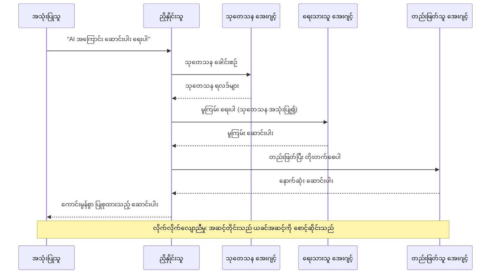
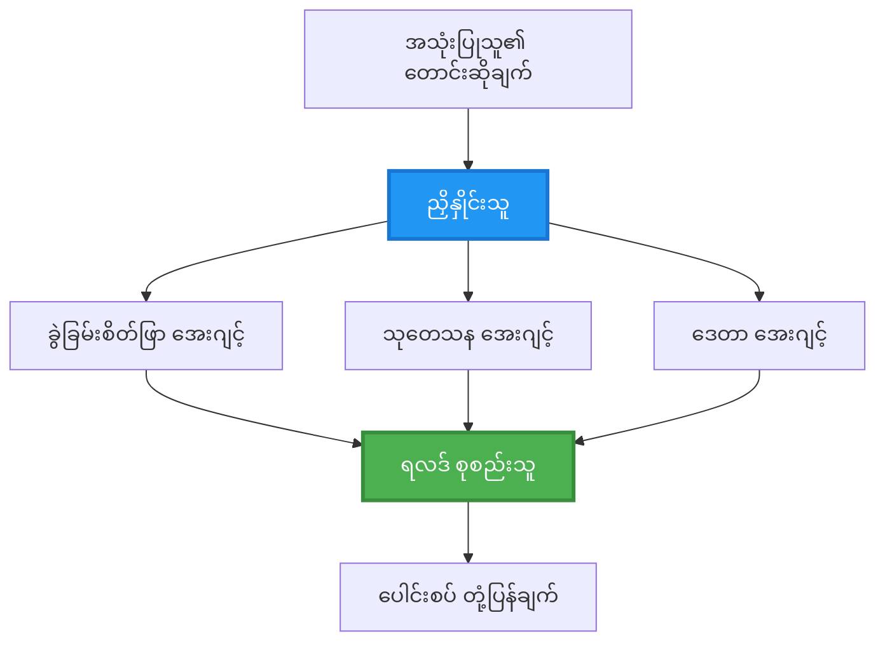
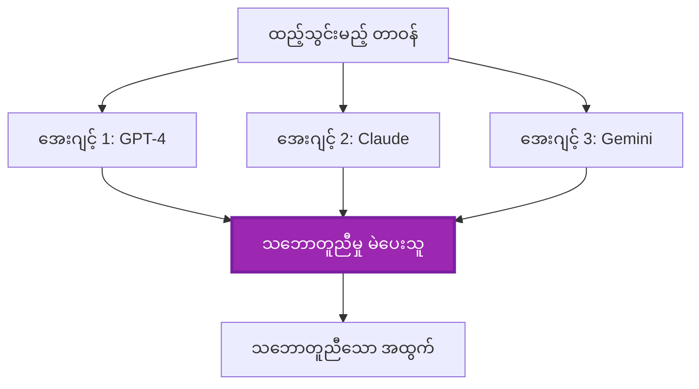
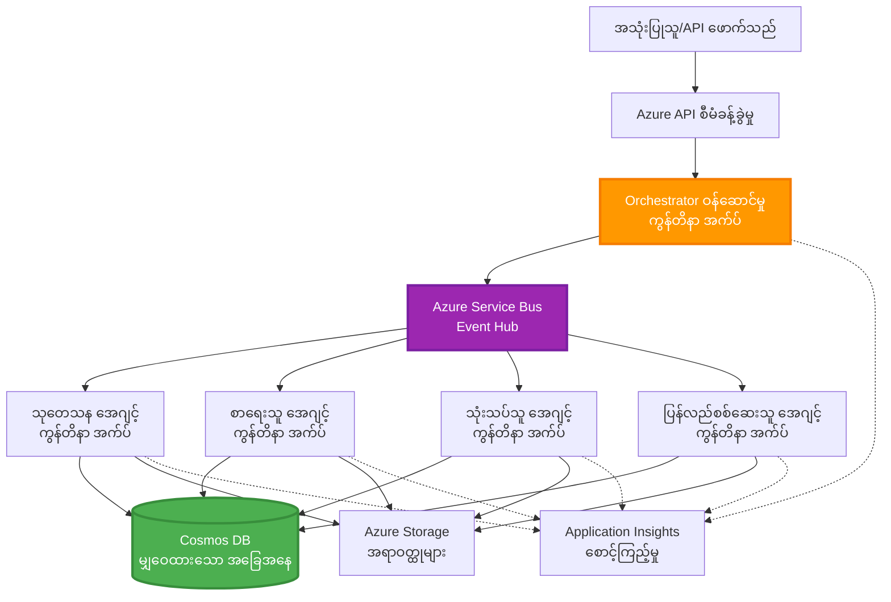

# အများအေဂျင့် ညှိနှိုင်းမှု ပုံစံများ

⏱️ **ခန့်မှန်းချိန်**: 60-75 မိနစ် | 💰 **ခန့်မှန်းကုန်ကျစရိတ်**: ~$100-300/လ | ⭐ **ရှုပ်ထွေးမှု**: အဆင့်မြင့်

**📚 သင်ယူခြင်း လမ်းကြောင်း:**
- ← ယခင်: [စွမ်းရည် စီမံကိန်း](capacity-planning.md) - အရင်းအမြစ် အရွယ်အစား သတ်မှတ်ခြင်းနှင့် အရွယ်တိုးခြင်း မဟာဗျူဟာများ
- 🎯 **သင် ဒီနေရာမှာ ရှိနေသည်**: အများအေဂျင့် ညှိနှိုင်းမှု ပုံစံများ (စီမံခန့်ခွဲမှု, ဆက်သွယ်မှု, အခြေအနေ စီမံခြင်း)
- → နောက်တစ်ခု: [SKU ရွေးချယ်မှု](sku-selection.md) - မှန်ကန်တဲ့ Azure ဝန်ဆောင်မှုများကို ရွေးချယ်ခြင်း
- 🏠 [သင်တန်း မူလစာမျက်နှာ](../../README.md)

---

## သင်ဘာတွေ လေ့လာရမလဲ

ဒီသင်ခန်းစာကို အပြီးသတ်လျှင် သင်จะ:
- အများအေဂျင့် အဖြစ်ဆောက်လုပ်မှု ပုံစံများကိုနားလည်ပြီး ဘယ်အချိန်မှာ အသုံးပြုရမလဲ သိရှိပါမယ်
- စီမံခန့်ခွဲမှု ပုံစံများ (ဗဟိုပြု, ချွေခြင်း/ဖယ်ရွားခြင်း, အဆင့်လိုက်) ကို အကောင်အထည်ဖော်နိုင်မယ်
- အေဂျင့်များ၏ ဆက်သွယ်မှု များ ( synchronous, asynchronous, event-driven ) အတွက် ပေါင်းစည်းမှု မဟာဗျူဟာများ ဒီဇိုင်းဆွဲနိုင်မယ်
- ဖြန့်ဖြူးထားသည့် အေဂျင့်များအကြား မျှဝေထားသည့် အခြေအနေကို စီမံနိုင်မယ်
- AZD ဖြင့် Azure ပေါ်တွင် အများအေဂျင့် စနစ်များ တင်သွင်းနိုင်မယ်
- အဖြစ်မှန် AI ကိစ္စရပ်များအတွက် ညှိနှိုင်းမှု ပုံစံများ အသုံးချနိုင်မယ်
- ဖြန့်ဖြူးထားသော အေဂျင့် စနစ်များကို မျက်ကြည့်၊ ဒီဘတ်ခ်လုပ်နိုင်မယ်

## အများအေဂျင့် ညှိနှိုင်းမှု ဘာကြောင့် အရေးကြီးသလဲ

### တိုးတက်ပြောင်းလဲမှု: တစ်ဧရိယာမှ အများအေဂျင့်သို့

**တစ်ဧရိယာ အေဂျင့် (ရိုးရှင်း):**
```
User → Agent → Response
```
- ✅ နားလည်ရ လွယ်ကူပြီး အကောင်အထည်ဖော်ရ လွယ်ကူသည်
- ✅ ရိုးရှင်းသော အလုပ်များအတွက် မြန်ဆန်သည်
- ❌ တစ်ခုတည်းသော မော်ဒယ်၏ စွမ်းရည်က ကန့်သတ်ထားသည်
- ❌ ရှုပ်ထွေးသော အလုပ်များကို တချိန်တည်းတွင် မလုပ်ဆောင်နိုင်
- ❌ အထူးပြုခွင့် မရှိ

**အများအေဂျင့် စနစ် (အဆင့်မြင့်):**
```
           ┌─────────────┐
           │ Orchestrator│
           └──────┬──────┘
        ┌─────────┼─────────┐
        │         │         │
    ┌───▼──┐  ┌──▼───┐  ┌──▼────┐
    │Agent1│  │Agent2│  │Agent3 │
    │(Plan)│  │(Code)│  │(Review)│
    └──────┘  └──────┘  └───────┘
```
- ✅ အထူးပြုထားသော အေဂျင့်များသည် သီးခြား အလုပ်များကို ထိန်းသိမ်းနိုင်သည်
- ✅ အမြန်ဆန်စေရန် တပြိုင်နက် ဆောင်ရွက်နိုင်သည်
- ✅ မော်ဂျူးနဲ့အစိတ်အပိုင်းမူရင်းဖြစ်ပြီး ထိန်းသိမ်းရ မလွယ်
- ✅ ရှုပ်ထွေးသော workflow များတွင် ပိုကောင်းသည်
- ⚠️ ညှိနှိုင်းမှု နည်းဗျူဟာများလိုအပ်သည်

**နမူနာတူသဘောထား**: တစ်ဧရိယာသည် တစ်ဦးတည်း လူတစ်ဦးက အလုပ်အားလုံးကို လုပ်နေသော ပုံစံနှင့် ဆင်တူသည်။ အများအေဂျင့်သည် သုတေသနသူ၊ ကုဒ်ရေးသူ၊ စစ်ထုတ်သူ၊ စာရေးသူ တို့ ကဲ့သို့ အထူးကျွမ်းကျင်မှုရှိသူများ ပါဝင်သော အသင်းလို ဖြစ်ကာ အတူတကွ လုပ်ဆောင်သည်။

---

## အဓိက ညှိနှိုင်းမှု ပုံစံများ

### ပုံစံ 1: အစဉ်လိုက် ညှိနှိုင်းမှု (တာဝန် ဆက်စပ်မှု)

**ဘယ်အချိန်တွင် အသုံးပြုရမည်**: အလုပ်များကို သတ်မှတ်ထားသော အစဉ်အတိုင်း ပြီးစီးရမည်၊ တစ်ဧရိယာချင်းစီသည် ယခင်ထွက်ရှိမှုကို အခြေခံ၍ တည်ဆောက်သည်။


**အကျိုးကျေးဇူးများ:**
- ✅ ဒေတာ ပြောင်းလွယ် သေချာ
- ✅ အမှားရှာဖွေရန် လွယ်ကူ
- ✅ အကောင်အထည်ဖော်မှု အစဉ်အတိုင်း မျှော်မှန်းနိုင်သည်

**ကန့်သတ်ချက်များ:**
- ❌ ပိုနှောင့်နှေးသည် (တပြိုင်နက် မလုပ်နိုင်)
- ❌ တစ်ချို့ အဆင်မပြေဘူးဆိုရင် တစ်ခုလုံး ပိတ်မိနိုင်သည်
- ❌ အပြန်အလှန် သက်ဆိုင်နေသော အလုပ်များကို ကိုင်တွယ်၍ မဖြေရှင်းနိုင်

**အသုံးပြုနမူနာများ:**
- အကြောင်းအရာ ဖန်တီးရေး လမ်းကြောင်း (သုတေသန → ရေးသား → တည်းဖြတ် → ထုတ်ဝေ)
- ကုဒ် ထုတ်လုပ်မှု (အစီအစဉ် → အကောင်အထည်ဖော် → စမ်းသပ် → ပို့ဆောင်)
- အစီရင်ခံစာ ထုတ်လုပ်မှု (ဒေတာ ရယူ → ပညာခွဲခြမ်း → ဗြူလာရိုက် → အနှစ်ချုပ်)

---

### ပုံစံ 2: တပြိုင်နက် ညှိနှိုင်းမှု (Fan-Out/Fan-In)

**ဘယ်အချိန်တွင် အသုံးပြုရမည်**: သီးခြား အလုပ်များကို တပြိုင်နက် ဆောင်ရွက်နိုင်ပြီး နောက်ဆုံးတွင် ရလဒ်များကို ပေါင်းစည်းသည်။


**အကျိုးကျေးဇူးများ:**
- ✅ မြန် (တပြိုင်နက် ဆောင်ရွက်ခြင်း)
- ✅ ချို့ယွင်းမှုခံနိုင်ရည်ရှိ (အပိုင်းအစ ရလဒ်များ ဖော်ထုတ်လက်ခံနိုင်)
- ✅ အလျားလိုက် တိုးချဲ့နိုင်သည်

**ကန့်သတ်ချက်များ:**
- ⚠️ ရလဒ်များသည် အစဉ်မလိုက် ရောက်ရှိနိုင်သည်
- ⚠️ ပေါင်းစည်းရေး အာရုံစိုက်ရမည်
- ⚠️ အခြေအနေ စီမံခန့်ခွဲမှု ပိုရှုပ်ထွေးသည်

**အသုံးပြုနမူနာများ:**
- မျိုးစုံအရင်းအမြစ် မှ ဒေတာ စုဆောင်းခြင်း (API များ + DB များ + web scraping)
- ပြိုင်ဘက် ဆန်းစစ်ခြင်း (မော်ဒယ်တွေ အများကြီး ဖြေရှင်းချက် ထုတ်ပေးပြီး အကောင်းဆုံး ရွေးချယ်ခြင်း)
- ဘာသာပြန်ဝန်ဆောင်မှုများ (အများအတွက် ဘာသာပြန် simultaneously)

---

### ပုံစံ 3: အဆင့်လိုက် ညှိနှိုင်းမှု (Manager-Worker)

**ဘယ်အချိန်တွင် အသုံးပြုရမည်**: အပိုင်းသေးငယ်များကို ဝေငှထမ်းပိုးရန် လိုအပ်သော ရှုပ်ထွေးသော workflow များတွင်။

```mermaid
graph TB
    Master[ဦးဆောင်ညှိနှိုင်းသူ]
    Manager1[သုတေသန စီမံသူ]
    Manager2[အကြောင်းအရာ စီမံသူ]
    W1[ဝဘ် ဒေတာစုဆောင်းသူ]
    W2[စာတမ်း ခွဲခြမ်းအကဲဖြတ်သူ]
    W3[စာရေးသူ]
    W4[တည်းဖြတ်သူ]
    
    Master --> Manager1
    Master --> Manager2
    Manager1 --> W1
    Manager1 --> W2
    Manager2 --> W3
    Manager2 --> W4
    
    style Master fill:#FF9800,stroke:#F57C00,stroke-width:3px,color:#fff
    style Manager1 fill:#2196F3,stroke:#1976D2,stroke-width:2px,color:#fff
    style Manager2 fill:#2196F3,stroke:#1976D2,stroke-width:2px,color:#fff
```}
**အကျိုးကျေးဇူးများ:**
- ✅ ရှုပ်ထွေးသော workflow များကို ကိုင်တွယ်နိုင်သည်
- ✅ မော်ဂျူးပိုင်းခြားပြီး ထိန်းသိမ်းရ လွယ်
- ✅ တာဝန် ပိတ္ပင်ချက်များ သေချာနေသည်

**ကန့်သတ်ချက်များ:**
- ⚠️ အခြေခံဖွဲ့စည်းမှု ပိုရှုပ်ထွေးသည်
- ⚠️ အချိန်ချိန်ကြာမြင့်မှု မြင့်တက်နိုင်သည် (အဆင့်များစွာ ဆက်သွယ်မှုပြု)
- ⚠️ စီမံခန့်ခွဲရေး အတတ်နိုင်သော နည်းပညာလိုအပ်သည်

**အသုံးပြုနမူနာများ:**
- အဖွဲ့အစည်းစာရွက် စီမံခြင်း (စာတန်းခွဲ → လမ်းကြောင်းပေး → ကိုင်တွယ် → ဆိုင်ရာသိုလှောင်)
- အဆင့်စုံ ဒေတာ လမ်းကြောင်းများ (သွင်းယူ → သန့်ရှင်း → ပြောင်းလဲ → ချဲ့ထွင် → သေချာစီရင်)
- ရှုပ်ထွေးသော အလိုအလျောက် လုပ်ငန်းစဉ်များ (စီမံချက် → အရင်းအမြစ် ချထားမှု → ဆောင်ရွက်မှု → ကြီးကြပ်မှု)

---

### ပုံစံ 4: အဖြစ်အပျက် အခြေခံ ညှိနှိုင်းမှု (Publish-Subscribe)

**ဘယ်အချိန်တွင် အသုံးပြုရမည်**: အေဂျင့်များသည် အဖြစ်အပျက်များကို တုံ့ပြန်ရန် လိုအပ်ပြီး အနည်းငယ် ချိတ်ဆက်ပတ်သက်မှု လိုချင်သောအခါ။

```mermaid
sequenceDiagram
    participant Agent1 as ဒေတာ စုဆောင်းသူ
    participant EventBus as Azure ဝန်ဆောင်မှု ဘတ်စ်
    participant Agent2 as ခွဲခြမ်းစစ်ဆေးသူ
    participant Agent3 as အသိပေးသူ
    participant Agent4 as စာမှတ်တမ်းသိမ်းသူ
    
    Agent1->>EventBus: ထုတ်ဝေ "ဒေတာရရှိ" ဖြစ်ရပ်
    EventBus->>Agent2: စာရင်းသွင်း: ဒေတာကို ခွဲခြမ်းစစ်ဆေး
    EventBus->>Agent3: စာရင်းသွင်း: အသိပေး ပို့
    EventBus->>Agent4: စာရင်းသွင်း: ဒေတာကို သိုလှောင်
    
    Note over Agent1,Agent4: အားလုံး စာရင်းသွင်းသူများကို သီးခြား စီ လုပ်ဆောင်သည်
    
    Agent2->>EventBus: ထုတ်ဝေ "ခွဲခြမ်းစစ်ဆေးမှုပြီးစီး" ဖြစ်ရပ်
    EventBus->>Agent3: စာရင်းသွင်း: ခွဲခြမ်းစစ်ဆေး အစီရင်ခံစာ ပို့
```
**အကျိုးကျေးဇူးများ:**
- ✅ အေဂျင့်များအကြား ချိတ်ဆက်မှု သပ်ရပ်မှုနည်း
- ✅ အသစ်သော အေဂျင့်များ ထည့်သွင်းရလွယ် (subscribe လုပ်ရန်သာ)
- ✅ အချိန်မတိုင်ခင် ပိုမိုလုပ်ဆောင်နိုင်သည် (asynchronous)
- ✅ ပြန်လည်ခံနိုင်ရည်ရှိ (message persistence)

**ကန့်သတ်ချက်များ:**
- ⚠️ နောက်ဆုံးတွင် အချက်အလက် သက်သာမှု ဖြစ်ရနိုင်သည် (eventual consistency)
- ⚠️ Debugging ပိုရှုပ်ထွေးသည်
- ⚠️ Message အစီအစဉ် ထိန်းသိမ်းခြင်း စိန်ခေါ်မှုရှိသည်

**အသုံးပြုနမူနာများ:**
- အချိန်နှင့်တပြေးညီ မော်နတာစနစ်များ (အသိပေးချက်များ၊ dashboard များ၊ logs)
- မျိုးစုံ ညွှန်ကြားချက် စနစ်များ (အီးမေးလ်၊ SMS၊ push, Slack)
- ဒေတာ ကိုင်တွယ်မှု လမ်းကြောင်းများ (တူညီသော ဒေတာကို ပြသသုံးစားသော consumer များစွာ)

---

### ပုံစံ 5: သဘောတူညီမှု အခြေခံ ညှိနှိုင်းမှု (Voting/Quorum)

**ဘယ်အချိန်တွင် အသုံးပြုရမည်**: ဆောင်ရွက်ခင် အများအနေဖြင့် သဘောတူကြောင်း လိုအပ်သော အခါ။


**အကျိုးကျေးဇူးများ:**
- ✅ တိကျမှုမြင့် (အမြင်အများစု ကြားမှ ရလဒ်)
- ✅ ချို့ယွင်းချက် ခံနိုင်ရည် (နည်းလမ်းပြန်လည်မလုပ်သေးသူများရှိလည်း အလုပ်ဆက်လက်နိုင်)
- ✅ အရည်အသွေးအာမခံမှု ပါဝင်သည်

**ကန့်သတ်ချက်များ:**
- ❌ အကုန်ကျစရိတ် မြင့် (မော်ဒယ်များ အများကြိမ် ခေါ်ယူရမည်)
- ❌ ပိုနှောင့်နှေး (အများအား စောင့်ရန်)
- ⚠️ ဆင့်ပြေဖြေရှင်းရန် စီမံချက် လိုအပ်သည်

**အသုံးပြုနမူနာများ:**
- အကြောင်းအရာ စီမံခြင်း (မော်ဒယ် အများကြီးက စစ်ဆေး)
- ကုဒ် ပြန်လည်စစ်ဆေးခြင်း (linters/analyzers အများ)
- ဆေးဘက်ဆိုင်ရာ ရောဂါ ခန့်မှန်းခြင်း (မော်ဒယ်များ အများနှင့် ကျွမ်းကျင်သူ အတည်ပြုခြင်း)

---

## စနစ်ဖွဲ့စည်းမှု အကျဉ်းချုပ်

### Azure ပေါ်ရှိ အပြည့်အဝ အများအေဂျင့် စနစ်


**အဓိက ပစ္စည်းအစိတ်အပိုင်းများ:**

| ပစ္စည်း | ရည်ရွယ်ချက် | Azure ဝန်ဆောင်မှု |
|-----------|---------|---------------|
| **API Gateway** | ဝင်ရောက်ရာနေရာ၊ အမြန်နှုန်း ကန့်သတ်ခြင်း၊ အတည်ပြုခြင်း | API Management |
| **Orchestrator** | အေဂျင့် workflow များကို ညှိနှိုင်းသည် | Container Apps |
| **Message Queue** | အချိန်မတိုင်ခင် ဆက်သွယ်ရေး | Service Bus / Event Hubs |
| **Agents** | အထူးပြု AI အလုပ်သမားများ | Container Apps / Functions |
| **State Store** | မျှဝေထားသော အခြေအနေ၊ အလုပ်တင်တန်းခြင်း အိတ်မည်း | Cosmos DB |
| **Artifact Storage** | စာရွက်များ၊ ရလဒ်များ၊ လော့ဂ်များ | Blob Storage |
| **Monitoring** | ဖြန့်ဖြူးထားသော ထောက်လှမ်းရေး၊ လော့ဂ်များ | Application Insights |

---

## လိုအပ်ချက်များ

### လိုအပ်သော ကိရိယာများ

```bash
# Azure Developer CLI ကို စစ်ဆေးပါ
azd version
# ✅ လိုအပ်ချက်: azd ဗားရှင်း 1.0.0 သို့မဟုတ် အထက်

# Azure CLI ကို စစ်ဆေးပါ
az --version
# ✅ လိုအပ်ချက်: azure-cli 2.50.0 သို့မဟုတ် အထက်

# Docker ကို စစ်ဆေးပါ (ဒေသခံ စမ်းသပ်မှုအတွက်)
docker --version
# ✅ လိုအပ်ချက်: Docker ဗားရှင်း 20.10 သို့မဟုတ် အထက်
```

### Azure အတွက်လိုအပ်ချက်များ

- အသက်ဝင်သော Azure subscription
- တည်ဆောက်ရန် ခွင့်ပြုချက်များ:
  - Container Apps
  - Service Bus namespaces
  - Cosmos DB accounts
  - Storage accounts
  - Application Insights

### နည်းပညာဆိုင်ရာ လိုအပ်ချက်များ

သင်သည် အောက်ပါ သင်ခန်းစာများကို အပြီးသတ်ထားရပါမည်:
- [ဖွဲ့စည်းမှု စီမံခန့်ခွဲမှု](../chapter-03-configuration/configuration.md)
- [အတည်ပြုခြင်း & လုံခြုံရေး](../chapter-03-configuration/authsecurity.md)
- [Microservices ဥပမာ](../../../../examples/microservices)

---

## အကောင်အထည်ဖော်လမ်းညွှန်

### Project ဖွဲ့စည်းပုံ

```
multi-agent-system/
├── azure.yaml                    # AZD configuration
├── infra/
│   ├── main.bicep               # Main infrastructure
│   ├── core/
│   │   ├── servicebus.bicep     # Message queue
│   │   ├── cosmos.bicep         # State store
│   │   ├── storage.bicep        # Artifact storage
│   │   └── monitoring.bicep     # Application Insights
│   └── app/
│       ├── orchestrator.bicep   # Orchestrator service
│       └── agent.bicep          # Agent template
└── src/
    ├── orchestrator/            # Orchestration logic
    │   ├── app.py
    │   ├── workflows.py
    │   └── Dockerfile
    ├── agents/
    │   ├── research/            # Research agent
    │   ├── writer/              # Writer agent
    │   ├── analyst/             # Analyst agent
    │   └── reviewer/            # Reviewer agent
    └── shared/
        ├── state_manager.py     # Shared state logic
        └── message_handler.py   # Message handling
```

---

## သင်ခန်းစာ 1: အစဉ်လိုက် ညှိနှိုင်းမှု ပုံစံ

### အကောင်အထည်ဖော်ခြင်း: အကြောင်းအရာ ဖန်တီးရေး လမ်းကြောင်း

လိုက်စားမယ့် လမ်းကြောင်း: သုတေသန → ရေးသား → တည်းဖြတ် → ထုတ်ဝေ

### 1. AZD ဖွဲ့စည်းမှု

**ဖိုင်: `azure.yaml`**

```yaml
name: content-pipeline
metadata:
  template: multi-agent-sequential@1.0.0

services:
  orchestrator:
    project: ./src/orchestrator
    language: python
    host: containerapp
  
  research-agent:
    project: ./src/agents/research
    language: python
    host: containerapp
  
  writer-agent:
    project: ./src/agents/writer
    language: python
    host: containerapp
  
  editor-agent:
    project: ./src/agents/editor
    language: python
    host: containerapp
```

### 2. အဖွဲ့အစည်း: Service Bus ကို ညှိနှိုင်းမှုအတွက်

**ဖိုင်: `infra/core/servicebus.bicep`**

```bicep
param name string
param location string
param tags object = {}

resource serviceBusNamespace 'Microsoft.ServiceBus/namespaces@2022-10-01-preview' = {
  name: name
  location: location
  tags: tags
  sku: {
    name: 'Standard'
    tier: 'Standard'
  }
  properties: {
    minimumTlsVersion: '1.2'
  }
}

// Queue for orchestrator → research agent
resource researchQueue 'Microsoft.ServiceBus/namespaces/queues@2022-10-01-preview' = {
  parent: serviceBusNamespace
  name: 'research-tasks'
  properties: {
    maxDeliveryCount: 3
    lockDuration: 'PT5M'
    deadLetteringOnMessageExpiration: true
  }
}

// Queue for research agent → writer agent
resource writerQueue 'Microsoft.ServiceBus/namespaces/queues@2022-10-01-preview' = {
  parent: serviceBusNamespace
  name: 'writer-tasks'
  properties: {
    maxDeliveryCount: 3
    lockDuration: 'PT5M'
  }
}

// Queue for writer agent → editor agent
resource editorQueue 'Microsoft.ServiceBus/namespaces/queues@2022-10-01-preview' = {
  parent: serviceBusNamespace
  name: 'editor-tasks'
  properties: {
    maxDeliveryCount: 3
    lockDuration: 'PT5M'
  }
}

output namespace string = serviceBusNamespace.name
output connectionString string = listKeys('${serviceBusNamespace.id}/AuthorizationRules/RootManageSharedAccessKey', serviceBusNamespace.apiVersion).primaryConnectionString
```

### 3. မျှဝေထားသော အခြေအနေ မန်နေဂျာ

**ဖိုင်: `src/shared/state_manager.py`**

```python
from azure.cosmos import CosmosClient, PartitionKey
from datetime import datetime
import os

class StateManager:
    """Manages shared state across agents using Cosmos DB"""
    
    def __init__(self):
        endpoint = os.environ['COSMOS_ENDPOINT']
        key = os.environ['COSMOS_KEY']
        
        self.client = CosmosClient(endpoint, key)
        self.database = self.client.get_database_client('agent-state')
        self.container = self.database.get_container_client('tasks')
    
    def create_task(self, task_id: str, task_type: str, input_data: dict):
        """Create a new task"""
        task = {
            'id': task_id,
            'type': task_type,
            'status': 'pending',
            'input': input_data,
            'created_at': datetime.utcnow().isoformat(),
            'steps': []
        }
        self.container.create_item(task)
        return task
    
    def update_task_step(self, task_id: str, step_name: str, result: dict):
        """Update task with completed step"""
        task = self.container.read_item(task_id, partition_key=task_id)
        
        task['steps'].append({
            'name': step_name,
            'completed_at': datetime.utcnow().isoformat(),
            'result': result
        })
        
        self.container.replace_item(task_id, task)
        return task
    
    def complete_task(self, task_id: str, final_result: dict):
        """Mark task as complete"""
        task = self.container.read_item(task_id, partition_key=task_id)
        task['status'] = 'completed'
        task['result'] = final_result
        task['completed_at'] = datetime.utcnow().isoformat()
        self.container.replace_item(task_id, task)
        return task
    
    def get_task(self, task_id: str):
        """Retrieve task state"""
        return self.container.read_item(task_id, partition_key=task_id)
```

### 4. စီမံခန့်ခွဲသူ ဆာဗာ

**ဖိုင်: `src/orchestrator/app.py`**

```python
from flask import Flask, request, jsonify
from azure.servicebus import ServiceBusClient, ServiceBusMessage
import json
import uuid
import os
from shared.state_manager import StateManager

app = Flask(__name__)
state_manager = StateManager()

# Service Bus ချိတ်ဆက်မှု
servicebus_connection_str = os.environ['SERVICEBUS_CONNECTION_STRING']
servicebus_client = ServiceBusClient.from_connection_string(servicebus_connection_str)

@app.route('/health', methods=['GET'])
def health():
    return jsonify({'status': 'healthy', 'service': 'orchestrator'})

@app.route('/create-content', methods=['POST'])
def create_content():
    """
    Sequential workflow: Research → Write → Edit → Publish
    """
    data = request.json
    topic = data.get('topic')
    
    if not topic:
        return jsonify({'error': 'Topic required'}), 400
    
    # state store တွင် အလုပ်တစ်ခု ဖန်တီးခြင်း
    task_id = str(uuid.uuid4())
    task = state_manager.create_task(
        task_id=task_id,
        task_type='content_creation',
        input_data={'topic': topic}
    )
    
    # သုတေသန ကိုယ်စားလှယ်ထံ မက်ဆေ့ချ် ပို့ခြင်း (ပထမအဆင့်)
    sender = servicebus_client.get_queue_sender('research-tasks')
    message = ServiceBusMessage(
        body=json.dumps({
            'task_id': task_id,
            'topic': topic,
            'next_queue': 'writer-tasks'  # ရလဒ်များ ပို့မည့်နေရာ
        }),
        content_type='application/json'
    )
    
    with sender:
        sender.send_messages(message)
    
    return jsonify({
        'task_id': task_id,
        'status': 'started',
        'workflow': 'sequential',
        'steps': ['research', 'write', 'edit', 'publish'],
        'message': 'Content creation pipeline initiated'
    }), 202

@app.route('/task/<task_id>', methods=['GET'])
def get_task_status(task_id):
    """Check task status"""
    try:
        task = state_manager.get_task(task_id)
        return jsonify(task)
    except Exception as e:
        return jsonify({'error': str(e)}), 404

if __name__ == '__main__':
    app.run(host='0.0.0.0', port=8080)
```

### 5. သုတေသန အေဂျင့်

**ဖိုင်: `src/agents/research/app.py`**

```python
from azure.servicebus import ServiceBusClient, ServiceBusMessage
from openai import AzureOpenAI
import json
import os
import time
from shared.state_manager import StateManager

# client များကို စတင်ဖန်တီးပါ
state_manager = StateManager()
servicebus_client = ServiceBusClient.from_connection_string(
    os.environ['SERVICEBUS_CONNECTION_STRING']
)

openai_client = AzureOpenAI(
    api_key=os.environ['AZURE_OPENAI_API_KEY'],
    api_version="2024-02-01",
    azure_endpoint=os.environ['AZURE_OPENAI_ENDPOINT']
)

def process_research_task(message_data):
    """Process research request and pass to writer"""
    task_id = message_data['task_id']
    topic = message_data['topic']
    next_queue = message_data['next_queue']
    
    print(f"🔬 Researching: {topic}")
    
    # သုတေသနအတွက် Azure OpenAI ကို ခေါ်ပါ
    response = openai_client.chat.completions.create(
        model="gpt-4",
        messages=[
            {"role": "system", "content": "You are a research assistant. Provide comprehensive research on the given topic."},
            {"role": "user", "content": f"Research this topic thoroughly: {topic}"}
        ],
        max_tokens=1500
    )
    
    research_results = response.choices[0].message.content
    
    # အခြေအနေကို ပြင်ဆင်ပါ
    state_manager.update_task_step(
        task_id=task_id,
        step_name='research',
        result={'research': research_results}
    )
    
    # နောက်ထပ် ကိုယ်စားလှယ် (ရေးသူ) ထံ ပို့ပါ
    sender = servicebus_client.get_queue_sender(next_queue)
    message = ServiceBusMessage(
        body=json.dumps({
            'task_id': task_id,
            'topic': topic,
            'research': research_results,
            'next_queue': 'editor-tasks'
        }),
        content_type='application/json'
    )
    
    with sender:
        sender.send_messages(message)
    
    print(f"✅ Research complete for task {task_id}")

def main():
    """Listen to research queue"""
    receiver = servicebus_client.get_queue_receiver('research-tasks')
    
    print("🔬 Research Agent started, listening for tasks...")
    
    with receiver:
        while True:
            messages = receiver.receive_messages(max_wait_time=5)
            for message in messages:
                try:
                    message_data = json.loads(str(message))
                    process_research_task(message_data)
                    receiver.complete_message(message)
                except Exception as e:
                    print(f"❌ Error processing message: {e}")
                    receiver.abandon_message(message)

if __name__ == '__main__':
    main()
```

### 6. စာရေးသူ အေဂျင့်

**ဖိုင်: `src/agents/writer/app.py`**

```python
from azure.servicebus import ServiceBusClient, ServiceBusMessage
from openai import AzureOpenAI
import json
import os
from shared.state_manager import StateManager

state_manager = StateManager()
servicebus_client = ServiceBusClient.from_connection_string(
    os.environ['SERVICEBUS_CONNECTION_STRING']
)

openai_client = AzureOpenAI(
    api_key=os.environ['AZURE_OPENAI_API_KEY'],
    api_version="2024-02-01",
    azure_endpoint=os.environ['AZURE_OPENAI_ENDPOINT']
)

def process_writing_task(message_data):
    """Write article based on research"""
    task_id = message_data['task_id']
    topic = message_data['topic']
    research = message_data['research']
    next_queue = message_data['next_queue']
    
    print(f"✍️ Writing article: {topic}")
    
    # Azure OpenAI ကို ခေါ်ပြီး ဆောင်းပါးရေးပါ
    response = openai_client.chat.completions.create(
        model="gpt-4",
        messages=[
            {"role": "system", "content": "You are a professional writer. Write engaging, well-structured articles."},
            {"role": "user", "content": f"Based on this research:\n\n{research}\n\nWrite a comprehensive article about: {topic}"}
        ],
        max_tokens=2000
    )
    
    article_draft = response.choices[0].message.content
    
    # အခြေအနေကို မွမ်းမံပါ
    state_manager.update_task_step(
        task_id=task_id,
        step_name='writing',
        result={'draft': article_draft}
    )
    
    # တည်းဖြတ်သူထံ ပို့ပါ
    sender = servicebus_client.get_queue_sender(next_queue)
    message = ServiceBusMessage(
        body=json.dumps({
            'task_id': task_id,
            'topic': topic,
            'draft': article_draft
        }),
        content_type='application/json'
    )
    
    with sender:
        sender.send_messages(message)
    
    print(f"✅ Article draft complete for task {task_id}")

def main():
    """Listen to writer queue"""
    receiver = servicebus_client.get_queue_receiver('writer-tasks')
    
    print("✍️ Writer Agent started, listening for tasks...")
    
    with receiver:
        while True:
            messages = receiver.receive_messages(max_wait_time=5)
            for message in messages:
                try:
                    message_data = json.loads(str(message))
                    process_writing_task(message_data)
                    receiver.complete_message(message)
                except Exception as e:
                    print(f"❌ Error: {e}")
                    receiver.abandon_message(message)

if __name__ == '__main__':
    main()
```

### 7. တည်းဖြတ်သူ အေဂျင့်

**ဖိုင်: `src/agents/editor/app.py`**

```python
from azure.servicebus import ServiceBusClient
from openai import AzureOpenAI
import json
import os
from shared.state_manager import StateManager

state_manager = StateManager()
servicebus_client = ServiceBusClient.from_connection_string(
    os.environ['SERVICEBUS_CONNECTION_STRING']
)

openai_client = AzureOpenAI(
    api_key=os.environ['AZURE_OPENAI_API_KEY'],
    api_version="2024-02-01",
    azure_endpoint=os.environ['AZURE_OPENAI_ENDPOINT']
)

def process_editing_task(message_data):
    """Edit and finalize article"""
    task_id = message_data['task_id']
    topic = message_data['topic']
    draft = message_data['draft']
    
    print(f"📝 Editing article: {topic}")
    
    # တည်းဖြတ်ရန် Azure OpenAI ကို ခေါ်ပါ
    response = openai_client.chat.completions.create(
        model="gpt-4",
        messages=[
            {"role": "system", "content": "You are an expert editor. Improve grammar, clarity, and structure."},
            {"role": "user", "content": f"Edit and improve this article:\n\n{draft}"}
        ],
        max_tokens=2000
    )
    
    final_article = response.choices[0].message.content
    
    # တာဝန်ကို ပြီးဆုံးအဖြစ် သတ်မှတ်ပါ
    state_manager.complete_task(
        task_id=task_id,
        final_result={
            'topic': topic,
            'final_article': final_article,
            'word_count': len(final_article.split())
        }
    )
    
    print(f"✅ Article finalized for task {task_id}")

def main():
    """Listen to editor queue"""
    receiver = servicebus_client.get_queue_receiver('editor-tasks')
    
    print("📝 Editor Agent started, listening for tasks...")
    
    with receiver:
        while True:
            messages = receiver.receive_messages(max_wait_time=5)
            for message in messages:
                try:
                    message_data = json.loads(str(message))
                    process_editing_task(message_data)
                    receiver.complete_message(message)
                except Exception as e:
                    print(f"❌ Error: {e}")
                    receiver.abandon_message(message)

if __name__ == '__main__':
    main()
```

### 8. တင်ရန်နှင့် စမ်းသပ်ရန်

```bash
# စတင်ပြင်ဆင်ပြီး ဖြန့်ချိပါ
azd init
azd up

# orchestrator URL ကို ရယူပါ
ORCHESTRATOR_URL=$(azd env get-values | grep ORCHESTRATOR_URL | cut -d '=' -f2 | tr -d '"')

# အကြောင်းအရာ ဖန်တီးပါ
curl -X POST $ORCHESTRATOR_URL/create-content \
  -H "Content-Type: application/json" \
  -d '{"topic": "The Future of AI in Healthcare"}'
```

**✅ မျှော်မှန်းထွက်ရှိမှု:**
```json
{
  "task_id": "a1b2c3d4-e5f6-7890-abcd-ef1234567890",
  "status": "started",
  "workflow": "sequential",
  "steps": ["research", "write", "edit", "publish"],
  "message": "Content creation pipeline initiated"
}
```

**အလုပ် တိုးတက်မှုကို စစ်ဆေးပါ:**
```bash
TASK_ID="a1b2c3d4-e5f6-7890-abcd-ef1234567890"
curl $ORCHESTRATOR_URL/task/$TASK_ID
```

**✅ မျှော်မှန်းထွက်ရှိမှု (ပြီးစီး):**
```json
{
  "id": "a1b2c3d4-e5f6-7890-abcd-ef1234567890",
  "type": "content_creation",
  "status": "completed",
  "steps": [
    {
      "name": "research",
      "completed_at": "2025-11-19T10:30:00Z",
      "result": {"research": "..."}
    },
    {
      "name": "writing",
      "completed_at": "2025-11-19T10:32:00Z",
      "result": {"draft": "..."}
    }
  ],
  "result": {
    "topic": "The Future of AI in Healthcare",
    "final_article": "...",
    "word_count": 1500
  }
}
```

---

## သင်ခန်းစာ 2: တပြိုင်နက် ညှိနှိုင်းမှု ပုံစံ

### အကောင်အထည်ဖော်ခြင်း: မျိုးစုံအရင်းအမြစ် သုတေသန စုစည်းသူ

အများအင်အားကို တပြိုင်နက် မှာ သတင်းအချက်အလက် အစုစည်းရန် စနစ်တည်ဆောက်ကြမယ်။

### တပြိုင်နက် စီမံခန့်ခွဲသူ

**ဖိုင်: `src/orchestrator/parallel_workflow.py`**

```python
from flask import Flask, request, jsonify
from azure.servicebus import ServiceBusClient, ServiceBusMessage
import json
import uuid
import os
from shared.state_manager import StateManager

app = Flask(__name__)
state_manager = StateManager()

servicebus_client = ServiceBusClient.from_connection_string(
    os.environ['SERVICEBUS_CONNECTION_STRING']
)

@app.route('/research-parallel', methods=['POST'])
def research_parallel():
    """
    Parallel workflow: Multiple agents work simultaneously
    """
    data = request.json
    query = data.get('query')
    
    task_id = str(uuid.uuid4())
    task = state_manager.create_task(
        task_id=task_id,
        task_type='parallel_research',
        input_data={
            'query': query,
            'agents': ['web', 'academic', 'news', 'social']
        }
    )
    
    # ပျံ့နှံ့ပေးခြင်း: အေးဂျင့်အားလုံးဆီသို့ တပြိုင်နက်တည်း ပို့ပါ
    agents = [
        ('web-research-queue', 'web'),
        ('academic-research-queue', 'academic'),
        ('news-research-queue', 'news'),
        ('social-research-queue', 'social')
    ]
    
    for queue_name, agent_type in agents:
        sender = servicebus_client.get_queue_sender(queue_name)
        message = ServiceBusMessage(
            body=json.dumps({
                'task_id': task_id,
                'query': query,
                'agent_type': agent_type,
                'result_queue': 'aggregation-queue'
            }),
            content_type='application/json'
        )
        
        with sender:
            sender.send_messages(message)
    
    return jsonify({
        'task_id': task_id,
        'status': 'started',
        'workflow': 'parallel',
        'agents_dispatched': 4,
        'message': 'Parallel research initiated'
    }), 202

if __name__ == '__main__':
    app.run(host='0.0.0.0', port=8080)
```

### ပေါင်းစည်းမှု ထောက်ခံချက်

**ဖိုင်: `src/agents/aggregator/app.py`**

```python
from azure.servicebus import ServiceBusClient
import json
import os
from collections import defaultdict
from shared.state_manager import StateManager

state_manager = StateManager()
servicebus_client = ServiceBusClient.from_connection_string(
    os.environ['SERVICEBUS_CONNECTION_STRING']
)

# တစ်ခုချင်းစီ ထမ်းဆောင်သော အလုပ်အတွက် ရလဒ်များကို ခြေရာခံပါ
task_results = defaultdict(list)
expected_agents = 4  # ဝက်ဘ်၊ ပညာရေး၊ သတင်း၊ လူမှု

def process_result(message_data):
    """Aggregate results from parallel agents"""
    task_id = message_data['task_id']
    agent_type = message_data['agent_type']
    result = message_data['result']
    
    # ရလဒ်ကို သိမ်းဆည်းပါ
    task_results[task_id].append({
        'agent': agent_type,
        'data': result
    })
    
    print(f"📊 Received result from {agent_type} agent ({len(task_results[task_id])}/{expected_agents})")
    
    # အားလုံး အေဂျင့်များ ပြီးစီးပြီလား (fan-in) စစ်ဆေးပါ
    if len(task_results[task_id]) == expected_agents:
        print(f"✅ All agents completed for task {task_id}. Aggregating...")
        
        # ရလဒ်များကို ပေါင်းစည်းပါ
        aggregated = {
            'query': message_data['query'],
            'sources': task_results[task_id],
            'summary': generate_summary(task_results[task_id])
        }
        
        # ပြီးစီးအဖြစ် သတ်မှတ်ပါ
        state_manager.complete_task(task_id, aggregated)
        
        # ရှင်းလင်းရေး ပြုလုပ်ပါ
        del task_results[task_id]
        
        print(f"✅ Aggregation complete for task {task_id}")

def generate_summary(results):
    """Generate summary from all sources"""
    summaries = [r['data'].get('summary', '') for r in results]
    return '\n\n'.join(summaries)

def main():
    """Listen to aggregation queue"""
    receiver = servicebus_client.get_queue_receiver('aggregation-queue')
    
    print("📊 Aggregator started, listening for results...")
    
    with receiver:
        while True:
            messages = receiver.receive_messages(max_wait_time=5)
            for message in messages:
                try:
                    message_data = json.loads(str(message))
                    process_result(message_data)
                    receiver.complete_message(message)
                except Exception as e:
                    print(f"❌ Error: {e}")
                    receiver.abandon_message(message)

if __name__ == '__main__':
    main()
```

**တပြိုင်နက် ပုံစံ၏ အကျိုးကျေးဇူးများ:**
- ⚡ **၄ ဆ မြန်** (agent များ တပြိုင်နက် ဆောင်ရွက်သည်)
- 🔄 **ချို့ယွင်းမှုခံနိုင်ရည်ရှိ** (အပိုင်းအစရလဒ်များ လက်ခံနိုင်)
- 📈 **တိုးချဲ့နိုင်မှုရှိ** (အေဂျင့်များ ပေါင်းထည့်ရလွယ်)

---

## လက်တွေ့ လေ့ကျင့်ခန်းများ

### လေ့ကျင့်ခန်း 1: Timeout ကို ထည့်သွင်းပါ ⭐⭐ (အလယ်အလတ်)

**ရည်ရွယ်ချက်**: Aggregator သည် နှေးနေသော agent များအတွက် အမြဲစောင့်မထားရန် timeout များကို ထည့်သွင်းပါ။

**ခြေလှမ်းများ**:

1. **Aggregator မှာ timeout ကို ချိတ်ဆွဲပေးပါ:**

```python
from datetime import datetime, timedelta

task_timeouts = {}  # task_id -> သက်တမ်းကုန်ချိန်

def process_result(message_data):
    task_id = message_data['task_id']
    
    # ပထမဆုံးရလဒ်အတွက် အချိန်ကုန်ချိန် သတ်မှတ်ပါ
    if task_id not in task_timeouts:
        task_timeouts[task_id] = datetime.utcnow() + timedelta(seconds=30)
    
    task_results[task_id].append({
        'agent': message_data['agent_type'],
        'data': message_data['result']
    })
    
    # ပြီးစီးနေမှု သို့မဟုတ် အချိန်ကုန်သွားမှုရှိမရှိ စစ်ဆေးပါ
    if len(task_results[task_id]) == expected_agents or \
       datetime.utcnow() > task_timeouts[task_id]:
        
        print(f"📊 Aggregating with {len(task_results[task_id])}/{expected_agents} results")
        
        aggregated = {
            'query': message_data['query'],
            'sources': task_results[task_id],
            'completed_agents': len(task_results[task_id]),
            'timed_out': len(task_results[task_id]) < expected_agents
        }
        
        state_manager.complete_task(task_id, aggregated)
        
        # သန့်ရှင်းရေး
        del task_results[task_id]
        del task_timeouts[task_id]
```

2. **ထူးဆန်းသော နောက်ကျမှုများဖြင့် စမ်းသပ်ပါ:**

```python
# အေဂျင့် တစ်ဦးတွင် ဖြေရှင်းမှုကို နှေးသည့်အတိုင်း သရုပ်ပြရန် နောက်ကျမှု (delay) ထည့်ပါ
import time
time.sleep(35)  # 30 စက္ကန့်အချိန်ကန့်သတ်ကို ကျော်လွန်သည်
```

3. **တင်ပြီး စစ်ဆေးပါ:**

```bash
azd deploy aggregator

# တာဝန်ကို တင်သွင်းပါ
curl -X POST $ORCHESTRATOR_URL/research-parallel \
  -H "Content-Type: application/json" \
  -d '{"query": "AI safety research"}'

# 30 စက္ကန့်ကြာပြီးနောက် ရလဒ်များကို စစ်ဆေးပါ
curl $ORCHESTRATOR_URL/task/$TASK_ID
```

**✅ အောင်မြင်မှု ချက်များ:**
- ✅ Agent များ မပြည့်စုံပေမယ့် 30 စက္ကန့်အပြီး အလုပ် ပြီးဆုံးသည်
- ✅ ထုတ်ပြန်ချက်တွင် အပိုင်းအစ မပြည့်ခြင်းကို ပြပါ (`"timed_out": true`)
- ✅ ရရှိနိုင်သမျှ ရလဒ်များ ပြန်ပေးတင်ပါ (agents 4 ထဲမှ 3)

**အချိန်**: 20-25 မိနစ်

---

### လေ့ကျင့်ခန်း 2: Retry မူဝါဒ အကောင်အထည်ဖော်ပါ ⭐⭐⭐ (အဆင့်မြင့်)

**ရည်ရွယ်ချက်**: မအောင်မြင်သော agent အလုပ်များကို ဆုံးရှုံးမပေးခင် အလိုအလျောက် ထပ်မံကြိုးစားပါ။

**ခြေလှမ်းများ**:

1. **Orchestrator တွင် retry ထTRACK ချိတ်ဆက်ပါ:**

```python
from dataclasses import dataclass
from typing import Dict

@dataclass
class RetryConfig:
    max_retries: int = 3
    backoff_seconds: int = 5

retry_counts: Dict[str, int] = {}  # မက်ဆေ့ခ်ျ_အိုင်ဒီ -> ပြန်ကြိုးစားမှု_ရေတွက်ချက်

def send_with_retry(queue_name: str, message_data: dict, retry_config: RetryConfig):
    """Send message with retry metadata"""
    message_id = message_data.get('message_id', str(uuid.uuid4()))
    message_data['message_id'] = message_id
    message_data['retry_count'] = retry_counts.get(message_id, 0)
    message_data['max_retries'] = retry_config.max_retries
    
    sender = servicebus_client.get_queue_sender(queue_name)
    message = ServiceBusMessage(
        body=json.dumps(message_data),
        content_type='application/json',
        message_id=message_id
    )
    
    with sender:
        sender.send_messages(message)
```

2. **Agent များအတွက် retry handler ထည့်ပါ:**

```python
def process_with_retry(message, receiver, process_func):
    """Process message with automatic retry on failure"""
    try:
        message_data = json.loads(str(message))
        
        # မက်ဆေ့ခ်ျကို လုပ်ဆောင်ပါ
        process_func(message_data)
        
        # အောင်မြင် - ပြီးစီး
        receiver.complete_message(message)
        
    except Exception as e:
        message_id = message.message_id
        retry_count = message_data.get('retry_count', 0)
        max_retries = message_data.get('max_retries', 3)
        
        if retry_count < max_retries:
            # ပြန်ကြိုးစားရန်: လက်မခံပြီး အရေအတွက်ကို တိုးကာ ပြန်စဉ်ထည့်ပါ
            print(f"⚠️ Retry {retry_count + 1}/{max_retries} for message {message_id}")
            
            message_data['retry_count'] = retry_count + 1
            
            # နောက်ကျစေ၍ တူညီသော တန်းသို့ ပြန်ပို့ပါ
            time.sleep(5 * (retry_count + 1))  # ပေါင်းပြားစွာ တိုးမြှင့်သည့် နောက်ကျမှု
            send_with_retry(queue_name, message_data, RetryConfig())
            
            receiver.complete_message(message)  # မူလကို ဖယ်ရှားပါ
        else:
            # အမြင့်ဆုံး ပြန်ကြိုးစားမှု ကျော်လွန် - မအောင်မြင်သော စာများ သိုလှောင်ရာ တန်းသို့ ရွှေ့ပါ
            print(f"❌ Max retries exceeded for message {message_id}")
            receiver.dead_letter_message(
                message,
                reason="MaxRetriesExceeded",
                error_description=str(e)
            )
```

3. **Dead letter queue ကို ကြီးကြပ်ပါ:**

```python
def monitor_dead_letters():
    """Check dead letter queue for failed messages"""
    receiver = servicebus_client.get_queue_receiver(
        'research-queue',
        sub_queue='deadletter'
    )
    
    with receiver:
        messages = receiver.receive_messages(max_wait_time=5)
        for message in messages:
            print(f"☠️ Dead letter: {message.message_id}")
            print(f"Reason: {message.dead_letter_reason}")
            print(f"Description: {message.dead_letter_error_description}")
```

**✅ အောင်မြင်မှု ချက်များ:**
- ✅ မအောင်မြင်သော အလုပ်များကို အလိုအလျောက် retry လုပ်သည် (အထိ 3 ကြိမ်)
- ✅ Exponential backoff အား အသုံးပြုသည် (5s, 10s, 15s)
- ✅ အများဆုံး retry ရောက်ရှိပါက message များ dead letter queue သို့ သွားသည်
- ✅ Dead letter queue ကို ကြီးကြပ်၍ ပြန်လည်အသက်သွင်းနိုင်သည်

**အချိန်**: 30-40 မိနစ်

---

### လေ့ကျင့်ခန်း 3: Circuit Breaker တပ်ဆင်ပါ ⭐⭐⭐ (အဆင့်မြင့်)

**ရည်ရွယ်ချက်**: မအောင်မြင်နေသော agent များဆီသို့ တောင်းဆိုမှုများ ထပ်တိုးပြီး မပျက်ကွက်စေရန် တားမြစ်ပါ။

**ခြေလှမ်းများ**:

1. **Circuit breaker အတန်း တည်ဆောက်ပါ:**

```python
from enum import Enum
from datetime import datetime, timedelta

class CircuitState(Enum):
    CLOSED = "closed"      # ပုံမှန် လည်ပတ်မှု
    OPEN = "open"          # ပျက်ကွက်နေပြီး တောင်းဆိုချက်များကို ငြင်းပယ်သည်
    HALF_OPEN = "half_open"  # ပြန်လည်အဆင်ပြေသွားပါသလား စမ်းသပ်ခြင်း

class CircuitBreaker:
    def __init__(self, failure_threshold=5, timeout_seconds=60):
        self.failure_threshold = failure_threshold
        self.timeout_seconds = timeout_seconds
        self.failure_count = 0
        self.last_failure_time = None
        self.state = CircuitState.CLOSED
    
    def call(self, func):
        """Execute function with circuit breaker protection"""
        if self.state == CircuitState.OPEN:
            # အချိန်ကုန်ချိန် ပြည့်သွားကြောင်း စစ်ဆေးခြင်း
            if datetime.utcnow() - self.last_failure_time > timedelta(seconds=self.timeout_seconds):
                self.state = CircuitState.HALF_OPEN
                print("🔄 Circuit breaker: HALF_OPEN (testing)")
            else:
                raise Exception(f"Circuit breaker OPEN for agent. Try again in {self.timeout_seconds}s")
        
        try:
            result = func()
            
            # အောင်မြင်ခြင်း
            if self.state == CircuitState.HALF_OPEN:
                self.state = CircuitState.CLOSED
                self.failure_count = 0
                print("✅ Circuit breaker: CLOSED (recovered)")
            
            return result
            
        except Exception as e:
            self.failure_count += 1
            self.last_failure_time = datetime.utcnow()
            
            if self.failure_count >= self.failure_threshold:
                self.state = CircuitState.OPEN
                print(f"🔴 Circuit breaker: OPEN (too many failures)")
            
            raise e
```

2. **Agent ခေါ်ဆိုမှုများတွင် ထည့်သုံးပါ:**

```python
# orchestrator တွင်
agent_circuits = {
    'web': CircuitBreaker(failure_threshold=5, timeout_seconds=60),
    'academic': CircuitBreaker(failure_threshold=5, timeout_seconds=60),
    'news': CircuitBreaker(failure_threshold=5, timeout_seconds=60),
    'social': CircuitBreaker(failure_threshold=5, timeout_seconds=60)
}

def send_to_agent(agent_type, message_data):
    """Send with circuit breaker protection"""
    circuit = agent_circuits[agent_type]
    
    try:
        circuit.call(lambda: send_message(agent_type, message_data))
    except Exception as e:
        print(f"⚠️ Skipping {agent_type} agent: {e}")
        # အခြား agent များနှင့် ဆက်လက်ဆောင်ရွက်ပါ
```

3. **Circuit breaker ကို စမ်းသပ်ပါ:**

```bash
# အကြိမ်ကြိမ် ဖြစ်ပွားသော မအောင်မြင်မှုများကို သရုပ္ပြပါ (agent တစ်ခုကို ရပ်ပါ)
az containerapp stop --name web-research-agent --resource-group rg-agents

# တောင်းဆိုမှုများ အများအပြား ပို့ပါ
for i in {1..10}; do
  curl -X POST $ORCHESTRATOR_URL/research-parallel \
    -H "Content-Type: application/json" \
    -d '{"query": "test query '$i'"}'
  sleep 2
done

# မှတ်တမ်းများကို စစ်ဆေးပါ - မအောင်မြင်မှု ၅ ကြိမ်အပြီး circuit ကို ဖွင့်ထားသည်ကို တွေ့ရမည်
# Container App မှတ်တမ်းများအတွက် Azure CLI ကို အသုံးပြုပါ:
az containerapp logs show --name orchestrator --resource-group $RG_NAME --tail 50
```

**✅ အောင်မြင်မှု ချက်များ:**
- ✅ မအောင်မြင်မှု 5 ကြိမ်ဖြစ်ပါက circuit သည် ဖွင့်လှစ်သည် (တောင်းဆိုမှုများ ငြင်းပယ်)
- ✅ 60 စက္ကန့်အပြီး circuit သည် half-open ဖြစ်ပြီး ပြန်လည်စမ်းသပ်သည်
- ✅ အခြား agent များသည် ယုံကြည်စိတ်ချစွာ ဆက်လက်လုပ်ဆောင်နိုင်သည်
- ✅ agent ပြန်လည်ကောင်းလာသည့်အခါ circuit သည် အလိုအလျောက် ပိတ်သည်

**အချိန်**: 40-50 မိနစ်

---

## မျက်မြင်နှင့် ဒိုင်ယာဂိုင်း

### Application Insights ဖြင့် ဖြန့်ဖြူးထားသော Tracing

**ဖိုင်: `src/shared/tracing.py`**

```python
from opencensus.ext.azure.log_exporter import AzureLogHandler
from opencensus.ext.azure.trace_exporter import AzureExporter
from opencensus.trace import config_integration
from opencensus.trace.tracer import Tracer
from opencensus.trace.samplers import AlwaysOnSampler
import logging
import os

# Tracing ကို ပြင်ဆင်ပါ
config_integration.trace_integrations(['requests', 'logging'])

connection_string = os.environ.get('APPLICATIONINSIGHTS_CONNECTION_STRING')

# Tracer ကို ဖန်တီးပါ
tracer = Tracer(
    exporter=AzureExporter(connection_string=connection_string),
    sampler=AlwaysOnSampler()
)

# မှတ်တမ်းတင်မှုကို ပြင်ဆင်ပါ
logger = logging.getLogger(__name__)
logger.addHandler(AzureLogHandler(connection_string=connection_string))
logger.setLevel(logging.INFO)

def trace_agent_call(agent_name, task_id, operation):
    """Trace agent operations"""
    with tracer.span(name=f'{agent_name}.{operation}') as span:
        span.add_attribute('agent', agent_name)
        span.add_attribute('task_id', task_id)
        span.add_attribute('operation', operation)
        
        try:
            result = operation()
            span.add_attribute('status', 'success')
            return result
        except Exception as e:
            span.add_attribute('status', 'error')
            span.add_attribute('error', str(e))
            raise
```

### Application Insights အတွက် Query များ

Multi-agent workflow များကို ထောက်လှမ်းရန်:

```kusto
// Trace complete workflow for a task
traces
| where customDimensions.task_id == "a1b2c3d4-..."
| project timestamp, message, customDimensions.agent, customDimensions.operation
| order by timestamp asc
```

**Agent စွမ်းဆောင်ရည် နှိုင်းယှဉ်မှု:**

```kusto
// Compare agent execution times
dependencies
| where name contains "agent"
| summarize 
    avg_duration = avg(duration),
    p95_duration = percentile(duration, 95),
    count = count()
  by agent = tostring(customDimensions.agent)
| order by avg_duration desc
```

**ကျရှုံးမှု သုံးသပ်ချက်:**

```kusto
// Find which agents fail most
exceptions
| where customDimensions.agent != ""
| summarize 
    failure_count = count(),
    unique_errors = dcount(outerMessage)
  by agent = tostring(customDimensions.agent)
| order by failure_count desc
```

---

## ကုန်ကျစရိတ် ခန့်မှန်းချက်

### အများအေဂျင့် စနစ် ကုန်ကျစရိတ် (လစဉ် ခန့်မှန်းချက်)

| ပစ္စည်း | ဖွဲ့စည်းတည်ဆောက်မှု | ကုန်ကျစရိတ် |
|-----------|--------------|------|
| **Orchestrator** | 1 Container App (1 vCPU, 2GB) | $30-50 |
| **4 Agents** | 4 Container Apps (0.5 vCPU, 1GB each) | $60-120 |
| **Service Bus** | Standard tier, 10M messages | $10-20 |
| **Cosmos DB** | Serverless, 5GB storage, 1M RUs | $25-50 |
| **Blob Storage** | 10GB storage, 100K operations | $5-10 |
| **Application Insights** | 5GB ingestion | $10-15 |
| **Azure OpenAI** | GPT-4, 10M tokens | $100-300 |
| **စုစုပေါင်း** | | **$240-565/month** |

### ကုန်ကျစရိတ် လျှော့ချရေး မဟာဗျူဟာများ

1. **ဖြစ်နိုင်လျှင် serverless အသုံးပြုပါ:**
   ```bicep
   // Cosmos DB serverless (no minimum cost)
   properties: {
     databaseAccountOfferType: 'Standard'
     capabilities: [{ name: 'EnableServerless' }]
   }
   ```

2. **အလုပ်မရှိစဉ်တွင် agent များကို zero သို့ scale လုပ်ပါ:**
   ```bicep
   scale: {
     minReplicas: 0  // Scale to zero when no messages
     maxReplicas: 10
   }
   ```

3. **Service Bus အတွက် batching ကို အသုံးပြုပါ:**
   ```python
   # မက်ဆေ့ခ််များကို အုပ်စုလိုက် ပို့ပါ (ပိုစျေးသက်သာ)
   sender.send_messages([message1, message2, message3])
   ```

4. **အကြိမ်ကြိမ် အသုံးပြုသော ရလဒ်များကို cache ထားပါ:**
   ```python
   # Azure Cache for Redis ကို အသုံးပြုပါ
   if cache.exists(query_hash):
       return cache.get(query_hash)
   ```

---

## အကောင်းဆုံး လက်တွေ့ကျကျ လုပ်ဆောင်ရန်

### ✅ လုပ်ရန်:

1. **Idempotent လုပ်ဆောင်ချက်များ အသုံးပြုပါ**
   ```python
   # အေးဂျင့်သည် တူညီသော မက်ဆေ့ခ်ျကို အကြိမ်များစွာ ဘေးကင်းစွာ ထပ်မံ လုပ်ဆောင်နိုင်သည်
   def process_task(task_id):
       if state_manager.task_exists(task_id):
           print(f"Task {task_id} already processed, skipping")
           return
       # တာဝန်ကို ဆောင်ရွက်နေသည်...
   ```

2. **ကျယ်ပြန့်သော logging ကို အကောင်အထည်ဖော်ပါ**
   ```python
   logger.info(f"Agent: {agent_name}, Task: {task_id}, Action: {action}")
   ```

3. **Correlation ID များ အသုံးပြုပါ**
   ```python
   # task_id ကို အလုပ်စဉ်တစ်လျှောက်လုံး ဖြတ်သန်းစေပါ
   message_data = {
       'task_id': task_id,  # ဆက်စပ် အိုင်ဒီ
       'timestamp': datetime.utcnow().isoformat()
   }
   ```

4. **Message TTL (time-to-live) သတ်မှတ်ပါ**
   ```bicep
   properties: {
     defaultMessageTimeToLive: 'PT1H'  // 1 hour max
   }
   ```

5. **Dead letter queue များကို ကြီးကြပ်စောင့်ကြည့်ပါ**
   ```python
   # ပို့မရသွားသော မက်ဆေ့ခ်ျများကို ပုံမှန်စောင့်ကြည့်ခြင်း
   monitor_dead_letters()
   ```

### ❌ မလုပ်သင့်:

1. **ဝိုင်းပတ် ဆက်စပ်မှုများ ဖန်တီး မလုပ်ပါ**
   ```python
   # ❌ မကောင်း: အေးဂျင့် A → အေးဂျင့် B → အေးဂျင့် A (အဆုံးမဲ့ လည်ပတ်မှု)
   # ✅ ကောင်း: ရှင်းလင်းသော ဦးတည်ပြီး အပတ်မရှိသော ဂရပ် (DAG) ကို သတ်မှတ်ပါ
   ```

2. **Agent thread များကို ပိတ်ဆို့ မလုပ်ပါ**
   ```python
   # ❌ မကောင်း: တစ်ပြိုင်နက် စောင့်ဆိုင်းခြင်း
   while not task_complete:
       time.sleep(1)
   
   # ✅ ကောင်း: မက်ဆေ့ချ် စာရင်း (message queue) မှ callback များကို အသုံးပြုပါ
   ```

3. **အပိုင်းပိုင်း မအောင်မြင်မှုများကို မလျှော့မမှတ်ပါ**
   ```python
   # ❌ မကောင်း: တစ်ဧဂျင့် မအောင်မြင်လျှင် အလုပ်စဉ်တစ်ခုလုံးကို ဖျက်ပစ်ခြင်း
   # ✅ ကောင်း: အမှားညွှန်းချက်များနှင့်အတူ အပိုရလဒ်များကို ပြန်ပေးပို့ခြင်း
   ```

4. **မကုန်ဆုံး စွဲလမ်းတိုး အကြိမ်တိုက် retry မလုပ်ပါ**
   ```python
   # ❌ မကောင်း: အကန့်အသတ်မရှိဘဲ အမြဲ ပြန်ကြိုးစားခြင်း
   # ✅ ကောင်း: max_retries = 3, ပြီးနောက် dead letter သို့ ပို့မည်
   ```

---
## Troubleshooting Guide

### Problem: Messages stuck in queue

**Symptoms:**
- စာရင်း (queue) တွင် မက်ဆေ့များ စုဆောင်းနေခြင်း
- Agents များ အလုပ် မလုပ်ခြင်း
- Task status stuck at "pending"

**Diagnosis:**
```bash
# တန်းတွင် ရှိသော အရာများ၏ အရေအတွက်ကို စစ်ဆေးပါ
az servicebus queue show \
  --namespace-name mybus \
  --name research-tasks \
  --query "countDetails"

# Azure CLI ကို အသုံးပြု၍ agent မှတ်တမ်းများကို စစ်ဆေးပါ
az containerapp logs show --name research-agent --resource-group $RG_NAME --tail 50
```

**Solutions:**

1. **Agent replicas များ တိုးမြှင့်ရန်:**
   ```bash
   az containerapp update \
     --name research-agent \
     --min-replicas 3 \
     --max-replicas 10
   ```

2. **Dead letter queue ကို စစ်ဆေးပါ:**
   ```bash
   az servicebus queue show \
     --namespace-name mybus \
     --name research-tasks \
     --query "countDetails.deadLetterMessageCount"
   ```

---

### Problem: Task timeout/never completes

**Symptoms:**
- တာဝန်၏ အခြေအနေသည် "in_progress" အနေဖြင့် မပြောင်းလဲဘဲ ရှိနေခြင်း
- Agent အချို့ ပြီးမြောက်သော် အခြားအချို့ မပြီးမြောက်ခြင်း
- အမှားမက်ဆေ့ မရှိခြင်း

**Diagnosis:**
```bash
# တာဝန်အခြေနေကို စစ်ဆေးပါ
curl $ORCHESTRATOR_URL/task/$TASK_ID

# Application Insights ကို စစ်ဆေးပါ
# Query ကို လည်ပတ်ပါ: traces | where customDimensions.task_id == "..."
```

**Solutions:**

1. **aggregator အတွင်း timeout ကို အကောင်အထည်ဖော်ပါ (Exercise 1)**

2. **Azure Monitor ကို အသုံးပြု၍ agent ပျက်ကွက်မှုများကို စစ်ဆေးပါ:**
   ```bash
   # azd monitor မှတဆင့် လော့ဂ်များကို ကြည့်ရန်
   azd monitor --logs
   
   # သို့မဟုတ် Azure CLI ကို အသုံးပြုပြီး သီးသန့် container app များ၏ လော့ဂ်များကို စစ်ဆေးရန်
   az containerapp logs show --name <agent-name> --resource-group $RG_NAME --follow | grep "ERROR\|FAIL"
   ```

3. **Agents အားလုံး လည်ပတ်နေကြောင်း အတည်ပြုပါ:**
   ```bash
   az containerapp list \
     --resource-group rg-agents \
     --query "[].{name:name, status:properties.runningStatus}"
   ```

---

## Learn More

### Official Documentation
- [Azure Service Bus](https://learn.microsoft.com/azure/service-bus-messaging/service-bus-messaging-overview)
- [Cosmos DB](https://learn.microsoft.com/azure/cosmos-db/introduction)
- [Container Apps DAPR](https://learn.microsoft.com/azure/container-apps/dapr-overview)
- [Multi-Agent Design Patterns](https://learn.microsoft.com/azure/architecture/guide/ai/multi-agent-systems)

### Next Steps in This Course
- ← ယခင်: [Capacity Planning](capacity-planning.md)
- → နောက်: [SKU Selection](sku-selection.md)
- 🏠 [သင်တန်း မူလစာမျက်နှာ](../../README.md)

### Related Examples
- [Microservices Example](../../../../examples/microservices) - ဝန်ဆောင်မှု ဆက်သွယ်မှု ပုံစံများ
- [Azure OpenAI Example](../../../../examples/azure-openai-chat) - AI ထည့်သွင်းဆက်စပ်ခြင်း

---

## Summary

**You've learned:**
- ✅ ငါးမျိုး ညှိနှိုင်းပုံစံများ (sequential, parallel, hierarchical, event-driven, consensus)
- ✅ Azure ပေါ်ရှိ multi-agent အဆောက်အအုံ (Service Bus, Cosmos DB, Container Apps)
- ✅ ဖြန့်ချိထားသော agents များအကြား အခြေအနေ စီမံခန့်ခွဲမှု
- ✅ အချိန်ကုန်သည့်အမှုများကို ကိုင်တွယ်ခြင်း၊ ပြန်လည်ကြိုးစားခြင်းများနှင့် circuit breakers
- ✅ ဖြန့်ချိထားသော စနစ်များကို မော်နီတာလုပ်ခြင်းနှင့် debugging
- ✅ ကုန်ကျစရိတ် အကောင်းဆုံးပြုလုပ်ခြင်း နည္းဗျူဟာများ

**Key Takeaways:**
1. **မှန်ကန်သော ပုံစံကို ရွေးချယ်ပါ** - အစဉ်လို လုပ်ငန်းစဉ်များအတွက် sequential, မြန်နှုန်းအတွက် parallel, ပြောင်းလွယ်ပြင်လွယ်အတွက် event-driven
2. **အခြေအနေကို ဂရုစိုက်စွာ စီမံပါ** - မျှဝေထားသော state အတွက် Cosmos DB သို့မဟုတ် ဆင်တူသော ဝန်ဆောင်မှုကို အသုံးပြုပါ
3. **ပြတ်တောက်မှုများကို သက်သာစွာ ကိုင်တွယ်ပါ** - Timeouts, retries, circuit breakers, dead letter queues
4. **အရာအားလုံးကို မော်နီတာလုပ်ပါ** - debugging အတွက် distributed tracing အရေးကြီးသည်
5. **ကုန်ကျစရိတ်ကို အကောင်းဆုံး စီမံပါ** - Scale to zero, serverless အသုံးပြုခြင်း, caching ကို အကောင်အထည်ဖော်ခြင်း

**Next Steps:**
1. လက်တွေ့ လေ့ကျင့်ခန်းများကို ပြီးမြောက်ပါ
2. သင့် အသုံးချမှုအတွက် multi-agent စနစ်တစ်ခု တည်ဆောက်ပါ
3. စွမ်းဆောင်ရည်နှင့် ကုန်ကျစရိတ် အတွက် အကောင်းဆုံးပြုလုပ်ရန် [SKU Selection](sku-selection.md) ကို လေ့လာပါ

---

<!-- CO-OP TRANSLATOR DISCLAIMER START -->
သတိပေးချက်:
ဤစာတမ်းကို AI ဘာသာပြန်ဝန်ဆောင်မှု [Co-op Translator](https://github.com/Azure/co-op-translator) ဖြင့် ဘာသာပြန်ထားပါသည်။ ကျွန်ုပ်တို့သည် မှန်ကန်မှုကို ကြိုးစားသော်လည်း အလိုအလျောက် ဘာသာပြန်မှုများတွင် အမှားများ သို့မဟုတ် မှန်ကန်မှုမရှိခြင်းများ ပါဝင်နိုင်သည်ကို ကျေးဇူးပြု၍ သိရှိထားပါ။ မူရင်းစာတမ်းကို မူလဘာသာစကားဖြင့် ရှိသည့်ပုံစံကို တရားဝင် အရင်းအမြစ်အဖြစ် သတ်မှတ်ထားသင့်ပါသည်။ အရေးကြီးသော သတင်းအချက်အလက်များအတွက် ပရော်ဖက်ရှင်နယ် လူသားဘာသာပြန်ကို အသုံးပြုရန် အကြံပြုပါသည်။ ဤဘာသာပြန်ချက်ကို အသုံးပြုခြင်းကြောင့် ဖြစ်ပေါ်နိုင်သည့် နားလည်မှုပျက်ကွက်ခြင်းများ သို့မဟုတ် မှားယွင်းဖတ်ရှုခြင်းများအတွက် ကျွန်ုပ်တို့ တာဝန်မယူပါ။
<!-- CO-OP TRANSLATOR DISCLAIMER END -->