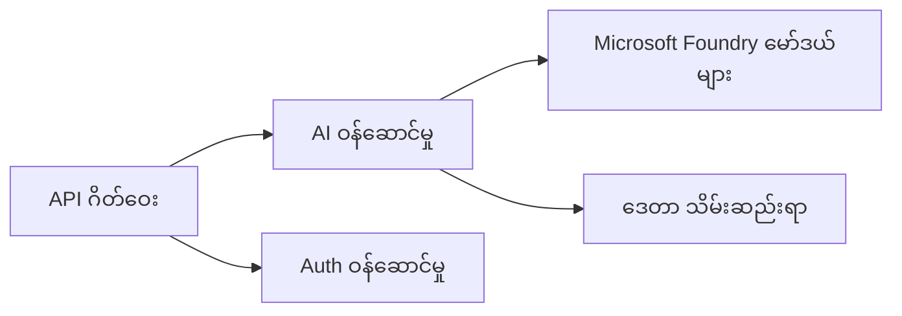
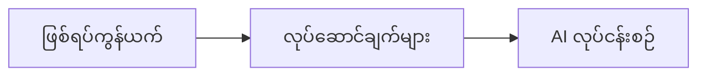

# အခန်း ၈: ထုတ်လုပ်မှုနှင့် စီးပွားရေး ပုံစံများ

**📚 သင်တန်း**: [AZD စတင်သူများအတွက်](../../README.md) | **⏱️ ကြာချိန်**: 2-3 နာရီ | **⭐ ရှုပ်ထွေးမှု**: အဆင့်မြင့်

---

## အကျဉ်းချုပ်

ဤအခန်းတွင် အလုပ်သုံး အဆင်သင့်ဖြစ်သော တင်ပို့မှု ပုံစံများ၊ လုံခြုံရေး တင်းကျပ်မှုများ၊ စောင့်ကြည့်မှုနှင့် ထုတ်လုပ်ရေး AI အလုပ်စဉ်များအတွက် ကုန်ကျစရိတ် အကောင်းမြှင့်တင်ခြင်းတို့ကို ဖော်ပြပါသည်။

> မတ်လ ၂၀၂၆ တွင် `azd 1.23.12` ဖြင့် စိစစ်ပြီးဖြစ်ပါသည်။

## သင်ယူရမည့် ရည်မှန်းချက်များ

ဤအခန်းကို ပြီးမြောက်ပါက သင်သည် -
- မျိုးစုံ နယ်ပယ်များတွင် ပြန်လည်ခံနိုင်သော အပလီကေးရှင်းများကို တင်ပို့နိုင်မည်။
- လုပ်ငန်းအဆင့် လုံခြုံရေး ပုံစံများကို အကောင်အထည်ဖော်နိုင်မည်။
- စုံလင်သော ကြီးကြပ်မှုကို ချိန်ညှိနိုင်မည်။
- အရွယ်အစားတိုးတွင် ကုန်ကျစရိတ်များကို အကောင်းဆုံး စီမံနိုင်မည်။
- AZD ဖြင့် CI/CD ပိုင်းလိုင်းများကို တပ်ဆင်နိုင်မည်။

---

## 📚 သင်ခန်းစာများ

| # | သင်ခန်းစာ | ဖော်ပြချက် | အချိန် |
|---|--------|-------------|------|
| 1 | [ထုတ်လုပ်မှု AI လေ့ကျင့်ခန်းများ](production-ai-practices.md) | လုပ်ငန်းအဆင့် တင်ပို့မှု ပုံစံများ | 90 မိနစ် |

---

## 🚀 ထုတ်လုပ်မှု စစ်ဆေးစာရင်း

- [ ] မျိုးစုံနယ်မြေများတွင် ပြန်လည်ခံနိုင်သော တင်ပို့မှု
- [ ] အတည်ပြုရန် Managed identity အသုံးပြုခြင်း (key မလို)
- [ ] ကြီးကြပ်မှုအတွက် Application Insights
- [ ] ကုန်ကျစရိတ် ဘတ်ဂျက်များနှင့် သတိပေးချက်များကို ချိန်ညှိထားသည်
- [ ] လုံခြုံရေး စစ်ဆေးမှု ဖွင့်ထားသည်
- [ ] CI/CD ပိုင်းလိုင်း ထည့်သွင်းဆက်သွယ်မှု
- [ ] ဘေးအန္တရာယ် ပြန်လည်ကာကွယ်ရေး အစီအစဉ်

---

## 🏗️ ဖွဲ့စည်းပုံ ပုံစံများ

### ပုံစံ ၁: မိုက်ခရိုဆာဗစ် အခြေပြု AI


### ပုံစံ ၂: ဖြစ်ရပ်မူတည် AI


---

## 🔐 လုံခြုံရေး အကောင်းဆုံး လေ့ကျင့်မှုများ

```bicep
// Use managed identity
identity: {
  type: 'SystemAssigned'
}

// Private endpoints for AI services
properties: {
  publicNetworkAccess: 'Disabled'
  networkAcls: {
    defaultAction: 'Deny'
  }
}
```

---

## 💰 ကုန်ကျစရိတ် အကောင်းပြုခြင်း

| နည်းလမ်း | ချွေတာမှု |
|----------|---------|
| Scale ကို သုညအထိ လျော့ချခြင်း (Container Apps) | 60-80% |
| ဖွံ့ဖြိုးရေး(dev) အတွက် consumption tiers များကို အသုံးပြုခြင်း | 50-70% |
| အချိန်ဇယားအလိုက် တိုးချဲ့ခြင်း | 30-50% |
| ကြိုသိမ်းထားသော စွမ်းရည် | 20-40% |

```bash
# ဘတ်ဂျက် သတိပေးချက်များ သတ်မှတ်ပါ
az consumption budget create \
  --budget-name "AI-Budget" \
  --amount 500 \
  --category Cost \
  --time-grain Monthly
```

---

## 📊 ကြီးကြပ်မှု စီစဉ်ခြင်း

```bash
# လက်ရှိ လော့ဂ်များကို တိုက်ရိုက် ကြည့်ရှုရန်
azd monitor --logs

# Application Insights ကို စစ်ဆေးရန်
azd monitor --overview

# တိုင်းတာချက်များကို ကြည့်ရှုရန်
az monitor metrics list --resource <resource-id>
```

---

## 🔗 သွားလာမှု

| ဘက် | အခန်း |
|-----------|---------|
| **ယခင်** | [အခန်း ၇: ပြဿနာဖြေရှင်းခြင်း](../chapter-07-troubleshooting/README.md) |
| **သင်တန်းပြီးစီး** | [သင်တန်း မူလစာမျက်နှာ](../../README.md) |

---

## 📖 ဆက်စပ် အရင်းအမြစ်များ

- [AI Agents လမ်းညွှန်](../chapter-02-ai-development/agents.md)
- [Application Insights](../chapter-06-pre-deployment/application-insights.md)
- [Multi-Agent ဖြေရှင်းနည်းများ](../chapter-05-multi-agent/README.md)
- [မိုက်ခရိုဆာဗစ် ဥပမာ](../../examples/microservices/README.md)

---

<!-- CO-OP TRANSLATOR DISCLAIMER START -->
**Disclaimer**:
ဤစာရွက်စာတမ်းကို AI ဘာသာပြန်ဝန်ဆောင်မှု [Co-op Translator](https://github.com/Azure/co-op-translator) အသုံးပြု၍ ဘာသာပြန်ထားပါသည်။ ကျွန်ုပ်တို့သည် တိကျမှန်ကန်မှုအတွက် ကြိုးပမ်းကြပါသည်၊ သို့သော် အလိုအလျောက် ဘာသာပြန်ချက်များတွင် အမှားများ သို့မဟုတ် မှားယွင်းချက်များ ပါဝင်နိုင်ကြောင်း သတိပြုရမည်။ မူရင်းစာရွက်စာတမ်းကို မူလဘာသာဖြင့်သာ အာဏာပိုင် အချက်အလက်အဖြစ် ထည့်ဖြတ်ထားသင့်ပါသည်။ အရေးကြီးသော အချက်အလက်များအတွက် ပရော်ဖက်ရှင်နယ် လူသား ဘာသာပြန်ကို အကြံပြုပါသည်။ ဤဘာသာပြန်ချက်ကို အသုံးပြုခြင်းကြောင့် ဖြစ်ပေါ်လာသော နားမလည်မှုများ သို့မဟုတ် မမှန်ကန်သော အဓိပ္ပာယ်ယူချက်များအတွက် ကျွန်ုပ်တို့ တာဝန်မခံပါ။
<!-- CO-OP TRANSLATOR DISCLAIMER END -->