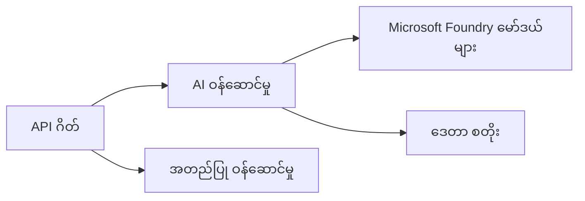
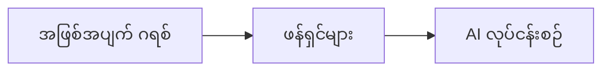

# အခန်း 8: ထုတ်လုပ်ရေးနှင့် စီးပွားရေးဆိုင်ရာ ပုံစံများ

**📚 သင်တန်း**: [AZD For Beginners](../../README.md) | **⏱️ ကြာချိန်**: 2-3 နာရီ | **⭐ ရှုပ်ထွေးမှု**: အဆင့်မြင့်

---

## အကျဉ်းချုံး

ဤအခန်းသည် စီးပွားရေးအသုံးပြုနိုင်သော တပ်ဆင်ပုံစံများ၊ လုံခြုံရေးအား တင်းတိမ်စေခြင်း၊ မော်နီတာလုပ်ဆောင်ခြင်းနှင့် ထုတ်လုပ်ရေး AI အလုပ်များအတွက် ကုန်ကျစရိတ် သက်သာစေရန် နည်းလမ်းများကို ဖော်ပြပါသည်။

## သင်ယူရမည့် ရည်မှန်းချက်များ

ဤအခန်းကို ပြီးမြောက်ပါက၊ သင်သည်:
- မျိုးစုံဒေသများတွင် တည်မြဲနိုင်သော အက်ပလီကေးရှင်းများ တပ်ဆင်နိုင်မည်
- စီးပွားရေးလုံခြုံရေး ပုံစံများ ကို အကောင်အထည်ဖော်နိုင်မည်
- ပြည့်စုံသော မော်နီတာ စနစ်များကို ညှိနှိုင်းတပ်ဆင်နိုင်မည်
- အရွယ်အစားကြီးများတွင် ကုန်ကျစရိတ် သက်သာစေရန် လုပ်ဆောင်နိုင်မည်
- AZD ဖြင့် CI/CD လမ်းကြောင်းများ တပ်ဆင်နိုင်မည်

---

## 📚 သင်ခန်းစာများ

| # | သင်ခန်းစာ | ဖော်ပြချက် | အချိန် |
|---|--------|-------------|------|
| 1 | [ထုတ်လုပ်ရေး AI လေ့ကျင့်နည်းများ](production-ai-practices.md) | စီးပွားရေးအတွက် တပ်ဆင်မှု ပုံစံများ | 90 မိနစ် |

---

## 🚀 ထုတ်လုပ်ရေး စစ်ဆေးစာရင်း

- [ ] တာခံနိုင်စေရေးအတွက် မျိုးစုံဒေသများတွင် တပ်ဆင်ခြင်း
- [ ] အတည်ပြုရေးအတွက် Managed identity ကို အသုံးပြုခြင်း (key မရှိ)
- [ ] မော်နီတာအတွက် Application Insights အသုံးပြုခြင်း
- [ ] ကုန်ကျစရိတ် ဘတ်ဂျက်များနှင့် အသိပေးချက်များ ဖန်တီးထားခြင်း
- [ ] လုံခြုံရေး စစ်ဆေးခြင်း ဖွင့်ထားခြင်း
- [ ] CI/CD လမ်းကြောင်း ပေါင်းစည်းထားခြင်း
- [ ] ဘေးအနုတ် ပြန်လည်ကယ်ဆယ်ရေး အစီအစဉ်

---

## 🏗️ ဖွဲ့စည်းပုံ ပုံစံများ

### ပုံစံ 1: မိုက်ခရိုဆာဗစ် AI


### ပုံစံ 2: ဖြစ်ရပ်အခြေပြု AI


---

## 🔐 လုံခြုံရေးအတွက် ဂရုပြုရန် အကောင်းဆုံး လက်တွေ့နည်းများ

```bicep
// Use managed identity
identity: {
  type: 'SystemAssigned'
}

// Private endpoints for AI services
properties: {
  publicNetworkAccess: 'Disabled'
  networkAcls: {
    defaultAction: 'Deny'
  }
}
```

---

## 💰 ကုန်ကျစရိတ် ထိရောက်စွာ လျော့ချခြင်း

| နည်းဗျူဟာ | လျော့ချမှု |
|----------|---------|
| စကေးကို သုညအထိ လျော့ချခြင်း (Container Apps) | 60-80% |
| ဖွံ့ဖြိုးရေးအတွက် စားသုံးမှု အဆင့်များ အသုံးပြုခြင်း | 50-70% |
| ဇယားအရ စကေးချိန်ညှိခြင်း | 30-50% |
| ကြိုတင် သိမ်းဆည်းထားသော စွမ်းဆောင်ရည် | 20-40% |

```bash
# ဘတ်ဂျက် အတွက် သတိပေးချက်များ သတ်မှတ်ပါ
az consumption budget create \
  --budget-name "AI-Budget" \
  --amount 500 \
  --category Cost \
  --time-grain Monthly
```

---

## 📊 မော်နီတာ စနစ် တပ်ဆင်ခြင်း

```bash
# လော့ဂ်များ တိုက်ရိုက် စီးဆင်းကြည့်ရန်
azd monitor --logs

# Application Insights ကို စစ်ဆေးရန်
azd monitor

# မက်ထရစ်များ ကြည့်ရန်
az monitor metrics list --resource <resource-id>
```

---

## 🔗 လမ်းညွှန်

| ဦးတည်ချက် | အခန်း |
|-----------|---------|
| **ယခင်** | [အခန်း 7: ပြဿနာရှာဖွေခြင်း](../chapter-07-troubleshooting/README.md) |
| **သင်တန်းပြီးမြောက်** | [သင်တန်း မူလစာမျက်နှာ](../../README.md) |

---

## 📖 ဆက်စပ် အရင်းအမြစ်များ

- [AI Agents လမ်းညွှန်](../chapter-02-ai-development/agents.md)
- [Application Insights](../chapter-06-pre-deployment/application-insights.md)
- [Multi-Agent ဖြေရှင်းချက်များ](../chapter-05-multi-agent/README.md)
- [မိုက်ခရိုဆာဗစ် ဥပမာ](../../examples/microservices/README.md)

---

<!-- CO-OP TRANSLATOR DISCLAIMER START -->
**Disclaimer**:
ဤစာရွက်စာတမ်းကို AI ဘာသာပြန်ဝန်ဆောင်မှုဖြစ်သော [Co-op Translator](https://github.com/Azure/co-op-translator) အား အသုံးပြု၍ ဘာသာပြန်ထားပါသည်။ ကျွန်ုပ်တို့သည် တိကျမှုကို အမြဲကြိုးစားကာ ဆောင်ရွက်ပါသော်လည်း အလိုအလျောက် ဘာသာပြန်ချက်များတွင် အမှားများ သို့မဟုတ် မတိကျချက်များ ပါဝင်နိုင်ကြောင်း ကျေးဇူးပြု၍ သိရှိထားပါ။ မူလစာရွက်စာတမ်းကို မူလဘာသာဖြင့် ရရှိသော အချက်အလက်ကို တရားဝင်အရင်းအမြစ်အဖြစ် သတ်မှတ်ရမည် ဖြစ်သည်။ အရေးကြီးသော အချက်အလက်များအတွက်သည် ကျွမ်းကျင်သော လူသား ဘာသာပြန်ဖြင့် ပြန်လည်စစ်ဆေးရန် အကြံပြုပါသည်။ ဤဘာသာပြန်ချက် အသုံးပြုမှုကြောင့် ဖြစ်ပေါ်လာနိုင်သည့် ထင်မြင်ချက်မတူမှုများ သို့မဟုတ် မှားယွင်းဖတ်ရှုမှုများအတွက် ကျွန်ုပ်တို့သည် တာဝန်မခံပါ။
<!-- CO-OP TRANSLATOR DISCLAIMER END -->