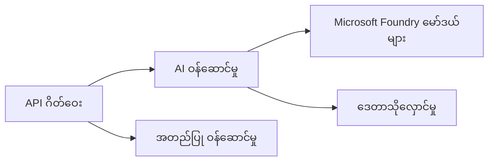
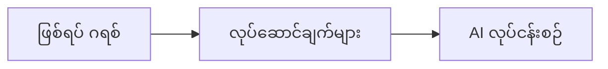

# အခန်း ၈: ထုတ်လုပ်မှုနှင့် စီးပွားရေး ပုံစံများ

**📚 သင်တန်း**: [AZD For Beginners](../../README.md) | **⏱️ ကာလ**: 2-3 hours | **⭐ အဆင့်**: အဆင့်မြင့်

---

## အကျဉ်းချုံး

ဤအခန်းသည် စီးပွားရေးအဆင့် ပြင်ဆင်ပြီး အသင့်ဖြန့်ချိနိုင်သည့် ဗဟိုကျသော ပုံစံများ၊ လုံခြုံရေး တင်းကျပ်ရေး၊ စောင့်ကြည့်မှုနှင့် ထုတ်လုပ်မှု AI အလုပ်စဉ်များအတွက် ကုန်ကျစရိတ် အကောင်းဆုံး စီမံခန့်ခွဲခြင်းတို့ကို ဖုံးလွှမ်းပါသည်။

> `azd 1.25.6` အပေါ် ဇွန် 2026 တွင် အတည်ပြုထားသည်။

## သင်ယူရမည့် ရည်မှန်းချက်များ

By completing this chapter, you will:
- ဒေသများစွာတွင် တည်ဆောက်ထားပြီး ပြန်လည်ခံနိုင်သော အက်ပလီကေးရှင်းများကို ဖြန့်ချိနိုင်မည်
- စီးပွားရေးအဆင့် လုံခြုံရေး ပုံစံများကို အကောင်အထည်ဖော်နိုင်မည်
- ကျယ်ပြန့်စုံလင်သော မော်နီတာစနစ်ကို ပြင်ဆင်နိုင်မည်
- အရွယ်အစားကြီးစွာတွင် ကုန်ကျစရိတ်များကို အကောင်းဆုံး စီမံ၍ လျှော့ချနိုင်မည်
- AZD ဖြင့် CI/CD လမ်းကြောင်းများကို တပ်ဆင်နိုင်မည်

---

## 📚 သင်ခန်းစာများ

| # | သင်ခန်းစာ | ဖော်ပြချက် | အချိန် |
|---|--------|-------------|------|
| 1 | [Production AI Practices](production-ai-practices.md) | စီးပွားရေးအဆင့် ဖြန့်ချိမှုပုံစံများ | 90 မိနစ် |

---

## 🚀 ထုတ်လုပ်မှု စစ်ဆေးစာရင်း

- [ ] ဒေသပေါင်းများစွာတွင် ပြန်လည်ခံနိုင်သော ဖြန့်ချိမှု
- [ ] အထောက်အထားအတွက် Managed identity ကို အသုံးပြုပါ (key မလိုအပ်)
- [ ] မော်နီတာအတွက် Application Insights
- [ ] ကုန်ကျစရိတ် ဘတ်ဂျက်နှင့် သတိပေးချက်များ ပြင်ဆင်ထားပါ
- [ ] လုံခြုံရေး စစ်ဆေးမှု ဖွင့်ထားပါ
- [ ] CI/CD လမ်းကြောင်း ပေါင်းစည်းခြင်း
- [ ] ဘေးအန္တရာယ် ပြန်လည်ကောင်းမွန်ရေး အစီအစဉ်

---

## 🏗️ မဟာဗျူဟာ ပုံစံများ

### ပုံစံ ၁: မိုက်ခရိုဆာဗစ် AI



### ပုံစံ ၂: အဖြစ်အပျက် ဦးတည်သော AI



---

## 🔐 လုံခြုံရေး အကောင်းဆုံး လုပ်နည်းများ

```bicep
// Use managed identity
identity: {
  type: 'SystemAssigned'
}

// Private endpoints for AI services
properties: {
  publicNetworkAccess: 'Disabled'
  networkAcls: {
    defaultAction: 'Deny'
  }
}
```

---

## 💰 ကုန်ကျစရိတ် ညှိနှိုင်းခြင်း

| မဟာဗျူဟာ | လျှော့ချနိုင်မှု |
|----------|---------|
| သုံးစွဲမှုကို သုဏ္ဏအထိ လျှော့ချခြင်း (Container Apps) | 60-80% |
| ဖွံ့ဖြိုးရေးအတွက် သုံးစွဲမှု အဆင့်များကို အသုံးပြုပါ | 50-70% |
| အချိန်ဇယားအရ ထိန်းချုပ်၍ ဆွဲထုတ်ခြင်း | 30-50% |
| ကြိုသတ်မှတ်ထားသော စွမ်းဆောင်ရည် | 20-40% |

```bash
# ဘတ်ဂျက် သတိပေးချက်များ သတ်မှတ်ပါ
az consumption budget create \
  --budget-name "AI-Budget" \
  --amount 500 \
  --category Cost \
  --time-grain Monthly
```

---

## 📊 စောင့်ကြည့်မှု ဆက်တင်

```bash
# လော့ဂ်များ စီးဆင်းကြည့်ရန်
azd monitor --logs

# Application Insights ကို စစ်ဆေးပါ
azd monitor --overview

# မက်ထရစ်များ ကြည့်ရန်
az monitor metrics list --resource <resource-id>
```

---

## 🔗 လမ်းညွှန်

| ဘက် | အခန်း |
|-----------|---------|
| **ယခင်** | [အခန်း ၇: ပြဿနာ ဖြေရှင်းခြင်း](../chapter-07-troubleshooting/README.md) |
| **သင်တန်း ပြီးဆုံး** | [သင်တန်း မူလစာမျက်နှာ](../../README.md) |

---

## 📖 ဆက်စပ် အရင်းအမြစ်များ

- [AI Agents Guide](../chapter-02-ai-development/agents.md)
- [Application Insights](../chapter-06-pre-deployment/application-insights.md)
- [Multi-Agent Solutions](../chapter-05-multi-agent/README.md)
- [Microservices Example](../../examples/microservices/README.md)

---

<!-- CO-OP TRANSLATOR DISCLAIMER START -->
**ပြောကြားချက်**
ဤစာတမ်းကို AI ဘာသာပြန်ဝန်ဆောင်မှု [Co-op Translator](https://github.com/Azure/co-op-translator) အသုံးပြု၍ ဘာသာပြန်ထားပါသည်။ ကျွန်ုပ်တို့သည် တိကျမှန်ကန်မှုအတွက် ကြိုးပမ်းနေသော်လည်း၊ စက်ကိရိယာဘာသာပြန်ခြင်းများတွင် အမှားများ သို့မဟုတ် မှားယွင်းချက်များ ပါဝင်နိုင်ကြောင်း သတိပြုပါရန် လိုအပ်ပါသည်။ မူလစာတမ်းကို မူရင်းဘာသာဖြင့်သာ ယုံကြည်စိတ်ချရသော အချက်အလက်အဖြစ် သတ်မှတ်သင့်သည်။ အရေးကြီးသည့် သတင်းအချက်အလက်များအတွက် ပရော်ဖက်ရှင်နယ် လူသားဘာသာပြန်သူဝန်ဆောင်မှုကို အကြံပြုပါသည်။ ဤဘာသာပြန်ချက်ကို အသုံးပြုခြင်းမှ ဖြစ်ပေါ်လာသော နားလည်မှုကွာခြားမှုများ သို့မဟုတ် မမှန်ကန်သော အသုံးပြုမှုများအတွက် ကျွန်ုပ်တို့ တာဝန်မခံပါ။
<!-- CO-OP TRANSLATOR DISCLAIMER END -->