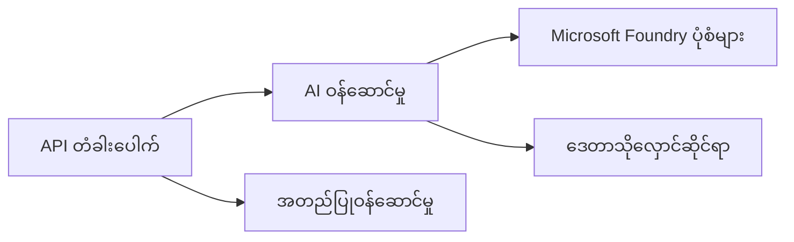
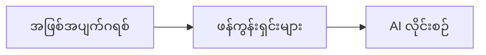

# အခန်း ၈: ထုတ်လုပ်မှုနှင့် စီးပွားဖြစ်ပုံစံများ

**📚 သင်တန်း**: [AZD အတွက် စတင်သူများ](../../README.md) | **⏱️ ကြာချိန်**: ၂-၃ နာရီ | **⭐ ကိန်းရောင့်**: အဆင့်မြင့်

---

## အကျဉ်းချုပ်

ဤအခန်းတွင် စီးပွားရေးလုပ်ငန်းအဆင့်သင့် ဖြန့်ဖြူးမှု ပုံစံများ၊ လုံခြုံရေး တင်းကျပခြင်း၊ စောင့်ကြည့်ရေး နှင့် ထုတ်လုပ်မှု AI လုပ်ငန်းဖော်ရွေမှုများအတွက် စွမ်းဆောင်မှုတိုးတက်စေခြင်းနှင့် စရိတ်မြှင့်တင်မှု များကို တင်ပြပါသည်။

> ၂၀၂၆ ခုနှစ် ဇူလိုင်တွင် `azd 1.27.1` ဖြင့် အတည်ပြုထားသည်။

## သင်ယူရမည့် ရည်မှန်းချက်များ

ဤအခန်းကို ပြီးစီးသည်နှင့်အမျှ၊ သင်သည်-
- ဒေသအများကြီးတွင် ထိန်းသိမ်းအားအရှိဆုံး လျှောက်လွှာများ ဖြန့်ထားနိုင်မည်။
- စီးပွားရေး လုံခြုံရေး ပုံစံများ ကို အကောင်အထည်ဖော်နိုင်မည်။
- စုံလင်သော စောင့်ကြည့်ရေးကို ပြင်ဆင်နိုင်မည်။
- ပမာဏအတိုင်း စရိတ်များကို တိုးတက် စီမံနိုင်မည်။
- AZD ဖြင့် CI/CD စီးရီးများ ဆက်သွယ် တပ်ဆင်နိုင်မည်။

---

## 📚 သင်ခန်းစာများ

| # | သင်ခန်းစာ | ဖော်ပြချက် | အချိန် |
|---|--------|-------------|------|
| 1 | [ထုတ်လုပ်မှု AI လေ့ကျင့်မှုများ](production-ai-practices.md) | စီးပွားရေး ဖြန့်ဖြူးမှု ပုံစံများ | ၉၀ မိနစ် |

---

## 🚀 ထုတ်လုပ်မှု စစ်ဆေးစာရင်း

- [ ] ပြန်လည်ခံနိုင်ရည်အတွက် ဒေသအများစု ဖြန့်ဖြူးခြင်း
- [ ] အသုံးပြုခွင့်အတည်ပြုရန် Managed identity (Key မလိုအပ်)
- [ ] စောင့်ကြည့်မှုအတွက် Application Insights သုံးခြင်း
- [ ] စရိတ် အတတ်နိုင်ဆုံးနှင့် သတိပေးချက်များ ပြင်ဆင်ပြီး
- [ ] လုံခြုံရေး စစ်ဆေးခြင်း ဖွင့်ထားခြင်း
- [ ] CI/CD စီးရီးပေါင်းစည်းထားခြင်း
- [ ] ဘေးအန္တရာယ် ကာကွယ် ပန်းကန်အတွက် စီမံချက်

---

## 🏗️ စက်မှုဇုန် ပုံစံများ

### ပုံစံ ၁: Microservices AI



### ပုံစံ ၂: ဖြစ်ပွားမှု ဦးတည်သော AI



---

## 🔐 လုံခြုံရေးအကောင်းဆုံးလေ့ကျင့်မှုများ

```bicep
// Use managed identity
identity: {
  type: 'SystemAssigned'
}

// Private endpoints for AI services
properties: {
  publicNetworkAccess: 'Disabled'
  networkAcls: {
    defaultAction: 'Deny'
  }
}
```

---

## 💰 စရိတ် ထိရောက်စွာ အသုံးပြုခြင်း

| မဟာဗျူဟာ | သက်သာမှု |
|----------|---------|
| Zero သို့ ဖြည့်စွက်ခြင်း (Container Apps) | ၆၀-၈၀% |
| ဖွံ့ဖြိုးရေးအတွက် Consumption အဆင့်များ အသုံးပြုခြင်း | ၅၀-၇၀% |
| အချိန်ဇယားအရ ချိန်ညှိခြင်း | ၃၀-၅၀% |
| ကြိုတင်ထားသော စွမ်းဆောင်ရည် | ၂၀-၄၀% |

```bash
# ဘဏ်သုံးစွဲမှု အသိပေးချက်များ သတ်မှတ်ပါ
az consumption budget create \
  --budget-name "AI-Budget" \
  --amount 500 \
  --category Cost \
  --time-grain Monthly
```

---

## 📊 စောင့်ကြည့်မှု ပြင်ဆင်ခြင်း

```bash
# စီးဆင်းနေသော မှတ်တမ်းများ
azd monitor --logs

# Application Insights ကိုစစ်ဆေးပါ
azd monitor --overview

# မက်ထရစ်များကိုကြည့်ရှုပါ
az monitor metrics list --resource <resource-id>
```

---

## 🔗 လမ်းညွှန်ချက်

| အရပ် | အခန်း |
|-----------|---------|
| **နောင်တစ်ခုမှ** | [အခန်း ၇: ပြဿနာရှာဖွေခြင်း](../chapter-07-troubleshooting/README.md) |
| **သင်တန်းပြီးဆုံး** | [သင်တန်း မူလစာမျက်နှာ](../../README.md) |

---

## 📖 ဆက်စပ်ရင်းမြစ်များ

- [AI Agents လမ်းညွှန်](../chapter-02-ai-development/agents.md)
- [Application Insights](../chapter-06-pre-deployment/application-insights.md)
- [Multi-Agent ဖြေရှင်းချက်များ](../chapter-05-multi-agent/README.md)
- [Microservices ဥပမာ](../../examples/microservices/README.md)

---

<!-- CO-OP TRANSLATOR DISCLAIMER START -->
**ပြောကြားချက်**
ဤစာတမ်းကို AI ဘာသာပြန်ဝန်ဆောင်မှု [Co-op Translator](https://github.com/Azure/co-op-translator) အသုံးပြု၍ ဘာသာပြန်ထားပါသည်။ ကျွန်ုပ်တို့သည် တိကျမှန်ကန်မှုအတွက် ကြိုးပမ်းနေသော်လည်း၊ စက်ကိရိယာဘာသာပြန်ခြင်းများတွင် အမှားများ သို့မဟုတ် မှားယွင်းချက်များ ပါဝင်နိုင်ကြောင်း သတိပြုပါရန် လိုအပ်ပါသည်။ မူလစာတမ်းကို မူရင်းဘာသာဖြင့်သာ ယုံကြည်စိတ်ချရသော အချက်အလက်အဖြစ် သတ်မှတ်သင့်သည်။ အရေးကြီးသည့် သတင်းအချက်အလက်များအတွက် ပရော်ဖက်ရှင်နယ် လူသားဘာသာပြန်သူဝန်ဆောင်မှုကို အကြံပြုပါသည်။ ဤဘာသာပြန်ချက်ကို အသုံးပြုခြင်းမှ ဖြစ်ပေါ်လာသော နားလည်မှုကွာခြားမှုများ သို့မဟုတ် မမှန်ကန်သော အသုံးပြုမှုများအတွက် ကျွန်ုပ်တို့ တာဝန်မခံပါ။
<!-- CO-OP TRANSLATOR DISCLAIMER END -->