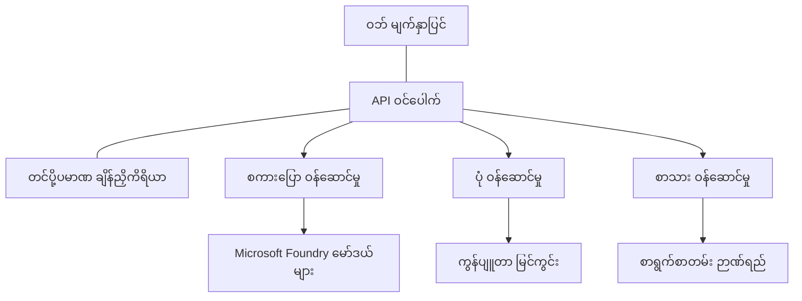

# AZD ဖြင့် ထုတ်လုပ်ရေး AI အလုပ်များ အတွက် အကောင်းဆုံး လက်တွေ့လမ်းညွှန်များ

**အခန်း လမ်းညွှန်:**
- **📚 သင်တန်း မူလစာမျက်နှာ**: [AZD အစပြုသူများအတွက်](../../README.md)
- **📖 လက်ရှိ အခန်း**: အခန်း 8 - ထုတ်လုပ်ရေးနှင့် စီးပွားရေး ပုံစံများ
- **⬅️ ယခင် အခန်း**: [အခန်း 7: ပြဿနာရှာဖွေခြင်း](../chapter-07-troubleshooting/debugging.md)
- **⬅️ ဆက်စပ် အရာများ**: [AI လက်တွေ့ လေ့လာခန်း](ai-workshop-lab.md)
- **🎯 သင်တန်း ပြီးစီး**: [AZD အစပြုသူများအတွက်](../../README.md)

## အကျဉ်းချုံး

ဤလမ်းညွှန်သည် Azure Developer CLI (AZD) ကို အသုံးပြု၍ ထုတ်လုပ်ရေးအဆင်သင့် AI အလုပ်များ တင်သွင်းရာတွင် လိုက်နာရမည့် စုံလင်သော အကောင်းဆုံး လမ်းညွှန်ချက်များကို ပေးသည်။ Microsoft Foundry Discord အသိုင်းအဝိုင်းနှင့် အဖြစ်မှန် ဖောက်သည် တင်သွင်းမှုများမှ ရရှိသော အကြံပြုချက်များအပေါ် အခြေခံပြီး၊ ဤလမ်းညွှန်များသည် ထုတ်လုပ်ရေး AI စနစ်များတွင် အများဆုံး ကြုံတွေ့ရသော အခက်အခဲများကို ကိုင်တွယ်ပေးသည်။

## ဖြေရှင်းပေးသည့် အဓိက အခက်အခဲများ

အသိုင်းအဝိုင်း ဆန္ဒ မဲပေးမှု ရလဒ်များအရ developer များ ကြုံတွေ့ရသော ထိပ်တန်း ချဉ်းကပ်မှုများမှာ အောက်ပါအတိုင်း ဖြစ်ပါသည်။

- **45%** က မျိုးစုံ ဝန်ဆောင်မှုများပါသော AI တင်သွင်းမှုများ ဖြေလှည်ရာတွင် အခက်အခဲရှိသည်
- **38%** က လက်မှတ်များနှင့် စျေးကွက်မှတ်ပုံတင် (credential and secret) စီမံခန့်ခွဲမှု နှင့်ပတ်သက်၍ ပြဿနာရှိသည်  
- **35%** က ထုတ်လုပ်ရေးအဆင်သင့်ဖြစ်အောင်နှင့် များပြားစွာ တိုးချဲ့နိုင်ရေးကို ခက်ခဲလို့ တွေ့သည်
- **32%** က ကုန်ကျစရိတ် tối ưu ညွှန်ကြားချက်များလိုအပ်သည်
- **29%** က မီတာခြင်းနှင့် ပြဿနာရှာဖွေရေးကို တိုးတက်စေရန် လိုအပ်သည်

## ထုတ်လုပ်ရေး AI အတွက် ဆောက်လုပ်ရေး ပုံစံများ

### ပုံစံ 1: မိုက်ခရိုဆာဗစ် (Microservices) AI အဆောက်အအုံ

**အသုံးပြုရန်အချိန်**: လုပ်ဆောင်နိုင်စွမ်းများ များစွာ ပါဝင်သည့် ရှုပ်ထွေးသော AI အက်ပ်များ



**AZD အကောင်အထည်ဖော်ခြင်း**:

```yaml
# azure.yaml
name: enterprise-ai-platform
services:
  web:
    project: ./web
    host: staticwebapp
  api-gateway:
    project: ./api-gateway
    host: containerapp
  chat-service:
    project: ./services/chat
    host: containerapp
  vision-service:
    project: ./services/vision
    host: containerapp
  text-service:
    project: ./services/text
    host: containerapp
```

### ပုံစံ 2: ဖြစ်ရပ်-မောင်းနှင်သည့် AI ပြုလုပ်စဉ်

**အသုံးပြုရန်အချိန်**: အစုလိုက် လုပ်ဆောင်ချက်များ (batch processing), စာရွက်စာတမ်း စိစစ်ခြင်း, အဆက်မပြတ် အလုပ်စဉ်များ (async workflows)

```bicep
// Event Hub for AI processing pipeline
resource eventHub 'Microsoft.EventHub/namespaces@2023-01-01-preview' = {
  name: eventHubNamespaceName
  location: location
  sku: {
    name: 'Standard'
    tier: 'Standard'
    capacity: 1
  }
}

// Service Bus for reliable message processing
resource serviceBus 'Microsoft.ServiceBus/namespaces@2022-10-01-preview' = {
  name: serviceBusNamespaceName
  location: location
  sku: {
    name: 'Premium'
    tier: 'Premium'
    capacity: 1
  }
}

// Function App for processing
resource functionApp 'Microsoft.Web/sites@2023-01-01' = {
  name: functionAppName
  location: location
  kind: 'functionapp,linux'
  properties: {
    siteConfig: {
      appSettings: [
        {
          name: 'FUNCTIONS_EXTENSION_VERSION'
          value: '~4'
        }
        {
          name: 'AZURE_OPENAI_ENDPOINT'
          value: '@Microsoft.KeyVault(VaultName=${keyVault.name};SecretName=openai-endpoint)'
        }
      ]
    }
  }
}
```

## AI ကိုယ်စားလှယ် ကျန်းမာရေးအကြောင်း စဉ်းစားခြင်း

ရိုးရာ ဝက်ဘ်အက်ပ်တစ်ခု ချိုးဖောက်ချိန်တွင် ပြသနာအကြောင်းရင်းများကို မြင်ရသည်—စာမျက်နှာတခု မဖွင့်ခြင်း၊ API တစ်ခု အမှား ပြန်လာခြင်း သို့မဟုတ် deployment တစ်ခု မအောင်မြင်ခြင်း။ AI အားဖြင့် လှုံ့ဆော်ထားသော အက်ပ်များသည် ထိုပုံစံများအားလုံးဖြင့်ချိုးကွဲနိုင်သလို၊ ထင်ရှားသော အမှားစာမက်ဆေ့ခ်ျ မပေါ်ပဲ ပြဿနာဖြစ်ပေါ်နိုင်သော ပုံစံပိုမိုပါရှိသည်။

ဤအပိုင်းသည် AI အလုပ်များကို ကြည့်ရှုစစ်ဆေးရာတွင် မည်နေရာကို ရှာဖွေကြည့်ရမည်ကို သိရှိစေရန် စိတ်ဓာတ် ပုံစံတစ်ခု တည်ဆောက်ရန် ကူညီပေးသည်။

### ကိုယ်စားလှယ် ကျန်းမာရေးသည် ရိုးရာ အက်ပ် ကျန်းမာရေးနှင့် မတူဘယ်လောက်ထိ ကွာဟမှုရှိသနည်း

ရိုးရာ အက်ပ်မှာ ဖြစ်တည်နေသည် သို့မဟုတ် မဖြစ်တော့ပါ—ဟုတ်/မဟုတ် လို့ ရှင်းလင်းသည်။ AI ကိုယ်စားလှယ်တစ်ခုကတော့ လုပ်ဆောင်နေသည့်အတိုင်း မြင်နိုင်ဖြစ်ပေမယ့် ရလဒ်များ သာမန်မဖြစ်နိုင်ပါ။ ကိုယ်စားလှယ် ကျန်းမာရေးကို အလွှာ နှစ်ခုအဖြစ် တွေးပါ။

| အလွှာ | ကြည့်ရန် အရာ | ကြည့်ရမည့် နေရာ |
|-------|--------------|---------------|
| **အဆောက်အအုံ ကျန်းမာရေး** | ဝန်ဆောင်မှုက အလုပ်လုပ်နေပါသလား? အရင်းအမြစ်များ ထောက်ပံ့ထားပါသလား? endpoint များကို ရောက်ရှိနိုင်ပါသလား? | `azd monitor`, Azure Portal ရဲ့ အရင်းအမြစ် ကျန်းမာရေး၊ container/app မှတ်တမ်းများ |
| **အပြုအမူ ကျန်းမာရေး** | ကိုယ်စားလှယ်သည် မှန်ကန်စွာ တုံ့ပြန်နေပါသလား? တုံ့ပြန်ချိန်များ သေချာရှိပါသလား? မော်ဒယ်ကို မှန်ကန်စွာ ခေါ်ယူနေပါသလား? | Application Insights trace များ၊ model call latency မီထရစ်များ၊ response quality မှတ်တမ်းများ |

အဆောက်အအုံ ကျန်းမာရေးမှာ သတ်မှတ်ထားသကဲ့သို့ ရိုးရာ ဖြစ်သည်—azd အက်ပ် အားလုံးအတွက် တူညီပါသည်။ အပြုအမူ ကျန်းမာရေးသည် AI အလုပ်များ ကာတွန်းထည့်သွင်းသည့် အသစ်သော အလွှာဖြစ်သည်။

### AI အက်ပ်များ မျှော်မှန်းသလို မလုပ်ဆောင်သောအခါ သေချာစို့ ရှာဖွေရမည့် နေရာများ

သင့် AI အက်ပ်က မျှော်မှန်းသလို ရလဒ် မထုတ်ပေးပါက၊ အောက်ပါ အတွေးအဆင့်စာရင်းကို ဆောင်ရွက်ပါ။

1. **အခြေခံအချက်များဖြင့် စတင်ပါ။** အက်ပ် အလုပ်လုပ်နေပါသလား? မှီခိုရန် ပရိုင်းတူးများကို ရောက်ရှိနိုင်ပါသလား? မည်သည့်အက်ပ်မဆို အတွက် `azd monitor` နှင့် resource health ကို စစ်ဆေးပါ။
2. **မော်ဒယ် ချိတ်ဆက်မှုကို စစ်ဆေးပါ။** သင့်အက်ပ်က မော်ဒယ်ကို အောင်မြင်စွာ ခေါ်ယူနိုင်ပါသလား? မော်ဒယ်ခေါ်ယူမှု မအောင်မြင်ခြင်း သို့မဟုတ် သတ်မှတ်ချိန် ကျော်လွန်ခေါ်ယူခြင်းများက AI အက်ပ်ပြဿနာများ၏ အများဆုံး အကြောင်းရင်းဖြစ်ပြီး သင်၏ application logs တွင် တွေ့ရပါလိမ့်မည်။
3. **မော်ဒယ်အတွက် ပေးပို့ထားသော အချက်အလက်ကို ကြည့်ပါ။** AI ရလဒ်များသည် input (prompt နှင့် ရယူထားသော context) ပေါ် မူတည်သည်။ output မှားနေပါက input က ပိုမိုဖြစ်နေသည်။ သင့်အက်ပ်က မော်ဒယ်ထံ သင့်တော်သော ဒေတာကို ပေးပို့ထားသလား စစ်ဆေးပါ။
4. **တုံ့ပြန်ချိန်ကို ပြန်စစ်ပါ။** မော်ဒယ်ခေါ်ယူမှုများသည် ယေဘုယျ API ခေါ်ယူမှုထက် သေးနည်းပင်နက်ဖြစ်နိုင်သည်။ အက်ပ်က စွန့်ဆိုင်းသလိုခံစားရပါက မော်ဒယ်တုံ့ပြန်ချိန်များ တိုးမြင့်နေပါသလား စစ်ဆေးပါ—ဒါက throttling, စွမ်းရည် ကန့်သတ်ချက်များ သို့မဟုတ် ဒေသအဆင့် ညီဆက်မှု ဒဏ်တွေ ဖြစ်နိုင်သည်။
5. **ကုန်ကျစရိတ် အချက်အလက်များကို ကြည့်ရှုပါ။** token အသုံးပြုမှု သို့မဟုတ် API ခေါ်ယူမှု များ အောက်မေ့ မထင်မှတ်ထားသော တက်လာမှုများရှိပါက loop တစ်ခု၊ prompt မှားဖွဲ့ထားခြင်း သို့မဟုတ် အလွန်များတဲ့ retry များ ဖြစ်နိုင်သည်။

သင် observability tooling များကို ချက်ချင်းကျွမ်းကျင်ရန် မလိုအပ်ပါ။ အဓိကယူဆချက်မှာ AI အက်ပ်များသည် ကြည့်နှင့်စောင့်ရှောက်ရန် အပြုအမူ အလွှာ တစ်ခု ထပ်မံ ထည့်သွင်းထားပြီး azd ၏ အတွင်းတွင် ပါဝင်သော မော်နီတာ (`azd monitor`) သည် အဆိုပါ အလွှာ နှစ်ခုလုံးကို စတင် စုံစမ်းရန် အစနေကျကို ပေးသည်။

---

## လုံခြုံရေး အကောင်းဆုံး လမ်းစဉ်များ

### 1. Zero-Trust လုံခြုံရေး မော်ဒယ်

**လက်တွေ့ကျအောင်ဆောင်ရွက်ခြင်းနည်းလမ်းများ**:
- မရှိမဖြစ် authentication မပါဘဲ service-to-service ဆက်သွယ်မှု မရှိစေရန်
- အားလုံးသော API ခေါ်ယူမှုများတွင် managed identities အသုံးပြုရန်
- private endpoints ဖြင့် ကွန်ယက် ခွဲခြားထားရန်
- လုံချုပ်ခွင့် (least privilege) အမျိုးအစား အာမခံချက်များ

```bicep
// Managed Identity for each service
resource chatServiceIdentity 'Microsoft.ManagedIdentity/userAssignedIdentities@2023-01-31' = {
  name: 'chat-service-identity'
  location: location
}

// Role assignments with minimal permissions
resource openAIUserRole 'Microsoft.Authorization/roleAssignments@2022-04-01' = {
  scope: openAIAccount
  name: guid(openAIAccount.id, chatServiceIdentity.id, openAIUserRoleDefinitionId)
  properties: {
    roleDefinitionId: subscriptionResourceId('Microsoft.Authorization/roleDefinitions', '5e0bd9bd-7b93-4f28-af87-19fc36ad61bd')
    principalId: chatServiceIdentity.properties.principalId
    principalType: 'ServicePrincipal'
  }
}
```

### 2. လုံခြုံစိတ်ချစေရန် Secret စီမံခန့်ခွဲမှု

**Key Vault ပေါင်းစည်းခြင်း ပုံစံ**:

```bicep
// Key Vault with proper access policies
resource keyVault 'Microsoft.KeyVault/vaults@2023-02-01' = {
  name: keyVaultName
  location: location
  properties: {
    tenantId: tenant().tenantId
    sku: {
      family: 'A'
      name: 'premium'  // Use premium for production
    }
    enableRbacAuthorization: true  // Use RBAC instead of access policies
    enablePurgeProtection: true    // Prevent accidental deletion
    enableSoftDelete: true
    softDeleteRetentionInDays: 90
  }
}

// Store all AI service credentials
resource openAIKeySecret 'Microsoft.KeyVault/vaults/secrets@2023-02-01' = {
  parent: keyVault
  name: 'openai-api-key'
  properties: {
    value: openAIAccount.listKeys().key1
    attributes: {
      enabled: true
    }
  }
}
```

### 3. ကွန်ယက် လုံခြုံရေး

**Private Endpoint ဖန်တီးပုံ**:

```bicep
// Virtual Network for AI services
resource virtualNetwork 'Microsoft.Network/virtualNetworks@2023-04-01' = {
  name: vnetName
  location: location
  properties: {
    addressSpace: {
      addressPrefixes: ['10.0.0.0/16']
    }
    subnets: [
      {
        name: 'ai-services-subnet'
        properties: {
          addressPrefix: '10.0.1.0/24'
          privateEndpointNetworkPolicies: 'Disabled'
        }
      }
      {
        name: 'app-services-subnet'
        properties: {
          addressPrefix: '10.0.2.0/24'
          delegations: [
            {
              name: 'Microsoft.Web/serverFarms'
              properties: {
                serviceName: 'Microsoft.Web/serverFarms'
              }
            }
          ]
        }
      }
    ]
  }
}

// Private endpoints for all AI services
resource openAIPrivateEndpoint 'Microsoft.Network/privateEndpoints@2023-04-01' = {
  name: '${openAIAccountName}-pe'
  location: location
  properties: {
    subnet: {
      id: virtualNetwork.properties.subnets[0].id
    }
    privateLinkServiceConnections: [
      {
        name: 'openai-connection'
        properties: {
          privateLinkServiceId: openAIAccount.id
          groupIds: ['account']
        }
      }
    ]
  }
}
```

## စွမ်းဆောင်ရည်နှင့် တိုးချဲ့နိုင်မှု

### 1. အလိုအလျောက် တိုးချဲ့မှု မဟာဗျူဟာများ

**Container Apps အလိုအလျောက် တိုးချဲ့မှု**:

```bicep
resource containerApp 'Microsoft.App/containerApps@2023-05-01' = {
  name: containerAppName
  location: location
  properties: {
    configuration: {
      ingress: {
        external: true
        targetPort: 8000
        transport: 'http'
      }
    }
    template: {
      scale: {
        minReplicas: 2  // Always have 2 instances minimum
        maxReplicas: 50 // Scale up to 50 for high load
        rules: [
          {
            name: 'http-scaling'
            http: {
              metadata: {
                concurrentRequests: '20'  // Scale when >20 concurrent requests
              }
            }
          }
          {
            name: 'cpu-scaling'
            custom: {
              type: 'cpu'
              metadata: {
                type: 'Utilization'
                value: '70'  // Scale when CPU >70%
              }
            }
          }
        ]
      }
    }
  }
}
```

### 2. Cache မဟာဗျူဟာများ

**AI တုံ့ပြန်မှုများအတွက် Redis Cache**:

```bicep
// Redis Premium for production workloads
resource redisCache 'Microsoft.Cache/redis@2023-04-01' = {
  name: redisCacheName
  location: location
  properties: {
    sku: {
      name: 'Premium'
      family: 'P'
      capacity: 1
    }
    enableNonSslPort: false
    minimumTlsVersion: '1.2'
    redisConfiguration: {
      'maxmemory-policy': 'allkeys-lru'
    }
    // Enable clustering for high availability
    redisVersion: '6.0'
    shardCount: 2
  }
}

// Cache configuration in application
var cacheConnectionString = '${redisCache.properties.hostName}:6380,password=${redisCache.listKeys().primaryKey},ssl=True,abortConnect=False'
```

### 3. လုပ်တင်ချိန်ချိန်နှင့် Traffic စီမံခြင်း

**WAF ပါရှိသည့် Application Gateway**:

```bicep
// Application Gateway with Web Application Firewall
resource applicationGateway 'Microsoft.Network/applicationGateways@2023-04-01' = {
  name: appGatewayName
  location: location
  properties: {
    sku: {
      name: 'WAF_v2'
      tier: 'WAF_v2'
      capacity: 2
    }
    webApplicationFirewallConfiguration: {
      enabled: true
      firewallMode: 'Prevention'
      ruleSetType: 'OWASP'
      ruleSetVersion: '3.2'
    }
    // Backend pools for AI services
    backendAddressPools: [
      {
        name: 'ai-services-pool'
        properties: {
          backendAddresses: [
            {
              fqdn: '${containerApp.properties.configuration.ingress.fqdn}'
            }
          ]
        }
      }
    ]
  }
}
```

## 💰 ကုန်ကျစရိတ် tối ưu ဆိုင်ရာ

### 1. အရင်းအမြစ် ကို သင့်တော်စွာ ထားရှိခြင်း (Right-Sizing)

**ပတ်ဝန်းကျင်-သတ်မှတ် ချိန်ညှိချက်များ**:

```bash
# ဖွံ့ဖြိုးရေး ပတ်ဝန်းကျင်
azd env new development
azd env set AZURE_OPENAI_SKU "S0"
azd env set AZURE_OPENAI_CAPACITY 10
azd env set AZURE_SEARCH_SKU "basic"
azd env set CONTAINER_CPU 0.5
azd env set CONTAINER_MEMORY 1.0

# ထုတ်လုပ်ရေး ပတ်ဝန်းကျင်
azd env new production
azd env set AZURE_OPENAI_SKU "S0"
azd env set AZURE_OPENAI_CAPACITY 100
azd env set AZURE_SEARCH_SKU "standard"
azd env set CONTAINER_CPU 2.0
azd env set CONTAINER_MEMORY 4.0
```

### 2. ကုန်ကျစရိတ် မျက်နှာစာနှင့် ငွေကြေး အထိမ်းအမှတ်များ

```bicep
// Cost management and budgets
resource budget 'Microsoft.Consumption/budgets@2023-05-01' = {
  name: 'ai-workload-budget'
  properties: {
    timePeriod: {
      startDate: '2024-01-01'
      endDate: '2024-12-31'
    }
    timeGrain: 'Monthly'
    amount: 2000  // $2000 monthly budget
    category: 'Cost'
    notifications: {
      warning: {
        enabled: true
        operator: 'GreaterThan'
        threshold: 80
        contactEmails: [
          'finance@company.com'
          'engineering@company.com'
        ]
        contactRoles: [
          'Owner'
          'Contributor'
        ]
      }
      critical: {
        enabled: true
        operator: 'GreaterThan'
        threshold: 95
        contactEmails: [
          'cto@company.com'
        ]
      }
    }
  }
}
```

### 3. Token အသုံးပြုမှု tối ưu ဖြေရှင်းချက်

**OpenAI ကုန်ကျစရိတ် စီမံခန့်ခွဲမှု**:

```typescript
// အပလီကေးရှင်းအဆင့်တွင် တိုကင်များကို ထိရောက်စွာ တိုးတက်အောင် ပြုလုပ်ခြင်း
class TokenOptimizer {
  private readonly maxTokens = 4000;
  private readonly reserveTokens = 500;
  
  optimizePrompt(userInput: string, context: string): string {
    const availableTokens = this.maxTokens - this.reserveTokens;
    const estimatedTokens = this.estimateTokens(userInput + context);
    
    if (estimatedTokens > availableTokens) {
      // ဆက်စပ်အကြောင်းအရာကို ဖြတ်တောက်ပါ၊ အသုံးပြုသူ၏ အဝင်ကို မဖြတ်ပါ
      context = this.truncateContext(context, availableTokens - this.estimateTokens(userInput));
    }
    
    return `${context}\n\nUser: ${userInput}`;
  }
  
  private estimateTokens(text: string): number {
    // အကြမ်းဖျင်း ခန့်မှန်းချက်: တိုကင် ၁ ခု ≈ အက္ခရာ ၄ ခု
    return Math.ceil(text.length / 4);
  }
}
```

## မော်နီတာနှင့် မြင်သာမှု (Observability)

### 1. စုံလင်သော Application Insights

```bicep
// Application Insights with advanced features
resource applicationInsights 'Microsoft.Insights/components@2020-02-02' = {
  name: applicationInsightsName
  location: location
  kind: 'web'
  properties: {
    Application_Type: 'web'
    WorkspaceResourceId: logAnalyticsWorkspace.id
    SamplingPercentage: 100  // Full sampling for AI apps
    DisableIpMasking: false  // Enable for security
  }
}

// Custom metrics for AI operations
resource aiMetricAlerts 'Microsoft.Insights/metricAlerts@2018-03-01' = {
  name: 'ai-high-error-rate'
  location: 'global'
  properties: {
    description: 'Alert when AI service error rate is high'
    severity: 2
    enabled: true
    scopes: [
      applicationInsights.id
    ]
    evaluationFrequency: 'PT1M'
    windowSize: 'PT5M'
    criteria: {
      'odata.type': 'Microsoft.Azure.Monitor.SingleResourceMultipleMetricCriteria'
      allOf: [
        {
          name: 'high-error-rate'
          metricName: 'requests/failed'
          operator: 'GreaterThan'
          threshold: 10
          timeAggregation: 'Count'
        }
      ]
    }
  }
}
```

### 2. AI-အထူး မော်နီတာ

**AI မီထရစ်များအတွက် အထူး ထိန်းချုပ် အချက်ပြ ပတ်လမ်းများ**:

```json
// Dashboard configuration for AI workloads
{
  "dashboard": {
    "name": "AI Application Monitoring",
    "tiles": [
      {
        "name": "OpenAI Request Volume",
        "query": "requests | where name contains 'openai' | summarize count() by bin(timestamp, 5m)"
      },
      {
        "name": "AI Response Latency",
        "query": "requests | where name contains 'openai' | summarize avg(duration) by bin(timestamp, 5m)"
      },
      {
        "name": "Token Usage",
        "query": "customMetrics | where name == 'openai_tokens_used' | summarize sum(value) by bin(timestamp, 1h)"
      },
      {
        "name": "Cost per Hour",
        "query": "customMetrics | where name == 'openai_cost' | summarize sum(value) by bin(timestamp, 1h)"
      }
    ]
  }
}
```

### 3. ကျန်းမာရေး စစ်ဆေးမှုများနှင့် Uptime မျက်နှာစာ

```bicep
// Application Insights availability tests
resource availabilityTest 'Microsoft.Insights/webtests@2022-06-15' = {
  name: 'ai-app-availability-test'
  location: location
  tags: {
    'hidden-link:${applicationInsights.id}': 'Resource'
  }
  properties: {
    SyntheticMonitorId: 'ai-app-availability-test'
    Name: 'AI Application Availability Test'
    Description: 'Tests AI application endpoints'
    Enabled: true
    Frequency: 300  // 5 minutes
    Timeout: 120    // 2 minutes
    Kind: 'ping'
    Locations: [
      {
        Id: 'us-east-2-azr'
      }
      {
        Id: 'us-west-2-azr'
      }
    ]
    Configuration: {
      WebTest: '''
        <WebTest Name="AI Health Check" 
                 Id="8d2de8d2-a2b0-4c2e-9a0d-8f9c9a0b8c8d" 
                 Enabled="True" 
                 CssProjectStructure="" 
                 CssIteration="" 
                 Timeout="120" 
                 WorkItemIds="" 
                 xmlns="http://microsoft.com/schemas/VisualStudio/TeamTest/2010" 
                 Description="" 
                 CredentialUserName="" 
                 CredentialPassword="" 
                 PreAuthenticate="True" 
                 Proxy="default" 
                 StopOnError="False" 
                 RecordedResultFile="" 
                 ResultsLocale="">
          <Items>
            <Request Method="GET" 
                     Guid="a5f10126-e4cd-570d-961c-cea43999a200" 
                     Version="1.1" 
                     Url="${webApp.properties.defaultHostName}/health" 
                     ThinkTime="0" 
                     Timeout="120" 
                     ParseDependentRequests="True" 
                     FollowRedirects="True" 
                     RecordResult="True" 
                     Cache="False" 
                     ResponseTimeGoal="0" 
                     Encoding="utf-8" 
                     ExpectedHttpStatusCode="200" 
                     ExpectedResponseUrl="" 
                     ReportingName="" 
                     IgnoreHttpStatusCode="False" />
          </Items>
        </WebTest>
      '''
    }
  }
}
```

## မည်သည့်ဘေးအန္တရာယ်ပျောက်ကင်းရေးနှင့် မြင့်မားသောရနိုင်မှု

### 1. မျိုးစုံ ဒေသများတွင် တင်သွင်းခြင်း

```yaml
# azure.yaml - Multi-region configuration
name: ai-app-multiregion
services:
  api-primary:
    project: ./api
    host: containerapp
    env:
      - AZURE_REGION=eastus
  api-secondary:
    project: ./api
    host: containerapp
    env:
      - AZURE_REGION=westus2
```

```bicep
// Traffic Manager for global load balancing
resource trafficManager 'Microsoft.Network/trafficManagerProfiles@2022-04-01' = {
  name: trafficManagerProfileName
  location: 'global'
  properties: {
    profileStatus: 'Enabled'
    trafficRoutingMethod: 'Priority'
    dnsConfig: {
      relativeName: trafficManagerProfileName
      ttl: 30
    }
    monitorConfig: {
      protocol: 'HTTPS'
      port: 443
      path: '/health'
      intervalInSeconds: 30
      toleratedNumberOfFailures: 3
      timeoutInSeconds: 10
    }
    endpoints: [
      {
        name: 'primary-endpoint'
        type: 'Microsoft.Network/trafficManagerProfiles/azureEndpoints'
        properties: {
          targetResourceId: primaryAppService.id
          endpointStatus: 'Enabled'
          priority: 1
        }
      }
      {
        name: 'secondary-endpoint'
        type: 'Microsoft.Network/trafficManagerProfiles/azureEndpoints'
        properties: {
          targetResourceId: secondaryAppService.id
          endpointStatus: 'Enabled'
          priority: 2
        }
      }
    ]
  }
}
```

### 2. ဒေတာ ဂိုဒေါင်နှင့် ပြန်လည်ရရှိရေး

```bicep
// Backup configuration for critical data
resource backupVault 'Microsoft.DataProtection/backupVaults@2023-05-01' = {
  name: backupVaultName
  location: location
  identity: {
    type: 'SystemAssigned'
  }
  properties: {
    storageSettings: [
      {
        datastoreType: 'VaultStore'
        type: 'LocallyRedundant'
      }
    ]
  }
}

// Backup policy for AI models and data
resource backupPolicy 'Microsoft.DataProtection/backupVaults/backupPolicies@2023-05-01' = {
  parent: backupVault
  name: 'ai-data-backup-policy'
  properties: {
    policyRules: [
      {
        backupParameters: {
          backupType: 'Full'
          objectType: 'AzureBackupParams'
        }
        trigger: {
          schedule: {
            repeatingTimeIntervals: [
              'R/2024-01-01T02:00:00+00:00/P1D'  // Daily at 2 AM
            ]
          }
          objectType: 'ScheduleBasedTriggerContext'
        }
        dataStore: {
          datastoreType: 'VaultStore'
          objectType: 'DataStoreInfoBase'
        }
        name: 'BackupDaily'
        objectType: 'AzureBackupRule'
      }
    ]
  }
}
```

## DevOps နှင့် CI/CD ပေါင်းစည်းမှု

### 1. GitHub Actions အလုပ်စဉ်

```yaml
# .github/workflows/deploy-ai-app.yml
name: Deploy AI Application

on:
  push:
    branches: [main]
  pull_request:
    branches: [main]

jobs:
  test:
    runs-on: ubuntu-latest
    steps:
      - uses: actions/checkout@v4
      
      - name: Setup Python
        uses: actions/setup-python@v4
        with:
          python-version: '3.11'
          
      - name: Install dependencies
        run: |
          pip install -r requirements.txt
          pip install pytest
          
      - name: Run tests
        run: pytest tests/
        
      - name: AI Safety Tests
        run: |
          python scripts/test_ai_safety.py
          python scripts/validate_prompts.py

  deploy-staging:
    needs: test
    if: github.event_name == 'pull_request'
    runs-on: ubuntu-latest
    steps:
      - uses: actions/checkout@v4
      
      - name: Setup AZD
        uses: Azure/setup-azd@v2
        
      - name: Login to Azure
        uses: azure/login@v1
        with:
          creds: ${{ secrets.AZURE_CREDENTIALS }}
          
      - name: Deploy to Staging
        run: |
          azd env select staging
          azd deploy

  deploy-production:
    needs: test
    if: github.ref == 'refs/heads/main'
    runs-on: ubuntu-latest
    steps:
      - uses: actions/checkout@v4
      
      - name: Setup AZD
        uses: Azure/setup-azd@v2
        
      - name: Login to Azure
        uses: azure/login@v1
        with:
          creds: ${{ secrets.AZURE_CREDENTIALS }}
          
      - name: Deploy to Production
        run: |
          azd env select production
          azd deploy
          
      - name: Run Production Health Checks
        run: |
          python scripts/health_check.py --env production
```

### 2. အခြေခံအဆောက်အအုံ စစ်ဆေးခြင်း

```bash
# scripts/validate_infrastructure.sh
#!/bin/bash

echo "Validating AI infrastructure deployment..."

# လိုအပ်သော ဝန်ဆောင်မှုအားလုံး လည်ပတ်နေကြောင်း စစ်ဆေးပါ
services=("openai" "search" "storage" "keyvault")
for service in "${services[@]}"; do
    echo "Checking $service..."
    if ! az resource list --resource-type "Microsoft.CognitiveServices/accounts" --query "[?contains(name, '$service')]" -o tsv; then
        echo "ERROR: $service not found"
        exit 1
    fi
done

# OpenAI မော်ဒယ် တပ်ဆင်မှုများကို အတည်ပြုပါ
echo "Validating OpenAI model deployments..."
models=$(az cognitiveservices account deployment list --name $AZURE_OPENAI_NAME --resource-group $AZURE_RESOURCE_GROUP --query "[].name" -o tsv)
if [[ ! $models == *"gpt-4.1-mini"* ]]; then
  echo "ERROR: Required model gpt-4.1-mini not deployed"
    exit 1
fi

# AI ဝန်ဆောင်မှု ချိတ်ဆက်နိုင်မှုကို စမ်းသပ်ပါ
echo "Testing AI service connectivity..."
python scripts/test_connectivity.py

echo "Infrastructure validation completed successfully!"
```

## ထုတ်လုပ်ရေး အဆင်သင့် စစ်ဆေးစာရင်း

### လုံခြုံရေး ✅
- [ ] All services use managed identities
- [ ] Secrets stored in Key Vault
- [ ] Private endpoints configured
- [ ] Network security groups implemented
- [ ] RBAC with least privilege
- [ ] WAF enabled on public endpoints

### စွမ်းဆောင်ရည် ✅
- [ ] Auto-scaling configured
- [ ] Caching implemented
- [ ] Load balancing setup
- [ ] CDN for static content
- [ ] Database connection pooling
- [ ] Token usage optimization

### မော်နီတာ ✅
- [ ] Application Insights configured
- [ ] Custom metrics defined
- [ ] Alerting rules setup
- [ ] Dashboard created
- [ ] Health checks implemented
- [ ] Log retention policies

### ယုံကြည်ရမှု (Reliability) ✅
- [ ] Multi-region deployment
- [ ] Backup and recovery plan
- [ ] Circuit breakers implemented
- [ ] Retry policies configured
- [ ] Graceful degradation
- [ ] Health check endpoints

### ကုန်ကျစရိတ် စီမံခန့်ခွဲမှု ✅
- [ ] Budget alerts configured
- [ ] Resource right-sizing
- [ ] Dev/test discounts applied
- [ ] Reserved instances purchased
- [ ] Cost monitoring dashboard
- [ ] Regular cost reviews

### ကိုက်ညီမှု (Compliance) ✅
- [ ] Data residency requirements met
- [ ] Audit logging enabled
- [ ] Compliance policies applied
- [ ] Security baselines implemented
- [ ] Regular security assessments
- [ ] Incident response plan

## စွမ်းဆောင်ရည် စမ်းသပ်ချက်များ

### ယေဘုယျ ထုတ်လုပ်ရေး မီထရစ်များ

| မီထရစ် | အလားတူ သတ်မှတ်ချက် | မော်နီတာနေရာ |
|--------|--------|------------|
| **တုံ့ပြန်ချိန်** | < 2 seconds | Application Insights |
| **ရရှိနိုင်မှု** | 99.9% | Uptime monitoring |
| **အမှားနှုန်း** | < 0.1% | Application logs |
| **Token အသုံးပြုမှု** | < $500/month | Cost management |
| **တပြိုင်နက် အသုံးပြုသူများ** | 1000+ | Load testing |
| **ပြန်လည်ရရှိချိန်** | < 1 hour | Disaster recovery tests |

### Load Testing

```bash
# AI အပလီကေးရှင်းများအတွက် ဖိအား (load) စမ်းသပ်ရေး စကရစ်ပ့်
python scripts/load_test.py \
  --endpoint https://your-ai-app.azurewebsites.net \
  --concurrent-users 100 \
  --duration 300 \
  --ramp-up 60
```

## 🤝 အသိုင်းအဝိုင်း မှ အကောင်းဆုံး လမ်းများ

Microsoft Foundry Discord အသိုင်းအဝိုင်း၏ အကြံပေးချက်များအပေါ် အခြေခံ၍ -

### အသိုင်းအဝိုင်းမှ ထိပ်တန်း အကြံပြုချက်များ

1. **သေးစွာ စတင်ပြီး တဖြည်းဖြည်း တိုးချဲ့ပါ။** အခြေခံ SKU များနှင့် စတင်ပြီး အသုံးပြုမှုအပေါ်မူတည်၍ တိုးချဲ့ပါ
2. **အားလုံးကို မော်နီတာ လုပ်ပါ။** ပထမနေ့စမှ စုံလင်သည့် မော်နီတာအားဖွဲ့စည်းပါ
3. **လုံခြုံရေးကို အော်တိုမိတ်လုပ်ပါ။** တူညီသော လုံခြုံရေးအချိုးအစားအတွက် infrastructure as code ကို အသုံးပြုပါ
4. **စမ်းသပ်မှုကို စုံစမ်းပါ။** သင့် pipeline အတွင်း AI-အထူး စမ်းသပ်မှုများ ထည့်ပါ
5. **ကုန်ကျစရိတ် အတွက် ကြိုတင်အစီအစဉ် ပြုစုပါ။** token အသုံးပြုမှုကို မျက်နှာပြင်တင်စောင့်ကြည့်ပြီး budget alerts များ စတင် ဆောင်ရွက်ပါ

### ရှောင်ကြဉ်သင့်သော အသားတင် လက်မှတ်များ

- ❌ ကုဒ်အတွင်း API keys များကို တိုက်ရိုက် ထည့်သွင်းထားခြင်း
- ❌ သင့်လျော်သော မော်နီတာ မတပ်ဆင်ခြင်း
- ❌ ကုန်ကျစရိတ် tối ưu အလေးမထားခြင်း
- ❌ ကာလရှည် မအောင်မြင်မှု စက်လည်မှု ကို စမ်းသပ်မထားခြင်း
- ❌ health checks မပါဘဲ တင်သွင်းခြင်း

## AZD AI CLI ဆုံးဖြတ်ချက်များနှင့် Extension များ

AZD သည် ထုတ်လုပ်ရေး AI အလုပ်စဉ်များကို ပိုမိုလွယ်ကူစေရန် AI-အထူး command များနှင့် extension များ တိုးချဲ့နေသည်။ ဤကိရိယာများက ဒေသီယဖွံ့ဖြိုးမှုနှင့် ထုတ်လုပ်ရေး deployment များအကြား အပြွန်ကို ဖြည်းဖြည်းချေဖျက်ပေးသည်။

### AI အတွက် AZD Extension များ

AZD သည် AI-အထူး စွမ်းရည်များ ထည့်သွင်းရန် extension စနစ်ကို အသုံးပြုသည်။ extension များကို 설치နှင့် စီမံရန်:

```bash
# ရနိုင်သည့် တိုးချဲ့မှုများအားလုံးကို စာရင်းပြပါ (AI အပါအဝင်)
azd extension list

# ထည့်သွင်းထားသော တိုးချဲ့မှုများ၏ အသေးစိတ်ကို စစ်ဆေးပါ
azd extension show azure.ai.agents

# Foundry agents တိုးချဲ့မှုကို ထည့်သွင်းပါ
azd extension install azure.ai.agents

# fine-tuning တိုးချဲ့မှုကို ထည့်သွင်းပါ
azd extension install azure.ai.finetune

# စိတ်ကြိုက် မော်ဒယ်များ တိုးချဲ့မှုကို ထည့်သွင်းပါ
azd extension install azure.ai.models

# ထည့်သွင်းထားသော တိုးချဲ့မှုများအားလုံးကို မြှင့်တင်ပါ
azd extension upgrade --all
```

**ရနိုင်သော AI extension များ:**

| Extension | ရည်ရွယ်ချက် | အခြေအနေ |
|-----------|---------|--------|
| `azure.ai.agents` | Foundry Agent Service ကို စီမံခန့်ခွဲခြင်း | Preview |
| `azure.ai.skills` | ပြန်လည်အသုံးပြုနိုင်သော agent skills များ | Preview |
| `azure.ai.connections` | Foundry connections (ဒေတာရင်းမြစ်များ၊ ကိရိယာများ) | Preview |
| `azure.ai.finetune` | Foundry မော်ဒယ် fine-tuning | Preview |
| `azure.ai.models` | Foundry စိတ်ကြိုက် မော်ဒယ်များ | Preview |
| `azure.coding-agent` | Coding agent ဖန်တီးမှု ထိန်းချုပ်မှု | Available |

> `azure.ai.agents` extension သည် လျင်မြန်စွာ တိုးတက်နေပါသည်။ ဤသင်တန်းကို `0.1.40-preview` နောက်ဆုံးပေါ်နှင့် သက်မှတ်ထားပါသည်။ နောက်ဆုံး command အစုကို ယူရန် `azd extension upgrade --all` ကို ဆောင်ရွက်ပြီး သင့်မှာထည့်ထားသော ဗားရှင်းကို အတည်ပြုရန် `azd extension show azure.ai.agents` ကို ဆောင်ရွက်ပါ။

**`skills` နဲ့ `connections` အကြောင်း အသေးစိတ် ဘာလဲ?**

agent ကိရိယာများနှင့်အတူပေါ်ပေါက်လာသည့် နှစ်ခုသော preview extension များရှိပြီး၊ ကိုယ့်ကိုယ်ကို စတင်လေ့လာနေသူတစ်ဦးအနေဖြင့် တောင်သိသင့်သည်။

- **`azure.ai.skills`** — “skill” ဆိုသည်မှာ ပြန်လည်အသုံးပြုနိုင်သော စွမ်းရည်တစ်ခုဖြစ်သည် (ထုပ်ပိုးထားသော ကိရိယာ သို့မဟုတ် အပြုအမူ) ကို agent များတွင် ထပ်မံရေးသားခြင်း မဖြစ်စေရန် တစ်ခါတည်း တပ်ဆင်နိုင်သည်။ ဥပမာ "စာရွက်စာတမ်းကို ရှာဖွေပါ" သို့မဟုတ် "မှာယူမှုကို ကြည့်ပါ" ဆိုသည့် skill များကို တစ်ကြိမ် သတ်မှတ်ထားပြီး agent အများသို့ ပြန်လည်အသုံးပြုနိုင်သည်။ ယင်းသည် multi-agent စနစ်များကို (အခန်း 5) တူညီစေပြီး copy-paste ဖြင့် ဖြစ်ပေါ်သော ပြဿနာများကို ရှောင်ရှားစေသည်။
- **`azure.ai.connections`** — “connection” ဆိုသည်မှာ သင့် Foundry project မှ agent များ လိုအပ်သော ပြင်ပ အရင်းအမြစ်တစ်ခုသို့ စီမံထားသော ချိတ်ဆက်မှုတစ်ခုဖြစ်သည်—ဒေတာရင်းမြစ် (ဥပမာ Azure AI Search), ကိရိယာ endpoint သို့မဟုတ် အခြားဝန်ဆောင်မှုတစ်ခု။ Connections များက agent များ ဘယ်နေရာကနေ ဘယ်လို ဒေတာ ရယူမလဲ ဆိုတာကို စုစည်းပေးသဖြင့် credential များနှင့် endpoint များကို code အတွင်း ပျက်ပြားနေခြင်း မဖြစ်အောင် တစ်နေရာတည်းမှာ အုပ်ချုပ်နိုင်သည်။

ပထမ agents များကို တင်သွင်းရန် အတွက် ဤ extension များ မပါဘဲရပါတယ်—သင်လေ့လာစဉ် `azure.ai.agents` အားသာ အသုံးပြုပါ။ agent များအကြား တူညီသော ကိရိယာကို ထပ်ထပ်အသုံးပြုနေပါက `skills` ကို အသုံးပြုရန် စဉ်းစားပါ၊ agent အနည်းငယ်က တူညီသော ဒေတာရင်းမြစ်ကို မျှဝေနေပါက `connections` ကို အသုံးပြုပါ။

### `azd ai agent init` ဖြင့် Agent ပရောဂျက် စတင်ဖန်တီးခြင်း

`azd ai agent init` command သည် Microsoft Foundry Agent Service နှင့် ပေါင်းစည်းထားသည့် ထုတ်လုပ်ရေးအဆင်သင့် AI agent ပရောဂျက် တစ်ခုကို scaffolding ဖန်တီးပေးသည်။

```bash
# အေးဂျင့် မက်နီဖက်မှ အေးဂျင့် ပရောဂျက်အသစ်ကို စတင်ဖန်တီးပါ
azd ai agent init -m <manifest-path-or-uri>

# တိကျသော Foundry ပရောဂျက်ကို စတင်ဖန်တီးပြီး ပစ်မှတ်ထားပါ
azd ai agent init -m agent-manifest.yaml --project-id <foundry-project-id>

# စိတ်ကြိုက် source ဖိုလ်ဒါကို သတ်မှတ်၍ စတင်ဖန်တီးပါ
azd ai agent init -m agent-manifest.yaml --src ./agents/my-agent

# Container Apps ကို ဟိုစ် အဖြစ် ပစ်မှတ်ထားပါ
azd ai agent init -m agent-manifest.yaml --host containerapp
```

**အဓိက flag များ:**

| Flag | ဖေါ်ပြချက် |
|------|-------------|
| `-m, --manifest` | ပရောဂျက်တွင် ထည့်ရန် agent manifest ၏ လမ်းကြောင်း သို့မဟုတ် URI |
| `-p, --project-id` | သင့် azd ပတ်ဝန်းကျင်အတွက် Microsoft Foundry ရှိပြီးသား Project ID |
| `-s, --src` | agent ဖော်ပြချက်ကို ဒေါင်းလုဒ်လုပ်ရန် ဒါရိုက်တာရီ (ပုံမှန်အားဖြင့် `src/<agent-id>`) |
| `--host` | ပုံမှန် host ကို အစားထိုးရန် (ဥပမာ `containerapp`) |
| `-e, --environment` | အသုံးပြုမည့် azd ပတ်ဝန်းကျင် |

**ထုတ်လုပ်ရေး အကြံပေးချက်**: `--project-id` ကိုအသုံးပြု၍ ရှိပြီးသား Foundry project တစ်ခုနှင့် တိုက်ရိုက် ချိတ်ဆက်ပါ၊ သင့် agent ကုဒ်နှင့် ကောင်းကင်အရင်းအမြစ်များကို အစပိုင်းမှတည်းချိတ်ထားပါ။

### Agent လည်ပတ်မှု အသက်တာ စီမံခြင်း

`init` အပြင် `azure.ai.agents` extension သည် hosted agent တစ်ရပ်၏ အသက်တာ စပစ္စည်းအတွက် စမ်းသပ်ခြင်း၊ အကဲဖြတ်ခြင်း၊ ညှိနှိုင်းခြင်း နှင့် ပင်ပန်းမီသည့်အချိန်တွင် ပယ်ချခြင်း အပါအဝင် command များ နှင့် ပံ့ပိုးမှု ပေးသည်။

```bash
# တပ်ဆင်ပြီးသား အေဂျင့်ကို ခေါ်ယူပြီး ဆာဗာ၏ တုံ့ပြန်ချိန်ကို ကြည့်ရှုပါ
# (စုစုပေါင်း နောက်ကျချိန်နှင့် ပထမ ဘိုက်ရသည့် အချိန်)
azd ai agent invoke

# ပြောင်းလဲမီ လက်ရှိ endpoint သတ်မှတ်ချက်ကို ပြပါ
azd ai agent endpoint show

# အေဂျင့်အတွက် အကဲဖြတ် ဒေတာစုကို ဖန်တီးပါ
azd ai agent eval generate --dataset ./eval/dataset.jsonl

# သင်၏ အကဲဖြတ်ဒေတာအပေါ် အခြေခံ၍ အေဂျင့် ညွှန်ကြားချက်များကို အကောင်းဆုံးချိန်ညှိပါ
# (agent project မှာ optimization_model တစ်ခု လိုအပ်သည်)
azd ai agent optimize

# ကုဒ်အခြေပြု ဟိုစ့်ထားသော အေဂျင့်၏ တပ်ဆင်ပြီးသား မူရင်းကို ဒေါင်းလုတ်ဆွဲပါ
# (SHA-256 အတည်ပြုမှုနှင့်)
azd ai agent code download

# ဟိုစ့်ထားသော အေဂျင့်နှင့် ၎င်း၏ ဗားရှင်းများအားလုံးကို ဖျက်ပါ
# (--force သည် လက်ရှိ ဖွင့်ထားသော session များကို ပိတ်ပစ်သည်)
azd ai agent delete --force
```

**အသက်တာလမ်းကြောင်း အကျဉ်းချုပ်:**

| အဆင့် | Command | ထုတ်လုပ်ရေး အသုံးအရှိဆုံး |
|-------|---------|----------------|
| စမ်းသပ် | `azd ai agent invoke` | ထုတ်ဝေမှုမပြုမီ တုံ့ပြန်ချက်များကို စစ်ဆေး၍ latency ကို တိုင်းတာပါ |
| စစ်ဆေး | `azd ai agent endpoint show` | endpoint auth/config ကို ပြန်ကြည့်ပါ; ချိုးကွဲမှုများကို အစောပိုင်း တွေ့ရှိနိုင်စေပါ |
| တိုင်းတာ | `azd ai agent eval generate` | အမှန်တကယ် trace များမှ ပြန်လည်အသုံးချနိုင်သော အကဲဖြတ် စာရင်း တည်ဆောက်ပါ |
| တိုးတက် | `azd ai agent optimize` | တိုင်းတာထားသော အရည်အသွေးအပေါ် instruction များကို ညှိနှိုင်းပါ |
| ပြန်လည်ရယူ | `azd ai agent code download` | အတိအကျ deployment ထဲမှ source ကို audit/rollback အတွက် ရယူပါ |
| ဖျက်သိမ်း | `azd ai agent delete --force` | agent နှင့် ၎င်း၏ ဗားရှင်းများကို သန့်ရှင်းစွာ ဖျက်ပေးပါ |

> ဤသည်တို့သည် preview commands ဖြစ်ပြီး extension ဗားရှင်းများ အလိုက် ပြောင်းလဲနိုင်သည်။ သင့်ထည့်ထားသော ဗားရှင်းအတွက် ရရှိနိုင်သော subcommands များကို ကြည့်ရန် `azd ai agent --help` ကို လည်ပတ်ပါ။

### Model Context Protocol (MCP) နှင့် `azd mcp`
AZD includes built-in MCP server support (Alpha), enabling AI agents and tools to interact with your Azure resources through a standardized protocol:

```bash
# သင့်ပရိုဂျက်အတွက် MCP ဆာဗာကို စတင်ပါ
azd mcp start

# ကိရိယာများကို ဖော်ဆောင်ရန် Copilot သဘောတူမှုဆိုင်ရာ လက်ရှိ စည်းမျဉ်းများကို ပြန်လည်သုံးသပ်ပါ
azd copilot consent list
```

The MCP server exposes your azd project context—environments, services, and Azure resources—to AI-powered development tools. This enables:

- **AI-assisted deployment**: ကုဒ်ရေးတဲ့ agent တွေကို သင်၏ project အခြေအနေကို မေးမြန်းခိုင်းပြီး deployment များကို စတင်ခိုင်းနိုင်စေခြင်း
- **Resource discovery**: AI tools များသည် သင်၏ project သုံးနေသော Azure resource များကို တွေ့ရှိနိုင်စေခြင်း
- **Environment management**: agent များက dev/staging/production environment များကို ပြောင်းရွှေ့နိုင်စေခြင်း

### Infrastructure Generation with `azd infra generate`

For production AI workloads, you can generate and customize Infrastructure as Code rather than relying on automatic provisioning:

```bash
# သင့်ပရောဂျက် သတ်မှတ်ချက်မှ Bicep/Terraform ဖိုင်များကို ဖန်တီးပါ
azd infra generate
```

This writes IaC to disk so you can:
- Review and audit infrastructure before deploying
- Add custom security policies (network rules, private endpoints)
- Integrate with existing IaC review processes
- Version control infrastructure changes separately from application code

### Production Lifecycle Hooks

AZD hooks let you inject custom logic at every stage of the deployment lifecycle—critical for production AI workflows:

```yaml
# azure.yaml - Production hooks example
name: ai-production-app
hooks:
  preprovision:
    shell: sh
    run: scripts/validate-quotas.sh    # Check AI model quota before provisioning
  postprovision:
    shell: sh
    run: scripts/configure-networking.sh  # Set up private endpoints
  predeploy:
    shell: sh
    run: scripts/run-ai-safety-tests.sh  # Run prompt safety checks
  postdeploy:
    shell: sh
    run: scripts/smoke-test.sh           # Verify agent responses post-deploy
services:
  agent-api:
    project: ./src/agent
    host: containerapp
    hooks:
      predeploy:
        shell: sh
        run: scripts/validate-model-access.sh  # Per-service hook
```

```bash
# ဖွံ့ဖြိုးရေးအချိန်တွင် သတ်မှတ်ထားသော hook တစ်ခုကို လက်ဖြင့် လည်ပတ်ပါ။
azd hooks run predeploy
```

**Recommended production hooks for AI workloads:**

| Hook | အသုံးပြုမှု |
|------|----------|
| `preprovision` | AI မော်ဒယ်စွမ်းရည်အတွက် subscription quota များကို စစ်ဆေးသတ်မှတ်ခြင်း |
| `postprovision` | private endpoint များကို ဖွဲ့စည်းခြင်း၊ မော်ဒယ် weight များကို တင်သွင်းခြင်း |
| `predeploy` | AI safety စမ်းသပ်မှုများကို ဆောင်ရွက်ခြင်း၊ prompt template များကို သက်မှတ်ခြင်း |
| `postdeploy` | agent တုံ့ပြန်ချက်များကို smoke test လုပ်ခြင်း၊ မော်ဒယ် ချိတ်ဆက်မှုကို အတည်ပြုခြင်း |

### CI/CD Pipeline Configuration

Use `azd pipeline config` to connect your project to GitHub Actions or Azure Pipelines with secure Azure authentication:

```bash
# CI/CD ပိုင်းလိုင်းကို အပြန်အလှန် မေးမြန်း၍ ဖွဲ့စည်းပါ
azd pipeline config

# သတ်မှတ်ထားသည့် ပံ့ပိုးသူနှင့် ဖွဲ့စည်းပါ
azd pipeline config --provider github
```

This command:
- Creates a service principal with least-privilege access
- Configures federated credentials (no stored secrets)
- Generates or updates your pipeline definition file
- Sets required environment variables in your CI/CD system

#### Step-by-step: your first GitHub Actions pipeline

Here's the full walkthrough from a working azd project to automated deployments on every push.

**1. Make sure your project is on GitHub**

```bash
git init
git add .
git commit -m "Initial azd project"
gh repo create my-ai-app --private --source=. --push
```

**2. Run pipeline config**

```bash
azd pipeline config --provider github
```

azd will, interactively:
- Ask which Azure subscription and environment to target
- Create an Entra **app registration + service principal** for the pipeline
- Set up **federated credentials (OIDC)**—so GitHub authenticates to Azure with short-lived tokens and **no secrets are stored**
- Push the required **variables** to your GitHub repo (`AZURE_CLIENT_ID`, `AZURE_TENANT_ID`, `AZURE_SUBSCRIPTION_ID`, `AZURE_ENV_NAME`, `AZURE_LOCATION`)

**3. Understand the generated workflow**

azd adds `.github/workflows/azure-dev.yml`. The key parts look like this:

```yaml
# .github/workflows/azure-dev.yml
on:
  push:
    branches: [ main ]
  workflow_dispatch:        # lets you run it manually too

permissions:
  id-token: write           # required for OIDC federated login
  contents: read

jobs:
  build:
    runs-on: ubuntu-latest
    env:
      AZURE_CLIENT_ID: ${{ vars.AZURE_CLIENT_ID }}
      AZURE_TENANT_ID: ${{ vars.AZURE_TENANT_ID }}
      AZURE_SUBSCRIPTION_ID: ${{ vars.AZURE_SUBSCRIPTION_ID }}
      AZURE_ENV_NAME: ${{ vars.AZURE_ENV_NAME }}
      AZURE_LOCATION: ${{ vars.AZURE_LOCATION }}
    steps:
      - uses: actions/checkout@v4
      - name: Install azd
        uses: Azure/setup-azd@v2
      - name: Log in with OIDC
        run: azd auth login --client-id "$AZURE_CLIENT_ID" --federated-credential-provider "github" --tenant-id "$AZURE_TENANT_ID"
      - name: Provision infrastructure
        run: azd provision --no-prompt
      - name: Deploy application
        run: azd deploy --no-prompt
```

**4. Verify it works**

```bash
# လုပ်ငန်းစဉ်ကို လှုံ့ဆော်ရန် ပြောင်းလဲမှုတစ်ခုကို တင်ပို့ပါ
git commit -am "Trigger pipeline" --allow-empty
git push
```

Open the **Actions** tab in your GitHub repo and watch the workflow run `azd provision` and `azd deploy` automatically.

> **Why federated credentials matter:** older pipelines stored a client secret in GitHub. OIDC federated credentials remove that secret entirely—GitHub requests a short-lived token at runtime, which is both more secure and nothing to rotate or leak. This is the default `azd pipeline config` sets up.

> **Secrets vs. variables:** non-sensitive identifiers (`AZURE_CLIENT_ID`, etc.) go in repo **variables**. If your app genuinely needs a secret at build time, add it as a GitHub **secret** and reference it with `${{ secrets.NAME }}`—but prefer Key Vault + managed identity at runtime (see [အပိုင်း 3](../chapter-03-configuration/authsecurity.md)).

**Production workflow with pipeline config:**

```bash
# ၁။ ထုတ်လုပ်ရေးပတ်ဝန်းကျင်ကို ပြင်ဆင်ပါ
azd env new production
azd env set AZURE_OPENAI_CAPACITY 100

# ၂။ pipeline ကို ပြင်ဆင်ပါ
azd pipeline config --provider github

# ၃။ main သို့ ကုဒ် push တစ်ကြိမ်ချင်းစီတိုင်း pipeline သည် azd deploy ကို အလိုအလျောက် ဆောင်ရွက်သည်
```

#### Step-by-step: Azure DevOps Pipelines

Prefer Azure DevOps over GitHub Actions? azd supports it natively with the `azdo` provider. The flow is nearly identical—azd generates the pipeline file, creates a service connection, and wires up authentication.

**1. Make sure you have an Azure DevOps project**

You need an organization and a project at `https://dev.azure.com/<your-org>`. Generate a Personal Access Token (PAT) with **Build (Read & execute)**, **Code (Read & write)**, and **Service Connections (Read, query & manage)** scopes—azd will prompt you for it.

**2. Configure the pipeline**

```bash
azd pipeline config --provider azdo
```

azd will:
- Ask for your Azure DevOps organization and project
- Create (or reuse) a **service connection** to Azure using a service principal
- Configure **workload identity federation (OIDC)** so no client secret is stored
- Commit an `azure-dev.yml` pipeline definition to your repo

**3. Review the generated `azure-dev.yml`**

azd writes a pipeline that provisions and deploys on every push to `main`:

```yaml
# azure-dev.yml
trigger:
  - main

pool:
  vmImage: ubuntu-latest

steps:
  - task: setup-azd@1
    displayName: Install azd

  - script: azd provision --no-prompt
    displayName: Provision Infrastructure
    env:
      AZURE_SUBSCRIPTION_ID: $(AZURE_SUBSCRIPTION_ID)
      AZURE_ENV_NAME: $(AZURE_ENV_NAME)
      AZURE_LOCATION: $(AZURE_LOCATION)

  - script: azd deploy --no-prompt
    displayName: Deploy Application
    env:
      AZURE_SUBSCRIPTION_ID: $(AZURE_SUBSCRIPTION_ID)
      AZURE_ENV_NAME: $(AZURE_ENV_NAME)
      AZURE_LOCATION: $(AZURE_LOCATION)
```

**4. Where the variables come from**

azd stores the environment values (`AZURE_ENV_NAME`, `AZURE_LOCATION`, `AZURE_SUBSCRIPTION_ID`) as a **variable group** in Azure DevOps so the pipeline can read them. You can view and edit them under **Pipelines → Library**.

> **Same OIDC benefit as GitHub:** the `azdo` provider also configures workload identity federation by default, so there's no client secret stored in the service connection—Azure DevOps exchanges a short-lived token at runtime. Pass `--auth-type client-credentials` only if your organization can't use OIDC yet.

**5. Run it**

```bash
git commit -am "Add Azure DevOps pipeline" --allow-empty
git push
```

Open **Pipelines** in Azure DevOps to watch `azd provision` and `azd deploy` run.

### Adding Components with `azd add`

Incrementally add Azure services to an existing project:

```bash
# အပြန်အလှန်နည်းဖြင့် ဝန်ဆောင်မှု အစိတ်အပိုင်း အသစ်ကို ထည့်ပါ
azd add
```

This is particularly useful for expanding production AI applications—for example, adding a vector search service, a new agent endpoint, or a monitoring component to an existing deployment.

## Additional Resources

- **Azure Well-Architected Framework**: [AI workload guidance](https://learn.microsoft.com/azure/well-architected/ai/)
- **Microsoft Foundry Documentation**: [Official docs](https://learn.microsoft.com/azure/ai-studio/)
- **Community Templates**: [Azure Samples](https://github.com/Azure-Samples)
- **Discord Community**: [#Azure channel](https://discord.gg/microsoft-azure)
- **Agent Skills for Azure**: [microsoft/github-copilot-for-azure on skills.sh](https://skills.sh/microsoft/github-copilot-for-azure) - Azure AI, Foundry, deployment, cost optimization, နှင့် diagnostics အတွက် 37 ခုသော ဖွင့်လှစ် agent skill များ။ သင်၏ editor တွင် တပ်ဆင်ပါ:
  ```bash
  npx skills add microsoft/github-copilot-for-azure
  ```

---

**Chapter Navigation:**
- **📚 Course Home**: [AZD For Beginners](../../README.md)
- **📖 Current Chapter**: Chapter 8 - Production & Enterprise Patterns
- **⬅️ Previous Chapter**: [အပိုင်း 7: Troubleshooting](../chapter-07-troubleshooting/debugging.md)
- **⬅️ Also Related**: [AI Workshop Lab](ai-workshop-lab.md)
- **� Course Complete**: [AZD For Beginners](../../README.md)

**Remember**: Production AI workloads require careful planning, monitoring, and continuous optimization. Start with these patterns and adapt them to your specific requirements.

---

<!-- CO-OP TRANSLATOR DISCLAIMER START -->
**ပြောကြားချက်**
ဤစာတမ်းကို AI ဘာသာပြန်ဝန်ဆောင်မှု [Co-op Translator](https://github.com/Azure/co-op-translator) အသုံးပြု၍ ဘာသာပြန်ထားပါသည်။ ကျွန်ုပ်တို့သည် တိကျမှန်ကန်မှုအတွက် ကြိုးပမ်းနေသော်လည်း၊ စက်ကိရိယာဘာသာပြန်ခြင်းများတွင် အမှားများ သို့မဟုတ် မှားယွင်းချက်များ ပါဝင်နိုင်ကြောင်း သတိပြုပါရန် လိုအပ်ပါသည်။ မူလစာတမ်းကို မူရင်းဘာသာဖြင့်သာ ယုံကြည်စိတ်ချရသော အချက်အလက်အဖြစ် သတ်မှတ်သင့်သည်။ အရေးကြီးသည့် သတင်းအချက်အလက်များအတွက် ပရော်ဖက်ရှင်နယ် လူသားဘာသာပြန်သူဝန်ဆောင်မှုကို အကြံပြုပါသည်။ ဤဘာသာပြန်ချက်ကို အသုံးပြုခြင်းမှ ဖြစ်ပေါ်လာသော နားလည်မှုကွာခြားမှုများ သို့မဟုတ် မမှန်ကန်သော အသုံးပြုမှုများအတွက် ကျွန်ုပ်တို့ တာဝန်မခံပါ။
<!-- CO-OP TRANSLATOR DISCLAIMER END -->