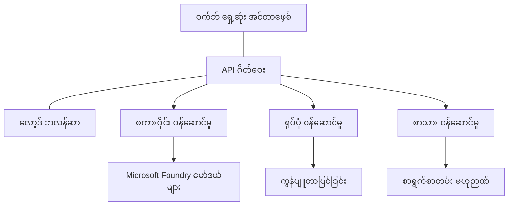

# Production AI Workload Best Practices with AZD

**Chapter Navigation:**
- **📚 Course Home**: [AZD For Beginners](../../README.md)
- **📖 Current Chapter**: Chapter 8 - Production & Enterprise Patterns
- **⬅️ Previous Chapter**: [Chapter 7: Troubleshooting](../chapter-07-troubleshooting/debugging.md)
- **⬅️ Also Related**: [AI Workshop Lab](ai-workshop-lab.md)
- **🎯 Course Complete**: [AZD For Beginners](../../README.md)

## Overview

ဒီလမ်းညွှန်စာတမ်းက Azure Developer CLI (AZD) ကို အသုံးပြုပြီး production အဆင့် သတ်မှတ်ထားသော AI workload များကို deploy လုပ်ရာတွင် လိုက်နာသင့်တဲ့ အကောင်းဆုံး အလေ့အကျင့်များကို စုံလင်စွာ ဖော်ပြထားသည်။ Microsoft Foundry Discord community မှ တုံ့ပြန်ချက်များနှင့် real-world client deployment များအပေါ် အခြေခံ၍၊ ဒီနည်းလမ်းများက production AI စနစ်များတွင် အထိတွေ့လေ့အများဆုံး အခက်အခဲများကို ဖြေရှင်းပေးသည်။

## Key Challenges Addressed

community poll ရလဒ်များအရ developer များရှေ့မက်ကြုံတွေ့ရတဲ့ ထိပ်တန်း အခက်အခဲများမှာ:

- **45%** တွင် multi-service AI deployments အားကြုံရသည်
- **38%** တွင် credential နှင့် secret စီမံခန့်ခွဲမှု ပြဿနာရှိသည်  
- **35%** တွင် production အဆင့်အသင့်ဖြစ်စေရန်နှင့် scaling ပြဿနာများရှိသည်
- **32%** တွင် ကုန်ကျစရိတ် အOptimization နည်းလမ်းများလိုအပ်သည်
- **29%** တွင် monitoring နှင့် troubleshooting တိုးတက်စေရန် လိုအပ်သည်

## Architecture Patterns for Production AI

### Pattern 1: Microservices AI Architecture

**When to use**: တစ်ခုထက်ပိုသော စွမ်းဆောင်ရည်များပါဝင်သည့် ရှုပ်ထွေးသော AI application များအတွက်


**AZD Implementation**:

```yaml
# azure.yaml
name: enterprise-ai-platform
services:
  web:
    project: ./web
    host: staticwebapp
  api-gateway:
    project: ./api-gateway
    host: containerapp
  chat-service:
    project: ./services/chat
    host: containerapp
  vision-service:
    project: ./services/vision
    host: containerapp
  text-service:
    project: ./services/text
    host: containerapp
```

### Pattern 2: Event-Driven AI Processing

**When to use**: Batch processing, document analysis, async workflows အတွက်

```bicep
// Event Hub for AI processing pipeline
resource eventHub 'Microsoft.EventHub/namespaces@2023-01-01-preview' = {
  name: eventHubNamespaceName
  location: location
  sku: {
    name: 'Standard'
    tier: 'Standard'
    capacity: 1
  }
}

// Service Bus for reliable message processing
resource serviceBus 'Microsoft.ServiceBus/namespaces@2022-10-01-preview' = {
  name: serviceBusNamespaceName
  location: location
  sku: {
    name: 'Premium'
    tier: 'Premium'
    capacity: 1
  }
}

// Function App for processing
resource functionApp 'Microsoft.Web/sites@2023-01-01' = {
  name: functionAppName
  location: location
  kind: 'functionapp,linux'
  properties: {
    siteConfig: {
      appSettings: [
        {
          name: 'FUNCTIONS_EXTENSION_VERSION'
          value: '~4'
        }
        {
          name: 'AZURE_OPENAI_ENDPOINT'
          value: '@Microsoft.KeyVault(VaultName=${keyVault.name};SecretName=openai-endpoint)'
        }
      ]
    }
  }
}
```

## Thinking About AI Agent Health

ရိုးရာ web app တစ်ခု ပျက်ကွက်သွားတဲ့အခါ ရောဂါလက္ခဏာများက ရိုးရှင်းတတ်သည်။ စာမျက်နှာမဖွင့်တော့, API မှ အမှားပြန်လာ, သို့မဟုတ် deployment မအောင်မြင်—AI ဖြင့် တိုးမြှင့်ထားသော application များမှာလည်း အဲ့ဒီလိုပဲပျက်ကွက်နိုင်ပေမယ့် အမွိုးမရှိတဲ့ အမှားစကားများမထွက်ပေါ်ပဲ ပြဿနာဖြစ်ပေါ်နိုင်သည်။

ဒီအပိုင်းက AI workload များကို အကောင်းဆုံး တွေ့ရှိခြင်း၊ စောင့်ကြည့်ခြင်းအတွက် စိတ်ကူးယဉ်ပုံစံ တစ်ခု ဖန်တီးရာတွင် အကူအညီပေးမယ်၊ ပြဿနာဖြစ်လာရင် ဘယ်နေရာကို ရှာရမယ်ဆိုတာ သိနိုင်စေမယ်။

### How Agent Health Differs from Traditional App Health

ရိုးရာ app က အလုပ်လုပ်တယ် မလုပ်ဘူး ဆိုတာ ရှင်းလင်းတတ်သည်။ AI agent က ရှင်းလင်းပုံရနိုင်သော်လည်း ဖျက်မဖြစ်တဲ့ မကောင်းတဲ့ အဖြေများ ရှိနိုင်သည်။ agent health ကို အလွှာ ၂ ခုအနေနဲ့ သတိပြုစဉ်းစားပါ။

| Layer | What to Watch | Where to Look |
|-------|--------------|---------------|
| **Infrastructure health** | ဆာဗာသည် လည်ပတ်နေရပါသလား? အရင်းအမြစ်များ provision လုပ်ထားလား? endpoint များ သက်ရောက်နိုင်သလား? | `azd monitor`, Azure Portal resource health, container/app logs |
| **Behavior health** | agent သည် တိကျမှန်ကန်စွာ အဖြေပြန်ပေးနေရပါသလား? အချိန်မီ တုံ့ပြန်မှုများ ရှိနေရပါသလား? model ကို မှန်ကန်စွာ ခေါ်ဆောင်ရပါသလား? | Application Insights traces, model call latency metrics, response quality logs |

Infrastructure health က သိရှင်းပြီးသား—azd app များအတွက် တူညီတဲ့ အနေအထားပါ။ Behavior health က AI workload များမှာ အသစ်ထည့်သွင်းလာတဲ့ အလွှာ ဖြစ်သည်။

### Where to Look When AI Apps Don't Behave as Expected

AI application သင့်မျှော်လင့်ရာအဖြေ မထွက်လာပါက အောက်ပါ ကိုင်တွယ်စရာ စစ်ဆေးလမ်းစဉ်ကို အသုံးပြုပါ။

1. **အခြေခံများနဲ့ စတင်ပါ။** app လည်ပတ်နေရှိသလား? သူ့ရဲ့ dependency တွေကို မရောက်နဲ့လား? အခြား app တစ်ခုလို `azd monitor` နဲ့ resource health ကို စစ်ဆေးပါ။
2. **model ဆက်သွယ်မှုကို စစ်ပါ။** သင့် app က AI model ကို အောင်မြင်စွာ ခေါ်ဆောင်နေပေးလား? မအောင်မြင်သော်လည်း သို့မဟုတ် timeout ဖြစ်တဲ့ model ခေါ်ဆိုမှုများက AI app ပြဿနာများအတွက် ပိုများပြီး ဖြစ်ပေါ်တတ်သည်၊ အဲဒီအရာတွေကို application logs မှာ တွေ့နိုင်ပါမယ်။
3. **model က ရရှိသွားတဲ့ input ကို ကြည့်ပါ။** AI အဖြေများက input (prompt နှင့် ရရှိသည့် context) ပေါ် မူတည်သည်။ output မှားနေခဲ့ရင် input ပိုမိုမှားနေတတ်한다။ သင့် app က model ကို မှန်ကန်တဲ့ data ပို့နေသလား စစ်ဆေးပါ။
4. **response latency ကို ပြန်လည်စစ်ဆေးပါ။** AI model ခေါ်ဆိုမှုများက ဗဟို API ခေါ်ဆိုမှုများထက် နှေးထထားတတ်သည်။ app က နှေးကွေးနေသလိုခံစားရင် model response time တွေတက်လာခြင်းကို စစ်ပါ—ဤသည်က throttling, capacity ကန့်သတ်ချက်များ သို့မဟုတ် region-level congestion ကိုပြသနိုင်သည်။
5. **ကုန်ကျစရိတ် သက်ဆိုင်ရာ သင်္ကေတများကို သတိထားပါ။** token အသုံးအများပြင်းထွက်ခြင်း သို့မဟုတ် API ခေါ်ဆိုမှု တက်လာခြင်းများက loop တစ်ခု, prompt မဖြစ်မှန် config, သို့မဟုတ် မလိုလားအပ်စွာ retry လုပ်နေခြင်းကို ဖေါ်ပြနိုင်သည်။

observability tooling ကို အဆုံးသတ်ကျွမ်းကျင်ဖို့ ခဏချိန်ထားနိုင်ပါတယ်။ အဓိက takeaway က AI application များမှာ behavior စောင့်ကြည့်ရမယ့် နောက်ထပ်အလွှာတစ်ခု ရှိပြီး azd ရဲ့ built-in monitoring (`azd monitor`) က အဲ့ဒီ နှစ်ခုလုံးကို စူးစမ်းစစ်ဆေးဖို့ စတင်ရန် လမ်းပြပေးတယ်ဆိုတာပါ။

---

## Security Best Practices

### 1. Zero-Trust Security Model

**Implementation Strategy**:
- authentication မရှိပဲ service-to-service စကားဝိုင်း မရှိစေရန်
- 모든 API ခေါ်ဆိုမှုများမှာ managed identities ကို အသုံးပြုရန်
- private endpoints ဖြင့် network isolation
- least privilege access control များ ဖော်ထုတ်ရန်

```bicep
// Managed Identity for each service
resource chatServiceIdentity 'Microsoft.ManagedIdentity/userAssignedIdentities@2023-01-31' = {
  name: 'chat-service-identity'
  location: location
}

// Role assignments with minimal permissions
resource openAIUserRole 'Microsoft.Authorization/roleAssignments@2022-04-01' = {
  scope: openAIAccount
  name: guid(openAIAccount.id, chatServiceIdentity.id, openAIUserRoleDefinitionId)
  properties: {
    roleDefinitionId: subscriptionResourceId('Microsoft.Authorization/roleDefinitions', '5e0bd9bd-7b93-4f28-af87-19fc36ad61bd')
    principalId: chatServiceIdentity.properties.principalId
    principalType: 'ServicePrincipal'
  }
}
```

### 2. Secure Secret Management

**Key Vault Integration Pattern**:

```bicep
// Key Vault with proper access policies
resource keyVault 'Microsoft.KeyVault/vaults@2023-02-01' = {
  name: keyVaultName
  location: location
  properties: {
    tenantId: tenant().tenantId
    sku: {
      family: 'A'
      name: 'premium'  // Use premium for production
    }
    enableRbacAuthorization: true  // Use RBAC instead of access policies
    enablePurgeProtection: true    // Prevent accidental deletion
    enableSoftDelete: true
    softDeleteRetentionInDays: 90
  }
}

// Store all AI service credentials
resource openAIKeySecret 'Microsoft.KeyVault/vaults/secrets@2023-02-01' = {
  parent: keyVault
  name: 'openai-api-key'
  properties: {
    value: openAIAccount.listKeys().key1
    attributes: {
      enabled: true
    }
  }
}
```

### 3. Network Security

**Private Endpoint Configuration**:

```bicep
// Virtual Network for AI services
resource virtualNetwork 'Microsoft.Network/virtualNetworks@2023-04-01' = {
  name: vnetName
  location: location
  properties: {
    addressSpace: {
      addressPrefixes: ['10.0.0.0/16']
    }
    subnets: [
      {
        name: 'ai-services-subnet'
        properties: {
          addressPrefix: '10.0.1.0/24'
          privateEndpointNetworkPolicies: 'Disabled'
        }
      }
      {
        name: 'app-services-subnet'
        properties: {
          addressPrefix: '10.0.2.0/24'
          delegations: [
            {
              name: 'Microsoft.Web/serverFarms'
              properties: {
                serviceName: 'Microsoft.Web/serverFarms'
              }
            }
          ]
        }
      }
    ]
  }
}

// Private endpoints for all AI services
resource openAIPrivateEndpoint 'Microsoft.Network/privateEndpoints@2023-04-01' = {
  name: '${openAIAccountName}-pe'
  location: location
  properties: {
    subnet: {
      id: virtualNetwork.properties.subnets[0].id
    }
    privateLinkServiceConnections: [
      {
        name: 'openai-connection'
        properties: {
          privateLinkServiceId: openAIAccount.id
          groupIds: ['account']
        }
      }
    ]
  }
}
```

## Performance and Scaling

### 1. Auto-Scaling Strategies

**Container Apps Auto-scaling**:

```bicep
resource containerApp 'Microsoft.App/containerApps@2023-05-01' = {
  name: containerAppName
  location: location
  properties: {
    configuration: {
      ingress: {
        external: true
        targetPort: 8000
        transport: 'http'
      }
    }
    template: {
      scale: {
        minReplicas: 2  // Always have 2 instances minimum
        maxReplicas: 50 // Scale up to 50 for high load
        rules: [
          {
            name: 'http-scaling'
            http: {
              metadata: {
                concurrentRequests: '20'  // Scale when >20 concurrent requests
              }
            }
          }
          {
            name: 'cpu-scaling'
            custom: {
              type: 'cpu'
              metadata: {
                type: 'Utilization'
                value: '70'  // Scale when CPU >70%
              }
            }
          }
        ]
      }
    }
  }
}
```

### 2. Caching Strategies

**Redis Cache for AI Responses**:

```bicep
// Redis Premium for production workloads
resource redisCache 'Microsoft.Cache/redis@2023-04-01' = {
  name: redisCacheName
  location: location
  properties: {
    sku: {
      name: 'Premium'
      family: 'P'
      capacity: 1
    }
    enableNonSslPort: false
    minimumTlsVersion: '1.2'
    redisConfiguration: {
      'maxmemory-policy': 'allkeys-lru'
    }
    // Enable clustering for high availability
    redisVersion: '6.0'
    shardCount: 2
  }
}

// Cache configuration in application
var cacheConnectionString = '${redisCache.properties.hostName}:6380,password=${redisCache.listKeys().primaryKey},ssl=True,abortConnect=False'
```

### 3. Load Balancing and Traffic Management

**Application Gateway with WAF**:

```bicep
// Application Gateway with Web Application Firewall
resource applicationGateway 'Microsoft.Network/applicationGateways@2023-04-01' = {
  name: appGatewayName
  location: location
  properties: {
    sku: {
      name: 'WAF_v2'
      tier: 'WAF_v2'
      capacity: 2
    }
    webApplicationFirewallConfiguration: {
      enabled: true
      firewallMode: 'Prevention'
      ruleSetType: 'OWASP'
      ruleSetVersion: '3.2'
    }
    // Backend pools for AI services
    backendAddressPools: [
      {
        name: 'ai-services-pool'
        properties: {
          backendAddresses: [
            {
              fqdn: '${containerApp.properties.configuration.ingress.fqdn}'
            }
          ]
        }
      }
    ]
  }
}
```

## 💰 Cost Optimization

### 1. Resource Right-Sizing

**Environment-Specific Configurations**:

```bash
# ဖွံ့ဖြိုးရေး ပတ်ဝန်းကျင်
azd env new development
azd env set AZURE_OPENAI_SKU "S0"
azd env set AZURE_OPENAI_CAPACITY 10
azd env set AZURE_SEARCH_SKU "basic"
azd env set CONTAINER_CPU 0.5
azd env set CONTAINER_MEMORY 1.0

# ထုတ်လုပ်ရေး ပတ်ဝန်းကျင်
azd env new production
azd env set AZURE_OPENAI_SKU "S0"
azd env set AZURE_OPENAI_CAPACITY 100
azd env set AZURE_SEARCH_SKU "standard"
azd env set CONTAINER_CPU 2.0
azd env set CONTAINER_MEMORY 4.0
```

### 2. Cost Monitoring and Budgets

```bicep
// Cost management and budgets
resource budget 'Microsoft.Consumption/budgets@2023-05-01' = {
  name: 'ai-workload-budget'
  properties: {
    timePeriod: {
      startDate: '2024-01-01'
      endDate: '2024-12-31'
    }
    timeGrain: 'Monthly'
    amount: 2000  // $2000 monthly budget
    category: 'Cost'
    notifications: {
      warning: {
        enabled: true
        operator: 'GreaterThan'
        threshold: 80
        contactEmails: [
          'finance@company.com'
          'engineering@company.com'
        ]
        contactRoles: [
          'Owner'
          'Contributor'
        ]
      }
      critical: {
        enabled: true
        operator: 'GreaterThan'
        threshold: 95
        contactEmails: [
          'cto@company.com'
        ]
      }
    }
  }
}
```

### 3. Token Usage Optimization

**OpenAI Cost Management**:

```typescript
// အပလီကေးရှင်းအဆင့်တွင် တိုကင် ထိရောက်စွာ အသုံးပြုခြင်း
class TokenOptimizer {
  private readonly maxTokens = 4000;
  private readonly reserveTokens = 500;
  
  optimizePrompt(userInput: string, context: string): string {
    const availableTokens = this.maxTokens - this.reserveTokens;
    const estimatedTokens = this.estimateTokens(userInput + context);
    
    if (estimatedTokens > availableTokens) {
      // အကြောင်းအရာကို ဖြတ်ချုပ်ပါ၊ အသုံးပြုသူ၏ ထည့်သွင်းချက်ကို မဖြတ်ပါ
      context = this.truncateContext(context, availableTokens - this.estimateTokens(userInput));
    }
    
    return `${context}\n\nUser: ${userInput}`;
  }
  
  private estimateTokens(text: string): number {
    // ကြမ်းတမ်း ခန့်မှန်းချက်: 1 တိုကင် ≈ 4 အက္ခရာ
    return Math.ceil(text.length / 4);
  }
}
```

## Monitoring and Observability

### 1. Comprehensive Application Insights

```bicep
// Application Insights with advanced features
resource applicationInsights 'Microsoft.Insights/components@2020-02-02' = {
  name: applicationInsightsName
  location: location
  kind: 'web'
  properties: {
    Application_Type: 'web'
    WorkspaceResourceId: logAnalyticsWorkspace.id
    SamplingPercentage: 100  // Full sampling for AI apps
    DisableIpMasking: false  // Enable for security
  }
}

// Custom metrics for AI operations
resource aiMetricAlerts 'Microsoft.Insights/metricAlerts@2018-03-01' = {
  name: 'ai-high-error-rate'
  location: 'global'
  properties: {
    description: 'Alert when AI service error rate is high'
    severity: 2
    enabled: true
    scopes: [
      applicationInsights.id
    ]
    evaluationFrequency: 'PT1M'
    windowSize: 'PT5M'
    criteria: {
      'odata.type': 'Microsoft.Azure.Monitor.SingleResourceMultipleMetricCriteria'
      allOf: [
        {
          name: 'high-error-rate'
          metricName: 'requests/failed'
          operator: 'GreaterThan'
          threshold: 10
          timeAggregation: 'Count'
        }
      ]
    }
  }
}
```

### 2. AI-Specific Monitoring

**Custom Dashboards for AI Metrics**:

```json
// Dashboard configuration for AI workloads
{
  "dashboard": {
    "name": "AI Application Monitoring",
    "tiles": [
      {
        "name": "OpenAI Request Volume",
        "query": "requests | where name contains 'openai' | summarize count() by bin(timestamp, 5m)"
      },
      {
        "name": "AI Response Latency",
        "query": "requests | where name contains 'openai' | summarize avg(duration) by bin(timestamp, 5m)"
      },
      {
        "name": "Token Usage",
        "query": "customMetrics | where name == 'openai_tokens_used' | summarize sum(value) by bin(timestamp, 1h)"
      },
      {
        "name": "Cost per Hour",
        "query": "customMetrics | where name == 'openai_cost' | summarize sum(value) by bin(timestamp, 1h)"
      }
    ]
  }
}
```

### 3. Health Checks and Uptime Monitoring

```bicep
// Application Insights availability tests
resource availabilityTest 'Microsoft.Insights/webtests@2022-06-15' = {
  name: 'ai-app-availability-test'
  location: location
  tags: {
    'hidden-link:${applicationInsights.id}': 'Resource'
  }
  properties: {
    SyntheticMonitorId: 'ai-app-availability-test'
    Name: 'AI Application Availability Test'
    Description: 'Tests AI application endpoints'
    Enabled: true
    Frequency: 300  // 5 minutes
    Timeout: 120    // 2 minutes
    Kind: 'ping'
    Locations: [
      {
        Id: 'us-east-2-azr'
      }
      {
        Id: 'us-west-2-azr'
      }
    ]
    Configuration: {
      WebTest: '''
        <WebTest Name="AI Health Check" 
                 Id="8d2de8d2-a2b0-4c2e-9a0d-8f9c9a0b8c8d" 
                 Enabled="True" 
                 CssProjectStructure="" 
                 CssIteration="" 
                 Timeout="120" 
                 WorkItemIds="" 
                 xmlns="http://microsoft.com/schemas/VisualStudio/TeamTest/2010" 
                 Description="" 
                 CredentialUserName="" 
                 CredentialPassword="" 
                 PreAuthenticate="True" 
                 Proxy="default" 
                 StopOnError="False" 
                 RecordedResultFile="" 
                 ResultsLocale="">
          <Items>
            <Request Method="GET" 
                     Guid="a5f10126-e4cd-570d-961c-cea43999a200" 
                     Version="1.1" 
                     Url="${webApp.properties.defaultHostName}/health" 
                     ThinkTime="0" 
                     Timeout="120" 
                     ParseDependentRequests="True" 
                     FollowRedirects="True" 
                     RecordResult="True" 
                     Cache="False" 
                     ResponseTimeGoal="0" 
                     Encoding="utf-8" 
                     ExpectedHttpStatusCode="200" 
                     ExpectedResponseUrl="" 
                     ReportingName="" 
                     IgnoreHttpStatusCode="False" />
          </Items>
        </WebTest>
      '''
    }
  }
}
```

## Disaster Recovery and High Availability

### 1. Multi-Region Deployment

```yaml
# azure.yaml - Multi-region configuration
name: ai-app-multiregion
services:
  api-primary:
    project: ./api
    host: containerapp
    env:
      - AZURE_REGION=eastus
  api-secondary:
    project: ./api
    host: containerapp
    env:
      - AZURE_REGION=westus2
```

```bicep
// Traffic Manager for global load balancing
resource trafficManager 'Microsoft.Network/trafficManagerProfiles@2022-04-01' = {
  name: trafficManagerProfileName
  location: 'global'
  properties: {
    profileStatus: 'Enabled'
    trafficRoutingMethod: 'Priority'
    dnsConfig: {
      relativeName: trafficManagerProfileName
      ttl: 30
    }
    monitorConfig: {
      protocol: 'HTTPS'
      port: 443
      path: '/health'
      intervalInSeconds: 30
      toleratedNumberOfFailures: 3
      timeoutInSeconds: 10
    }
    endpoints: [
      {
        name: 'primary-endpoint'
        type: 'Microsoft.Network/trafficManagerProfiles/azureEndpoints'
        properties: {
          targetResourceId: primaryAppService.id
          endpointStatus: 'Enabled'
          priority: 1
        }
      }
      {
        name: 'secondary-endpoint'
        type: 'Microsoft.Network/trafficManagerProfiles/azureEndpoints'
        properties: {
          targetResourceId: secondaryAppService.id
          endpointStatus: 'Enabled'
          priority: 2
        }
      }
    ]
  }
}
```

### 2. Data Backup and Recovery

```bicep
// Backup configuration for critical data
resource backupVault 'Microsoft.DataProtection/backupVaults@2023-05-01' = {
  name: backupVaultName
  location: location
  identity: {
    type: 'SystemAssigned'
  }
  properties: {
    storageSettings: [
      {
        datastoreType: 'VaultStore'
        type: 'LocallyRedundant'
      }
    ]
  }
}

// Backup policy for AI models and data
resource backupPolicy 'Microsoft.DataProtection/backupVaults/backupPolicies@2023-05-01' = {
  parent: backupVault
  name: 'ai-data-backup-policy'
  properties: {
    policyRules: [
      {
        backupParameters: {
          backupType: 'Full'
          objectType: 'AzureBackupParams'
        }
        trigger: {
          schedule: {
            repeatingTimeIntervals: [
              'R/2024-01-01T02:00:00+00:00/P1D'  // Daily at 2 AM
            ]
          }
          objectType: 'ScheduleBasedTriggerContext'
        }
        dataStore: {
          datastoreType: 'VaultStore'
          objectType: 'DataStoreInfoBase'
        }
        name: 'BackupDaily'
        objectType: 'AzureBackupRule'
      }
    ]
  }
}
```

## DevOps and CI/CD Integration

### 1. GitHub Actions Workflow

```yaml
# .github/workflows/deploy-ai-app.yml
name: Deploy AI Application

on:
  push:
    branches: [main]
  pull_request:
    branches: [main]

jobs:
  test:
    runs-on: ubuntu-latest
    steps:
      - uses: actions/checkout@v4
      
      - name: Setup Python
        uses: actions/setup-python@v4
        with:
          python-version: '3.11'
          
      - name: Install dependencies
        run: |
          pip install -r requirements.txt
          pip install pytest
          
      - name: Run tests
        run: pytest tests/
        
      - name: AI Safety Tests
        run: |
          python scripts/test_ai_safety.py
          python scripts/validate_prompts.py

  deploy-staging:
    needs: test
    if: github.event_name == 'pull_request'
    runs-on: ubuntu-latest
    steps:
      - uses: actions/checkout@v4
      
      - name: Setup AZD
        uses: Azure/setup-azd@v2
        
      - name: Login to Azure
        uses: azure/login@v1
        with:
          creds: ${{ secrets.AZURE_CREDENTIALS }}
          
      - name: Deploy to Staging
        run: |
          azd env select staging
          azd deploy

  deploy-production:
    needs: test
    if: github.ref == 'refs/heads/main'
    runs-on: ubuntu-latest
    steps:
      - uses: actions/checkout@v4
      
      - name: Setup AZD
        uses: Azure/setup-azd@v2
        
      - name: Login to Azure
        uses: azure/login@v1
        with:
          creds: ${{ secrets.AZURE_CREDENTIALS }}
          
      - name: Deploy to Production
        run: |
          azd env select production
          azd deploy
          
      - name: Run Production Health Checks
        run: |
          python scripts/health_check.py --env production
```

### 2. Infrastructure Validation

```bash
# scripts/validate_infrastructure.sh
#!/bin/bash

echo "Validating AI infrastructure deployment..."

# လိုအပ်သည့် ဝန်ဆောင်မှုများအားလုံး လည်ပတ်လား စစ်ဆေးပါ
services=("openai" "search" "storage" "keyvault")
for service in "${services[@]}"; do
    echo "Checking $service..."
    if ! az resource list --resource-type "Microsoft.CognitiveServices/accounts" --query "[?contains(name, '$service')]" -o tsv; then
        echo "ERROR: $service not found"
        exit 1
    fi
done

# OpenAI မော်ဒယ် တပ်ဆင်မှုများကို စစ်ဆေးပါ
echo "Validating OpenAI model deployments..."
models=$(az cognitiveservices account deployment list --name $AZURE_OPENAI_NAME --resource-group $AZURE_RESOURCE_GROUP --query "[].name" -o tsv)
if [[ ! $models == *"gpt-4.1-mini"* ]]; then
  echo "ERROR: Required model gpt-4.1-mini not deployed"
    exit 1
fi

# AI ဝန်ဆောင်မှု ချိတ်ဆက်နိုင်မှုကို စမ်းသပ်ပါ
echo "Testing AI service connectivity..."
python scripts/test_connectivity.py

echo "Infrastructure validation completed successfully!"
```

## Production Readiness Checklist

### Security ✅
- [ ] All services use managed identities
- [ ] Secrets stored in Key Vault
- [ ] Private endpoints configured
- [ ] Network security groups implemented
- [ ] RBAC with least privilege
- [ ] WAF enabled on public endpoints

### Performance ✅
- [ ] Auto-scaling configured
- [ ] Caching implemented
- [ ] Load balancing setup
- [ ] CDN for static content
- [ ] Database connection pooling
- [ ] Token usage optimization

### Monitoring ✅
- [ ] Application Insights configured
- [ ] Custom metrics defined
- [ ] Alerting rules setup
- [ ] Dashboard created
- [ ] Health checks implemented
- [ ] Log retention policies

### Reliability ✅
- [ ] Multi-region deployment
- [ ] Backup and recovery plan
- [ ] Circuit breakers implemented
- [ ] Retry policies configured
- [ ] Graceful degradation
- [ ] Health check endpoints

### Cost Management ✅
- [ ] Budget alerts configured
- [ ] Resource right-sizing
- [ ] Dev/test discounts applied
- [ ] Reserved instances purchased
- [ ] Cost monitoring dashboard
- [ ] Regular cost reviews

### Compliance ✅
- [ ] Data residency requirements met
- [ ] Audit logging enabled
- [ ] Compliance policies applied
- [ ] Security baselines implemented
- [ ] Regular security assessments
- [ ] Incident response plan

## Performance Benchmarks

### Typical Production Metrics

| Metric | Target | Monitoring |
|--------|--------|------------|
| **Response Time** | < 2 seconds | Application Insights |
| **Availability** | 99.9% | Uptime monitoring |
| **Error Rate** | < 0.1% | Application logs |
| **Token Usage** | < $500/month | Cost management |
| **Concurrent Users** | 1000+ | Load testing |
| **Recovery Time** | < 1 hour | Disaster recovery tests |

### Load Testing

```bash
# AI အပလီကေးရှင်းများအတွက် တင်ပမာဏ စမ်းသပ်ရေး စကရစ်
python scripts/load_test.py \
  --endpoint https://your-ai-app.azurewebsites.net \
  --concurrent-users 100 \
  --duration 300 \
  --ramp-up 60
```

## 🤝 Community Best Practices

Microsoft Foundry Discord community မှ ရရှိထားသည့် တုံ့ပြန်ချက်များအပေါ် အခြေခံထားပြီး။

### Top Recommendations from the Community:

1. **Start Small, Scale Gradually**: အခြေခံ SKU များနှင့် စတင်ပြီး အမှန်တကယ်အသုံးပြုမှုအပေါ် မူတည်၍ တိုးမြှင့်ပါ
2. **Monitor Everything**: ပထမနေ့ထားကတည်းက စောင့်ကြည့်မှု စုံလင်စွာ တည်ဆောက်ပါ
3. **Automate Security**: consistent security အတွက် infrastructure as code ကို အသုံးပြုပါ
4. **Test Thoroughly**: pipeline အတွင်း AI-specific စမ်းသပ်မှုများထည့်သွင်းပါ
5. **Plan for Costs**: token အသုံးအနှုန်းကို စောင့်ကြည့်ပြီး အရန် budget alerts များ သတ်မှတ်ပါ

### Common Pitfalls to Avoid:

- ❌ Hardcoding API keys in code
- ❌ Not setting up proper monitoring
- ❌ Ignoring cost optimization
- ❌ Not testing failure scenarios
- ❌ Deploying without health checks

## AZD AI CLI Commands and Extensions

AZD သည် production AI workflow များကို လွယ်ကူစေရန် AI-specific commands နှင့် extensions များတိုးချဲ့ပေးထားသည်။ ဒီ tools များက local development နှင့် production deployment အကြား အားကစားတံဆိပ်တစ်ခု ဖန်တီးပေးသည်။

### AZD Extensions for AI

AZD သည် extension စနစ်ကို အသုံးပြု၍ AI-specific အင်္ဂါရပ်များ ထည့်သွင်းသည်။ အောက်ပါနည်းဖြင့် extensions များကို install နှင့် စီမံနိုင်သည်။

```bash
# ရနိုင်သော တိုးချဲ့ချက်အားလုံးကို (AI အပါအဝင်) စာရင်းပြပါ
azd extension list

# တပ်ဆင်ထားသော တိုးချဲ့ချက်၏ အသေးစိတ်ကို စစ်ဆေးပါ
azd extension show azure.ai.agents

# Foundry agents တိုးချဲ့ချက်ကို တပ်ဆင်ပါ
azd extension install azure.ai.agents

# fine-tuning တိုးချဲ့ချက်ကို တပ်ဆင်ပါ
azd extension install azure.ai.finetune

# custom models တိုးချဲ့ချက်ကို တပ်ဆင်ပါ
azd extension install azure.ai.models

# တပ်ဆင်ထားသော တိုးချဲ့ချက်အားလုံးကို အဆင့်မြှင့်တင်ပါ
azd extension upgrade --all
```

**Available AI extensions:**

| Extension | Purpose | Status |
|-----------|---------|--------|
| `azure.ai.agents` | Foundry Agent Service management | Preview |
| `azure.ai.finetune` | Foundry model fine-tuning | Preview |
| `azure.ai.models` | Foundry custom models | Preview |
| `azure.coding-agent` | Coding agent configuration | Available |

### Initializing Agent Projects with `azd ai agent init`

`azd ai agent init` command က Microsoft Foundry Agent Service နှင့် ပေါင်းစည်းထားသည့် production-ready AI agent project ကို scaffolding ပေးသည်။

```bash
# agent manifest မှ အခြေခံ၍ အသစ်သော agent ပရောဂျက်ကို စတင်ဖန်တီးပါ
azd ai agent init -m <manifest-path-or-uri>

# တိကျသော Foundry ပရောဂျက်ကို စတင်ပြီး ပစ်မှတ်ထားပါ
azd ai agent init -m agent-manifest.yaml --project-id <foundry-project-id>

# စိတ်ကြိုက် source ဖိုလ်ဒါဖြင့် စတင်ပါ
azd ai agent init -m agent-manifest.yaml --src ./agents/my-agent

# Container Apps ကို host အဖြစ် ပစ်မှတ်ထားပါ
azd ai agent init -m agent-manifest.yaml --host containerapp
```

**Key flags:**

| Flag | Description |
|------|-------------|
| `-m, --manifest` | Path or URI to an agent manifest to add to your project |
| `-p, --project-id` | Existing Microsoft Foundry Project ID for your azd environment |
| `-s, --src` | Directory to download the agent definition (defaults to `src/<agent-id>`) |
| `--host` | Override the default host (e.g., `containerapp`) |
| `-e, --environment` | The azd environment to use |

**Production tip**: `--project-id` ကို အသုံးပြု၍ ရှိပြီးသား Foundry project နဲ့ တိုက်ရိုက် ချိတ်ဆက်ပါ၊ agent code နှင့် cloud resources များကို စတင်ချိန်ကတည်းက ဖက်စပ်ထားနိုင်စေပါသည်။

### Model Context Protocol (MCP) with `azd mcp`

AZD သည် built-in MCP server support (Alpha) ကို ထည့်သွင်းထားပြီး AI agents နှင့် tools များကို standardized protocol ဖြင့် သင့် Azure resources နှင့် အလုပ်လုပ်နိုင်စေသည်။

```bash
# သင်၏ပရောဂျက်အတွက် MCP ဆာဗာကို စတင်ပါ။
azd mcp start

# ကိရိယာများ ဆောင်ရွက်ခြင်းဆိုင်ရာ Copilot သဘောတူခွင့်စည်းမျဉ်းများကို လက်ရှိအတိုင်း ပြန်လည်သုံးသပ်ပါ။
azd copilot consent list
```

MCP server က သင့် azd project context—environments, services, နှင့် Azure resources—ကို AI-powered development tools များဆီ ပေးပို့စေသည်။ ဒီလိုလုပ်ခြင်းက အောက်ပါ အရာ들을 လုပ်နိုင်စေသည်။

- **AI-assisted deployment**: coding agents တွေကို project state ကို query လုပ်ကာ deployments များ trigger လုပ်ခွင့်ပြုပါ
- **Resource discovery**: AI tools များက သင့် project မှ အသုံးပြုနေတဲ့ Azure resources များကို ရှာဖွေပေးနိုင်သည်
- **Environment management**: Agents များက dev/staging/production environments တွေကို ပြောင်းလဲနိုင်စေသည်

### Infrastructure Generation with `azd infra generate`

production AI workloads များအတွက် automatic provisioning မှ မူမရွေး Infrastructure as Code ကို generate ပြီး customize လုပ်နိုင်သည်။

```bash
# သင့်ပရောဂျက် သတ်မှတ်ချက်မှ Bicep/Terraform ဖိုင်များ ဖန်တီးပါ
azd infra generate
```

ဤသည်က IaC ကို disk ပေါ်သို့ ရေးပြီး သင့်အား:
- deployment မပြုမီ infrastructure ကို ပြန်လည်သုံးသပ်နှင့် audit ပြုလုပ်နိုင်ရန်
- custom security policies (network rules, private endpoints) ထည့်နိုင်ရန်
- ရှိပြီးသား IaC review လုပ်ငန်းစဉ်များနှင့် ပေါင်းစည်းနိုင်ရန်
- application code ကွဲပြားပြီး infrastructure changes များကို version control ထိန်းသိမ်းနိုင်ရန် အခွင့်အလမ်း ပေးသည်

### Production Lifecycle Hooks

AZD hooks များက deployment lifecycle တစ်ခုချင်းစီမှာ custom logic ထည့်သွင်းခွင့်ပေးသည်—production AI workflows အတွက် အလွန်အရေးကြီးပါ။

```yaml
# azure.yaml - Production hooks example
name: ai-production-app
hooks:
  preprovision:
    shell: sh
    run: scripts/validate-quotas.sh    # Check AI model quota before provisioning
  postprovision:
    shell: sh
    run: scripts/configure-networking.sh  # Set up private endpoints
  predeploy:
    shell: sh
    run: scripts/run-ai-safety-tests.sh  # Run prompt safety checks
  postdeploy:
    shell: sh
    run: scripts/smoke-test.sh           # Verify agent responses post-deploy
services:
  agent-api:
    project: ./src/agent
    host: containerapp
    hooks:
      predeploy:
        shell: sh
        run: scripts/validate-model-access.sh  # Per-service hook
```

```bash
# ဖွံ့ဖြိုးရေးအချိန်တွင် သတ်မှတ်ထားသော hook တစ်ခုကို လက်ဖြင့် လည်ပတ်ပါ
azd hooks run predeploy
```

**Recommended production hooks for AI workloads:**

| Hook | Use Case |
|------|----------|
| `preprovision` | Validate subscription quotas for AI model capacity |
| `postprovision` | Configure private endpoints, deploy model weights |
| `predeploy` | Run AI safety tests, validate prompt templates |
| `postdeploy` | Smoke test agent responses, verify model connectivity |

### CI/CD Pipeline Configuration

`azd pipeline config` ကို အသုံးပြု၍ သင့် project ကို GitHub Actions သို့မဟုတ် Azure Pipelines နဲ့ secure Azure authentication ဖြင့် ချိတ်ဆက်ပါ။

```bash
# CI/CD pipeline ကို အပြန်အလှန်ဖြင့် ပြင်ဆင်ပါ
azd pipeline config

# တိကျသည့် ပံ့ပိုးသူဖြင့် ပြင်ဆင်ပါ
azd pipeline config --provider github
```

ဒီ command က:
- least-privilege access ကို ရရှိတဲ့ service principal တစ်ခု ဖန်တီးပေးသည်
- federated credentials (stored secrets မရှိသည့်) ကို configure လုပ်သည်
- pipeline definition file ကို ဖန်တီး သို့မဟုတ် update လုပ်ပေးသည်
- CI/CD system ထဲမှာ လိုအပ်သော environment variables များ ဆက်သွယ်သတ်မှတ်ပေးသည်

**Production workflow with pipeline config:**

```bash
# 1. ထုတ်လုပ်ရေး ပတ်ဝန်းကျင်ကို စီစဉ်ပါ
azd env new production
azd env set AZURE_OPENAI_CAPACITY 100

# 2. pipeline ကို ပြင်ဆင်ပါ
azd pipeline config --provider github

# 3. Pipeline သည် main သို့ push တစ်ခုတိုင်းတွင် azd deploy ကို အလိုအလျော့ လုပ်ဆောင်သည်
```

### Adding Components with `azd add`

အလိုရှိသလို Azure services များကို ရှိပြီးသား project ထဲသို့ အဆင့်ဆင့် ထည့်သွင်းနိုင်သည်။

```bash
# အသစ်သော ဝန်ဆောင်မှု အစိတ်အပိုင်းကို အပြန်အလှန်ဖြင့် ထည့်ပါ
azd add
```

ဒီနည်းလမ်းက production AI applications များကို တိုးချဲ့ရာတွင် အလွန်သင့်တော်သည်—ဥပမာ vector search service, အချက်ပြ agent endpoint အသစ်, သို့မဟုတ် monitoring component တစ်ခုကို ရှိပြီးသား deployment ထဲ သို့ ထည့်သွင်းခြင်း။

## Additional Resources
- **Azure Well-Architected Framework**: [AI အလုပ်ပမာဏဆိုင်ရာ လမ်းညွှန်ချက်များ](https://learn.microsoft.com/azure/well-architected/ai/)
- **Microsoft Foundry Documentation**: [တရားဝင် စာရွက်များ](https://learn.microsoft.com/azure/ai-studio/)
- **Community Templates**: [Azure Samples](https://github.com/Azure-Samples)
- **Discord Community**: [#Azure ချန်နယ်](https://discord.gg/microsoft-azure)
- **Agent Skills for Azure**: [microsoft/github-copilot-for-azure on skills.sh](https://skills.sh/microsoft/github-copilot-for-azure) - Azure AI, Foundry, deployment, cost optimization, နှင့် diagnostics အတွက် ဖွင့်လှစ်ထားသော agent skills 37 ခုရှိသည်။ သင်၏ အယ်ဒီတာတွင် တင်သွင်းပါ:
  ```bash
  npx skills add microsoft/github-copilot-for-azure
  ```

---

**Chapter Navigation:**
- **📚 Course Home**: [AZD For Beginners](../../README.md)
- **📖 Current Chapter**: အခန်း ၈ - ထုတ်လုပ်မှုနှင့် စီးပွားရေး ပုံစံများ
- **⬅️ Previous Chapter**: [အခန်း ၇: ပြဿနာဖြေရှင်းခြင်း](../chapter-07-troubleshooting/debugging.md)
- **⬅️ Also Related**: [AI Workshop Lab](ai-workshop-lab.md)
- **� Course Complete**: [AZD For Beginners](../../README.md)

**မှတ်ထားရန်**: ထုတ်လုပ်မှုဆိုင်ရာ AI အလုပ်ပမာဏများအတွက် သေချာစွာ စီမံကိန်းချခြင်း၊ စောင့်ကြည့်ခြင်းနှင့် ဆက်တိုက်တိုးတက်ကောင်းမွန်အောင် ပြုစုခြင်းများ လိုအပ်ပါသည်။ ဤနမူနာပုံစံများဖြင့် စတင်ကာ သင်၏ သီးသန့်လိုအပ်ချက်များအရ ချိန်ညှိလိုက်ပါ။

---

<!-- CO-OP TRANSLATOR DISCLAIMER START -->
**Disclaimer**:
ဤစာတမ်းကို AI ဘာသာပြန်ဝန်ဆောင်မှု [Co-op Translator](https://github.com/Azure/co-op-translator) ဖြင့် ဘာသာပြန်ထားပါသည်။ ကျွန်ုပ်တို့သည် တိကျမှုအတွက် ကြိုးပမ်းထားသော်လည်း အလိုအလျောက် ဘာသာပြန်ခြင်းများတွင် အမှားများ သို့မဟုတ် မှားယွင်းချက်များ ပါရှိနိုင်ကြောင်း သတိပေးပါသည်။ မူလစာတမ်းကို မူရင်းဘာသာဖြင့် အာဏာပိုင် အရင်းအမြစ်အဖြစ် ယူဆသင့်ပါသည်။ အရေးကြီးသော အချက်အလက်များအတွက် ပရော်ဖက်ရှင်နယ် လူသား ဘာသာပြန်ချက်ကို အကြံပြုပါသည်။ ဤဘာသာပြန်ချက်ကို အသုံးပြုမှုကြောင့် ဖြစ်ပေါ်လာနိုင်သည့် နားမလည်မှုများ သို့မဟုတ် မှားသိမှတ်ခြင်းများအတွက် ကျွန်ုပ်တို့သည် တာဝန်မယူပါ။
<!-- CO-OP TRANSLATOR DISCLAIMER END -->