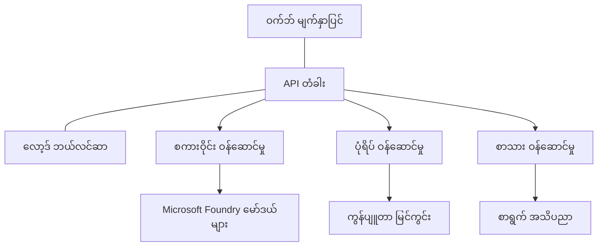

# AZD ဖြင့် ထုတ်လုပ်ရေး AI အလုပ်အကိုင် အကောင်းဆုံး လမ်းညွှန်ချက်များ

**အခန်း လမ်းကြောင်း:**
- **📚 သင်တန်း မူလစာမျက်နှာ**: [AZD For Beginners](../../README.md)
- **📖 လက်ရှိ အခန်း**: အခန်း ၈ - ထုတ်လုပ်ရေးနှင့် စီးပွားရေး ပုံစံများ
- **⬅️ ယခင် အခန်း**: [Chapter 7: Troubleshooting](../chapter-07-troubleshooting/debugging.md)
- **⬅️ ဆက်စပ်အချက်အလက်**: [AI Workshop Lab](ai-workshop-lab.md)
- **🎯 သင်တန်းပြီးမြောက်**: [AZD For Beginners](../../README.md)

## အကျဉ်းချုပ်

ဤလမ်းညွှန်သည် Azure Developer CLI (AZD) ကို အသုံးပြု၍ ထုတ်လုပ်ရေးအဆင်သင့် AI အလုပ်အကိုင်များ ထည့်သွင်းရာတွင် လိုအပ်သော အကောင်းဆုံး လက်တွေ့ကျသော နည်းလမ်းများကို စုံလင်စွာ ပေးသည်။ Microsoft Foundry Discord အသိုင်းအဝိုင်းမှ ရရှိခဲ့သည့် တုံ့ပြန်ချက်များနှင့် ဖောက်သည်များ၏ အမှန်တကယ် ထည့်သွင်းမှုများအပေါ် အခြေခံ၍ ထုတ်လုပ်ရေး AI စနစ်များတွင် မကြာခဏ တွေ့ကြုံရသည့် စိန်ခေါ်မှုများအား ဒီလမ်းညွှန်သည် ဖြေရှင်းပေးသည်။

## ဖြေရှင်းရန် အဓိက စိန်ခေါ်မှုများ

ကျွန်ုပ်တို့၏ အသိုင်းအဝိုင်း ဆန္ဒမဲ ရလဒ်အရ ဖွံ့ဖြိုးသူများ ကြုံတွေ့နေရသည့် အဓိက စိန်ခေါ်မှုများမှာ အောက်ပါအတိုင်းဖြစ်သည်-

- **45%** က မျိုးစုံ ဝန်ဆောင်မှုများဖြင့် AI ထည့်သွင်းမှုများအား ကန့်ကွက်နေရသည်
- **38%** သည် အချက်အလက် အတည်ပြုခြင်းနှင့် လျှို့ဝှက်စာရင်း စီမံမှုရဲ့ ပြဿနာများ ရှိနေသည်  
- **35%** သည် ထုတ်လုပ်ရေးအဆင်သင့်ဖြစ်ရန်နှင့် ချဲ့ထွင်နိုင်မှုများကို ကြုံတွေ့ရန် ခက်ခဲနေသည်
- **32%** သည် ကုန်ကျစရိတ် လျော့နည်းအောင် စီမံခန့်ခွဲမှုနည်းလမ်းများကို ပိုမိုလိုအပ်နေသည်
- **29%** သည် စောင့်ကြပ်မှုနှင့် ပြဿနာရှာဖွေရေးကို ပိုမိုကောင်းမွန်စေရန် လိုအပ်နေသည်

## ထုတ်လုပ်ရေး AI အတွက် အင်အားပုံစံများ

### ပုံစံ 1: Microservices AI ဖွဲ့စည်းပုံ

**အသုံးပြုသင့်ချိန်**: အင်္ဂါရပ်များစုံပါသော ခက်ခဲသော AI အပလီကေးရှင်းများအတွက်


**AZD အကောင်အထည်ဖော်မှု**:

```yaml
# azure.yaml
name: enterprise-ai-platform
services:
  web:
    project: ./web
    host: staticwebapp
  api-gateway:
    project: ./api-gateway
    host: containerapp
  chat-service:
    project: ./services/chat
    host: containerapp
  vision-service:
    project: ./services/vision
    host: containerapp
  text-service:
    project: ./services/text
    host: containerapp
```

### ပုံစံ 2: အဖြစ်အပျက် ကူးယူ သည့် AI ကို စီမံဆောင်ရွက်မှု

**အသုံးပြုသင့်ချိန်**: ကုလားထိုင် စီမံချက်များ (batch processing), စာရွက်စာတမ်း বিশ্লেষণ, အချိန်မူလီ asynchronous အလုပ်စဉ်များ

```bicep
// Event Hub for AI processing pipeline
resource eventHub 'Microsoft.EventHub/namespaces@2023-01-01-preview' = {
  name: eventHubNamespaceName
  location: location
  sku: {
    name: 'Standard'
    tier: 'Standard'
    capacity: 1
  }
}

// Service Bus for reliable message processing
resource serviceBus 'Microsoft.ServiceBus/namespaces@2022-10-01-preview' = {
  name: serviceBusNamespaceName
  location: location
  sku: {
    name: 'Premium'
    tier: 'Premium'
    capacity: 1
  }
}

// Function App for processing
resource functionApp 'Microsoft.Web/sites@2023-01-01' = {
  name: functionAppName
  location: location
  kind: 'functionapp,linux'
  properties: {
    siteConfig: {
      appSettings: [
        {
          name: 'FUNCTIONS_EXTENSION_VERSION'
          value: '~4'
        }
        {
          name: 'AZURE_OPENAI_ENDPOINT'
          value: '@Microsoft.KeyVault(VaultName=${keyVault.name};SecretName=openai-endpoint)'
        }
      ]
    }
  }
}
```

## AI Agent ကျန်းမာရေး အကြောင်း စဉ်းစားခြင်း

ရိုးရာ web app တစ်ခု ချို့ယွင်းသွားပါက၊ လက္ခဏာများမှာ သိသာသည် — စာမျက်နှာမဖွင့်၊ API မှ အမှား ပြန်လာသည်၊ သို့မဟုတ် deployment မအောင်မြင်။ AI ပါဝင်သည့် အပလီကေးရှင်းများမှာ အထက်ပါနည္းပညာပြဿနာများအဖြစ် ဖျက်စီးနိုင်သလို၊ ထူးခြားစွာလည်း တွေ့ရမည့် အမှားသိသာစွာ မထွက်ပေါ်ဘဲလည်း မမှန်ကန်သော အကျိုးရလဒ်များ ထုတ်ပေးနိုင်သည်။

ဤအပိုင်းသည် AI အလုပ်များကို စောင့်ကြည့်ရာတွင် သင် ဘယ်နေရာကို ကြည့်ရမည်ကို အတွေးအခေါ် မော်ဒယ်တစ်ခု ဖော်ဆောင်ရန် အကူအညီပေးသည်။

### Agent ကျန်းမာရေးသည် ရိုးရာ အက်ပ် ကျန်းမာရေးနှင့် မည်သို့ ကွဲပြားသနည်း

ရိုးရာ အက်ပ်သည် လုပ်ဆောင်မလုပ်ဆောင်သာ သတ်မှတ်နိုင်သည်။ AI agent သည် သဘောတရားအတိုင်း လုပ်ဆောင်နေသော်လည်း ဆိပ်ကမ်းမှ မှားယွင်းသောရလဒ်များ ထုတ်ပေးနိုင်သည်။ Agent ကျန်းမာရေးကို အလွှာနှစ်ခုအနေနှင့် တွေးကြည့်ပါ-

| အလွှာ | ကြည့်ရန် အချက်များ | ရှာဖွေရန် နေရာများ |
|-------|--------------|---------------|
| **အောက်ခံဖွဲ့စည်းပုံ ကျန်းမာရေး** | ဝန်ဆောင်မှုက chạy လား? ရင်းနှီးမြှုပ်နှံထားသော အရင်းအမြစ်များ ရရှိထားရော? endpoint များသို့ ချိတ်ဆက်လျှောက်နိုင်သလား? | `azd monitor`, Azure Portal resource health, container/app logs |
| **အပြုအမူ ကျန်းမာရေး** | Agent သည် မှန်ကန်စွာ တုံ့ပြန်နေပါသလား? တုံ့ပြန်ချိန် သက်သာပါသလား? မော်ဒယ်ကို မှန်ကန်စွာ ခေါ်ဆိုလျှո်သည်လား? | Application Insights traces, model call latency metrics, response quality logs |

အောက်ခံဖွဲ့စည်းပုံ ကျန်းမာရေးမှာ သိသာနားလည်ရလွယ်ကူသည်—azd app တစ်ခုချင်းစီအတွက် ပုံမှန်ဖြစ်သည်။ အပြုအမူ ကျန်းမာရေးဟာ AI အလုပ်ခွင်များက ထပ်ထည့်ပေးသည့် အသစ်သော အလွှာဖြစ်သည်။

### AI အက်ပ်များ မမျှော်လင့်သလို လုပ်မနေပါက ဘယ်နေရာကို ကြည့်ရမည်

သင့် AI အက်ပ်က မမျှော်လင့်သလို ရလဒ် မထုတ်ပေးပါက အောက်ပါ အတွေးအခေါ် စစ်ဆေးရန် စာရင်းကို အသုံးပြုပါ-

1. **အခြေခံများနှင့် စတင်ပါ။** အက်ပ် မထိုးထွင်းသလား? အားလုံး၏ မူလ မူရင်းများသို့ ရောက်စေတတ်သလား? မည်သည့် အက်ပ်မဆို ကြည့်သင့်သလို `azd monitor` နှင့် resource health များကို စစ်ဆေးပါ။
2. **မော်ဒယ် ချိတ်ဆက်မှုကို စစ်ဆေးပါ။** သင့်အက်ပ်သည် AI မော်ဒယ်ကို အောင်မြင်စွာ ခေါ်ဆိုနေရသလား? မော်ဒယ်ခေါ်ဆိုချက်များ ပျက်ကွက်ခြင်း သို့မဟုတ် အချိန်နောက်ကျခြင်းသည် AI အက်ပ် ပြဿနာများရဲ့ အများဆုံးပြသာနာ ဖြစ်ပြီး အက်ပ်၏ log များတွင် တွေ့ရမည်။
3. **မော်ဒယ် ရရှိခဲ့သည့် အချက်အလက်ကို ကြည့်ပါ။** AI တုံ့ပြန်ချက် သည် input (prompt နှင့် ရယူထားသော context) အပေါ် မူတည်သည်။ output မှားနေပါက input ကိုစစ်ဆေးပါ။ သင့်အက်ပ်သည် မော်ဒယ်ထံ သင့်တော်သောဒေတာကို ပို့ဆောင်နေပါသလား စစ်ဆေးပါ။
4. **တုံ့ပြန်ချိန် (latency) ကို ပြန်လည်ဆန်းစစ်ပါ။** AI မော်ဒယ်ခေါ်ဆိုချက်များသည် ပုံမှန် API ခေါ်ဆိုချက်များထက် နောက်ကျတတ်သည်။ သင့်အက်ပ် ခေတ်မီလျှင် မျက်နှာချင်းဆိုင် ရှိပါက မော်ဒယ် တုံ့ပြန်ချိန်များ တိုးပွားထားမရှိမရှိ စစ်ဆေးပါ — ၎င်းသည် throttling, capacity ကန့်သတ်ချက်များ သို့မဟုတ် ဒေသအထက် congestion ကို ပြသနိုင်သည်။
5. **ကုန်ကျစရိတ် ညွှန်းချက်များကို စောင့်ပါ။** token အသုံးပြုမှု သို့မဟုတ် API ခေါ်ဆိုချက် မဆင့်မစိမ် ထူးထူးခြားခြား တက်လာပါက loop တစ်ခု ဖြစ်နေခြင်း, prompt မမှန်ပေးထားခြင်း, သို့မဟုတ် retry များ မထိရောက်စွာ ဖွဲ့ထားခြင်းများကို ပြသနိုင်သည်။

သင် observability tooling တွင် တစ်ပြိုင်နက်ကျွမ်းကျင်ရန် မလိုအပ်ပါ။ အဓိက takeaway ကတော့ AI အက်ပ်များတွင် စောင့်ကြည့်ရန် အပိုတစ်အချို့ ရှိပြီး azd ရှိ built-in monitoring (`azd monitor`) သည် အလွှာ နှစ်ခုလုံးကို စုံစမ်းစစ်ဆေးရန် စတင်ရာ အချက်အလက် တစ်ခု ဖြစ်သည်။

---

## လုံခြုံရေး အကောင်းဆုံး လက်တွေ့ကျချက်များ

### 1. Zero-Trust လုံခြုံရေး မော်ဒယ်

**အကောင်အထည်ဖော် နည်းလမ်းများ**:
- အတည်ပြုချက် မရှိဘဲ ဝန်ဆောင်မှု-မှ-ဝန်ဆောင်မှု ဆက်သွယ်မှု မရှိစေရန်
- API ခေါ်ဆိုချက်များအားလုံးသည် managed identities ကို အသုံးပြုကြပါစေ
- private endpoints ကို အသုံးပြု၍ network ချိတ်ဆက်မှုကို ခွဲခြားထားပါ
- အနည်းဆုံး အခွင့်အရေး (least privilege) ထိန်းချုပ်မှုများ

```bicep
// Managed Identity for each service
resource chatServiceIdentity 'Microsoft.ManagedIdentity/userAssignedIdentities@2023-01-31' = {
  name: 'chat-service-identity'
  location: location
}

// Role assignments with minimal permissions
resource openAIUserRole 'Microsoft.Authorization/roleAssignments@2022-04-01' = {
  scope: openAIAccount
  name: guid(openAIAccount.id, chatServiceIdentity.id, openAIUserRoleDefinitionId)
  properties: {
    roleDefinitionId: subscriptionResourceId('Microsoft.Authorization/roleDefinitions', '5e0bd9bd-7b93-4f28-af87-19fc36ad61bd')
    principalId: chatServiceIdentity.properties.principalId
    principalType: 'ServicePrincipal'
  }
}
```

### 2. လျှို့ဝှက် စီမံခန့်ခွဲမှု ကို ဘေးကင်းစေရန်

**Key Vault ပေါင်းစည်းခြင်း ပုံစံ**:

```bicep
// Key Vault with proper access policies
resource keyVault 'Microsoft.KeyVault/vaults@2023-02-01' = {
  name: keyVaultName
  location: location
  properties: {
    tenantId: tenant().tenantId
    sku: {
      family: 'A'
      name: 'premium'  // Use premium for production
    }
    enableRbacAuthorization: true  // Use RBAC instead of access policies
    enablePurgeProtection: true    // Prevent accidental deletion
    enableSoftDelete: true
    softDeleteRetentionInDays: 90
  }
}

// Store all AI service credentials
resource openAIKeySecret 'Microsoft.KeyVault/vaults/secrets@2023-02-01' = {
  parent: keyVault
  name: 'openai-api-key'
  properties: {
    value: openAIAccount.listKeys().key1
    attributes: {
      enabled: true
    }
  }
}
```

### 3. ကွန်ယက် လုံခြုံရေး

**Private Endpoint ပြင်ဆင်မှု**:

```bicep
// Virtual Network for AI services
resource virtualNetwork 'Microsoft.Network/virtualNetworks@2023-04-01' = {
  name: vnetName
  location: location
  properties: {
    addressSpace: {
      addressPrefixes: ['10.0.0.0/16']
    }
    subnets: [
      {
        name: 'ai-services-subnet'
        properties: {
          addressPrefix: '10.0.1.0/24'
          privateEndpointNetworkPolicies: 'Disabled'
        }
      }
      {
        name: 'app-services-subnet'
        properties: {
          addressPrefix: '10.0.2.0/24'
          delegations: [
            {
              name: 'Microsoft.Web/serverFarms'
              properties: {
                serviceName: 'Microsoft.Web/serverFarms'
              }
            }
          ]
        }
      }
    ]
  }
}

// Private endpoints for all AI services
resource openAIPrivateEndpoint 'Microsoft.Network/privateEndpoints@2023-04-01' = {
  name: '${openAIAccountName}-pe'
  location: location
  properties: {
    subnet: {
      id: virtualNetwork.properties.subnets[0].id
    }
    privateLinkServiceConnections: [
      {
        name: 'openai-connection'
        properties: {
          privateLinkServiceId: openAIAccount.id
          groupIds: ['account']
        }
      }
    ]
  }
}
```

## ဖျော်ဖြေရေးနှင့် ချဲ့ထွင်နိုင်မှု

### 1. အလိုအလျောက် ချဲ့ထွင်မှု မဟာဗျူဟာများ

**Container Apps အလိုအလျောက်ချဲ့ထွင်ခြင်း**:

```bicep
resource containerApp 'Microsoft.App/containerApps@2023-05-01' = {
  name: containerAppName
  location: location
  properties: {
    configuration: {
      ingress: {
        external: true
        targetPort: 8000
        transport: 'http'
      }
    }
    template: {
      scale: {
        minReplicas: 2  // Always have 2 instances minimum
        maxReplicas: 50 // Scale up to 50 for high load
        rules: [
          {
            name: 'http-scaling'
            http: {
              metadata: {
                concurrentRequests: '20'  // Scale when >20 concurrent requests
              }
            }
          }
          {
            name: 'cpu-scaling'
            custom: {
              type: 'cpu'
              metadata: {
                type: 'Utilization'
                value: '70'  // Scale when CPU >70%
              }
            }
          }
        ]
      }
    }
  }
}
```

### 2. caching မဟာဗျူဟာများ

**AI တုံ့ပြန်မှုများအတွက် Redis Cache**:

```bicep
// Redis Premium for production workloads
resource redisCache 'Microsoft.Cache/redis@2023-04-01' = {
  name: redisCacheName
  location: location
  properties: {
    sku: {
      name: 'Premium'
      family: 'P'
      capacity: 1
    }
    enableNonSslPort: false
    minimumTlsVersion: '1.2'
    redisConfiguration: {
      'maxmemory-policy': 'allkeys-lru'
    }
    // Enable clustering for high availability
    redisVersion: '6.0'
    shardCount: 2
  }
}

// Cache configuration in application
var cacheConnectionString = '${redisCache.properties.hostName}:6380,password=${redisCache.listKeys().primaryKey},ssl=True,abortConnect=False'
```

### 3. Load Balancing နှင့် Traffic စီမံခန့်ခွဲမှု

**WAF တပ်ဆင်ထားသည့် Application Gateway**:

```bicep
// Application Gateway with Web Application Firewall
resource applicationGateway 'Microsoft.Network/applicationGateways@2023-04-01' = {
  name: appGatewayName
  location: location
  properties: {
    sku: {
      name: 'WAF_v2'
      tier: 'WAF_v2'
      capacity: 2
    }
    webApplicationFirewallConfiguration: {
      enabled: true
      firewallMode: 'Prevention'
      ruleSetType: 'OWASP'
      ruleSetVersion: '3.2'
    }
    // Backend pools for AI services
    backendAddressPools: [
      {
        name: 'ai-services-pool'
        properties: {
          backendAddresses: [
            {
              fqdn: '${containerApp.properties.configuration.ingress.fqdn}'
            }
          ]
        }
      }
    ]
  }
}
```

## 💰 ကုန်ကျစရိတ် အထိရောက်ဆုံး စီမံခန့်ခွဲခြင်း

### 1. အရင်းအမြစ်ကို သင့်တော်စွာ အရွယ်အစား သတ်မှတ်ခြင်း

**ပတ်ဝန်းကျင် အလိုက် ဖွဲ့စည်းမှုများ**:

```bash
# ဖွံ့ဖြိုးရေး ပတ်ဝန်းကျင်
azd env new development
azd env set AZURE_OPENAI_SKU "S0"
azd env set AZURE_OPENAI_CAPACITY 10
azd env set AZURE_SEARCH_SKU "basic"
azd env set CONTAINER_CPU 0.5
azd env set CONTAINER_MEMORY 1.0

# ထုတ်လုပ်ရေး ပတ်ဝန်းကျင်
azd env new production
azd env set AZURE_OPENAI_SKU "S0"
azd env set AZURE_OPENAI_CAPACITY 100
azd env set AZURE_SEARCH_SKU "standard"
azd env set CONTAINER_CPU 2.0
azd env set CONTAINER_MEMORY 4.0
```

### 2. ကုန်ကျစရိတ် စောင့်ကြည့်ခြင်းနှင့် ဘတ်ဂျက်များ

```bicep
// Cost management and budgets
resource budget 'Microsoft.Consumption/budgets@2023-05-01' = {
  name: 'ai-workload-budget'
  properties: {
    timePeriod: {
      startDate: '2024-01-01'
      endDate: '2024-12-31'
    }
    timeGrain: 'Monthly'
    amount: 2000  // $2000 monthly budget
    category: 'Cost'
    notifications: {
      warning: {
        enabled: true
        operator: 'GreaterThan'
        threshold: 80
        contactEmails: [
          'finance@company.com'
          'engineering@company.com'
        ]
        contactRoles: [
          'Owner'
          'Contributor'
        ]
      }
      critical: {
        enabled: true
        operator: 'GreaterThan'
        threshold: 95
        contactEmails: [
          'cto@company.com'
        ]
      }
    }
  }
}
```

### 3. Token အသုံးပြုမှု အထိရောက်စေရန်

**OpenAI ကုန်ကျစရိတ် စီမံမှု**:

```typescript
// အပလီကေးရှင်းအဆင့်တွင် token အဆင်ပြေမှု မြှင့်တင်ရေး
class TokenOptimizer {
  private readonly maxTokens = 4000;
  private readonly reserveTokens = 500;
  
  optimizePrompt(userInput: string, context: string): string {
    const availableTokens = this.maxTokens - this.reserveTokens;
    const estimatedTokens = this.estimateTokens(userInput + context);
    
    if (estimatedTokens > availableTokens) {
      // အကြောင်းအရာကို ဖြတ်လျော့ပါ၊ အသုံးပြုသူထည့်သွင်းချက်ကို မဖြတ်ပါ
      context = this.truncateContext(context, availableTokens - this.estimateTokens(userInput));
    }
    
    return `${context}\n\nUser: ${userInput}`;
  }
  
  private estimateTokens(text: string): number {
    // ကြမ်းတမ်း ခန့်မှန်းချက်: token ၁ လုံး ≈ အက္ခရာ ၄ လုံး
    return Math.ceil(text.length / 4);
  }
}
```

## စောင့်ကြည့်ခြင်းနှင့် တွေ့မြင်နိုင်ခြင်း

### 1. စုံလင်သော Application Insights

```bicep
// Application Insights with advanced features
resource applicationInsights 'Microsoft.Insights/components@2020-02-02' = {
  name: applicationInsightsName
  location: location
  kind: 'web'
  properties: {
    Application_Type: 'web'
    WorkspaceResourceId: logAnalyticsWorkspace.id
    SamplingPercentage: 100  // Full sampling for AI apps
    DisableIpMasking: false  // Enable for security
  }
}

// Custom metrics for AI operations
resource aiMetricAlerts 'Microsoft.Insights/metricAlerts@2018-03-01' = {
  name: 'ai-high-error-rate'
  location: 'global'
  properties: {
    description: 'Alert when AI service error rate is high'
    severity: 2
    enabled: true
    scopes: [
      applicationInsights.id
    ]
    evaluationFrequency: 'PT1M'
    windowSize: 'PT5M'
    criteria: {
      'odata.type': 'Microsoft.Azure.Monitor.SingleResourceMultipleMetricCriteria'
      allOf: [
        {
          name: 'high-error-rate'
          metricName: 'requests/failed'
          operator: 'GreaterThan'
          threshold: 10
          timeAggregation: 'Count'
        }
      ]
    }
  }
}
```

### 2. AI အတွက် အထူးစောင့်ကြည့်မှု

**AI မက္ထ်ရစ်များအတွက် အထူး ဒက်ရှ်ဘုတ်များ**:

```json
// Dashboard configuration for AI workloads
{
  "dashboard": {
    "name": "AI Application Monitoring",
    "tiles": [
      {
        "name": "OpenAI Request Volume",
        "query": "requests | where name contains 'openai' | summarize count() by bin(timestamp, 5m)"
      },
      {
        "name": "AI Response Latency",
        "query": "requests | where name contains 'openai' | summarize avg(duration) by bin(timestamp, 5m)"
      },
      {
        "name": "Token Usage",
        "query": "customMetrics | where name == 'openai_tokens_used' | summarize sum(value) by bin(timestamp, 1h)"
      },
      {
        "name": "Cost per Hour",
        "query": "customMetrics | where name == 'openai_cost' | summarize sum(value) by bin(timestamp, 1h)"
      }
    ]
  }
}
```

### 3. ကျန်းမာရေး စစ်ဆေးမှုများနှင့် uptime စောင့်ကြည့်မှု

```bicep
// Application Insights availability tests
resource availabilityTest 'Microsoft.Insights/webtests@2022-06-15' = {
  name: 'ai-app-availability-test'
  location: location
  tags: {
    'hidden-link:${applicationInsights.id}': 'Resource'
  }
  properties: {
    SyntheticMonitorId: 'ai-app-availability-test'
    Name: 'AI Application Availability Test'
    Description: 'Tests AI application endpoints'
    Enabled: true
    Frequency: 300  // 5 minutes
    Timeout: 120    // 2 minutes
    Kind: 'ping'
    Locations: [
      {
        Id: 'us-east-2-azr'
      }
      {
        Id: 'us-west-2-azr'
      }
    ]
    Configuration: {
      WebTest: '''
        <WebTest Name="AI Health Check" 
                 Id="8d2de8d2-a2b0-4c2e-9a0d-8f9c9a0b8c8d" 
                 Enabled="True" 
                 CssProjectStructure="" 
                 CssIteration="" 
                 Timeout="120" 
                 WorkItemIds="" 
                 xmlns="http://microsoft.com/schemas/VisualStudio/TeamTest/2010" 
                 Description="" 
                 CredentialUserName="" 
                 CredentialPassword="" 
                 PreAuthenticate="True" 
                 Proxy="default" 
                 StopOnError="False" 
                 RecordedResultFile="" 
                 ResultsLocale="">
          <Items>
            <Request Method="GET" 
                     Guid="a5f10126-e4cd-570d-961c-cea43999a200" 
                     Version="1.1" 
                     Url="${webApp.properties.defaultHostName}/health" 
                     ThinkTime="0" 
                     Timeout="120" 
                     ParseDependentRequests="True" 
                     FollowRedirects="True" 
                     RecordResult="True" 
                     Cache="False" 
                     ResponseTimeGoal="0" 
                     Encoding="utf-8" 
                     ExpectedHttpStatusCode="200" 
                     ExpectedResponseUrl="" 
                     ReportingName="" 
                     IgnoreHttpStatusCode="False" />
          </Items>
        </WebTest>
      '''
    }
  }
}
```

## မဟာဗျူဟာ ပြန်လည်ထူထောင်ခြင်းနှင့် အမြင့်ထိန်းကြာရှည်မှု

### 1. မျိုးစုံ ဒေသတွင် တပ်ဆင်ခြင်း

```yaml
# azure.yaml - Multi-region configuration
name: ai-app-multiregion
services:
  api-primary:
    project: ./api
    host: containerapp
    env:
      - AZURE_REGION=eastus
  api-secondary:
    project: ./api
    host: containerapp
    env:
      - AZURE_REGION=westus2
```

```bicep
// Traffic Manager for global load balancing
resource trafficManager 'Microsoft.Network/trafficManagerProfiles@2022-04-01' = {
  name: trafficManagerProfileName
  location: 'global'
  properties: {
    profileStatus: 'Enabled'
    trafficRoutingMethod: 'Priority'
    dnsConfig: {
      relativeName: trafficManagerProfileName
      ttl: 30
    }
    monitorConfig: {
      protocol: 'HTTPS'
      port: 443
      path: '/health'
      intervalInSeconds: 30
      toleratedNumberOfFailures: 3
      timeoutInSeconds: 10
    }
    endpoints: [
      {
        name: 'primary-endpoint'
        type: 'Microsoft.Network/trafficManagerProfiles/azureEndpoints'
        properties: {
          targetResourceId: primaryAppService.id
          endpointStatus: 'Enabled'
          priority: 1
        }
      }
      {
        name: 'secondary-endpoint'
        type: 'Microsoft.Network/trafficManagerProfiles/azureEndpoints'
        properties: {
          targetResourceId: secondaryAppService.id
          endpointStatus: 'Enabled'
          priority: 2
        }
      }
    ]
  }
}
```

### 2. ဒေတာ backup နှင့် ပြန်လည်ထူထောင်ခြင်း

```bicep
// Backup configuration for critical data
resource backupVault 'Microsoft.DataProtection/backupVaults@2023-05-01' = {
  name: backupVaultName
  location: location
  identity: {
    type: 'SystemAssigned'
  }
  properties: {
    storageSettings: [
      {
        datastoreType: 'VaultStore'
        type: 'LocallyRedundant'
      }
    ]
  }
}

// Backup policy for AI models and data
resource backupPolicy 'Microsoft.DataProtection/backupVaults/backupPolicies@2023-05-01' = {
  parent: backupVault
  name: 'ai-data-backup-policy'
  properties: {
    policyRules: [
      {
        backupParameters: {
          backupType: 'Full'
          objectType: 'AzureBackupParams'
        }
        trigger: {
          schedule: {
            repeatingTimeIntervals: [
              'R/2024-01-01T02:00:00+00:00/P1D'  // Daily at 2 AM
            ]
          }
          objectType: 'ScheduleBasedTriggerContext'
        }
        dataStore: {
          datastoreType: 'VaultStore'
          objectType: 'DataStoreInfoBase'
        }
        name: 'BackupDaily'
        objectType: 'AzureBackupRule'
      }
    ]
  }
}
```

## DevOps နှင့် CI/CD ပေါင်းစပ်မှု

### 1. GitHub Actions Workflow

```yaml
# .github/workflows/deploy-ai-app.yml
name: Deploy AI Application

on:
  push:
    branches: [main]
  pull_request:
    branches: [main]

jobs:
  test:
    runs-on: ubuntu-latest
    steps:
      - uses: actions/checkout@v4
      
      - name: Setup Python
        uses: actions/setup-python@v4
        with:
          python-version: '3.11'
          
      - name: Install dependencies
        run: |
          pip install -r requirements.txt
          pip install pytest
          
      - name: Run tests
        run: pytest tests/
        
      - name: AI Safety Tests
        run: |
          python scripts/test_ai_safety.py
          python scripts/validate_prompts.py

  deploy-staging:
    needs: test
    if: github.event_name == 'pull_request'
    runs-on: ubuntu-latest
    steps:
      - uses: actions/checkout@v4
      
      - name: Setup AZD
        uses: Azure/setup-azd@v1.0.0
        
      - name: Login to Azure
        uses: azure/login@v1
        with:
          creds: ${{ secrets.AZURE_CREDENTIALS }}
          
      - name: Deploy to Staging
        run: |
          azd env select staging
          azd deploy

  deploy-production:
    needs: test
    if: github.ref == 'refs/heads/main'
    runs-on: ubuntu-latest
    steps:
      - uses: actions/checkout@v4
      
      - name: Setup AZD
        uses: Azure/setup-azd@v1.0.0
        
      - name: Login to Azure
        uses: azure/login@v1
        with:
          creds: ${{ secrets.AZURE_CREDENTIALS }}
          
      - name: Deploy to Production
        run: |
          azd env select production
          azd deploy
          
      - name: Run Production Health Checks
        run: |
          python scripts/health_check.py --env production
```

### 2. အခြေခံ အင်ဖရန်စ्ट्रပ် ဖော်ပြချက်များ စစ်ဆေးမှု

```bash
# scripts/validate_infrastructure.sh
#!/bin/bash

echo "Validating AI infrastructure deployment..."

# လိုအပ်သည့် ဝန်ဆောင်မှုအားလုံး လည်ပတ်နေသည်ကို စစ်ဆေးပါ
services=("openai" "search" "storage" "keyvault")
for service in "${services[@]}"; do
    echo "Checking $service..."
    if ! az resource list --resource-type "Microsoft.CognitiveServices/accounts" --query "[?contains(name, '$service')]" -o tsv; then
        echo "ERROR: $service not found"
        exit 1
    fi
done

# OpenAI မော်ဒယ် တပ်ဆင်ထားမှုများကို မှန်ကန်ကြောင်း အတည်ပြုပါ
echo "Validating OpenAI model deployments..."
models=$(az cognitiveservices account deployment list --name $AZURE_OPENAI_NAME --resource-group $AZURE_RESOURCE_GROUP --query "[].name" -o tsv)
if [[ ! $models == *"gpt-35-turbo"* ]]; then
    echo "ERROR: Required model gpt-35-turbo not deployed"
    exit 1
fi

# AI ဝန်ဆောင်မှု ချိတ်ဆက်နိုင်မှုကို စမ်းသပ်ပါ
echo "Testing AI service connectivity..."
python scripts/test_connectivity.py

echo "Infrastructure validation completed successfully!"
```

## ထုတ်လုပ်ရေး အဆင်သင့် စစ်ဆေးရန် စာရင်း

### လုံခြုံရေး ✅
- [ ] ဝန်ဆောင်မှုအားလုံးသည် managed identities ကို အသုံးပြုသည်
- [ ] Secrets များကို Key Vault တွင် သိမ်းဆည်းထားသည်
- [ ] Private endpoints များကို ပြင်ဆင်ထားသည်
- [ ] Network security groups များကို လက်ကျင့်ထားသည်
- [ ] RBAC ကို least privilege နည်းဖြင့် အသုံးပြုထားသည်
- [ ] ပြင်ပ endpoint များပေါ်တွင် WAF တပ်ဆင်ထားသည်

### အလုပ်ဆောင်ရည် ✅
- [ ] အလိုအလျှောက် ချဲ့ထွင်မှု ဖော်ပြထားသည်
- [ ] Caching ကို အကောင်အထည်ဖော်ထားသည်
- [ ] Load balancing ကို စီစဉ်ထားသည်
- [ ] Static content များအတွက် CDN ကို အသုံးပြုထားသည်
- [ ] Database connection pooling ကို အသုံးပြုထားသည်
- [ ] Token အသုံးပြုမှု အထိရောက်မှုကို တိုးတက်စေသည်

### စောင့်ကြည့်မှု ✅
- [ ] Application Insights ကို ပြင်ဆင်ထားသည်
- [ ] Custom metrics များ သတ်မှတ်ထားသည်
- [ ] အချက်ယူမှု အစည်းအဝေးများ (alerting rules) ကို ဖန်တီးထားသည်
- [ ] Dashboard တစ်ခု ဖန်တီးထားသည်
- [ ] Health checks များ ထည့်သွင်းထားသည်
- [ ] Log retention မူဝါဒများ ရှိသည်

### ယုံကြည်စိတ်ချရမှု (Reliability) ✅
- [ ] မျိုးစုံ ဒေသ စီမံချက် ရှိသည်
- [ ] Backup နှင့် ပြန်လည်ထူထောင်ရေး အစီအစဉ် ရှိသည်
- [ ] Circuit breakers များ တပ်ဆင်ထားသည်
- [ ] Retry မူဝါဒများ ဖော်ပြထားသည်
- [ ] Graceful degradation ကို ရှိစေသည်
- [ ] Health check endpoints များ ရှိသည်

### ကုန်ကျစရိတ် စီမံခန့်ခွဲမှု ✅
- [ ] ဘတ်ဂျက် သတိပေးချက်များ ပြင်ဆင်ထားသည်
- [ ] အရင်းအမြစ်များကို သင့်တော်စွာ အရွယ်အစား သတ်မှတ်ထားသည်
- [ ] Dev/test လျော့စျေးများကို အသုံးပြုထားသည်
- [ ] Reserved instances များ ဝယ်ယူထားသည်
- [ ] ကုန်ကျစရိတ် စောင့်ကြည့်ရေး dashboard ရှိသည်
- [ ] အားလုံးသည် မကြာခဏ ကုန်ကျစရိတ်ကို ပြန်လည်စစ်ဆေးသည်

### လိုက်နာမှု (Compliance) ✅
- [ ] ဒေတာ နေရာချထားမှု စည်းမျဉ်းများနှင့် ကိုက်ညီသည်
- [ ] Audit logging ကို ဖွင့်ထားသည်
- [ ] Compliance မူဝါဒများကို အသုံးပြုထားသည်
- [ ] လုံခြုံရေး အခြေခံစုစည်းချက်များကို လက်ကျင့်ထားသည်
- [ ] အကြိမ်ကြိမ် လုံခြုံရေး စစ်ဆေးမှုများ ပြုလုပ်သည်
- [ ] ဖြစ်ပွားနိုင်သော အရေးပေါ် တုံ့ပြန်ရေး အစီအစဉ် ရှိသည်

## အလုပ်ဆောင်မှု စံနှုန်းများ

### ပုံမှန် ထုတ်လုပ်ရေး မက်ထရစ်များ

| မက်ထရစ် | ရည်မှန်းထားသော တန်ဖိုး | စောင့်ကြည့်ရန် နေရာ |
|--------|--------|------------|
| **တုံ့ပြန်ချိန်** | < 2 စက္ကန့် | Application Insights |
| **ရရှိနိုင်မှု** | 99.9% | Uptime စောင့်ကြည့်မှု |
| **အမှားနှုန်း** | < 0.1% | Application logs |
| **Token အသုံးပြုမှု** | < $500/month | ကုန်ကျစရိတ် စီမံမှု |
| **တပြိုင်နက် အသုံးပြုသူများ** | 1000+ | Load testing |
| **ပြန်လည်ရရှိချိန်** | < 1 hour | မဟာဗျူဟာ ပြန်လည်ထူထောင်ရေး စမ်းသပ်မှုများ |

### Load Testing

```bash
# AI အက်ပလီကေးရှင်းများအတွက် လုပ်အား စမ်းသပ်ရေး စကရစ်
python scripts/load_test.py \
  --endpoint https://your-ai-app.azurewebsites.net \
  --concurrent-users 100 \
  --duration 300 \
  --ramp-up 60
```

## 🤝 အသိုင်းအဝိုင်း အကောင်းဆုံး လမ်းညွှန်ချက်များ

Microsoft Foundry Discord အသိုင်းအဝိုင်းမှ ပြန်လည်ပေးအပ်ချက်များအပေါ် အခြေခံ၍-

### အသိုင်းအဝိုင်း ထံမှ ထိပ်တန်း အကြံပြုချက်များ:

1. **ငယ်ငယ်စတင်၊ တဖြည်းဖြည်း ချဲ့ပါ**: မူလက ကောင်းသော SKU များဖြင့် စတင်၍ အလုပ်အသုံးအရ ဖော်ပြချက်အရ ချဲ့ပါ
2. **အားလုံးကို စောင့်ကြည့်ပါ**: တနေ့စတင်မှစ၍ စုံလင်သော စောင့်ကြည့်မှုကို တပ်ဆင်ပါ
3. **လုံခြုံရေးကို အလိုအလျော့ လုပ်ဆောင်ပါ**: security ကို consistent ဖြစ်အောင် infrastructure as code ကို အသုံးပြုပါ
4. **စမ်းသပ်မှုကို အပြည့်အဝ ပြုလုပ်ပါ**: pipeline ထဲတွင် AI အထူး စမ်းသပ်မှုများကို ထည့်ပါ
5. **ကုန်ကျစရိတ်အတွက် စီမံချက် ရှိပါစေ**: token အသုံးပြုမှုကို စောင့်ကြည့်ပြီး အစောပိုင်းတွင် ဘတ်ဂျက် သတိပေးချက်များ ထားပါ

### ရှောင်ရှားရမည့် မတော်တဆ အမှားများ:

- ❌ API keys များကို ကုတ်ထဲတွင် အတိုက်အခံ ထည့်ထားခြင်း
- ❌ သင့်အား သင့်တော်သော စောင့်ကြည့်မှု မတပ်ဆင်ထားခြင်း
- ❌ ကုန်ကျစရိတ် လျော့နည်းအောင် စဥ်းစားခြင်းကို မလုပ်ခြင်း
- ❌ မအောင်မြင်မှုဖြစ်ရမှတ် ရှိခါ ကြောင့် စမ်းသပ်မှု မလုပ်ခြင်း
- ❌ Health checks မပါဘဲ ထည့်ထားခြင်း

## AZD AI CLI ကွန်မန့္များနှင့် Extension များ

AZD သည် ထုတ်လုပ်ရေး AI အလုပ်စဉ်များကို လျင်မြန်စွာ ပြီးစီးနိုင်ရန် AI အထူး ကွန်မန့္များနှင့် extension များ အများအပြား ထည့်သွင်းထားသည်။ ဤကိရိယာများသည် ဒေသတွင်း ဖွံ့ဖြိုးရေးနှင့် ထုတ်လုပ်ရေး တပ်ဆင်မှုများအကြား ချောမွေ့စွာ ချိတ်ဆက်ပေးသည်။

### AZD အတွက် AI Extension များ

AZD သည် AI အထူး လုပ်ဆောင်ချက်များ ထည့်သွင်းရန် extension စနစ်ကို အသုံးပြုသည်။ extension များကို ထည့်သွင်း၊ စီမံရန် အောက်ပါအတိုင်း အသုံးပြုပါ-

```bash
# ရနိုင်သမျှ တိုးချဲ့မှုများအားလုံးကို စာရင်းပြပါ (AI အပါအဝင်)
azd extension list

# Foundry agents တိုးချဲ့မှုကို တပ်ဆင်ပါ
azd extension install azure.ai.agents

# fine-tuning တိုးချဲ့မှုကို တပ်ဆင်ပါ
azd extension install azure.ai.finetune

# စိတ်ကြိုက်မော်ဒယ်များ တိုးချဲ့မှုကို တပ်ဆင်ပါ
azd extension install azure.ai.models

# တပ်ဆင်ပြီးသား တိုးချဲ့မှုများအားလုံးကို အဆင့်မြှင့္တင်ပါ
azd extension upgrade --all
```

**ရရှိနိုင်သော AI extension များ:** 

| Extension | ရည်ရွယ်ချက် | Status |
|-----------|---------|--------|
| `azure.ai.agents` | Foundry Agent Service စီမံခန့်ခွဲမှု | Preview |
| `azure.ai.finetune` | Foundry မော်ဒယ် fine-tuning | Preview |
| `azure.ai.models` | Foundry အထူးမော်ဒယ်များ | Preview |
| `azure.coding-agent` | Coding agent ဖွဲ့စည်းမှု ဖော်ပြချက် | Available |

### `azd ai agent init` ဖြင့် Agent ပရောဂျက်များ စတင်ဖန်တီးခြင်း

`azd ai agent init` ကွန်မန့္သည် Microsoft Foundry Agent Service နှင့် ပေါင်းစည်းထားသည့် ထုတ်လုပ်ရေး အသင့် AI agent ပရောဂျက်ကို scaffolding ပြုလုပ်ပေးသည်-

```bash
# agent manifest မှ အသစ်သော agent ပရောဂျက်ကို စတင်ဖန်တီးပါ
azd ai agent init -m <manifest-path-or-uri>

# တိကျသတ်မှတ်ထားသည့် Foundry ပရောဂျက်တစ်ခုကို စတင်၍ ရည်ညွှန်းပါ
azd ai agent init -m agent-manifest.yaml --project-id <foundry-project-id>

# စိတ်ကြိုက် အရင်းအမြစ် ဖိုလ်ဒါဖြင့် စတင်ပါ
azd ai agent init -m agent-manifest.yaml --src ./agents/my-agent

# Container Apps ကို အိမ်ရှင်အဖြစ် ရည်ညွှန်းပါ
azd ai agent init -m agent-manifest.yaml --host containerapp
```

**အဓိက flag များ:** 

| Flag | ဖော်ပြချက် |
|------|-------------|
| `-m, --manifest` | သင့်ပရောဂျက်ထဲသို့ ထည့်ချင်သော agent manifest ၏ Path သို့မဟုတ် URI |
| `-p, --project-id` | သင့် azd ပတ်ဝန်းကျင် အတွက် ရှိပြီးဖြစ်သော Microsoft Foundry Project ID |
| `-s, --src` | agent definition ကို ဒေါင်းလုပ်လုပ်ရန် ဖိုလ်ဒါ (默认 `src/<agent-id>`) |
| `--host` | မူရင်း host ကို override ပြုလုပ်ရန် (ဥပမာ၊ `containerapp`) |
| `-e, --environment` | အသုံးပြုမည့် azd environment |

**ထုတ်လုပ်ရေး အကြံပြုချက်**: သင့် agent ကုဒ်နှင့် cloud အရင်းအမြစ်များကို စတင်ချိတ်ဆက်ထားရန် `--project-id` ကို အသုံးပြု၍ ရှိပြီးဖြစ်သော Foundry project တစ်ခုနှင့် တိုက်ရိုက် ချိတ်ဆက်ပါ။

### `azd mcp` ဖြင့် Model Context Protocol (MCP)

AZD သည် MCP server အထောက်အပံ့ (Alpha) ကို ထည့်သွင်းထားပြီး AI agent များနှင့် ကိရိယာများကို သင့် Azure ရင်းနှီးမြှုပ်နှံချက်များနှင့် စံပြ protocol တစ်ခုဖြင့် ဆက်သွယ်နိုင်စေသည်-

```bash
# သင့်ပရောဂျက်အတွက် MCP ဆာဗာကို စတင်ပါ
azd mcp start

# MCP လုပ်ဆောင်ချက်များအတွက် ကိရိယာ ခွင့်ပြုချက်များကို စီမံပါ
azd mcp consent
```

MCP server သည် သင့် azd ပရောဂျက် context—environment များ၊ service များ၊ နှင့် Azure အရင်းအမြစ်များ—ကို AI ဖြင့် ပါဝင်ဆောင်ရွက်နိုင်သော ဖွံ့ဖြိုးရေး ကိရိယာများထံ ဖြန့်ဝေပေးသည်။ ၎င်းသည် အောက်ပါအရာများကို စီမံခန့်ခွဲနိုင်စေသည်-

- **AI- အကူအညီဖြင့် deployment**: coding agents များအား သင့်ပရောဂျက် အခြေအနေကို မေးမြန်းကာ deployment တိုက်ရိုက် စတင်နိုင်စေပါ
- **အရင်းအမြစ် ရှာဖွေရေး**: AI ကိရိယာများသည် သင့်ပရောဂျက် အသုံးပြုနေသော Azure အရင်းအမြစ်များကို ရှာဖွေနိုင်သည်
- **ပတ်ဝန်းကျင် စီမံခန့်ခွဲမှု**: Agents များသည် dev/staging/production ပတ်ဝန်းကျင်များအကြား ပြောင်းရွှေ့နိုင်သည်

### `azd infra generate` ဖြင့် အင်ဖရာ ဖန်တီးခြင်း

ထုတ်လုပ်ရေး AI အလုပ်များအတွက်၊ အလိုအလျောက် provisioning အစား Infrastructure as Code ကို ဆွဲထုတ်၍ စိတ်ကြိုက် ပြင်ဆင်နိုင်သည်-

```bash
# သင်၏ စီမံကိန်း ဖော်ပြချက်မှ Bicep/Terraform ဖိုင်များ ဖန်တီးပါ
azd infra generate
```

ဤကိစ္စသည် IaC ကို disk တွင် ရေးသားပေးလိမ့်မည်ဖြစ်၍ သင်သည်-
- တပ်ဆင်မပြုမီ အင်ဖရာကို ပြန်လည်သုံးသပ်နှင့် စစ်ဆေးနိုင်ရန်
- custom လုံခြုံရေး မူဝါဒများ (network rule များ၊ private endpoints) ထည့်နိုင်ရန်
- ရှိပြီးသား IaC တည်ဆောက်မှုလုပ်ငန်းစဉ်များနှင့် ပေါင်းစည်းနိုင်ရန်
- application ကုဒ်နှင့် မတူဘဲ အင်ဖရာပြောင်းလဲမှုများကို version control ထဲသို့ ထားနိုင်ရန်

### ထုတ်လုပ်ရေး အသက်တာလှည့်လည် နောက်ဆက်တွဲ Hook များ

AZD hooks များက သင်အား deployment အဆင့်တိုင်းတွင် အတိုင်းအတာ များထည့်သွင်းနိုင်စေပြီး ထုတ်လုပ်ရေး AI အလုပ်များအတွက် တရားဝင် လိုအပ်သည်-

```yaml
# azure.yaml - Production hooks example
name: ai-production-app
hooks:
  preprovision:
    shell: sh
    run: scripts/validate-quotas.sh    # Check AI model quota before provisioning
  postprovision:
    shell: sh
    run: scripts/configure-networking.sh  # Set up private endpoints
  predeploy:
    shell: sh
    run: scripts/run-ai-safety-tests.sh  # Run prompt safety checks
  postdeploy:
    shell: sh
    run: scripts/smoke-test.sh           # Verify agent responses post-deploy
services:
  agent-api:
    project: ./src/agent
    host: containerapp
    hooks:
      predeploy:
        shell: sh
        run: scripts/validate-model-access.sh  # Per-service hook
```

```bash
# ဖွံ့ဖြိုးရေးအချိန်တွင် သတ်မှတ်ထားသော hook တစ်ခုကို ကိုယ်တိုင် လက်ဖြင့် လည်ပတ်ပါ
azd hooks run predeploy
```

**AI အလုပ်များအတွက် အကြံပြု ထုတ်လုပ်ရေး hooks များ:** 

| Hook | အသုံးပြုမှု ကိစ္စ |
|------|----------|
| `preprovision` | AI မော်ဒယ် စွမ်းဆောင်ရည်အတွက် subscription quota များကို မီတာစစ်ဆေးရန် |
| `postprovision` | Private endpoints ကို ပုံသေဖော်ပြရန်၊ မော်ဒယ် weight များကို တင်ရန် |
| `predeploy` | AI လုံခြုံရေး စမ်းသပ်မှုများ ပြုလုပ်ရန်၊ prompt template များကို စစ်ဆေးရန် |
| `postdeploy` | Agent တုံ့ပြန်မှု များကို smoke test ပြုလုပ်ရန်၊ မော်ဒယ် ချိတ်ဆက်မှုကို မှန်ကန်မှု စစ်ဆေးရန် |

### CI/CD Pipeline ပြင်ဆင်မှု

သင့်ပရောဂျက်ကို GitHub Actions သို့မဟုတ် Azure Pipelines နှင့် လုံခြုံစိတ်ချစွာ ချိတ်ဆက်ရန် `azd pipeline config` ကို အသုံးပြုပါ-

```bash
# CI/CD pipeline ကို အပြန်အလှန် ပုံစံဖြင့် ဖွဲ့စည်းပါ
azd pipeline config

# တိကျသော ပံ့ပိုးသူဖြင့် ဖွဲ့စည်းပါ
azd pipeline config --provider github
```

ဤ command သည်-
- least-privilege access ဖြင့် service principal တစ်ခု ဖန်တီးသည်
- federated credentials ကို ဖော်ပြပေးသည် (secrets မသိမ်းစရာ မလို)
- သင့် pipeline အက်ဖိုင်ကို ဖန်တီး သို့မဟုတ် အပ်ဒိတ် ပြုလုပ်ပေးသည်
- CI/CD စနစ်တွင် လိုအပ်သော environment variable များကို သတ်မှတ်ပေးသည်

**pipeline config ဖြင့် ထုတ်လုပ်ရေး workflow**:

```bash
# 1. ထုတ်လုပ်ရေး ပတ်ဝန်းကျင်ကို စီစဉ်ပါ
azd env new production
azd env set AZURE_OPENAI_CAPACITY 100

# 2. CI/CD လုပ်ငန်းစဉ်ကို ပြင်ဆင်ပါ
azd pipeline config --provider github

# 3. main သို့ push တိုင်း pipeline သည် azd deploy ကို ဆောင်ရွက်မည်
```

### `azd add` ဖြင့် ကွန်ပိုနင့်များကို ထည့်သွင်းခြင်း

ရှိပြီးသား ပရောဂျက်သို့ Azure services များကို အဆင့်ဆင့် ထပ်ထည့်ရန် အသုံးဝင်သည် -

```bash
# အပြန်အလှန်ဖြင့် အသစ်သော ဝန်ဆောင်မှု အစိတ်အပိုင်းကို ထည့်ပါ
azd add
```

ဤကိစ္စသည် ထုတ်လုပ်ရေး AI အပလီကေးရှင်းများ တိုးချဲ့ရာတွင် အထူးသဖြင့် အသုံးဝင်သည်—ဥပမာအားဖြင့် vector search service အသစ်တစ်ခု ထည့်ရန်၊ agent endpoint အသစ် တစ်ခု ထပ်ထည့်ရန်၊ သို့မဟုတ် ရှိပြီးသား deployment မှာ monitoring component တစ်ခု ထည့်သွင်းရန်။

## အပိုဆောင်း အရင်းအမြစ်များ
- **Azure Well-Architected Framework**: [AI အလုပ်နှင့် ပတ်သက်သော လမ်းညွှန်ချက်](https://learn.microsoft.com/azure/well-architected/ai/)
- **Microsoft Foundry Documentation**: [တရားဝင် စာတမ်းများ](https://learn.microsoft.com/azure/ai-studio/)
- **Community Templates**: [Azure Samples](https://github.com/Azure-Samples)
- **Discord Community**: [#Azure ချန်နယ်](https://discord.gg/microsoft-azure)
- **Agent Skills for Azure**: [microsoft/github-copilot-for-azure on skills.sh](https://skills.sh/microsoft/github-copilot-for-azure) - Azure AI, Foundry, deployment, ကုန်ကျစရိတ် ထိရောက်စေရန် နှင့် diagnostics အတွက် ဖွင့်လှစ်ထားသော agent skills 37 ခု။ Install in your editor:
  ```bash
  npx skills add microsoft/github-copilot-for-azure
  ```

---

**Chapter Navigation:**
- **📚 Course Home**: [AZD For Beginners](../../README.md)
- **📖 Current Chapter**: အခန်း 8 - ထုတ်လုပ်မှုနှင့် လုပ်ငန်းအဖြစ်မှုပုံစံများ
- **⬅️ Previous Chapter**: [အခန်း 7: ပြဿနာရှာဖွေခြင်း](../chapter-07-troubleshooting/debugging.md)
- **⬅️ Also Related**: [AI Workshop Lab](ai-workshop-lab.md)
- **� Course Complete**: [AZD For Beginners](../../README.md)

**Remember**: ထုတ်လုပ်ရေး AI workloads များအတွက် သေချာစွာ စီစဉ်ခြင်း၊ စောင့်ကြည့်ခြင်း နှင့် ဆက်လက်တိုးတက်အောင် ပြုပြင်ခြင်းများ လိုအပ်ပါသည်။ ဤနမူနာများဖြင့် စတင်ကာ သင်၏ တိကျသော လိုအပ်ချက်များအတိုင်း သင်၏စနစ်ကို ကိုက်ညီစေဖို့ ပြင်ဆင်ပါ။

---

<!-- CO-OP TRANSLATOR DISCLAIMER START -->
**Disclaimer**:
ဤစာရွက်စာတမ်းကို AI ဘာသာပြန်ဝန်ဆောင်မှု [Co-op Translator](https://github.com/Azure/co-op-translator) ဖြင့် ဘာသာပြန်ထားပါသည်။ ကျွန်ုပ်တို့သည် တိကျမှန်ကန်စေရန် ကြိုးပမ်းသော်လည်း အလိုအလျောက် ဘာသာပြန်ချက်များတွင် အမှား သို့မဟုတ် မမှန်ကန်မှုများ ပါရှိနိုင်ကြောင်း သတိထားပေးအပ်ပါသည်။ မူလစာရွက်စာတမ်းကို မူလဘာသာဖြင့် ရေးသားထားသည့် မူရင်း အရင်းအမြစ်အဖြစ် ယူဆသင့်ပါသည်။ အရေးကြီးသော အချက်အလက်များအတွက် ပရော်ဖက်ရှင်နယ် လူဘာသာပြန်(လက်တွေ့လူ) အသုံးပြုရန် အကြံပြုပါသည်။ ဤဘာသာပြန်ချက်ကို အသုံးပြုခြင်းမှ ဖြစ်ပေါ်လာနိုင်သည့် နားမလည်မှုများ သို့မဟုတ် မှားယွင်းစွာ ဖော်ပြထားခြင်းများအတွက် ကျွန်ုပ်တို့ တာဝန်မယူပါ။
<!-- CO-OP TRANSLATOR DISCLAIMER END -->