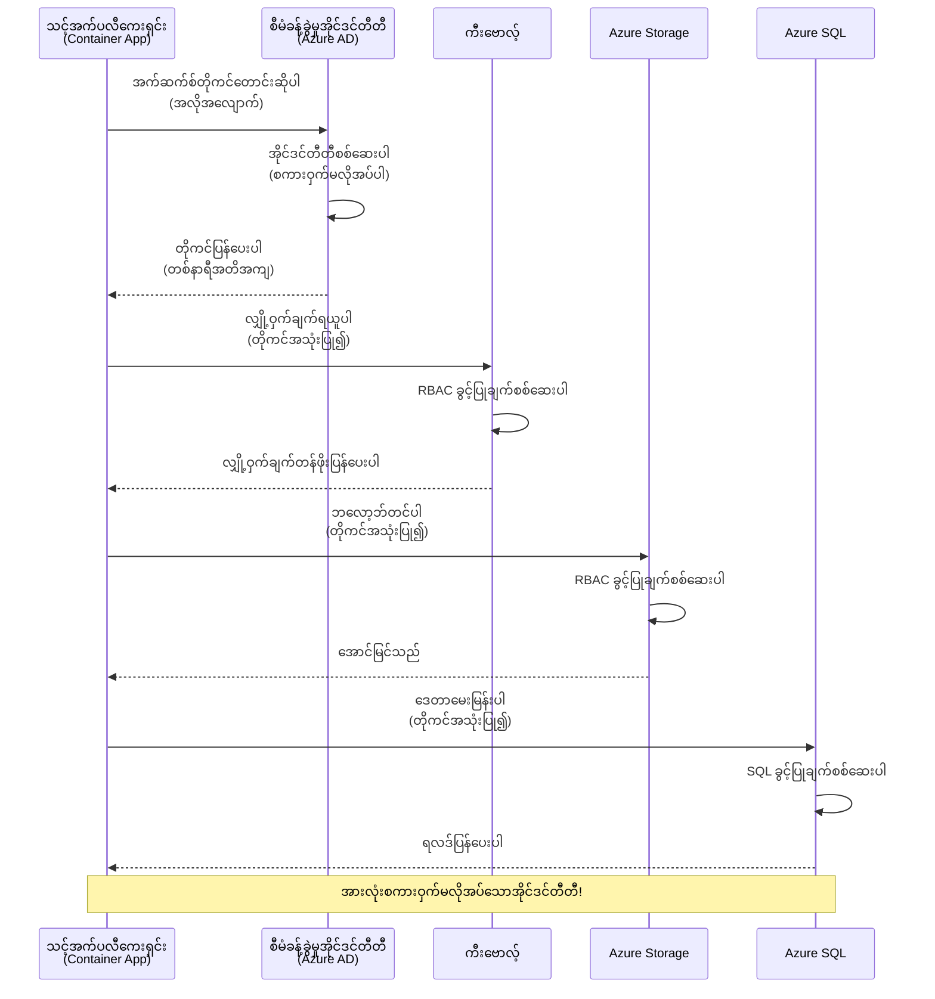
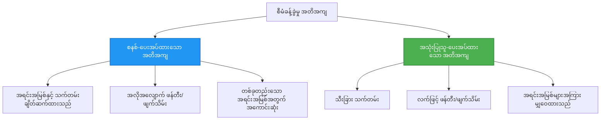

<!--
CO_OP_TRANSLATOR_METADATA:
{
  "original_hash": "e13ff6e1197e0a7462ed0aede7df9f23",
  "translation_date": "2025-11-24T00:18:01+00:00",
  "source_file": "docs/getting-started/authsecurity.md",
  "language_code": "my"
}
-->
# Authentication Patterns နှင့် Managed Identity

⏱️ **ခန့်မှန်းချိန်**: ၄၅-၆၀ မိနစ် | 💰 **ကုန်ကျစရိတ်**: အခမဲ့ (အပိုကုန်ကျစရိတ်မရှိ) | ⭐ **အဆင့်**: အလယ်အလတ်

**📚 သင်ယူမှုလမ်းကြောင်း:**
- ← အရင်ဆုံး: [Configuration Management](configuration.md) - ပတ်ဝန်းကျင် variable နှင့် လျှို့ဝှက်ချက်များကို စီမံခြင်း
- 🎯 **သင်ရှိနေသောနေရာ**: Authentication & Security (Managed Identity, Key Vault, secure patterns)
- → နောက်တစ်ခု: [First Project](first-project.md) - AZD application ပထမဆုံးတစ်ခုကို တည်ဆောက်ခြင်း
- 🏠 [သင်တန်းမူလစာမျက်နှာ](../../README.md)

---

## သင်လေ့လာနိုင်မည့်အရာများ

ဒီသင်ခန်းစာကို ပြီးမြောက်ပါက၊ သင်သည်:
- Azure authentication patterns (keys, connection strings, managed identity) ကို နားလည်မည်
- **Managed Identity** ကို password မလိုအပ်သော authentication အတွက် အသုံးပြုမည်
- **Azure Key Vault** integration ဖြင့် လျှို့ဝှက်ချက်များကို အာမခံမည်
- AZD deployments အတွက် **role-based access control (RBAC)** ကို configure လုပ်မည်
- Container Apps နှင့် Azure services တွင် လုံခြုံရေးအကောင်းဆုံးအလေ့အကျင့်များကို အသုံးပြုမည်
- key-based authentication မှ identity-based authentication သို့ ပြောင်းလဲမည်

## Managed Identity အရေးကြီးမှု

### ပြဿနာ: ရိုးရာ Authentication

**Managed Identity မရှိမီ:**
```javascript
// ❌ လုံခြုံရေးအန္တရာယ်: ကုဒ်ထဲတွင် အကြောင်းအရာများကို အတိအကျ ထည့်သွင်းထားသည်
const connectionString = "Server=mydb.database.windows.net;User=admin;Password=P@ssw0rd123";
const storageKey = "xK7mN9pQ2wR5tY8uI0oP3aS6dF1gH4jK...";
const cosmosKey = "C2x7B9n4M1p8Q5w3E6r0T2y5U8i1O4p7...";
```

**ပြဿနာများ:**
- 🔴 **လျှို့ဝှက်ချက်များ ထင်ရှားနေခြင်း** - code, config ဖိုင်များ၊ environment variables တွင်
- 🔴 **Credential rotation** - code ပြောင်းလဲမှုနှင့် redeployment လိုအပ်ခြင်း
- 🔴 **Audit ပြဿနာများ** - ဘယ်သူ ဘာကို ဘယ်အချိန်မှာ access လုပ်ခဲ့သလဲ?
- 🔴 **Sprawl** - လျှို့ဝှက်ချက်များ စနစ်များစွာတွင် ပျံ့နှံ့နေခြင်း
- 🔴 **အညီအဖွဲ့မရှိမှု** - လုံခြုံရေး audit မအောင်မြင်ခြင်း

### ဖြေရှင်းချက်: Managed Identity

**Managed Identity ရရှိပြီးနောက်:**
```javascript
// ✅ လုံခြုံသည်။ ကုဒ်တွင်လျှို့ဝှက်ချက်များမရှိပါ။
const credential = new DefaultAzureCredential();
const client = new BlobServiceClient(
  "https://mystorageaccount.blob.core.windows.net",
  credential  // Azure သည် authentication ကိုအလိုအလျောက်ဆောင်ရွက်သည်။
);
```

**အကျိုးကျေးဇူးများ:**
- ✅ **Zero secrets** - code သို့မဟုတ် configuration တွင် မပါဝင်ခြင်း
- ✅ **Automatic rotation** - Azure မှ စီမံခန့်ခွဲခြင်း
- ✅ **Audit trail အပြည့်အစုံ** - Azure AD logs တွင်
- ✅ **Centralized security** - Azure Portal တွင် စီမံခန့်ခွဲခြင်း
- ✅ **Compliance ready** - လုံခြုံရေးစံချိန်များနှင့် ကိုက်ညီခြင်း

**ဥပမာ**: ရိုးရာ authentication သည် တံခါးများစွာအတွက် physical key များကို သယ်ဆောင်ရသကဲ့သို့ဖြစ်သည်။ Managed Identity သည် သင်ဘယ်သူဖြစ်သည်ကို အခြေခံပြီး access ပေးသည့် security badge တစ်ခုကဲ့သို့ဖြစ်သည်—key မပျောက်၊ မကူး၊ မလှည့်ပတ်ရ။

---

## Architecture အကျဉ်းချုပ်

### Managed Identity ဖြင့် Authentication Flow


### Managed Identities အမျိုးအစားများ


| အင်္ဂါရပ် | System-Assigned | User-Assigned |
|---------|----------------|---------------|
| **Lifecycle** | အရင်းအမြစ်နှင့် ဆက်စပ် | လွတ်လပ် |
| **Creation** | အရင်းအမြစ်နှင့် အလိုအလျောက် | လက်ဖြင့်ဖန်တီး |
| **Deletion** | အရင်းအမြစ်နှင့် ဖျက် | အရင်းအမြစ်ဖျက်ပြီးနောက်လည်း ရှိနေ |
| **Sharing** | အရင်းအမြစ်တစ်ခုသာ | အရင်းအမြစ်များစွာ |
| **Use Case** | ရိုးရှင်းသောအခြေအနေများ | ရှုပ်ထွေးသော multi-resource အခြေအနေများ |
| **AZD Default** | ✅ အကြံပြု | Optional |

---

## အလိုအလျောက်လိုအပ်ချက်များ

### လိုအပ်သော Tools

အရင်သင်ခန်းစာများမှ သင်တပ်ဆင်ပြီးသားဖြစ်သင့်သည်:

```bash
# Azure Developer CLI ကိုစစ်ဆေးပါ
azd version
# ✅ မျှော်မှန်းထားသည်။ azd version 1.0.0 သို့မဟုတ် အထက်

# Azure CLI ကိုစစ်ဆေးပါ
az --version
# ✅ မျှော်မှန်းထားသည်။ azure-cli 2.50.0 သို့မဟုတ် အထက်
```

### Azure လိုအပ်ချက်များ

- Active Azure subscription
- အခွင့်အရေးများ:
  - Managed identities ဖန်တီးရန်
  - RBAC roles ပေးရန်
  - Key Vault resources ဖန်တီးရန်
  - Container Apps များ deploy လုပ်ရန်

### အသိပညာလိုအပ်ချက်များ

သင်ပြီးစီးထားသင့်သည်:
- [Installation Guide](installation.md) - AZD setup
- [AZD Basics](azd-basics.md) - အခြေခံအယူအဆများ
- [Configuration Management](configuration.md) - Environment variables

---

## သင်ခန်းစာ ၁: Authentication Patterns ကို နားလည်ခြင်း

### Pattern ၁: Connection Strings (ရိုးရာ - ရှောင်ရှားရန်)

**အလုပ်လုပ်ပုံ:**
```bash
# ချိတ်ဆက်မှု string တွင် အတည်ပြုချက်များ ပါရှိသည်
STORAGE_CONNECTION_STRING="DefaultEndpointsProtocol=https;AccountName=myaccount;AccountKey=xK7mN9pQ2wR5..."
COSMOS_CONNECTION_STRING="AccountEndpoint=https://myaccount.documents.azure.com:443/;AccountKey=C2x7..."
SQL_CONNECTION_STRING="Server=myserver.database.windows.net;User=admin;Password=P@ssw0rd..."
```

**ပြဿနာများ:**
- ❌ Secrets များ environment variables တွင် ထင်ရှားနေ
- ❌ Deployment systems တွင် log ဖြစ်
- ❌ လွယ်ကူစွာ rotate လုပ်ရန် မဖြစ်နိုင်
- ❌ Access အတွက် audit trail မရှိ

**အသုံးပြုရန်အချိန်:** Local development အတွက်သာ၊ production အတွက် မသုံးပါနှင့်။

---

### Pattern ၂: Key Vault References (ပိုကောင်း)

**အလုပ်လုပ်ပုံ:**
```bicep
// Store secret in Key Vault
resource keyVault 'Microsoft.KeyVault/vaults@2023-02-01' = {
  name: 'mykv'
  properties: {
    enableRbacAuthorization: true
  }
}

// Reference in Container App
env: [
  {
    name: 'STORAGE_KEY'
    secretRef: 'storage-key'  // References Key Vault
  }
]
```

**အကျိုးကျေးဇူးများ:**
- ✅ Secrets များ Key Vault တွင် လုံခြုံစွာ သိမ်းဆည်းထား
- ✅ လျှို့ဝှက်ချက်များကို စုစည်းစီမံခန့်ခွဲနိုင်
- ✅ Code ပြောင်းလဲမှုမလိုအပ်ဘဲ rotation လုပ်နိုင်

**ကန့်သတ်ချက်များ:**
- ⚠️ Keys/passwords ကို သုံးနေဆဲ
- ⚠️ Key Vault access ကို စီမံရမည်

**အသုံးပြုရန်အချိန်:** Connection strings မှ Managed Identity သို့ ပြောင်းလဲရန်အဆင့်။

---

### Pattern ၃: Managed Identity (အကောင်းဆုံးအလေ့အကျင့်)

**အလုပ်လုပ်ပုံ:**
```bicep
// Enable managed identity
resource containerApp 'Microsoft.App/containerApps@2023-05-01' = {
  name: 'myapp'
  identity: {
    type: 'SystemAssigned'  // Automatically creates identity
  }
}

// Grant permissions
resource roleAssignment 'Microsoft.Authorization/roleAssignments@2022-04-01' = {
  scope: storageAccount
  properties: {
    roleDefinitionId: storageBlobDataContributorRole
    principalId: containerApp.identity.principalId
  }
}
```

**Application code:**
```javascript
// လျှို့ဝှက်ချက်များမလိုအပ်ပါ!
const { DefaultAzureCredential } = require('@azure/identity');
const { BlobServiceClient } = require('@azure/storage-blob');

const credential = new DefaultAzureCredential();
const blobServiceClient = new BlobServiceClient(
  'https://mystorageaccount.blob.core.windows.net',
  credential
);
```

**အကျိုးကျေးဇူးများ:**
- ✅ Code/config တွင် လျှို့ဝှက်ချက်မပါ
- ✅ Automatic credential rotation
- ✅ Audit trail အပြည့်အစုံ
- ✅ RBAC-based permissions
- ✅ Compliance ready

**အသုံးပြုရန်အချိန်:** Production applications အတွက် အမြဲတမ်း။

---

## သင်ခန်းစာ ၂: AZD ဖြင့် Managed Identity ကို အသုံးပြုခြင်း

### အဆင့်လိုက် အကောင်အထည်ဖော်ခြင်း

Managed identity ကို အသုံးပြု၍ Azure Storage နှင့် Key Vault ကို access လုပ်သည့် secure Container App တစ်ခုကို တည်ဆောက်ကြမည်။

### Project Structure

```
secure-app/
├── azure.yaml                 # AZD configuration
├── infra/
│   ├── main.bicep            # Main infrastructure
│   ├── core/
│   │   ├── identity.bicep    # Managed identity setup
│   │   ├── keyvault.bicep    # Key Vault configuration
│   │   └── storage.bicep     # Storage with RBAC
│   └── app/
│       └── container-app.bicep
└── src/
    ├── app.js                # Application code
    ├── package.json
    └── Dockerfile
```

### ၁. AZD ကို configure လုပ်ပါ (azure.yaml)

```yaml
name: secure-app
metadata:
  template: secure-app@1.0.0

services:
  api:
    project: ./src
    language: js
    host: containerapp

# Enable managed identity (AZD handles this automatically)
```

### ၂. Infrastructure: Managed Identity ကို enable လုပ်ပါ

**ဖိုင်: `infra/main.bicep`**

```bicep
targetScope = 'subscription'

param environmentName string
param location string = 'eastus'

var tags = { 'azd-env-name': environmentName }

// Resource group
resource rg 'Microsoft.Resources/resourceGroups@2021-04-01' = {
  name: 'rg-${environmentName}'
  location: location
  tags: tags
}

// Storage Account
module storage './core/storage.bicep' = {
  name: 'storage'
  scope: rg
  params: {
    name: 'st${uniqueString(rg.id)}'
    location: location
    tags: tags
  }
}

// Key Vault
module keyVault './core/keyvault.bicep' = {
  name: 'keyvault'
  scope: rg
  params: {
    name: 'kv-${uniqueString(rg.id)}'
    location: location
    tags: tags
  }
}

// Container App with Managed Identity
module containerApp './app/container-app.bicep' = {
  name: 'container-app'
  scope: rg
  params: {
    name: 'ca-${environmentName}'
    location: location
    tags: tags
    storageAccountName: storage.outputs.name
    keyVaultName: keyVault.outputs.name
  }
}

// Grant Container App access to Storage
module storageRoleAssignment './core/role-assignment.bicep' = {
  name: 'storage-role'
  scope: rg
  params: {
    principalId: containerApp.outputs.identityPrincipalId
    roleDefinitionId: 'ba92f5b4-2d11-453d-a403-e96b0029c9fe'  // Storage Blob Data Contributor
    targetResourceId: storage.outputs.id
  }
}

// Grant Container App access to Key Vault
module kvRoleAssignment './core/role-assignment.bicep' = {
  name: 'kv-role'
  scope: rg
  params: {
    principalId: containerApp.outputs.identityPrincipalId
    roleDefinitionId: '4633458b-17de-408a-b874-0445c86b69e6'  // Key Vault Secrets User
    targetResourceId: keyVault.outputs.id
  }
}

// Outputs
output AZURE_STORAGE_ACCOUNT_NAME string = storage.outputs.name
output AZURE_KEY_VAULT_NAME string = keyVault.outputs.name
output APP_URL string = containerApp.outputs.url
```

### ၃. System-Assigned Identity ဖြင့် Container App

**ဖိုင်: `infra/app/container-app.bicep`**

```bicep
param name string
param location string
param tags object = {}
param storageAccountName string
param keyVaultName string

resource containerApp 'Microsoft.App/containerApps@2023-05-01' = {
  name: name
  location: location
  tags: tags
  identity: {
    type: 'SystemAssigned'  // 🔑 Enable managed identity
  }
  properties: {
    configuration: {
      ingress: {
        external: true
        targetPort: 3000
      }
    }
    template: {
      containers: [
        {
          name: 'api'
          image: 'myregistry.azurecr.io/api:latest'
          resources: {
            cpu: json('0.5')
            memory: '1Gi'
          }
          env: [
            {
              name: 'AZURE_STORAGE_ACCOUNT_NAME'
              value: storageAccountName
            }
            {
              name: 'AZURE_KEY_VAULT_NAME'
              value: keyVaultName
            }
            // 🔑 No secrets - managed identity handles authentication!
          ]
        }
      ]
    }
  }
}

// Output the identity for RBAC assignments
output identityPrincipalId string = containerApp.identity.principalId
output id string = containerApp.id
output url string = 'https://${containerApp.properties.configuration.ingress.fqdn}'
```

### ၄. RBAC Role Assignment Module

**ဖိုင်: `infra/core/role-assignment.bicep`**

```bicep
param principalId string
param roleDefinitionId string  // Azure built-in role ID
param targetResourceId string

resource roleAssignment 'Microsoft.Authorization/roleAssignments@2022-04-01' = {
  name: guid(principalId, roleDefinitionId, targetResourceId)
  scope: resourceId('Microsoft.Resources/resourceGroups', resourceGroup().name)
  properties: {
    roleDefinitionId: subscriptionResourceId('Microsoft.Authorization/roleDefinitions', roleDefinitionId)
    principalId: principalId
    principalType: 'ServicePrincipal'
  }
}

output id string = roleAssignment.id
```

### ၅. Managed Identity ဖြင့် Application Code

**ဖိုင်: `src/app.js`**

```javascript
const express = require('express');
const { DefaultAzureCredential } = require('@azure/identity');
const { BlobServiceClient } = require('@azure/storage-blob');
const { SecretClient } = require('@azure/keyvault-secrets');

const app = express();
const PORT = process.env.PORT || 3000;

// 🔑 အချက်အလက်များကို စတင်မည် (managed identity ဖြင့် အလိုအလျောက် အလုပ်လုပ်သည်)
const credential = new DefaultAzureCredential();

// Azure Storage ကို စတင်ပြင်ဆင်ခြင်း
const storageAccountName = process.env.AZURE_STORAGE_ACCOUNT_NAME;
const blobServiceClient = new BlobServiceClient(
  `https://${storageAccountName}.blob.core.windows.net`,
  credential  // key မလိုအပ်ပါ!
);

// Key Vault ကို စတင်ပြင်ဆင်ခြင်း
const keyVaultName = process.env.AZURE_KEY_VAULT_NAME;
const secretClient = new SecretClient(
  `https://${keyVaultName}.vault.azure.net`,
  credential  // key မလိုအပ်ပါ!
);

// ကျန်းမာရေး စစ်ဆေးခြင်း
app.get('/health', (req, res) => {
  res.json({ status: 'healthy', authentication: 'managed-identity' });
});

// blob storage သို့ ဖိုင်တင်ခြင်း
app.post('/upload', async (req, res) => {
  try {
    const containerClient = blobServiceClient.getContainerClient('uploads');
    await containerClient.createIfNotExists();
    
    const blobName = `file-${Date.now()}.txt`;
    const blockBlobClient = containerClient.getBlockBlobClient(blobName);
    
    await blockBlobClient.upload('Hello from managed identity!', 30);
    
    res.json({
      success: true,
      blobName: blobName,
      message: 'File uploaded using managed identity!'
    });
  } catch (error) {
    console.error('Upload error:', error);
    res.status(500).json({ error: error.message });
  }
});

// Key Vault မှ လျှို့ဝှက်ချက်ရယူခြင်း
app.get('/secret/:name', async (req, res) => {
  try {
    const secretName = req.params.name;
    const secret = await secretClient.getSecret(secretName);
    
    res.json({
      name: secretName,
      value: secret.value,
      message: 'Secret retrieved using managed identity!'
    });
  } catch (error) {
    console.error('Secret error:', error);
    res.status(500).json({ error: error.message });
  }
});

// blob containers များကို စာရင်းပြုလုပ်ခြင်း (ဖတ်ခွင့်ကို ပြသသည်)
app.get('/containers', async (req, res) => {
  try {
    const containers = [];
    for await (const container of blobServiceClient.listContainers()) {
      containers.push(container.name);
    }
    
    res.json({
      containers: containers,
      count: containers.length,
      message: 'Containers listed using managed identity!'
    });
  } catch (error) {
    console.error('List error:', error);
    res.status(500).json({ error: error.message });
  }
});

app.listen(PORT, () => {
  console.log(`Secure API listening on port ${PORT}`);
  console.log('Authentication: Managed Identity (passwordless)');
});
```

**ဖိုင်: `src/package.json`**

```json
{
  "name": "secure-app",
  "version": "1.0.0",
  "dependencies": {
    "express": "^4.18.2",
    "@azure/identity": "^4.0.0",
    "@azure/storage-blob": "^12.17.0",
    "@azure/keyvault-secrets": "^4.7.0"
  },
  "scripts": {
    "start": "node app.js"
  }
}
```

### ၆. Deploy နှင့် Test

```bash
# AZD ပတ်ဝန်းကျင်ကို စတင်ပါ
azd init

# အခြေခံအဆောက်အအုံနှင့် အပလီကေးရှင်းကို တင်သွင်းပါ
azd up

# အပလီကေးရှင်း URL ကို ရယူပါ
APP_URL=$(azd env get-values | grep APP_URL | cut -d '=' -f2 | tr -d '"')

# ကျန်းမာရေးစစ်ဆေးမှုကို စမ်းသပ်ပါ
curl $APP_URL/health
```

**✅ မျှော်မှန်းရလဒ်:**
```json
{
  "status": "healthy",
  "authentication": "managed-identity"
}
```

**Blob upload ကို စမ်းသပ်ပါ:**
```bash
curl -X POST $APP_URL/upload
```

**✅ မျှော်မှန်းရလဒ်:**
```json
{
  "success": true,
  "blobName": "file-1700404800000.txt",
  "message": "File uploaded using managed identity!"
}
```

**Container listing ကို စမ်းသပ်ပါ:**
```bash
curl $APP_URL/containers
```

**✅ မျှော်မှန်းရလဒ်:**
```json
{
  "containers": ["uploads"],
  "count": 1,
  "message": "Containers listed using managed identity!"
}
```

---

## Common Azure RBAC Roles

### Managed Identity အတွက် Built-in Role IDs

| Service | Role Name | Role ID | Permissions |
|---------|-----------|---------|-------------|
| **Storage** | Storage Blob Data Reader | `2a2b9908-6b94-4a3d-8e5a-a7d8f8cc8a12` | Blobs နှင့် containers ကို ဖတ်ရန် |
| **Storage** | Storage Blob Data Contributor | `ba92f5b4-2d11-453d-a403-e96b0029c9fe` | Blobs ကို ဖတ်၊ ရေး၊ ဖျက်ရန် |
| **Storage** | Storage Queue Data Contributor | `974c5e8b-45b9-4653-ba55-5f855dd0fb88` | Queue messages ကို ဖတ်၊ ရေး၊ ဖျက်ရန် |
| **Key Vault** | Key Vault Secrets User | `4633458b-17de-408a-b874-0445c86b69e6` | Secrets ကို ဖတ်ရန် |
| **Key Vault** | Key Vault Secrets Officer | `b86a8fe4-44ce-4948-aee5-eccb2c155cd7` | Secrets ကို ဖတ်၊ ရေး၊ ဖျက်ရန် |
| **Cosmos DB** | Cosmos DB Built-in Data Reader | `00000000-0000-0000-0000-000000000001` | Cosmos DB data ကို ဖတ်ရန် |
| **Cosmos DB** | Cosmos DB Built-in Data Contributor | `00000000-0000-0000-0000-000000000002` | Cosmos DB data ကို ဖတ်၊ ရေးရန် |
| **SQL Database** | SQL DB Contributor | `9b7fa17d-e63e-47b0-bb0a-15c516ac86ec` | SQL databases ကို စီမံရန် |
| **Service Bus** | Azure Service Bus Data Owner | `090c5cfd-751d-490a-894a-3ce6f1109419` | Messages ကို ပို့၊ လက်ခံ၊ စီမံရန် |

### Role IDs ကို ရှာဖွေခြင်း

```bash
# တပ်ဆင်ပြီးသား အခန်းကဏ္ဍများအားလုံးကို စာရင်းပြုလုပ်ပါ
az role definition list --query "[].{Name:roleName, ID:name}" --output table

# အထူးသတ်မှတ်ထားသော အခန်းကဏ္ဍကို ရှာဖွေပါ
az role definition list --query "[?contains(roleName, 'Storage Blob')].{Name:roleName, ID:name}" --output table

# အခန်းကဏ္ဍအသေးစိတ်ကို ရယူပါ
az role definition list --name "Storage Blob Data Contributor"
```

---

## လက်တွေ့လေ့ကျင့်မှုများ

### လေ့ကျင့်မှု ၁: ရှိပြီးသား App အတွက် Managed Identity ကို Enable လုပ်ပါ ⭐⭐ (အလယ်အလတ်)

**ရည်ရွယ်ချက်**: Connection strings ကို အသုံးပြုနေသော Container App deployment တစ်ခုကို Managed Identity သို့ ပြောင်းလဲပါ

**အခြေအနေ**: Connection strings ကို အသုံးပြုနေသော Container App တစ်ခုရှိသည်။ Managed Identity သို့ ပြောင်းလဲပါ။

**စတင်နေရာ**: Container App configuration:

```bicep
// ❌ Current: Using connection string
env: [
  {
    name: 'STORAGE_CONNECTION_STRING'
    secretRef: 'storage-connection'
  }
]
```

**အဆင့်များ**:

၁. **Bicep တွင် Managed Identity ကို enable လုပ်ပါ:**

```bicep
resource containerApp 'Microsoft.App/containerApps@2023-05-01' = {
  name: 'myapp'
  identity: {
    type: 'SystemAssigned'  // Add this
  }
  // ... rest of configuration
}
```

၂. **Storage access ကို ပေးပါ:**

```bicep
// Get storage account reference
resource storageAccount 'Microsoft.Storage/storageAccounts@2023-01-01' existing = {
  name: storageAccountName
}

// Assign role
resource roleAssignment 'Microsoft.Authorization/roleAssignments@2022-04-01' = {
  name: guid(containerApp.id, 'ba92f5b4-2d11-453d-a403-e96b0029c9fe', storageAccount.id)
  scope: storageAccount
  properties: {
    roleDefinitionId: subscriptionResourceId('Microsoft.Authorization/roleDefinitions', 'ba92f5b4-2d11-453d-a403-e96b0029c9fe')
    principalId: containerApp.identity.principalId
    principalType: 'ServicePrincipal'
  }
}
```

၃. **Application code ကို update လုပ်ပါ:**

**Connection string (မပြောင်းလဲမီ):**
```javascript
const { BlobServiceClient } = require('@azure/storage-blob');

const blobServiceClient = BlobServiceClient.fromConnectionString(
  process.env.STORAGE_CONNECTION_STRING
);
```

**Managed Identity (ပြောင်းလဲပြီး):**
```javascript
const { DefaultAzureCredential } = require('@azure/identity');
const { BlobServiceClient } = require('@azure/storage-blob');

const credential = new DefaultAzureCredential();
const blobServiceClient = new BlobServiceClient(
  `https://${process.env.STORAGE_ACCOUNT_NAME}.blob.core.windows.net`,
  credential
);
```

၄. **Environment variables ကို update လုပ်ပါ:**

```bicep
env: [
  {
    name: 'STORAGE_ACCOUNT_NAME'
    value: storageAccountName  // Just the name, no secrets!
  }
  // Remove STORAGE_CONNECTION_STRING
]
```

၅. **Deploy နှင့် test လုပ်ပါ:**

```bash
# ပြန်လည်တပ်ဆင်ပါ
azd up

# ဒါက အလုပ်လုပ်နေဆဲလား စမ်းသပ်ပါ
curl https://myapp.azurecontainerapps.io/upload
```

**✅ အောင်မြင်မှု criteria:**
- ✅ Application deploy လုပ်ရာတွင် error မရှိ
- ✅ Storage operations အလုပ်လုပ် (upload, list, download)
- ✅ Environment variables တွင် connection strings မပါ
- ✅ Identity ကို Azure Portal တွင် "Identity" blade အောက်တွင် မြင်နိုင်

**အတည်ပြုခြင်း:**

```bash
# စီမံခန့်ခွဲမှုအတိအကျမှုကိုဖွင့်ထားသည်ကိုစစ်ဆေးပါ
az containerapp show \
  --name myapp \
  --resource-group rg-myapp \
  --query "identity.type"
# ✅ မျှော်မှန်းထားသည်: "SystemAssigned"

# အခန်းကဏ္ဍတာဝန်ပေးအပ်မှုကိုစစ်ဆေးပါ
az role assignment list \
  --assignee $(az containerapp show --name myapp --resource-group rg-myapp --query "identity.principalId" -o tsv) \
  --scope /subscriptions/{sub-id}/resourceGroups/rg-myapp/providers/Microsoft.Storage/storageAccounts/mystorageaccount
# ✅ မျှော်မှန်းထားသည်: "Storage Blob Data Contributor" အခန်းကဏ္ဍကိုပြသည်
```

**အချိန်**: ၂၀-၃၀ မိနစ်

---

### လေ့ကျင့်မှု ၂: Multi-Service Access ကို User-Assigned Identity ဖြင့် အကောင်အထည်ဖော်ပါ ⭐⭐⭐ (ရှုပ်ထွေး)

**ရည်ရွယ်ချက်**: User-assigned identity တစ်ခုကို Container Apps များစွာတွင် မျှဝေအသုံးပြုပါ

**အခြေအနေ**: Storage account နှင့် Key Vault ကို access လုပ်ရန်လိုအပ်သော microservices ၃ ခုရှိသည်။

**အဆင့်များ**:

၁. **User-assigned identity ကို ဖန်တီးပါ:**

**ဖိုင်: `infra/core/identity.bicep`**

```bicep
param name string
param location string
param tags object = {}

resource userAssignedIdentity 'Microsoft.ManagedIdentity/userAssignedIdentities@2023-01-31' = {
  name: name
  location: location
  tags: tags
}

output id string = userAssignedIdentity.id
output principalId string = userAssignedIdentity.properties.principalId
output clientId string = userAssignedIdentity.properties.clientId
```

၂. **User-assigned identity ကို roles ပေးပါ:**

```bicep
// In main.bicep
module userIdentity './core/identity.bicep' = {
  name: 'user-identity'
  scope: rg
  params: {
    name: 'id-${environmentName}'
    location: location
    tags: tags
  }
}

// Grant Storage access
resource storageRoleAssignment 'Microsoft.Authorization/roleAssignments@2022-04-01' = {
  name: guid(userIdentity.outputs.principalId, 'storage-contributor')
  scope: storageAccount
  properties: {
    roleDefinitionId: subscriptionResourceId('Microsoft.Authorization/roleDefinitions', 'ba92f5b4-2d11-453d-a403-e96b0029c9fe')
    principalId: userIdentity.outputs.principalId
    principalType: 'ServicePrincipal'
  }
}

// Grant Key Vault access
resource kvRoleAssignment 'Microsoft.Authorization/roleAssignments@2022-04-01' = {
  name: guid(userIdentity.outputs.principalId, 'kv-secrets-user')
  scope: keyVault
  properties: {
    roleDefinitionId: subscriptionResourceId('Microsoft.Authorization/roleDefinitions', '4633458b-17de-408a-b874-0445c86b69e6')
    principalId: userIdentity.outputs.principalId
    principalType: 'ServicePrincipal'
  }
}
```

၃. **Identity ကို Container Apps များစွာတွင် assign လုပ်ပါ:**

```bicep
resource apiGateway 'Microsoft.App/containerApps@2023-05-01' = {
  name: 'api-gateway'
  identity: {
    type: 'UserAssigned'
    userAssignedIdentities: {
      '${userIdentity.outputs.id}': {}
    }
  }
  // ... rest of config
}

resource productService 'Microsoft.App/containerApps@2023-05-01' = {
  name: 'product-service'
  identity: {
    type: 'UserAssigned'
    userAssignedIdentities: {
      '${userIdentity.outputs.id}': {}
    }
  }
  // ... rest of config
}

resource orderService 'Microsoft.App/containerApps@2023-05-01' = {
  name: 'order-service'
  identity: {
    type: 'UserAssigned'
    userAssignedIdentities: {
      '${userIdentity.outputs.id}': {}
    }
  }
  // ... rest of config
}
```

၄. **Application code (services အားလုံးသည် အတူတူ pattern ကို အသုံးပြု):**

```javascript
const { DefaultAzureCredential, ManagedIdentityCredential } = require('@azure/identity');

// အသုံးပြုသူပေးအပ်ထားသော အတိအကျမှတ်ပုံတင်အတွက် client ID ကို သတ်မှတ်ပါ
const credential = new ManagedIdentityCredential(
  process.env.AZURE_CLIENT_ID  // အသုံးပြုသူပေးအပ်ထားသော အတိအကျမှတ်ပုံတင် client ID
);

// ဒါမှမဟုတ် DefaultAzureCredential ကို အသုံးပြုပါ (အလိုအလျောက် ရှာဖွေသည်)
const credential = new DefaultAzureCredential();

const blobServiceClient = new BlobServiceClient(
  `https://${process.env.STORAGE_ACCOUNT_NAME}.blob.core.windows.net`,
  credential
);
```

၅. **Deploy နှင့် verify လုပ်ပါ:**

```bash
azd up

# ဝန်ဆောင်မှုအားလုံးသည်သိုလှောင်မှုကိုဝင်ရောက်နိုင်ကြောင်းစမ်းသပ်ပါ
curl https://api-gateway.azurecontainerapps.io/upload
curl https://product-service.azurecontainerapps.io/upload
curl https://order-service.azurecontainerapps.io/upload
```

**✅ အောင်မြင်မှု criteria:**
- ✅ Identity တစ်ခုကို services ၃ ခုတွင် မျှဝေ
- ✅ Services အားလုံးသည် Storage နှင့် Key Vault ကို access လုပ်နိုင်
- ✅ Service တစ်ခုကို ဖျက်ပါက identity ရှိနေဆဲ
- ✅ Permission management ကို စုစည်းစီမံနိုင်

**User-Assigned Identity ၏ အကျိုးကျေးဇူးများ:**
- Identity တစ်ခုသာ စီမံရမည်
- Services အားလုံးတွင် permission တူညီမှု
- Service ဖျက်ပါကလည်း ရှိနေဆဲ
- ရှုပ်ထွေးသော architecture များအတွက် ပိုကောင်း

**အချိန်**: ၃၀-၄၀ မိနစ်

---

### လေ့ကျင့်မှု ၃: Key Vault Secret Rotation ကို အကောင်အထည်ဖော်ပါ ⭐⭐⭐ (ရှုပ်ထွေး)

**ရည်ရွယ်ချက်**: Third-party API keys များကို Key Vault တွင် သိမ်းဆည်းပြီး managed identity ဖြင့် access လုပ်ပါ

**အခြေအနေ**: သင်၏ app သည် external API (OpenAI, Stripe, SendGrid) ကို ခေါ်ရန် API keys လိုအပ်သည်။

**အဆင့်များ**:

၁. **RBAC ဖြင့် Key Vault ကို ဖန်တီးပါ:**

**ဖိုင်: `infra/core/keyvault.bicep`**

```bicep
param name string
param location string
param tags object = {}

resource keyVault 'Microsoft.KeyVault/vaults@2023-02-01' = {
  name: name
  location: location
  tags: tags
  properties: {
    enableRbacAuthorization: true  // Use RBAC instead of access policies
    sku: {
      family: 'A'
      name: 'standard'
    }
    tenantId: subscription().tenantId
    enableSoftDelete: true
    softDeleteRetentionInDays: 90
  }
}

// Allow Container App to read secrets
output id string = keyVault.id
output name string = keyVault.name
output uri string = keyVault.properties.vaultUri
```

၂. **Secrets များကို Key Vault တွင် သိမ်းဆည်းပါ:**

```bash
# Key Vault အမည်ရယူပါ
KV_NAME=$(azd env get-values | grep AZURE_KEY_VAULT_NAME | cut -d '=' -f2 | tr -d '"')

# တတိယပါတီ API key များကို သိမ်းဆည်းပါ
az keyvault secret set \
  --vault-name $KV_NAME \
  --name "OpenAI-ApiKey" \
  --value "sk-proj-xxxxxxxxxxxxx"

az keyvault secret set \
  --vault-name $KV_NAME \
  --name "Stripe-ApiKey" \
  --value "sk_live_xxxxxxxxxxxxx"

az keyvault secret set \
  --vault-name $KV_NAME \
  --name "SendGrid-ApiKey" \
  --value "SG.xxxxxxxxxxxxx"
```

၃. **Secrets ကို retrieve လုပ်ရန် Application code:**

**ဖိုင်: `src/config.js`**

```javascript
const { DefaultAzureCredential } = require('@azure/identity');
const { SecretClient } = require('@azure/keyvault-secrets');

class Config {
  constructor() {
    this.credential = new DefaultAzureCredential();
    this.secretClient = new SecretClient(
      `https://${process.env.AZURE_KEY_VAULT_NAME}.vault.azure.net`,
      this.credential
    );
    this.cache = {};
  }

  async getSecret(secretName) {
    // အရင်ဆုံး cache ကို စစ်ဆေးပါ
    if (this.cache[secretName]) {
      return this.cache[secretName];
    }

    try {
      const secret = await this.secretClient.getSecret(secretName);
      this.cache[secretName] = secret.value;
      console.log(`✅ Retrieved secret: ${secretName}`);
      return secret.value;
    } catch (error) {
      console.error(`❌ Failed to get secret ${secretName}:`, error.message);
      throw error;
    }
  }

  async getOpenAIKey() {
    return this.getSecret('OpenAI-ApiKey');
  }

  async getStripeKey() {
    return this.getSecret('Stripe-ApiKey');
  }

  async getSendGridKey() {
    return this.getSecret('SendGrid-ApiKey');
  }
}

module.exports = new Config();
```

၄. **Application တွင် secrets ကို အသုံးပြုပါ:**

**ဖိုင်: `src/app.js`**

```javascript
const express = require('express');
const config = require('./config');
const { OpenAI } = require('openai');

const app = express();

// Key Vault မှ key ဖြင့် OpenAI ကို initialize လုပ်ပါ
let openaiClient;

async function initializeServices() {
  const openaiKey = await config.getOpenAIKey();
  openaiClient = new OpenAI({ apiKey: openaiKey });
  console.log('✅ Services initialized with secrets from Key Vault');
}

// စတင်မှုတွင် ခေါ်ပါ
initializeServices().catch(console.error);

app.post('/chat', async (req, res) => {
  try {
    const completion = await openaiClient.chat.completions.create({
      model: 'gpt-4',
      messages: [{ role: 'user', content: 'Hello!' }]
    });
    
    res.json({
      response: completion.choices[0].message.content,
      authentication: 'Key from Key Vault via Managed Identity'
    });
  } catch (error) {
    res.status(500).json({ error: error.message });
  }
});

app.listen(3000, () => {
  console.log('Secure API with Key Vault integration running');
});
```

၅. **Deploy နှင့် test လုပ်ပါ:**

```bash
azd up

# API key များအလုပ်လုပ်ကြောင်း စမ်းသပ်ပါ
curl -X POST https://myapp.azurecontainerapps.io/chat \
  -H "Content-Type: application/json" \
  -d '{"message":"Hello AI"}'
```

**✅ အောင်မြင်မှု criteria:**
- ✅ Code သို့မဟုတ် environment variables တွင် API keys မပါ
- ✅ Application သည် Key Vault မှ keys ကို retrieve လုပ်နိုင်
- ✅ Third-party APIs အလုပ်လုပ်
- ✅ Keys ကို code ပြောင်းလဲမှုမလိုအပ်ဘဲ rotate လုပ်နိုင်

**Secret ကို rotate လုပ်ပါ:**

```bash
# Key Vault တွင် လျှို့ဝှက်ချက်ကို အပ်ဒိတ်လုပ်ပါ။
az keyvault secret set \
  --vault-name $KV_NAME \
  --name "OpenAI-ApiKey" \
  --value "sk-proj-NEW_KEY_HERE"

# အပ်ဒိတ်လုပ်ထားသော key ကို အသုံးပြုရန် app ကို ပြန်လည်စတင်ပါ။
az containerapp revision restart \
  --name myapp \
  --resource-group rg-myapp
```

**အချိန်**: ၂၅-၃၅ မိနစ်

---

## Knowledge Checkpoint

### ၁. Authentication Patterns ✓

သင်၏နားလည်မှုကို စမ်းသပ်ပါ:

- [ ] **Q1**: Authentication patterns ၃ ခုက ဘာတွေလဲ? 
  - **A**: Connection strings (ရိုးရာ), Key Vault references (အဆင့်ပြောင်း), Managed Identity (အကောင်းဆုံး)

- [ ] **Q2**: Managed Identity သည် connection strings ထက် ဘာကြောင့် ပိုကောင်းသလဲ?
  - **A**: Code တွင် secrets မပါ, automatic rotation, audit trail အပြည့်အစုံ, RBAC permissions

- [ ] **Q3**: System-assigned အစား user-assigned identity ကို ဘယ်အချိန်မှာ အသုံးပြုမလဲ?
  - **A**: Multiple resources တွင် identity ကို မျှဝေသုံးရန် သို့မဟုတ် resource lifecycle နှင့် လွတ်လပ်မှုလိုအပ်သောအခါ

**လက်တွေ့အတည်ပြုမှု:**
```bash
# သင့်အက်ပ်မှာ အသုံးပြုတဲ့ အိုင်ဒီအမျိုးအစားကို စစ်ဆေးပါ။
az containerapp show \
  --name myapp \
  --resource-group rg-myapp \
  --query "identity.type"

# အိုင်ဒီအတွက် အခန်းကဏ္ဍတာဝန်ပေးမှုအားလုံးကို စာရင်းပြုစုပါ။
az role assignment list \
  --assignee $(az containerapp show --name myapp --resource-group rg-myapp --query "identity.principalId" -o tsv)
```

---

### ၂. RBAC နှင့် Permissions ✓

သင်၏နားလည်မှုကို စမ်းသပ်ပါ:

- [ ] **Q1**: "Storage Blob Data Contributor" ၏ role ID က ဘာလဲ?
  - **A**: `ba92f5b4-2d11-453d-a403-e96b0029c9fe`

- [ ] **Q2**: "Key Vault Secrets User" role သည် ဘာအခွင့်အရေးများပေးသလဲ?
  - **A**: Secrets ကို ဖတ်
- [ ] **Q1**: Key Vault အတွက် access policies အစား RBAC ကို ဘယ်လို enable လုပ်မလဲ?
  - **A**: Bicep မှာ `enableRbacAuthorization: true` ကို set လုပ်ပါ

- [ ] **Q2**: Managed identity authentication ကို handle လုပ်တဲ့ Azure SDK library က ဘာလဲ?
  - **A**: `@azure/identity` နဲ့ `DefaultAzureCredential` class

- [ ] **Q3**: Key Vault secrets တွေ cache မှာ ဘယ်လောက်ကြာမြင့်အောင်နေမလဲ?
  - **A**: Application အပေါ်မူတည်ပြီး; ကိုယ်ပိုင် caching strategy ကို implement လုပ်ပါ

**Hands-On Verification:**
```bash
# Key Vault ဝင်ရောက်မှုကို စမ်းသပ်ပါ
az keyvault secret show \
  --vault-name $KV_NAME \
  --name "OpenAI-ApiKey" \
  --query "value"

# RBAC ဖွင့်ထားသည်ကို စစ်ဆေးပါ
az keyvault show \
  --name $KV_NAME \
  --query "properties.enableRbacAuthorization"
# ✅ မျှော်မှန်းထားသည်: true
```

---

## လုံခြုံရေးအတွက် အကောင်းဆုံးအကြံဉာဏ်များ

### ✅ လုပ်သင့်တာများ:

1. **Production မှာ managed identity ကို အမြဲအသုံးပြုပါ**
   ```bicep
   identity: {
     type: 'SystemAssigned'
   }
   ```

2. **အနည်းဆုံး-အခွင့်အရေး RBAC roles ကို အသုံးပြုပါ**
   - "Reader" roles ကို အခွင့်အရေးရှိသလောက် အသုံးပြုပါ
   - "Owner" သို့မဟုတ် "Contributor" ကို လိုအပ်မှသာ အသုံးပြုပါ

3. **Third-party keys တွေကို Key Vault မှာ သိမ်းဆည်းပါ**
   ```javascript
   const apiKey = await secretClient.getSecret('ThirdPartyApiKey');
   ```

4. **Audit logging ကို enable လုပ်ပါ**
   ```bicep
   diagnosticSettings: {
     logs: [{ category: 'AuditEvent', enabled: true }]
   }
   ```

5. **Dev/staging/prod အတွက် အခြား identity တွေကို အသုံးပြုပါ**
   ```bash
   azd env new dev
   azd env new staging
   azd env new prod
   ```

6. **Secrets တွေကို အကြိမ်ကြိမ် ပြောင်းလဲပါ**
   - Key Vault secrets တွေမှာ expiration dates သတ်မှတ်ပါ
   - Azure Functions နဲ့ rotation ကို automate လုပ်ပါ

### ❌ မလုပ်သင့်တာများ:

1. **Secrets တွေကို hardcode မလုပ်ပါနဲ့**
   ```javascript
   // ❌ မကောင်းပါဘူး
   const apiKey = "sk-proj-xxxxxxxxxxxxx";
   ```

2. **Production မှာ connection strings မသုံးပါနဲ့**
   ```javascript
   // ❌ မကောင်းပါဘူး
   BlobServiceClient.fromConnectionString(process.env.STORAGE_CONNECTION_STRING)
   ```

3. **အလွန်များသော permissions မပေးပါနဲ့**
   ```bicep
   // ❌ BAD - too much access
   roleDefinitionId: 'Owner'
   
   // ✅ GOOD - least privilege
   roleDefinitionId: 'Storage Blob Data Reader'
   ```

4. **Secrets တွေကို log မထည့်ပါနဲ့**
   ```javascript
   // ❌ မကောင်းပါဘူး
   console.log('API Key:', apiKey);
   
   // ✅ ကောင်းပါတယ်
   console.log('API Key retrieved successfully');
   ```

5. **Production identities တွေကို environments အကြား မမျှဝေပါနဲ့**
   ```bicep
   // ❌ BAD - same identity for dev and prod
   // ✅ GOOD - separate identities per environment
   ```

---

## ပြဿနာဖြေရှင်းလမ်းညွှန်

### ပြဿနာ: Azure Storage ကို access လုပ်တဲ့အခါ "Unauthorized" ဖြစ်နေသည်

**Symptoms:**
```
Error: Unauthorized (403)
AuthorizationPermissionMismatch: This request is not authorized to perform this operation
```

**Diagnosis:**

```bash
# စီမံခန့်ခွဲမှုအတိအကျမှုဖွင့်ထားသည်မဟုတ်မေးပါ
az containerapp show \
  --name myapp \
  --resource-group rg-myapp \
  --query "identity.type"
# ✅ မျှော်မှန်းထားသည်: "SystemAssigned" သို့မဟုတ် "UserAssigned"

# အခန်းကဏ္ဍတာဝန်ပေးအပ်မှုများကိုစစ်ဆေးပါ
PRINCIPAL_ID=$(az containerapp show --name myapp --resource-group rg-myapp --query "identity.principalId" -o tsv)
az role assignment list --assignee $PRINCIPAL_ID

# မျှော်မှန်းထားသည်: "Storage Blob Data Contributor" သို့မဟုတ်ဆင်တူသောအခန်းကဏ္ဍကိုတွေ့ရမည်
```

**Solutions:**

1. **မှန်ကန်တဲ့ RBAC role ကို ပေးပါ:**
```bash
STORAGE_ID=$(az storage account show --name mystorageaccount --resource-group rg-myapp --query "id" -o tsv)
az role assignment create \
  --assignee $PRINCIPAL_ID \
  --role "Storage Blob Data Contributor" \
  --scope $STORAGE_ID
```

2. **Propagation ကိုစောင့်ပါ (5-10 မိနစ်ကြာနိုင်သည်):**
```bash
# အခန်းတာဝန်ပေးအပ်မှုအခြေအနေကို စစ်ဆေးပါ
az role assignment list --assignee $PRINCIPAL_ID --scope $STORAGE_ID
```

3. **Application code မှာ မှန်ကန်တဲ့ credential ကို အသုံးပြုထားမရှိကြည့်ပါ:**
```javascript
// သင် DefaultAzureCredential ကို အသုံးပြုနေသည်ကို သေချာပါ။
const credential = new DefaultAzureCredential();
```

---

### ပြဿနာ: Key Vault ကို access လုပ်ခွင့်မရနိုင်

**Symptoms:**
```
Error: Forbidden (403)
The user, group or application does not have secrets get permission
```

**Diagnosis:**

```bash
# Key Vault RBAC ကို enabled ဖြစ်ကြောင်းစစ်ဆေးပါ
az keyvault show \
  --name $KV_NAME \
  --query "properties.enableRbacAuthorization"
# ✅ မျှော်မှန်းထားသည်: true

# role assignments ကိုစစ်ဆေးပါ
az role assignment list \
  --assignee $PRINCIPAL_ID \
  --scope /subscriptions/{sub-id}/resourceGroups/rg-myapp/providers/Microsoft.KeyVault/vaults/$KV_NAME
```

**Solutions:**

1. **Key Vault မှာ RBAC ကို enable လုပ်ပါ:**
```bash
az keyvault update \
  --name $KV_NAME \
  --enable-rbac-authorization true
```

2. **Key Vault Secrets User role ကို ပေးပါ:**
```bash
KV_ID=$(az keyvault show --name $KV_NAME --query "id" -o tsv)
az role assignment create \
  --assignee $PRINCIPAL_ID \
  --role "Key Vault Secrets User" \
  --scope $KV_ID
```

---

### ပြဿနာ: DefaultAzureCredential local မှာ fail ဖြစ်နေသည်

**Symptoms:**
```
Error: DefaultAzureCredential failed to retrieve a token
CredentialUnavailableError: No credential available
```

**Diagnosis:**

```bash
# သင်ဝင်ရောက်ထားခြင်းရှိမရှိစစ်ဆေးပါ
az account show

# Azure CLI အတည်ပြုမှုကိုစစ်ဆေးပါ
az ad signed-in-user show
```

**Solutions:**

1. **Azure CLI မှာ login လုပ်ပါ:**
```bash
az login
```

2. **Azure subscription ကို set လုပ်ပါ:**
```bash
az account set --subscription "Your Subscription Name"
```

3. **Local development အတွက် environment variables ကို အသုံးပြုပါ:**
```bash
export AZURE_TENANT_ID="your-tenant-id"
export AZURE_CLIENT_ID="your-client-id"
export AZURE_CLIENT_SECRET="your-client-secret"
```

4. **Local မှာ အခြား credential ကို အသုံးပြုပါ:**
```javascript
const { DefaultAzureCredential, AzureCliCredential } = require('@azure/identity');

// ဒေသတွင်းဖွံ့ဖြိုးမှုအတွက် AzureCliCredential ကို အသုံးပြုပါ
const credential = process.env.NODE_ENV === 'production' 
  ? new DefaultAzureCredential()
  : new AzureCliCredential();
```

---

### ပြဿနာ: Role assignment propagation ကြာမြင့်နေသည်

**Symptoms:**
- Role ကို assign လုပ်ပြီးပြီ
- 403 errors ရနေဆဲ
- Access intermittent ဖြစ်နေသည် (တခါတလေ အလုပ်လုပ်တယ်၊ တခါတလေ မလုပ်ဘူး)

**Explanation:**
Azure RBAC changes တွေ global propagation အတွက် 5-10 မိနစ်ကြာနိုင်သည်။

**Solution:**

```bash
# စောင့်ပြီး ထပ်ကြိုးစားပါ
echo "Waiting for RBAC propagation..."
sleep 300  # ၅ မိနစ်စောင့်ပါ

# ဝင်ရောက်ခွင့် စမ်းသပ်ပါ
curl https://myapp.azurecontainerapps.io/upload

# မအောင်မြင်သေးပါက app ကို ပြန်စတင်ပါ
az containerapp revision restart \
  --name myapp \
  --resource-group rg-myapp
```

---

## ကုန်ကျစရိတ်အတွေးအခေါ်များ

### Managed Identity ကုန်ကျစရိတ်

| Resource | Cost |
|----------|------|
| **Managed Identity** | 🆓 **အခမဲ့** - ကုန်ကျစရိတ်မရှိ |
| **RBAC Role Assignments** | 🆓 **အခမဲ့** - ကုန်ကျစရိတ်မရှိ |
| **Azure AD Token Requests** | 🆓 **အခမဲ့** - ပါဝင်ပြီးသား |
| **Key Vault Operations** | $0.03 per 10,000 operations |
| **Key Vault Storage** | $0.024 per secret per month |

**Managed identity က အောက်ပါအတိုင်း ကုန်ကျစရိတ်ကို လျှော့ချပေးသည်:**
- ✅ Service-to-service authentication အတွက် Key Vault operations မလိုအပ်တော့ဘူး
- ✅ လုံခြုံရေးပြဿနာများ လျှော့ချပေးသည် (credentials မပေါက်ကြား)
- ✅ Manual rotation မလိုအပ်တော့ဘဲ operational overhead လျှော့ချပေးသည်

**ကုန်ကျစရိတ်နှိုင်းယှဉ်မှု (လစဉ်):**

| Scenario | Connection Strings | Managed Identity | Savings |
|----------|-------------------|-----------------|---------|
| Small app (1M requests) | ~$50 (Key Vault + ops) | ~$0 | $50/month |
| Medium app (10M requests) | ~$200 | ~$0 | $200/month |
| Large app (100M requests) | ~$1,500 | ~$0 | $1,500/month |

---

## ပိုမိုလေ့လာရန်

### တရားဝင် Documentation
- [Azure Managed Identity](https://learn.microsoft.com/entra/identity/managed-identities-azure-resources/overview)
- [Azure RBAC](https://learn.microsoft.com/azure/role-based-access-control/overview)
- [Azure Key Vault](https://learn.microsoft.com/azure/key-vault/general/overview)
- [DefaultAzureCredential](https://learn.microsoft.com/dotnet/api/azure.identity.defaultazurecredential)

### SDK Documentation
- [@azure/identity (Node.js)](https://www.npmjs.com/package/@azure/identity)
- [Azure.Identity (C#)](https://www.nuget.org/packages/Azure.Identity/)
- [azure-identity (Python)](https://pypi.org/project/azure-identity/)

### ဒီသင်ခန်းစာရဲ့ နောက်တစ်ဆင့်
- ← အရင်တစ်ဆင့်: [Configuration Management](configuration.md)
- → နောက်တစ်ဆင့်: [First Project](first-project.md)
- 🏠 [သင်ခန်းစာအိမ်စာမျက်နှာ](../../README.md)

### ဆက်စပ်နမူနာများ
- [Azure OpenAI Chat Example](../../../../examples/azure-openai-chat) - Azure OpenAI အတွက် managed identity ကို အသုံးပြုထားသည်
- [Microservices Example](../../../../examples/microservices) - Multi-service authentication patterns

---

## အကျဉ်းချုပ်

**သင်လေ့လာခဲ့တာများ:**
- ✅ Authentication patterns သုံးမျိုး (connection strings, Key Vault, managed identity)
- ✅ AZD မှာ managed identity ကို enable နဲ့ configure လုပ်နည်း
- ✅ Azure services အတွက် RBAC role assignments
- ✅ Third-party secrets အတွက် Key Vault integration
- ✅ User-assigned နဲ့ system-assigned identities
- ✅ လုံခြုံရေးအတွက် အကောင်းဆုံးအကြံဉာဏ်များနဲ့ troubleshooting

**အဓိက Takeaways:**
1. **Production မှာ managed identity ကို အမြဲအသုံးပြုပါ** - Secrets မလိုအပ်တော့ဘဲ, automatic rotation
2. **အနည်းဆုံး-အခွင့်အရေး RBAC roles ကို အသုံးပြုပါ** - လိုအပ်တဲ့ permissions ပဲပေးပါ
3. **Third-party keys တွေကို Key Vault မှာ သိမ်းဆည်းပါ** - Secrets ကို စုစည်းထားနိုင်သည်
4. **Environment တစ်ခုစီအတွက် identity ကို ခွဲထားပါ** - Dev, staging, prod isolation
5. **Audit logging ကို enable လုပ်ပါ** - ဘယ်သူ ဘာကို access လုပ်ခဲ့တာကို track လုပ်နိုင်သည်

**နောက်တစ်ဆင့်များ:**
1. အထက်ပါ practical exercises တွေကို ပြီးမြောက်ပါ
2. Connection strings ကနေ managed identity ကို migrate လုပ်ပါ
3. ပထမဆုံး AZD project ကို security အပြည့်အစုံနဲ့ စတင်ဆောက်လုပ်ပါ: [First Project](first-project.md)

---

<!-- CO-OP TRANSLATOR DISCLAIMER START -->
**အကြောင်းကြားချက်**:  
ဤစာရွက်စာတမ်းကို AI ဘာသာပြန်ဝန်ဆောင်မှု [Co-op Translator](https://github.com/Azure/co-op-translator) ကို အသုံးပြု၍ ဘာသာပြန်ထားပါသည်။ ကျွန်ုပ်တို့သည် တိကျမှုအတွက် ကြိုးစားနေသော်လည်း အလိုအလျောက် ဘာသာပြန်မှုများတွင် အမှားများ သို့မဟုတ် မတိကျမှုများ ပါဝင်နိုင်သည်ကို သတိပြုပါ။ မူရင်းဘာသာစကားဖြင့် ရေးသားထားသော စာရွက်စာတမ်းကို အာဏာတရ အရင်းအမြစ်အဖြစ် သတ်မှတ်သင့်ပါသည်။ အရေးကြီးသော အချက်အလက်များအတွက် လူက ဘာသာပြန်မှုကို အသုံးပြုရန် အကြံပြုပါသည်။ ဤဘာသာပြန်မှုကို အသုံးပြုခြင်းမှ ဖြစ်ပေါ်လာသော အလွဲအမှားများ သို့မဟုတ် အနားယူမှုများအတွက် ကျွန်ုပ်တို့သည် တာဝန်မယူပါ။
<!-- CO-OP TRANSLATOR DISCLAIMER END -->