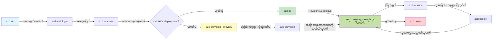
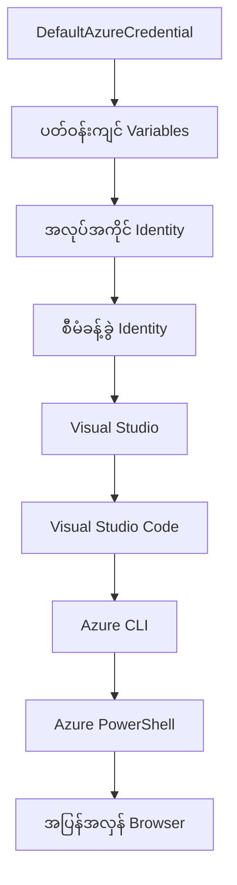

# AZD အခြေခံ - Azure Developer CLI ကိုနားလည်ခြင်း

# AZD အခြေခံ - အဓိကအယူအဆများနှင့် အခြေခံအချက်များ

**အခန်းလမ်းကြောင်း:**
- **📚 သင်ခန်းစာအိမ်**: [AZD အခြေခံသင်ခန်းစာ](../../README.md)
- **📖 လက်ရှိအခန်း**: အခန်း ၁ - အခြေခံနှင့် အမြန်စတင်ခြင်း
- **⬅️ ယခင်**: [သင်ခန်းစာအကျဉ်းချုပ်](../../README.md#-chapter-1-foundation--quick-start)
- **➡️ နောက်တစ်ခု**: [တပ်ဆင်ခြင်းနှင့် အဆင့်သတ်မှတ်ခြင်း](installation.md)
- **🚀 နောက်အခန်း**: [အခန်း ၂: AI-First Development](../microsoft-foundry/microsoft-foundry-integration.md)

## မိတ်ဆက်

ဒီသင်ခန်းစာမှာ Azure Developer CLI (azd) ကိုမိတ်ဆက်ပေးမှာဖြစ်ပြီး၊ ဒါဟာ သင့်ရဲ့ ဒေသတွင်းဖွံ့ဖြိုးတိုးတက်မှုကနေ Azure သို့ deployment ကို အရှိန်မြှင့်ပေးနိုင်တဲ့ command-line tool တစ်ခုဖြစ်ပါတယ်။ azd က cloud-native application deployment ကိုရိုးရှင်းစေတဲ့ အဓိကအယူအဆများ၊ အဓိက features များကို သင်လေ့လာရမှာဖြစ်ပြီး၊ အခြေခံအချက်များကို နားလည်စေမှာဖြစ်ပါတယ်။

## သင်ယူရမည့်ရည်မှန်းချက်များ

ဒီသင်ခန်းစာအဆုံးမှာ သင်:
- Azure Developer CLI (azd) ဆိုတာဘာလဲ၊ အဓိကရည်ရွယ်ချက်ကဘာလဲဆိုတာနားလည်ပါမယ်
- Template, Environment, Service စတဲ့ အဓိကအယူအဆများကိုလေ့လာပါမယ်
- Template-Driven Development နှင့် Infrastructure as Code အပါအဝင် အဓိက features များကို ရှာဖွေပါမယ်
- azd project structure နှင့် workflow ကိုနားလည်ပါမယ်
- သင့် development environment အတွက် azd ကိုတပ်ဆင်ပြီး configuration ပြုလုပ်ဖို့ ပြင်ဆင်ထားပါမယ်

## သင်ယူရမည့်ရလဒ်များ

ဒီသင်ခန်းစာပြီးဆုံးပြီးနောက်မှာ သင်:
- အခေတ်မီ cloud development workflow တွေမှာ azd ရဲ့บทบาทကိုရှင်းပြနိုင်ပါမယ်
- azd project structure ရဲ့ components တွေကိုသိရှိနိုင်ပါမယ်
- Template, Environment, Service တွေဘယ်လိုပေါင်းစပ်လုပ်ဆောင်ကြောင်း ရှင်းပြနိုင်ပါမယ်
- azd နဲ့ Infrastructure as Code ရဲ့ အကျိုးကျေးဇူးတွေကိုနားလည်နိုင်ပါမယ်
- azd commands များနှင့် အဓိကရည်ရွယ်ချက်များကိုသိရှိနိုင်ပါမယ်

## Azure Developer CLI (azd) ဆိုတာဘာလဲ?

Azure Developer CLI (azd) ဆိုတာ ဒေသတွင်းဖွံ့ဖြိုးတိုးတက်မှုကနေ Azure deployment ကို အရှိန်မြှင့်ပေးနိုင်ဖို့ ရည်ရွယ်ထားတဲ့ command-line tool တစ်ခုဖြစ်ပါတယ်။ Cloud-native application တွေကို Azure မှာ တည်ဆောက်ခြင်း၊ deployment ပြုလုပ်ခြင်း၊ စီမံခန့်ခွဲခြင်းလုပ်ငန်းစဉ်တွေကို ရိုးရှင်းစေပါတယ်။

### 🎯 AZD ကိုဘာလို့သုံးသင့်လဲ? အမှန်တကယ်ကွာခြားချက်

Web app တစ်ခုကို database နဲ့အတူ deploy လုပ်တဲ့အခါမှာ:

#### ❌ AZD မပါဘဲ: Manual Azure Deployment (၃၀+ မိနစ်)

```bash
# အဆင့် ၁: အရင်းအမြစ်အုပ်စုတစ်ခုဖန်တီးပါ
az group create --name myapp-rg --location eastus

# အဆင့် ၂: App Service Plan တစ်ခုဖန်တီးပါ
az appservice plan create --name myapp-plan \
  --resource-group myapp-rg \
  --sku B1 --is-linux

# အဆင့် ၃: Web App တစ်ခုဖန်တီးပါ
az webapp create --name myapp-web-unique123 \
  --resource-group myapp-rg \
  --plan myapp-plan \
  --runtime "NODE:18-lts"

# အဆင့် ၄: Cosmos DB အကောင့်တစ်ခုဖန်တီးပါ (၁၀-၁၅ မိနစ်)
az cosmosdb create --name myapp-cosmos-unique123 \
  --resource-group myapp-rg \
  --kind MongoDB

# အဆင့် ၅: ဒေတာဘေ့စ်တစ်ခုဖန်တီးပါ
az cosmosdb mongodb database create \
  --account-name myapp-cosmos-unique123 \
  --resource-group myapp-rg \
  --name tododb

# အဆင့် ၆: စုစည်းမှုတစ်ခုဖန်တီးပါ
az cosmosdb mongodb collection create \
  --account-name myapp-cosmos-unique123 \
  --resource-group myapp-rg \
  --database-name tododb \
  --name todos

# အဆင့် ၇: ချိတ်ဆက်မှုကြိုးကိုရယူပါ
CONN_STR=$(az cosmosdb keys list \
  --name myapp-cosmos-unique123 \
  --resource-group myapp-rg \
  --type connection-strings \
  --query "connectionStrings[0].connectionString" -o tsv)

# အဆင့် ၈: အက်ပ်ဆက်တင်များကိုပြင်ဆင်ပါ
az webapp config appsettings set \
  --name myapp-web-unique123 \
  --resource-group myapp-rg \
  --settings MONGODB_URI="$CONN_STR"

# အဆင့် ၉: မှတ်တမ်းတင်မှုကိုဖွင့်ပါ
az webapp log config --name myapp-web-unique123 \
  --resource-group myapp-rg \
  --application-logging filesystem \
  --detailed-error-messages true

# အဆင့် ၁၀: Application Insights ကိုတပ်ဆင်ပါ
az monitor app-insights component create \
  --app myapp-insights \
  --location eastus \
  --resource-group myapp-rg

# အဆင့် ၁၁: App Insights ကို Web App နှင့်ချိတ်ဆက်ပါ
INSTRUMENTATION_KEY=$(az monitor app-insights component show \
  --app myapp-insights \
  --resource-group myapp-rg \
  --query "instrumentationKey" -o tsv)

az webapp config appsettings set \
  --name myapp-web-unique123 \
  --resource-group myapp-rg \
  --settings APPINSIGHTS_INSTRUMENTATIONKEY="$INSTRUMENTATION_KEY"

# အဆင့် ၁၂: အက်ပ်ကို ဒေသတွင်းတွင်တည်ဆောက်ပါ
npm install
npm run build

# အဆင့် ၁၃: Deployment package တစ်ခုဖန်တီးပါ
zip -r app.zip . -x "*.git*" "node_modules/*"

# အဆင့် ၁၄: အက်ပ်ကိုတင်သွင်းပါ
az webapp deployment source config-zip \
  --resource-group myapp-rg \
  --name myapp-web-unique123 \
  --src app.zip

# အဆင့် ၁၅: စောင့်ပြီးအလုပ်လုပ်မယ်လို့ဆုတောင်းပါ 🙏
# (အလိုအလျောက်စစ်ဆေးမှုမရှိပါ၊ လက်ဖြင့်စမ်းသပ်ရန်လိုအပ်သည်)
```

**ပြဿနာများ:**
- ❌ ၁၅+ commands ကိုမှတ်မိပြီး အစီအစဉ်တကျလုပ်ဆောင်ရ
- ❌ ၃၀-၄၅ မိနစ်အထိ လက်ဖြင့်လုပ်ရ
- ❌ အလွယ်တကူအမှားဖြစ်နိုင် (စာလုံးပေါက်မှားခြင်း၊ parameter မှားခြင်း)
- ❌ Connection strings တွေ terminal history မှာပေါ်နေ
- ❌ တစ်ခုခု fail ဖြစ်ရင် automated rollback မရှိ
- ❌ အဖွဲ့ဝင်တွေ အတူတူလုပ်ဖို့ခက်ခဲ
- ❌ အချိန်တိုင်းကွာခြားမှုရှိ (reproducible မဟုတ်)

#### ✅ AZD နဲ့: Automated Deployment (command ၅ ခု၊ ၁၀-၁၅ မိနစ်)

```bash
# အဆင့် ၁: Template မှ စတင်ပါ
azd init --template todo-nodejs-mongo

# အဆင့် ၂: Authenticate လုပ်ပါ
azd auth login

# အဆင့် ၃: Environment တည်ဆောက်ပါ
azd env new dev

# အဆင့် ၄: ပြောင်းလဲမှုများကို ကြိုတင်ကြည့်ရှုပါ (optional ဖြစ်သော်လည်း အကြံပြုသည်)
azd provision --preview

# အဆင့် ၅: အားလုံးကို Deploy လုပ်ပါ
azd up

# ✨ ပြီးပါပြီ! အားလုံးကို Deploy လုပ်ပြီး၊ Configure လုပ်ပြီး၊ Monitor လုပ်ပြီးပါပြီ
```

**အကျိုးကျေးဇူးများ:**
- ✅ **command ၅ ခု** vs. manual steps ၁၅+ ခု
- ✅ **၁၀-၁၅ မိနစ်** စုစုပေါင်းအချိန် (Azure အတွက်စောင့်ဆိုင်းရတဲ့အချိန်)
- ✅ **အမှားမရှိ** - automated နှင့် tested
- ✅ **Secrets ကို Key Vault မှာလုံခြုံစွာစီမံခန့်ခွဲထား**
- ✅ **Automatic rollback** fail ဖြစ်ရင်
- ✅ **Fully reproducible** - အချိန်တိုင်းအတူတူရလဒ်
- ✅ **Team-ready** - အဖွဲ့ဝင်တိုင်း command တူတူနဲ့ deploy လုပ်နိုင်
- ✅ **Infrastructure as Code** - version controlled Bicep templates
- ✅ **Built-in monitoring** - Application Insights ကို automatic configure လုပ်ထား

### 📊 အချိန်နှင့် အမှားလျှော့ချမှု

| Metric | Manual Deployment | AZD Deployment | Improvement |
|:-------|:------------------|:---------------|:------------|
| **Commands** | 15+ | 5 | 67% လျှော့ချ |
| **Time** | 30-45 min | 10-15 min | 60% မြန် |
| **Error Rate** | ~40% | <5% | 88% လျှော့ချ |
| **Consistency** | နိမ့် (manual) | 100% (automated) | Perfect |
| **Team Onboarding** | 2-4 hours | 30 minutes | 75% မြန် |
| **Rollback Time** | 30+ min (manual) | 2 min (automated) | 93% မြန် |

## အဓိကအယူအဆများ

### Templates
Templates တွေက azd ရဲ့အခြေခံဖြစ်ပါတယ်။ Template တွေမှာ:
- **Application code** - သင့်ရဲ့ source code နဲ့ dependencies
- **Infrastructure definitions** - Azure resources တွေကို Bicep သို့မဟုတ် Terraform နဲ့သတ်မှတ်ထား
- **Configuration files** - Settings နဲ့ environment variables
- **Deployment scripts** - Automated deployment workflows

### Environments
Environments တွေက deployment targets များကို ကိုယ်စားပြုပါတယ်:
- **Development** - Testing နဲ့ development အတွက်
- **Staging** - Pre-production environment
- **Production** - Live production environment

Environment တစ်ခုစီမှာ:
- Azure resource group
- Configuration settings
- Deployment state ကို ကိုယ်ပိုင်ထားပါတယ်

### Services
Services တွေက သင့် application ရဲ့ အဆောက်အအုံဖြစ်ပါတယ်:
- **Frontend** - Web applications, SPAs
- **Backend** - APIs, microservices
- **Database** - Data storage solutions
- **Storage** - File နဲ့ blob storage

## အဓိက Features

### 1. Template-Driven Development
```bash
# ရရှိနိုင်သော template များကိုကြည့်ရှုပါ
azd template list

# template မှစတင်ပါ
azd init --template <template-name>
```

### 2. Infrastructure as Code
- **Bicep** - Azure ရဲ့ domain-specific language
- **Terraform** - Multi-cloud infrastructure tool
- **ARM Templates** - Azure Resource Manager templates

### 3. Integrated Workflows
```bash
# တင်သွင်းမှုလုပ်ငန်းစဉ်ကို ပြီးစီးပါ
azd up            # Provision + Deploy ပထမဆုံးတင်သွင်းမှုအတွက် လက်မထိုးဘဲလုပ်ဆောင်ပါ

# 🧪 အသစ်: တင်သွင်းမှုမပြုမီ အခြေခံအဆောက်အအုံပြောင်းလဲမှုများကို ကြိုတင်ကြည့်ရှုပါ (လုံခြုံ)
azd provision --preview    # အခြေခံအဆောက်အအုံတင်သွင်းမှုကို ပြောင်းလဲမှုမရှိဘဲ စမ်းသပ်ပါ

azd provision     # Azure အရင်းအမြစ်များကို ဖန်တီးပါ၊ အခြေခံအဆောက်အအုံကို ပြောင်းလဲပါက ဤအရာကို အသုံးပြုပါ
azd deploy        # အက်ပလီကေးရှင်းကုဒ်ကို တင်သွင်းပါ သို့မဟုတ် အက်ပလီကေးရှင်းကုဒ်ကို ပြန်လည်တင်သွင်းပါ
azd down          # အရင်းအမြစ်များကို ရှင်းလင်းပါ
```

#### 🛡️ Safe Infrastructure Planning with Preview
`azd provision --preview` command က safe deployments အတွက် game-changer ဖြစ်ပါတယ်:
- **Dry-run analysis** - ဘာတွေ create, modify, delete ဖြစ်မလဲဆိုတာပြသ
- **Zero risk** - Azure environment မှာ အပြောင်းအလဲမရှိ
- **Team collaboration** - Deployment မလုပ်ခင် preview results တွေကိုမျှဝေ
- **Cost estimation** - Resource cost တွေကိုနားလည်စေ

```bash
# နမူနာကြိုတင်ကြည့်ရှုလုပ်ငန်းစဉ်
azd provision --preview           # ဘာတွေပြောင်းလဲမယ်ဆိုတာကြည့်ရှုပါ
# အထွေထွေထွက်လွှာကိုပြန်လည်သုံးသပ်ပြီးအဖွဲ့နှင့်ဆွေးနွေးပါ
azd provision                     # ယုံကြည်မှုဖြင့်ပြောင်းလဲမှုများကိုအကောင်အထည်ဖော်ပါ
```

### 📊 Visual: AZD Development Workflow


**Workflow Explanation:**
1. **Init** - Template သို့မဟုတ် project အသစ်နဲ့စတင်
2. **Auth** - Azure နဲ့ authenticate လုပ်
3. **Environment** - Isolated deployment environment တစ်ခုဖန်တီး
4. **Preview** - 🆕 Infrastructure changes တွေကိုအမြဲ preview လုပ် (safe practice)
5. **Provision** - Azure resources တွေကို create/update
6. **Deploy** - Application code ကို push လုပ်
7. **Monitor** - Application performance ကိုကြည့်ရှု
8. **Iterate** - ပြောင်းလဲမှုတွေပြုလုပ်ပြီး code ကို redeploy
9. **Cleanup** - အလုပ်ပြီးရင် resources တွေကိုဖယ်ရှား

### 4. Environment Management
```bash
# ပတ်ဝန်းကျင်များကို ဖန်တီးပြီး စီမံခန့်ခွဲပါ
azd env new <environment-name>
azd env select <environment-name>
azd env list
```

## 📁 Project Structure

azd project structure ရဲ့ typical အနေအထား:
```
my-app/
├── .azd/                    # azd configuration
│   └── config.json
├── .azure/                  # Azure deployment artifacts
├── .devcontainer/          # Development container config
├── .github/workflows/      # GitHub Actions
├── .vscode/               # VS Code settings
├── infra/                 # Infrastructure code
│   ├── main.bicep        # Main infrastructure template
│   ├── main.parameters.json
│   └── modules/          # Reusable modules
├── src/                  # Application source code
│   ├── api/             # Backend services
│   └── web/             # Frontend application
├── azure.yaml           # azd project configuration
└── README.md
```

## 🔧 Configuration Files

### azure.yaml
Project configuration file အဓိက:
```yaml
name: my-awesome-app
metadata:
  template: my-template@1.0.0

services:
  web:
    project: ./src/web
    language: js
    host: appservice
  api:
    project: ./src/api
    language: js
    host: appservice

hooks:
  preprovision:
    shell: pwsh
    run: echo "Preparing to provision..."
```

### .azure/config.json
Environment-specific configuration:
```json
{
  "version": 1,
  "defaultEnvironment": "dev",
  "environments": {
    "dev": {
      "subscriptionId": "your-subscription-id",
      "location": "eastus"
    }
  }
}
```

## 🎪 Common Workflows with Hands-On Exercises

> **💡 သင်ယူမှုအကြံပြုချက်:** AZD skill တွေကိုတဖြည်းဖြည်းတိုးတက်အောင် ဒီ exercises တွေကိုအဆင့်လိုက်လုပ်ပါ။

### 🎯 Exercise 1: သင့်ရဲ့ပထမဆုံး Project ကို Initialize လုပ်ပါ

**ရည်မှန်းချက်:** AZD project တစ်ခုဖန်တီးပြီး structure ကိုရှာဖွေပါ

**အဆင့်များ:**
```bash
# အတည်ပြုထားသော template ကို အသုံးပြုပါ
azd init --template todo-nodejs-mongo

# ဖန်တီးထားသော ဖိုင်များကို စူးစမ်းကြည့်ရှုပါ
ls -la  # ဖိုင်အားလုံးကို ဖုံးကွယ်ထားသော ဖိုင်များအပါအဝင် ကြည့်ရှုပါ

# ဖန်တီးထားသော အရေးကြီးသော ဖိုင်များ:
# - azure.yaml (အဓိက configuration)
# - infra/ (အခြေခံအဆောက်အအုံ code)
# - src/ (application code)
```

**✅ အောင်မြင်မှု:** သင့်မှာ azure.yaml, infra/, နဲ့ src/ directories ရှိပါပြီ

---

### 🎯 Exercise 2: Azure သို့ Deploy လုပ်ပါ

**ရည်မှန်းချက်:** အဆုံးအထိ deployment ပြုလုပ်ပါ

**အဆင့်များ:**
```bash
# ၁။ အတည်ပြုပါ
az login && azd auth login

# ၂။ ပတ်ဝန်းကျင်ကို ဖန်တီးပါ
azd env new dev
azd env set AZURE_LOCATION eastus

# ၃။ ပြောင်းလဲမှုများကို ကြိုတင်ကြည့်ရှုပါ (အကြံပြုသည်)
azd provision --preview

# ၄။ အားလုံးကို တင်သွင်းပါ
azd up

# ၅။ တင်သွင်းမှုကို အတည်ပြုပါ
azd show    # သင့်အက်ပ် URL ကို ကြည့်ပါ
```

**မျှော်မှန်းအချိန်:** ၁၀-၁၅ မိနစ်  
**✅ အောင်မြင်မှု:** Application URL ကို browser မှာဖွင့်နိုင်ပါပြီ

---

### 🎯 Exercise 3: Multiple Environments

**ရည်မှန်းချက်:** dev နဲ့ staging မှာ deploy လုပ်ပါ

**အဆင့်များ:**
```bash
# အဆင့်မြှင့်ဖွဲ့စည်းရန် dev ရှိပြီးသားဖြစ်သည်။
azd env new staging
azd env set AZURE_LOCATION westus2
azd up

# သူတို့အကြား ပြောင်းလဲပါ။
azd env list
azd env select dev
```

**✅ အောင်မြင်မှု:** Azure Portal မှာ resource groups နှစ်ခုရှိပါပြီ

---

### 🛡️ Clean Slate: `azd down --force --purge`

အပြည့်အစုံ reset လုပ်ချင်တဲ့အခါ:

```bash
azd down --force --purge
```

**ဘာလုပ်သလဲ:**
- `--force`: Confirmation prompts မရှိ
- `--purge`: Local state နဲ့ Azure resources အားလုံးကိုဖျက်

**သုံးစွဲရန်:**
- Deployment အလယ်မှာ fail ဖြစ်ခဲ့
- Project ပြောင်းလဲခြင်း
- Fresh start လိုအပ်

---

## 🎪 Original Workflow Reference

### Project အသစ်စတင်ခြင်း
```bash
# နည်းလမ်း ၁: ရှိပြီးသား template ကို အသုံးပြုပါ
azd init --template todo-nodejs-mongo

# နည်းလမ်း ၂: အစမှစပါ
azd init

# နည်းလမ်း ၃: လက်ရှိ directory ကို အသုံးပြုပါ
azd init .
```

### Development Cycle
```bash
# ဖွံ့ဖြိုးရေးပတ်ဝန်းကျင်ကို စတင်တည်ဆောက်ပါ
azd auth login
azd env new dev
azd env select dev

# အားလုံးကို တင်သွင်းပါ
azd up

# ပြောင်းလဲမှုများပြုလုပ်ပြီး ပြန်လည်တင်သွင်းပါ
azd deploy

# ပြီးဆုံးသောအခါ သန့်ရှင်းရေးလုပ်ပါ
azd down --force --purge # Azure Developer CLI မှာ command က သင့်ပတ်ဝန်းကျင်အတွက် **ပြင်းထန်သော reset** ဖြစ်ပြီး—အထူးသဖြင့် မအောင်မြင်သော တင်သွင်းမှုများကို ပြုပြင်နေစဉ်၊ မလိုအပ်သောအရင်းအမြစ်များကို သန့်ရှင်းရေးလုပ်နေစဉ်၊ သို့မဟုတ် ပြန်လည်တင်သွင်းရန် ပြင်ဆင်နေစဉ်တွင် အသုံးဝင်ပါသည်။
```

## `azd down --force --purge` ကိုနားလည်ခြင်း
`azd down --force --purge` command က azd environment နဲ့ဆက်စပ် resource အားလုံးကို အပြည့်အစုံဖျက်ပစ်ဖို့ အထောက်အကူပြုပါတယ်။ Flag တစ်ခုစီရဲ့လုပ်ဆောင်ချက်ကို breakdown လုပ်ပါမယ်:
```
--force
```
- Confirmation prompts ကိုကျော်
- Manual input မလိုအပ်တဲ့ automation သို့မဟုတ် scripting အတွက်အသုံးပြုနိုင်
- CLI က အဆင်မပြေမှုတွေ detect လုပ်ရင်တောင် interruption မရှိဘဲ teardown လုပ်နိုင်

```
--purge
```
**Metadata အားလုံးကိုဖျက်ပစ်**:
Environment state
Local `.azure` folder
Cached deployment info
azd ရဲ့ "remembering" အခြေအနေကိုဖျက်ပစ်ပြီး၊ resource groups မကိုက်ညီမှု သို့မဟုတ် registry references မဟောင်းမှုလို ပြဿနာတွေကိုရှောင်ရှားနိုင်ပါတယ်။

### ဘာလို့နှစ်ခုလုံးသုံးသင့်လဲ?
`azd up` ကို lingering state သို့မဟုတ် partial deployments ကြောင့်အခက်အခဲရှိတဲ့အခါ၊ ဒီ combo က **clean slate** အတွက်အထူးအသုံးဝင်ပါတယ်။

Manual resource deletions ကို Azure portal မှာလုပ်ပြီးနောက် သို့မဟုတ် template, environment, resource group naming conventions တွေကိုပြောင်းလဲတဲ့အခါမှာ အထူးအသုံးဝင်ပါတယ်။

### Multiple Environments ကိုစီမံခြင်း
```bash
# စတင်အဆင့်ပတ်ဝန်းကျင်ကို ဖန်တီးပါ
azd env new staging
azd env select staging
azd up

# နောက်ပြန် dev ကို ပြောင်းပါ
azd env select dev

# ပတ်ဝန်းကျင်များကို နှိုင်းယှဉ်ပါ
azd env list
```

## 🔐 Authentication နှင့် Credentials

Authentication ကိုနားလည်ခြင်းက azd deployments အောင်မြင်ဖို့အရေးကြီးပါတယ်။ Azure က authentication methods အမျိုးမျိုးကိုသုံးပြီး၊ azd က Azure tools အခြားတွေသုံးတဲ့ credential chain ကိုအသုံးပြုပါတယ်။

### Azure CLI Authentication (`az login`)

azd ကိုသုံးမီ Azure နဲ့ authenticate လုပ်ဖို့လိုအပ်ပါတယ်။ အများဆုံးအသုံးပြုတဲ့နည်းက Azure CLI ကိုသုံးခြင်းဖြစ်ပါတယ်:

```bash
# အင်တာအက်တစ်ဝင်ရောက်မှု (ဘရောက်ဇာဖွင့်သည်)
az login

# သတ်မှတ်ထားသော tenant ဖြင့်ဝင်ရောက်ပါ
az login --tenant <tenant-id>

# ဝန်ဆောင်မှုအဓိကကိုယ်စားလှယ်ဖြင့်ဝင်ရောက်ပါ
az login --service-principal -u <app-id> -p <password> --tenant <tenant-id>

# လက်ရှိဝင်ရောက်မှုအခြေအနေကိုစစ်ဆေးပါ
az account show

# ရရှိနိုင်သော subscription များကိုစာရင်းပြုလုပ်ပါ
az account list --output table

# ပုံမှန် subscription ကိုသတ်မှတ်ပါ
az account set --subscription <subscription-id>
```

### Authentication Flow
1. **Interactive Login**: Authentication အတွက် default browser ကိုဖွင့်
2. **Device Code Flow**: Browser access မရှိတဲ့ environment အတွက်
3. **Service Principal**: Automation နဲ့ CI/CD scenarios အတွက်
4. **Managed Identity**: Azure-hosted applications အတွက်

### DefaultAzureCredential Chain

`DefaultAzureCredential` က credential type တစ်ခုဖြစ်ပြီး၊ credential sources အမျိုးမျိုးကို အလိုအလျောက်စမ်းသပ်ပြီး simplified authentication experience ပေးပါတယ်:

#### Credential Chain Order

#### 1. Environment Variables
```bash
# ဝန်ဆောင်မှုအထူးလက္ခဏာအတွက် ပတ်ဝန်းကျင်အပြောင်းအလဲများ သတ်မှတ်ပါ
export AZURE_CLIENT_ID="<app-id>"
export AZURE_CLIENT_SECRET="<password>"
export AZURE_TENANT_ID="<tenant-id>"
```

#### 2. Workload Identity (Kubernetes/GitHub Actions)
အလိုအလျောက်အသုံးပြု:
- Azure Kubernetes Service (AKS) နဲ့ Workload Identity
- GitHub Actions နဲ့ OIDC federation
- အခြား federated identity scenarios

#### 3. Managed Identity
Azure resources အတွက်:
- Virtual Machines
- App Service
- Azure Functions
- Container Instances

```bash
# Azure resource တွင် managed identity ဖြင့် run လုပ်နေသည်ကို စစ်ဆေးပါ
az account show --query "user.type" --output tsv
# Returns: managed identity ကို အသုံးပြုပါက "servicePrincipal" ကို ပြန်ပေးပါ
```

#### 4. Developer Tools Integration
- **Visual Studio**: Signed-in account ကိုအလိုအလျောက်အသုံးပြု
- **VS Code**: Azure Account extension credentials ကိုအသုံးပြု
- **Azure CLI**: `az login` credentials ကိုအသုံးပြု (ဒေသတွင်း development အတွက်အများဆုံး)

### AZD Authentication Setup

```bash
# နည်းလမ်း ၁: Azure CLI ကို အသုံးပြုပါ (ဖွံ့ဖြိုးတိုးတက်မှုအတွက် အကြံပြုသည်)
az login
azd auth login  # ရှိပြီးသား Azure CLI အတည်ပြုချက်များကို အသုံးပြုသည်

# နည်းလမ်း ၂: တိုက်ရိုက် azd အတည်ပြုချက်
azd auth login --use-device-code  # ဦးခေါင်းမပါသော ပတ်ဝန်းကျင်များအတွက်

# နည်းလမ်း ၃: အတည်ပြုချက် အခြေအနေကို စစ်ဆေးပါ
azd auth login --check-status

# နည်းလမ်း ၄: Logout လုပ်ပြီး ပြန်လည်အတည်ပြုပါ
azd auth logout
azd auth login
```

### Authentication Best Practices

#### ဒေသတွင်း Development အတွက်
```bash
# 1. Azure CLI ဖြင့် Login လုပ်ပါ
az login

# 2. မှန်ကန်သော subscription ကိုအတည်ပြုပါ
az account show
az account set --subscription "Your Subscription Name"

# 3. ရှိပြီးသား credentials ဖြင့် azd ကိုအသုံးပြုပါ
azd auth login
```

#### CI/CD Pipelines အတွက်
```yaml
# GitHub Actions example
- name: Azure Login
  uses: azure/login@v1
  with:
    creds: ${{ secrets.AZURE_CREDENTIALS }}

- name: Deploy with azd
  run: |
    azd auth login --client-id ${{ secrets.AZURE_CLIENT_ID }} \
                    --client-secret ${{ secrets.AZURE_CLIENT_SECRET }} \
                    --tenant-id ${{ secrets.AZURE_TENANT_ID }}
    azd up --no-prompt
```

#### Production Environments အတွက်
- Azure resources မှာ run လုပ်တဲ့အခါ **Managed Identity** ကိုသုံးပါ
- Automation scenarios အတွက် **Service Principal** ကိုသုံးပါ
- Credentials တွေကို code သို့မဟုတ် configuration files မှာမထားပါနှင့်
- Sensitive configuration အတွက် **Azure Key Vault** ကိုသုံးပါ

### Common Authentication Issues နှင့် Solutions

#### ပြဿနာ: "No subscription found"
```bash
# ဖြေရှင်းချက်: ပုံမှန် subscription ကို သတ်မှတ်ပါ
az account list --output table
az account set --subscription "<subscription-id>"
azd env set AZURE_SUBSCRIPTION_ID "<subscription-id>"
```

#### ပြဿနာ: "Insufficient permissions"
```bash
# ဖြေရှင်းချက်: လိုအပ်သောအခန်းကဏ္ဍများကို စစ်ဆေးပြီး သတ်မှတ်ပါ
az role assignment list --assignee $(az account show --query user.name --output tsv)

# အများဆုံးလိုအပ်သောအခန်းကဏ္ဍများ:
# - Contributor (အရင်းအမြစ်စီမံခန့်ခွဲမှုအတွက်)
# - User Access Administrator (အခန်းကဏ္ဍများသတ်မှတ်ခြင်းအတွက်)
```

#### ပြဿနာ: "Token expired"
```bash
# ဖြေရှင်းချက်: ထပ်မံအတည်ပြုပါ
az logout
az login
azd auth logout
azd auth login
```

### Authentication in Different Scenarios

#### ဒေသတွင်း Development
```bash
# ကိုယ်ပိုင်ဖွံ့ဖြိုးတိုးတက်မှုအကောင့်
az login
azd auth login
```

#### အဖွဲ့လိုက် Development
```bash
# အဖွဲ့အစည်းအတွက် သီးသန့်အငှားကို အသုံးပြုပါ
az login --tenant contoso.onmicrosoft.com
azd auth login
```

#### Multi-tenant Scenarios
```bash
# တိုင်းရင်းသားများအကြား ပြောင်းလဲပါ
az login --tenant tenant1.onmicrosoft.com
# တိုင်းရင်းသား ၁ သို့ တင်သွင်းပါ
azd up

az login --tenant tenant2.onmicrosoft.com  
# တိုင်းရင်းသား ၂ သို့ တင်သွင်းပါ
azd up
```

### လုံခြုံရေးစဉ်းစားချက်များ

1. **Credential Storage**: Credentials တွေကို source code မှာမထားပါနှင့်
2. **Scope Limitation**: Service principals အတွက် least-privilege principle ကိုအသုံးပြုပါ
3. **Token Rotation**: Service principal secrets တွေကို regular rotation လုပ်ပါ
4. **Audit Trail**: Authentication နဲ့ deployment လုပ်ငန်းစဉ်တွေကိုကြည့်ရှုပါ
5. **Network Security**: Private endpoints တွေကိုအသုံးပြုပါ

### Authentication Troubleshooting

```bash
# အတည်ပြုမှုပြဿနာများကို အမှားရှာပါ
azd auth login --check-status
az account show
az account get-access-token

# သာမန်ရောဂါရှာဖွေမှုအမိန့်များ
whoami                          # လက်ရှိအသုံးပြုသူအခြေအနေ
az ad signed-in-user show      # Azure AD အသုံးပြုသူအသေးစိတ်
az group list                  # အရင်းအမြစ်ဝင်ရောက်ခွင့်ကို စမ်းသပ်ပါ
```

## `azd down --force --purge` ကိုနားလည်ခြင်း

### Discovery
```bash
azd template list              # အချို့သော template များကိုကြည့်ရှုပါ
azd template show <template>   # Template အသေးစိတ်
azd init --help               # Initialization ရွေးချယ်မှုများ
```

### Project Management
```bash
azd show                     # ပရောဂျက်အကျဉ်းချုပ်
azd env show                 # လက်ရှိပတ်ဝန်းကျင်
azd config list             # ဖွဲ့စည်းမှုဆက်တင်များ
```

### Monitoring
```bash
azd monitor                  # Azure ပေါ်တယ်ကိုဖွင့်ပါ
azd pipeline config          # CI/CD ကိုစီစဉ်ပါ
azd logs                     # အက်ပလီကေးရှင်း log များကိုကြည့်ပါ
```

## Best Practices

### 1. အဓိကအမည်များကိုအသုံးပြုပါ
```bash
# ကောင်းတယ်
azd env new production-east
azd init --template web-app-secure

# ရှောင်ရှားပါ
azd env new env1
azd init --template template1
```

### 2. Templates ကိုအသုံးပြုပါ
- ရှိပြီးသား templates တွေနဲ့စတင်ပါ
- သင့်လိုအပ်ချက်အတွက် customize လုပ်ပါ
- သင့်အဖွဲ့အစည်းအတွက် reusable templates တွေဖန်တီးပါ

### 3. Environment Isolation
- Dev/Staging/Prod အတွက် environment သီးသန့်တွေကိုအသုံးပြုပါ
- Local machine ကနေ production ကိုတိုက်ရိုက် deploy မလုပ်ပါနှင့်
- Production deployments အတွက် CI/CD pipelines ကိုအသုံးပြုပါ

### 4. Configuration Management
- Sensitive data အတွက် environment variables ကိုအသုံးပြုပါ
- Configuration ကို
- [Installation & Setup](installation.md) - AZD ကိုတပ်ဆင်ပြီး အဆင်ပြေစွာအသုံးပြုရန်
- [Your First Project](first-project.md) - လက်တွေ့လေ့ကျင့်မှုကို ပြီးမြောက်စေပါ
- [Configuration Guide](configuration.md) - အဆင့်မြင့် configuration ရွေးချယ်မှုများ

**🎯 နောက်အခန်းအတွက် အသင့်ဖြစ်ပါပြီလား?**
- [Chapter 2: AI-First Development](../microsoft-foundry/microsoft-foundry-integration.md) - AI အက်ပလီကေးရှင်းများကို စတင်တည်ဆောက်ပါ

## အပိုဆောင်းအရင်းအမြစ်များ

- [Azure Developer CLI Overview](https://learn.microsoft.com/en-us/azure/developer/azure-developer-cli/)
- [Template Gallery](https://azure.github.io/awesome-azd/)
- [Community Samples](https://github.com/Azure-Samples)

---

## 🙋 မကြာခဏမေးလေ့ရှိသောမေးခွန်းများ

### အထွေထွေမေးခွန်းများ

**Q: AZD နဲ့ Azure CLI ကြားကွာခြားချက်ကဘာလဲ?**

A: Azure CLI (`az`) က တစ်ခုချင်းစီ Azure resources ကို စီမံခန့်ခွဲရန်အတွက်ဖြစ်ပါတယ်။ AZD (`azd`) က အပြည့်အစုံ application များကို စီမံခန့်ခွဲရန်အတွက်ဖြစ်ပါတယ်။

```bash
# Azure CLI - အနိမ့်အဆင့်ရင်းမြစ်စီမံခန့်ခွဲမှု
az webapp create --name myapp --resource-group rg
az sql server create --name myserver --resource-group rg
# ...အမိန့်များစွာလိုအပ်သည်

# AZD - အပလီကေးရှင်းအဆင့်စီမံခန့်ခွဲမှု
azd up  # အားလုံးသောရင်းမြစ်များနှင့်အတူ app အပြည့်အစုံကိုဖြန့်ဝေသည်
```

**ဒီလိုတွေးပါ:**
- `az` = တစ်ခုချင်းစီ Lego အုတ်များကို လုပ်ဆောင်ခြင်း
- `azd` = အပြည့်အစုံ Lego အစုံများကို လုပ်ဆောင်ခြင်း

---

**Q: AZD ကို အသုံးပြုဖို့ Bicep သို့မဟုတ် Terraform ကို သိထားဖို့လိုအပ်ပါသလား?**

A: မလိုအပ်ပါဘူး! Template များကို စတင်အသုံးပြုပါ:
```bash
# ရှိပြီးသား template ကို အသုံးပြုပါ - IaC အသိပညာ မလိုအပ်ပါ။
azd init --template todo-nodejs-mongo
azd up
```

Infrastructure ကို customize လုပ်ဖို့ Bicep ကို နောက်ပိုင်းမှာ သင်ယူနိုင်ပါတယ်။ Template များက သင်ယူဖို့အတွက် အလုပ်လုပ်တဲ့ နမူနာများကို ပေးပါသည်။

---

**Q: AZD template များကို run လုပ်ဖို့ကုန်ကျစရိတ်ဘယ်လောက်လဲ?**

A: Template အလိုက် ကုန်ကျစရိတ်က မတူညီပါသည်။ အများစု development template များက $50-150/month ကုန်ကျပါသည်။

```bash
# တင်သွင်းမည့်အခါ ကုန်ကျစရိတ်များကို ကြိုတင်ကြည့်ရှုပါ။
azd provision --preview

# အသုံးမပြုသောအခါ အမြဲသန့်ရှင်းပါ။
azd down --force --purge  # အရင်းအမြစ်အားလုံးကို ဖယ်ရှားသည်။
```

**Pro tip:** အခမဲ့ tier များကို အသုံးပြုပါ:
- App Service: F1 (Free) tier
- Azure OpenAI: 50,000 tokens/month free
- Cosmos DB: 1000 RU/s free tier

---

**Q: AZD ကို ရှိပြီးသား Azure resources နဲ့ အသုံးပြုနိုင်ပါသလား?**

A: အသုံးပြုနိုင်ပါတယ်၊ ဒါပေမယ့် အသစ်စတင်တာပိုလွယ်ပါတယ်။ AZD က အပြည့်အစုံ lifecycle ကို စီမံခန့်ခွဲတဲ့အခါ အကောင်းဆုံးအလုပ်လုပ်ပါတယ်။ ရှိပြီးသား resources အတွက်:

```bash
# အရွေးချယ်မှု ၁: ရှိပြီးသားရင်းမြစ်များကို တင်သွင်းပါ (အဆင့်မြင့်)
azd init
# ထို့နောက် infra/ ကို ပြင်ဆင်ပြီး ရှိပြီးသားရင်းမြစ်များကို ရည်ညွှန်းပါ

# အရွေးချယ်မှု ၂: အသစ်စတင်ပါ (အကြံပြုထားသည်)
azd init --template matching-your-stack
azd up  # ပတ်ဝန်းကျင်အသစ်ကို ဖန်တီးသည်
```

---

**Q: ကျွန်တော်/ကျွန်မရဲ့ project ကို teammate တွေနဲ့ မျှဝေဖို့ ဘယ်လိုလုပ်ရမလဲ?**

A: AZD project ကို Git မှာ commit လုပ်ပါ (ဒါပေမယ့် .azure folder ကို မပါဝင်ပါစေ):

```bash
# ပုံမှန်အားဖြင့် .gitignore ထဲမှာ ရှိပြီးသား
.azure/        # လျှို့ဝှက်ချက်များနှင့် ပတ်ဝန်းကျင်ဒေတာများကို ပါဝင်သည်
*.env          # ပတ်ဝန်းကျင် အပြောင်းအလဲများ

# အဖွဲ့ဝင်များ ထို့နောက်:
git clone <your-repo>
azd auth login
azd env new <their-name>-dev
azd up
```

အားလုံး template တူညီတဲ့ infrastructure ကို ရရှိပါမည်။

---

### Troubleshooting မေးခွန်းများ

**Q: "azd up" အလယ်မှာ fail ဖြစ်သွားတယ်။ ဘာလုပ်ရမလဲ?**

A: Error ကို စစ်ဆေးပြီး ပြင်ဆင်ပါ၊ ပြီးရင် ထပ်မံလုပ်ဆောင်ပါ:

```bash
# အသေးစိတ်မှတ်တမ်းများကိုကြည့်ပါ
azd show

# အများဆုံးပြုပြင်မှုများ:

# ၁။ အောက်တိုင်းအကန့်အသတ်ကျော်လွန်ပါက:
azd env set AZURE_LOCATION "westus2"  # တစ်ခြားဒေသကိုကြိုးစားပါ

# ၂။ အရင်းအမြစ်နာမည်ပဋိပက္ခရှိပါက:
azd down --force --purge  # အစစအရာရာကိုသန့်စင်ပါ
azd up  # ထပ်မံကြိုးစားပါ

# ၃။ အတည်ပြုမှုသက်တမ်းကုန်သွားပါက:
az login
azd auth login
azd up
```

**အများဆုံးဖြစ်လေ့ရှိတဲ့ပြဿနာ:** မှားတဲ့ Azure subscription ကို ရွေးထားခြင်း
```bash
az account list --output table
az account set --subscription "<correct-subscription>"
```

---

**Q: Infrastructure ကို ပြန်တည်ဆောက်မလုပ်ဘဲ code changes ကို deploy လုပ်ဖို့ ဘယ်လိုလုပ်ရမလဲ?**

A: `azd up` အစား `azd deploy` ကို အသုံးပြုပါ:

```bash
azd up          # ပထမဆုံးအကြိမ်: provision + deploy (နှေး)

# ကုဒ်ပြောင်းလဲမှုများပြုလုပ်ပါ...

azd deploy      # နောက်ထပ်အကြိမ်များ: deploy သာလုပ်ပါ (လျင်မြန်)
```

အချိန်နှိုင်းယှဉ်မှု:
- `azd up`: 10-15 မိနစ် (infrastructure ကို provision လုပ်သည်)
- `azd deploy`: 2-5 မိနစ် (code ပဲ)

---

**Q: Infrastructure template များကို customize လုပ်နိုင်ပါသလား?**

A: လုပ်နိုင်ပါတယ်! `infra/` ထဲမှာ Bicep file များကို ပြင်ဆင်ပါ:

```bash
# azd init ပြီးနောက်
cd infra/
code main.bicep  # VS Code မှာ တည်းဖြတ်ပါ

# ပြောင်းလဲမှုများကို ကြိုတင်ကြည့်ရှုပါ
azd provision --preview

# ပြောင်းလဲမှုများကို အတည်ပြုပါ
azd provision
```

**Tip:** အစအန small - SKUs ကို ပြောင်းပါ:
```bicep
// infra/main.bicep
sku: {
  name: 'B1'  // Change to 'P1V2' for production
}
```

---

**Q: AZD တည်ဆောက်ထားတဲ့ အရာအားလုံးကို ဖျက်ဖို့ ဘယ်လိုလုပ်ရမလဲ?**

A: Command တစ်ခုက resource အားလုံးကို ဖျက်ပါမည်:

```bash
azd down --force --purge

# ဒါက ဖျက်ပစ်ပါတယ်။
# - Azure resources အားလုံး
# - Resource group
# - Local environment အခြေအနေ
# - Cached deployment data
```

**အခါသင့်အခါကျ run လုပ်ပါ:**
- Template ကို စမ်းသပ်ပြီးဆုံးပါပြီ
- အခြား project ကို ပြောင်းနေသည်
- အသစ်စတင်လိုသည်

**ကုန်ကျစရိတ်သက်သာမှု:** အသုံးမပြုတဲ့ resources ကို ဖျက်ခြင်း = $0 charges

---

**Q: Azure Portal မှာ resources ကို မတော်တဆဖျက်လိုက်ရင် ဘာလုပ်ရမလဲ?**

A: AZD state က sync မဖြစ်နိုင်ပါ။ Clean slate approach ကို အသုံးပြုပါ:

```bash
# ၁။ ဒေသခံအခြေအနေကို ဖယ်ရှားပါ။
azd down --force --purge

# ၂။ အသစ်စတင်ပါ။
azd up

# အခြားနည်းလမ်း - AZD ကိုရှာဖွေပြီး ပြင်ဆင်ပါ။
azd provision  # လိုအပ်သောအရင်းအမြစ်များကို ဖန်တီးမည်။
```

---

### အဆင့်မြင့်မေးခွန်းများ

**Q: AZD ကို CI/CD pipeline တွေမှာ အသုံးပြုနိုင်ပါသလား?**

A: အသုံးပြုနိုင်ပါတယ်! GitHub Actions နမူနာ:

```yaml
# .github/workflows/deploy.yml
name: Deploy with AZD

on:
  push:
    branches: [main]

jobs:
  deploy:
    runs-on: ubuntu-latest
    steps:
      - uses: actions/checkout@v2
      
      - name: Install azd
        run: curl -fsSL https://aka.ms/install-azd.sh | bash
      
      - name: Azure Login
        run: |
          azd auth login \
            --client-id ${{ secrets.AZURE_CLIENT_ID }} \
            --client-secret ${{ secrets.AZURE_CLIENT_SECRET }} \
            --tenant-id ${{ secrets.AZURE_TENANT_ID }}
      
      - name: Deploy
        run: azd up --no-prompt
```

---

**Q: Secrets နဲ့ sensitive data ကို ဘယ်လို handle လုပ်ရမလဲ?**

A: AZD က Azure Key Vault နဲ့ အလိုအလျောက် ပေါင်းစည်းထားပါတယ်:

```bash
# လျှို့ဝှက်ချက်များကို ကီးဗော့ထဲတွင် သိမ်းဆည်းထားပြီး ကုဒ်ထဲတွင် မပါဝင်ပါ
azd env set DATABASE_PASSWORD "$(openssl rand -base64 32)"

# AZD အလိုအလျောက်:
# 1. ကီးဗော့ကို ဖန်တီးသည်
# 2. လျှို့ဝှက်ချက်ကို သိမ်းဆည်းသည်
# 3. Managed Identity ဖြင့် အက်ပ်ကို ဝင်ရောက်ခွင့်ပေးသည်
# 4. အချိန်ပြေးဆွဲစဉ်တွင် ထည့်သွင်းသည်
```

**ဘယ်တော့မှ commit မလုပ်ပါနဲ့:**
- `.azure/` folder (environment data ပါဝင်သည်)
- `.env` files (local secrets)
- Connection strings

---

**Q: မျိုးစုံ region တွေကို deploy လုပ်နိုင်ပါသလား?**

A: လုပ်နိုင်ပါတယ်၊ region တစ်ခုချင်းစီအတွက် environment တစ်ခုဖန်တီးပါ:

```bash
# အရှေ့အမေရိကပတ်ဝန်းကျင်
azd env new prod-eastus
azd env set AZURE_LOCATION eastus
azd up

# အနောက်ဥရောပပတ်ဝန်းကျင်
azd env new prod-westeurope
azd env set AZURE_LOCATION westeurope
azd up

# တစ်ခုချင်းစီပတ်ဝန်းကျင်သည် လွတ်လပ်သည်
azd env list
```

Multi-region app အတွက် Bicep template များကို customize လုပ်ပြီး region များစုံကို တစ်ပြိုင်တည်း deploy လုပ်ပါ။

---

**Q: အကူအညီလိုအပ်ရင် ဘယ်မှာ ရနိုင်မလဲ?**

1. **AZD Documentation:** https://learn.microsoft.com/azure/developer/azure-developer-cli/
2. **GitHub Issues:** https://github.com/Azure/azure-dev/issues
3. **Discord:** [Azure Discord](https://discord.gg/microsoft-azure) - #azure-developer-cli channel
4. **Stack Overflow:** Tag `azure-developer-cli`
5. **ဒီသင်ခန်းစာ:** [Troubleshooting Guide](../troubleshooting/common-issues.md)

**Pro tip:** မေးခွန်းမေးခင် run လုပ်ပါ:
```bash
azd show       # လက်ရှိအခြေအနေကိုပြသည်
azd version    # သင့်ဗားရှင်းကိုပြသည်
```
မေးခွန်းမှာ ဒီအချက်အလက်တွေကို ထည့်ပါ၊ အကူအညီရရှိမှု မြန်ဆန်စေပါမည်။

---

## 🎓 နောက်တစ်ခုဘာလုပ်မလဲ?

AZD အခြေခံအချက်များကို နားလည်ပြီးပါပြီ။ သင့်လမ်းကြောင်းကို ရွေးချယ်ပါ:

### 🎯 Beginner များအတွက်:
1. **နောက်တစ်ခု:** [Installation & Setup](installation.md) - AZD ကို သင့်စက်မှာတပ်ဆင်ပါ
2. **ပြီးရင်:** [Your First Project](first-project.md) - သင့်ရဲ့ပထမဆုံး app ကို deploy လုပ်ပါ
3. **လေ့ကျင့်ပါ:** ဒီသင်ခန်းစာရဲ့ exercise ၃ ခုကို ပြီးမြောက်ပါ

### 🚀 AI Developer များအတွက်:
1. **Skip:** [Chapter 2: AI-First Development](../microsoft-foundry/microsoft-foundry-integration.md)
2. **Deploy:** `azd init --template get-started-with-ai-chat` နဲ့ စတင်ပါ
3. **Learn:** Deploy လုပ်ရင်း တည်ဆောက်ပါ

### 🏗️ အတွေ့အကြုံရှိ Developer များအတွက်:
1. **Review:** [Configuration Guide](configuration.md) - အဆင့်မြင့် settings
2. **Explore:** [Infrastructure as Code](../deployment/provisioning.md) - Bicep အကြောင်း အနက်ရှိုင်း
3. **Build:** သင့် stack အတွက် custom template များ ဖန်တီးပါ

---

**Chapter Navigation:**
- **📚 သင်ခန်းစာအိမ်စာမျက်နှာ**: [AZD For Beginners](../../README.md)
- **📖 လက်ရှိအခန်း**: Chapter 1 - Foundation & Quick Start  
- **⬅️ အရင်**: [Course Overview](../../README.md#-chapter-1-foundation--quick-start)
- **➡️ နောက်တစ်ခု**: [Installation & Setup](installation.md)
- **🚀 နောက်အခန်း**: [Chapter 2: AI-First Development](../microsoft-foundry/microsoft-foundry-integration.md)

---

<!-- CO-OP TRANSLATOR DISCLAIMER START -->
**အကြောင်းကြားချက်**:  
ဤစာရွက်စာတမ်းကို AI ဘာသာပြန်ဝန်ဆောင်မှု [Co-op Translator](https://github.com/Azure/co-op-translator) ကို အသုံးပြု၍ ဘာသာပြန်ထားပါသည်။ ကျွန်ုပ်တို့သည် တိကျမှုအတွက် ကြိုးစားနေသော်လည်း အလိုအလျောက် ဘာသာပြန်မှုများတွင် အမှားများ သို့မဟုတ် မတိကျမှုများ ပါဝင်နိုင်သည်ကို သတိပြုပါ။ မူရင်းဘာသာစကားဖြင့် ရေးသားထားသော စာရွက်စာတမ်းကို အာဏာတရားရှိသော အရင်းအမြစ်အဖြစ် သတ်မှတ်သင့်ပါသည်။ အရေးကြီးသော အချက်အလက်များအတွက် လူက ဘာသာပြန်မှုကို အကြံပြုပါသည်။ ဤဘာသာပြန်မှုကို အသုံးပြုခြင်းမှ ဖြစ်ပေါ်လာသော အလွဲအမှားများ သို့မဟုတ် အနားလွဲမှုများအတွက် ကျွန်ုပ်တို့သည် တာဝန်မယူပါ။
<!-- CO-OP TRANSLATOR DISCLAIMER END -->