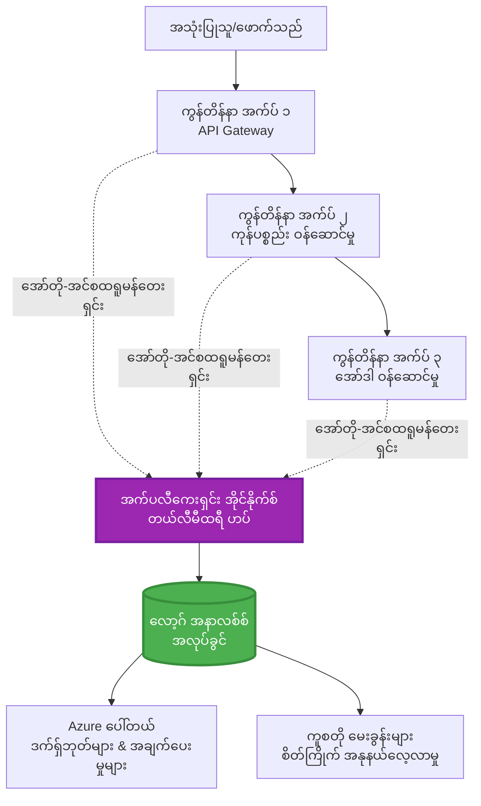
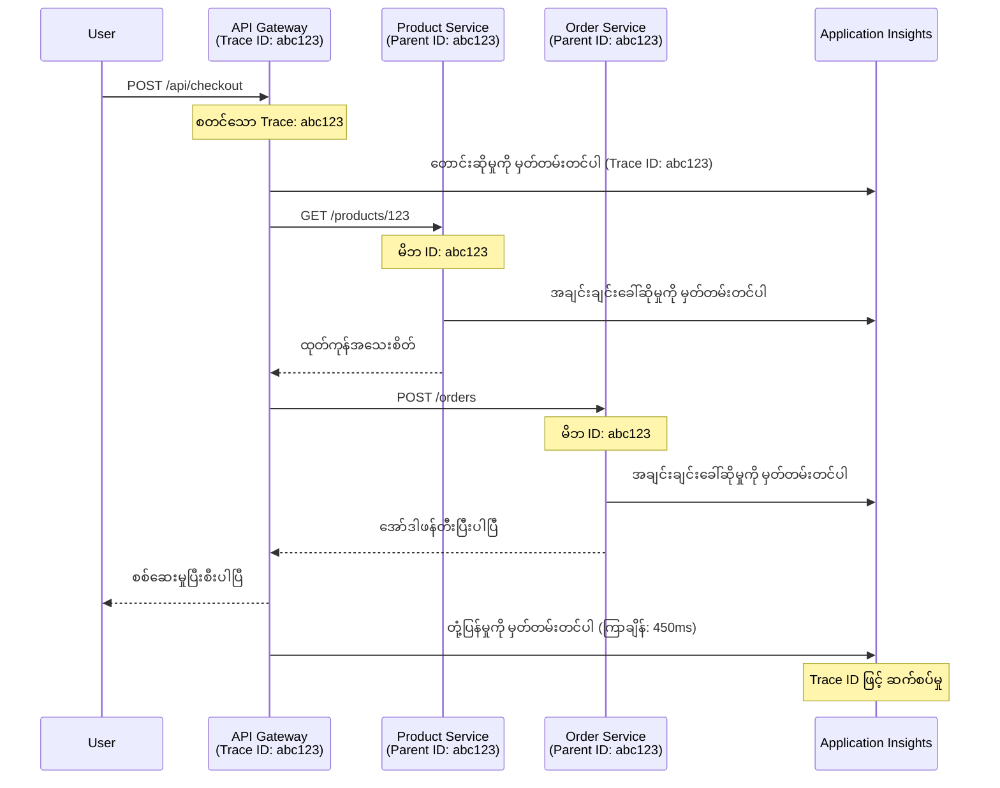

# AZD နှင့် Application Insights ပေါင်းစည်းခြင်း

⏱️ **ခန့်မှန်းချိန်**: 40-50 မိနစ် | 💰 **ကုန်ကျစရိတ်**: ~$5-15/လ | ⭐ **အဆင့်**: အလယ်အလတ်

**📚 သင်ယူရန်လမ်းကြောင်း:**
- ← အရင်ဆုံး: [Preflight Checks](preflight-checks.md) - Deploy မလုပ်မီအတည်ပြုခြင်း
- 🎯 **သင်ရှိနေသောနေရာ**: Application Insights Integration (Monitoring, telemetry, debugging)
- → နောက်တစ်ခု: [Deployment Guide](../deployment/deployment-guide.md) - Azure သို့ Deploy လုပ်ခြင်း
- 🏠 [သင်ခန်းစာအိမ်စာမျက်နှာ](../../README.md)

---

## သင်လေ့လာနိုင်မည့်အရာများ

ဒီသင်ခန်းစာကိုပြီးမြောက်ပါက၊ သင်သည်:
- **Application Insights** ကို AZD project များတွင် အလိုအလျောက် ပေါင်းစည်းနိုင်မည်
- **distributed tracing** ကို microservices များအတွက် configure လုပ်နိုင်မည်
- **custom telemetry** (metrics, events, dependencies) ကို အကောင်အထည်ဖော်နိုင်မည်
- **live metrics** ကို အချိန်နှင့်တပြေးညီ monitor လုပ်နိုင်မည်
- AZD deployment များမှ **alerts နှင့် dashboards** ဖန်တီးနိုင်မည်
- **telemetry queries** ဖြင့် production issue များကို debug လုပ်နိုင်မည်
- **ကုန်ကျစရိတ်နှင့် sampling** များကို optimize လုပ်နိုင်မည်
- **AI/LLM application** များ (tokens, latency, costs) ကို monitor လုပ်နိုင်မည်

## AZD နှင့် Application Insights အရေးပါမှု

### စိန်ခေါ်မှု: Production Observability

**Application Insights မပါဘဲ:**
```
❌ No visibility into production behavior
❌ Manual log aggregation across services
❌ Reactive debugging (wait for customer complaints)
❌ No performance metrics
❌ Cannot trace requests across services
❌ Unknown failure rates and bottlenecks
```

**Application Insights + AZD ပါဝင်ပါက:**
```
✅ Automatic telemetry collection
✅ Centralized logs from all services
✅ Proactive issue detection
✅ End-to-end request tracing
✅ Performance metrics and insights
✅ Real-time dashboards
✅ AZD provisions everything automatically
```

**ဥပမာ**: Application Insights သည် သင်၏ application အတွက် "black box" flight recorder + cockpit dashboard တစ်ခုလိုပါပဲ။ သင် real-time တွင်ဖြစ်နေသောအရာအားလုံးကိုကြည့်နိုင်ပြီး၊ မည်သည့်အခင်းအကျင်းကိုမဆို ပြန်လည်ကြည့်ရှုနိုင်သည်။

---

## Architecture အကျဉ်းချုပ်

### AZD Architecture တွင် Application Insights


### အလိုအလျောက် Monitor လုပ်သောအရာများ

| Telemetry အမျိုးအစား | ဖမ်းယူသောအရာ | အသုံးပြုမှု |
|----------------|------------------|----------|
| **Requests** | HTTP requests, status codes, duration | API performance monitoring |
| **Dependencies** | အပြင်ဘက် call များ (DB, APIs, storage) | bottlenecks ရှာဖွေခြင်း |
| **Exceptions** | Unhandled errors နှင့် stack traces | Failures များကို Debug လုပ်ခြင်း |
| **Custom Events** | Business events (signup, purchase) | Analytics နှင့် funnels |
| **Metrics** | Performance counters, custom metrics | Capacity planning |
| **Traces** | Severity ပါသော log messages | Debugging နှင့် auditing |
| **Availability** | Uptime နှင့် response time tests | SLA monitoring |

---

## လိုအပ်ချက်များ

### လိုအပ်သော Tools

```bash
# Azure Developer CLI ကိုစစ်ဆေးပါ
azd version
# ✅ မျှော်မှန်းထားသည်: azd version 1.0.0 သို့မဟုတ် အထက်

# Azure CLI ကိုစစ်ဆေးပါ
az --version
# ✅ မျှော်မှန်းထားသည်: azure-cli 2.50.0 သို့မဟုတ် အထက်
```

### Azure Requirements

- Active Azure subscription
- ဖန်တီးရန်အခွင့်အရေး:
  - Application Insights resources
  - Log Analytics workspaces
  - Container Apps
  - Resource groups

### Knowledge Requirements

သင်ပြီးစီးထားသင့်သည်:
- [AZD Basics](../getting-started/azd-basics.md) - AZD အခြေခံအယူအဆများ
- [Configuration](../getting-started/configuration.md) - Environment setup
- [First Project](../getting-started/first-project.md) - အခြေခံ deployment

---

## သင်ခန်းစာ ၁: AZD နှင့် Application Insights အလိုအလျောက်ပေါင်းစည်းခြင်း

### AZD သည် Application Insights ကို Provision လုပ်ပုံ

AZD သည် Application Insights ကို deploy လုပ်သောအခါ အလိုအလျောက် ဖန်တီးပြီး configure လုပ်သည်။ ဘယ်လိုလုပ်သလဲဆိုတာ ကြည့်ကြမယ်။

### Project Structure

```
monitored-app/
├── azure.yaml                     # AZD configuration
├── infra/
│   ├── main.bicep                # Main infrastructure
│   ├── core/
│   │   └── monitoring.bicep      # Application Insights + Log Analytics
│   └── app/
│       └── api.bicep             # Container App with monitoring
└── src/
    ├── app.py                    # Application with telemetry
    ├── requirements.txt
    └── Dockerfile
```

---

### အဆင့် ၁: AZD ကို Configure လုပ်ပါ (azure.yaml)

**ဖိုင်: `azure.yaml`**

```yaml
name: monitored-app
metadata:
  template: monitored-app@1.0.0

services:
  api:
    project: ./src
    language: python
    host: containerapp

# AZD automatically provisions monitoring!
```

**ဒါပဲ!** AZD သည် Application Insights ကို အလိုအလျောက် ဖန်တီးမည်။ အခြေခံ monitoring အတွက် ထပ်မံ configure လုပ်ရန်မလိုအပ်ပါ။

---

### အဆင့် ၂: Monitoring Infrastructure (Bicep)

**ဖိုင်: `infra/core/monitoring.bicep`**

```bicep
param logAnalyticsName string
param applicationInsightsName string
param location string = resourceGroup().location
param tags object = {}

// Log Analytics Workspace (required for Application Insights)
resource logAnalytics 'Microsoft.OperationalInsights/workspaces@2022-10-01' = {
  name: logAnalyticsName
  location: location
  tags: tags
  properties: {
    sku: {
      name: 'PerGB2018'  // Pay-as-you-go pricing
    }
    retentionInDays: 30  // Keep logs for 30 days
    features: {
      enableLogAccessUsingOnlyResourcePermissions: true
    }
  }
}

// Application Insights
resource applicationInsights 'Microsoft.Insights/components@2020-02-02' = {
  name: applicationInsightsName
  location: location
  tags: tags
  kind: 'web'
  properties: {
    Application_Type: 'web'
    WorkspaceResourceId: logAnalytics.id
    IngestionMode: 'LogAnalytics'
    publicNetworkAccessForIngestion: 'Enabled'
    publicNetworkAccessForQuery: 'Enabled'
  }
}

// Outputs for Container Apps
output logAnalyticsWorkspaceId string = logAnalytics.id
output logAnalyticsWorkspaceName string = logAnalytics.name
output applicationInsightsConnectionString string = applicationInsights.properties.ConnectionString
output applicationInsightsInstrumentationKey string = applicationInsights.properties.InstrumentationKey
output applicationInsightsName string = applicationInsights.name
```

---

### အဆင့် ၃: Container App ကို Application Insights နှင့်ချိတ်ဆက်ပါ

**ဖိုင်: `infra/app/api.bicep`**

```bicep
param name string
param location string
param tags object = {}
param containerAppsEnvironmentName string
param applicationInsightsConnectionString string

resource containerApp 'Microsoft.App/containerApps@2023-05-01' = {
  name: name
  location: location
  tags: tags
  properties: {
    configuration: {
      ingress: {
        external: true
        targetPort: 8000
      }
      secrets: [
        {
          name: 'appinsights-connection-string'
          value: applicationInsightsConnectionString
        }
      ]
    }
    template: {
      containers: [
        {
          name: 'api'
          image: 'myregistry.azurecr.io/api:latest'
          resources: {
            cpu: json('0.5')
            memory: '1Gi'
          }
          env: [
            {
              name: 'APPLICATIONINSIGHTS_CONNECTION_STRING'
              secretRef: 'appinsights-connection-string'
            }
            {
              name: 'APPLICATIONINSIGHTS_ENABLED'
              value: 'true'
            }
          ]
        }
      ]
    }
  }
}

output uri string = 'https://${containerApp.properties.configuration.ingress.fqdn}'
```

---

### အဆင့် ၄: Telemetry ပါသော Application Code

**ဖိုင်: `src/app.py`**

```python
from flask import Flask, request, jsonify
from opencensus.ext.azure.log_exporter import AzureLogHandler
from opencensus.ext.azure.trace_exporter import AzureExporter
from opencensus.ext.flask.flask_middleware import FlaskMiddleware
from opencensus.trace.samplers import ProbabilitySampler
import logging
import os

app = Flask(__name__)

# Application Insights ချိတ်ဆက်မှု string ကိုရယူပါ
connection_string = os.environ.get('APPLICATIONINSIGHTS_CONNECTION_STRING')

if connection_string:
    # ဖြန့်ဖြူးထားသော tracing ကို configure လုပ်ပါ
    middleware = FlaskMiddleware(
        app,
        exporter=AzureExporter(connection_string=connection_string),
        sampler=ProbabilitySampler(rate=1.0)  # development အတွက် 100% sampling
    )
    
    # logging ကို configure လုပ်ပါ
    logger = logging.getLogger(__name__)
    logger.addHandler(AzureLogHandler(connection_string=connection_string))
    logger.setLevel(logging.INFO)
    
    print("✅ Application Insights enabled")
else:
    logger = logging.getLogger(__name__)
    logger.setLevel(logging.INFO)
    print("⚠️ Application Insights not configured")

@app.route('/health')
def health():
    logger.info('Health check endpoint called')
    return jsonify({'status': 'healthy', 'monitoring': 'enabled'})

@app.route('/api/products')
def get_products():
    logger.info('Fetching products')
    
    # database ခေါ်ဆိုမှုကို simulation လုပ်ပါ (အလိုအလျောက် အချိုးအစားအဖြစ် tracked လုပ်ထားသည်)
    products = [
        {'id': 1, 'name': 'Laptop', 'price': 999.99},
        {'id': 2, 'name': 'Mouse', 'price': 29.99},
        {'id': 3, 'name': 'Keyboard', 'price': 79.99}
    ]
    
    logger.info(f'Returned {len(products)} products')
    return jsonify(products)

@app.route('/api/error-test')
def error_test():
    """Test error tracking"""
    logger.error('Testing error tracking')
    try:
        raise ValueError('This is a test exception')
    except Exception as e:
        logger.exception('Exception occurred in error-test endpoint')
        return jsonify({'error': str(e)}), 500

@app.route('/api/slow')
def slow_endpoint():
    """Test performance tracking"""
    import time
    logger.info('Slow endpoint called')
    time.sleep(3)  # နှေးကွေးသော လုပ်ဆောင်မှုကို simulation လုပ်ပါ
    logger.warning('Endpoint took 3 seconds to respond')
    return jsonify({'message': 'Slow operation completed'})

if __name__ == '__main__':
    app.run(host='0.0.0.0', port=8000)
```

**ဖိုင်: `src/requirements.txt`**

```txt
Flask==3.0.0
opencensus-ext-azure==1.1.13
opencensus-ext-flask==0.8.1
gunicorn==21.2.0
```

---

### အဆင့် ၅: Deploy လုပ်ပြီး Verify လုပ်ပါ

```bash
# AZD ကို စတင်ပါ။
azd init

# Deploy (Application Insights ကို အလိုအလျောက် provision လုပ်ပေးသည်)
azd up

# app URL ကို ရယူပါ။
APP_URL=$(azd env get-values | grep API_URL | cut -d '=' -f2 | tr -d '"')

# telemetry ကို ဖန်တီးပါ။
curl $APP_URL/health
curl $APP_URL/api/products
curl $APP_URL/api/error-test
curl $APP_URL/api/slow
```

**✅ မျှော်မှန်းရလဒ်:**
```json
{
  "status": "healthy",
  "monitoring": "enabled"
}
```

---

### အဆင့် ၆: Azure Portal တွင် Telemetry ကိုကြည့်ပါ

```bash
# အက်ပလီကေးရှင်းအိုင်နိုက်စ်အသေးစိတ်ကိုရယူပါ
azd env get-values | grep APPLICATIONINSIGHTS

# Azure Portal တွင်ဖွင့်ပါ
az monitor app-insights component show \
  --app $(azd env get-values | grep APPLICATIONINSIGHTS_NAME | cut -d '=' -f2 | tr -d '"') \
  --resource-group $(azd env get-values | grep AZURE_RESOURCE_GROUP | cut -d '=' -f2 | tr -d '"') \
  --query "appId" -o tsv
```

**Azure Portal → Application Insights → Transaction Search သို့သွားပါ**

သင်တွေ့ရမည့်အရာများ:
- ✅ HTTP requests နှင့် status codes
- ✅ Request duration (`/api/slow` အတွက် ၃+ စက္ကန့်)
- ✅ `/api/error-test` မှ Exception အသေးစိတ်
- ✅ Custom log messages

---

## သင်ခန်းစာ ၂: Custom Telemetry နှင့် Events

### Business Events များကို Track လုပ်ပါ

Business-critical events များအတွက် custom telemetry ထည့်သွင်းကြည့်ရအောင်။

**ဖိုင်: `src/telemetry.py`**

```python
from opencensus.ext.azure import metrics_exporter
from opencensus.stats import aggregation as aggregation_module
from opencensus.stats import measure as measure_module
from opencensus.stats import stats as stats_module
from opencensus.stats import view as view_module
from opencensus.tags import tag_map as tag_map_module
from opencensus.ext.azure.log_exporter import AzureLogHandler
from opencensus.ext.azure.trace_exporter import AzureExporter
from opencensus.trace import tracer as tracer_module
import logging
import os

class TelemetryClient:
    """Custom telemetry client for Application Insights"""
    
    def __init__(self, connection_string=None):
        self.connection_string = connection_string or os.environ.get('APPLICATIONINSIGHTS_CONNECTION_STRING')
        
        if not self.connection_string:
            print("⚠️ Application Insights connection string not found")
            return
        
        # လော့ဂ်ဂါကို စနစ်တကျ ပြင်ဆင်ပါ
        self.logger = logging.getLogger(__name__)
        self.logger.addHandler(AzureLogHandler(connection_string=self.connection_string))
        self.logger.setLevel(logging.INFO)
        
        # မီထရစ်များ ထုတ်ပေးသူကို စနစ်တကျ ပြင်ဆင်ပါ
        self.stats = stats_module.stats
        self.view_manager = self.stats.view_manager
        self.stats_recorder = self.stats.stats_recorder
        
        exporter = metrics_exporter.new_metrics_exporter(
            connection_string=self.connection_string
        )
        self.view_manager.register_exporter(exporter)
        
        # ထရေစာကို စနစ်တကျ ပြင်ဆင်ပါ
        self.tracer = tracer_module.Tracer(
            exporter=AzureExporter(connection_string=self.connection_string)
        )
        
        print("✅ Custom telemetry client initialized")
    
    def track_event(self, event_name: str, properties: dict = None):
        """Track custom business event"""
        properties = properties or {}
        self.logger.info(
            f"CustomEvent: {event_name}",
            extra={
                'custom_dimensions': {
                    'event_name': event_name,
                    **properties
                }
            }
        )
    
    def track_metric(self, metric_name: str, value: float, properties: dict = None):
        """Track custom metric"""
        properties = properties or {}
        self.logger.info(
            f"CustomMetric: {metric_name} = {value}",
            extra={
                'custom_dimensions': {
                    'metric_name': metric_name,
                    'value': value,
                    **properties
                }
            }
        )
    
    def track_dependency(self, name: str, dependency_type: str, duration: float, success: bool):
        """Track external dependency call"""
        with self.tracer.span(name=name) as span:
            span.add_attribute('dependency.type', dependency_type)
            span.add_attribute('duration', duration)
            span.add_attribute('success', success)

# ကမ္ဘာလုံးဆိုင်ရာ တယ်လီမီထရီ ဖောက်သည်
telemetry = TelemetryClient()
```

### Custom Events ဖြင့် Application ကို Update လုပ်ပါ

**ဖိုင်: `src/app.py` (အဆင့်မြှင့်ထားသော)**

```python
from flask import Flask, request, jsonify
from telemetry import telemetry
import time
import random

app = Flask(__name__)

@app.route('/api/purchase', methods=['POST'])
def purchase():
    """Track purchase event with custom telemetry"""
    data = request.json
    product_id = data.get('product_id')
    quantity = data.get('quantity', 1)
    price = data.get('price', 0)
    
    # လုပ်ငန်းဖြစ်ရပ်ကိုခြေရာခံပါ
    telemetry.track_event('Purchase', {
        'product_id': product_id,
        'quantity': quantity,
        'total_amount': price * quantity,
        'user_id': request.headers.get('X-User-Id', 'anonymous')
    })
    
    # ဝင်ငွေမီထရစ်ကိုခြေရာခံပါ
    telemetry.track_metric('Revenue', price * quantity, {
        'product_id': product_id,
        'currency': 'USD'
    })
    
    return jsonify({
        'order_id': f'ORD-{random.randint(1000, 9999)}',
        'status': 'confirmed',
        'total': price * quantity
    })

@app.route('/api/search')
def search():
    """Track search queries"""
    query = request.args.get('q', '')
    
    start_time = time.time()
    
    # ရှာဖွေမှုကိုစမ်းသပ်ပါ (အမှန်တကယ် database query ဖြစ်မည်)
    results = [{'id': 1, 'name': f'Result for {query}'}]
    
    duration = (time.time() - start_time) * 1000  # milliseconds သို့ပြောင်းပါ
    
    # ရှာဖွေမှုဖြစ်ရပ်ကိုခြေရာခံပါ
    telemetry.track_event('Search', {
        'query': query,
        'results_count': len(results),
        'duration_ms': duration
    })
    
    # ရှာဖွေမှုစွမ်းဆောင်ရည်မီထရစ်ကိုခြေရာခံပါ
    telemetry.track_metric('SearchDuration', duration, {
        'query_length': len(query)
    })
    
    return jsonify({'results': results, 'count': len(results)})

@app.route('/api/external-call')
def external_call():
    """Track external API dependency"""
    import requests
    
    start_time = time.time()
    success = True
    
    try:
        # အပြင် API ခေါ်ဆိုမှုကိုစမ်းသပ်ပါ
        response = requests.get('https://api.example.com/data', timeout=5)
        result = response.json()
    except Exception as e:
        success = False
        result = {'error': str(e)}
    
    duration = (time.time() - start_time) * 1000
    
    # မှီခိုမှုကိုခြေရာခံပါ
    telemetry.track_dependency(
        name='ExternalAPI',
        dependency_type='HTTP',
        duration=duration,
        success=success
    )
    
    return jsonify(result)

if __name__ == '__main__':
    app.run(host='0.0.0.0', port=8000)
```

### Custom Telemetry ကို Test လုပ်ပါ

```bash
# ဝယ်ယူမှုဖြစ်ရပ်ကိုခြေရာခံပါ
curl -X POST $APP_URL/api/purchase \
  -H "Content-Type: application/json" \
  -H "X-User-Id: user123" \
  -d '{"product_id": 1, "quantity": 2, "price": 29.99}'

# ရှာဖွေမှုဖြစ်ရပ်ကိုခြေရာခံပါ
curl "$APP_URL/api/search?q=laptop"

# အပြင်မှအခြေခံမှုကိုခြေရာခံပါ
curl $APP_URL/api/external-call
```

**Azure Portal တွင်ကြည့်ပါ:**

Application Insights → Logs သို့သွားပြီး၊ အောက်ပါ query ကို run လုပ်ပါ:

```kusto
// View purchase events
traces
| where customDimensions.event_name == "Purchase"
| project 
    timestamp,
    product_id = tostring(customDimensions.product_id),
    total_amount = todouble(customDimensions.total_amount),
    user_id = tostring(customDimensions.user_id)
| order by timestamp desc

// View revenue metrics
traces
| where customDimensions.metric_name == "Revenue"
| summarize TotalRevenue = sum(todouble(customDimensions.value)) by bin(timestamp, 1h)
| render timechart

// View search performance
traces
| where customDimensions.event_name == "Search"
| summarize 
    AvgDuration = avg(todouble(customDimensions.duration_ms)),
    SearchCount = count()
  by bin(timestamp, 5m)
| render timechart
```

---

## သင်ခန်းစာ ၃: Microservices အတွက် Distributed Tracing

### Cross-Service Tracing ကို Enable လုပ်ပါ

Microservices များအတွက် Application Insights သည် service များအကြား request များကို အလိုအလျောက် correlate လုပ်သည်။

**ဖိုင်: `infra/main.bicep`**

```bicep
targetScope = 'subscription'

param environmentName string
param location string = 'eastus'

var tags = { 'azd-env-name': environmentName }

resource rg 'Microsoft.Resources/resourceGroups@2021-04-01' = {
  name: 'rg-${environmentName}'
  location: location
  tags: tags
}

// Monitoring (shared by all services)
module monitoring './core/monitoring.bicep' = {
  name: 'monitoring'
  scope: rg
  params: {
    logAnalyticsName: 'log-${environmentName}'
    applicationInsightsName: 'appi-${environmentName}'
    location: location
    tags: tags
  }
}

// API Gateway
module apiGateway './app/api-gateway.bicep' = {
  name: 'api-gateway'
  scope: rg
  params: {
    name: 'ca-gateway-${environmentName}'
    location: location
    tags: union(tags, { 'azd-service-name': 'gateway' })
    applicationInsightsConnectionString: monitoring.outputs.applicationInsightsConnectionString
  }
}

// Product Service
module productService './app/product-service.bicep' = {
  name: 'product-service'
  scope: rg
  params: {
    name: 'ca-products-${environmentName}'
    location: location
    tags: union(tags, { 'azd-service-name': 'products' })
    applicationInsightsConnectionString: monitoring.outputs.applicationInsightsConnectionString
  }
}

// Order Service
module orderService './app/order-service.bicep' = {
  name: 'order-service'
  scope: rg
  params: {
    name: 'ca-orders-${environmentName}'
    location: location
    tags: union(tags, { 'azd-service-name': 'orders' })
    applicationInsightsConnectionString: monitoring.outputs.applicationInsightsConnectionString
  }
}

output APPLICATIONINSIGHTS_CONNECTION_STRING string = monitoring.outputs.applicationInsightsConnectionString
output GATEWAY_URL string = apiGateway.outputs.uri
```

### End-to-End Transaction ကိုကြည့်ပါ


**End-to-End trace ကို query လုပ်ပါ:**

```kusto
// Find complete request flow
let traceId = "abc123...";  // Get from response header
dependencies
| union requests
| where operation_Id == traceId
| project 
    timestamp,
    type = itemType,
    name,
    duration,
    success,
    cloud_RoleName
| order by timestamp asc
```

---

## သင်ခန်းစာ ၄: Live Metrics နှင့် Real-Time Monitoring

### Live Metrics Stream ကို Enable လုပ်ပါ

Live Metrics သည် latency <1 စက္ကန့်ဖြင့် real-time telemetry ကိုပေးသည်။

**Live Metrics ကို Access လုပ်ပါ:**

```bash
# အက်ပလီကေးရှင်းအင်ဆိုက်များရင်းမြစ်ကိုရယူပါ
APPI_NAME=$(azd env get-values | grep APPLICATIONINSIGHTS_NAME | cut -d '=' -f2 | tr -d '"')

# ရင်းမြစ်အုပ်စုကိုရယူပါ
RG_NAME=$(azd env get-values | grep AZURE_RESOURCE_GROUP | cut -d '=' -f2 | tr -d '"')

echo "Navigate to: Azure Portal → Resource Groups → $RG_NAME → $APPI_NAME → Live Metrics"
```

**Real-time တွင်သင်ကြည့်နိုင်သောအရာများ:**
- ✅ Incoming request rate (requests/sec)
- ✅ Outgoing dependency calls
- ✅ Exception count
- ✅ CPU နှင့် memory usage
- ✅ Active server count
- ✅ Sample telemetry

### Testing အတွက် Load ကို Generate လုပ်ပါ

```bash
# တိုင်းတာမှုများကိုတိုက်ရိုက်ကြည့်ရန် load ကိုဖန်တီးပါ။
for i in {1..100}; do
  curl $APP_URL/api/products &
  curl $APP_URL/api/search?q=test$i &
done

# Azure Portal တွင်တိုက်ရိုက်တိုင်းတာမှုများကိုကြည့်ပါ။
# တောင်းဆိုမှုနှုန်းမြင့်တက်မှုကိုတွေ့ရမည်။
```

---

## လက်တွေ့လေ့ကျင့်မှုများ

### လေ့ကျင့်မှု ၁: Alerts Set Up ⭐⭐ (အလယ်အလတ်)

**ရည်ရွယ်ချက်**: အမြင့် error rate နှင့် အနှေးဆုံး response များအတွက် alerts ဖန်တီးပါ။

**အဆင့်များ:**

1. **Error rate အတွက် alert ဖန်တီးပါ:**

```bash
# အက်ပလီကေးရှင်းအင်ဆိုက်များရင်းမြစ် ID ကိုရယူပါ
APPI_ID=$(az monitor app-insights component show \
  --app $APPI_NAME \
  --resource-group $RG_NAME \
  --query "id" -o tsv)

# မအောင်မြင်သောတောင်းဆိုမှုများအတွက်မီထရစ်အာလက်ကိုဖန်တီးပါ
az monitor metrics alert create \
  --name "High-Error-Rate" \
  --resource-group $RG_NAME \
  --scopes $APPI_ID \
  --condition "count requests/failed > 10" \
  --window-size 5m \
  --evaluation-frequency 1m \
  --description "Alert when error rate exceeds 10 per 5 minutes"
```

2. **Slow responses အတွက် alert ဖန်တီးပါ:**

```bash
az monitor metrics alert create \
  --name "Slow-Responses" \
  --resource-group $RG_NAME \
  --scopes $APPI_ID \
  --condition "avg requests/duration > 3000" \
  --window-size 5m \
  --evaluation-frequency 1m \
  --description "Alert when average response time exceeds 3 seconds"
```

3. **Bicep ဖြင့် alert ဖန်တီးပါ (AZD အတွက် preferred):**

**ဖိုင်: `infra/core/alerts.bicep`**

```bicep
param applicationInsightsId string
param actionGroupId string = ''
param location string = resourceGroup().location

// High error rate alert
resource errorRateAlert 'Microsoft.Insights/metricAlerts@2018-03-01' = {
  name: 'high-error-rate'
  location: 'global'
  properties: {
    description: 'Alert when error rate exceeds threshold'
    severity: 2
    enabled: true
    scopes: [
      applicationInsightsId
    ]
    evaluationFrequency: 'PT1M'
    windowSize: 'PT5M'
    criteria: {
      'odata.type': 'Microsoft.Azure.Monitor.SingleResourceMultipleMetricCriteria'
      allOf: [
        {
          name: 'Error rate'
          metricName: 'requests/failed'
          operator: 'GreaterThan'
          threshold: 10
          timeAggregation: 'Count'
        }
      ]
    }
    actions: actionGroupId != '' ? [
      {
        actionGroupId: actionGroupId
      }
    ] : []
  }
}

// Slow response alert
resource slowResponseAlert 'Microsoft.Insights/metricAlerts@2018-03-01' = {
  name: 'slow-responses'
  location: 'global'
  properties: {
    description: 'Alert when response time is too high'
    severity: 3
    enabled: true
    scopes: [
      applicationInsightsId
    ]
    evaluationFrequency: 'PT1M'
    windowSize: 'PT5M'
    criteria: {
      'odata.type': 'Microsoft.Azure.Monitor.SingleResourceMultipleMetricCriteria'
      allOf: [
        {
          name: 'Response duration'
          metricName: 'requests/duration'
          operator: 'GreaterThan'
          threshold: 3000
          timeAggregation: 'Average'
        }
      ]
    }
  }
}

output errorAlertId string = errorRateAlert.id
output slowResponseAlertId string = slowResponseAlert.id
```

4. **Alerts ကို Test လုပ်ပါ:**

```bash
# အမှားများကို ဖန်တီးပါ
for i in {1..20}; do
  curl $APP_URL/api/error-test
done

# ဖြေးဖြေးတုံ့ပြန်မှုများကို ဖန်တီးပါ
for i in {1..10}; do
  curl $APP_URL/api/slow
done

# အရေးပေါ်အခြေအနေကို စစ်ဆေးပါ (5-10 မိနစ်စောင့်ပါ)
az monitor metrics alert list \
  --resource-group $RG_NAME \
  --query "[].{Name:name, Enabled:enabled, State:properties.enabled}" \
  --output table
```

**✅ အောင်မြင်မှုအချက်များ:**
- ✅ Alerts ကိုအောင်မြင်စွာဖန်တီးနိုင်သည်
- ✅ Threshold များကျော်လွန်သောအခါ alerts များပေါ်လာသည်
- ✅ Azure Portal တွင် alert history ကိုကြည့်နိုင်သည်
- ✅ AZD deployment နှင့်ပေါင်းစည်းထားသည်

**အချိန်**: 20-25 မိနစ်

---

### လေ့ကျင့်မှု ၂: Custom Dashboard ဖန်တီးပါ ⭐⭐ (အလယ်အလတ်)

**ရည်ရွယ်ချက်**: Key application metrics များကိုပြသသော dashboard တစ်ခုတည်ဆောက်ပါ။

**အဆင့်များ:**

1. **Azure Portal တွင် dashboard ဖန်တီးပါ:**

Azure Portal → Dashboards → New Dashboard သို့သွားပါ

2. **Key metrics များအတွက် tiles ထည့်ပါ:**

- Request count (နောက်ဆုံး ၂၄ နာရီ)
- Average response time
- Error rate
- Top 5 slowest operations
- Geographic distribution of users

3. **Bicep ဖြင့် dashboard ဖန်တီးပါ:**

**ဖိုင်: `infra/core/dashboard.bicep`**

```bicep
param dashboardName string
param applicationInsightsId string
param location string = resourceGroup().location

resource dashboard 'Microsoft.Portal/dashboards@2020-09-01-preview' = {
  name: dashboardName
  location: location
  properties: {
    lenses: [
      {
        order: 0
        parts: [
          // Request count
          {
            position: { x: 0, y: 0, rowSpan: 4, colSpan: 6 }
            metadata: {
              type: 'Extension/Microsoft_OperationsManagementSuite_Workspace/PartType/LogsDashboardPart'
              inputs: [
                {
                  name: 'resourceId'
                  value: applicationInsightsId
                }
                {
                  name: 'query'
                  value: '''
                    requests
                    | summarize RequestCount = count() by bin(timestamp, 1h)
                    | render timechart
                  '''
                }
              ]
            }
          }
          // Error rate
          {
            position: { x: 6, y: 0, rowSpan: 4, colSpan: 6 }
            metadata: {
              type: 'Extension/Microsoft_OperationsManagementSuite_Workspace/PartType/LogsDashboardPart'
              inputs: [
                {
                  name: 'resourceId'
                  value: applicationInsightsId
                }
                {
                  name: 'query'
                  value: '''
                    requests
                    | summarize 
                        Total = count(),
                        Failed = countif(success == false)
                    | extend ErrorRate = (Failed * 100.0) / Total
                    | project ErrorRate
                  '''
                }
              ]
            }
          }
        ]
      }
    ]
  }
}

output dashboardId string = dashboard.id
```

4. **Dashboard ကို Deploy လုပ်ပါ:**

```bash
# main.bicep တွင် ထည့်ပါ
module dashboard './core/dashboard.bicep' = {
  name: 'dashboard'
  scope: rg
  params: {
    dashboardName: 'dashboard-${environmentName}'
    applicationInsightsId: monitoring.outputs.applicationInsightsId
    location: location
  }
}

# တင်သွင်းပါ
azd up
```

**✅ အောင်မြင်မှုအချက်များ:**
- ✅ Dashboard သည် key metrics များကိုပြသသည်
- ✅ Azure Portal home တွင် pin လုပ်နိုင်သည်
- ✅ Real-time တွင် update လုပ်သည်
- ✅ AZD ဖြင့် deploy လုပ်နိုင်သည်

**အချိန်**: 25-30 မိနစ်

---

### လေ့ကျင့်မှု ၃: AI/LLM Application ကို Monitor လုပ်ပါ ⭐⭐⭐ (Advanced)

**ရည်ရွယ်ချက်**: Azure OpenAI အသုံးပြုမှု (tokens, costs, latency) ကို track လုပ်ပါ။

**အဆင့်များ:**

1. **AI monitoring wrapper ဖန်တီးပါ:**

**ဖိုင်: `src/ai_telemetry.py`**

```python
from telemetry import telemetry
from openai import AzureOpenAI
import time

class MonitoredAzureOpenAI:
    """Azure OpenAI client with automatic telemetry"""
    
    def __init__(self, api_key, endpoint, api_version="2024-02-01"):
        self.client = AzureOpenAI(
            api_key=api_key,
            api_version=api_version,
            azure_endpoint=endpoint
        )
    
    def chat_completion(self, model: str, messages: list, **kwargs):
        """Track chat completion with telemetry"""
        start_time = time.time()
        
        try:
            # Azure OpenAI ကိုခေါ်ပါ
            response = self.client.chat.completions.create(
                model=model,
                messages=messages,
                **kwargs
            )
            
            duration = (time.time() - start_time) * 1000  # မီလီစက္ကန်
            
            # အသုံးပြုမှုကိုထုတ်ယူပါ
            usage = response.usage
            prompt_tokens = usage.prompt_tokens
            completion_tokens = usage.completion_tokens
            total_tokens = usage.total_tokens
            
            # ကုန်ကျစရိတ်ကိုတွက်ချက်ပါ (GPT-4 စျေးနှုန်း)
            prompt_cost = (prompt_tokens / 1000) * 0.03  # ၁၀၀၀ tokens တစ်ခုလျှင် $0.03
            completion_cost = (completion_tokens / 1000) * 0.06  # ၁၀၀၀ tokens တစ်ခုလျှင် $0.06
            total_cost = prompt_cost + completion_cost
            
            # အထူးဖြစ်ရပ်ကိုခြေရာခံပါ
            telemetry.track_event('OpenAI_Request', {
                'model': model,
                'prompt_tokens': prompt_tokens,
                'completion_tokens': completion_tokens,
                'total_tokens': total_tokens,
                'duration_ms': duration,
                'cost_usd': total_cost,
                'success': True
            })
            
            # အချက်အလက်များကိုခြေရာခံပါ
            telemetry.track_metric('OpenAI_Tokens', total_tokens, {
                'model': model,
                'type': 'total'
            })
            
            telemetry.track_metric('OpenAI_Cost', total_cost, {
                'model': model,
                'currency': 'USD'
            })
            
            telemetry.track_metric('OpenAI_Duration', duration, {
                'model': model
            })
            
            return response
            
        except Exception as e:
            duration = (time.time() - start_time) * 1000
            
            telemetry.track_event('OpenAI_Request', {
                'model': model,
                'duration_ms': duration,
                'success': False,
                'error': str(e)
            })
            
            raise
```

2. **Monitored client ကိုအသုံးပြုပါ:**

```python
from flask import Flask, request, jsonify
from ai_telemetry import MonitoredAzureOpenAI
import os

app = Flask(__name__)

# မော်နီတာလုပ်ထားသော OpenAI client ကို စတင်ပါ
openai_client = MonitoredAzureOpenAI(
    api_key=os.environ['AZURE_OPENAI_API_KEY'],
    endpoint=os.environ['AZURE_OPENAI_ENDPOINT']
)

@app.route('/api/chat', methods=['POST'])
def chat():
    data = request.json
    user_message = data.get('message')
    
    # အလိုအလျောက် မော်နီတာလုပ်ခြင်းဖြင့် ခေါ်ပါ
    response = openai_client.chat_completion(
        model='gpt-4',
        messages=[
            {'role': 'user', 'content': user_message}
        ]
    )
    
    return jsonify({
        'response': response.choices[0].message.content,
        'tokens': response.usage.total_tokens
    })
```

3. **AI metrics ကို query လုပ်ပါ:**

```kusto
// Total AI spend over time
traces
| where customDimensions.event_name == "OpenAI_Request"
| where customDimensions.success == "True"
| summarize TotalCost = sum(todouble(customDimensions.cost_usd)) by bin(timestamp, 1h)
| render timechart

// Token usage by model
traces
| where customDimensions.event_name == "OpenAI_Request"
| summarize 
    TotalTokens = sum(toint(customDimensions.total_tokens)),
    RequestCount = count()
  by Model = tostring(customDimensions.model)

// Average latency
traces
| where customDimensions.event_name == "OpenAI_Request"
| summarize AvgDuration = avg(todouble(customDimensions.duration_ms))
| project AvgDurationSeconds = AvgDuration / 1000

// Cost per request
traces
| where customDimensions.event_name == "OpenAI_Request"
| extend Cost = todouble(customDimensions.cost_usd)
| summarize 
    TotalCost = sum(Cost),
    RequestCount = count(),
    AvgCostPerRequest = avg(Cost)
```

**✅ အောင်မြင်မှုအချက်များ:**
- ✅ OpenAI call များအားလုံးကိုအလိုအလျောက် track လုပ်နိုင်သည်
- ✅ Token usage နှင့် costs ကိုကြည့်နိုင်သည်
- ✅ Latency ကို monitor လုပ်နိုင်သည်
- ✅ Budget alerts ကို set လုပ်နိုင်သည်

**အချိန်**: 35-45 မိနစ်

---

## ကုန်ကျစရိတ်ကို Optimize လုပ်ခြင်း

### Sampling Strategies

Telemetry ကို sampling လုပ်ခြင်းဖြင့်ကုန်ကျစရိတ်ကိုထိန်းချုပ်ပါ:

```python
from opencensus.trace.samplers import ProbabilitySampler

# ဖွံ့ဖြိုးတိုးတက်မှု: ၁၀၀% နမူနာယူခြင်း
sampler = ProbabilitySampler(rate=1.0)

# ထုတ်လုပ်မှု: ၁၀% နမူနာယူခြင်း (ကုန်ကျစရိတ်ကို ၉၀% လျှော့ချရန်)
sampler = ProbabilitySampler(rate=0.1)

# အလိုအလျောက်နမူနာယူခြင်း (အလိုအလျောက်ညှိနှိုင်းသည်)
from opencensus.trace.samplers import AdaptiveSampler
sampler = AdaptiveSampler()
```

**Bicep တွင်:**

```bicep
resource applicationInsights 'Microsoft.Insights/components@2020-02-02' = {
  name: applicationInsightsName
  properties: {
    SamplingPercentage: 10  // 10% sampling
  }
}
```

### Data Retention

```bicep
resource logAnalytics 'Microsoft.OperationalInsights/workspaces@2022-10-01' = {
  name: logAnalyticsName
  properties: {
    retentionInDays: 30  // Minimum (cheapest)
    // Options: 30, 31, 60, 90, 120, 180, 270, 365, 550, 730
  }
}
```

### လစဉ်ကုန်ကျစရိတ်ခန့်မှန်းခြေ

| Data Volume | Retention | Monthly Cost |
|-------------|-----------|--------------|
| 1 GB/month | 30 days | ~$2-5 |
| 5 GB/month | 30 days | ~$10-15 |
| 10 GB/month | 90 days | ~$25-40 |
| 50 GB/month | 90 days | ~$100-150 |

**Free tier**: 5 GB/month ပါဝင်သည်

---

## Knowledge Checkpoint

### ၁. အခြေခံ Integration ✓

သင်၏နားလည်မှုကိုစမ်းသပ်ပါ:

- [ ] **Q1**: AZD သည် Application Insights ကိုဘယ်လို provision လုပ်သလဲ?
  - **A**: `infra/core/monitoring.bicep` တွင် Bicep templates ဖြင့်အလိုအလျောက်

- [ ] **Q2**: Application Insights ကို enable လုပ်သော environment variable သည်ဘာလဲ?
  - **A**: `APPLICATIONINSIGHTS_CONNECTION_STRING`

- [ ] **Q3**: Telemetry အမျိုးအစား ၃ ခုကဘာလဲ?
  - **A**: Requests (HTTP calls), Dependencies (external calls), Exceptions (errors)

**လက်တွေ့စမ်းသပ်မှု:**
```bash
# Application Insights ကိုဖွင့်ထားရှိမှုကိုစစ်ဆေးပါ
azd env get-values | grep APPLICATIONINSIGHTS

# တယ်လီမီတာဒေတာများစီးဆင်းမှုကိုအတည်ပြုပါ
az monitor app-insights metrics show \
  --app $APPI_NAME \
  --resource-group $RG_NAME \
  --metric "requests/count"
```

---

### ၂. Custom Telemetry ✓

သင်၏နားလည်မှုကိုစမ်းသပ်ပါ:

- [ ] **Q1**: Custom business events များကိုဘယ်လို track လုပ်သလဲ?
  - **A**: Logger ကို `custom_dimensions` သို့မဟုတ် `TelemetryClient.track_event()` ဖြင့်အသုံးပြုပါ

- [ ] **Q2**: Events နှင့် metrics အကြားကွာခြားချက်ကဘာလဲ?
  - **A**: Events သည် discrete occurrences ဖြစ်ပြီး၊ metrics သည် numerical measurements ဖြစ်သည်

- [ ] **Q3**: Service များအကြား telemetry ကိုဘယ်လို correlate လုပ်သလဲ?
  - **A**: Application Insights သည် `operation_Id` ကိုအလိုအလျောက်အသုံးပြုသည်

**လက်တွေ့စမ်းသပ်မှု:**
```kusto
// Verify custom events
traces
| where customDimensions.event_name != ""
| summarize count() by tostring(customDimensions.event_name)
```

---

### ၃. Production Monitoring ✓

သင်၏နားလည်မှုကိုစမ်းသပ်ပါ:

- [ ] **Q1**: Sampling ဆိုတာဘာလဲ၊ ဘာကြောင့်အသုံးပြုသင့်သလဲ?
  - **A**: Sampling သည် telemetry ၏ data volume (နှင့် cost) ကိုလျှော့ချရန် percentage တစ်ခုသာ capture လုပ်သည်

- [ ] **Q2**: Alerts ကိုဘယ်လို set လုပ်သလဲ?
  - **A**: Application Insights metrics အပေါ်အခြေခံပြီး Bicep သို့မဟုတ် Azure Portal တွင် metric alerts ကိုအသုံးပြုပါ

- [ ] **Q3**: Log Analytics နှင့် Application Insights အကြားကွာခြားချက်ကဘာလဲ?
  - **A**: Application Insights သည် data ကို Log Analytics workspace တွင်သိမ်းဆည်းပြီး၊ App Insights သည် application-specific views ကိုပေးသည်

**လက်တွေ့စမ်းသပ်မှု:**
```bash
# စမ်းသပ်မှုဖွဲ့စည်းမှုကို စစ်ဆေးပါ
az monitor app-insights component show \
  --app $APPI_NAME \
  --resource-group $RG_NAME \
  --query "properties.SamplingPercentage"
```

---

## အကောင်းဆုံးအလေ့အကျင့်များ

### ✅ လုပ်သင့်သည်:

1. **Correlation IDs ကိုအသုံးပြုပါ**
   ```python
   logger.info('Processing order', extra={
       'custom_dimensions': {
           'order_id': order_id,
           'user_id': user_id
       }
   })
   ```

2. **Critical metrics အတွက် alerts ကို set လုပ်ပါ**
   ```bicep
   // Error rate, slow responses, availability
   ```

3. **Structured logging ကိုအသုံးပြုပါ**
   ```python
   # ✅ ကောင်းတယ်: ဖွဲ့စည်းထားသည်
   logger.info('User signup', extra={'custom_dimensions': {'user_id': 123}})
   
   # ❌ မကောင်းဘူး: မဖွဲ့စည်းထားဘူး
   logger.info(f'User 123 signed up')
   ```

4. **Dependencies ကို monitor လုပ်ပါ**
   ```python
   # အလိုအလျောက် ဒေတာဘေစ်စ်ခေါ်ဆိုမှုများ၊ HTTP တောင်းဆိုမှုများစသည်တို့ကို လိုက်လံစစ်ဆေးပါ။
   ```

5. **Deploy လုပ်စဉ် Live Metrics ကိုအသုံးပြုပါ**

### ❌ မလုပ်သင့်သောအရာများ:

1. **Sensitive data ကို log မလုပ်ပါနှင့်**
   ```python
   # ❌ မကောင်းပါ။
   logger.info(f'Login: {username}:{password}')
   
   # ✅ ကောင်းပါ။
   logger.info('Login attempt', extra={'custom_dimensions': {'username': username}})
   ```

2. **Production တွင် 100% sampling ကိုမသုံးပါနှင့်**
   ```python
   # ❌ စျေးကြီးသည်
   sampler = ProbabilitySampler(rate=1.0)
   
   # ✅ စျေးသက်သာသည်
   sampler = ProbabilitySampler(rate=0.1)
   ```

3. **Dead letter queues ကိုမလျစ်လျူရှုပါနှင့်**

4. **Data retention limits ကိုမမေ့ပါနှင့်**

---

## Troubleshooting

### ပြဿနာ: Telemetry မပေါ်ခြင်း

**Diagnosis:**
```bash
# ချိတ်ဆက်မှု string သတ်မှတ်ထားရှိမှုကို စစ်ဆေးပါ
azd env get-values | grep APPLICATIONINSIGHTS

# အက်ပလီကေးရှင်း လော့ဂ်များကို စစ်ဆေးပါ
azd logs api --tail 50
```

**Solution:**
```bash
# Container App တွင် connection string ကိုစစ်ဆေးပါ
az containerapp show \
  --name $APP_NAME \
  --resource-group $RG_NAME \
  --query "properties.template.containers[0].env" \
  | grep -i applicationinsights
```

---

### ပြဿနာ: ကုန်ကျစရိတ်များမြင့်မားခြင်း

**Diagnosis:**
```bash
# ဒေတာသွင်းယူမှုကိုစစ်ဆေးပါ
az monitor app-insights metrics show \
  --app $APPI_NAME \
  --resource-group $RG_NAME \
  --metric "availabilityResults/count"
```

**Solution:**
- Sampling rate ကိုလျှော့ချပါ
- Retention period ကိုလျှော့ချပါ
- Verbose logging ကိုဖယ်ရှားပါ

---

## ထပ်မံလေ့လာရန်

### တရားဝင် Documentation
- [Application Insights Overview](https://learn.microsoft.com/azure/azure-monitor/app/app-insights-overview)
- [Application Insights for Python](https://learn.microsoft.com/azure/azure-monitor/app/opencensus-python)
- [Kusto Query Language](https://learn.microsoft.com/azure/data-explorer/kusto/query/)
- [AZD Monitoring](https://learn.microsoft.com/azure/developer/azure-developer-cli/monitor-your-app)

### ဒီသင်ခန်းစာ၏နောက်တစ်ခု
- ← အရင်ဆုံး: [Preflight Checks](preflight-checks.md)
- → နောက်တစ်ခု: [Deployment Guide](../deployment/deployment-guide.md)
- 🏠 [သင်ခန်းစာအိမ်စာမျက်နှာ](../../README.md)

### ဆက်စပ်နမူနာများ
- [Azure OpenAI Example](../../../../examples/azure-openai-chat) - AI telemetry
- [Microservices Example](../../../../examples/microservices) - Distributed tracing

---

## အကျဉ်းချုပ်

**သင်လေ့လာခဲ့သည်:**
- ✅ AZD ဖြင့် Application Insights ကိုအလိုအလျောက် provision လုပ်ခြင်း
- ✅ Custom telemetry (events, metrics, dependencies)
- ✅ Microservices အကြား distributed tracing
- ✅ Live metrics နှင့် real-time monitoring
- ✅ Alerts နှင့် dashboards
- ✅ AI/LLM အက်ဥ်းချုပ်လေ့လာမှု
- ✅ ကုန်ကျစရိတ်အခွင့်အရေးများကို အကောင်းဆုံးအသုံးချရန်နည်းလမ်းများ

**အဓိကအချက်များ:**
1. **AZD သည် အလိုအလျောက်လေ့လာမှုကို စီစဉ်ပေးသည်** - လက်တွေ့လုပ်ဆောင်ရန်မလိုအပ်ပါ
2. **ဖွဲ့စည်းထားသော log များကို အသုံးပြုပါ** - Query လုပ်ရန် ပိုမိုလွယ်ကူစေသည်
3. **စီးပွားရေးဖြစ်ရပ်များကို လိုက်နာပါ** - နည်းပညာဆိုင်ရာ metrics များသာမက
4. **AI ကုန်ကျစရိတ်ကို စောင့်ကြည့်ပါ** - Token များနှင့် အသုံးစရိတ်ကို စောင့်ကြည့်ပါ
5. **Alert များကို စီစဉ်ပါ** - တုံ့ပြန်မှုမဟုတ်ဘဲ အကြိုလုပ်ဆောင်ပါ
6. **ကုန်ကျစရိတ်ကို အကောင်းဆုံးအသုံးချပါ** - Sampling နှင့် retention အကန့်အသတ်များကို အသုံးပြုပါ

**နောက်တစ်ဆင့်များ:**
1. လက်တွေ့လေ့ကျင့်မှုများကို ပြီးမြောက်ပါ
2. AZD ပရောဂျက်များတွင် Application Insights ကို ထည့်သွင်းပါ
3. သင့်အဖွဲ့အတွက် အထူး dashboard များကို ဖန်တီးပါ
4. [Deployment Guide](../deployment/deployment-guide.md) ကို လေ့လာပါ

---

<!-- CO-OP TRANSLATOR DISCLAIMER START -->
**အကြောင်းကြားချက်**:  
ဤစာရွက်စာတမ်းကို AI ဘာသာပြန်ဝန်ဆောင်မှု [Co-op Translator](https://github.com/Azure/co-op-translator) ကို အသုံးပြု၍ ဘာသာပြန်ထားပါသည်။ ကျွန်ုပ်တို့သည် တိကျမှုအတွက် ကြိုးစားနေသော်လည်း အလိုအလျောက် ဘာသာပြန်မှုများတွင် အမှားများ သို့မဟုတ် မမှန်ကန်မှုများ ပါဝင်နိုင်သည်ကို သတိပြုပါ။ မူရင်းဘာသာစကားဖြင့် ရေးသားထားသော စာရွက်စာတမ်းကို အာဏာတရားရှိသော အရင်းအမြစ်အဖြစ် သတ်မှတ်သင့်ပါသည်။ အရေးကြီးသော အချက်အလက်များအတွက် လူ့ဘာသာပြန်ပညာရှင်များကို အသုံးပြုရန် အကြံပြုပါသည်။ ဤဘာသာပြန်မှုကို အသုံးပြုခြင်းမှ ဖြစ်ပေါ်လာသော အလွဲအမှားများ သို့မဟုတ် အနားလွဲမှုများအတွက် ကျွန်ုပ်တို့သည် တာဝန်မယူပါ။
<!-- CO-OP TRANSLATOR DISCLAIMER END -->