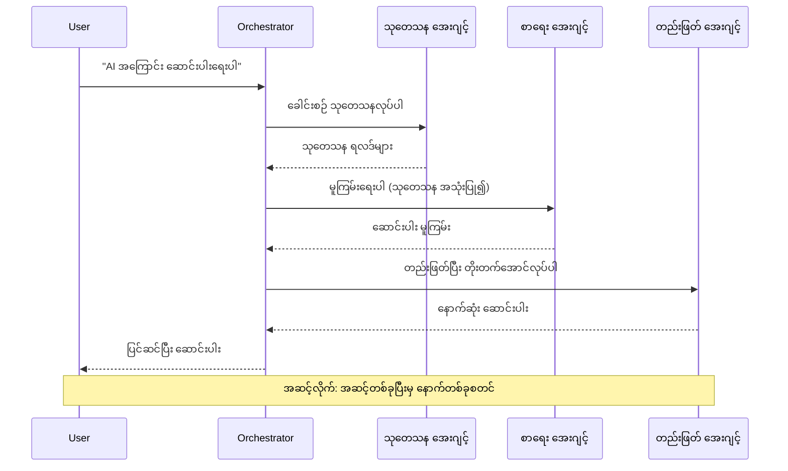
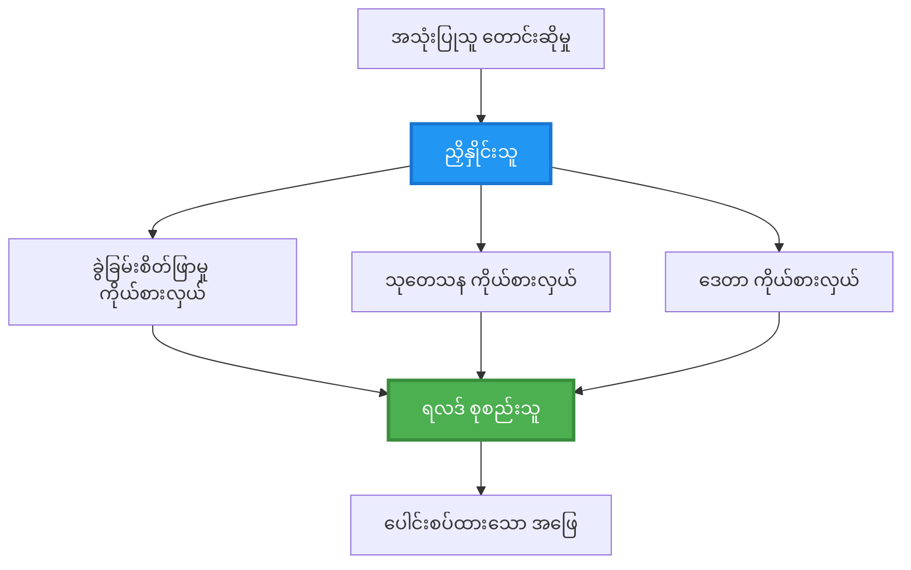
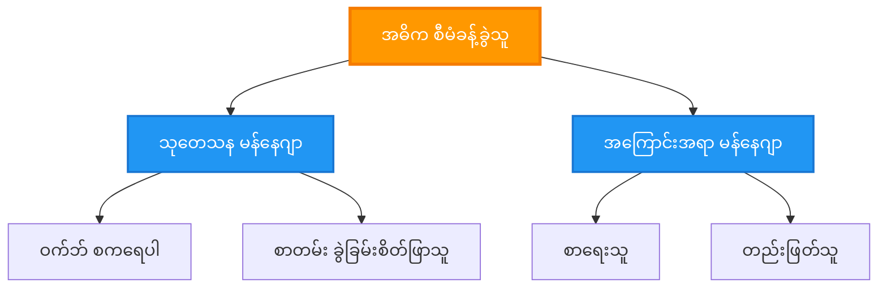
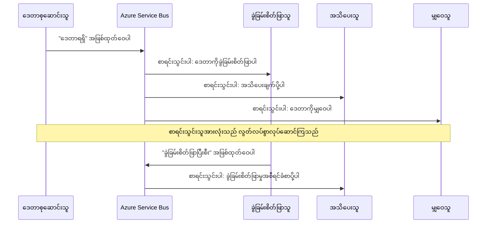
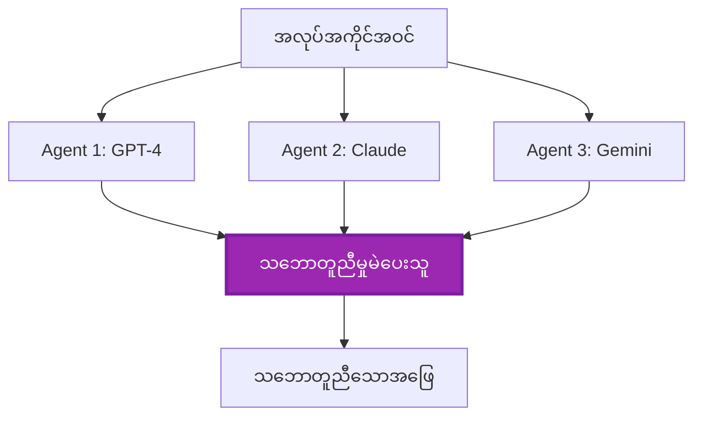
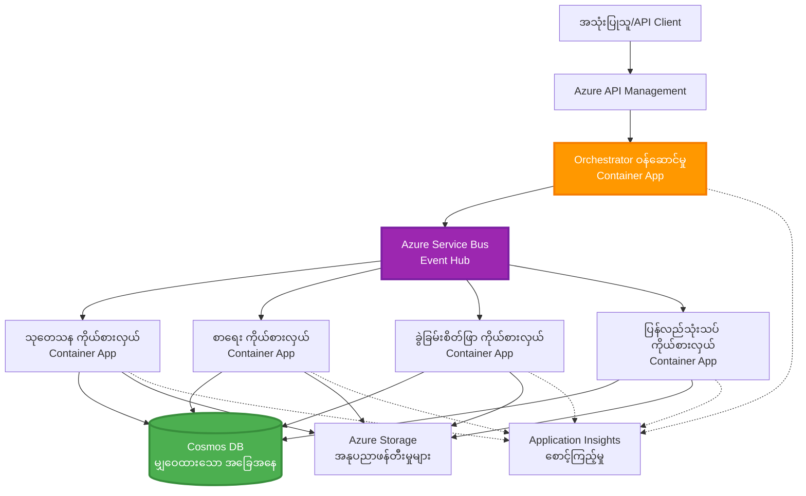

<!--
CO_OP_TRANSLATOR_METADATA:
{
  "original_hash": "bcefbd5d0107691ef3e6e33ba694d6f4",
  "translation_date": "2025-11-23T23:53:06+00:00",
  "source_file": "docs/pre-deployment/coordination-patterns.md",
  "language_code": "my"
}
-->
# Multi-Agent Coordination Patterns

⏱️ **ခန့်မှန်းချိန်**: 60-75 မိနစ် | 💰 **ခန့်မှန်းကုန်ကျစရိတ်**: ~$100-300/လ | ⭐ **အဆင့်**: အဆင့်မြင့်

**📚 သင်ကြားမှုလမ်းကြောင်း:**
- ← အရင်ဆုံး: [Capacity Planning](capacity-planning.md) - အရင်းအမြစ်အရွယ်အစားနှင့်အရွယ်အစားချဲ့ထွင်မှုနည်းလမ်းများ
- 🎯 **သင်ရှိနေသောနေရာ**: Multi-Agent Coordination Patterns (Orchestration, communication, state management)
- → နောက်တစ်ခု: [SKU Selection](sku-selection.md) - Azure ဝန်ဆောင်မှုများကိုရွေးချယ်ခြင်း
- 🏠 [သင်တန်းမူလစာမျက်နှာ](../../README.md)

---

## သင်လေ့လာနိုင်မည့်အရာများ

ဒီသင်ခန်းစာကိုပြီးမြောက်ပါက၊ သင်သည်:
- **multi-agent architecture** ပုံစံများကိုနားလည်ပြီး အသုံးပြုရန်အချိန်ကိုသိရှိမည်
- **orchestration patterns** (centralized, decentralized, hierarchical) ကိုအကောင်အထည်ဖော်မည်
- **agent communication** နည်းလမ်းများ (synchronous, asynchronous, event-driven) ကိုဒီဇိုင်းဆွဲမည်
- **shared state** ကိုဖြန့်ဝေထားသော agent များအကြားစီမံခန့်ခွဲမည်
- Azure တွင် **multi-agent systems** ကို deploy လုပ်မည်
- အမှန်တကယ် AI အခြေအနေများအတွက် **coordination patterns** ကိုအသုံးချမည်
- ဖြန့်ဝေထားသော agent စနစ်များကိုစောင့်ကြည့်ပြီး debugging လုပ်မည်

## Multi-Agent Coordination အရေးကြီးမှု

### တစ်ဦးချင်း Agent မှ Multi-Agent သို့အဆင့်မြှင့်တင်ခြင်း

**Single Agent (ရိုးရှင်းသော):**
```
User → Agent → Response
```
- ✅ နားလည်ရလွယ်ကူပြီး အကောင်အထည်ဖော်ရလွယ်ကူသည်
- ✅ ရိုးရှင်းသောအလုပ်များအတွက်အမြန်ဆုံး
- ❌ တစ်ခုတည်းသော model ၏စွမ်းရည်များဖြင့်ကန့်သတ်ထားသည်
- ❌ ရှုပ်ထွေးသောအလုပ်များကို parallelize လုပ်၍မရ
- ❌ အထူးပြုမှုမရှိ

**Multi-Agent System (အဆင့်မြင့်):**
```
           ┌─────────────┐
           │ Orchestrator│
           └──────┬──────┘
        ┌─────────┼─────────┐
        │         │         │
    ┌───▼──┐  ┌──▼───┐  ┌──▼────┐
    │Agent1│  │Agent2│  │Agent3 │
    │(Plan)│  │(Code)│  │(Review)│
    └──────┘  └──────┘  └───────┘
```
- ✅ အထူးပြု agent များကိုအထူးပြုအလုပ်များအတွက်အသုံးပြုနိုင်သည်
- ✅ အမြန်ဆုံးအလုပ်လုပ်နိုင်ရန် parallel execution
- ✅ Modular ဖြစ်ပြီး maintainable ဖြစ်သည်
- ✅ ရှုပ်ထွေးသော workflow များတွင်ပိုမိုကောင်းမွန်သည်
- ⚠️ Coordination logic လိုအပ်သည်

**ဥပမာ**: Single agent သည်အလုပ်အားလုံးကိုတစ်ဦးတည်းလုပ်နေသကဲ့သို့ဖြစ်သည်။ Multi-agent သည်အဖွဲ့တစ်ခုဖြစ်ပြီး အဖွဲ့ဝင်တစ်ဦးစီတွင်အထူးပြုကျွမ်းကျင်မှုများရှိပြီး (သုတေသနသူ၊ coder၊ reviewer၊ writer) အတူတကွအလုပ်လုပ်နေသည်။

---

## Core Coordination Patterns

### Pattern 1: Sequential Coordination (Chain of Responsibility)

**အသုံးပြုရန်အချိန်**: အလုပ်များကိုအတိအကျအစီအစဉ်လိုက်ပြီး၊ agent တစ်ခုစီသည်အရင်ဆုံး output ကိုအခြေခံ၍ဆက်လုပ်ရမည်။


**အကျိုးကျေးဇူးများ:**
- ✅ Data flow ရှင်းလင်းသည်
- ✅ Debug လုပ်ရလွယ်ကူသည်
- ✅ အကောင်အထည်ဖော်မှုအစီအစဉ်ကိုခန့်မှန်းနိုင်သည်

**ကန့်သတ်ချက်များ:**
- ❌ အလုပ်လုပ်နှုန်းနှေးသည် (parallelism မရှိ)
- ❌ တစ်ခုချို့ယွင်းပါက chain အားလုံးပိတ်ဆို့သည်
- ❌ အချင်းချင်းပေါ်မူတည်သောအလုပ်များကိုကိုင်တွယ်၍မရ

**ဥပမာအသုံးပြုမှုများ:**
- အကြောင်းအရာဖန်တီးမှု pipeline (သုတေသန → ရေးသား → တည်းဖြတ် → ထုတ်ဝေ)
- Code ဖန်တီးမှု (အစီအစဉ် → အကောင်အထည်ဖော် → စမ်းသပ် → ထုတ်ဝေ)
- အစီရင်ခံစာဖန်တီးမှု (ဒေတာစုဆောင်း → ခွဲခြမ်းစိတ်ဖြာ → visualization → အကျဉ်းချုပ်)

---

### Pattern 2: Parallel Coordination (Fan-Out/Fan-In)

**အသုံးပြုရန်အချိန်**: အချင်းချင်းမပေါ်မူတည်သောအလုပ်များကိုတစ်ပြိုင်နက်လုပ်နိုင်ပြီး၊ အဆုံးတွင်ရလဒ်များကိုပေါင်းစည်းနိုင်သည်။


**အကျိုးကျေးဇူးများ:**
- ✅ အမြန်ဆုံး (parallel execution)
- ✅ Fault-tolerant (partial results လက်ခံနိုင်သည်)
- ✅ Horizontally scale လုပ်နိုင်သည်

**ကန့်သတ်ချက်များ:**
- ⚠️ ရလဒ်များအစီအစဉ်မရှိဘဲရောက်နိုင်သည်
- ⚠️ Aggregation logic လိုအပ်သည်
- ⚠️ State management ရှုပ်ထွေးသည်

**ဥပမာအသုံးပြုမှုများ:**
- Multi-source data စုဆောင်းမှု (APIs + databases + web scraping)
- ယှဉ်ပြိုင်မှုခွဲခြမ်းစိတ်ဖြာမှု (models များစွာဖြင့်ဖြေရှင်းမှုဖန်တီးပြီး၊ အကောင်းဆုံးကိုရွေးချယ်)
- ဘာသာပြန်ဝန်ဆောင်မှုများ (တစ်ပြိုင်နက်ဘာသာစကားများစွာသို့ဘာသာပြန်)

---

### Pattern 3: Hierarchical Coordination (Manager-Worker)

**အသုံးပြုရန်အချိန်**: ရှုပ်ထွေးသော workflow များတွင် sub-task များနှင့် delegation လိုအပ်သည်။


**အကျိုးကျေးဇူးများ:**
- ✅ ရှုပ်ထွေးသော workflow များကိုကိုင်တွယ်နိုင်သည်
- ✅ Modular ဖြစ်ပြီး maintainable ဖြစ်သည်
- ✅ တာဝန်များရှင်းလင်းသည်

**ကန့်သတ်ချက်များ:**
- ⚠️ Architecture ပိုမိုရှုပ်ထွေးသည်
- ⚠️ Latency မြင့်တက်နိုင်သည် (coordination layers များစွာရှိသည်)
- ⚠️ Sophisticated orchestration လိုအပ်သည်

**ဥပမာအသုံးပြုမှုများ:**
- စီးပွားရေးစာရွက်စာတမ်းများကိုကိုင်တွယ်မှု (classify → route → process → archive)
- Multi-stage data pipeline များ (ingest → clean → transform → analyze → report)
- ရှုပ်ထွေးသော automation workflow များ (planning → resource allocation → execution → monitoring)

---

### Pattern 4: Event-Driven Coordination (Publish-Subscribe)

**အသုံးပြုရန်အချိန်**: Agent များသည်အဖြစ်အပျက်များကိုတုံ့ပြန်ရန်လိုအပ်ပြီး၊ loose coupling လိုအပ်သည်။


**အကျိုးကျေးဇူးများ:**
- ✅ Agent များအကြား loose coupling
- ✅ Agent အသစ်များကိုထည့်ရန်လွယ်ကူသည် (subscribe လုပ်ရုံသာလိုအပ်)
- ✅ Asynchronous processing
- ✅ Message persistence ကြောင့် resilient ဖြစ်သည်

**ကန့်သတ်ချက်များ:**
- ⚠️ Eventual consistency
- ⚠️ Debugging ရှုပ်ထွေးသည်
- ⚠️ Message ordering အခက်အခဲများရှိသည်

**ဥပမာအသုံးပြုမှုများ:**
- အချိန်နှင့်တပြေးညီ monitoring စနစ်များ (alerts, dashboards, logs)
- Multi-channel အကြောင်းကြားမှုများ (email, SMS, push, Slack)
- Data processing pipeline များ (အတူတူ data ကိုအသုံးပြုသော consumer များ)

---

### Pattern 5: Consensus-Based Coordination (Voting/Quorum)

**အသုံးပြုရန်အချိန်**: Agent များစွာ၏သဘောတူညီမှုလိုအပ်သည်။


**အကျိုးကျေးဇူးများ:**
- ✅ တိကျမှုမြင့်မားသည် (အမြင်များစွာရှိသည်)
- ✅ Fault-tolerant (minority failure များကိုလက်ခံနိုင်သည်)
- ✅ Quality assurance built-in

**ကန့်သတ်ချက်များ:**
- ❌ စရိတ်များကြီး (model call များစွာလိုအပ်)
- ❌ နှေးကွေးသည် (agent အားလုံးကိုစောင့်ရ)
- ⚠️ Conflict resolution လိုအပ်သည်

**ဥပမာအသုံးပြုမှုများ:**
- အကြောင်းအရာ moderation (model များစွာ content ကိုစစ်ဆေး)
- Code review (linters/analyzers များစွာ)
- ဆေးဘက်အတည်ပြုမှု (AI model များစွာ၊ ကျွမ်းကျင်သူ validation)

---

## Architecture Overview

### Azure တွင် Complete Multi-Agent System


**အဓိကအစိတ်အပိုင်းများ:**

| Component | ရည်ရွယ်ချက် | Azure ဝန်ဆောင်မှု |
|-----------|---------|---------------|
| **API Gateway** | ဝင်ပေါက်၊ rate limiting၊ auth | API Management |
| **Orchestrator** | Agent workflow များကိုစီမံခန့်ခွဲ | Container Apps |
| **Message Queue** | Asynchronous communication | Service Bus / Event Hubs |
| **Agents** | အထူးပြု AI worker များ | Container Apps / Functions |
| **State Store** | Shared state၊ task tracking | Cosmos DB |
| **Artifact Storage** | စာရွက်စာတမ်းများ၊ ရလဒ်များ၊ logs | Blob Storage |
| **Monitoring** | Distributed tracing၊ logs | Application Insights |

---

## Prerequisites

### လိုအပ်သော Tools

```bash
# Azure Developer CLI ကိုစစ်ဆေးပါ
azd version
# ✅ မျှော်မှန်းထားသည်: azd version 1.0.0 သို့မဟုတ် အထက်

# Azure CLI ကိုစစ်ဆေးပါ
az --version
# ✅ မျှော်မှန်းထားသည်: azure-cli 2.50.0 သို့မဟုတ် အထက်

# Docker ကိုစစ်ဆေးပါ (ဒေသတွင်း စမ်းသပ်မှုအတွက်)
docker --version
# ✅ မျှော်မှန်းထားသည်: Docker version 20.10 သို့မဟုတ် အထက်
```

### Azure လိုအပ်ချက်များ

- Active Azure subscription
- ဖန်တီးရန်ခွင့်ပြုချက်များ:
  - Container Apps
  - Service Bus namespaces
  - Cosmos DB accounts
  - Storage accounts
  - Application Insights

### အသိပညာလိုအပ်ချက်များ

သင်ပြီးစီးထားသင့်သည်:
- [Configuration Management](../getting-started/configuration.md)
- [Authentication & Security](../getting-started/authsecurity.md)
- [Microservices Example](../../../../examples/microservices)

---

## Implementation Guide

### Project Structure

```
multi-agent-system/
├── azure.yaml                    # AZD configuration
├── infra/
│   ├── main.bicep               # Main infrastructure
│   ├── core/
│   │   ├── servicebus.bicep     # Message queue
│   │   ├── cosmos.bicep         # State store
│   │   ├── storage.bicep        # Artifact storage
│   │   └── monitoring.bicep     # Application Insights
│   └── app/
│       ├── orchestrator.bicep   # Orchestrator service
│       └── agent.bicep          # Agent template
└── src/
    ├── orchestrator/            # Orchestration logic
    │   ├── app.py
    │   ├── workflows.py
    │   └── Dockerfile
    ├── agents/
    │   ├── research/            # Research agent
    │   ├── writer/              # Writer agent
    │   ├── analyst/             # Analyst agent
    │   └── reviewer/            # Reviewer agent
    └── shared/
        ├── state_manager.py     # Shared state logic
        └── message_handler.py   # Message handling
```

---

## Lesson 1: Sequential Coordination Pattern

### Implementation: Content Creation Pipeline

Research → Write → Edit → Publish အစီအစဉ်လိုက် pipeline တစ်ခုကိုတည်ဆောက်ကြမည်

### 1. AZD Configuration

**File: `azure.yaml`**

```yaml
name: content-pipeline
metadata:
  template: multi-agent-sequential@1.0.0

services:
  orchestrator:
    project: ./src/orchestrator
    language: python
    host: containerapp
  
  research-agent:
    project: ./src/agents/research
    language: python
    host: containerapp
  
  writer-agent:
    project: ./src/agents/writer
    language: python
    host: containerapp
  
  editor-agent:
    project: ./src/agents/editor
    language: python
    host: containerapp
```

### 2. Infrastructure: Service Bus for Coordination

**File: `infra/core/servicebus.bicep`**

```bicep
param name string
param location string
param tags object = {}

resource serviceBusNamespace 'Microsoft.ServiceBus/namespaces@2022-10-01-preview' = {
  name: name
  location: location
  tags: tags
  sku: {
    name: 'Standard'
    tier: 'Standard'
  }
  properties: {
    minimumTlsVersion: '1.2'
  }
}

// Queue for orchestrator → research agent
resource researchQueue 'Microsoft.ServiceBus/namespaces/queues@2022-10-01-preview' = {
  parent: serviceBusNamespace
  name: 'research-tasks'
  properties: {
    maxDeliveryCount: 3
    lockDuration: 'PT5M'
    deadLetteringOnMessageExpiration: true
  }
}

// Queue for research agent → writer agent
resource writerQueue 'Microsoft.ServiceBus/namespaces/queues@2022-10-01-preview' = {
  parent: serviceBusNamespace
  name: 'writer-tasks'
  properties: {
    maxDeliveryCount: 3
    lockDuration: 'PT5M'
  }
}

// Queue for writer agent → editor agent
resource editorQueue 'Microsoft.ServiceBus/namespaces/queues@2022-10-01-preview' = {
  parent: serviceBusNamespace
  name: 'editor-tasks'
  properties: {
    maxDeliveryCount: 3
    lockDuration: 'PT5M'
  }
}

output namespace string = serviceBusNamespace.name
output connectionString string = listKeys('${serviceBusNamespace.id}/AuthorizationRules/RootManageSharedAccessKey', serviceBusNamespace.apiVersion).primaryConnectionString
```

### 3. Shared State Manager

**File: `src/shared/state_manager.py`**

```python
from azure.cosmos import CosmosClient, PartitionKey
from datetime import datetime
import os

class StateManager:
    """Manages shared state across agents using Cosmos DB"""
    
    def __init__(self):
        endpoint = os.environ['COSMOS_ENDPOINT']
        key = os.environ['COSMOS_KEY']
        
        self.client = CosmosClient(endpoint, key)
        self.database = self.client.get_database_client('agent-state')
        self.container = self.database.get_container_client('tasks')
    
    def create_task(self, task_id: str, task_type: str, input_data: dict):
        """Create a new task"""
        task = {
            'id': task_id,
            'type': task_type,
            'status': 'pending',
            'input': input_data,
            'created_at': datetime.utcnow().isoformat(),
            'steps': []
        }
        self.container.create_item(task)
        return task
    
    def update_task_step(self, task_id: str, step_name: str, result: dict):
        """Update task with completed step"""
        task = self.container.read_item(task_id, partition_key=task_id)
        
        task['steps'].append({
            'name': step_name,
            'completed_at': datetime.utcnow().isoformat(),
            'result': result
        })
        
        self.container.replace_item(task_id, task)
        return task
    
    def complete_task(self, task_id: str, final_result: dict):
        """Mark task as complete"""
        task = self.container.read_item(task_id, partition_key=task_id)
        task['status'] = 'completed'
        task['result'] = final_result
        task['completed_at'] = datetime.utcnow().isoformat()
        self.container.replace_item(task_id, task)
        return task
    
    def get_task(self, task_id: str):
        """Retrieve task state"""
        return self.container.read_item(task_id, partition_key=task_id)
```

### 4. Orchestrator Service

**File: `src/orchestrator/app.py`**

```python
from flask import Flask, request, jsonify
from azure.servicebus import ServiceBusClient, ServiceBusMessage
import json
import uuid
import os
from shared.state_manager import StateManager

app = Flask(__name__)
state_manager = StateManager()

# ဆာဗစ်ဘတ်စ် ချိတ်ဆက်မှု
servicebus_connection_str = os.environ['SERVICEBUS_CONNECTION_STRING']
servicebus_client = ServiceBusClient.from_connection_string(servicebus_connection_str)

@app.route('/health', methods=['GET'])
def health():
    return jsonify({'status': 'healthy', 'service': 'orchestrator'})

@app.route('/create-content', methods=['POST'])
def create_content():
    """
    Sequential workflow: Research → Write → Edit → Publish
    """
    data = request.json
    topic = data.get('topic')
    
    if not topic:
        return jsonify({'error': 'Topic required'}), 400
    
    # အခြေအနေသိုလှောင်မှုတွင် တာဝန်ဖန်တီးပါ
    task_id = str(uuid.uuid4())
    task = state_manager.create_task(
        task_id=task_id,
        task_type='content_creation',
        input_data={'topic': topic}
    )
    
    # သုတေသနအေးဂျင့်ထံသို့ မက်ဆေ့ချ်ပို့ပါ (ပထမအဆင့်)
    sender = servicebus_client.get_queue_sender('research-tasks')
    message = ServiceBusMessage(
        body=json.dumps({
            'task_id': task_id,
            'topic': topic,
            'next_queue': 'writer-tasks'  # ရလဒ်များကို ပို့ရန်နေရာ
        }),
        content_type='application/json'
    )
    
    with sender:
        sender.send_messages(message)
    
    return jsonify({
        'task_id': task_id,
        'status': 'started',
        'workflow': 'sequential',
        'steps': ['research', 'write', 'edit', 'publish'],
        'message': 'Content creation pipeline initiated'
    }), 202

@app.route('/task/<task_id>', methods=['GET'])
def get_task_status(task_id):
    """Check task status"""
    try:
        task = state_manager.get_task(task_id)
        return jsonify(task)
    except Exception as e:
        return jsonify({'error': str(e)}), 404

if __name__ == '__main__':
    app.run(host='0.0.0.0', port=8080)
```

### 5. Research Agent

**File: `src/agents/research/app.py`**

```python
from azure.servicebus import ServiceBusClient, ServiceBusMessage
from openai import AzureOpenAI
import json
import os
import time
from shared.state_manager import StateManager

# ကလိုင်များကို စတင်ပါ
state_manager = StateManager()
servicebus_client = ServiceBusClient.from_connection_string(
    os.environ['SERVICEBUS_CONNECTION_STRING']
)

openai_client = AzureOpenAI(
    api_key=os.environ['AZURE_OPENAI_API_KEY'],
    api_version="2024-02-01",
    azure_endpoint=os.environ['AZURE_OPENAI_ENDPOINT']
)

def process_research_task(message_data):
    """Process research request and pass to writer"""
    task_id = message_data['task_id']
    topic = message_data['topic']
    next_queue = message_data['next_queue']
    
    print(f"🔬 Researching: {topic}")
    
    # သုတေသနအတွက် Azure OpenAI ကို ခေါ်ပါ
    response = openai_client.chat.completions.create(
        model="gpt-4",
        messages=[
            {"role": "system", "content": "You are a research assistant. Provide comprehensive research on the given topic."},
            {"role": "user", "content": f"Research this topic thoroughly: {topic}"}
        ],
        max_tokens=1500
    )
    
    research_results = response.choices[0].message.content
    
    # အခြေအနေကို အပ်ဒိတ်လုပ်ပါ
    state_manager.update_task_step(
        task_id=task_id,
        step_name='research',
        result={'research': research_results}
    )
    
    # နောက်ထပ်အေးဂျင့် (စာရေးသူ) ထံပို့ပါ
    sender = servicebus_client.get_queue_sender(next_queue)
    message = ServiceBusMessage(
        body=json.dumps({
            'task_id': task_id,
            'topic': topic,
            'research': research_results,
            'next_queue': 'editor-tasks'
        }),
        content_type='application/json'
    )
    
    with sender:
        sender.send_messages(message)
    
    print(f"✅ Research complete for task {task_id}")

def main():
    """Listen to research queue"""
    receiver = servicebus_client.get_queue_receiver('research-tasks')
    
    print("🔬 Research Agent started, listening for tasks...")
    
    with receiver:
        while True:
            messages = receiver.receive_messages(max_wait_time=5)
            for message in messages:
                try:
                    message_data = json.loads(str(message))
                    process_research_task(message_data)
                    receiver.complete_message(message)
                except Exception as e:
                    print(f"❌ Error processing message: {e}")
                    receiver.abandon_message(message)

if __name__ == '__main__':
    main()
```

### 6. Writer Agent

**File: `src/agents/writer/app.py`**

```python
from azure.servicebus import ServiceBusClient, ServiceBusMessage
from openai import AzureOpenAI
import json
import os
from shared.state_manager import StateManager

state_manager = StateManager()
servicebus_client = ServiceBusClient.from_connection_string(
    os.environ['SERVICEBUS_CONNECTION_STRING']
)

openai_client = AzureOpenAI(
    api_key=os.environ['AZURE_OPENAI_API_KEY'],
    api_version="2024-02-01",
    azure_endpoint=os.environ['AZURE_OPENAI_ENDPOINT']
)

def process_writing_task(message_data):
    """Write article based on research"""
    task_id = message_data['task_id']
    topic = message_data['topic']
    research = message_data['research']
    next_queue = message_data['next_queue']
    
    print(f"✍️ Writing article: {topic}")
    
    # Azure OpenAI ကိုခေါ်ပြီး ဆောင်းပါးရေးပါ
    response = openai_client.chat.completions.create(
        model="gpt-4",
        messages=[
            {"role": "system", "content": "You are a professional writer. Write engaging, well-structured articles."},
            {"role": "user", "content": f"Based on this research:\n\n{research}\n\nWrite a comprehensive article about: {topic}"}
        ],
        max_tokens=2000
    )
    
    article_draft = response.choices[0].message.content
    
    # အခြေအနေကို အပ်ဒိတ်လုပ်ပါ
    state_manager.update_task_step(
        task_id=task_id,
        step_name='writing',
        result={'draft': article_draft}
    )
    
    # အယ်ဒီတာဆီပို့ပါ
    sender = servicebus_client.get_queue_sender(next_queue)
    message = ServiceBusMessage(
        body=json.dumps({
            'task_id': task_id,
            'topic': topic,
            'draft': article_draft
        }),
        content_type='application/json'
    )
    
    with sender:
        sender.send_messages(message)
    
    print(f"✅ Article draft complete for task {task_id}")

def main():
    """Listen to writer queue"""
    receiver = servicebus_client.get_queue_receiver('writer-tasks')
    
    print("✍️ Writer Agent started, listening for tasks...")
    
    with receiver:
        while True:
            messages = receiver.receive_messages(max_wait_time=5)
            for message in messages:
                try:
                    message_data = json.loads(str(message))
                    process_writing_task(message_data)
                    receiver.complete_message(message)
                except Exception as e:
                    print(f"❌ Error: {e}")
                    receiver.abandon_message(message)

if __name__ == '__main__':
    main()
```

### 7. Editor Agent

**File: `src/agents/editor/app.py`**

```python
from azure.servicebus import ServiceBusClient
from openai import AzureOpenAI
import json
import os
from shared.state_manager import StateManager

state_manager = StateManager()
servicebus_client = ServiceBusClient.from_connection_string(
    os.environ['SERVICEBUS_CONNECTION_STRING']
)

openai_client = AzureOpenAI(
    api_key=os.environ['AZURE_OPENAI_API_KEY'],
    api_version="2024-02-01",
    azure_endpoint=os.environ['AZURE_OPENAI_ENDPOINT']
)

def process_editing_task(message_data):
    """Edit and finalize article"""
    task_id = message_data['task_id']
    topic = message_data['topic']
    draft = message_data['draft']
    
    print(f"📝 Editing article: {topic}")
    
    # Azure OpenAI ကိုခေါ်ပြီးတည်းဖြတ်ပါ
    response = openai_client.chat.completions.create(
        model="gpt-4",
        messages=[
            {"role": "system", "content": "You are an expert editor. Improve grammar, clarity, and structure."},
            {"role": "user", "content": f"Edit and improve this article:\n\n{draft}"}
        ],
        max_tokens=2000
    )
    
    final_article = response.choices[0].message.content
    
    # အလုပ်ကိုပြီးစီးသည်ဟုအမှတ်အသားပြုပါ
    state_manager.complete_task(
        task_id=task_id,
        final_result={
            'topic': topic,
            'final_article': final_article,
            'word_count': len(final_article.split())
        }
    )
    
    print(f"✅ Article finalized for task {task_id}")

def main():
    """Listen to editor queue"""
    receiver = servicebus_client.get_queue_receiver('editor-tasks')
    
    print("📝 Editor Agent started, listening for tasks...")
    
    with receiver:
        while True:
            messages = receiver.receive_messages(max_wait_time=5)
            for message in messages:
                try:
                    message_data = json.loads(str(message))
                    process_editing_task(message_data)
                    receiver.complete_message(message)
                except Exception as e:
                    print(f"❌ Error: {e}")
                    receiver.abandon_message(message)

if __name__ == '__main__':
    main()
```

### 8. Deploy and Test

```bash
# စတင်ပြီး ဖြန့်ချိပါ
azd init
azd up

# အော်ကက်စထရေးတာ URL ကိုရယူပါ
ORCHESTRATOR_URL=$(azd env get-values | grep ORCHESTRATOR_URL | cut -d '=' -f2 | tr -d '"')

# အကြောင်းအရာ ဖန်တီးပါ
curl -X POST $ORCHESTRATOR_URL/create-content \
  -H "Content-Type: application/json" \
  -d '{"topic": "The Future of AI in Healthcare"}'
```

**✅ မျှော်မှန်းရလဒ်:**
```json
{
  "task_id": "a1b2c3d4-e5f6-7890-abcd-ef1234567890",
  "status": "started",
  "workflow": "sequential",
  "steps": ["research", "write", "edit", "publish"],
  "message": "Content creation pipeline initiated"
}
```

**Task progress ကိုစစ်ဆေးပါ:**
```bash
TASK_ID="a1b2c3d4-e5f6-7890-abcd-ef1234567890"
curl $ORCHESTRATOR_URL/task/$TASK_ID
```

**✅ မျှော်မှန်းရလဒ် (ပြီးစီး):**
```json
{
  "id": "a1b2c3d4-e5f6-7890-abcd-ef1234567890",
  "type": "content_creation",
  "status": "completed",
  "steps": [
    {
      "name": "research",
      "completed_at": "2025-11-19T10:30:00Z",
      "result": {"research": "..."}
    },
    {
      "name": "writing",
      "completed_at": "2025-11-19T10:32:00Z",
      "result": {"draft": "..."}
    }
  ],
  "result": {
    "topic": "The Future of AI in Healthcare",
    "final_article": "...",
    "word_count": 1500
  }
}
```

---

## Lesson 2: Parallel Coordination Pattern

### Implementation: Multi-Source Research Aggregator

Multi-source မှတစ်ပြိုင်နက်အချက်အလက်များကိုစုဆောင်းသော parallel system တစ်ခုကိုတည်ဆောက်ကြမည်။

### Parallel Orchestrator

**File: `src/orchestrator/parallel_workflow.py`**

```python
from flask import Flask, request, jsonify
from azure.servicebus import ServiceBusClient, ServiceBusMessage
import json
import uuid
import os
from shared.state_manager import StateManager

app = Flask(__name__)
state_manager = StateManager()

servicebus_client = ServiceBusClient.from_connection_string(
    os.environ['SERVICEBUS_CONNECTION_STRING']
)

@app.route('/research-parallel', methods=['POST'])
def research_parallel():
    """
    Parallel workflow: Multiple agents work simultaneously
    """
    data = request.json
    query = data.get('query')
    
    task_id = str(uuid.uuid4())
    task = state_manager.create_task(
        task_id=task_id,
        task_type='parallel_research',
        input_data={
            'query': query,
            'agents': ['web', 'academic', 'news', 'social']
        }
    )
    
    # Fan-out: အေးဂျင့်အားလုံးကို တစ်ပြိုင်နက်တည်း ပို့ပါ
    agents = [
        ('web-research-queue', 'web'),
        ('academic-research-queue', 'academic'),
        ('news-research-queue', 'news'),
        ('social-research-queue', 'social')
    ]
    
    for queue_name, agent_type in agents:
        sender = servicebus_client.get_queue_sender(queue_name)
        message = ServiceBusMessage(
            body=json.dumps({
                'task_id': task_id,
                'query': query,
                'agent_type': agent_type,
                'result_queue': 'aggregation-queue'
            }),
            content_type='application/json'
        )
        
        with sender:
            sender.send_messages(message)
    
    return jsonify({
        'task_id': task_id,
        'status': 'started',
        'workflow': 'parallel',
        'agents_dispatched': 4,
        'message': 'Parallel research initiated'
    }), 202

if __name__ == '__main__':
    app.run(host='0.0.0.0', port=8080)
```

### Aggregation Logic

**File: `src/agents/aggregator/app.py`**

```python
from azure.servicebus import ServiceBusClient
import json
import os
from collections import defaultdict
from shared.state_manager import StateManager

state_manager = StateManager()
servicebus_client = ServiceBusClient.from_connection_string(
    os.environ['SERVICEBUS_CONNECTION_STRING']
)

# တစ်ခုချင်းစီ၏လုပ်ငန်းရလဒ်များကိုခြေရာခံပါ
task_results = defaultdict(list)
expected_agents = 4  # ဝက်ဘ်၊ ပညာရေး၊ သတင်း၊ လူမှုရေး

def process_result(message_data):
    """Aggregate results from parallel agents"""
    task_id = message_data['task_id']
    agent_type = message_data['agent_type']
    result = message_data['result']
    
    # ရလဒ်ကိုသိမ်းဆည်းပါ
    task_results[task_id].append({
        'agent': agent_type,
        'data': result
    })
    
    print(f"📊 Received result from {agent_type} agent ({len(task_results[task_id])}/{expected_agents})")
    
    # အေးဂျင့်အားလုံးပြီးမြောက်ခဲ့သည်ကိုစစ်ဆေးပါ (fan-in)
    if len(task_results[task_id]) == expected_agents:
        print(f"✅ All agents completed for task {task_id}. Aggregating...")
        
        # ရလဒ်များကိုပေါင်းစည်းပါ
        aggregated = {
            'query': message_data['query'],
            'sources': task_results[task_id],
            'summary': generate_summary(task_results[task_id])
        }
        
        # ပြီးမြောက်သည်ဟုအမှတ်အသားပြုပါ
        state_manager.complete_task(task_id, aggregated)
        
        # ရှင်းလင်းရေးလုပ်ဆောင်ပါ
        del task_results[task_id]
        
        print(f"✅ Aggregation complete for task {task_id}")

def generate_summary(results):
    """Generate summary from all sources"""
    summaries = [r['data'].get('summary', '') for r in results]
    return '\n\n'.join(summaries)

def main():
    """Listen to aggregation queue"""
    receiver = servicebus_client.get_queue_receiver('aggregation-queue')
    
    print("📊 Aggregator started, listening for results...")
    
    with receiver:
        while True:
            messages = receiver.receive_messages(max_wait_time=5)
            for message in messages:
                try:
                    message_data = json.loads(str(message))
                    process_result(message_data)
                    receiver.complete_message(message)
                except Exception as e:
                    print(f"❌ Error: {e}")
                    receiver.abandon_message(message)

if __name__ == '__main__':
    main()
```

**Parallel Pattern ၏အကျိုးကျေးဇူးများ:**
- ⚡ **4x အမြန်ဆုံး** (agent များတစ်ပြိုင်နက်လုပ်ဆောင်သည်)
- 🔄 **Fault-tolerant** (partial results လက်ခံနိုင်သည်)
- 📈 **Scalable** (agent များကိုလွယ်ကူစွာထည့်နိုင်သည်)

---

## Practical Exercises

### Exercise 1: Add Timeout Handling ⭐⭐ (အလယ်အလတ်)

**ရည်ရွယ်ချက်**: Aggregator သည် agent များနှေးကွေးနေသောအချိန်အမြဲစောင့်မနေစေရန် timeout logic ကိုတည်ဆောက်ပါ။

**အဆင့်များ**:

1. **Timeout tracking ကို aggregator တွင်ထည့်ပါ:**

```python
from datetime import datetime, timedelta

task_timeouts = {}  # task_id -> expiration_time

def process_result(message_data):
    task_id = message_data['task_id']
    
    # ပထမဆုံးရလဒ်တွင် timeout သတ်မှတ်ပါ
    if task_id not in task_timeouts:
        task_timeouts[task_id] = datetime.utcnow() + timedelta(seconds=30)
    
    task_results[task_id].append({
        'agent': message_data['agent_type'],
        'data': message_data['result']
    })
    
    # ပြီးမြောက်ပြီးသား OR timeout ဖြစ်ပြီးသားဖြစ်ကြောင်းစစ်ဆေးပါ
    if len(task_results[task_id]) == expected_agents or \
       datetime.utcnow() > task_timeouts[task_id]:
        
        print(f"📊 Aggregating with {len(task_results[task_id])}/{expected_agents} results")
        
        aggregated = {
            'query': message_data['query'],
            'sources': task_results[task_id],
            'completed_agents': len(task_results[task_id]),
            'timed_out': len(task_results[task_id]) < expected_agents
        }
        
        state_manager.complete_task(task_id, aggregated)
        
        # ရှင်းလင်းမှု
        del task_results[task_id]
        del task_timeouts[task_id]
```

2. **Artificial delays ဖြင့်စမ်းသပ်ပါ:**

```python
# တစ်ဦးတည်းသော agent တွင် processing နှေးကွေးမှုကို simulation လုပ်ရန် အချိန်နှောင့်နှေးမှု ထည့်ပါ။
import time
time.sleep(35)  # ၃၀ စက္ကန့် timeout ကို ကျော်လွန်သည်။
```

3. **Deploy လုပ်ပြီးအတည်ပြုပါ:**

```bash
azd deploy aggregator

# တာဝန်ကိုတင်သွင်းပါ
curl -X POST $ORCHESTRATOR_URL/research-parallel \
  -H "Content-Type: application/json" \
  -d '{"query": "AI safety research"}'

# ရလဒ်များကို ၃၀ စက္ကန့်အကြာတွင် စစ်ဆေးပါ
curl $ORCHESTRATOR_URL/task/$TASK_ID
```

**✅ အောင်မြင်မှုအCriteria:**
- ✅ Task သည် 30 စက္ကန့်အတွင်းပြီးမြောက်သည်၊ agent များမပြီးမြောက်သည့်အချိန်တွင်
- ✅ Response သည် partial results ကိုပြသသည် (`"timed_out": true`)
- ✅ ရရှိနိုင်သောရလဒ်များကိုပြန်ပေးသည် (agent 4 ခုမှ 3 ခု)

**အချိန်**: 20-25 မိနစ်

---

### Exercise 2: Implement Retry Logic ⭐⭐⭐ (အဆင့်မြင့်)

**ရည်ရွယ်ချက်**: Agent task များမအောင်မြင်ပါက အလိုအလျောက် retry လုပ်ပါ။

**အဆင့်များ**:

1. **Retry tracking ကို orchestrator တွင်ထည့်ပါ:**

```python
from dataclasses import dataclass
from typing import Dict

@dataclass
class RetryConfig:
    max_retries: int = 3
    backoff_seconds: int = 5

retry_counts: Dict[str, int] = {}  # message_id -> retry_count

def send_with_retry(queue_name: str, message_data: dict, retry_config: RetryConfig):
    """Send message with retry metadata"""
    message_id = message_data.get('message_id', str(uuid.uuid4()))
    message_data['message_id'] = message_id
    message_data['retry_count'] = retry_counts.get(message_id, 0)
    message_data['max_retries'] = retry_config.max_retries
    
    sender = servicebus_client.get_queue_sender(queue_name)
    message = ServiceBusMessage(
        body=json.dumps(message_data),
        content_type='application/json',
        message_id=message_id
    )
    
    with sender:
        sender.send_messages(message)
```

2. **Retry handler ကို agent များတွင်ထည့်ပါ:**

```python
def process_with_retry(message, receiver, process_func):
    """Process message with automatic retry on failure"""
    try:
        message_data = json.loads(str(message))
        
        # စာတမ်းကိုလုပ်ဆောင်ပါ
        process_func(message_data)
        
        # အောင်မြင်သည် - ပြီးမြောက်သည်
        receiver.complete_message(message)
        
    except Exception as e:
        message_id = message.message_id
        retry_count = message_data.get('retry_count', 0)
        max_retries = message_data.get('max_retries', 3)
        
        if retry_count < max_retries:
            # ထပ်မံကြိုးစားပါ - စွန့်ပစ်ပြီးရေတွက်ချက်တိုးပြီးနောက်တန်းတွင်ထည့်ပါ
            print(f"⚠️ Retry {retry_count + 1}/{max_retries} for message {message_id}")
            
            message_data['retry_count'] = retry_count + 1
            
            # အချိန်နှောင့်နှေးမှုဖြင့်တူညီသောတန်းသို့ပြန်ပို့ပါ
            time.sleep(5 * (retry_count + 1))  # အဆင့်မြှင့်တိုးတက်မှု
            send_with_retry(queue_name, message_data, RetryConfig())
            
            receiver.complete_message(message)  # မူရင်းကိုဖယ်ရှားပါ
        else:
            # အများဆုံးကြိုးစားမှုကျော်လွန်သည် - သေစာတန်းသို့ရွှေ့ပါ
            print(f"❌ Max retries exceeded for message {message_id}")
            receiver.dead_letter_message(
                message,
                reason="MaxRetriesExceeded",
                error_description=str(e)
            )
```

3. **Dead letter queue ကိုစောင့်ကြည့်ပါ:**

```python
def monitor_dead_letters():
    """Check dead letter queue for failed messages"""
    receiver = servicebus_client.get_queue_receiver(
        'research-queue',
        sub_queue='deadletter'
    )
    
    with receiver:
        messages = receiver.receive_messages(max_wait_time=5)
        for message in messages:
            print(f"☠️ Dead letter: {message.message_id}")
            print(f"Reason: {message.dead_letter_reason}")
            print(f"Description: {message.dead_letter_error_description}")
```

**✅ အောင်မြင်မှုအCriteria:**
- ✅ မအောင်မြင်သော task များကိုအလိုအလျောက် retry လုပ်သည် (3 ကြိမ်အထိ)
- ✅ Retry များအကြား Exponential backoff (5s, 10s, 15s)
- ✅ Max retries ပြည့်ပြီးနောက် message များကို dead letter queue သို့သွားသည်
- ✅ Dead letter queue ကိုစောင့်ကြည့်ပြီး replay လုပ်နိုင်သည်

**အချိန်**: 30-40 မိနစ်

---

### Exercise 3: Implement Circuit Breaker ⭐⭐⭐ (အဆင့်မြင့်)

**ရည်ရွယ်ချက်**: Failing agent များကို request မပို့စေရန် circuit breaker ကိုတည်ဆောက်ပါ။

**အဆင့်များ**:

1. **Circuit breaker class ကိုဖန်တီးပါ:**

```python
from enum import Enum
from datetime import datetime, timedelta

class CircuitState(Enum):
    CLOSED = "closed"      # ပုံမှန်လုပ်ဆောင်မှု
    OPEN = "open"          # မအောင်မြင်ခြင်း၊ တောင်းဆိုမှုများကို ငြင်းပယ်ပါ
    HALF_OPEN = "half_open"  # ပြန်လည်ရရှိနိုင်မှုကို စမ်းသပ်နေသည်

class CircuitBreaker:
    def __init__(self, failure_threshold=5, timeout_seconds=60):
        self.failure_threshold = failure_threshold
        self.timeout_seconds = timeout_seconds
        self.failure_count = 0
        self.last_failure_time = None
        self.state = CircuitState.CLOSED
    
    def call(self, func):
        """Execute function with circuit breaker protection"""
        if self.state == CircuitState.OPEN:
            # အချိန်ကုန်ဆုံးမှု ပြီးဆုံးထားမရှိမရှိ စစ်ဆေးပါ
            if datetime.utcnow() - self.last_failure_time > timedelta(seconds=self.timeout_seconds):
                self.state = CircuitState.HALF_OPEN
                print("🔄 Circuit breaker: HALF_OPEN (testing)")
            else:
                raise Exception(f"Circuit breaker OPEN for agent. Try again in {self.timeout_seconds}s")
        
        try:
            result = func()
            
            # အောင်မြင်သည်
            if self.state == CircuitState.HALF_OPEN:
                self.state = CircuitState.CLOSED
                self.failure_count = 0
                print("✅ Circuit breaker: CLOSED (recovered)")
            
            return result
            
        except Exception as e:
            self.failure_count += 1
            self.last_failure_time = datetime.utcnow()
            
            if self.failure_count >= self.failure_threshold:
                self.state = CircuitState.OPEN
                print(f"🔴 Circuit breaker: OPEN (too many failures)")
            
            raise e
```

2. **Agent call များတွင်အသုံးပြုပါ:**

```python
# အော်ကက်စထရေးတာတွင်
agent_circuits = {
    'web': CircuitBreaker(failure_threshold=5, timeout_seconds=60),
    'academic': CircuitBreaker(failure_threshold=5, timeout_seconds=60),
    'news': CircuitBreaker(failure_threshold=5, timeout_seconds=60),
    'social': CircuitBreaker(failure_threshold=5, timeout_seconds=60)
}

def send_to_agent(agent_type, message_data):
    """Send with circuit breaker protection"""
    circuit = agent_circuits[agent_type]
    
    try:
        circuit.call(lambda: send_message(agent_type, message_data))
    except Exception as e:
        print(f"⚠️ Skipping {agent_type} agent: {e}")
        # အခြားအေးဂျင့်များနှင့် ဆက်လက်လုပ်ဆောင်ပါ
```

3. **Circuit breaker ကိုစမ်းသပ်ပါ:**

```bash
# တစ်ဦးသော agent ကိုရပ်တန့်ခြင်းဖြင့် အဆက်မပြတ်ကျရှုံးမှုများကို simulation ပြုလုပ်ပါ။
az containerapp stop --name web-research-agent --resource-group rg-agents

# တောင်းဆိုမှုများစွာပို့ပါ။
for i in {1..10}; do
  curl -X POST $ORCHESTRATOR_URL/research-parallel \
    -H "Content-Type: application/json" \
    -d '{"query": "test query '$i'"}'
  sleep 2
done

# log များကိုစစ်ဆေးပါ - 5 ကြိမ်ကျရှုံးပြီးနောက် circuit ဖွင့်ထားသည်ကိုတွေ့ရမည်။
azd logs orchestrator --tail 50
```

**✅ အောင်မြင်မှုအCriteria:**
- ✅ Failures 5 ကြိမ်ဖြစ်ပြီးနောက် circuit ပွင့်သည် (request မပို့တော့)
- ✅ 60 စက္ကန့်အကြာ circuit သည် half-open ဖြစ်သည် (recovery စမ်းသပ်)
- ✅ အခြား agent များသည်ပုံမှန်အတိုင်းဆက်လုပ်သည်
- ✅ Agent ပြန်လည်ကောင်းမွန်သောအခါ circuit ပိတ်သည်

**အချိန်**: 40-50 မိနစ်

---

## Monitoring and Debugging

### Application Insights ဖြင့် Distributed Tracing

**File: `src/shared/tracing.py`**

```python
from opencensus.ext.azure.log_exporter import AzureLogHandler
from opencensus.ext.azure.trace_exporter import AzureExporter
from opencensus.trace import config_integration
from opencensus.trace.tracer import Tracer
from opencensus.trace.samplers import AlwaysOnSampler
import logging
import os

# ခြေရာခံမှုကို ဖွဲ့စည်းပါ
config_integration.trace_integrations(['requests', 'logging'])

connection_string = os.environ.get('APPLICATIONINSIGHTS_CONNECTION_STRING')

# ခြေရာခံသူကို ဖန်တီးပါ
tracer = Tracer(
    exporter=AzureExporter(connection_string=connection_string),
    sampler=AlwaysOnSampler()
)

# မှတ်တမ်းတင်မှုကို ဖွဲ့စည်းပါ
logger = logging.getLogger(__name__)
logger.addHandler(AzureLogHandler(connection_string=connection_string))
logger.setLevel(logging.INFO)

def trace_agent_call(agent_name, task_id, operation):
    """Trace agent operations"""
    with tracer.span(name=f'{agent_name}.{operation}') as span:
        span.add_attribute('agent', agent_name)
        span.add_attribute('task_id', task_id)
        span.add_attribute('operation', operation)
        
        try:
            result = operation()
            span.add_attribute('status', 'success')
            return result
        except Exception as e:
            span.add_attribute('status', 'error')
            span.add_attribute('error', str(e))
            raise
```

### Application Insights Queries

**Multi-agent workflow များကိုစောင့်ကြည့်ပါ:**

```kusto
// Trace complete workflow for a task
traces
| where customDimensions.task_id == "a1b2c3d4-..."
| project timestamp, message, customDimensions.agent, customDimensions.operation
| order by timestamp asc
```

**Agent စွမ်းဆောင်ရည်ကိုနှိုင်းယှဉ်ပါ:**

```kusto
// Compare agent execution times
dependencies
| where name contains "agent"
| summarize 
    avg_duration = avg(duration),
    p95_duration = percentile(duration, 95),
    count = count()
  by agent = tostring(customDimensions.agent)
| order by avg_duration desc
```

**Failure analysis:**

```kusto
// Find which agents fail most
exceptions
| where customDimensions.agent != ""
| summarize 
    failure_count = count(),
    unique_errors = dcount(outerMessage)
  by agent = tostring(customDimensions.agent)
| order by failure_count desc
```

---

## Cost Analysis

### Multi-Agent System Costs (Monthly Estimates)

| Component | Configuration | Cost |
|-----------|--------------|------|
| **Orchestrator** | 1 Container App (1 vCPU, 2GB) | $30-50 |
| **4 Agents** | 4 Container Apps (0.5 vCPU, 1GB each) | $60-120 |
| **Service Bus** | Standard tier, 10M messages | $10-20 |
| **Cosmos DB** | Serverless, 5GB storage, 1M RUs | $25-50 |
| **Blob Storage** | 10GB storage, 100K operations | $5-10 |
| **Application Insights** | 5GB ingestion
## ပြဿနာဖြေရှင်းလမ်းညွှန်

### ပြဿနာ: စာများက ဂိုဏ်းတွင်ပိတ်နေသည်

**လက္ခဏာများ:**
- စာများသည် ဂိုဏ်းတွင် စုပုံနေသည်
- အေးဂျင့်များက အလုပ်မလုပ်
- တာဝန်အခြေအနေ "pending" တွင်ပိတ်နေသည်

**ရောဂါရှာဖွေခြင်း:**
```bash
# အလှည့်စဉ်အနက်ကို စစ်ဆေးပါ။
az servicebus queue show \
  --namespace-name mybus \
  --name research-tasks \
  --query "countDetails"

# အေးဂျင့်ကျန်းမာရေးကို စစ်ဆေးပါ။
azd logs research-agent --tail 50
```

**ဖြေရှင်းနည်းများ:**

1. **အေးဂျင့်များ၏ အရေအတွက်တိုးမြှင့်ပါ:**
   ```bash
   az containerapp update \
     --name research-agent \
     --min-replicas 3 \
     --max-replicas 10
   ```

2. **Dead letter queue ကိုစစ်ဆေးပါ:**
   ```bash
   az servicebus queue show \
     --namespace-name mybus \
     --name research-tasks \
     --query "countDetails.deadLetterMessageCount"
   ```

---

### ပြဿနာ: တာဝန်အချိန်ကုန်/မပြီးဆုံးနိုင်

**လက္ခဏာများ:**
- တာဝန်အခြေအနေ "in_progress" တွင်နေဆဲ
- အေးဂျင့်အချို့သည် အလုပ်ပြီးစီးသော်လည်း အခြားများမပြီး
- အမှားစာတမ်းမရှိ

**ရောဂါရှာဖွေခြင်း:**
```bash
# တာဝန်အခြေအနေကို စစ်ဆေးပါ
curl $ORCHESTRATOR_URL/task/$TASK_ID

# Application Insights ကို စစ်ဆေးပါ
# query ကို run လုပ်ပါ: traces | where customDimensions.task_id == "..."
```

**ဖြေရှင်းနည်းများ:**

1. **Aggregator တွင် timeout ကို အကောင်အထည်ဖော်ပါ (လေ့ကျင့်ခန်း 1)**

2. **အေးဂျင့်များ၏ အဆင်မပြေမှုကို စစ်ဆေးပါ:**
   ```bash
   azd logs --follow | grep "ERROR\|FAIL"
   ```

3. **အေးဂျင့်များအားလုံး အလုပ်လုပ်နေကြောင်း အတည်ပြုပါ:**
   ```bash
   az containerapp list \
     --resource-group rg-agents \
     --query "[].{name:name, status:properties.runningStatus}"
   ```

---

## ပိုမိုလေ့လာရန်

### တရားဝင်စာရွက်စာတမ်းများ
- [Azure Service Bus](https://learn.microsoft.com/azure/service-bus-messaging/service-bus-messaging-overview)
- [Cosmos DB](https://learn.microsoft.com/azure/cosmos-db/introduction)
- [Container Apps DAPR](https://learn.microsoft.com/azure/container-apps/dapr-overview)
- [Multi-Agent Design Patterns](https://learn.microsoft.com/azure/architecture/guide/ai/multi-agent-systems)

### ဒီသင်ခန်းစာ၏ နောက်တစ်ဆင့်
- ← အရင်: [Capacity Planning](capacity-planning.md)
- → နောက်တစ်ဆင့်: [SKU Selection](sku-selection.md)
- 🏠 [သင်ခန်းစာမူလစာမျက်နှာ](../../README.md)

### ဆက်စပ်နမူနာများ
- [Microservices Example](../../../../examples/microservices) - ဝန်ဆောင်မှုဆက်သွယ်မှုပုံစံများ
- [Azure OpenAI Example](../../../../examples/azure-openai-chat) - AI ပေါင်းစပ်မှု

---

## အကျဉ်းချုပ်

**သင်လေ့လာခဲ့သည်မှာ:**
- ✅ ငါးမျိုးသော ညှိနှိုင်းမှုပုံစံများ (အဆက်လိုက်, အပြိုင်, အဆင့်လိုက်, အဖြစ်အပျက်အခြေခံ, သဘောတူညီမှု)
- ✅ Azure ပေါ်တွင် Multi-agent architecture (Service Bus, Cosmos DB, Container Apps)
- ✅ ဖြန့်ဝေထားသော အေးဂျင့်များအကြား အခြေအနေစီမံခန့်ခွဲမှု
- ✅ Timeout ကိုင်တွယ်ခြင်း, ပြန်လည်ကြိုးစားမှုများနှင့် circuit breakers
- ✅ ဖြန့်ဝေထားသော စနစ်များကို စောင့်ကြည့်ခြင်းနှင့် အမှားရှာဖွေခြင်း
- ✅ ကုန်ကျစရိတ်အဆင့်မြှင့်တင်ရေးနည်းလမ်းများ

**အဓိကအချက်များ:**
1. **မှန်ကန်သောပုံစံကို ရွေးချယ်ပါ** - အဆက်လိုက်သည် အစီအစဉ်တကျလုပ်ငန်းများအတွက်၊ အပြိုင်သည် အမြန်နှုန်းအတွက်၊ အဖြစ်အပျက်အခြေခံသည် အလွယ်တကူပြောင်းလဲနိုင်မှုအတွက်
2. **အခြေအနေကို ဂရုစိုက်စီမံခန့်ခွဲပါ** - Cosmos DB သို့မဟုတ် အခြားတူညီသောအရာများကို အသုံးပြုပါ
3. **အဆင်မပြေမှုများကို သေချာစွာကိုင်တွယ်ပါ** - Timeout, ပြန်လည်ကြိုးစားမှုများ, circuit breakers, dead letter queues
4. **အရာအားလုံးကို စောင့်ကြည့်ပါ** - ဖြန့်ဝေထားသော tracing သည် အမှားရှာဖွေမှုအတွက် အရေးကြီးသည်
5. **ကုန်ကျစရိတ်ကို အဆင့်မြှင့်တင်ပါ** - အ صفر သို့ scale လုပ်ပါ၊ serverless ကို အသုံးပြုပါ၊ caching ကို အကောင်အထည်ဖော်ပါ

**နောက်တစ်ဆင့်များ:**
1. လက်တွေ့လေ့ကျင့်ခန်းများကို ပြီးမြောက်ပါ
2. သင့်အသုံးပြုမှုအတွက် multi-agent system တည်ဆောက်ပါ
3. [SKU Selection](sku-selection.md) ကို လေ့လာပြီး စွမ်းဆောင်ရည်နှင့်ကုန်ကျစရိတ်ကို အဆင့်မြှင့်တင်ပါ

---

<!-- CO-OP TRANSLATOR DISCLAIMER START -->
**အကြောင်းကြားချက်**:  
ဤစာရွက်စာတမ်းကို AI ဘာသာပြန်ဝန်ဆောင်မှု [Co-op Translator](https://github.com/Azure/co-op-translator) ကို အသုံးပြု၍ ဘာသာပြန်ထားပါသည်။ ကျွန်ုပ်တို့သည် တိကျမှုအတွက် ကြိုးစားနေသော်လည်း အလိုအလျောက် ဘာသာပြန်မှုများတွင် အမှားများ သို့မဟုတ် မတိကျမှုများ ပါဝင်နိုင်သည်ကို သတိပြုပါ။ မူရင်းဘာသာစကားဖြင့် ရေးသားထားသော စာရွက်စာတမ်းကို အာဏာတရ အရင်းအမြစ်အဖြစ် သတ်မှတ်သင့်ပါသည်။ အရေးကြီးသော အချက်အလက်များအတွက် လူက ဘာသာပြန်မှုကို အသုံးပြုရန် အကြံပြုပါသည်။ ဤဘာသာပြန်မှုကို အသုံးပြုခြင်းမှ ဖြစ်ပေါ်လာသော အလွဲအလွတ်များ သို့မဟုတ် အနားယူမှုများအတွက် ကျွန်ုပ်တို့သည် တာဝန်မယူပါ။
<!-- CO-OP TRANSLATOR DISCLAIMER END -->