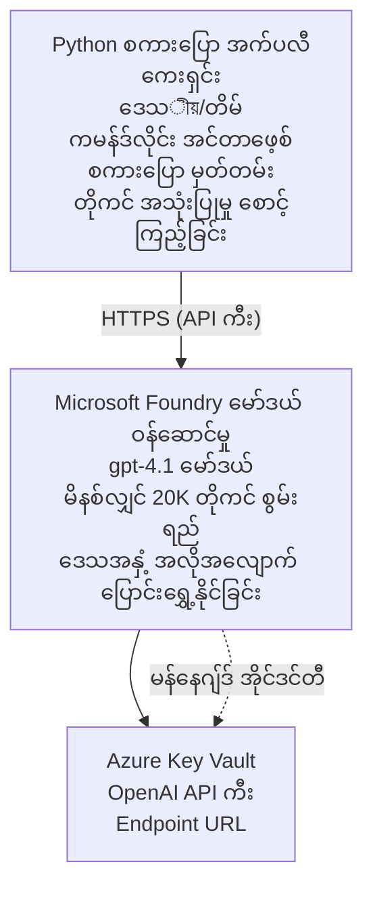

# Microsoft Foundry Models Chat Application

**Learning Path:** အလတ်တန်း ⭐⭐ | **Time:** 35-45 မိနစ် | **Cost:** $50-200/month

Azure Developer CLI (azd) ကို အသုံးပြုပြီး တပ်ဆင်ထားသော Microsoft Foundry Models အပြည့်အစုံရှိ chat application တစ်ခု။ ဤဥပမာသည် gpt-4.1 ကို ဖြန့်ချိခြင်း၊ API ကို လုံခြုံစွာ အသုံးချခြင်းနှင့် ရိုးရှင်းသော chat အင်တာဖေ့စ်တစ်ခုကို ပြသသည်။

## 🎯 သင်ဘာေတြ သင်ယူမလဲ

- gpt-4.1 မော်ဒယ်ဖြင့် Microsoft Foundry Models Service ကို ဖြန့်ချိနည်း
- Key Vault ဖြင့် OpenAI API အချက်အလက်များကို လုံခြုံစွာ သိမ်းဆည်းနည်း
- Python ဖြင့် ရိုးရှင်းသော chat အင်တာဖေ့စ် တည်ဆောက်နည်း
- တိုကင် အသုံးပြုမှုနှင့် ကုန်ကျစရိတ်များကို စောင့်ကြည့်နည်း
- ကုန်ကျစရိတ် မဖြစ်စေဖို့ rate limiting နှင့် error handling ကို အကောင်အထည်ဖော်နည်း

## 📦 ပါဝင်သောအရာများ

✅ **Microsoft Foundry Models Service** - gpt-4.1 မော်ဒယ် ဖြန့်ချိခြင်း  
✅ **Python Chat App** - ရိုးရှင်းသော command-line chat အင်တာဖေ့စ်  
✅ **Key Vault Integration** - API key များကို လုံခြုံစွာ သိမ်းဆည်းခြင်း  
✅ **ARM Templates** - Infrastructure as code အပြည့်အစုံ  
✅ **Cost Monitoring** - တိုကင် အသုံးပြုမှု ချက်ချက်ခြင်း  
✅ **Rate Limiting** - ခွင့်ပြုမာတိကာ သက်သက် မဖြုတ်စေဖို့ ကာကွယ်ခြင်း  

## Architecture


## Prerequisites

### လိုအပ်ချက်များ

- **Azure Developer CLI (azd)** - [Install guide](https://learn.microsoft.com/azure/developer/azure-developer-cli/install-azd)
- **Azure subscription** with OpenAI access - [Request access](https://aka.ms/oai/access)
- **Python 3.9+** - [Install Python](https://www.python.org/downloads/)

### Verify Prerequisites

```bash
# azd ဗားရှင်းကို စစ်ဆေးပါ (1.5.0 သို့မဟုတ် အထက်ဗားရှင်း လိုအပ်သည်)
azd version

# Azure လော့ဂ်အင်ကို အတည်ပြုပါ
azd auth login

# Python ဗားရှင်းကို စစ်ဆေးပါ
python --version  # သို့မဟုတ် python3 --version

# OpenAI ဝင်ရောက်ခွင့်ကို အတည်ပြုပါ (Azure Portal တွင် စစ်ဆေးပါ)
az cognitiveservices account list-skus \
  --kind OpenAI \
  --location eastus
```

> **⚠️ အရေးကြီး:** Microsoft Foundry Models သည် application အတည်ပြုချက် လိုအပ်ပါသည်။ သင်まだ တင်သွင်းကြBuck မဲ့လျှင် [aka.ms/oai/access](https://aka.ms/oai/access) သို့ သွားရောက်လျှောက်ထားပါ။ အတည်ပြုချက်ကို ပုံမှန်အားဖြင့် လုပ်ငန်းနေ့ 1-2 ရက် ကြာသည်။

## ⏱️ Deployment Timeline

| Phase | Duration | What Happens |
|-------|----------|--------------|
| Prerequisites check | 2-3 minutes | OpenAI quota ရရှိနိုင်မှုကို စစ်ဆေးသည် |
| Deploy infrastructure | 8-12 minutes | OpenAI, Key Vault, မော်ဒယ် ဖြန့်ချိချက်များကို ဖန်တီးသည် |
| Configure application | 2-3 minutes | ပတ်ဝန်းကျင်နှင့် အားပေးမှုများကို ပြင်ဆင်သည် |
| **Total** | **12-18 minutes** | gpt-4.1 ဖြင့် chat ပြောဆိုနိုင်ရန် အဆင်သင့် ဖြစ်သည် |

**မှတ်ချက်:** ပထမဆုံး OpenAI ဖြန့်ချိခြင်းတွင် မော်ဒယ် provisioning ကြောင့် အချိန်ပိုတတ်သည်။

## Quick Start

```bash
# ဥပမာကို သွားပါ
cd examples/azure-openai-chat

# ပတ်ဝန်းကျင်ကို စတင်ပြင်ဆင်ပါ
azd env new myopenai

# အားလုံးကို တပ်ဆင်ပါ (အခြေခံအဆောက်အအုံနှင့် ဖွဲ့စည်းမှု)
azd up
# သင်အား အောက်ပါအရာများကို မေးမြန်းလာမည်:
# 1. Azure subscription ကို ရွေးချယ်ပါ
# 2. OpenAI ဝန်ဆောင်မှုရနိုင်သည့် တည်နေရာကို ရွေးချယ်ပါ (ဥပမာ၊ eastus, eastus2, westus)
# 3. တပ်ဆင်မှုအတွက် 12-18 မိနစ် စောင့်ဆိုင်းပါ

# Python အတွက် လိုအပ်ချက်များကို ထည့်သွင်းပါ
pip install -r requirements.txt

# စကားပြော စတင်ပါ!
python chat.py
```

**Expected Output:**
```
🤖 Microsoft Foundry Models Chat Application
Connected to: gpt-4.1 (eastus)
Type your message (or 'quit' to exit)

You: Hello! Tell me about Microsoft Foundry Models.
Assistant: Microsoft Foundry Models Service provides REST API access to OpenAI's powerful language models including gpt-4.1, GPT-3.5-Turbo, and Embeddings...

[Tokens used: 145 | Estimated cost: $0.0044]
```

## ✅ Verify Deployment

### Step 1: Check Azure Resources

```bash
# တပ်ဆင်ပြီးသော အရင်းအမြစ်များကို ကြည့်ပါ
azd show

# မျှော်မှန်းထားသော အထွက်မှာ ဖော်ပြထားသည်:
# - OpenAI ဝန်ဆောင်မှု: (အရင်းအမြစ်အမည်)
# - Key Vault: (အရင်းအမြစ်အမည်)
# - တပ်ဆင်မှု: gpt-4.1
# - တည်နေရာ: eastus (သို့မဟုတ် သင်ရွေးချယ်ထားသော ဒေသ)
```

### Step 2: Test OpenAI API

```bash
# OpenAI endpoint နှင့် key ကို ရယူပါ
OPENAI_ENDPOINT=$(azd env get-value AZURE_OPENAI_ENDPOINT)
OPENAI_KEY=$(azd env get-value AZURE_OPENAI_API_KEY)

# API ခေါ်ဆိုမှုကို စမ်းသပ်ပါ
curl "$OPENAI_ENDPOINT/openai/deployments/gpt-4.1/chat/completions?api-version=2024-08-01-preview" \
  -H "Content-Type: application/json" \
  -H "api-key: $OPENAI_KEY" \
  -d '{
    "messages": [{"role": "user", "content": "Say hello!"}],
    "max_tokens": 50
  }'
```

**Expected Response:**
```json
{
  "choices": [
    {
      "message": {
        "role": "assistant",
        "content": "Hello! How can I assist you today?"
      }
    }
  ],
  "usage": {
    "prompt_tokens": 8,
    "completion_tokens": 9,
    "total_tokens": 17
  }
}
```

### Step 3: Verify Key Vault Access

```bash
# Key Vault ထဲရှိ လျှို့ဝှက်ချက်များကို စာရင်းပြပါ
KV_NAME=$(azd env get-value AZURE_KEY_VAULT_NAME)

az keyvault secret list \
  --vault-name $KV_NAME \
  --query "[].name" \
  --output table
```

**Expected Secrets:**
- `openai-api-key`
- `openai-endpoint`

**Success Criteria:**
- ✅ OpenAI service ကို gpt-4.1 ဖြင့် ဖြန့်ချိထားသည်
- ✅ API ခေါ်ဆိုမှုသည် မှန်ကန်သည့် completion ကို ပြန်လာသည်
- ✅ Secrets များကို Key Vault တွင် သိမ်းဆည်းထားသည်
- ✅ တိုကင် အသုံးပြုမှု စောင့်ကြည့်မှု အလုပ်လုပ်သည်

## Project Structure

```
azure-openai-chat/
├── README.md                   ✅ This guide
├── azure.yaml                  ✅ AZD configuration
├── infra/                      ✅ Infrastructure as Code
│   ├── main.bicep             ✅ Main Bicep template
│   ├── main.parameters.json   ✅ Parameters
│   └── openai.bicep           ✅ OpenAI resource definition
├── src/                        ✅ Application code
│   ├── chat.py                ✅ Chat interface
│   ├── config.py              ✅ Configuration loader
│   └── requirements.txt       ✅ Python dependencies
└── .gitignore                  ✅ Git ignore rules
```

## Application Features

### Chat Interface (`chat.py`)

chat application သည် အောက်ပါများ ပါရှိသည်။

- **Conversation History** - စကားပြောဆက်လက်မှုအကောင်အထည်ကို ထိန်းသိမ်းသည်
- **Token Counting** - အသုံးပြုမှုကို တွက်ချက်ပြီး ကုန်ကျစရိတ် ခန့်မှန်းသည်
- **Error Handling** - rate limits နှင့် API errors များကို ညီညာစွာ ကိုင်တွယ်ပေးသည်
- **Cost Estimation** - မက်ဆေ့ချ်တစ်ခုစီအတွက် အချိန်နှင့်တပြေးညီ ကုန်ကျစရိတ်တွက်ချက်မှု
- **Streaming Support** - ရွေးချယ်၍ streaming ပြန်ကြားချက်များကို ထောက်ပံ့သည်

### Commands

chat ထဲတွင် အောက်ပါ command များကို အသုံးပြုနိုင်သည်။
- `quit` or `exit` - စက်ရုပ်အစည်းအရှုံးကို ရပ်တန့်ရန်
- `clear` - စကားပြောမှတ်တမ်းများကို အလင်းစေ
- `tokens` - စုစုပေါင်း token အသုံးပြုမှုကို ပြရန်
- `cost` - ခန့်မှန်းထားသော စုစုပေါင်းကုန်ကျစရိတ်ကို ပြရန်

### Configuration (`config.py`)

ပတ်ဝန်းကျင်သတ်မှတ်ချက်များမှ configuration ကို ဖြည့်သွင်းသည်။
```python
AZURE_OPENAI_ENDPOINT  # Key Vault မှ
AZURE_OPENAI_API_KEY   # Key Vault မှ
AZURE_OPENAI_MODEL     # ပုံမှန်: gpt-4.1
AZURE_OPENAI_MAX_TOKENS # ပုံမှန်: 800
```

## Usage Examples

### Basic Chat

```bash
python chat.py
```

### Chat with Custom Model

```bash
export AZURE_OPENAI_MODEL=gpt-35-turbo
python chat.py
```

### Chat with Streaming

```bash
python chat.py --stream
```

### Example Conversation

```
You: Explain Microsoft Foundry Models Service in 3 sentences.
Assistant: Microsoft Foundry Models Service is Microsoft Azure's cloud platform offering 
that provides access to OpenAI's powerful language models. It enables developers 
to integrate capabilities like gpt-4.1 into their applications with enterprise-grade 
security and compliance. The service includes features for content filtering, 
abuse monitoring, and responsible AI practices.

[Tokens used: 89 | Estimated cost: $0.0027]

You: What models are available?
Assistant: Microsoft Foundry Models Service offers several model families including gpt-4.1 
(most capable), GPT-3.5-Turbo (faster and cost-effective), and Embeddings models 
for vector search. Each model has different capabilities, pricing, and token limits.

[Tokens used: 67 | Estimated cost: $0.0020]

Total session: 156 tokens | $0.0047
```

## Cost Management

### Token Pricing (gpt-4.1)

| Model | Input (per 1K tokens) | Output (per 1K tokens) |
|-------|----------------------|------------------------|
| gpt-4.1 | $0.03 | $0.06 |
| GPT-3.5-Turbo | $0.0015 | $0.002 |

### Estimated Monthly Costs

အသုံးပြုမှု စတိုင်အပေါ် မူတည်၍ -

| Usage Level | Messages/Day | Tokens/Day | Monthly Cost |
|-------------|--------------|------------|--------------|
| **Light** | 20 messages | 3,000 tokens | $3-5 |
| **Moderate** | 100 messages | 15,000 tokens | $15-25 |
| **Heavy** | 500 messages | 75,000 tokens | $75-125 |

**Base Infrastructure Cost:** $1-2/month (Key Vault + minimal compute)

### Cost Optimization Tips

```bash
# 1. ပိုမိုရိုးရှင်းသော လုပ်ငန်းများအတွက် GPT-3.5-Turbo ကို အသုံးပြုပါ (20 ဆပိုသက်သာပါသည်)
export AZURE_OPENAI_MODEL=gpt-35-turbo

# 2. တုံ့ပြန်ချက်တိုများအတွက် အများဆုံး token အရေအတွက်ကို လျှော့ချပါ
export AZURE_OPENAI_MAX_TOKENS=400

# 3. token အသုံးပြုမှုကို စောင့်ကြည့်ပါ
python chat.py --show-tokens

# 4. ဘတ်ဂျက် သတိပေးချက်များကို သတ်မှတ်ပါ
az consumption budget create \
  --budget-name "openai-budget" \
  --amount 50 \
  --time-grain Monthly
```

## Monitoring

### View Token Usage

```bash
# Azure Portal တွင်:
# OpenAI အရင်းအမြစ် → မက်ထရစ်များ → “Token Transaction” ကို ရွေးပါ

# သို့မဟုတ် Azure CLI ဖြင့်:
az monitor metrics list \
  --resource $(azd env get-value AZURE_OPENAI_RESOURCE_ID) \
  --metric "TokenTransaction" \
  --start-time $(date -u -d '1 hour ago' '+%Y-%m-%dT%H:%M:%S') \
  --interval PT1M
```

### View API Logs

```bash
# ပြဿနာရှာဖွေရေး လော့ဂ်များကို စီးဆင်းခြင်း
az monitor diagnostic-settings create \
  --resource $(azd env get-value AZURE_OPENAI_RESOURCE_ID) \
  --name openai-logs \
  --logs '[{"category": "Audit", "enabled": true}]' \
  --workspace $(azd env get-value LOG_ANALYTICS_WORKSPACE_ID)

# တောင်းဆိုမှု လော့ဂ်များ
az monitor log-analytics query \
  --workspace $(azd env get-value LOG_ANALYTICS_WORKSPACE_ID) \
  --analytics-query "AzureDiagnostics | where Category == 'Audit' | top 10 by TimeGenerated"
```

## Troubleshooting

### ပြဿနာ: "Access Denied" အမှား

**လက္ခဏာများ:** API ကို ခေါ်စဉ် 403 Forbidden ပြန်လာခြင်း

**ဖြေရှင်းနည်းများ:**
```bash
# 1. OpenAI ဝင်ရောက်ခွင့် အတည်ပြုထားကြောင်း စစ်ဆေးပါ
az cognitiveservices account show \
  --name $(azd env get-value AZURE_OPENAI_NAME) \
  --resource-group $(azd env get-value AZURE_RESOURCE_GROUP)

# 2. API key မှန်ကန်ကြောင်း စစ်ဆေးပါ
azd env get-value AZURE_OPENAI_API_KEY

# 3. endpoint URL ပုံစံကို အတည်ပြုပါ
azd env get-value AZURE_OPENAI_ENDPOINT
# အောက်ပါပုံစံဖြစ်ရမည်: https://[name].openai.azure.com/
```

### ပြဿနာ: "Rate Limit Exceeded"

**လက္ခဏာများ:** 429 Too Many Requests ပြန်လာခြင်း

**ဖြေရှင်းနည်းများ:**
```bash
# 1. လက်ရှိ ခွင့်ပမာဏကို စစ်ဆေးပါ
az cognitiveservices account deployment show \
  --name $(azd env get-value AZURE_OPENAI_NAME) \
  --resource-group $(azd env get-value AZURE_RESOURCE_GROUP) \
  --deployment-name gpt-4.1

# 2. လိုအပ်လျှင် ခွင့်ပမာဏ တိုးမြှင့်ရန် တောင်းဆိုပါ
# Azure Portal → OpenAI Resource → Quotas → Request Increase သို့ သွားပါ

# 3. ပြန်လည်ကြိုးစားစနစ်ကို အကောင်အထည်ဖော်ပါ (chat.py တွင် ရှိပြီးသား)
# အပလီကေးရှင်းသည် အလိုအလျောက် exponential backoff နည်းဖြင့် ပြန်လည်ကြိုးစားပါသည်
```

### ပြဿနာ: "Model Not Found"

**လက္ခဏာများ:** deployment အတွက် 404 error လက်ခံရခြင်း

**ဖြေရှင်းနည်းများ:**
```bash
# 1. ရရှိနိုင်သော ချထားမှုများကို စာရင်းပြပါ
az cognitiveservices account deployment list \
  --name $(azd env get-value AZURE_OPENAI_NAME) \
  --resource-group $(azd env get-value AZURE_RESOURCE_GROUP)

# 2. ပတ်ဝန်းကျင်တွင် မော်ဒယ်နာမည်ကို အတည်ပြုပါ
echo $AZURE_OPENAI_MODEL

# 3. မှန်ကန်သော ချထားမှုနာမည်သို့ အပ်ဒိတ်လုပ်ပါ
export AZURE_OPENAI_MODEL=gpt-4.1  # သို့မဟုတ် gpt-35-turbo
```

### ပြဿနာ: ကြာချိန်ကြာနေခြင်း (High Latency)

**လက္ခဏာများ:** တုံ့ပြန်ချိန် များ (>5 seconds)

**ဖြေရှင်းနည်းများ:**
```bash
# 1. ဒေသဆိုင်ရာ နောက်ကျချိန်ကို စစ်ဆေးပါ
# အသုံးပြုသူအနီးဆုံးရှိသော ဒေသသို့ တပ်ဆင်ပါ

# 2. ပိုလျင်မြန်သော ပြန်ကြားမှုများအတွက် max_tokens ကို လျော့ချပါ
export AZURE_OPENAI_MAX_TOKENS=400

# 3. ပိုကောင်းမွန်သော အသုံးပြုသူအတွေ့အကြုံအတွက် streaming ကို အသုံးပြုပါ
python chat.py --stream
```

## Security Best Practices

### 1. API Keys များကို ကာကွယ်ပါ

```bash
# ကီးများကို အရင်းအမြစ် ထိန်းချုပ်မှု (source control) ထဲတွင် ဘယ်တော့မှ commit မလုပ်ပါ။
# Key Vault ကို အသုံးပြုပါ (ပြီးသား ဖွဲ့စည်းထားပြီး)။

# ကီးများကို ပုံမှန်အကြိမ်နှုန်းဖြင့် ပြောင်းလဲပါ။
az cognitiveservices account keys regenerate \
  --name $(azd env get-value AZURE_OPENAI_NAME) \
  --resource-group $(azd env get-value AZURE_RESOURCE_GROUP) \
  --key-name key1
```

### 2. အကြောင်းအရာ စစ်ထုတ်ခြင်း (Content Filtering) ကို အကောင်အထည်ဖော်ပါ

```python
# Microsoft Foundry Models တွင် အကြောင်းအရာ စစ်ထုတ်ခြင်း အင်္ဂါရပ် ပါရှိသည်
# Azure Portal တွင် ပြင်ဆင်ရန်:
# OpenAI အရင်းအမြစ် → အကြောင်းအရာ စစ်ထုတ်များ → စိတ်ကြိုက် စစ်ထုတ်ကိရိယာ ဖန်တီးရန်

# အမျိုးအစားများ: မုန်းဖက်, လိင်ဆိုင်ရာ, အကြမ်းဖက်မှု, ကိုယ်ကိုယ်ထိခိုက်စေခြင်း
# အဆင့်များ: နိမ့်၊ အလယ်၊ မြင့် စစ်ထုတ်မှု
```

### 3. Managed Identity ကို အသုံးပြုပါ (Production အတွက်)

```bash
# ထုတ်လုပ်ရေး ဖြန့်ချိမှုများအတွက် managed identity ကို အသုံးပြုပါ
# API keys များ အစား (Azure ပေါ်တွင် အက်ပ်ကို ဟိုစ့်ထားရန် လိုအပ်သည်)

# infra/openai.bicep တွင် အောက်ပါအတိုင်း ထည့်ပါ:
# identity: { type: 'SystemAssigned' }
```

## Development

### Run Locally

```bash
# လိုအပ်သည့် အထောက်အပံ့ပစ္စည်းများကို ထည့်သွင်းတပ်ဆင်ပါ
pip install -r src/requirements.txt

# ပတ်ဝန်းကျင် ပြောင်းလဲနိုင်သည့် တန်ဖိုးများကို သတ်မှတ်ပါ
export AZURE_OPENAI_ENDPOINT="https://[name].openai.azure.com/"
export AZURE_OPENAI_API_KEY="your-api-key"
export AZURE_OPENAI_MODEL="gpt-4.1"

# အပလီကေးရှင်းကို လည်ပတ်ပါ
python src/chat.py
```

### Run Tests

```bash
# စမ်းသပ်မှု လိုအပ်ချက်များကို ထည့်သွင်းပါ
pip install pytest pytest-cov

# စမ်းသပ်မှုများကို လည်ပတ်ပါ
pytest tests/ -v

# ဖုံးလွှမ်းမှုနှင့်
pytest tests/ --cov=src --cov-report=html
```

### Update Model Deployment

```bash
# မော်ဒယ်၏ မတူညီသော ဗားရှင်းကို တပ်ဆင်ပါ
az cognitiveservices account deployment create \
  --name $(azd env get-value AZURE_OPENAI_NAME) \
  --resource-group $(azd env get-value AZURE_RESOURCE_GROUP) \
  --deployment-name gpt-35-turbo \
  --model-name gpt-35-turbo \
  --model-version "0613" \
  --model-format OpenAI \
  --sku-capacity 20 \
  --sku-name "Standard"
```

## Clean Up

```bash
# Azure အရင်းအမြစ်များအားလုံးကို ဖျက်ပါ
azd down --force --purge

# ဤသည်က အောက်ပါအရာများကို ဖယ်ရှားပါမည်။
# - OpenAI ဝန်ဆောင်မှု
# - Key Vault (၉၀ ရက်အတွင်း ပြန်လည်ရယူနိုင်သော ဖျက်ပစ်မှုပါရှိသည်)
# - အရင်းအမြစ် အစုအဖွဲ့
# - တပ်ဆင်မှုများနှင့် ဖွဲ့စည်းမှုများအားလုံး
```

## Next Steps

### ဤဥပမာကို တိုးချဲ့ပါ

1. **Add Web Interface** - React/Vue frontend တည်ဆောက်ပါ
   ```bash
   # azure.yaml ဖိုင်ထဲသို့ frontend ဝန်ဆောင်မှုကို ထည့်ပါ
   # Azure Static Web Apps သို့ ဖြန့်ချိပါ
   ```

2. **Implement RAG** - Azure AI Search ဖြင့် စာရွက်စာတမ်း ရှာဖွေရေး ထည့်ပါ
   ```python
   # Azure Cognitive Search ကို ပေါင်းစည်းပါ
   # စာရွက်စာတမ်းများကို တင်ပြီး ဗက်တာ အင်ဒက်စ် တစ်ခု ဖန်တီးပါ
   ```

3. **Add Function Calling** - tools အသုံးပြုခွင့် ဖွင့်ပါ
   ```python
   # chat.py ဖိုင်ထဲတွင် လုပ်ဆောင်ချက်များကို သတ်မှတ်ပါ
   # gpt-4.1 သည် ပြင်ပ API များကို ခေါ်နိုင်ရန် ခွင့်ပြုပါ
   ```

4. **Multi-Model Support** - မော်ဒယ်များစွာ ဖြန့်ချိပါ
   ```bash
   # gpt-35-turbo နှင့် embeddings မော်ဒယ်များကို ထည့်ပါ
   # မော်ဒယ်အလိုက် လမ်းကြောင်းရွေးချယ်မှု လောဂစ်ကို အကောင်အထည်ဖော်ပါ
   ```

### ဆက်စပ် ဥပမာများ

- **[Retail Multi-Agent](../retail-scenario.md)** - အဆင့်မြင့် multi-agent အဆောက်အဦ
- **[Database App](../../../../examples/database-app)** - အမြဲတမ်း သိမ်းဆည်းမှု ထည့်ရန်
- **[Container Apps](../../../../examples/container-app)** - containerized service အဖြစ် ဖြန့်ချိရန်

### သင်ယူရန် အရင်းအမြစ်များ

- 📚 [AZD For Beginners Course](../../README.md) - မူလ သင်တန်း မူလစာမျက်နှာ
- 📚 [Microsoft Foundry Models Documentation](https://learn.microsoft.com/azure/ai-services/openai/) - တရားဝင် စာတမ်းများ
- 📚 [OpenAI API Reference](https://platform.openai.com/docs/api-reference) - API အသေးစိတ်
- 📚 [Responsible AI](https://www.microsoft.com/ai/responsible-ai) - အေကောင်းဆုံး လမ်းညွှန်ချက်များ

## အပို အရင်းအမြစ်များ

### Documentation
- **[Microsoft Foundry Models Service](https://learn.microsoft.com/azure/ai-services/openai/)** - ပြည့်စုံသော လမ်းညွှန်ချက်
- **[gpt-4.1 Models](https://learn.microsoft.com/azure/ai-services/openai/concepts/models)** - မော်ဒယ် စွမ်းဆောင်ရည်များ
- **[Content Filtering](https://learn.microsoft.com/azure/ai-services/openai/concepts/content-filter)** - လုံခြုံရေး အင်္ဂါရပ်များ
- **[Azure Developer CLI](https://learn.microsoft.com/azure/developer/azure-developer-cli/)** - azd ကို ပြန်လည်ရှာဖွေစရာ

### Tutorials
- **[OpenAI Quickstart](https://learn.microsoft.com/azure/ai-services/openai/quickstart)** - ပထမဆုံး ဖြန့်ချိခြင်း
- **[Chat Completions](https://learn.microsoft.com/azure/ai-services/openai/how-to/chatgpt)** - chat အက်ပလီကေးရှင်း တည်ဆောက်ခြင်း
- **[Function Calling](https://learn.microsoft.com/azure/ai-services/openai/how-to/function-calling)** - အဆင့်မြင့် လုပ်ဆောင်ချက်များ

### Tools
- **[Microsoft Foundry Models Studio](https://oai.azure.com/)** - เว็บပေါ် playground
- **[Prompt Engineering Guide](https://platform.openai.com/docs/guides/prompt-engineering)** - ပိုကောင်းသော prompt ရေးနည်းများ
- **[Token Calculator](https://platform.openai.com/tokenizer)** - တိုကင် အသုံးပြုမှု ခန့်မှန်းရန်

### Community
- **[Azure AI Discord](https://discord.gg/azure)** - အဖွဲ့အစည်းထဲမှ အကူအညီ ရယူနိုင်သည်
- **[GitHub Discussions](https://github.com/Azure-Samples/openai/discussions)** - မေး & ဖြေ စုံစမ်းမှုပလက်ဖောင်း
- **[Azure Blog](https://azure.microsoft.com/blog/tag/azure-openai-service/)** - နောက်ဆုံး ထုတ်ပြန်ချက်များ

---

**🎉 အောင်မြင်ပါသည်!** သင် Microsoft Foundry Models ကို ဖြန့်ချိပြီး အလုပ်လုပ်နိုင်သော chat application တစ်ခု တည်ဆောက်ပြီးပါပြီ။ gpt-4.1 ၏ စွမ်းရည်များကို စတင် စူးစမ်းပြီး မတူညီသော prompts နှင့် အသုံးချမှုများကို စမ်းသပ်ပါ။

**မေးခွန်းများရှိပါသလား?** [Open an issue](https://github.com/microsoft/AZD-for-beginners/issues) သို့မဟုတ် [FAQ](../../resources/faq.md) ကို ကြည့်ပါ။

**ကုန်ကျစရိတ် သတိပေးချက်:** စမ်းသပ်မှုပြီးဆုံးလျှင် `azd down` ကို chạy ရန် မမေ့ပါနဲ့ ထား၍ ဆက်လက်ခြင်းကြောင့် ကုန်ကျစရိတ် ပျက်မော့ဖို့ (ခန့်မှန်း ~ $50-100/month active usage) သိမ်းထားပါ။

---

<!-- CO-OP TRANSLATOR DISCLAIMER START -->
**Disclaimer**:
ဤစာရွက်စာတမ်းကို AI ဘာသာပြန်ဝန်ဆောင်မှု [Co-op Translator](https://github.com/Azure/co-op-translator) ဖြင့် ဘာသာပြန်ထားပါသည်။ ကျွန်ုပ်တို့သည် တိကျမှန်ကန်စေရန် ကြိုးပမ်းသော်လည်း အလိုအလျောက် ဘာသာပြန်မှုများတွင် အမှားများ သို့မဟုတ် မှန်ကန်မှုနည်းပါးမှုများ ပါဝင်နိုင်ကြောင်း ကျေးဇူးပြု၍ သတိပြုပါ။ မူလစာရွက်စာတမ်းကို မူရင်းဘာသာဖြင့် အာဏာပိုင် အရင်းအမြစ်အဖြစ် သတ်မှတ်ရပါမည်။ အရေးကြီးသော အချက်အလက်များအတွက် လူ့ပရော်ဖက်ရှင်နယ် ဘာသာပြန်မှုကို တိုက်တွန်းပါသည်။ ဤဘာသာပြန်ချက်ကို အသုံးပြုခြင်းကြောင့် ဖြစ်ပေါ်လာသော နားမလည်မှုများ သို့မဟုတ် မမှန်ကန်စွာဖော်ပြမှုများအတွက် ကျွန်ုပ်တို့ တာဝန်မယူပါ။
<!-- CO-OP TRANSLATOR DISCLAIMER END -->